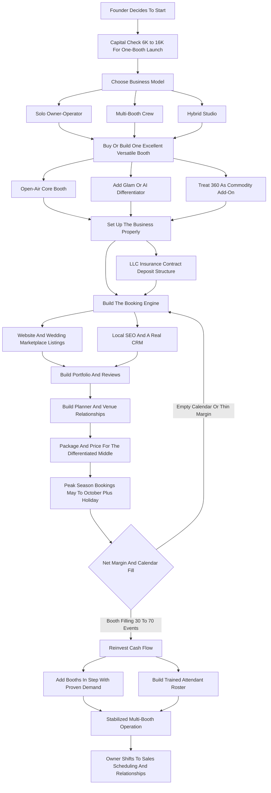

### Direct Answer

To start a photo booth rental business in 2027, you buy or build one to three booths, build a booking-and-marketing engine aimed at weddings, corporate events, and parties, and rent the booths out by the event with a trained attendant on site. A credible one-booth launch costs **$6,000-$16,000 all-in**, a single working booth realistically books **30-70 events per year** at a **$550-$1,100 average ticket**, and a disciplined solo owner-operator nets **$35,000-$95,000** before scaling toward a **$220,000-$420,000** multi-booth crew operation with **$90,000-$170,000 owner profit** by Year 5. The business is genuinely profitable in 2027, but it is a local, weekend-heavy, relationship-driven events business -- not a passive-income play -- and the operator who treats it as "buy a booth, print money" joins the long tail of used-booth listings by spring.

**TL;DR:** Photo booth rental is a low-capital ($6K-$16K) local events business that rents photo and video capture equipment by the event to weddings, corporate functions, and parties. A working booth grosses $18K-$55K at 55-82% margins; a solo operator nets $35K-$95K, a crew operation reaches $220K-$420K revenue by Year 5. The two 2027 realities: the 360 video booth that printed money in 2022-2024 is now saturated and commoditized, and AI photo/video booths are the new differentiator and arms race. The real moat is not the booth -- it is the booking engine, the planner and venue relationships, the reviews, and the operational reliability. Viable and profitable for a differentiated, sales-oriented, weekend-available founder; a poor fit for anyone who wants free Saturdays, hates sales, or believes the passive-income marketing.

## 1. What A Photo Booth Rental Business Actually Is In 2027

### 1.1 The Core Definition

A photo booth rental business owns photo and video capture equipment and rents it out, **by the event**, to people throwing weddings, corporate functions, birthday parties, holiday parties, graduations, bar and bat mitzvahs, quinceaneras, brand activations, and trade shows. The customer is not buying a camera. They are buying an **experience and a stream of shareable content** for their guests, plus, increasingly, a marketing asset for themselves. In 2027 the business has split decisively away from the coin-operated mall-booth image of the past.

A modern photo booth operation is a **service business**: you show up, you set up a booth and a backdrop and a prop table, an attendant runs it for three to five hours, guests step in and get instant prints or instant digital files or short videos, and you tear down and leave. The product the client remembers is the laughter at the booth and the photos in their phone the next morning. The product you actually sell is **reliability, polish, and content quality**.

### 1.2 Why The Framing Determines Everything

The business is fundamentally **local** -- you serve a metro and its suburbs because you physically transport and operate the equipment -- and it is fundamentally **event-driven**, which makes it seasonal, weekend-heavy, and relationship-driven. This framing matters because it dictates every downstream decision: how you price, who you market to, how you staff, and why the booth itself is the least interesting part of the business.

- **Anyone can buy a booth.** The business is the booking engine, the operational reliability, and the relationships that send repeat referrals.
- **The booth is a tool, not a venture.** A founder who internalizes that this is a hospitality-and-events service business that happens to use cameras builds something durable.
- **The hype trap is real.** A founder who buys a 360 booth because a TikTok said it printed money joins the long tail of operators who ran a few events and quietly stopped answering inquiry emails by the following spring.

### 1.3 The Customer Segments At A Glance

| Segment | What They Buy | Price Sensitivity | Seasonality |
|---|---|---|---|
| Weddings | Experience, content, guest delight | Moderate | Peak May-Oct |
| Corporate / activations | Branding, lead capture, reliability | Low | Counter-seasonal |
| Milestone social events | Fun, shareable photos | High | Year-round, lighter |
| Holiday parties | Turnkey entertainment | Moderate | Nov-Dec spike |
| Schools / non-profits | Affordable, simple | Very high | Spring / fall |

This entry treats the model end to end: booth types, the three business models, 2027 market reality, unit economics, startup costs, pricing, lead generation, operations, staffing, the technology stack, and a decision framework.

## 2. The Booth Types: What You Actually Buy And Why

### 2.1 The Full Menu Of Booth Categories

The booth itself is a **category decision, not a single product**. Each type has a different capex, a different labor profile, a different client, and a very different competitive picture in 2027. A founder must understand the full menu before spending a dollar.

- **The open-air booth** -- a camera or iPad on a stand, a light, and a backdrop, with no enclosure -- is the **workhorse of the modern industry**: it photographs groups, it is portable, it suits weddings and corporate equally, and a quality rig runs $2,500-$5,500 to assemble.
- **The enclosed booth** -- the classic curtained box -- is bulkier, heavier, harder to transport, and has fallen out of favor with planners who want the booth visible as part of the room's energy. It still sells in certain markets but it is **not where a new operator should start**.
- **The 360 video booth** -- a platform a guest stands on while a camera arm spins around them, producing a slow-motion social clip -- exploded from 2022 to 2024 and by 2027 is **saturated and commoditized** in most metros.
- **The glam booth** -- a black-and-white, skin-smoothing, beauty-lit photo booth modeled on the celebrity "glambot" look -- commands premium pricing and remains a strong margin product.
- **The mirror booth** -- a full-length interactive mirror -- had its moment and is now a mature, mid-tier product.
- **The AI booth** -- instant AI-generated portraits, AI video clips, generative or themed backdrops -- is the **2027 frontier**: the differentiation, the premium pricing, and the next arms race live here.
- **The roaming or selfie-stick setup** -- an untethered handheld unit an attendant carries through a crowd -- suits corporate activations and large venues.

### 2.2 Booth Type Competitive Status In 2027

| Booth Type | Capex | 2027 Competitive Status | Right For New Operator? |
|---|---|---|---|
| Open-air | $2,500-$5,500 | Workhorse core, widest event range | Yes -- the launch booth |
| Enclosed | $3,000-$6,000 | Out of favor with planners, bulky | No |
| 360 video | $4,000-$8,000 | Saturated, commoditized, prices compressed | Commodity add-on only |
| Glam | $5,000-$9,000 | Durable premium product, strong margin | Yes -- as differentiator |
| Mirror | $4,000-$7,000 | Mature mid-tier product | Optional |
| AI booth | $5,000-$9,000+ | The 2027 frontier, premium pricing | Yes -- as differentiator |
| Roaming / selfie | $1,500-$4,000 | Niche, corporate-leaning | Optional add-on |

### 2.3 The Strategic Booth Decision

The strategic point: a new operator in 2027 should **start with a versatile open-air booth as the core**, then add a **glam or AI capability** as the differentiator, and treat the **360 as a commodity add-on** rather than the foundation. Building the business on the 360 -- the most common 2025-2026 mistake -- means building on the most price-competed product in the category. Operators in adjacent rental categories make the same equipment-versus-engine error, a pattern explored in the party rental playbook (q1965).

## 3. The Three Business Models

### 3.1 The Solo Owner-Operator Model

**The solo owner-operator model** is one to three booths run by the founder, who is the salesperson, the attendant, the editor, and the bookkeeper. It is the lowest-capital, lowest-risk entry, it can be run alongside a job in Year 1, and a disciplined solo operator nets **$35,000-$95,000** working part-time-to-full-time. Its ceiling is the founder's own weekends -- you can only be at one event at a time.

### 3.2 The Multi-Booth Crew Model

**The multi-booth crew model** runs five to ten-plus booths with hired, trained attendants, so multiple events run on the same Saturday night. The founder shifts from running booths to running a roster, a schedule, and a sales pipeline, and revenue scales to **$180,000-$420,000** with owner profit of **$70,000-$160,000** by Year 3-5. Its challenge: it is a real business with payroll, scheduling, training, and quality-control problems, and the margin per event is lower because attendants are paid.

### 3.3 The Hybrid Studio Model

**The hybrid studio model** layers photo booth rental onto an existing event-services business -- a photography studio, a DJ company, an event-planning shop, a videographer. The booth is an upsell to a client base you already own and a marketing channel that feeds the core business. Its advantage is near-zero customer-acquisition cost and immediate cross-sell; its challenge is that it is not a standalone path for someone without the adjacent business. The wedding photography model (q1949) is the most common adjacent base for a hybrid studio.

### 3.4 Model Comparison

| Dimension | Solo Owner-Operator | Multi-Booth Crew | Hybrid Studio |
|---|---|---|---|
| Booths | 1-3 | 5-10+ | 1-3 add-on |
| Staffing | Founder only | Trained attendant roster | Existing staff |
| Capital | $6K-$28K | $40K-$120K+ | Marginal |
| Revenue ceiling | Founder's weekends | $220K-$420K | Tied to core business |
| Owner profit | $35K-$95K | $90K-$170K | High-margin add-on |
| Main challenge | Time / weekend ceiling | Payroll, scheduling, QC | Needs adjacent business |

Most successful standalone operators start solo to prove the booking engine and the local relationships, then graduate to the crew model once the pipeline is reliably larger than the founder's own weekend capacity. The wrong move is launching straight into a five-booth crew operation before you have proven you can fill a single booth's calendar -- that is buying a payroll problem before you have solved a demand problem.

## 4. The 2027 Market Reality

### 4.1 Demand Is Real And Broad

A founder needs an accurate read of the 2027 landscape, because the photo booth business is neither the easy-money play it was marketed as in 2023 nor a dead category. **Demand is durable.** Weddings remain the anchor -- a large share of US weddings include a photo booth, and the wedding calendar normalized into a healthy, predictable volume. **Corporate demand** -- holiday parties, conferences, product launches, brand activations, trade-show booths -- is the higher-ticket, less-seasonal complement. Social events (milestone birthdays, anniversaries, graduations, mitzvahs, quinceaneras, retirement parties) fill the rest.

### 4.2 The Supply Side Is Saturated

**The supply side is saturated.** The low capital barrier and the 2022-2024 hype cycle flooded most metros with operators, many part-timers with a single 360 booth bought off a marketplace. The result: the bottom of the market is a crowded price war where the 360-only operator competes on being the cheapest quote.

### 4.3 What Changed By 2027

- **The 360 went from differentiator to commodity.** Every operator has one; prices compressed.
- **AI features became the new premium layer.** AI portraits, AI video, generative backdrops -- operators who invested pulled ahead on price and pitch.
- **Instant digital delivery is now expected.** A text or AirDrop of the photo on the spot, plus a branded online gallery -- not only paper prints.
- **Social sharing is the implicit product.** Content quality and shareability became the real spec.
- **Planners and venues lean harder on trusted operators.** Overwhelmed by the long tail of cheap operators, they consolidate around the few they trust.

The net market reality: demand is durable and the business is genuinely profitable, but the easy money is gone. The 2027 winner is the operator with the differentiated booth mix, the planner and venue relationships, the reviews, and the reliability to charge a real price and fill a calendar.

## 5. The Core Unit Economics: Events Per Booth

### 5.1 The Single Most Important Calculation

This is the most important calculation in the business, and the one beginners skip. Every booth you own has an **events-per-year** number -- how many separate bookings it fills in twelve months -- and that number, multiplied by the average ticket, against the booth's capex and the per-event variable cost, tells you whether the booth is an asset or an expensive hobby.

The realistic ranges: a working booth in a healthy local operation books **30-70 events per year**, with the spread driven almost entirely by the **strength of the booking engine and the relationships**, not by the booth itself.

### 5.2 Per-Booth Unit Economics

| Metric | Range | Notes |
|---|---|---|
| Booth capex (open-air) | $2,500-$5,500 | Buy turnkey or self-build |
| Booth capex (360 / glam / AI) | $4,000-$9,000 | Higher-end differentiated rigs |
| Events per booth per year | 30-70 | Driven by booking engine, not the booth |
| Year 1 part-time solo | 20-35 events | Thin pipeline, building portfolio |
| Well-marketed booth | 50-70 events | Strong listings, planner relationships, reviews |
| Average ticket | $550-$1,100 | By market, booth type, package, add-ons |
| Per-event variable cost | $90-$250 | Attendant, prints, media, software, travel |
| Gross margin (owner-run) | 70-82% | Owner is the attendant |
| Gross margin (crew-run) | 55-68% | Paid trained attendant |
| Capex payback | Within first season | Low capital intensity is the appeal and the saturation cause |

### 5.3 Running The Math

A part-time solo operator in Year 1 with a thin pipeline may fill **20-35 events**; a well-marketed operator with planner relationships and strong reviews fills **50-70 events per booth**. The calendar is heavily concentrated in the May-October wedding season and the November-December holiday-party stretch, so "70 events" really means roughly 45-55 land in those two windows.

Run the math on a single open-air booth: **45 events at a $750 average ticket grosses $33,750**. The per-event variable cost runs roughly $90-$250, so even with a paid attendant the booth nets in the $24,000-$28,000 range, and an owner-run booth nets well above $30,000. The capex of $2,500-$5,500 is recovered inside the first season.

The discipline this imposes: **before adding a booth, you must know your realistic events-per-year and average ticket**, because a second booth that only fills 15 events is a worse use of capital than marketing to push the first booth from 35 events to 60. The detailed pricing math behind the average ticket is broken down in the photo booth pricing deep dive (q1161). The number that makes or breaks this business is not the booth's price tag; it is how many Saturdays you can fill it.

## 6. The Line-By-Line P&L

### 6.1 The Per-Event Cost Stack

Beyond events-per-year, a founder must internalize the per-event P&L. Take a representative four-hour wedding booking at an **$850 ticket**. The costs stack in this order:

- **Attendant labor** -- a trained attendant for the event plus setup, teardown, and travel runs $90-$180 loaded; the largest variable cost in a crew operation, zero in an owner-run one.
- **Prints and consumables** -- photo paper, ink or dye-sub media, USB drives, digital-delivery costs -- $20-$70 depending on print volume.
- **Software and platform fees** -- per-event or subscription cost for booth software, the online gallery, the AI features -- $10-$50 per event.
- **Travel** -- fuel and vehicle wear for the round trip plus setup time -- $15-$60.
- **Props and backdrop wear** -- a small but real per-event amortization.
- **Damage and equipment reserve** -- iPads crack, printers jam and die, ring lights break; a real 3-6% of revenue should be reserved.

### 6.2 Per-Event P&L (Representative $850 Four-Hour Wedding)

| Line | Amount |
|---|---|
| Ticket | $850 |
| Attendant labor (crew operation; $0 if owner-run) | $90-$180 |
| Prints and consumables | $20-$70 |
| Software and platform fees | $10-$50 |
| Travel (fuel, vehicle wear) | $15-$60 |
| Props / backdrop wear | small per-event amortization |
| Equipment reserve | 3-6% of revenue |
| Net margin (owner-run) | 70-82% |
| Net margin (crew-run) | 55-68% |

### 6.3 The Annual Business P&L

At the business level, the annual P&L adds the fixed overhead -- insurance, the booth-software subscriptions, marketing and listing fees, storage if the fleet outgrows a closet, an accountant, and the founder's own time. The **seasonality dominates the annual shape**: the May-October wedding season and the November-December holiday stretch generate the large majority of annual revenue, while January-March is genuinely thin.

The founders who fail the P&L test almost always made one of two errors: they competed so hard on price that the ticket could not absorb the attendant and consumable costs, or they treated equipment as a one-time purchase and got crushed when two printers and an iPad failed in the same quarter with no reserve.

## 7. Choosing And Building Your Booth

### 7.1 The Three Acquisition Paths

With the economics framed, a founder needs a concrete plan for acquiring the first booth, and there are three real paths.

1. **Buy a turnkey commercial booth** from an established manufacturer -- the rig arrives configured, supported, and ready, the software is integrated, and you are operating in days. The fastest and most reliable path and the right choice for most non-technical founders, at a higher price point.
2. **Build your own open-air rig** from a professional camera or high-end iPad, a quality ring or strobe light, a sturdy stand, a printer, and a software subscription. Meaningfully cheaper, full control, viable for a technical founder -- but you own the integration and troubleshooting.
3. **Buy a used booth** from one of the many operators exiting the business. The 2022-2024 hype cycle produced a steady supply of barely-used 360 and open-air booths on the secondhand market at a fraction of new cost -- a genuinely smart way to acquire capacity cheaply if you inspect carefully.

### 7.2 Core Spec Priorities

| Spec Priority | Why It Matters |
|---|---|
| Image and video quality | This is the product -- mediocre content does not get shared |
| Reliability and ease of setup | A booth that fails or takes an hour costs reviews and referrals |
| Instant digital delivery built in | 2027 clients expect the photo on their phone immediately |
| Software platform with AI and branding | The features that differentiate you live in the software |
| Dye-sublimation printer | Industry standard for speed and durability |
| Transportability | You physically move it to every event |

### 7.3 The Two Temptations To Resist

A founder should resist two temptations: **over-buying at launch** (a five-booth fleet before a single calendar is full) and **under-buying on quality** (a cheap rig that produces mediocre images that do not get shared and do not get you referred). Buy or build one excellent, versatile, reliable booth, prove you can fill its calendar, and let the cash flow fund the second.

## 8. The Startup Cost Breakdown

### 8.1 The Honest All-In Number

A founder needs a clear-eyed total of what it actually costs to launch, because the photo booth business is genuinely low-capital -- which is both its appeal and the reason the market is saturated.

| Item | Range (One-Booth Launch) |
|---|---|
| Booth (turnkey or self-built open-air) | $2,500-$6,500 |
| Dye-sublimation printer + initial media | $700-$1,800 |
| Props, backdrops, prop table | $400-$1,200 |
| Booth software + platform subscriptions (first months) | $200-$800 |
| Insurance (general liability + equipment, first payment) | $300-$900 |
| Business formation, licensing, contracts | $200-$1,000 |
| Website, sample-gallery photography, marketplace listings | $600-$3,000 |
| Laptop/tablet, cables, lighting spares, transport case | $400-$1,500 |
| Initial marketing (styled shoots, content, early ad spend) | $300-$1,500 |
| Working-capital cushion | $500-$2,000 |
| **Total (one-booth launch)** | **$6,000-$16,000** |
| **Total (two-booth launch)** | **$12,000-$28,000** |

### 8.2 Why The Capital Is Not The Moat

A credible **one-booth launch comes in around $6,000-$16,000 all-in**, and a **two-booth launch runs $12,000-$28,000**. This is genuinely accessible capital -- a fraction of what a catering operation (q1980) or a wedding venue (q1968) needs -- and that is precisely why the founder must understand that **the capital is not the moat**. Almost anyone can afford to buy a booth. The barrier to a real business is the booking engine, the relationships, the reviews, and the reliability that come after the purchase. The honest framing: budget $6K-$16K to start, but understand that the money buys you the right to compete, not a position in the market.

## 9. Pricing And Packaging In A Saturated Market

### 9.1 Why Most New Operators Lose On Price

Pricing is where most new operators quietly lose, because the saturated bottom of the market trains founders to compete on being the cheapest quote -- and the cheapest quote is a trap that cannot absorb costs or fund growth. The disciplined approach builds **packages, not hourly rates**.

### 9.2 The Package Ladder

| Package | Hours | Includes | Role |
|---|---|---|---|
| Basic | 3 hrs | Open-air booth, standard backdrop, digital delivery, basic props | Respectable entry, not bargain-bin |
| Standard | 4 hrs | Premium backdrop, prints + digital, wider props, branded template | The volume seller |
| Premium | 5 hrs | Glam or AI booth, custom backdrop, guest book, full-time attendant, custom branding, same-day gallery | The margin product |
| Corporate | Custom | Branding, lead capture, flawless reliability, turnkey setup | Separate higher rate card |

### 9.3 Add-Ons And The Corporate Premium

**Add-ons** are where the ticket grows without re-competing on base price: extra hours, a second booth type at the same event, custom backdrops, guest books, branded prints and overlays, themed props, idle-time setup-early fees, and travel surcharges for distant venues. **Corporate pricing runs higher than social** for the same hours -- the corporate buyer values branding, lead capture, and reliability over price.

**What not to do:** do not publish a single low hourly number that anchors every conversation at the bottom; do not "throw in" the things that cost you money; and do not match the cheapest 360-only operator in your inbox -- you are not selling the same thing. The pricing principle for 2027: **package the experience, charge for the differentiation, let add-ons grow the ticket, and let the cheap operators have the clients who only care about price** -- they are not profitable clients for anyone.

## 10. Lead Generation: The Engine Of The Business

### 10.1 The Channels In Priority Order

Filling a booth's calendar is a marketing-and-relationships problem far more than an equipment problem. The channels, in rough order of importance for a new operator:

- **Wedding marketplaces** -- the major online platforms where engaged couples shop vendors -- are the primary direct-inquiry channel; a strong, well-reviewed listing with excellent sample galleries generates steady inquiry flow.
- **Wedding planners and coordinators** are the highest-value relationship -- a planner specifies vendors for every wedding they run, becoming a stream of pre-qualified, less-price-sensitive bookings.
- **Venues** are the second pillar -- event venues are asked "who do you recommend?" and getting onto a preferred-vendor list is a durable, repeating booking source.
- **Other event vendors** -- photographers, DJs, caterers, florists, videographers -- form a referral web.
- **Social media** -- a feed of real event content -- is both a portfolio and a discovery channel, and the natural showcase for AI and glam differentiation.
- **Google Business Profile and local SEO** capture couples and party hosts searching directly.
- **Styled shoots and bridal shows** build planner and venue relationships and produce portfolio content.
- **Repeat corporate accounts** compound over time.

### 10.2 Channel Economics

| Channel | Acquisition Cost | Lead Quality | Time To Build |
|---|---|---|---|
| Wedding marketplaces | Medium (paid placement) | Good | Fast |
| Wedding planners | Low (relationship time) | Excellent, pre-qualified | Slow |
| Venue preferred lists | Low (relationship time) | Excellent, repeating | Slow |
| Vendor referral web | Low | Good | Medium |
| Social media | Low (content time) | Variable | Medium |
| Local SEO / GBP | Low-medium | Good direct intent | Medium |
| Corporate / agencies | Medium (sales effort) | Excellent, high-ticket | Slow |

### 10.3 The Year-One Versus Year-Two Strategy

A new operator leans on the **marketplaces and local SEO** for direct inquiries in Year 1 while patiently building the **planner and venue relationships** that become the durable, defensible job flow by Year 2-3. The operator with no relationships competes on price forever; the operator with a planner and venue web has a calendar that fills itself. The same vendor referral web feeds adjacent operators -- balloon decor (q2149), catering, and DJs all work the same weddings.

## 11. Reviews, Reputation, And Content Quality

### 11.1 Reviews Are The Conversion Currency

In the photo booth business the product is shareable content and the proof is reviews. **A couple shopping a marketplace listing is choosing between operators they have never met**, and the review count and rating are the single biggest trust signal. A deliberate, systematic process for requesting a review after every event -- timed well, made easy -- is one of the highest-leverage activities in the business.

### 11.2 The Content Is The Marketing

Every event generates photos and clips that, if genuinely good, get shared by guests across social platforms -- each share a small free advertisement. If they are mediocre, they are forgotten. This is why the booth's image and video quality is **not a vanity spec** -- it is the difference between an event that markets you and an event that does not.

### 11.3 Experience And Delivery

- **The on-site experience builds the reputation.** A professional, friendly attendant who keeps the booth running and refreshes the props is the experience the client tells planners about.
- **The branded gallery and delivery** -- a fast, clean, branded online gallery -- is both a service the client values and a marketing surface that puts your name in front of every guest.
- **The throughline:** a founder who obsesses over content quality, the on-site experience, and the systematic gathering of reviews builds a reputation that compounds into self-sustaining referral flow.

## 12. Operations: The Event-Day Workflow

### 12.1 The Arc Of Every Event

The event day is the operational core, and a founder who has not designed the workflow will deliver an inconsistent experience.

| Phase | Key Tasks |
|---|---|
| Pre-event | Confirm details with client and venue, prepare and test equipment, load props/backdrop, template branding |
| Load-in and setup | Arrive with buffer, set up booth/backdrop/lighting/props, connect power, test camera/printer/software/delivery, run before guests arrive |
| During the event | Attendant runs the booth, encourages guests, manages props, troubleshoots instantly, keeps the line moving |
| Teardown | Break down quickly and cleanly, leave the space as found, confirm with client |
| Post-event | Deliver branded gallery promptly, send digital files, request review, log the event |

### 12.2 Equipment Discipline

Behind all of this sits equipment discipline -- a pre-event checklist, spare cables and media, a backup plan for a printer or iPad failure, and regular maintenance. The operators who run a designed, checklisted, backup-planned workflow deliver a consistent experience that earns reviews; the ones who improvise eventually have the event where the printer dies mid-event -- and that becomes a bad review that costs more than it earned.

## 13. Staffing And Building An Attendant Team

### 13.1 The Attendant Is The Brand

A solo operator is their own attendant, but the business does not scale past the founder's weekends without a team. **The attendant is the client-facing face of the business** -- they run the booth, manage the experience, troubleshoot, and represent the brand -- so attendant quality directly drives reviews.

### 13.2 The Staffing Challenge

The work is **part-time, weekend-concentrated, and seasonal**: the operation needs a roster of trained, reliable attendants available on Friday and Saturday nights during the May-October and holiday peaks, and far less work in winter. Most operators build a pool of part-time attendants -- students, people with weekday jobs wanting weekend income, returning seasonal staff -- and pay per event plus travel.

- **Training is the differentiator** -- an attendant must set up and break down the booth, run the software, troubleshoot common failures, manage props and the line, and carry themselves professionally; a documented training process turns a new hire into a reliable attendant.
- **Scheduling is the constraint** -- weddings cluster on Saturdays, and a crew operation succeeds or fails on whether it has enough trained attendants to cover colliding bookings.
- **The coordinator layer** -- as the business grows, the founder adds a lead attendant or operations coordinator to handle scheduling, training, and equipment, freeing the founder for sales and relationships.

The move from solo operator to crew operation is fundamentally a staffing-and-training problem, and the founders who scale well built a deliberate recruiting and training system rather than scrambling for a warm body every Saturday.

## 14. The Software And Technology Stack

### 14.1 The Stack Layers

In 2027 a photo booth operation runs on software, and a founder should choose the stack deliberately because it shapes both the product and the operations.

| Stack Layer | Function | Why It Matters |
|---|---|---|
| Booth software | Capture, on-screen experience, print templating, delivery, branding | The most important software choice |
| AI layer | Instant AI portraits, AI video, generative backgrounds | The 2027 differentiator; carries per-event cost |
| Online gallery / delivery | Branded gallery, instant text / AirDrop on site | A 2027 client expectation |
| Booking and CRM | Inquiries, quotes, contracts, e-signatures, deposits, calendar | Lets a small operation handle a real pipeline |
| Website / online booking | Packages, galleries, availability, inquiry flow | The storefront |
| Payment processing | Deposits, balances, automated reminders | Cash discipline |

### 14.2 The Discipline

Choose a reliable booth software platform with the AI capability you intend to sell, adopt a real booking-and-CRM system early so inquiries do not leak, and treat the branded gallery and instant delivery as non-negotiable 2027 features. The operator running a tight digital stack converts more inquiries and drops fewer leads than the one managing bookings in a notes app and texting photos manually.

## 15. Insurance, Contracts, And Legal Structure

### 15.1 The Legal Checklist

The photo booth business carries specific legal and risk exposures, and the 2027 operator handles each deliberately.

- **General liability insurance is non-negotiable** -- nearly every venue requires the operator to carry it and name the venue as additionally insured before load-in.
- **Equipment insurance** covers the booth, cameras, printers, and laptops against damage and theft.
- **The rental contract is the operator's protection** -- it specifies the date, times, location, package and add-ons, price and payment schedule, deposit, cancellation and rescheduling terms, liability and damage provisions, and the client's responsibilities.
- **The deposit-and-payment structure** -- a non-refundable deposit to hold the date and a balance due before the event -- protects against late cancellations and no-pays.
- **The business entity** -- most operators form an LLC for liability protection and tax flexibility.
- **Sales tax** on rentals applies in many jurisdictions and must be collected and remitted correctly.
- **Licensing and permits** vary by locality.
- **Music and image rights** -- using licensed music in video products and respecting guests' images -- is a quiet consideration.

### 15.2 Why The Paperwork Pays

None of this is glamorous, but the operator who skips it is one cancelled wedding or one venue-required certificate of insurance away from a problem that costs far more than the paperwork ever would. Carry general liability and equipment coverage from day one, never work an event without a signed contract and a paid deposit, form the LLC, and handle sales tax correctly.

## 16. The Five-Year Revenue Trajectory

### 16.1 The Year-By-Year Arc

| Year | Booths | Events | Revenue | Owner Profit | Focus |
|---|---|---|---|---|---|
| Year 1 | 1-2 | 20-45 | $15K-$45K | $10K-$32K | Foundation: listings, reviews, portfolio, first relationships |
| Year 2 | 2-3 | 50-100 | $45K-$110K | $30K-$75K | Listings mature, first attendants, glam/AI added |
| Year 3 | 3-6 | -- | $110K-$240K | $55K-$120K | Real small business, CRM, attendant roster |
| Year 4 | 4-8 | -- | $170K-$340K | $70K-$150K | Deeper corporate accounts, stronger differentiation |
| Year 5 | 5-10+ | -- | $220K-$420K | $90K-$170K | Mature crew operation, coordinator, managerial owner |

### 16.2 What The Numbers Assume

These numbers assume disciplined pricing, real relationship-building, content-quality obsession, and reinvestment of cash flow into booths and differentiation. They do not assume exponential growth, because the business scales with **booth count, attendant capacity, and the strength of the local relationship base** -- not magically. A mature photo booth operation is a real, modestly-capitalized local events business with a genuinely good owner income, earned through years of booking-engine and reputation work.

## 17. Five Named Real-World Operating Scenarios

### 17.1 Scenario One -- Priya, The Disciplined Solo Operator

Priya launches with **$11K** into one excellent open-air booth plus a glam capability, builds strong marketplace listings, works three styled shoots for portfolio content, and systematically requests a review after every event. She books 38 events in Year 1 at a building ticket, reinvests into a second booth and an AI feature, and by Year 3 runs four booths with two part-time attendants at **$190K revenue** -- having competed on content quality and reviews, not price.

### 17.2 Scenario Two -- Marcus, The Cautionary Tale

Marcus spends **$9K** on a single 360 video booth in 2026 because he saw the revenue claims online, lists himself as the cheapest 360 in the metro, and competes entirely on price. He books a handful of events at margins too thin to absorb his costs, never builds reviews or relationships, burns out on weekend work that barely paid, and lists the booth used by the following spring.

### 17.3 Scenario Three -- The Okafor Sisters, The Multi-Booth Crew

The Okafor sisters start solo, prove the booking engine over two years, then deliberately build a crew operation -- six booths, a roster of eight trained attendants, a CRM, and a coordinator -- so they run four events on a peak Saturday. By Year 4 they are at **$310K revenue** with **$130K owner profit**, managing the schedule and the sales pipeline rather than running booths.

### 17.4 Scenario Four -- Dani, The Hybrid Studio

Dani already runs a wedding photography studio, adds a photo booth as an upsell to an existing client base, books it at near-zero acquisition cost into weddings already on the calendar, and uses the booth content as a marketing channel that feeds the photography business. The booth is a high-margin add-on, not a standalone venture.

### 17.5 Scenario Five -- Trevor, The Seasonality Casualty

Trevor has a solid Year-1 wedding season grossing **$40K**, assumes that pace continues, takes on a vehicle payment and overhead sized to peak-season revenue, and is caught flat in the January-March trough with fixed costs and no bookings -- the canonical illustration of mistaking the peak for the average.

## 18. The Seasonality Problem And How To Manage It

### 18.1 The Seasonal Shape

| Period | Activity | Revenue Share |
|---|---|---|
| May-October | Wedding season -- the core | Majority |
| November-December | Holiday-party stretch -- second peak | Significant |
| January-March | Genuinely thin -- few corporate events, occasional winter party | Small |
| April | Ramp-up into wedding season | Building |

### 18.2 The Four Things To Do With Seasonality

- **Treat the peak as the engine, not the average** -- the income earned in a packed June funds the quiet February; the seasonality casualty sizes overhead to peak-season revenue.
- **Pursue counter-seasonal demand** -- corporate events, conferences, and brand activations are less wedding-season-bound; winter galas and fundraisers fill the gap.
- **Use the slow months productively** -- January-March is the time for portfolio work, listing improvement, relationship-building, equipment maintenance, attendant recruiting, and AI investments.
- **Manage the cash deliberately** -- bank peak-season cash to carry the thin months rather than spending it as it arrives.

The operators who manage seasonality well treat the business as an eight-month-on, four-month-build annual cycle; the ones who fail spend the peak as if it were the steady state and are surprised, every year, by a winter they could see coming.

## 19. Differentiation In 2027: AI, Glam, And The Content Arms Race

### 19.1 The Differentiation Levers

A founder launching in 2027 into a saturated market must have a clear differentiation strategy, because the undifferentiated operator competes on price forever at the crowded bottom.

- **AI features are the current frontier** -- instant AI-generated portraits that restyle a guest into themed looks, AI video clips, generative backgrounds; these command premium pricing and produce the novel shareable content guests actually post.
- **The glam booth** -- the beauty-lit, skin-smoothing, celebrity-style photo -- is a proven, durable premium product especially for weddings and upscale events.
- **Content quality and shareability** -- genuinely excellent images and clips, fast branded galleries, instant delivery -- is itself a differentiator in a market where the long tail produces mediocre output.
- **The on-site experience** -- a polished, well-trained attendant and a beautifully styled booth -- differentiates on the thing planners remember.
- **Custom and themed everything** -- custom backdrops, branded overlays, themed props -- sells a tailored experience rather than a generic booth.
- **The 360 is no longer a differentiator** -- it is a commodity add-on every operator carries.

### 19.2 The Strategic Point

A 2027 operator should lead the pitch with AI capability, a glam or premium product, demonstrable content quality, and a polished experience, and treat the 360 as something they **have** rather than something they **sell**. The caveat: the AI tooling and its per-event costs are still moving fast, so the operator must keep current and price the software cost in. The content arms race is real, and the operator who is not investing in differentiation is, by default, competing on price.

## 20. Corporate Events: The Higher-Ticket, Less-Seasonal Complement

### 20.1 Why Corporate Matters

A founder should understand the corporate segment specifically, because it is the higher-margin, less-seasonal complement to the wedding core and many operators under-pursue it. **Corporate demand is broad** -- holiday parties, conferences, product launches, brand activations, trade-show booths, employee-appreciation events, grand openings.

### 20.2 What The Corporate Buyer Values

The corporate buyer values **branding** (logo and message on every photo), **lead capture and data** (collecting guest emails at activations), **reliability and professionalism**, and a **turnkey, low-hassle experience**. Crucially, the corporate buyer is **far less price-sensitive** than the wedding couple because the booth is a marketing expense, not a personal budget line. This means corporate events command higher tickets for the same hours and should have their own, higher rate card.

### 20.3 The Corporate Sales Motion

The corporate sales motion runs through marketing agencies, event production companies, corporate event planners, and direct relationships with company marketing and HR teams -- not through wedding marketplaces. **Corporate accounts compound** -- a company that books the booth for its holiday party and a product launch becomes a repeat account. The same buyers commission corporate catering (q9600) and event coffee carts (q9602) for the same activations, so a corporate relationship cross-feeds the whole vendor web. Corporate is not a different business; it is the half of the same business that most operators neglect.

## 21. Scaling Past The First Booth And Adjacent Services

### 21.1 The Scaling Prerequisite

The jump from a proven one-booth solo operation to a multi-booth crew business is its own distinct challenge. The **prerequisite for scaling** is a booking engine that reliably produces more demand than the founder's own weekends can serve -- if the first booth's calendar is not full, the answer is more marketing, not more booths.

### 21.2 The Scaling Levers And Constraints

| Scaling Lever | Constraint It Solves |
|---|---|
| Add booths in step with proven demand | Demand must justify the capex |
| Build the attendant roster | Attendant capacity for colliding Saturdays |
| Add booth types (glam, AI, second booth) | Differentiation and ticket lift |
| Adopt operational systems (CRM, SOPs, maintenance) | Pipeline leakage and fleet reliability |
| Build the relationship base | Self-sustaining referral flow |
| Add the coordinator layer | The founder's own time and attention |

### 21.3 Adjacent Services

The photo booth pairs naturally with a range of event offerings: **photography and videography**, **DJ and entertainment**, **event rentals** (backdrops, lighting, decor), **audio guest books**, **custom signage and neon**, and **event planning**. Every adjacent service shares the booth's customer, channels, and seasonality. The caution: adjacent services should be added **after the booth business is proven and stable**, not as a scattered launch. The mature move is to prove the booth, then deliberately layer the adjacent services into a hybrid event-services business where the photo booth is the anchor. The pet photography model (q2060) is one such adjacency for an operator with the photo skill base.

## 22. Common Year-One Mistakes That Kill The Business

### 22.1 The Consistent Failure Modes

A founder can avoid most failure modes simply by knowing them in advance.

- **Building the business on the 360 booth** -- launching with the most saturated, most price-competed product as the foundation.
- **Competing on being the cheapest quote** -- winning price-shopping clients at margins too thin to absorb costs.
- **Launching with no marketing plan** -- buying the booth and expecting the bookings to arrive; the single most common reason new operators conclude "it does not work."
- **Neglecting reviews** -- starving the conversion currency the whole marketplace channel runs on.
- **Ignoring content quality** -- a cheap rig that produces unshareable images.
- **Skipping the contract and deposit** -- leading to cancellations, scope disputes, and unpaid balances.
- **Working without general liability insurance** -- being unable to work the venues that generate the bookings.
- **No equipment backup plan** -- one printer, one iPad, no spares.
- **Mistaking the peak for the average** -- causing the January-March cash crunch.
- **Over-buying at launch** -- a multi-booth fleet before a single calendar is full.
- **Ignoring the corporate segment** -- leaving the higher-margin, less-seasonal revenue on the table.
- **Treating attendants as warm bodies** -- no training system, inconsistent on-site experience.

Every one of these is avoidable; the founders who fail almost always made several, and the founders who succeed treated this list as a pre-launch checklist.

## 23. A Decision Framework: Should You Actually Start This In 2027

### 23.1 The Structured Self-Assessment

| Test | The Question | Fail Consequence |
|---|---|---|
| Capital | Do you have $6K-$16K for a credible one-booth launch? | Cannot launch credibly |
| Sales orientation | Will you answer inquiries, quote, build listings, cultivate planners? | Calendar stays empty -- do not start |
| Weekend availability | Can you work Friday and Saturday nights through the peaks? | Wrong business -- do not start |
| Differentiation willingness | Will you invest in AI, glam, content quality? | Exist but struggle at the bottom |
| Service temperament | Will you obsess over experience, reviews, reliability, backups? | Mediocre reviews, stuck at the bottom |
| Seasonality tolerance | Can you run a thin Jan-March and bank peak cash? | Caught flat every winter |
| Local market read | Is there event volume and a differentiated position available? | Just add to the saturated bottom |

### 23.2 The Verdict

If a founder answers yes across all seven tests, a photo booth rental business in 2027 is a legitimate and achievable path -- a $35K-$95K solo income scaling toward a $220K-$420K multi-booth operation with $90K-$170K owner profit. If they answer no on sales orientation or weekend availability, they should not start. If they answer no on differentiation willingness specifically, they will exist but struggle at the saturated bottom. The framework's purpose is to convert "buy a booth, print money" into an honest decision about the sales-and-service events business underneath.

## 24. The Operating Journey: From Booth Purchase To Stabilized Operation

## 25. The 2027-2030 Outlook

### 25.1 Where The Model Is Heading

A founder committing capital should have a view on where the business goes next. Several trends are reasonably clear:

- **Demand stays durable** -- weddings, corporate events, and social gatherings are structurally healthy; the seasonality persists but the underlying volume is reliable.
- **The AI arms race accelerates** -- AI portraits, video, and generative backdrops keep advancing; operators who stay current pull further ahead of the static 360-only crowd.
- **The 360 keeps commoditizing** -- already saturated, it continues toward pure table-stakes status.
- **Content and instant delivery expectations keep rising** -- the bar for shareable content quality keeps climbing as social platforms evolve.
- **The saturated bottom keeps churning** -- the low capital barrier means the cheap end stays crowded and high-turnover.
- **Corporate and experiential demand grows** -- brands keep investing in shareable in-person experiences.
- **Adjacent-service bundling increases** -- audio guest books, signage, and other add-ons keep pairing with the booth.

### 25.2 The Net Outlook

The photo booth business is **viable and durable through 2030 in its differentiated, relationship-driven, content-quality-obsessed form**. The operator who invests in AI and premium products, builds the planner and venue web, obsesses over content and reviews, and pursues corporate demand has a real, defensible business. The version that struggles is the undifferentiated, cheapest-360, no-marketing operator competing on price at the churning bottom.

## 26. The Final Framework: Building It Right From Day One

Pulling the entire playbook into a single operating sequence, a founder who wants to start a photo booth rental business in 2027 and actually succeed should execute in this order:

1. **Get honest about temperament** -- confirm the $6K-$16K and confirm you will do the sales, the relationship-building, and the weekend work.
2. **Choose your model** -- solo to prove the engine, crew once demand outruns your weekends, hybrid if you have an adjacent business.
3. **Buy or build one excellent versatile booth** -- a quality open-air rig as the core, plus a glam or AI differentiator; the 360 is a commodity add-on.
4. **Set up the business properly** -- the LLC, general liability and equipment insurance, a solid contract and deposit structure, sales tax handled.
5. **Build the booking engine** -- a professional website, strong marketplace listings, local SEO, and a real CRM.
6. **Build the portfolio and the reviews** -- work styled shoots, produce sample content, and systematically request a review after every event.
7. **Build the relationships** -- patiently cultivate planners, venues, and other event vendors.
8. **Package and price for the differentiated middle** -- packages not hourly rates, add-ons that grow the ticket, a separate higher corporate rate card.
9. **Design the event-day workflow** -- a checklisted setup, an on-site experience standard, equipment backups, prompt branded delivery.
10. **Invest in differentiation** -- AI capability, a premium product, demonstrable content quality.
11. **Pursue corporate** -- a corporate rate card and agency relationships to lift margin and smooth seasonality.
12. **Scale deliberately** -- add booths and trained attendants only in step with proven demand, add the coordinator layer.

Do these twelve things in this order and a photo booth rental business in 2027 is a legitimate path to a real, modestly-capitalized events business with a genuinely good owner income. Skip the discipline -- especially on differentiation, the booking engine, and the relationships -- and it is a fast way to become another used 360 booth listed for sale by spring.

## 27. Counter-Case: Why Starting A Photo Booth Rental Business In 2027 Might Be A Mistake

The case above describes a viable business, but a serious founder must stress-test it against the conditions that make this model a bad bet. There are real reasons to walk away.

**Counter 1 -- The market is genuinely saturated.** The low capital barrier and the 2022-2024 hype cycle flooded most metros with operators. The bottom of the market is a crowded price war, the secondhand market is full of barely-used booths from operators who already quit, and a new entrant with no differentiation joins the most competed segment of event services. "Low barrier to entry" cuts both ways.

**Counter 2 -- The 360 booth the hype was built on is now a commodity.** Anyone launching in 2027 having watched 2023-2024 revenue claims is buying into a product whose pricing power has already collapsed. A business built on it competes on being the cheapest quote from day one.

**Counter 3 -- It is not passive income, despite the marketing.** Every booked event is a Friday or Saturday night of physical work -- load-in, setup, running the booth, teardown, then editing and delivering the gallery. Anyone imagining a box that prints money while they relax has misunderstood the model entirely.

**Counter 4 -- The booking engine, not the booth, is the actual business -- and it is hard.** Buying a booth is easy. Filling its calendar requires marketplace listings, local SEO, a portfolio, a systematic review process, and the slow work of building planner and venue relationships. A founder who buys the booth and expects bookings to follow has bought equipment, not a business.

**Counter 5 -- The seasonality is pronounced and unforgiving.** The business earns most of its money in the May-October wedding season and the November-December holiday stretch, then faces a thin January-March. A founder who sizes overhead and lifestyle to peak-season revenue is caught flat every winter.

**Counter 6 -- Margins erode at the bottom, where most new operators land.** Competing on being the cheapest quote wins price-shopping clients at tickets too thin to absorb attendant pay, consumables, software, and travel -- and those clients leave for the next cheaper quote. The operator who cannot escape the price-competed bottom runs a business that is busy but not profitable.

**Counter 7 -- The technology keeps moving and demands continuous reinvestment.** AI features are the 2027 differentiator, but the tooling and per-event costs keep shifting fast. The operator who buys a rig and stops there is differentiated for a season and commoditized the next. Staying current is an ongoing cost, not a one-time purchase.

**Counter 8 -- Equipment fails, and it fails at the worst possible moment.** iPads crack, dye-sub printers jam and die, ring lights break, software crashes. A failure mid-event -- with no spare and no backup plan -- ruins a client's wedding and produces a review that costs far more than it earned.

**Counter 9 -- Venues and insurance gate the good bookings.** Nearly every venue worth working requires general liability insurance and the venue named as additionally insured. An operator who skips the insurance, the contract, or the professional setup cannot access the venues and planners that generate the durable, less-price-sensitive bookings.

**Counter 10 -- Reviews and relationships take time, and price competition fills the gap.** The durable job flow comes from reviews, planner relationships, and venue lists -- all earned slowly through reliability. In the early years, before that base exists, the operator competes for every booking on price, which is exactly when the margin is most fragile.

**Counter 11 -- The ceiling for a solo operator is real and low.** A solo owner-operator can only be at one event at a time, so the income ceiling is the founder's own weekends. Scaling past it means becoming a crew operation with payroll, scheduling, training, and quality-control problems -- a genuinely different and harder business.

**Counter 12 -- Adjacent businesses may capture the value better.** A founder drawn to the event world might do better adding a booth to an existing wedding photography (q1949) or party rental (q1965) business -- where the client base and channels already exist -- than launching a standalone booth into a saturated market with zero relationships.

**The honest verdict.** Starting a photo booth rental business in 2027 is a reasonable choice for a founder who has the modest $6K-$16K launch capital, will do the sales and patient relationship-building, can work weekends through the peak seasons, will invest in genuine differentiation rather than launching as another cheap 360, will obsess over reviews and reliability, and can manage a pronounced seasonality without mistaking the peak for the average. It is a poor choice for anyone who believes the passive-income marketing, anyone unwilling to do sales and relationship work, anyone whose weekends are not available, and anyone who launches undifferentiated into the saturated bottom. The model is not a scam, but it is more competed, more sales-dependent, more weekend-bound, and more seasonal than its "buy a booth, print money" surface suggests.

## 28. Key Numbers, Benchmarks, And Cross-References

### 28.1 Operational Benchmarks

| Benchmark | Value |
|---|---|
| Equipment reserve | 3-6% of revenue |
| Attendant pay | Per-event + travel, variable and seasonal |
| Peak-season revenue share | Large majority in May-Oct + Nov-Dec |
| Of "50-70 events" | Roughly 45-55 land in the two peak windows |
| Corporate ticket vs social | Higher for the same hours, far less price-sensitive |
| General liability insurance | Required by nearly all venues |
| Capex payback | Within the first season |

### 28.2 Related Pulse Library Entries

This entry connects to a cluster of sibling event-services and small-business playbooks. Each cross-link below is verified against the current library:

- The party rental playbook (q1965) -- the broader event-rental cousin, with parallel turns-per-item economics and the same equipment-versus-engine lesson.
- The wedding venue business guide (q1968) -- the venue relationship is a top lead source for a photo booth operation.
- The wedding photography playbook (q1949) -- the most common adjacent base for a hybrid-studio booth operator.
- The catering business guide (q1980) -- an event-vendor referral-web partner working the same weddings.
- The corporate catering playbook (q9600) -- the corporate buyer who books a booth also books corporate catering.
- The balloon decor business guide (q2149) -- a low-capital event-decor adjacency with overlapping clients and channels.
- The pet photography playbook (q2060) -- a photography-skills adjacency for an operator with the camera skill base.
- The photo booth pricing deep dive (q1161) -- the detailed per-event price and highest-margin add-on math behind the average ticket.

## 29. Sources

1. The Knot -- Real Weddings Study and Wedding Industry Reports. Annual data on US wedding volume, vendor spending, and photo booth inclusion rates. https://www.theknot.com
2. WeddingWire / The Knot Worldwide -- Vendor Marketplace and Couple-Spending Data. https://www.weddingwire.com
3. IBISWorld -- Party and Event Rental and Photography Services Industry Reports. https://www.ibisworld.com
4. US Small Business Administration -- Business Structures, Licensing, and Startup Guidance. https://www.sba.gov
5. US Bureau of Labor Statistics -- Photographers and Event-Services Occupational Data. https://www.bls.gov/ooh/media-and-communication/photographers.htm
6. IRS -- Depreciation, Section 179, and Small-Business Tax Guidance. https://www.irs.gov
7. NFIB -- Small Business Economic Trends and Owner Surveys. https://www.nfib.com
8. SCORE -- Small Business Mentoring, Cash-Flow, and Seasonality Resources. https://www.score.org
9. Photobooth Supply Co -- Commercial Photo Booth Manufacturer Documentation. https://photoboothsupplyco.com
10. Photobooth International -- Booth Manufacturer and Training Resources.
11. HootBooth, LumaBooth, and commercial booth manufacturer references -- open-air, mirror, and enclosed booth specifications and pricing.
12. Booth software platform documentation -- photo booth operating-software feature, AI-capability, and pricing references.
13. Simple Booth -- iPad-Booth Software, Digital Delivery, and Gallery Platform. https://simplebooth.com
14. Snappic -- Photo Booth Software with AI Features. AI portrait, AI video, and generative-background references.
15. dslrBooth -- Photo Booth Software Documentation. https://dslrbooth.com
16. DNP and Mitsubishi Dye-Sublimation Printer Documentation -- printer specifications and per-print media-cost references.
17. HoneyBook -- Event-Business CRM and Booking Platform. https://www.honeybook.com
18. Check Cherry -- Photo Booth Business Management Software. https://www.checkcherry.com
19. Insureon -- Small-Business Insurance Guides for Photo Booth and Event Services. https://www.insureon.com
20. Thimble -- Short-Term and Event Liability Insurance Resources.
21. Photo Booth Owners Association and Industry Communities -- practitioner discussion of events-per-booth, pricing, 360 saturation, and AI adoption.
22. Photo booth industry trade coverage and conferences -- industry-trend journalism on 360 commoditization and AI features.
23. Brides -- Wedding Editorial Coverage of Reception Entertainment Trends.
24. EventMB / Skift Meetings -- Corporate and Event-Industry Trend Coverage. https://www.eventmanagerblog.com
25. Bizzabo -- Event Marketing and Corporate Event Data.
26. Google Business Profile and Local SEO Documentation -- reference for the local-search discovery channel.
27. Statista -- Wedding and Event Services Market Data. https://www.statista.com
28. Equipment Leasing and Finance Association (ELFA) -- equipment-financing structures for booth and camera purchases. https://www.elfaonline.org
29. BizBuySell -- Small Business Valuation and Sale Listings for Event Services. https://www.bizbuysell.com
30. State and Local Sales Tax Authorities -- Rental Transaction Taxability references.
31. US Department of Labor -- Part-Time and Seasonal Labor Guidance. https://www.dol.gov
32. Used Photo Booth Marketplaces and Operator-Exit Listings -- sourcing references for gently used booths.
33. Wedding-Season and Event-Calendar Seasonality Reports -- data supporting the May-October peak and holiday-stretch concentration.
34. Local Event Venue and Preferred-Vendor Program Documentation -- how venues structure preferred-vendor lists and COI requirements.
35. Styled Shoot and Bridal Show Industry Resources -- portfolio-building and planner-and-venue relationship channels.
36. US Census Bureau -- County Business Patterns and Service-Industry Data -- metro-level event-services business density context.
