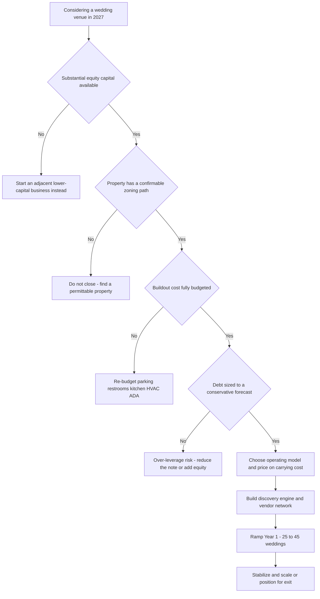

### Direct Answer

To start a wedding venue business in 2027 you acquire or control event-suitable real estate -- a barn, a restored estate, a converted warehouse, a winery, a garden, a historic building, or a purpose-built event hall -- and you rent that property, over and over, to couples for their wedding day, charging a venue fee that runs **$3,000 to $30,000+ per event** while the same property earns that fee **25 to 80+ times a year**. The model is genuinely lucrative and wealth-building at maturity, but it is the most capital-intensive business in the entire small-business catalog, and it lives or dies on three numbers most first-time owners never calculate before they buy land: **bookings per year**, **average revenue per booking**, and **the all-in cost of the real estate including debt service**.

**TL;DR:** A wedding venue is a leveraged real-estate-plus-events business: acquire a property once for **$400K to $5M+**, make it legally event-ready for another **$150K to $1M+**, then rent it 25-80+ times a year. A disciplined operator who finances the real estate conservatively books **25-45 weddings in Year 1** for **$200K-$1M gross** and **$60K-$300K owner profit**, and a mature single venue running **45-80+ events** reaches **$700K-$2.5M+ revenue** with **$250K-$900K+ owner profit** -- while the real estate appreciates as a parallel return. The three killers are **over-leveraging the real estate**, **underestimating the buildout-to-event-ready cost**, and **misjudging the local market** on capacity and price. Viable and genuinely wealth-building in 2027 for the capital-careful, zoning-first operator; a fast way to lose a great deal of money for anyone who buys the land first and does the math second.

## Section 1: What A Wedding Venue Business Actually Is In 2027

### 1.1 The Core Definition

A wedding venue business **owns or controls event-suitable real estate and rents the use of that property to couples** for their wedding -- the ceremony, the reception, or both -- along with an increasingly bundled set of services and inventory layered on top. You are not a wedding planner and you are not a caterer; **you are the company that owns the place the wedding happens.** The entire business is a single financial idea executed dozens of times a year: you acquire a piece of real estate once, at significant cost, and then you rent the use of that property out so many times, at a high enough fee, that the cumulative event revenue covers the mortgage, the operating costs, and a real owner profit -- while the underlying real estate quietly appreciates as a separate asset.

### 1.2 The Engine That Makes It Wealth-Building

A barn that cost $900K all-in to buy and convert, booked 40 times a year at an **$8,000 average venue fee**, generates **$320K in venue revenue alone** before a dollar of catering, bar, or rental add-on -- and the barn is still worth $900K-plus, often more, the whole time. That is the engine, and it is genuinely powerful: **few small businesses combine a high-margin operating cash flow with a hard, appreciating, financeable, sellable asset underneath it.** But the same feature that makes the model wealth-building -- the real estate -- is what makes it brutal to start: the capital required to control the property dwarfs the capital required to start almost any other small business, and the debt taken on to bridge that gap is the single most common cause of failure.

### 1.3 What Changed By 2027

The business in 2027 is shaped by realities that did not fully exist a decade ago. **Discovery moved fully online** -- couples find and compare venues through The Knot, Zola, and WeddingWire before they ever call. **Guest counts shifted structurally smaller** -- the average US wedding is roughly 115 to 130 guests in 2027, down from the 170-plus of the pre-2020 era, which changes what capacity to build. **Couples want curated experiences** -- they increasingly want a photogenic, "all-in-one" experience rather than a blank hall they must assemble themselves. **The all-inclusive package dominates** -- venue plus catering plus bar plus rentals plus coordination, sold as one number, has become the dominant high-revenue model. The wedding venue business is not a passive real estate holding and it is not a hospitality side hustle; it is a capital-intensive, operationally demanding, weekend-bound real estate and events business.

### 1.4 Where It Sits Among Adjacent Small Businesses

A founder weighing this model should compare it against the adjacent service businesses that touch the same wedding ecosystem -- a catering operation (q1980), a wedding photography studio (q1949), or a corporate-catering company (q9600) -- each of which requires a fraction of the capital but lacks the appreciating asset. The wedding venue is the capital anchor of the ecosystem: highest barrier to entry, highest absolute capital at risk, and the only one of the group that builds a hard real-estate balance sheet alongside the operating cash flow.

| Dimension | Wedding Venue | Catering Business | Wedding Photography |
|---|---|---|---|
| Typical startup capital | $400K-$5M+ | $20K-$150K | $8K-$40K |
| Owns appreciating asset | Yes (real estate) | No | No |
| Revenue per event | $8K-$28K+ | $4K-$15K | $3K-$8K |
| Weekend-bound | Heavily | Heavily | Heavily |
| Failure-mode driver | Over-leverage | Food cost / staffing | Saturation / pricing |

### 1.5 The Mental Model: A Building, A Calendar, And A Debt Schedule

The clearest way to think about a wedding venue is to strip away the romance entirely. The wedding belongs to the customer; the business is a **building, a parking lot, a catering kitchen, a calendar, a debt schedule, and a relationship with every planner and vendor in the region.** The couple buys a feeling -- the photographs, the dance floor, the once-in-a-lifetime day -- but the owner runs a leveraged real-estate asset that happens to monetize through events. The founders who confuse the two -- who buy the venue because they love weddings rather than because the unit economics work -- are the founders who skip the diligence that the business actually rewards.

This matters because almost every catastrophic failure in the category traces back to a founder who fell in love with a property's aesthetic and then reverse-engineered a financial story to justify the purchase. The disciplined operator does the opposite: builds the financial model first -- conservative bookings, honest operating cost, full buildout, sized debt service -- and only then evaluates whether a specific beautiful barn or estate fits inside that model. The aesthetic is necessary but never sufficient; a photogenic property with broken economics is still a broken business. Treat the venue as a financial instrument with a pretty facade, and the romance becomes a marketing asset rather than a decision-making trap.

## Section 2: The Property Models And The 2027 Market

### 2.1 The Seven Property Models

The single most consequential decision in this business is **what kind of property you control**, because it determines the capital required, the conversion cost, the price you can charge, and the market you serve.

- **The barn venue** -- a restored or purpose-built timber or post-and-beam barn on rural acreage -- carries a strong aesthetic and commands real money, but a true conversion is expensive and rural barns face zoning battles.
- **The estate or historic property** -- a mansion, a grand old house on grounds -- offers built-in elegance and a story, but acquisition cost is high and old-building maintenance is relentless.
- **The industrial or warehouse conversion** -- a brick warehouse or converted mill near a city -- serves the modern-urban aesthetic with easier parking, but the buildout from raw industrial space is a major capital project.
- **The winery, vineyard, or farm venue** -- a working agricultural operation that adds a wedding business -- is one of the most capital-efficient entry points because land and a structure already exist.
- **The garden or outdoor venue** -- formal gardens or a scenic outdoor site -- carries lower structural cost but demands a serious rain plan and is weather-exposed.
- **The purpose-built event hall** -- built from the ground up -- gives total control over layout, but it is the highest-capital path with no existing story.
- **The hotel or restaurant hybrid** -- an existing hospitality business hosting weddings as one revenue line -- benefits from existing infrastructure and staff.

### 2.2 Matching The Property To Capital And Market

A founder must choose deliberately. **The barn and estate command premiums but cost the most** to acquire and convert. **The winery, farm, and hospitality hybrids are the most capital-efficient** because infrastructure already exists. **The purpose-built hall offers control at the highest cost.** **The garden venue is low-structure but weather-bound.** The Year-1 mistake is falling in love with a property's look before pricing the full conversion-to-event-ready cost and confirming the zoning.

| Property model | Typical all-in capital | Capital efficiency | Buildout intensity |
|---|---|---|---|
| Winery / farm add-on | $100K-$500K | Highest | Low-moderate |
| Turnkey operating venue | $700K-$3M | High (proven) | Minimal |
| Barn conversion | $500K-$2M | Moderate | High |
| Estate / historic | $700K-$3M+ | Low-moderate | High |
| Warehouse conversion | $600K-$2.5M | Moderate | Very high |
| Garden / outdoor | $300K-$1.2M | Moderate-high | Low structure, high contingency |
| Purpose-built hall | $1M-$5M+ | Lowest | Total build |

### 2.3 The 2027 Wedding Market: Size And Shape

A founder needs an accurate read of the 2027 wedding landscape, because the business is neither a recession-proof goldmine nor a saturated dead end. **The market is large and structurally durable** -- the US sees roughly 2 to 2.3 million weddings a year, and the overall wedding industry is a $70B-plus annual market, with venue and catering together the single largest share of total wedding spend. The Knot's annual Real Weddings Study consistently puts the average US wedding cost in the low-to-mid $30,000s, with **the venue itself typically the largest single line item at roughly $10K to $12K nationally** and far higher in major metros. **Demand is durable but the shape changed** -- guest counts shifted structurally smaller, and the micro-wedding (under 50 guests) and the elopement-plus-celebration are real, growing segments.

### 2.4 What The 2027 Market Means For An Entrant

**The all-inclusive shift is the dominant revenue story** -- couples want fewer decisions and one vendor relationship, so the venue that bundles catering, bar, rentals, and day-of coordination captures dramatically more revenue per booking. **Discovery moved fully online** -- The Knot, Zola, and WeddingWire (all under Knot Worldwide) plus Instagram, owned by **Meta Platforms (NASDAQ: META)**, **Pinterest (NYSE: PINS)**, and increasingly TikTok are where couples shortlist venues. The winning 2027 product is a **right-sized (roughly 100-200 capacity), photogenic, all-inclusive-capable venue with a strong online presence** -- not an oversized blank hall competing on price.

A founder studying the broader event economy should also watch the public hospitality and event operators for demand signals and competitive context: **Hilton Worldwide (NYSE: HLT)** and **Marriott International (NASDAQ: MAR)** both run substantial wedding and event business through their property portfolios, **Cracker Barrel (NASDAQ: CBRL)** and other restaurant operators host private events as a revenue line, and ticketing and event-platform companies such as **Live Nation (NYSE: LYV)** show how event demand behaves across the calendar. The independent wedding venue competes against the hotel ballrooms of HLT and MAR on the high end and against restaurant private rooms on the low end, and the publicly-reported event-segment results of those operators are a useful free read on regional demand.

| 2027 market signal | Pre-2020 norm | 2027 reality | Implication for entrant |
|---|---|---|---|
| Average guest count | 170+ | 115-130 | Build 100-200 capacity, not 300 |
| Discovery channel | Referral / drive-by | The Knot, Zola, Instagram | Listings and photography are mandatory |
| Dominant package | Venue-only rental | All-inclusive bundle | Build catering/bar capability |
| Micro-wedding segment | Marginal | Real and growing | A viable niche position |
| Booking lead time | 9-12 months | 12-18 months | Reserve must carry a long ramp |

## Section 3: The Core Unit Economics

### 3.1 The Three Numbers That Define The Business

The entire business reduces to three numbers and the relationship between them. **Number one: bookings per year.** A venue's calendar has a finite number of prime dates -- Saturdays in peak season are the scarce, expensive inventory -- and the realistic booking count runs from 25 to 45 in an early operation up to 60 to 100+ for a mature venue that fills Fridays, Sundays, off-season dates, and weekday corporate events. **Number two: average revenue per booking.** This is the venue fee plus everything captured on top -- catering margin or commission, bar revenue, rental of tables and chairs and linens, coordination fees, ceremony fees, bridal-suite charges, and upgrade packages. A venue charging a $7,000 fee but capturing another $6,000 in catering, bar, and rental margin has a **$13,000 average booking**, nearly double the venue-fee-only operator.

### 3.2 The Third Number: Real Estate Debt Service

**Number three is the all-in cost of the real estate, including debt service** -- the number that sinks the business when it is wrong. The property must be acquired and made event-ready, and however that is financed -- cash, owner financing, a commercial mortgage, an SBA loan -- the carrying cost of that real estate is a fixed monthly obligation that exists whether or not a single wedding books. The math that matters: **gross event revenue minus operating costs minus debt service equals owner profit**, and the debt service line is the one that turns a healthy-looking revenue number into a loss.

### 3.3 The Two-Operator Illustration

Consider two operators with the identical $850K barn. **Operator A** bought it with $600K down (savings, a property sale, family capital) and a small $250K note; her debt service is modest, and 35 weddings at a $9,000 blended booking easily covers operating costs and leaves a strong profit. **Operator B** bought the same barn with $100K down and a $750K mortgage; his debt service is several times Operator A's, and the same 35 weddings -- a perfectly respectable Year-1 number -- barely covers operating costs and debt, leaving almost nothing, and one slow season ends him. **Same property, same bookings, same revenue -- completely different businesses, because of the real estate financing.**

| Metric | Operator A (disciplined) | Operator B (over-leveraged) |
|---|---|---|
| Property cost | $850K | $850K |
| Down payment | $600K | $100K |
| Mortgage note | $250K | $750K |
| Year-1 weddings | 35 | 35 |
| Blended booking | $9,000 | $9,000 |
| Gross revenue | $315K | $315K |
| Annual debt service | ~$22K | ~$66K |
| Owner outcome | Strong profit, survives slow year | Near-zero profit, foreclosure risk |

### 3.4 The Discipline The Numbers Impose

Before acquiring any property, **model the realistic Year-1 and Year-3 booking count and average revenue against the full operating cost and the debt service, and confirm the business survives a slow year.** The founders who get this wrong fall in love with a property and back into the financing; the ones who get it right size the property and the debt to a conservative booking forecast. This is the same capital-structure discipline that governs any leveraged property venture, including a real-estate brokerage (q9681) -- the asset is only an asset if the carrying cost is survivable.

### 3.5 Building The Conservative Pro Forma

The pro forma that protects a founder is not the optimistic one the broker or the seller will show -- it is a deliberately conservative model built around three stress assumptions. **First, assume a slow ramp:** Year 1 books at the low end of the realistic range (25-30 weddings, not 45), because the 12-18 month booking lead time means a venue opening in spring genuinely cannot fill its first calendar. **Second, assume the lower add-on capture:** model the blended booking at a venue-only or hybrid figure even if the plan is all-inclusive, because the in-house catering and bar capability takes a season or two to run efficiently. **Third, assume a full-cost operating P&L:** include every line -- staffing, utilities, insurance, property tax, maintenance, marketing, software -- at the high end, not the founder-hopeful low end.

If the business still produces a positive owner number after debt service under all three stress assumptions simultaneously, the deal is sound. If it only works under optimistic bookings, optimistic add-on capture, and a thin operating cost, the deal is a debt trap waiting for its first slow season. The pro forma is not a formality; it is the single most important spreadsheet a founder builds, and it should be revisited every time the purchase price, the financing terms, or the buildout estimate changes.

### 3.6 The Break-Even Booking Count

Every venue has a break-even booking count -- the number of weddings per year at which gross revenue exactly covers operating costs plus debt service. A founder must know this number cold, because it converts the abstract over-leverage warning into a single concrete figure. A conservatively financed venue might break even at 14-18 weddings a year, leaving enormous headroom above a realistic Year-1 count; an over-leveraged venue might break even at 32-38 weddings, leaving almost no margin for a slow season. The break-even count is the truest single measure of how much risk the capital structure carries, and it should be calculated before closing, not discovered in the second slow February.

## Section 4: The Operating P&L And Pricing

### 4.1 The Line-By-Line Operating P&L

Beyond the three core numbers, a founder must internalize the operating P&L. Take a representative all-inclusive wedding: a $9,000 venue fee, $11,000 in catering at a 25-35% retained margin, $3,500 in bar, $3,000 in rentals at rental margin, and $1,500 in coordination -- **a gross booking near $28,000, of which the venue retains perhaps $16K-$19K** after paying the caterer's food cost, the bar's product cost, and the rental cost of goods. From that retained revenue the costs stack.

- **Event staffing** -- a venue manager, setup and teardown crew, parking and security, bartenders if in-house -- is the largest variable cost and the one first-timers underprice.
- **Utilities** -- HVAC for a large space is a real and seasonal cost, plus water, electric, and trash.
- **Cleaning and turnover** -- the venue must be reset between events, a per-event deep-clean cost.
- **Maintenance and grounds** -- landscaping, the building, the parking lot, the restrooms, the kitchen, the suites -- relentless and ongoing.
- **Insurance** -- general liability, liquor liability, property, and event coverage -- a significant fixed cost.
- **Property tax, marketing, software, and debt service** -- the fixed-cost spine of the business.

### 4.2 Margin And Seasonality

Net the business out and a healthy single wedding venue runs a **35-50% net operating margin before debt service**, with the spread driven by add-on revenue capture, event-staffing pricing, and property efficiency. The seasonality compounds the P&L: in most US markets the peak runs roughly **May through October**, with a thinner November-April carried by holiday parties, corporate events, and the off-season-discount couple. The disciplined operator treats the peak as the period that must fund the year, banking a reserve that carries the fixed costs through the trough.

| P&L line | Type | Rough share of retained revenue |
|---|---|---|
| Event staffing | Variable | 20-30% |
| Utilities | Semi-variable | 5-9% |
| Cleaning / turnover | Variable | 3-6% |
| Maintenance / grounds | Fixed-ish | 6-12% |
| Insurance | Fixed | 4-8% |
| Property tax | Fixed | 3-7% |
| Marketing / software | Fixed-ish | 5-10% |
| Net operating margin (pre-debt) | -- | 35-50% |

### 4.3 Pricing The Venue: Fees And Tiering

**The base venue fee** is anchored to the local market and property tier -- a modest venue in a secondary market might command $3,000-$6,000, a strong venue $7,000-$15,000, and a premium venue in a major metro $15,000-$40,000+. **Day-of-week and seasonal tiering is essential** -- Saturdays in peak season are the scarce, premium inventory and should be priced firmly; Fridays and Sundays at a discount; weekdays and off-season at a deeper discount to fill the calendar without cannibalizing the prime dates. **Package tiers** -- a base rental, a mid package with rentals and coordination, an all-inclusive package -- let couples self-select and lift the average booking.

### 4.4 Add-On Revenue And The Pricing Mistake

**Add-on and upgrade revenue** -- ceremony fee, additional hours, bridal suite, rehearsal dinner, late-night extension, lounge furniture, lighting upgrades -- captures real money from couples already committed. **Catering and bar economics** is often the single largest revenue lever; the move from venue-only to capturing catering and bar is the move that doubles the average booking. The pricing mistake that kills venues is setting one flat fee, discounting it in peak season out of fear, and leaving the off-season empty -- when the correct approach is **firm peak pricing, aggressive shoulder-and-off-season filling, and a fee structure built on the property's true carrying cost.**

| Pricing layer | Lever | Revenue impact |
|---|---|---|
| Base venue fee | Market tier + property quality | Anchors the booking |
| Day-of-week tiering | Saturday firm, Fri/Sun discount | Fills shoulder dates |
| Seasonal tiering | Off-season deep discount | Fills the trough |
| Package tiers | Base / mid / all-inclusive | Self-selection lifts average |
| Add-ons | Ceremony, hours, suite, lighting | Margin from committed couples |
| Catering / bar capture | In-house margin or vendor fee | Doubles average booking |

## Section 5: Site Selection, Buildout, And Operating Models

### 5.1 Site Selection And The Acquisition Decision

**Location drives the addressable market** -- a venue lives or dies on the wedding demand within a reasonable drive of its guest base, close enough to a metro that couples and guests can reach it, with enough nearby hotels for lodging. **Zoning and permitting is the make-or-break diligence** -- many properties are not zoned for commercial event use, and rezoning or conditional-use permitting can take years, cost tens of thousands, and fail outright over neighbor objections. **No property should be acquired before the zoning path is confirmed.** The acquisition options each carry a different risk profile: buying raw land and building gives total control at the highest cost; buying and converting an existing structure is the common path with a routinely underestimated conversion cost; **buying a turnkey operating venue is the lowest-operational-risk entry** because zoning, buildout, and proof of demand already exist.

### 5.2 The Buildout: From Structure To Legally Event-Ready

A founder must understand the brutal gap between owning a property and being able to legally host 150 guests for a twelve-hour wedding day.

- **Parking** -- 150 guests need parking for roughly 75-100 vehicles, which on raw land means grading, gravel or paving, drainage, and lighting.
- **Restrooms** -- adequate, code-compliant, often ADA-compliant restrooms, which on a bare property means a major plumbing and septic project.
- **The catering kitchen** -- even a venue that does not cook needs a prep and staging kitchen with the right surfaces, refrigeration, power, and code compliance.
- **The bridal suite and groom's room** -- comfortable getting-ready spaces that are a real revenue and marketing feature.
- **HVAC and electrical** -- heating and cooling a large barn or hall is a significant mechanical system, and event lighting, sound, and catering equipment require serious electrical capacity.
- **Ceremony site, rain plan, ADA compliance, fire and life safety, landscaping, septic capacity, and sound mitigation** -- the long tail of code and experience requirements.

### 5.3 The Buildout Cost Reality

The buildout to take a property from "structurally sound building" to "legally and practically event-ready" routinely runs **$150K to $1M+ on top of the acquisition.** The founder who budgets the purchase price but not the buildout is the founder who runs out of money before the first booking.

| Buildout item | Typical cost range | Most underestimated risk |
|---|---|---|
| Parking (grading, surface, lighting) | $20K-$150K | Drainage and flooding |
| Restrooms (code / ADA) | $25K-$120K | Septic capacity |
| Catering kitchen | $20K-$100K | Health-code surfaces |
| Bridal / groom suites | $15K-$80K | Often skipped, hurts reviews |
| HVAC + electrical upgrade | $40K-$250K | Year-round event load |
| ADA, fire/life safety, landscaping | $30K-$300K+ | Occupancy rating caps capacity |

### 5.4 The Three Operating Models

There are three distinct ways to run the revenue side. **The venue-only model** rents the property and lets the couple bring their own caterer, bar, rentals, and planner -- operationally simple but leaving the largest revenue streams on the table. **The all-inclusive model** bundles venue plus catering plus bar plus rentals plus coordination into one package -- dramatically higher revenue per booking (often two to three times venue-only) but far heavier operational complexity. **The hybrid model** provides some services in-house (commonly bar and rentals, the highest-margin and easiest to control) while requiring caterers from a preferred list. The market strongly favors all-inclusive and hybrid; many operators start venue-only or hybrid to prove the property, then layer in catering and bar as the operation matures -- in much the way an operator might evolve toward a full catering capability (q1980) or partner with a corporate-catering specialist (q9600).

## Section 6: Sales, Vendors, Staffing, And Marketing

### 6.1 Booking, Sales, And The Tour-To-Contract Funnel

The wedding venue business is a sales business. **The inquiry** comes from online listings, the website, Instagram and Pinterest, and planner and past-couple referrals -- and every inquiry must be answered fast, because the venue that replies in an hour beats the one that replies in two days. **The venue tour** is the central sales event -- the couple walks the property, and the tour must be staged: the venue dressed, the bridal suite shown, the ceremony site and rain plan walked, available dates checked live. **The proposal and contract** follow fast -- a clear itemized package proposal and a contract specifying the date, fee, deposit, payment schedule, cancellation and rescheduling terms, rules, insurance requirements, and vendor policies. **The deposit secures the date**, and the booking calendar is the venue's core operational asset.

### 6.2 Vendor Relationships And The Wedding Ecosystem

A wedding venue sits at the center of a vendor ecosystem. **The caterer relationship** is the most important -- whether the venue runs catering in-house, requires a preferred list, or allows any licensed caterer, it shapes the guest experience and a major revenue stream. **Wedding planners and coordinators** are a referral goldmine. **The vendor web** -- photographers (q1949), florists, DJs and bands, party-rental and photo-booth operators (q1161), bakers -- all work the venue repeatedly and refer couples to it. **Styled shoots** -- collaborative photo shoots with vendors at the venue -- produce marketing imagery and deepen relationships at once. The venue that treats vendors as a network to invest in builds a referral engine that fills the calendar.

### 6.3 Staffing The Venue

| Role | Year 1 | Year 3+ | Cost type |
|---|---|---|---|
| Venue manager / coordinator | Often the owner | Dedicated hire | Fixed |
| Event-day crew (setup, servers, bar) | Variable / seasonal | Variable / seasonal | Variable |
| Sales (inquiries, tours, closing) | Owner | Dedicated hire | Fixed-ish |
| Grounds and maintenance | Owner + contractor | Dedicated crew | Fixed-ish |
| Cleaning / turnover | Outsourced | Crew or outsourced | Variable |
| Admin and bookkeeping | Owner | Dedicated role | Fixed |

The staffing cost structure mirrors the seasonality: **event-day staff is variable and peaks May-October**, while the venue manager, the grounds core, and the administrative function are fixed costs the off-season reserve must cover. A beautiful property run by a weak team gets weak reviews and an empty calendar.

### 6.4 Marketing And The Online Discovery Engine

**The listing platforms are non-negotiable** -- The Knot, WeddingWire, and Zola are where couples search and shortlist, and a paid, well-built listing with strong photography is table stakes. **Photography is the product** -- couples buy a venue on its images, and professional photography of the property in event-dressed condition is the single highest-leverage marketing investment. **The website** is the venue's home base -- visual, fast, mobile-first. **Instagram and Pinterest, and increasingly TikTok**, are where the venue's aesthetic lives. **Real-wedding features, reviews, bridal shows, planner referrals, and local SEO** round out the discovery engine. An invisible venue is an empty venue.

### 6.5 The Inquiry-To-Booking Conversion Math

A founder should treat the sales funnel as a measured pipeline, not a hopeful one. A healthy venue converts roughly **30-45% of qualified tours into signed contracts** and a smaller fraction of raw inquiries into tours -- which means the inquiry volume required to fill a calendar is far larger than first-timers expect. To book 40 weddings a year, a venue may need to host 90-130 tours, which in turn may require 300-500 inquiries across the listings, the website, and referrals. Each stage of that funnel is improvable: faster inquiry response lifts the inquiry-to-tour rate, a better-staged tour lifts the tour-to-contract rate, and clearer pricing on the website pre-qualifies couples so fewer tours are wasted on a mismatch.

The funnel also reveals where a struggling venue is actually failing. A venue with strong inquiry volume but weak tour conversion has a property, pricing, or tour-experience problem. A venue with weak inquiry volume has a discovery problem -- bad listings, weak photography, no SEO. Diagnosing the funnel stage that is leaking is far more useful than the generic complaint that "the calendar is slow," and a venue past a handful of bookings should track these conversion rates monthly.

| Funnel stage | Healthy benchmark | Lever to improve |
|---|---|---|
| Inquiry to tour booked | 25-40% | Response speed, clear pricing |
| Tour to contract signed | 30-45% | Tour staging, package clarity |
| Contract to event held | 90%+ | Deposit, contract terms |
| Past couple to referral | Ongoing | Event-day experience quality |

### 6.6 Reviews, Referrals, And The Compounding Reputation

The wedding venue business has a powerful compounding mechanism that a founder should deliberately engineer: **every well-run wedding produces reviews, photographs, and vendor goodwill that lower the cost of the next booking.** Couples buy on reviews, planners refer venues they trust, and photographers and florists circulate imagery from venues they enjoyed working at. A venue that executes flawlessly for two seasons builds a reputation asset that fills the calendar at a fraction of the marketing cost a new venue faces. The corollary is that the reputation compounds in both directions -- a single badly run wedding, a visible bad review, or a venue that vendors find difficult to work with imposes a lasting drag. The strategic implication is that the event-team quality and the day-of execution are not operational details; they are the venue's most important long-term marketing investment.

Reviews accumulate across the venue's own listings and the broader review economy -- including general-business platforms such as the review marketplace operated by **Yelp (NYSE: YELP)** and the local-discovery surfaces of **Alphabet (NASDAQ: GOOGL)** through Google Business Profile and Maps. A venue should claim, complete, and actively manage every one of these profiles, because a couple shortlisting venues will cross-reference the wedding-specific listings against the general review platforms, and a thin or unmanaged Google profile undercuts an otherwise strong The Knot presence. The payment and software layer matters here too: a venue running modern booking and payment tooling, often processed through platforms built on **PayPal (NASDAQ: PYPL)** or **Block (NYSE: XYZ)** rails, captures deposits cleanly and produces the transaction record that clean bookkeeping and an eventual sale both depend on.

## Section 7: Startup Costs, Year One, And The Five-Year Trajectory

### 7.1 The Honest All-In Startup Cost

The wedding venue business is the most capital-intensive model in the small-business catalog, and under-capitalization is the top killer.

| Startup cost line | Capital-efficient end | High end |
|---|---|---|
| Real estate | $100K (farm add-on) | $5M+ (purpose-built) |
| Buildout to event-ready | $150K | $1M+ |
| Furniture, fixtures, equipment | $30K | $150K |
| Permitting, zoning, legal, engineering | $10K | $75K+ |
| Insurance (first payments) | $5K | $25K |
| Marketing and photography | $8K | $30K |
| Software (venue mgmt, CRM, payments) | a few hundred | low thousands |
| Working capital + debt-service reserve | $40K | $150K+ |
| **Realistic all-in total** | **~$400K** | **$2M-$5M+** |

The capital requirement is the single biggest filter on who should start this business, and the structure of that capital -- how much is owner equity versus debt -- is the difference between a wealth-building business and a debt trap.

### 7.2 The Year-One Operating Reality

Year 1 is **ramp-and-prove mode, not peak-profit mode.** The first reality is the lead time: because couples book 12 to 18 months out, a venue that opens in spring may not host its first wedding for many months and may not have a full calendar until Year 2 or 3 -- the debt-service reserve must carry the property through this ramp. The first season is spent learning what the local market pays, discovering the real operating cost of running events, building the planner and vendor relationships, accumulating the first reviews and imagery, and finding where the operation is fragile. A disciplined Year-1 venue can realistically host **25 to 45 weddings** and generate **$200K to $1M in gross revenue** against **$60K to $300K in owner profit after debt service**, with profit heavily dependent on how the real estate was financed.

### 7.3 The Five-Year Revenue Trajectory

| Year | Weddings + events | Gross revenue | Owner profit (post-debt) | Founder role |
|---|---|---|---|---|
| Year 1 | 25-45 | $200K-$1M | $60K-$300K | Hands-on, sales + ops |
| Year 2 | 35-60 | $400K-$1.6M | $130K-$500K | Hiring a venue manager |
| Year 3 | 45-80 | $600K-$2.2M | $200K-$750K | Managing, not running events |
| Year 4 | Near capacity | $700K-$2.5M | $250K-$850K | Optimizing add-ons + off-season |
| Year 5 | At/near capacity | $800K-$2.8M+ | $280K-$950K+ | Deciding: scale, deepen, or sell |

These numbers assume disciplined real estate financing, a right-sized and well-located property, an operating model matched to the market, and a respected debt-service reserve -- they do not assume a sold-out calendar in Year 1, because the booking lead time makes the ramp structural.

### 7.4 Why The Trajectory Holds Or Breaks

A mature wedding venue is a genuinely excellent outcome -- a high-margin operating business sitting on an appreciating, financeable, sellable real estate asset -- but it is **earned through the capital discipline of the acquisition and the operational grind of the ramp.** The trajectory breaks for operators who over-leveraged the property, under-reserved for the ramp, or misjudged the market on capacity and price; it holds for operators who financed conservatively and treated Year 1 as the proving and relationship-building year.

## Section 8: Risk, Regulation, And Financing

### 8.1 Risk Management And Insurance

The wedding venue model carries specific, serious risks. **Liability risk** -- a guest injured on the property, a slip-and-fall, a structural or fire issue, an alcohol incident -- is mitigated by comprehensive insurance plus requiring vendors and couples to carry their own event coverage. **Alcohol risk** is its own category -- the venue must decide between licensed in-house bar service, requiring licensed outside bartenders, or a host-liquor arrangement, each with a different risk profile. **Weather risk** is structural -- outdoor ceremonies and tented receptions need a real, tested rain plan. **Financial and debt risk** -- the over-leverage problem -- is mitigated by conservative acquisition financing and a serious reserve. **Zoning and neighbor risk** -- noise complaints, a conditional-use permit that can be challenged -- is mitigated by proactive neighbor relations and strict compliance.

| Risk | Primary mitigation |
|---|---|
| Guest liability / injury | General liability + property insurance, vendor COIs |
| Alcohol incident | Liquor liability, licensed service, host-liquor policy |
| Weather | Tested rain plan, tent/backup structure, contract language |
| Over-leverage / debt | Conservative financing, debt-service reserve |
| Seasonality | Off-season corporate/social events, banked reserve |
| Cancellation / reschedule | Deposits, payment schedule, clear contract terms |
| Zoning / neighbor | Permit-condition compliance, sound mitigation |
| Reputation / reviews | Strong event team, consistent execution |

### 8.2 Zoning, Permitting, And Regulatory Compliance

The wedding venue business is unusually regulated for a small business. **Zoning is the threshold issue** -- commercial event use is a specific zoning category, and many appealing rural barns and estates are zoned agricultural or residential and require a rezoning or, more commonly, a **conditional-use or special-use permit.** The permit, once granted, comes with conditions -- caps on the number of events, noise limits, end times, parking requirements -- and violating those conditions can get the permit revoked, ending the business. **Building and occupancy permits, health-department approval, fire-marshal approval, a liquor license, ADA compliance, and septic and environmental permits** complete the regulatory layer. The non-negotiable discipline: **confirm the zoning and permitting path before acquiring the property** -- ideally make the purchase contingent on it -- because a property that cannot be permitted for events is not a venue, it is just expensive real estate.

### 8.3 Financing The Real Estate: The Defining Decision

Because the wedding venue business is fundamentally a leveraged real estate business, the financing of the property determines whether the venue is a wealth-building asset or a debt trap.

| Financing path | Risk profile | Best fit |
|---|---|---|
| Cash / large down payment | Lowest -- most resilient | Founders with substantial equity |
| Commercial mortgage | Moderate -- depends on note size | Well-located property, conservative LTV |
| SBA 504 loan | Moderate -- lower down, still debt | Owner-occupied acquisition / construction |
| Seller financing | Low -- often turnkey, proven | Buying an existing operating venue |
| Partners / investors | Shared ownership reduces debt | Founders short on equity |

The discipline that defines the business: the debt service is a fixed obligation that exists whether or not a wedding books, the booking calendar takes 12-18 months to fill, and the first season ramps slowly -- so **the financing must be sized so the business survives a conservative Year-1 and Year-2 booking count, not an optimistic one.**

### 8.4 Taxes, Business Structure, And The Real Estate Asset

**Entity structure** commonly separates the real estate from the operating business -- the property held in one LLC, the venue operating business in another, with the operating entity leasing the property from the real estate entity -- providing liability separation, financing flexibility, and a cleaner path to sell either independently. **Depreciation** on the building and improvements is a significant tax feature, and a cost-segregation study can accelerate substantial depreciation in the early years. **Sales tax** applies to many venue and event charges. **Payroll taxes** on the seasonal event staff are a real cost. The structure is the framework that protects the owner's liability, optimizes the tax on a heavily capital business, and preserves the flexibility to sell the operating business, the real estate, or both.

### 8.5 The Owner's Lived Reality And Temperament Fit

A founder should know what daily life in this business actually feels like before committing the capital, because the lived reality is weekend-bound, seasonally intense, and emotionally high-stakes. In Year 1, running a venue largely owner-operated, the founder is genuinely in the business -- running tours during the week, managing event days on weekends, solving problems in real time, answering inquiries, building vendor relationships, handling the books. **Weddings happen on weekends, overwhelmingly Saturdays**, and the peak season is a relentless run of event weekends; the off-season is quieter, spent on maintenance, marketing, and selling the next year's calendar. By Year 2-3, with a venue manager running event days, the founder's role shifts toward management and sales, though the business is never desk-only.

The emotional texture is real and worth naming. There is deep satisfaction in a flawless wedding day, a beautiful property full of celebrating people, a calendar that fills itself on referrals, and a piece of real estate that grows in value. There is real stress in the weather, the vendor no-show, the family drama that lands on the venue staff, the slow off-season against the mortgage, and the permanent knowledge that every Saturday is someone's once-in-a-lifetime day with no second take. A founder who enjoys hospitality, events, and the high-stakes pleasure of executing someone's best day will find it deeply rewarding; a founder who wanted a passive real estate holding will be exhausted and surprised. The temperament fit is as much a screening criterion as the capital.

### 8.6 A Decision Framework: Should You Actually Start This

A founder deciding whether to commit should run a structured self-assessment, because this model fits a specific person and badly misfits others.

| Self-assessment dimension | The honest question | Disqualifying answer |
|---|---|---|
| Capital | Do you have a substantial equity position, not a thin down payment? | "I would need maximum leverage" |
| Real estate access | Do you own suitable land or have a financeable path to a property? | "No path without over-borrowing" |
| Zoning reality | Is there a property with a confirmable event-permitting path? | "I'd close and apply later" |
| Operational temperament | Will you run a weekend-bound hospitality operation? | "I want a passive holding" |
| Market fit | Is there real wedding demand at a price and capacity you can fill? | "I'll build big and hope" |
| Capital discipline | Will you size debt to a conservative forecast? | "I'll assume a full calendar" |

If a founder answers yes across all six, a wedding venue business in 2027 is a legitimate and genuinely wealth-building path. If they answer no on capital or capital discipline, they should not start, or should start with the most capital-efficient path -- a farm or winery add-on, or a turnkey operating venue with seller financing. If they answer no on operational temperament, an adjacent, less weekend-intensive business is the better fit.

## Section 9: Scenarios, Counter-Cases, And Specialty Paths

### 9.1 Five Named Real-World Operating Scenarios

Concrete scenarios make the model tangible.

- **Scenario one -- Renata, the disciplined barn operator:** buys an $850K barn in a healthy secondary market, $550K down against a manageable $300K note, spends $220K converting it, confirms the conditional-use permit before closing, and opens venue-only-plus-bar; 32 weddings in Year 1 at an $11,000 blended booking comfortably covers operating costs and the modest debt, and by Year 3 she runs 58 events with a venue manager -- a wealth-building business because the real estate was financed conservatively.
- **Scenario two -- Mei, the winery add-on:** already operates a small vineyard and tasting room, and adds a wedding business on existing land by converting a barn structure for $280K with no land acquisition cost and favorable agricultural zoning already in place; she is profitable in Year 1 on 24 weddings because there is almost no debt service, and the wedding business and winery cross-sell into one destination.
- **Scenario three -- the Alvarez family, all-inclusive purpose-built:** builds a $2.4M purpose-built venue with significant owner equity and a structured SBA loan, runs full all-inclusive with in-house catering and bar, and captures a $26,000 average booking; Year 1 is hard, but by Year 4 the venue grosses $2.3M with strong owner profit.

### 9.2 The Counter-Case: When A Wedding Venue Is The Wrong Move

The wedding venue model is genuinely punishing for the wrong founder, and an honest guide must name the cases where it should not be started.

- **Trevor, the over-leverage casualty:** finds the same $850K barn as Renata but puts only $90K down against a $760K mortgage, runs short on the buildout, and opens with thin parking and a marginal rain plan; he hosts a respectable 30 weddings in Year 1, but the heavy debt service plus operating costs leaves almost no profit, the buildout shortcuts generate weak reviews, and a normal slower Year-2 ramp leaves him unable to cover the mortgage -- the property is foreclosed despite a perfectly normal booking count, because the capital structure could not survive the ramp.
- **Dontae, the market-mismatch casualty:** builds a beautiful 280-capacity grand hall and prices a $19,000 fee in a market where couples have 120 guests and budget $8,000; the property is lovely and the few events review well, but the calendar never fills because the product is mismatched to the market, and he is forced to sell the building at a loss.
- **The under-capitalized founder generally:** anyone who would need to maximize leverage simply to get in, who cannot fund both the buildout and a serious debt-service reserve, or who wants a passive real estate holding rather than a weekend-bound hospitality operation, is in the wrong business. For that founder, an adjacent lower-capital path -- a catering business (q1980), a pop-up restaurant (q9603), or a wedding photography studio (q1949) -- delivers wedding-industry exposure without the leverage and the appreciating-asset risk.

### 9.3 When The Counter-Case Flips Back To "Yes"

The counter-case is not a blanket warning -- it is a filter. The same model that foreclosed Trevor builds wealth for Renata. **The venue is the right move when the founder has a substantial equity position, a confirmable zoning path, an operational and weekend temperament, a right-sized property matched to the local market, and the capital discipline to size the debt to a conservative forecast.** The flip is entirely about capital structure and market fit, not about the model itself.

### 9.4 Common Year-One Mistakes That Kill The Business

A founder can avoid most failure modes simply by knowing them in advance, because the mistakes in this business are remarkably consistent. **Over-leveraging the real estate** is the single most common business-ending error, because the booking calendar ramps slowly and the debt does not wait. **Buying the property before confirming the zoning** converts a venue dream into expensive useless real estate. **Underestimating the buildout cost** leaves the founder out of money before the venue is event-ready. **Misjudging the market** -- building too large or pricing too high -- produces a beautiful property with an empty calendar. **Under-reserving for the ramp** is the classic cash-out failure. **Staying venue-only when the market wants all-inclusive** caps revenue per booking. **Weak photography and no listings** starves the inquiry funnel. **A weak event team** generates weak reviews in a business where couples buy on reviews. **Thin liquor liability insurance** turns one bad night into a business-ending lawsuit. **Ignoring permit conditions** risks the conditional-use permit and the whole business. Every one of these is avoidable; the founders who fail almost always made three or four of them, starting with the over-leverage, and the founders who succeed treated this list as a pre-launch checklist.

### 9.5 Niche And Specialty Paths Worth Considering

| Specialty path | Advantage | Trade-off |
|---|---|---|
| Micro-wedding / elopement venue | Far less capital, growing segment | Lower absolute revenue per event |
| All-inclusive destination venue (on-site lodging) | Captures lodging revenue, destination pricing | Higher capital and operational complexity |
| Winery / brewery / distillery venue | Capital-efficient, cross-sells, built-in aesthetic | Two businesses to run (see q1941) |
| Corporate-and-events-first venue | Softens wedding-season concentration | Less premium per booking |
| Historic / architecturally distinctive venue | Premium pricing, strong story | Restoration and maintenance cost |
| Multi-venue / campus operator | Shared overhead, portfolio scale | Capital and attention constraints |

A founder might also pair the venue with an on-site food capability -- an in-house bakery for cakes and desserts in the spirit of a small bakery (q1940) or a cottage food bakery (q2003), or a flexible event-and-corporate hall closer to a party-venue model (q1163). The mistake is not choosing a path; it is buying a generic oversized hall with no clear position.

## Section 10: Scaling, Exit, Outlook, And The Final Framework

### 10.1 Scaling Past The First Venue

The jump from a proven single venue to a multi-venue operation is its own challenge. **The prerequisites for scaling:** the first venue must be genuinely stabilized (a near-full calendar, a working event team, strong reviews, positive cash flow after debt service), the operating systems must be documented well enough that a venue manager can run the property without the founder, and the cash flow plus reserves must absorb the next acquisition. **The scaling levers for a single venue** -- maximize add-on revenue, develop the off-season and weekday business, optimize pricing and calendar. **For a multi-venue operation** -- acquire or build a second property in a complementary market so the venues do not compete, and share management, marketing, sales, and back-office across the portfolio. The second venue is dramatically easier than the first because the systems and the operating skill already exist.

### 10.2 Exit Strategies And The Long-Term Picture

The wedding venue model offers unusually strong exit options. **Sell the going concern** -- the operating business plus the real estate -- a venue with a stabilized full calendar, strong reviews, a trained team, and a well-maintained property is a genuinely attractive acquisition. **Sell the real estate separately** -- because the venue sits on a hard, appreciating asset, the property itself can be sold even absent a going-concern buyer, a real floor under the business. **Sell the operating business and lease back or sell the real estate** -- the entity separation enables splitting the two. **Build a portfolio and sell to a consolidator**, **transition to family or a key employee**, or **simply hold for the cash flow and the appreciation.**

| Exit path | What is sold | Best fit |
|---|---|---|
| Going-concern sale | Operating business + real estate | Stabilized, documented venue |
| Real estate sale | The property only | When no operating buyer exists |
| Operating-business sale + leaseback | Operations; retain real estate | Founder wants the appreciating asset |
| Portfolio roll-up | Multi-venue operation | Scaled operators |
| Internal transition | Business to family / employee | Trained successor + financing |
| Hold | Nothing -- keep the asset | Manager-run, cash-flowing venue |

### 10.3 The 2027-2030 Outlook

Several trends are reasonably clear. **Demand stays structurally durable** -- roughly 2 million-plus US weddings a year. **The guest-count shift is structural, not a fad** -- the smaller 115-130-guest wedding permanently favors right-sized venues over the oversized halls of the previous boom. **The all-inclusive shift accelerates** -- decision-fatigued couples increasingly want one vendor and one number. **Online discovery deepens** -- The Knot, Zola, WeddingWire, Instagram, Pinterest, and TikTok remain where couples find venues. **Labor and operating cost stay elevated**, **zoning and neighbor friction persists**, and **consolidation continues** as well-capitalized operators absorb properties from over-leveraged owners. The net outlook: the wedding venue business is **viable and genuinely wealth-building through 2030 in its disciplined, conservatively-financed, right-sized, all-inclusive-capable, online-present form** -- and increasingly punishing for the over-leveraged, oversized, venue-only, hard-to-find operator.

| 2027-2030 trend | Direction | What it rewards |
|---|---|---|
| Total US wedding volume | Durable, ~2M+/year | Steady underlying demand |
| Guest counts | Structurally smaller | Right-sized 100-200 capacity venues |
| All-inclusive packaging | Accelerating | Catering/bar capability, bundling |
| Online discovery | Deepening | Listings, photography, social presence |
| Operating cost (labor, insurance) | Elevated | Add-on revenue, operational discipline |
| Property consolidation | Continuing | Well-capitalized, disciplined buyers |

A 2027 founder who buys the real estate conservatively, sizes the venue to the modern smaller wedding, builds the all-inclusive revenue capability, and invests in the online discovery engine is building a business with a genuine multi-year runway and an appreciating asset underneath it. The trends do not threaten the disciplined operator; they steadily transfer market share toward that operator and away from the over-leveraged and the oversized.

### 10.4 The Final Framework: Building It Right From Day One

Pulling the playbook into a single operating framework, a founder should execute in this order:

1. **Get honest about capital and structure** -- confirm a substantial equity position, the full buildout cost, and a serious debt-service reserve.
2. **Confirm the zoning before anything else** -- identify a property with a confirmable path to commercial event permitting, and make the purchase contingent on it.
3. **Choose the property model deliberately** -- barn, estate, conversion, winery, garden, or purpose-built -- favoring capital-efficient paths if capital is the constraint.
4. **Budget the full buildout to event-ready** -- parking, restrooms, kitchen, suites, HVAC, electrical, ADA, fire and life safety, septic, landscaping.
5. **Choose the operating model** -- venue-only, hybrid, or all-inclusive -- knowing the all-inclusive math is better but the operation is harder.
6. **Price on the property's true carrying cost** with day-of-week and seasonal tiering and aggressive add-on capture.
7. **Build the online discovery engine** -- listings, professional photography, website, social presence.
8. **Build the vendor and planner network** as the high-quality lead engine.
9. **Build a real event team** and **carry real insurance**, especially liquor liability.
10. **Respect the debt-service reserve, and structure the entity and real estate for the tax treatment and the eventual exit.**

Do these things in this order and a wedding venue business in 2027 is a legitimate path to a **$700K-$2.5M+ operating business sitting on an appreciating real estate asset.** Skip the discipline -- especially on the capital structure, the zoning diligence, and the buildout budget -- and it is a fast way to lose a great deal of money and a beautiful property. The business is neither a passive real estate goldmine nor a saturated dead end; it is a real, capital-intensive, leveraged, operationally demanding real estate and hospitality business, and in 2027 it rewards exactly one kind of founder: **the disciplined, capital-careful, zoning-first operator who treats it as the leveraged real estate and events business it actually is.**

## Decision Flowchart

## Counter-Case Summary

The honest counter-case bears repeating as its own section. A wedding venue is **the wrong business** for a founder who must maximize leverage to enter, who cannot fund both the buildout and a real reserve, who wants a passive holding, or who builds a generic oversized hall mismatched to the local market. Trevor and Dontae are not freak outcomes -- over-leverage and market-mismatch are the two most common failure modes, and they foreclose properties with perfectly normal booking counts. The model only flips to "yes" when capital structure, zoning, temperament, and market fit all align. When they do, the wedding venue is one of the most exit-flexible, wealth-building businesses in the small-business catalog; when they do not, it is one of the fastest ways to lose a great deal of money.

## Related Pulse Entries

- How do you start a catering business in 2027? (q1980)
- How do you start a wedding photography business in 2027? (q1949)
- How do you start a brewery business in 2027? (q1941)
- How do you start a bakery business in 2027? (q1940)
- How do you start a corporate catering business in 2027? (q9600)
- How do you start a pop-up restaurant business in 2027? (q9603)
- How do you start a cottage food bakery business in 2027? (q2003)
- How do you start a real estate brokerage in 2027? (q9681)

## Sources

1. The Knot. "Real Weddings Study" -- annual average wedding cost and venue spend.
2. The Knot Worldwide. Marketplace data on venue discovery and shortlisting behavior.
3. WeddingWire. Venue listing and review benchmarks.
4. Zola. Couple planning behavior and vendor selection survey data.
5. IBISWorld. "Wedding Services in the US" industry market sizing.
6. The Wedding Report. US wedding count and total industry spend estimates.
7. US Census Bureau. Marriage and household formation statistics.
8. CDC National Center for Health Statistics. US annual marriage rate data.
9. Brides. "Average Wedding Cost" annual reporting.
10. Martha Stewart Weddings. Venue category and aesthetic trend coverage.
11. WeddingPro / The Knot Worldwide. Industry vendor business reports.
12. US Small Business Administration. SBA 504 owner-occupied real estate loan program guidance.
13. US Small Business Administration. SBA 7(a) loan program terms.
14. Internal Revenue Service. Publication 946, depreciation of business property.
15. Internal Revenue Service. Cost-segregation study audit technique guide.
16. Internal Revenue Service. Section 1031 like-kind exchange guidance.
17. National Association of Counties. Conditional-use and special-use permitting overview.
18. American Planning Association. Commercial event-use zoning practice notes.
19. US Department of Justice. ADA Standards for Accessible Design.
20. National Fire Protection Association. NFPA 101 Life Safety Code occupancy provisions.
21. US Environmental Protection Agency. Septic system capacity and onsite wastewater guidance.
22. Insurance Information Institute. Commercial general liability and liquor liability overview.
23. The Hartford. Special event and venue insurance product guidance.
24. National Restaurant Association. Catering kitchen and food-service code references.
25. US Bureau of Labor Statistics. Event-services and hospitality wage and employment data.
26. ServiceCentral / venue management software vendors. Booking-funnel and CRM benchmarks.
27. Wedding MBA conference. Operator education sessions on venue economics.
28. Catersource / The Special Event. All-inclusive venue and catering trend coverage.
29. Knot Worldwide Real Weddings. Guest-count trend reporting, 2020-2027.
30. Pinterest Predicts. Wedding aesthetic and venue search trend data.
31. Eventbrite. Event-industry seasonality and demand reporting.
32. National Association of Catering and Events. Vendor relationship and preferred-list practice.
33. Wedding venue operator interviews and trade-press case studies, 2024-2027.
34. Commercial real estate brokerage reports on event-property valuation and sale comparables.
