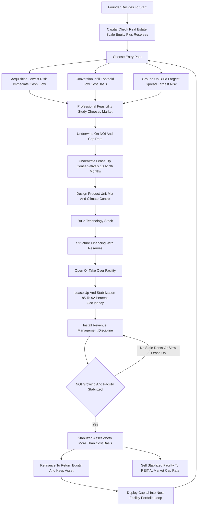

### Direct Answer

To start a self-storage business in 2027 you control a piece of real estate -- built new, bought existing, or converted from another use -- subdivide it into lockable units that rent month-to-month at roughly $40-$500 each, and operate it as an appreciating, income-producing asset rather than a retail shop. This is not a storage business; it is a real estate business wearing a storage costume, and you make money three ways at once: monthly rental cash flow, the forced appreciation of net operating income you raise rents into, and the eventual sale or refinance of a stabilized facility at a 6-8% cap rate. It is viable and genuinely attractive in 2027 for a capitalized, patient, real-estate-minded operator who underwrites conservatively -- and a poor fit for anyone wanting a cheap, fast, hands-off cash machine.

**TL;DR:** A conversion or small existing-facility entry runs roughly $400K-$3M all-in; a ground-up build runs $1.5M-$12M+. A stabilized facility at 85-92% occupancy throws off a 60-70% net operating income margin because a 300-500 unit site is run by one or two people plus software. A single facility realistically produces $60K-$350K of Year-1 owner cash flow while it leases up, climbing to $250K-$900K by Year 3-5 once stabilized, with the larger prize being the equity event. Public Storage (NYSE: PSA), Extra Space Storage (NYSE: EXR), CubeSmart (NYSE: CUBE), and National Storage Affiliates (NYSE: NSA) are perpetual buyers of stabilized independent facilities, which gives a disciplined builder a real, liquid exit. The three things that kill self-storage startups are the wrong location, an underwritten fantasy lease-up, and treating the asset as a passive ATM instead of a revenue-management discipline.

## 1. What A Self-Storage Business Actually Is In 2027

### 1.1 The Real-Estate-Not-Retail Reframe

A self-storage business owns or controls a parcel of real estate, divides the building and land into individually lockable units, and rents those units to households and small businesses on month-to-month agreements. The customer brings their own lock, accesses their space on their own schedule, and pays a recurring fee; you provide secured, often climate-controlled space, gated access, surveillance, and a management layer that handles billing, collections, and move-ins. **That is the visible business. The actual business is real estate.** You are buying or building an income-producing asset whose value is a direct multiple of its net operating income, and almost every strategic decision -- where to build, what unit mix to offer, how aggressively to raise rents, when to refinance, when to sell -- is a real estate decision, not a retail one.

This distinction is the single most important thing a founder can internalize, because it reframes everything. **A storage operator who thinks like a shopkeeper** obsesses over occupancy and customer count. **A storage operator who thinks like a real estate investor** obsesses over net operating income, cap rate, and the gap between what the facility cost to create and what it is worth once stabilized. The same physical facility produces a mediocre business in the first founder's hands and an excellent one in the second's.

### 1.2 What Matured By 2027

The 2027 business is shaped by several realities that matured over the prior decade:

- **Professionalized competition.** The major operators -- Public Storage, Extra Space Storage, CubeSmart, National Storage Affiliates -- normalized dynamic online pricing and trained customers to rent, compare, and move in entirely online.
- **Software-run facilities.** A 400-unit site can be operated by one or two part-time people plus a management platform, a call center, and remote-access technology.
- **Higher build bar.** Construction and land costs rose, which raised the cost to build but also constrained new supply in many good markets.
- **Durable demand.** The demand drivers -- moving, downsizing, life transitions, small-business inventory, e-commerce overflow -- are structural, not faddish.

Self-storage is not a trendy business and it is not a passive one. It is a real estate asset with an operating layer, and the founders who succeed treat the operating layer as the thing that builds the asset's value, and the asset as the thing that builds their wealth.

### 1.3 Who Should And Should Not Start One

| Profile | Fit |
|---|---|
| Capitalized, patient, real-estate-minded operator | Strong fit -- the core target |
| Investor wanting forced-appreciation upside and a liquid exit | Strong fit |
| Founder who can underwrite conservatively and respect reserves | Strong fit |
| Buyer wanting a cheap, fast, hands-off cash machine | Poor fit -- will under-capitalize and under-manage |
| First-timer choosing ground-up build in an unfamiliar market on thin equity | Poor fit -- the canonical failure setup |
| Operator who refuses dynamic pricing and existing-customer increases | Poor fit -- leaves the core value lever unused |

For adjacent real-estate-adjacent paths a founder may be weighing, compare the self-storage facility-development angle in (q9663), the property management services business in (q1956), and the real estate brokerage path in (q9681).

## 2. The Three Ways You Actually Make Money

### 2.1 Monthly Rental Cash Flow

**The first engine is the spread** between rental income plus ancillary revenue and the operating expenses of property tax, insurance, utilities, payroll, marketing, software, and maintenance. On a stabilized facility this cash flow is real and the margin is high, because the operating expense load is genuinely low relative to most businesses. Most beginners see only this engine and underwrite the whole venture on it -- which is the first underwriting mistake.

### 2.2 Forced Appreciation Through NOI Growth

**The second engine is the one beginners do not see.** A self-storage facility is valued at a multiple of its NOI. Raise NOI by $50,000 through rent increases, occupancy gains, ancillary income, or expense control, and at a 7% cap rate you have created roughly $710,000 of asset value. You do not wait for the market to appreciate the asset; **you appreciate it yourself by managing the income.** This is the lever that turns disciplined revenue management into a wealth-building activity rather than a back-office chore.

### 2.3 The Equity Event

**The third engine is the refinance or sale.** Once a facility is stabilized, you can refinance to pull out tax-advantaged capital while keeping the asset, or sell the stabilized facility to a REIT or private buyer at a market cap rate. The spread between your all-in cost to create the facility and its stabilized market value is the largest single payday in the business, and it is the reason patient builders accept thin early cash flow.

| Engine | What it pays | Who sees it |
|---|---|---|
| Monthly rental cash flow | Operating profit after expenses, before debt | Every beginner |
| Forced appreciation | ~$14-16 of asset value per $1 of NOI built | Disciplined operators |
| Equity event | Spread between cost basis and stabilized value | Patient builders |

The discipline this imposes: **underwrite all three, not just cash flow.** A deal that looks mediocre on Year-1 cash flow can be excellent once you account for the NOI you will build and the value that NOI creates. A deal that looks fine on cash flow but sits in a market where you can never raise rents or sell to a credible buyer is a worse business than it appears.

## 3. The Three Entry Paths: Build, Buy, Or Convert

### 3.1 The Ground-Up Build (Development)

You acquire land, navigate zoning and entitlement, design the facility, and construct it new -- typically a single-story drive-up facility or a multi-story climate-controlled building depending on land cost and market. **This path offers the largest value-creation spread**, because you can build at a cost basis well below stabilized value and put the right product in the right place. Its challenges are the largest: the highest capital requirement ($1.5M-$12M+), entitlement and construction risk, a long timeline before the first dollar of revenue, and an 18-36 month lease-up during which the loan still wants paying.

### 3.2 The Acquisition Of An Existing Facility

You buy a facility that already has units, customers, and cash flow. **This path offers immediate revenue, a known operating history, and far less construction and lease-up risk.** Its challenges are that you pay for the stabilization someone else did -- a higher cost basis relative to NOI -- and the value-creation opportunity is narrower, usually found in a poorly run facility you can improve. The classic acquisition play is the mom-and-pop facility run on autopilot with below-market rents, no dynamic pricing, no ancillary income, and deferred maintenance -- bought, professionalized, and re-stabilized at a higher NOI.

### 3.3 The Conversion

You take an existing building -- a vacant big-box retail store, a warehouse, an industrial building -- and convert it to climate-controlled storage. **This path can offer a lower cost basis than ground-up in the right building**, faster delivery than new construction, and a foothold in infill locations where land for new build is scarce. Its challenges are building-specific: structural fit, ceiling heights, column spacing, zoning for the use, and conversion costs that can surprise.

| Path | All-in cost | Risk profile | Value-creation spread |
|---|---|---|---|
| Ground-up build | $1.5M-$12M+ | Highest -- construction, entitlement, lease-up | Largest |
| Acquisition | $500K-$3M+ | Lowest -- immediate cash flow | Narrower -- professionalization gap |
| Conversion | $1M-$6M+ | Building-specific structural and zoning risk | Moderate to large in the right building |

Many disciplined founders start with an acquisition or a conversion to learn the operating business with less risk, then graduate to ground-up development once they understand lease-up, revenue management, and the local market. The wrong move is a first-time founder choosing ground-up development in an unfamiliar market with thin capital and an optimistic lease-up assumption.

## 4. The 2027 Market Reality: Demand, Supply, And What Changed

### 4.1 Demand Is Structurally Durable

Roughly one in ten US households uses self-storage, and the demand drivers are life events and structural conditions, not discretionary wants: **people move, downsize, inherit, renovate, divorce, deploy, go to college, run small businesses out of constrained space, and increasingly hold e-commerce and reseller inventory.** These drivers do not disappear in a downturn; some intensify. That structural durability is the reason the asset class holds up reasonably well through economic cycles.

### 4.2 Supply Is The Variable That Decides Everything

Self-storage demand is local -- customers rent within a few miles of where they live or work -- so a market is defined by a small trade area, and the question is whether that trade area is oversupplied or undersupplied relative to its rooftops and demographics. **A market with strong housing growth, dense population, good demographics, and limited existing square footage per capita is attractive; the same market becomes unattractive the moment a competitor announces a new facility two miles away.** The early-2020s saw a development wave that oversupplied some markets and left others still hungry.

### 4.3 The Barbell Competitive Structure

| Tier | Who | Characteristics |
|---|---|---|
| Top | Public REITs and large private operators | Professional revenue management, brand, scale, capital |
| Middle | Regional operators | Professionalized but sub-scale |
| Bottom | Mom-and-pop independents | Often autopilot -- stale rents, no technology |

The opportunity for a disciplined 2027 entrant sits in two places: **building or buying in genuinely undersupplied trade areas the REITs have not saturated, and acquiring and professionalizing the undermanaged independents.**

### 4.4 What Changed By 2027

Online rental and dynamic pricing became the norm; remote management and access technology made small facilities operable with minimal staff; construction and land costs rose, raising the build bar and constraining supply; the REITs became even more dominant as perpetual buyers, strengthening the exit; and feasibility-study discipline became non-negotiable, because the markets where storage works and the markets where it does not are sharply divided and getting more so.

## 5. The Core Unit Economics: NOI, Cap Rate, And The Value You Create

### 5.1 The Calculation The Whole Business Lives On

A self-storage facility's value is its **net operating income divided by the market cap rate.** NOI is rental income plus ancillary income minus operating expenses -- and critically, NOI excludes the mortgage payment, depreciation, and capital expenditures. The cap rate is the market's required yield; in 2027, stabilized self-storage trades in a broad band that varies by market quality, facility quality, and interest rates.

### 5.2 A Worked 400-Unit Example

| Line | Figure |
|---|---|
| Gross rental income (400 units x $130 avg x 0.88 occupancy x 12) | ~$549,000 |
| Ancillary income (tenant protection, fees, retail) | ~$40,000 |
| Total revenue | ~$589,000 |
| Operating expenses (~35% of revenue) | ~$206,000 |
| Net operating income (NOI) | ~$383,000 |
| Value at 6.5% cap rate | ~$5.89M |
| Value at 7.0% cap rate | ~$5.47M |
| Value at 8.0% cap rate | ~$4.79M |

### 5.3 The Forced-Appreciation Lever

Now the lever that makes the business. **Raise the average rent 8% through disciplined revenue management** and gross rental income climbs about $44,000; NOI climbs roughly $44,000 because rent increases drop almost entirely to NOI; and at a 7% cap rate **you just created about $629,000 of asset value with a pricing decision.** That is forced appreciation, and it is why the business rewards revenue-management discipline over passive ownership.

| Cap rate environment | Value of each $1 of NOI |
|---|---|
| 6.0% cap | ~$16.67 |
| 6.5% cap | ~$15.38 |
| 7.0% cap | ~$14.29 |
| 8.0% cap | ~$12.50 |

The discipline this imposes: **underwrite every deal on NOI and cap rate, not on gross revenue or unit count.** Know your stabilized NOI assumption and stress-test it. Know the cap rate a credible buyer would actually pay in that specific market. Know your all-in cost basis. A founder who cannot articulate the spread between cost basis and stabilized value for a specific deal is not ready to do that deal. For a deeper drill on the break-even occupancy that underpins this math, see (q1125).

## 6. The Line-By-Line Operating P&L

### 6.1 The Expense Lines That Make NOI Real

Self-storage's reputation as a low-overhead business is true but not automatic, and the lines are specific:

- **Property tax** is typically the single largest operating expense and it tends to rise -- assessors reassess stabilized facilities upward, so underwrite tax growth, not a frozen number.
- **Insurance** -- property and liability coverage -- has risen meaningfully and varies by region and risk exposure.
- **Payroll** is genuinely low: a small-to-mid facility runs on one or two part-time people, or a part-timer plus a management company.
- **Utilities** are modest for drive-up facilities and meaningfully higher for climate-controlled buildings.
- **Marketing** -- predominantly online search and listing sites -- drives lease-up and the replacement of natural churn.
- **Software and technology** -- the management platform, access control, surveillance, payment processing.
- **Repairs and maintenance** -- doors, gates, paving, roofing, landscaping, snow removal, pest control.
- **Administrative, legal, and professional** rounds out the fixed overhead.

### 6.2 The Operating Expense Table

| Expense | Notes |
|---|---|
| Property tax | Often the single largest line; rises with reassessment |
| Insurance | Property and liability; risen meaningfully, varies by region |
| Payroll | Genuinely low; one-to-two part-timers or management company |
| Utilities | Modest for drive-up; higher for climate-controlled |
| Marketing | Predominantly online search and listing sites |
| Software and technology | Management platform, access control, surveillance, payments |
| Repairs and maintenance | Doors, gates, paving, roofing, landscaping, snow removal |
| Administrative, legal, professional | Fixed overhead |
| Total operating expenses | ~30-40% of revenue (60-70% NOI margin) |

### 6.3 The Lines Below NOI

Below NOI sit the lines that determine actual owner cash flow: the **mortgage payment** (principal and interest, sized by the loan and the rate), and **capital expenditures and reserves** (roof, paving, door replacement, gate systems -- real periodic costs the P&L must reserve for, not absorb by surprise). The founders who fail at the P&L level usually made the same errors: they underwrote property tax and insurance as static, ignored the capex reserve, and confused NOI with cash flow -- forgetting that the loan payment sits between them and the money.

| P&L layer | What it includes | Common beginner error |
|---|---|---|
| Revenue | Rental income plus ancillary income | Counting gross potential rent at 100% occupancy |
| Operating expenses | Tax, insurance, payroll, utilities, marketing, software, maintenance, admin | Treating property tax and insurance as frozen |
| Net operating income | Revenue minus operating expenses; the value driver | Confusing NOI with owner cash flow |
| Debt service | Mortgage principal and interest | Assuming the loan is patient through a slow lease-up |
| Capex and reserves | Roof, paving, doors, gates -- periodic real costs | Skipping the reserve and absorbing capex by surprise |
| Owner cash flow | What is left after debt service and reserves | Underwriting the venture on NOI as if it were take-home |

The single most useful habit a founder can build here is to keep these six layers strictly separate on paper. A facility can have a healthy NOI and still produce thin owner cash flow if the debt is heavy; a facility can show strong cash flow in Year 1 and still be a poor asset if its NOI cannot grow. The layers answer different questions, and a founder who collapses them into one number cannot tell a good deal from a bad one.

## 7. Site Selection: The Decision That Decides Everything

### 7.1 Why Location Cannot Be Fixed Later

Location is the highest-stakes decision in self-storage, because a facility is fixed in place and **a bad location cannot be fixed by good operation.** The trade area is small: storage customers rent within roughly a three-to-five-mile radius of home or work, so the relevant market is not the metro -- it is a tight trade area, and a founder must analyze that specific ring.

### 7.2 Demand-Side And Supply-Side Factors

| Side | Factors to analyze |
|---|---|
| Demand | Population and household count in the trade area, housing growth (rooftops), income and demographics, renter percentage and apartment density, demand generators (military, universities, housing turnover) |
| Supply | Existing square footage of storage per capita vs a healthy benchmark, occupancy and rents at existing facilities, and -- critically -- the development pipeline |
| Site-specific | Visibility and traffic count, access and ingress/egress, zoning for the use, parcel size and shape, land cost relative to supportable rents |

### 7.3 The Feasibility Study Is Non-Negotiable

A professional third-party feasibility study analyzes the trade area's supply and demand, models a realistic lease-up and rent structure, and tells a founder whether the market actually supports a facility. **A founder who skips it to save the fee is gambling the entire capital stack on intuition.** Self-storage is an intensely local business, the difference between a good trade area and a saturated one is stark, and the feasibility analysis -- not enthusiasm for a particular piece of land -- must decide whether and where to build or buy.

## 8. Unit Mix, Climate Control, And Facility Design

### 8.1 Unit Sizes And The Per-Square-Foot Logic

Unit sizes run from a 5x5 closet through the workhorse 5x10 and 10x10 to the larger 10x15, 10x20, and 10x30. **Smaller units rent for more per square foot** -- a 5x5 at $55/month earns far more per square foot than a 10x20 at $200/month -- but smaller units turn over more and require more management touches, while larger units are stickier but earn less per square foot.

| Unit Size | Typical Use | Monthly Rent (2027) |
|---|---|---|
| 5x5 | Closet / documents / small overflow | $40-$80 |
| 5x10 | One room of household goods | $60-$120 |
| 10x10 | One-to-two rooms of goods | $90-$180 |
| 10x15 | Large household / small-business inventory | $130-$250 |
| 10x20 | One-car garage equivalent | $150-$300 |
| 10x30 | Two-car garage equivalent | $250-$500 |
| Climate-controlled premium | Temperature/humidity regulated | +20-40% over comparable drive-up |
| Outdoor RV / boat / vehicle | Vehicle and trailer storage | $100-$300 |
| Drive-up access premium | Vehicle-to-door convenience | +10-20% |

### 8.2 The Climate-Control Fork

Climate-controlled units -- temperature and often humidity regulated, typically inside a building -- command a 20-40% rent premium, protect sensitive goods, and are increasingly expected in many markets; they also cost more to build and carry higher utility costs. Traditional drive-up units are cheaper to build and operate and remain in strong demand. Many facilities offer both.

### 8.3 Outdoor Storage And Security Design

**Outdoor and vehicle storage** -- parking for RVs, boats, trailers, and vehicles -- is a low-cost-to-create, steady-demand category that uses land efficiently; founders weighing the vehicle-storage niche can compare adjacent demand in the RV rental path (q1963). **Facility design** also encompasses security and access (gated access, individual unit alarms, surveillance, well-lit drive aisles), drive-aisle width for vehicle access, single-story drive-up versus multi-story climate-controlled, and the office or kiosk. The unit mix and climate-control decision are long-lived revenue choices -- build the wrong mix and you have baked a revenue ceiling into the concrete.

## 9. The Lease-Up: The Make-Or-Break First 18-36 Months

### 9.1 Why Filling Is Slow

A newly built or converted facility opens empty and must fill -- and filling is not fast. A realistic lease-up to stabilized occupancy (commonly 85-92% physical occupancy) takes **18 to 36 months** depending on market depth, facility size, the competitive landscape, and marketing intensity. During that entire period the facility generates partial revenue while carrying full operating expenses and full debt service.

### 9.2 The Lease-Up Math Beginners Get Wrong

Beginners assume a steep fill curve -- 90% in twelve months -- when the real curve is a gradual climb, and they assume the loan will be patient when the loan wants its full payment from month one. **A facility that leases up slower than underwritten burns through reserves and can default not because the business model is bad but because the capital plan was wrong.**

| Lease-up assumption | Underwriting outcome |
|---|---|
| 90% occupancy in 12 months | Fantasy -- the canonical failure setup |
| 85-92% occupancy in 18-36 months | Realistic -- fund a reserve to match |
| Thin or no lease-up reserve | Default risk on a slower-than-hoped fill |
| Reserve sized to a conservative curve | Manageable bump, not a fatal one |

### 9.3 Managing The Lease-Up

Managing a lease-up well is a deliberate, sequenced campaign rather than a hopeful wait:

- **Aggressive online marketing** -- search, listing sites, and the facility's own website carry the demand, because a customer who needs storage finds it online first.
- **Introductory and promotional pricing** -- first-month specials and discounted introductory rates build the occupancy momentum that justifies later rate increases.
- **A revenue-management ramp** -- rates rise as occupancy climbs, so the facility is not locked into opening-week pricing once demand proves out.
- **Weekly tracking against the curve** -- the founder compares actual occupancy to the underwritten curve every week and reacts early if the fill is lagging, rather than discovering the shortfall when the reserve is already half-spent.

**The acquisition advantage:** buying an existing stabilized facility skips the lease-up risk entirely -- a large part of why acquisition is the lower-risk entry path. Underwrite a conservative lease-up curve, fund a reserve sufficient to carry expenses and debt service through a slower fill, and treat the lease-up as the riskiest phase of the venture. The founders who survive the lease-up almost never did so by filling faster than planned; they survived because they planned for a slow fill and funded the reserve to match it.

## 10. Revenue Management: The Discipline That Builds The Asset

### 10.1 Dynamic Pricing

**Dynamic pricing is the modern standard the REITs normalized:** rather than a static rate card, rents adjust based on occupancy, demand, season, competitor pricing, and unit-type availability -- a unit type at 95% occupancy can command more than the same type at 70%. Software runs this, and a 2027 operator who prices statically while competitors price dynamically leaves NOI -- and therefore asset value -- on the table.

### 10.2 Existing-Customer Rate Increases

**Existing-customer rate increases are the quiet engine of forced appreciation.** Storage customers are notoriously sticky -- the cost and hassle of moving belongings makes them tolerate periodic, reasonable increases -- and a disciplined program of regular increases raises NOI substantially over time. Done thoughtfully, this is the single most powerful NOI lever an operator controls.

### 10.3 Ancillary Income And The Occupancy-Versus-Rate Balance

**Ancillary income is the underrated profit layer:** tenant insurance or protection plans, administrative and late fees, retail sales of locks and packing supplies, and truck rental partnerships. **The occupancy-versus-rate tension** is constant -- chasing 100% occupancy by underpricing leaves money on the table; pricing too aggressively raises vacancy. The goal is the rate-and-occupancy combination that maximizes NOI, not either number alone. **Delinquency management** -- late notices, lien procedures, and unit auctions under the state's lien law -- protects revenue and clears non-paying units. Every dollar of NOI built through revenue management is worth roughly fourteen to sixteen dollars of asset value, which makes revenue management the core wealth-building activity, not a back-office chore.

| Revenue lever | What it does | NOI impact |
|---|---|---|
| Dynamic pricing | Adjusts new-customer rates to occupancy and demand | Captures peak-demand pricing competitors leave on the table |
| Existing-customer increases | Periodic reasonable raises on sticky tenants | The largest controllable NOI lever over time |
| Ancillary income | Tenant protection, fees, retail, truck partnerships | Drops largely to NOI; adds a meaningful revenue percentage |
| Delinquency control | Disciplined lien-law collections and auctions | Protects booked revenue, clears units for paying tenants |
| Occupancy-rate balance | Targets the NOI-maximizing combination | Prevents both underpricing and over-vacancy |

A founder should treat revenue management as a weekly operating rhythm, not a once-a-year exercise: review unit-type occupancy and competitor pricing, run the scheduled existing-customer increases, audit ancillary attach rates, and clear the delinquency pipeline. The compounding is quiet but real -- a facility that raises NOI 4-6% a year through this discipline doubles the value it has created over a five-year hold, while the passively run facility next door simply collects last year's rents at this year's costs.

## 11. Technology, Automation, And Remote Management

### 11.1 The Management Platform

The management platform is the central system: it holds unit inventory and availability, runs dynamic pricing, processes online rentals and payments, manages billing and delinquency workflows, and consolidates reporting. **Online rental and move-in is now a baseline expectation** -- a meaningful share of customers want to rent, sign, and get access entirely online.

### 11.2 Access Control And Remote Operation

**Access control and security technology** -- electronic gate access, individual unit door alarms, app-based entry, surveillance with remote monitoring -- both secures the facility and enables the thin staffing model. **Remote and unmanned operation is the structural shift** that makes small facilities economically attractive: with online rental, app-based access, remote monitoring, and a call center handling the rare phone interaction, a 300-500 unit facility can run with minimal or no on-site staff.

### 11.3 The Management-Company Option

| Operating model | What it buys | Trade-off |
|---|---|---|
| Self-operated with full tech stack | Maximum NOI retained | Founder builds the operating apparatus |
| Third-party management company | Professional revenue management and marketing scale | A slice of NOI as a fee |
| REIT-affiliated management platform | The REITs' pricing and marketing scale | A management fee plus brand alignment |

Technology is what makes the low-overhead reputation real -- but only if the founder actually builds the stack rather than running a stale facility on a paper ledger. The technology decision directly sets the payroll line, marketing effectiveness, and revenue-management capability, which together set the NOI.

## 12. Financing The Deal: The Capital Stack

### 12.1 The Loan Structures

| Structure | Use | Notes |
|---|---|---|
| SBA 7(a) and 504 | Acquisition and some construction | Lower down payments; valuable for limited-capital founders |
| Conventional commercial loan | Acquisition and construction | Often 25-35% down; underwrites property income |
| Construction loan | Ground-up development | Funds build and lease-up, then converts to permanent financing |
| CMBS and life-company loans | Larger stabilized facilities | Institutional-scale debt |
| Seller financing | Mom-and-pop acquisitions | Lowers cash required, eases entry |
| Private capital and partnerships | Larger builds and scaling | Founder contributes deal, expertise, and operating sweat |

### 12.2 Refinancing As A Strategy

**Refinancing is a deliberate strategy, not just a fallback.** Once a facility is stabilized at a higher NOI, refinancing at the new value can return much or all of the original equity tax-efficiently while the founder keeps the appreciating asset. This is the engine of the portfolio loop.

### 12.3 The Reserve Discipline

The capital stack must include the lease-up reserve and the capex reserve, the debt must be sized so the facility can service it through a conservative lease-up, and the founder must avoid the over-leveraged structure that looks fine in the optimistic case and defaults in the realistic one. The financing is not a detail bolted onto the deal -- it is the structure that determines whether a slow lease-up is a manageable bump or a fatal one.

## 13. Startup Cost Breakdown: The Honest All-In Number

### 13.1 Ground-Up Development Stack

Land acquisition (highly market-dependent); site work, entitlement, and permitting; construction (commonly $30-$75+ per square foot depending on drive-up versus multi-story climate-controlled); fees (architectural, engineering, legal, feasibility study); equipment and technology (gates, doors, surveillance, management software, office); initial marketing; and the lease-up reserve. A ground-up facility commonly runs **$1.5M-$12M+ all-in.**

### 13.2 Acquisition And Conversion Stacks

**Acquisition** stacks: the purchase price (a function of NOI and the market cap rate), closing and due-diligence costs (including a market study and physical inspection), immediate capex for deferred maintenance, technology upgrades, and working capital -- commonly **$500K-$3M+.** **Conversion** stacks: building acquisition, conversion construction (structural, climate systems, unit build-out, security), entitlement, fees, technology, marketing, and a lease-up reserve -- commonly **$1M-$6M+.**

### 13.3 The Founder's Genuine Equity Requirement

| Item | Detail |
|---|---|
| Acquisition all-in | $500K-$3M+ |
| Conversion all-in | $1M-$6M+ plus lease-up reserve |
| Ground-up all-in | $1.5M-$12M+ |
| Construction cost reference | ~$30-$75+ per square foot |
| Founder genuine equity across paths | Often $200K-$1.5M+ |
| Non-negotiable reserves | Lease-up reserve (new/converted) and capex reserve (all) |

The founder's actual cash requirement is the down payment plus closing costs plus reserves plus working capital. The capital requirement is the single biggest filter on who should start this business: it is real-estate-scale capital, and treating it as a small-business-scale venture -- thin equity, no reserves -- is how a fundamentally good asset class produces a failed deal.

## 14. The Year-One Operating Reality

### 14.1 Year One For An Acquisition

For an acquisition, Year 1 is a **stabilization-and-professionalization year:** taking over an existing facility, implementing dynamic pricing and a revenue-management discipline, cleaning up delinquency, adding ancillary income, upgrading technology, addressing deferred maintenance, and beginning the existing-customer rate-increase program. The cash flow exists from day one, and a well-bought, well-improved acquisition can produce **$60K-$350K of Year-1 owner cash flow.**

### 14.2 Year One For A Build Or Conversion

For a ground-up build or conversion, Year 1 is partly or entirely a **lease-up year:** the facility opens empty, carries full expenses and debt service, and fills gradually. Year-1 owner cash flow is often thin or negative by design, with the lease-up reserve carrying the gap, and the real return arriving in Years 2-4.

### 14.3 What The Founder Actually Learns

Across both paths, Year 1 is when the founder learns the local market's true demand depth, the real lease-up or churn rate, the actual operating expense load (property tax and insurance especially), and where the facility is operationally fragile. The work is real but not labor-intensive in the way a service business is -- it is revenue management, marketing oversight, expense control, and delinquency discipline, much of it doable remotely. Founders comparing operating intensity against a more hands-on real-estate service can look at the property management business in (q1956) and the moving company in (q1943).

## 15. The Five-Year Trajectory: From Entry To Stabilized Asset

### 15.1 The Year-By-Year Arc

| Year | Acquisition path | Build / conversion path |
|---|---|---|
| Year 1 | Stabilization and professionalization; $60K-$350K cash flow | Lease-up; thin or negative cash flow carried by reserve |
| Year 2 | Revenue management compounds; cash flow climbs | Lease-up continues; cash flow turns meaningfully positive |
| Year 3 | At or near stabilization; $150K-$600K cash flow | Reaches stabilization; cash flow strong |
| Year 4 | Optimized asset; first refinance-or-sell decision | Optimized asset; first refinance-or-sell decision |
| Year 5 | $250K-$900K at full stabilization in a good market | $250K-$900K at full stabilization in a good market |

### 15.2 The Strategic Decision At Year Four

By Year 4 the stabilized facility runs as an optimized asset, and the founder faces the first major strategic decision: **refinance to pull out equity tax-efficiently and keep the asset, sell the stabilized facility to a REIT or private buyer at a market cap rate, or hold and acquire or build the next one.**

### 15.3 The Honest Caveat

These numbers assume a good market chosen by feasibility study, a conservative lease-up underwriting, disciplined revenue management, and respected reserves. **They do not assume a bad-market facility can be operated into success, because it cannot.** A mature self-storage business is a portfolio of appreciating, income-producing real estate assets with a thin operating layer -- a genuinely excellent outcome, earned through capital discipline and revenue-management rigor, not through passivity.

## 16. The Operating Journey: From Capital Check To Stabilized Asset

### 16.1 The Capital-Check-To-Harvest Flow

The diagram below traces the full operating journey a 2027 founder walks, from the first honest capital check through to the harvest -- the refinance or the sale -- and then back into the portfolio loop. Read it as a discipline, not a wish list: each box upstream of the lease-up is an underwriting decision made before any capital is committed, and each box downstream is an operating decision made after. The single decision point in the middle -- whether NOI is growing and the facility is stabilized -- is the gate that separates a passively run facility (which loops back to install real revenue management) from a stabilized asset worth more than its cost basis. A founder who can place a specific deal on this flowchart, and name exactly which box they are in, is underwriting honestly; a founder who cannot is improvising.

## 17. Five Named Real-World Operating Scenarios

### 17.1 Diane, The Disciplined Acquirer

Diane buys a 320-unit mom-and-pop facility for $2.1M, the seller having run it for fifteen years on stale rents, no dynamic pricing, no tenant insurance program, and a paper ledger. In Year 1 she implements management software and dynamic pricing, adds a tenant-protection program, cleans up delinquency, raises stale rents toward market, and addresses deferred paving -- **lifting NOI from roughly $135K to $210K within two years**, which at a 7% cap rate added about $1.07M of value to a facility she has barely changed physically.

### 17.2 Marcus, The Cautionary Tale

Marcus builds a ground-up 450-unit facility, underwrites a 90%-in-twelve-months lease-up, and funds a thin lease-up reserve. The real lease-up curve is gradual, a competitor opens three miles away in month eight, and by month fourteen the facility is at 48% occupancy while the construction loan demands full payment. **Marcus burns the reserve, cannot make debt service, and is forced to sell the half-leased facility at a loss.** The asset class was fine; the lease-up underwriting was fantasy.

### 17.3 Priya, The Converter

Priya buys a vacant 60,000-square-foot big-box retail building in an infill suburban location where land for new build is unavailable, converts it to climate-controlled storage, and -- because the trade area is genuinely undersupplied and she funded a real lease-up reserve -- **reaches stabilization in 28 months with a cost basis well below the stabilized value:** a clean forced-appreciation play.

### 17.4 The Okafor Family, The Patient Builder

The Okafors develop a facility, accept thin Year-1 and Year-2 cash flow as the deliberate cost of the value-creation spread, stabilize in Year 3, **refinance at the new NOI to return most of their original equity, keep the appreciating asset, and use the returned capital to start facility number two:** the textbook portfolio-building loop.

### 17.5 Rob, The Passive-ATM Casualty

Rob buys a facility, treats it as a hands-off cash machine, never implements dynamic pricing, never runs an existing-customer rate-increase program, lets delinquency drift, and skips ancillary income. **Five years later his NOI is roughly flat, his facility's value has barely moved, and a REIT that would have paid a premium for a professionally run asset passes on his stale one** -- the canonical illustration of treating a revenue-management business as a passive holding.

| Scenario | Outcome | Lesson |
|---|---|---|
| Diane -- disciplined acquirer | +$1.07M value created in 2 years | Professionalization captures the NOI gap |
| Marcus -- lease-up fantasy | Forced sale at a loss | Underwrite the lease-up conservatively |
| Priya -- converter | Stabilized below cost basis | Right building plus undersupplied market wins |
| Okafor family -- patient builder | Portfolio loop launched | Refinance returns equity, keeps the asset |
| Rob -- passive ATM | Flat NOI, no equity event | Revenue management is the business |

## 18. Marketing And Customer Acquisition

### 18.1 The Digital Channels That Drive Lease-Up

**Search is the dominant channel** -- people who need storage search for it locally and with intent ("storage near me," "climate controlled storage [city]"), so search visibility, organic and paid, is the core of the marketing engine. **The facility's own website** -- with online rental, real-time availability, transparent pricing, and a clean mobile experience -- is both a marketing asset and the conversion point. **Third-party listing and aggregator sites** are a real channel that drives bookings at the cost of a fee.

### 18.2 Local Visibility And Reputation

**Local visibility** -- signage, presence on a high-traffic road -- still matters because storage is hyper-local. **Reputation and reviews** drive conversion: a customer choosing between facilities leans heavily on ratings, so review management is a real function. **Referrals and repeat use** -- customers who had a good experience return for the next life transition and refer others.

### 18.3 Promotional Pricing As A Tool

**Promotional pricing** -- introductory rates, first-month specials -- is a lease-up and churn-replacement tool, used deliberately to win the customer who is then retained and rate-managed over time. Marketing in self-storage is not a brand-building luxury; it is the demand engine that fills a lease-up and replaces the customers who naturally move out. Founders studying digital-demand-driven local-service marketing can compare adjacent playbooks in the vacation rental business (q1960) and the short-term rental management business (q9624).

## 19. Legal, Lien Law, And Regulatory Reality

### 19.1 The Self-Storage Lien Law

**The self-storage lien law is the foundational statute:** every state has a self-storage facility act that grants the operator a lien on the contents of a unit for unpaid rent and specifies the precise process -- notice requirements, timelines, advertising, and the auction procedure -- by which an operator can sell the contents of a delinquent unit. **This process must be followed exactly;** errors expose the operator to liability.

### 19.2 The Rental Agreement And Tenant Protection

**The rental agreement is the core contract** -- specifying rent, fees, the month-to-month term, the operator's lien rights, the customer's insurance obligations, access rules, and limitations of liability -- and a founder must use a thorough, state-compliant agreement, not a generic template. **Tenant insurance and protection programs** sit in a regulated space: the operator typically cannot simply "insure" the customer's goods without appropriate licensing or a compliant protection-plan structure, and it must be set up correctly because it is both ancillary income and a compliance area.

### 19.3 Zoning, Insurance, And Compliance

| Area | What it governs |
|---|---|
| Zoning and land use | Whether storage can be built or operated on a given parcel |
| Property and liability insurance | Coverage on the facility itself; has risen in cost |
| Value limitation and disclaimers | Limiting declared value of stored goods, disclaiming liability |
| ADA, environmental, local regulatory | Standard commercial real estate compliance |

Self-storage's legal framework is largely protective of a competent operator -- the lien law in particular is a powerful tool -- but only if the operator follows it precisely. A founder should engage counsel familiar with the state's self-storage act, use a compliant agreement, set up the tenant-protection program correctly, and treat the lien process as a procedure to execute exactly.

## 20. Risk Management And What Can Go Wrong

### 20.1 The Underwriting Risks

| Risk | What it is | Mitigation |
|---|---|---|
| Oversupply risk | A market that pencils today undermined by new supply tomorrow | Feasibility-study discipline, undersupplied markets, pipeline monitoring |
| Lease-up risk | New or converted facility fills slower than underwritten | Conservative lease-up underwriting, real lease-up reserve |
| Interest rate and refinance risk | Loan refinanced into a higher rate; cap rate expands | Sensible leverage, fixed-rate debt, no aggressive exit cap |

### 20.2 The Operating Risks

| Risk | What it is | Mitigation |
|---|---|---|
| Concentration risk | Single facility in a single trade area | Build a small portfolio across markets |
| Operational underperformance | Facility run passively with stale rents | Revenue management as the core discipline |
| Property risk | Fire, weather, structural, environmental | Insurance, maintenance, reserves |
| Delinquency and economic risk | A downturn raises non-payment | Disciplined lien-law collections; durable storage demand |
| Liability risk | Claims on stored goods, customer injury | Agreement value limitations, insurance, safe-site practices |

### 20.3 The Throughline

The largest risks in self-storage -- **oversupply and lease-up -- are underwriting risks, decided before the founder commits capital**, which is exactly why the feasibility study and the conservative lease-up assumption are not optional. The operator who fails usually failed at the underwriting desk, not the operating desk.

## 21. The Competitor Landscape: Who You Are Up Against

### 21.1 The Public REITs

The public REITs -- **Public Storage (NYSE: PSA), Extra Space Storage (NYSE: EXR), CubeSmart (NYSE: CUBE), and National Storage Affiliates (NYSE: NSA)** -- collectively own thousands of facilities and are worth well over $100B combined. They bring professional revenue management, brand recognition, scale, and deep capital. They are formidable competitors and they are also the most important buyers of stabilized independent facilities, which makes them simultaneously the competition and the exit. Building-systems suppliers such as **Janus International Group (NYSE: JBI)** sit alongside this ecosystem as the source of the doors and hallway systems a conversion or build depends on.

### 21.2 The Long Tail And The Management Platforms

**The long tail of independent mom-and-pop facilities** -- many run on autopilot with stale rents, no dynamic pricing, no online rental, and deferred maintenance -- is both the competition a disciplined operator out-professionalizes and the primary acquisition target. **Third-party management platforms** -- including those affiliated with the major REITs -- offer independent owners access to professional revenue management for a fee.

### 21.3 Where A 2027 Entrant Wins

You generally cannot out-scale or out-capitalize the REITs, so you win on two fronts: **choosing genuinely undersupplied trade areas the REITs have not saturated**, and **acquiring and professionalizing the underrun independents.** The competitive moat in self-storage is not the building -- anyone with capital can build one -- it is the location in a genuinely good trade area, the revenue-management discipline that maximizes NOI, and the cost basis below stabilized value.

## 22. Scaling Into A Portfolio

### 22.1 The Prerequisites For Scaling

The first facility must be genuinely stabilized and well-run (do not scale on top of an underperforming asset), the founder must have a repeatable underwriting and operating process, and the capital to fund the next deal -- typically from the first facility's refinance proceeds, sale proceeds, retained cash flow, or outside equity.

### 22.2 The Portfolio-Building Loop

**Acquire or build a facility, stabilize it through revenue-management discipline, refinance at the higher stabilized NOI to return the original equity tax-efficiently while keeping the appreciating asset, and deploy the returned capital into the next facility** -- repeating until the founder owns a portfolio of stabilized, income-producing, appreciating assets.

### 22.3 The Scaling Levers And Constraints

| Lever | Constraint it solves |
|---|---|
| Standardized operating playbook | Founder attention does not scale linearly |
| Centralized or third-party management | One founder cannot run many sites hands-on |
| Diversification across trade areas | Single-market concentration risk |
| Broker, lender, and REIT relationships | Reliable deal flow and a reliable exit |

The founders who scale well share one trait: they treated the first facility as the proving ground for a repeatable underwriting-and-operating system, so each subsequent facility is the disciplined repetition of a proven loop rather than a fresh gamble.

## 23. Exit Strategies And The Long-Term Picture

### 23.1 The Exit Paths

| Exit | What it is |
|---|---|
| Sell the stabilized facility | A liquid asset; REITs and large private operators are perpetual buyers at a market cap rate |
| Refinance and hold | Return most or all original equity tax-efficiently, keep the appreciating asset |
| Sell a portfolio | A package of stabilized facilities, often at a premium to the sum of the parts |
| 1031 exchange | Sell and defer capital gains by exchanging into a larger facility or portfolio |
| Transition or hold long-term | A low-management durable income asset; hold, transition to family, or place under management |

### 23.2 The Honest Long-Term Picture

Self-storage is a durable, real asset class -- the demand drivers are structural, the operating overhead is genuinely low, the legal framework protects competent operators, and the exit is unusually liquid because of the REIT buyer pool. **But it is real estate, not a passive ATM:** it demands real capital, disciplined underwriting, ongoing revenue management, and reserves for capex.

### 23.3 Why The Combination Is Attractive

Among small-business and real estate ventures, the combination of durable demand, low overhead, forced-appreciation upside, and a liquid institutional exit makes self-storage one of the more structurally attractive paths -- for the founder with the capital and the discipline to do it right. Founders comparing capital intensity against lower-entry-cost recurring-revenue ventures can weigh the vending machine business (q1937) and the dumpster rental business (q9632).

## 24. Counter-Case: When Starting A Self-Storage Business Is The Wrong Move

### 24.1 The Case Against It For Many Founders

It is intellectually honest to state plainly when a founder should not do this. **First, if you do not have real-estate-scale capital, do not start.** Self-storage is not a small-business-scale venture; entering with thin equity and no reserves converts a fundamentally good asset class into a failed deal, and the lease-up reserve in particular is the line that separates a manageable slow fill from a default.

**Second, if you want a passive, hands-off cash machine, this is the wrong business.** The marketed version of self-storage -- "buy it and collect rent" -- describes Rob's facility, the one whose NOI went flat and whose value never moved. The real business is a revenue-management discipline; a founder unwilling to run dynamic pricing, existing-customer increases, ancillary income, and delinquency control will underperform a savings account on a risk-adjusted basis.

**Third, if you cannot underwrite conservatively, the asset class will punish you.** The two largest risks -- oversupply and a slow lease-up -- are decided at the underwriting desk, before any capital is committed. A founder who underwrites a 90%-in-twelve-months lease-up, ignores the development pipeline, or assumes a frozen property-tax line is building Marcus's facility regardless of how good the market is.

### 24.2 Better-Fit Alternatives

| If the founder... | A better-fit path |
|---|---|
| Wants real estate exposure without operating a facility | Public storage REIT shares, or a property management business (q1956) |
| Wants lower capital intensity and faster cash flow | A vending machine route (q1937) or dumpster rental (q9632) |
| Wants a hands-on service business, not an asset play | A moving company (q1943) |
| Wants the development-and-entitlement angle specifically | The self-storage facility development path (q9663) |
| Wants short-cycle real-estate income with less upfront capital | Short-term rental management (q9624) |

### 24.3 When It Is Genuinely The Right Move

The counter-case is not "never." Self-storage is genuinely the right move for the capitalized, patient, real-estate-minded founder who can underwrite conservatively, fund the reserves, treat revenue management as the core discipline, and let a feasibility study -- not enthusiasm for a parcel -- choose the market. For that founder, in a genuinely undersupplied trade area, the three-engine model and the liquid institutional exit make it one of the more attractive paths available. The honest answer is conditional: it is an excellent business for the right founder and a poor one for the wrong founder, and the difference is capital, patience, and underwriting discipline -- not luck.

## 25. The Final Framework: Building It Right From Day One

### 25.1 The Twelve-Step Execution Order

A founder who wants to start a self-storage business in 2027 and actually succeed should execute in this order:

1. **Get honest about capital and identity** -- confirm real-estate-scale equity including the lease-up and capex reserves; accept this is a real estate business.
2. **Choose the entry path deliberately** -- acquisition for lowest risk, conversion for an infill foothold, ground-up for the largest spread; a first-timer is usually better starting with acquisition or conversion.
3. **Let a professional feasibility study choose the market** -- analyze the small trade area's supply, demand, demographics, and pipeline.
4. **Underwrite on NOI and cap rate** -- know the stabilized NOI assumption, stress-test it, know the cap rate a credible buyer would pay.
5. **Underwrite the lease-up conservatively** -- assume 18-36 months, fund a reserve that carries expenses and debt service.
6. **Design the right product** -- a unit mix and climate-control decision driven by the feasibility study.
7. **Build the technology stack** -- management platform, dynamic pricing, online rental, remote access, surveillance.
8. **Install revenue management as the core discipline** -- dynamic pricing, existing-customer increases, ancillary income.
9. **Structure the financing sensibly** -- include the reserves, size the debt to survive a conservative lease-up.
10. **Run the legal framework precisely** -- a compliant agreement, a correctly structured tenant-protection program, the lien process exact.
11. **Build NOI relentlessly** -- every dollar of NOI is worth roughly fourteen to sixteen dollars of asset value.
12. **Plan the exit and the portfolio loop** -- refinance to return equity and keep the asset, or sell to a REIT, and repeat.

### 25.2 The One-Sentence Summary

Do these twelve things in order and a self-storage business in 2027 is a legitimate path to an appreciating real estate asset -- or a portfolio of them -- with strong cash flow and a liquid institutional exit; skip the discipline, especially on the feasibility study, the lease-up underwriting, and the revenue management, and a fundamentally excellent asset class still produces a failed deal.

### 25.3 The Final Word

Self-storage is neither a can't-lose asset nor an overbuilt trap. It is a real, capital-intensive, intensely local real estate business, and in 2027 it rewards exactly one kind of founder: the capitalized, patient, disciplined operator who underwrites conservatively, manages revenue rigorously, and treats the facility as the appreciating asset it actually is.

## Sources

1. **Self Storage Association (SSA) -- Industry Data and Operating Benchmarks** -- The primary trade association for self-storage; demand data, household penetration, supply metrics, and operating benchmarks. https://www.selfstorage.org
2. **Inside Self-Storage -- Industry Trade Publication** -- Ongoing journalism and operating guidance on development, acquisition, and revenue management. https://www.insideselfstorage.com
3. **Public Storage (NYSE: PSA) -- Investor Relations and Annual Reports** -- The largest self-storage REIT; public financials, operating metrics, and market context. https://investors.publicstorage.com
4. **Extra Space Storage (NYSE: EXR) -- Investor Relations and Annual Reports** -- Major self-storage REIT (merged with Life Storage in 2023); public financials and operating data. https://ir.extraspace.com
5. **CubeSmart (NYSE: CUBE) -- Investor Relations and Annual Reports** -- Self-storage REIT; financials, third-party management platform, and operating metrics. https://investors.cubesmart.com
6. **National Storage Affiliates Trust (NYSE: NSA) -- Investor Relations** -- Self-storage REIT with a participating-operator structure; financials and operating context. https://www.nationalstorageaffiliates.com
7. **IBISWorld -- Storage and Warehouse Leasing Industry Reports** -- Industry revenue, growth, structure, and competitive-landscape data. https://www.ibisworld.com
8. **US Small Business Administration -- 7(a) and 504 Loan Programs** -- Financing programs widely used for self-storage acquisition and construction. https://www.sba.gov
9. **US Census Bureau -- Population, Housing, and Household Data** -- Demographic and rooftop-growth data underlying trade-area demand analysis. https://www.census.gov
10. **Bureau of Labor Statistics -- Construction Cost and Wage Data** -- Reference for construction labor, materials cost trends, and facility staffing wages. https://www.bls.gov
11. **The Parham Group / Self-Storage Feasibility Study Providers** -- Reference for the professional third-party feasibility study process and trade-area analysis.
12. **Marcus & Millichap -- Self-Storage Research and Cap Rate Reports** -- Brokerage research on self-storage cap rates, transaction volume, and market conditions. https://www.marcusmillichap.com
13. **CBRE -- Self-Storage Capital Markets and Valuation Research** -- Commercial real estate research on self-storage valuation and cap rates. https://www.cbre.com
14. **Cushman & Wakefield -- Self-Storage Sector Reports** -- Commercial real estate research on self-storage supply, demand, and capital markets.
15. **Yardi Matrix -- Self-Storage National Reports** -- Data on self-storage rents, supply pipeline, and market-level performance. https://www.yardimatrix.com
16. **storEDGE / Storable -- Self-Storage Management Software** -- Management platform for inventory, dynamic pricing, online rental, and operations. https://www.storable.com
17. **SiteLink -- Self-Storage Management Software** -- Established management software for billing, delinquency, and facility operations.
18. **Sparefoot / Self-Storage Listing and Aggregator Marketplaces** -- Third-party listing channels that drive customer bookings.
19. **National Association of REALTORS / Commercial Real Estate Financing Guidance** -- Reference for commercial loan structures applicable to acquisition and construction.
20. **State Self-Storage Facility Acts (Lien Law Statutes)** -- The state-by-state statutory framework governing the operator's lien, notice, and auction process.
21. **Self Storage Association -- Legal and Lien Law Resources** -- Industry guidance on rental agreements, lien-law compliance, and the unit-auction process.
22. **Tenant Insurance and Protection Plan Providers (Bader, MiniCo, SBOA)** -- Reference for compliant tenant-protection program structures.
23. **MiniCo / Self-Storage Specialty Insurance** -- Property and liability insurance references specific to self-storage facilities.
24. **Janus International Group (NYSE: JBI) -- Self-Storage Doors and Building Systems** -- Manufacturer of roll-up doors, hallway systems, and conversion components. https://www.janusintl.com
25. **Trachte / Steel Building Manufacturers for Self-Storage** -- Reference for single-story and multi-story self-storage building construction systems.
26. **BizBuySell -- Self-Storage Business Listings and Valuation Data** -- Reference for acquisition pricing, cap rates, and going-concern valuations. https://www.bizbuysell.com
27. **LoopNet / Commercial Real Estate Listing Platforms** -- Reference for self-storage facility and development-site listings and pricing. https://www.loopnet.com
28. **Internal Revenue Service -- Depreciation, Cost Segregation, and 1031 Exchange Guidance** -- Tax treatment of self-storage real estate and like-kind exchanges. https://www.irs.gov
29. **National Self Storage Operators Roundtable / Industry Operator Communities** -- Practitioner discussion of underwriting, lease-up, and revenue management.
30. **Storage Asset Management / Third-Party Management Companies** -- Reference for the third-party facility management model and its fee structure.
31. **Federal Reserve -- Interest Rate and Commercial Lending Data** -- Reference for the rate environment that drives cap rates and refinance risk. https://www.federalreserve.gov
32. **Urban Land Institute -- Self-Storage Development and Land Use Research** -- Research on self-storage development, zoning, and entitlement. https://www.uli.org
33. **Mini-Storage Messenger / MSM -- Self-Storage Trade Publication** -- Operating and development journalism for the self-storage industry.
34. **Local Zoning and Land Use Authorities -- Self-Storage Entitlement** -- Reference for the zoning and entitlement process governing development and conversion.
35. **REIT Annual Reports (PSA, EXR, CUBE, NSA) -- Acquisition Activity and Cap Rate Disclosure** -- The public REITs' disclosed acquisition activity, evidencing the institutional buyer pool and exit market.
