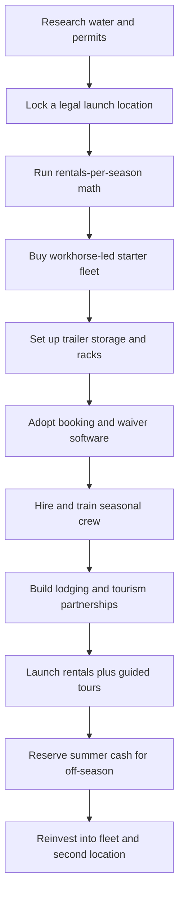

### Direct Answer

To start a kayak rental business in 2027, you buy a fleet of paddlecraft -- sit-on-top kayaks, recreational sit-inside kayaks, tandems, pedal-drive fishing kayaks, stand-up paddleboards, and increasingly inflatables -- stage it at or near accessible, beginner-friendly water, and rent it out repeatedly to tourists, families, anglers, and corporate groups by the hour, the half-day, the day, and the guided tour. The model is real, well-loved, and genuinely profitable in season, but it is brutally seasonal, location-dependent, and weather-exposed, and the entire economics rest on one number beginners never calculate: **rentals per boat per season**. A focused 2027 startup invests **$35K-$140K**, runs at a **48-62% operating margin after seasonal labor and damage**, and in a disciplined Year 1 generates **$45K-$160K in revenue** against **$18K-$70K in owner profit** -- almost all of it earned in a compressed Memorial-Day-to-Labor-Day peak that must fund the long off-season.

**TL;DR:** A kayak rental business is a seasonal, location-anchored, safety-critical asset-and-experience business. You buy durable rotomolded hulls once and rent each one 25-150 times per season for the better part of a decade. The engine is rentals-per-boat-per-season; the margin engine is guided tours and instruction, not cheap hourly rentals. Capex runs $35K-$140K; Year 1 revenue $45K-$160K; a mature single-or-dual-location outfitter by Year 5 reaches $300K-$650K revenue and $90K-$220K owner profit. The three things that kill kayak rental startups: a weak or wrong location, underpricing tours, and under-reserving for the off-season and weather. Viable in 2027 as a disciplined, location-obsessed, tour-led operation -- a poor fit for anyone who wants year-round income or light physical work.

## 1. What A Kayak Rental Business Actually Is In 2027

### 1.1 The Core Financial Idea

**A kayak rental business owns a fleet of paddlecraft and rents it out, over and over, through a seasonal operating window**, to people who want to be on the water for a few hours without owning a boat. You are not selling kayaks and you are not a guide service only. At the core you are the operation that has clean, safe, ready-to-paddle boats staged at an accessible launch point, hands them to a customer with a paddle and a life jacket and a safety briefing, and takes them back a few hours later to inspect, clean, and re-rack for the next renter.

**The entire business is a single financial idea executed thousands of times across a short season.** You buy a durable hull once, and then you rent that same hull out so many times in its operating months that the cumulative rental income dwarfs what you paid for it -- and then it keeps earning for years, because a well-cared-for rotomolded kayak has a long usable life. A sit-on-top that costs you nine hundred dollars and rents for thirty-five dollars an hour has paid for itself after roughly thirty paid hours, and a well-maintained boat generates many multiples of that every season.

**A kayak rental business is also fundamentally a trust business.** The customer is handing you money and then climbing into a small craft on open water, frequently for the first time in their life, and the entire transaction depends on their belief that the boat is sound, the staff know what they are doing, and the operation will not put them somewhere dangerous. That trust is built in the briefing, the fit of the life jacket, the cleanliness of the boat, and the calm competence of the dock crew -- and it is destroyed in a single bad incident.

### 1.2 What Changed By 2027

**The business is shaped by realities that did not fully exist a decade ago.** Customers discover and book online and expect a clean digital reservation and waiver flow. Outdoor recreation participation rose and broadly held through the early 2020s, widening the customer base beyond hardcore paddlers to casual tourists and families. Pedal-drive and fishing kayaks turned a recreation rental into a serious-angler rental at a much higher ticket. Inflatable and folding craft changed the storage-and-transport math for smaller operators. Stand-up paddleboards became a natural cross-sell sharing the same customer, the same water, and the same rack.

**The kayak rental business is not passive and it is not year-round.** It is a seasonal, location-anchored, safety-critical asset-and-experience business, and the founders who succeed understand that the boats are only half of it -- the other half is a great launch point, a real safety culture, a tight reservation system, and a calendar that gives you maybe twenty good summer weekends to make the year.

**The 2027 customer is also a different customer than the paddler of a decade ago.** They are less likely to be an experienced outdoorsperson and far more likely to be a casual tourist who has never held a paddle, found you through a phone search or a vacation-rental host's recommendation, and expects the experience to be easy, photogenic, and bookable in advance. This shift is not a footnote -- it reshapes the fleet (stable beginner-friendly hulls over technical craft), the operation (a real briefing every single time, because nobody can be assumed to know anything), the marketing (photos and reviews over gear specs), and the pricing (an experience worth paying a premium for, not a commodity hour). A founder who builds for the hardcore paddler in 2027 is building for a customer who mostly is not coming; a founder who builds for the nervous, curious, phone-first first-timer is building for the actual market.

**Two structural tailwinds make the model more durable in 2027 than skeptics assume:** the broad, multi-year rise in outdoor recreation participation that widened the casual customer base, and the explosion of short-term vacation rentals that created a large population of destination visitors with free time and an appetite for an on-water activity. Together they mean the demand side is real and growing even as the supply side stays fragmented and beatable.

### 1.3 Where It Sits Among Rental Models

| Rental model | Asset cost | Seasonality | Closest sibling guide |
|---|---|---|---|
| Kayak rental | $35K-$140K fleet | Severe (4-7 mo) | This guide |
| Boat rental | $150K-$600K+ fleet | Severe to moderate | (q1964) |
| RV rental | $60K-$400K fleet | Moderate | (q1963) |
| Pickleball court rental | $80K-$300K facility | Mild, year-round indoor | (q9571) |
| Party rental | $40K-$150K inventory | Moderate, event-driven | (q1965) |
| Vacation rental | $200K-$1M+ property | Moderate | (q1960) |

The kayak rental model is one of the **lowest-capital, highest-seasonality** entries in the recreation-rental family -- a meaningful advantage on the capex side and a meaningful constraint on the calendar side.

**That position has real strategic consequences.** Because the capex is low, the barrier to entry is modest -- a founder cannot rely on capital intensity to keep rivals out. The defensible moat in kayak rental is not money; it is the location, the permit, the safety reputation, the tour program, and the lodging partnerships -- all things that take time and operating skill to build rather than cash to buy.

## 2. The Fleet: What You Actually Buy And Why

### 2.1 The Boat Categories

**The fleet is the business**, and a founder must understand every category before spending a dollar, because the mix you buy in Year 1 sets your margin, your customer base, and your liability profile for years.

| Boat category | Typical hull cost | Rental rate | Sessions/season | Primary customer |
|---|---|---|---|---|
| Recreational sit-on-top | $400-$1,100 | $20-$45/hr | 60-150 | Casual tourist, first-timer |
| Recreational sit-inside | $500-$1,200 | $20-$45/hr | 50-110 | Drier-water paddler |
| Tandem kayak | $700-$1,300 | premium over single | 60-130 | Couples, families |
| Pedal-drive / fishing kayak | $2,000-$4,000 | $60-$200/session | 25-60 | Anglers, photographers |
| Touring / sea kayak | $1,200-$3,000 | tour-rate | 20-45 | Tour clients, experienced |
| Stand-up paddleboard (SUP) | $400-$900 | comparable to kayak | 55-130 | Cross-sell, variety seeker |
| Inflatable / folding kayak | $300-$1,500 | situational | varies | Mobile / delivery model |

**Recreational sit-on-top kayaks** are the boring, beautiful core of a rental fleet -- stable, self-draining, nearly impossible to capsize-and-sink, easy for a nervous first-timer, and cheap to maintain. Brands like Perception, Wilderness Systems, Old Town, and Pelican dominate this category. They are the high-turn workhorses that pay the rent because they suit the widest customer: the casual tourist who has never paddled, the family with kids, the bachelorette group, the guest from a nearby rental. A sit-on-top that swamps simply drains and floats; a customer who falls off climbs back on. That forgiveness is precisely why it is the right boat to hand a stranger, and why it should be the deepest part of any Year 1 fleet.

**Recreational sit-inside kayaks** suit calmer, cooler water and customers who want to stay drier; they are slightly less beginner-proof because a swamped sit-inside is a real problem to recover, so many pure-rental operations lean sit-on-top for the cleaner liability profile. A sit-inside fleet is not wrong, but it should be a deliberate choice tied to the water and the customer, not a default.

### 2.2 The High-Ticket And Cross-Sell Categories

**Tandem kayaks** -- two-seaters -- are a margin lever because they carry two paying customers, or a parent and a child, on one hull you maintain and store. They rent at a premium over a single, they serve couples and families (a huge slice of the casual market), and they let a nervous first-timer paddle alongside a stronger partner rather than alone. Every tandem in the fleet is one hull doing the revenue work of close to two.

**Pedal-drive kayaks** -- Hobie with the MirageDrive, Old Town with the PDL, Native, Bonafide -- are the high-ticket category: hands-free propulsion beloved by anglers and by customers who want their hands free to fish or photograph, running roughly $2,000-$4,000 a hull. They turn fewer times than a basic sit-on-top but each rental commands far more, and they let you serve the serious-angler market a basic fleet cannot touch. **Fishing kayaks** -- whether pedal or paddle, rigged with rod holders and stability for standing -- are a distinct sub-fleet with their own customer, their own higher daily rate, and their own care needs. **Touring and sea kayaks** -- longer, faster, tracked hulls -- serve guided tours and experienced paddlers on bigger water; they are more boat than a casual renter needs and are usually bought for the tour side rather than the walk-up rental side.

**Stand-up paddleboards** are the natural cross-sell: same customer, same water, same rack space roughly, a different experience at a comparable price point, and a way to capture the customer who wants to try something other than a kayak. **Inflatable and folding kayaks** -- Sea Eagle, Advanced Elements, Aquaglide -- changed the math for storage-constrained and multi-location operators: they pack down, they transport without a big trailer, and while they are not the choice for a high-volume fixed livery, they are a real tool for a mobile or delivery-based model.

The boat-and-trailer side of a kayak fleet is often equipment-financed; established outdoor and powersports lenders such as **Synchrony Financial (NYSE: SYF)** and bank lenders like **Truist Financial (NYSE: TFC)** underwrite seasonal recreation-equipment loans, and outdoor retailers including **Academy Sports + Outdoors (NASDAQ: ASO)** and **Dick's Sporting Goods (NYSE: DKS)** carry the recreational hulls and gear that seed a starter fleet.

### 2.3 The Portfolio Mindset

**A founder should think of the fleet as a portfolio:** high-turn workhorse sit-on-tops and tandems that generate volume and reliable cash, high-ticket pedal and fishing kayaks that lift the average rental and open the angler market, touring craft and SUPs that feed tours and cross-sell, and inflatables as a situational tool. The Year 1 mistake is overbuying high-ticket pedal boats or a huge fleet before the location proves it can fill the boring workhorses.

**The portfolio also has a lifecycle dimension beginners ignore.** Rotomolded hulls are durable but not immortal -- ultraviolet exposure degrades the plastic and hard rental use shows over a decade -- so a disciplined operator treats the fleet as a depreciating asset with a replacement schedule, retiring and reselling the most worn hulls each off-season and folding new boats in. Buying the fleet is a rolling capital program, not a one-time event.

## 3. The Three Models And The 2027 Market

### 3.1 The Three Ways To Build This Business

| Model | Core asset | Advantage | Challenge |
|---|---|---|---|
| Fixed livery | Waterfront location + fleet | Volume, foot traffic, visibility | Location/permit dependency, off-season lease |
| Tour-and-instruction | Guides + experience product | High margin, price-shield, calendar control | Skilled guides, more labor per dollar |
| Mobile-delivery outfitter | Trailer + lodging partnerships | No waterfront lease, many waters | Delivery logistics, harder to fill walk-up |

**The fixed livery model** operates from a single waterfront location where customers come to you, you stage boats at the water, and you run high-volume hourly and daily rentals plus walk-up traffic. **The tour-and-instruction model** leads with guided experiences -- sunset and full-moon paddles, wildlife and mangrove tours, history paddles, beginner classes, corporate team-building -- and treats the bare rental as secondary. **The mobile-delivery outfitter model** brings the boats to the customer, delivering kayaks and SUPs to vacation-rental guests, lakeside Airbnbs, campgrounds, and event groups -- a model deeply tied to the short-term-rental ecosystem covered in short-term rental management (q9624) and vacation rental (q1960).

### 3.2 Picking Deliberately

**Many successful operators blend these:** a fixed livery that also runs scheduled tours and delivers to nearby rentals on the side. The wrong move is trying to be all three at full intensity in Year 1 with limited capital -- the livery starves the tour program of guide investment, and the delivery routes outrun the trailer and crew. Most founders should pick a primary model that fits their location and capital, prove it, and layer the second on once it is paying the bills.

**The choice should follow the location and the capital, not the founder's preference.** A founder with a genuine shot at a high-traffic waterfront concession should build a fixed livery; one with strong paddling skill and only a modest spot should lead with tours and instruction; one in a vacation-rental-dense region with no realistic launch concession should build a mobile-delivery outfitter. The model is a function of the constraints, and the founders who fail at this stage usually picked the model they liked rather than the one their location and capital actually supported.

### 3.3 The 2027 Market Reality

**Demand is broad and structurally healthy but seasonal and weather-sensitive.** Outdoor recreation participation rose meaningfully in the early 2020s and broadly held, paddling included; the customer base widened well beyond hardcore paddlers to casual tourists, families, bachelorette and birthday groups, anglers, and corporate retreats.

**The competition is fragmented and location-bound.** Unlike many businesses, kayak rental competition is intensely local: the other operator on the same lake, the state park concession, the campground that lends boats, the resort with a few hulls for guests, and the long tail of seasonal side operations. National players like **REI**, the **YETI Holdings (NYSE: YETI)** gear ecosystem, and the lodging side anchored by **Marriott International (NASDAQ: MAR)** and **Airbnb (NASDAQ: ABNB)** rentals shape the customer flow, but the day-to-day competition for a given launch point is a handful of local operators and the substitutes a customer has within a short drive of where they are staying.

**This fragmentation cuts both ways.** It is a threat because there is no capital barrier keeping a new seasonal operator off the lake next summer. But it is a far larger opportunity, because the typical local competitor is an under-professionalized, price-competing, weakly-marketed operation. A new entrant who shows up with a clean phone-first reservation flow, a genuine tour-and-instruction product, a deliberate location, a disciplined safety practice, and real lodging partnerships beats the local field on professionalism, not on price.

| 2027 market shift | What it rewards |
|---|---|
| Online booking + digital waivers expected | Operators with a clean phone-first reserve flow |
| Casual non-paddler is the center of gravity | Stable beginner fleets, strong briefings |
| Pedal/fishing kayaks created angler segment | Higher-ticket boats in the mix |
| Vacation-rental boom | Delivery model, lodging partnerships |
| SUP cross-sell standard | Variety in the rack |

## 4. The Core Unit Economics: Rentals Per Boat Per Season

### 4.1 Why This Is The Whole Game

**This is the single most important section in the guide**, because the entire business lives or dies on one calculation that beginners almost never run. Every hull you own has a **rentals-per-season number** -- how many separate paid sessions it generates across your four-to-seven-month operating window -- and that number, multiplied by the average revenue per session, against the purchase cost, tells you whether the boat is an asset or dead weight on the rack.

**The reason this number is so often skipped is that it is uncomfortable.** It forces a founder to make a hard, specific estimate about their actual location -- how many warm sunny weekends, how much foot traffic -- before the romance of buying a beautiful fleet sets in. But the rentals-per-season estimate is the difference between a fleet that compounds and a fleet that sits, and it must be done honestly, boat type by boat type, before any money moves. A useful sanity check: a healthy fixed livery in a strong location turns its workhorse boats roughly two to four times on a good summer Saturday, a handful of times on a weekday, and almost not at all on a cold or rainy day.

### 4.2 The Math, Boat By Boat

| Boat | Cost | Rev/session | Sessions/season | Season revenue | Payback |
|---|---|---|---|---|---|
| Sit-on-top | $800 | $45 | 100 | $4,500 | ~1 month of summer |
| Tandem | $1,000 | $60 | 90 | $5,400 | ~1 month |
| SUP | $650 | $40 | 95 | $3,800 | ~1.5 months |
| Pedal/fishing kayak | $3,000 | $120 | 40 | $4,800 | 1-2 seasons |
| Touring/sea kayak | $2,000 | $90 | 30 | $2,700 | 2+ seasons (tour-fed) |

**Consider the math concretely.** A recreational sit-on-top costs roughly $500-$1,000, earns $20-$45 per paid hour, and in a strong location turns 60-150 paid sessions a season: at a hundred sessions averaging $45 of paddle time, that is $4,500 a year against an $800 cost. A pedal-drive fishing kayak costs $2,000-$4,000, rents for $60-$200 per session, and turns 25-60 sessions: the absolute numbers are large, the payback is one to two seasons, and it opens the angler market.

### 4.3 The Discipline This Imposes

**Before buying any boat, estimate its realistic rentals per season and revenue per session for your specific location and season length, and compare the annual earnings to the cost.** High-turn workhorse sit-on-tops and tandems should dominate the early fleet because they recover capital fast and fill the high-volume walk-up demand. High-ticket pedal and fishing kayaks earn their place by lifting the average ticket -- but only once the location has proven it can fill the workhorses. A founder who buys by rentals-per-season builds a fleet that compounds through the summer; a founder who buys a big beautiful fleet of high-ticket boats for a short season builds a rack full of idle capital that still has to be insured, stored, and financed in January.

**The rentals-per-season discipline also tells a founder when to stop buying.** Once the fleet is deep enough that workhorse boats are not fully turning even on the best Saturdays, the next dollar should not buy another sit-on-top -- it should buy a tandem, a SUP, a pedal boat, or nothing at all. A founder adds capacity only when the existing fleet is genuinely turning away customers on good days, because that turned-away demand is the only honest evidence that more boats will earn.

## 5. The Line-By-Line P&L

### 5.1 A Representative Summer Saturday

**Take a representative good summer Saturday at a fixed livery:** a fleet of twenty boats, each turning two to four paid sessions, plus a scheduled sunset tour -- a gross rental-and-tour day of roughly $1,800-$3,200. From that, the costs stack in an order beginners consistently underestimate.

| Cost line | Nature | Typical share / range |
|---|---|---|
| Seasonal labor (dock + guides) | Variable, largest | 22-35% of revenue |
| Damage, loss, repair | Variable | 4-9% of rental revenue |
| Waterfront lease / launch permit | Fixed, year-round | $4K-$40K+/yr |
| Trailer + vehicle | Fixed | fuel, maint, insurance, depreciation |
| Insurance (GL + marine + participant) | Fixed | $3K-$12K+/yr |
| Off-season storage | Fixed | a few thousand/yr |
| Booking software + marketing + admin | Fixed/semi-variable | low thousands/yr |
| Gear replacement (paddles, PFDs) | Recurring drip | ongoing |

### 5.2 Where The Margin Lands

**Seasonal labor is the largest variable cost** -- the dock staff who fit life jackets, give briefings, launch and land boats, run the register, and the guides who run tours. Loaded with payroll taxes and the reality that you are paying for staffed hours even on slow weekday afternoons, this is the squeeze point of the P&L. **Damage, loss, and repair runs a real 4-9% of rental revenue** across a season as a blended rate -- cracked hulls dragged over rocks, lost paddles, missing PFDs, sun-degraded gear, the occasional boat that floats away or gets stolen -- and it must be reserved for, not absorbed by surprise. **The waterfront lease or launch permit is a fixed cost that exists every month of the year**, including the five-plus months you generate no revenue. **The transport trailer and any vehicle** carry fuel, maintenance, insurance, and depreciation. **Insurance** -- general liability, marine coverage on the fleet, and the participant-liability exposure inherent in putting customers on water -- is a meaningful fixed annual cost. **Storage** for the off-season protects the asset when it is not earning, and **gear replacement** for paddles, PFDs, leashes, and dry bags is an ongoing drip, not a one-time purchase, because that gear wears and walks faster than the hulls.

**Net the season out and a healthy kayak rental operation runs a 48-62% operating margin after seasonal labor and damage**, with the spread driven almost entirely by how well the tour program is priced, how full the peak weekends get, and how disciplined the off-season cost control is.

### 5.3 The Seasonality That Dominates Everything

| Period | Revenue character | Operator action |
|---|---|---|
| May (Memorial Day) | Ramp, weekend-heavy | Staff up, shake down systems |
| June-August (peak) | 60-75% of annual revenue | Price firmly, build reserve |
| September (Labor Day) | Shoulder tail | Tours, classes fill gaps |
| October-April | Near-zero revenue | Reserve carries fixed costs |

**At the business level the seasonality dominates everything.** Revenue concentrates into roughly Memorial Day through Labor Day with shoulder weeks on each end, and a disciplined operator treats the peak as the period that must fund the entire year, building a reserve through the summer that carries the lease, the insurance, the storage, and the loan payments through the dead months. The founders who fail almost always made the same two errors: they competed only on cheap hourly rentals and never built the high-margin tour revenue, and they spent the summer cash instead of reserving it for the winter that was always coming.

**The practical consequence is a discipline most small-business owners never learn: living a year on a few months of cash.** The founder who treats the August balance as profit and spends it is the founder who cannot make the December lease payment. A useful internal rule: before any owner draw is taken from peak-season cash, the full off-season fixed-cost stack must be set aside first, and only the surplus above that line is genuinely the founder's to keep.

## 6. Location, Permitting, And The Startup Fleet

### 6.1 Location Is Close To The Whole Game

**In a kayak rental business, location is not one factor among many -- it is close to the whole game.** The ideal location has several things at once: **safe, accessible, beginner-friendly water** (a calm lake, a slow river, a protected bay); **an easy launch** (a beach, a ramp, a gentle bank); **visibility and foot traffic** (being where tourists already are); **parking**; and **a legal right to operate there**.

### 6.2 The Permit Reality

**That last point is where many would-be operators discover the business is harder than it looked.** Many of the best launch points sit on land managed by a state department of natural resources, a state or county park system, a municipality, or the federal government, and operating there means winning a **concession agreement or commercial-use permit** -- often competitive, often limited, sometimes simply unavailable to a new entrant. Putting customers on certain waters brings Coast Guard and state boating-safety rules into play.

| Location type | Access path | Risk level |
|---|---|---|
| Private leased waterfront | Negotiated lease | Moderate -- lease renewal risk |
| State/county park concession | Competitive bid | High -- limited, may be unavailable |
| Municipal launch | Commercial-use permit | Moderate -- rules can change |
| Marina concession spot | Sublease/agreement | Moderate |
| Mobile/delivery (no fixed site) | Lodging partnerships | Low site risk, high logistics |

**The practical sequence:** identify candidate locations, then investigate the permit and lease reality *before* falling in love with a spot -- who controls the land, who controls the launch, is there a concession process, when does it open, who currently holds it, what does it cost, and is there any path in at all. A great fleet at a location you cannot legally operate, or that has no parking, or that sits on dangerous water, is not a business.

**The location decision compounds in a way no other early decision does.** A weak fleet can be upgraded; weak software can be swapped; a thin tour program can be deepened. But a bad location is close to permanent -- it caps the rentals-per-season of every boat and the walk-up volume, and it cannot be fixed without relocating the entire operation. The founders who win in kayak rental almost always win on location first; the ones who lose almost always fell in love with a pretty spot and discovered the permit, parking, or water-safety reality only after the capital was committed.

**Water safety is itself a location screen, not just an operating concern.** A launch point with strong current, heavy powerboat traffic, cold water, or no protected area for beginners will generate incidents no matter how good the briefing is. A founder evaluating a site should walk the water on a windy afternoon, not just a calm morning, and ask honestly whether a nervous first-timer can be put on it safely.

### 6.3 The Startup Fleet And Capex Plan

**The principle is: buy enough workhorse boats to fill your best weekends, and no more, before adding high-ticket and specialty craft.** A disciplined Year 1 fleet for a fixed livery prioritizes, in rough order: a core of recreational sit-on-tops sized to realistic peak demand (ten to thirty boats for a modest launch); a meaningful share of tandems; a set of SUPs as cross-sell; a small number of pedal-drive or fishing kayaks; and a few touring kayaks if the plan includes a tour program from day one.

| Fleet build | Sit-on-tops | Tandems | SUPs | Pedal/fishing | Touring | All-in capex |
|---|---|---|---|---|---|---|
| Lean launch | 10-15 | 3-5 | 3-5 | 1-2 | 0-2 | $35K-$60K |
| Mid livery | 18-25 | 6-10 | 6-10 | 3-5 | 2-4 | $70K-$100K |
| Full livery + tours | 25-40 | 10-15 | 10-15 | 5-10 | 4-8 | $100K-$140K+ |

**The sequencing rule:** every additional dollar should go to the boat type with the best rentals-per-season return for your location until that type is deep enough to fill your peak weekends, and only then move to the next. Buy workhorses to the depth your best Saturday needs, add tandems for the families, layer in SUPs for cross-sell, sprinkle pedal boats for the angler ticket -- and resist the temptation to do it in the reverse order with a rack full of expensive boats and an unproven location.

**Sourcing the fleet well is a real lever on the startup number.** Buy from established paddlesport manufacturers and their dealers for the warranty and parts support, but buy at the right moment: end-of-season and prior-year-model boats can come at a meaningful discount on hulls functionally identical to the new ones, and fleet liquidations from operators exiting are a genuine source of cheap depth. The discipline is to buy the boats that suit the actual water and customer rather than the technical craft that appeal to the founder as a paddler.

## 7. Infrastructure, Safety, And Operations

### 7.1 Storage, Transport, And Equipment

**A kayak rental business is more than hulls**, and a founder must budget the surrounding infrastructure as a core cost, not an afterthought. Storage matters in two modes: in-season, the boats need a secure, organized staging area at or near the launch -- racks, a fenced or locked area, a system that makes the morning setup and evening re-rack fast and that lets staff count the fleet in and out; off-season, the fleet needs protected storage -- a yard, a barn, a building, or units -- that shields rotomolded hulls and gear from sun degradation, freezing, and theft through the dead months.

**The transport trailer is essential** for almost every model: it moves the fleet to and from off-season storage, serves the delivery model directly, and lets a fixed livery shift boats between launch points or to events. **Safety and rental equipment is a real line and an ongoing drip:** a Coast-Guard-approved PFD for every paddler in a range of sizes including children's, paddles with spares because they break and walk, leashes, bilge pumps, whistles, dry bags, signage, and the guide's safety kit. This equipment wears faster than the boats and is stolen or lost more often, so it must be budgeted as a recurring replacement cost. **The base of operations** -- even a small kiosk or shed at the launch -- needs a place to take payment, store the cash drawer and waiver system, and shelter staff and gear.

### 7.2 Safety, Liability, And Operating Practice

**Putting members of the public -- many of them inexperienced -- onto water is the defining risk of this business**, and a founder must build safety as a core operating function, not a disclaimer. Most kayak rental incidents are preventable and trace back to the same causes: a customer who could not really swim or paddle, conditions that should have closed the operation, a missing or unworn life jacket, or a customer who went somewhere the briefing should have ruled out.

| Safety practice | What it prevents |
|---|---|
| Enforced, sized, worn PFD | Drowning, the dominant fatal risk |
| Consistent safety briefing every time | Customer in danger from inexperience |
| Daily/hourly conditions assessment | Launching into wind, storm, cold water |
| Customer screening (swim/experience) | Bad match of customer to water |
| Equipment checks every boat | On-water gear failure |
| Properly drafted liability waiver | Litigation exposure (backstop, not substitute) |
| Trained dock staff and guides | Incident escalation, sloppy practice |

**The safety briefing is the cheapest and most powerful risk control the business has.** It is a real operational step, not a formality -- how to get in and out, how to hold the paddle, what to do if you tip, where you may and may not go, when to come back, how to signal for help -- delivered every single time, by every staff member, to every customer. **Conditions assessment** is the companion discipline: wind, current, water temperature, and storm risk are checked daily and hourly, and the willingness to restrict or close on a marginal day protects the business from the incident that ends it. **Customer screening** -- asking about swimming ability, steering nervous customers to calmer water or a guided option -- prevents the bad match before it reaches the water.

**The throughline:** the operators who treat safety as a culture -- enforced PFDs, real briefings, honest conditions calls, trained staff, sound gear, solid waivers -- run for years; the ones who treat it as paperwork are one preventable incident away from a business-ending claim and, far worse, a tragedy. A founder should build the safety practice as a written, trained, drilled system from day one, because it cannot be retrofitted after the incident that proves it was missing.

### 7.3 Booking Software, Waivers, And The Reservation Flow

**In 2027 a kayak rental operation runs on software.** Online booking and reservation software -- purpose-built platforms for tour and activity operators -- is the central system: it shows availability by boat type and time slot, takes reservations and deposits, prevents overbooking the fleet, sells tour seats, and consolidates the schedule. **Digital waivers integrate with the booking flow** so the liability waiver is signed before the customer arrives.

Payments and the storefront ride on familiar rails: **Block (NYSE: XYZ)** and **Shopify (NYSE: SHOP)** point-of-sale and checkout, **Toast (NYSE: TOST)**-style activity terminals at the kiosk, and reviews and discovery driven through **Yelp (NYSE: YELP)** and the search and maps surfaces of **Alphabet (NASDAQ: GOOGL)**.

**The reservation flow is not just convenience -- it is revenue capture.** The customer who decides on Thursday that they want the Saturday sunset tour is a sale that exists only if they can book, pay, and sign the waiver from their phone in that moment. Online booking also prevents overbooking, so staff never face a customer holding a confirmation for a boat already on the water. **Digital waivers integrate with that same flow** so the waiver is signed before the customer arrives, which speeds the dock and creates a clean signed record. **The discipline:** adopt the booking-and-waiver platform early, build a clean website with the tour calendar and real photos, and make the reserve-and-sign flow effortless on a phone.

## 8. Pricing, Staffing, And The Startup Cost

### 8.1 Pricing And The Tour Margin

**Pricing in kayak rental has two layers** -- the bare rental rate and the experience-and-tour layer -- and a founder must get both right, because competing only on the first is how operators stay poor.

| Product | Typical price | Margin character |
|---|---|---|
| Hourly bare rental | $20-$60/hr | Commodity, price-shopped |
| Half-day rental | $45-$90 | Commodity with hold discount |
| Full-day rental | $60-$140 | Commodity, moves slow boats |
| Pedal/fishing premium | +50-150% over basic | Higher absolute ticket |
| Guided sunset/wildlife tour | $50-$120/person | High margin, price-shielded |
| Beginner instruction class | $60-$150/person | High margin |
| Corporate team-building | $1,000-$5,000/group | Highest margin, calendar-filling |

**Bare rental pricing is anchored to the rentals-per-season math and to the local competitive set** -- hourly rates in the broad range of $20-$60, half-day and full-day rates that bundle a discount for the longer hold, tandem and pedal-and-fishing premiums, SUP rates comparable to a basic kayak -- but the bare rental is a commodity. The customer can stand on the dock and price-shop it against the next operator on the lake, so the rate must cover cost and a margin without being the whole strategy.

**The experience-and-tour layer is where the business is won.** A guided sunset or full-moon paddle, a wildlife or mangrove tour, a history or brewery paddle, a beginner instruction class, a corporate team-building session -- these are not commodity hours on a hull; they are an experience and a guide's expertise, they command $50-$200 per person, they cannot be price-shopped the way a bare rental can, they let you sell the same water at a far higher margin, and they give you a product to schedule into the weekday and shoulder-season slots that bare rentals leave empty. **Package and minimum discipline** -- group rates, party and event packages, lodging-partner bundles, order minimums on slow days -- protects against tiny low-margin transactions. **The seasonal layer shapes everything:** peak summer weekends should be priced firmly because demand is dense and the calendar is the constraint, not the price; shoulder weeks and weekdays can be filled with tours, classes, and packages rather than discounted bare rentals; and the operator should resist deep discounting in peak season when the boats themselves are the constraint. The founders who misjudge pricing run a thin-margin commodity livery and wonder why a busy summer did not produce profit; the ones who get it right treat the bare rental as the volume base and the tours and experiences as the margin engine that funds the year.

### 8.2 Staffing And Building A Seasonal Crew

**The business does not work on a busy summer Saturday without a crew**, and the staffing model is shaped entirely by the seasonality. **Dock and counter staff are the core seasonal hire** -- the people who greet customers, handle booking and waivers and payment, fit life jackets, deliver the briefing, launch and land boats. **Guides are the higher-skill hire** -- the people who run tours and classes -- and they require genuine paddling competence, safety training, and often certification.

| Role | Hire type | Drives |
|---|---|---|
| Dock/counter staff | Seasonal, weekend-heavy | Volume throughput, safety enforcement |
| Tour guide | Seasonal, skilled | High-margin tour revenue, safety record |
| Seasonal lead/manager | Returning, trusted | Daily schedule, crew, founder freedom |
| Founder | Year-round | Strategy, partnerships, off-season |

**Crew quality directly drives margin, safety, and reputation.** Staff who enforce PFDs, give real briefings, read conditions honestly, and handle boats carefully protect both the asset base and the business's name; sloppy crew damage boats, skip briefings, and create the incident risk that ends operations. As the operation grows, the founder adds a manager or lead to run the daily schedule and shifts from working the dock to running the business.

**Labor is largely variable and seasonal, which is a genuine advantage of this model** -- you are not carrying a big payroll through the dead months -- but the trade-off is the annual challenge of recruiting, training, and retaining a quality crew for a short, intense window. The single best answer to that challenge is retention: a returning crew member arrives already trained, already trusted, and already fast, and a founder who treats summer staff well -- fair pay, a good working environment, genuine respect for hard physical work -- builds a roster that comes back year after year. The operators who build a returning, trained, well-treated seasonal crew have a durable advantage over those scrambling for warm bodies every June, because kayak rental is a safety-and-service business as much as an asset business, and the service is delivered entirely by the people on the dock.

### 8.3 Startup Cost Breakdown: The Honest All-In Number

| Startup line | Range |
|---|---|
| Boat fleet | $20,000-$90,000 |
| Safety and rental gear | $3,000-$12,000 |
| Transport trailer | $2,000-$10,000 |
| Waterfront lease / concession / permit | modest to $15,000+ |
| Insurance (GL, marine, participant) | $3,000-$12,000 |
| Business formation, licensing, legal, waiver | $500-$3,000 |
| Booking and waiver software setup | a few hundred to low thousands |
| Base of operations (kiosk, racks, signage) | $2,000-$15,000 |
| Marketing and website | $1,500-$6,000 |
| Off-season storage | a few thousand |
| Working capital / off-season reserve | $10,000-$35,000 |
| **Total -- lean focused launch** | **$35,000-$70,000** |
| **Total -- full livery launch** | **$90,000-$160,000+** |

**The capital requirement, and especially the reserve requirement, is the single biggest filter on who should start.** It is not a year-round cash-flow business, and treating it as one -- launching with a thin reserve and a fleet too big for the season -- is how operators end up unable to make the off-season lease payment.

**Financing can soften the fleet and trailer lines, but it cannot soften the reserve.** Equipment financing for the boats and trailer, and end-of-season inventory buys, are common and sensible ways to spread the largest capital lines over time. But the working-capital and off-season reserve is the one line a founder cannot finance their way out of, because the business has a built-in five-month-plus stretch with no revenue and a built-in damage rate, and the lender's payments come due in exactly those dead months. A founder who borrows aggressively to buy a big fleet and skimps on the cash reserve has not reduced their risk -- they have concentrated it, turning the quiet off-season into a debt-service crisis. The right structure is a fleet sized to the season, financed conservatively if at all, and a genuine cash reserve of $10K-$35K set aside before the doors open. The reserve is not a nice-to-have; it is the cost of entry into a seasonal business.

## 9. The Trajectory And Real-World Scenarios

### 9.1 The Year-One Operating Reality

**Year 1 is location-proving and system-building mode, not profit-extraction mode.** The first season is spent learning how the chosen location actually performs -- which weekends fill, which boats turn, how weather hits the calendar -- discovering the real labor cost of staffing the dock and running tours, building the lodging and tourism partnerships that feed business, finding out where the operation is fragile (the rainy stretch, the boat that floats away, the staffing no-show on the busiest Saturday), and shaking down the safety practice. A disciplined Year 1 kayak rental startup can realistically generate **$45,000-$160,000 in revenue** against **$18,000-$70,000 in owner profit** -- meaningful but earned through an intense, physical, weather-exposed season and back-loaded into a handful of good months.

**The first off-season is the real test.** A founder who built the summer reserve carries the lease, insurance, and storage and emerges ready for a stronger Year 2; one who spent the summer cash scrambles or folds. Year 1 is also when the founder discovers whether the fleet mix and the location were right -- too many high-ticket pedal boats and not enough workhorse sit-on-tops, or a location with weak foot traffic, shows up as idle boats on sunny days. The work is genuinely hands-on: the founder is on the dock, fitting life jackets, giving briefings, hauling boats, watching the weather, and answering the phone. The founders who succeed treat Year 1 as paid tuition in a seasonal, location-dependent, safety-critical business and use it to calibrate the fleet, the pricing, the tour program, and the location decision; the ones who fail expected a simple summer cash machine and were unprepared for the weather, the off-season, the safety responsibility, and the location's real performance.

### 9.2 The Five-Year Revenue Trajectory

| Year | Revenue | Owner profit | Operating character |
|---|---|---|---|
| Year 1 | $45K-$160K | $18K-$70K | Lean fleet, location-proving, founder on dock |
| Year 2 | $110K-$300K | $40K-$120K | Fleet/tour program deepen, partnerships referring |
| Year 3 | $180K-$450K | $60K-$170K | Real system, returning crew, founder managing |
| Year 4 | $250K-$550K | $80K-$200K | Second location, corporate/event, delivery route |
| Year 5 | $300K-$650K | $90K-$220K | Mature single-or-dual-location outfitter |

**These numbers assume a genuinely good location, disciplined rentals-per-season buying, a real tour-and-experience margin layer, honest safety practice, and a respected off-season reserve.** They do not assume year-round revenue or exponential growth, because kayak rental scales with locations, season length, fleet size, and the depth of the tour program -- not magically.

**The growth math governs the founder's expectations.** A kayak operation compounds like a fleet of physical assets in a fixed calendar: revenue grows by adding boats up to the location's capacity, deepening the tour program, adding a second launch point or delivery route, and extending the operating shoulders where the climate allows -- each lever real but bounded. A mature kayak rental business is a real seasonal small business with a fleet, a location or two, a trained crew, and a balance sheet of durable earning assets: a genuinely good outcome, but one earned through years of seasonal and location discipline rather than a single breakout year.

### 9.3 Five Named Real-World Operating Scenarios

| Scenario | Profile | Outcome |
|---|---|---|
| Renata | Disciplined livery, $55K workhorse-led fleet, county-park concession, tours from week one | $130K Yr1 -> $340K Yr3 |
| Trevor | Overweights pedal/touring craft, low-traffic river launch, no parking | Idle capital, can't make off-season lease |
| Mei | Tour-and-instruction specialist, small cheap fleet, experience-led | $380K by Yr4 at strong margins |
| Alvarez family | Mobile-delivery outfitter, no waterfront lease, lodging partnerships | ~$500K multi-trailer by Yr5 |
| Dontae | Solid $140K Yr1, spends summer cash, no reserve | Forced winter boat sale at a loss |

**Scenario one -- Renata, the disciplined livery operator:** wins a competitive county-park concession on a calm, busy lake, launches with $55K into a workhorse-led fleet of eighteen sit-on-tops, six tandems, four SUPs, and two pedal boats, prices bare rentals at the market, and builds a scheduled sunset-tour program from week one; she hits $130K revenue in Year 1, reinvests into more boats and a second tour offering, and reaches $340K by Year 3 because her location fills and her tours carry the margin.

**Scenario two -- the cautionary tale, Trevor:** spends $120K but overweights the high-ticket categories -- a deep fleet of pedal-drive fishing kayaks and touring craft -- on a pretty but low-traffic river launch with no real parking; the expensive boats turn a fraction of what workhorses would, the location never produces the walk-up volume he assumed, his capital sits idle on the rack, and he cannot make the off-season lease payment. **Scenario three -- Mei, the tour-and-instruction specialist:** leases a modest spot and leads with experiences -- wildlife tours, full-moon paddles, beginner classes, corporate team-building -- treating bare rental as secondary; her fleet is smaller and cheaper but her revenue per customer is multiples higher, her weekday and shoulder-season calendar is full, and by Year 4 she runs a respected guided-paddling brand at strong margins.

**Scenario four -- the Alvarez family, mobile-delivery outfitter:** skips the expensive waterfront lease entirely, runs a trailer-and-route delivery operation serving vacation-rental guests and lakeside Airbnbs across a resort region, builds deep relationships with property managers and lodging hosts, and by Year 5 runs a multi-trailer delivery business near $500K with no fixed waterfront cost. **Scenario five -- Dontae, the off-season casualty:** builds a solid fleet and a good Year-1 season grossing $140K at a strong lake location, but spends the summer cash on expansion and lifestyle, enters the off-season with no reserve, cannot cover the concession fee, the insurance, and the storage through the dead months, and is forced to sell boats at a loss in the winter -- the canonical illustration of disrespecting the off-season reserve. These five span the realistic distribution: disciplined livery success, wrong-fleet-and-wrong-location failure, profitable tour specialist, delivery-model upside, and seasonality wipeout.

### 9.4 The Startup Sequence: A Mermaid Map

## 10. Lead Generation, Risk, And The Counter-Case

### 10.1 Lead Generation: The Lodging And Tourism Ecosystem

**Kayak rental is a tourism business**, and the lead-generation engine is the lodging-and-tourism ecosystem far more than broad advertising.

| Lead channel | How it produces customers |
|---|---|
| Vacation-rental hosts / property managers | Guests ask for recommendations; you become the referral |
| Hotels, resorts, campgrounds | Front desks and concierges refer guests |
| Convention and visitors bureau, tourism sites | Where destination visitors plan days |
| Event/group channels (corporate, bachelorette) | High-value group bookings |
| Online discovery (website, marketplaces, reviews) | Converts demand into bookings |
| Repeat local customers, classes, community | Softens pure-tourist dependence |

**Vacation-rental hosts and property managers are among the most valuable relationships.** The explosion of short-term rentals created a large population of guests who arrive in a destination wanting things to do, and the host or property manager is asked for recommendations constantly; becoming the kayak operator a host recommends, leaves a flyer for, or partners with on a guest discount is a durable, repeating source of qualified customers -- and it is the entire foundation of the delivery model, a channel shared with party rental (q1965) and treehouse rental (q9647) operators chasing the same destination-visitor demand. **Hotels, resorts, campgrounds, and the broader lodging base** play the same role: their guests are the customer, their front desks and concierges are the referral channel, and a preferred-vendor arrangement turns a steady stream of visitors into bookings. **The local visitor and tourism ecosystem** -- the convention and visitors bureau, tourism websites, visitor guides, the welcome-center map -- is where destination visitors plan their days. **Event and group channels** -- corporate retreat planners, bachelorette and birthday organizers, summer camps, schools, scout groups -- deliver high-value group bookings.

**Paid advertising plays only a modest role; the business is won through relationships and reputation.** A founder should treat partnership-building -- deliberately cultivating the vacation-rental hosts, the resorts, the campgrounds, and the visitor bureau -- as a core ongoing function, because a kayak operator with a thin partnership base competes on hourly price, and one with a deep one has a steady, defensible flow of qualified, ready-to-book customers. Repeat local customers -- residents who paddle, who take classes, who do team-building -- soften the pure-tourist dependence and add a layer of demand that does not evaporate when the visitor season ends.

### 10.2 Risk Management And Insurance

| Risk | Primary mitigation |
|---|---|
| Participant injury / liability | Safety practice + GL/participant insurance + waiver |
| Fleet damage, loss, theft | Durable boats, count-in-count-out, marine coverage |
| Weather | Conditions discipline, willingness to close, reserve |
| Seasonality | Disciplined summer reserve, shoulder programming |
| Location / permit loss | Strong authority relationships, don't over-invest |
| Capital concentration | Rentals-per-season buying, second revenue stream |
| Crew (no-show, under-trained) | Returning crew, real training, workers' coverage |

**Each of these risks deserves a deliberate, named response rather than a hope.** Participant-injury risk is mitigated by the safety practice and backstopped by properly sized general-liability and participant-liability insurance and a drafted waiver. Fleet damage and theft is mitigated by durable boats, count-in-count-out discipline, secure storage, and marine coverage. Weather risk is mitigated by conditions discipline, weather clauses in tour bookings, and a reserve that absorbs a bad summer. Location and permit risk is mitigated by strong relationships with the permitting authority and not over-investing against a short permit.

**Every major risk in kayak rental has a known mitigation**, and the operators who fail are usually the ones who carried thin insurance, ran a weak safety culture, used a flimsy waiver, or ignored the seasonality and permit risks they could see coming. None of these risks are surprises; a disciplined founder can plan for every one of them before the first boat goes in the water.

### 10.3 Counter-Case: When You Should Not Start A Kayak Rental Business

**This section is the honest counterweight, because the kayak rental model is genuinely wrong for many people, and a clear-eyed founder should be able to talk themselves out of it.**

**Do not start this business if you need year-round income.** The model has a built-in four-to-seven-month earning window and a five-plus-month stretch of fixed costs and zero revenue. If your household cannot survive a back-loaded, seasonal cash flow, this is the wrong business. **Do not start it if you cannot secure a genuinely good location.** A weak launch point -- no foot traffic, hard water access, no parking, or a permit you cannot actually get -- caps the business permanently no matter how good the fleet is; Trevor's scenario is not bad luck, it is the predictable result of a location decision made backward.

**Do not start it if you are uncomfortable with physical, weather-exposed, safety-critical work.** The founder is on the dock, fitting life jackets, hauling boats, watching the sky, and carrying the responsibility of putting inexperienced people on water. **Do not start it if you are under-capitalized for the reserve.** A founder who launches with a fleet too big for the season and a thin reserve is not running a business -- they are running a countdown to the first off-season lease payment they cannot make.

| You should NOT start if... | Better-fit alternative |
|---|---|
| You need steady year-round income | A year-round model -- short-term rental management (q9624) |
| You want low physical involvement | A property-based model -- vacation rental (q1960) |
| You cannot get waterfront / a launch permit | A facility model -- pickleball court rental (q9571) |
| You want a non-seasonal recreation business | An indoor facility -- pickleball court rental (q9571) |
| You want a diversified land-tourism asset | Agritourism (q9648) or treehouse rental (q9647) |

**Conversely, the kayak rental model is an excellent fit** for a founder who is location-obsessed, comfortable with seasonal cash flow, willing to do physical hands-on work, disciplined about a safety culture and an off-season reserve, and energized by building a tour-and-experience product rather than competing on the cheapest hourly rate. For that founder, in the right location, it is a genuinely good small business with a balance sheet of durable, long-earning assets.

### 10.4 The Decision Checklist

| Question | Pass condition |
|---|---|
| Is there a legal, safe, accessible launch location? | Yes, with a permit path you have verified |
| Have you run rentals-per-season on every boat? | Yes, workhorses dominate the build |
| Is the tour-and-experience layer in the plan? | Yes, priced as the margin engine |
| Is the off-season reserve funded ($10K-$35K)? | Yes, before launch |
| Is the safety practice built as a culture? | Yes, PFDs, briefings, conditions, training |
| Are lodging/tourism partnerships being cultivated? | Yes, as a core ongoing function |

**If every row passes, the kayak rental business is viable in 2027** as a disciplined, location-obsessed, tour-and-experience-led operation. If any row fails, fix it before buying a single boat -- because the fleet is the easiest part to acquire and the hardest part to unwind at a loss.

## 11. Related Pulse Entries

For founders comparing the kayak rental model against adjacent recreation-and-rental businesses, these sibling guides are the most useful next reads. Start with the closest water-and-equipment cousin in boat rental (q1964), then study the seasonal-fleet logistics of RV rental (q1963). The demand-side ecosystem is best understood through vacation rental (q1960) and short-term rental management (q9624), which feed the delivery model directly. For a non-seasonal recreation-facility contrast, see pickleball court rental (q9571). For destination-tourism asset models, review treehouse rental (q9647) and agritourism (q9648). And for event-and-group revenue mechanics that overlap with corporate paddling bookings, see party rental (q1965).

## 12. Sources

1. U.S. Coast Guard -- Recreational Boating Safety Program guidance.
2. U.S. Coast Guard -- Recreational Boating Statistics, annual report.
3. National Marine Manufacturers Association -- paddlesports participation data.
4. Outdoor Industry Association -- annual Outdoor Participation Report.
5. The Outdoor Foundation -- paddlesports and kayaking participation trends.
6. American Canoe Association -- instruction and safety certification standards.
7. U.S. Bureau of Economic Analysis -- Outdoor Recreation Satellite Account.
8. U.S. Small Business Administration -- seasonal business and startup financing guidance.
9. U.S. Small Business Administration -- equipment financing and 7(a) loan overview.
10. Internal Revenue Service -- Publication 334, Tax Guide for Small Business.
11. Internal Revenue Service -- seasonal employment and payroll tax guidance.
12. U.S. Department of Labor -- seasonal worker classification and wage guidance.
13. National Park Service -- commercial use authorization and concession framework.
14. U.S. Forest Service -- outfitter and guide special-use permit guidance.
15. State departments of natural resources -- waterway concession and launch-permit frameworks.
16. National Association of State Boating Law Administrators -- state boating regulations.
17. Insurance Information Institute -- general liability and commercial coverage overview.
18. Insurance Information Institute -- inland marine and equipment coverage guidance.
19. American Camp Association -- waterfront program and safety standards.
20. Hobie -- MirageDrive pedal-kayak product specifications.
21. Old Town / Johnson Outdoors (NASDAQ: JOUT) -- recreational and PDL kayak line.
22. Confluence Outdoor -- Perception and Wilderness Systems product data.
23. Pelican International -- recreational kayak pricing and specifications.
24. Academy Sports + Outdoors (NASDAQ: ASO) -- recreational paddlecraft retail pricing.
25. Dick's Sporting Goods (NYSE: DKS) -- kayak and SUP retail pricing.
26. REI Co-op -- guided paddling adventures and outdoor-school programming.
27. YETI Holdings (NYSE: YETI) -- outdoor recreation gear market commentary.
28. Airbnb (NASDAQ: ABNB) -- short-term rental host and experiences data.
29. Marriott International (NASDAQ: MAR) -- resort and lodging activity-partnership context.
30. Shopify (NYSE: SHOP) -- point-of-sale and e-commerce platform documentation.
31. Block (NYSE: XYZ) -- Square point-of-sale and small-business payments data.
32. Toast (NYSE: TOST) -- activity and hospitality terminal context.
33. Yelp (NYSE: YELP) -- local-business discovery and review data.
34. Alphabet (NASDAQ: GOOGL) -- Google Search and Maps local-discovery context.
35. Synchrony Financial (NYSE: SYF) -- recreation and powersports equipment financing.
36. Truist Financial (NYSE: TFC) -- small-business and seasonal lending overview.
37. U.S. Travel Association -- domestic tourism and destination-visitor trends.
38. Destinations International -- convention and visitors bureau partnership practices.
39. Arkive Paddlesports Retailer Association -- dealer and fleet-liquidation market data.
40. Pulse RevOps internal benchmarks -- seasonal recreation-rental unit economics.
