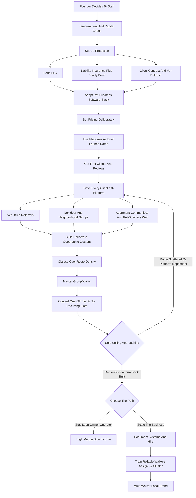

### Direct Answer

To start a dog walking business in 2027, you build a dense, deliberately geographic route of recurring midday and pre/post-work walks for dogs whose owners are at the office, charge per visit, and stack those visits into tight clusters so each paid hour holds multiple billable walks instead of one. The model is genuinely real, fast to launch on $500-$3,500 of capital, and unusually high-margin -- a disciplined solo operator runs a 75-88% net margin -- but its economics live and die on one number almost no beginner calculates: walks per hour per square mile, the route density that turns a tiring single-dog hustle into a profitable business. Build a tight, off-platform, recurring-revenue book and a solo walker reaches $55K-$90K; build a scaled walker team and the operation reaches $250K-$500K-plus.

**TL;DR:** Dog walking in 2027 is a low-capital, high-margin, trust-based local service business. Startup cost is $500-$3,500 (insurance, bonding, an LLC, scheduling software, gear, leads). A solo operator nets 75-88% pre-tax and earns $25K-$80K in Year 1, climbing toward a $55K-$90K solo ceiling. The business is won on **route density** (clustering visits so drive time collapses), **group walks** (three to six compatible dogs walked together, multiplying fees per hour), **off-platform direct clients** (escaping Rover and Wag's 15-40% commission), and **recurring weekly slots** (the only durable asset). The three things that kill startups: scattered low-density routes, permanent platform dependency, and skipping insurance and bonding. It is a poor fit for anyone wanting passive income, indoor work, or schedule flexibility the midday window does not allow.

## 1. What A Dog Walking Business Actually Is In 2027

### 1.1 The Core Transaction

A dog walking business sells the recurring service of exercising, relieving, and supervising dogs while their owners are away or unable to do it themselves. **You are not a pet store, a groomer, or a vet** -- you are the reliable, insured, key-holding person who shows up at a scheduled time, lets the dog out, walks it for a set duration, gives it water, cleans up after it, and locks up. The entire business is one simple transaction repeated thousands of times: a dog needs to move and relieve itself in the middle of a day its owner spends elsewhere, and you guarantee that happens.

**The job is concrete and physical.** You arrive, you handle the leash and the dog, you walk a safe route, you manage the door and gate so the dog never escapes, you document the visit, and you secure the home. Repeat that ten or twelve times a day, five days a week, and you have a business.

### 1.2 The 2027 Demand Backdrop

Several realities shape the model in 2027. **The return-to-office trend has restabilized** enough that a large share of dog owners are again physically away from their dogs for eight-to-ten-hour stretches -- the core demand driver. **US dog ownership remains enormous**, with tens of millions of households and dogs increasingly treated as family members whose exercise and wellbeing owners will pay to protect. **The platform layer** -- Rover and Wag chief among them -- made it trivially easy to get a first client and just as trivially easy to stay trapped paying commission. And **scheduling and GPS-tracking software** made it possible for a solo walker to run a professional, trackable operation.

### 1.3 What It Is Not

The dog walking business is **not passive and not glamorous**. It is a route-logistics-and-trust business: you are building a dense geographic schedule of recurring visits, you are being handed keys to people's homes, and the founders who succeed understand the business is a tight route, a book of recurring clients who never churn, and a reputation for showing up exactly when promised -- not an app that magically fills the day.

| Myth | Reality |
|---|---|
| "Get paid to play with dogs" | Get paid to run a tight logistics route in all weather |
| "Passive, easy income" | Physical daily labor on a fixed midday schedule |
| "The app fills my book" | Off-platform direct client building is sustained hustle |
| "Charge per walk, that's the math" | The math is billable walks per paid hour |
| "Low capital means low effort" | Low capital, but reputation and density take years |

## 2. The Core Unit Economics: Walks Per Hour Per Square Mile

### 2.1 Why Route Density Is The Whole Game

This is the single most important section in the guide, because the entire business lives or dies on route density -- the metric beginners never calculate. **Every dog walker has a fixed number of billable hours in a workday**, and the question that determines income is not "how much do I charge per walk" but "how many billable walks fit inside each paid hour."

**Scattered single-dog visits** across a metro mean fifteen to thirty minutes of driving between each one; a thirty-minute walk plus twenty minutes of drive time means roughly one visit per fifty minutes -- about six to eight visits in a full, draining day, and at $25 a visit that is $150-$200 of gross revenue. **A dense recurring cluster** -- a neighborhood, a few adjacent zip codes, an apartment complex with many dog owners -- cuts drive time to five minutes, fitting ten to twelve solo visits in the same day for $250-$300 gross. **Group walks** -- three to six compatible dogs from the same cluster -- can collect $90-$200 in a single hour because that hour contains four or five billable visits stacked together.

### 2.2 The Discipline It Imposes

The route-density math forces one rule: **before taking any client, ask whether they fit the cluster.** A client across town who pays full price is often worth less than a client two doors down from an existing one, because the cross-town client costs you the drive time that could have held another visit.

| Route Type | Drive Between Visits | Solo Visits/Day | Gross/Day (solo @ ~$28) |
|---|---|---|---|
| Scattered metro-wide | 15-30 min | 6-8 | $150-$200 |
| Dense recurring cluster | ~5 min | 10-12 | $250-$300 |
| Cluster + group walks | ~5 min | 4-5 stacked fees/hr | $300-$500+ |

### 2.3 The Two Kinds Of Operator

**The route-density operators** build tight, deliberately geographic books -- they say no to scattered clients, recruit referrals within existing clusters, and design group walks out of compatible neighborhood dogs. They earn double or triple per billable hour. **The take-every-client operators** build a book that looks full and pays poorly, because they are running a delivery route, not a walking business. Route density is the entire game, and it is the same lever that determines who wins in any route-based local service -- the lawn-care, cleaning, and poop-scooping operators all live by it (q1149).

## 3. The Honest Startup Cost: Why This Is A Low-Capital Business

### 3.1 The Line-Item Breakdown

A founder needs a clear-eyed total of what it costs to launch, and the genuine good news is that the number is small -- one of the lowest-capital legitimate businesses available in 2027.

| Item | Cost |
|---|---|
| Commercial general liability insurance (Year 1) | $150-$600 |
| Surety bond | $100-$300 |
| Business license + LLC formation | $50-$400 |
| Pet-business scheduling software | $20-$80/month |
| Gear (slip leads, hands-free belts, bags, water, weather gear) | $150-$500 |
| Phone + simple website/booking page | $0-$300 |
| Initial marketing and leads | $100-$800 |
| Total (bare-bones start) | ~$500-$1,500 |
| Total (fuller, well-equipped launch) | ~$1,500-$3,500 |

### 3.2 What You Do Not Need

There is **no inventory, no storefront, no vehicles beyond the car the founder already owns, and no employees on day one.** This is what makes dog walking one of the most accessible businesses to start.

### 3.3 The Catch In The Low Barrier

The low barrier is also the catch: **it is low-capital, not low-effort.** The same low barrier means competition is easy to enter, which is exactly why route density, recurring clients, and reputation -- not capital -- are the real moat. Capital cannot defend a dog walking business; only a dense owned book can.

## 4. Pricing Architecture: What To Charge In 2027

### 4.1 The Per-Walk Base Prices

Pricing has several layers, and the recurring core is where the real money lives.

| Service | Price Range |
|---|---|
| 20-min potty-break visit | $15-$28 |
| 30-min solo walk | $20-$40 |
| 60-min solo walk | $30-$60 |
| Group walk (per dog, 3-6 dogs) | $18-$35 |
| Adventure hike with transport | $45-$110 |
| Weekly package (5 walks) | $90-$180 |
| Monthly recurring (20+ walks) | $300-$650 |
| Multi-dog same-household discount | 10-20% off |
| Holiday / weekend premium | +25-50% |
| Overnight pet sitting (adjacency) | $50-$150+/night |

### 4.2 The Recurring Packages

The recurring packages are the heart of the business: a **weekly package** of five walks at a modest discount, a **monthly recurring arrangement** that locks in twenty-plus walks a month, and the structural goal of converting every one-off client into a standing weekly slot. **A client who walks once is revenue; a client who books the same midday slot five days a week, fifty weeks a year, is an annuity.**

### 4.3 The Add-On And Premium Layer

**Add-on pricing** captures the rest: a multi-dog-same-household discount, a holiday and weekend premium of 25-50%, a last-minute booking surcharge, a key-pickup or meet-and-greet fee, and add-ons like medication administration or extended playtime.

### 4.4 The Strategic Pricing Rule

**Price the recurring weekly client attractively enough that they lock in and never leave; price one-off, last-minute, and out-of-cluster work at a premium because it disrupts the route; and never compete on being the cheapest.** The cheapest walker attracts price-shoppers who churn; the reliable, insured, well-reviewed walker priced at the middle-to-upper end of the local range attracts the recurring clients who form the durable book. The founders who underprice the recurring core are giving away the only annuity the business has.

## 5. The Platform Trap: Rover, Wag, And Why Off-Platform Wins

### 5.1 What The Platforms Do

A founder must understand the platform layer clearly. **Rover (NASDAQ: ROVR)** and **Wag (NASDAQ: PET)** -- the dominant pet-care marketplaces -- connect dog owners with walkers, handle payment, and provide a steady trickle of new-client demand. For a brand-new walker with no reputation, they are a legitimate way to get the first few jobs and the first few reviews.

### 5.2 The Cost Is Steep And Structural

These platforms take a commission -- commonly in the **15-40% range** -- on every transaction, forever, and that commission comes off the top of an already modest per-walk price. Worse, **the platform owns the client relationship**, the booking, and the communication; the walker is a substitutable service provider, not a business owner, and the platform can change terms or surface a competitor at any time.

| Dimension | Platform Client | Off-Platform Direct Client |
|---|---|---|
| Commission paid | 15-40% forever | 0% |
| Who owns the relationship | The platform | The walker |
| Booking channel | Platform app | Walker's own software |
| Price control | Platform-influenced | Walker sets it |
| Durability | Substitutable any time | Recurring, owned |
| Role of the walker | Gig provider | Business owner |

### 5.3 The Off-Platform Direct Model

A direct client -- found through a vet referral, a Nextdoor post, a neighborhood Facebook group, a flyer, or word of mouth -- **pays the walker the full price, books directly through the walker's own scheduling software, and belongs to the walker.** The standard playbook for a serious founder: use the platforms briefly and deliberately to build initial reviews and a first handful of clients, then drive every subsequent client off-platform, and convert platform clients to direct relationships wherever the platform terms allow.

### 5.4 Why The On-Demand Model Underperforms

The ride-share-style on-demand dispatch model has repeatedly underperformed because **dog walking is fundamentally a recurring, trust-based, relationship business, not an on-demand gig.** A founder who treats the platforms as a permanent client source builds a capped, commission-drained side hustle; one who treats them as a temporary launch ramp builds an owned book of direct recurring clients.

## 6. Insurance, Bonding, And Legal Protection

### 6.1 General Liability Insurance Is The Foundation

This is the section a founder is most tempted to skip and most foolish to skip, because the entire business consists of being responsible for other people's animals and homes. **Commercial general liability insurance** covers the realistic disasters: a dog you are walking bites someone, a dog gets loose and is hit by a car, a dog injures another dog, you damage a client's home, a dog gets sick or injured in your care. Operating without it is betting the entire business -- and personal assets -- on nothing going wrong.

### 6.2 Bonding And Entity Structure

**Bonding** matters because the walker holds keys and enters homes; a surety bond protects clients against theft and is both a genuine protection and a trust signal that wins clients. **Most walkers form an LLC** to separate personal assets from business liability, register the business, and obtain the local business license their jurisdiction requires.

### 6.3 Contracts And Veterinary Authorization

| Protection | What It Covers | Why It Matters |
|---|---|---|
| General liability insurance | Bites, escapes, injury, property damage | The business-ending event |
| Surety bond | Theft from client homes | Trust signal plus protection |
| LLC entity | Personal-asset separation | Liability containment |
| Client service contract | Scope, behavior representations, terms | Prevents disputes |
| Vet-release authorization | Emergency care decisions and payment | Turns a crisis into a procedure |
| Pet first aid / CPR cert | Competence in an incident | Marketing asset plus real skill |

**Client contracts** cover the scope of service, the client's representations about the dog's behavior and health, liability and emergency-vet authorization, key handling, cancellation, and payment terms. **Veterinary release authorization** -- written permission and a plan for what to do and who pays if a dog needs emergency care -- prevents a crisis from becoming a dispute.

### 6.4 The Highest-Return Money You Spend

The discipline: insurance, bonding, an entity, and a solid contract are **not optional overhead** -- they are the difference between a bad day and a business-ending event. In a business with this little startup capital, the few hundred dollars they cost is the highest-return money the founder spends.

## 7. Finding Your First Clients: The Off-Platform Lead Engine

### 7.1 Veterinary Offices

**Vets are asked constantly for walker recommendations**, and a reliable, insured walker who introduces themselves professionally, leaves cards, and earns the staff's trust gets a steady stream of pre-qualified referrals. This is among the most valuable relationships a founder can build.

### 7.2 Neighborhood Channels

**Nextdoor and neighborhood Facebook groups** are the modern flyer -- hyper-local, full of exactly the dog owners in a target cluster, and effective both for direct posts and for the word-of-mouth that follows a good first job.

### 7.3 Apartment Communities And The Pet-Business Web

| Lead Channel | Strength | Cluster Value |
|---|---|---|
| Veterinary offices | Pre-qualified, trusted referrals | High |
| Nextdoor / neighborhood groups | Hyperlocal, high volume | High |
| Apartment / condo communities | Many dogs, one address | Very high |
| Groomers, daycares, trainers | Overflow and complementary work | Medium |
| Existing-client referrals | Highest-trust, cluster-tightening | Very high |
| Physical presence (branded gear) | Passive inbound | Medium |
| Google Business Profile + reviews | Converts existing demand | Medium |

**Apartment and condo communities** with many dog-owning residents are a route-density goldmine -- a relationship with a property manager can produce a cluster of clients in a single building. **Groomers, pet supply stores, doggy daycares, and trainers** form a referral web of pet businesses that send overflow work.

### 7.4 Existing Clients Are The Best Source

**A happy recurring client refers neighbors**, and referrals within an existing cluster are the highest-value clients possible because they tighten route density. The founder who builds vet relationships, works the neighborhood channels, and relentlessly converts happy clients into referrers builds a direct book that compounds.

## 8. The Group Walk: The Single Biggest Revenue Multiplier

### 8.1 Why The Group Walk Breaks The Ceiling

A founder who wants to break past the solo-income ceiling must understand the group walk, because it is the one lever that multiplies revenue per billable hour without hiring anyone. A solo walk is one dog, one fee, one block of time. **A group walk is three to six compatible dogs, walked together, each billed** -- so one hour of the walker's time generates four or five fees instead of one. At $25 per dog, a five-dog group walk grosses $125 for the same hour that a solo walk grosses $25-$40.

### 8.2 What It Requires

**Group walks require real skill and discipline.** The dogs must be temperament-matched and introduced carefully; the walker must be genuinely capable of handling multiple leashes, reading group dynamics, and keeping control; the route must be safe for a pack; and the clients must all be in the same cluster so the dogs can be picked up and dropped off efficiently. The walker builds groups deliberately -- identifying compatible dogs within a neighborhood cluster, running structured meet-and-greets, starting small.

### 8.3 The Constraints

The constraints are real: **local regulations sometimes cap how many dogs one person may walk at once**; liability rises with group size; and a poorly matched group is a genuine safety risk. But for the operator who builds the skill, the group walk is the difference between a solo income of $35K and one of $75K-$90K, because it attacks the core constraint -- billable hours -- directly.

## 9. Scheduling, Routing, And The Software Stack

### 9.1 The Management Platform

In 2027 a dog walking operation runs on software, and a founder should adopt the stack early because it is cheap, it is the operational backbone, and it is a visible trust signal. **Pet-business management software** -- Time To Pet, Scout, Precise Petcare, and similar -- holds the client and pet profiles (the dog's quirks, health notes, where the leash lives), manages the recurring schedule, handles booking and cancellations, generates invoices, and produces the GPS-tracked walk report.

### 9.2 The GPS Walk Report

| Software Function | What It Does | Why It Matters |
|---|---|---|
| Client/pet profiles | Quirks, health notes, key location | Reduces errors and onboarding load |
| Recurring scheduling | Standing weekly slots, calendar view | Makes route density visible |
| GPS walk reports | Map, photos, notes after each walk | Retention tool and trust signal |
| Automated invoicing | Stored cards, recurring billing | Removes payment friction |
| Client communication | Reminders, rescheduling, messaging | Cuts the evening admin load |

**The GPS walk report** -- a map of the route, photos, and notes sent to the owner after every walk -- is both an operational record and a powerful retention tool. It tells the working owner their dog was genuinely cared for, and it justifies premium pricing and direct booking.

### 9.3 Routing Discipline And Payment Automation

**Routing discipline** is the other half: the walker plans the day as a geographic sequence, not a list, grouping visits by cluster and time window, and the software's calendar view makes the route-density problem visible. **Payment automation** -- recurring billing, stored cards, automatic invoicing -- removes the friction of chasing payment. The operators who run on software serve more clients with fewer errors and lower churn than those running off a paper calendar.

## 10. The Year-One Operating Reality

### 10.1 Route-Building And Reputation-Building Mode

Year 1 is route-building and reputation-building mode. The first months are spent getting the first clients, **learning which neighborhoods cluster well**, discovering the real rhythm of a midday-concentrated workday, and finding out where the operation is fragile: the rainy week, the dog that turns out to be reactive, the client who cancels last-minute, the day three walks collide in the noon hour.

### 10.2 The Realistic Year-One Numbers

A disciplined Year 1 solo dog walker realistically generates **$25,000-$80,000 in revenue**, and the spread is almost entirely a function of route density and recurring-client mix -- the low end is scattered one-off clients found mostly through platforms; the high end is a tight cluster of recurring weekly clients with group walks layered in. Because costs are so low, **75-88% of that revenue becomes owner profit before self-employment tax.**

### 10.3 The Physical Truth

The work is genuinely physical and weather-exposed: the walker is outside in heat, cold, and rain, on their feet for hours, with the schedule concentrated into the midday window. Year 1 is when the founder discovers whether they enjoy it -- the people who thrive genuinely like dogs, being outdoors, and the autonomy; the people who imagined a passive or indoor business are unhappy fast.

## 11. The Solo Income Ceiling And The Hiring Decision

### 11.1 The Wall Every Founder Hits

Every dog walking founder eventually hits the same wall: the solo operator has a hard ceiling because there are only so many billable hours in a day and only so many group walks the route supports. **A route-dense, group-walk-skilled solo operator can realistically reach $55,000-$90,000** -- genuinely the ceiling of one person's labor.

### 11.2 The Two Paths

Past that point, growth requires a decision: **stay a lean, high-margin owner-operator** -- a completely legitimate choice with light overhead and real autonomy -- or **hire and become a multi-walker business.**

| Factor | Stay Solo | Hire Into A Team |
|---|---|---|
| Income ceiling | $55K-$90K | $250K-$500K+ |
| Owner role | Walks dogs daily | Recruits, trains, manages |
| Overhead and risk | Minimal | Hiring risk, management load |
| Margin profile | 75-88% pre-tax | Lower per-walk, more volume |
| Trust exposure | Founder only | Every hired walker |
| Lifestyle | Active, outdoors, autonomous | People-management, less walking |

### 11.3 The Hiring Math

Each reliable walker the founder adds can contribute roughly **$20,000-$50,000 in revenue** to the business at the founder's margin on that walker's work, but it also adds management load and the real challenge that the business's whole value is trust. The prerequisites for hiring well: documented and proven systems, a client book deep enough to keep new walkers busy, and a founder genuinely willing to manage rather than walk. The worst outcome is the founder who **half-hires** -- adding one unreliable walker without the systems or client depth to support them -- and ends up doing both jobs badly. This single-operator-ceiling pattern is universal across service businesses (q9501) and the proven path past it is well documented (q9502).

## 12. Building And Managing A Team Of Walkers

### 12.1 Recruiting In A Trust Business

For the founder who chooses the hiring path, the team is the business, and managing walkers is harder than walking dogs. **Recruiting** is the first challenge -- the walker must be reliable, genuinely good with dogs, physically up for the work, comfortable being trusted with keys, and willing to work the midday-concentrated schedule for a revenue split. The reliable end of the labor pool is competed for, and a bad hire is uniquely dangerous in a business built on client trust.

### 12.2 Training, Quality Control, And Coverage

| Management Function | What It Involves |
|---|---|
| Training | SOPs for home entry, dog handling, walk reports, emergencies, locking up |
| Quality control | GPS report review, client feedback, spot checks, clear standards |
| Scheduling and coverage | Matching walkers to clusters, covering call-outs without a missed walk |
| Compensation | Revenue split (commonly 40-60% to the walker) |
| Retention | Keeping route knowledge and client relationships from walking out the door |

**Training** turns a hire into a representative of the brand. **Quality control** is continuous, because the client experiences the walker, not the founder. **Scheduling and coverage** is the daily logistics puzzle -- covering call-outs without dropping a single dog, because a missed walk is a dog left in distress and a client lost.

### 12.3 Why Retention Matters

Every walker who leaves takes their relationships and route knowledge with them. The founders who scale well treat the walker team as the core asset to recruit carefully, train thoroughly, and retain deliberately; the ones who struggle hire fast, train little, and discover an unreliable walker does not just underperform -- they break the client trust the whole business is built on.

## 13. Service Expansion: Pet Sitting, Boarding, Daycare, And Training

### 13.1 The Natural Adjacencies

Dog walking is often the entry point to a broader pet-care business with higher-ticket services. **Overnight pet sitting and house sitting** is the most natural adjacency -- the same trust relationship and client base, at a much higher ticket ($50-$150+ per night), filling the income gap walking leaves (q1972).

### 13.2 The Higher-Commitment Paths

| Service | Ticket | Scope / Liability |
|---|---|---|
| Overnight pet sitting | $50-$150+/night | Same trust, evenings/weekends/holidays (q1972) |
| Drop-in pet visits | $15-$30/visit | Short check-ins, low complexity |
| Dog boarding (in-home) | Higher per night | Zoning, space, lifestyle impact (q1974) |
| Doggy daycare (facility) | Recurring | Capital-intensive, different business (q1975) |
| Dog training | High margin | Skill-based, pairs with walking knowledge (q1976) |
| Mobile grooming | Premium per visit | Vehicle and equipment investment (q1973) |

**Dog boarding** -- hosting dogs in the walker's own home -- is higher-revenue but a bigger commitment (q1974). **Doggy daycare** is a genuinely different, capital-intensive facility business (q1975). **Dog training** is a skill-based, high-margin adjacency that pairs naturally with the temperament knowledge a walker accumulates (q1976).

### 13.3 The Sequencing Discipline

The dog walking book is a base of trusting, recurring clients who already pay for pet care, and each adjacent service monetizes that same relationship more deeply -- the holiday-week pet-sitting revenue alone can rival a month of walking. The discipline is sequencing: build the dense walking book first, add pet sitting as the natural high-ticket complement, and consider boarding, daycare, or training only deliberately.

## 14. Five Named Real-World Operating Scenarios

### 14.1 Priya, The Route-Density Operator

Launches with $1,200 -- insurance, bonding, an LLC, software, gear -- uses Rover for exactly six weeks to get her first four clients and first reviews, then drives every subsequent client off-platform through Nextdoor and two vet offices. She **deliberately concentrates on three adjacent neighborhoods**, says no to cross-town clients, builds two group walks out of compatible neighborhood dogs, and finishes Year 1 at **$68,000 solo**.

### 14.2 Brandon, The Cautionary Tale

Stays on Wag and Rover permanently because the clients come without effort, takes every job regardless of location, and never builds a single direct relationship. He is busy every day, drives constantly, surrenders commission on every walk, and **caps out exhausted at $31,000** with no owned book and no leverage.

### 14.3 Marisol, The Pet-Sitting Expander

Builds a solid recurring walking book in Year 1, then layers in overnight pet sitting and holiday boarding for her existing clients. The Thanksgiving-to-New-Year stretch alone adds five figures, and by Year 2 her blended walking-and-sitting revenue is **$96,000 solo**.

### 14.4 The Okafor Operation, The Multi-Walker Brand

The founder hits the solo ceiling around $80,000, documents her systems, and over two years recruits and trains four reliable walkers on a revenue split, shifting herself into recruiting, training, and quality control. By Year 3 the business does **$240,000 in revenue** with the founder no longer walking dogs daily.

### 14.5 Derek, The Uninsured Shortcut

Skips insurance and bonding to save a few hundred dollars, runs well for eight months, then has a dog slip its collar and get hit by a car. With no coverage he is **personally liable**; the claim and the reputational damage end the business -- the canonical illustration of treating the cheapest, highest-return spend as optional overhead.

## 15. Seasonality, Weather, And The Workday Rhythm

### 15.1 The Midday-Heavy Daily Rhythm

The core demand -- working owners who need their dog let out -- concentrates the bookings into roughly a **10am-3pm window**, with secondary demand before and after the workday. This compresses the walker's billable hours, which is exactly why route density inside that window matters so much, and it leaves the early morning and late afternoon to fill with hikes, drop-ins, or pet-sitting visits.

### 15.2 Weather And Seasonality

| Time-Shape Factor | Reality |
|---|---|
| Daily window | 10am-3pm core, before/after secondary |
| Weather | Structural -- heat, cold, rain, snow, every day |
| Seasonality | Mild; demand steady year-round |
| Peak weeks | Holiday and vacation-travel (pet-sitting spike) |
| Solo coverage | Genuine challenge -- no easy day off |

**Weather is a structural reality, not an occasional inconvenience.** The dogs still need walking and the clients still expect service, so a professional operation has a clear hot-weather and severe-weather policy. **Seasonality is real but mild** -- the meaningful swing is the holiday and vacation-travel periods, the highest-revenue weeks for an operator who offers pet sitting.

### 15.3 The Solo-Coverage Problem

**Vacation and time-off are a genuine challenge for a solo operator** -- the clients' dogs do not stop needing walks, so a solo walker must build a trusted backup, close down (and risk losing clients), or eventually hire. Solve the solo-coverage problem deliberately rather than discovering it the first time the founder wants a week off.

## 16. Risk Management And The Trust Foundation

### 16.1 The Operational Risks And Their Mitigations

The dog walking model carries specific risks, and the 2027 operator manages each deliberately because the business is built entirely on trust.

| Risk | Mitigation |
|---|---|
| Dog behavior (bite, fight, reactive dog) | Careful intake, proper equipment, handling skill, decline judgment |
| Loss / escape | Secure leads and harnesses, door-and-gate discipline |
| Property and key risk | Bonding, key-management system, clear protocols |
| Liability (injury to person/animal/property) | General liability insurance, contract, vet-release |
| Health emergency on a walk | Pet first aid training, pre-agreed emergency-vet plan |
| Reputation damage | Quality control, careful hiring, genuine reliability |
| Weather / overheating | Clear hot- and cold-weather policies |

### 16.2 Why Reputation Risk Is Existential

**Reputation risk is existential in a trust business** -- one bad incident, one lost dog, one negligent walker on the team can end the business -- which is why quality control, careful hiring, and genuine reliability are not soft values but core risk management.

### 16.3 The Throughline

Every major risk in dog walking has a known mitigation built from insurance, contracts, equipment, skill, and operating discipline. Because the whole business is trust, the operator who carries real coverage, uses proper gear, and never compromises on reliability is protecting the only asset that matters.

## 17. The Competitive Landscape: Who You Are Up Against

### 17.1 The Four Categories Of Competition

| Competitor Type | Threat | How You Beat Them |
|---|---|---|
| The platforms (Rover, Wag) | Aggregate demand, set price floor | Build an owned off-platform book |
| Casual / hobbyist walkers | Compete on price at the bottom | Out-professionalize on reliability, insurance, GPS |
| Established local independents | Have the relationships and dense books | Find underserved clusters, out-execute |
| Adjacent pet businesses | Daycares/groomers adding walking | Specialize and stay route-dense |

**The platforms themselves** are both a channel and a competitor. **The long tail of casual walkers** competes on price at the bottom and is easy to out-professionalize. **Established local independents** are the real competition in the middle. **Adjacent pet businesses** sometimes add walking as a service.

### 17.2 The Real Moat

You cannot out-aggregate the platforms and you should not try to out-cheap the hobbyists. **You win by being the most reliable, most professional, most route-dense operator in a specific local cluster** -- insured and bonded, running GPS-tracked reports, building direct recurring relationships, and known to the local vets. The competitive moat is the dense book of recurring direct clients, the vet and neighborhood relationships, and the route geography a new entrant cannot copy quickly.

## 18. Taxes And Business Structure

### 18.1 Entity And Self-Employment Tax

Most walkers form an **LLC** for liability separation; as income grows, an S-corp election can become worthwhile for self-employment-tax efficiency. **Self-employment tax is the big one beginners forget** -- as a self-employed walker the founder owes both halves of Social Security and Medicare on net earnings, on top of income tax, which is why the 75-88% pre-tax margin is not the same as take-home.

### 18.2 Quarterly Taxes And Deductions

| Tax Item | What To Do |
|---|---|
| Entity | LLC for liability; S-corp election as income grows |
| Self-employment tax | Set aside a meaningful share of every payment |
| Quarterly estimated taxes | Pay as you go to avoid penalties |
| Mileage deduction | Track every business mile -- often the largest deduction |
| Other deductions | Insurance, bonding, software, gear, marketing, phone |
| Worker classification | Get employee-vs-contractor right when hiring |
| Bookkeeping | Separate business banking from day one |

**Quarterly estimated taxes** must be paid as you go. **Deductible business expenses** are significant: business-use mileage (often the single largest deduction), insurance, bonding, software, gear, supplies, marketing, and phone.

### 18.3 Classification And Bookkeeping

**Worker classification** becomes critical the moment the founder hires -- whether additional walkers are employees or independent contractors has real legal and tax consequences. **Bookkeeping** -- separate business banking from day one -- makes tax time manageable. Skipping this does not save money; it converts a manageable obligation into a year-end crisis.

## 19. Owner Lifestyle: What Running This Business Actually Feels Like

### 19.1 The Year-One Day

In Year 1, running solo, the founder's day is shaped by the midday concentration -- a busy core block of back-to-back walks, bookended by morning and afternoon admin, marketing, and lead generation. It is **physically active and weather-exposed**: hours on foot, outdoors in all conditions, genuinely tiring by the end of a full route day. It is also **autonomous and pleasant** -- the founder is outside, with dogs, on their own schedule, with no boss and no cubicle.

### 19.2 The Year Two-Three Shift

By Year 2-3, the founder who stays solo has a steady, route-dense rhythm; the founder who hires shifts toward **less walking and more recruiting, training, scheduling, and quality control** -- a real job with real people-management stress.

### 19.3 The Emotional Texture

There is genuine satisfaction in the autonomy, the time with animals, and a book of clients who never leave; and real stress in the weather, the midday compression, the solo-coverage problem, and the constant low-grade weight of being trusted with people's keys and family members. **The income is real but earned through physical, reliable, daily work -- a missed walk is not a missed email, it is a dog in distress.**

## 20. The Five-Year Revenue Trajectory

### 20.1 The Year-By-Year Arc

| Year | Solo Path | Hiring Path |
|---|---|---|
| Year 1 | $25K-$80K revenue, 75-88% margin | (route-building) |
| Year 2 | $55K-$90K solo ceiling | $90K-$160K, owner profit $45K-$80K |
| Year 3 | Comfortable $70K-$90K | $140K-$280K (2-4 walkers), profit $60K-$130K |
| Year 4 | Steady solo income | $200K-$400K (team + service expansion) |
| Year 5 | $80K-$90K low-stress solo | $250K-$500K+, owner profit $90K-$200K |

### 20.2 What The Numbers Assume

These numbers assume **disciplined route density, an off-platform direct book, real recurring revenue, careful hiring on the scale path, and proper insurance throughout.** They do not assume exponential growth, because the business scales with route geography, recurring-client depth, and the number of reliable walkers, not magically.

### 20.3 The Honest Outcome

A mature dog walking business is a real small business -- a low-capital, high-margin, trust-based local service operation -- a genuinely good outcome, earned through years of reliability. It will not produce venture-scale returns, and a founder whose financial goals exceed what a small local service business can produce should weigh a model with a capital moat instead.

## 21. Common Year-One Mistakes That Kill The Business

### 21.1 The Recurring Failure Modes

| Mistake | Consequence |
|---|---|
| Scattered, low-density route | The day fills with driving, not walking |
| Permanent platform dependency | 15-40% commission surrendered forever |
| Skipping insurance and bonding | One bad day becomes a personal catastrophe |
| Underpricing the recurring core | Price-shoppers churn; the annuity is given away |
| Never building group walks | A linear, capped income |
| No contract or vet-release | Exposed when a dog is injured or a charge disputed |
| Ignoring the tax obligation | A crushing year-end bill |
| Poor record-keeping | Overpaid tax, lost deductions |
| Half-hiring | Doing two jobs badly |
| Overcommitting the schedule | No slack; running late on everyone |
| Neglecting solo coverage | The founder can never take a day off |

### 21.2 The Pattern

Every one of these is avoidable. The founders who fail almost always made three or four of them; **the founders who succeed treated this list as a pre-launch checklist.** The most damaging cluster is the trio of a scattered route, permanent platform dependency, and no insurance -- the combination that produces an exhausting, capped, uninsured hustle.

## 22. A Decision Framework: Should You Actually Start This In 2027

### 22.1 The Six Self-Assessment Questions

| Question | Start If | Reconsider If |
|---|---|---|
| Capital | You have $500-$3,500 and will buy insurance | You will skip insurance to save money |
| Outdoor temperament | You want physical, all-weather outdoor work | You want indoor or low-physical work |
| Schedule fit | You can build life around a midday window | You need conventional schedule flexibility |
| Dog competence | You can read temperament and handle leashes | Affection without handling skill |
| Density discipline | You will say no to scattered clients | You take every client who calls |
| Local market | A real cluster of working dog owners exists | No dense dog-owner population nearby |

### 22.2 How To Read The Answers

If a founder answers **yes across all six**, a dog walking business in 2027 is a legitimate path to a $55K-$90K solo income or a $250K-$500K+ multi-walker business. If they answer **no on the insurance spend or dog competence**, they should not start. If they answer **no on outdoor temperament specifically**, an indoor pet-care business -- daycare (q1975), boarding (q1974), or grooming (q1973) -- may fit better.

### 22.3 The Framework's Purpose

The framework converts an attraction to the idea of getting paid to walk dogs into an honest decision about the route-logistics-and-trust business underneath.

## 23. Niche And Specialty Paths Worth Considering

### 23.1 The Specialty Menu

| Specialty Path | Pricing Edge | Competition |
|---|---|---|
| Adventure / off-leash hikes | $45-$110+ per outing | Moderate |
| Senior-dog and special-needs care | Premium, loyal base | Low |
| Puppy visits | High-frequency niche | Moderate |
| Reactive-dog specialization | Premium, scarce skill | Very low |
| Pet taxi / vet-transport | Monetizes the car and trust | Low |
| High-end / concierge pet care | Margin over volume | Low |
| Apartment-building concentration | Ultimate route density | Low |

### 23.2 Why A Niche Helps

**Adventure and off-leash hikes** serve high-energy dogs at a premium. **Senior-dog and special-needs care** serves a growing, underserved, loyal client base. **Reactive-dog specialization** -- safely handling dogs other walkers decline -- commands premium pricing and faces little competition. **Apartment-complex concentration** is the ultimate route-density play.

### 23.3 The Strategic Point

The general neighborhood-walking model is the most common and most resilient starting point, but specialty paths can deliver higher margins, less competition, and a defensible reputation -- and many operators run a general recurring book with one specialty layered on top. **The mistake is not choosing a niche; it is being undifferentiated and competing only on price.**

## 24. Scaling Past The Solo Operator

### 24.1 The Prerequisites

The jump from a proven solo book to a multi-walker business has prerequisites: **documented systems** a trained walker can run, a **client book deep enough** to keep new walkers busy, a founder **willing to shift from walking to managing**, and **enough recurring revenue** to absorb the cost and risk of hiring.

### 24.2 The Scaling Levers

| Lever | Why It Matters |
|---|---|
| Document systems first | Reproducible quality before any hire |
| Hire reliability over everything | An unreliable walker is worse than none |
| Train before a key is held | Quality is consistent across the team |
| Assign by cluster | Each walker gets a dense, efficient route |
| Continuous quality control | GPS reports, feedback, spot checks |
| Build coverage depth | Call-outs never mean a missed walk |
| Never stop the lead engine | The book grows to keep the team busy |

### 24.3 The Constraints

The constraints on scaling: **reliable-hire availability**, **founder willingness to manage**, **route geography** (the team needs enough dense clusters), and **the trust-transfer problem** -- every client must come to trust a new person. The founders who scale well treated their solo year as system-building, so growth was the repetition of a proven, documented machine.

## 25. Exit Strategies And The Long-Term Picture

### 25.1 The Exit Paths

| Exit Path | What It Looks Like |
|---|---|
| Sell the operating business | Multiple of stabilized earnings; recurring book drives the multiple |
| Sell the client book | A loyal recurring book has value to another local operator |
| Roll-up / acquisition | A mature operation acquires smaller books or is bought |
| Transition to a key walker | An internal handoff to a trusted lead walker |
| Graceful wind-down | Transition clients to a trusted competitor and exit |

### 25.2 What Drives Value

**A dog walking company with a deep book of recurring direct clients, trained reliable walkers, documented systems, and clean books is a saleable asset** -- valuations run as a multiple of stabilized earnings, with the multiple driven by how recurring the client book is, how owner-independent the operation is, and the quality of the walker team.

### 25.3 The Honest Long-Term View

Dog walking is a durable, real business -- dogs need exercising, owners keep working -- but it is a service business, not a passive holding; it demands ongoing reliability, lead generation, relationship work, and, on the scale path, people management. **The exit value is concentrated in the one asset the whole guide keeps returning to: a dense, durable, owned book of recurring clients.**

## 26. The 2027-2030 Outlook: Where This Model Is Heading

### 26.1 The Clear Trends

| Trend | Direction |
|---|---|
| Demand | Structurally healthy -- enormous dog ownership, RTO stability |
| Platform economics | Keep pushing serious operators off-platform |
| Software | Keeps professionalizing the small operator |
| Professionalization bar | Rising -- insured, GPS-reporting operators set expectations |
| Service bundling | Deepens -- walking + sitting + boarding + training |
| Back-office AI | Lowers admin load, modestly lowers the entry barrier |
| Local consolidation | Well-run multi-walker operations absorb hobbyist share |

### 26.2 The Net Outlook

Dog walking is **viable and durable through 2030 in its route-dense, off-platform, recurring-revenue, professionally-run form.** The version that thrives is the operator who builds a dense owned book, runs insured and professional, masters group walks, and either holds a comfortable solo income or scales a careful walker team. The version that struggles is the scattered, platform-dependent, uninsured, undifferentiated walker competing on price.

## 27. The Final Framework: Building It Right From Day One

### 27.1 The Twelve-Step Sequence

1. **Get honest about temperament and capital** -- confirm you want outdoor, physical, midday-concentrated work and will spend $500-$3,500 to launch properly.
2. **Set up the protection** -- form an LLC, get general liability insurance and a surety bond, build a solid contract with vet-release authorization.
3. **Adopt the software stack** -- a pet-business management platform from the first handful of clients.
4. **Set pricing deliberately** -- competitive recurring-package pricing, premium one-off and out-of-cluster rates, a clear group-walk rate.
5. **Use the platforms only as a launch ramp** -- a brief, deliberate stint on Rover or Wag, then off-platform.
6. **Build the off-platform lead engine** -- vet relationships, Nextdoor, apartment communities, pet-business referrals.
7. **Obsess over route density** -- build deliberate clusters, say no to scattered clients.
8. **Master the group walk** -- the one lever that multiplies revenue per billable hour.
9. **Build the recurring book** -- convert every one-off client into a standing weekly slot.
10. **Handle the tax obligation** -- set aside for self-employment tax, pay quarterly, track mileage.
11. **Decide the path at the solo ceiling** -- stay lean or document systems and hire carefully.
12. **Keep the exit options open** -- a deep book, documented systems, and clean books make the business sellable.

### 27.2 The Bottom Line

Do these twelve things in order and a dog walking business in 2027 is a legitimate path to a $55,000-$90,000 solo income or a $250,000-$500,000+ multi-walker operation. **Skip the discipline -- especially on insurance, route density, and off-platform building -- and it is a fast way to run an exhausting, capped, commission-drained, uninsured hustle.** The business is neither a passive-income dream nor a non-business; it is a real, low-capital, high-margin, trust-based local service business, and in 2027 it rewards exactly one kind of founder: the reliable, route-density-obsessed, off-platform operator.

## 28. The Operating Journey: Launch To Stabilized Operation

## 29. Counter-Case: Why Starting A Dog Walking Business In 2027 Might Be A Mistake

### 29.1 The Structural Objections

The case above describes a viable business, but a serious founder must stress-test it against the conditions that make this model a bad bet.

**Counter 1 -- The low barrier to entry is also the low barrier for everyone else.** Dog walking is one of the cheapest businesses to start, which sounds like an advantage until you realize anyone can enter, the platforms are flooded with casual walkers, and there is nothing stopping the next person from undercutting you. **Capital is not the moat** -- and a business with no capital moat competes on reputation and route density, which take years to build.

**Counter 2 -- The platform trap is real and most walkers never escape it.** Rover and Wag make the first client easy and the permanent dependency easier. The 15-40% commission comes off an already modest price forever. Most walkers intend to go off-platform "eventually" and never do, because off-platform client building is genuine, sustained hustle that the app conveniently removes the urgency for.

**Counter 3 -- Without route density it is an exhausting, low-paying job.** The fantasy is getting paid to walk dogs; the reality of a scattered route is getting paid to drive between dogs. A walker who takes every client regardless of location finishes drained and grosses $150-$200 for a full day. **Route density requires saying no to paying clients** -- a discipline most beginners do not have.

**Counter 4 -- It is physically demanding and weather-exposed, every single day.** You are outside in heat, cold, rain, and snow, on your feet for hours, every workday, with no option to skip the bad-weather days. Anyone imagining a pleasant, optional, fair-weather activity has misunderstood the job.

### 29.2 The Lifestyle And Ceiling Objections

**Counter 5 -- The midday concentration shapes your whole life.** Demand bunches into roughly a 10am-3pm window, which means the workday is compressed and inflexible. The schedule sounds flexible and is actually quite rigid around the dogs' needs.

**Counter 6 -- The solo-coverage problem means you can never easily take a day off.** The dogs do not stop needing walks because the founder is sick or wants a vacation. A solo walker with no backup is trapped -- closing down risks losing the recurring clients who are the entire business.

**Counter 7 -- The liability is genuine and the uninsured downside is total.** A dog bites someone, slips its collar, injures another dog -- these happen, and an uninsured walker is personally liable for all of it. The insurance is cheap, but the temptation to skip it is real, and skipping it turns one ordinary bad day into a personal-financial catastrophe.

**Counter 8 -- The trust burden is constant and heavy.** You hold keys to people's homes and take responsibility for their family members. A single lost dog, a single injury, a single theft accusation can end the business. Some people find that weight manageable; others find it corrosive.

**Counter 9 -- The solo income ceiling is real and not very high.** Even a route-dense, group-walk-skilled solo operator caps around $55,000-$90,000. Breaking past it requires becoming an employer -- a fundamentally different and harder business many founders do not actually want to run.

### 29.3 The Scaling And Fit Objections

**Counter 10 -- Hiring in a trust business is uniquely hard.** Scaling means handing keys and dogs to other people, and every hired walker is a person the clients must come to trust and a person who can break that trust. Reliable walkers are competed for, and a bad hire is uniquely damaging.

**Counter 11 -- Client churn and life-events erode the book.** Dogs pass away, families move, owners change jobs or return to remote work, finances tighten and the walk becomes the cut expense. Even a great recurring book leaks, and the founder must run a permanent lead engine just to stay flat.

**Counter 12 -- Adjacent or different businesses may fit better.** A founder who loves dogs but not outdoor labor might prefer doggy daycare (q1975) or in-home dog training (q1976). A founder who wants a route-based service with a different operating texture might prefer dog poop scooping (q2057) or home cleaning (q1938). A founder who wants a higher income ceiling might prefer a business with a capital moat.

### 29.4 The Honest Verdict

Starting a dog walking business in 2027 is a reasonable choice for a founder who genuinely wants outdoor, physical, daily work; will spend the modest few hundred dollars on insurance and bonding without exception; will obsess over route density; will treat the platforms as a brief launch ramp; will master group walks; and can either be content with a solid solo income or genuinely wants to become an employer. **It is a poor choice for anyone who wants passive or indoor work, anyone who will skip the insurance, anyone who cannot stomach the daily physical demands, anyone who needs schedule flexibility, and anyone whose financial goals exceed what a small local service business can produce.** The model is not a scam, but it is more physical, more schedule-rigid, more trust-heavy, and more income-capped than its "get paid to walk dogs" surface suggests.

## 30. Related Pulse Library Entries

For founders comparing pet-care and route-based local service models, these sibling entries map the adjacent terrain:

- **Pet sitting** is the most natural high-ticket adjacency to a walking book (q1972).
- **Mobile pet grooming** is a premium, vehicle-based pet-service model (q1973).
- **Dog boarding** monetizes the same trust relationship overnight (q1974).
- **Doggy daycare** is the indoor, facility-based alternative for dog-lovers who do not want outdoor work (q1975).
- **Dog training** is a high-margin, skill-based pet adjacency (q1976).
- **Dog poop scooping** is the closest route-density local service cousin (q2057).
- **Home cleaning** shares the recurring-revenue, route-based, key-holding operating model (q1938).
- **Lawn-care route density** explains the route-per-crew math that governs every route-based service (q1149).
- The single-operator-ceiling problem and the proven path past it are detailed in the benchmark entries (q9501) and (q9502).

## 31. Sources

1. **American Pet Products Association (APPA) -- National Pet Owners Survey** -- Industry data on US pet ownership, dog population, and pet-care spending. https://www.americanpetproducts.org
2. **Pet Sitters International (PSI)** -- Trade association for professional pet sitters and dog walkers; operating standards, certification, and business guidance. https://www.petsit.com
3. **National Association of Professional Pet Sitters (NAPPS)** -- Professional association offering certification, insurance guidance, and operating standards. https://www.petsitters.org
4. **Rover.com (NASDAQ: ROVR) -- Pet-Care Marketplace** -- Dominant dog-walking and pet-sitting marketplace; commission structure and platform-model reference. https://www.rover.com
5. **Wag! (NASDAQ: PET) -- On-Demand Pet-Care Platform** -- On-demand dog-walking marketplace; platform economics and on-demand-model reference. https://wagwalking.com
6. **Time To Pet -- Pet-Business Management Software** -- Scheduling, GPS walk reports, invoicing, and client communication platform. https://timetopet.com
7. **Scout -- Pet-Care Business Software** -- Scheduling, routing, and client-management platform for dog-walking businesses. https://www.scoutforpets.com
8. **Precise Petcare -- Pet-Sitting And Dog-Walking Software** -- Management platform for scheduling, invoicing, and walk reporting. https://www.precisepetcare.com
9. **Pet Tech -- Pet CPR And First Aid Certification** -- Pet first aid and CPR training for professional pet-care providers. https://www.pettech.net
10. **Walks 'N' Wags Pet First Aid** -- Pet first aid and CPR certification program. https://www.walksnwagspetfirstaid.com
11. **US Small Business Administration -- Business Structures And Licensing** -- Reference for entity selection, LLC formation, and small-business setup. https://www.sba.gov
12. **IRS -- Self-Employment Tax And Estimated Taxes** -- Tax treatment of self-employment income and quarterly estimated payments. https://www.irs.gov
13. **IRS -- Standard Mileage Rate And Vehicle Expense Deduction** -- Reference for the business-mileage deduction central to a route-based business. https://www.irs.gov
14. **Specialty Insurers For Pet-Care Businesses** -- General liability and surety bond coverage built for dog walkers and pet sitters.
15. **American Veterinary Medical Association (AVMA)** -- Pet health, dog population, and veterinary-relationship reference. https://www.avma.org
16. **American Kennel Club (AKC)** -- Breed exercise needs, dog behavior, and ownership reference. https://www.akc.org
17. **US Bureau of Labor Statistics -- Animal Care And Service Workers** -- Occupational data on the animal-care workforce. https://www.bls.gov/ooh/personal-care-and-service/animal-care-and-service-workers.htm
18. **Nextdoor -- Hyperlocal Neighborhood Platform** -- Primary off-platform lead-generation channel for local recurring clients. https://nextdoor.com
19. **Google Business Profile** -- Local search presence and review platform for converting local demand. https://www.google.com/business
20. **SCORE -- Small Business Mentoring And Planning** -- Business planning, pricing, and cash-flow guidance for service businesses. https://www.score.org
21. **US Department of Labor -- Worker Classification (Employee vs Independent Contractor)** -- Reference for classifying additional walkers correctly when hiring. https://www.dol.gov
22. **State And Local Business Licensing Authorities** -- Reference for local business licenses, permits, and dog-walking regulations.
23. **Municipal Animal Control Ordinances -- Leash Laws And Dog-Number Limits** -- Local rules relevant to group walks.
24. **BizBuySell -- Business Valuation And Sale Listings (Pet Services)** -- Reference for going-concern valuations and exit multiples in pet services. https://www.bizbuysell.com
25. **IBISWorld -- Pet-Care Services Industry Reports** -- Industry size, growth, and competitive-structure reference for the pet-services sector.
26. **National Federation of Independent Business (NFIB) -- Small Business Resources** -- Operating, hiring, and compliance guidance for small service businesses. https://www.nfib.com
27. **Pet Care Services Association -- Industry Resources** -- Industry standards and operating-practice references for boarding, daycare, and walking.
28. **Doggie Adventure And Off-Leash Hike Operator References** -- Practitioner references on adventure-hike pricing, transport, and group management.
29. **Pet-Business Insurance Comparison Resources** -- Reference for comparing liability, bonding, and care-custody-and-control coverage.
30. **Professional Dog Walker And Pet-Sitter Practitioner Communities** -- Practitioner discussion of route density, off-platform client building, group walks, pricing, and hiring.
31. **Intuit QuickBooks -- Small-Business Bookkeeping Resources** -- Reference for separating business banking and tracking income, expenses, and mileage.
32. **NerdWallet -- Small Business Insurance And Cost Guides** -- Reference for comparing insurance costs and small-business financial planning.
33. **Petfolk And Modern Veterinary Networks** -- Reference for the vet-relationship referral channel central to off-platform lead generation.
34. **Local Property Management Associations** -- Reference for building walker relationships with apartment and condo communities.
