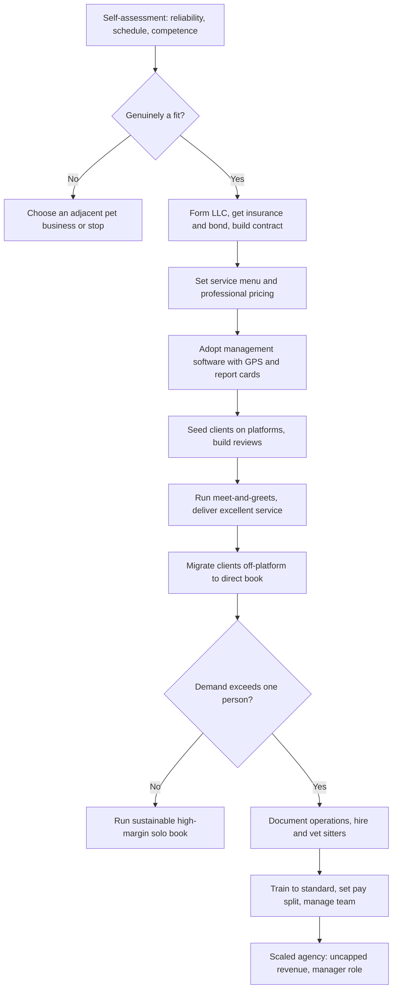

### Direct Answer

To start a pet sitting business in 2027, you build a licensed, insured, contract-backed service company that cares for animals in their own homes -- drop-in visits, dog walks, overnights, and live-in house-sitting -- and you run it like a professional reliability-and-trust business, not an animal-lover's hobby. A disciplined solo operator charges $25-$55 per drop-in, $35-$90 per walk, $55-$150 per overnight, runs an 80-90% gross margin on tiny overhead, and builds to $30K-$90K of Year 1 revenue from 40-150 repeat clients. The real strategic question is not "can I get clients" -- the platforms hand you those -- it is "how do I escape the single-sitter ceiling," because one person physically caps near $70K-$110K, and the only path past that is hiring and managing a vetted team into a $120K-$350K+ agency at a thinner 40-55% margin.

**TL;DR:** Pet sitting is a real, low-capital, genuinely accessible service business -- but it is a labor business capped by the fact that you can only be in one place at a time. Win by (1) launching fully insured, bonded, and contract-backed with an LLC before the first paid visit; (2) pricing like a professional, including non-negotiable holiday surcharges; (3) using Rover (NASDAQ: ROVR) and Wag! (NASDAQ: PET) as a time-limited new-client funnel while migrating clients off-platform to direct, full-fee relationships; (4) running purpose-built software with GPS-verified visits and photo report cards; and (5) deciding early whether you want a sustainable high-margin solo book or the harder build of a scalable agency. The three things that kill these startups are underpricing, skipping insurance and contracts, and either staying solo until burnout or scaling before the systems exist.

## 1. What A Pet Sitting Business Actually Is In 2027

### 1.1 The Core Definition

A **pet sitting business is the company a pet owner hires to care for their animal, in the animal's own home, when the owner cannot.** You are not a boarding kennel -- the pet never leaves its house. You are not a groomer, a trainer, or a veterinarian. You are the trusted person who holds the key, who arrives when the owner is at work, on a plane, or in a hospital, and who performs the specific, repeatable, non-negotiable work a pet needs: feeding on schedule, fresh water, the walk or yard time, the litter box, the medication at the right dose at the right hour, and the company that keeps an animal from being anxious and alone for days.

**The business sells, fundamentally, trust and reliability.** A client is handing a near-stranger the key to their home and the life of an animal they love -- often a pet that is functionally a family member. Everything else in this guide -- pricing, insurance, software, hiring, marketing -- exists to build, protect, and scale that trust. The love of animals is the qualification to enter the business; it is not the thing that makes the business work.

### 1.2 The 2027 Demand Backdrop

A founder needs an accurate read of the landscape, because pet sitting is neither an effortless dream nor a saturated dead end. The structural facts as of 2027:

| Demand Driver | 2027 Reality | Implication For A Founder |
|---|---|---|
| Pet ownership depth | Roughly two-thirds of US households own a pet; well over 150M dogs and cats | Large, broad, durable customer base |
| Humanization of pets | Owners increasingly treat pets as family and spend accordingly | Willingness to pay for quality, not just cheapest |
| Travel normalization | Travel fully rebounded after the early-2020s disruption | Steady drop-in and overnight demand |
| Return-to-office shift | Midday dog-walk need revived after work-from-home suppressed it | Recurring weekday revenue is back |
| Platform layer | Rover, Wag!, Care.com reshaped discovery | Easy to start, hard to own the client |

**Pet sitting in 2027 is not a trend and it is not passive.** It is a reliability-and-trust service business wearing an animal-lover's costume. People do not stop traveling, working, or having medical events, and they increasingly refuse to kennel a pet they consider family -- in-home care is the preferred option for a large and growing share of owners. For a related demand picture in adjacent pet services, see how the same owner base supports a doggy daycare (q1975) and a dog boarding operation (q1974).

### 1.3 Why The Model Is Genuinely Accessible

The barrier to entry is real but low. **There is no real estate, no inventory, and no heavy equipment** -- the largest startup cost is insurance, a software subscription, and a reliable vehicle you likely already own. A motivated, reliable person can be insured, bonded, profiled on a platform, and serving paying clients within weeks. That accessibility is the model's appeal and also its trap: low barriers mean a long tail of casual, uninsured competitors, and the serious operator's entire edge is being visibly more professional than that tail.

## 2. The Service Menu And The Three Business Models

### 2.1 What You Actually Sell

A founder must understand every service line before setting prices, because the mix you offer shapes your schedule, your income ceiling, and your client base.

| Service Line | What It Is | Strategic Role |
|---|---|---|
| Drop-in visit | 20-60 min visit while owner travels: feed, water, litter/potty, short walk, meds, wellness check | Volume base; sold in multiples |
| Dog walking | 30-60 min weekday walk for working clients, often a standing schedule | Recurring, predictable revenue |
| Overnight in-home sitting | Sitter stays the night: evening, overnight, morning care | High-ticket; consumes the whole night |
| House-sitting | Multi-day live-in stay; pets plus plants, mail, lived-in-home benefit | Highest revenue per client |
| Pet taxi / transport | Driving a pet to the vet, groomer, or daycare | Useful add-on |
| Specialty care | Medication, senior/special-needs, post-surgical, puppy, exotics | Margin and differentiation layer |
| Add-ons | Extra pets, holiday surcharge, key pickup, last-minute fee, waste cleanup | Average-ticket lift |

**The strategic point:** drop-ins and walks are the volume base; overnights and house-sitting are the high-ticket lines; and specialty care is the margin and differentiation layer. A menu built only of cheap 20-minute drop-ins caps income brutally, while one anchored by overnights, house-sitting, and medical care lifts the average ticket and the whole business. A founder who wants the recurring-revenue weekday engine specifically should study the dedicated dog walking model (q1971).

### 2.2 The Three Models

There are three distinct ways to build this business, and the choice shapes everything.

**The solo independent operator** runs their own brand, sets their own prices, books their own clients (mostly direct and by referral), and personally performs every visit. The advantage is the full fee with no commission, total quality control, and direct client relationships. The limit is the hard ceiling -- one person, one calendar, a physical cap near $70K-$110K, and real burnout risk from the holiday-and-weekend load.

**The platform-dependent sitter** works primarily through Rover (NASDAQ: ROVR), Wag! (NASDAQ: PET), Care.com, or TrustedHousesitters. The platform supplies the demand, booking, payment, and an insurance umbrella in exchange for a 15-25% commission and ownership of the client relationship and reviews. The advantage is instant access with zero marketing; the limit is commission drag, platform control, and the risk of a policy change or deactivation erasing income overnight.

**The pet sitting agency** escapes the ceiling: the founder builds a team of vetted, trained, insured sitters, takes a cut of each visit (commonly a 50-60% sitter / 40-50% company split), and runs the business as a manager rather than a visitor. The advantage is real scalability into the $150K-$500K+ range; the challenge is that it is a genuinely harder business -- hiring, vetting, training, scheduling, key management, and the liability of other people in clients' homes.

### 2.3 The Sensible Arc Between Models

| Model | Margin | Income Ceiling | Founder Role | Best For |
|---|---|---|---|---|
| Solo independent | 80-90% | ~$70K-$110K | Performs every visit | Reliable operator who wants a controlled, high-margin job |
| Platform-dependent | 60-75% effective | ~$50K-$80K | Performs every visit | Cold-start only; not a permanent home |
| Pet sitting agency | 40-55% | $150K-$500K+ | Hires, trains, manages | Founder willing to stop visiting and start managing |

**The common and sensible arc:** start solo (often seeded by a platform), build a direct repeat-client base, then deliberately transition to an agency once demand exceeds one person's capacity. The mistake is staying a platform-dependent sitter forever, or jumping to an agency before the systems and personal client base exist. The premium-positioning variant of this model is worth studying alongside it (q9581).

## 3. The Platform Question: Rover, Wag!, And Going Direct

### 3.1 The Case For Starting On A Platform

This is one of the most consequential strategic decisions in the business. **The case for starting on a platform is real:** Rover and Wag! solve the cold-start problem. A brand-new sitter with no clients, no reviews, and no marketing can create a profile, get verified, and have paying bookings within days -- the platform handles discovery, booking, payment, and provides an insurance and guarantee layer. For learning the work, building a review history, and earning while you build, the platforms are a legitimate on-ramp.

### 3.2 The Case Against Staying On A Platform

The case against staying is equally real and is mostly about who owns the asset you are building.

| Platform Cost | What It Means | Long-Term Impact |
|---|---|---|
| 15-25% commission | A permanent tax on every dollar earned | Compounds against you for years |
| Client ownership | The platform, not you, owns the relationship | You build the platform's asset |
| Review ownership | Your review history lives on their profile | Not portable to your own brand |
| Rule-setting power | The platform sets and changes terms | A policy shift can cut your visibility |
| Deactivation risk | One dispute or algorithm change | Income can vanish overnight |

**Rover (NASDAQ: ROVR)** is the dominant marketplace and was taken private by Blackstone (NYSE: BX) in a deal valued around $2.3 billion in 2024; **Wag! (NASDAQ: PET)** is the other major public-market name in on-demand pet care; **Care.com** is a broad care marketplace owned by IAC (NASDAQ: IAC); and **TrustedHousesitters** runs a membership model pairing travelers with home-and-pet sitters.

### 3.3 The Migration Off-Platform

**The strategic move every serious operator makes is the migration off-platform.** A platform's terms typically restrict soliciting clients off-platform while a relationship is active, so the migration is done carefully and over time: deliver excellent service, build genuine relationships, establish your own professional brand and booking system, and as clients become repeat clients they naturally want to book directly with the sitter they trust. A professional independent operation -- with its own insurance, contract, and software -- can then take that relationship cleanly. The endgame for most successful sitters is a **hybrid, then a direct book:** platforms for new-client flow early, a growing core of direct repeat clients who pay the full fee, and eventually a business that is mostly or entirely direct.

## 4. The Core Unit Economics And The Single-Sitter Ceiling

### 4.1 The Visits-Per-Day Constraint

This is the single most important section in the guide, because the entire solo business lives or dies on one constraint beginners never calculate: **you can only be in one place at a time, and the day has a fixed number of hours.** Pet sitting is a labor business, not an asset business -- there is no inventory turning while you sleep. Your income is **visits per day times revenue per visit, minus drive time.**

| Variable | Realistic Range | Note |
|---|---|---|
| Drop-in work time | 20-45 min | The actual care portion |
| Drive time between clients | 15-30 min | The silent margin killer |
| Total time consumed per visit | 45-75 min | Care plus driving |
| Visits in a long working day | 8-14 | Only with a tight route |
| Average revenue per visit | ~$35 | Mixed menu, solo professional |
| Gross revenue, busy 10-12 hr day | ~$280-$490 | Excellent margin, hard-capped volume |

### 4.2 Why The Solo Ceiling Is Real

At an average of $35 per visit and 10 visits, that is $350 of gross revenue in a 10-12 hour working day -- excellent for the margin (overhead is tiny) but **hard-capped.** There are only so many days, the work clusters on holidays and weekends when everyone travels at once, and you cannot clone yourself. This is why a solo pet sitter, even a busy and well-priced one, tops out around **$70K-$110K in annual revenue** -- and the top of that range usually means a punishing schedule with no real time off.

**Drive time is the silent margin killer.** A sitter who books a geographically scattered client base spends half the working day in the car, unpaid; a sitter who deliberately builds a tight service zone -- a few neighborhoods, not a whole metro -- fits far more billable visits into the same hours. **Overnights and house-sitting change the math** because they bill a high rate for a block of time that overlaps with sleep, but they also consume the whole night.

### 4.3 The Line-By-Line Margin Reality

A founder must internalize where the money actually goes, because pet sitting's famous "80-90% margin" is true for a solo operator and badly misleading for an agency.

| P&L Line | Solo Operator | Agency |
|---|---|---|
| Revenue | Visits + walks + overnights + add-ons | Same, across a team |
| Sitter pay | $0 (founder does the work) | 50-60% of each visit -- the largest cost |
| Mileage / vehicle | Largest real cost; often ignored | Spread across team |
| Insurance & bonding | A few hundred dollars/year solo | Higher; covers team |
| Software subscription | Modest monthly fee | Indispensable for coordination |
| Platform commission | 15-25% if used | Usually phased out |
| Gross margin | 80-90% | 40-55% |
| Income ceiling | ~$70K-$110K | $150K-$500K+ |

**The agency model is a completely different P&L.** When the founder hires sitters, the largest cost in the business appears -- the sitter pay -- and the gross margin drops to 40-55%, not 85%. The agency founder's income comes from the spread across many sitters' visits plus the management layer, not from a high margin on their own labor. A founder must understand this before scaling: **the solo business is a high-margin job; the agency is a lower-margin but uncapped business.** The same margin-versus-ceiling tension shapes other home-service businesses such as a home cleaning service (q1938).

## 5. Pricing Architecture: What To Charge In 2027

### 5.1 The 2027 Price Table

Pricing is where most pet sitting businesses quietly fail, because the founder treats it as a favor for friends rather than a professional service with real opportunity cost. The 2027 pricing architecture for an independent professional operator (platforms typically run somewhat lower because of their commission and volume):

| Service | 2027 Price Range | Notes |
|---|---|---|
| Drop-in visit (20-30 min) | $22-$45 | The volume base; price by visit, sold in multiples |
| Drop-in visit (45-60 min) | $32-$60 | Longer visit, more play / multiple pets |
| Dog walk (30 min) | $25-$50 | Recurring weekday revenue |
| Dog walk (60 min) | $40-$90 | Longer / high-energy dogs |
| Overnight in-home sitting | $55-$150 | Sitter stays the night; evening + overnight + morning |
| House-sitting (multi-day live-in) | $75-$200 / day | Continuous live-in care, often + plants / mail |
| Pet taxi / transport | $25-$75 / trip | Vet, groomer, daycare runs |
| Medication administration | +$5-$25 / visit | Pills, injections, fluids -- a margin add-on |
| Additional pet | +$8-$25 / pet | Per extra animal |
| Holiday surcharge | +$10-$30 / visit or +25-50% | Thanksgiving, Christmas, July 4th, spring break |
| Last-minute booking fee | +$10-$25 | Bookings inside 24-48 hours |
| Key pickup / handoff | $0-$25 | Or free with a lockbox arrangement |

### 5.2 The Five Pricing Disciplines

**The disciplines that separate professionals from hobbyists:**

- **Charge holiday premiums without apology.** The holidays are when demand is highest, supply is shortest, and the sitter is giving up their own holiday; the surcharge is not greed, it is the price of the single most valuable inventory in the calendar.
- **Price by the visit, not the hour, and bundle nothing for free.** Medication, extra pets, and longer visits are line items, not favors.
- **Set a cancellation policy with teeth.** A meaningful percentage charged for late cancellations, because a cancelled visit is a slot the sitter cannot resell.
- **Raise prices annually.** Costs rise, skills deepen, and a sitter who never raises prices is quietly taking a pay cut every year.
- **Do not anchor to the cheapest platform sitter or the neighbor's teenager.** A professional, insured, reliable operator with a contract and a software-managed report card is a different product, and pricing should reflect that.

### 5.3 The Professional-vs-Hobbyist Price Gap

| Pricing Behavior | Hobbyist Approach | Professional Approach |
|---|---|---|
| Holiday work | Regular rate, no premium | +25-50% surcharge, charged without apology |
| Medication / extra pets | Free, "happy to help" | Line items on the invoice |
| Late cancellation | Absorbed, slot lost | Cancellation fee per a written policy |
| Annual price | Never raised | Raised yearly with costs and skill |
| Benchmark | Cheapest platform sitter | Insured, contracted, software-managed product |

**The founder who prices like a professional builds a sustainable business; the one who prices like a favor builds a tiring hobby that resents its own clients.**

## 6. The Legal And Insurance Foundation

### 6.1 Insurance And Bonding

A founder must treat insurance, bonding, and a real contract as non-negotiable launch requirements, not optional upgrades, because the downside in this business is catastrophic and personal. A pet sitter is alone in clients' homes, holding keys, handling animals that can bite or bolt, near appliances and plumbing and valuables -- and a single bad event, uninsured, can end the operator's finances permanently.

| Coverage / Structure | What It Protects | Why It Matters |
|---|---|---|
| General liability insurance | Third-party bodily injury and property damage | The dog that bites a passerby; the broken vase; the flooded bathroom |
| Pet sitter / animal care professional liability | Injury or illness to the pet in your care; lost or escaped pets | The specialty coverage built for this exact exposure |
| Surety bond | Client protection against theft by the sitter or employees | Inexpensive trust signal; valued by agencies |
| LLC formation | Separation of business and personal assets | Standard, inexpensive liability shield |
| Business license | Local legal authorization to operate | Requirements vary by state and city |
| Service contract | Scope, rates, emergency authority, vet authorization | The other half of the legal foundation |

**Pet-care professional liability** is often available through professional associations such as Pet Sitters International and NAPPS and through specialty insurers; annual cost for a solo operator is typically modest, often in the few-hundred-dollar range. **The platforms provide their own guarantee or insurance layer for on-platform bookings**, but that coverage does not extend to direct off-platform clients -- which is exactly why an operator going direct must carry their own.

### 6.2 The Service Contract And Onboarding

A founder should build a thorough service agreement and a real onboarding process, because the contract and the meet-and-greet are where trust is established and risk is controlled. The service contract should specify:

- **The exact services and visit schedule**, plus rates, surcharges, and the cancellation policy.
- **Veterinary authorization** -- naming the pet's vet and authorizing emergency care up to a dollar limit, critical because a sitter may have to make a medical decision for an animal whose owner is unreachable on a plane.
- **Emergency contacts and a backup person**, plus home access terms (keys, lockbox, alarm codes).
- **The pet's full profile** -- feeding, medication, behavior, triggers, vet history, "my dog bolts at the door," "the cat hides but is fine."
- **Liability terms** and the limits of the sitter's responsibility, plus photo/update consent.

**The meet-and-greet** -- a pre-booking in-person visit -- is non-negotiable for new clients: it lets the sitter meet the animal, see the home, learn the routine, confirm the pet is safe to handle, and lets the client meet the person they are trusting. It also screens out the rare bad fit before it becomes a crisis.

### 6.3 Certifications As Trust Signals

**Pet first aid and CPR certification** -- offered by providers such as Pet Tech and Walks 'N' Wags -- and association membership in Pet Sitters International or NAPPS are not legally required, but they are real trust and competence signals. The discipline: an operator launches with general liability, pet-care professional liability, a bond, an LLC, the right local license, certifications, and a signed contract for every client. The founder who skips these to "start lean" is one bad day away from a personal financial catastrophe.

## 7. Operations, Software, And The 2027 Tech Stack

### 7.1 Why Software Is Not Optional

In 2027 a professional pet sitting business runs on software, and a founder should adopt the stack early because retrofitting it onto a paper-and-text-message operation is painful.

| Tool Category | Examples | Function |
|---|---|---|
| Pet-sitting management software | Time To Pet, Precise Petcare, Pet Sitter Plus, Scout | Client/pet profiles, calendar, invoicing, team management |
| GPS visit verification | Built into the management software | Proof the visit happened, for the full duration |
| Photo report cards | Built into the management software | The single most loved feature; trust and retention engine |
| Payment processing | Integrated into the software | Removes the awkward money conversation |
| Key management | Software tracking or disciplined lockbox system | Tracks which key is where as the base grows |
| Web presence | Professional website, Google Business Profile | Discovery and credibility |

### 7.2 The Client-Facing Experience

**The client-facing experience matters commercially.** A clean booking portal, automatic confirmations, and a **photo report card after every visit** -- "here's your dog mid-walk, ate well, all good" -- is itself a retention and referral engine. It is the single most loved feature in the business because it reassures an anxious owner. **GPS check-in/check-out** protects both the client (proof the visit happened for the full duration) and the sitter (proof of work). The discipline: adopt pet-sitting management software early, lean hard on the photo-report-card feature, run GPS-verified visits, and treat the software as the system that lets a solo operator look fully professional and lets an agency coordinate a team without chaos.

### 7.3 Routing And The Service Zone

**Route discipline is an operational decision with direct margin consequences.** A sitter who builds a tight service zone -- a handful of adjacent neighborhoods -- packs more billable visits into the same hours and gives less of the day to unpaid driving. The management software's scheduling view should be used to cluster visits geographically, and the founder should be willing to decline a client who is far outside the zone rather than let one scattered booking blow up an entire day's route. Other route-density-driven services such as a junk removal business (q1944) face the identical math.

## 8. Marketing And Building The Direct Client Base

### 8.1 The Referral Engine

Pet sitting is a local, trust-driven, referral-heavy business, and the lead-generation engine is relationships and local visibility far more than broad advertising -- and the goal is a **direct** client base, not a platform-rented one.

| Channel | How It Works | Priority |
|---|---|---|
| Veterinary clinics | Vets are asked constantly "who do you recommend" | Highest -- pre-qualified, trust-primed referrals |
| Groomers, daycares, pet stores, trainers | The local pet-business referral web | High -- they serve the same owners |
| Platforms (Rover, Wag!, Care.com) | A deliberate, time-limited new-client funnel | Medium -- seed only, then migrate |
| Google Business Profile + website | Local search visibility with reviews | High -- baseline credibility |
| Neighborhood channels (Nextdoor, FB groups) | Owners actively ask for sitter recommendations | High -- low cost, high intent |
| Client referrals | Happy clients tell every owner they know | Highest -- compounding, pre-trusted |

### 8.2 Why Retention Beats Acquisition

**Veterinary clinics are the single most valuable referral relationship** -- a professional, insured sitter who builds genuine relationships with local vet practices earns a stream of pre-qualified, trust-primed referrals. **Repeat clients are the real asset:** a pet owner travels several times a year and works five days a week, so one good client is a multi-year, multi-booking relationship, and retention is worth far more than constant new-client churn. A deliberate referral ask -- and even a referral incentive -- accelerates the compounding. The mobile pet grooming business (q1973) relies on the exact same vet-and-pet-store referral web.

### 8.3 Niche Visibility

**Being known as a specialist generates targeted, less price-sensitive demand** -- the sitter who handles diabetic cats, or senior dogs, or reptiles, or large multi-dog homes. Niche visibility converts a generic, interchangeable service into a sought-after one. The discipline: build vet and pet-business referral relationships deliberately, use platforms as a funnel rather than a home, cultivate the neighborhood-channel and Google presence, ask for referrals, and obsess over retention.

## 9. The Holiday-And-Weekend Demand Pattern

### 9.1 The Seasonality Reality

A founder must understand the demand seasonality of pet sitting, because it is real, sharp, and shapes both income and lifestyle.

| Period | Demand Level | Driver |
|---|---|---|
| Thanksgiving week | Peak | Mass travel |
| December holidays | Peak | Mass travel |
| Spring break | Peak | Family travel |
| July 4th | Peak | Travel and long weekend |
| Summer travel months | Elevated | Vacation season |
| Weekdays (off-peak weeks) | Steady, lower | Recurring dog walks for working clients |
| Off-peak weeks (e.g. February) | Quiet | Little travel; admin and rest time |

### 9.2 The Consequences Of Concentration

**Demand concentrates hard around holidays and weekends.** This has several consequences. **The holidays are simultaneously the most lucrative and the most demanding time** -- the sitter earns the most exactly when they are giving up their own holiday, which is why holiday surcharges are non-negotiable and why burnout is a real risk for solo operators who never get a holiday off. **A solo sitter physically cannot serve every client who wants the same peak week** -- Thanksgiving week, every client travels at once, and one person can only cover so many homes. This is one of the clearest signals that the business has outgrown a single operator. **Weekday demand is driven by dog walking** -- the standing midday walk for working clients is the steady, recurring, predictable revenue that fills the weekday calendar between travel peaks.

### 9.3 Managing The Pattern

The disciplines: price the peaks, fill the weekday troughs with recurring dog-walk clients, budget for uneven income across the year, build a backup-sitter relationship even as a solo operator so a peak week or a personal emergency does not mean failing a client, and **read the recurring inability to serve peak demand as the signal to hire.** The agency model smooths this -- a team of sitters can absorb the holiday peak that would break one person.

## 10. The Solo Year-One Operating Reality

### 10.1 What Year One Actually Looks Like

A founder should walk into Year 1 with accurate expectations, because the gap between the "get paid to play with puppies" fantasy and the real business is where most quitting happens. Year 1 solo is **trust-building and base-building mode.** The first months are spent getting insured and bonded, forming the LLC, setting up software, building a website and platform profiles, completing meet-and-greets, and earning the first reviews -- often seeded through a platform for the cold-start demand.

The work itself is **reliable, physical, schedule-bound, and unglamorous in the parts that matter:** litter boxes, 6am potty breaks, a diabetic cat's injection on a rigid schedule, driving across town in the rain, being on call on Christmas morning. It is also genuinely rewarding for the right person -- real relationships with animals and the satisfaction of being trusted.

### 10.2 The Honest Year-One Numbers

| Year 1 Metric | Realistic Range |
|---|---|
| Revenue | $30,000 - $90,000 |
| Gross margin | 80-90% |
| Repeat client base by year-end | 40-150 |
| Founder role | Performs every visit |
| Primary new-client source early | Platform-seeded, migrating to direct |
| Largest unbudgeted cost surprise | Drive time and self-employment tax |

**A disciplined, well-priced, properly insured operator builds toward $30K-$90K in revenue** from a growing base of 40-150 repeat clients -- a real income, but earned through the holiday-and-weekend load and capped by the visits-per-day ceiling. Year 1 is when the founder learns the true drive-time cost, discovers which services and clients are worth keeping, and starts building the direct repeat-client base that is the actual long-term asset.

### 10.3 The Year-One Decision

Year 1 is also when the founder should decide their endgame: a sustainable solo book at the comfortable middle of the range, or a deliberate build toward an agency. The founders who succeed treat Year 1 as building a real, insured, professional service business and a base of clients who trust them; the ones who fail expected easy money for animal lovers and were unprepared for the reliability demands, the holidays, the insurance need, and the income ceiling.

## 11. Scaling Past The Ceiling: Building An Agency

### 11.1 The Prerequisites For Scaling

The jump from solo operator to pet sitting agency is the defining growth challenge of this business, and it is a genuine change in what the business *is* -- from a high-margin job to a lower-margin but uncapped company.

| Prerequisite | What It Means |
|---|---|
| Demand exceeds one person | Founder is regularly turning away or struggling to cover peak bookings |
| A direct client base | A real brand, not a platform-rented book |
| Documented operations | Software, contracts, key management, visit standard written down |
| Willingness to manage | Founder genuinely ready to stop doing every visit and start managing |

### 11.2 The Scaling Levers

- **Hire and vet sitters** -- background checks, in-person vetting, trial visits, reference checks, because the founder is now putting *other people* into clients' homes and the entire brand rests on their reliability.
- **Train to a documented standard** -- a visit protocol, the photo-report-card discipline, emergency procedures, so every sitter delivers the same service.
- **Set the pay split** -- commonly a 50-60% sitter / 40-50% company split, with the founder's income coming from the spread across many sitters' visits.
- **Systematize key management and scheduling** through the software, because coordinating a team across many homes is where an under-systematized agency drops visits.
- **Decide employee vs. independent contractor** carefully -- worker classification has real legal and tax stakes.
- **Build the management layer** -- a scheduler or operations lead as the team grows.

### 11.3 The Economics And Risks Of The Transition

**The economics:** the margin drops from ~85% to ~40-55% because the founder now pays the sitters, but the income ceiling disappears -- an agency with a team can reach **$120K-$350K+ in revenue** and beyond. **The risks:** a bad-hire sitter is a brand and liability event; scaling before the systems exist creates chaos; and some founders discover they preferred the solo work to managing people. The founders who scale well treated their solo Year 1-2 as building both a client base and a documented system, so the agency is the repetition of a proven operation rather than an expensive experiment. The same solo-to-team transition defines the doggy daycare business (q1975).

## 12. Hiring, Vetting, And Managing Sitters

### 12.1 Why Vetting Is Non-Negotiable

For the founder who chooses to scale, the sitter team becomes the entire business. **Vetting is non-negotiable and thorough** -- the founder is handing strangers the keys to clients' homes and the lives of their pets. Real vetting includes background checks, in-person interviews, reference checks, demonstrated comfort and competence with animals, reliability signals, and ideally trial or shadowed visits before solo assignment.

| Vetting Step | Purpose |
|---|---|
| Background check | Baseline trust and safety screen |
| In-person interview | Judge professionalism, communication, judgment |
| Reference checks | Verify reliability claims |
| Demonstrated animal competence | Confirm calm, skilled handling -- not just affection |
| Trial / shadowed visits | Observe real performance before solo assignment |
| Worker classification review | Get employee-vs-contractor right with professional advice |

### 12.2 The Brand Rests On The Least Reliable Sitter

**The brand rests entirely on the least reliable sitter.** One no-show, one mishandled pet, one untrustworthy person in a client's home, and the trust the founder spent years building is damaged. This is why agency hiring is slower and more careful than ordinary hiring. **Training to a documented standard** turns a collection of individuals into a consistent service -- the visit protocol, the report-card discipline, feeding and medication procedures, emergency response, key handling, and client communication.

### 12.3 Retention And Worker Classification

**Worker classification -- employee versus independent contractor -- is a real legal decision** with tax, control, and liability consequences, and the founder should get it right with professional advice rather than guess. **Retention matters:** good sitters are the asset, the work is physical and holiday-bound, and an agency that treats sitters well, schedules fairly, and pays reliably keeps a stable team. The founder's job in an agency is no longer pet care -- it is hiring, training, scheduling, quality control, and trust management. The dog training business (q1976) faces the same challenge of scaling a service whose quality depends entirely on the individual practitioner.

## 13. Specialty And Niche Paths Worth Considering

### 13.1 The High-Value Niches

Beyond the general drop-in-and-walk model, a founder should understand the specialty paths, because for many operators a focused niche is the stronger, more defensible business.

| Niche | Why It Works | Competition Level |
|---|---|---|
| Medical / special-needs care | Diabetic, senior, post-surgical; premium rates, vet referrals | Low -- most casual sitters will not do it |
| Exotic / small-animal care | Birds, reptiles, rabbits, fish; owners struggle to find care | Low -- genuinely underserved |
| Overnight / house-sitting focus | High-ticket live-in work; higher revenue per client | Medium |
| Cat-only sitting | Calmer, lower-physical-demand book | Medium |
| Multi-dog / large-breed homes | Skilled handling of demanding households | Medium |
| Luxury / concierge pet care | Premium, high-touch service for affluent clients | Low-Medium |

### 13.2 Why Specialization Wins

**Medical and special-needs pet care is the highest-value, lowest-competition niche:** it commands premium rates, generates vet referrals, and most casual sitters will not or cannot do it. **Exotic and small-animal care is a genuine underserved niche** -- these owners struggle to find competent care and value a sitter who knows their animals. The strategic point: the general model is the common starting point, but specialization -- especially in medical care or exotics -- delivers higher rates, less price competition, stronger referral flow, and a more defensible book.

### 13.3 Adjacent Add-Ons

Some operators layer in **pet taxi, basic grooming, or training**, though each is a real additional skill and liability. A founder weighing these should treat each as a separate business decision -- the in-home dog training business (q9582) is a craft in its own right, not a casual upsell. The mistake is not choosing a niche; it is being a generic, interchangeable, lowest-price drop-in sitter when a defensible specialty was available.

## 14. Risk Management: Protecting Pets, Clients, And Yourself

### 14.1 The Risk Map

The pet sitting model carries specific, real risks, and the 2027 operator manages each deliberately rather than hoping.

| Risk | Primary Mitigation |
|---|---|
| Pet injury, illness, or death in your care | Competent handling, pet first-aid training, written vet authorization, professional liability insurance |
| Lost or escaped pet | Careful handling protocols, secure leashing, door discipline, escape coverage |
| Dog bite (to sitter, passerby, or another animal) | Meet-and-greet screening, declining dangerous animals, general liability coverage |
| Property damage in the client's home | Care, clear access procedures, liability insurance |
| Theft accusation | Bonding, trustworthy hiring, clear documentation |
| Key loss or home-security lapse | Disciplined key-tracking system or lockboxes |
| Sitter unavailability (illness, accident) | A backup-sitter relationship even for solo operators |
| Worker-related incident in an agency | Thorough vetting, training, correct classification, agency insurance |
| Client dispute over scope or charges | A thorough signed contract |

### 14.2 The Gravest Risk

**Pet injury, illness, or death in your care is the gravest risk** -- mitigated by competent handling, knowing each pet's profile and triggers, pet first-aid and CPR training, written vet authorization with an emergency-care dollar limit, a known emergency vet, and pet-care professional liability insurance. **A lost or escaped pet** -- the dog that bolts the door, slips a collar, or gets out of the yard -- is mitigated by careful handling protocols, secure leashing, door discipline, and insurance coverage for escape.

### 14.3 The Backup-Sitter Imperative

**Sitter unavailability is a risk even solo operators must plan for.** The operator gets sick, is in an accident, or simply cannot cover a peak -- and failing a client who is on a plane is a trust-ending event. Every solo operator should build a backup-sitter relationship before they need it. The throughline: every major risk in pet sitting has a known mitigation built from insurance, contracts, careful procedures, and a backup plan -- and the operators who fail are almost always the ones who carried no insurance, used no contract, had no vet authorization, or had no backup when the hard day came.

## 15. Taxes, Bookkeeping, And Business Structure

### 15.1 The Tax Traps

A founder should set up the financial and legal structure deliberately from day one, because pet sitting's simple operations hide a few real tax and compliance traps.

| Item | The Trap | The Discipline |
|---|---|---|
| Self-employment tax | New solo operators treat the full fee as take-home | Reserve for and pay quarterly estimated taxes |
| Mileage deduction | The largest deduction, most often ignored | Track every business mile with an app or log |
| Entity structure | Operating as a bare sole proprietor | Form an LLC for liability separation |
| Bookkeeping | Mixed personal and business money | Separate banking and accounting software from day one |
| Sales tax on services | Varies by jurisdiction | Check local rules |
| Agency payroll | Worker misclassification | Get employee-vs-contractor right with professional help |

### 15.2 Mileage Is The Largest Deduction

**Mileage is the single largest deduction and the most-ignored.** A pet sitter drives constantly, and tracking every business mile converts a major real cost into a major real deduction; failing to track it is leaving money on the table every single day. **Other deductions** -- insurance, bonding, software subscriptions, supplies, licensing, platform fees, marketing, professional association dues, first-aid certification, a portion of phone -- all reduce taxable income when a clean bookkeeping system captures them. A founder who finds this side of the business unfamiliar should study a dedicated bookkeeping business (q1959) to understand the records a clean operation keeps.

### 15.3 The Bookkeeping Discipline

**Separate business banking from day one, use accounting software, and track income by service line and expenses by category.** This turns tax time from a scramble into a process and shows the founder which parts of the business actually make money. For an agency, payroll and worker classification become central -- employee versus contractor has real tax and legal consequences. The discipline: form the LLC, separate the banking, reserve for and pay quarterly estimated taxes, track every mile, capture every deduction, and -- for an agency -- get worker classification right.

## 16. The Five-Year Revenue Trajectory

### 16.1 The Solo Path

Mapping a realistic five-year arc helps a founder size the opportunity honestly -- and the arc forks sharply depending on whether the founder stays solo or builds an agency.

| Year | Solo Path | Revenue | Margin |
|---|---|---|---|
| Year 1 | Get insured, seed clients, build reviews and direct relationships | $30K-$90K | 80-90% |
| Year 2 | Direct base deepens, referrals compound, pricing rises | $60K-$110K | 80-90% |
| Year 3-4 | Mature, sustainable, controlled book | $80K-$120K | 80-90% |
| Year 5 | Stable high-margin solo job, decision point on endgame | $80K-$120K | 80-90% |

### 16.2 The Agency Path

| Year | Agency Path | Revenue | Margin |
|---|---|---|---|
| Year 2-3 | Hire and vet first sitters; founder shifts to manager | $120K-$350K+ | 40-55% |
| Year 3-4 | Team deepens, systems mature, scheduling layer added | $250K-$600K | 40-55% |
| Year 5 | Mature agency, real team, defensible direct-client base | $400K-$900K+ | 40-55% |

### 16.3 What The Numbers Assume

These numbers assume disciplined pricing, real insurance, deliberate off-platform migration, and -- for the agency -- careful hiring and systems. They do not assume exponential growth, because pet sitting scales with sitters, clients, and geographic density, not magically. **The honest summary:** the solo path is a good, high-margin, capped job; the agency path is a harder, lower-margin, uncapped business -- and both are legitimate, but the founder should choose deliberately.

## 17. The Counter-Case: When NOT To Start A Pet Sitting Business

### 17.1 The Honest Arguments Against

A rigorous guide must argue the other side, because pet sitting is genuinely the wrong business for many of the people drawn to it.

| Counter-Argument | Why It Bites |
|---|---|
| It is a labor business with a hard ceiling | Solo income caps near $70K-$110K; you cannot clone yourself |
| The schedule is structurally anti-lifestyle | Peak earnings fall on the holidays you would want off |
| The casual tail competes on price forever | A long tail of uninsured side-hustlers anchors prices low |
| The platforms own the easy demand | Going direct is real, slow work; staying on-platform bleeds 15-25% |
| The downside is personal and catastrophic | One uninsured bad day -- a bite, a lost pet, a flood -- can ruin you |
| The agency is a genuinely different, harder business | Many founders dislike managing people and miss the solo work |

### 17.2 Who Should Not Start

**A founder should not start if reliability is not a core trait** -- the entire product is reliability, and someone who will not absolutely show up at 6am, on a holiday, in the rain, will fail. **A founder should not start if they want a normal schedule** -- the demand pattern will be painful. **A founder should not start if they want a casual hobby** -- the uninsured, un-contracted, hobbyist version is the one that ends in a financial disaster. **A founder should not start if they confuse loving animals with being competent with them** -- love is the entry ticket; calm competence with the anxious dog, the medication schedule, and the pet that bolts is the job.

### 17.3 When An Adjacent Business Fits Better

If a founder answers no specifically on the holiday-and-weekend load, an **adjacent pet business may fit better.** A daytime-only dog walking business (q1971) avoids the worst of the travel-peak load. A mobile pet grooming business (q1973) is a skilled trade with a more controllable schedule. A dog boarding business (q1974) trades the in-home-care model for a facility-based one. The counter-case is not "do not start" -- it is "be honest about which version of this you are actually suited to."

## 18. The Decision Framework: Should You Actually Start This In 2027

### 18.1 The Self-Assessment

A founder deciding whether to commit should run a structured self-assessment, because pet sitting fits a specific person and badly misfits others.

| Dimension | The Question | Disqualifying Answer |
|---|---|---|
| Reliability temperament | Are you boringly, absolutely reliable? | "Mostly" |
| Holiday/weekend tolerance | Can you accept peak work on holidays? | "I need a normal schedule" |
| Animal competence | Are you calm and competent, not just fond? | "I just love animals" |
| Business seriousness | Will you insure, contract, and run real software? | "I want something casual" |
| Income-ceiling clarity | Do you accept the solo cap or want the agency build? | "I assumed it scaled easily" |
| Local market fit | Is there a dense enough pet-owning population nearby? | "My area is sparse and spread out" |

### 18.2 Reading The Framework

If a founder answers yes across reliability, holiday tolerance, animal competence, business seriousness, income-ceiling clarity, and local fit, a pet sitting business in 2027 is a legitimate path -- to a $30K-$110K high-margin solo book, or with the harder agency work, a $120K-$600K+ company. If they answer no on reliability or business seriousness, they should not start. The framework's purpose is to convert "I love animals and want to get paid for it" into an honest, structured decision about the reliability-and-trust service business underneath.

### 18.3 Common Year-One Mistakes To Avoid

A founder can avoid most failure modes simply by knowing them in advance, because the mistakes in pet sitting are remarkably consistent: **skipping insurance, bonding, and a contract; underpricing; giving away holiday premiums; ignoring drive time; never tracking mileage; forgetting self-employment tax; running no meet-and-greet; having no written vet authorization; having no backup plan; staying platform-dependent forever; scaling too fast; hiring carelessly; and running no cancellation policy.** Every one of these is avoidable. The founders who fail almost always made three or four of them; the founders who succeed treated this list as a pre-launch checklist.

## 19. Five Named Real-World Operating Scenarios

### 19.1 The Disciplined Solo Professional And The Cautionary Tale

**Scenario one -- Priya, the disciplined solo professional:** launches properly insured and bonded with an LLC, seeds her first clients on Rover (NASDAQ: ROVR) to build reviews, but from day one focuses on converting repeat clients to direct. She prices at the professional end, charges holiday surcharges without apology, builds tight relationships with two local vet clinics, and deliberately keeps a small geographic service zone to kill drive time. By the end of Year 2 she has roughly 110 direct repeat clients, runs at an 87% margin, grosses about $85K solo, and chooses to stay solo at a sustainable level -- a high-margin job she controls completely.

**Scenario two -- the cautionary tale, Brandon:** treats it as easy animal-lover money, skips insurance and a contract to "start lean," prices at neighbor rates with no holiday premium, and takes every client across a whole sprawling metro. He spends half his day driving unpaid, resents the holiday work he gave away for free, and then a client's dog slips its collar and is injured on a walk -- uninsured, with no signed vet authorization, the incident is a financial and emotional disaster and he quits within the year.

### 19.2 The Specialist And The Agency Builder

**Scenario three -- Denise, the medical-care specialist:** builds her whole brand around diabetic cats, senior dogs, and post-surgical care -- the work most casual sitters will not touch. She commands premium rates, gets a steady stream of vet referrals because clinics trust her with medical cases, faces little price competition, and runs a smaller but high-margin, deeply defensible solo book.

**Scenario four -- the Okafor agency:** the founder spends two years building a 130-client direct base and a documented operating system, then deliberately transitions to an agency -- carefully vetting and training a team that grows to nine sitters on a 55/45 split. The company margin drops to about 45% but the revenue ceiling disappears, and by Year 4 the agency grosses around $310K with the founder running scheduling, hiring, and quality control rather than doing visits.

### 19.3 The Platform-Trapped Sitter

**Scenario five -- Marcus, the platform-trapped sitter:** stays permanently dependent on Rover and Wag! (NASDAQ: PET), never builds a direct book, never gets his own insurance, never raises prices. The platforms take 20%+ of everything, a platform policy change cuts his visibility, and after three years he has a tiring, capped, commission-bled income and no business asset of his own to show for it. These five span the realistic distribution: disciplined solo success, the uninsured-hobbyist failure, the high-margin specialist, the deliberate agency build, and the platform-dependency trap.

## 20. The 2027-2030 Outlook And Final Framework

### 20.1 Where The Model Is Heading

A founder committing time and a small amount of capital should have a view on where the business goes, and several trends are reasonably clear.

| Trend | 2027-2030 Direction |
|---|---|
| Demand | Stays structurally healthy -- broad ownership, humanization, travel, return-to-office |
| Platforms | Remain dominant but contested; professional operators keep building the direct channel |
| Professionalism bar | Keeps rising -- GPS visits, photo report cards, insurance move from differentiator to baseline |
| Back-office technology | More automated scheduling, routing, and reporting; AI assists admin and marketing |
| Agencies | Consolidate the professional middle as the casual tail is squeezed |
| Specialty / medical care | Grows in value with an aging pet population |
| Insurance / classification scrutiny | Increases as the industry professionalizes |

### 20.2 The Net Outlook

**Pet sitting is viable and durable through 2030 in its professional, insured, relationship-driven, direct-client form** -- as a high-margin solo job or, for the founder willing to build a team, an uncapped agency. The version that thrives is the serious operator who prices professionally, carries real insurance, migrates off-platform, and either runs a sustainable solo book or builds a properly systematized agency. The version that struggles is the uninsured, underpriced, platform-dependent hobbyist competing on price.

### 20.3 The Final Twelve-Step Framework

Pulling the entire playbook into a single operating sequence, a founder who wants to start a pet sitting business in 2027 and actually succeed should execute in this order:

1. **Get honest about temperament** -- confirm you are genuinely reliable, can carry the holiday load, and are competent with animals.
2. **Build the legal and insurance foundation before the first paid visit** -- LLC, general liability, pet-care professional liability, bonding, licensing, a thorough contract with vet authorization.
3. **Decide your service menu and price it like a professional** -- weight toward overnights and specialty work; charge holiday premiums; set a real cancellation policy.
4. **Set up the software stack early** -- management software with GPS-verified visits, photo report cards, integrated payment, key tracking.
5. **Use platforms as a deliberate, time-limited funnel, not a home** -- seed clients on Rover or Wag!, but plan the off-platform migration from day one.
6. **Build the local referral engine** -- veterinary clinics first, then groomers, daycares, and pet stores, plus a Google Business Profile and neighborhood-channel presence.
7. **Run every new client through a meet-and-greet and a signed contract** -- never start service without both.
8. **Route tightly and track every mile** -- a small dense service zone kills the drive-time margin leak.
9. **Reserve for and pay quarterly self-employment taxes** -- and keep clean books from day one.
10. **Obsess over retention and referrals** -- the direct repeat client is the real asset.
11. **Build a backup-sitter relationship even as a solo operator** -- so a sick day never means failing a client.
12. **Decide your endgame deliberately** -- a sustainable high-margin solo book, or the harder build of a properly vetted, systematized agency.

Do these twelve things in this order and a pet sitting business in 2027 is a legitimate path to a real income and, if the founder chooses, a real company. Skip the discipline -- especially on insurance, pricing, and the platform-to-direct migration -- and it is a fast way to build a tiring, uninsured, capped hobby. The business is neither easy money for animal lovers nor a saturated dead end. It is a real, low-capital, reliability-and-trust service business, and in 2027 it rewards exactly one kind of founder: the genuinely reliable, professionally run operator who treats it as the serious service business it actually is.

## 21. Process Diagram: From Decision To Scaled Operation

## 22. Sources

1. American Pet Products Association -- National Pet Owners Survey, pet ownership and spending data.
2. American Veterinary Medical Association -- US pet ownership statistics.
3. Pet Sitters International -- professional pet sitting standards and member resources.
4. National Association of Professional Pet Sitters (NAPPS) -- industry guidance and certification.
5. Rover Group -- marketplace model, sitter terms, and commission structure.
6. Blackstone -- 2024 acquisition of Rover Group, transaction value disclosures.
7. Wag! Group Co. (NASDAQ: PET) -- investor filings on on-demand pet care.
8. Care.com / IAC -- pet care marketplace structure and membership model.
9. TrustedHousesitters -- membership model and home-and-pet-sitting framework.
10. US Small Business Administration -- business licensing and LLC formation guidance.
11. Internal Revenue Service -- self-employment tax and quarterly estimated payment rules.
12. Internal Revenue Service -- standard mileage rate and vehicle expense deduction guidance.
13. US Department of Labor -- worker classification, employee vs. independent contractor.
14. Time To Pet -- pet-sitting business management software features and operations.
15. Precise Petcare -- scheduling and team management software documentation.
16. Pet Sitter Plus -- pet care business software capabilities.
17. Scout -- pet-sitting software, GPS visit verification and report cards.
18. Pet Tech -- pet first aid and CPR certification program.
19. Walks 'N' Wags -- pet first aid training curriculum.
20. Insurance Information Institute -- general liability and professional liability coverage basics.
21. National Association of Insurance Commissioners -- surety bonding overview.
22. Bureau of Labor Statistics -- animal care and service workers occupational data.
23. IBISWorld -- pet sitting and dog walking industry market reports.
24. American Pet Products Association -- US pet care economy size and growth.
25. Nextdoor -- neighborhood-based local service discovery patterns.
26. Google Business Profile -- local business listing and review best practices.
27. SCORE -- small business mentoring guidance for service startups.
28. US Small Business Administration -- estimated tax and bookkeeping for the self-employed.
29. American Veterinary Medical Association -- emergency veterinary care and authorization practices.
30. Pet Sitters International -- annual State of the Industry survey data.
31. Federal Trade Commission -- marketplace platform terms and consumer protection guidance.
32. National Federation of Independent Business -- small service business operating cost benchmarks.
33. Society for Human Resource Management -- hiring, vetting, and background-check practices.
34. American Bar Association -- service contract and liability clause guidance for small businesses.
35. Consumer travel and tourism statistics -- post-2020s travel recovery and seasonality trends.

---

**Related entries:** dog walking business (q1971), mobile pet grooming business (q1973), dog boarding business (q1974), doggy daycare business (q1975), dog training business (q1976), premium pet sitting business (q9581), in-home dog training business (q9582), home cleaning service business (q1938).
