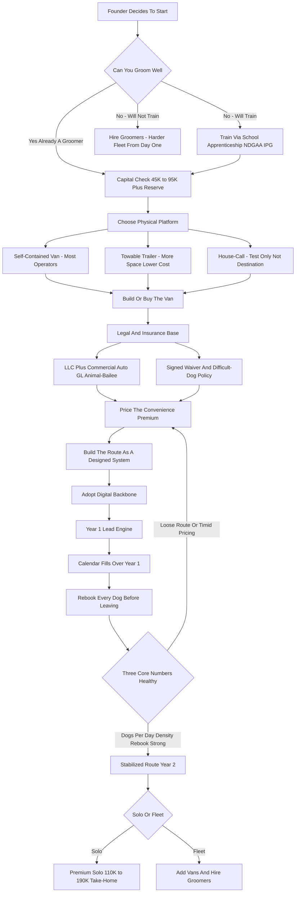

### Direct Answer

To start a mobile pet grooming business in 2027 you build a full grooming salon into a van or trailer -- raised tub, hydraulic table, high-velocity dryer, fresh and gray water tanks, water heater, power system, and climate control -- then drive it to the client's driveway and groom one pet at a time with no cages, no kennel noise, and no all-day stay, charging a **25-50% premium** over a storefront groomer for that calm, convenient, one-on-one experience. The model is genuinely strong and one of the better solo-operator businesses of 2027, but its economics rest on three numbers beginners rarely calculate: **dogs per day** (a realistic 5-8, not the 10-12 a salon does), **route density** (how tightly appointments cluster), and **rebook rate** (the share of clients who pre-book before you leave). Done with discipline, a solo founder invests **$45K-$165K**, runs at a **60-80% gross margin**, and reaches **$80K-$220K of Year-1 revenue** against **$45K-$130K of owner profit**.

**TL;DR:** Mobile pet grooming in 2027 is a skilled physical trade sold at a convenience premium out of a self-contained van. It rewards exactly one founder profile -- a competent groomer who routes tightly, prices the premium with nerve, rebooks every dog, and runs a clean digital backbone. A lean used-van entry costs **$45K-$95K** plus a working-capital reserve; a turnkey new build runs **$110K-$200K+**. Year 1 is calendar-building and route-tightening; Year 2 stabilizes around **$140K-$240K** revenue and a fork: stay a premium solo earning **$110K-$190K take-home**, or add vans toward **$250K-$700K+** revenue while wrestling the hardest problem in the industry -- hiring and keeping skilled mobile groomers. The killers are loose routing, timid pricing, skipping the rebook habit, thin insurance, and launching with no cash cushion. Viable and attractive through 2030 for the disciplined owner-operator; a poor fit for anyone who cannot groom well, dislikes driving and physical work, or wants a hands-off business.

## 1. What A Mobile Pet Grooming Business Actually Is In 2027

### 1.1 The Core Definition

**A mobile pet grooming business is a full grooming salon built into a vehicle that drives to the pet instead of the pet coming to the salon.** You are not a mobile bath service and you are not a dog walker with clippers. You are a professional groomer running a complete operation -- bathing, drying, de-shedding, breed trims and haircuts, nail trims, ear cleaning, anal gland expression, teeth brushing -- out of a self-contained unit parked in the client's driveway. The vehicle is the business: a cargo van or towable trailer outfitted with a raised stainless tub, a hydraulic or electric grooming table, a high-velocity dryer, fresh-water and gray-water tanks, an on-demand water heater, lighting, ventilation, air conditioning, and either an onboard generator or a shore-power hookup.

**The entire business is one trade executed all day.** You pull up, the client hands you the dog, you groom that one dog start to finish in your controlled space, you hand it back clean, and you drive to the next driveway. Everything else in this guide -- pricing, routing, rebooking, insurance, the hiring decision -- is the machinery that lets you run that trade profitably without burning the day in traffic or burning out your body.

### 1.2 What Makes The 2027 Version Distinct

**The business in 2027 is shaped by realities that barely existed a decade ago.** Clients book and pay through an app and expect text reminders and a digital intake form. The work-from-home shift means more clients are home midday and value the convenience even more. Pet spending stayed resilient through economic softness because owners treat pets as family. And the brick-and-mortar grooming world has a chronic labor shortage, which means trained groomers can go independent and the mobile premium is easy to defend.

| 2027 reality | Why it matters to a mobile groomer |
|---|---|
| **App-based booking is baseline** | Clients expect self-scheduling, text reminders, digital waivers, card-on-file |
| **Work-from-home cohort** | More clients home midday to hand off the dog, raising willingness to pay for convenience |
| **Chronic groomer shortage** | Salons turn clients away; independents command the premium easily |
| **Resilient pet spending** | Grooming a doodle or double-coat is non-optional maintenance, not discretionary |
| **Lower tolerance for kennel stress** | Owners structurally favor the one-on-one model |

**Mobile grooming is not passive and it is not glamorous.** It is skilled physical trade work performed in a vehicle, sold at a convenience premium. The operators who win understand that the calm one-on-one experience is what the client is buying -- the business is a van, a route, a pair of skilled hands, and a calendar full of rebooked appointments. The brick-and-mortar comparison and the broader pet-services landscape are covered in (q1935) and the adjacent service models in (q1976) and (q1971).

## 2. The Three Physical Models

### 2.1 Van Versus Trailer Versus House-Call

**The first concrete decision is the physical platform**, and the three options have real trade-offs that drive capital, routing, and brand.

| Model | Capital | Strengths | Weaknesses | Best for |
|---|---|---|---|---|
| **Self-contained van** | $25K-$165K | Maneuverable, all-weather, professional look, parks anywhere a van fits | Build-out is expensive, finite cargo space | Most serious 2027 operators |
| **Towable trailer** | Lower entry for working space | More interior room, tow vehicle usable separately | Towing, parking (truck-plus-trailer needs space many driveways lack), less premium feel | Markets with space and tight capital |
| **House-call / in-home** | Near-zero vehicle cost | Cheapest to start | No climate control, no HV dryer, depends on client's space and water, hard to command a premium | Testing the trade before a build-out |

### 2.2 Choosing The Platform

**Most serious 2027 operators run a van.** A cargo van -- Mercedes Sprinter, Ford Transit, Ram ProMaster, Chevy Express -- drives as one unit and the groomer works inside it. Trailers are a legitimate lower-capital choice in markets that have the space for them. The house-call model is best understood as a way to test the trade and build a client list before committing to a build-out, not as the destination.

**The platform choice is foundational because it cascades.** It drives the capital plan, the routing (a van is faster between stops than a trailer), and the brand. Decide it deliberately rather than defaulting to whatever is cheapest this month. The same platform logic applies across mobile service businesses -- the routing economics of (q9583) and (q2074) mirror these trade-offs closely.

## 3. The Van Build-Out: What Goes Inside And What It Costs

### 3.1 The Required Components

**The build-out is the single largest capital decision** and the one that most directly determines whether the working day is efficient or miserable. A professional mobile grooming van contains, at minimum, the following components.

| Component | Purpose | Build discipline |
|---|---|---|
| **Raised stainless tub** | Bathing, with a ramp/steps for big dogs and the groomer's back | Non-slip, drainable |
| **Hydraulic / electric / air-lift table** | Raises and lowers so the groomer is not bent over all day | Ergonomics protect a long career |
| **High-velocity dryer** | Does the real drying and de-shedding work | Do not cheap out -- Double K, K-9, Edemco, MetroVac |
| **Fresh-water tank (30-50 gal)** | Supplies the day's bathing | Size to the daily dog count |
| **Gray-water tank** | Holds dirty water for proper disposal | Separate from fresh; legal disposal only |
| **On-demand water heater** | Hot water never runs out mid-bath | A build priority, not an option |
| **Power system** | Generator or shore power (most carry both) | Battery/inverter increasingly viable |
| **Climate control** | Roof A/C and heat | Safety issue -- a metal box in July is dangerous |
| **Ventilation, lighting, storage, flooring** | Clears hair/humidity, detail work, supplies | Non-slip, drainable floor |

### 3.2 The Three Cost Paths

**The cost forks sharply** depending on how the van is acquired.

| Path | All-in cost | Trade-off |
|---|---|---|
| **Professionally built new** (Wag'n Tails, Hanvey Engineering, Ultimate Groom, Gryphon, LaBoit) | **$90K-$165K+** | Turnkey, warrantied, resale-friendly |
| **Used already-built grooming van** (from an exiting operator) | **$35K-$80K** | Often the smartest entry -- a unit that already works |
| **Self-conversion** (used cargo van + DIY/local fabricator) | **$25K-$60K** | Demands time, mechanical and plumbing competence, tolerance for what goes wrong in a homemade build |

**The build discipline is simple: do not cheap out on the dryer, the water heater, or the climate control** -- those three are what make the day productive and humane -- and do size the water tanks to your route, because running out of fresh water mid-route is a wasted afternoon. The chassis-finance dynamic is similar to the equipment-financing logic in (q9583) and (q2145).

## 4. The Core Unit Economics

### 4.1 Dogs Per Day

**This is the most important section in the guide**, because the entire business lives on three numbers beginners almost never calculate. **Dogs per day** is the first. A brick-and-mortar groomer with a bathing assistant might do 8-12 dogs a day; a solo mobile groomer realistically does **5-8**, because the driving between stops eats 60-90 minutes of the working day that a salon groomer spends grooming. That lower throughput is the structural cost of the model -- and it is exactly why mobile must charge a premium, because you are doing fewer dogs with more overhead.

### 4.2 Route Density

**Route density is the single biggest lever on daily income.** Two operators can both do 6 dogs a day, but the one whose 6 appointments are clustered within a 4-mile radius drives 20 minutes total and finishes by mid-afternoon, while the one whose 6 appointments are scattered across 40 miles drives two hours, finishes exhausted at dinner, and burns far more fuel.

| Density factor | Loose route | Dense route |
|---|---|---|
| **Daily driving time** | 90-150 min | 20-40 min |
| **Dogs completed by** | Dinner | Mid-afternoon |
| **Fuel cost** | High | Low |
| **Operator energy at day's end** | Drained | Reserve left |
| **Income ceiling** | Capped low | Room to add a dog |

**Density is built deliberately:** by grooming a neighborhood on the same day each cycle, by offering multi-pet households a discount to fill a single stop, by gently steering new clients toward your existing route days, and by saying no to the appointment that breaks the cluster. The single hardest discipline here is the last one -- a new operator hungry for revenue will take any booking, anywhere, on any day, and within six months has a calendar that looks full but earns poorly because half the day is spent driving. The operator who instead tells a far-flung caller "I groom your area on Thursdays -- can I put you on the next Thursday route?" is choosing a slightly slower calendar fill in exchange for a permanently higher income ceiling. Density is not a thing you find; it is a thing you build, appointment by appointment, by being willing to shape the calendar rather than let it shape you.

### 4.3 Rebook Rate

**Rebook rate is the third number and the one that converts the business from a treadmill into a machine.** If a client rebooks their next 6-8 week appointment before you pull out of the driveway, your calendar fills itself; if they do not, you are forever marketing to refill. A strong mobile operator runs a **70-85%+ rebook rate**, and that single habit -- asking for the next appointment every single time, every single dog -- is worth more than any marketing budget.

| Metric | Realistic solo number |
|---|---|
| Dogs per day | 5-8 |
| Average ticket | $110-$160 |
| Working days per week | 4-5 |
| Working weeks per year | ~46 |
| Rebook rate (strong operator) | 70-85%+ |
| Gross margin solo | 60-80% |

**The math:** 6 dogs a day at a $130 average is $780 a day; 4 days a week is $3,120; ~46 working weeks is roughly **$143,000 a year solo**, at a 60-80% margin. Push the average ticket up with breed trims and add-ons, tighten the route, hold the rebook rate, and the same four days produce more. A founder who tracks these three numbers builds a business that compounds; one who tracks none of them works hard and wonders why the income is capped.

**The three numbers interact, which is the point most beginners miss.** A higher rebook rate makes density easier to build, because rebooked clients can be slotted directly into their neighborhood's existing route day. Tighter density raises the realistic dogs-per-day number, because the time saved on the road is time available for one more dog. And a higher dogs-per-day number, run at a premium ticket, is what produces the income that justifies the model's overhead. The reverse spiral is equally real: a weak rebook rate forces constant new-client marketing, new clients land wherever they live and break density, broken density drops dogs-per-day, and the operator ends up doing fewer dogs for less money while working longer hours. The three metrics are not a scorecard you check at year-end; they are the live control panel of the business, and the operator who reviews them weekly can see a problem forming a month before it shows up in the bank account. The same metric discipline drives the recurring-revenue models in (q1972) and (q1975).

## 5. Pricing: The Convenience Premium

### 5.1 Why The Premium Exists

**Pricing is where timid founders quietly destroy their own business**, so it deserves its own discipline. Mobile grooming is priced at a **25-50% premium over brick-and-mortar** -- and that premium is not greed, it is the correct price for a fundamentally better and more expensive-to-deliver service: one-on-one attention, no cage time, no all-day stay, no kennel stress, no exposure to other animals, and the groomer coming to the client's home.

| Dog type | Salon price | Mobile price |
|---|---|---|
| **Small dog (smooth coat)** | $60-$90 | $85-$140 |
| **Large dog (standard)** | $90-$130 | $140-$280 |
| **Doodle / heavy-coat (full groom)** | $90-$150 | $150-$320 |
| **De-matting / first groom** | Surcharged | Surcharged higher -- slow, brutal work |
| **Difficult / aggressive dog** | Surcharged | Difficulty surcharge applied |

### 5.2 Setting And Holding The Price

**Price is set by dog size and coat, by add-ons, by behavior, and by travel.** A matted doodle is far more work than a smooth-coated beagle. Add-ons -- de-matting, teeth brushing, flea treatment, nail grinding, specialty shampoo, "blueberry facial" style extras -- build the ticket. An aggressive or extremely difficult dog warrants a difficulty surcharge. Clients outside the core route carry a travel fee that both covers the cost and protects route density.

**The pricing levers beginners miss:** a first-groom or de-matting condition is priced higher because neglected coats are slow work; a multi-pet household discount is good business because it builds density; and a published menu with size tiers and add-ons makes the price feel professional rather than negotiated. **The cardinal mistake is anchoring to the local salon's price out of fear** -- doing that means earning storefront money while carrying van, fuel, and insurance overhead the salon does not have. You are not a salon with a car; you are a premium personal service. Premium-pricing nerve is the same discipline that makes (q9581) and (q2089) work.

## 6. The 2027 Market Reality

### 6.1 Demand Is Structurally Strong

**A founder needs an accurate read of the 2027 landscape**, because mobile grooming is neither a saturated dead end nor an untapped goldmine. The US has roughly 89-90 million pet dogs and tens of millions of cats, well over half of households own a pet, and pet-care spending has stayed resilient even through economic softness because owners treat pets as family and grooming a doodle or a double-coated breed is not optional maintenance.

| Demand engine | Why it favors mobile |
|---|---|
| **Anxious / reactive dogs** | Cannot handle a chaotic salon |
| **Senior dogs** | The trip and the wait are hard on them |
| **Multi-pet households** | Loading several animals into a car is a nightmare |
| **Wealthy / time-strapped clients** | Simply value the convenience |
| **Work-from-home cohort** | Home midday to hand off the dog |

### 6.2 Competition And What Changed

**The competition is bifurcated.** There are a few franchise systems -- Aussie Pet Mobile is the largest with roughly 300+ units, with Pampered Pets, Bubbly Paws and others operating mobile arms -- and there is a long tail of independent owner-operators who make up the large majority of the market. The opportunity for a disciplined new entrant is real because demand outruns the supply of skilled groomers in most metros, salons turn clients away, and an independent who grooms well, shows up on time, and runs a tight rebooked route can fill a calendar within a year.

**What changed by 2027:** clients expect app-based booking, text reminders, digital intake and waivers, and card-on-file payment; the grooming labor shortage made it easy for a trained salon groomer to go independent and command the premium; van-build technology improved; and pet owners' tolerance for kennel stress dropped, structurally favoring the one-on-one model. The net market reality: demand is durable and tilts toward mobile, the binding constraint industry-wide is skilled grooming labor, and the winning 2027 entrant competes on craft, reliability, route discipline, and the rebooked relationship -- not on being the cheapest groomer in the metro.

## 7. The Skill Question

### 7.1 The Hardest Gate

**Before any van or business plan, the founder must confront the hardest gate: mobile grooming is a skilled trade, and the owner-operator model requires the owner to actually be a competent groomer.** This is not a business you can run on hustle and a clipper set. Grooming well means safely handling frightened, wiggling, sometimes aggressive animals; executing breed-standard trims and the haircuts clients actually want; reading skin and coat conditions; doing nails, ears, and glands without injury; and doing it all efficiently enough to make the daily math work.

### 7.2 The Three Honest Paths In

| Path | Description | Honest framing |
|---|---|---|
| **You are already a groomer** | A salon groomer going independent | The classic and strongest entry; a client following often comes along |
| **You train in** | Grooming schools, apprenticeships, certification via NDGAA or IPG | Months-to-years of real training; learn the craft first, start the business second |
| **You hire the skill** | Founder runs the business, employs groomers from day one | Skips owner-operator margins, takes on the hiring problem immediately, needs more capital |

**Most successful solo mobile businesses are started by people who can already groom.** The non-groomer founder is not locked out, but should be honest that they are starting a harder, more capital-intensive, hiring-dependent business, not the lean owner-operator version. The skill gate is the single biggest filter on this business, and pretending otherwise is how under-skilled founders injure animals, lose clients, and fail.

**Speed is part of the skill, not separate from it.** A founder can technically know how to do a breed trim and still be unprofitable if each groom takes ninety minutes longer than an experienced groomer's. The daily math in Section 4 assumes a competent working pace -- 5-8 dogs in a working day with driving woven in -- and a groomer who is accurate but slow will do 3-4 dogs, drive the same miles, carry the same van overhead, and earn far below the model's promise. This is why the "train in" path is genuinely months-to-years: schooling teaches the cuts, but the speed that makes the business work only comes from volume reps under pressure. A realistic train-in founder grooms at a salon or under an established groomer until the pace is there, then launches -- not the reverse. The owner-skill dependency mirrors the dynamic in (q1976) and (q2058).

## 8. Routing And Scheduling

### 8.1 Geographic Batching

**Routing is the operational heart of a mobile grooming business**, and a founder who treats it casually will earn far less than one who treats it as a designed system. The core principle is **geographic batching** -- grooming the same area on the same day each cycle so appointments cluster instead of scatter. A disciplined operator assigns days to zones (a north-side day, a south-side day, a specific-suburb day), books new clients into the day their neighborhood already owns, and protects the cluster by being willing to offer a different day rather than a route-breaking slot.

### 8.2 The Scheduling System

| Routing tool | Function |
|---|---|
| **Zone days** | Each weekday owns a geographic cluster |
| **Booking software** | Holds client/pet records, calendar, history |
| **Automated reminders** | Crush no-shows -- a mobile no-show is a hole in the route |
| **Travel fees** | Price the distance, discourage route-breaking bookings |
| **Buffer time** | Built in for the job that runs long |
| **Route mapping** | Orders the day's stops to minimize backtracking |

**The booking software does the heavy lifting** -- a purpose-built pet-grooming or mobile-service platform holds the client and pet records, the appointment calendar, automated text and email reminders, digital intake forms and waivers, card-on-file payment, and increasingly route mapping. The reminder system alone is worth its cost, because a mobile no-show is not a lost hour, it is a lost slot in a route that cannot easily be backfilled.

**Appointment cadence is the rhythm:** most dogs are groomed every 4-8 weeks, so a fully rebooked client base mathematically refills the calendar on a predictable cycle. The operators who win think like a logistics company that happens to groom dogs: every mile not driven is a mile that could have been grooming, and the route is the product almost as much as the haircut is. The same routing logic governs the recurring models in (q1971) and (q9583).

## 9. Water, Power, And Waste

### 9.1 The Operational Constraints

**Running a salon out of a vehicle creates physical constraints a storefront groomer never thinks about**, and a founder must plan for them or get caught short mid-route.

| Constraint | The reality | The discipline |
|---|---|---|
| **Fresh water** | Tank holds a fixed amount; each dog consumes a real share | Size the tank to the dog count; arrange midday refills |
| **Gray water** | Cannot legally be dumped on lawns or storm drains | Hold in a separate tank; dispose at home, dump station, or approved facility; check local rules |
| **Power** | Dryer, heater, lights, A/C draw real electricity | Generator + shore power both carried; battery/inverter rising |
| **Climate** | An un-air-conditioned van in summer endangers the dog | Cooling is a maintenance priority, not an option |
| **The vehicle** | A breakdown is a day or week of zero revenue | Maintenance discipline, reserve, roadside coverage |

### 9.2 Planning These As Core Systems

**Water is finite**, gray water cannot be improvised, power must never strand the groomer, climate control is a safety issue, and the vehicle itself is a rolling business asset that needs maintenance, fuel, insurance, and eventual replacement. The founder who plans water, power, waste, climate, and vehicle upkeep as core operating systems runs smooth days; the one who improvises gets stranded with a wet dog and no hot water.

**The practical rule for new operators is to build a margin of safety into every operational system.** Size the fresh-water tank for one or two more dogs than the planned daily count, so a heavy-coat dog that uses extra water does not end the afternoon. Carry both a generator and a shore-power cord, because the client whose outdoor outlet turns out to be dead or out of reach should never cost a cancelled appointment. Keep the gray-water tank emptied at the start of every day, not the end, so a forgotten dump never shrinks usable capacity mid-route. Service the climate system before summer, not during it. And treat the van's preventive maintenance -- oil, tires, brakes, cooling -- as non-negotiable scheduled downtime rather than something deferred until a breakdown forces it, because a breakdown does not just cost a repair bill, it costs a full day of route revenue and the trust of every client who has to be rescheduled.

## 10. Startup Cost Breakdown

### 10.1 The Honest All-In Number

**A founder needs a clear-eyed total**, because the capital range for this business is wide and which end you land on shapes everything.

| Line item | Cost range |
|---|---|
| **Vehicle and build-out** (the dominant line) | $25K-$165K+ |
| **Grooming tools / equipment** (clippers, blades, shears, brushes) | $1,500-$5,000 |
| **Initial supplies** (shampoos, conditioners, towels, consumables) | $500-$1,500 |
| **Insurance** (commercial auto, GL, animal-bailee; first payment) | $1,500-$5,000 to start |
| **Business formation, licensing, permits** | $300-$1,500 |
| **Booking / business software** (setup + first months) | A few hundred to low thousands/yr |
| **Branding, van wrap, website, initial marketing** | $1,500-$6,000 |
| **Working-capital reserve** (ramp-up cushion) | $5,000-$20,000 |

### 10.2 The Two Entry Tiers

**Lean entry** -- a used van and a self-conversion or a used built unit -- comes in around **$45,000-$95,000**. **Turnkey launch** -- a professionally built new van -- runs **$110,000-$200,000+**. Financing softens the vehicle line, because the van is a tangible asset lenders and specialty van-builders will finance, but the founder still needs real cash for tools, insurance, and the ramp-up reserve. **The capital range is the second-biggest filter after the skill gate:** it is not a no-money business, but the used-van path makes it genuinely accessible to a skilled groomer with modest savings or financing. The capital-tier framing parallels (q2145) and (q2118).

## 11. Insurance, Licensing, And Legal Setup

### 11.1 Entity And Insurance

**The mobile model creates a specific legal and risk profile a founder must set up deliberately.** Most mobile groomers form an LLC for liability protection and tax flexibility; the entity holds the van title or lease, the insurance, and the client contracts.

| Coverage | What it protects against |
|---|---|
| **Commercial auto** | The van as a business vehicle -- a personal auto policy will not cover it |
| **General liability** | Third-party injury and property damage |
| **Professional / animal-bailee** | Injury to or death of an animal in the groomer's care -- the signature risk |

### 11.2 Licensing, Certification, And Contracts

**Licensing varies widely by jurisdiction:** most places require a general business license; some require specific mobile-business permits, pet-service or grooming registrations, or health-and-sanitation approvals; and the gray-water disposal rules and any restrictions on operating a business vehicle in residential areas must be checked locally. **Certification** through NDGAA, IPG, or similar is generally not legally required but is a real credibility and skill signal, and some insurers look on it favorably.

**Contracts and waivers are essential:** a grooming agreement that covers the client's responsibilities, the handling of difficult or aggressive animals, photo and matting policies, payment and cancellation terms, and an acknowledgment of the inherent risks protects the operator when something goes wrong -- and in animal handling, something eventually will. **Do not start grooming a single paying dog without commercial auto, liability, and animal-bailee coverage in force and a signed waiver in hand**, because one bad incident with an injured animal and no coverage is a business-ending and potentially personally ruinous event. The insurance discipline echoes (q9581) and (q2058).

## 12. Lead Generation: Filling The First Calendar

### 12.1 The Year-One Lead Engine

**A new mobile groomer's hardest stretch is the ramp-up before the calendar fills**, and the founder needs a deliberate lead engine for it -- after which the rebook habit largely takes over.

| Channel | Why it works |
|---|---|
| **The wrapped van itself** | A clean, lettered van in driveways all day is the cheapest sustained advertising |
| **Veterinarians** | Vets are asked constantly "who do you recommend?" -- the highest-value referral source |
| **Google Business Profile + reviews** | Local search visibility and social proof |
| **Neighborhood social channels** | Community Facebook groups, Nextdoor -- where pet owners ask for recommendations |
| **Existing client following** | If the founder is a salon groomer going independent (ethically, no non-compete violation) |
| **Niche referral channels** | Breed clubs, senior communities, trainers, daycare/boarding, pet-supply stores |

### 12.2 From Grind To Maintenance

**Reviews and word of mouth compound** -- a great groom in a visible driveway, with a happy dog handed back, sells the neighbors. The strategy: in Year 1, push the van visibility, the vet relationships, and the online presence hard to fill the calendar; from there, the discipline shifts to the rebook-before-you-leave habit, which converts a filled calendar into a self-sustaining one and turns lead generation from a daily grind into a maintenance task. The vet-referral channel is equally central to (q2058) and (q9581).

## 13. The Year-One Operating Reality

### 13.1 Calendar-Building Mode

**A founder should walk into Year 1 with accurate expectations**, because the gap between the imagined business and the real one is where quitting happens. Year 1 is calendar-building and route-tightening mode. The first months are the hardest: the van is bought and wrapped, the insurance and licensing are in place, and the calendar is mostly empty -- which is exactly what the working-capital reserve is for.

### 13.2 The Year-One Numbers

| Year-1 metric | Realistic range |
|---|---|
| **Revenue** | $80,000-$220,000 |
| **Owner profit** | $45,000-$130,000 |
| **Gross margin** | 60-80% |
| **Time to a full calendar** | 6-12 months |

**The founder spends Year 1** filling the schedule through van visibility, vet referrals, and online presence; learning the real time each breed and coat takes; discovering where the route is loose and tightening it; building the rebook habit on every single dog; and finding out where the operation is fragile. The work is hands-on and physical every single day: the founder is the groomer, the driver, the scheduler, the bookkeeper, and the marketer. **The first slow stretch is the test** -- a founder with the reserve to survive the empty early calendar emerges into Year 2 with a tightening, rebooking route; one who launched with no cushion can be forced to quit before the calendar ever fills.

## 14. The Five-Year Trajectory

### 14.1 The Year-By-Year Arc

| Year | Revenue | Owner take-home | What is happening |
|---|---|---|---|
| **Year 1** | $80K-$220K | $45K-$130K profit | Ramp the calendar; founder does everything; empty early calendar is the survival test |
| **Year 2** | $140K-$240K | $90K-$160K | Calendar largely full, route tight, rebook rate high; the solo-or-fleet fork appears |
| **Year 3-5 (solo)** | Stable, one van | $110K-$190K | Dense fully-rebooked route, low overhead, full control |
| **Year 3-5 (fleet)** | $250K-$700K+ | Varies | Multiple vans, hired groomers; founder shifts from grooming to managing |

### 14.2 The Central Fork

**The solo path:** stay one van, run a dense fully-rebooked route four to five days a week, push the average ticket with breed work and add-ons, and earn a genuinely strong **$110K-$190K take-home** with low overhead, no employees, and full control -- an excellent small-business outcome and the right choice for many. **The fleet path:** add a second van and hire a groomer, then a third, building toward **$250K-$700K+ in revenue** by Year 3-5 -- but this path trades the clean solo margins and simplicity for the single hardest problem in the industry: recruiting, training, paying, and keeping skilled mobile groomers. Neither path is wrong; the mistake is drifting into the fleet path without acknowledging that it is a fundamentally different, harder, hiring-dependent business. The solo-versus-scale fork shows up identically in (q1972) and (q1975).

## 15. The Operating Journey Diagram

### 15.1 How To Read The Flow

**The diagram below maps the full launch sequence as a decision flow**, and it is worth reading deliberately because the order of the steps is not arbitrary. The skill check comes first because it determines which entire business you are building -- the lean owner-operator version or the harder hire-from-day-one version. The capital check comes second because it determines which platform and build path are even available to you. The legal and insurance base comes before the first paying dog, never after. Pricing comes before routing because a route built around an underpriced ticket is a route that locks in a low income ceiling. And the three-core-numbers gate is a loop, not a one-time check: an operator who finds the route loose or the rebook rate weak routes back to re-price and re-design rather than pushing forward on a broken foundation.

### 15.2 The Diagram

## 16. Five Named Operating Scenarios

### 16.1 Success, Failure, And Niche

**Concrete scenarios make the model tangible**, and the realistic distribution of outcomes spans disciplined success, predictable failure, and a defensible niche.

| Scenario | Setup | Outcome |
|---|---|---|
| **Priya -- disciplined solo** | Former salon groomer; buys a used built van at $62K; strict zone-per-day batching; rebooks every client | Calendar full by month nine; Year 2 runs a tight four-day route at a $135 average, 80%+ rebook, ~$135K take-home, near-zero marketing spend |
| **Brandon -- the cautionary tale** | Orders a $140K new build; prices at the local salon rate out of fear; books every client anywhere, anytime | 6 dogs a day but 90 miles driven; thin margins under the van payment and fuel; constant marketing; exhausted and barely profitable two years in |
| **Denise -- the senior-and-anxious niche** | Markets to assisted-living communities, vets, reactive-dog trainers | Calendar of senior and anxious dogs whose owners cannot use a salon at all; rebook rate near 90%; strong, easy-to-hold premium |
| **The Okafor family -- fleet builders** | Solo and profitable two years, then add a second van and a hired groomer, then a third | Year 5 runs four vans and ~$520K revenue, but the founder no longer grooms -- the job is recruiting and keeping groomers, two vans turned over a groomer this year |
| **Marcus -- the under-capitalized starter** | Skilled groomer; cheap used van, thin self-conversion, no working-capital reserve | Calendar takes eleven months to fill; homemade water system fails twice; with no cushion, forced back into a salon job in month seven |

### 16.2 What The Scenarios Teach

**The five scenarios are not random anecdotes -- they are the model's outcome distribution.** Priya and Denise win the same way: skill plus routing discipline plus pricing nerve plus the rebook habit, with Denise additionally using a niche to make the premium and the loyalty near-automatic. Brandon fails despite the best equipment because he made the two most common mistakes -- timid pricing and loose routing -- which no van, however beautiful, can offset. The Okafors succeed at scale but only by accepting that the fleet path is a different job. Marcus has the rarest and most painful failure: real skill, undone purely by a missing cash cushion. The lesson a founder should extract is that the equipment matters far less than the disciplines, and that the working-capital reserve is not optional padding -- it is the single thing standing between a skilled groomer and a forced exit before the calendar fills.

## 17. Equipment, Tools, And Supplies

### 17.1 The Working Kit

**Beyond the van build, a founder needs a clear picture of the working kit**, because the tools are used hard, all day, and quality affects both speed and the groom.

| Tool category | Standard brands / examples | Notes |
|---|---|---|
| **Clippers and blades** | Andis, Wahl, Oster | Carry multiple clippers and a full range of blade sizes |
| **Shears** | Straight, curved, thinning, blending | A real investment for breed and scissor work |
| **Brushes, combs, rakes, de-matting** | -- | Half the job on double-coats and doodles |
| **High-velocity dryer** | Double K, K-9, Edemco, MetroVac | The workhorse -- built in or a major standalone buy |
| **Nail / ear / dental** | Clippers, grinder, supplies | The medical-adjacent kit |
| **Consumables** | Shampoos, conditioners, cologne, towels | Ongoing cost that scales with dog count |

### 17.2 Kit Discipline

**Buy professional-grade on the tools used most** -- clippers, shears, dryer -- keep backups of the items whose failure stops the day (a spare clipper, spare blades), maintain everything (sharp blades and shears are faster and safer), and treat consumable restocking as a routine, not an afterthought. **Sanitation gear matters** because the van is a shared space every animal passes through: between-dog cleaning, disinfection, and a maintained ventilation system protect both the animals and the business's reputation.

## 18. Handling Difficult Dogs And Safety

### 18.1 Safety As A Core Competency

**The part of mobile grooming least visible from the outside is animal handling**, and a founder must treat safety as a core competency, not a footnote. Every working day involves frightened animals -- some aggressive, some fragile, some old, some matted to the skin.

**The groomer's safety comes first** -- bites and scratches are an occupational reality, and an operator must know how to read an animal, use humane restraint, recognize when a dog is too stressed or too dangerous to continue, and decline or stop a job when continuing is unsafe. **The animal's safety is the business's whole reputation and its biggest liability** -- a dog can be injured by clippers, by a fall from a table, by overheating under a dryer, by stress on a fragile senior heart, by improper restraint.

### 18.2 The Policies That Protect

| Policy | Purpose |
|---|---|
| **Constant supervision** | A dog is never left unattended on a raised table or in the tub |
| **Difficult-dog policy** | Difficulty surcharge, muzzle policy, the right to stop, vet-sedation referral |
| **Matted-coat policy** | Humane shave-down over brutal de-matting, client informed in advance |
| **Senior / brachycephalic limits** | Knowing the limits of medically fragile animals |
| **Incident protocol** | What to do, who to call, how to tell the owner -- exists before it is needed |

**The throughline:** the calm one-on-one environment is the model's selling point, but the animals are still animals, the work is still physically risky, and the operators who last treat handling skill and safety judgment as seriously as they treat the haircut.

## 19. Booking Software, Payments, And The Digital Backbone

### 19.1 The Stack

**In 2027 a mobile grooming business runs on software**, and a founder should choose the stack early. The booking and client-management platform is the central system: it holds client and pet profiles (breed, coat, behavior notes, vaccination records, the trim the client likes), the appointment calendar, and the service history.

| Software function | Why it matters |
|---|---|
| **Automated reminders** | Highest-value feature -- a mobile no-show is uniquely costly |
| **Online booking link** | Saves owner time, meets the 2027 expectation |
| **Digital intake / waivers** | Captures the signed agreement without paper |
| **Card-on-file payment** | Removes the awkward driveway payment moment |
| **Route / schedule tools** | Some platforms now help order the day's stops |
| **Light bookkeeping** | Revenue per day/route/service, expenses for fuel and supplies |

### 19.2 Adopt It From The First Client

**The discipline:** adopt the platform from the first paying client, use the reminders religiously, get the waiver signed digitally before the first groom, and treat the software as the system that lets a solo operator run a real, professional, route-dense business without dropping appointments or chasing payments. The light-bookkeeping data is what the three core metrics in Section 4 depend on. The digital-backbone expectation is identical across the mobile-service entries (q9583) and (q2074).

## 20. Risk Management

### 20.1 The Risk Map

**The mobile grooming model carries specific risks, and the 2027 operator manages each deliberately.**

| Risk | Mitigation |
|---|---|
| **Animal injury or death** | Handling skill, supervision, humane limits, animal-bailee insurance, signed waiver |
| **Groomer injury** | Handling technique, ergonomic equipment, declining unsafe jobs, physical care |
| **Vehicle breakdown** | Maintenance discipline, maintenance reserve, roadside coverage |
| **Empty-calendar ramp** | Working-capital reserve, aggressive Year-1 lead engine |
| **Route sprawl** | Geographic batching, travel fees, protecting the cluster |
| **Underpricing** | Commit to the convenience premium from day one |
| **No-shows / cancellations** | Automated reminders, cancellation policy, card-on-file |
| **Owner burnout** | Sane scheduling, four-day week, ergonomic equipment |
| **Hiring risk (fleet path)** | Competitive pay, good treatment, realistic turnover expectations |

### 20.2 The Throughline

**Every major risk in mobile grooming has a known mitigation** built from skill, insurance, a contract, a reserve, and operating discipline. The operators who fail usually skipped the insurance, the reserve, or the routing discipline. Weather extremes affect the van's working conditions and the animals and are mitigated by climate control and sometimes rescheduling; liability and contract disputes are mitigated by the entity, the layered insurance, and the signed agreement.

## 21. Taxes And Business Structure

### 21.1 The Vehicle-Heavy Tax Picture

**A founder should set up the tax and legal structure deliberately**, because the vehicle-heavy, service-based nature of the business has specific implications. Most mobile groomers operate as an LLC, sometimes electing S-corp treatment as profit grows.

| Tax element | What to know |
|---|---|
| **The van as a depreciable asset** | Vehicle and build-out are depreciable; first-year expensing materially shapes the launch-year tax bill |
| **Vehicle expenses** | Fuel, maintenance, insurance, registration -- actual-expense or mileage method |
| **Operating expenses** | Supplies, tools, software, insurance, marketing -- all deductible |
| **Self-employment tax** | A real cost, paid quarterly; S-corp election worth examining as profit rises |
| **Sales tax** | Applies to grooming services in some states; handle correctly from day one |
| **Payroll taxes** | Enter the picture the moment the fleet path adds employees |

### 21.2 The Discipline

**Separate business banking from day one**, a bookkeeping system that tracks revenue and the vehicle and operating expenses cleanly, quarterly estimated-tax payments, mileage and expense records that survive scrutiny, and an accountant who understands vehicle-heavy small-business taxation. Skipping this does not save money -- it turns a manageable routine into a year-end scramble and forfeits the depreciation and structuring advantages the business legitimately offers.

## 22. Niche And Specialty Paths

### 22.1 The Specialty Options

**Beyond the general mobile model, a founder should understand the specialty paths**, because a focused niche can be the stronger business.

| Niche | Edge |
|---|---|
| **Senior-and-anxious-dog specialist** | Intensely loyal clients, near-automatic rebook, easy-to-hold premium |
| **Cat-grooming specialist** | A chronically underserved need, real distinct skill, little competition |
| **Breed / show specialist** | Premium pricing for genuine breed-standard expertise |
| **Luxury / concierge model** | Premium-built van, spa-style packages, brand built on the experience |
| **Volume-and-density model** | A tight dense route of standard grooms, maximum routing efficiency |
| **Multi-pet-household focus** | Builds density one stop at a time |

### 22.2 Why A Niche Helps

**The general model works, but the specialty paths** -- especially senior/anxious dogs and cat grooming -- can deliver higher loyalty, higher margins, and easier route-building for an operator with the right skill and inclination. The mistake is not choosing a niche; it is being undifferentiated in a metro that already has plenty of generalist mobile groomers. The niche-specialization logic mirrors (q2089) and (q9581).

## 23. Counter-Case: When Mobile Pet Grooming Is The Wrong Move

### 23.1 The Honest Case Against Starting

**Not everyone should start this business, and a credible guide must say so plainly.** Mobile pet grooming fails a specific set of founders, and the failure is predictable.

| Counter-indicator | Why it disqualifies |
|---|---|
| **You cannot groom well and will not train** | The owner-operator model collapses; you are forced into the harder hiring-from-day-one business |
| **You want a hands-off or non-physical business** | The work is bending, lifting, restraining, scissoring -- every day, for years |
| **You dislike driving** | Routing is the job; the day is woven through traffic |
| **You have no working-capital reserve** | The empty early calendar will force you out before it fills |
| **You cannot hold a premium price** | Timid pricers earn salon money with van overhead -- a structurally losing position |
| **Your market lacks pet density** | No tight, pet-dense service radius means no routable, profitable calendar |

### 23.2 Better-Fit Alternatives

**For founders who love pets but not the physical trade**, an adjacent pet business may fit better -- pet sitting (q1972), dog walking (q1971), or a dog daycare or boarding operation (q1975) and (q1974) -- none of which require breed-trim skill. **For founders who want a brick-and-mortar grooming business** with employees and no driving, the storefront model in (q1935) is the direct comparison. **For founders attracted to the mobile-van economics but not grooming**, the routing-and-premium model transfers cleanly to mobile detailing (q9583) or other mobile services. The honest framing: mobile pet grooming is excellent for the competent groomer who routes tightly and prices with nerve, and a fast way to drive a beautiful van around all day earning salon money for everyone else.

## 24. Scaling Past The Solo Van

### 24.1 The Fleet Prerequisites

**The jump from a proven solo operation to a multi-van business is its own distinct challenge.** The prerequisites for scaling: the solo route must be genuinely full, dense, and rebooking; the systems -- routing, software, pricing, the waiver, the daily process -- must be documented well enough that a hired groomer can run them; and the cash flow plus reserve must absorb the cost of a second van and the ramp of its calendar.

### 24.2 The Scaling Constraints

| Scaling constraint | Severity |
|---|---|
| **The groomer-hiring problem** | First and by far the largest -- the entire fleet path stands or falls on it |
| **Capital** | Each van is a real investment |
| **Founder attention** | The founder becomes a manager, not a groomer |
| **Van maintenance** | Multiplies with the fleet |

**The honest framing:** the solo path is an excellent, simple, high-margin small business and a perfectly good destination; the fleet path can build something larger and saleable, but it is a fundamentally different business whose success is governed by the hardest constraint in the industry. The founders who scale well treated the solo year as a system-building exercise, so growth was the repetition of a proven machine rather than an expensive improvisation.

## 25. Exit Strategies And The Long-Term Picture

### 25.1 The Exit Options

**Mobile grooming businesses can be exited, and a founder should build with that in mind.**

| Exit path | What it looks like |
|---|---|
| **Sell the operating business** | A multi-van operation with a rebooking client base, trained groomers, maintained vans, clean books -- valued as a multiple of stabilized earnings |
| **Sell the solo practice** | The van is a real resale asset; an established rebooking route can be sold to a groomer entering the market |
| **Transition to a key employee** | A trained lead groomer buys in or takes over |
| **Roll-up / acquisition** | A mature operation is acquired by a larger pet-services company or franchise |
| **Graceful wind-down** | Sell the van, hand off or sell the clientele, exit with the proceeds |

### 25.2 The Long-Term Picture

**Mobile grooming is a durable, real business** -- pets are not going away, the demand tilts structurally toward the one-on-one model, and a well-run operation produces strong owner profit for years -- but it is a business, not a passive holding. The solo version is bounded by the founder's own hands and body; the fleet version is bounded by the groomer-hiring problem. A founder should think of a 2027 launch as building a high-margin, asset-backed, skilled-trade business with genuine exit options -- a more exit-flexible position than many pure-service ventures, because the van and the route both hold value.

## 26. The 2027-2030 Outlook

### 26.1 Where The Model Is Heading

**A founder committing capital should have a view on where the business goes.** Several trends are reasonably clear.

| Trend | Direction |
|---|---|
| **Demand and the mobile tilt** | Structurally strong; convenience premium durable |
| **Skilled-groomer shortage** | Persists -- keeps the premium easy to defend, keeps the fleet hiring constraint binding |
| **Van technology** | Better battery/inverter power, dryers, climate control; electric/hybrid chassis maturing |
| **Digital expectation** | App booking, reminders, digital waivers, card-on-file become baseline |
| **Routing software** | Smarter route optimization helps build and hold density |
| **Consolidation** | Modest -- franchises absorb some share, but skilled independents remain the core |
| **Senior / anxious-dog segments** | Grow as the pet population ages and welfare awareness rises |

### 26.2 The Net Outlook

**Mobile pet grooming is viable and attractive through 2030 in its disciplined, route-dense, premium-priced, rebook-obsessed form.** The version that thrives is a skilled operator who routes tightly, prices the premium with nerve, rebooks every dog, and runs a clean digital operation -- solo for a strong six figures, or fleet for those who can solve the hiring problem. The version that struggles is the under-skilled, under-capitalized, timid-pricing, loose-routing operator. A 2027 founder who builds the former is building a real, high-margin, durable trade business.

## 27. The Final Framework: Building It Right From Day One

### 27.1 The Twelve-Step Launch Order

**Pulling the entire playbook into a single operating framework**, a founder who wants to start a mobile pet grooming business in 2027 and actually succeed should execute in this order.

| Step | Action |
|---|---|
| **1** | Settle the skill question honestly -- groom well already, fund a plan to train in, or accept the harder fleet-from-day-one business |
| **2** | Get honest about capital -- $45K-$95K for a lean used-van entry plus a working-capital reserve |
| **3** | Choose the physical platform deliberately -- van for most, trailer where space allows, house-call only as a test |
| **4** | Build or buy the van right -- never cheap out on dryer, water heater, climate control, tank sizing |
| **5** | Set up the legal and insurance base -- LLC, commercial auto, GL, animal-bailee, signed waiver, difficult-dog policy |
| **6** | Price the convenience premium and hold it -- 25-50% over the local salon |
| **7** | Build the route as a designed system -- geographic batching, zone days, travel fees |
| **8** | Adopt the digital backbone from the first client -- booking, reminders, waivers, card-on-file |
| **9** | Run the Year-1 lead engine hard -- wrapped van, vet relationships, online presence, niche channels |
| **10** | Make rebooking a religion -- ask every client, every dog, every time |
| **11** | Track the three core numbers -- dogs per day, route density, rebook rate -- plus the average ticket |
| **12** | Choose the solo-or-fleet path deliberately -- do not drift onto the fleet path unintentionally |

### 27.2 The Bottom Line

**Do these twelve things in this order and a mobile pet grooming business in 2027 is a legitimate path to a strong six-figure solo income or a multi-van operation.** Skip the discipline -- especially on the skill gate, the pricing nerve, the routing, and the rebook habit -- and it is a fast way to drive a beautiful van around all day earning salon money. The business is neither a passive cute-van fantasy nor a saturated dead end. It is a real, skilled, physical, route-disciplined trade business, and in 2027 it rewards exactly one kind of founder: the competent groomer who treats it as the disciplined owner-operator business it actually is. For the adjacent and comparison businesses, see the storefront grooming model (q1935), the recurring pet-care services (q1971) and (q1972), the boarding and daycare path (q1975), and the niche mobile pet services (q2089).

## 28. Sources

1. American Pet Products Association (APPA), National Pet Owners Survey, 2026-2027.
2. American Veterinary Medical Association (AVMA), US Pet Ownership Statistics, 2026.
3. IBISWorld, Pet Grooming and Boarding in the US -- Industry Report, 2026.
4. National Dog Groomers Association of America (NDGAA), certification and training standards, 2026.
5. International Professional Groomers (IPG), certification framework, 2026.
6. US Bureau of Labor Statistics, Occupational Outlook -- Animal Care and Service Workers, 2026.
7. US Small Business Administration, Starting a Service Business -- Guidance, 2026.
8. Pet Industry Joint Advisory Council (PIJAC), industry trend briefings, 2026.
9. Aussie Pet Mobile, franchise disclosure and unit-count public materials, 2026.
10. Wag'n Tails Mobile Conversions, grooming van build specifications, 2026.
11. Hanvey Engineering, mobile grooming vehicle build documentation, 2026.
12. Ultimate Groom, mobile grooming van product literature, 2026.
13. Gryphon mobile grooming conversions, build-out specifications, 2026.
14. LaBoit Specialty Vehicles, grooming van configurations, 2026.
15. Double K Industries, high-velocity dryer product specifications, 2026.
16. K-9 III dryers, equipment documentation, 2026.
17. Andis Company, professional clipper and blade catalog, 2026.
18. Wahl Professional Animal, grooming equipment guide, 2026.
19. Oster Pro, animal grooming tools documentation, 2026.
20. National Association of Professional Pet Sitters (NAPPS), service-business standards, 2026.
21. Internal Revenue Service, Publication 463 -- Travel, Gift, and Car Expenses, 2026.
22. Internal Revenue Service, Publication 946 -- How to Depreciate Property, 2026.
23. US Environmental Protection Agency, gray-water and wastewater disposal guidance, 2026.
24. Insurance Information Institute, small-business and commercial-auto coverage overview, 2026.
25. Pet care industry insurance program disclosures (animal-bailee coverage), 2026.
26. Pet grooming software platform documentation and feature comparisons, 2026.
27. Pulse RevOps internal benchmarks, mobile and home-service unit economics, 2026.
28. Pulse RevOps operator interviews, mobile pet grooming founders, 2026.
29. Mercedes-Benz Vans, Sprinter cargo-van commercial specifications, 2026.
30. Ford Pro, Transit cargo-van commercial fleet documentation, 2026.
31. Industry trade press coverage of mobile pet-care market trends, 2026.
32. Consumer pet-spending and grooming-frequency survey data, 2026-2027.
