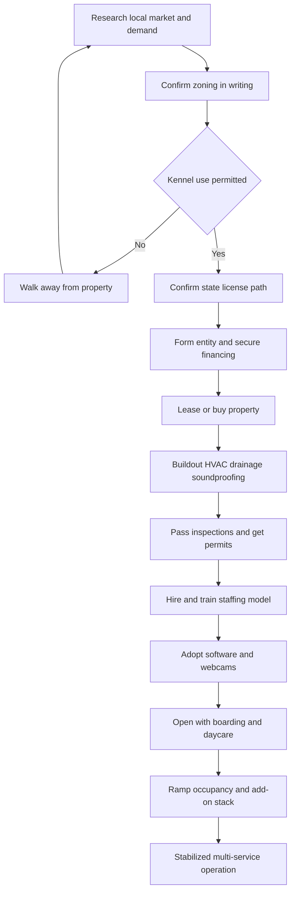

### Direct Answer

To start a dog boarding business in 2027, you secure a zoning-cleared, state-licensed facility that houses dogs overnight at $40-$120 per dog per night, then convert that base into a multi-revenue operation by stacking daycare, grooming, training, and retail onto the same building, staff, and client list. It is a real-estate, licensing, and labor business wearing a dog costume: a 20-50 dog facility costs $75K-$500K+ to open, runs at a 15-30% net margin once stabilized, and generates $150K-$450K of Year-1 revenue before climbing toward $450K-$1.2M by Year 3. Win it by obsessing over occupancy, building a staffing model that survives the 24/7/365 clock, and protecting a reputation that one bad night can destroy.

**TL;DR:** Dog boarding is demand-durable and genuinely profitable, but it is governed by three numbers beginners never calculate: occupancy rate, revenue per available run per night (RevPAR-style thinking), and labor as a percentage of revenue (structurally 35-50%). The three startup killers are (a) committing to a property before confirming zoning and the state pet-care license, (b) never escaping the 24/7/365 staffing trap, and (c) building a beautiful facility with no occupancy strategy. Capital ranges from a $75K-$250K lean retrofit to a $500K-$1.5M+ franchise buildout. The 2027 winner competes on facility quality, the daycare cross-sell, reliability, and reviews — not on being the cheapest kennel in town.

## 1. What A Dog Boarding Business Actually Is In 2027

### 1.1 The Core Transaction And Why It Is Harder Than It Looks

A dog boarding business provides overnight care for dogs while their owners travel for vacations, business, weddings, medical procedures, military deployment, home renovations, or family emergencies. **You are not a groomer, not a vet, and not a dog walker** — you are the operator of a facility that takes physical custody of a living animal, feeds it, exercises it, monitors its health, and returns it safe, clean, and ideally happier than it arrived. The transaction is simple — a night of care for a price — but the business underneath it is a building, a license, a payroll, an occupancy spreadsheet, and a reputation.

**The 2027 context reshapes the business in five durable ways.** Pet owners increasingly treat dogs as family and expect a facility that looks and feels like a hotel rather than a concrete kennel. The cage-free, climate-controlled model moved from luxury differentiator to baseline expectation in competitive metros. Customers want webcams, daily report cards, and digital booking as table stakes. Labor became more expensive and far harder to retain, making staffing the central operational problem. And the industry consolidated, with franchise systems and private-equity-backed groups setting the professional standard at the top of most markets. If you want a deeper read on the adjacent recurring-revenue model, the doggy daycare playbook (q1975) is the closest sibling to this guide.

The customer profile in 2027 also matters. The boarding customer is rarely shopping on price first — they are shopping on trust, because they are handing over a family member for days at a time. They want to see the facility, watch the play groups on a webcam, read a deep base of reviews, and feel that the staff genuinely care. That trust orientation is the founder's single biggest lever: a facility that wins trust can hold premium pricing, fill its peaks, and survive a competitor opening across town, while a facility that competes only on the lowest nightly rate is permanently fragile. The implication for a founder is that the product is not the run or the suite — it is the felt safety of the dog and the felt confidence of the owner, and every operational decision either builds that or erodes it.

### 1.2 Why It Is A Real-Estate Business, Not A Pet Hobby

The single most important reframe a founder can make: **dog boarding is a real-estate-and-labor business with an animal-welfare core**, not a trendy pet side hustle. The dogs are the customers' beloved family members, but the business is the asset stack and the staffing model. It carries brutal holiday-and-summer seasonality, a 24/7/365 operating clock that never stops, and a reputation that one bad night can permanently damage. Founders who internalize this build facilities that pencil; founders who treat it as a fun pet business burn out within two years.

| Misconception | 2027 Reality |
|---|---|
| "It's a fun pet business" | It is a building, a payroll, and a license with an animal-welfare core |
| "Dogs are easy clients" | The dogs are easy; zoning, labor, and liability are not |
| "I'll relax around dogs all day" | You cover overnights, holidays, and the front desk during peak rushes |
| "Quick payback" | Year 1 is occupancy-building, not profit-extraction |
| "No employees needed" | A 24/7/365 facility cannot run on the founder alone |
| "Marketing is optional" | Reputation and the daycare funnel are the business's lifeblood |

### 1.3 The Honest Profile Of A Good Owner

The founders who thrive in dog boarding share a recognizable profile, and a founder should test themselves against it before committing capital. **They genuinely love dogs but run the business with their head, not their heart** — they make the unsentimental staffing, pricing, and zoning decisions a profitable operation requires. **They are comfortable being an employer** — hiring, training, scheduling, and retaining a team is the core skill, not an annoyance. **They are operationally disciplined** — they track occupancy, they document procedures, they plan holiday staffing months ahead. **They can carry weight** — the responsibility for living animals overnight is constant and real, and a founder who cannot sleep through that pressure should not take it on. And **they are patient with capital** — they understand Year 1 is paid tuition, not a payday. A founder missing two or more of these traits is not disqualified, but should know which muscle they will have to build deliberately, because the gap will not close on its own.

## 2. Facility Models And Business Structures

### 2.1 Kennel-Style, Cage-Free, And Luxury Suite

The single most consequential early decision is **what kind of facility you build**, because it determines your capital, capacity, pricing power, and labor model. **Kennel-style** is the traditional format — individual runs, each dog in its own space, with group play offered as a scheduled add-on. It is the lowest-capital format and the easiest to retrofit, but it increasingly competes on price because it reads as "the old way." **Cage-free** groups dogs by temperament and size into supervised play groups during the day; it commands higher prices and drives the daycare cross-sell naturally, but requires far more labor because supervised play needs staff in the room at a strict dog-to-human ratio at all times. **Luxury suite** is the premium tier — private rooms with raised beds, televisions, webcam access, and individualized attention — commanding $80-$200+ per night and the best per-dog margins, but consuming the most square footage.

**Most successful 2027 operators do not pick one purely.** They build a tiered facility: a cage-free core that drives volume and the daycare cross-sell, a set of private and luxury suites that lift the average ticket, and possibly a quiet kennel section for dogs that genuinely do not do group play. The mistake is building a single undifferentiated format and either leaving premium revenue on the table or pricing out the volume segment. A tiered facility also gives the front desk a real selling conversation — it can move a price-sensitive family into the standard tier and an anxious owner of a senior dog into a quiet private suite, capturing both rather than losing one.

| Facility Format | Capital Per Dog | Pricing Power | Labor Intensity |
|---|---|---|---|
| Kennel-style runs | Lowest | Competes on price | Lower |
| Cage-free group play | Moderate | Strong, drives cross-sell | High — ratio-bound staffing |
| Luxury private suites | Highest | Premium ($80-$200+) | Moderate-high |
| Tiered (all three) | Blended | Captures every segment | Managed by zone |

### 2.2 Independent, Franchise, And Multi-Service Hybrid

Beyond the physical format, there are three ways to structure the business itself. **The independent operator model** gives total ownership of the upside, no royalties, and full design freedom — but you build every system from scratch and carry all the buildout and licensing risk. **The franchise model** — buying into Dogtopia, Camp Bow Wow, or K9 Resorts — trades a franchise fee plus ongoing royalties for a proven design, brand recognition, a tested playbook, and supply relationships; it de-risks the buildout but runs $500K-$1.5M+ all-in with a permanent royalty drag. **The multi-service hybrid model** is the operating philosophy that wins regardless of the first two choices: boarding is the anchor, but the facility, staff, and client list are leveraged across daycare, grooming, training, and retail.

**The strategic reality:** nearly every durable 2027 operator runs the hybrid philosophy, so the real choice is independent-hybrid versus franchise-hybrid. The pure single-service boarding kennel is the format most exposed to seasonality and price competition.

| Structure | Capital | Royalty | Autonomy | Best Fit |
|---|---|---|---|---|
| Independent-hybrid | $75K-$700K | None | Full | Founders with operating experience and patience |
| Franchise-hybrid | $500K-$1.5M+ | 5-7% of revenue | Constrained | Founders wanting a de-risked, faster-credibility launch |
| Single-service kennel | $75K-$250K | Varies | Full | Rarely optimal — most fragile to seasonality |

### 2.3 The Franchise Landscape In Detail

The franchise tier is professionalized and consolidated. **Dogtopia** runs 290+ units backed by private-equity firm NorthStar. **Camp Bow Wow** operates 200+ units and has been owned since 2014 by VCA, a division of **Mars, Incorporated** (privately held — not publicly traded, but the same parent behind brands a founder should recognize). **K9 Resorts** has crossed 50+ units, and **PetSuites** runs 35+ units under Mars Veterinary as well. **Best Friends Pet Care** sits inside the Petco ecosystem; Petco trades publicly as **Petco Health and Wellness (NASDAQ: WOOF)**. A founder evaluating franchises should read each Franchise Disclosure Document closely, talk to existing franchisees about real unit economics, and weigh the royalty drag honestly against the buildout and credibility benefit.

## 3. The 2027 Market Reality

### 3.1 Demand Is Structurally Healthy

A founder needs an accurate read of the landscape, because the business is neither a recession-proof goldmine nor a saturated dead end. **Demand is structurally healthy and growing.** The US dog population sits near 89-90 million, US pet-care spending crossed $150 billion, and the long-term pet-humanization trend — owners treating dogs as family and spending accordingly — is durable. Travel rebounded and normalized, dual-income households generate steady boarding need, and willingness to pay for quality care rose meaningfully.

### 3.2 Competition Is Bifurcated And Consolidating

The competition splits into two tiers. At the top of most metros sit franchise systems and PE-backed groups setting a professional, branded standard. Below them is a long tail of independent kennels, in-home boarders, and side hustlers, plus the **marketplace layer** — Rover Group, which trades as **Rover (NASDAQ: ROVR)**, and **Wag! (NASDAQ: PET)** — connecting owners to in-home sitters. The marketplaces own the budget end and reshaped the low end by making in-home boarding easy to find and book, pressuring price-only kennels. Adjacent in-home models like dog walking (q1971) and pet sitting (q1972) compete for the same budget-conscious customer.

### 3.3 What Changed By 2027

| Factor | A Decade Ago | 2027 Reality |
|---|---|---|
| Facility standard | Concrete kennel acceptable | Cage-free, climate-controlled is baseline |
| Webcams & report cards | Premium luxury feature | Table stakes |
| Booking | Phone and paper ledger | Online booking expected |
| Budget competition | Local kennels only | Rover, Wag! own the low end |
| Labor | Manageable | The central operational constraint |
| Service mix | Boarding alone common | Multi-service is the standard |

**The net market reality:** demand is real and durable, the bar for facility quality rose, the marketplaces own the budget end, and the winning 2027 entrant competes on facility quality, the cross-sell, reliability, and reputation — not on being the cheapest kennel.

## 4. The Core Unit Economics: Occupancy And RevPAR

### 4.1 A Dog Boarding Facility Is A Hotel For Dogs

This is the most important section in the guide, because the entire business lives or dies on metrics beginners almost never run. **Financially, a boarding facility is a hotel for dogs** — it has a fixed capacity (the number of runs, suites, or cage-free sleeping spots) and a highly variable occupancy (the percentage of that capacity actually filled). The fatal beginner error is thinking in terms of a full-house holiday weekend and ignoring the slow Tuesday in February.

**Run the math concretely.** A facility with **40 runs** charging an average of **$65 per dog per night** is, at 100% occupancy, generating $2,600 per night — but no boarding facility runs at 100% average occupancy. A realistic stabilized average occupancy across a full seasonal year is roughly **45-65%**, which means that 40-run facility actually generates somewhere around **$1,170-$1,690 per night on average**, or roughly **$427K-$617K annually** from boarding alone before the cross-sell.

### 4.2 RevPAR, Seasonality, And Labor Percentage

The metric that captures the occupancy reality is **revenue per available run per night** — total boarding revenue divided by (runs x nights) — which forces the founder to think about every run's earning power whether or not it is occupied, exactly as hotels think about RevPAR. The second metric is the **seasonality curve**: occupancy is not flat. The Thanksgiving-to-New-Year window and the summer-vacation months run near capacity, while January-February and other shoulder periods can drop to 20-35%. This means peaks must be priced firmly (holiday premiums of 25-50% are standard and correct) and troughs must be filled with daycare and off-peak promotions. The third metric is **labor as a percentage of revenue**, structurally 35-50% because a facility full of living animals needs care every hour — feeding, cleaning, exercising, monitoring, overnight coverage — on Christmas Day exactly as much as on a normal Tuesday.

| Metric | Definition | Healthy 2027 Target |
|---|---|---|
| Average occupancy | Filled capacity averaged across the year | 45-65% |
| RevPAR | Boarding revenue / (runs x nights) | $30-$45 per run-night |
| Peak occupancy | Holiday and summer fill | 90-100% |
| Trough occupancy | Shoulder-month fill | 20-35% |
| Labor % of revenue | All wages / total revenue | 35-50% |
| Net margin (stabilized) | Net profit / revenue | 15-30% |

**The discipline this imposes:** before signing a lease, model realistic average occupancy, not peak occupancy; price the peaks to carry the troughs; build the cross-sell specifically to fill the shoulder months; and staff to a model that survives 24/7/365 without the founder covering every holiday.

### 4.3 A Worked Profit-And-Loss Sketch

To make the economics concrete, sketch a stabilized Year-3 single facility. Assume a 40-run cage-free facility at a 55% average occupancy, a $65 blended boarding rate, and a daycare base and add-on stack that together add roughly 35% on top of boarding revenue. Boarding alone generates about **$522K** (40 runs x 365 nights x 55% x $65), and the cross-sell lifts total revenue to roughly **$700K**. Against that, labor runs about 42% ($294K), facility costs — lease or mortgage, utilities, insurance — run about 22% ($154K), supplies and food about 6% ($42K), software and marketing about 5% ($35K), and miscellaneous about 4% ($28K). That leaves a net of roughly **$147K, a 21% margin** — squarely inside the healthy band. The sketch shows why the three core metrics matter: lift occupancy five points and the net jumps meaningfully; let labor drift to 50% and the net is nearly halved. The founder who manages the P&L by these levers builds a business; the one who manages it by gut feel rides the seasonality blind.

| P&L Line | % Of Revenue | Year-3 Sketch ($700K) |
|---|---|---|
| Total revenue (boarding + cross-sell) | 100% | $700K |
| Labor | 42% | $294K |
| Facility (lease/mortgage, utilities, insurance) | 22% | $154K |
| Supplies and food | 6% | $42K |
| Software and marketing | 5% | $35K |
| Miscellaneous | 4% | $28K |
| **Net profit** | **21%** | **$147K** |

## 5. Pricing Architecture

### 5.1 The Base Rate And Discount Layers

Pricing in dog boarding has multiple layers, and a founder must get all of them right because the headline per-night rate is only part of revenue per dog. **The base overnight rate** is anchored to facility tier and local market — a standard run or cage-free spot runs $40-$80 per night, while a private or luxury suite with webcam and premium amenities runs $80-$200+. **Multi-dog discounts** (15-25% off the second dog from the same household) win the family booking. **Holiday and peak premiums** of 25-50% are standard, correct, and essential — holiday weeks are when demand vastly exceeds supply, and pricing them firmly is how the peak funds the trough. **Long-stay discounts** of 10-20% for stays of seven nights or more fill capacity efficiently and reduce per-night labor intensity.

### 5.2 The Add-On Stack

The add-on stack is where boarding revenue per dog can grow 30-60%: a **daycare add-on during boarding** ($25-$50/day) for structured play; **grooming** — a bath, nail trim, or full groom at checkout ($25-$150); **training during boarding** ($50-$150 for board-and-train sessions); **enrichment add-ons** like one-on-one play, extra walks, and bedtime "tuck-in" services; and **retail** — selling the food, treats, and supplies the dog needs anyway. The pricing discipline: set the base rate to the facility tier and market, build a clear holiday-premium calendar, use multi-dog and long-stay discounts to win volume, and treat the add-on stack as deliberate revenue architecture. The difference between a $65 boarding night and a $65 night plus a $35 daycare add-on plus an $80 exit groom is the difference between a thin-margin facility and a healthy one.

| Service | Typical 2027 Price | Notes |
|---|---|---|
| Standard overnight (run / cage-free) | $40-$80/night | Base rate, market-dependent |
| Luxury suite (private + webcam) | $80-$200/night | Highest margin per dog |
| Multi-dog discount | 15-25% off 2nd dog | Wins the family booking |
| Holiday / peak premium | +25-50% | Essential — peak funds the trough |
| Long-stay discount (7+ nights) | 10-20% off | Fills capacity, cuts per-night labor |
| Daycare add-on during boarding | $25-$50/day | Drives the cross-sell |
| Bath at checkout | $25-$80 | Dog goes home clean |
| Full groom add-on | $40-$150 | Higher-ticket exit service |
| Board-and-train session | $50-$150 | Owner returns to a better-behaved dog |
| Enrichment / one-on-one play | $10-$30 each | Easy, high-margin add-on |

## 6. Zoning, Licensing, And The Number-One Fatal Mistake

### 6.1 A Kennel Is A Restricted Land Use Almost Everywhere

This section exists because the single most common way founders destroy capital is **signing a lease or buying land before confirming the property can legally operate as a kennel**. A dog boarding facility is a restricted land use almost everywhere — kennels generate noise, odor, traffic, and waste, and municipalities regulate them tightly. Before any property is committed, the founder must confirm: that the zoning designation permits a commercial kennel or boarding use (often requiring a specific zoning category, a conditional use permit, or a special exception, sometimes with a public hearing where neighbors can object); that the property meets setback, acreage, or buffer requirements from residential properties; and that no covenants, deed restrictions, or HOA rules prohibit the use.

### 6.2 The State License And Other Approvals

**The state pet-care-facility license** is the second non-negotiable — most states require a kennel, boarding, or animal-care-facility license covering ventilation, drainage, square footage per animal, fire safety, sanitation, staffing, and inspection; some jurisdictions add county or city licenses on top. **Other approvals** include the general business license, an occupancy permit reflecting the kennel use, building permits for any construction, and sometimes USDA registration depending on the activities.

**The fatal pattern is consistent:** an excited founder finds a perfect building, signs a lease or closes on the land, and only then discovers the zoning does not permit a kennel or that the conditional use permit will be denied. **The discipline is absolute:** confirm zoning in writing from the municipality and confirm the state licensing path before committing a dollar to a property — ideally with a zoning attorney or land-use consultant — and write zoning-and-licensing contingencies into any lease or purchase agreement.

| Approval | Issuing Body | When To Secure |
|---|---|---|
| Zoning verification / CUP | City or county planning | Before committing to property — in writing |
| State pet-care facility license | State agriculture / animal health | Before opening; inspection-gated |
| Business license | City / county | At entity setup |
| Occupancy permit | Local building department | After buildout, before opening |
| Building permits | Local building department | Before construction |
| USDA registration | USDA (activity-dependent) | If applicable to the operation |

## 7. Facility Buildout, Layout, And Equipment

### 7.1 The Core Spaces

Once zoning and licensing are confirmed, the facility must be designed as an operational system. **The core spaces** are: the boarding area itself — runs, suites, or cage-free sleeping quarters; indoor and outdoor **play and exercise areas**, ideally climate-controlled so weather never shuts down operations, with separate areas for size and temperament groups; a **lobby and check-in area** that makes the first impression and handles the holiday-rush traffic; **grooming space** if grooming is part of the model; **food prep and storage**, a **laundry** for constant bedding washing, and **isolation or medical space** for sick dogs; **staff areas** and overnight accommodation if a staff member sleeps on-site; and adequate **parking** for the peak.

### 7.2 The Critical Building Systems

The building systems are where buildout budgets are won or lost. **Drainage and flooring** must handle constant cleaning and be sealed, sloped, and sanitary. **Ventilation and HVAC** must control odor, temperature, and air quality at a level a home system never contemplates — a major and frequently underestimated cost. **Soundproofing and acoustic treatment** controls the barking that drives both neighbor complaints and staff fatigue. **Fire safety and sprinklers** are typically code-required. **Security and webcam systems** are both an operational tool and a 2027 customer expectation. The buildout cost spread is enormous: a light retrofit of an existing kennel building runs $75K-$200K, while a ground-up cage-free climate-controlled facility — or a franchise buildout to brand standard — runs $300K-$1.5M+. The discipline: design the layout for efficient workflow with clean separation of clean and dirty paths, do not underbudget HVAC, drainage, and soundproofing, and let the facility tier match the market you actually have.

## 8. The Facility-Opening Workflow

### 8.1 The Gated Sequence

The diagram below shows the disciplined sequence from market research to a stabilized operation. Every step gates the next — and zoning verification must clear before a property is committed.

### 8.2 Why The Sequence Cannot Be Reordered

The single most common — and most expensive — error is treating this sequence as flexible. **Zoning verification must precede any property commitment**, because a lease or purchase on a parcel that cannot legally host a kennel is unrecoverable capital. **Financing should be arranged before, not after, the buildout begins**, because a half-built facility that runs out of capital is worse than no facility at all. **Inspections and permits gate opening day**, not the other way around — a facility that opens before passing its pet-care-facility inspection is operating illegally and uninsurably. And **the staffing model must be hired and trained before the doors open**, because a facility that opens understaffed during a holiday rush — the most likely opening window, since founders chase the peak — produces exactly the incidents and bad reviews that end a young business. The founders who fail almost always compressed or reordered this sequence to save time; the time saved is illusory and the capital lost is real.

### 9.1 The Work Never Stops

Labor is the largest operating cost and the hardest operational problem in dog boarding. **The work never stops** — a facility full of living animals needs feeding, cleaning, exercise, monitoring, and overnight presence every single day, including every holiday, which is precisely when the facility is fullest. This is not a business that closes for Christmas; Christmas is peak.

**The core roles**: kennel technicians who do feeding, cleaning, and direct care; play-group supervisors who maintain strict dog-to-human ratios in cage-free settings (a real, non-negotiable safety requirement); overnight staff or an on-site caretaker for nighttime monitoring; a front-desk team that carries the booking and check-in load; groomers and trainers if those services are offered; and a facility manager as the operation grows. The dog-to-staff ratio is not arbitrary — it directly drives insurance and liability exposure, and the ratio math is covered in depth in the daycare-staffing analysis (q1135).

### 9.2 The Founder's Trap

**The staffing challenges are structural**: the work is physically demanding and emotionally weighty, industry wages are not high which makes retention hard, the schedule includes early mornings, weekends, overnights, and holidays, and turnover is a constant drain. **The founder's trap** is personally covering every gap — every holiday, every call-out, every overnight — until burnout. The disciplined response: build a real staffing model from the start with enough cross-trained people that no single absence breaks the schedule, pay and treat staff well enough to retain them because turnover is more expensive than wages, document procedures so a new hire becomes productive quickly, and explicitly plan holiday staffing with premium pay and advance scheduling. Labor will run 35-50% of revenue.

| Role | Function | Schedule Reality |
|---|---|---|
| Kennel technician | Feeding, cleaning, direct dog care | Early mornings, weekends, holidays |
| Play-group supervisor | Maintains dog-to-human ratio | Daytime, ratio-critical |
| Overnight caretaker | Nighttime monitoring and emergencies | Overnights, every night |
| Front desk | Booking, check-in, customer service | Brutal during holiday rushes |
| Groomer / trainer | Add-on services | Scheduled, often commission-based |
| Facility manager | Oversees operations as it scales | Full-time, management rhythm |

## 10. Insurance, Liability, And Animal-Care Risk

### 10.1 The Liability Scenarios

Dog boarding takes physical custody of living animals that can be injured, fall ill, escape, or die in your care — and that custody is the central risk of the business. **The liability scenarios are real and varied**: a dog injured in a play-group altercation, a dog that escapes, a dog that falls ill or has a medical emergency overnight, a dog that dies of an undetected condition or heat or stress, a contagious illness spreading through the facility, a staff member or visitor bitten, a slip-and-fall in the lobby, property damage.

### 10.2 The Insurance Stack And Operational Controls

**The insurance stack** a 2027 facility carries: **general liability**; **animal bailee coverage** — the specific and essential coverage for animals in your care, custody, and control, which standard general liability typically excludes; **professional liability** for care decisions; **commercial property** for the building and equipment; **commercial auto** if the business transports dogs; **workers' compensation** for the staff doing physically risky work; and an **umbrella policy** over the top. **Beyond insurance, the operational risk controls** matter as much: a thorough intake process with vaccination requirements (rabies, distemper, bordetella at minimum), a temperament evaluation before any dog joins group play, strict dog-to-human ratios, secure double-gated entry and escape-proof fencing, a clear emergency and veterinary protocol with an established local vet relationship, isolation space, detailed incident documentation, and a thorough boarding contract. **Reputation is the uninsurable asset** — a single dog death, escape, or serious injury can spread through a community fast enough to end a facility regardless of insurance.

| Coverage | What It Protects | Notes |
|---|---|---|
| General liability | Bodily injury, property damage on premises | Typically excludes animals in your care |
| Animal bailee | Dogs in your care, custody, and control | Essential — the core coverage gap |
| Professional liability | Care decisions and advice | Often bundled |
| Commercial property | Building, buildout, equipment | Replacement-cost basis |
| Commercial auto | Transport vehicles | If the business moves dogs |
| Workers' compensation | Staff injuries | Mandatory with employees |
| Umbrella | Excess over all primary policies | Cheap relative to its protection |

## 11. The Multi-Service Cross-Sell

### 11.1 The Daycare Cross-Sell: Filling The Trough

Doggy daycare is the single most important add-on. **Daycare solves the seasonality problem.** Boarding revenue is violently seasonal — peaks at holidays and summer, troughs in shoulder months. Daycare revenue is the opposite: steady, recurring, weekday-concentrated, and largely counter-cyclical, generated by working dog-owners who drop off in the morning and pick up at night regardless of the travel calendar. A boarding facility that adds daycare uses the same building, play yards, staff, and client list to generate a smooth recurring revenue stream that fills the exact months boarding is weak.

**Daycare also feeds the boarding funnel.** A dog that comes to daycare regularly is already temperament-evaluated, comfortable in the facility, and known to staff — and its owner is the easiest possible boarding customer to convert when they travel. Day rates run $25-$45, with discounted multi-day packages and monthly memberships that lock in recurring revenue. The full standalone daycare model is detailed in the doggy daycare guide (q1975).

### 11.2 Grooming, Training, And Retail

Beyond daycare, the multi-service model layers three more streams. **Grooming** is a natural high-margin add-on — the dog is already at the facility and the owner wants it home clean; a bath, nail trim, or full groom at checkout is an easy yes, and grooming can also serve the daycare and local client base standalone. The economics of a dedicated grooming operation are covered in the pet grooming (q1935) and mobile pet grooming (q1973) guides. **Training** is the highest-expertise add-on — board-and-train programs, group classes, and private sessions — commanding premium pricing because skilled training is genuinely valuable and not commoditized; the standalone training model is detailed in the dog training guide (q1976). **Retail** is the lowest-effort add-on — selling the food, treats, supplements, toys, and supplies the customer's dog needs anyway, generating incremental margin from existing foot traffic.

**The strategic logic of stacking:** each added service uses the same fixed assets — building, location, brand, client list — so the marginal cost of an additional revenue stream is far lower than starting it standalone, and each service makes the others stickier. The discipline: do not launch all five services on day one — start with the boarding-and-daycare core, add grooming once the base is stable, layer training when the right trainer is available, and run retail throughout.

| Service | Effort To Add | Margin Profile | Strategic Role |
|---|---|---|---|
| Daycare | Modest for cage-free facility | Steady, recurring | Smooths seasonality, feeds funnel |
| Grooming | Moderate — needs groomer and space | High per-service | Easy exit-day upsell |
| Training | High — needs qualified trainer | Premium pricing | Deepens client relationship |
| Retail | Low | Incremental | Recurring food sales bring clients back |
| Enrichment | Very low | High | Low-effort revenue per stay |

## 12. Software, Booking, And Operations Systems

### 12.1 Pet-Care Facility Management Software

In 2027 a dog boarding facility runs on purpose-built software, because the operation is too complex and date-sensitive for a paper calendar. **Pet-care facility management software** is the central system: it manages reservations and prevents overbooking against capacity, holds client and pet records (vaccinations, temperament notes, feeding instructions, medications, emergency contacts), handles online booking and the customer portal, processes payments and deposits, manages the daycare check-in flow, runs the report cards and photo updates customers expect, and consolidates occupancy and revenue reporting. This is the first serious software purchase and the one a facility cannot run without past a handful of dogs.

### 12.2 Booking Experience, Webcams, And Procedures

**The booking experience matters commercially** — 2027 customers expect to book online, see availability, manage their pet's profile, and receive digital report cards; a facility still taking bookings by phone with a paper ledger loses customers. **The webcam system** — letting owners watch their dog — is both an operational tool and a marketing and trust asset. **Operational systems beyond software** include documented procedures for intake, feeding, cleaning, play-group management, emergency response, and the post-stay handoff; checklists that make a new hire productive quickly; and the occupancy and revenue dashboards that let the founder manage the RevPAR and seasonality math rather than guess. The discipline: adopt the facility-management platform early, build the online booking and report-card experience to 2027 expectations, integrate webcams, and document procedures.

## 13. Startup Cost Breakdown

### 13.1 The Honest All-In Number

A founder needs a clear-eyed total of what it costs to open, because the range is enormous and under-capitalization is a top killer. The all-in cost breaks down across the **facility** (the largest and most variable line — $50K-$150K for a light retrofit, $250K-$1M+ for ground-up or franchise buildout), the **franchise fee** if franchising ($40K-$70K), **building systems** (HVAC, drainage, soundproofing, fire safety — $30K-$200K+ and frequently underbudgeted), **kennel and play-yard equipment** ($15K-$100K), **grooming and other service equipment** ($5K-$30K), **webcam and security systems** ($5K-$25K), **facility management software** (modest), **insurance** ($3K-$15K to start), **licensing and permits** ($1K-$10K plus professional fees), **legal and professional** ($2K-$15K), **initial marketing and website** ($3K-$15K), **pre-opening staffing and payroll** ($10K-$40K), and a **working capital and ramp-up reserve** ($30K-$100K+).

### 13.2 The Three Launch Paths

| Cost Line | Lean Retrofit | Ground-Up Independent | Franchise Buildout |
|---|---|---|---|
| Facility (lease/buildout or land/construction) | $50K-$150K | $250K-$600K | $300K-$1M+ |
| Franchise fee | -- | -- | $40K-$70K |
| Building systems (HVAC, drainage, sound, fire) | $20K-$60K | $50K-$150K | included in buildout |
| Kennel & play-yard equipment | $15K-$40K | $30K-$80K | $30K-$100K |
| Webcam, camera, security | $5K-$15K | $10K-$25K | $10K-$25K |
| Insurance (GL, animal bailee, property, WC) | $3K-$8K | $5K-$12K | $5K-$15K |
| Licensing, permits, zoning | $1K-$5K | $3K-$10K | $3K-$10K |
| Legal & professional | $2K-$8K | $5K-$15K | $5K-$15K |
| Marketing & website | $3K-$8K | $5K-$15K | included or $5K-$15K |
| Pre-opening staffing & payroll | $10K-$25K | $20K-$40K | $20K-$50K |
| Working capital / ramp reserve | $30K-$60K | $50K-$100K+ | $75K-$150K+ |
| **Approximate all-in total** | **$75K-$250K** | **$300K-$700K** | **$500K-$1.5M+** |

**The capital requirement is the single biggest filter** on who should start this business. Financing through SBA loans, equipment financing, and real-estate financing is common and appropriate for the building and equipment lines — but the founder must still hold real cash for the ramp-up reserve, because a new facility takes months to build occupancy and the first slow season arrives before the client base is deep.

## 14. The Year-One Operating Reality And Five-Year Trajectory

### 14.1 What Year One Actually Looks Like

A founder should walk into Year 1 with accurate expectations. **Year 1 is occupancy-building and systems-shaking-out mode, not profit-extraction mode.** A new facility opens at low occupancy and ramps over months — the client base does not exist yet, the reputation is unbuilt, and the temperament-evaluation pipeline is just starting. The first year is spent learning the real occupancy curve, discovering the true labor cost of 24/7/365 coverage, building the daycare base, establishing the vet relationship, and finding out where the facility and procedures are fragile. A disciplined Year 1 single-facility operation can realistically generate **$150K-$450K in revenue** against a thin or even negative net as the operation absorbs the buildout, pre-opening costs, and the slow ramp. The first holiday season is both the revenue test and the operational test.

### 14.2 The Five-Year Arc

| Year | Revenue Range | Net Margin | Operating Reality |
|---|---|---|---|
| Year 1 | $150K-$450K | Thin to negative | Occupancy ramp, founder covering shifts, systems shake out |
| Year 2 | $350K-$700K | 15-25% | Occupancy stabilizes, daycare base builds, staffing matures |
| Year 3 | $450K-$1.2M | 15-30% | Full multi-service stack, founder managing not covering |
| Year 4 | $700K-$1.8M | 15-30% | Possible 2nd location, off-peak programming matures |
| Year 5 | $600K-$3M+ | 15-30% | Mature single facility or 2-3 location group |

By **Year 2**, occupancy stabilizes toward the 45-65% average range, the daycare base builds into a recurring floor, grooming and the add-on stack come online, and the net turns clearly positive. By **Year 3**, the operation is a real business with a system — a stable client base, a functioning staffing model, the full multi-service stack — and the founder manages rather than covers every shift. By **Year 5**, a mature operation is a strong single facility running $600K-$1.2M or a two-to-three-location group running $1.5M-$3M+, with the founder deciding whether to stay lean, scale a regional group, pursue a franchise relationship, or position for sale. These numbers assume disciplined occupancy-based planning, a real staffing model, a functioning cross-sell, and a clean safety record — they do not assume exponential growth, because dog boarding scales with facility capacity, occupancy, and the number of locations.

## 15. Five Named Real-World Operating Scenarios

### 15.1 The Five Scenarios

Concrete scenarios make the model tangible. **Scenario one — Priya, the disciplined retrofit operator:** finds an existing kennel building with good bones and confirmed zoning, retrofits it cage-free for $190K all-in including a real ramp reserve, opens with boarding and daycare from day one, prices holidays firmly at a 40% premium, and builds the temperament-evaluation pipeline deliberately; her occupancy ramps to a 58% average by Year 2, the daycare floor smooths her shoulder months, and she reaches $620K revenue at a 24% net by Year 3.

**Scenario two — the cautionary tale, Brandon:** falls in love with a property and signs a five-year lease before confirming zoning, then discovers the parcel requires a conditional use permit that the planning commission denies after a neighbor objection over noise; he is now carrying lease payments on a building that cannot legally be a kennel, and the business never opens.

**Scenario three — the Okafor family, the franchise route:** buys into an established boarding-and-daycare franchise, pays a $55K franchise fee, builds to brand standard for $850K all-in with SBA and equipment financing, and trades royalty drag and constrained autonomy for a proven design, a tested playbook, and faster credibility; they ramp faster than an independent would, hitting $900K revenue by Year 3 at a tighter net.

**Scenario four — Marisol, the multi-service maximizer:** opens a cage-free facility and deliberately stacks revenue — daycare from day one, grooming in month eight, board-and-train in Year 2 when she finds the right trainer, retail throughout — so that by Year 3 boarding is only 55% of her revenue and the facility is far more resilient and less seasonal; she reaches $780K at a 27% net.

**Scenario five — Derek, the labor-trap casualty:** builds a solid facility but never builds past himself on staffing — he personally covers every overnight, every holiday, every call-out — and by mid-Year 2, after eighteen months of no real time off and a near-miss incident on a night he was exhausted, he burns out and sells at a discount.

| Scenario | Path | Year-3 Outcome | Lesson |
|---|---|---|---|
| Priya | Disciplined retrofit | $620K, 24% net | Occupancy math and cross-sell in the plan |
| Brandon | Zoning wipeout | Never opened | Confirm zoning before committing |
| Okafor family | Franchise route | $900K, tighter net | De-risked buildout, royalty drag |
| Marisol | Multi-service maximizer | $780K, 27% net | Stacking revenue beats boarding alone |
| Derek | Labor-trap casualty | Sold at a discount | Build a staffing model past yourself |

### 15.2 What The Five Scenarios Have In Common

The pattern across the five is consistent and instructive. **The two failures — Brandon and Derek — failed on the two things this guide flags as fatal**: a property committed before zoning was confirmed, and a founder who never escaped the labor trap. Neither failed because the market was bad or the dogs were hard; both failed on a known, avoidable, foreseeable mistake. **The three successes — Priya, the Okafor family, and Marisol — each built on the same three disciplines**: realistic occupancy math, a real staffing model, and a deliberate cross-sell. They differ in path — retrofit, franchise, multi-service maximizer — but not in fundamentals. The lesson for a founder is freeing rather than discouraging: the outcomes are not random and the business is not a coin flip. The failures are concentrated in a short, knowable list of mistakes, and the successes are concentrated in a short, knowable list of disciplines. A founder who treats this guide's fatal-mistake list as a pre-launch checklist has already removed most of the risk.

## 16. Counter-Case: When Dog Boarding Is The Wrong Business

### 16.1 Who Should Not Start This

A disciplined founder must consider the case against starting. **Dog boarding is the wrong business** for anyone who wants light work, a clean schedule, fast payback, or a business without real estate, employees, and the permanent weight of custody. The 24/7/365 clock is non-negotiable — there is no version of this business that closes for the holidays, and the holidays are peak. If you cannot commit to either covering or staffing every overnight and every holiday, this is not your business. The capital intensity is a hard filter: a founder without access to $75K minimum in real and financed capital, plus a genuine ramp reserve, should not start, because under-capitalization meeting the first slow season is a top killer.

### 16.2 The Honest Alternatives

The **zoning constraint** alone disqualifies many would-be founders — if no zoning-cleared property is realistically available or affordable in the target market, the business cannot be built there, and no amount of operational skill overcomes a building that cannot be licensed. The **emotional weight** is real: this business holds living animals overnight, and dogs can fall ill, be injured, escape, or die in your care; a founder who cannot carry that responsibility, or whose temperament makes a single bad incident catastrophic to their wellbeing, should choose differently.

**The honest alternatives** are lighter and lower-capital: **in-home pet sitting (q1972)** and **dog walking (q1971)** require almost no capital, no real estate, and no buildout while still serving pet owners; **mobile pet grooming (q1973)** is a vehicle-based service business with far lower fixed cost; and **horse boarding (q2061)** is an adjacent animal-boarding model with different land and zoning dynamics for founders who already own acreage. A founder drawn to animal care but not to a 24/7 facility should seriously weigh these before committing $75K-$500K and the permanent operating clock of a boarding kennel. Dog boarding rewards the founder who genuinely wants a real-estate-and-labor business with an animal-welfare core — and quietly punishes everyone who wanted something lighter.

## 17. Lead Generation, Marketing, And Reputation

### 17.1 The Channels That Actually Work

Dog boarding is a local, trust-and-reputation business, and the lead-generation engine is reputation, local visibility, and the daycare funnel far more than broad advertising. **The daycare-to-boarding funnel** is the most valuable channel — a regular daycare dog is temperament-evaluated, comfortable, and known, and its owner is the easiest boarding conversion there is. **Online reviews and reputation** are decisive — prospective customers researching where to leave their beloved dog read reviews obsessively, and a strong, deep base of positive reviews is the single most powerful asset. **Local search and the website** — ranking for local boarding and daycare searches, with a professional site that shows the facility and enables online booking — converts the active-need searcher. **Veterinarian relationships** are a high-trust referral source; being the facility a respected local vet recommends is durable, qualified demand, and the veterinary-clinic business model (q9661) explains the referral economics from the other side. **Other local referral sources** — groomers, trainers, pet stores, dog walkers, breeders, and rescues — form a referral web. **Social media** showing dogs playing, report cards, and the staff who love the animals builds the trust and emotional connection that converts.

| Channel | Trust Level | Cost | Strategic Role |
|---|---|---|---|
| Daycare-to-boarding funnel | Highest | Built into operations | Pre-qualified boarding conversions |
| Online reviews | Decisive | Reputation management time | Converts and absorbs setbacks |
| Local search & website | High | Moderate setup + ongoing | Captures the active-need searcher |
| Veterinarian referrals | Highest | Relationship-building time | Durable qualified demand |
| Social media | Moderate-high | Low | Builds emotional connection |
| Paid local search ads | Moderate | Ongoing spend | Supporting role for active need |

**The discipline:** treat reputation management and the daycare funnel as core ongoing functions, build the vet and local-business referral web deliberately, and use social media to show the safety and the joy.

### 17.2 Managing Reputation As A Core Function

Because reviews are decisive, a 2027 operator treats reputation as an operating discipline, not a marketing afterthought. **Ask for reviews systematically** — a happy customer at a flawless pickup is the moment to request a review, and a light, well-timed prompt converts far better than hoping. **Respond to every review, positive and negative** — a calm, specific, non-defensive response to a critical review tells the next prospective customer far more than the complaint itself does. **Treat a negative incident as a fork** — the facility that communicates transparently with the affected owner, makes it right, and learns from it often retains the customer and the community's trust, while the facility that goes quiet or defensive converts one bad night into a lasting reputation wound. **Build the review base deep enough to absorb a setback** — a facility with 300 reviews at 4.8 stars survives an isolated bad review; a facility with 12 reviews does not. The reputation moat is the single most durable competitive advantage in this business, and unlike a buildout it cannot be bought — only earned, review by review and stay by stay.

## 18. Risk Management And Financing

### 18.1 Risk Management Beyond Insurance

The dog boarding model carries specific risks beyond insurable liability. **Reputation risk** is the largest and least insurable — one dog death, escape, or serious injury can spread through a community fast enough to threaten the business; mitigated by rigorous safety procedures, transparent communication, and a review base strong enough to absorb a setback. **Disease-outbreak risk** — kennel cough, canine influenza, parvo — is mitigated by strict vaccination requirements, intake screening, sanitation, isolation space, and ventilation. **Staffing and burnout risk** is mitigated by a real staffing model with cross-trained depth and retention-focused pay. **Seasonality risk** is mitigated by the daycare floor and a ramp reserve. **Zoning and regulatory risk** — ongoing, as a noise or odor complaint can trigger scrutiny — is mitigated by good neighbor relations, soundproofing, and clear compliance. **Concentration risk** — a single facility is a single point of failure — is mitigated over time by a second location.

### 18.2 Financing The Business

Because dog boarding is capital-intensive, a founder should understand the financing options. **SBA loans** — particularly the 7(a) and 504 programs — are a natural fit, because the business has real estate, equipment, and a buildout that lenders understand; the 504 program is built for owner-occupied real estate. **Real-estate financing** applies when the founder buys the property. **Equipment financing** covers kennel runs, HVAC, and grooming equipment. **Franchise financing** streamlines a brand buildout through established lender relationships. **Seller financing** can apply when buying an existing facility — often a lower-risk entry because the zoning is already proven, the license is in place, and there is an existing client base. The financing discipline: finance the productive assets, but never finance away the ramp cushion — the single best risk-reducer is buying an existing facility, because the zoning and license that kill startups already exist.

## 19. Taxes, Structure, And Owner Lifestyle

### 19.1 Tax And Business Structure

A founder should set up the tax and legal structure deliberately. **Entity:** most operators form an LLC or S-corp for liability protection and tax flexibility — and given the genuine custody-and-injury liability, the shield matters; the entity holds the lease or property, the license, the insurance, the employment relationships, and signs the boarding contracts. **Real estate and depreciation** are central if the founder owns the property — the building, buildout, and major equipment are depreciable, and a cost-segregation study on a buildout can be worth real money. **Payroll taxes and employment compliance** are a major unavoidable function — this is a real-employee business with overnight, weekend, and holiday labor. **Sales tax** treatment of boarding, daycare, grooming, training, and retail varies by jurisdiction. The discipline: separate business banking from day one, a bookkeeping system that tracks real estate and equipment as assets, a compliant payroll system, and an accountant who understands real-estate-heavy, employee-heavy small businesses.

### 19.2 What Running This Business Actually Feels Like

In **Year 1**, running a lean operation, the founder is genuinely in the business — covering kennel shifts, doing intakes and temperament evaluations, managing the front desk during the holiday rush, covering overnights and holidays, and carrying the weight of being responsible for living animals around the clock. By **Year 2-3**, with a facility manager and a real staffing model, the role shifts toward management, though the business is never truly hands-off and the founder is still pulled in for holiday peaks and hard incidents. By **Year 3-5**, with a mature team and possibly multiple locations, the founder runs a larger operation with a managerial rhythm, but the permanent features remain: the 24/7/365 clock, the seasonality, and the emotional weight of custody. The emotional texture: real and deep satisfaction in a facility full of happy dogs and a flawless holiday season, and real stress in the overnight emergency, the play-group incident, and the staff call-out on Christmas.

## 20. The Decision Framework And Common Mistakes

### 20.1 Should You Actually Start This In 2027

A founder can avoid most failure modes simply by knowing them in advance, because the mistakes are remarkably consistent: **committing to a property before confirming zoning and the state license**; **building on peak-occupancy math instead of realistic average-occupancy math**; **never escaping the 24/7/365 labor trap**; **underbudgeting the building systems**; **carrying the wrong insurance** (general liability without animal bailee coverage); **sloppy safety procedures**; **skipping the daycare cross-sell**; **underpricing the holidays**; **under-capitalization**; **ignoring neighbor and regulatory relations**; **neglecting online reputation**; and **trying to launch all five services on day one**.

### 20.2 The Go / No-Go Checklist

| Question | Go Signal | No-Go Signal |
|---|---|---|
| Zoning | A property is zoning-cleared in writing | No affordable kennel-zoned property exists |
| Capital | $75K+ real and financed, with ramp reserve | Stretched, no reserve |
| Schedule | Willing to cover or staff every holiday | Wants a clean, predictable schedule |
| Temperament | Can carry the weight of custody | A bad incident would be catastrophic |
| Plan | Built on average-occupancy and the cross-sell | Built on holiday-weekend fantasy math |
| Staffing | Will build a model past the founder | Plans to personally cover everything |

**Net:** dog boarding is viable and rewarding in 2027 as a disciplined, occupancy-obsessed, cross-sell-driven operation built on zoning certainty, a real staffing model, and a reputation that survives a single bad incident — and a poor fit for anyone who wants light work, a clean schedule, fast payback, or a business without real estate, employees, and the permanent weight of being responsible for living animals.

## Related Entries

- How do you start a doggy daycare business in 2027? (q1975)
- How do you start a dog training business in 2027? (q1976)
- How do you start a dog walking business in 2027? (q1971)
- How do you start a pet sitting business in 2027? (q1972)
- How do you start a mobile pet grooming business in 2027? (q1973)
- How do you start a pet grooming business in 2027? (q1935)
- How do you start a horse boarding business in 2027? (q2061)
- How do you start a veterinary clinic in 2027? (q9661)
- What's the right dog-to-staff ratio for a daycare facility? (q1135)

## Sources

1. American Pet Products Association — National Pet Owners Survey, pet population and spending data.
2. American Veterinary Medical Association — Pet ownership and demographics statistics.
3. IBISWorld — Pet Boarding and Grooming in the US, industry report.
4. US Bureau of Labor Statistics — Animal care and service workers, occupational outlook.
5. US Small Business Administration — SBA 7(a) loan program guidelines.
6. US Small Business Administration — SBA 504 loan program for real estate and equipment.
7. US Department of Agriculture — Animal Welfare Act licensing and registration.
8. International Boarding & Pet Services Association — facility standards and best practices.
9. Pet Care Services Association — historical kennel operation standards.
10. Dogtopia — franchise disclosure and unit-count public reporting.
11. Camp Bow Wow — franchise system and VCA / Mars ownership history.
12. K9 Resorts — franchise development and luxury-suite model materials.
13. Mars, Incorporated — Petcare division and VCA Animal Hospitals overview.
14. Petco Health and Wellness Company (NASDAQ: WOOF) — investor and brand filings.
15. Rover Group (NASDAQ: ROVR) — pet-care marketplace investor materials.
16. Wag! Group Co. (NASDAQ: PET) — on-demand pet services public filings.
17. American Animal Hospital Association — canine vaccination guidelines.
18. American Kennel Club — boarding facility selection and care guidance.
19. National Association of Insurance Commissioners — animal bailee and commercial coverage overview.
20. Insurance Information Institute — small business insurance fundamentals.
21. US Internal Revenue Service — depreciation and Section 179 expensing rules.
22. US Internal Revenue Service — employer payroll tax responsibilities.
23. National Federation of Independent Business — small business compliance resources.
24. American Bar Association — land use, zoning, and conditional use permit overview.
25. International Code Council — building and fire code standards for animal facilities.
26. US Department of Labor — Fair Labor Standards Act wage and overtime rules.
27. SCORE — small business mentoring and startup financial planning resources.
28. National Association of Professional Pet Sitters — pet-care service industry standards.
29. Pet Sitters International — professional pet-care certification and standards.
30. American Society for the Prevention of Cruelty to Animals — animal welfare and disease-prevention guidance.
31. Cornell University College of Veterinary Medicine — canine infectious disease resources.
32. Centers for Disease Control and Prevention — zoonotic disease and animal facility hygiene guidance.
33. US Federal Trade Commission — Franchise Rule and disclosure document requirements.
34. State agriculture and animal health department resources — pet-care facility licensing (varies by state).
