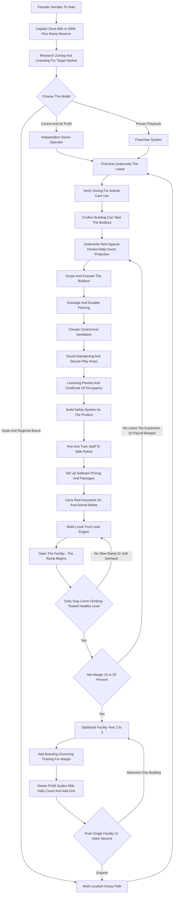

### Direct Answer

To start a doggy daycare business in 2027, you lease and build out a commercial facility, get it zoned and licensed as a commercial animal-care operation, hire and train a staff of dog handlers, and charge working dog owners to drop off their dogs for supervised group play, exercise, and socialization -- typically **$35-$80 for a full day, $20-$50 for a half day, and $300-$800 a month for an unlimited membership** -- while layering in overnight boarding, grooming, and training as higher-margin cross-sells. The model is **real and durable but capital-intensive and operationally relentless**: the entire economics rest on two numbers most beginners never calculate -- **average daily dog count** (how many dogs are physically in the building on a typical weekday) and **net margin after rent and labor** (genuinely thin at 15-25%). A disciplined single-facility startup invests **$80K-$500K**, runs at a **15-25% net margin**, and in a sound Year 1 generates **$150K-$500K in revenue** at 30-80 dogs a day; a mature operation reaches **$400K-$1M+**, scalable into a multi-location group.

**TL;DR:** Doggy daycare is a commercial-real-estate-and-payroll business with a play yard attached. Revenue is daily dog count multiplied by blended revenue per dog multiplied by operating days. The four killers are signing the wrong lease, under-budgeting the buildout, underestimating the labor model, and opening with no ramp reserve. It is viable in 2027 as a disciplined, daily-count-obsessed, safety-led operation built on a safe facility and a trusted local reputation -- and a poor fit for anyone who wants a low-capital business, a passive asset, or a venture without a lease, a buildout, and a payroll.

## 1. What A Doggy Daycare Business Actually Is In 2027

### 1.1 The Core Operating Idea

A doggy daycare operates a commercial facility where dog owners drop off their dogs for the day -- typically while they are at work -- and the facility provides supervised group play, exercise, rest, socialization, and basic care until evening pickup. **You are not a kennel that stores dogs in runs, and you are not a dog walker or pet sitter working out of other people's homes** -- you run a physical place of business that dozens of dogs occupy at once, all day, every weekday. The business is a single operational idea executed thousands of times: a dog owner with a job, a long commute, a high-energy dog, or a guilty conscience about leaving an animal alone for ten hours pays you a daily rate to take that problem off their hands.

**The recurring-revenue truth is the quiet strength of the model.** Because the same customer comes back two, three, or five days a week, every enrolled dog is a small recurring-revenue subscription rather than a one-time sale. A daycare with 200 enrolled dogs averaging three visits a week at $50 is a predictable, schedule-able revenue machine -- and that is closer to a membership business than to a retail shop. This makes daycare a cousin of the dog boarding business (q1974) but with a fundamentally different rhythm: daycare fills the weekday, boarding fills the night.

### 1.2 What Shapes The Business In 2027

Several realities define the 2027 version of doggy daycare:

- **An elevated dog population.** Roughly 89 million dogs live in US households -- ownership surged in the early-2020s pet boom and stayed elevated.
- **The return-to-office tailwind.** A dog that was fine when its owner worked from home is suddenly alone ten hours a day -- daycare is the obvious answer.
- **Dogs treated as family.** Owners increasingly spend on dogs the way they spend on children, and will pay a premium for a facility they trust.
- **Software professionalization.** Purpose-built platforms now let a small operator run enrollment, vaccination tracking, scheduling, billing, and live webcams without a back office.

**The business is not glamorous and it is not passive.** It is a commercial-real-estate-and-payroll business with a play yard attached. The dogs are the fun part; the business is a lease, a buildout, a license, an insurance policy, a payroll, a drainage system, and a spreadsheet tracking how many dogs walked in the door today. The founders who romanticize the dogs and ignore the spreadsheet are the ones who fail; the founders who treat the dogs as the joyful surface of a disciplined operation are the ones who build something durable.

A useful mental model: a doggy daycare is a **hotel for dogs that operates mostly during business hours**. Like a hotel, it has a fixed capacity, a daily occupancy figure that drives almost all revenue, a heavy fixed-cost base that does not flex with occupancy, and a service-quality reputation that compounds over years. Unlike a hotel, its customers are recurring weekly subscribers rather than one-off travelers, which is both a blessing -- predictable revenue -- and a constraint, because losing a single enrolled dog over a safety scare or a price increase removes two to four visits a week, not one booking.

### 1.3 The Service Stack You Actually Sell

The revenue of a doggy daycare comes from a layered stack of services. A founder must understand every layer before signing a lease, because the mix determines whether the facility is a thin-margin daycare or a healthy multi-service pet operation.

| Service | Role in the business | Typical 2027 price |
|---|---|---|
| Full-day daycare | The volume engine; the reason customers enroll | $35-$80 per day |
| Half-day daycare | Fills capacity at the edges of the day | $20-$50 per day |
| 10/20-day punch cards | Converts occasional users to committed revenue | $300-$700 per 10-pack |
| Unlimited monthly membership | The single most powerful recurring-revenue structure | $300-$800 per month |
| Overnight boarding | Uses the same asset nights/weekends -- the margin multiplier | $50-$150 per night |
| Grooming | High-margin cross-sell to a captive audience | $40-$150 per visit |
| Training | Group, private, and board-and-train; monetizes the relationship | $50-$150 per session |
| Retail and add-ons | Modest convenience margin | varies |

**The Year 1 mistake is launching daycare-only**, discovering the margin is thin, and only then realizing boarding and grooming were the actual profit the whole time. Think of the stack as layered: daycare is the recurring volume base, boarding is the asset-utilization multiplier, and grooming and training are the high-margin services sold to the captive base.

The economic logic of the stack rewards careful sequencing. **Daycare fills the building during the day and builds the customer relationships and the local reputation** -- it is the volume engine, but on its own it carries the thinnest margin because it consumes the most labor per dollar of revenue. **Boarding monetizes the same physical asset on nights and weekends** when daycare is quiet, and because the rent, the license, the core staffing, and the customer relationships already exist, incremental boarding revenue carries a far better margin than incremental daycare revenue. **Grooming and training monetize expertise rather than space** -- they are sold to a captive audience of dogs already in the building, and they convert idle reception-area square footage and a few specialized hires into high-margin revenue. The founder who designs the facility for the full stack from day one -- roughing in plumbing for grooming tubs, sizing the kennel area for boarders, leaving room for a training space -- spends marginally more on the buildout and avoids an expensive Year 2 retrofit. The founder who builds daycare-only and bolts services on later pays twice.

## 2. The Three Models And The 2027 Market

### 2.1 Independent, Multi-Location, And Franchise

There are three distinct ways to build this business, and choosing deliberately is one of the most consequential early decisions.

- **The independent owner-operator model** is a single facility, built and run by the founder, branded locally. Its advantage is full control, all the profit, and no franchise fees or royalties; its challenge is that the founder carries all the risk and the buildout learning curve, and the business is capped by one building's capacity until expansion.
- **The multi-location group model** is the independent operator who proves the first facility, then opens a second and a third under their own brand. Its advantage is capturing all the upside of scale without franchise fees; its challenge is that each location is a fresh capital event and a fresh real-estate and staffing problem.
- **The franchise model** -- buying into an established system -- gives a proven facility design, an operations playbook, brand recognition, and vendor relationships in exchange for a franchise fee, ongoing royalties, and a marketing fee. Its advantage is a de-risked, templated launch; its challenge is the meaningfully higher all-in cost and the royalty drag on an already-thin margin.

**Many founders start independent for capital reasons and control**, some deliberately franchise to buy the playbook, and a few independents grow into multi-location groups. The wrong move is launching independent with no operational template and no real-estate experience, then learning the buildout and licensing curve the expensive way.

### 2.2 The Named Operators And The Competitive Field

A founder should understand exactly who they are up against. The franchise systems set the professional bar and are well-capitalized:

| Operator | Approx. units | Backing / structure |
|---|---|---|
| Dogtopia | ~290+ | Backed by private equity (NorthStar Capital Partners) |
| Camp Bow Wow | ~200+ | Owned by VCA, part of Mars Inc. |
| K9 Resorts Luxury Pet Hotel | ~50+ | Premium-positioned franchise |
| Hounds Town USA | ~30+ | Daycare-and-boarding franchise |

Above the franchises, the corporate veterinary consolidator **Mars Veterinary Health** -- through VCA -- shapes the adjacent vet-and-pet-services landscape. Software-side, operators run on purpose-built pet-care platforms; the publicly traded software universe a founder will also touch includes payment and point-of-sale tooling from firms like **Block (NYSE: XYZ)** for card processing and **Intuit (NASDAQ: INTU)** for bookkeeping via QuickBooks. For financing, the lender base often includes large SBA-active banks such as **JPMorgan Chase (NYSE: JPM)** and **Wells Fargo (NYSE: WFC)**, and pet-retail spending context is set by chains like **Chewy (NYSE: CHWY)** and **Petco (NASDAQ: WOOF)**. Insurance for the facility is frequently placed through carriers and brokers connected to publicly traded names such as **Travelers (NYSE: TRV)** and **Chubb (NYSE: CB)**. Card networks **Visa (NYSE: V)** and **Mastercard (NYSE: MA)** sit behind every membership charge. None of these are competitors -- they are the commercial scaffolding around a local daycare.

### 2.3 The 2027 Demand Picture

A founder needs an accurate read of the landscape, because the business is neither a can't-lose pet-boom goldmine nor a saturated dead end.

- **Demand is structurally healthy.** US households own roughly 89 million dogs, pet-industry spending runs well above $140 billion annually, and services are among the fastest-growing segments.
- **The competition is bifurcated.** At the top sit the franchise systems and regional groups; at the bottom is a long tail of independent single-facility operators and home-based daycares of varying quality and legality.
- **The opportunity for a disciplined new entrant** is being a genuinely professional, safe, well-run facility in an underserved neighborhood or suburb where the nearest good option is a long drive.
- **What changed by 2027:** owners expect online booking, digital vaccination records, and often live webcams; the safety and transparency bar rose; commercial rent and labor both got more expensive; and software made it far easier for a small operator to run professionally.

The winning 2027 entrant competes on safety, facility quality, and local trust -- not on being the cheapest drop-off in town. For founders weighing a lighter-capital path instead, the dog walking business (q1971) and pet sitting business (q1972) carry a fraction of the burden.

### 2.4 Why The Underserved-Suburb Strategy Wins

A new independent entrant cannot out-spend the franchise systems on brand, and cannot out-cheap the informal home-based operator on price. **The defensible position is being the genuinely best, safest, most professional facility in a specific geography that the well-capitalized players have not yet reached.** The franchise systems concentrate in dense metros and affluent suburbs where their unit economics work; they leave a long tail of mid-density suburbs, secondary cities, and growing exurbs where the nearest good daycare is a 25-minute drive and the only local options are an aging kennel or an unlicensed home operation. A disciplined operator who plants a professional facility in exactly that gap -- close to where working dog owners actually live and commute -- captures a market with real demand and weak competition.

The strategic test before committing to a market has three parts: **(a) is there enough working-dog-owner density** within a sensible drive radius to support the daily count the facility needs; **(b) is the existing supply genuinely weak** -- no nearby franchise, only thin or informal competitors; and **(c) can a space be found and zoned** in that geography. A founder who can answer yes to all three has found a defensible market. A founder who plants a facility next to an established Dogtopia in a saturated metro is choosing the hardest possible launch.

## 3. The Core Unit Economics: Average Daily Dog Count

### 3.1 Why Daily Count Is The Entire Game

This is the single most important section, because the entire business lives or dies on one number beginners rarely track properly: **average daily dog count** -- the number of dogs physically in the building on a typical weekday. Revenue is, almost entirely, daily count multiplied by average revenue per dog multiplied by operating days.

| Daily count | Blended rev/dog | Operating days | Daycare revenue |
|---|---|---|---|
| 25 dogs/day | $45 | ~250 | ~$280,000 |
| 40 dogs/day | $45 | ~250 | ~$450,000 |
| 60 dogs/day | $45 | ~250 | ~$675,000 |
| 80 dogs/day | $48 | ~250 | ~$960,000 |

**The rent, the core staff, the insurance, and the utilities are nearly identical at 25 dogs and 80 dogs** -- which is why the daily count is the entire game. A facility at 40 dogs a day generates roughly $450,000 in daycare revenue; the same facility at 25 generates only about $280,000, against an almost identical fixed-cost base. Daily count is to doggy daycare what occupancy is to a hotel: the one number that, tracked obsessively and grown deliberately, determines whether the business works.

### 3.2 Enrolled Dogs Versus Daily Count

A critical distinction beginners miss: **a dog enrolled in the daycare does not come every day.** Typical attendance is two to four days a week, so a facility needs roughly two-and-a-half to four enrolled dogs for every one average daily slot it wants filled.

- **A daycare targeting 50 dogs a day** needs perhaps 150-200 actively enrolled dogs.
- **Physical capacity** -- set by square footage and the play-group ratios licensing and safety dictate -- might be 60, 90, or 120 dogs at once.
- **The growth runway** is the gap between current daily count and physical capacity, because incremental dogs cost almost nothing to serve once the building and baseline staff exist.

### 3.3 The Lease Underwriting Discipline

The discipline daily count imposes is concrete: **before signing a lease, estimate the realistic daily count the local market and the facility size can support, multiply by blended revenue and operating days, and check it against the rent and payroll the building demands.** A founder who underwrites the lease against an honest daily-count projection builds a facility that fills and pays. A founder who signs a beautiful, expensive space and hopes the dogs show up builds a fixed-cost trap.

## 4. The Line-By-Line P&L

### 4.1 The Cost Stack

Beyond daily count, a founder must internalize the operating P&L, because doggy daycare runs a genuinely thin net margin.

| Cost line | Typical range | Notes |
|---|---|---|
| Rent | $3,000-$25,000/mo | Largest fixed cost; 3,000-15,000 sqft; same at 20 or 80 dogs |
| Floor staff wages | $14-$22/hr | Scales with dog count and safe ratios |
| Facility manager | $55,000-$85,000/yr | Essential early hire; frees the owner to grow |
| Insurance | $2,000-$8,000/yr | GL, animal bailee, property, workers' comp |
| Utilities | Heavy for sqft | Climate control, ventilation, water, laundry run constantly |
| Supplies | Steady consumable | Cleaning chemicals, sanitizer, bedding, toys, waste bags |
| Software | Modest monthly | Pet-care management platform |
| Marketing, repairs, admin | Variable overhead | Rounds out the cost stack |

### 4.2 The Thin-Margin Reality

Net it all out and **a well-run doggy daycare runs a 15-25% net margin** -- meaningfully thinner than many service businesses, and the single most important and most commonly missed fact about the model. At 25% on $600,000 that is $150,000 in owner profit; at 15% on $400,000 it is $60,000.

- **The business does not tolerate sloppiness.** An overpriced lease, a bloated payroll, a slow ramp, or a soft daily count does not just dent the margin -- it erases it.
- **The founders who fail at the P&L level** almost always made the same errors: they signed a lease the daily count could never carry, they staffed for a full building before the dogs arrived, and they had no reserve for the slow months.
- **The full-service mix is the margin fix.** Boarding, grooming, and training -- like the standalone pet grooming business (q1935) -- carry better margins than daycare alone.

### 4.3 The Two Numbers That Decide Everything

Stripped to its essentials, the entire P&L reduces to two numbers a founder must be able to defend before signing a lease. The first is the **rent-coverage ratio** -- monthly rent divided by projected monthly revenue at a conservative daily count. As a rough discipline, rent running above roughly 12-18% of revenue at a realistic daily count is a warning sign; a beautiful space whose rent only works at a daily count the market cannot deliver is the classic fixed-cost trap. The second is the **labor-to-revenue ratio** -- total payroll, including the manager and the floor staff, divided by revenue. Labor is the largest cost in the business and the one that most directly scales with safe ratios, so a founder who cannot model labor against the realistic daily count cannot model the business.

| Health metric | Healthy zone | Warning sign |
|---|---|---|
| Rent as % of revenue | ~12-18% at conservative count | Above ~20%, or only works at an optimistic count |
| Labor as % of revenue | ~35-45% | Above ~50%, or understaffed below safe ratio |
| Net margin | 15-25% | Below ~12%, or negative through a long ramp |
| Daily count vs. capacity | Climbing toward capacity | Stalled well below capacity with no growth lever |

A founder who underwrites both ratios honestly against a conservative count builds a business that survives a slow ramp. A founder who underwrites against an optimistic count builds a business that only works in the best case -- and the best case rarely arrives in Year 1.

## 5. Site Selection And The Lease

### 5.1 The Non-Negotiable Building Requirements

The lease is the single most consequential decision in the entire business, and a founder who gets it wrong cannot operate their way out of it. Several requirements must be satisfied at once:

- **Zoning comes first and is non-negotiable.** The property must be zoned -- or be able to be permitted -- for a commercial animal-care use. Many otherwise-perfect spaces simply cannot host dogs. Verify zoning before signing anything, ideally with zoning approval as a lease contingency.
- **The building must support the buildout.** Concrete or sealed floors that can take drainage, the ability to install floor drains, adequate ceiling height for ventilation and climate control, capacity for sound dampening, and water and electrical service for cleaning and laundry.
- **An outdoor yard** -- or the ability to create secure outdoor space -- is highly valuable and in some markets expected.
- **Square footage drives capacity.** Roughly 3,000-15,000 square feet is the common range, and it must be matched to the realistic daily count.

### 5.2 Location, Neighbors, And Lease Terms

| Factor | Why it matters |
|---|---|
| Location | Balance rent against visibility and drive time for working owners -- near commuter routes and residential density |
| Neighbors | Noise and odor complaints can end a business; industrial/commercial zoning with buffer is far safer than a tight retail strip |
| Lease term | Enough term to amortize the buildout, sensible renewal options |
| Buildout responsibility | Clarity on who pays for improvements; pursue a tenant-improvement allowance |
| Free-rent period | A buildout or free-rent period helps cover the ramp |

**The discipline:** underwrite the lease against the honest daily-count revenue projection, verify zoning before committing, confirm the building can physically take the buildout, and never sign a space whose rent the realistic dog count cannot comfortably carry. Everything else in the business can be fixed; the wrong lease cannot.

## 6. The Buildout: Drainage, Climate, And Sound

### 6.1 Why The Buildout Is A Purpose-Built Environment

The buildout is the largest single capital line after the lease commitment itself, and it routinely runs **$50,000-$400,000** depending on the condition of the space and the scale of the facility. A doggy daycare is not a generic commercial space with some gates added -- it is a purpose-built environment.

- **Flooring and drainage** are the foundation -- a durable, non-porous, easily sanitized surface (sealed concrete, epoxy, specialized rubber or vinyl) sloped to floor drains, because dozens of dogs means constant cleaning of urine, feces, and water.
- **Climate control and ventilation** are not optional -- a building full of active dogs generates heat, humidity, odor, and airborne particulate, and needs serious HVAC and air-exchange capacity.
- **Sound dampening** matters because barking is genuinely loud, and untreated acoustics mean stressed dogs, stressed staff, and complaining neighbors.

### 6.2 The Buildout Component List

| Component | Purpose |
|---|---|
| Flooring and drainage | Sanitation foundation; sealed/epoxy floors sloped to drains |
| HVAC and ventilation | Climate, odor, and air-exchange control |
| Sound dampening | Acoustic treatment for barking |
| Play-area construction | Secure gating, fencing, size/temperament group separation |
| Boarding suites or kennels | If overnight boarding is offered |
| Grooming stations | Tubs, plumbing, dryers if grooming is offered |
| Reception and retail | Customer-facing front of house |
| Laundry, storage, staff area | Behind-the-scenes operations |
| Webcam and camera systems | Monitoring and customer transparency |

**The sequencing discipline:** the buildout cost is highly dependent on the starting condition of the space, so a founder evaluates lease candidates partly on how much buildout each will demand. A space that already has drains, sealed floors, and adequate power can save six figures over a raw shell. The buildout is also where corner-cutting is most dangerous -- skimping on drainage, ventilation, or sound creates a facility that fails on health, comfort, and neighbor relations.

## 7. Licensing, Permits, And Compliance

### 7.1 The Regulatory Stack

A doggy daycare is a regulated business, and a founder must map the compliance landscape before opening. Requirements vary significantly by state, county, and city, but the common stack includes:

- **A state or local pet-care, kennel, or animal-boarding facility license** -- many jurisdictions specifically license commercial animal-care operations, with inspections covering space, sanitation, ventilation, safety, and staffing.
- **A general business license** and registration.
- **Zoning and land-use approval** for the animal-care use at the specific address.
- **Building permits and a certificate of occupancy** for the buildout.
- **Fire safety inspection and approval**, and often **health department** review.
- **Capacity limits and staff-to-dog ratio requirements** in some jurisdictions.

### 7.2 Compliance As A Permanent Function

A founder should expect **periodic inspections** as an ongoing reality, not a one-time hurdle, and treat **insurance as effectively mandatory** even where not legally required -- landlords and the practical risk of operating demand it. The compliance discipline: research the specific state, county, and city requirements for the exact address early -- ideally before signing the lease -- and treat ongoing compliance as a permanent operating function. The founders who get this wrong either discover after signing that the space cannot be licensed, or open without proper approvals and get shut down. Adjacent regulated pet operations like the veterinary clinic (q9661) face an even heavier compliance load, which is worth understanding for context.

## 8. Staffing, Ratios, And The Labor Model

### 8.1 The Floor Staff Are The Core Hire

Labor is the largest cost in a doggy daycare and the operational core of the business. **Floor staff -- dog handlers -- are the core hire:** they supervise play groups, manage dog-to-dog dynamics, prevent and break up scuffles, clean constantly, feed, administer medications, handle drop-off and pickup, and keep every dog safe all day.

- **The work is physically demanding and sometimes unpleasant** -- bites, scratches, cleaning up worse -- and emotionally taxing, paying roughly $14-$22 an hour.
- **Turnover is a structural challenge**, and hiring and retaining good handlers is a permanent management job.
- **A facility manager** at roughly $55,000-$85,000 is an early and essential hire as the owner steps back from the floor.

### 8.2 The Staffing Roles And Ratios

| Role | Compensation | Function |
|---|---|---|
| Dog handler / floor staff | $14-$22/hr | Supervise play, clean, feed, manage drop-off/pickup |
| Facility manager | $55,000-$85,000/yr | Scheduling, staff management, customer issues, operations |
| Groomer | Commission or split | If grooming is offered |
| Trainer | Per-session or salary | If training is offered |
| Overnight staffer | Hourly + premium | If boarding runs |
| Front desk / customer service | $14-$20/hr | Reception and booking |

**Dog-to-staff ratios are the safety and licensing backbone** -- there must be enough handlers on the floor at all times to safely supervise the dog count and play groups. Ratios are sometimes set by regulation and always by safety, and a founder cannot economize past the safe ratio without risking an incident that ends the business. The ratio question is itself a deep operational topic worth studying directly (q1135). Training is critical -- handlers must be taught dog body language, group management, safety protocols, emergency response, sanitation standards, and customer service. **A daycare is only ever as good as the people on its floor.**

## 9. Health, Safety, And Vaccination Protocols

### 9.1 Safety Is The Product

Safety is the foundation of trust in this business, and a single serious incident -- a dog badly injured, a disease outbreak, an escape -- can destroy a daycare's reputation overnight. A founder must build safety as a core operating system.

- **Vaccination requirements are universal and non-negotiable** -- every dog must be current on core vaccinations (rabies, distemper, parvovirus, and typically bordetella for kennel cough) before admission, with records verified and tracked.
- **Temperament evaluation is the gate** -- every new dog goes through an assessment before being admitted to group play, because a dog that is aggressive, fearful, or unsuited to a group environment is a danger to itself, the other dogs, and the staff.
- **Play-group management** -- separating by size, energy, and temperament, keeping groups appropriately sized, and having trained staff actively supervising -- is the daily safety practice.

### 9.2 The Safety Operating System

| Safety system | What it controls |
|---|---|
| Vaccination enforcement | Disease entering the facility |
| Temperament evaluation | Unsafe dogs entering group play |
| Play-group management | Scuffles, mismatched-size injuries |
| Sanitation | Disease transmission in a shared-space population |
| Incident protocols | Scuffles, injuries, illness signs, escapes |
| Emergency procedures | Vet relationship, first aid, fire and evacuation |
| Climate and comfort | Overheating, overcrowding stress |

**The safety discipline:** this is not a checklist to satisfy an inspector, it is the core of the product -- owners are handing over family members. The founders who treat safety as overhead cut the temperament evaluation, run hot crowded play groups, and skimp on training -- and eventually have the incident that ends them. The ones who treat it as the product build the reputation that fills the building.

## 10. Startup Cost And The Year-One Ramp

### 10.1 The Honest All-In Number

A founder needs a clear-eyed total of what it costs to launch, because under-capitalization is a top killer.

| Line item | Range |
|---|---|
| Buildout (drainage, flooring, climate, sound, play areas, kennels) | $50,000-$400,000 |
| Lease costs to open (first month, deposit, pre-opening rent) | $10,000-$60,000 |
| Equipment and supplies | $10,000-$50,000 |
| Licensing, permits, legal | $1,000-$10,000 |
| Insurance (first payment) | $2,000-$8,000 |
| Camera and software systems | $2,000-$15,000 |
| Initial marketing and website | $3,000-$15,000 |
| Initial payroll (pre- and during ramp) | Real and often-missed line |
| Ramp reserve / working capital | $30,000-$100,000 |
| **Total (modest independent launch)** | **~$80,000-$200,000** |
| **Total (fuller independent build)** | **~$200,000-$500,000** |
| **Total (franchise launch)** | **~$300,000-$1,000,000+** |

The capital requirement is the single biggest filter on who should start this business: **it is not a low-capital service business**, and treating it as one is how operators run out of cash before the building fills.

### 10.2 The Ramp Is The Defining Feature Of Year 1

A founder should walk into Year 1 with accurate expectations, because the defining feature is **the ramp**. On opening day the building is finished, the staff is hired, the rent is due, the insurance is running -- and the daily dog count is near zero.

- **The facility fills gradually** as the local market discovers it, as temperament evaluations clear new dogs, as word of mouth builds, and as marketing works -- commonly over many months.
- **Year 1 runs at a loss or thin profit** for a meaningful stretch while fixed costs run at full freight against a partly-full floor.
- **A disciplined Year 1 single-facility daycare** can realistically generate **$150,000-$500,000 in revenue** against **$25,000-$110,000 in owner profit**, heavily back-loaded into the second half of the year.

The founders who succeed treat Year 1 as a ramp to be survived and learned from, capitalized to outlast the slow months; the ones who fail expected the dogs to show up on opening week.

Year 1 is also the year the founder discovers the **real operational truths** that no business plan can predict: how fast this specific market actually fills the building, what the real labor model and turnover rate look like in this labor market, whether the chosen service mix matches local demand, where the facility design helps or fights the daily operation, and how the local reputation is forming review by review. The work is genuinely hands-on -- the founder is often on the floor doing temperament evaluations, managing and training staff, handling drop-offs and pickups, and cleaning when short-staffed. The discipline of Year 1 is to treat every slow month as data rather than panic, to protect the ramp reserve fiercely, and to resist the temptation to fill the daily count faster by cutting the temperament evaluation or running unsafe play groups -- shortcuts that trade a short-term count gain for the incident risk that ends the business.

### 10.3 The Five-Year Revenue Trajectory

| Year | Stage | Revenue | Owner profit |
|---|---|---|---|
| Year 1 | The ramp; building fills from near-empty | $150K-$500K | $25K-$110K |
| Year 2 | Daily count stabilizes; package base builds | $350K-$700K | $50K-$160K |
| Year 3 | Mature operation; manager runs the floor | $450K-$900K | $70K-$200K |
| Year 4 | Single facility near capacity; expansion question | $500K-$1M | $90K-$220K |
| Year 5 (single) | Optimized single facility | $600K-$1.1M | $110K-$250K |
| Year 5 (multi/franchise) | Multi-location group or franchise units | $1M-$3M+ | Management-heavier |

These numbers assume a sensible lease, a sound buildout, a disciplined labor model, and a respected ramp reserve.

## 11. Pricing, Lead Generation, And Operations

### 11.1 Pricing And Packages

Pricing has two layers -- the rate card and the package structure -- and the package structure is what converts a volatile drop-in business into predictable recurring revenue.

- **The rate card** anchors on the local market: full-day daycare at $35-$80, half-day at $20-$50, set against comparable local facilities and what the facility's quality justifies.
- **The unlimited monthly membership** at $300-$800 is the single most powerful pricing structure -- it turns the enrolled dog into a true subscription and smooths the schedule.
- **Add-on pricing** -- boarding, grooming, training -- is priced as distinct, higher-margin services to the captive base.
- **The trial evaluation** is priced low or free as a customer-acquisition funnel, not a profit center.

**Resist competing purely on the daily rate** -- a daycare that wins on price alone has given away the margin in a business with very little margin to give. The unlimited membership deserves particular emphasis: it is the structure that converts a volatile drop-in business, where the daily count swings unpredictably with weather and owner schedules, into a forecastable subscription business with a revenue floor. A facility heavy on memberships can staff confidently against a predictable count, can forecast cash flow months out, and holds its customers through price-sensitive moments because the membership has already been paid. The operators who get pricing right build a recurring-revenue base that makes the daily count predictable; the ones who get it wrong run a volatile drop-in business with no floor under it.

### 11.2 Lead Generation: The Local-Trust Engine

Doggy daycare is a local-trust business, and the lead-generation engine is local reputation and visibility far more than broad advertising.

| Lead source | Why it matters |
|---|---|
| Local search and online presence | The modern front door; working owners search near home/commute |
| Reviews and word of mouth | Owners trust other owners; a wall of authentic reviews is a moat |
| Veterinarian relationships | Vets are asked constantly for daycare recommendations |
| Other pet businesses | Groomers, trainers, supply stores, walkers form a referral web |
| Temperament evaluation as funnel | A trial day gets dog and owner in the door and converts |
| Community presence | Dog-friendly events, sponsorships, apartment partnerships |
| Social media | Photos and videos of dogs playing are exactly what owners want |
| Referral incentives | Formalize the word-of-mouth engine |

**The discipline:** treat reputation and local trust as the core marketing asset. A daycare with a thin reputation competes on price; one with deep local trust fills its building and holds its rates. The cross-referral web here connects directly to the mobile pet grooming business (q1973) and the dog training business (q1976) -- adjacent operators who send each other customers.

The single highest-leverage lead-generation move in the first year is **building the veterinarian referral relationships deliberately rather than passively**. Vets are asked for daycare recommendations constantly, they will only refer to a facility they trust, and a vet referral arrives pre-qualified -- the owner is safety-conscious, the dog is vaccinated, and the trust transfer is built in. A founder should introduce themselves to every veterinary practice in the service radius before opening, offer to host tours, share the facility's vaccination and temperament-evaluation standards, and treat the vet relationship as a long-term partnership rather than a one-time ask. The second highest-leverage move is **engineering the review base from the first week** -- asking happy early customers for honest reviews, responding to every review professionally, and treating a wall of authentic five-star reviews as the marketing asset that no advertising budget can buy. Paid local advertising plays a supporting role at most; in a local-trust business, the reputation engine does the heavy lifting.

### 11.3 Software And Daily Systems

In 2027 a doggy daycare runs on software. **Pet-care management software** -- purpose-built platforms like Gingr, PetExec, and Time To Pet -- is the central system: it holds customer and dog profiles, tracks and flags vaccination records, manages enrollment and scheduling, handles package and membership billing, runs check-in and check-out, and consolidates reporting on daily count and revenue. Booking and the customer app matter commercially -- 2027 owners expect to book and manage records online. The webcam system serves double duty: operational monitoring and customer transparency. **Daily operational systems** -- the check-in routine, play-group rotation, feeding and medication schedule, cleaning cadence, incident log, staff scheduling against dog count -- must be documented and trained, not improvised.

## 12. Risk, Financing, Taxes, And Scaling

### 12.1 Risk Management And Insurance

The doggy daycare model carries specific risks, and the 2027 operator manages each deliberately.

| Risk | Mitigation |
|---|---|
| Injury and incident risk | Temperament evaluation, play-group management, trained supervision, secure design |
| Liability exposure | General liability plus animal bailee coverage (covers dogs in your care) |
| Disease outbreak | Strict vaccination enforcement, sanitation, ventilation, sick-dog isolation |
| Escape and loss | Secure double-gating, fencing, check-in/check-out discipline |
| Reputational risk | Safety as genuine product; transparent communication |
| Real-estate and lease risk | Conservative lease underwriting, sensible terms |
| Labor risk | Training, culture, competitive pay, never economizing past safe ratios |
| Regulatory risk | Treating compliance as a permanent function |
| Ramp and cash risk | The ramp reserve |

The throughline: every major risk has a known mitigation built from insurance, facility design, training, and operating discipline. The operators who fail carried thin insurance, cut the temperament evaluation, ran unsafe ratios, or under-reserved the ramp.

### 12.2 Financing The Business

Because doggy daycare is capital-intensive, a founder should understand the financing options that soften the launch.

- **SBA loans** -- the SBA 7(a) and 504 programs -- are a common fit for the leasehold improvements, equipment, and working capital; the 504 in particular suits real-estate-heavy projects if the founder buys rather than leases.
- **Equipment financing** can cover gates, kennels, grooming equipment, and systems as tangible assets.
- **Landlord buildout contributions (tenant-improvement allowances)** can offset part of the buildout if negotiated into the lease.
- **Personal capital and partners** fund the equity portion lenders require.

**The financing discipline:** it is reasonable to finance the buildout and equipment, but the founder must still hold real cash for the ramp reserve, because no lender covers the months the building is paying full rent on a partly-full floor. Finance the facility, but never finance away the cushion.

### 12.3 Taxes And Business Structure

| Element | Treatment |
|---|---|
| Entity | LLC or S-corp for liability protection and tax flexibility |
| Leasehold improvements | Capitalized and depreciated; accelerated/first-year expensing matters in the launch year |
| Equipment | Depreciable assets |
| Payroll taxes | Significant ongoing obligation -- a daycare is a real employer |
| Sales tax | Treatment of services and retail varies by jurisdiction |
| Bookkeeping | Separate business banking from day one; an accountant who knows asset-heavy businesses |

The buildout is a six-figure depreciable asset, and a knowledgeable accountant earns their fee in the heavy-capex launch year.

### 12.4 Scaling Past The First Facility

The jump from a proven single facility to a multi-location group is its own distinct challenge.

- **Maximize the first facility first** -- push its daily count, package penetration, and add-on mix toward the building's ceiling before opening a second.
- **Document the playbook** -- buildout specs, licensing process, operational systems, training program, safety protocols -- so each new location is a repeated build, not a fresh experiment.
- **Build the management layer** -- strong facility managers and eventually a regional role -- so the founder moves from the floor to the system.
- **Standardize the brand and back office** -- shared marketing, software, and bookkeeping.

The constraints on scaling are capital, real estate, management, and the founder's attention. The founders who scale well treated the first facility as a system-building exercise, so growth was the repetition of a proven machine.

### 12.5 Exit Strategy And The Long-Term Picture

A founder should build with the eventual exit in mind, because doggy daycare produces a genuinely saleable asset. **Selling the operating business** is the most common path -- a daycare with a stable daily count, a strong recurring enrolled-dog base, a documented operation, a trained staff, a sensible lease, clean books, and a good local reputation sells as a multiple of stabilized earnings, with the multiple driven by the stability of the recurring revenue and how owner-dependent the operation is. An operator who **bought rather than leased the building** holds a second valuable asset and can sell the real estate with or separately from the business. **Consolidators and franchise systems acquire well-run independents**, and a **multi-location group** is a substantially more valuable and more acquirable asset than a single facility. An internal transition to a trained manager or a family member is viable once a mature, systems-driven operation exists.

The honest long-term picture: doggy daycare is a durable, real business -- dog ownership is structurally elevated, the return-to-office tailwind is real, and a well-run facility produces real owner profit for years -- but it is a business, not a passive holding. It demands ongoing capital for facility upkeep, ongoing management of a regulated safety-critical operation, ongoing staffing work against structural turnover, and constant attention to the thin margin. Given the recurring-revenue base and the physical asset, it is a more exit-flexible business than many pure-service ventures.

## 13. The Operating Journey

## 14. Five Named Real-World Operating Scenarios

### 14.1 Priya -- The Disciplined Independent Operator

Priya signs a lease only after confirming zoning, picks a 5,000-square-foot space that already has sealed floors and decent power to hold buildout to $130K, opens with a $60K ramp reserve, prices unlimited monthly packages aggressively to build recurring revenue fast, and launches boarding in month four. Her daily count ramps to 45 by month ten, she ends Year 1 around $340K revenue, and by Year 3 the facility runs $720K with healthy margins -- because the lease, the buildout, and the reserve were all sized honestly.

### 14.2 Brandon -- The Cautionary Tale

Brandon falls in love with a beautiful 11,000-square-foot space in a high-visibility retail strip, signs a lease at $19,000 a month, spends $310K on a gorgeous buildout, and opens with a $25K reserve. He then watches the daily count crawl to 22 by month eight while rent and a fully-staffed payroll run full freight. The space was never underwritten against a realistic count, the reserve was a third of what the ramp needed, and he is out of cash by month nine.

### 14.3 Marisol -- The Boarding-Led Operator

Marisol designs the facility from day one around overnight boarding plus daycare, in an industrial-zoned space with no neighbor issues, so the same building, staff, and license generate revenue days, nights, and weekends. Her blended revenue per asset is far higher, and by Year 3 she is at $850K -- because boarding, not daycare alone, is carrying the margin.

### 14.4 The Castellanos Family -- Multi-Location Group

The Castellanos family runs one independent facility to a stable, profitable state over three years, documents the operational and buildout playbook, then opens a second location applying every hard-won lesson. By Year 5 they run a two-facility group near $1.8M revenue with a regional brand and shared management.

### 14.5 Devon -- The Franchise Route

Devon buys into an established franchise system, pays the franchise fee and builds to the franchisor's specification for an all-in cost near $700K, and accepts the ongoing royalty drag on the margin. In exchange he launches with a proven facility design, an operations playbook, and brand recognition that speeds the ramp -- he reaches a healthy daily count faster than an independent would, trading margin for de-risked execution.

## 15. Counter-Case: Why Starting A Doggy Daycare In 2027 Might Be A Mistake

The case above describes a viable business, but a serious founder must stress-test it against the conditions that make this model a bad bet.

### 15.1 The Capital And Lease Counters

**Counter 1 -- It is far more capital-intensive than it looks.** A genuinely competitive launch needs $80K-$200K minimum for a modest independent build with reserve, $200K-$500K for a fuller build, and $300K-$1M+ for a franchise. The capital sits in a buildout -- drainage, climate control, flooring, sound -- sunk into someone else's building. This is not a low-capital service business.

**Counter 2 -- The wrong lease is a silent, unfixable killer.** A space that cannot be zoned for animals, drains poorly, has no yard, sits next to noise-sensitive neighbors, or carries a rent the realistic daily count can never cover -- unlike most mistakes, a bad lease cannot be operated around. The founder is locked into the fixed cost for the lease term.

**Counter 3 -- The margin is genuinely thin.** Doggy daycare runs a 15-25% net margin because it is a real-estate-and-payroll business. That thin margin means an overpriced lease, a bloated payroll, a soft daily count, or a slow ramp does not just dent the profit -- it erases it.

### 15.2 The Operational Counters

**Counter 4 -- The ramp is brutal and the building is full of fixed costs from day one.** On opening day the rent is due, the staff is hired, the insurance is running -- and the daily dog count is near zero. A founder who opened with no ramp reserve runs out of cash before the building fills.

**Counter 5 -- The labor model is hard and structurally high-turnover.** The core staff are dog handlers doing physically demanding, sometimes unpleasant work for $14-$22 an hour. Turnover is structural, and the founder cannot economize past the safe dog-to-staff ratio without risking an incident.

**Counter 6 -- One serious incident can destroy the business.** A dog badly injured in a fight, a disease outbreak, an escape, a staff injury -- in a business built entirely on local trust, a single serious incident, especially a public one, can collapse the reputation that fills the building.

**Counter 7 -- It is physically demanding and tied to long operating hours.** This is a hands-on, on-the-floor business with early-open and late-close hours. Anyone imagining a cute, light-touch dog business where the facility runs itself has misunderstood the model.

### 15.3 The Structural Counters

**Counter 8 -- It is heavily regulated and the regulation is permanent.** Zoning, a pet-care facility license, building permits, fire inspection, health review, capacity and ratio rules, periodic inspections, license renewals -- the compliance load is real and never ends.

**Counter 9 -- The competition is well-capitalized and consolidating.** Above sit the franchise systems with brand, scale, and private-equity or corporate backing; below sit informal home-based operators competing on price. The new independent occupies a middle that must be earned.

**Counter 10 -- Daycare-only is a margin trap.** A founder who launches daycare-only often discovers the margin is too thin to live on, and that boarding, grooming, and training were the actual profit -- but those require additional buildout, licensing, and staff that should have been planned from the start.

**Counter 11 -- The buildout capital is sunk into a leased building.** Unless the founder buys the real estate, the six-figure buildout improves a building they do not own. If the lease ends badly, much of that capital does not come back.

**Counter 12 -- Adjacent pet businesses may fit better.** A founder drawn to dogs but not to real estate, buildout, payroll, and regulation might be far better suited to a dog walking business (q1971), a pet sitting business (q1972), or a mobile pet grooming business (q1973) -- pet businesses with a fraction of the capital and physical-facility burden.

**The honest verdict.** Starting a doggy daycare business in 2027 is reasonable for a founder who has genuine launch capital plus a real ramp reserve, will research zoning and licensing before signing anything, can scope and manage a real buildout, can run a thin-margin physical regulated operation, will hire and retain staff and never economize past safe ratios, and will build the safety system as the actual product. It is a poor choice for anyone under-capitalized, anyone who wants a low-capital or light-touch business, or anyone whose real interest in dogs would be better served by a walking, sitting, or grooming business.

## 16. The Final Framework: Building It Right From Day One

### 16.1 The Twelve-Step Launch Sequence

Pulling the entire playbook into a single operating framework, a founder should execute in this order:

1. **Get honest about capital and temperament** -- confirm $80K-$200K for a modest independent launch with a real ramp reserve, and confirm you want a real-estate-buildout-payroll business.
2. **Research zoning and licensing before anything else** -- this determines which spaces are even possible.
3. **Choose your model deliberately** -- independent, multi-location group, or franchise.
4. **Find and underwrite the lease against an honest daily-count revenue projection** -- the wrong lease cannot be fixed.
5. **Scope the buildout properly** -- drainage, flooring, climate control, ventilation, sound dampening, secure play areas.
6. **Build the safety system as the product** -- vaccination enforcement, temperament evaluation, play-group management, incident protocols.
7. **Build the labor model** -- staff to the safe ratio, hire a real facility manager, build training and culture against turnover.
8. **Set up the software and daily systems** -- the pet-care management platform, booking, records, webcams, documented routines.
9. **Build the pricing and package structure** -- a market-anchored rate card and especially the unlimited memberships.
10. **Carry real insurance** -- general liability, animal bailee, property, workers' comp.
11. **Build the local-trust lead engine** -- reviews, vet relationships, the trial-evaluation funnel, community presence.
12. **Capitalize and respect the ramp reserve** -- the building is full of fixed costs from day one and empty of dogs for months.

### 16.2 The Bottom Line

Do these twelve things in this order and a doggy daycare business in 2027 is a legitimate path to a $400K-$1M+ asset-backed small business. Skip the discipline -- especially on the lease, the buildout, and the ramp reserve -- and it is a fast way to fill a building with fixed costs and run out of cash before the dogs arrive. The business is neither a can't-lose pet-boom goldmine nor a saturated dead end. **It is a real, capital-intensive, real-estate-and-labor-first, safety-led small business, and in 2027 it rewards exactly one kind of founder: the disciplined, daily-count-obsessed operator who treats it as the real-estate-and-payroll business it actually is.**

### 16.3 Related Pulse Library Entries

For founders mapping the broader pet-business landscape, the closest sibling is the dog boarding business (q1974) -- the overnight-asset-utilization cousin. The standalone service models are the dog training business (q1976), the mobile pet grooming business (q1973), and the pet grooming business (q1935). The lighter-capital alternatives for founders unsuited to a facility are the dog walking business (q1971) and the pet sitting business (q1972). For the operational deep dives, see the dog-to-staff ratio question (q1135) and, for an adjacent regulated animal-care operation, the veterinary clinic (q9661).

## Sources

1. American Pet Products Association (APPA) -- National Pet Owners Survey and Industry Spending Data. Pet ownership figures and the $140B+ annual pet-industry spending baseline. https://www.americanpetproducts.org
2. American Veterinary Medical Association (AVMA) -- Pet Ownership and Demographics Sourcebook. US dog population and household-ownership data. https://www.avma.org
3. IBISWorld -- Pet Grooming and Boarding Industry Reports (US). Industry revenue, segment structure, margin, and competitive-landscape data. https://www.ibisworld.com
4. International Boarding & Pet Services Association (IBPSA) -- Operating standards, safety practices, and industry guidance for pet-care facilities. https://www.ibpsa.com
5. Dogtopia -- Franchise Disclosure and Company Information. ~290+ franchise units; backed by NorthStar Capital Partners. https://www.dogtopia.com
6. Camp Bow Wow -- Franchise and Company Information. ~200+ units; owned by VCA (part of Mars). https://www.campbowwow.com
7. K9 Resorts Luxury Pet Hotel -- Franchise Information. ~50+ units; premium-facility franchise model. https://www.k9resorts.com
8. Hounds Town USA -- Franchise Information. ~30+ units; daycare-and-boarding franchise model. https://houndstownusa.com
9. VCA Animal Hospitals (Mars Veterinary Health) -- Context on the corporate ownership consolidating Camp Bow Wow. https://vcahospitals.com
10. Gingr -- Pet-Care Business Management Software. Enrollment, scheduling, vaccination tracking, billing. https://www.gingr.com
11. PetExec -- Pet-Care Facility Software. Daycare, boarding, grooming, and training management. https://www.petexec.com
12. Time To Pet -- Pet-Business Management Software. Scheduling, client management, and billing. https://www.timetopet.com
13. US Small Business Administration -- SBA 7(a) and 504 Loan Programs. Financing for leasehold improvements, equipment, and working capital. https://www.sba.gov
14. SBA -- Business Structures and Licensing Guidance. Entity selection, business licensing, and permits. https://www.sba.gov/business-guide
15. IRS -- Depreciation, Section 179, and Bonus Depreciation Guidance. Tax treatment of leasehold improvements and equipment. https://www.irs.gov
16. US Bureau of Labor Statistics -- Animal Care and Service Workers (Occupational Outlook). Wage data and employment outlook. https://www.bls.gov/ooh/personal-care-and-service/animal-care-and-service-workers.htm
17. State and Local Animal-Care Facility Licensing Authorities -- Kennel, boarding, and pet-care facility licensing, inspections, and capacity standards.
18. Local Zoning and Land-Use Departments -- Verifying commercial animal-care zoning and the permitting path for a specific address.
19. Insureon -- Specialty Pet-Business Insurance Resources. General liability, animal bailee, property, and workers' compensation coverage. https://www.insureon.com
20. Animal Bailee Insurance -- Coverage Guides for Pet-Care Operators. Coverage for dogs in care, custody, and control.
21. Commercial Kennel Flooring and Drainage System Manufacturers -- Sealed-floor, epoxy, drainage, and sanitation system references.
22. Commercial HVAC and Ventilation Design References for Animal Facilities -- Air-exchange, climate-control, and odor-management standards.
23. Pet Care Services Association -- Professional Pet-Care Standards for facility operation, sanitation, and safety.
24. Pet-Industry Consumer Spending Reports -- Context on owner spending behavior and the treat-dogs-as-family pattern.
25. PetExec and Gingr Operator Resources -- Practitioner-facing guidance on capacity, ratios, scheduling, and daycare operations.
26. SCORE -- Small Business Mentoring and Planning Resources. Business planning, lease underwriting, and cash-flow guidance. https://www.score.org
27. US Department of Labor -- Workers' Compensation and Employment Compliance. https://www.dol.gov
28. BizBuySell -- Business Valuation and Sale Listings (Pet Daycare and Boarding). Going-concern valuations and exit multiples. https://www.bizbuysell.com
29. International Franchise Association (IFA) -- Franchise structures, fees, and royalty norms. https://www.franchise.org
30. National Fire Protection Association (NFPA) / Local Fire Code -- Fire-safety inspection and certificate-of-occupancy requirements.
31. Veterinary Partner / Canine Infectious Disease References -- Vaccination requirements (rabies, distemper, parvovirus, bordetella) and disease-control protocols.
32. Pet Industry Joint Advisory Council (PIJAC) -- Industry-policy and regulatory-landscape reference. https://pijac.org
33. Commercial Real Estate Lease and Tenant-Improvement Allowance Guides -- Lease terms, buildout contributions, and underwriting a pet-facility lease.
34. Chewy, Inc. (NYSE: CHWY) -- Investor Relations and Pet-Spending Context. Pet-retail spending and consumer-behavior data. https://investor.chewy.com
35. Intuit Inc. (NASDAQ: INTU) -- QuickBooks Small-Business Bookkeeping Resources. Reference for small-business accounting and depreciation tracking. https://quickbooks.intuit.com
36. US Census Bureau -- County Business Patterns and Local Demographic Data. Reference for assessing working-dog-owner density in a service radius. https://www.census.gov
