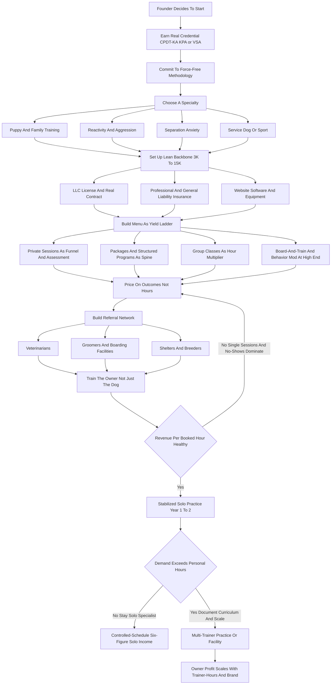

### Direct Answer

To start a dog training business in 2027, you sell **behavior change** -- you take a dog that pulls, barks, bolts, bites, ignores, or panics and you teach the dog and, far more importantly, the owner how to live together without the problem. The model is real, durable, and genuinely accessible on low capital: a serious solo launch needs only **$3,000-$15,000** because the core asset is your skill and your credential, not a building or a fleet. But the entire economics rest on one number most beginners never calculate -- **revenue per booked hour** -- and the three habits that separate a real practice from a tired one: earn a real certification, sell packages and programs instead of single sessions, and train the owner, not just the dog.

**TL;DR:** A focused solo trainer invests **$3K-$15K** in certification, insurance, equipment, and a website, runs at a **70-85% margin** because there is almost no cost of goods, and in a disciplined Year 1 serves **50-200 clients** for **$45K-$110K in revenue** against **$30K-$80K in owner profit**. By Year 2-3 a trainer who has added group classes, board-and-train, and one or two contracted trainers reaches **$150K-$450K in revenue**, and a multi-trainer or facility-based operation can pass **$500K-$900K**. The model is viable in 2027 as a credentialed, package-priced, owner-focused, referral-driven practice built on positive-reinforcement methods and a specialty -- and a poor fit for anyone who wants to "work with dogs" without selling, teaching humans, or running a real business. The three startup killers: skipping real certification (CCPDT, KPA, Victoria Stilwell Academy, IAABC), selling single sessions instead of programs, and training the dog instead of the owner.

## 1. What A Dog Training Business Actually Is In 2027

### 1.1 The Deliverable Is A Changed Household, Not A Trained Dog

A dog training business sells **behavior change**, and the sooner a founder internalizes that the sooner the business works. You are not paid to play with dogs, and you are not paid merely to be good with dogs -- you are paid to take a specific, named problem in a household and make it go away: the dog that drags the owner down the street, the dog that screams for four hours when left alone, the dog that lunges at the mail carrier, the puppy that bites the children, the rescue that cowers under the table, the dog that will not come when called near a road. The deliverable is a changed household, and the dog is only half of it. The other half -- the half beginners ignore and professionals obsess over -- is the human, because the owner lives with the dog the other 167 hours of the week, and a trainer who fixes the dog in a session and sends it home to an untrained owner has built a problem that comes back.

**The four-part identity of the business.** A founder who wants to price, market, and operate correctly must hold all four in mind at once: the dog is the patient, the owner is the student, the credential is the license to charge, and the business is a calendar of booked hours that must each be made to earn. Miss any one and the model breaks -- ignore the owner and results regress, ignore the credential and you compete at the bottom, ignore the calendar math and you stay busy and broke.

### 1.2 What 2027 Specifically Changed

The business is shaped by realities that were softer a decade ago. **Clients research and compare trainers online** and read reviews before they ever call. **The science of dog behavior has consolidated hard** around positive-reinforcement and force-free methods, and the "alpha/dominance" framing is now a credibility liability with educated clients and a disqualifier for veterinary referrals. **Veterinarians, groomers, shelters, and boarding facilities have become organized referral sources** that send business to credentialed trainers and quietly steer clients away from uncredentialed ones. **The demand base is large and structurally durable** because the US dog population is enormous and a meaningful share of those dogs have behavior problems their owners cannot solve alone. The dog training business is not trendy and it is not passive -- it is a teaching-and-behavior-science business wearing a friendly costume.

| Dimension | What it looks like in 2027 | Founder implication |
|---|---|---|
| Method consensus | Force-free / positive reinforcement dominant | Build the brand on it or lose the referral network |
| Client behavior | Researches and review-checks before calling | Credential-forward website is mandatory |
| Referral sources | Vets, groomers, shelters now organized | Business development is a permanent core function |
| Demand base | 85-90M US dogs, large behavior-problem share | Real, durable market for a new entrant |
| Delivery formats | In-home, facility, group, virtual, hybrid normalized | Wider geographic reach, more format choices |

A sibling guide on the home-visit variant of this model is worth reading alongside this one (q9582), and the daycare-and-boarding adjacencies that share the same referral network appear later in this guide.

## 2. The Service Categories: What You Actually Sell

### 2.1 The Full Menu Of Formats

The menu of a dog training business spans several distinct services, and a founder must understand every one before pricing a single thing, because the mix you sell determines your revenue per hour for years.

| Format | What it is | Typical 2027 price | Yield character |
|---|---|---|---|
| Private sessions | One-on-one work on a specific issue | $80-$250 each | Entry product; low yield sold singly |
| Puppy / basic group classes | 6-8 week courses, 6-10 dogs at once | $150-$600 per course | Best revenue per hour in the business |
| Structured programs | Defined 4-6 week package, one priced outcome | $500-$3,500 | Converts private work into a real ticket |
| Board-and-train | Dog lives with trainer 2-4 weeks | $1,500-$15,000 | Highest ticket; fills calendar and cash gap |
| Behavior modification | Aggression, separation anxiety, reactivity | $1,500-$5,000+ | High-skill, high-margin specialty |
| Day training | Trainer works dog while owner is at work | $75-$150 per day | Hybrid for busy households |
| Service / therapy / sport | Task and assistance training, IGP, CGC prep | $200 to tens of thousands | Specialized verticals, own standards |
| Recurring offerings | Group walks, drop-ins, maintenance classes | $20-$60 per session | Smooths revenue, keeps alumni in ecosystem |

### 2.2 The Yield Ladder

A founder should think of the menu as a **yield ladder**: private sessions build trust and feed the funnel, packages and programs convert that trust into a real ticket, group classes multiply the hour, board-and-train and behavior modification carry the high end, and recurring offerings smooth the revenue. The Year 1 mistake is living entirely on the bottom rung -- selling single private sessions -- and wondering why the calendar is full and the bank account is not.

- **Private sessions** -- flexible, high-touch, the foundation of trust, but sold one at a time the lowest-yield format in the business.
- **Group classes** -- one trainer's hour sold to eight households at once; puppy socialization in particular has a time-sensitive, almost medical urgency that drives enrollment.
- **Structured programs** -- a four-to-six-week package sold as one priced outcome rather than a stack of hours; this is how a trainer converts the private format into a real result.
- **Board-and-train** -- the highest-ticket service, commanding thousands, and the format that can fill a calendar and a cash-flow gap; it also carries the most operational weight.
- **Behavior modification** -- the high-skill, high-margin specialty only credentialed, experienced trainers should take, priced for the scarcity of trainers who can do it safely.

## 3. The Three Business Models

### 3.1 Solo Practice

The **solo practice model** is one credentialed trainer who travels to clients' homes and runs group classes in rented or borrowed space -- a park, a pet store, a dog daycare, a community center. Its advantages are near-zero startup capital, the highest margin in the business (70-85%), total schedule control, and the ability to launch fast. Its limits are a hard ceiling set by the trainer's own bookable hours and the income loss whenever the trainer is sick, on vacation, or simply tired. This is where almost everyone starts and where many trainers happily stay.

### 3.2 Multi-Trainer Practice

The **multi-trainer practice model** keeps the asset-light, travel-to-client structure but adds contracted or employed trainers under one brand, one curriculum, and one booking system. The founder shifts from doing all the training to recruiting, training, and quality-controlling other trainers and keeping the calendar full for all of them. The advantage is breaking the personal-hours ceiling; the challenge is that margin compresses (you are now paying trainers), and the founder must become a manager and a curriculum-keeper.

### 3.3 Facility-Based Operation

The **facility-based operation model** adds a physical location -- a training building, often combined with boarding kennels for board-and-train, daycare, or retail. This raises capital requirements sharply ($50K-$300K+) and adds rent, staff, and licensing weight, but enables high-ticket board-and-train at volume, indoor group classes regardless of weather, and a visible brand presence. The advantage is the highest revenue ceiling and the most defensible local position; the challenge is real fixed costs that exist whether the calendar is full or not.

| Model | Startup capital | Typical margin | Revenue ceiling | Founder's role |
|---|---|---|---|---|
| Solo practice | $3K-$15K | 70-85% | Personal bookable hours | Trainer and salesperson |
| Multi-trainer | $5K-$25K | 40-60% | Team trainer-hours | Manager and curriculum-keeper |
| Facility-based | $50K-$300K+ | 30-50% | Highest, most defensible | Operator and brand builder |

Many successful operators run the arc deliberately: launch solo to validate the market and build cash and reputation with almost no risk, layer in contracted trainers once demand outstrips personal capacity, and only then -- if the numbers and the ambition justify it -- take on a facility. The wrong move is signing a facility lease in Year 1 on the strength of enthusiasm. The boarding and daycare adjacencies that often pair with a facility are covered in their own guides (q1974) and (q1975).

## 4. The 2027 Market Reality

### 4.1 Demand Is Large And Durable

A founder needs an accurate read of the 2027 landscape, because the dog training market is neither the easy goldmine that pet-industry hype suggests nor a saturated dead end. **Demand is large and structurally durable.** The US dog population runs in the high tens of millions -- the American Veterinary Medical Association and the American Pet Products Association track a population around 85-90 million dogs -- and survey data consistently shows a substantial share of dogs exhibit behavior issues their owners find difficult: house-training failures, leash pulling, excessive barking, separation distress, reactivity, and fear. The pandemic-era surge in dog acquisition created a large cohort of dogs that were under-socialized during critical windows, and demand for behavior help from that cohort remains elevated into 2027. Spending on pets is resilient even when household budgets tighten, because the dog is family.

### 4.2 The Competitive Field Is Bifurcated

The competition is bifurcated and uneven. At one end sit the large retail and franchise training brands; at the other is a long, uneven tail of independent trainers ranging from highly credentialed behavior specialists to uncredentialed hobbyists calling themselves "dog whisperers."

| Competitor tier | Examples / character | How a new entrant competes |
|---|---|---|
| Big-box retail | PetSmart (PETM-era; now under Petco-adjacent ownership), Petco (WOOF) in-store classes | Beat on depth, credential, specialty, results |
| Franchise brands | Bark Busters, Sit Means Sit, Off Leash K9 | Beat on force-free method and local referral trust |
| Credentialed independents | CPDT-KA / KPA / IAABC specialists | Direct peers; differentiate on specialty |
| Uncredentialed long tail | "Dog whisperers," hobbyists | Beat easily on professionalism and referral access |

Petco Health and Wellness Company trades publicly as **WOOF** and offers in-store training as a loss-leader funnel for grooming and retail; Chewy (**CHWY**) and the broader pet-retail ecosystem shape how owners discover services. There is no large public pure-play dog-training company -- the field is dominated by independents and private franchises -- so a founder competes locally, not against a stock.

### 4.3 What Changed By 2027

The method debate has effectively been settled in professional and veterinary circles in favor of positive-reinforcement and force-free training; certification has shifted from a nice-to-have to a practical requirement for the referral network and the premium price tier; clients book and vet trainers online and lean heavily on reviews; and telehealth-style virtual training and hybrid models became normalized, expanding a trainer's geographic reach. The net market reality: demand is real, large, and durable; the field is genuinely open to a new entrant because the long tail is uneven and beatable on professionalism; but the path to the premium tier runs through real certification and modern methods.

## 5. The Core Unit Economics: Revenue Per Booked Hour

### 5.1 Why This Is The Most Important Number

This is the single most important section in the guide, because the entire business lives or dies on one calculation that beginners almost never run: **how much you actually earn for each hour of your time, fully loaded with the unpaid hours around it.** A dog training business does not sell dogs trained -- it sells the trainer's hours -- and the trainer has a hard, finite number of bookable hours in a week. The mistake is to look at a session price and feel rich: "$110 a session" sounds like a strong wage. But run the real math. A private in-home session priced at $110 also consumes, on a typical day, thirty to fifty minutes of drive time each way, ten minutes of notes and homework write-up, and a share of the no-show rate that haunts every solo practice. The $110 session can easily represent two-plus hours of the trainer's actual day, putting **real revenue per working hour near $40-$55** -- a modest tradesperson's wage, with none of the leverage.

### 5.2 Comparing The Formats Directly

| Format | Headline price | Real working hours | Revenue per worked hour |
|---|---|---|---|
| Single private session (with drive + admin) | $110 | ~2.0 hrs | $40-$55 |
| Six-week structured program | $1,800 | ~9-11 hrs | $160-$200 |
| Six-dog group class (6 x 90 min) | $1,200 | ~9-10 hrs | $110-$130 |
| Eight-dog group class (6 x 90 min) | $1,600 | ~10 hrs | $150-$170 |
| 14-day board-and-train | $2,800 | ~10-14 worked hrs | $200-$400 |
| Aggression behavior-mod program | $2,500-$5,000 | ~12-18 hrs | $200-$350 |

A **six-dog group class** at $200 per dog over six weekly ninety-minute sessions generates $1,200 for nine hours of teaching plus setup -- and an eight-dog class pushes the rate past $150. A **board-and-train** at $2,800 for a fourteen-day stay, where the dog is on the premises and training is folded into the day, can represent $200-$400 of revenue per genuinely-worked hour because the format compounds care and training.

### 5.3 The Discipline This Imposes

**Before setting a calendar, map every format's true revenue per booked hour, net of drive time, admin, and no-shows, and then deliberately weight the week toward the high-yield formats.** The trainer who fills the week with single private sessions is running the lowest-yield version of the business while feeling busy; the trainer who anchors the week on group classes and programs, uses private sessions as a funnel and a premium add-on, and lets board-and-train carry the high end earns several times the income from the same forty hours. Revenue per booked hour is the number that separates a tired trainer from a real business -- the same lesson a groomer learns when counting dogs-per-day capacity (q1137).

## 6. The Line-By-Line P&L

### 6.1 Why The Margin Is The Highest In Small Business

Beyond revenue per hour, a founder must internalize the operating P&L, and the good news is that it is unusually clean: a dog training business has almost no cost of goods sold. There is no inventory to buy, no fleet, no expensive consumables -- a session "costs" treats, a clicker, a leash, and the trainer's time. That is why the margin is the highest in the small-business landscape, commonly **70-85% for a solo practice.**

### 6.2 The Cost Structure That Does Exist

| Cost line | Typical annual range | Character |
|---|---|---|
| Insurance (professional + general liability) | $300-$1,200 | Fixed, non-negotiable |
| Certification CEUs / maintenance | $100-$600 | Recurring, modest |
| Marketing and website | $600-$3,000 | Ongoing |
| Vehicle (fuel, mileage, wear) | $1,500-$5,000 | Variable; must be priced in |
| Equipment (leashes, lines, class gear) | $200-$1,000 | Small recurring spend |
| Software (scheduling, CRM, payments) | $300-$1,200 | Modest monthly cost |
| Trainer compensation (multi-trainer only) | 40-55% of their revenue | Compresses margin |

For the **multi-trainer model**, the largest new cost is trainer compensation, which compresses margin from the 70-85% solo range toward 40-60%. For the **facility model**, rent, utilities, facility staff, and licensing become substantial fixed costs that exist whether or not the calendar is full -- which is exactly why a facility should follow proven demand.

### 6.3 The Dominant P&L Truths

- **Revenue is bookable hours multiplied by revenue per hour** -- so format mix is the primary lever.
- **The margin is naturally excellent because there is no COGS** -- so the failure mode is not thin margins but unfilled hours and low-yield format mix.
- **No-shows and cancellations are a direct, uninsured loss** -- controlled with deposits and cancellation policies.
- **Off-the-clock hours -- marketing, admin, driving, CEUs -- are real** -- and must be either minimized or priced in.

The founders who fail at the P&L level are almost never beaten by costs; they are beaten by a calendar full of low-yield single sessions, an uncontrolled no-show rate, and prices set on a tradesperson's hourly logic.

## 7. The Certification Landscape: Your License To Charge

### 7.1 Why Certification Functions As Licensure

A founder must treat certification not as an optional credential but as the practical license to charge premium rates and access the referral network. There is no single government license to "be a dog trainer" in most of the US, which is precisely why the professional certifications carry so much weight -- they are the market's substitute for licensure.

### 7.2 The Major Credentials

| Body | Credential | What it signals |
|---|---|---|
| CCPDT | CPDT-KA, CBCC-KA | Most widely recognized baseline; proctored exam + hours |
| Karen Pryor Academy | KPA CTP | Hands-on mentored positive-reinforcement education |
| Victoria Stilwell Academy | VSA Certified Dog Trainer | Comprehensive force-free, science-based course |
| IAABC | Certified behavior consultant | Relevant for aggression, fear, complex cases |
| APDT | Membership / professional development | Signals professional engagement (not a cert) |
| Pet Professional Guild | Force-free membership | Method-aligned community |
| Fear Free | Fear Free Certified | Valued by veterinary referral network |
| AKC | CGC evaluator | Dog-and-handler cert trainers prep clients for |

**The Certification Council for Professional Dog Trainers (CCPDT)** offers the CPDT-KA and the higher CBCC-KA for behavior consultants; the CPDT-KA requires documented training hours, a reference, and a proctored exam. **The Karen Pryor Academy (KPA)** offers a structured professional program culminating in the KPA CTP credential -- a hands-on, mentored education in positive-reinforcement training. **The Victoria Stilwell Academy (VSA)** offers a comprehensive force-free dog trainer course. **The IAABC** certifies at the behavior-consultant level for serious behavior cases.

### 7.3 The Strategic Point

A 2027 trainer should hold at least one core credential -- CPDT-KA, KPA CTP, or the VSA credential -- before charging premium rates, should add IAABC or behavior-specific credentials before taking serious behavior cases, and should understand that the credential is what gets the trainer onto a veterinarian's referral list. The uncredentialed trainer is not blocked from working, but is structurally confined to the bottom of the market, competing on price, locked out of the referral network, and exposed on liability and method. Certification is not a vanity line on a website; it is the license to charge.

## 8. Choosing Your Methodology: Why Force-Free Won

### 8.1 The 2027 Consensus

A founder must make a deliberate, informed choice about training methodology, because in 2027 the choice is no longer neutral -- it has direct commercial consequences. The professional and veterinary consensus has consolidated firmly around **positive-reinforcement and force-free / fear-free methods**: training that builds behavior through reinforcement, that manages the environment to prevent rehearsal of unwanted behavior, and that explicitly avoids fear, pain, and intimidation. The certifying bodies are aligned with this approach, the major veterinary behavior organizations endorse it, and the body of behavior science supports it.

### 8.2 The Commercial Consequence

The older **dominance / alpha / "pack leader"** framing, and the aversive tools associated with it -- prong collars, shock and e-collars, "balanced" methods that mix reinforcement with positive punishment -- have become, in the eyes of the credentialed referral network and a large segment of educated clients, a credibility problem.

| Factor | Force-free trainer | Aversive / dominance trainer |
|---|---|---|
| Credential path | Open and supported | Harder; bodies are force-free-aligned |
| Veterinary referrals | Accessible | Largely closed |
| Educated premium client | Trusts and books | Skeptical, screens out |
| Liability / reputational risk | Lower incident risk | Higher; aversive incidents carry weight |
| Brand durability through 2030 | Strengthening | Marginalized |

This is not a moral lecture; it is a market fact a founder must price into the decision. For the general pet-dog training business a founder is launching in 2027, force-free is not only the ethically and scientifically supported choice, it is the commercially correct one. Choose it deliberately, learn it properly, and build the brand on it.

## 9. Picking A Specialty: The Differentiator That Sets Your Price

### 9.1 Why The Generic Trainer Loses

A founder should resist being a generic "dog trainer" and instead choose a specialty, because in a field with a long undifferentiated tail, the specialty is what sets the price and the referral pattern. A specialty makes the trainer findable ("the separation anxiety person," "the reactive-dog trainer"), justifies a premium because expertise cannot be price-shopped the way a generic obedience session can, and creates a specific referral pattern.

### 9.2 The Specialty Menu

| Specialty | Character | Referral source |
|---|---|---|
| Puppy and socialization | High-volume, time-sensitive window | Breeders, vets, shelters |
| Behavior modification (aggression, reactivity, fear) | High-skill, high-margin, IAABC-level | Veterinarians |
| Separation anxiety | Recognized sub-specialty, underserved | Vets, online search |
| Service / assistance dog training | Long-timeline, high-ticket, ADA frameworks | Medical and disability networks |
| Therapy dog preparation | Defined, repeatable program | Therapy-team organizations |
| Protection / IGP / sport | Distinct world, own traditions | Sport clubs, breeders |
| Scent work, agility, dog sports | Engaged-hobbyist client, recurring classes | Sport and breed clubs |

### 9.3 The Strategic Logic

Vets refer aggression and anxiety cases, breeders refer puppy and breed work, shelters refer behavior cases, agility clubs refer sport students. A founder can and often should start with a broad offering to build cash flow, but should be deliberately developing a specialty from early on, because the generic trainer competes with the entire long tail while the specialist competes with almost no one. The same differentiation logic applies across the pet-services adjacencies, from mobile dog massage (q2089) to premium pet sitting (q1972).

## 10. The Startup Cost Breakdown: The Honest All-In Number

### 10.1 The Solo Launch Line Items

A founder needs a clear-eyed total of what it costs to launch, and the headline is genuinely encouraging: a dog training business is one of the lowest-capital legitimate businesses a person can start, because the core asset is skill, not stuff.

| Line item | Lean | Fuller | Notes |
|---|---|---|---|
| Certification | $500 | $6,000 | CCPDT exam path to full KPA/VSA mentored program |
| Insurance (year 1) | $300 | $1,200 | Professional + general liability |
| Business formation / licensing | $100 | $800 | LLC + local business license |
| Website and branding | $500 | $3,000 | Professional, review-friendly site |
| Equipment | $300 | $1,500 | Leashes, long lines, class gear |
| Software setup | $0 | $600 | Scheduling, CRM, payments |
| Initial marketing | $300 | $2,000 | Listings, local ads, launch promo |
| Working-capital cushion | $1,000 | $3,000 | First months before calendar fills |
| **Total** | **~$3,000** | **~$15,000** | Solo travel-to-client launch |

### 10.2 What The Other Models Add

The **multi-trainer model** adds little hard capital but requires working capital to pay trainers before client revenue clears. The **facility model** is a different universe: leasehold, build-out, kennels if board-and-train is offered, facility insurance and licensing, and staff push the launch into the **$50,000-$300,000+** range and should never be attempted before demand is proven. The capital story is the dog training business's great advantage: it lets a credentialed, disciplined founder launch on the cost of a used car, validate the market with real clients, and reach profitability fast -- which is exactly why the binding constraint is never capital. It is skill, certification, and the discipline to sell packages instead of single hours.

## 11. The Year-One Operating Reality

### 11.1 What Year One Actually Is

A founder should walk into Year 1 with accurate expectations, because the gap between "I love dogs" and "I run a dog training business" is where most quitting happens. Year 1 is **credential-building, reputation-building, and funnel-building mode.** The first months are spent finishing or leveraging the certification, setting up the legal and insurance and software backbone, building the website and the review base, and -- most importantly -- doing the unglamorous relationship work of getting in front of the veterinarians, groomers, shelters, boarding facilities, and pet stores that will become the referral engine.

### 11.2 The Year-One Numbers

| Metric | Disciplined Year 1 solo |
|---|---|
| Clients served | 50-200 |
| Revenue | $45,000-$110,000 |
| Owner profit | $30,000-$80,000 |
| Margin | 70-85% |
| Founder's role | Doing everything: train, sell, drive, market |

A disciplined Year 1 solo dog training business can realistically serve **50-200 clients** and generate **$45,000-$110,000 in revenue** against **$30,000-$80,000 in owner profit** -- a strong outcome for a business launched on a few thousand dollars, but earned through long days and a lot of unpaid relationship and admin work. Year 1 is also where the founder discovers the format-mix lesson: the trainer who spends Year 1 selling single private sessions finds the calendar full and the income capped; the trainer who launches group classes early and sells packages from the first month finds the same calendar producing far more. The founders who succeed treat Year 1 as paid tuition in running a real practice.

## 12. The Five-Year Revenue Trajectory

### 12.1 The Year-By-Year Arc

| Year | Stage | Revenue | Owner profit |
|---|---|---|---|
| Year 1 | Solo, credential and funnel building | $45K-$110K | $30K-$80K |
| Year 2 | Referral network producing, classes are spine | $90K-$220K | $60K-$150K |
| Year 3 | Stay solo specialist or add 1-2 trainers | $150K-$450K | $90K-$250K |
| Year 4 | Team growth, possible facility decision | $250K-$650K | $120K-$300K |
| Year 5 | Mature multi-trainer or facility operation | $400K-$900K+ | $150K-$400K |

### 12.2 What The Numbers Assume

These numbers assume a real credential, force-free methods, a deliberate specialty, package-and-program pricing, a built referral network, and disciplined format mix; they do not assume exponential growth, because the business scales with trainer-hours and reputation, not magically. The honest framing: a solo trainer who never builds a team can still reach a very comfortable, high-margin, schedule-controlled six-figure income -- a genuinely good outcome -- and the founder who wants more can break the personal-hours ceiling with trainers and, eventually, a facility, accepting compressed margins and a manager's role in exchange for a higher ceiling.

## 13. Five Named Real-World Operating Scenarios

### 13.1 The Five Scenarios

Concrete scenarios make the model tangible.

- **Scenario one -- Priya, the disciplined solo specialist:** earns a KPA CTP credential and an IAABC behavior path, launches for about $9,000, deliberately specializes in reactive-dog and separation-anxiety work, sells $1,900 six-week programs and $250-per-dog group classes from month one, builds tight referral relationships with three local veterinary practices, and hits $98K revenue in Year 1 at an 80% margin; by Year 3 she is a recognized regional behavior specialist earning a controlled-schedule $180K solo.
- **Scenario two -- Mark, the cautionary tale:** genuinely gifted with dogs but skips certification, markets himself as a "dog whisperer" using dominance-based methods, cannot get on a single veterinary referral list, is screened out by educated clients, competes entirely on price, sells only single $75 sessions, and burns out after eighteen months having never broken $40K.
- **Scenario three -- the Ramirez practice, multi-trainer:** founder launches solo, validates the market in eighteen months, then recruits and trains three contracted trainers on a shared force-free curriculum, focuses her time on puppy-and-family training and on keeping all four calendars full; the practice reaches $380K revenue by Year 3 at a compressed but healthy ~50% margin.
- **Scenario four -- Devon, the board-and-train facility operator:** spends two years solo building reputation and cash, then takes on a facility with boarding kennels, builds the business around $3,200 two-week board-and-train programs supplemented by indoor group classes, and reaches $620K revenue by Year 5.
- **Scenario five -- Lena, the format-mix casualty turned recovery:** launches credentialed and capable but spends Year 1 selling only single private sessions, ends the year exhausted with a full calendar and just $52K; in Year 2 she restructures -- group classes, $1,800 programs, deposits to kill the no-show rate, a board-and-train add-on -- and the same forty hours produce $140K.

### 13.2 The Distribution These Span

| Scenario | Model | Year-3+ revenue | Lesson |
|---|---|---|---|
| Priya | Solo specialist | $180K | Depth and specialty beat volume |
| Mark | Uncredentialed generic | <$40K (failed) | Skipping the credential kills it |
| Ramirez | Multi-trainer | $380K | Documented curriculum breaks the ceiling |
| Devon | Facility | $620K | Facility follows proven demand |
| Lena | Format-mix recovery | $140K | Packages and classes, not single sessions |

These five span the realistic distribution: disciplined solo specialist success, uncredentialed-and-low-yield failure, multi-trainer scale, facility-based high ceiling, and the format-mix lesson learned and corrected.

## 14. Lead Generation: The Referral Network Is The Engine

### 14.1 Why It Is A Network, Not Advertising

A founder must understand that in dog training the lead-generation engine is a referral network, not advertising, and building it is core ongoing work. Paid advertising plays a supporting role, especially at launch, but the durable flow is the referral web.

### 14.2 The Referral Sources Ranked

| Source | Why they refer | How you earn it |
|---|---|---|
| Veterinarians | Asked "who do you recommend?" weekly | Credential, force-free method, results, professionalism |
| Groomers | See every dog, hear behavior complaints | Trust, reliability, reciprocity |
| Boarding / daycare facilities | Encounter hard-to-board dogs | Solve their behavior problems, possibly share space |
| Shelters and rescues | Want adopters to succeed | Support adopters, reduce return cycles |
| Pet stores | Field training questions | Host or accept class referrals |
| Breeders and breed clubs | Refer puppy and breed work | Breed expertise, reliability |
| Past clients and reviews | Trained owners tell other owners | Deliver results, ask systematically |

**Veterinarians are the single most valuable relationship.** A vet sees behavior problems constantly and is asked, "who do you recommend?" by worried owners every week. Becoming a vet's recommended trainer is a durable, repeating source of qualified, motivated clients, earned by being credentialed, using force-free methods the vet endorses, communicating professionally, and getting results -- the same network a veterinary clinic itself sits inside (q9661). **Past clients and their reviews** are the compounding asset. A founder should treat business development as a permanent core function, because a trainer with a thin referral base competes on price against the long tail, while a trainer with a deep one has a steady, defensible flow of pre-sold clients.

## 15. Pricing Strategy: Sell Outcomes, Not Hours

### 15.1 The Structural Rule

Pricing in dog training has two layers -- the format-level price and the structural choice between selling hours and selling outcomes -- and a founder must get the structure right. **The structural rule: sell packages, programs, and classes, not single sessions.** A single $100 session is a low-yield transaction that leaves the owner half-trained, unlikely to get a lasting result, and unlikely to refer; a $1,800 six-week program is one sale that books a known block of calendar, delivers a real outcome, produces a satisfied referring client, and earns far more per hour.

### 15.2 Format-Level Pricing In 2027

| Format | 2027 price range |
|---|---|
| Private sessions | $80-$250 each (better in packages of 4-8) |
| Puppy / basic group classes | $150-$600 per 6-8 week course |
| Structured programs | $500-$3,500 depending on scope |
| Board-and-train | $1,500-$15,000 by length and intensity |
| Behavior modification programs | $1,500-$5,000+ |
| Service dog training | Several thousand into tens of thousands |
| Therapy-dog prep | $200-$1,000 |

### 15.3 The Pricing Disciplines

- **Price on outcome and expertise, not on a tradesperson's hourly logic** -- the client is buying a fixed household, not sixty minutes.
- **Control the no-show with deposits and clear cancellation policies** -- an uncontrolled no-show rate is a direct, uninsured cut to revenue per hour.
- **Use group classes as the yield multiplier** -- the same teaching hour sold to eight households is the best economics in the business.
- **Reserve single sessions for assessment, funnel entry, or a premium one-off** -- not as the spine of revenue.

The founders who price badly set a single-session hourly rate, give away the no-show, and never sell a package; the ones who price well sell outcomes, anchor the calendar on classes and programs, and protect the schedule with deposits.

## 16. Operations And Systems: Running The Practice

### 16.1 The Core Systems

A founder should build the operating systems early, because a dog training business is date-sensitive, relationship-heavy, and easy to run sloppily.

| System | Purpose |
|---|---|
| Scheduling / client management software | Holds client records, calendar, package tracking |
| Intake and assessment | Sets program scope, price, and expectations |
| Homework / owner-transfer system | Makes the training stick; prevents regression |
| Progress documentation | Supports owner, vet relationship, and reviews |
| Group class logistics | Repeatable enrollment, space, equipment, curriculum |
| Board-and-train operations | Housing, daily routines, safety, owner handoff |
| Liability and safety protocols | Screening, aggression handling, incident procedure |
| Payment processing and policies | Deposits, package terms, cancellation rules |

### 16.2 The Operational Heart

**Homework and the owner-transfer system** is the operational heart of getting results: written homework, between-session check-ins, and clear owner instruction are what make the training stick, and a trainer without a transfer system trains dogs that regress. The discipline: adopt the client-management software early, build a real intake-to-program-to-homework workflow, document progress, and standardize the group-class and board-and-train operations so the practice runs consistently whether it is one trainer or several -- and so it is ready to be handed to additional trainers when the founder chooses to scale. A facility offering board-and-train also inherits the staffing math that boarding and daycare operators wrestle with (q1135).

## 17. Staffing And Building A Team

### 17.1 The First Hires

A founder can run a solo practice indefinitely, but breaking the personal-hours ceiling means building a team. **The first hires are trainers**, contracted or employed, and the central challenge is that they must deliver the founder's methodology, curriculum, and quality consistently -- a client who has a great experience with the founder and a mediocre one with a new trainer damages the brand. This makes recruiting (for credential and force-free alignment), onboarding (into a documented curriculum), and ongoing quality control (shadowing, co-sessions, client feedback) the founder's core new job.

### 17.2 The Sequencing Principle

| Hire | When | Effect |
|---|---|---|
| First contracted trainer | Demand reliably outstrips personal hours | Breaks ceiling, compresses margin |
| Administrative coordinator | Inbound and scheduling load consumes founder | Highest-leverage non-trainer hire |
| Additional trainers | Curriculum documented, calendars filling | Scales capacity |
| Facility / kennel staff | Facility model only | Supports housing of client dogs |

**An administrative or client-coordinator role** is often the highest-leverage non-trainer hire, because it frees the founder and the trainers to do billable work. The sequencing principle: the founder should not hire trainers until demand reliably outstrips personal capacity and a documented curriculum exists to onboard them into. Dog training scales with skilled, brand-consistent trainer-hours, so the team's quality and method-alignment directly drive whether scale builds the brand or dilutes it.

## 18. Risk Management, Liability, And Insurance

### 18.1 The Central Risk

The dog training business carries specific risks, and the 2027 operator manages each deliberately. **Injury liability is the central risk** -- a dog can bite a person, injure another dog, or cause property damage during a session, a class, or a board-and-train, and the trainer can be held responsible.

### 18.2 The Risk-Mitigation Map

| Risk | Mitigation |
|---|---|
| Injury liability | Professional + general liability insurance; screening; contracts; force-free methods |
| Custodial liability (board-and-train) | Facility standards, supervision, escape prevention, health monitoring |
| Method / reputational risk | Modern methods, professional communication, deep review base |
| Results-expectation risk | Honest intake, clear program scope, owner-transfer systems, contracts |
| No-show / revenue risk | Deposits and cancellation policies |
| Credential / compliance risk | Match the case to the certification |
| Single-point-of-failure (solo) | Build a team or recurring-revenue base over time |

The throughline: every major risk in dog training has a known mitigation built from insurance, contracts, screening, modern methods, and matching cases to credentials -- and the operators who get hurt are usually the ones who skipped insurance, used a weak or no contract, took cases beyond their skill, or built on methods that carry higher incident risk.

## 19. Marketing And Brand: Being Findable And Credible

### 19.1 The Two Jobs Of Marketing

A founder must build a marketing presence that does two jobs -- being findable and being credible -- because in 2027 the client researches before calling. **The website is the credibility hub** -- it should state the credential clearly, name the methodology (force-free), present the specialty, show real results and reviews, and make booking easy. **Online reviews and listings are the conversion engine** -- a deep base of genuine positive reviews is the single most powerful marketing asset a trainer builds.

### 19.2 The Marketing Asset Stack

| Asset | Job |
|---|---|
| Credential-forward website | Establish credibility, enable booking |
| Online reviews and listings | Convert referral and search traffic |
| Short video / before-and-after content | Demonstrate competence, feed local algorithm |
| Local search presence | Capture active demand |
| Referral network | The durable engine; marketing converts its demand |
| Community visibility | Shelter events, pet-store demos, breed-club presence |

The brand itself should be built deliberately around the credential, the force-free methodology, and the specialty, because those three are what differentiate the trainer from the undifferentiated long tail. The discipline: build a credible, credential-forward, review-rich website; systematically generate reviews; produce content that demonstrates competence; and treat marketing as the system that converts the referral network's demand into booked clients -- not as a substitute for the network.

## 20. Legal Structure, Taxes, And Compliance

### 20.1 The Legal Backbone

A founder should set up the legal and tax structure deliberately, because the liability profile of handling animals makes it matter.

| Element | What to do |
|---|---|
| Entity | Form an LLC for liability protection and tax flexibility |
| Business licensing | Local business license; zoning/permitting for facilities |
| Contracts | Clear service agreement on every client: scope, payment, risk |
| Insurance | Professional + general liability; custodial coverage if applicable |
| Taxes | Separate banking, track income by format, quarterly estimates |
| Employment compliance | Contractor-vs-employee classification when adding trainers |

### 20.2 The Discipline

**Every client should sign a clear service agreement** covering scope, payment and cancellation terms, assumption of risk, the limits of the trainer's role, and -- for board-and-train -- custodial terms. The business's clean margin and low COGS make bookkeeping simple but no less necessary: separate business banking from day one, track income by format, and capture the deductible expenses (certification and CEUs, insurance, vehicle and mileage, equipment, software, marketing). The compliance load is light compared to most businesses, but the liability profile means the legal backbone -- entity, contract, insurance -- is not the place to cut corners.

## 21. Owner Lifestyle: What It Actually Feels Like

### 21.1 The Lived Reality

A founder should know what daily life in this business is like before committing, because the lived reality is rewarding but is not "playing with dogs." In **Year 1**, running a solo practice, the founder is genuinely in every part of the business -- assessing dogs, teaching owners, driving between in-home sessions, running evening and weekend group classes (because that is when working owners are available), writing homework, posting content, asking for reviews, courting referrals, and handling the no-show that blows up a Tuesday afternoon. It is absorbing, physical-adjacent work -- on your feet, outdoors in all weather, managing animals that are sometimes fearful or aggressive -- and the schedule is shaped by client availability, which means evenings and weekends.

### 21.2 How The Role Evolves

By **Year 2-3**, with systems, a referral network, and possibly a coordinator or first trainers, the role shifts toward managing the practice, keeping calendars full, building the team, and doing the higher-skill behavior work personally. By **Year 3-5**, a multi-trainer or facility operator is largely managing while a deliberate solo specialist is running a controlled, high-margin schedule of premium work. The emotional texture: there is deep satisfaction in the work itself -- the reactive dog that can finally walk down the street, the family that almost rehomed their dog and now keeps it -- and real stress in the selling, the no-shows, the occasional dangerous dog, and, in a solo practice, the knowledge that the income stops if the trainer does.

## 22. Common Year-One Mistakes That Kill The Business

### 22.1 The Failure Checklist

A founder can avoid most failure modes simply by knowing them in advance, because the mistakes in this business are remarkably consistent.

| Mistake | Consequence |
|---|---|
| Skipping certification | Locked out of referral network and premium tier |
| Selling single sessions, not packages | Caps revenue per hour, starves referral engine |
| Training the dog, not the owner | Regression, unhappy clients, no referrals |
| Dominance / aversive methods | Closes referral network, repels educated clients |
| Not controlling no-shows | Direct, uninsured cut to income |
| Underpricing | Leaves money on table, signals low quality |
| Neglecting the referral network | Competing on price with no steady flow |
| No specialty | Competing with the entire long tail |
| Skipping insurance / weak contract | One bite or dispute ends the business |
| Signing a facility lease too early | Fixed costs before demand exists |
| Taking cases beyond the credential | Safety and liability exposure |

### 22.2 The Pattern

Every one of these is avoidable; the founders who fail almost always made three or four of them, and the founders who succeed treated this list as a pre-launch checklist. The single most common silent killer is **training the dog instead of the owner** -- it produces results that look good in the session and regress within weeks, and it is the reason referrals never come.

## 23. Counter-Case: When A Dog Training Business Is The Wrong Move

### 23.1 The Honest Case Against

This guide has made the case that a credentialed, package-priced, owner-focused dog training business is a legitimate 2027 path. Intellectual honesty requires the opposite case, because the model genuinely misfits a large share of the people drawn to it.

**It is the wrong move if you will not sell.** The business is a selling business as much as a training business -- you must pitch $1,800 programs, hold prices against price-shoppers, ask for the close, the deposit, the review, and the referral. A trainer who flinches at all of that is a hobbyist with a logo, and will end up where Mark did: single sessions, bottom of the market, burnout.

**It is the wrong move if you want to work with dogs and not people.** At least half the job is human education -- coaching anxious owners, assigning homework, managing the owner who will not do the homework, and absorbing the frustration when results stall because of the human, not the dog. If teaching adults is not appealing, an employed training role at a daycare or a big-box retailer is a better fit than ownership.

**It is the wrong move if the local market is thin.** The model needs dog-owning density and referral-source density -- enough vets, groomers, shelters, and breeders to build a network. A rural area with few vets and a small dog population can starve a practice no matter how good the trainer.

### 23.2 The Structural Limits Even When It Works

| Limitation | Why it bites |
|---|---|
| Income stops if the solo trainer stops | No team, no income on sick days, vacation, injury |
| Solo practice is hard to sell | Value walks out the door with the founder's brand |
| Evening / weekend schedule | Working owners are only available then |
| Physical and weather exposure | On your feet, outdoors, handling difficult dogs |
| Saturated affluent metros | Dense credentialed competition compresses pricing |
| Aggression cases carry real danger | A misjudged case can injure people and end a business |

Even when the model works, the solo version is a **high-income job, not a sellable asset** -- the founder who wants an exit must deliberately build the multi-trainer or facility version. And the affluent-metro founder should be honest that a market thick with KPA and IAABC specialists is harder to enter than the pet-industry hype suggests. The model is real, but it rewards exactly one kind of founder -- the one who treats it as the behavior-science teaching-and-selling business it actually is -- and quietly punishes everyone who wanted the fantasy.

## 24. Scaling Past The Solo Ceiling

### 24.1 The Prerequisites For Scaling

The jump from a proven solo practice to a multi-trainer practice or a facility is its own distinct challenge. The prerequisites: demand must reliably outstrip the founder's personal bookable hours; the methodology and curriculum must be documented well enough that another trainer can deliver it consistently; the intake, program, homework, and class systems must be standardized; and the referral network and review base must be deep enough to keep multiple calendars full.

### 24.2 The Scaling Levers

| Lever | What it does |
|---|---|
| Add contracted / employed trainers | Breaks personal-hours ceiling |
| Add an administrative coordinator | Frees founder from scheduling and intake load |
| Add high-ceiling formats | Board-and-train and more classes at volume |
| Build recurring revenue | Maintenance classes, group walks, alumni offerings |
| Consider a facility | Enables high-ticket formats once demand justifies it |

The founders who scale well share one trait: they turned a personal craft into a documented, teachable system before they hired anyone, so that growth was the repetition of a proven machine rather than a dilution of a personal brand.

## 25. Exit Strategies And The Long-Term Picture

### 25.1 Saleability By Model

Dog training businesses can be exited, and a founder should build with the eventual exit in mind, though the exit profile differs by model.

| Model | Saleability | Why |
|---|---|---|
| Solo practice | Lowest | Value is the founder's personal brand and relationships |
| Multi-trainer practice | Moderate | Value moved into brand, curriculum, team, systems |
| Facility-based operation | Highest | Adds tangible assets: location, kennels, brand, staff |

**The solo practice is the hardest to sell as a going concern** because its value is substantially the founder's personal brand, credential, and relationships. **The multi-trainer practice is more saleable** because the value has been moved from the founder's person into the brand, the curriculum, the trainer team, and the systems. **The facility-based operation is the most saleable** because it adds tangible and contractual assets to the systems-and-brand value.

### 25.2 The Long-Term Picture

The strategic implication: if the goal is an eventual sale, the work of scaling -- documenting the curriculum, building the team, moving value out of the founder's person -- is also the work of building a saleable asset. The honest long-term picture: dog training is a durable, real business -- the dog population is large, behavior problems are not going away, the margin is excellent -- but the solo version is a high-income job more than a sellable asset.

## 26. The 2027-2030 Outlook

### 26.1 Where The Model Is Heading

A founder committing to this path should have a view on where the business goes next, and several trends are reasonably clear.

| Trend | Direction | Effect on a 2027 entrant |
|---|---|---|
| Demand | Stays structurally healthy | Real, durable market |
| Force-free consensus | Deepens | Rewards credentialed force-free trainers |
| Certification weight | Keeps gaining | Effectively required for premium tier |
| Virtual / hybrid training | Stays normalized | Extends geographic reach, adds low-overhead line |
| Specialization | Intensifies | Generic trainer squeezed, specialist rewarded |
| Referral network and reviews | Stays the durable engine | Build it relentlessly |
| Consolidation | Continues modestly | Multi-trainer and facility ops absorb the long tail |

### 26.2 The Net Outlook

The net outlook: dog training is **viable and durable through 2030 in its credentialed, force-free, owner-focused, specialty-driven, package-priced, referral-fed form.** The version that thrives is a professional practice built on a real credential and modern methods, focused on a specialty, selling outcomes rather than hours, and fed by a deep referral network. The version that struggles is the uncredentialed, generic, single-session, advertising-dependent operation competing on price.

## 27. The Final Framework: Building It Right From Day One

### 27.1 The Twelve-Step Execution Order

| Step | Action |
|---|---|
| 1 | Earn a real credential (CPDT-KA, KPA CTP, or VSA) |
| 2 | Commit to force-free methodology as a learned practice |
| 3 | Choose a specialty |
| 4 | Set up the lean legal and insurance backbone |
| 5 | Build the menu as a yield ladder |
| 6 | Price on outcomes, not hours |
| 7 | Build the referral network relentlessly |
| 8 | Build a credible, review-rich, credential-forward website |
| 9 | Train the owner, not just the dog |
| 10 | Run real operating systems |
| 11 | Decide deliberately: stay solo specialist or scale |
| 12 | Build with the exit in mind |

### 27.2 The Closing Logic

Do these twelve things in this order and a dog training business in 2027 is a legitimate path to a high-margin practice -- a controlled-schedule six-figure solo income or a $400K-$900K+ multi-trainer or facility operation. Skip the discipline -- especially on the credential, the package pricing, and training the owner instead of the dog -- and it is a fast way to be a gifted dog person with a full calendar and an empty bank account. The business is neither an easy passion-into-profit story nor a saturated dead end. It is a real, credentialed, owner-focused, package-selling teaching business, and in 2027 it rewards exactly one kind of founder: the one who treats it as the behavior-science teaching practice it actually is.

## 28. The Operating Journey: From Credential To Stabilized Practice

## 29. Related Pulse Entries

A dog training business sits inside a cluster of pet-services models that share the same referral network, the same review-driven discovery, and many of the same operating disciplines. For the home-visit variant of this exact model, see the in-home dog training guide (q9582). For the adjacent boarding and daycare businesses that often pair with a training facility, see the dog boarding guide (q1974) and the doggy daycare guide (q1975). For the pet-care services that share the vet-and-groomer referral web, see the pet sitting guide (q1972), the dog walking guide (q1971), and the mobile dog massage guide (q2089). For the institutional anchor of the referral network itself, see the veterinary clinic guide (q9661).

## 30. Sources

1. American Veterinary Medical Association -- US pet ownership and demographics data.
2. American Pet Products Association -- National Pet Owners Survey and industry spending statistics.
3. Certification Council for Professional Dog Trainers (CCPDT) -- CPDT-KA and CBCC-KA certification standards.
4. Karen Pryor Academy -- KPA Certified Training Partner program documentation.
5. Victoria Stilwell Academy for Dog Training & Behavior -- force-free trainer curriculum overview.
6. International Association of Animal Behavior Consultants (IAABC) -- behavior consultant certification framework.
7. Association of Professional Dog Trainers (APDT) -- professional membership and development resources.
8. Pet Professional Guild -- force-free training principles and membership standards.
9. Fear Free LLC -- Fear Free professional certification program materials.
10. American Kennel Club -- Canine Good Citizen program and evaluator standards.
11. US Small Business Administration -- guidance on LLC formation and small-service-business startup.
12. IRS -- self-employment tax, quarterly estimated tax, and business deduction guidance.
13. American Veterinary Society of Animal Behavior -- position statements on humane training methods.
14. Pet industry market research -- US dog training services market sizing and growth estimates.
15. Bureau of Labor Statistics -- occupational data for animal trainers and animal-care workers.
16. Insurance Information Institute -- small-business professional and general liability overview.
17. Petco Health and Wellness Company (NASDAQ: WOOF) -- investor materials referencing in-store services.
18. Chewy, Inc. (NYSE: CHWY) -- pet-services ecosystem and consumer-spending commentary.
19. Bark Busters -- franchise model and territory structure public materials.
20. Sit Means Sit -- franchise training brand public materials.
21. Off Leash K9 Training -- multi-location independent training brand materials.
22. Veterinary behavior literature -- separation anxiety prevalence and treatment research.
23. Applied animal behavior journals -- positive reinforcement efficacy research.
24. Puppy socialization research -- critical-period developmental window literature.
25. ADA (Americans with Disabilities Act) service animal provisions -- Department of Justice guidance.
26. Pet boarding and daycare industry associations -- facility staffing and liability standards.
27. Consumer review platform data -- impact of online reviews on local-service conversion.
28. Small-business accounting guidance -- bookkeeping practices for service-based sole proprietors and LLCs.
29. State business licensing portals -- local licensing and zoning requirements for animal-service businesses.
30. Dog training program pricing surveys -- 2026-2027 format-level rate benchmarks.
31. Veterinary referral practice studies -- recommended-provider list dynamics.
32. Pulse RevOps internal benchmarking -- unit-economics and revenue-per-hour modeling for service businesses.
