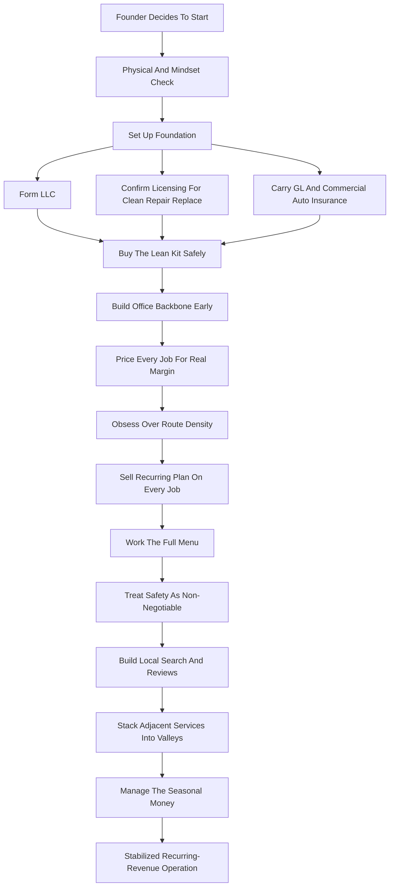

### Direct Answer

To start a gutter cleaning business in 2027, you sell **recurring exterior maintenance** -- clearing leaves, pine needles, shingle grit, and debris out of residential and commercial gutters so water drains away from the roof, fascia, and foundation -- charging **$150-$500 per residential cleaning**, **$300-$2,500 per commercial visit**, and then layering in three higher-ticket services: **gutter guard installation ($8-$30 per linear foot)**, **gutter repair ($150-$900)**, and **full gutter replacement ($1,500-$15,000)**. It is a genuinely accessible, genuinely profitable model -- a lean solo launch costs **$5,000-$25,000** and a disciplined Year 1 generates **$40,000-$150,000** -- but it is seasonal, ladder-dependent, and weather-exposed, and the entire economics rest on one number beginners never calculate: **revenue per truck-day**, the amount one crew can bill in a single working day. Build a dense route, a recurring base, and the full cleaning-to-replacement menu and you have a business; sell only one-time cleanings on scattered routes and you have bought yourself a hard, low-paid seasonal job.

**TL;DR:** Gutter cleaning is the lowest-ticket, highest-margin service at the bottom of a funnel that runs cleaning -> repair -> guards -> replacement. Profit is made by stacking enough clustered jobs into one truck-day, converting one-time customers into a twice-a-year recurring base, and treating every cleaning visit as a guard-and-repair sales opportunity. Lean launch $5K-$25K; Year 1 revenue $40K-$150K; a well-run Year 3 operation reaches $200K-$400K with $70K-$160K owner profit. The three killers: treating it as one-time cleaning instead of recurring maintenance, underpricing while ignoring route density, and cutting corners on ladder safety and insurance. Viable and durable through 2030 in its disciplined, recurring-revenue, route-dense, safety-obsessed form; a poor fit for anyone uncomfortable on a ladder or anyone who thinks "just cleaning gutters" is a business rather than the front door to one.

## 1. What A Gutter Cleaning Business Actually Is In 2027

### 1.1 The Core Service And Why The Demand Is Structural

A gutter cleaning business removes the debris that accumulates in a building's rain gutters and downspouts -- leaves, pine needles, shingle granules, seed pods, roof grit, the occasional tennis ball and bird nest -- so rainwater flows off the roof, through the gutter, down the downspout, and away from the structure instead of overflowing, pooling, rotting the fascia, soaking the soffit, backing up under the shingles, or running into the foundation and the basement. That is the whole job, and it sounds trivial until you understand what it protects: a clogged gutter is one of the most common and most expensive causes of avoidable home damage in the United States. The homeowner who pays $250 twice a year to keep gutters clear is buying cheap insurance against a $5,000 fascia-and-soffit repair, a $15,000 foundation problem, or a flooded basement.

**The business is real because the demand is structural.** There are roughly 145 million housing units in the US, the large majority have gutters, gutters fill with debris every single year, and the homeowners most willing to pay are exactly the ones least willing or able to climb a ladder themselves: older homeowners, owners of two-and-three-story homes, busy professionals, and landlords. The work regenerates on a biological schedule that does not care about the economy -- leaves drop every fall, pollen and seed pods fall through spring and summer, and roofs shed granules continuously.

### 1.2 What Changed By 2027

**Customers find and book exterior services online.** They expect a fast quote, a clear price, and digital scheduling and payment rather than a handshake and a paper invoice. **Gutter guards have moved mainstream.** Mesh, micro-mesh, reverse-curve, and screen systems were a niche upsell a decade ago; a well-advertised set of national players has since spent enormous marketing money making every homeowner aware of them, which means the cleaning visit is now a guard-sales opportunity on nearly every property. **Labor is more expensive and harder to find**, which makes route density and per-day productivity the squeeze point. And the gutter cleaning business is not, and never was, a standalone product -- it is the entry-level, lowest-ticket service in a stack that runs cleaning to repair to guards to replacement.

### 1.3 The Service Menu As A Funnel

The single most important structural insight for a founder is that "gutter cleaning business" badly understates what you actually sell. **Gutter cleaning** is the front door -- the lowest ticket, the highest margin, and the service that gets you on the property where you can see every other problem. **Gutter repair** is the steady mid-ticket work that a cleaning visit constantly surfaces. **Gutter guard installation** is the highest-volume upsell, sold to a customer who already trusts you. **Full gutter replacement** is the highest-ticket service. Picture the menu as a funnel: cleaning generates the volume and the relationships, repair captures the problems cleaning reveals, guards convert the customers tired of paying for cleaning, and replacement catches the systems that are simply done. The Year 1 mistake is selling only the bottom of the funnel and leaving the profitable top of it for someone else.

| Service | What It Is | Typical Ticket | Role In The Funnel |
|---|---|---|---|
| Cleaning | Clear debris, flush, confirm flow | $150-$500 | Front door, volume, relationships |
| Repair | Reseal seams, re-pitch, refasten hangers | $75-$900 | Margin work cleaning surfaces |
| Guard install | Mesh / micro-mesh / reverse-curve | $1,500-$6,000 | High-volume upsell, zero acquisition cost |
| Replacement | New seamless gutters, often 6" K-style | $1,500-$15,000 | High-ticket end of the relationship |

For founders weighing the install-only path, the standalone install trade is covered in (q9616) -- many operators run cleaning as the lead engine and install as the high-ticket arm.

## 2. The Unit Economics: Revenue Per Truck-Day

### 2.1 The Number Beginners Never Calculate

The entire business lives or dies on a number beginners almost never calculate: **revenue per truck-day** -- how much one crew can bill in a single working day. Gutter cleaning has low materials cost and a low rate per individual job, which means profitability is not made on any one job; it is made by stacking enough jobs into one day's route that the truck, the insurance, the fuel, and the labor are all spread across real revenue.

Consider the math concretely. A solo operator cleaning an average single-story home charges $200-$300, and the on-site work takes 45-90 minutes. If that operator books a **tight, clustered route** -- jobs within a few minutes of each other in the same neighborhoods -- they complete **5-8 jobs in a working day** and bill **$1,200-$2,000**. If that same operator books a **scattered route** with 30-45 minute drives between jobs, they complete **3 jobs**, bill **$700-$900**, burn the difference in fuel and unpaid windshield time, and conclude, wrongly, that gutter cleaning does not pay. The job did not change; the route density did.

### 2.2 How The Menu Transforms The Truck-Day

Layer in the menu and the per-day number transforms. The table below shows representative truck-days.

| Truck-Day Mix | Revenue | Notes |
|---|---|---|
| 3 cleanings, scattered route | $700-$900 | The "busy and broke" day |
| 6 cleanings, tight cluster | $1,200-$1,800 | The disciplined baseline |
| 4 cleanings + 1 guard install | $3,500-$5,000 | The upsell-driven day |
| 2 cleanings + half-day repair | $1,200-$1,800 | Strong blended margin |
| 1 full replacement | $1,500-$15,000 | Project day, install crew |

**The discipline this imposes:** price every job to be worth the truck's time, and build the route, the recurring base, and the upsells so the truck-day is always full of profitable work. A founder who thinks in revenue-per-truck-day builds routes, recurring contracts, and an upsell habit; a founder who thinks job-by-job drives all day for three jobs and stays broke while busy.

The deeper point is that **revenue per truck-day is the metric that connects every other discipline in this guide.** Route density raises it by cutting windshield time. The recurring base raises it by pre-locating and pre-selling part of the route. Pricing discipline raises it by making sure no slot in the day is occupied by a money-loser. The menu raises it by replacing a $250 cleaning slot with a $2,500 guard slot. Safety protects it, because an injured operator bills zero. Software executes it, because the route cannot be optimized from memory. A founder who measures one number obsessively -- what did the truck bill today, and why -- and then asks what would have made it higher, is running the analytical loop that separates a real business from a tired one. Operators who never compute it simply work until they are exhausted and assume that exhaustion equals progress; it does not.

### 2.3 The Line-By-Line P&L

Beyond the truck-day, a founder must internalize the operating P&L. Take a representative solo cleaning day: 6 jobs averaging $250, $1,500 in revenue.

| Cost Line | Behavior | Notes |
|---|---|---|
| Fuel and vehicle | Variable, route-driven | Balloons on a scattered route |
| Labor (helper) | Loaded wage + tax + comp | Workers' comp is expensive in a height trade |
| Disposal | Small, real | Bagging, hauling, dump fees |
| Materials | Minimal on cleaning days | Bags, sealant touch-ups; major on install days |
| Insurance | Fixed | GL + commercial auto, carried whether the truck rolls or not |
| Software, marketing, admin | Fixed-ish | CRM, booking site, lead-gen spend |
| Equipment replacement | Capital drip | Ladders, vacuum, blowers wear |

Net it out and a healthy operation runs a **60-75% gross margin on cleaning revenue** and **35-55% on installation revenue**, with the cleaning spread driven almost entirely by route density and pricing discipline. At the business level, seasonality dominates the annual P&L: revenue concentrates in spring and fall with a thinner summer and a thin-to-dead winter, which means the disciplined operator treats the peak seasons as the periods that must fund the whole year.

**Two hidden costs sink more first-year operators than any other.** The first is unpaid windshield time -- the founder priced a job at $250 assuming 75 minutes of work, never accounting for the 40-minute drive each way, and so the job that looked like a $200-per-hour win was actually a $95-per-hour job once the truck-time was honestly counted. The second is the off-season carry: insurance, the vehicle payment, the software subscription, and the founder's own grocery bill do not stop in January, and the operator who spent every dollar of the October peak discovers in February that the fixed costs are still arriving with no revenue behind them. The founders who fail at the P&L level almost always made the same two errors -- they priced jobs without accounting for the windshield time between them, and they spent the busy-season cash instead of reserving for the slow season that was always coming. Both errors are invisible in the moment and only surface as a thin-profit year or an empty bank account, which is precisely why a founder must model them deliberately rather than discover them.

## 3. Startup Costs And The Equipment Kit

### 3.1 What You Actually Buy

Gutter cleaning is genuinely one of the lowest-capital trades to enter, and the temptation is either to under-equip and work unsafely or to over-spend before there is revenue. The core kit, in rough priority order:

- **A vehicle** -- a pickup, cargo van, or trailer-towing vehicle; a startup commonly begins with a vehicle already owned and adds a dedicated work vehicle later.
- **Ladders** -- the heart of the trade and the heart of the safety problem: extension ladders, a multi-position ladder, plus stabilizers and standoffs that hold the ladder off the gutter and level legs for uneven ground.
- **A gutter vacuum system** -- the 2027 productivity tool: powerful wet/dry vacuum systems with telescoping carbon-fiber poles that clear gutters from the ground on many homes, dramatically reducing ladder time and risk. Recognized systems include SkyVac and Spinaclean's Gutter Vac line.
- **Blowers** -- gas or battery backpack and handheld units for clearing dry debris.
- **Hand tools** -- gutter scoops, trowels, brushes, a hose and pressure nozzle, sealant and a caulk gun, hangers and screws.
- **Safety gear** -- a harness and roof-anchor system, gloves, eye protection, a hard hat, non-slip footwear, a first-aid kit.
- **Debris handling** -- tarps, contractor bags, bins.
- **Technology** -- a smartphone, a scheduling-and-invoicing app, a simple website.

For the install side of the menu you eventually add **a gutter machine** -- the on-site coil-forming machine for seamless gutter -- and guard installation tooling, taken on when replacement volume justifies it.

### 3.2 The Honest All-In Startup Number

Under-capitalization, even in a low-capital trade, is a quiet killer. The all-in startup cost breaks down as follows.

| Line Item | Lean Launch | Fuller Launch |
|---|---|---|
| Vehicle | $0 (owned) | $8,000-$30,000 |
| Ladders and stabilizers | $600-$1,500 | $1,500-$2,500 |
| Gutter vacuum system | $300-$800 | $2,000-$6,000 |
| Blowers | $300-$700 | $700-$1,200 |
| Hand tools, sealant, parts | $300-$600 | $600-$1,000 |
| Safety gear | $300-$700 | $700-$1,000 |
| Debris handling | $100-$250 | $250-$400 |
| Insurance (initial) | $1,000-$2,000 | $2,000-$4,000 |
| Business formation, licensing | $200-$700 | $700-$1,500 |
| Website and branding | $500-$1,500 | $1,500-$3,000 |
| Initial marketing | $500-$1,500 | $1,500-$3,000 |
| Working capital reserve | $3,000-$8,000 | $8,000-$15,000 |
| **Total** | **~$7,000-$18,000** | **~$30,000-$70,000** |

A genuinely lean launch using an existing vehicle can come in around **$5,000-$15,000**; a fuller launch with a dedicated work vehicle and a high-end vacuum runs **$20,000-$45,000**. This is, by trade standards, an extremely accessible startup -- which is both the opportunity and the warning: the low barrier means competition is easy to enter, so the founder's edge is never the equipment, it is the routing discipline, the recurring base, the menu, and the safety record. The capital that matters most is the smallest line and the most ignored: the reserve that carries the operator through the first slow stretch.

### 3.3 The Equipment Priority Order

**Buy safety equipment and route-productivity tools first.** Good ladders, stabilizers, harnesses, and a ground-based vacuum are the items that protect the operator and fill the truck-day. **Add the install-side capital later.** The gutter machine and guard tooling come on when the replacement pipeline justifies them -- not before. **Resist kitting out before the calendar has paying jobs in it.** The compounding mistake is spending the reserve on a gleaming truck wrap before there is a single recurring customer to wrap it for.

A useful way to think about the kit is in three tiers. **Tier one is the day-one launch kit** -- the ladders, stabilizers, blowers, hand tools, safety gear, and a smartphone with field-service software, the minimum required to safely and professionally clean a gutter and bill for it. **Tier two is the productivity-and-safety upgrade** -- a contractor-grade ground-based vacuum system that cuts ladder time, a dedicated work vehicle, and a fuller set of ladders so two jobs can be set up in sequence; this tier is funded by Year 1 cash flow once the recurring base proves the demand. **Tier three is the install-capital tier** -- the gutter machine, the coil inventory, the guard product stock, and the contractor licensing -- and it is justified only when the repair-and-replacement pipeline is producing a steady stream of "your gutters are honestly done" conversations. Buying tier three before tier one is paid back is the classic over-capitalization error: a depreciating gutter machine sits idle in a garage while the operator still has no recurring book to feed it.

## 4. Licensing, Insurance, And Legal Setup

### 4.1 Entity And Licensing

Get the legal and insurance foundation right before the first ladder goes up, because this is a height-and-water trade and the downside of getting it wrong is catastrophic. **Most operators form an LLC** for liability protection and tax flexibility; the entity holds the insurance, the contracts, and the bank account, separating business risk from personal assets. **Licensing varies by location and by service.** Many areas require only a general local business license to clean gutters, but the picture changes as you climb the menu -- gutter repair and especially full replacement can fall under home-improvement or general contractor licensing in many states and municipalities. A founder must check the specific rules for their state and county for cleaning, for repair, and for replacement separately, because the requirements often differ across those three.

### 4.2 The Insurance Stack

Insurance is non-negotiable and is the real gate.

| Coverage | What It Protects | Notes |
|---|---|---|
| General liability | Property damage and bodily injury you cause | The classic claim is water damage from a missed clog or a wrong downspout reconnect |
| Commercial auto | The work vehicle | Required for a vehicle in business use |
| Workers' compensation | Employee injury | Required once you hire; expensive in a ladder trade due to fall risk |
| Inland marine / tools | Ladders, vacuum, gear against theft and damage | Often overlooked, genuinely worth carrying |

Customers, especially commercial and property-management accounts, will ask for a certificate of insurance before they let you on the property, so the coverage is also a sales requirement.

### 4.3 Contracts And Safety As A Legal Matter

**Even simple residential work benefits from a clear service agreement** specifying the scope, the price, what is and is not included, and the limits of liability; commercial and recurring work needs a real contract. **Safety is a legal matter, not just an operational one.** Ladder and fall safety is the difference between a sustainable business and a lawsuit or a tragedy, and the operator who treats OSHA-aligned ladder and fall practices as optional is one bad day from the end. The discipline: form the entity, confirm the licensing for every service on your menu, carry real general liability and commercial auto from day one and workers' comp the day you hire, get a tools policy, and use clear agreements.

## 5. Pricing The Work

### 5.1 The Four Pricing Layers

Pricing has several layers, and a founder must get each right because the trade's low barrier creates constant pressure to underprice.

- **Cleaning pricing** is driven by the size and height of the house, the linear footage of gutter, the number of stories, the roof pitch and access difficulty, the debris load, and the surrounding tree cover. Build in the windshield time, not just the on-site time.
- **Guard installation pricing** is per linear foot by product tier -- $8-$30 installed -- and the quote multiplies linear footage by the rate; price by tier honestly and do not race the national companies to the bottom.
- **Repair pricing** is a service-call minimum plus time and materials, or flat prices for common repairs; the key discipline is charging a real minimum so a small repair is worth the trip.
- **Replacement pricing** is per linear foot installed by material and gutter size, plus removal and disposal, plus complexity for height and roofline -- quoted as a proper project, not a guess.

### 5.2 The 2027 Rate Card

A founder benefits from seeing the full menu priced in one place, because the spread across the menu is the whole strategy.

| Service | Typical 2027 Price | Margin Profile |
|---|---|---|
| Residential cleaning, 1-story | $150-$300 | 60-75% |
| Residential cleaning, 2-story | $250-$500 | 60-75% |
| Residential cleaning, 3-story / hard access | $400-$800 | 55-70% |
| Downspout flush / unclog add-on | $25-$100 | high |
| Debris hauling add-on | $25-$75 | high |
| Minor repair (reseal seam, refasten hanger) | $75-$250 | 50-65% |
| Mid repair (re-pitch run, downspout replace) | $200-$900 | 45-60% |
| Gutter guard install (mesh / screen) | $8-$18 / linear ft | 40-55% |
| Gutter guard install (micro-mesh / premium) | $15-$30 / linear ft | 35-50% |
| Seamless aluminum 5" K-style, installed | $8-$15 / linear ft | 35-50% |
| Seamless aluminum 6" K-style, installed | $10-$20 / linear ft | 35-50% |
| Copper gutter, installed | $25-$60 / linear ft | 35-50% |
| Full house replacement (1-2 story) | $1,500-$8,000 | 35-50% |
| Full house replacement (large / 3-story / copper) | $8,000-$15,000+ | 35-50% |
| Commercial cleaning visit | $300-$2,500 | 55-70% |
| Recurring maintenance plan (2x/yr, per visit) | $135-$275 | 60-75% |

The strategic reading: the recurring-plan and real-estate rows are the predictable base that smooths the calendar; the repair rows are the steady margin work cleaning visits surface; and the guard and replacement rows are the high-ticket conversions that make the difference between a $60K solo year and a $250K business.

### 5.3 Cross-Cutting Pricing Discipline

**Charge a real minimum** so no job is a money-loser. **Offer recurring-plan and route-day pricing** that rewards density and locks in repeat revenue. **Price the upsells while you are already on-site**, because the marginal job is far more profitable than a separate trip. **Never let the lowest-priced competitor set your number** -- the customer who only wants the cheapest price is not the customer who builds a business. Operators who price well think in revenue per truck-day and lifetime customer value; the ones who price badly quote to win every job and lose money on the cheap ones.

## 6. Route Density And Recurring Revenue

### 6.1 Route Density: The Real Profit Lever

A founder must treat routing as a core competency, not an afterthought, because in a low-ticket high-volume trade the route is where the profit is made or lost. The principle is **cluster relentlessly.** Every minute spent driving between jobs is unpaid, fuel-burning, and a job not done. **Practical routing discipline:** group bookings geographically rather than chronologically; when a customer in a known cluster calls, slot them into the day already planned for that area; use the scheduling software's map view to sequence the day for minimum drive time; and be willing to ask a scattered prospect to wait a few days for a route day rather than driving across the metro for one job. The same route-density math governs adjacent home-service trades -- the lawn-care version is worked through in (q1149), and the principle transfers directly.

### 6.2 Turning One-Time Cleanings Into A Base

The single most important strategic shift a founder can make is from selling one-time cleanings to building a recurring-maintenance base. The default failure mode is obvious once named: an operator who only sells one-time cleanings starts every season with an empty book, re-earning every customer from scratch, competing on price each time, and never building an asset.

**The recurring maintenance plan** -- a twice-a-year (spring and fall) or, under heavy tree cover, three-or-four-times-a-year cleaning agreement, often with priority scheduling and a modest per-visit discount -- builds something entirely different: a predictable revenue base, a pre-located route, a customer who does not price-shop every visit, and a relationship that surfaces guard, repair, and replacement work over time.

| Metric | One-Time Model | Recurring Model |
|---|---|---|
| Start of season | Empty book | Pre-sold, pre-located route |
| Price competition | Every job | Locked at enrollment |
| Customer acquisition cost | Paid every job | Paid once |
| Upsell pipeline | None | Guards, repair, replacement |
| Business asset built | None | The recurring book |

**The compounding math:** a hundred recurring customers at two visits a year and $200 a visit is $40,000 of pre-sold, pre-located revenue before the operator markets to a single new prospect.

### 6.3 How To Sell The Plan

**Offer it at the end of every one-time job** -- "most of your neighbors are on our spring-and-fall plan; want me to put you on the schedule so you never have to think about it?" **Price it to reward the commitment**, and make enrollment and rescheduling effortless. **Treat every one-time cleaning as a recruiting opportunity** for the recurring base, and measure the size of that base as the real health metric of the business. The recurring book -- not the truck, not the tools -- is the asset being built.

**Why customers say yes is worth understanding precisely**, because the founder who understands the customer's motivation sells the plan more naturally. The recurring plan removes a chore the homeowner would otherwise forget until the gutter overflows during the first hard rain of October -- it converts an anxious, easily-procrastinated task into something handled. It locks in a price, which insulates the customer from the fall-rush price spikes. And it gives them priority scheduling when the wave hits and every operator in the metro is booked three weeks out. **Property-management and real-estate accounts are recurring revenue at the portfolio level** -- one relationship, many properties, scheduled work -- and they are the institutional version of the same asset. The founder who frames the conversation around the customer's relief from a recurring worry, rather than around the operator's revenue, closes the plan far more often, because the plan genuinely is a better deal for the homeowner who would otherwise pay more, later, in a panic.

## 7. Climbing The Menu: Guards, Repair, And Replacement

### 7.1 Gutter Guards: The High-Margin Upsell

Every cleaning visit is also a guard-sales opportunity, and the guard ticket dwarfs the cleaning ticket. **Why the upsell is natural:** you are already on the roof, you have just shown the customer exactly how clogged their gutters were, you have established trust by doing the cleaning well, and the customer is, in that exact moment, thinking "I do not want to pay for this twice a year forever." **The economics:** guards run $8-$30 per installed linear foot, a typical home has 150-250 linear feet, so a guard job is a $1,500-$6,000 ticket at a 35-55% margin -- sold with zero customer-acquisition cost. **The honest positioning matters:** guards reduce cleaning frequency dramatically but they are not truly "no maintenance" -- micro-mesh still needs occasional brushing -- and the operator who positions them honestly builds trust and a future inspection relationship.

### 7.2 Gutter Repair: The Work Cleaning Hands You For Free

Repair work is everywhere once you are looking: on a normal cleaning route you will find leaking seams and end caps, runs that have lost their pitch and hold standing water, hangers and spikes that have pulled out of soft fascia, sagging sections, downspouts that have come apart or crushed, splash blocks that have wandered off, and underground drains that have clogged. Each is a $75-$900 repair, and the customer is grateful you found it because the alternative was water in the basement. The operator who carries sealant, hangers, screws, and downspout parts on the truck can fix the small things on the spot and quote the bigger ones -- turning a $250 cleaning visit into a $450 cleaning-plus-repair visit at a strong blended margin.

### 7.3 Gutter Replacement: The Top Of The Menu

When gutters are old, rusted, undersized, pulling away, or simply beyond repair, the system needs replacing -- and seamless aluminum gutter, formed on-site from a coil with a gutter machine, is the modern standard for most homes, with 6-inch K-style increasingly specified for better capacity. A replacement job is a $1,500-$15,000+ project. **The capital and skill step:** replacement requires real installation skill, a gutter machine or a supplier relationship, and often a contractor-level license, so most operators climb to it deliberately after the cleaning and repair base is solid. The standalone replacement-and-install trade is detailed in (q9616). An operator who only cleans hands every repair and every replacement -- the high-ticket work -- to someone else, when they were the one who found the problem and held the relationship.

## 8. Adjacent Services: Filling The Seasonal Valleys

### 8.1 Why The Valleys Must Be Planned

Gutter cleaning's spring-and-fall concentration leaves a thin summer and a thin-to-dead winter that idle equipment and an idle operator cannot afford. The solution is a stack of adjacent exterior services that use the same truck, the same ladders, the same customer base, and the same skill set.

### 8.2 The Adjacent Service Stack

| Service | Best Season | Why It Pairs | Sibling Entry |
|---|---|---|---|
| Pressure washing | Summer | Same customers, exterior-maintenance mindset | (q2052) |
| Window cleaning | Year-round | Shares ladder skills and route | (q1978) |
| Roof debris removal / soft wash | Spring-summer | Found on the same properties | (q9675) |
| Holiday light installation | Nov-Dec | Same ladders, same customers, fills the dead winter | -- |
| Dryer vent cleaning | Year-round | Same customer base, indoor work for rain days | (q2113) |
| Chimney inspection / sweep | Fall-winter | Pairs with the same homeowner relationship | (q1979) |

### 8.3 The Calendar With No Dead Months

**The strategic logic:** the goal is a calendar with no dead months -- gutters in spring and fall, pressure washing in summer, holiday lights in winter, window and roof work threaded throughout -- so the truck, the equipment, and the operator's income are productive year-round. **The discipline:** do not try to launch all of these at once. Pick the one or two that best fill your specific climate's valleys, sell them to the customer base you already have, and build toward a year-round exterior-services business with gutter cleaning as the recurring anchor.

There is also a customer-relationship logic that is just as important as the calendar logic. **Every adjacent service deepens the relationship from a once-a-year transaction into a full exterior-maintenance account.** The customer who has you on a gutter plan, then has you pressure-wash the driveway in July, then hires you to hang Christmas lights in December, is no longer shopping -- they have a vendor for the outside of their house, and the lifetime value of that relationship is several times the value of an annual gutter cleaning. The seasonal stack is therefore not only a cash-flow tool; it is a moat. A competitor trying to win that customer is no longer underbidding a single $250 cleaning -- they are trying to dislodge an established, trusted, multi-service relationship, which is far harder. The founder who treats adjacent services as a way to deepen and defend the customer base, rather than merely as a way to fill January, builds something a price-cutting side-hustler cannot easily touch.

## 9. Lead Generation And Marketing In 2027

### 9.1 The Local Search Foundation

In 2027 the gutter cleaning customer is found through local search. **A fully built, well-reviewed Google Business Profile is the single highest-leverage marketing asset** -- homeowners search "gutter cleaning near me," and the operator with a complete profile, real photos, and a stack of genuine five-star reviews wins the call. **Reviews are the currency:** every satisfied customer should be asked for a review, because the trade is trust-dependent and the review count and rating are what convert a stranger's search into a booking.

### 9.2 Paid Channels And The Website

**Local Services Ads and search ads** put the operator at the top of the results for high-intent searches; used well they are a reliable job source, used carelessly they buy scattered, low-margin jobs that wreck the route. **A simple professional website** with clear services, pricing guidance, service area, reviews, and an easy quote-request flow converts the demand the search presence generates.

### 9.3 Route Marketing And B2B Relationships

**Neighborhood and route marketing is uniquely powerful in this trade** because of route density: door hangers and yard signs in a neighborhood where you are already working turn one job into a cluster. **Property-management, real-estate-agent, and HOA relationships** are the B2B lead engine -- agents need pre-listing cleanings, property managers need portfolio maintenance, and these relationships deliver clustered, recurring, predictable volume. **Referrals and the recurring base compound** -- a happy recurring customer refers neighbors. The operator who is invisible online competes for whatever scraps door-knocking and luck provide.

**Seasonal marketing timing is its own discipline.** The marketing push should lead the demand wave, not chase it: the fall campaign begins in late summer, before the homeowner's gutters are visibly overflowing, so the operator is booked and routed when the rush hits rather than scrambling for last-minute scattered jobs. The spring campaign aligns with the real-estate listing season and the first warm weekends when homeowners turn their attention to the exterior of the house. The holiday-light campaign, for operators who carry that adjacent service, runs in October so installations can be scheduled across November. The throughline of 2027 marketing is that the gutter cleaning customer is found through a dominant local-search-and-reviews presence, a clean website, neighborhood-level route marketing, and B2B relationships -- and the operator who builds those four channels owns a lead engine, while the one who relies on a lead-marketplace subscription rents one, at a price, with no route control.

## 10. Operations, Hiring, And The Office Backbone

### 10.1 Hiring And Building Crews

The smallest operation runs solo, but the business does not scale past one person's daily capacity without help. **The first hire is usually a helper** -- someone to hold and foot ladders, move debris, and run the blower while the lead operator is up and focused, improving both safety and speed. **The next step is a full second crew** -- a trained two-person team running its own truck and route -- which is the real scaling lever because it doubles revenue-per-truck-day capacity. **Crew quality directly drives the business:** a careless crew breaks windows, scratches siding, and misses clogs that become claims, while a careful crew generates the reviews and referrals the business runs on. **Training is non-negotiable and safety-centered.** **Workers' compensation** is a major cost the moment there are employees, because a ladder trade is a high-rate classification.

### 10.2 The Software Backbone

In 2027 a serious operation runs on software, and a founder should adopt the stack early. **Field-service management software** is the central system -- it holds the customer database, schedules and routes jobs, generates quotes and invoices, takes payment, manages the recurring-maintenance plans, and sends the automated reminders that keep the recurring base intact. Widely used options in the home-service space include Jobber, Housecall Pro, ServiceTitan, and Workiz.

| Software Function | Why It Matters For Gutters |
|---|---|
| Customer database | The recurring book is the asset; it must be a system, not memory |
| Scheduling and routing | Makes route-density discipline executable day to day |
| Recurring-plan management | Auto-reminds and re-bills twice-a-year customers; keeps the base from eroding |
| Quote-to-invoice-to-payment | 2027 customers expect digital quotes and card payment |
| Review-request automation | Triggers a review ask on every completed job |
| Bookkeeping integration | Tracks seasonal cash flow and equipment costs for taxes |

**The recurring-plan management is the feature that matters most** for this business specifically -- the software that automatically reminds, reschedules, and re-bills the twice-a-year customers is what keeps the recurring base from quietly eroding.

### 10.3 Commercial And Property-Management Accounts

**Commercial gutter cleaning** -- office buildings, retail centers, warehouses, apartment complexes, churches, schools -- is higher-ticket per visit ($300-$2,500) and often on a scheduled maintenance cycle; the buyer values reliability and insurance documentation over the lowest price. **Property-management accounts** are the residential-portfolio version: one relationship delivers many clustered, recurring jobs. These accounts are recurring by nature, cluster geographically, are less price-sensitive, and pay on terms like a business -- but they demand a certificate of insurance, a real contract, and dependable execution, which is exactly why the legal-and-insurance foundation matters.

## 11. Safety: The Non-Negotiable Core

### 11.1 Why Safety Is The Business

A founder must treat safety as the absolute non-negotiable core of the business, because gutter cleaning is a height trade and falls from ladders and roofs are a leading cause of serious injury and death in home-service work. The honest framing: every single working day in this business involves a ladder, a roof, or both, and the operator who is casual about that is not running a calculated risk -- they are running an uncalculated one.

### 11.2 Ladder, Roof, And Weather Discipline

| Discipline Area | The Practice |
|---|---|
| Ladder selection | Proper length and type for the job; multi-position for variable access |
| Ladder setup | Right angle, level firm footing, leg levelers on uneven ground |
| Ladder accessories | Stabilizers and standoffs that hold the ladder off the gutter |
| Climbing technique | Three points of contact, never overreach, never stand on top rungs |
| Roof work | Assess pitch and surface; harness and roof-anchor on steep or wet roofs |
| Weather rule | No ladders in high wind, no roofs in rain or ice; reschedule without ego |
| Crew training | Every crew member trained in ladder and fall safety before they work |

### 11.3 The Vacuum As A Safety Tool

**The gutter vacuum changes the safety profile.** Ground-based vacuum systems let an operator clear many gutters without leaving the ground at all, which is one of the strongest arguments for investing in good equipment: it is a productivity tool and a safety tool at once. **The business case for safety is also stark:** an injury ends the operator's ability to work and may end the business; a workers' comp claim spikes an already-expensive premium; an OSHA issue or a lawsuit is existential. Invest in good ladders, stabilizers, harnesses, and ground-based vacuum equipment; train relentlessly; and build a culture where walking away from an unsafe job is respected, not penalized.

It is worth being blunt about the asymmetry here. **A scattered route costs the operator a few hundred dollars of margin; a single bad fall can cost everything.** The downside of a routing mistake is recoverable within a day. The downside of a safety mistake is, at the extreme, permanent -- and even the non-extreme version, a few months off a ladder with a broken wrist, is enough to collapse a solo operation that has no crew to keep the trucks rolling and no disability income behind it. This is why safety is not "a priority" alongside marketing and pricing; it sits in a different category entirely, because it is the only operational failure in the trade that can be irreversible. The culture point matters as much as the equipment point: a crew that feels pressure to skip the stabilizer to make the next job will skip it, so the operator must visibly reward the careful crew member who reschedules a steep wet roof, and never the fast one who took the risk and got lucky.

## 12. The Five-Year Trajectory And Real-World Scenarios

### 12.1 The Year-One Operating Reality

Year 1 is **base-building and route-learning mode, not profit-maximizing mode.** The first year is spent learning the local market -- which neighborhoods cluster well, what the real travel times are, how the spring and fall waves hit -- and building the two assets that matter: the recurring-maintenance base and the local-search-and-reviews presence. A disciplined Year 1 solo operation realistically generates **$40,000-$150,000 in revenue**, heavily concentrated in spring and fall, with the operator doing nearly everything. The first slow season is the test: an operator who built a recurring base and stacked an off-season service carries through it, while one who sold only one-time cleanings faces an empty book.

### 12.2 The Five-Year Revenue Arc

| Year | Stage | Revenue | Owner Profit |
|---|---|---|---|
| Year 1 | Solo, lean kit, base-building | $40K-$150K | Modest; tuition year |
| Year 2 | Helper or second crew, upsells real | $120K-$280K | $50K-$120K |
| Year 3 | Real business with a system | $200K-$400K | $70K-$160K |
| Year 4 | Crew and route expansion, replacement line | $300K-$600K | $100K-$220K |
| Year 5 | Mature multi-crew exterior-services brand | $400K-$800K+ | $130K-$280K |

These numbers assume disciplined routing, real pricing, an aggressively built recurring base, the full service menu, off-season service stacking, and a clean safety record. They do not assume exponential growth, because gutter cleaning scales with crews, routes, and the recurring base, not magically.

### 12.3 Five Named Operating Scenarios

**Scenario one -- Marcus, the disciplined route-builder:** launches solo with $9,000 -- a used truck he already owned, good ladders and stabilizers, a mid-range gutter vacuum, blowers, insurance, and Jobber. He prices for real margin, refuses scattered jobs, and aggressively enrolls every customer in a spring-and-fall recurring plan; by the end of Year 1 he has 140 recurring customers and $95K revenue, and reaches $260K by Year 3 because his routes are dense and his base is pre-sold.

**Scenario two -- the cautionary tale, Dale:** buys $14,000 of equipment and chases every lead-marketplace job across the whole metro, never sells a recurring plan, never asks for a review, and prices low to win. He is exhausted and busy all spring, drives three jobs a day on a scattered route, has an empty book every July and December, and quits after a hard, low-paid Year 2 -- the canonical "busy and broke" failure.

**Scenario three -- Priya, the upsell operator:** treats cleaning purely as the front door, learns guard installation well in Year 1, and offers guards honestly on every cleaning visit; by Year 2 guard installs are 45% of her revenue, and her $230K Year-2 revenue comes from a customer base acquired for the cost of a $250 cleaning each.

**Scenario four -- the Okafor brothers, the year-round build:** start with gutters, add pressure washing in their second summer and holiday lights their first December; by Year 4 they run three crews and a calendar with no valley -- $480K revenue.

**Scenario five -- Trent, the safety casualty:** builds a fast-growing solo operation grossing $130K in Year 1 but treats ladder safety casually -- no stabilizers, works steep wet roofs without fall protection, foots his own ladders alone. A serious fall in Year 2 puts him out of work for months, and the operation collapses not from bad economics but from the one risk the trade punishes hardest.

These five scenarios are not random -- they span the realistic distribution of outcomes. **Marcus is the route-and-base success**, the most replicable path, available to any disciplined operator. **Dale is the busy-and-broke failure**, the single most common way the trade disappoints people, and the one that produces the false folk wisdom that "gutter cleaning does not pay." **Priya is the upsell-driven growth path**, showing how the menu, not the cleaning volume, builds real revenue. **The Okafor brothers are the year-round build**, the answer to seasonality and the path to the highest enterprise value. **Trent is the safety wipeout**, the reminder that the trade has one failure mode that no amount of revenue can offset. A founder should locate themselves honestly on this map before launch -- and then deliberately build toward Marcus, Priya, or the Okafor model, while treating Dale and Trent as the two outcomes to engineer against from day one.

## 13. Counter-Case: When NOT To Start A Gutter Cleaning Business

### 13.1 The Honest Case Against

A gold-standard guide owes the founder the case against. **If heights or physical outdoor labor are a real problem, this is not your trade** -- the ladder and the roof are the core of the job, not an occasional inconvenience, and no amount of ground-based vacuum equipment fully removes the height work. **If steady year-round income is a hard requirement and you will not build the recurring base and the off-season menu**, the pronounced spring-and-fall seasonality will hurt -- the valleys are structural. **If you want a business mindset-free job**, gutter cleaning misfits you: the leaf-clearer who never sells the recurring plan, never works the menu, and never builds the local-search presence buys themselves a hard, low-paid seasonal job rather than a business.

### 13.2 Structural Headwinds To Weigh

| Headwind | Why It Matters |
|---|---|
| Low barrier to entry | Every fall, side-hustlers flood in and compress price |
| National guard advertisers | LeafFilter and the Leaf Home organization out-spend any independent on marketing |
| Pronounced seasonality | Concentrated peaks and dead winters; cash-flow planning is mandatory |
| Labor scarcity | Safety-disciplined crews are hard and expensive to find and keep |
| Weather exposure | Rained-out weeks are revenue lost, not deferred |
| Catastrophic injury risk | One serious fall can end the operator and the business |

### 13.3 Who Should Walk Away

The founder who answers no on physical comfort or safety discipline should not start -- those are not fixable with effort, and the trade punishes them hardest. The founder who answers no on business mindset will end up with a job, not a business, and should either fix that or reconsider. **Better-fit alternatives exist within the same family:** an operator who likes the home-service model but wants less height exposure might look at dryer vent cleaning (q2113) or window cleaning (q2107); one drawn to the install economics specifically should weigh the standalone gutter installation trade (q9616). Gutter cleaning is a legitimate path -- but it is a specific path that fits a specific person, and the honest decision is the one that admits when the answer is no.

## 14. Risk Management Beyond Safety

### 14.1 The Risk Map

Beyond the central risk of falls, the gutter cleaning business carries a specific set of risks that the disciplined operator manages rather than hopes through.

| Risk | Mitigation |
|---|---|
| Property damage liability | Careful work, ladder accessories, photo documentation, GL insurance |
| Water-damage claims | Confirm flow, flush downspouts, document work, disclose pre-existing problems |
| Vehicle risk | Commercial auto coverage, good drivers |
| Weather and cash-flow risk | Flexible scheduling, a reserve, the off-season service stack |
| Customer-payment risk | Clear up-front pricing, payment on completion, software payment tools |
| Reputation risk | Consistent quality, systematic review collection, fast complaint handling |
| Licensing-and-compliance risk | Confirm rules for every service on the menu before offering it |

### 14.2 The Signature Exposure

**Water-damage claims specifically are the trade's signature exposure.** The whole point of the service is preventing water damage, so when water damage happens after a visit, the operator is the obvious target -- which is why confirming flow, flushing downspouts, documenting the work with photos, and being honest about pre-existing problems found are not optional. The throughline: every major risk in gutter cleaning has a known mitigation built from careful execution, documentation, real insurance, the recurring base, and a strong local reputation.

## 15. The Competitive Landscape

### 15.1 Who You Are Up Against

The low barrier to entry makes the field crowded but also makes it beatable.

| Competitor Type | What They Are | The Independent's Edge |
|---|---|---|
| National guard companies | LeafFilter, the Leaf Home organization, Gutter Helmet -- heavily advertised, sales-driven guard installers | Fair price, no high-pressure pitch, a real local relationship |
| Multi-service franchises | Window-and-exterior-cleaning franchises with brand recognition | Local ownership, flexibility, lower overhead |
| Local independents | The long tail: uninsured cash operators up to established multi-crew companies | Professionalism, insurance, full menu, recurring base |
| Seasonal side-hustlers | Fall entrants competing on price | Year-round reliability, real reputation |

### 15.2 The Competitive Moat

The strategic reality for a 2027 entrant: you cannot out-advertise the national guard companies and you should not try to out-cheap the uninsured side-hustler. **You win by being the professional, reliable, fairly priced, fully insured local operator** with a dominant local-search presence, a real recurring base, the full cleaning-to-replacement menu, and a reputation built on reviews and referrals. The competitive moat is not the equipment -- anyone can buy a ladder -- it is the recurring customer base, the route density, the local-search-and-reviews dominance, the professionalism that wins commercial accounts, and the full service menu, all of which take years to build.

There is a useful reframe of the national guard companies that a founder should internalize. **They are not the enemy; they are the unpaid sales force that educated your market.** Their enormous advertising spend has made every homeowner in the country aware that gutter guards exist and that there is an alternative to climbing a ladder twice a year -- awareness the independent operator could never have bought. The independent then walks into a cleaning job where the customer has already been pre-sold on the concept of guards by national television advertising, and simply has to offer a fair price, an honest no-pressure conversation, and the credibility of being the person who actually cleans and repairs gutters rather than a commission salesperson at the door. The national companies' high-pressure, same-day-close sales model and premium pricing create a large, dissatisfied middle of the market -- homeowners who want guards but not the sales experience -- and that middle is exactly the independent operator's opportunity. The moat, in the end, is trust at the local level, and trust is the one thing a national advertising budget cannot manufacture on a specific homeowner's roof.

## 16. Money, Taxes, And The Exit

### 16.1 Financing And Cash-Flow Discipline

Because gutter cleaning is a low-capital trade, financing is less central than in heavier businesses -- but the cash-flow management across the seasons is where the financial discipline actually lives. **The lean launch is small enough ($5K-$15K) that many operators self-fund it from savings.** For a fuller launch, options include a vehicle loan, equipment financing, or an SBA microloan -- but the founder should resist over-borrowing for a business this accessible. **The cash-flow discipline that matters most is seasonal:** the business earns in concentrated peaks and faces lean valleys, so the operator must treat the peak-season cash as funding the whole year -- building a reserve in the busy months that covers the fixed costs and the owner's income through the slow ones, rather than spending the fall windfall as if it were a monthly salary.

### 16.2 Taxes And Structure

| Tax Item | The Discipline |
|---|---|
| Entity | LLC at launch; S-corp election worth discussing as profit rises |
| Vehicle and equipment | Deductible; depreciable with first-year expensing options |
| Mileage | A significant deduction in a drive-heavy trade; track from day one |
| Estimated taxes | Solo operators pay self-employment tax; set aside a percentage of every peak dollar |
| Payroll and workers' comp | Arrive with the first employee; budget as real costs |
| Sales tax | Cleaning, repair, and gutter sales can be taxed differently by jurisdiction |

Separate business banking from day one, run a clean bookkeeping system, and use an accountant who understands seasonal, vehicle-and-equipment-heavy small trades.

### 16.3 Exit Strategies

A gutter cleaning business can be a genuinely saleable asset if it is built right. **Sell the operating business** -- a company with a documented recurring-maintenance base, commercial accounts, trained crews, a clean safety record, organized books, and a strong review profile is saleable, with valuations running as a multiple of stabilized earnings driven heavily by the size and stickiness of the recurring base. **Sell to a consolidator** -- home-services consolidation is active. **Transition to a key employee.** **Roll up smaller operators.** **Wind down gracefully** -- even absent a sale, the equipment has resale value and the customer list itself can be sold. The recurring base is the asset, which is exactly why building it is the central strategic act of the business.

## 17. The 2027-2030 Outlook And Final Framework

### 17.1 Where The Model Is Heading

**Demand stays structurally healthy** -- the housing stock is large and aging, gutters fill every year regardless of the economy. **Gutter guards keep growing as a category** -- the national companies' advertising keeps homeowner awareness high. **The local-search-and-reviews dynamic intensifies**, rewarding operators who build a genuine review presence and further marginalizing the invisible side-hustler. **Software keeps professionalizing the small operator.** **Equipment keeps improving the safety-and-productivity profile.** **Labor stays the constraint.** **The bundled exterior-services model strengthens** -- customers increasingly want one trusted vendor for gutters, pressure washing, windows, and roof care. The net outlook: gutter cleaning is viable and durable through 2030 in its disciplined, recurring-revenue, route-dense, full-menu, safety-obsessed form.

### 17.2 The Twelve-Step Build Order

A founder who wants to start a gutter cleaning business in 2027 and actually succeed should execute in this order. **First, get honest about physical comfort and mindset.** **Second, set up the foundation** -- LLC, licensing, real insurance. **Third, buy the lean kit safely**, prioritizing safety and route-productivity equipment. **Fourth, build the office backbone early.** **Fifth, price every job for real margin.** **Sixth, obsess over route density.** **Seventh, sell the recurring plan on every single job.** **Eighth, work the full menu.** **Ninth, treat safety as the non-negotiable core.** **Tenth, build the local-search-and-reviews presence.** **Eleventh, stack adjacent services into the valleys.** **Twelfth, manage the seasonal money.**

### 17.3 The Final Word

Do these twelve things in this order and a gutter cleaning business in 2027 is a legitimate path to a $200K-$800K recurring-revenue home-services business with $70K-$280K in owner profit. Skip the discipline -- especially on the recurring base, the route density, the pricing, and the safety -- and it is a fast way to be busy, broke, exhausted, and one bad ladder day from the end. The business is neither easy money nor a dead-end job. It is a real, seasonal, physical, route-and-base-driven home-services business, and in 2027 it rewards exactly one kind of founder: the disciplined, recurring-revenue-focused, safety-obsessed operator who treats cleaning as the front door to a full exterior-services business. For founders comparing adjacent home-service launches, the roofing path is mapped in (q1946), the window cleaning path in (q2107), and the pressure washing path in (q2052).

## Sources

1. US Census Bureau -- American Housing Survey, national housing-unit counts and characteristics.
2. US Bureau of Labor Statistics -- Occupational Outlook, building cleaning and grounds maintenance occupations.
3. US Bureau of Labor Statistics -- Census of Fatal Occupational Injuries, falls from elevation in construction and maintenance.
4. Occupational Safety and Health Administration -- Portable Ladder Safety guidance and fall-protection standards.
5. Occupational Safety and Health Administration -- Walking-Working Surfaces and Personal Fall Protection rule.
6. US Small Business Administration -- Guide to forming an LLC and choosing a business structure.
7. US Small Business Administration -- Microloan program and small-business financing options.
8. Internal Revenue Service -- Publication 334, Tax Guide for Small Business.
9. Internal Revenue Service -- Section 179 expensing and bonus depreciation for vehicles and equipment.
10. Internal Revenue Service -- Self-employment tax and estimated quarterly payment guidance.
11. Insurance Information Institute -- General liability and commercial auto coverage for contractors.
12. National Association of Insurance Commissioners -- Workers' compensation classification and rating.
13. Jobber -- Home Service Economic Report and field-service operations benchmarks.
14. Housecall Pro -- Industry data on home-service pricing, scheduling, and recurring plans.
15. ServiceTitan -- Home-services operational and pricing benchmarks.
16. Workiz -- Field-service management benchmarks for small home-service trades.
17. HomeAdvisor / Angi -- Gutter cleaning, repair, and guard installation cost data.
18. Thumbtack -- Local gutter cleaning pricing and demand data.
19. International Window Cleaning Association -- Ladder safety and exterior-cleaning best practices.
20. Spinaclean -- Gutter Vac ground-based gutter cleaning system specifications and use.
21. SkyVac -- High-reach gutter vacuum system documentation and operator guidance.
22. Gutter cleaning industry trade press -- seasonal demand and route-density operating analysis.
23. National Association of Home Builders -- housing stock age and remodeling demand trends.
24. Harvard Joint Center for Housing Studies -- Improving America's Housing remodeling report.
25. US Environmental Protection Agency -- guidance on exterior wash-water and debris disposal.
26. Federal Trade Commission -- guidance on home-improvement contracts and consumer disclosures.
27. SCORE -- mentoring resources and business-plan guidance for service startups.
28. National Federation of Independent Business -- small-business seasonal cash-flow management resources.
29. LeafFilter / Leaf Home -- publicly described gutter-guard product tiers and installation model.
30. Gutter Helmet -- reverse-curve gutter-guard product and installation documentation.
31. Stihl and Echo -- backpack and handheld blower specifications for trade use.
32. State and county licensing boards -- home-improvement and general contractor registration requirements.
33. Pulse RevOps Library -- adjacent home-service startup playbooks and route-density analysis (q9616), (q2052), (q1978), (q2107), (q2113), (q1979), (q9675), (q1946), (q1149).
