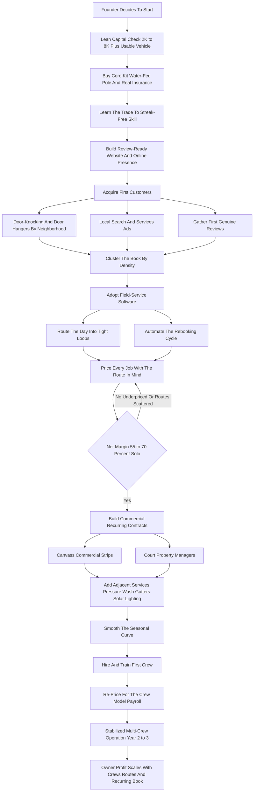

### Direct Answer

To start a window cleaning business in 2027, you build dense routes of recurring residential and commercial glass-cleaning work, price each job as a skilled trade rather than a side hustle, and let route density — revenue produced per hour of paid driving and working — drive the economics. A focused solo operator can launch for **$2,000–$8,000** and run at a **55–70% net margin** once routes are tight, generating **$45K–$110K** in Year 1 revenue solo, while a disciplined multi-crew operation built around a recurring commercial book can reach **$500K–$1.2M** with real resale value. It is one of the lowest-capital real businesses available, but it rewards exactly one founder: the density-obsessed operator who treats it as the recurring-revenue business it actually is.

**TL;DR:** Window cleaning is a route-based recurring-service business wearing the costume of a simple trade. You sell repeated glass-cleaning — houses once or twice a year, storefronts weekly or monthly, offices quarterly — and you make money from the *accumulation* of jobs into geographically clustered routes, not from any single ticket. Launch lean ($2K–$8K: used vehicle, water-fed pole and purification system, ladders, squeegees, soap, insurance, website), learn the squeegee skill to genuinely streak-free, price bottom-up to cover vehicle, insurance, equipment, marketing and the off-season, and cluster the book by neighborhood and commercial strip. Honest economics: solo Year 1 runs $45K–$110K revenue ($80K–$160K with a helper) at 55–70% margin and $30K–$80K owner take-home; Year 2–3 with two to three crews reaches $200K–$500K and $70K–$180K owner profit; a mature operation runs $500K–$1.2M. The three killers are underpricing, scattered low-density routes, and staying purely residential and seasonal. Build the recurring commercial backbone, add adjacent services (pressure washing, gutter cleaning, solar, holiday lighting), modernize the equipment, gather reviews, and the business is a legitimate path from a few thousand dollars to a sellable seven-figure company.

## 1. What A Window Cleaning Business Actually Is In 2027

### 1.1 The Recurring-Route Definition

A window cleaning business sells the repeated, recurring service of making glass clean — residential windows inside and out, commercial storefronts, office-building exteriors, screens, tracks, sills, skylights, mirrors, glass railings, and increasingly solar panels — and it makes money not from any single job but from the accumulation of jobs into routes that repeat on a predictable cycle. **You are not selling a product and you are not a one-time contractor; you are building a book of customers** who need their glass cleaned again in six months, or next month, or next week. The business is the discipline of acquiring those customers, clustering them geographically, scheduling them efficiently, and executing the work fast and well enough that they stay.

The entire business is a single idea executed thousands of times. **A house that pays $250 twice a year is a $500 annual asset; fifty of those houses on tight routes is a $25,000 book that largely rebooks itself.** A storefront that pays $80 a week is a $4,000 annual contract; thirty of those is a route worth chasing. That is the engine. Everything else in this guide — equipment, pricing, routing, hiring, the commercial pivot, the off-season — is the machinery that lets you build and run that book of recurring revenue at the lowest possible cost per dollar earned.

### 1.2 The Asset-Math Of A Recurring Book

The reason the recurring frame matters is that it changes what the founder is building. A one-time cleaner sells their hours; a route-based operator builds an asset. Walk the math one layer deeper. A residential customer cleaned twice a year at $260 produces $520 of annual revenue, and a customer who stays for five years is a $2,600 lifetime relationship that cost one acquisition spend to win. **The customer is not the job — the customer is the annuity, and the acquisition cost is amortized across every cycle they stay.** This is why retention and rebooking discipline are not soft niceties; they are the core financial mechanic. An operator who loses 40% of customers each cycle is running a leaky bucket and must spend on acquisition forever; an operator who keeps 85% is filling a bucket that holds.

| Book metric | Leaky operator | Disciplined operator |
|---|---|---|
| Annual customer retention | ~55% | ~85% |
| Acquisition spend per held customer-year | High (re-buying constantly) | Low (amortized over years) |
| Share of bookings that auto-refill | Under 20% | Over 60% |
| Route density trend over time | Erodes | Compounds |
| Enterprise value of the book | Minimal | A real, sellable asset |

The compounding works because a retained customer on a tight route is also a referral source on that same street, so a held book does not just refill — it densifies. That is the quiet engine behind every successful operator's numbers, and it is invisible to the beginner who is still counting individual jobs.

### 1.3 What Changed By 2027

The business in 2027 is shaped by realities that did not all exist a decade ago. **Customers find and compare window cleaners online and judge them on reviews before a human ever answers the phone.** The water-fed pole — a telescoping pole fed with purified water that lets a cleaner do two and three stories from the ground with no ladder — has moved from novelty to standard, changing both the safety profile and the speed of residential work. Field-service software made it possible for a solo operator to run professional booking, routing, and follow-up. And the recurring-revenue, route-density playbook that the lawn care and pest control industries proved is now well understood and consciously applied by the best window cleaning operators.

| Era marker | Pre-2015 | 2027 baseline |
|---|---|---|
| Customer discovery | Phone book, yard signs, referral only | Online search, reviews decide before contact |
| Multi-story residential | Ladder-dependent, slow, riskier | Water-fed pole from the ground, standard |
| Scheduling and routing | Paper calendar, notepad | Field-service software, automated routing |
| Rebooking | Manual, jobs treated as one-time | Automated reminders, compounding book |
| Adjacent revenue | Window cleaning only | Solar, pressure wash, gutters, holiday lighting |

The window cleaning business is not glamorous and it is not passive. **The squeegee skill is the easy part; the business is acquisition, density, retention, and the steady conversion of one-time jobs into a book that compounds.** Operators who internalize that build companies; operators who do not build tiring, thin-margin driving jobs with a squeegee in the back. The home-service adjacency map — gutter work (q1977), pressure washing (q9585), and solar panel cleaning (q2141) — is wide, and the disciplined window cleaner uses it deliberately.

## 2. The Markets And The Three Operating Models

### 2.1 Residential Versus Commercial

The business splits into two markets with genuinely different economics, sales motions, and rhythms. **Residential window cleaning** serves homeowners — typically interior-and-exterior cleans of a whole house on a once or twice-a-year cycle, with screens, tracks, and sometimes skylights, mirrors, and chandeliers as add-ons. The residential job is higher-priced per visit ($150–$600 for a typical house), the relationship is personal, the work is weather-and-season-sensitive, and the route is built house by house through reviews, referrals, door-knocking, and local marketing. Residential is where most solo operators start.

**Commercial window cleaning** serves businesses — storefronts, restaurants, retail, offices, medical buildings, car dealerships, banks — on recurring contracts measured in weekly, biweekly, monthly, or quarterly frequencies. The commercial job is lower-priced per visit (a storefront might be $40–$200, an office building $300–$5,000) but it is **contractual and recurring**, the routes are dense because businesses cluster, the work is far less seasonal, and the revenue is predictable in a way residential never fully is.

| Dimension | Residential | Commercial | High-rise specialty |
|---|---|---|---|
| Per-visit ticket | $150–$600 house | $40–$200 storefront / $300–$5,000 building | $200–$800+ per hour |
| Frequency | 1–2x per year | Weekly to quarterly | Project / quarterly |
| Revenue predictability | Seasonal, must re-sell | Contracted annuity | Contract-driven |
| Sales motion | Reviews, referrals, door-knock | Canvassing, property-manager relationships | Bid + certification proof |
| Seasonality exposure | High in cold climates | Low | Low–moderate |
| Enterprise value per $ revenue | Lower | Highest | High but niche |

**High-rise commercial** — multi-story buildings cleaned by rope access or powered platforms — is a distinct specialty inside the commercial market, with its own certification requirements (SPRAT, IRATA), equipment, insurance, and pricing. Most operators reach it deliberately and later, if at all.

### 2.2 The Three Models

There are three distinct ways to build this business, and choosing deliberately shapes everything from how you spend the first year to what you eventually sell.

**The solo owner-operator model** is one person — or one person plus a part-time helper — running routes, doing the work, answering the phone, and keeping the book. Its advantage is the lowest possible cost structure, the highest margin per dollar, and total control; its ceiling is the founder's own hours, which caps revenue somewhere in the $80K–$160K range. **The crew-based local model** hires and trains cleaners, runs multiple two-person crews on parallel routes, and moves the founder toward dispatch, sales, and quality control; it breaks the solo ceiling and produces $200K–$1M+ businesses. **The commercial-contract model** focuses deliberately on recurring commercial accounts, building dense routes of monthly and weekly contracts and treating residential as secondary; it delivers the most predictable revenue and the highest enterprise value.

| Model | Revenue ceiling | Net margin | Founder role | Best fit |
|---|---|---|---|---|
| Solo owner-operator | $80K–$160K | 55–70% | Does everything | Wants high margin, simple life |
| Crew-based local | $200K–$1M+ | 35–50% | Sales, dispatch, QC | Wants to break the ceiling |
| Commercial-contract | $300K–$2M+ | 40–55% | Relationship sales | Wants predictable, sellable revenue |

### 2.3 The Strategic Sequence

Many successful operators start solo and residential to generate cash and learn the trade, add crews as the book grows, and deliberately tilt toward commercial over time because that is where stability and sale value live. **The wrong move is staying accidentally solo and residential forever when the goal was a business**, or trying to run crews and chase commercial contracts before the founder has personally mastered the work and the routing. The model adjacency is real here — the same density logic that governs a lawn-care one-truck crew (q1149) governs a window cleaning route, and the operators who win study it across trades.

## 3. The Core Unit Economics: Route Density

### 3.1 Why Density Beats Price

This is the single most important section in the guide, because the entire business lives or dies on a calculation beginners almost never run. The per-job price is what customers see and what new operators obsess over, but **the number that actually determines income is revenue per working hour**, and that number is driven less by price than by route density — how much paid work you can cluster into a tight geographic area so the day is spent cleaning glass, not driving.

Consider the math concretely. A solo cleaner who does a $250 house, then drives twenty-five minutes, then does another $250 house, then drives again, might complete three houses and burn two-plus hours of unpaid driving in an eight-hour day: $750 of revenue on a low-density route. The same cleaner who books five $250 houses within a two-mile radius — because they marketed that neighborhood, or one referral chained into the next — does five houses with five-minute hops between them: $1,250 in the same day, at the same per-house price. **Density is worth more than price.**

| Route scenario | Houses/day | Avg ticket | Drive time | Revenue/day | Revenue/working hour |
|---|---|---|---|---|---|
| Scattered (25-min hops) | 3 | $250 | ~2.5 hrs | $750 | ~$136 |
| Moderate (12-min hops) | 4 | $250 | ~1.3 hrs | $1,000 | ~$149 |
| Dense (5-min hops) | 5 | $250 | ~0.5 hrs | $1,250 | ~$167 |
| Tight cluster + commercial | 6 | $240 | ~0.4 hrs | $1,440 | ~$190 |

### 3.2 The Discipline Density Imposes

This is why the smartest operators market by neighborhood, chase referrals on the same street, cluster their booking by area and day, and use routing software to sequence jobs — and why commercial routes, where businesses naturally cluster on commercial strips, are so prized. The same logic governs the per-job estimate: a residential window cleaner should price by counting windows, panes, and stories, factoring screens, tracks, hard-water removal, and access difficulty, and then check that the price clears a real hourly target after the drive time that job's location implies. **A $150 job forty minutes away is often a worse use of the day than a $120 job five minutes away.**

Before taking a job, the operator should think not just "is this price good" but "what does this do to my route, my revenue per hour, and my density in this area." **High-density routes compound** — one happy customer refers a neighbor, the neighborhood fills in, the drive time per dollar falls, and the margin rises. Scattered routes do the opposite: the truck becomes the product, fuel and time bleed the margin, and the operator works hard for a thin return.

### 3.3 The Drive-Time Tax And The Job-Acceptance Rule

Drive time is the silent tax on a window cleaning business, and it is the one cost beginners never see on a P&L because it does not generate an invoice — it just quietly eats the day. **Every minute the truck is moving is a minute of fuel, vehicle depreciation, and the operator's unpaid labor, with zero revenue against it.** A founder who internalizes this stops thinking about price in isolation and starts thinking about *fully-loaded revenue per job*, which is the invoice minus the cost of the drive that job's location demanded.

The practical tool is a job-acceptance rule. Before booking any job, the operator asks two questions: what does this job pay, and what does it do to the route. A job that sits inside an existing cluster is nearly pure margin because the marginal drive is five minutes; a job thirty-five minutes outside the cluster carries a heavy drive-time tax that can erase a third of its apparent value. The rule is simple to state and hard to follow when the phone is ringing and the schedule is thin: **take the job only if it either clears the hourly target after its drive-time tax, or seeds density in an area the operator is deliberately building.**

| Job offered | Invoice | Marginal drive | Drive-time tax | Effective value | Verdict |
|---|---|---|---|---|---|
| Inside existing cluster | $230 | 5 min | ~$8 | ~$222 | Take it |
| Adjacent neighborhood | $260 | 15 min | ~$28 | ~$232 | Take it |
| Across the metro, isolated | $300 | 40 min | ~$75 | ~$225 | Decline or batch |
| New target neighborhood, first job | $210 | 25 min | ~$45 | ~$165 now | Take it — seeds density |

The fourth row is the subtle one: a below-target job is worth taking if it is the first anchor in a neighborhood the operator intends to saturate, because the second and third jobs on that street will be dense and high-margin. **Density is built deliberately, one anchor job at a time, not discovered by accident.**

### 3.4 The Line-By-Line P&L

Beyond density, a founder must internalize the operating P&L, because window cleaning's famous "high margin" is real only when the costs are respected. Take a representative residential day: five houses at an average of $260, a route subtotal of $1,300.

| P&L line (representative solo day, $1,300 route) | Cost | % of revenue |
|---|---|---|
| Revenue | $1,300 | 100% |
| Vehicle (fuel, maintenance, depreciation) | $55 | 4.2% |
| Equipment wear (rubber, sleeves, resin, soap) | $35 | 2.7% |
| Insurance allocation (GL + commercial auto) | $45 | 3.5% |
| Field-service software allocation | $10 | 0.8% |
| Marketing / customer acquisition allocation | $90 | 6.9% |
| Admin, phone, website, off-season reserve | $65 | 5.0% |
| **Net to owner (solo, no payroll)** | **~$870** | **~67%** |

A disciplined solo operation runs a genuinely high **net margin — often 55–70%** — because the cost structure is light and the labor is the founder's own. A crew-based operation runs lower, often **35–50%**, because payroll is now the biggest line, but on much larger revenue. **Seasonality shapes the annual P&L** in cold climates: residential demand is heavy in spring and fall, lighter in summer, thin in deep winter, while commercial contracts hold steadier year-round — which is exactly why the recurring commercial book and the adjacent off-season services matter so much. The founders who fail at the P&L level quoted residential prices anchored to a casual-side-hustle mental model, or grew into crews without re-pricing for payroll.

## 4. Equipment, Capex, And Pricing

### 4.1 The Equipment And Capex Plan

One of the genuine advantages of this business is how little it costs to equip. The **core residential kit**: a reliable used vehicle or van; squeegees in multiple sizes with quality channels and rubber; washers and scrubber sleeves; professional window cleaning soap; scrapers and razors; microfiber and scrim towels; a stepladder and an extension ladder with stabilizers; a bucket-and-belt setup; and a water-fed pole system with a water-purification unit (deionizing resin or reverse osmosis) that produces the pure water which dries spot-free and lets the operator clean two and three stories from the ground.

| Capex line | Lean solo launch | Fuller launch |
|---|---|---|
| Vehicle (used car/van/truck) | $0–$3,000 | $3,000–$8,000 |
| Core cleaning kit | $200–$400 | $400–$600 |
| Ladders and stabilizers | $300–$500 | $500–$800 |
| Water-fed pole + purification system | $400–$900 | $900–$2,500 |
| Insurance (GL + commercial auto, first payment) | $500–$900 | $900–$2,000 |
| Field-service software (setup + first months) | $0–$100 | $100–$300 |
| Business formation and licensing | $50–$200 | $200–$500 |
| Website and basic marketing | $300–$800 | $800–$2,000 |
| Working-capital cushion | $1,000–$1,500 | $1,500–$3,000 |
| **All-in total** | **~$2,000–$5,000** | **~$7,000–$15,000** |

The sequencing rule: **buy the core residential kit and the insurance first** because that is what lets you legally and competently earn; add the water-fed pole and purification system early because it is the speed-and-safety differentiator; add commercial-specific and high-rise equipment only when the work to justify it is actually booked. The danger is not over-spending — it is hard to over-spend in this business — it is under-equipping on the things that protect you and speed you up while over-thinking the rest.

### 4.2 Pricing Residential Work

Pricing is where new operators most reliably undercut their own business. **Residential pricing is built bottom-up**: count the windows and panes, note the number of stories and the access difficulty, identify the add-ons the customer wants — screens cleaned, tracks and sills detailed, hard-water stain removal, skylights, mirrors, chandeliers, interior glass — and price each component, then sanity-check the total against a target revenue-per-hour after the drive time the job's location implies.

| Residential job type | Typical price range | Notes |
|---|---|---|
| Single-story house, exterior only | $90–$200 | Fast with water-fed pole |
| Single-story house, in & out | $150–$350 | Most common residential job |
| Two-story house, in & out | $250–$600 | Water-fed pole removes ladder time |
| Screen cleaning add-on | $3–$8 per screen | Price as a line, not absorbed |
| Track and sill detail | $2–$6 per window | Slow, skilled — price it |
| Hard-water stain removal | $75–$300+ per job | Skilled, slow — its own line item |
| Skylight / chandelier add-on | $25–$150 each | Access-dependent premium |

### 4.3 Pricing Commercial And Specialty Work

**Commercial pricing is built around frequency and route fit**: a storefront cleaned weekly might be $40–$150 a visit, monthly higher per visit; an office building is priced by scope and access. The per-visit price can be lower than residential because the work is recurring, contracted, and dense — the operator is buying an annuity, not a one-time job.

| Commercial / specialty work | Pricing benchmark |
|---|---|
| Storefront, weekly | $40–$150 per visit |
| Storefront, monthly | $75–$250 per visit |
| Small office building, monthly | $300–$1,200 per visit |
| Mid/large office building | $1,200–$5,000 per visit |
| High-rise rope access | $200–$800+ per skilled hour |
| Post-construction cleanup | Per pane or per sq ft (slow, premium) |
| Solar panel cleaning add-on | $250–$1,500+ residential |

The two pricing disciplines that matter most: **never anchor residential pricing to a casual-side-hustle number** that ignores vehicle, insurance, equipment, marketing, and the off-season — price it as the skilled trade it is; and **always price with the route in mind** — the same dollar figure is a good job five minutes away and a bad job forty minutes away. **Minimums protect the route**: a service-call minimum keeps tiny jobs from costing more in drive time than they earn.

## 5. Building The Route And The Software Stack

### 5.1 Residential Acquisition

The hardest and most important early work is not cleaning glass — it is acquiring customers and clustering them. **Residential acquisition** runs on a handful of proven channels: online reviews and local search, where a clean web presence with strong reviews is the first thing a prospective customer checks; local services and search ads that put the operator in front of people actively searching; door-knocking and door hangers, still one of the highest-density methods because it concentrates marketing on a chosen neighborhood; referrals, the compounding engine because a happy customer's neighbor is the densest possible next job; and neighborhood targeting, deliberately marketing one area until the route fills in.

| Acquisition channel | Cost profile | Density value | Speed to first job |
|---|---|---|---|
| Online reviews / local search | Low ongoing | High (local clustering) | Slow to build, fast once live |
| Local services / search ads | Per-lead cost | Moderate | Fast |
| Door-knocking / door hangers | Time-heavy, low cash | Highest (you pick the street) | Moderate |
| Same-street referrals | Incentive only | Highest possible | Fast once book exists |
| Neighborhood saturation campaign | Mixed | High | Compounds over weeks |

### 5.2 Commercial Acquisition

**Commercial acquisition** is slower and more relationship-driven: walking commercial strips and introducing the service, bidding on storefronts and offices, building relationships with property managers and building owners who control multiple accounts, and earning the recurring contract through reliability rather than a one-time sale. The density discipline runs through all of it — **the goal of marketing is not just customers, it is clustered customers.** A referral on the same street is worth more than a cold lead across town.

### 5.3 The First-Dozen-Reviews Campaign

In 2027 the acquisition funnel begins with reviews, and the first dozen genuine reviews are a deliberate early campaign rather than something that accumulates on its own. A prospective customer comparing window cleaners online filters out the operator with no reviews before a phone ever rings, so a new business with zero reviews is effectively invisible no matter how good the cleaning is. **The founder must treat the first twelve reviews as a launch task with the same priority as buying the equipment.**

The mechanics are straightforward and unglamorous: clean glass to a genuinely streak-free standard, ask every satisfied customer for a review at the moment they are visibly pleased, and make the ask easy with a direct link sent the same day. Early jobs from friends, neighbors, and door-knocked customers all count, and an operator who books even one or two jobs a day can clear a dozen real reviews within a few weeks of focused effort. Once the review base exists, the field-service software can automate the prompt after every job, and the base compounds on its own.

| Funnel stage | Without reviews | With a real review base |
|---|---|---|
| Online visibility | Effectively invisible | Appears credible in search |
| Lead-to-quote conversion | Low — prospects hesitate | Strong — social proof carries |
| Ad efficiency | Poor — clicks do not convert | Good — clicks find proof |
| Referral reinforcement | Weak | Reviews back up word of mouth |

The discipline: do not buy ads before the review base exists, because the ad sends a prospect to a profile that fails the credibility check. **Build the first dozen reviews first, then turn on paid acquisition into a funnel that actually converts.**

### 5.4 Routing, Scheduling, And Software

In 2027 a window cleaning operation runs on software. **Field-service software** — the scheduling, dispatch, invoicing, and customer-management platform — is the central system: it holds the customer book with service history and cycle dates, builds and sequences the daily route to minimize drive time, generates estimates and invoices, takes payment, and automates the **rebooking reminders** that turn a one-time job into recurring revenue.

| Software function | What it does | Why it matters |
|---|---|---|
| Customer book + history | Holds cycle dates, service notes | Foundation of recurring revenue |
| Route sequencing | Orders stops to minimize drive time | Directly raises revenue/hour |
| Automated rebooking | Reminds and re-schedules cycles | The book refills itself |
| Estimating + invoicing | Digital quotes and payment | Professional feel wins jobs |
| Review automation | Prompts customers after each job | Feeds the acquisition funnel |

The discipline: adopt the field-service platform early, let it route the day, let it run the rebooking cycle, and treat the software as the system that lets one person — or a small set of crews — run a dense, recurring, professional operation without dropping customers or wasting the day in the truck.

## 6. The Commercial Backbone And Adjacent Services

### 6.1 Why The Commercial Recurring Book Matters

The single most important strategic move available to a growing window cleaning business is building a book of recurring commercial contracts. A residential book, however good, is seasonal, must be re-sold every cycle to some degree, and is built one homeowner at a time; **a commercial book of weekly and monthly contracts is predictable, dense, less seasonal, and an annuity.** It is revenue you can count on, routes that are naturally clustered on commercial strips, and — when the time comes to sell the business — exactly the asset an acquirer pays a premium for.

### 6.2 How Commercial Contracts Are Won

Commercial contracts are won by canvassing commercial areas in person, bidding storefronts and offices, demonstrating reliability on a first job, and especially by building relationships with property managers, building owners, and facility managers who control multiple buildings and can hand an operator several accounts at once. **Most operators start residential because the jobs are accessible and the tickets are satisfying, then deliberately build commercial as the stabilizing backbone** — using residential cash flow and the off-season time to do the slower commercial sales work. Because commercial demand is steadier through winter, a strong commercial book is the single best smoother of the seasonal revenue curve. The same recurring-contract logic underpins commercial cleaning more broadly (q9610).

### 6.3 Adjacent Services

Window cleaning naturally extends into a set of adjacent services that are both a revenue multiplier and an off-season smoother.

| Adjacent service | Customer overlap | Equipment add | Strategic role |
|---|---|---|---|
| Pressure washing (q9585) | Very high | Modest | Highest-ticket easy cross-sell |
| Gutter cleaning (q1977) | Very high | Same ladders | Fall-season add-on |
| Solar panel cleaning (q2141) | Moderate–high | Pure-water already owned | 2027 growth adjacency |
| Holiday lighting installation (q2119) | High | Lights, same ladders | Winter season smoother |
| Screen repair / chandelier cleaning | High | Minimal | Average-ticket lifter |
| Post-construction cleanup | Builder relationships | Minimal | Premium project work |

**Pressure washing** is the most natural extension — enormous customer overlap, modest equipment, healthy tickets, and an easy cross-sell. **Gutter cleaning** is a strong seasonal add-on heavy in fall, a natural bundle with an exterior window clean. **Solar panel cleaning** is a genuine 2027 growth adjacency that uses pure-water equipment the window cleaner already owns. **Holiday lighting installation and removal** is the classic winter smoother in cold climates, filling the November–January window when residential window demand is thinnest. The strategic logic is threefold: adjacencies raise average revenue per customer, smooth the seasonal curve, and deepen the customer relationship. The discipline is to add them deliberately — master window cleaning and the route first, then layer pressure washing, then gutters, then solar or holiday lighting.

### 6.4 The Seasonality Math And The Winter Problem

The single hardest financial problem in a cold-climate window cleaning business is the winter trough, and a founder should model it explicitly rather than be surprised by it. Residential demand follows a predictable annual curve: heavy in spring as homeowners clear winter grime, lighter through summer, a strong second peak in fall, and then a deep trough from late November through February when cold weather makes exterior work unpleasant and homeowners stop thinking about glass. **The fixed costs — insurance, software, vehicle, phone — do not take the winter off, so a purely residential operator is paying to keep the business alive during the months it earns least.**

| Month band | Residential demand | Commercial demand | Operator's best move |
|---|---|---|---|
| March–May | Peak | Steady | Run hard, fill the book |
| June–August | Moderate | Steady | Build commercial, train crews |
| September–November | Second peak | Steady | Run hard, sell holiday lighting |
| December–February | Trough | Steady | Lean on commercial + holiday lighting |

The two structural smoothers are visible in the table. **Commercial contracts hold steadier through winter** because a storefront still needs to look presentable in January, so a strong commercial book flattens the curve directly. **Holiday lighting installation** fills the worst window precisely — November through January — using the same ladders, vehicles, and customers. An operator who builds both walks into winter with a floor under revenue; an operator who built neither spends the autumn cash and faces a brutal stretch. The seasonality problem is not a reason to avoid the business — it is a reason to build the commercial backbone and the off-season service from the start.

## 7. The Operating Journey: From Lean Launch To Stabilized Operation

The journey above is the operating spine of the business: lean launch, skill, online presence, dense acquisition, software, route-aware pricing, the commercial backbone, adjacent services, crews, and a stabilized multi-crew operation. Each transition is a decision point, and the margin check after pricing is the gate — if the net margin is not landing at 55–70% solo, the cause is almost always underpricing or scattered routes, and the loop sends the founder back to fix it before scaling.

## 8. The 2027 Market Reality

### 8.1 Demand Is Durable And Large

A founder needs an accurate read of the 2027 landscape, because window cleaning is neither the effortless cash machine some online voices claim nor a saturated dead end. **Demand is structurally durable and large.** There are roughly 145 million housing units in the United States and millions of commercial buildings, essentially all of them have glass, and that glass gets dirty on a schedule that does not change — rain spots, pollen, hard-water deposits, dust, salt. The need recurs forever, it is non-discretionary for commercial businesses that must look presentable, and it is a modest, repeatable purchase for homeowners.

### 8.2 The Competition Is Bifurcated And Beatable

At one end sit national franchises — Window Genie (part of Neighborly Brands, well over 100 units), Fish Window Cleaning (a few hundred locations), and others like Squeegee Squad and Men In Kilts — with brand recognition, systems, and marketing budgets. At the other end is a vast long tail of solo operators and side hustlers, many of them excellent cleaners but weak businesspeople: scattered routes, no online presence, no recurring-revenue discipline, no follow-up. **The opportunity for a disciplined 2027 entrant is to be more professional than the long tail** — real reviews, real booking, real routing, real follow-up — without needing the overhead of the franchise. Where window cleaning has no public pure-play to anchor against, the franchise comparables sit inside larger home-service platforms: Neighborly's brand portfolio is the dominant franchised home-services rollup, and consolidators backed by private equity continue to absorb the share that under-professional solo operators vacate.

| Competitor tier | Strengths | Weaknesses | How to beat them |
|---|---|---|---|
| National franchises | Brand, systems, marketing | High overhead, royalty drag | Lower price + equal professionalism |
| Established local crews | Reputation, density | Often complacent, slow to modernize | Better reviews, faster booking |
| Solo side hustlers | Cheap, flexible | No system, scattered, no follow-up | Routing + recurring discipline |
| Regional consolidators | Capital, route buying | Less local feel | Personal service, local reviews |

### 8.3 What Changed

By 2027 customers discover and vet cleaners almost entirely online; the water-fed pole system has become standard for residential; field-service software made professional scheduling, routing, invoicing, and automated rebooking cheap and accessible; solar panel cleaning emerged as a genuine adjacent revenue stream; and the recurring-revenue, route-density operating model is now consciously applied by the best operators. **The winning 2027 entrant competes not on being the best squeegee but on being the most disciplined route-and-recurring-revenue operator** in a field full of skilled cleaners who never built a business around the skill.

## 9. Hiring, Crews, And Scaling Past The Solo Ceiling

### 9.1 The Hiring Sequence

A founder can run the smallest window cleaning operation solo for years, but the business does not break the income ceiling without crews, and the hiring is the genuine hard part. **The cleaner is the core hire** — the person who runs a route, does the work to the standard, represents the business at the customer's home or storefront, and handles the truck and equipment. Many operators start by formalizing a part-time helper into a steady employee, then build two-person crews — one experienced, one learning — so that quality and training travel together.

| Hire | When it arrives | What it unlocks |
|---|---|---|
| Part-time helper | Late Year 1 | First step off the solo ceiling |
| First two-person crew | Year 2 | Parallel route, founder shifts toward sales |
| Office / dispatch person | Year 2–3 | Frees founder from phones and scheduling |
| Crew leads | Year 3+ | Multiple crews stay on standard |
| Dedicated commercial sales | Year 3+ (often founder) | Drives the recurring backbone |

### 9.2 Crew Quality And The Margin Shift

**Crew quality directly drives margin and reputation** — careful, fast, streak-free crews keep customers and generate referrals; sloppy crews cause callbacks, lose customers, and damage the online reviews the whole business now runs on. Training, checklists, a clear quality standard, and the water-fed pole (which makes a newer cleaner productive and safe faster) turn a hire into a contributor. The cost structure shift is the key thing a founder must internalize: **the moment crews exist, labor becomes the largest expense and the margin drops** from the solo 55–70% toward 35–50% — which is fine, because it is on much larger revenue, but only if the business was re-priced and re-routed for the crew model.

### 9.3 The Pay Model And Retention

How crews are paid shapes whether they stay, and turnover is expensive in a business where reputation rides on quality. The two common structures are straight hourly and hourly-plus-performance, and each has a known failure mode. **Straight hourly is simple and predictable but does not reward speed**, so a slow cleaner costs the same as a fast one and the operator carries the gap. Hourly-plus-performance — a base wage plus a bonus tied to revenue completed or jobs done to standard — rewards speed, but a poorly designed version rewards speed *over* quality, producing callbacks that the whole review-driven business cannot afford. The well-designed version pays for completed-to-standard work, with quality verified, so speed and care are rewarded together.

| Pay model | Strength | Failure mode | Best applied |
|---|---|---|---|
| Straight hourly | Simple, predictable, low-stress | No speed incentive | New trainees, early ramp |
| Hourly + revenue bonus | Rewards productivity | Can sacrifice quality | Proven cleaners on dense routes |
| Hourly + quality-gated bonus | Rewards speed and care together | More admin to verify | Mature multi-crew operation |

Retention is also non-monetary: reliable scheduling, decent equipment, the water-fed pole that makes the work physically easier, and being treated well all reduce turnover. **A retained, trained cleaner is worth far more than the wage difference of replacing them**, because the replacement costs weeks of training, a dip in quality, and the callback risk that comes with an unfamiliar hand on a customer's glass.

### 9.4 Scaling Past The Solo Ceiling

The jump from a proven solo operation to a multi-crew business is its own distinct challenge. The prerequisites: the solo book must be genuinely dense and the routing genuinely disciplined (do not scale a scattered book), the work and quality standard must be documented well enough that a hired cleaner can be trained to it, the pricing must be re-set for the crew model's payroll, and there must be enough recurring revenue — especially commercial — to keep crews fed with dense routes. **The founders who scale well treated the solo years as a system-building exercise, so growth was the repetition of a proven, dense, well-priced machine rather than a series of expensive experiments.** The constraint that binds first is almost always hiring — finding and keeping good cleaners — followed by founder attention, route density, and margin compression, and each is solved by a deliberate system rather than hope.

## 10. Risk, Insurance, Taxes, And Structure

### 10.1 Insurance And Risk Management

Window cleaning is low-capital but not low-risk, and the 2027 operator manages the real exposures deliberately. **General liability insurance** is non-negotiable — the operator works on customers' property, around their glass and belongings, and a broken window or property damage is a routine possibility; a $1M general liability policy is the baseline, and many commercial accounts require proof before they hire you. **Commercial auto insurance** covers the work vehicle, which personal auto policies typically will not. **Workers' compensation** becomes necessary the moment there are employees.

| Risk | Exposure | Mitigation |
|---|---|---|
| Property damage | Broken glass, damaged screens, harmed landscaping | GL policy, training, careful technique |
| Height / fall | Ladders, roofs, elevated work | Water-fed pole, training, SPRAT/IRATA for high-rise |
| Vehicle | Accidents on constant routes | Commercial auto insurance |
| Employee injury | Physical, at-height work | Workers' compensation |
| Contract / payment | Disputes, non-payment | Written agreements, professional invoicing |
| Seasonality | Cold-climate winter trough | Commercial book + off-season services |

**Height and fall risk** is the central physical risk of the trade — which is one more reason the water-fed pole (working from the ground) is a safety advance and not just a speed one, and why high-rise work demands formal rope-access certification rather than improvisation.

### 10.2 Licensing, Taxes, And Structure

**Licensing** is generally light — most jurisdictions require a basic local business license and entity registration rather than a specialized trade license, though requirements vary and the founder must check locally. Most operators form an **LLC** for liability protection and tax flexibility, sometimes electing S-corp treatment as profit grows to optimize self-employment tax.

| Item | Solo operator | With employees |
|---|---|---|
| Entity | LLC, simple | LLC, possible S-corp election |
| Income tax | Self-employment + quarterly estimates | Add payroll taxes |
| Sales tax on services | Varies by state — check | Same |
| Vehicle / equipment | Depreciable, major deduction | Same |
| Bookkeeping | Simple system, separate banking | Bookkeeper / accountant |

**Self-employment and estimated taxes** apply to the solo operator — quarterly estimated payments are required. **Payroll taxes** arrive with the first employee. **Sales tax on services** applies in some states and not others. The discipline: separate business banking from day one, a simple bookkeeping system, quarterly attention to estimated and sales taxes, and an accountant once there is payroll. The vehicle deduction alone is meaningful in a route-based business that drives constantly.

## 11. The Five-Year Trajectory And Owner Lifestyle

### 11.1 The Year-One Operating Reality

A founder should walk into Year 1 with accurate expectations. **Year 1 is route-building and skill-building mode, not coasting mode.** The first months are spent learning to clean glass fast and streak-free, getting the first genuine reviews, knocking doors and running ads to acquire the first customers, discovering the true cost of driving a scattered early route, and beginning the slow work of clustering the book. A disciplined Year 1 solo startup can realistically generate **$45,000–$110,000 in revenue** as a true solo operator, or **$80,000–$160,000** with a helper, against **$30,000–$80,000 in owner take-home**.

### 11.2 The Five-Year Revenue Arc

| Year | Structure | Revenue | Owner profit | Founder role |
|---|---|---|---|---|
| 1 | Solo or solo + helper | $45K–$160K | $30K–$80K | Does everything |
| 2 | First crew, first commercial accounts | $120K–$300K | $50K–$120K | Cleaning + selling + dispatch |
| 3 | 2–3 crews, deliberate commercial book | $200K–$500K | $70K–$180K | Sales, dispatch, QC |
| 4 | Crew + route expansion, adjacencies | $350K–$800K | $110K–$280K | Management |
| 5 | Mature multi-crew / commercial-focused | $500K–$1.2M | $150K–$350K | Managerial, exit-ready |

These numbers assume disciplined density-based routing, honest pricing, a deliberately built recurring commercial book, and adjacent-service smoothing. **They do not assume magic, because window cleaning scales with crews, routes, and the recurring book, not exponentially.**

### 11.3 Owner Lifestyle

In Year 1, running solo, the founder is fully in the business: on the ladder and the pole, in the truck, on the phone, knocking doors in the evening, doing the invoicing at night. By Year 2–3, with a crew or two and a dispatch person, the founder's role shifts toward sales, dispatch, quality control, and growth. By Year 3–5, with multiple crews and a real recurring book, the founder can run the business in a genuinely managerial rhythm — though window cleaning, like any route-based service business, never becomes fully hands-off. **There is real, immediate satisfaction in the work** — glass goes from filthy to perfect in minutes, customers are visibly pleased, a tight route runs like clockwork — and real grind in the physicality, the door-knocking, the weather, and the cold-climate winter.

## 12. Named Operating Scenarios

Concrete scenarios make the model tangible.

| Scenario | Approach | Outcome |
|---|---|---|
| Marcus — disciplined solo | $3,500 launch, used van, quality water-fed pole, door-knocks 3 neighborhoods, clusters book | $95K solo Year 1 at 65% margin, reinvests in helper + storefronts |
| Devin — cautionary tale | Excellent cleaner, prices like a side hustle, takes every job anywhere, no recurring system | Exhausted, half the day driving, dead winter, thin living |
| Priya — commercial builder | Starts residential for cash, spends off-season courting property managers | Year 3 dense book of weekly/monthly contracts, steady winter, sellable annuity |
| Okafor brothers — crew scale | Start solo, train 4 two-person crews, add pressure washing and gutters | $650K by Year 4, founders run sales and dispatch |
| Janelle — seasonality casualty | Solid $90K residential Year 1, no commercial, no off-season service, spends summer cash | Cold-climate winter wipes her out, forced into an off-season job, book lapses |

**Marcus** is the disciplined solo operator: density-obsessed, review-driven, reinvesting deliberately. **Devin** is the cautionary tale — a genuinely excellent cleaner who built a scattered driving job instead of a route-based business. **Priya** is the commercial-contract builder whose business is worth real money because the contracts are an annuity. **The Okafor brothers** show crew-based local scale done right. **Janelle** is the canonical illustration of ignoring the recurring-commercial and adjacent-service smoothers. These five span the realistic distribution: disciplined solo success, scattered-route failure, commercial-backbone stability, crew-based scale, and seasonality wipeout.

## 13. Counter-Case: When A Window Cleaning Business Is The Wrong Move

### 13.1 The Honest Failure Modes

Not everyone should start this business, and an honest guide says so plainly. **The capital barrier is so low that the field is crowded with skilled cleaners**, which means the edge is entirely operational — pricing, density, recurring revenue, professionalism — and a founder who cannot or will not build those disciplines is entering a commodity fight they will lose. The most common failure modes are remarkably consistent.

| Mistake | What it produces | The fix |
|---|---|---|
| Underpricing (side-hustle anchor) | Busy schedule, thin bank account | Bottom-up pricing covering all costs |
| Scattered low-density routes | Half the day driving, bled margin | Cluster by neighborhood and strip |
| Purely residential and seasonal | Brutal cold-climate winter | Commercial book + off-season services |
| No recurring system | Book rebuilt from scratch constantly | Automated rebooking cycle |
| No online presence or reviews | Starved acquisition funnel | Systematic review-gathering |
| No real insurance | One broken window ends the business | $1M GL + commercial auto |
| Growing crews without re-pricing | Margin compressed to nothing | Re-price for payroll |
| Chasing high-rise without certification | Catastrophic-risk exposure | SPRAT/IRATA + specialized insurance |

### 13.2 Who Should Not Start

A founder who wants indoor or light-touch work should not start — this is physical, weather-exposed, at-height work. A founder who will not do the unglamorous acquisition grind — door-knocking, review-gathering, property-manager relationships — should not start, because **the squeegee skill is the easy part and the business is acquisition and density.** A founder who wants passive income should not start; window cleaning, like any route-based service business, demands ongoing acquisition, routing discipline, crew management, and seasonality smoothing every year. And a founder in a market already saturated with disciplined, well-reviewed operators should weigh an adjacent home-service entry — pressure washing (q2052), gutter cleaning, or holiday lighting — where the competitive long tail is thinner, before committing to glass alone.

### 13.3 The Realistic Downside

The realistic downside is not catastrophic loss — the capital at risk is small — it is **opportunity cost and a thin living**. The founder who underprices and scatters their routes does not go bankrupt; they work hard for a $25K–$35K income they could have exceeded as an employee, and they do it while exposed to weather and physical wear. That is the honest counter-case: the business rarely fails dramatically, but it frequently fails quietly, producing a tiring job rather than the company the founder imagined. The difference between the two outcomes is entirely the discipline this guide describes.

## 14. The Final Framework: Building It Right From Day One

### 14.1 The Twelve-Step Execution Order

Pulling the entire playbook into a single operating framework, a founder who wants to succeed should execute in this order: **(1)** get honest about temperament — confirm willingness to do physical, at-height work and the acquisition grind; **(2)** launch lean and fast — $2K–$8K, a usable vehicle, the core kit, a water-fed pole and purification system, real insurance, a review-ready website; **(3)** learn the trade for real — streak-free skill before shipping much paid work; **(4)** price as a skilled trade, not a side hustle; **(5)** build the route by density — market neighborhood by neighborhood, chase same-street referrals; **(6)** adopt the field-service software early; **(7)** build the commercial recurring book deliberately; **(8)** add adjacent services in sequence — pressure washing, then gutters, then solar or holiday lighting; **(9)** hire and train crews when the dense book justifies it; **(10)** carry real insurance and respect the fall risk; **(11)** keep the exit options open; **(12)** decide your model deliberately rather than drifting.

### 14.2 The Decision Framework

| Self-assessment question | If yes | If no |
|---|---|---|
| Have $2K–$8K and a usable vehicle? | Capital cleared (rarely the blocker) | Save first |
| Willing to do physical, at-height, weather-exposed work? | Proceed | Do not start |
| Willing to knock doors, gather reviews, court property managers? | Proceed | Do not start |
| Will you cluster the book and price with the route in mind? | Proceed | Will build a thin driving job |
| Will you build commercial contracts and rebooking? | Proceed | Will stay seasonal and fragile |
| Patient for a Year-1 skill-and-route grind? | Proceed | Reconsider |

### 14.3 Exit Strategies And The Long-Term Picture

Window cleaning businesses can be exited, and a founder should build with the eventual exit in mind. **Sell the operating business** — a company with a deep book of recurring residential and especially commercial revenue, trained crews, vehicles, routing systems, and clean books is saleable; valuations run as a multiple of stabilized earnings, with the multiple driven heavily by how much of the revenue is recurring and contracted. **Sell the customer book or routes** — even absent a full sale, a dense, well-documented book has real value. **Acquire and roll up** — a mature operator can grow by buying smaller competitors' books. **Transition to a key employee** or **wind down gracefully** with proceeds from equipment and the book.

The honest long-term picture: window cleaning is a durable, real business — glass keeps getting dirty, the demand is permanent — but it is a business, not a passive holding. A 2027 founder who builds the disciplined, density-obsessed, recurring-revenue-focused version is building a real, low-capital, route-based business with a multi-year runway and a genuine exit. The single highest-leverage thing the founder can do for that eventual exit is to build the recurring commercial book, because **contracted recurring revenue is what turns a window cleaning job into a sellable window cleaning company.** The business is neither effortless cash nor a saturated dead end — it rewards exactly one kind of founder: the disciplined, density-obsessed operator who treats it as the recurring-revenue business it actually is.

## Sources

1. **International Window Cleaning Association (IWCA)** — Trade association for the window cleaning industry; safety standards, training, certification, and operating practices. https://www.iwca.org
2. **IWCA Window Cleaning Safety Standard (ANSI/IWCA I-14)** — Industry consensus safety standard for window cleaning operations, including height and fall protection.
3. **SPRAT (Society of Professional Rope Access Technicians)** — Certification body for rope-access work, relevant to high-rise window cleaning. https://www.sprat.org
4. **IRATA (Industrial Rope Access Trade Association)** — International rope-access certification and standards body for high-rise and industrial work. https://irata.org
5. **OSHA — Walking-Working Surfaces and Fall Protection Standards** — Federal regulations governing ladder use, elevated work, and fall protection applicable to window cleaning. https://www.osha.gov
6. **US Census Bureau — Housing Units and American Housing Survey** — Data on the roughly 145 million US housing units underpinning residential demand. https://www.census.gov
7. **US Small Business Administration — Business Structures and Startup Guidance** — Reference for entity selection, licensing, and small-business startup. https://www.sba.gov
8. **IRS — Self-Employment Tax, Vehicle Deduction, and Depreciation Guidance** — Tax treatment of self-employment income, vehicle costs, and equipment. https://www.irs.gov
9. **IRS — Estimated Taxes (Form 1040-ES)** — Quarterly estimated payment requirements for self-employed operators. https://www.irs.gov
10. **IRS — LLC and S-Corporation Election Guidance** — Entity tax treatment and the S-corp election relevant to growing service businesses.
11. **OSHA — Powered Platforms and Suspended Scaffolds Standards** — Regulations for high-rise window cleaning equipment and elevated platforms.
12. **National Federation of Independent Business (NFIB)** — Small-business operating, hiring, and compliance guidance. https://www.nfib.com
13. **SBA — Small Business Insurance Guidance** — General liability, commercial auto, and workers' compensation overview for service businesses.
14. **US Bureau of Labor Statistics — Building Cleaning Workers Occupational Data** — Wage and employment data relevant to cleaning-trade labor costs. https://www.bls.gov
15. **US Bureau of Labor Statistics — Producer Price Index, Services** — Pricing trends for cleaning and building-services categories.
16. **US Energy Information Administration — Residential and Commercial Solar Adoption Data** — Installed solar base underpinning the solar-panel-cleaning adjacency. https://www.eia.gov
17. **Neighborly Brands — Window Genie Franchise Disclosure Materials** — Franchise unit counts, systems, and the home-services franchising model.
18. **Fish Window Cleaning — Company and Franchise Information** — Location footprint and commercial-focused operating model in the franchised segment.
19. **International Franchise Association — Home Services Franchising Reports** — Industry data on franchised home-services businesses. https://www.franchise.org
20. **SCORE — Service Business Startup and Mentoring Resources** — Startup planning, pricing, and operations guidance for small service businesses. https://www.score.org
21. **US Census Bureau — County Business Patterns** — Data on the number and distribution of commercial establishments underpinning commercial demand.
22. **American Housing Survey (HUD / Census)** — Detail on housing stock characteristics relevant to residential cleaning demand.
23. **OSHA — Ladder Safety Standards (1926 Subpart X)** — Construction and general-industry ladder regulations applicable to window cleaning.
24. **National Association of Residential Property Managers (NARPM)** — Property-management industry reference relevant to commercial-account relationships. https://www.narpm.org
25. **Field-Service Management Software Industry Reports** — Adoption and capability data for scheduling, routing, and invoicing platforms used by service operators.
26. **US Small Business Administration — Marketing and Customer Acquisition Guidance** — Reference for local marketing and customer-acquisition planning.
27. **IRS — Business Use of a Vehicle (Publication 463)** — Standard mileage versus actual-expense methods for route-based businesses.
28. **IRS — Depreciation and Section 179 Expensing (Publication 946)** — Equipment and vehicle expensing guidance relevant to capex.
29. **OSHA — Recordkeeping and Reporting Requirements** — Injury recordkeeping obligations once an operation has employees.
30. **US Bureau of Labor Statistics — Self-Employment and Small-Business Survival Data** — Reference data on small-business survival rates and self-employment income.
31. **SBA Office of Advocacy — Small Business Profiles** — State-level small-business and service-sector data. https://advocacy.sba.gov
32. **Consumer Review Platforms — Local Service Discovery Behavior Studies** — Research on how consumers use online reviews to select local service providers.
33. **State Sales Tax Authority Guidance — Taxability of Cleaning Services** — Reference for the state-by-state variation in sales tax on cleaning services.
34. **National Drycleaning and related Trade Cost Indices** — Comparative consumable and labor cost references for cleaning-trade operators.

---

**Related entries:** For adjacent home-service models and deeper dives on the cross-sell economics referenced throughout this guide, see pressure washing (q9585), gutter cleaning (q1977), solar panel cleaning (q2141), holiday lighting installation (q2119), commercial cleaning (q9610), and the route-density analysis for one-truck crews (q1149). Operators inverting the model around exterior cleaning should also review pressure washing as a primary business (q2052).
