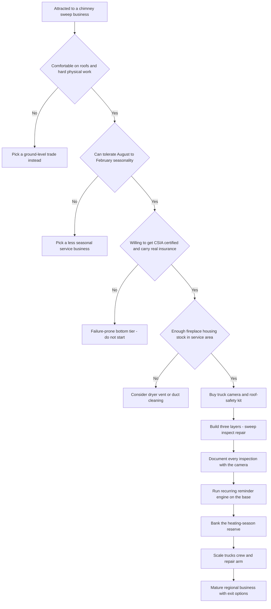

### Direct Answer

To start a chimney sweep business in 2027, build a **certified, inspection-led, repair-driven home-services trade company** that cleans, inspects, and repairs chimneys, fireplaces, wood and pellet stoves, and venting systems -- and treat the $200-$400 sweep as the loss-leader front door to the $1,500-$8,000 relining and masonry jobs where the money actually lives. A solo-plus-helper founder invests **$15K-$60K** in a truck, brushes and rods, a chimney inspection camera, a HEPA vacuum, roof-safety gear, and CSIA certification, runs **65-80% gross margin on sweeps and 35-55% on repair**, and in a disciplined Year 1 completes **300-800 jobs** for **$60K-$190K revenue** and **$35K-$95K owner profit**. It is viable and durable through 2030 for the founder who is comfortable on roofs, builds the repair arm, documents every inspection, and respects the brutal August-February seasonality -- and a fast failure for anyone who runs it as a cheap cleaning route.

**TL;DR:** Chimney sweeping in 2027 is a licensed, certification-gated, fire-safety trade with a structural recurring-revenue base (NFPA 211 calls for annual inspection of every chimney) and a fragmented field of roughly 10,000-plus mostly-independent shops. The model is real and unusually defensible. The honest economics: low-to-moderate capital to launch, high service margins, larger repair tickets, and a calendar where the phone runs hot September through January and goes silent by April. Year 1 lands $60K-$190K revenue and $35K-$95K owner profit; a well-run Year 3 reaches $250K-$650K revenue and $80K-$220K owner profit with two to four technicians. The three killers: running a cleaning business instead of an inspection-and-repair business, skipping certification and real insurance, and spending the heating-season cash before the dead spring arrives. Win by being the most certified, most thoroughly documenting, most repair-capable operator in the underserved professional middle.

## 1. What A Chimney Sweep Business Actually Is In 2027

A chimney sweep business is a licensed home-services trade company that keeps residential and light-commercial chimneys, fireplaces, wood stoves, pellet stoves, and venting systems safe and functional. The brush-up-the-flue image is the marketing; the business underneath is a truck, a camera, a certification, an insurance policy, and a pipeline of inspection findings that convert into repair work.

### 1.1 The Three Layers Of The Trade

The work breaks into three layers a founder must understand as **distinct profit centers, not one blurred service**.

- **Cleaning** -- removing creosote, soot, and debris from flues using brushes, rods, and powered rotary systems, captured with a HEPA vacuum so the homeowner's house stays clean. This is what the customer calls about and what the business is named for.
- **Inspection** -- the CSIA and NFPA 211 framework of Level 1 (basic visual and accessible), Level 2 (video camera scan of the full flue, required on real estate transactions and after any system change), and Level 3 (invasive, after a chimney fire or when a hidden hazard is suspected).
- **Repair** -- chimney caps, crown rebuilds, flashing, masonry tuckpointing and rebuilds, damper replacement, firebox repair, waterproofing, and the flagship big-ticket item, **relining** a deteriorated or unsafe flue with stainless steel or cast-in-place liner.

### 1.2 Why 2027 Is Different

The business in 2027 is shaped by realities that were softer a decade ago. **Insurance carriers** increasingly demand a recent chimney inspection before they will write or renew a policy on a home with a wood-burning appliance. **Real estate transactions** routinely trigger a Level 2 inspection as due diligence. **The aging housing stock** of the Northeast, Midwest, and Mid-Atlantic keeps producing cracked crowns, failing liners, and spalling masonry. And a **revival of wood and pellet heat** in rural and sustainability-minded markets keeps installing new appliances that need venting and ongoing service. The chimney sweep business is not glamorous and it is not passive -- it is a roof-climbing, soot-covered, certification-gated trade wearing a quaint historical costume.

| Layer | Core service | Typical ticket | Gross margin | Role in the business |
|---|---|---|---|---|
| Cleaning | Sweep + Level 1 inspection | $150-$400 | 65-80% | Front door, lead generator |
| Inspection | Level 2 video scan | $300-$700 | 65-80% | Diagnostic engine |
| Inspection | Level 3 invasive | $500-$1,500 | 55-70% | Post-fire / hidden hazard |
| Repair | Caps, dampers, flashing | $200-$1,000 | 40-55% | Fast, profitable, common |
| Repair | Crown / masonry / relining | $300-$8,000 | 35-55% | The actual business |

## 2. The Three Revenue Layers: Where The Money Really Flows

The single most important reframe for a founder is that the money flows in inverse proportion to how the public thinks about the trade. Most customers think they are buying a cleaning. The business is built on what the cleaning uncovers.

### 2.1 Cleaning Is The Front Door, Not The House

A standard sweep with a Level 1 inspection bills only **$150-$400**, runs 45-90 minutes, and at high volume produces a respectable but capped income. A solo sweep who only cleans is running a job, not a business. The cleaning's strategic value is that it puts a certified technician with a camera inside a chimney that the homeowner has not looked at in years.

### 2.2 Inspection Is The Diagnostic Engine

A **Level 2 video scan at $300-$700** is both a real revenue line and -- more importantly -- the moment the technician's camera finds the cracked crown, the spalling brick, the gap in the liner, the missing cap, or the creosote glaze that a brush cannot remove. Every honest, photo-documented inspection is a repair lead. The discipline this imposes: train every technician to inspect thoroughly, photograph every finding, explain it in plain language with the code or safety reason behind it, and quote the repair on the spot.

### 2.3 Repair Is Where The Business Earns

A cap installation at $200-$700, a crown rebuild at $300-$1,500, a damper replacement at $300-$1,000, masonry repair from $500 well past $5,000, and the flagship **flue relining at $1,500-$8,000** -- a single relining job can exceed a full day of pure cleaning. A sweep who treats every cleaning and inspection as a diagnostic that honestly surfaces real, code-relevant repair needs is running a business with a 35-55% margin repair arm bolted onto a 65-80% margin service arm.

### 2.4 The Ethical Line

The ethical line matters and is also good business: **you never invent problems**, but a deteriorated chimney genuinely is a fire and carbon-monoxide hazard. A sweep who fails to surface and fix real defects is both leaving money on the table and failing the customer. The camera footage is the proof -- the homeowner sees the cracked crown with their own eyes.

| Revenue layer | What the customer thinks | What it actually is | Founder discipline |
|---|---|---|---|
| Cleaning | "I'm getting my chimney cleaned" | A capped service line and a lead source | Route tightly, keep it profitable |
| Inspection | "A formality, part of the cleaning" | The diagnostic that finds the repair work | Camera every job, document every finding |
| Repair | "An upsell" | The margin-dollar engine and business value | Build the masonry/relining skill, quote on site |

## 3. Certification, Licensing, And Why They Are Non-Negotiable

A founder cannot treat credentials as optional paperwork, because chimney work sits at the intersection of fire safety, roof work, and homeowner liability.

### 3.1 CSIA Certification And NCSG

**CSIA certification** -- the Chimney Safety Institute of America's Certified Chimney Sweep credential -- is the industry's baseline professional standard. It signals competence to homeowners, is frequently expected by real estate agents and insurance carriers, and is functionally required to be taken seriously by the better referral sources. The **National Chimney Sweep Guild (NCSG)** is the trade association that supplies training, standards, business resources, and the professional community. Get CSIA certified before launch or immediately after, and join NCSG.

### 3.2 Business And Contractor Licensing

Beyond the trade credential, a founder needs the ordinary business-licensing stack -- a state business license, an entity registration, and in many jurisdictions a contractor's or home-improvement license once repair and masonry work is performed. The threshold and licensing body vary widely by state and locality, and the founder must check theirs specifically. The same diligence applies to any allied home-services trade -- the gutter and painting trades, for example, carry their own licensing thresholds (q1977) (q1984).

### 3.3 NFPA 211 -- The Standard That Underwrites Demand

**NFPA 211** is the National Fire Protection Association's Standard for Chimneys, Fireplaces, Vents, and Solid Fuel-Burning Appliances, and it calls for chimneys to be inspected at least annually. That standard underwrites the entire recurring-revenue demand model. A competent sweep works to NFPA 211 and the Level 1/2/3 inspection framework, and the uncertified, uninsured operator competes only at the bottom on price -- where one bad job ends them.

| Credential / requirement | What it is | Why it matters | When to get it |
|---|---|---|---|
| CSIA Certified Chimney Sweep | Industry baseline competence credential | Trust, agent/insurer expectations | Before or at launch |
| NCSG membership | Trade association | Training, standards, community | At launch |
| State business license | Legal authorization to operate | Compliance | Before launch |
| LLC / S-corp registration | Liability-shielding entity | Protects personal assets | Before launch |
| Contractor / home-improvement license | Repair-work authorization | Required for masonry/relining in many states | Before repair work |
| NFPA 211 working knowledge | The inspection standard | Defines competent practice | Continuous |

## 4. The 2027 Market Reality: Demand, Competition, And What Changed

A founder needs an accurate read of the 2027 landscape, because chimney sweeping is neither a dying Victorian relic nor a goldmine.

### 4.1 Demand Is Structurally Healthy And Partly Mandated

Tens of millions of US homes have a fireplace, wood stove, or pellet stove, and per NFPA 211 every one of those venting systems is supposed to be inspected annually and cleaned as needed. That is a recurring-revenue base most trades would envy. Three forces lift demand above that baseline: **insurance carriers** requiring recent inspections, **real estate transactions** triggering Level 2 inspections, and an **aging housing stock** generating crown, liner, and masonry failures.

### 4.2 The Competition Is Fragmented And Bifurcated

The field is roughly **10,000-plus mostly-independent chimney shops**, many of them one-or-two-person operations, some of them under-credentialed seasonal operators, and a thinner layer of larger multi-truck regional companies. Franchise systems and brands -- names such as Mr. Smoke, Aire Serv (under the Neighborly umbrella), and Chimney Cricket -- exist in the space, but the trade is nowhere near as consolidated as HVAC, where national players like Carrier (CARR) and Lennox (LII) dominate the equipment tier and large regional service brands consolidate the contractor tier (q1945). The chimney trade is far closer to the gutter and pressure-washing fields -- a long tail a disciplined entrant can out-professionalize (q1977) (q2052).

### 4.3 What Changed By 2027

Insurance-driven demand is materially stronger than a decade ago. Homeowners book and vet online and expect digital scheduling, photo-documented inspections, and clean digital invoices. Field-service software made it far easier for a small operator to run a professional dispatch-and-billing operation. And the camera inspection became a baseline expectation rather than a premium add-on.

| Market force | Direction by 2027 | Effect on a new entrant |
|---|---|---|
| Insurance inspection requirements | Strengthening | More mandated demand, favors certified operators |
| Real estate Level 2 inspections | Steady, durable | Less-weather-bound revenue layer |
| Aging housing stock | Worsening (favorable) | More high-ticket repair work |
| Wood / pellet heat revival | Growing in rural markets | New appliances needing venting service |
| Field-service software | Cheap, mature | Small operator can run like a big one |
| Consolidation | Slow | Bottom-tier share erodes, middle still open |

## 5. The Core Unit Economics: Jobs Per Day And Ticket Mix

The chimney sweep business lives or dies on two numbers a founder must run before launch: **jobs completed per technician per day** and **average ticket including repair conversion**.

### 5.1 Throughput

A standard sweep plus Level 1 inspection runs 45-90 minutes on site, plus drive time and setup. A realistic, sustainable day for a single technician in heating season is **3-6 jobs**, with the high end requiring tight routing and the low end reflecting longer jobs, difficult roofs, or spread-out service areas. At a $275 blended sweep-and-inspect ticket, a technician doing 4 jobs a day produces about $1,100 in service revenue before any repair work.

### 5.2 Ticket Mix And Conversion

The real economics live in the mix. If even a modest share of inspections convert to repair -- a cap here, a crown rebuild there, a relining job a week -- the **average revenue per service call** climbs well above the bare sweep price. The honest model: a disciplined solo-plus-helper operation completes **300-800 jobs in Year 1** and lands **$60K-$190K revenue**, because the mix includes both bare sweeps and converted repair work. The inspection-to-repair conversion rate is the single ratio that separates a $90K owner income from a $200K one on nearly the same number of trucks rolling.

### 5.3 The Two-Tier Margin Structure

**Sweeps and inspections run a 65-80% gross margin** -- the costs are mostly the technician's labor, vehicle, and consumables. **Repair and masonry work runs 35-55%** because materials (liners, caps, masonry supplies) and sometimes specialized labor eat into it -- though the absolute dollars are far larger.

| Daily scenario (1 technician, heating season) | Jobs | Avg ticket | Service revenue | Repair add-on | Day total |
|---|---|---|---|---|---|
| Pure sweep route | 5 | $275 | $1,375 | $0 | $1,375 |
| Sweep + light repair | 4 | $275 | $1,100 | $600 cap/crown | $1,700 |
| Sweep + mid repair | 3 | $275 | $825 | $1,400 damper+crown | $2,225 |
| Sweep + relining job | 2 | $275 | $550 | $4,500 reline | $5,050 |

## 6. The Line-By-Line Job And Business P&L

Beyond the headline ratios, a founder must internalize the operating P&L, because the gross margin and the hidden costs determine whether revenue becomes profit.

### 6.1 The Cost Stack Of A Representative Day

Take a representative day: four service calls, three bare sweep-and-inspect at roughly $275, one sweep that converts to a $600 cap-and-crown-seal repair -- a day's revenue near $1,425. From that, costs stack.

- **Labor** -- the technician's wage loaded with payroll taxes, plus a helper on the harder jobs; in heating season the crew is the constraint and the cost.
- **Vehicle** -- fuel, maintenance, insurance, and depreciation on the truck, allocated across every job and every route mile.
- **Consumables** -- brushes and rods wear, vacuum filters, drop cloths, sealants, minor parts; a steady per-job drip.
- **Materials** -- the liner, the cap, the masonry and crown supplies; the cost that pulls repair margin to 35-55%.
- **Insurance** -- general liability, commercial auto, workers' comp; a real fixed-and-variable cost a roof-climbing fire-safety trade cannot skimp on.
- **Software, marketing, overhead** -- field-service platform, website and seasonal advertising, a small shop or storage space, phone, admin, accounting.

### 6.2 The Annual P&L And Seasonality

Net the business out and a healthy chimney sweep operation runs **65-80% gross margin on service and 35-55% on repair**, blending to a strong overall margin, with owner profit landing at **$35K-$95K in Year 1** for a solo-plus-helper operation. At the business level, seasonality dominates: revenue concentrates heavily in roughly August through February, and a disciplined operator treats the heating season as the period that must fund the entire year.

| P&L line | Share of revenue (mature solo-plus-helper) | Notes |
|---|---|---|
| Labor (loaded) | 30-42% | Largest line; partly seasonal |
| Vehicle (fuel, maint., depreciation) | 6-10% | Higher on spread-out routes |
| Materials (repair) | 10-18% | Scales with repair mix |
| Consumables | 2-4% | Brushes, filters, sealants |
| Insurance | 4-8% | GL, commercial auto, workers' comp |
| Software | 1-2% | Field-service platform |
| Marketing | 4-8% | Seasonal spend curve |
| Overhead | 4-7% | Shop, phone, admin, accounting |
| Owner profit | 20-40% | $35K-$95K Year 1 |

## 7. Pricing The Work: Sweeps, Inspections, And Repairs

Pricing in chimney work has three layers and a founder must get all three right, because the trade has a wide spread between a commodity sweep and a high-skill repair.

### 7.1 Sweep And Inspection Pricing

Pricing here is anchored to throughput and the local market: a standard sweep with a Level 1 inspection at **$150-$400**, a Level 2 video inspection at **$300-$700**, a Level 3 invasive inspection at **$500-$1,500**, and a real estate transaction inspection -- a Level 2 in practice -- at $150-$400 depending on the market. The pricing principle: the service layer must cover loaded labor, the vehicle, the consumables, and a contribution to overhead while leaving the 65-80% margin. Resist racing the uncertified bottom to the floor.

### 7.2 Repair Pricing

Repair is the high-skill layer: cap installation **$200-$700**, crown repair or rebuild **$300-$1,500**, damper replacement **$300-$1,000**, masonry tuckpointing and rebuilds from $500 past $5,000, and relining a flue **$1,500-$8,000** depending on length, liner type, and access. Repair pricing must cover materials, the skilled and longer labor, and the real liability of the work, at the 35-55% margin.

### 7.3 Diagnostic And Seasonal Pricing

A clear inspection or diagnostic fee, a service-call minimum, and trip charges for distant or difficult-access jobs keep tiny or remote jobs from costing more in windshield time than they earn. In the dense heating-season window the operator prices firmly because the calendar, not the price, is the constraint; the quiet season is the time for off-peak promotions and repair work that does not depend on the heating calendar.

| Service | Price range | Margin band | Pricing driver |
|---|---|---|---|
| Sweep + Level 1 inspection | $150-$400 | 65-80% | Throughput, local market |
| Level 2 video inspection | $300-$700 | 65-80% | Diagnostic value |
| Level 3 invasive inspection | $500-$1,500 | 55-70% | Post-fire complexity |
| Chimney cap install | $200-$700 | 40-55% | Materials + quick labor |
| Crown repair / rebuild | $300-$1,500 | 35-50% | Masonry skill |
| Damper replacement | $300-$1,000 | 40-55% | Part cost + labor |
| Masonry tuckpointing / rebuild | $500-$5,000+ | 35-50% | High-skill, materials-heavy |
| Flue relining | $1,500-$8,000 | 35-55% | Liner cost, length, access |

## 8. Seasonality: The Heating-Season Engine

Seasonality is the defining operating reality of a chimney sweep business, and a founder who does not plan for it will be crushed by it.

### 8.1 The Demand Curve

The phone starts ringing in **late summer** as homeowners think ahead, runs hot through **fall and early winter** -- September through January is the dense core -- carries a secondary bump in late winter as people deal with mid-season problems, and goes quiet from roughly **March through July**. The large majority of annual revenue is earned in the August-February window.

### 8.2 The Five Disciplines Of A Seasonal Operator

- **Bank the reserve.** The heating-season cash must explicitly fund fixed costs -- truck payments, insurance, software, year-round staff, the owner's draw -- through the quiet months. The operator who spends the busy-season money is the canonical failure mode.
- **Sell the off-season.** Masonry rebuilds, crown work, waterproofing, relining, and cap installation do not depend on the heating calendar and can be scheduled into spring and summer.
- **Flex the staffing.** Run a lean year-round core and add seasonal technicians for the heating-season surge -- recruiting and training *before* the season, not during it.
- **Time the marketing.** The heaviest advertising spend belongs in mid-to-late summer, ahead of the demand, not in November when the calendar is already full.
- **Manage the customer expectation.** In peak season the booking lead time stretches; a professional operation manages the queue rather than promising next-day service it cannot deliver.

| Period | Demand level | What the operator does |
|---|---|---|
| Aug-Sep | Ramping fast | Heavy marketing already spent, crew trained, calendar filling |
| Oct-Jan | Peak | Tight routing, firm pricing, queue management, banking the reserve |
| Feb | Secondary bump | Mid-season problem calls, repair conversion |
| Mar-May | Falling | Off-season repair scheduling, masonry rebuilds |
| Jun-Jul | Trough | Marketing prep, training, booking next season ahead |

## 9. Tools, Equipment, And The Startup Kit

A founder needs a concrete picture of what to buy to launch, because chimney work is equipment-dependent but, compared to many trades, not capital-crushing.

### 9.1 The Core Kit

The core kit: **brushes and rods** in the local range of flue sizes -- traditional wire and poly brushes plus increasingly powered rotary cleaning systems that handle glazed creosote; a **HEPA vacuum** purpose-built for soot capture; **drop cloths and containment** gear; a **chimney inspection camera** -- the video scope that runs the flue and documents findings; **ladders** and **roof-safety equipment** -- harnesses and fall protection; **hand tools and basic masonry tools**; **personal protective equipment**; a **moisture meter**; and consumables.

### 9.2 The Vehicle And The All-In Number

The big-ticket item is the **truck or van** -- a reliable work vehicle, often a van or pickup with a rack and secure storage, bought new or used. The all-in startup kit excluding the vehicle commonly runs in the low-to-mid thousands and up; with a used vehicle the launch can be lean and with a new vehicle and full powered kit it runs higher. The honest range is **$15,000-$60,000** all-in for the typical solo-plus-helper launch.

### 9.3 Equipment Discipline

Buy a genuinely good inspection camera -- it pays for itself in repair conversion. Do not skimp on roof safety gear. Buy powered cleaning systems when local flue conditions justify them. Keep the kit organized and maintained, because downtime in a 5-month dense season is expensive.

| Equipment category | Cost band | Why it matters |
|---|---|---|
| Truck / van (used to new) | $8,000-$40,000 | Largest single line |
| Brushes, rods, powered systems | $1,500-$8,000 | Core cleaning capability |
| HEPA vacuum | $800-$3,000 | Keeps homes clean; a selling point |
| Chimney inspection camera | $1,000-$6,000 | Diagnostic + repair-conversion engine |
| Ladders + roof-safety gear | $800-$3,500 | Non-negotiable safety |
| Hand + masonry tools | $500-$2,500 | Repair capability |
| PPE, moisture meter, consumables | $300-$1,500 | Daily operating kit |

## 10. The Repair And Relining Profit Center

A founder who wants a real business, not just a seasonal cleaning route, must build the repair and relining arm deliberately, because that is where the margin dollars and the business value concentrate.

### 10.1 The Repair Menu

Roughly in ascending ticket: **chimney caps** -- stopping water, animals, and debris from entering the flue; **damper repair and replacement** -- including top-sealing dampers; **flashing and leak repair** -- the chimney-to-roof seal; **crown repair and rebuild** -- the masonry cap of the chimney structure; **waterproofing** -- sealing masonry against the freeze-thaw cycle; **firebox repair**; **masonry tuckpointing and rebuilds**; and the flagship, **relining** -- installing a stainless steel or cast-in-place liner in a flue that is unlined, deteriorated, cracked, or being adapted to a new appliance.

### 10.2 Building The Capability

Building this arm requires real capability: the technicians need the masonry, sheet-metal, and relining skills; the business needs the materials supply relationships and the right tools. Some operators subcontract the heaviest masonry while keeping caps, crowns, dampers, and relining in-house. The strategic point: the inspection layer feeds the repair layer. Every Level 2 camera scan that honestly documents a real defect is a repair lead.

### 10.3 Animal And Water Intrusion Work

Two adjacent lines deserve a mention. **Animal removal and exclusion** -- the raccoon, bird, and squirrel work, plus cap installation to prevent recurrence -- overlaps with the broader pest-control trade and is a real revenue line some operators lean into (q2139). **Water intrusion** -- crown, flashing, and waterproofing work -- overlaps with the gutter and roofing trades, since a chimney leak and a gutter failure often present together (q1977) (q1946).

| Repair line | Typical ticket | Skill required | In-house or sub |
|---|---|---|---|
| Chimney cap | $200-$700 | Low-moderate | In-house |
| Damper / top-seal damper | $300-$1,000 | Moderate | In-house |
| Flashing / leak repair | $250-$1,200 | Moderate | In-house |
| Crown repair / rebuild | $300-$1,500 | Masonry | In-house or sub |
| Waterproofing | $300-$900 | Low-moderate | In-house |
| Masonry tuckpointing / rebuild | $500-$5,000+ | High masonry | Often subbed |
| Flue relining | $1,500-$8,000 | High (sheet-metal / cast) | In-house (flagship) |

## 11. Marketing And Lead Generation

A founder must build a deliberate lead-generation engine, because while the demand exists, it does not route itself to a new, unknown operator.

### 11.1 The Digital Front Door

**Local search and online reviews** are the modern front door -- homeowners search for a chimney sweep, and the operator with a real website, a complete local business profile, and a strong base of genuine reviews wins the call. **The website and digital booking** convert the demand -- a clean site that explains the services, shows the certification, and lets a homeowner request or book service is a baseline 2027 expectation, exactly as it is in the window-cleaning and handyman trades (q1978) (q2051).

### 11.2 The Referral Web

**Real estate agent relationships** are a high-value, repeating lead source -- agents need Level 2 inspections on transactions and refer the sweep who is fast, professional, and produces a clean documented report. **Insurance agent and adjuster relationships** matter as carriers increasingly require inspections. **Referral partners** across the home-services ecosystem -- hearth and stove shops, roofers, home inspectors, HVAC companies, property managers -- form a referral web.

### 11.3 The Recurring Asset

**Repeat and recurring customers** are the compounding asset: the annual-inspection cadence means a satisfied customer is a customer for years, and a reminder system that brings them back each season turns a one-time job into an annuity. **Seasonal advertising** -- timed to late summer, ahead of the demand -- rounds it out.

| Channel | Lead quality | Cost | Time to ramp |
|---|---|---|---|
| Local search + reviews | High | Low-moderate | Months |
| Website + digital booking | High | Low | Weeks |
| Real estate agent referrals | Very high (repeating) | Relationship time | Months |
| Hearth shop / roofer / HVAC referrals | High | Relationship time | Months |
| Insurance agent referrals | High | Relationship time | Months |
| Recurring-reminder system | Highest (annuity) | Software cost | Builds over years |
| Seasonal paid advertising | Moderate | Moderate-high | Immediate |

## 12. Staffing And Building A Crew

A founder can run the smallest operation solo or solo-plus-helper, but the business does not scale past a personal income without a crew, and the staffing model is shaped by seasonality and safety stakes.

### 12.1 The Technician Is The Core Hire

**The technician** climbs the roof, runs the sweep, performs the inspection, documents findings, and increasingly sells and performs the repair. Technician quality directly drives revenue and reputation. Because the trade is certification-gated and safety-critical, **training is a real investment** -- CSIA certification, manufacturer and relining training, masonry skills, roof-safety procedures.

### 12.2 Helpers And The Pipeline

**Helpers** handle the ground work, the setup and containment, and the second pair of hands on harder jobs, and are the natural entry-level role and training pipeline. The seasonality shapes the model: a lean year-round core plus seasonal technicians and helpers recruited and trained before the heating season.

### 12.3 The Back Office

The hiring sequence typically adds an **office and dispatch person** to run scheduling, customer communication, and the recurring-reminder system as call volume grows, and eventually a dedicated **sales or estimating role** for the larger repair and relining jobs -- the same back-office build that the painting and pressure-washing trades follow as they scale (q1984) (q2052).

| Role | When to hire | Cost type | Primary value |
|---|---|---|---|
| Founder (solo) | Day one | Owner draw | Does everything |
| Helper | Early | Seasonal + core | Ground work, training pipeline |
| Second technician | Year 1-2 | Seasonal + core | Doubles capacity |
| Office / dispatch | Year 2-3 | Year-round fixed | Scheduling, recurring reminders |
| Estimator / sales | Year 3+ | Year-round fixed | Larger repair/relining jobs |

## 13. Field-Service Software And Operations

In 2027 a chimney sweep operation runs on software, and a founder should choose the stack early.

### 13.1 The Field-Service Platform

**Field-service management software** -- platforms such as Jobber, Housecall Pro, and ServiceTitan -- is the central system: it holds the customer database, schedules and dispatches jobs, optimizes routing, generates quotes and invoices, takes payment, and supports the **recurring-service reminders** that bring the annual-inspection customer back every season. That recurring-reminder capability converts the NFPA-211 annual cadence into an actual annuity.

### 13.2 Inspection Documentation

**Inspection documentation** is the other software-adjacent system -- the camera footage and the photo-documented inspection report that the homeowner, the real estate agent, and the insurance carrier increasingly expect, and that also serves as the repair-sales tool and the operator's liability record.

### 13.3 Routing And The Customer Database

**Routing and scheduling** efficiency directly drives the jobs-per-day number the unit economics rest on -- in a dense heating season, tight routing is the difference between four jobs a day and six. **The customer database itself** is a core business asset -- the recurring base, the marketing list, and a meaningful component of the business's eventual sale value.

| Software function | What it does | Why it matters |
|---|---|---|
| Customer database | Stores every customer + history | Core sale-value asset |
| Scheduling / dispatch | Books and assigns jobs | Drives jobs-per-day |
| Route optimization | Sequences the day | 4 jobs vs 6 in peak season |
| Recurring reminders | Auto-prompts annual inspection | Turns demand into an annuity |
| Quoting / invoicing | Generates quotes, bills, payment | Cash-flow speed |
| Inspection documentation | Stores photos / video reports | Repair sales + liability record |

## 14. Insurance And Risk Management

The chimney sweep model carries specific, serious risks, and the 2027 operator manages each deliberately rather than hoping.

### 14.1 Roof And Fall Risk

**Roof and fall risk** is the most immediate -- technicians work on roofs and ladders in all conditions, and a fall is a catastrophic personal and business event. Mitigated by roof-safety equipment, harnesses and fall protection, training, and a safety culture that does not cut corners under heating-season pressure.

### 14.2 Liability Risk

**Liability risk** is the structural one unique to this trade: a sweep inspects a chimney and effectively certifies its condition, and if a chimney that was inspected later contributes to a house fire or carbon-monoxide incident, the operator's documentation, competence, and insurance all matter enormously. Mitigated by comprehensive **general liability insurance**, genuinely competent NFPA-211-standard inspection, and thorough photo-and-video documentation.

### 14.3 The Insurance Stack

**Commercial auto insurance** covers the truck. **Workers' compensation** covers the field crew in a physically hazardous trade. **Property-damage risk** -- soot in a customer's home, a damaged roof -- is mitigated by containment discipline, the HEPA vacuum, careful work, and insurance.

| Risk | Severity | Primary mitigation |
|---|---|---|
| Roof / fall | Catastrophic | Fall protection, training, safety culture |
| Fire / CO liability | Business-ending | GL insurance, competent inspection, documentation |
| Vehicle accident | High | Commercial auto insurance |
| Worker injury | High | Workers' comp, PPE, training |
| Property damage (soot, roof) | Moderate | Containment, HEPA vacuum, GL insurance |
| Missed defect (competence) | High | CSIA certification, QC, ongoing training |
| Seasonality cash gap | High | Disciplined reserve, off-season repair |

## 15. Startup Cost Breakdown: The Honest All-In Number

A founder needs a clear-eyed total of what it costs to launch, because while chimney sweeping is less capital-intensive than many trades, under-capitalization still kills startups.

### 15.1 The Line-By-Line Breakdown

The all-in startup cost breaks down as: **vehicle** roughly $8,000-$40,000 depending heavily on new versus used; **core equipment** roughly $3,000-$15,000; **chimney inspection camera** roughly $1,000-$6,000; **CSIA certification and training** modest but real; **insurance** first payments roughly $2,000-$8,000; **business formation, licensing, and legal** roughly $500-$2,500; **field-service software** setup and first months, modest; **initial marketing and website** roughly $1,500-$6,000; and a **working capital and off-season reserve** of a meaningful $5,000-$20,000.

### 15.2 Lean Versus Full Launch

A lean launch with a used vehicle and a starter kit can come in around **$15,000-$30,000**, and a fuller launch with a new vehicle, powered systems, a strong camera, and a healthy reserve runs **$40,000-$60,000+**. Financing softens the vehicle and equipment lines, but the founder still needs real cash for the reserve, because the business has a built-in seasonal cash gap. The capital requirement is a moderate filter -- genuinely accessible compared to capital-heavy businesses, which is part of why the field is fragmented.

| Startup line | Lean launch | Full launch |
|---|---|---|
| Vehicle | $8,000 (used) | $35,000-$40,000 (new) |
| Core equipment | $3,000 | $12,000-$15,000 |
| Inspection camera | $1,000 | $5,000-$6,000 |
| Certification / training | $500 | $1,500 |
| Insurance (first payments) | $2,000 | $6,000-$8,000 |
| Formation / licensing / legal | $500 | $2,500 |
| Software setup | $300 | $1,000 |
| Marketing / website | $1,500 | $5,000-$6,000 |
| Working capital / reserve | $5,000 | $15,000-$20,000 |
| **Total** | **~$22,000** | **~$55,000-$60,000+** |

## 16. The Year-One Operating Reality And Five-Year Trajectory

A founder should walk into Year 1 with accurate expectations, because the gap between the quaint image and the real trade is where most quitting happens.

### 16.1 Year 1 Is Build Mode, Not Profit Mode

Year 1 is **route-building, reputation-building, and skill-building mode**. The first heating season is spent learning the local housing stock, discovering the real jobs-per-day throughput, building the review base and the first agent and hearth-shop relationships, ramping the repair conversion skill, and finding where the operation is fragile. A disciplined Year 1 solo-plus-helper startup, launched certified and properly equipped, can realistically complete **300-800 jobs** and generate **$60,000-$190,000 in revenue** against **$35,000-$95,000 in owner profit**.

### 16.2 The Five-Year Arc

Year 1 is also when the founder discovers whether they built a business or a job. By Year 2-3 a well-run operation with two to four technicians reaches **$250K-$650K revenue** with **$80K-$220K owner profit**, at which point the founder chooses between staying a lean sweep-and-inspect operator, going deep on high-ticket repair and relining, or building a multi-truck regional company. These numbers assume CSIA certification, a real repair arm, honest documented inspection, a recurring-reminder system, and a respected seasonal reserve -- not exponential growth, because chimney sweeping scales with truck count and service-area density.

| Year | Setup | Jobs | Revenue | Owner profit | Founder's role |
|---|---|---|---|---|---|
| 1 | Solo or solo+helper | 300-800 | $60K-$190K | $35K-$95K | Every role, hands-on |
| 2 | +2nd tech, office | -- | $150K-$350K | $60K-$150K | Selling, still on roofs |
| 3 | 2-4 techs, dispatcher | -- | $250K-$650K | $80K-$220K | Managing + big jobs |
| 4 | +estimator, more trucks | -- | $400K-$900K | $110K-$280K | Mostly managerial |
| 5 | Multi-truck regional | -- | $550K-$1.2M+ | $140K-$350K | Owner / strategist |

## 17. Five Named Real-World Operating Scenarios

Concrete scenarios make the model tangible. These five span the realistic distribution of outcomes.

### 17.1 Marcus -- The Disciplined Inspection-Led Operator

Launches CSIA-certified with a used van and a good inspection camera for about $28K, prices the sweep fairly but treats every Level 2 scan as a diagnostic, photo-documents every finding, and converts a healthy share to caps, crowns, dampers, and relining. Hits $165K revenue in a strong Year 1, banks the heating-season reserve, adds a second tech in Year 2, and reaches $480K by Year 3 -- because he built a repair business, not a cleaning route.

### 17.2 Dale -- The Cautionary Tale

Launches cheap and uncertified with a borrowed ladder and no camera, competes purely on the lowest sweep price, never builds a repair arm or a documented inspection workflow. Runs a capped seasonal cleaning route at a modest income; then a chimney he "swept and passed" with no real inspection contributes to a house fire, his thin insurance and absent documentation leave him exposed, and the business does not survive the claim.

### 17.3 Priya -- The Repair-And-Relining Specialist

Starts general but quickly goes deep on the high-ticket layer -- crowns, masonry rebuilds, relining. Builds the masonry and sheet-metal skill and the materials relationships, prices the skilled work properly, and by Year 4 runs a smaller crew doing fewer but far larger jobs at strong margins -- the regional go-to for the repairs other sweeps refer out.

### 17.4 The Okafor Family -- Multi-Truck Regional Company

Runs general and disciplined for three years building route, reviews, and a recurring base, then scales deliberately -- four trucks, a dispatcher, an estimator, a documented system, heavy off-season repair scheduling -- and by Year 5 is a $1M-plus regional operation with the founder managing rather than sweeping.

### 17.5 Tomas -- The Seasonality Casualty

Builds a solid certified operation and a good first heating season grossing $150K, but treats the busy phone as permanent, spends the cash on a new truck and lifestyle, enters the spring quiet season with no reserve, cannot cover the truck payment and insurance through April-July, and is forced to sell equipment and fold.

| Scenario | Strategy | Outcome | Lesson |
|---|---|---|---|
| Marcus | Inspection-led, repair-driven | $480K by Year 3 | The repair engine compounds |
| Dale | Cheap, uncertified | Folds on a fire claim | Certification + insurance are survival |
| Priya | Repair / relining specialty | High-margin niche by Year 4 | Depth beats generalist mediocrity |
| Okafor family | Disciplined multi-truck scale | $1M+ by Year 5 | Systems make scale repeatable |
| Tomas | Spent the reserve | Forced to fold in spring | Respect the seasonal reserve |

## 18. Competitor Landscape: Who You Are Up Against

A founder should understand the competitive field clearly.

### 18.1 The Long Tail And The Bottom Tier

**The long tail of small independent operators** -- the roughly 10,000-plus mostly one-and-two-person chimney shops -- is the bulk of the field; many are skilled and certified, but a meaningful share are under-credentialed, under-insured, or thin on repair. **The under-credentialed seasonal operators** compete only at the bottom on price and are exactly who the professional tier wins against on trust and competence.

### 18.2 Regional Companies And Franchises

**The larger multi-truck regional companies** set the professional standard in their markets and are harder to out-resource, but they can be slower, less personal, and have higher overhead. **Franchise and brand operators** -- Mr. Smoke, Aire Serv under Neighborly, Chimney Cricket -- bring brand and systems, though the trade is far less franchise-consolidated than HVAC or the painting trades (q1984).

### 18.3 The Moat

The competitive moat in chimney sweeping is not the brush -- anyone can buy a brush. It is the **CSIA certification, the documented inspection competence, the repair and relining capability, the review base, the real estate and hearth-shop relationships, and the recurring customer database** -- all of which take years to build and are genuinely hard for a new low-end entrant to copy.

| Competitor type | Strength | Weakness | How a disciplined entrant wins |
|---|---|---|---|
| Under-credentialed seasonal | Cheapest price | No certification, no camera, no insurance | Out-professionalize on trust |
| Skilled independent sweep | Competent, established | Often thin on repair / marketing | Out-document, build referral web |
| Multi-truck regional | Resources, brand | Slow, impersonal, high overhead | Be faster and more personal |
| Franchise operator | Brand, systems, marketing | Franchise fees, less local feel | Local reputation + recurring base |

## 19. Counter-Case: When A Chimney Sweep Business Is The Wrong Move

Honesty requires a dedicated counter-case, because this model genuinely misfits a large number of people who are attracted to it.

### 19.1 The Person Who Should Not Start

**If you are afraid of heights or cannot do hard physical work, do not start.** This is a roof-climbing, ladder-hauling, soot-covered trade performed in cold weather. No amount of business discipline overcomes a founder who cannot get on the roof. **If you want steady year-round income, the seasonality will punish you** -- a business that earns most of its money in five months and goes quiet for four is structurally hostile to a founder who needs an even paycheck. **If you will not get certified or carry real insurance, you are choosing the failure-prone end of the market** -- Dale's path -- and one fall or one fire claim ends you.

### 19.2 The Market That Does Not Support It

A chimney sweep business needs **enough fireplace-and-wood-stove housing stock in the service radius**. A warm-climate metro with few wood-burning appliances, new construction with sealed gas appliances, and a low density of masonry chimneys may simply not support a full-time sweep. In those markets the venting-services money is more likely in dryer-vent and air-duct work, and a founder there should weigh the dryer-vent-cleaning model instead (q2113).

### 19.3 The Founder Who Wants A Cleaning Business

The most common counter-case is the founder who genuinely just wants to run a brush -- no inspection workflow, no camera, no masonry skill, no repair arm. That founder is building a capped seasonal job with a low ceiling and real liability exposure, not a business. If the repair-and-relining engine is unappealing, the honest move is to choose a simpler, lower-liability home-services trade -- gutter cleaning or window cleaning have far less liability and no fire-safety certification burden (q1977) (q1978). The chimney trade rewards exactly one kind of founder: the certified, repair-driven, documentation-disciplined operator who treats it as the safety business it actually is.

| Disqualifying factor | Why it kills the fit | Better alternative |
|---|---|---|
| Fear of heights | Cannot perform the core work | Office-based or ground-level trade |
| Need steady year-round income | Seasonality is structural | Less seasonal service business |
| Unwilling to get certified / insured | Failure-prone bottom tier | Don't start, or pick a lower-liability trade |
| Warm climate, few chimneys | No demand base | Dryer-vent / air-duct cleaning |
| Wants a pure cleaning route | Capped job, real liability | Gutter or window cleaning |

## 20. Financing, Taxes, And Business Structure

Because chimney sweeping is a moderate-capital trade, a founder should understand the financing and structure that soften the launch and protect the operation.

### 20.1 Financing The Launch And Growth

**Equipment and vehicle financing** is the natural fit for the two largest lines. **SBA and small-business loans** can fund a fuller launch including working capital. **Personal savings and a lean bootstrapped launch** are genuinely viable -- a used vehicle, a starter kit, and a modest reserve can launch for $15,000-$30,000. **Seller financing** applies when buying an existing chimney sweep business outright -- sometimes the lowest-risk entry, because the route, the reputation, the recurring base, and the cash flow already exist. **Reinvested cash flow** funds most healthy growth past Year 1.

### 20.2 Entity And Tax Structure

Most chimney sweep operators form an **LLC or S-corp** for liability protection and tax flexibility -- and in a trade with this specific fire-and-carbon-monoxide liability profile, the liability shield matters more than in a lower-risk business. **Vehicle and equipment depreciation** is a real part of the tax picture. **Sales tax** treatment of service labor versus repair materials varies by jurisdiction. **Estimated quarterly taxes** matter especially because the seasonal income pattern means the operator must reserve for taxes out of the heating-season cash.

| Topic | The discipline | The failure mode |
|---|---|---|
| Entity | LLC / S-corp for liability shield | Sole proprietor exposes personal assets |
| Financing | Finance assets, hold cash for reserve | Over-leverage truck, skip reserve |
| Depreciation | Track truck/camera/kit as assets | Miss first-year expensing benefit |
| Sales tax | Get collection right day one | Year-end remittance scramble |
| Quarterly taxes | Reserve from heating-season cash | Spring tax bill with no cash |
| Bookkeeping | Separate banking, real system | Commingled funds, no visibility |

## 21. Owner Lifestyle And Scaling Past The First Season

A founder should know what daily life feels like, and how the jump to a multi-truck business actually works.

### 21.1 What Running This Business Feels Like

In **Year 1**, the founder is genuinely in the trade -- on the roof, running the brush and the camera, doing the masonry, climbing ladders in cold weather, then in the evenings answering the phone, sending invoices, and chasing reviews. By **Year 2-3**, the role shifts toward managing the crew, selling and estimating the larger jobs, and watching the numbers -- though the founder is still on roofs in peak season. By **Year 3-5**, with a multi-truck operation, the founder runs the company with a more managerial rhythm, though chimney sweeping never becomes hands-off the way some businesses do.

### 21.2 The Prerequisites And Levers For Scaling

The prerequisites for scaling: a genuine repair arm and a documented inspection workflow (do not scale a pure cleaning route), systematized operations a dispatcher and trained technicians can run, and cash flow plus reserve to absorb the next truck. The scaling levers: **add trucks and technicians in step with demand**, **build the dispatch and office layer**, **deepen the repair and relining capability**, **systematize the inspection workflow**, **grow the recurring base and reminder engine**, and **expand the service area** thoughtfully.

### 21.3 The Constraints

The constraints on scaling, in order: trained certified technicians are first and hardest; founder attention is second; the seasonal-staffing puzzle is third; capital is fourth. The founders who scale well treated Year 1 as a system-and-skill-building exercise so that growth was the repetition of a proven machine.

| Scaling lever | What it unlocks | Constraint it must clear |
|---|---|---|
| Add trucks + technicians | More capacity | Trained certified labor |
| Build dispatch / office | Founder freed from every roof | Founder willingness to delegate |
| Deepen repair / relining | Bigger tickets scale with trucks | Skill and materials relationships |
| Systematize inspection workflow | Consistent repair conversion | Documentation discipline |
| Grow recurring base | Each season starts pre-booked | Software + reminder execution |
| Expand service area | More addressable demand | Truck capacity and routing |

## 22. Exit Strategies And The 2027-2030 Outlook

Chimney sweep businesses can be exited, and a founder should build with the eventual exit in mind.

### 22.1 The Exit Paths

**Sell the operating business** -- a company with trucks, trained certified technicians, a documented inspection-and-repair system, established agent and hearth-shop relationships, a strong review base, and a large recurring annual-inspection customer database is a saleable asset; valuations run as a multiple of stabilized earnings. **Sell to a consolidator** as the trade slowly professionalizes. **Sell the assets** -- the trucks and equipment have resale value, a real floor under the business. **Transition to a key employee or family.** **Wind down gracefully** -- sell the trucks, refer the recurring base to a trusted competitor, and exit.

### 22.2 Where The Model Is Heading

Demand stays structurally healthy and partly mandated. Insurance-driven demand keeps strengthening. Real estate transaction inspection demand persists as a steady, less-weather-bound layer. The aging housing stock keeps generating repair work. The wood and pellet heat revival keeps installing appliances that need service. Field-service software and inspection technology keep professionalizing the small operator. Slow consolidation continues, and the certification and documentation bar keeps rising -- which structurally favors the certified, documenting operator.

### 22.3 The Net Outlook

Chimney sweeping is **viable and durable through 2030 in its certified, inspection-led, repair-driven, seasonally-disciplined form.** The version that thrives is a professional operation that is CSIA-certified, documents every inspection, has built a real repair and relining arm, runs a recurring-reminder engine on a loyal annual-inspection base, and respects the seasonal reserve. The version that struggles is the uncredentialed, thin-insurance, no-camera, pure-low-price cleaning operation.

| Exit path | Best when | Value driver |
|---|---|---|
| Sell going concern | Mature, systematized, low owner-dependence | Recurring base, repair arm, books |
| Sell to consolidator | Trade professionalizing, good books | Certified shop with recurring base |
| Sell the assets | No going-concern buyer | Truck + equipment resale value |
| Internal transition | Trained certified successor exists | Relationships + skills transfer |
| Graceful wind-down | Owner retiring, no buyer | Asset sale + referral fee for base |

## 23. The Final Framework: Building It Right From Day One

Pulling the playbook into a single operating sequence, a founder who wants to succeed should execute in this order.

### 23.1 The Pre-Launch Foundation

**First, get honest about heights, physical work, and temperament** -- the quaint image hides a physical, soot-covered job. **Second, get certified and licensed** -- earn the CSIA credential, join NCSG, and sort state and local licensing for both service and repair work. **Third, get honest about capital** -- confirm $15K-$30K for a lean certified launch with a real reserve, or financing plus cash for the reserve. **Fourth, buy the right kit** -- a reliable truck, quality brushes and rods, a HEPA vacuum, serious roof-safety gear, and a genuinely good inspection camera. **Fifth, carry real insurance** -- general liability, commercial auto, and workers' comp.

### 23.2 The Operating Engine

**Sixth, build the three revenue layers as distinct profit centers** -- the sweep as the front door, the inspection as the diagnostic engine, the repair and relining as the actual business. **Seventh, document every inspection** -- camera footage, photos, written findings. **Eighth, adopt field-service software and build the recurring-reminder system** -- because the NFPA-211 annual cadence only becomes an annuity if the system brings customers back. **Ninth, build reviews and referral relationships relentlessly** -- the same disciplined inbound engine the pressure-washing and handyman trades depend on (q2052) (q2051). **Tenth, build the repair and relining capability** -- the masonry, sheet-metal, crown, and relining skills.

### 23.3 The Long Game

**Eleventh, respect the seasonal reserve** -- bank the August-February cash to fund the quiet spring and summer, every year. **Twelfth, keep the exit options open** -- a certified operation with trained technicians, documented systems, and a large loyal recurring customer base is sellable. Do these twelve things in this order and a chimney sweep business in 2027 is a legitimate path to a $250K-$650K certified trade business with $80K-$220K in owner profit and a multi-truck regional future. The business is neither a quaint relic nor an easy win -- it is a real, certified, seasonal, roof-climbing, recurring-revenue safety trade.

### 24. The Founder Decision Flow

The diagram below maps the decision path from attraction to either a launch or an honest pass.

## 25. Sources

1. Chimney Safety Institute of America (CSIA) -- Certified Chimney Sweep credentialing program and standards.
2. National Chimney Sweep Guild (NCSG) -- trade association training, standards, and business resources.
3. National Fire Protection Association -- NFPA 211, Standard for Chimneys, Fireplaces, Vents, and Solid Fuel-Burning Appliances.
4. NFPA -- annual chimney inspection guidance and the Level 1 / Level 2 / Level 3 inspection framework.
5. US Census Bureau -- American Housing Survey data on fireplaces and wood/pellet-burning appliances in the housing stock.
6. US Energy Information Administration -- residential wood and pellet heating fuel consumption trends.
7. US Bureau of Labor Statistics -- occupational data and wage benchmarks for building and grounds trades.
8. US Small Business Administration -- small-business loan programs and startup financing guidance.
9. Hearth, Patio & Barbecue Association (HPBA) -- hearth-appliance market and installation data.
10. Insurance Information Institute -- homeowners insurance underwriting trends for solid-fuel appliances.
11. US Consumer Product Safety Commission -- residential fire and carbon-monoxide hazard statistics.
12. US Fire Administration -- residential structure fire data attributable to heating and chimney causes.
13. International Code Council -- International Residential Code provisions relevant to chimneys and venting.
14. Internal Revenue Service -- Section 179 expensing and equipment/vehicle depreciation schedules.
15. IRS -- small-business entity selection guidance (LLC, S-corporation, sole proprietorship).
16. US Occupational Safety and Health Administration -- fall protection and ladder-safety standards for roof work.
17. Jobber -- field-service management software for home-services trades; pricing and feature documentation.
18. Housecall Pro -- field-service scheduling, dispatch, and recurring-service software documentation.
19. ServiceTitan -- field-service operations platform and home-services industry benchmarks.
20. Neighborly -- Aire Serv and franchise-system structure in the home-services sector.
21. Carrier Global Corporation (NYSE: CARR) -- HVAC equipment market context for the broader venting trades.
22. Lennox International (NYSE: LII) -- HVAC manufacturer market data referenced for trade-consolidation context.
23. Pulse RevOps Library -- "How do you start a gutter cleaning business in 2027?" (q1977).
24. Pulse RevOps Library -- "How do you start a window cleaning business in 2027?" (q1978).
25. Pulse RevOps Library -- "How do you start a painting business in 2027?" (q1984).
26. Pulse RevOps Library -- "How do you start an HVAC business in 2027?" (q1945).
27. Pulse RevOps Library -- "How do you start a roofing business in 2027?" (q1946).
28. Pulse RevOps Library -- "How do you start a pressure washing business in 2027?" (q2052).
29. Pulse RevOps Library -- "How do you start a handyman business in 2027?" (q2051).
30. Pulse RevOps Library -- "How do you start a dryer vent cleaning business in 2027?" (q2113).
31. Pulse RevOps Library -- "How do you start a pest control business in 2027?" (q2139).
32. National Association of Realtors -- real estate transaction inspection practices and home-sale due diligence norms.
33. Chimney trade equipment suppliers -- inspection-camera, rotary-cleaning-system, and liner pricing references.
34. US Census Bureau -- County Business Patterns data on the number and size of chimney and home-services firms.
35. State contractor licensing boards -- home-improvement and contractor licensing thresholds for repair and masonry work.
36. Underwriters Laboratories (UL) -- listing standards for chimney liners and venting components.
