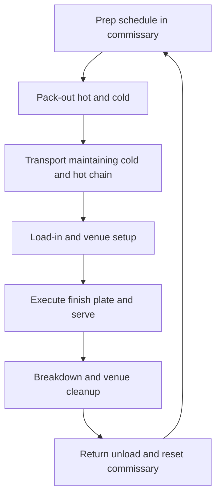

### Direct Answer

To start a catering business in 2027, you produce food in a licensed commercial kitchen and deliver it -- with or without service staff, rentals, and on-site cooking -- to events that happen somewhere else: weddings, corporate lunches, galas, conferences, funerals, graduations, and private parties. You charge per person, from roughly $15-$45 for drop-off platters to $60-$200+ for plated full-service dinners, and the same kitchen, vans, and core crew produce that whole range. The model is real, durable, and proven, but it is operationally brutal and margin-thin, and the entire business lives or dies on one number most beginners never calculate correctly: fully-loaded food-and-labor cost as a percentage of the menu price, event by event.

**TL;DR:** Catering is a logistics-and-labor business wearing a food costume. Food runs 28-35% of revenue, direct event labor another 22-32%, rentals and disposables and transport another 8-15%, leaving a net margin of only **7-15%** in a healthy operation. A lean commissary-based launch costs **$15K-$45K**; building your own kitchen runs **$70K-$200K+**. A disciplined Year 1 runs 30-90 events at **$90K-$400K revenue** and **$25K-$80K owner profit**; a well-run Year 3-5 operation reaches **$500K-$2M+ revenue** with **$70K-$220K owner profit**. The three things that kill catering startups: mispricing events (quoting on food cost alone), underestimating labor, and cash-flow whiplash. Win by being the most reliable, most relationship-fed, most cost-disciplined operator in a chosen segment -- not the cheapest per-person number in the inbox.

## 1. What A Catering Business Actually Is In 2027

A catering business produces food in one place and serves it in another, for events -- and that single sentence contains the entire operational challenge. You are not a restaurant. A restaurant has a fixed kitchen, a stable menu, and food that travels three feet to a table. You are a mobile food-production-and-service operation that quotes a bespoke menu, buys for it, preps it in a commercial kitchen, transports it -- hot, cold, and sometimes mid-cook -- to a church basement or a hotel ballroom or a backyard tent, finishes and plates it under conditions you do not control, serves it, and breaks down.

### 1.1 The Range Under One Roof

In 2027 the business spans an enormous range. At the light end is **drop-off catering** -- platters, boxed lunches, buffet trays delivered and left, no staff, $15-$45 per person, the bread-and-butter of corporate-office accounts. In the middle is **buffet and family-style service** -- food set up on site, sometimes with a few staff to tend it, $35-$90 per person. At the heavy end is **full-service plated catering** -- on-site cooking or finishing, captains, servers, bartenders, rentals, $60-$200+ per person, the domain of weddings and galas. The same business can do all three, and most do, because the kitchen, the vans, the insurance, and the core crew are shared overhead that more events amortize.

### 1.2 What Shapes The 2027 Version Specifically

Corporate clients now book and compare online and expect clean digital proposals and invoicing. Office-lunch demand restructured around hybrid work into fewer-but-larger gathering days. Commissary and shared commercial kitchens -- and the rise of ghost-kitchen real estate -- made it far cheaper to start without building your own kitchen. Food and labor costs both ran up hard through the mid-2020s, compressing already-thin margins. Dietary complexity -- allergen, vegan, halal, kosher, gluten-free -- became a baseline expectation rather than a special request.

### 1.3 The Honest Framing

Catering is not a glamorous food business. It is a logistics-and-labor business that happens to involve food, and the founders who succeed understand that the meal is the customer's memory; the business is vans, hotel pans, a prep schedule, a labor spreadsheet, a cost card, and a phone full of venue and planner relationships. The founders who fail expected a calm food business and were unprepared for the weekends, the payroll, and the margin math.

| Misconception | 2027 Reality |
|---|---|
| "It's a food business" | It's a logistics-and-labor business that involves food |
| "Great food wins the market" | Reliability and relationships win; anyone can cook well |
| "Food cost is the main number" | Fully-loaded labor + food + rentals + overhead is the number |
| "Margins are like a restaurant" | Net margin is thinner -- 7-15% in a healthy operation |
| "I can start from my home kitchen" | You need a licensed commercial or commissary kitchen |

## 2. The Service Tiers And The Three Business Models

A founder must understand the service tiers before pricing anything, because each tier has a completely different labor profile, margin structure, and customer.

### 2.1 The Four Service Tiers

**Drop-off catering** is food delivered and left -- boxed lunches, sandwich and salad platters, hot buffet trays in disposable chafers. There is no on-site labor beyond the driver, disposables replace rentals, and the per-person price ($15-$45) is low but the margin can be surprisingly healthy because labor is minimal. **Buffet service** sets the food up on site -- real chafing dishes, a serving line, one or two attendants -- at $35-$75 per person. **Family-style** brings platters and bowls to seated tables for guests to pass, at $50-$120 per person; it feels upscale and needs servers, but fewer than full plated. **Full-service plated catering** is the heaviest and highest-ticket tier -- a course-by-course plated meal, often with on-site cooking, requiring a captain, a server for roughly every 15-25 guests, bartenders, kitchen staff on site, and a full rental package -- at $60-$200+ per person.

| Service tier | Per-person price | On-site labor | Rentals | Margin character |
|---|---|---|---|---|
| Drop-off | $15-$45 | Driver only | Disposables | Surprisingly healthy |
| Buffet | $35-$75 | 1-2 attendants | Moderate | Solid if priced |
| Family-style | $50-$120 | Servers (light) | Full tableware | Good, upscale feel |
| Full-service plated | $60-$200+ | Captain + full crew | Full package | Thin if mispriced |

The critical insight: the per-person price climbs across the tiers, but so do labor and rental costs, and the *margin* does not climb the same way. A well-run drop-off program can out-margin a sloppily-priced plated wedding.

### 2.2 The Three Business Models

**The owner-operated generalist** does a bit of everything -- some corporate drop-off, some social events, the occasional wedding -- with the founder cooking, quoting, and often delivering. Its advantage is flexibility, low overhead, and a diversified book; its challenge is that the founder is the bottleneck. **The niche specialist** goes deep on one segment -- weddings only, corporate daily-lunch contracts only, nonprofit galas, or a specific cuisine -- and becomes the obvious call for that need. Its advantage is referral compounding, pricing power, and menu efficiency; its challenge is concentration risk. **The volume operator** runs multiple event teams and treats catering as a logistics company -- standardized menus, systematized prep, often anchored by recurring corporate contracts. Its advantage is scale economics; its challenge is that thin margins at scale punish every operational slip.

| Model | Strength | Weakness | Best fit |
|---|---|---|---|
| Owner-operated generalist | Flexible, low overhead, diversified | Founder is the ceiling | Most starters |
| Niche specialist | Referral compounding, pricing power | Concentration risk | Strong segment focus |
| Volume operator | Scale economics, saleable | Management layer, slip-sensitive | Corporate-anchored scale |

### 2.3 Choosing Deliberately

Many successful operators start as owner-operated generalists, discover which segment actually pays, and then specialize or scale. The wrong move is trying to be all three at once in Year 1 -- chasing every wedding, every corporate contract, and every scaling opportunity before the cost discipline and the core crew exist. Related models in the food-and-event space are worth studying before you commit -- a meal prep service (q1981), a personal chef practice (q9598), or a corporate-only catering operation (q9600) each solve the seasonality and labor problem differently.

## 3. The 2027 Market Reality

A founder needs an accurate read of the 2027 landscape, because catering is neither the easy-money food business some imagine nor a dying industry.

### 3.1 Demand Is Structurally Healthy But Restructured

Weddings remain a large, durable market -- roughly two million-plus US weddings a year, the large majority using catering. Corporate catering rebounded but reshaped: hybrid work concentrated office food into fewer in-office days, making those days bigger catered events, and team offsites, client meetings, and recruiting events all reliably feed food. Galas, fundraisers, conferences, religious events, funerals, graduations, and milestone private parties round out a demand base that does not disappear because gathering is not discretionary.

### 3.2 The Competition Is Layered

At the top of most metros are the institutional players and their event arms -- **Compass Group (CCMP.L)**, **Sodexo (SW.PA)**, **Aramark (ARMK)**, and venue-exclusive caterers at hotels and convention centers -- plus established independent caterers with reputations built over decades. In the middle is a band of professional independents. At the bottom is a long tail of home-kitchen cooks, restaurants doing catering as a side line, and underpriced operators who do not fully cost their labor. Hotel and venue catering capacity is also shaped by operators like **Marriott (MAR)** and **Hilton (HLT)**, whose banquet arms compete for the same in-venue events.

| Competitor layer | Examples | Where they win | Your response |
|---|---|---|---|
| Institutional | Compass, Sodexo, Aramark | Large corporate, conventions | Don't compete; different segment |
| Venue-exclusive | Hotel/convention banquet arms | Their specific venues | Target open-list venues |
| Established independents | Decades-old local caterers | Relationship-driven mid/high end | Out-reliable, out-attend, not out-resource |
| Restaurants doing catering | Local restaurants | Edges, casual events | Out-professionalize on logistics |
| Underpriced long tail | Home cooks, side-hustlers | Cheapest quote | Out-professionalize on reliability |

### 3.3 What Changed By 2027

Clients expect digital proposals, online booking flows, and clean e-invoicing. Commissary and shared-kitchen availability lowered the startup capital barrier dramatically. Food and labor inflation through the mid-2020s compressed margins and made cost discipline non-optional. Dietary accommodation became baseline. Software for proposals, event management, and costing matured to where a small operator can run like a much larger one. The net market reality: demand is real and durable, the business is harder than it looks because of labor and margin, and the winning 2027 entrant competes on reliability, food quality, and relationships rather than on price.

## 4. The Core Unit Economics: The Event Cost Card

This is the single most important section in the guide, because the entire business lives or dies on a calculation beginners routinely get wrong: the **fully-loaded cost of a single event as a percentage of what you charged for it.**

### 4.1 Walking A Representative Event

Every event must have a cost card, built before the quote goes out, and it must capture every dollar. Walk a representative example: a 120-guest plated wedding at $95 per person -- a $11,400 food-and-service subtotal before tax and gratuity.

| Cost-card line | % of event revenue | Dollars (120-guest, $11,400 event) |
|---|---|---|
| Food cost (ingredients, waste, trim) | 28-35% | ~$3,300 |
| Direct event labor (kitchen + service + drivers, loaded) | 22-32% | ~$3,000 |
| Rentals and disposables | 6-12% | ~$900 |
| Transport (fuel, mileage, maintenance) | 2-4% | ~$340 |
| Tasting cost (amortized) | 1-3% | ~$230 |
| **Gross margin (before fixed overhead)** | **30-45%** | **~$3,630** |
| Fixed overhead allocation | 15-20% | ~$2,000 |
| **Net margin** | **7-15%** | **~$1,140** |

### 4.2 Why The Stack Matters

The costs stack in an order beginners consistently under-count. **Food cost** -- raw ingredients including the waste, the overbuy, the trim -- runs 28-35%. **Direct event labor** -- the kitchen crew prepping and cooking, the captain, the servers, the bartenders, the drivers, loaded with payroll taxes and travel time -- runs 22-32%. **Rentals and disposables** -- china, glassware, flatware, linens, chafers, or the disposable equivalents -- another 6-12%. **Transport** -- van fuel, mileage, maintenance allocation -- 2-4%. **Tasting cost** -- the free or discounted tasting that won the job, amortized across booked events. **Then fixed overhead** -- the commissary or kitchen rent, insurance, software, marketing, admin, the owner's base time -- has to be covered by the gross margin across all events.

### 4.3 The Beginner's Fatal Move

The discipline this imposes is absolute: never quote a per-person price without a complete cost card behind it. The beginner's fatal move is to price off food cost -- "ingredients are $28, I'll charge $60, that's a great margin" -- forgetting that labor will eat $20 of that, rentals $7, transport and tasting and overhead the rest, and the "great margin" is actually a loss. A caterer who builds a cost card for every event prices to a real margin; a caterer who eyeballs it from food cost is one big mispriced wedding away from a bad year.

### 4.4 How The Cost Card Behaves Across Event Sizes

The cost card is not static -- it shifts with guest count, and a founder must understand the curve. A small 25-guest event carries the same fixed setup, drive, and load-out effort as a 90-guest event, so the per-guest cost of a tiny event is disproportionately high, which is exactly why guest-count minimums exist. A very large 300-guest event introduces a different problem: the labor model does not scale perfectly linearly, the kitchen production hours balloon, and a rental package at scale can absorb more margin than expected. The sweet spot for most independents is the mid-size event -- roughly 75-150 guests -- where the fixed effort is amortized across enough covers and the labor and rental coordination is still manageable.

| Event size | Cost-card character | Margin pressure |
|---|---|---|
| Small (under 40 guests) | Fixed effort dominates per-guest | High -- minimums protect this |
| Mid-size (75-150 guests) | Fixed effort well-amortized | Healthiest margin band |
| Large (250+ guests) | Labor and rentals scale non-linearly | Coordination risk, watch the labor line |

The discipline: build the cost card for the *actual* count, not a generic per-person figure, and re-run it when a count changes -- a wedding that drops from 140 to 95 guests after the food is bought does not just lose revenue, it breaks the cost card the quote was built on.

## 5. The Line-By-Line P&L

Beyond the per-event cost card, a founder must internalize the business-level P&L, because the structure of catering costs is unforgiving and specific.

### 5.1 The Healthy Cost Structure

| P&L line | Healthy % of revenue | Primary lever |
|---|---|---|
| Food cost | 28-35% | Menu engineering, portion control, buying |
| Direct event labor | 22-32% | Fully-loaded labor pricing, crew efficiency |
| Rentals and disposables | 6-15% | Itemize and mark up, never absorb |
| Transport and packaging | 2-4% | Route efficiency, equipment depreciation |
| Fixed overhead | 15-20% | Kitchen rent, insurance, software, owner draw |
| **Net margin** | **7-15%** | Discipline across all of the above |

### 5.2 Controlling Each Line

**Food cost (28-35%)** is controlled through menu engineering -- designing menus around ingredients with stable pricing and good yield, portioning precisely, minimizing waste, and pricing menus to a target food-cost percentage rather than to a feeling. **Direct event labor (22-32%)** is the cost beginners most underestimate, because they price the obvious cooking hours and forget the load-out, the drive, the setup, the service, the breakdown, the drive back, and the post-event cleanup. **Rentals and disposables (6-15%)** are either passed through to the client with a margin or, dangerously, absorbed; the discipline is to itemize and mark up rentals, not bury them. **Fixed overhead** exists every month whether or not there are events that week, which is exactly why slow months are dangerous.

### 5.3 The Two Errors That Wreck The P&L

Pricing menus without a food-cost target so the food line drifts to 40%+, and quoting labor as an afterthought so the labor line blows past 35%. Either one alone turns a thin-but-real margin into a loss, and catering does not have the margin cushion to absorb both.

## 6. The Commercial Kitchen Question

A founder cannot legally cater from a home kitchen at any real scale, and the kitchen decision is the single biggest early capital choice.

### 6.1 The Three Kitchen Paths

**Renting time in a commissary or shared commercial kitchen** -- a licensed facility that rents production time and storage by the hour, day, or month -- is how most 2027 caterers start: it converts a six-figure buildout into a manageable monthly cost, comes already health-department approved, and lets a founder validate the business before committing capital. **A shared-use or ghost-kitchen facility** with more dedicated space sits in the middle -- more control, more cost; the ghost-kitchen model (q2002) reshaped this layer of the market. **Building or leasing your own commercial kitchen** -- a dedicated licensed space with your own equipment, walk-ins, and prep areas -- gives full control and room to scale, but it is a major capital and lease commitment ($40K-$150K+ in buildout on top of rent).

| Kitchen path | Upfront cost | Control | Best for |
|---|---|---|---|
| Commissary / shared kitchen | $500-$3,000 to start | Limited (scheduling competition) | Launch and validation |
| Ghost / shared-use facility | $3,000-$20,000 | Moderate | Growing mid-stage operator |
| Build/lease your own kitchen | $40,000-$150,000+ | Full | Proven-volume scaling |

### 6.2 The Licensing Reality

The kitchen must be inspected and permitted by the local health department, the business needs the state's food-establishment or caterer license, food-handler and manager certifications (ServSafe Manager is the common standard) are required, and serving alcohol requires separate licensing or a licensed bartending partner.

### 6.3 The Strategic Sequencing

Start in a commissary, prove the demand and the cost discipline, and graduate to your own kitchen only when volume genuinely justifies the fixed cost. The founder who builds a kitchen first, on optimism, has converted a flexible cost into a fixed one before knowing whether the events will come.

## 7. Licensing, Permits, Insurance, And Food Safety

Catering is a regulated food business, and a founder must treat compliance as a launch prerequisite, not a someday item.

### 7.1 The Compliance Stack

**The commercial kitchen** must be health-department inspected and permitted -- this is non-negotiable and gates everything. **The business license and the state food-establishment or caterer's license** register the operation to legally produce and sell food. **Food-safety certification** -- ServSafe Manager certification for the owner or a designated manager, food-handler cards for staff -- is required in most jurisdictions. **Alcohol** is its own regime: catering and serving alcohol requires liquor liability coverage and either a caterer's liquor permit or working through a licensed bartending service.

### 7.2 The Insurance Layer

| Insurance type | Covers | Why catering needs it |
|---|---|---|
| General liability | Event accidents, property damage | Venue access requirement |
| Product liability | Foodborne illness claims | Food is the core risk |
| Commercial auto | The vans | Personal auto won't cover business use |
| Workers' compensation | Crew injuries | Required for employees |
| Liquor liability | Over-served-guest claims | Required if alcohol is served |
| Umbrella policy | Excess above other limits | Venues often require high limits |

### 7.3 The Discipline

Build the compliance stack before the first paid event -- the kitchen permit, the licenses, the certifications, the full insurance layer -- because catering without it is not a lean startup, it is an uninsured liability waiting for one bad oyster, one van accident, or one over-served guest. Foodborne illness at an event is a business-ending event.

## 8. Menu Design And Food Cost Engineering

The menu is not just what the food tastes like -- it is the primary lever on the largest controllable cost in the business, and a founder must design menus as a financial instrument as much as a culinary one.

### 8.1 Menu Engineering For Off-Site Service

**Menu engineering for catering** means building dishes that hold up to the realities of off-site service: food that travels, that can be produced in volume, that finishes or holds well on site, that does not collapse in a chafing dish or wilt on a buffet line, and that uses ingredients with stable pricing and high usable yield.

### 8.2 The Core Disciplines

**Food-cost targeting** is the core discipline: each menu item is costed to the ingredient, including waste and trim, and priced so the menu hits a target food-cost percentage -- if the target is 30% and a dish costs $9 in ingredients, it must contribute at least $30 in menu price. **Portion control** is where food cost quietly leaks -- generous, inconsistent portioning can push a 30% food cost to 38% invisibly. **Menu tiering** -- offering good/better/best packages -- lets clients self-select a budget while keeping the caterer's costs predictable. **Dietary accommodation** -- vegan, gluten-free, nut-free, halal, kosher -- is a 2027 baseline and must be designed in, not improvised.

| Menu lever | What it controls | Failure mode if ignored |
|---|---|---|
| Food-cost targeting | The 28-35% line | Food cost drifts to 40%+ |
| Portion standardization | Invisible cost leak | 30% becomes 38% silently |
| Menu tiering | Client budget self-selection | Custom-quoting every event |
| Travel-hardy dish design | On-site quality | Food fails at the venue |
| Dietary options | Baseline expectation + safety | Allergen incident, lost bookings |

### 8.3 The Founder's Choice

The founders who treat the menu as art alone end up with beautiful food and a 40% food cost; the ones who treat it as art constrained by a cost card produce food that is both good and profitable. In a 7-15% net-margin business, the food-cost line is where discipline shows up directly in the owner's draw.

## 9. Labor: The Cost That Eats Catering Alive

This is the operational heart of the business and the cost that most reliably destroys catering margins, and a founder who does not master labor will have revenue without profit.

### 9.1 The Layers Of Catering Labor

| Labor layer | Role | Cost character |
|---|---|---|
| Kitchen production | Prep cooks, chef, on-site finishing crew | Partly fixed (core), partly variable |
| Event service | Captains, servers, bartenders | Variable, scales with bookings |
| Logistics | Drivers, loaders | Variable, per-event |

**Kitchen production labor** prepares the food before the event, plus on-site cooking or finishing for plated service. **Event service labor** includes captains who run the floor, servers (one per roughly 15-25 guests for plated, fewer for buffet), bartenders, and the setup/breakdown crew. **Logistics labor** handles the load-out, transport, and load-back.

### 9.2 The Brutal Arithmetic

A single full-service event consumes far more labor hours than the cooking time alone -- prep, load, drive, setup, service, breakdown, drive back, clean -- and weekend event labor is premium-priced and increasingly scarce. The discipline is to **price labor as a fully-loaded, distinct, itemized cost**: count every hour including travel and setup, load it with payroll taxes, and either bill it as a clear service-staff line or build it fully into the per-person price -- never "throw in" service.

### 9.3 Staffing The Peak

**Staffing the seasonal, weekend-concentrated peak** is its own puzzle: most caterers run a small reliable core and a larger flex pool of on-call event staff, often students and hospitality workers, with returning crew from prior seasons. **Crew quality drives margin and reputation directly** -- a trained captain runs an efficient floor and represents the business at the client's most important event; a sloppy crew runs long, breaks things, and generates complaints. Catering is a labor business wearing a food costume, and the operators who win build trained, well-treated, properly-priced crews and count every labor hour into the quote.

## 10. Event Logistics: From Kitchen To Venue To Breakdown

A founder must master the logistics arc of an event, because catering is where food production meets a moving-parts delivery operation and the gap between the two is where events go wrong.

### 10.1 The Logistics Arc

### 10.2 The Steps In Detail

**The prep schedule** works backward from event time to sequence purchasing, prep, and cooking. **The pack-out** loads hot food in hot-holding, cold food in cold-holding, equipment, rentals, and supplies into the vans in the right sequence at safe temperatures. **Transport** maintains the cold chain and the hot chain, a genuine food-safety obligation. **Load-in and setup** means getting into the venue (loading docks, timing windows, elevator access, the venue coordinator's rules) and setting up the kitchen area, the buffet or plating line, and the service stations. **Execution** finishes, plates, and serves on the venue's timeline. **Breakdown** clears, packs out equipment and rentals, and cleans the space. **The return** unloads, cleans, and resets at the commissary.

### 10.3 What Eases And What Breaks Logistics

**Venue knowledge eases every step** -- knowing a venue's kitchen facilities, access, timing rules, and quirks makes an event run smoothly and is a major reason venue relationships are so valuable. **Equipment is the enabler** -- vans, hot boxes and cambros, cold transport, chafing dishes, portable cooking equipment. **Timing is unforgiving** -- a wedding meal is served on a schedule that does not move. The operators who win treat logistics as a designed and checklisted system; the ones who improvise discover that a great kitchen and a bad load-out still produce a failed event.

### 10.4 The Checklist Culture That Prevents Failure

The single most reliable predictor of clean event execution is whether the operation runs on documented checklists rather than the founder's memory. **A pack-out checklist** confirms every hotel pan, every chafer, every serving utensil, every linen, and every backup is loaded before the van leaves -- because the one item forgotten in the commissary is two hours away once the crew is at the venue. **A site-visit checklist** captures the venue's loading dock, kitchen facilities, power, water access, timing windows, and coordinator contact before the event day. **An execution timeline** maps the meal to the venue's schedule minute by minute. **A breakdown checklist** ensures the space is left to the venue's standard, which is what keeps a caterer on the preferred list. The founders who scale are the ones who turned each painful Year 1 mistake into a checklist line -- the business gets more reliable not because the founder gets smarter but because the system captures the lesson.

## 11. Sales, Proposals, And Pricing

In 2027 the catering sales process is a structured pipeline, and a founder must build it deliberately because the proposal is where margin is set and jobs are won or lost.

### 11.1 The Sales Pipeline

| Stage | What happens | Discipline |
|---|---|---|
| Inquiry | Lead arrives from web, venue, planner, repeat | Fast, professional response |
| Consultation | Scope count, date, venue, tier, menu, budget | Capture dietary needs |
| Proposal | Itemized quote built on a real cost card | Never quote without the cost card |
| Tasting | Curated sample wins the booking | Price the tasting into the business |
| Contract + deposit | Date locked, 25-50% deposit | Deposit funds the food purchasing |
| Final details | Count deadline, final payment, timeline | Confirm weeks before |

### 11.2 The Per-Person Number

**The per-person price** is the headline, and it must contain everything the cost card contains -- food at target percentage, fully-loaded labor, rentals with margin, transport, tasting amortization, and a contribution to overhead and profit. A real plated per-person price is rarely the food cost times a comfortable multiple; it is the whole cost card divided by guests, plus margin. **Tiered packages** let clients pick a budget while keeping costs predictable. **Itemized add-ons** -- bar service, additional staff, upgraded rentals, late-night snacks, specialty stations -- are margin opportunities priced individually. **Minimums** -- guest-count, weekend, peak-date -- protect against small events that cost more in fixed effort than they earn.

### 11.3 The Cardinal Pricing Rule

Price to your cost card and your margin, not to the cheapest quote in the client's inbox. Catering's thin margins mean that winning a job by underpricing it is often worse than not winning it, because a mispriced large event can consume the profit of weeks of good ones. The founders who run a sloppy sales process underprice, over-promise, and get burned on cancellations; the ones who run a tight pipeline price to margin and book to a contract. A clear contract specifying the menu, count, deadlines, payment schedule, and cancellation terms protects against the count-drops and cancellations that wreck catering economics.

## 12. Startup Cost Breakdown: The Honest All-In Number

A founder needs a clear-eyed total of what it costs to launch, because the range is wide and depends almost entirely on the kitchen decision.

### 12.1 The Line-By-Line Startup Budget

| Startup line | Lean commissary launch | Own-kitchen launch |
|---|---|---|
| Commercial kitchen | $500-$3,000 (membership + first months) | $40,000-$150,000+ (buildout) |
| Equipment (chafers, cambros, transport, tools) | $3,000-$10,000 | $10,000-$25,000 |
| Vehicle (used to new cargo van) | $8,000-$20,000 | $20,000-$50,000 |
| Licensing, permits, certifications | $500-$3,000 | $500-$3,000 |
| Insurance (first payments, all layers) | $2,000-$5,000 | $4,000-$8,000 |
| Initial food, supplies, disposables | $1,000-$3,000 | $2,000-$5,000 |
| Website, branding, photography, software | $1,500-$5,000 | $3,000-$8,000 |
| Business formation and legal | $500-$2,000 | $500-$2,000 |
| Working capital cushion | $10,000-$25,000 | $20,000-$40,000 |
| **Total all-in** | **~$15,000-$45,000** | **~$70,000-$200,000+** |

### 12.2 What The Range Means

A lean commissary-based launch can come in around $15,000-$45,000, while a launch that builds its own kitchen runs $70,000-$200,000+. The commissary path is what makes catering a genuinely accessible startup in 2027 -- the founder who starts lean (commissary kitchen, a used van, rented equipment, and a real working-capital cushion) can validate the business for a fraction of the cost of building a kitchen on optimism.

### 12.3 The Hidden Capital Line

Under-capitalization in catering usually is not the kitchen, it is the missing working capital that floats the gap between buying the food and getting paid. A meaningful $10,000-$40,000 working-capital cushion is not optional padding -- it is the line that keeps a profitable-on-paper operation solvent through the first slow February.

## 13. Cash Flow: The Hidden Killer

Catering has a cash-flow structure that quietly destroys otherwise-viable operations, and a founder must understand and manage it deliberately.

### 13.1 The Timing Problem

Events are booked weeks or months out; deposits come in at booking but the food, the rentals, and the payroll are spent in the days around the event; final payment may not clear until during or after; and meanwhile the fixed costs -- kitchen rent, insurance, the van payment, the owner's draw -- run every single month regardless of how many events that month holds. Layer on seasonality and a caterer can be profitable on paper for the year while running out of cash in February.

### 13.2 The Disciplines That Manage It

| Discipline | What it does |
|---|---|
| Front-load deposits | Client funds the food purchasing, not your bank account |
| Collect final payment before/at event | No net-30 for social events |
| Hold a working-capital reserve | Covers fixed costs through slow months |
| Manage the booking calendar | Spread deposits and events, don't bunch |
| Discipline the owner's draw in peak | Reserve the seasonal surplus, don't spend it |
| Watch corporate net terms | Net-30/60 corporate accounts create a receivables gap |

### 13.3 The Classic Failure

The founders who ignore cash flow do the classic thing: a great fall season, the surplus spent, and then January arrives with kitchen rent due and no events booked. The ones who manage it treat the deposit structure and the reserve as core operating tools, not afterthoughts.

## 14. Seasonality And The Catering Calendar

A founder must plan around the catering calendar, because the business is seasonally lumpy in ways that shape staffing, cash flow, and sanity.

### 14.1 The Shape Of The Year

| Window | Months | Demand character |
|---|---|---|
| Spring peak | April-June | Heavy weddings, weekend-packed |
| Summer dip | July-August | Heat suppresses some wedding demand |
| Fall peak | September-October | Heavy weddings, weekend-packed |
| Holiday peak | December | Corporate parties, holiday gatherings |
| Deep trough | January-February | Social events nearly stop |

### 14.2 How Corporate Smooths The Curve

**Corporate catering smooths the curve** -- office lunches, meetings, and recurring corporate accounts run year-round and counter-cyclically to weddings, which is exactly why a mix of corporate and social work makes a more stable business than weddings alone. Funeral and memorial catering is similarly counter-seasonal because it does not follow the wedding calendar.

### 14.3 The Disciplines The Calendar Imposes

Price peak dates firmly because they are scarce. Build the working-capital reserve during peak to fund the trough. Flex staffing from a lean core in slow months to a full flex pool in peak. Pursue off-season demand deliberately. Use the slow months productively for menu development, marketing, relationship-building, and equipment maintenance. The founders who misjudge seasonality staff and spend for a permanent peak and then get caught by February.

## 15. Staffing And Building Event Teams

A founder can run the smallest catering operation nearly solo, but the business does not scale without event teams, and the staffing model is shaped by the weekend-concentrated, seasonal nature of the work.

### 15.1 The Staffing Layers

**The kitchen core** -- a chef or lead cook and prep staff -- produces the food; in a small operation the founder often is the chef. **Event-service staff** -- captains, servers, bartenders -- are largely a flexible, on-call workforce: a small reliable core supplemented by a larger flex pool. **Captains are the key event hire** -- the person who runs the floor, manages the servers, and represents the business at the client's event. **Drivers and logistics crew** handle the pack-out and transport.

### 15.2 The Hiring Sequence

| Stage | Hire added | Why |
|---|---|---|
| Launch | Founder + flex servers | Founder cooks, quotes, captains |
| Growth | First dedicated captain | Frees founder from running every event |
| Scaling | Event manager / sales coordinator | Founder is no longer the sales bottleneck |
| Multi-team | Kitchen management + multiple captains | Run more than one event at a time |

### 15.3 Why Crew Quality Is Margin

Crew quality is margin and reputation -- trained crews are efficient and represent the brand well; sloppy crews run long, cost labor hours, break rentals, and generate the complaints that kill referral flow. Catering scales by building captains and event teams who can execute without the founder on site -- the founder who never builds that layer is permanently capped at the number of events they can personally run.

## 16. Lead Generation: Venues, Planners, And Corporate Accounts

Catering is a relationship-and-referral business, and a founder must understand that the lead-generation engine is venues, planners, and corporate accounts far more than advertising.

### 16.1 The Three Pillars Of Lead Flow

| Lead source | What it provides | How it is earned |
|---|---|---|
| Venues (preferred-caterer lists) | Repeating, pre-screened, qualified jobs | Reliability, easy to work with, clean breakdown |
| Event and wedding planners | Well-organized, higher-ticket bookings | Responsiveness, making the planner look good |
| Corporate accounts | Year-round recurring revenue | Distinct relationship-driven sales motion |

**Venues** -- hotels, banquet halls, barns, estates, museums, breweries, country clubs -- are asked by every client "who caters here?" Getting onto a venue's preferred-caterer list is a durable, repeating source of qualified jobs. Some venues are exclusive (one caterer only) and some maintain open preferred lists. The wedding venue business itself (q1968) is a natural partner to study. **Event planners** specify a caterer for every event they run; the wedding photography (q1949) and party rental (q1965) vendors form the surrounding referral web. **Corporate accounts** provide the year-round recurring revenue that smooths the wedding seasonality.

### 16.2 The Referral Web

Other event vendors -- florists, DJs, photographers, rental companies, bakeries -- form a referral web. Repeat and referral clients compound: a flawless wedding generates the bride's friends' weddings and her company's holiday party.

### 16.3 The Conversion Layer

The website, directories (The Knot, WeddingWire, local listings), and food photography convert the demand the relationships generate. Paid advertising plays a modest role. A founder should treat business development as a permanent core function -- a caterer with a thin relationship base competes on price in a 7% margin business, and one with a deep base has a steady flow of qualified, pre-warmed work.

### 16.4 Building The Venue List Deliberately

Getting onto venue preferred-caterer lists is the highest-leverage business-development activity in catering, and it should be approached as a deliberate campaign, not a hope. The sequence: identify every event venue in the target market and categorize each as exclusive (closed to outside caterers), open-preferred (a curated list the caterer can earn onto), or open (any caterer welcome). Target the open-preferred venues first, because a slot on a curated list is durable, repeating, and pre-qualified demand. The way onto the list is to be the caterer the venue's own staff genuinely wants to work with -- on time, clean, easy, and never the source of a complaint that reflects on the venue. A single strong venue relationship can supply a meaningful share of a Year 2 booking calendar; five or six of them can fill it. The founders who treat the venue list as a project, with a tracked target list and a relationship cadence, build a booking engine; the ones who wait for venues to find them stay dependent on directories and price.

## 17. The Year-One Operating Reality And Five-Year Trajectory

A founder should walk into Year 1 with accurate expectations, because the gap between the imagined catering business and the real one is where most quitting happens.

### 17.1 The Year-One Reality

Year 1 is system-building and relationship-building mode, not profit-extraction mode. The first year is spent learning the true labor cost of an event (almost always more than the first quotes assumed), refining the cost card until the quotes actually hold their margin, discovering which menus travel and produce well at volume, and building the venue and planner and corporate relationships that generate repeat work. A disciplined Year 1 catering startup, launched lean from a commissary, can realistically run **30-90 events** and generate **$90,000-$400,000 in revenue** against **$25,000-$80,000 in owner profit** -- meaningful but earned through intense weekend work.

### 17.2 The Five-Year Revenue Trajectory

| Year | Stage | Revenue | Owner profit |
|---|---|---|---|
| Year 1 | Lean commissary launch, 30-90 events | $90K-$400K | $25K-$80K |
| Year 2 | Cost card hardened, second captain | $250K-$700K | $45K-$130K |
| Year 3 | Multiple captains, possible own kitchen | $450K-$1.1M | $60K-$170K |
| Year 4 | Niche or corporate-contract book | $650K-$1.5M | $70K-$200K |
| Year 5 | Mature multi-team operation | $800K-$2M+ | $90K-$220K |

### 17.3 What The Numbers Assume

These numbers assume a disciplined hardened cost card, fully-loaded labor pricing, managed cash flow, and a real corporate-and-social mix. They do not assume exponential growth, because catering scales with kitchen capacity, captain capacity, and van capacity -- not magically. The net margin stays thin (7-15%) at every stage, which is why operational discipline, not just revenue growth, is what actually grows the owner's income. The first slow January-February is the test: a founder who built and held the working-capital reserve carries the fixed costs; one who spent the fall surplus scrambles.

## 18. Five Named Real-World Operating Scenarios

Concrete scenarios make the model tangible and span the realistic distribution of outcomes.

### 18.1 Priya, The Disciplined Generalist

Priya launches from a commissary with $30K, a used van, and rented equipment, builds a real cost card from day one, and deliberately mixes corporate drop-off (for year-round cash flow) with weekends of buffet and small plated social events. She runs 70 events in Year 1 at $260K revenue, reinvests in a second captain and her own small kitchen by Year 3, and reaches $720K with a stable corporate-and-social book because her cost card actually holds.

### 18.2 Marcus, The Cautionary Tale

Marcus is a talented chef who prices off food cost -- "ingredients are 30%, I charge a 3x multiple, great margin" -- and never builds a labor-loaded cost card. His food is excellent and he is always busy, but the plated weddings consistently run 35% over on labor he never quoted. He discovers at tax time that a busy year produced almost no profit, and he is one cancelled wedding away from a cash crisis.

### 18.3 Elena, The Wedding Specialist

Elena goes niche from the start, building a focused wedding-catering operation with a tight tasting process, deep planner and venue relationships, and a hardened wedding cost card. Smaller addressable market but compounding referrals and real pricing power -- by Year 4 she is a preferred caterer at six venues with $640K in revenue at a healthier-than-average margin.

### 18.4 The Okafor Family, Corporate-Contract Operator

The Okafors build the business around recurring corporate accounts -- standing weekly office lunches, regular client meetings, recruiting events -- which gives them year-round predictable revenue, then layer weekend social events on top. By Year 5 they run multiple event teams off a recurring corporate base with revenue near $1.4M and far less seasonality stress than a weddings-only shop.

### 18.5 Dana, The Cash-Flow Casualty

Dana builds a solid book and a strong fall season grossing $310K, but takes a large owner's draw on the peak surplus, runs net-30 terms for corporate clients without a reserve, and enters January-February with kitchen rent and insurance due, no events booked, and a receivables gap. Profitable for the year on paper, but forced to take a personal loan to make February payroll.

## 19. Risk Management And The Competitor Landscape

The catering model carries specific risks, and the 2027 operator manages each deliberately rather than hoping.

### 19.1 The Risk Register

| Risk | Mitigation |
|---|---|
| Food-safety / liability | ServSafe discipline, temperature control, product-liability insurance |
| Labor / execution | Trained core, deep flex pool, event checklists, loaded labor pricing |
| Cash flow | Front-loaded deposits, payment-before-event, working-capital reserve |
| Cancellation / count drop | Non-refundable deposits, count deadlines, clear contract |
| Alcohol liability | Liquor liability coverage, trained certified bartending |
| Vehicle / transport | Commercial auto coverage, food-safe transport discipline |
| Concentration | Diversified book across event types and clients |
| Reputation | Consistent execution -- the reputation is the marketing |

### 19.2 The Competitive Field

The institutional players -- Compass Group, Sodexo, and Aramark and their event arms -- dominate large-scale corporate and convention catering with resources no startup matches. Venue-exclusive caterers own the business at their specific venues. Established independent caterers hold the relationship-driven middle and high end; they are the real competitive set for a serious new entrant, and they are out-experienced rather than out-resourced. The long tail of underpriced operators competes on price at the low end and is easy to out-professionalize on reliability.

### 19.3 The Competitive Moat

The competitive moat in catering is not the recipes -- anyone can cook well -- it is the reputation for reliability, the venue and planner and corporate relationships, the trained captain layer, the operational systems, and the cost discipline that lets the business price to a real margin. All of which take years to build, which is precisely why they are a moat.

## 20. Financing, Taxes, And Business Structure

Because catering's startup cost swings so widely, a founder should understand the financing options and tax structure that fit each path.

### 20.1 Financing The Business

| Financing source | Best fit |
|---|---|
| Personal savings / small loan | Lean $15K-$45K commissary launch |
| Equipment financing | The van and larger equipment purchases |
| SBA / small-business loan | Larger launch, own-kitchen buildout, working capital |
| Business line of credit | Bridging the booking-to-payment gap and seasonal trough |
| Reinvested cash flow | Most healthy growth past Year 1 |
| Seller financing | Buying an existing catering business |

The lean commissary launch barely needs financing -- $15K-$45K is often within reach of personal savings or a modest loan. A business line of credit is genuinely useful in catering specifically because of the cash-flow structure, though it must be managed, not lived on. Finance the assets, use a line of credit for the timing gap, but never launch without the working-capital cushion.

### 20.2 Taxes And Entity Structure

Most caterers form an LLC or S-corp for liability protection and tax flexibility -- important in a business with real food-safety and event-liability exposure. **Sales tax** on catering applies in most jurisdictions and the rules are specific -- catered food, service charges, and gratuities are taxed differently. **Payroll taxes** on the kitchen core and the variable event-service staff are a real ongoing cost, and the proper classification of event staff (employee versus contractor) gets scrutinized. **Equipment and vehicle depreciation** -- the van, the kitchen equipment, the cambros -- are depreciable assets a knowledgeable accountant optimizes.

### 20.3 The Bookkeeping Discipline

Separate business banking from day one, a bookkeeping system that tracks events as jobs with their cost cards, quarterly attention to sales tax and estimated taxes, careful payroll-tax handling for the flex crew, and an accountant who understands food businesses. Skipping this does not save money -- it converts a manageable compliance function into a year-end scramble in a business that has no margin cushion to absorb avoidable costs.

## 21. Niche Paths, Scaling, And Exit Strategies

Beyond the general model, a founder should understand the specialty paths and the long-term picture.

### 21.1 Niche And Specialty Paths

| Niche path | Character |
|---|---|
| Wedding catering | High-ticket, compounding referrals, intensely seasonal |
| Corporate / office catering | Year-round, cash-flow-stabilizing, predictable |
| Nonprofit galas and fundraisers | Distinct relationship market, large seated events |
| Ethnic / regional cuisine specialty | Defensible reputation, travels beyond one neighborhood |
| Drop-off / delivery-only | Higher-margin, lower-complexity, underrated |
| Funeral and memorial catering | Steady, counter-seasonal, funeral-home relationships |

The generalist model is the most flexible starting point, but the specialty paths can deliver better margins, more predictable cash flow, or compounding referrals for a founder with the right focus. A drop-off-only operation overlaps with the charcuterie board model (q2006); a delivery-focused founder should also study the food truck model (q1929) as a comparable mobile-food business. The mistake is not choosing a niche; it is staying a scattered generalist forever.

### 21.2 Scaling Past The Owner-Operator Ceiling

The single defining constraint of small catering is that the founder can only be at one event at a time -- so scaling means building captains and event teams who can execute a full event to standard without the founder on site. The prerequisites: the cost card must be hardened so quotes hold their margin; the menus, prep procedures, and event-execution standards must be documented; and the cash flow plus reserve must absorb the larger payroll and the next kitchen. Captain capacity is the first and hardest constraint, kitchen capacity is the second, and cash flow is the third.

### 21.3 Exit Strategies

A catering company with a hardened book of repeat clients and corporate accounts, established venue and planner relationships, a trained captain layer, documented systems, and clean books is a saleable asset; valuations typically run as a multiple of stabilized earnings, with the multiple driven heavily by how owner-dependent the operation is. Other exits: sell the assets (kitchen equipment and vans have real resale value), transition to a key employee, or wind down gracefully by fulfilling the booked calendar. A founder should build deliberately toward the owner-independent version, because that is the version that is both more livable to run and actually worth something to sell.

## 22. Counter-Case: When NOT To Start A Catering Business

Honesty requires a direct counter-case, because catering is a poor fit for a meaningful share of the people drawn to it.

### 22.1 Who Should Not Start This Business

**Do not start a catering business if you want predictable weekday hours.** Catering is weekend-bound by definition -- Saturdays are wedding days, every week, for months. **Do not start it if you want fast payback.** Year 1 is system-building and tuition; the meaningful owner income arrives in Years 2-5. **Do not start it if you cannot tolerate cash-flow whiplash.** The booking-to-payment gap and the January-February trough will break an under-capitalized operator regardless of how good the food is. **Do not start it if you price on feeling.** A founder who will not build a cost card for every event is, statistically, Marcus from Scenario 18.2.

### 22.2 The Honest Failure Modes

| Failure mode | Root cause |
|---|---|
| Busy year, no profit | Pricing off food cost, never loading labor |
| February cash crisis | No working-capital reserve, peak surplus spent |
| Cancelled-wedding wipeout | Weak contract, refundable deposits |
| Reputation collapse | One bad event in a referral-driven market |
| Permanent owner ceiling | Never built the captain layer |

### 22.3 When A Different Model Fits Better

If the weekend grind and the event-labor math are the dealbreakers, a meal prep service (q1981) delivers food without the on-site service burden and runs on a steadier weekday rhythm. If you want to cook without payroll and vans, a personal chef practice (q9598) is a lower-overhead path. If you want food-business volume without bespoke event quoting, a ghost kitchen (q2002) standardizes the menu. And if the appeal is mobile food service specifically, the food truck model (q1929) trades event logistics for a fixed daily route. Catering rewards the founder who genuinely loves the logistics puzzle, the energy of events, and hospitality under pressure -- and exhausts the one who wanted a calm, predictable, weekday food business.

## 23. Owner Lifestyle: What Running This Business Actually Feels Like

A founder should know what daily life in this business is like before committing, because the lived reality is intense, weekend-bound, and seasonally cyclical.

### 23.1 The Year-One Texture

In Year 1, running a lean operation, the founder is genuinely in everything -- developing menus, costing and quoting, shopping and prepping in the commissary, loading the van, captaining the event, serving, breaking down, driving back, cleaning, and then doing the books and answering the next inquiry. The peak seasons are long hours and packed weekends; the slow January-February is quieter, spent on planning, marketing, menu work, and relationship-building.

### 23.2 The Year 2-5 Shift

By Year 2-3, with captains running event teams and an event manager handling the pipeline, the founder's role shifts toward managing -- overseeing the teams, building relationships, hardening the systems, watching the cost cards and the cash flow. By Year 3-5, with a deeper team and a mature system, the founder can run a larger operation with a more managerial rhythm, though catering never becomes hands-off the way some businesses do -- the weekend concentration, the food-safety responsibility, and the seasonality are permanent features.

### 23.3 The Emotional Reality

There is real satisfaction in a flawless event, a happy couple, a smoothly run season, and a cost card that holds; and real stress in the weekend grind, the cancelled wedding, the van that breaks, the count that drops, and the February cash gap. The income is real and can grow substantial, but it is earned through intense, physical, weekend-heavy work, not extracted passively. A founder who loves food, hospitality, the energy of events, and the logistics puzzle will find it genuinely rewarding.

## 24. The Bottom Line

Catering in 2027 is a real, durable, and proven business -- people will always gather, and gatherings need food -- but it is operationally brutal and margin-thin. It is viable as a disciplined, cost-card-driven, relationship-fed operation built on venue and planner referrals, and a poor fit for anyone who wants predictable hours, fast payback, or a food business without weekends, vans, and a payroll.

The launch path that works: start lean from a commissary kitchen with a used van, rented equipment, and a real working-capital cushion; build a complete cost card before every quote; load every labor hour into the per-person number; structure deposits so the client funds the food; hold a reserve that carries the business through February; and build venue, planner, and corporate relationships as a permanent core function. Do that, and a Year 1 of 30-90 events at $90K-$400K can compound into a Year 5 operation at $800K-$2M+ with $90K-$220K in owner profit. The three things that kill catering startups remain constant: mispricing events, underestimating labor, and cash-flow whiplash -- and all three are solved by the same discipline, the cost card, applied relentlessly, event by event.

## Sources

1. US Bureau of Labor Statistics -- Food service and catering industry employment and wage data, 2026.
2. National Restaurant Association -- Catering and off-premise dining trend reports, 2025-2026.
3. IBISWorld -- Caterers in the US industry report, 2026.
4. US Small Business Administration -- Food business licensing and startup financing guidance, 2026.
5. ServSafe -- Manager and Food Handler certification standards, National Restaurant Association, 2026.
6. US Food and Drug Administration -- Food Code and safe food transport guidelines, 2025.
7. International Caterers Association -- Industry benchmarks and operating standards, 2026.
8. The Knot -- Real Weddings Study, catering spend and vendor data, 2026.
9. WeddingWire -- Newlywed Report and catering cost benchmarks, 2026.
10. US Census Bureau -- Marriage and household formation statistics, 2025.
11. Catersource -- Catering operations and event-management industry resources, 2026.
12. National Association for Catering and Events (NACE) -- Professional standards and member surveys, 2026.
13. Compass Group plc -- Annual report and contract catering segment disclosures, 2026.
14. Sodexo SA -- Annual results and catering services segment data, 2026.
15. Aramark -- Annual report and food and support services disclosures, 2026.
16. US Department of Labor -- Wage and Hour Division guidance on tipped and event staff, 2026.
17. Internal Revenue Service -- Business structure, depreciation, and Section 179 guidance, 2026.
18. National Federation of Independent Business -- Small-business cash-flow and financing surveys, 2026.
19. Restaurant Business Magazine -- Catering segment and corporate-catering coverage, 2025-2026.
20. Specialty Food Association -- Commissary and shared-kitchen market analysis, 2026.
21. CloudKitchens and ghost-kitchen industry market reports, 2026.
22. Toast Restaurant Industry Report -- Food cost and labor cost benchmarks, 2026.
23. National Restaurant Association -- State of the Restaurant Industry report, 2026.
24. US Department of Agriculture -- Food price outlook and ingredient inflation data, 2026.
25. Event Manager Blog -- Catering technology and proposal-software analysis, 2026.
26. Insurance Information Institute -- Small-business liability and commercial auto coverage data, 2026.
27. Independent Insurance Agents and Brokers of America -- Food-business insurance guidance, 2026.
28. American Culinary Federation -- Catering chef and kitchen-labor standards, 2026.
29. Catering Industry Magazine -- Pricing strategy and per-person benchmarking, 2026.
30. US Small Business Administration -- SBA 7(a) loan and equipment financing program data, 2026.
31. SCORE -- Catering business plan and startup-cost templates, 2026.
32. Bizfluent and industry startup-cost surveys for catering operations, 2026.
33. National Restaurant Association Educational Foundation -- Workforce and staffing research, 2026.
34. State health department food-establishment licensing portals (composite of multiple states), 2026.
35. Pulse RevOps internal interviews with independent caterers and event operators, 2026.
