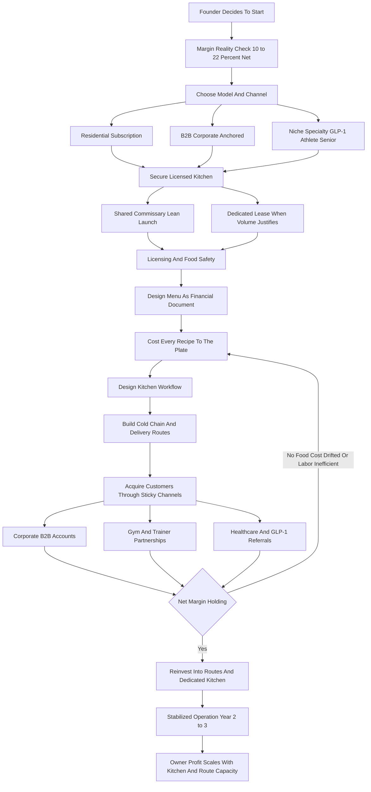

### Direct Answer

To start a meal prep service business in 2027, you cook batches of portioned, ready-to-heat meals in a licensed commercial kitchen and deliver them on a recurring schedule to subscribers who want to eat well without cooking -- residential households, gym and fitness clients, GLP-1 medication patients, busy professionals, seniors, and corporate offices. You charge **$10-$25 per meal**, most revenue arrives as **weekly subscriptions of $80-$300** or **B2B bulk orders**, and a lean launch costs **$8K-$25K** in a shared commissary. The honest catch: meal prep runs the thinnest margins in food -- a disciplined operation nets only **10-22%** -- so it lives or dies on costing every recipe to the plate and anchoring on sticky channels rather than chasing churning residential subscribers.

**TL;DR:** Meal prep is a logistics, packaging, and cold-chain business that happens to cook -- not a cooking business that happens to deliver. The 2020-2022 hyper-growth peak is over; Blue Apron sold to Wonder Group in 2024, Sun Basket went bankrupt in 2023, and Nestle shut Freshly -- a national shakeout that left the local, B2B, and niche channels wide open. A disciplined Year 1 with 50-200 weekly subscribers generates **$80K-$300K revenue** against **$15K-$55K owner profit**; a mature Year 3-5 multi-route operation reaches **$400K-$2M revenue** with **$60K-$320K owner profit**. The three killers: underpricing the meal, treating it as a kitchen instead of a cold-chain operation, and building on fickle residential direct-to-consumer churn instead of corporate B2B and gym partnerships. Viable and durable through 2030 -- but only for the cost-obsessed, channel-focused, logistics-minded founder.

---

## 1. What A Meal Prep Service Business Actually Is

### 1.1 The Core Definition

A meal prep service cooks **prepared, portioned, ready-to-eat or ready-to-heat meals** in bulk inside a licensed commercial kitchen and delivers them on a recurring schedule to people who have decided that cooking is the part of eating well they want to outsource. You are not a restaurant: there is no dining room, no a la carte ticket, no walk-in rush. You are not a meal-kit company in the Blue Apron sense: you do not ship raw ingredients and a recipe card. **You do the planning, the shopping, the cooking, the portioning, the labeling, the cold packing, and the delivery** -- so the customer opens the fridge on Monday and finds ten to fifteen meals already made.

The business in 2027 is shaped by a few hard realities. **The category is mature, not exploding**, so growth comes from execution and channel discipline rather than a rising tide. **Food and labor costs stayed elevated** through the mid-2020s, compressing already-thin margins. **Customers expect clean labels, accurate macros, and dietary-specialty options.** And **the cold chain** -- keeping food at safe temperature from kitchen to fridge -- is both a regulatory requirement and the operational backbone.

### 1.2 Why It Is A Logistics Business First

The single most important reframe a founder must internalize: **meal prep is a logistics, packaging, food-safety, and route-planning business that happens to cook.** The cooking is the easy part. The discipline is everything else -- the per-plate costing, the kitchen workflow design, the cold-chain validation, the route optimization, the waste measurement. Founders who think of it as a creative cooking job consistently fail; founders who think of it as small-scale food manufacturing with a delivery network consistently survive.

| Misconception | Reality In 2027 |
|---|---|
| It is a cooking business | It is a cold-chain logistics and food-manufacturing business |
| Margins resemble a restaurant | Net margin is 10-22%, thinnest in food |
| Residential subscribers are the base | B2B and partnerships are the durable base; residential churns |
| Price by what competitors charge | Price off your own costed food cost per plate |
| The food is the moat | Local relationships, consistency, and cost discipline are the moat |
| You can start from a home kitchen | Prepared meals for sale require a licensed commercial kitchen |

### 1.3 How It Differs From Adjacent Food Models

Meal prep sits between several adjacent businesses, and confusing them leads to a mispriced, mispositioned launch. A **catering business (q1980)** produces event-based, one-off large orders rather than recurring weekly subscriptions. A **personal chef business (q9598)** cooks for individual households in their own kitchens, trading scale for premium per-client pricing. A **ghost kitchen (q2002)** fulfills on-demand delivery orders through aggregator apps rather than scheduled subscriptions. A **niche meal prep delivery business (q9599)** is the same model narrowed to one defined segment. A **food truck business (q9669)** is mobile retail with an a la carte rush. Meal prep is uniquely defined by **recurring subscription revenue, batch production, and scheduled cold-chain delivery** -- and that combination dictates its economics.

The distinction is not academic. Each adjacent model has a different cash-flow shape, a different churn profile, a different equipment list, and a different competitive set. A founder who launches "a meal prep business" while actually running an on-demand fulfillment operation will price for subscriptions but earn per-order revenue, and the mismatch will show up as a broken P&L within months. The reverse is also true: a founder who treats meal prep like catering will under-invest in subscription-management software and over-invest in event-flexible menu breadth. Naming the model precisely -- recurring, batch-produced, cold-chain-delivered, subscription-billed -- is the first act of cost discipline, because the model name dictates every downstream decision about pricing, software, kitchen scheduling, and channel.

### 1.4 The Five Forces That Shape The Business

Beyond the model definition, five structural forces shape every meal prep operation in 2027, and a founder should hold all five in view before committing capital.

| Force | What It Means | Implication |
|---|---|---|
| Margin thinness | Net margin is 10-22%, the floor of food businesses | Every cost decision is consequential |
| Cold-chain dependency | Food safety hinges on unbroken refrigeration | Logistics is the operational core |
| Channel economics | Residential churns, B2B and partnerships stick | Channel choice determines survival |
| Category maturity | The 2020-2022 growth wave is over | Growth comes from execution, not a rising tide |
| Compliance weight | Permits, labeling, inspections recur permanently | Regulatory diligence is an operating function |

**Margin thinness** means a meal prep founder cannot afford the casual cost habits a higher-margin business tolerates. **Cold-chain dependency** means the business is logistics-first whether the founder likes it or not. **Channel economics** means the instinctive residential play is the wrong one. **Category maturity** means there is no rising tide to lift a sloppy operation. And **compliance weight** means food safety and licensing are permanent operating functions, not a setup checklist. A founder who internalizes all five forces builds the right business; one who internalizes none of them builds a busy kitchen that loses money.

---

## 2. The Customer Segments And The Three Models

### 2.1 Who Actually Buys Prepared Meals

The segment you choose determines your pricing, menu, channel, and churn -- so a founder must understand the segments before launching.

| Segment | Why They Buy | Stickiness | Strategic Value |
|---|---|---|---|
| Residential DTC subscribers | Convenience, consistency | Low -- high churn | Supplement, fills spare capacity |
| Fitness and athlete clients | Precise macros for training goals | High -- tied to a goal | Strong wedge, pre-aggregated via gyms |
| Weight-loss and GLP-1 patients | Smaller, protein-dense meals | High -- medically motivated | Fastest-growing niche of the late 2020s |
| Busy professionals and parents | Pure time savings | Medium -- if food is good | Decent volume, moderate retention |
| Seniors and caregivers | Reliable easy-to-heat meals | High -- trust-driven | Durable, underserved |
| Corporate B2B | Office lunches, wellness programs | High -- invoice-based | Highest-value channel |

**Residential direct-to-consumer subscribers** are the segment everyone thinks of first, but they are the hardest: acquisition cost is high, churn is high, and you compete against national marketing budgets. **Fitness and athlete clients** are a far better wedge -- sticky because the meals are tied to a training goal, and pre-aggregated through gyms and trainers. The **GLP-1 patient population** -- people on semaglutide and tirzepatide who eat less but need every bite protein-dense -- is one of the most important new segments of the decade. **Corporate B2B** is the highest-value channel: large, predictable, low-churn orders with invoices instead of lapsing credit-card subscriptions.

### 2.2 The Three Models

There are three distinct ways to build the business, and choosing deliberately is one of the most consequential early decisions.

| Model | Sells To | Advantage | Challenge |
|---|---|---|---|
| Residential subscription | Individuals and households | Large market, recurring revenue | Brutal churn, high CAC, national competition |
| B2B corporate | Offices, wellness programs, events | Large predictable orders, low churn | Longer sales cycle, account servicing |
| Niche specialty | One defined need (athlete, GLP-1, senior) | Pricing power, defensible expertise | Smaller market, needs real credibility |

**The residential subscription model** sells weekly plans directly to individuals; its advantage is a large market, its challenge is brutal churn and direct competition with Factor, CookUnity, and Trifecta on marketing. **The B2B corporate model** sells to businesses -- office lunch programs, corporate wellness, catered meetings -- with large predictable orders and dramatically lower churn. **The niche specialty model** goes deep on one need -- athlete macros, GLP-1 support, senior meals, medically tailored diets -- and becomes the trusted authority for it.

### 2.3 The Resilient Build: A B2B-Anchored Hybrid

The most resilient build for a 2027 founder is usually a **B2B-anchored hybrid**: land corporate accounts and gym partnerships for the predictable base, layer a niche specialty for margin and differentiation, and let residential DTC fill spare kitchen capacity. The wrong move is launching as a pure residential DTC play and trying to out-market HelloFresh's Factor with a Facebook ad budget. This is the same structural lesson a **corporate catering business (q9600)** learns -- B2B revenue is the ballast that lets a thin-margin food operation survive.

---

## 3. The 2027 Market Reality After The Shakeout

### 3.1 The Hyper-Growth Phase Is Over

A founder needs an honest read of the 2027 landscape: the prepared-meal category is neither the explosive opportunity of 2020 nor a dead industry. Meal kits and prepared meals exploded from roughly 2016 through 2022, peaking hard during the pandemic. Then the correction came.

**Blue Apron**, the category's original public-market darling, never found durable profitability and was acquired by **Wonder Group in 2024** for a fraction of its former valuation. **Sun Basket** filed for bankruptcy in 2023. **Nestle**, which had bought **Freshly** for around $1.5 billion in 2020, shut the brand down after it failed to scale profitably. The capital markets learned -- and a founder must learn -- that prepared-meal economics are genuinely hard: food cost, labor, packaging, cold-chain logistics, and customer churn all conspire against the venture-scale, marketing-fueled, broad-residential model.

### 3.2 The Survivors Tell The Other Half Of The Story

The category did not die; it matured and consolidated. **Factor**, owned by **HelloFresh (ticker HLF on the Frankfurt exchange)**, became the prepared-meal leader by focusing on ready-to-eat rather than meal kits. **CookUnity** scaled a chef-marketplace model. **Trifecta** built a durable athlete-and-organic niche. **Territory Foods** found a regional, locally-cooked, dietitian-informed model. **Daily Harvest** and **Sakara Life** hold defined premium niches. On the supply side, distributors like **US Foods (ticker USFD)**, **Sysco (ticker SYY)**, and **Performance Food Group (ticker PFGC)** supply the broadline ingredients most operators buy, and **Costco (ticker COST)** warehouse clubs serve fill-in purchasing -- the same vendors a local operator relies on.

| Brand | Outcome | Lesson |
|---|---|---|
| Blue Apron | Sold to Wonder Group, 2024 | Broad residential DTC is a capital trap |
| Sun Basket | Bankruptcy, 2023 | Marketing-fueled growth cannot fix thin economics |
| Freshly (Nestle) | Shut down after $1.5B acquisition | Scale alone does not produce profit |
| Factor (HelloFresh) | Category leader | Ready-to-eat focus and operational discipline win |
| CookUnity | Scaled chef marketplace | A differentiated model survives |
| Territory Foods | Regional, dietitian-informed | Local, niche-aware models endure |

### 3.3 What This Means For A Local Entrant

The nationals proved that broad, undifferentiated, marketing-dependent residential DTC is a capital trap -- and in doing so they left wide open the channels they were structurally bad at serving: **hyper-local corporate B2B, gym and trainer partnerships, senior delivery, and tightly defined medical and athletic niches.** The local operator's advantage is not scale; it is locality, trust, freshness, flexibility, and the ability to serve channels the nationals' logistics could never touch profitably. The shakeout is genuinely good news for a disciplined local operator.

---

## 4. The Unit Economics: Food Cost Per Plate Is The Whole Game

### 4.1 The Per-Plate Cost Stack

This is the most important section in the guide, because a meal prep business lives or dies on a calculation beginners consistently get wrong: **the fully-loaded cost of a single plated meal versus the price the customer pays.** Every meal carries a stack of costs.

| Cost Line | Share Of Meal Price | On A $14 Meal | Discipline |
|---|---|---|---|
| Food cost | 28-38% (35% ceiling) | $3.92-$5.32 | Cost every recipe to the plate |
| Direct labor | 20-30% | $2.80-$4.20 | Designed kitchen workflow |
| Packaging | 6-12% | $0.50-$2.00 | Functional, on-brand, controlled |
| Kitchen + delivery overhead | 12-20% | $1.68-$2.80 | Route discipline, capacity planning |
| Net margin | 10-22% | $1.40-$3.08 | What survives if everything held |

**Food cost** -- the raw ingredients -- should run **28-38% of the meal's price**; a $14 meal should hold $4.00-$5.30 of food. Push food cost above 40% and the business cannot survive. **Direct labor** -- cooking, portioning, labeling, packing -- runs **20-30%**. **Packaging** -- container, lid, label, insulation -- is a real and underestimated **$0.50-$2.00 per meal**. **Kitchen and delivery overhead** allocates across every meal. Net it out and a disciplined operation runs a **10-22% net margin** -- the headline number a founder must accept before launching.

### 4.2 Why The Math Is Unforgiving

If you sell a meal for $12 with 40% food cost, 28% labor, 10% packaging, and 15% kitchen-and-delivery, you have a **7% net margin** -- and one bad week of food-price spikes or one wasted batch wipes it out. The discipline this imposes: **cost every recipe to the plate before it goes on the menu, price every meal to hold food cost at or below 35%, design menus around ingredient overlap to cut waste, and treat batch yield and portion control as core financial controls.** A founder who knows the fully-loaded cost of every meal builds a business; a founder who prices by gut feel builds a busy operation that loses money on volume.

**A worked example makes the discipline concrete.** Suppose a founder builds a chicken-rice-vegetable meal. Current ingredient prices put 6 oz of chicken thigh at $1.35, a cup of cooked rice at $0.22, 4 oz of roasted vegetables at $0.55, sauce and seasoning at $0.30, and a 2% allowance for trim and yield loss. The plated food cost is roughly $2.50. To hold food cost at 33%, the meal must sell for at least $7.58 on a food-cost basis -- but labor, packaging, overhead, and margin push the real sell price to $13-$15. Now suppose chicken thigh rises 20% to $1.62. The plated food cost climbs to $2.77, and if the menu price does not move, food cost share rises from 33% to roughly 36-37% and the net margin compresses by two to three points. **That is why re-costing is not optional housekeeping -- it is the mechanism that keeps the margin alive when ingredient prices move.**

### 4.3 The Line-By-Line P&L

Take a representative operation producing **1,000 meals a week at an average $14** -- $14,000 in weekly revenue, roughly $728K annualized at full capacity.

| P&L Line | Weekly (At 1,000 Meals) | % Of Revenue |
|---|---|---|
| Revenue | $14,000 | 100% |
| Food cost (33%) | $4,620 | 33% |
| Labor (25%) | $3,500 | 25% |
| Packaging (9%) | $1,260 | 9% |
| Kitchen rent (allocated) | $400-$700 | 3-5% |
| Delivery and cold chain | $700-$1,680 | 5-12% |
| Marketing and CAC | $400-$1,000 | 3-7% |
| Software, insurance, admin | $300-$600 | 2-4% |
| Net owner profit | $1,400-$3,080 | 10-22% |

The failure pattern is consistent: **food cost drifts to 42%** because recipes were not re-costed when ingredient prices rose, **labor runs inefficient** because the kitchen workflow was never designed, **churn forces constant expensive re-acquisition**, and **waste is absorbed instead of measured.** The founders who fail at the P&L level almost always made the same three errors -- they did not cost to the plate, did not design the kitchen workflow, and built on churning residential subscribers instead of sticky B2B.

### 4.4 The Break-Even And Capacity Math

A founder must also know the volume at which the operation actually clears its fixed costs, because revenue alone is not survival. Fixed costs in a lean commissary operation -- kitchen blocks, insurance, software, baseline marketing -- might total $4,000-$8,000 a month. With a contribution margin of roughly $4-$5 per meal after food, labor, and packaging, the operation must produce and sell **roughly 250-450 meals a month before the founder earns a dollar of profit**, and that is before the founder's own labor is paid as anything other than profit. The capacity ceiling matters too: a shared commissary booked for two production days a week, with a small team, has a realistic ceiling somewhere around 800-1,500 meals a week before scheduling and storage limits bind.

| Metric | Lean Commissary Operation | Notes |
|---|---|---|
| Monthly fixed costs | $4,000-$8,000 | Kitchen, insurance, software, baseline marketing |
| Contribution margin per meal | $4-$5 | After food, labor, packaging |
| Break-even volume | ~250-450 meals/month | Before owner labor is paid |
| Practical weekly ceiling | ~800-1,500 meals | Commissary scheduling and storage limit |
| Trigger to move to dedicated kitchen | Ceiling reached + stable demand | Fixed-cost commitment must be earned |

The strategic point is that **a founder should know both numbers before launch** -- the break-even volume that defines survival and the capacity ceiling that defines when to graduate kitchens. Operating blind to either is how founders either quit just before profitability or sign a dedicated lease just before demand was about to plateau.

---

## 5. The Commercial Kitchen And Regulatory Foundation

### 5.1 The Kitchen Decision

A meal prep business legally cannot operate from a home kitchen at any meaningful scale -- prepared meals for sale require a licensed commercial kitchen.

| Kitchen Option | Cost | Best For |
|---|---|---|
| Shared commissary (hourly/blocks) | $15-$35/hr or a few hundred to $2K/mo | The standard lean launch path |
| Dedicated commercial lease | $1,500-$10,000+/mo plus buildout | Volume that justifies a fixed cost |
| Ghost-kitchen / turnkey facility | Mid-range, some shared infrastructure | A bridge between commissary and owned |
| Owned and built-out | Major capital | A scaled, mature operation |

**A shared commissary kitchen** -- a licensed facility rented hourly or in blocks -- is the standard launch path: low upfront cost, the facility's licensing covers you, but you schedule around other tenants and hit a production ceiling. **A dedicated commercial lease** gives full control, unlimited scheduling, and room to scale, but carries a heavy fixed cost. The decision logic: **start in a shared commissary to keep the launch cheap and prove the model, track kitchen-hours-per-meal, and move to a dedicated lease only when the commissary's limits or hourly costs exceed a fixed lease.** A **cottage food bakery (q1940)** can sometimes start from a home kitchen under cottage-food law; a meal prep service generally cannot, because hot, multi-component, refrigerated meals fall outside cottage-food exemptions.

### 5.2 Licensing And Food Safety

Meal prep is a regulated food business, and a founder must treat compliance as a core operating function, not paperwork.

| Requirement | What It Covers |
|---|---|
| Licensed commercial kitchen / health permit | The legal foundation -- yours or a commissary's |
| Food handler / manager certification (ServSafe) | Required for the operator and often staff |
| Business license and entity registration | Legal operating status |
| Food business permit (local health department) | Typically involves an inspection |
| State Department of Health / Agriculture registration | Many states regulate prepared-food businesses |
| FDA Food Code compliance | Safe temperatures, allergens, labeling framework |
| Labeling (ingredients, allergens, nutrition, dates) | Legal requirement and customer expectation |
| Product liability + general liability insurance | Protects against foodborne-illness claims |

**The cold chain is regulatory, not optional** -- food must stay below safe temperature from production through delivery, dictating refrigerated storage, refrigerated transport or validated insulated packaging, and temperature logging. **Allergen protocols** -- documented handling and labeling procedures -- protect customers and the business. The compliance discipline: get the certifications before you cook for sale, operate only from a licensed kitchen, label meals correctly, log temperatures, and carry product liability insurance. One health-department shutdown or one illness claim from an unlabeled allergen can end the business.

### 5.3 The Startup Cost Breakdown

A founder needs a clear-eyed total, because under-capitalization and over-investment are both common failure modes.

| Startup Line | Lean Commissary Launch | Fuller Dedicated Launch |
|---|---|---|
| Commercial kitchen (deposit/buildout) | $500-$2,000 | $10,000-$40,000 |
| Kitchen equipment and smallwares | $1,000-$8,000 | $15,000-$50,000 |
| Packaging inventory | $500-$3,000 | $2,000-$6,000 |
| Refrigerated transport | $0-$1,500 (insulated packaging) | $5,000-$30,000+ (used reefer van) |
| Permits, licensing, certifications | $300-$1,500 | $500-$2,500 |
| Insurance (first payment) | $1,000-$3,000 | $2,000-$5,000 |
| Software setup | $300-$1,500 | $1,000-$3,000 |
| Website and branding | $1,000-$4,000 | $3,000-$10,000 |
| Initial food inventory | $1,000-$4,000 | $3,000-$8,000 |
| Initial marketing | $500-$3,000 | $2,000-$8,000 |
| Working capital buffer | $3,000-$10,000 | $10,000-$25,000 |
| **Total** | **$8,000-$25,000** | **$40,000-$120,000+** |

The capital discipline cuts both ways: do not under-capitalize so thin that one slow month ends the business, but do not over-invest in a dedicated kitchen and refrigerated van before volume justifies the fixed cost. **The smart 2027 launch starts lean in a commissary, proves the channel and the unit economics, and scales fixed costs only when volume earns them.**

---

## 6. Menu, Sourcing, And Production

### 6.1 Menu Design As A Financial Document

The menu is where margin is won or lost before a single meal is cooked. A founder must design it as a financial document, not just a culinary one.

| Menu Principle | Why It Matters |
|---|---|
| Cost every recipe to the plate | Sets price floors; re-cost when ingredient prices move |
| Ingredient overlap across meals | Enables bulk buying, cuts prep time, slashes spoilage |
| Batch-friendly recipes | Must cook in volume, hold refrigerated, reheat without degrading |
| Portion control | Protects food cost and customer trust simultaneously |
| Deliberate dietary specialization | Each variant adds purchasing complexity -- specialize where margin justifies |
| Accurate nutrition data | Fitness, weight-loss, and GLP-1 customers buy on macros |

**Ingredient overlap is the central design discipline** -- a menu where the same chicken, rice, vegetables, and sauces appear across multiple meals lets you buy in bulk and cut waste; a menu where every meal needs unique ingredients multiplies cost and spoilage. **Delicate preparations that do not survive the cold chain do not belong on a meal prep menu.** A dietitian or nutritionist relationship lends credibility for fitness, medical, and GLP-1 niches.

### 6.2 Sourcing, Purchasing, And Inventory

How a founder buys ingredients directly drives food cost. **Broadline foodservice distributors** are the standard source for most operations, offering bulk pricing and consistent supply. **Warehouse clubs and restaurant supply stores** serve fill-in needs. **Local farms and butchers** can supply quality and a marketing story, usually at higher cost. The purchasing discipline: **buy to a forecast, not a hunch** -- order against confirmed subscriptions and predicted demand. **Inventory management, price tracking, par levels, and spoilage measurement** turn waste from an invisible leak into a managed number. In a business with 28-38% target food cost, every point of food cost matters.

### 6.3 Production Workflow

The kitchen is where labor cost is won or lost. A meal prep operation typically runs on a **batch-cook cycle** -- one or two big production days a week.

| Workflow Stage | What Happens | Discipline |
|---|---|---|
| Mise en place | Ingredient staging and prep | Stage before cooking, not during |
| Batch cooking | Proteins and components in volume | Designed station flow |
| Rapid cooling | Blast-chill through the danger zone | Food-safety requirement, not optional |
| Portioning | Scaled portions into containers | Scales and scoops, never eyeballed |
| Labeling | Contents, allergens, nutrition, dates | Compliance and customer trust |
| Cold storage staging | Hold for delivery routes | Maintain the cold chain |

**Station design and flow matter** -- a kitchen laid out so work moves logically from prep to cook to cool to pack produces far more meals per labor hour than an improvised one. **Rapid cooling is a food-safety requirement** -- cooked food must move through the temperature danger zone quickly, which means blast chillers or proper procedures, not hot pans in a fridge. A founder should **measure meals-produced-per-labor-hour** and treat the batch-cook day as a designed manufacturing process.

### 6.4 Labor Productivity As The Hidden Margin Lever

Because labor runs 20-30% of revenue, the productivity of the batch-cook day is one of the two or three biggest determinants of whether the operation is profitable. The metric to manage is **meals-produced-per-labor-hour.** A well-designed operation with a trained team, a logical station layout, batch-friendly recipes, and the right equipment might produce 25-40 finished meals per labor hour. A poorly designed one -- an improvised kitchen, untrained help, recipes that fight each other, no standardized portioning -- might produce 12-18. That gap is not a kitchen detail; it is the difference between a 20% net margin and a 6% one.

| Productivity Driver | Poor Operation | Designed Operation |
|---|---|---|
| Station layout | Crossed paths, backtracking | Linear prep-cook-cool-pack flow |
| Recipe selection | Unique-ingredient, fussy dishes | Batch-friendly, overlapping ingredients |
| Portioning method | Eyeballed | Scales, scoops, standardized |
| Team training | Improvised, untrained help | Cross-trained, practiced crew |
| Meals per labor hour | 12-18 | 25-40 |

The discipline: a founder should time the batch-cook day, count finished meals, divide, and track the ratio every production cycle. When the ratio drops, the cause is almost always a workflow problem -- a new recipe that does not batch, a station that creates a bottleneck, an untrained hire -- and it can be fixed before it eats a month of margin. **Labor productivity is invisible until it is measured, and a thin-margin business cannot afford to leave it invisible.**

---

## 7. Packaging, Cold Chain, And Delivery

### 7.1 Packaging As Cost And Brand

**Packaging** is a real per-meal cost ($0.50-$2.00) and a real product decision: containers must be microwave-safe or oven-safe as appropriate, sealable, leak-proof, stackable, and increasingly sustainable, because 2027 customers notice excess plastic. The container is also part of the brand experience -- the customer touches it twice a day.

### 7.2 The Cold Chain

**The cold chain is non-negotiable** -- food must stay below safe temperature from the moment it is packed until it reaches the customer's refrigerator.

| Cold-Chain Element | Lower-Cost Option | Higher-Control Option |
|---|---|---|
| Storage at the kitchen | Commissary walk-in | Dedicated refrigeration |
| Transport | Validated insulated packaging + ice packs | Refrigerated vehicle |
| Verification | Spot temperature checks | Continuous temperature logging |
| Delivery cadence | 1-2 set days per week | Same, optimized routes |

The choice between **a refrigerated vehicle** (higher cost, full control) and **validated insulated packaging with gel packs** (lower cost, must be tested to actually hold temperature for the route duration) is one most launches resolve in favor of insulated packaging at first.

### 7.3 Delivery And Route Planning

**Delivery models** vary: direct delivery by the operation's own driver; third-party local couriers; customer pickup at the kitchen or partner locations (gyms are natural pickup points); or pickup lockers. **Route planning is a real efficiency lever** -- batched, optimized routes on set days cut driver hours and fuel; scattered on-demand delivery destroys margin. Most operations **deliver once or twice a week on set days**, aligned to the batch-cook cycle. The founders who treat delivery as an afterthought either lose money on every drop or, worse, break the cold chain and create a food-safety incident.

---

## 8. Pricing, Channels, And Software

### 8.1 Pricing Strategy And Subscription Architecture

Pricing in meal prep has multiple layers, and the margin is too thin to absorb a mistake on any of them.

| Pricing Layer | 2027 Range | Notes |
|---|---|---|
| Per-meal pricing | $10-$25 | Anchored to costed food cost, food cost <= 35% |
| 5-day plan (10-15 meals) | $80-$200 | Where most residential revenue lives |
| 7-day full plan | $120-$300 | Higher commitment, better retention |
| Monthly subscription | $300-$1,000+ | Best cash flow, lowest churn |
| Macro-customized meals | +20-40% upcharge | Precise outcome justifies the premium |
| Corporate B2B (volume) | $12-$20/meal | Lower per-meal price, low churn offsets it |
| Athlete bulk meals | $15-$30/meal | Cutting/bulking, high ticket |
| Delivery fee | $5-$25 | Should reflect the real route cost |

**Per-meal pricing** is anchored to the costed food cost. **Plan and subscription pricing** is where most revenue lives. **Macro-customization commands a premium** because it delivers a precise outcome. **Order minimums protect margin** -- they keep tiny orders from costing more in labor and delivery than they earn. The fatal error is pricing by what national competitors charge without knowing your own costs -- their scale economics are not yours.

### 8.2 Customer Acquisition And Channel Strategy

How a founder wins customers determines whether the business is profitable or perpetually spending to replace churn.

| Channel | Acquisition Cost | Churn | Verdict |
|---|---|---|---|
| Residential DTC paid ads | High | High | Expensive, hard -- a supplement at best |
| Gym and fitness studio partnerships | Low | Low | Smart -- pre-aggregated, goal-motivated |
| Personal trainer / nutrition coach partnerships | Low | Low | Smart -- well-specified, sticky customers |
| Corporate B2B direct sales | Low per-meal | Very low | Highest-value channel |
| Healthcare / GLP-1 / senior-care referrals | Low | Low | Durable, real-need customers |
| Referral and word-of-mouth | Near zero | Low | Compounds in tight communities |

**The expensive, hard channel is residential DTC** -- competing against national brands with bigger budgets and better unit economics. **The smart channels are aggregated and partnership-based.** A partnership with a **boutique fitness studio** delivers pre-aggregated, goal-motivated customers, often with the gym as a pickup point. The disciplined 2027 local operator anchors on gym partnerships, trainer relationships, corporate B2B, and healthcare referrals -- and treats paid residential acquisition as a minor supplement. The moat is local relationships and trust, not ad spend.

**The B2B sales motion deserves its own discipline.** Landing a corporate account is not a marketing act; it is a sales act with a defined sequence: identify local employers with 30-300 employees, reach the office manager or people-ops contact, offer a low-friction trial (a subsidized sample lunch for one team), prove reliability over a few weeks, and convert to a recurring weekly order with an invoice. A single corporate account doing 60-150 meals a week is worth more than dozens of residential subscribers, churns far less, and -- critically -- refers other accounts. A founder should treat the B2B pipeline like a real sales pipeline: a list, a cadence of outreach, trials in flight, and a close rate. The operators who build this muscle have a predictable base; the ones who wait for B2B to walk in stay residential-dependent and fragile.

### 8.3 Retention Is Cheaper Than Acquisition

In a churn-prone category, the math strongly favors keeping customers over winning new ones -- the cost to acquire a residential subscriber can equal one to three months of their margin contribution, so a subscriber who churns at month two was a net loss. Retention levers are concrete: **genuinely good, consistent food** (the single biggest driver), **a flexible subscription experience** that makes pausing easier than canceling, **menu rotation** that keeps subscribers from getting bored, **proactive communication** about delivery and menu changes, and **a frictionless way to adjust plan size** when a customer's needs shift. A founder who obsesses over retention -- measuring monthly churn, surveying cancellations, fixing the top reasons -- spends far less on acquisition and runs a far healthier P&L. The instinct to pour money into the top of the funnel is usually wrong; the leak at the bottom is where the margin goes.

### 8.4 Software And Operations Tech

A meal prep operation runs on software, and a founder should choose the stack early. **The ordering and subscription platform** is the central system -- it holds the menu, takes orders, manages recurring subscriptions, handles pauses and skips, and processes payments. **Production-planning tools** translate confirmed orders into a precise cook list and purchasing list. **Route-planning software** optimizes delivery, cutting driver hours and fuel. **Inventory and food-cost tracking** keeps the thin margin visible. **Accounting software and labeling systems** complete the stack. The operators who run a tight digital operation serve more customers with less waste and lower labor than those running off a spreadsheet and memory.

---

## 9. Staffing, Risk, And Financing

### 9.1 Staffing And Building The Team

A founder can run the smallest operation nearly solo, but the business does not scale without a team, and the staffing model is shaped by the batch-cook cycle.

| Role | When To Hire | Cost Nature |
|---|---|---|
| Prep cooks and packers | The core production hire | Variable, concentrated on cook days |
| Drivers | As routes grow beyond founder capacity | Real per-delivery cost |
| Kitchen manager / lead cook | When the founder must step off the line | Fixed -- volume must justify |
| Delivery coordinator | As routes multiply | Fixed |
| Sales / account management | To cultivate the B2B base | Fixed -- but anchors the business |
| Dietitian / nutritionist (contract) | For fitness, medical, GLP-1 credibility | Variable or retainer |

**Kitchen labor quality directly drives margin** -- a fast, organized prep cook who portions consistently and works the designed workflow produces far more meals per hour than an untrained one. In a business where labor is 20-30% of revenue, that productivity is the margin. **Cross-training** keeps the operation resilient when someone is out.

### 9.2 Risk Management And Insurance

The meal prep model carries specific risks, and the 2027 operator manages each deliberately.

| Risk | Mitigation |
|---|---|
| Foodborne illness | Food-safety procedures, rapid cooling, allergen handling, product liability insurance |
| Regulatory / inspection failure | Full licensing, ongoing compliance, food safety in daily workflow |
| Margin thinness | Per-plate costing, labor productivity, waste measurement, disciplined pricing |
| Food-price volatility | Menu flexibility, price tracking, re-costing when prices move |
| Customer churn | Anchor on sticky B2B and partnerships, genuinely good product |
| Cold-chain failure | Refrigerated transport or validated packaging, route discipline |
| Account concentration | Diversified channel and customer base |
| Labor / key-person | Cross-training, documented procedures |

**Foodborne illness is the existential risk** -- a contamination event, an allergen mistake, or a broken cold chain can cause real harm, trigger liability, and end the business. This is mitigated by rigorous food-safety procedures and, critically, **product liability insurance alongside general liability.** Every major risk in meal prep has a known mitigation built from food-safety discipline, insurance, cost control, and channel diversification.

### 9.3 Financing The Business

Meal prep's relatively low lean-launch cost means many operations start self-funded.

| Financing Source | Best Use | Risk Note |
|---|---|---|
| Self-funding (savings) | The $8K-$25K lean commissary launch | Avoids debt service on a thin margin |
| Equipment financing | Kitchen equipment, refrigerated vehicle | Tied to a tangible, financeable asset |
| SBA / small-business loan | A fuller dedicated-kitchen launch | Lender wants proven unit economics |
| Business line of credit | Smoothing the purchasing-to-revenue gap | Manage it as working capital, not growth capital |
| Reinvested cash flow | Most healthy growth past Year 1 | The safest scaling fuel |

**Self-funding** is the most common path for the lean commissary launch, avoiding debt service on a thin-margin business. **Equipment financing** can fund kitchen equipment and a refrigerated vehicle when the operation scales. **SBA and small-business loans** can fund a fuller launch. **Reinvested cash flow** funds most healthy growth past Year 1. **The financing discipline:** because the margin is thin, debt service is dangerous -- a loan payment on top of food, labor, kitchen rent, and delivery can be the difference between a 15% net margin and a 5% one. Launch lean, prove the unit economics, then scale fixed costs with reinvested cash flow and sensible equipment financing.

### 9.4 Taxes And Business Structure

A founder should set up the tax and legal structure deliberately, because a food business has specific implications. Most meal prep operators form an **LLC or S-corp** for liability protection -- important in a business with real foodborne-illness exposure -- and tax flexibility; the entity holds the kitchen lease or commissary agreement, the contracts, the insurance, and the corporate accounts. **Sales tax on prepared food** applies in most jurisdictions and is often treated differently from grocery food, so the operator must get the treatment right from day one. **Food inventory and cost of goods sold** must be tracked accurately, because COGS is the largest expense and getting it right is essential to knowing whether the business is actually profitable. **Equipment depreciation, payroll taxes, and quarterly estimated taxes** all apply. The discipline: separate business banking from day one, a bookkeeping system that tracks food cost and COGS accurately, correct sales-tax treatment, and an accountant who understands thin-margin food businesses. In a 10-22% net margin business, sloppy bookkeeping is not just a compliance risk -- it means the founder genuinely does not know if the business is making money.

---

## 10. The Operating Journey And The Decision Loop

### 10.1 The Operating Journey Visualized

The path from a founder's first decision to a stabilized, profitable operation is best understood as a loop rather than a straight line. The diagram below traces the sequence: a margin reality check comes first, the model and channel decision comes second, and only then does kitchen selection, licensing, menu design, workflow design, cold-chain build, and customer acquisition follow. The critical feature is the feedback edge -- when the net margin fails to hold, the operator does not push for more volume; the operator returns to per-plate costing.

### 10.2 Why The Feedback Edge Matters

The single most common fatal mistake in meal prep is responding to a margin problem by scaling. A founder sees a 6% net margin, concludes the operation is "not big enough yet," and adds routes, subscribers, and production volume -- which multiplies an unprofitable per-plate economic by a larger number and accelerates the loss. The feedback edge in the diagram exists precisely to break that instinct. **When the margin is thin, the answer is almost never more volume; it is a return to the costing spreadsheet.** Re-cost every recipe at current ingredient prices, re-measure meals-produced-per-labor-hour, re-examine the channel mix for churn-driven re-acquisition cost, and re-check waste. Only when the per-plate economics are genuinely healthy does scaling repeat a working model rather than amplify a broken one.

### 10.3 The Operating Cadence In A Normal Week

A founder should picture the actual weekly rhythm of a stabilized operation, because the cadence is the business. A representative week runs on a fixed cycle: **menu and order lock** happens early in the week, when the ordering platform closes the cutoff and confirmed subscriptions and B2B orders become a precise cook list and purchasing list. **Purchasing and receiving** follows, with the broadline distributor delivery checked against the order. **Batch-cook day** is the production marathon -- proteins and components cooked in volume, blast-chilled, portioned, labeled, and cold-staged. **Delivery days** -- one or two set days -- run the optimized routes. The remaining days are **sales, partnership cultivation, planning, and admin** -- the corporate calls, the gym check-ins, the food-cost review, the next menu. The discipline is that this cadence is designed and repeated, not improvised; a founder who runs the same disciplined cycle every week builds a predictable operation, while one who improvises each week burns labor and breaks the cold chain. Growth is the repetition of a working model, never a bet that volume will fix broken economics.

---

## 11. The Five-Year Trajectory And Named Scenarios

### 11.1 The Year-One Operating Reality

A founder should walk into Year 1 with accurate expectations. Year 1 is **channel-building and cost-calibration mode, not profit-extraction mode.** The first year is spent learning the true fully-loaded cost of every meal, discovering which channels deliver sticky customers, designing the kitchen workflow, validating the cold chain, and building the gym and corporate relationships that generate the durable base. A disciplined Year 1, launched lean and focused on the right channels, can realistically generate **$80,000-$300,000 in revenue** against **$15,000-$55,000 in owner profit** -- meaningful, but earned through early mornings, batch-cook days, delivery routes, and relentless cost discipline. In Year 1 the founder is the chef, the packer, often the driver, and the salesperson.

### 11.2 The Five-Year Revenue Arc

| Year | Stage | Revenue | Owner Profit |
|---|---|---|---|
| Year 1 | Lean commissary launch, channel-building, cost-calibration | $80K-$300K | $15K-$55K |
| Year 2 | Channel mix matures, first hires, workflow designed | $250K-$600K | $40K-$120K |
| Year 3 | Multiple routes, deeper corporate book, possible dedicated kitchen | $400K-$1M | $60K-$180K |
| Year 4 | Route and account expansion, possible niche-line addition | $600K-$1.4M | $90K-$240K |
| Year 5 | Mature B2B-anchored operation | $800K-$2M | $120K-$320K |

These numbers assume disciplined per-plate costing, productive kitchen labor, a sticky B2B-and-partnership channel mix, low waste, and managed churn. They do not assume the explosive growth of the 2020-2022 era, because the category is mature and meal prep scales with kitchen capacity, route capacity, and channel relationships -- not with a viral marketing moment.

### 11.3 Five Named Operating Scenarios

**Scenario one -- Marisol, the disciplined B2B-anchored operator.** Launches with $18K into a shared commissary, costs every recipe to the plate, holds food cost at 32%, and from day one sells corporate lunch programs and partners with three local CrossFit boxes for pickup. She hits $210K revenue in Year 1 at a real 18% net margin and reaches $620K by Year 3 with a dedicated kitchen and four corporate accounts.

**Scenario two -- Brandon, the cautionary tale.** Spends $35K, launches as a pure residential DTC brand, prices meals at $11 to "beat Factor" without ever costing them -- his real food cost is 41% -- and burns his budget on Instagram ads to acquire subscribers who churn at 12% a month. He is producing 700 meals a week, exhausted, losing money on every one, and folds in month nine.

**Scenario three -- Dr. Aisha Okafor, the GLP-1 niche.** A registered dietitian who builds a meal prep operation specifically for GLP-1 patients -- small-portion, high-protein, nutrient-dense meals -- and partners with weight-loss clinics and prescribers who refer patients. Smaller market, but high retention, real pricing power, and a defensible niche, reaching $480K by Year 4 at strong margins.

**Scenario four -- the Nguyen family, the athlete-bulk specialist.** Starts focused on bodybuilders and serious trainees, selling macro-precise cutting and bulking meals at $16-$24 through gym partnerships and a competitive-athlete community. The niche is loyal and macro-driven, the average ticket is high, and by Year 5 they run a $1.1M operation serving athletes across two metros.

**Scenario five -- Terrence, the workflow casualty.** Has good food and a decent channel mix grossing $260K in Year 1, but never designs the kitchen workflow -- batch-cook days run 16 hours, labor runs 34% of revenue, and meals-per-labor-hour is half what it should be. The food sells but the labor cost eats the entire margin; he cannot afford to hire help, burns out, and sells the equipment.

These five span the realistic distribution: disciplined B2B success, residential-DTC-and-no-costing failure, profitable medical niche, loyal athlete niche, and workflow-and-labor wipeout.

---

## 12. Counter-Case: When You Should NOT Start A Meal Prep Service

### 12.1 The Honest Case Against

A genuinely useful guide must argue the other side. There are real reasons a 2027 founder should walk away from this specific model.

| Reason To Walk Away | The Underlying Problem |
|---|---|
| You want comfortable margins | Net margin is 10-22%, the thinnest in food |
| You want a pure cooking job | This is logistics, packaging, and cold chain first |
| You will not run the numbers | Without per-plate costing, the thin margin ends you |
| You want to market to consumers only | Residential DTC is a capital trap against the nationals |
| You cannot tolerate early physical days | Year 1 is batch-cook marathons and delivery routes |
| You are under-capitalized | One slow month ends an under-funded launch |
| You want a passive business | Meal prep never becomes a passive holding |

### 12.2 Adjacent Models That May Fit Better

If the counter-case resonates, an adjacent food business may fit better. A founder who wants **higher margins and less logistics** might prefer a **personal chef business (q9598)**, which trades scale for premium per-client pricing without delivery routes. A founder drawn to **event-based rather than recurring work** might prefer a **catering business (q1980)** or a **corporate catering business (q9600)**. A founder who wants **retail energy and a defined product** might prefer a **bakery business (q1940)** or a **food truck business (q9669)**. A founder who likes **on-demand fulfillment over scheduled subscriptions** might prefer a **ghost kitchen business (q2002)**. And a founder who likes the meal prep model but wants **less competition and more pricing power** should narrow to a **niche meal prep delivery business (q9599)** rather than running a generic residential operation.

### 12.3 Where The Counter-Case Breaks Down

The counter-case is real but bounded. For the founder who **genuinely enjoys systems, logistics, and cost discipline**, who is **willing to sell B2B accounts**, and who **accepts the thin margin going in**, meal prep is a legitimate path to a $300K-$1M+ recurring-revenue small business with a real exit. The model does not fail because it is impossible; it fails because the wrong founder attempted it. The counter-case is a filter, not a verdict -- it screens out the founders who would have quit in month nine and confirms the model for the ones who will not.

---

## 13. The Decision Framework And 2027-2030 Outlook

### 13.1 Should You Actually Start This In 2027

A founder deciding whether to commit should run a structured self-assessment.

| Self-Assessment Question | If Yes | If No |
|---|---|---|
| Will you cost every recipe to the plate? | Core competency present | Do not start -- the margin will end you |
| Will you sell B2B and build gym partnerships? | The durable base is reachable | Do not start -- you will fight Factor on its turf |
| Are you willing to run cold chain and routes? | The logistics temperament fits | Consider a personal chef model instead |
| Can you operate on a 10-22% net margin? | Margin tolerance present | Consider a higher-margin food business |
| Can you handle early physical batch-cook days? | Year 1 reality accepted | Reconsider the commitment |
| Will you get licensing and food safety right? | Compliance diligence present | Mandatory -- non-negotiable |
| Do you have $8K-$25K plus working capital? | Capital adequate | Build the buffer first |

If a founder answers yes across cost discipline, channel orientation, logistics temperament, margin tolerance, physical reality, compliance diligence, and capital, a meal prep service business in 2027 is a legitimate path to a $300K-$1M+ small business. **If they answer no on cost discipline or channel orientation specifically, they should not start** -- those two are the difference between survival and failure.

### 13.2 The 2027-2030 Outlook

A founder committing capital should have a view on where the business goes next.

| Trend | Implication For The Operator |
|---|---|
| The GLP-1 wave reshapes demand | Structural tailwind for small-portion, protein-dense meals |
| The category stays mature, not explosive | Growth comes from execution and channel discipline |
| B2B and corporate wellness keep growing | A durable, expanding channel favoring local operators |
| Food and labor costs stay elevated | Cost discipline remains the dividing line |
| Sustainability expectations rise | Genuinely sustainable packaging gains an edge |
| Software keeps professionalizing small operators | A disciplined small operation runs efficiently |
| Nationals stay focused on broad residential DTC | Local, B2B, and niche channels stay open |
| AI assists the back office | Demand forecasting, menu costing, route optimization improve |

The net outlook: meal prep is **viable and durable through 2030 in its disciplined, channel-focused, cost-controlled, niche-aware form.** The version that thrives is a lean local operation that costs to the plate, anchors on sticky B2B and partnership channels, serves a defined niche, validates its cold chain, and runs a designed kitchen. The version that struggles is the generic residential DTC operation competing with the nationals on marketing.

### 13.3 Exit Strategies And The Final Framework

Meal prep businesses can be exited. **Sell the operating business** -- an operation with a stable book of recurring corporate accounts, a documented workflow, a clean food-safety record, and clean books is a saleable asset, valued as a multiple of stabilized earnings. **Sell to a strategic acquirer**, **sell the assets**, **transition to a key employee**, or **wind down** are the other paths. The value, more than in most food businesses, lives in the durability of the recurring B2B and partnership accounts rather than in the kitchen itself.

Pulling the playbook into a single operating sequence: **(1) get honest about the margin and your temperament; (2) choose your model and channel deliberately -- B2B-anchored hybrid; (3) cost every recipe to the plate; (4) secure the right kitchen -- lean commissary first; (5) get licensing and food safety right; (6) design the menu as a financial document; (7) design the kitchen workflow; (8) build the cold chain and delivery routes; (9) anchor acquisition on sticky channels; (10) adopt the software stack; (11) measure everything -- food cost, labor, waste, churn; (12) keep the exit options open.** Do these twelve things in order and a meal prep service business in 2027 is a legitimate path to a recurring-revenue small business. Skip the discipline -- especially on per-plate costing, channel choice, and the kitchen workflow -- and it is a fast way to cook a lot of food and lose money on every plate.

---

## Sources

1. US Bureau of Labor Statistics -- Food services and drinking places employment and wage data, 2024-2025.
2. US Food and Drug Administration -- FDA Food Code, current edition, safe temperature and labeling framework.
3. US Small Business Administration -- food business startup and SBA loan guidance.
4. ServSafe / National Restaurant Association -- food handler and food manager certification standards.
5. IBISWorld -- Prepared Meal Delivery Services in the US, industry report, 2025.
6. Technomic -- prepared-meal and meal-kit category analysis, 2024-2025.
7. Wonder Group -- announcement of the Blue Apron acquisition, 2024.
8. Blue Apron Holdings -- SEC filings and final-period investor disclosures.
9. Sun Basket -- Chapter 11 bankruptcy filing records, 2023.
10. Nestle -- Freshly acquisition and brand wind-down disclosures.
11. HelloFresh SE -- annual report and Factor segment performance, 2024.
12. CookUnity -- company funding and business-model press coverage, 2024-2025.
13. Trifecta Nutrition -- athlete and organic meal program materials.
14. Territory Foods -- regional kitchen and dietitian model coverage.
15. Daily Harvest -- premium-niche brand materials.
16. Sakara Life -- premium meal program materials.
17. US Department of Agriculture -- food cost and commodity price index data, 2024-2025.
18. National Restaurant Association -- restaurant and food-business cost structure reports.
19. US Foods -- broadline foodservice distribution materials.
20. Sysco Corporation -- foodservice distribution and pricing resources.
21. Performance Food Group -- foodservice distribution materials.
22. Centers for Disease Control and Prevention -- foodborne illness prevention guidance.
23. State health department guidance -- commissary kitchen licensing and food business permits (representative multi-state review).
24. International Food Information Council -- consumer food trends survey, 2024-2025.
25. JAMA / New England Journal of Medicine -- GLP-1 medication adoption and dietary-support research, 2024-2025.
26. Academy of Nutrition and Dietetics -- medically tailored meals and clinical nutrition guidance.
27. Mintel -- US prepared meals consumer report, 2024.
28. NielsenIQ -- prepared-food and grocery prepared-meal sales data, 2024-2025.
29. Insurance Information Institute -- product liability and commercial insurance for food businesses.
30. Route-optimization and last-mile delivery industry analyses, 2024-2025.
31. Specialty Food Association -- specialty and niche food market trends.
32. US Census Bureau -- household food spending and convenience-food trends.
33. Corporate wellness and workplace-benefits industry surveys, 2024-2025.
34. Food safety cold-chain logistics white papers and HACCP guidance, 2024-2025.
