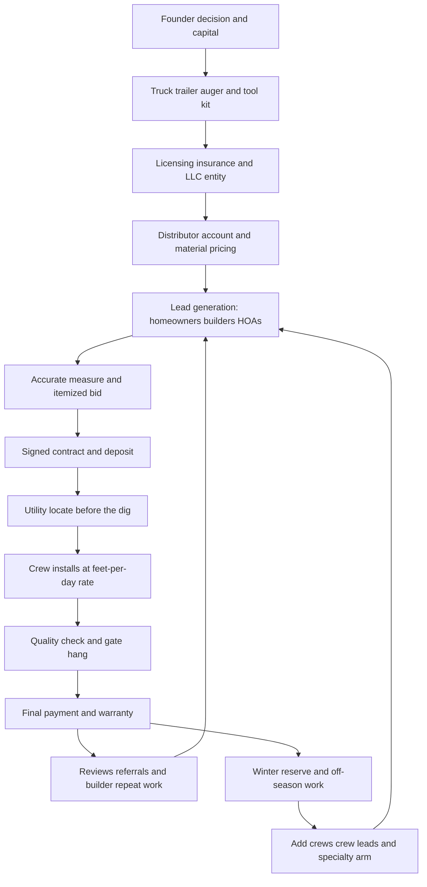

### Direct Answer

To start a fence installation business in 2027, you become a residential and commercial fence contractor: you measure a property line, sell the job on a clean itemized quote, source materials from a contractor distributor, dig postholes, set posts in concrete, build panels or pickets true and plumb, hang gates that swing for a decade, and collect a check that runs **$2,500 to $35,000+ per job**. The model is real, durable, and genuinely accessible, but its economics rest on two numbers most beginners never compute: **installed linear feet per crew per day** and the **material-cost-plus-loaded-labor versus bid-price spread** on every single job. Done with bid discipline, dig awareness, and crew quality, a disciplined founder clears **$45K-$130K in owner earnings** in Year 1 and a multi-crew company reaches **$600K-$2.1M** revenue by Year 3-5.

**TL;DR:** Fence installation is a seasonal, equipment-backed trade business built on a bidding-and-production engine. A solo founder invests **$15K-$70K** in a truck, trailer, hydraulic auger, tools, insurance, and working capital; runs at a **28-45% net margin** after materials, crew, fuel, and rework; and in a disciplined Year 1 installs **15-45 jobs** for **$90K-$320K revenue**. The three things that kill fence startups: **underbidding** (not knowing true cost per linear foot), **underestimating the dig** (rock, roots, slope, utilities turning a one-day job into three), and **weak crew and scheduling discipline** in a short, weather-hostile season. Viable in 2027 for a founder comfortable with physical outdoor work, bidding as a discipline, and builder and property-manager relationship-building; a poor fit for anyone wanting indoor, year-round, light-touch work.

## What A Fence Installation Business Actually Is In 2027

### 1.1 The core definition

A fence installation business **sells, sources, and installs perimeter fencing** -- wood privacy fence, vinyl, ornamental aluminum and steel, chain-link, wrought iron, composite, horizontal slat cedar, hog-wire and cattle-panel, split-rail, and the gates and hardware that go with all of them -- for homeowners, builders, property managers, HOAs, municipalities, farms, and commercial sites. You are **not a manufacturer and not a big-box retailer**; you are the contractor who shows up, measures the run, calls in the utility locate, digs the postholes, sets the posts in concrete, builds the fence true and plumb on uneven ground, hangs the gates so they latch for a decade, hauls the old fence away, and stands behind the work.

### 1.2 The single financial idea

The entire business is **one financial idea repeated job after job**: you bid a price per linear foot that covers material cost, loaded labor, overhead, and real profit -- and then you actually install it at or under the cost you bid. A wood privacy fence bid at thirty-two dollars a foot, costing eleven in lumber and posts and concrete and nine in loaded crew labor, leaves twelve dollars a foot of contribution before overhead; on a two-hundred-foot backyard that is **$2,400 of gross profit** on a job a two-person crew finishes in a day and a half. That is the engine. Everything else -- the truck, the auger, the distributor account, the bidding spreadsheet, the crew, the scheduling -- is the machinery that lets you run that engine repeatedly.

### 1.3 What changed by 2027

In 2027 the business is shaped by realities that sharpened over the prior decade. **Homeowners get instant online ballpark estimates** and arrive at the bid conversation already comparing three or four contractors, which rewards professionalism and punishes the contractor who cannot quote cleanly. **Material prices move** -- lumber especially, but vinyl and aluminum too -- enough that a contractor who does not price materials as a pass-through or refresh bids regularly gets caught. **The residential new-construction backlog and the steady churn of fence replacement** keep demand structurally healthy. And **labor is the binding constraint**, because a fence company is only as productive as the crews swinging the hammers and running the auger.

| Attribute | Fence installation reality in 2027 |
|---|---|
| **Core activity** | Measure, bid, source, dig, set, build, hang gates, warranty |
| **Customer base** | Homeowners, builders, property managers, HOAs, municipalities, farms |
| **Job ticket** | $2,500-$35,000+ depending on linear feet and material |
| **Season** | ~March-November in most of the US; warmer markets run year-round |
| **Binding constraint** | Skilled crew labor and feet-per-day production rate |
| **Margin profile** | 28-45% net after materials, crew, fuel, rework, overhead |
| **Barrier to entry** | Low capital and skill barrier; high bid-discipline barrier |

The honest framing: fence installation is not glamorous and not passive. It is a **seasonal, weather-exposed, physically demanding trade business**, and the founders who succeed understand it as a bidding-and-production operation -- a spreadsheet of cost per linear foot, a calendar fighting the weather, a trailer of tools, and a crew that either builds it right the first time or builds your callback list. The same trade-business logic governs adjacent home-service startups such as a painting business (q1984) and a landscaping business (q1939).

### 1.4 Why fencing is more accessible than most trades

It is worth stating plainly why a beginner gravitates to fence installation: the **capital and skill barriers are genuinely lower** than for HVAC, electrical, or plumbing. There is no multi-year apprenticeship, no journeyman license gating entry in most markets, no specialized diagnostic equipment, and no requirement to pull permits on regulated systems before the first dollar comes in. A founder with a truck, a few thousand dollars of tools, and a willingness to learn can be installing fence within weeks. That accessibility is the model's strength and, simultaneously, its central trap: **the low barrier means the competitive field is crowded with under-capitalized, under-disciplined operators**, and the only durable way to win is to be the rare entrant who treats bidding as a discipline, carries real insurance, and builds it right. The accessibility gets you in the door; the discipline keeps you in business. A founder who internalizes that distinction on day one is already ahead of most of the long tail they are competing against.

## The Material Categories And The Three Operating Models

### 2.1 What you actually install and why

The materials are the business, and the material mix you specialize in determines your margin, your crew skill requirement, and your customer base. A founder must understand every category before selling a single job.

| Material category | Margin profile | Skill / customer notes |
|---|---|---|
| **Wood privacy (cedar, PT pine, spruce)** | Thin, price-competitive | Bread-and-butter residential; forgiving install; lumber-cost exposed |
| **Vinyl (PVC) privacy & picket** | Margin-friendly upgrade | Cleaner install; 20-year low-maintenance pitch |
| **Ornamental aluminum & steel** | High, code-relevant | Pool-barrier codes require it; fast install; less price-sensitive buyer |
| **Chain-link (residential & commercial)** | Lower per-foot, high volume | Workhorse of commercial side; smooths seasonality |
| **Wrought iron & custom welded steel** | High, craft niche | Needs welding/fabrication skill |
| **Composite (Trex Seclusions and similar)** | High ticket, high margin | Premium no-maintenance lifetime product |
| **Horizontal slat & modern cedar** | Premium pricing | Slow install, designed-fence customer |
| **Hog-wire, cattle-panel, welded-wire** | Moderate | Rural-modern and agricultural market |
| **Gates & access (incl. automation)** | High-margin add-on | Crosses every material; standalone niche |

### 2.2 The strategic material choice

A founder should treat the material mix as a deliberate decision. **Wood privacy gives volume and a fast start** but the thinnest margins and the most competition; **vinyl, aluminum, composite, and horizontal slat give margin** and a less price-sensitive customer but require more skill and a stronger sales motion; **chain-link gives the commercial and builder volume** that smooths residential seasonality; and **gates and automation are the high-margin layer** on top of all of it. The Year 1 mistake is being a pure low-bid wood-privacy installer competing entirely on price, with no margin cushion when the dig goes wrong.

### 2.3 The three operating models

There are three distinct ways to build a fence business, and choosing deliberately shapes hiring, capital, and the founder's daily life.

- **Owner-operator model** -- The founder and one or two helpers run one crew, with the founder selling, measuring, ordering, and installing. **Advantage:** low overhead, high quality control, fast cash, and a genuinely good owner income at modest scale ($90K-$150K). **Limit:** the business is capped at what one crew can install.
- **Multi-crew production model** -- Scales to two, three, four or more crews, with the founder off the tools selling, estimating, scheduling, and managing crew leads. **Advantage:** real revenue scale and an enterprise that can run without the founder on a jobsite. **Challenge:** it lives or dies on crew-lead quality, scheduling discipline, and working capital.
- **Sales-and-subcontract model** -- The company sells, designs, estimates, and project-manages while subcontracting the actual installation to independent crews. **Advantage:** asset-light scaling focused on the highest-leverage activity, selling. **Challenge:** margin compression to the subs and quality control at arm's length.

Most successful operators **start owner-operator** to learn the trade, the bidding, and the local market with their own hands, then choose whether to scale into multi-crew production or stay lean. The wrong move is scaling to multiple crews before the founder has personally mastered the bid math, because then they cannot teach it, catch a crew lead's mistakes, or tell a profitable job from a losing one until the season is over.

## The 2027 Market Reality: Demand And Competition

### 3.1 Demand is structurally healthy and diversified

A founder needs an accurate read of the 2027 landscape, because fence installation is neither a recession-proof goldmine nor a saturated dead end. **Residential privacy demand is durable** -- suburban homeowners want yards enclosed, and the reasons compound:

- **Pet ownership** -- roughly two-thirds of US households own a pet, and dog ownership in particular drives containment fencing.
- **New-construction backlog** -- new homes are frequently delivered without fencing, creating a built-in backlog of fresh fence jobs behind every subdivision.
- **Pool-barrier codes** -- building codes legally require fencing around residential pools across essentially every jurisdiction.
- **HOA mandates** -- HOAs require specific fence styles and trigger replacement.
- **Storms, age, and rot** -- old fence retires on a rolling basis.

Commercial and institutional demand -- chain-link and ornamental for schools, utilities, storage, municipal, and industrial sites -- runs on its own cycle and **smooths the residential seasonality**.

### 3.2 The competition is highly fragmented

Fence installation is a classic fragmented trade. The competitive field has four layers:

| Competitor type | Strengths | How a disciplined entrant competes |
|---|---|---|
| **One-truck operators / side-hustlers** | Low number, low overhead | Out-professionalize: clean quote, real contract, real insurance |
| **Established local & regional companies** | Crews, showroom, brand, accounts | Out-respond, out-hustle, price more accurately |
| **Big-box install programs (Home Depot, Lowe's)** | National brand, financing | Direct relationship, no managed-network premium |
| **National consolidators** | Minimal -- very little national consolidation | The moat is local; the game is local |

### 3.3 What changed and the net read

By 2027, **field software** (CRM, estimating, scheduling, invoicing) made it far easier for a small operator to run a professional operation; **homeowners shop three or four bids**; and **labor scarcity** made the crew the binding constraint. The net market reality: demand is real, durable, and diversified; the business is more accessible than most trades; and the winning 2027 entrant competes on **bid accuracy, install quality, reliability, and builder and property-manager relationships** rather than on being the cheapest number in the homeowner's stack of quotes.

## The Core Unit Economics: Installed Linear Feet Per Crew Per Day

### 4.1 The metric beginners never track

This is the single most important section in the guide, because the entire business lives or dies on a production metric beginners almost never track: **installed linear feet per crew per day**, and the cost-versus-bid spread that rides on top of it. Every fence job is, at its core, a quantity of linear feet of a specific material, plus gates, installed by a crew over some number of days -- and the profitability of that job is the **bid price per foot, minus material cost per foot, minus loaded labor cost per foot, minus a share of overhead**.

### 4.2 Feet-per-day by material

| Material | Two-person crew feet/day | Relative price/ft | Per-day economics |
|---|---|---|---|
| **Wood privacy** | ~120-200 ft | Moderate | Moderate -- the volume default |
| **Chain-link** | ~200-350 ft | Lower | Strong per-day rate at lower price |
| **Ornamental aluminum** | Faster than wood | Higher | Excellent -- speed plus price |
| **Vinyl** | Moderate, clean | Higher than wood | Good |
| **Horizontal slat / custom cedar** | Slow -- skill cuts the rate | High | Good if bid correctly for the slow rate |

### 4.3 Why loaded labor cost per foot is not fixed

The discipline this imposes: **the loaded labor cost per foot is not fixed -- it is the day rate of the crew divided by the feet they install that day.** Anything that slows the dig -- rock, roots, clay, slope, utilities, removal of old fence -- directly inflates the labor cost per foot and can turn a profitable bid into a losing job.

| Crew day outcome | Feet installed | Loaded day cost | Labor cost / ft |
|---|---|---|---|
| **Good ground, smooth dig** | 160 ft | $640 | **$4.00 / ft** |
| **Hits rock, slow dig** | 70 ft | $640 | **$9.14 / ft** |

A bid that assumed the first number is **underwater** at the second. The founders who win obsess over two numbers -- the realistic feet-per-day production rate for each material on typical ground, and the true all-in material cost per foot -- and they bid every job with a **dig contingency**, because the ground is the variable they do not control.

### 4.4 The small parts beginners forget

The true material cost per foot is almost never the headline lumber or panel price. Beginners build a bid around the obvious big items -- pickets, rails, posts -- and then watch the margin erode on the parts nobody mentioned. **Concrete** for every posthole is a real, recurring cost; a 200-foot fence might use thirty or more postholes' worth. **Post caps, fasteners, screws, and nails** add up across hundreds of feet. **Gate hardware** -- hinges, latches, drop rods, cane bolts for double gates -- is disproportionately expensive per gate. **Tax on materials**, where the contractor pays it as the end consumer, is a line that quietly compounds. And the **waste factor** -- the boards that split, the offcuts, the panel that does not divide evenly into the run -- means a founder should bid materials with a small overage, not the exact theoretical quantity.

| "Small" cost line | Why it matters | Bid treatment |
|---|---|---|
| **Concrete per posthole** | Dozens of holes per job | Per-post allowance, not an afterthought |
| **Caps, screws, fasteners** | Adds up across hundreds of feet | Per-foot allowance in the material rate |
| **Gate hardware** | Expensive per gate | Priced separately, per gate |
| **Material sales tax** | Compounds silently | Built into the loaded material cost |
| **Waste / overage factor** | Splits, offcuts, uneven runs | 5-10% material overage in the bid |

The founder who bids only the headline materials and discovers the rest at the supplier counter has already given away part of the margin before the crew arrives. The disciplined founder builds a per-foot material rate for each material that **includes the small parts** and refreshes it as prices move.

## The Line-By-Line Job And Business P&L

### 5.1 A representative residential job

Take a representative job: a **200-foot, six-foot wood privacy fence** with one walk gate and one double drive gate, removal and haul-away of the old fence, bid at **$7,200**.

| Cost line | Range on this job | Notes |
|---|---|---|
| **Materials** | $2,000-$2,600 | Pickets, rails, posts, caps, concrete, fasteners, gate hardware |
| **Loaded crew labor** | $1,400-$2,200 | Wage + payroll tax + workers' comp + load/drive/locate time |
| **Old-fence removal & disposal** | Real line | Tear-out labor + dump/haul fee -- bill it, do not absorb it |
| **Fuel & vehicle** | Allocated | Truck and trailer to supplier and jobsite + maintenance/depreciation |
| **Equipment amortization** | Allocated | Auger, saws, compactor amortized across jobs |
| **Concrete & consumables** | Real | Beyond the framing materials |
| **Rework & warranty reserve** | Reserved | Callback to fix a sagging gate or heaved post |
| **Overhead allocation** | Spread | Insurance, licensing, software, marketing, bookkeeper |

### 5.2 The business-level margin and seasonality

Net it out and a healthy fence operation runs a **28-45% net margin** after materials, crew, fuel, equipment, rework, and overhead -- with the spread driven almost entirely by bid accuracy and dig outcomes. At the business level, **seasonality dominates the annual P&L**: in most of the country the build season runs roughly March through November, with December through February thin. The disciplined operator treats the peak as the period that must **fund the year**, builds a winter reserve, and uses the slow months for maintenance, bidding, builder-relationship building, and equipment repair.

The founders who fail at the P&L level made the same errors: they bid materials without a pass-through cushion and got caught by a price move; they assumed best-case feet-per-day on every job; they did not bill removal and disposal as real work; and they carried thin insurance and spent the summer cash before winter arrived.

### 5.3 Cash flow versus profit

A founder must hold two separate ideas at once: a job can be **profitable on paper and still create a cash crunch**, and a season can feel cash-rich and still be unprofitable. The cash-flow pattern of fence installation is hostile to the under-capitalized: the company **buys materials and pays the crew before the customer's final check clears**. A deposit at signing funds the materials for that job, and a progress-payment schedule keeps the company from financing the customer's fence -- but at the mid-season peak, with five or six jobs running simultaneously, the gap between cash out and cash in is real and large.

| Cash event | Timing | Implication |
|---|---|---|
| **Customer deposit** | At contract signing | Funds the materials for that job |
| **Material purchase** | Before the install | Cash out, ahead of completion |
| **Crew payroll** | Weekly, during the job | Cash out, ahead of final payment |
| **Progress payment** | Mid-job (on larger jobs) | Partial cash in |
| **Final payment** | At completion and acceptance | Cash in -- the margin is realized here |

The discipline: take a real deposit on every job, use progress payments on larger ones, keep a **business line of credit** for the seasonal swing, and never confuse the cash sitting in the account at the August peak with profit -- some of it is unspent deposit money owed to future material orders, and some of it must be reserved for taxes and winter. The founders who blow up on cash flow are usually the ones who saw a fat summer balance and treated it as earnings.

## Licensing, Insurance, And The Legal Setup

### 6.1 Licensing and permits

Fence installation sits squarely inside the contracting regulatory framework. **Licensing varies sharply by state and locality.** Some states require a general or specialty contractor license with an exam, a bond, and proof of insurance to legally bid and pull permits above certain job-value thresholds; others regulate at the city or county level; a few are relatively light-touch. **Permits** are often required -- height limits, setback rules, corner-visibility rules, pool-barrier code compliance, and HOA approval are all common -- and a professional operator pulls the permit and builds to code rather than building fast and hoping.

### 6.2 The insurance stack

Insurance is not optional. The required coverage:

| Coverage | What it does | Notes |
|---|---|---|
| **General liability** | Covers property damage and injury claims | $1M baseline; many commercial/builder clients require proof |
| **Commercial auto** | Covers the truck and trailer | Required for business vehicles |
| **Workers' compensation** | Covers employee injury | Required once there are employees; expensive in construction -- price into the loaded labor rate |
| **Inland marine / tools policy** | Covers auger, saws, trailer vs theft and damage | Protects the physical plant |

### 6.3 Entity, contracts, and the locate

Most fence contractors form an **LLC or S-corp** for liability protection and tax treatment; the entity holds the contracts, insurance, licensing, and bank account. **Contracts matter** -- a clear written contract specifying material, linear footage, gate count, property-line responsibility, change-order process, deposit and payment schedule, and warranty terms protects against scope disputes, which are common in fencing because property lines and neighbor disagreements are recurring friction points. **Utility location** -- calling the locate service before every dig -- is both a legal obligation and a practical necessity; hitting a buried utility line is a serious, expensive, dangerous event. Adjacent trades face the same compliance frame; the licensing logic for a concrete contractor business (q9619) is closely parallel.

## Equipment And Vehicles: The Physical Plant

### 7.1 The core kit

Fence installation is equipment-dependent, and the right tools are the difference between a profitable day and a brutal one.

- **The truck** -- A pickup, typically three-quarter-ton or one-ton, capable of towing a loaded trailer and carrying materials. Many founders start with a truck they already own.
- **The trailer** -- An enclosed or open utility trailer carries tools, the auger, materials, and old-fence debris; an enclosed trailer doubles as secure tool storage and a rolling advertisement.
- **The auger** -- The single most important fence-specific piece of equipment. A hydraulic auger (a skid-steer attachment, a towable unit, or a dedicated machine) or at minimum a heavy-duty two-person gas auger transforms the posthole digging that is the most labor-intensive part of every job.
- **Hand and power tools** -- Circular and reciprocating saws, miter saw, drills and impact drivers, levels, post-hole diggers and digging bars, tamping tools, string lines, a transit or laser level for long runs, wheelbarrows, a generator.
- **A plate compactor** for backfill and a concrete mixer or the discipline of mixing in the hole.
- **Safety equipment** -- the gear that keeps a crew working and out of a claim.

### 7.2 The capital priority

The discipline: **the auger is the highest-leverage purchase** because postholes are the bottleneck; the truck and trailer are non-negotiable; and the rest of the kit can be built up as revenue allows. A founder should **not under-equip the dig**, because hand-digging postholes in volume is how a one-day job becomes a three-day job and the labor-cost-per-foot math collapses. Equipment intensity is one of the things that distinguishes a fence business from a near-equipment-free service such as a handyman business (q2051).

### 7.3 Buy versus rent versus finance the auger

The auger is the one equipment decision worth thinking through deliberately, because it is the most expensive fence-specific tool and the one with the widest range of acquisition options. A founder has four realistic paths, and the right one depends on job volume and cash position.

| Auger acquisition path | Best for | Trade-off |
|---|---|---|
| **Two-person gas auger (own)** | Lean launch, low job count | Cheap, but slow and physically brutal on hard ground |
| **Towable hydraulic auger (rent)** | Occasional big or rocky jobs early | No capital tied up, but rental fees and pickup time per job |
| **Towable hydraulic auger (finance)** | Steady volume, Year 1-2 | Monthly payment, but earns from day one |
| **Skid-steer with auger attachment** | Multi-crew, rocky markets, material handling | Highest cost, but also moves materials and pulls old fence |

The reasonable default for a disciplined founder: **start with a sound two-person gas auger** if the budget is tight, **rent a hydraulic unit for the rocky or large jobs** that the gas auger cannot handle efficiently, and **finance a towable hydraulic auger or a skid-steer once job volume justifies it** -- typically by the end of Year 1 or in Year 2. The mistake at both extremes is real: a founder who never upgrades past a gas auger caps their feet-per-day on hard ground, while a founder who buys a $40,000 skid-steer in Month 1 with no job pipeline has converted scarce working capital into an idle machine.

## Materials Sourcing And The Distributor Relationship

### 8.1 Where serious contractors buy

Where and how you buy materials directly affects both your margin and your ability to bid accurately. The **big-box stores** -- Home Depot and Lowe's -- carry fence materials and run pro programs and are a convenient fill-in source, but their pricing is generally retail and not where a serious contractor sources volume. **Specialty distributors** are the real supply chain: **SiteOne Landscape Supply (SITE)**, a large publicly traded distributor that serves the fence and landscape trades, plus regional fence-specific wholesale distributors and lumber yards, offer contractor pricing, volume discounts, the full range of fence materials, and the account relationship that lets a contractor buy on terms and get materials delivered to the jobsite.

### 8.2 Manufacturer brands

Brands matter for the upgrade categories: **CertainTeed** and its Bufftech vinyl line (CertainTeed is part of **Saint-Gobain (SGO.PA)**); **Trex Fencing** from **Trex Company (TREX)**, the publicly traded decking and fencing manufacturer; **Master Halco**, a major chain-link and fence-products distributor and manufacturer; and the various ornamental aluminum and steel manufacturers. A contractor who can specify a recognized brand sells more confidently against a low-bidder using unbranded material.

### 8.3 Buying discipline

| Discipline | Why it matters |
|---|---|
| **Price materials per linear foot** | Every material you install, at current distributor pricing |
| **Refresh prices regularly** | Lumber and vinyl move; stale numbers expose the bid |
| **Buy to the contractor tier without overstocking** | Earn the discount without tying cash in idle inventory |
| **Quote materials as a transparent pass-through** | A price spike does not eat the margin |
| **Use jobsite delivery** | Converts crew time from driving to installing |

The strategic point: the distributor relationship is a **competitive asset** -- accurate pricing makes bids accurate, terms ease the working-capital crunch, and delivery converts crew time from driving to installing.

## Bidding And Estimating: The Skill That Decides Everything

### 9.1 The estimate starts with an accurate measure

Bidding is the single highest-leverage skill in a fence business, because the price is set before the first posthole and a bad bid cannot be fixed on the jobsite. **The estimate starts with an accurate measure.** The founder walks the property line, measures the linear footage precisely, counts and locates the gates, identifies corners and ends and the terrain -- slope, grade changes, rock, root systems, existing fence to remove, equipment access, and where the utilities run. A bid built on a rough measure or a satellite-image guess is a bid built on sand.

### 9.2 Layering the true costs

The estimate then layers the true costs:

- **Material cost per linear foot** for the specific material at current distributor pricing.
- **Gate hardware and gate materials priced separately** because gates are labor-intensive and high-cost.
- **Loaded labor cost** based on a realistic feet-per-day production rate for that material on that terrain -- not the best-case rate.
- **Old-fence removal and disposal** as a real, visible line.
- **Equipment and fuel allocation.**
- **A dig contingency** because the ground is the uncontrolled variable.
- **Overhead allocation and the target profit margin.**

### 9.3 The disciplines that separate survivors

| Estimating discipline | Failure it prevents |
|---|---|
| **Never assume best-case production** | Feet-per-day collapse on hard ground |
| **Always add a dig contingency** | Rock/clay/root surprises eating the margin |
| **Price gates and removal separately and visibly** | Giving away the two most expensive parts |
| **Refresh material prices regularly** | Getting caught by a lumber or vinyl move |
| **Use a change-order process** | Scope creep absorbed instead of billed |
| **Track actual job cost vs the bid** | The estimating never getting more accurate |
| **Walk away from the losing job** | A busy calendar with an empty bank account |

The output is a **clean, professional, itemized quote** -- in 2027 the homeowner is comparing three or four bids, and the professional presentation itself wins jobs against the contractor with a number on a notepad. **Estimating software** -- the field-management platforms that combine CRM, estimating, scheduling, and invoicing -- makes professional, consistent, fast quoting possible for a small operator and is worth adopting early.

## Crew Building, Labor, And The Production Engine

### 10.1 The crew is the production engine

A founder can run the smallest fence operation nearly solo with one helper, but the business does not scale without crews, and labor is the binding constraint on how much fence a company can install. A fence crew -- typically two to four people -- digs, sets, builds, and hangs; the company's **revenue capacity is, quite literally, the number of crews times the feet-per-day each crew installs times the days in the season.**

### 10.2 Labor is the hardest part of the business

Skilled fence installers are scarce, the work is physically demanding and weather-exposed, and the seasonality complicates staffing. Operators solve this with **a reliable year-round core, seasonal hires, returning crew from prior seasons, and above-market pay plus production bonuses** to retain the good ones. Turnover is expensive: a trained crew that installs fast and clean is worth far more than a cheap crew that installs slow and generates callbacks.

### 10.3 Crew quality drives margin, and the hiring sequence

**Crew quality directly drives margin and reputation.** A skilled crew installs more feet per day (lowering labor cost per foot), builds plumb and true (avoiding callbacks), hangs gates that swing for a decade, and represents the company well at the customer's home. The **crew lead** is the critical role as the company scales -- the person who runs the crew, reads the bid, manages the dig, and is accountable for the job.

| Stage | Hire added | Purpose |
|---|---|---|
| **Year 1** | One or two helpers | Get one crew running with the founder |
| **Year 2** | Second crew + first crew lead | Add capacity, start moving founder off tools |
| **Year 2-3** | Estimator / salesperson | Keep the crews fed with accurate bids |
| **Year 3+** | Office / scheduling person | Coordinate multiple crews, locates, deliveries |
| **Year 4+** | Yard / operations manager | Run the production side day to day |

The strategic point: fence installation is a production business, the crew is the production line, and the operators who recruit well, pay well, train well, and retain their best crews have a structural advantage. The labor-as-binding-constraint logic is shared across the trades; the route-and-crew capacity question for a lawn care business (q1149) is the same arithmetic in a different uniform.

### 10.4 Pay structure and retention

How a founder structures crew pay is a strategic lever, not an afterthought, because retention is the cheapest productivity gain available. A straight hourly wage with no upside rewards a crew for moving slowly -- the longer the job, the more hours billed. The operators who get the most fence per day build a pay structure that **aligns the crew's incentive with the company's**:

- **Above-market base pay** -- the floor that attracts experienced installers and keeps them from leaving for a competitor over a small raise.
- **Production bonuses** -- a per-job or per-foot bonus when a job is completed on schedule and passes the quality check, so the crew is rewarded for installing fast *and* clean, not just fast.
- **Season-completion or loyalty pay** -- a retention bonus for crew who return for the next season, because rehiring a known good crew in March is worth far more than training a stranger in May.
- **Quality gate on the bonus** -- the production bonus is contingent on passing the quality check, which prevents the crew from chasing speed at the cost of callbacks.

The math is straightforward: a callback consumes a crew-day of capacity at peak season and produces zero revenue, so a pay structure that costs a little more in base and bonus but cuts callbacks and turnover pays for itself many times over. The founders who treat crew as an interchangeable, minimum-cost input rebuild their crews every season and never escape the slow-and-sloppy productivity trap.

## Scheduling, Weather, And Seasonality

### 11.1 The season is real and unforgiving

In most of the United States the build season runs roughly **March through November**, with the heart of it in the warm months; December through February is thin -- the ground freezes, concrete does not cure well in the cold, and digging in frozen or saturated ground is slow and sometimes impossible. **Warmer-climate operators** -- the South and Southwest -- run closer to year-round and have a structural advantage in cash-flow smoothness.

### 11.2 Weather and the scheduling puzzle

Weather disrupts even the season: rain saturates the ground and stops digging and concrete work; heat slows the crew; a wet stretch can back up the schedule for weeks. **Scheduling is a logistics puzzle** -- jobs must be sequenced by geography to minimize drive time, by material so the right crew runs the right work, by the utility-locate lead time, and by material delivery timing.

| Season phase | Months (typical US) | Operating focus |
|---|---|---|
| **Ramp** | March-April | Spring backlog, first installs, crew rehire |
| **Peak** | May-September | Maximum crew throughput; fund the year |
| **Wind-down** | October-November | Finish booked work, build winter reserve |
| **Off-season** | December-February | Maintenance, bidding, builder relationships, commercial work |

### 11.3 Seasonal cash discipline

The seasonal cash discipline is the same as in any seasonal trade: **the peak season must fund the year**, the operator builds a winter reserve from the summer cash, and the slow months are for equipment maintenance, builder-relationship building, bidding the spring backlog, and -- in warmer markets -- commercial and ornamental work that runs cold. The founders who misjudge seasonality assume the busy summer is the normal run rate, spend the cash, and cannot cover winter costs.

## Startup Cost Breakdown: The Honest All-In Number

### 12.1 The line-item launch budget

Fence installation is more accessible than most trades, but under-capitalization on working capital still kills startups.

| Startup line | Lean launch | Fuller launch |
|---|---|---|
| **Vehicle (truck)** | $0 (owned) | $35,000+ used 3/4- or 1-ton |
| **Trailer (open or enclosed)** | $2,000 | $12,000 |
| **Auger / post-setting equipment** | $1,500 (2-person gas) | $25,000+ (towable hydraulic / skid-steer) |
| **Hand & power tools** | $3,000 | $8,000 |
| **Safety equipment** | $300 | $1,000 |
| **Licensing, bond, business formation** | $500 | $4,000 |
| **Insurance (GL, auto, tools)** | $2,000 | $8,000 |
| **Marketing & website** | $1,000 | $5,000 |
| **Field-management software** | Modest monthly | Modest monthly |
| **Initial materials & working capital** | $8,000 | $30,000 |
| **Off-season reserve** | Included above | Included above |
| **Approximate all-in total** | **$15,000-$30,000** | **$45,000-$120,000+** |

### 12.2 Financing and the capital filter

Financing softens the vehicle and equipment lines -- equipment financing is normal and the assets earn from day one -- but the founder still needs **real cash for the working capital**, because the business floats materials and labor ahead of customer payment on every job and faces a seasonal cash gap. The capital requirement is the key filter: fence installation is one of the more accessible trade businesses to start, which is exactly why the discipline matters, because the low barrier to entry means the founder's competition includes a lot of under-capitalized, under-disciplined operators -- and the way to beat them is to not be one.

## The Year-One Operating Reality And The Five-Year Trajectory

### 13.1 Year 1 is calibration mode

Year 1 is **trade-learning, bid-calibrating, and reputation-building mode, not profit-maximizing mode.** The first season is spent learning the real feet-per-day production rates on local ground, discovering how the dig behaves in the local soil, calibrating the bidding spreadsheet against actual job costs, building the first builder and property-manager relationships, and accumulating the reviews and referral base that generate the next season's work. A disciplined Year 1 fence startup -- founder plus one or two helpers, one crew, launched with real equipment and a working-capital cushion -- can realistically install **15-45 jobs** and generate **$90,000-$320,000 in revenue** against **$45,000-$130,000 in owner earnings**.

### 13.2 The five-year revenue arc

| Year | Crews | Founder role | Revenue | Owner earnings |
|---|---|---|---|---|
| **Year 1** | 1 | On the tools, bid-calibrating | $90K-$320K | $45K-$130K |
| **Year 2** | 1-2 | Partly off tools, selling & estimating | $250K-$600K | $70K-$180K |
| **Year 3** | 2-3 | Off tools, selling & managing | $500K-$1.1M | $110K-$280K |
| **Year 4** | 3-4 | Managing, building accounts | $800K-$1.6M | $140K-$350K |
| **Year 5** | 3-5+ | Running a production company | $1.1M-$2.1M | $160K-$420K |

These numbers assume disciplined bidding, dig-aware estimating, real crew investment, and a respected seasonal reserve; they **do not assume exponential growth**, because fence installation scales with crews, crew leads, and the length of the season, not magically. The owner-operator who deliberately stays at one or two crews is **not failing** -- a lean one-or-two-crew business clearing $90K-$200K for the owner with low overhead and high control is a genuinely good outcome and a legitimate end state.

## Five Named Real-World Operating Scenarios

### 14.1 The scenario distribution

Concrete scenarios make the model tangible. These five span the realistic distribution: disciplined owner-operator success, underbidding failure, profitable niche, deliberate multi-crew scaling, and scale-too-fast collapse.

### 14.2 The five scenarios

- **Scenario one -- Marcus, the disciplined owner-operator.** Launches with $24K -- his own three-quarter-ton truck, a used enclosed trailer, a two-person gas auger, a solid tool kit, real insurance, a clean website -- and one experienced helper. He measures every job in person, bids off a spreadsheet with true material costs and a dig contingency, prices removal and gates separately, and refreshes lumber prices monthly. Installs 38 jobs in Year 1 for $260K revenue and clears about $105K, then adds a hydraulic auger and a second helper for Year 2 and reaches $480K with strong margins.
- **Scenario two -- Cody, the cautionary tale.** Starts cheap, bids by matching whatever number wins the job, assumes every dig is easy, and does not price removal or gates separately. His calendar is packed all summer and he feels successful, but a string of rocky-soil jobs and a lumber price spike he did not pass through mean he ends the season having installed $210K of fence and kept almost nothing -- then has no winter reserve.
- **Scenario three -- Priya, the ornamental and gate specialist.** Skips the price-war wood-privacy market and builds a business focused on ornamental aluminum pool enclosures and automated gate operators -- code-required, higher-margin, less price-sensitive customers. Becomes the go-to in her metro for pool-barrier and gate-automation work; smaller job count but high margins, $420K revenue by Year 3.
- **Scenario four -- the Delgado brothers, multi-crew production company.** One brother sells and estimates, one runs operations and crew leads. They spend Years 1-2 calibrating the bid process and building two reliable crews, then scale deliberately to four crews by Year 4 with disciplined scheduling and a builder-account base, reaching $1.4M revenue.
- **Scenario five -- Trent, the scaled-too-fast casualty.** Has a good owner-operator Year 1, gets excited, and jumps to three crews in Year 2 before he has trained crew leads or calibrated his bidding. The crews he cannot supervise install slow and sloppy, the bids he did not calibrate lose money at triple the volume, callbacks pile up, and he is forced back to one crew having burned his cash and his reputation.

## Lead Generation: Builders, Property Managers, And The Referral Engine

### 15.1 The residential demand-capture channel

Fence installation is partly a marketing business and partly a relationship business. The **residential demand-capture channel** is real and direct: homeowners search for fence contractors, request online estimates, and compare bids, so a fence company needs a professional website with photos of completed work and clear material information, strong local search and map presence, presence on the contractor-marketplace and review platforms, and lettered vehicles and yard signs that turn every completed job into advertising.

### 15.2 The relationship channels

| Channel | What it generates | Why it matters |
|---|---|---|
| **Reviews & referrals** | The compounding individual-job engine | A fence is visible; a clean install brings the neighbor over |
| **Builder relationships** | Repeating volume jobs | New homes need fencing; durable, scheduled work |
| **Property managers & HOAs** | Steady replacement work | Portfolios of aging fence that must meet standards |
| **Real estate agents** | Pre-sale and new-buyer referrals | Homes readied for sale, new buyers wanting fence |
| **Commercial GCs** | Subcontracted commercial fence | Off-season-smoothing chain-link and ornamental work |
| **Pool builders & landscapers** | Natural referral partners | A pool needs a code fence; a landscape job often includes one |

### 15.3 The strategic point

The residential demand-capture channel generates the steady individual jobs and the referral compounding, while the relationship channels generate the **volume and the off-season-smoothing** commercial and replacement work. A fence company that relies purely on the cheapest-bid homeowner job competes on price forever; one that builds builder and property-manager relationships has a defensible, repeating flow of work. The referral-and-reviews engine works the same way for a deck staining business (q2054) and a roofing business (q1946).

## Quality, Callbacks, Warranty, And Risk Management

### 16.1 The quality stakes and common failures

A fence is a **visible, long-lived product** -- seen by the customer every day, by every neighbor, and by everyone who drives past. A crooked run, a sagging gate, a heaved post, or a panel that does not line up is a permanent advertisement against the company. The common quality failures are specific and avoidable:

- **Posts not set deep enough or in enough concrete**, so they heave or lean.
- **Gates hung without proper bracing or hardware**, so they sag and stop latching.
- **Runs not strung and laid out true**, so the fence wanders.
- **Inadequate compaction of backfill.**
- **Building over an unconfirmed property line**, triggering a neighbor dispute and a tear-out.

### 16.2 The full risk map and mitigation

Every major risk in fence installation has a known mitigation.

| Risk | Mitigation |
|---|---|
| **Underbidding** | Disciplined estimating, true cost data, dig contingencies, job-cost tracking |
| **Dig risk (rock, roots, utilities)** | Utility locate before every dig, site probing, dig contingency, change orders |
| **Liability** | General liability insurance, careful work practices, the locate |
| **Workers' comp / injury** | Workers' comp insurance, safety practices, training, strain-reducing equipment |
| **Vehicle & equipment** | Commercial auto and inland-marine tools policy |
| **Material price moves** | Pass-through pricing, regular bid refreshes, no speculative inventory |
| **Seasonality / cash flow** | Off-season reserve, weather-tolerant commercial and ornamental work |
| **Scope & property-line disputes** | Thorough contract, confirmed lines, documented change-order process |
| **Callbacks & warranty** | Install standards, a quality check before the crew leaves, a reserve |
| **Crew & labor** | Above-market pay, production bonuses, training, crew leads |

### 16.3 Warranty as a sales asset

The **warranty itself is a sales asset and a discipline** -- a clear, honest written warranty (workmanship plus the manufacturer's material warranty) wins jobs against the fly-by-night low bidder, and standing behind it builds the referral base. The **property-line issue deserves its own discipline** -- a contractor who confirms the line, documents it in the contract, and advises the customer to communicate with the neighbor avoids the tear-out-and-rebuild that destroys a job's profitability.

## Counter-Case: When A Fence Installation Business Is The Wrong Move

### 17.1 The honest case against starting

Most of this guide explains how to make a fence business work. Intellectual honesty requires the opposite section: there are real, specific situations in which a 2027 founder should **not** start this business, and recognizing yourself in them is a gift, not a failure.

- **You want indoor, year-round, even cash flow.** Fence installation is weather-exposed, seasonal, and concentrated in a March-November window in most of the country. If your financial life cannot absorb a thin December-February, this is the wrong model.
- **You will not treat bidding as a discipline.** Bidding is the skill that decides everything. A founder unwilling to measure accurately, know true costs, add dig contingencies, and track job costs against bids will underbid into failure no matter how hard they work.
- **You are under-capitalized on working capital.** The business floats materials and crew ahead of customer payment on every job. A founder with no cushion and no line of credit hits the mid-season peak unable to buy materials or make payroll -- a busy calendar and an empty bank account.
- **You cannot do, or hire for, physical outdoor labor.** This is a truck-trailer-auger-crew trade. Year 1 has the founder on the tools in the heat on hard ground. If that is not viable for you and you cannot pay for it, the model misfits.
- **Your local market is thin or the ground is brutal.** Limited new construction, little suburban replacement, and soil that is mostly rock change the economics. A founder must verify local demand and workable ground before committing.

### 17.2 The adjacent-business off-ramp

The counter-case is not always "do nothing." A founder who answers no on **physical temperament specifically** may fit the **sales-and-subcontract model** -- selling and project-managing while subcontracting the install -- or an estimating-and-project-management role, better than the on-the-tools owner-operator path. A founder who answers no on **capital or bidding aptitude** should genuinely not start; those are not temporary obstacles. And a founder drawn to home services but not to fencing's seasonality and dig risk may prefer a less weather-bound, less equipment-heavy service. The honest verdict: fence installation rewards a specific person -- comfortable with physical outdoor work, the rhythm of a season, running a crew, and the bidding discipline -- and badly misfits anyone wanting indoor, year-round, light-touch work.

| Counter-case signal | Honest recommendation |
|---|---|
| **Needs even year-round income** | Choose a less seasonal trade or build a winter commercial arm first |
| **Won't master bidding** | Do not start -- underbidding is the top business-killer |
| **No working-capital cushion** | Do not start until capitalized; the seasonal float is unavoidable |
| **Cannot do/hire physical labor** | Consider the sales-and-subcontract model instead |
| **Thin local market / brutal soil** | Verify demand and ground before committing capital |

## Specialty Paths, Scaling, And The 2027-2030 Outlook

### 18.1 Niche and specialty paths

For many operators a **focused niche** is the better business than the general residential model.

| Specialty path | Why it works |
|---|---|
| **Ornamental aluminum & pool-barrier** | Code-driven, high margin, less price-sensitive buyer |
| **Automated gates & access control** | High margin, skill-differentiated, upscale demand |
| **Commercial & high-security chain-link** | Volume-driven, steadier cycle, smooths seasonality |
| **Horizontal slat & modern cedar** | Premium pricing for design-skill operators |
| **Custom welded steel & wrought iron** | Craft niche with real margin for fabrication skill |
| **Agricultural & acreage fencing** | Distinct rural and semi-rural market |
| **Composite privacy fence** | High-ticket no-maintenance upgrade |
| **Repair & replacement specialization** | Steady churn, good margins on smaller jobs |

The strategic point: the general residential model is the most accessible starting point, but the wood-privacy core is the most price-competitive part of the market. Many mature operators run a **residential core with one high-margin specialty arm** layered on top. The mistake is being a pure low-bid wood-privacy installer forever. An operator with welding skill should also study the standalone economics of a custom welding fabrication business (q9593).

### 18.2 Scaling past the first season

The jump to a multi-crew production company is its own distinct challenge. The prerequisites for scaling: the founder must have **personally mastered the bid math and the install**; the install must be systematized into standards a crew can follow; the bidding must be calibrated against real job-cost data; and the working capital plus a line of credit must absorb floating materials and payroll across many simultaneous jobs.

| Scaling lever | What it does |
|---|---|
| **Add crews and crew leads** | A multi-crew company is only as good as its crew leads |
| **Move the founder off the tools** | The founder's highest-leverage work is bids and accountability |
| **Build builder & property-manager accounts** | Keeps multiple crews fed with work |
| **Systematize scheduling** | Coordinates geography, materials, and locates across crews |
| **Invest in field-management software** | Lets a small office run multiple crews |
| **Add the office and operations layer** | Scheduling, estimating support, bookkeeping |

### 18.3 Financing, taxes, exit, and the outlook

**Financing** -- equipment financing fits the truck, trailer, and auger; a **business line of credit** bridges the seasonal working-capital swing; **customer deposits** fund the materials for each job. **Taxes** -- most contractors form an LLC or S-corp; depreciation on the truck, trailer, and auger materially shapes taxable income; sales-tax treatment of materials varies by state; worker classification (W-2 versus 1099) is a real compliance issue. **Exit** -- a fence company with trained crews, established accounts, a strong review base, sound equipment, and clean books is a saleable asset valued as a multiple of stabilized earnings, with the multiple driven by how non-owner-dependent the operation is; the equipment also has real resale value as a floor.

**The 2027-2030 outlook:** demand stays structurally healthy (privacy, pets, pool codes, new construction, HOAs, replacement); material costs stay variable, keeping bid discipline essential; labor stays the binding constraint; the material mix keeps shifting toward higher-margin upgrades (vinyl, aluminum, composite, slat); software keeps professionalizing the small operator; and gate automation keeps growing as a high-margin layer. The version that thrives is a **professional operation that bids accurately, prices materials as a pass-through, invests in crews, builds relationships, and sells the higher-margin upgrades**. The version that struggles is the under-capitalized, underbidding, dig-blind, pure-low-bid wood-privacy operator. A 2027 founder who builds the former is building a real, equipment-backed trade business with a multi-year runway -- and the same disciplined-trade logic applies to a painting contractor business (q9618), a landscaping company (q9678), and a gutter installation business (q9616).

## The Final Framework: Building It Right From Day One

### 19.1 The decision self-assessment

A founder deciding whether to commit should run a structured self-assessment, because this model fits a specific person and badly misfits others.

| Decision dimension | The honest question |
|---|---|
| **Capital** | Do you have $15K-$30K for a lean launch with a working-capital cushion -- or equipment financing plus cash for working capital and reserve? |
| **Physical & trade temperament** | Are you willing to run a truck-trailer-auger-crew trade, on the tools in Year 1, in the heat? |
| **Bidding aptitude** | Will you treat estimating as a discipline -- accurate measure, true costs, dig contingencies, job-cost tracking? |
| **Seasonality tolerance** | Can you operate a business that earns most of its money March-November and reserve summer cash for winter? |
| **Relationship orientation** | Will you build builder, property-manager, and referral relationships rather than chasing cheapest-bid jobs? |
| **Local market fit** | Is there enough fence demand in your area, and is the local soil and climate workable? |

### 19.2 The verdict

If a founder answers **yes across all six dimensions**, a fence installation business in 2027 is a legitimate and achievable path -- to a $90K-$200K owner-operator income or, with deliberate scaling, a $600K-$2M+ multi-crew company with $130K-$420K in owner profit. If they answer **no on capital or bidding aptitude**, they should not start. If they answer **no on physical temperament specifically**, the sales-and-subcontract model or an estimating-and-project-management role may fit better.

The throughline of the entire guide: fence installation is a **bidding-and-production trade business**. The founders who succeed treat Year 1 as paid tuition -- calibrating the bid math, the feet-per-day production rates, the crew, and the customer base -- and build install standards, a real insurance stack, a working-capital cushion, and builder and property-manager relationships from day one. The founders who fail expected easy money from a low-barrier business and were unprepared for the bidding skill, the brutal digs, the heat, the seasonality, and the callbacks. Build it as the disciplined, bid-accurate, dig-aware, crew-driven, relationship-built operation, and it is a real, durable, equipment-backed business with multiple genuine exit paths.

## How The Fence Business Engine Fits Together

## Sources

1. US Census Bureau -- New Residential Construction and housing completions data.
2. US Census Bureau -- County Business Patterns, fencing and specialty trade contractors.
3. US Bureau of Labor Statistics -- Occupational Outlook, construction laborers and fence erectors.
4. US Bureau of Labor Statistics -- Producer Price Index, lumber and wood products.
5. US Bureau of Labor Statistics -- Producer Price Index, plastics and vinyl products.
6. US Bureau of Labor Statistics -- Producer Price Index, aluminum mill shapes.
7. American Pet Products Association -- National Pet Owners Survey, pet-ownership penetration.
8. International Code Council -- International Residential Code, residential pool barrier requirements.
9. International Code Council -- International Swimming Pool and Spa Code.
10. US Small Business Administration -- Equipment financing and small-business loan programs.
11. US Small Business Administration -- 7(a) and microloan program guidance.
12. Internal Revenue Service -- Publication 946, How To Depreciate Property.
13. Internal Revenue Service -- Section 179 expensing and bonus depreciation guidance.
14. Internal Revenue Service -- Independent contractor versus employee classification guidance.
15. US Department of Labor -- Fair Labor Standards Act, worker classification.
16. Occupational Safety and Health Administration -- Trenching and excavation safety standards.
17. Common Ground Alliance -- 811 "Call Before You Dig" utility locate program.
18. SiteOne Landscape Supply -- Investor relations and product-category disclosures.
19. Trex Company -- Investor relations and Trex Fencing product line.
20. Saint-Gobain / CertainTeed -- Bufftech vinyl fence product documentation.
21. Master Halco -- Chain-link and fence product distribution catalog.
22. The Home Depot -- Installed fence services and pro program disclosures.
23. Lowe's Companies -- Professional services and installed-fence program.
24. National Association of Home Builders -- Housing market and new-construction outlook.
25. US Census Bureau -- Survey of Construction, characteristics of new single-family homes.
26. Joint Center for Housing Studies, Harvard University -- Improving America's Housing report.
27. US Bureau of Economic Analysis -- Residential fixed investment data.
28. Insurance Information Institute -- Commercial general liability and commercial auto coverage.
29. National Council on Compensation Insurance -- Workers' compensation class codes, construction trades.
30. American Fence Association -- Industry standards, training, and contractor resources.
31. US Small Business Administration -- Choosing a business structure (LLC and S-corp guidance).
32. Federal Trade Commission -- Guidance on consumer contracts and home-improvement services.
33. National Association of State Contractors Licensing Agencies -- State contractor licensing frameworks.
34. US Department of Energy / building code resources -- Local permitting and setback requirements overview.

### Related Pulse Entries

For founders comparing adjacent trade and home-service models, see the painting business guide (q1984), the landscaping business guide (q1939), the deck staining business guide (q2054), the roofing business guide (q1946), the concrete contractor guide (q9619), the gutter installation guide (q9616), the handyman business guide (q2051), the custom welding fabrication guide (q9593), and the one-truck crew route-density analysis (q1149).
