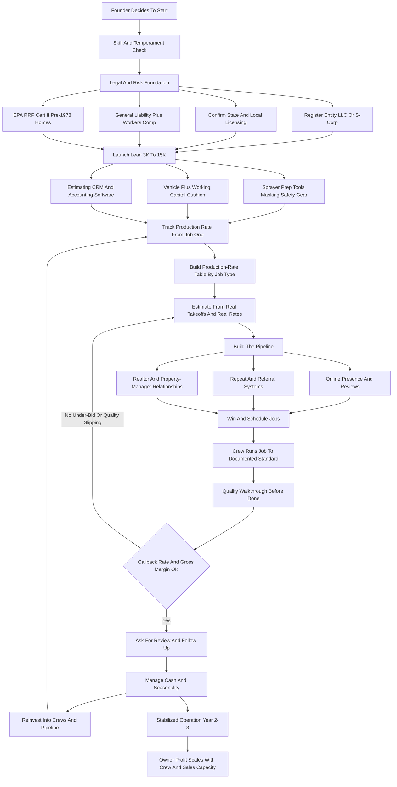

### Direct Answer

To start a painting business in 2027, you build a surface-preparation and coating service company that bills labor and materials on a per-square-foot or per-project basis while the real money is made on **production rate** -- the square footage a crew finishes per labor hour -- and on **repeat-and-referral density**, not on chasing one-off jobs forever. It is genuinely low-barrier (a disciplined solo-plus-helper launch runs **$3,000-$15,000**) and brutally easy to run badly, which is exactly why the trade is crowded with under-priced operators who confuse being busy with being profitable. Done with discipline, a 2027 painting business is a legitimate path to a comfortable **$80K-$160K owner-operator income** or a scaled **$300K-$1.5M multi-crew company** with real enterprise value.

**TL;DR:** A painting business prepares and coats interior walls, exterior siding, cabinets, decks, and commercial spaces, selling labor, expertise, and a visible result. Year 1 for a disciplined solo-plus-helper operation realistically generates **$70K-$220K revenue** at a **35-55% gross margin**, throwing off **$45K-$110K in owner pay**; by Year 2-3 a 2-3 crew operation reaches **$300K-$900K revenue** with **$90K-$260K owner profit**. The three things that kill painting startups: pricing by gut instead of production rate, living job-to-job with no pipeline, and under-managing crew quality so a referral engine becomes a complaint engine. Real 2027 players span franchises -- CertaPro Painters, Five Star Painting, 360 Degree Painting, WOW 1 DAY Painting, Fresh Coat Painters -- and tens of thousands of independents, all buying from Sherwin-Williams (NYSE: SHW), Behr (Masco, NYSE: MAS via Home Depot, NYSE: HD), Benjamin Moore (Berkshire Hathaway, NYSE: BRK.B), and PPG (NYSE: PPG). Viable in 2027 for the disciplined, production-rate-obsessed, pipeline-driven operator; a poor fit for anyone who wants to avoid sales or managing labor.

## 1. What A Painting Business Actually Is In 2027

A painting business is a surface-preparation and coating service company. You and your crews show up at a residential or commercial property, protect everything that should not get paint on it, prepare the surfaces that will -- scraping, sanding, patching, caulking, priming -- and apply finish coats of paint or stain to a standard the customer can see and a competitor can be judged against. You sell labor, expertise, materials, and a result, and the result is unusually visible: a homeowner stands six inches from your cut line at the ceiling and either trusts you or never calls you again.

### 1.1 The Core Definition And Why Visibility Changes Everything

**The product is judged at arm's length.** Unlike a furnace install hidden in a closet or a plumbing repair behind a wall, painting work is on permanent public display in the customer's own home. That single fact reshapes the entire business: quality control is not a department, it is the growth engine; a sloppy cut line is not a minor defect, it is a referral lost and possibly a one-star review gained. The operators who internalize this treat every job as a marketing asset, and the operators who do not treat every job as a future complaint.

**Knowing how to paint is the price of entry, not the business.** The business is bidding accurately, scheduling tightly, managing a crew to a quality standard, and building a pipeline so the phone rings without a fight every week. A skilled painter who cannot estimate, sell, or manage labor has a painting *job*, not a painting *company* -- and the gap between those two things is where most failures happen. The trade attracts a steady stream of capable craftspeople who were good employees for another company, decided they could keep the margin their boss was taking, and discovered that the boss's margin was paying for estimating accuracy, a marketing engine, insurance, a working-capital float, and the unglamorous administrative work that keeps a crew fed. The craft was never the hard part. The company around the craft is.

**The work splits into clean segments with different economics.** Interior repaints, exterior repaints, new-construction builder work, cabinet and specialty refinishing, and commercial maintenance each have their own customer, sales cycle, margin, and seasonality. A founder who treats "painting" as one undifferentiated thing will accidentally let the market decide their mix -- taking whatever calls first -- instead of deliberately building a portfolio. The single most useful early reframe is this: you are not in the painting business, you are in the *bidding, scheduling, and crew-management* business, and painting is the visible output of doing those three things well.

### 1.2 What Changed By 2027

Several realities now shape the trade that did not fully exist a decade ago:

- **Customers find and vet painters online.** Google reviews, Angi, Thumbtack, Nextdoor, and a company website are the storefront. A painter with no digital footprint is invisible to a large share of the market.
- **Customers expect a clean, itemized, often digital estimate** and the ability to pay by card or financing -- not a number scrawled on a business card.
- **Labor is more expensive and harder to find,** making crew retention and production efficiency the squeeze point.
- **Paint chemistry and tools kept improving** -- better low-VOC and zero-VOC products, better sprayers, better masking systems -- raising both the quality floor and the customer's baseline expectation.

The painting business is not glamorous and it is not passive. It is a sales-estimating-and-labor-management business wearing coveralls.

| Old reality | 2027 reality | Operator implication |
|---|---|---|
| Word of mouth only | Public, permanent online reviews | Reputation is a measurable asset |
| Handwritten quotes | Digital itemized estimates | Estimate is a sales document |
| Cheap, available labor | Scarce, expensive labor | Retention is a competitive edge |
| High-VOC products | Low/zero-VOC, durable coatings | Higher baseline quality expectation |
| Paper calendar | CRM and estimating software | Small operators bid like big ones |

## 2. The Service Segments And Business Models

A founder must understand the segments before choosing where to compete, because each has a distinct customer, sales cycle, margin profile, and seasonality.

### 2.1 The Five Service Segments

**Interior repainting** -- walls, ceilings, trim, doors in occupied homes -- is the bread-and-butter residential segment: year-round, weather-independent, relationship-driven, with customers who care intensely about cleanliness and tidy cut lines. **Exterior repainting** -- siding, trim, soffits, fascia, decks, fences -- is higher-ticket and weather-dependent, concentrated in warm-and-dry months, with heavier prep and real ladder-and-height labor. **New-construction and builder work** is volume work at thinner margins, paid on builder timelines, valuable for keeping crews busy but dangerous to depend on. **Cabinet and specialty refinishing** -- spraying kitchen cabinets, built-ins, furniture-grade finishes -- is a high-skill, high-margin niche commanding premium pricing. **Commercial and property-management maintenance** -- offices, retail, apartments, common areas, multifamily turns, HOA exteriors -- trades the emotional residential sale for contract-driven, repeatable, schedulable volume.

| Segment | Ticket size | Seasonality | Margin profile | Sales motion |
|---|---|---|---|---|
| Interior repaint | Low-mid | Year-round | Solid, referral-dense | Emotional, in-home |
| Exterior repaint | Higher | Warm/dry months | Strong in season | Emotional, curb-appeal |
| New construction | Volume, thin | Builder-driven | Thinnest, volume-dependent | Builder relationship |
| Cabinet / specialty | Mid-high | Year-round | Highest, premium-priced | Skill-and-portfolio |
| Commercial / property mgmt | Contract-based | Year-round | Moderate, recurring | Bid plus vendor relationship |

A founder should treat these as a portfolio with different risk and reward: interior repaints for steady year-round cash and referral density, exterior repaints for higher tickets in season, cabinets and specialty for margin, commercial and property management for predictable recurring volume. The Year-1 mistake is chasing all five at once with one solo crew, or depending entirely on whichever segment happened to call first.

**Each segment also has a different failure mode.** Interior work fails on cleanliness and communication -- the customer is home, watching, and a dust-covered coffee table or a careless step on the carpet undoes a technically perfect paint job. Exterior work fails on weather optimism -- bidding a tight schedule that the first rainy week destroys, then chasing the season's backlog into October. New-construction work fails on concentration -- one builder who pays slowly or slows down can empty a schedule that felt secure. Cabinet work fails on finish quality -- a furniture-grade expectation met with a wall-paint process produces an expensive, visible disappointment. Commercial work fails on bidding discipline -- competitive bids attract operators who win on price and lose on the actual hours. A founder who knows the failure mode of each segment can decide which risks they are equipped to manage.

### 2.2 The Three Business Models

**The owner-operator crew model** is the founder plus a helper or two, with the founder estimating, selling, often painting, and managing the day. Its advantage is low overhead, tight quality control, fast payback, and a genuinely good owner income; its ceiling is the founder's own hours. **The multi-crew company model** scales beyond the founder: multiple crews with leads, a dedicated estimator, an office function, and a marketing engine. Its advantage is real revenue and enterprise value -- a sellable business; its challenge is that it is a different job. **The specialty niche model** goes deep on one high-skill segment -- cabinet refinishing, historic restoration, commercial coatings, multifamily turns -- and becomes the regional go-to. Its advantage is pricing power and a clear identity; its challenge is a narrower market.

| Model | Revenue ceiling | Owner role | Enterprise value | Best fit |
|---|---|---|---|---|
| Owner-operator crew | $80K-$220K | Paints, sells, estimates | Low (a job) | Low-stress, low-overhead founder |
| Multi-crew company | $300K-$1.5M+ | Manages people and pipeline | High (a sellable asset) | Founder who wants to build |
| Specialty niche | $200K-$700K | Master craftsperson plus owner | Moderate-high | Founder with deep skill |

The wrong move is staying an owner-operator crew by default -- never deciding -- and being permanently surprised that the income has a ceiling. Many operators start as an owner-operator crew, prove they can estimate and manage, then choose whether to scale or specialize. A cabinet-focused painter, for example, shares much of its economics with the cabinet refacing trade (q9628).

**The choice is not permanent, but it is consequential.** An owner-operator who later decides to scale will need to rebuild the business around systems they never documented, develop crew leads they never trained, and create a sales engine that previously lived entirely in the founder's head -- all while still running the existing crew. It is far easier to build for the eventual model from the start: an owner-operator who *might* scale should document standards, track production rates rigorously, and keep clean books from day one, even if they never use any of it, because the cost of doing so is small and the cost of retrofitting it is large. The specialty path, similarly, rewards an early decision -- the operator who commits to cabinets in Year 1 builds a portfolio, a process, and a reputation two years before the generalist who pivots later. The model you choose is less about which is "best" and more about which life you want and which one your local market will pay for.

## 3. The 2027 Market Reality

A founder needs an accurate read of the landscape, because painting is neither the effortless cash machine some pitch nor a saturated dead end.

### 3.1 Demand Is Large And Structurally Durable

There are roughly 145 million housing units in the United States plus a vast commercial building stock, and paint is a maintenance item, not a one-time purchase. **Interiors get repainted on a rough 5-10 year cycle, exteriors on a 4-10 year cycle** depending on climate and substrate. Demand is renewed by home sales (pre-listing prep and new-owner refreshes), insurance and restoration work, new construction, and commercial tenant turnover. The work cannot be offshored, cannot be fully automated, and does not disappear in a downturn so much as shift -- homeowners delay, but property managers and insurers keep going.

### 3.2 The Competition Is Bifurcated And Crowded At The Bottom

At the top of most metros sit established multi-crew companies and franchise units with real marketing budgets, professional estimating, and reputations. At the bottom is a vast long tail of solo painters, side hustlers, and unlicensed or uninsured operators competing almost entirely on price. **The opportunity for a disciplined new entrant is to be visibly more professional than the long tail** -- licensed and insured where required, responsive, clean, on-time, with a real estimate and a real warranty -- without the overhead of the regional giant.

| Market tier | Who they are | How they compete | New-entrant opportunity |
|---|---|---|---|
| Top | Multi-crew firms, franchise units | Brand, marketing, reputation | Hard to displace early |
| Middle | Established independents | Referrals, repeat customers | The target to join, then pass |
| Bottom | Solo, side-hustle, uninsured | Lowest price only | Refuse this price war |

### 3.3 The Real 2027 Operators And Supply Chain

Real players span franchises -- **CertaPro Painters** (FirstService Brands), **Five Star Painting** and **360 Degree Painting** (Neighborly), **WOW 1 DAY Painting**, and **Fresh Coat Painters** (Strategic Franchising) -- plus tens of thousands of local independents. All buy from the same supply chain: **Sherwin-Williams** (NYSE: SHW), whose own stores are a contractor backbone; **Benjamin Moore** (owned by Berkshire Hathaway, NYSE: BRK.B), premium-positioned through a dealer network; **Behr** (Masco Corporation, NYSE: MAS), sold exclusively through Home Depot (NYSE: HD); **PPG Industries** (NYSE: PPG); and **Valspar**, which Sherwin-Williams acquired in 2017. The 2027 entrant who succeeds competes on professionalism, reliability, accurate bidding, and pipeline -- not on being the cheapest quote in the inbox.

## 4. The Core Unit Economics: Production Rate

This is the single most important section, because the entire profitability of a painting business lives or dies on one number most beginners never track.

### 4.1 What Production Rate Is And Why It Is Everything

**Production rate is how much finished, acceptable work a painter completes per labor hour.** Everything about pricing, bidding, scheduling, and profit flows from it. An experienced painter rolling and cutting interior walls in a typical occupied home might cover **150-250 square feet of wall per labor hour** on a standard repaint; trim and doors are far slower (a six-panel door, brushed two coats with prep, can eat 30-60 minutes); ceilings are slower than walls; heavy-prep exterior work might run **60-120 square feet per labor hour**; cabinet spraying is measured in doors and drawer fronts per day, not square feet.

The number that matters is not the published average -- it is *your crew's actual rate on this kind of job*, which you only know by tracking hours against completed scope on every job.

| Surface / task | Indicative production rate | Why it varies |
|---|---|---|
| Interior wall, standard repaint | ~150-250 sq ft per labor hour | Cut-heavy rooms, helper speed |
| Interior ceiling | Slower than walls | Overhead work, more taping |
| Trim, doors, detail | A door = ~30-60 min, 2 coats | Detail, dry time between coats |
| Exterior, heavy prep plus 2 coats | ~60-120 sq ft per labor hour | Scrape, sand, prime, height, access |
| Cabinet spraying | Doors/drawer fronts per day | Furniture-grade finish, booth setup |

### 4.2 The Catastrophic Cost Of Bidding By Gut

Here is why production rate is everything. If you bid a 2,000-square-foot interior repaint assuming your crew covers 200 sq ft of wall per hour, and they actually cover 130 because of cut-heavy rooms and a slow helper, **you have under-bid the labor by more than 50%, and labor is your largest cost.** The job that "felt" profitable loses money, and you do not find out until payroll.

The discipline this imposes: **track labor hours against scope on every single job, build a production-rate table for your crew across job types, and bid from that table -- never from a feeling.** A painter who knows their real production rate prices to a target gross margin and hits it; a painter who bids by gut is gambling on every job and calling the wins luck and the losses bad customers.

**Building the table is mechanical, not mysterious.** On every job the crew records start and stop times against a defined scope -- this many square feet of wall, this many doors, this much trim, this prep condition. Over the first dozen jobs a pattern emerges: your crew covers a real number on light-prep occupied interiors, a slower number on cut-heavy rooms, a slower number still on exteriors with scraping. Within a season the founder has a table that predicts labor hours within a tight band, and the bid stops being a guess. The painters who never build this table are not lazy -- they are usually too busy painting to track, which is exactly the trap, because the tracking is what makes the next bid profitable enough to afford a helper who frees up the time. **Production rate also reveals which crew members and which job types to favor:** a helper who is fast on prep but slow on cut work should be assigned prep; a job type where your rate is poor and your competition is fierce should be priced high enough to deserve or politely declined.

### 4.3 The Second Core Metric: Callback Rate

The second core metric is **callback and rework rate** -- because every hour spent fixing holidays (thin or missed spots), drips, missed areas, and over-spray is unpaid labor that comes straight out of margin and reputation. Production rate tells you what to charge; callback rate tells you whether the crew is actually delivering what you charged for. A meaningful callback rate quietly eats the margin the production-rate math worked to build.

## 5. The Line-By-Line P&L

Beyond production rate, a founder must internalize the job-level and company-level P&L, because revenue is not profit and the gap is where painters quietly fail.

### 5.1 Anatomy Of A Representative Interior Repaint

Take a whole-floor refresh -- walls, ceilings, and some trim -- billed at roughly **$4,500**. The costs stack in an order beginners underestimate.

| Line item | Share of price | Notes |
|---|---|---|
| Paint and materials | 10-20% | 15-30 gallons across coats plus consumables |
| Labor (wages plus burden) | 30-45% | The line production rate governs |
| Job-specific costs | Variable | Rental, dump fees, permits, subcontract |
| Allocated overhead | 15-25% | Truck, insurance, software, marketing, office |
| Owner net margin | 15-30% | What is left after everything above |

**Paint and materials** -- gallons of finish and primer, caulk, spackle, sandpaper, tape, masking film, brushes and rollers consumed -- run a real **10-20% of job price**. **Labor** is the largest cost by far, landing around **30-45% of price** on a properly bid job; this is the line production rate governs and the line under-bidding destroys. **Job-specific costs** -- equipment rental for tall exteriors, dump fees, permits, a small drywall or carpentry subcontract -- come off the top. **Overhead** the job must help carry includes the truck, general liability and workers' comp insurance, estimating and CRM software, marketing, the phone, the office, and eventually an estimator's or office manager's salary.

### 5.2 The Margins That Define A Healthy Operation

A healthy painting operation runs a **35-55% gross margin after paint and labor**, with a **net margin to the owner-operator commonly in the 15-30% range** depending on overhead and how much the owner is also the labor. The failure pattern is consistent: the painter who looks at a $4,500 job and a $700 paint bill and thinks they "made $3,800" forgot labor burden, the truck, the insurance, the no-show that cost a half-day, the gallon of the wrong sheen, and the marketing that bought the lead. The operators who survive run the full P&L on every job and every month.

**Labor burden is the most commonly underestimated number.** A painter paid $25 per hour does not cost the business $25 per hour -- they cost payroll taxes, workers' compensation premium (a real percentage in a trade with a meaningful injury classification), any benefits, paid drive time, and the unbillable hours of setup, cleanup, and travel. The fully-burdened cost of a $25-per-hour painter can land well north of $30 per hour, and bidding labor at the raw wage rather than the burdened rate quietly under-prices every job. **The second hidden cost is the unbillable day** -- the rain-out, the customer who reschedules, the half-day lost to a paint-store run because materials were not staged. These do not appear on any invoice, but they consume crew payroll and must be carried by the jobs that do bill. A founder who prices as though every paid hour is a billed hour will run a chronic, invisible deficit.

### 5.3 The Monthly Company P&L

Beyond individual jobs, the founder must run a monthly company P&L that sums all job revenue, subtracts all materials and burdened labor, subtracts the fixed overhead (vehicle, insurance, software, marketing, office, any salaried staff), and reveals the true owner profit.

| Monthly P&L line | Healthy share of revenue | Warning sign |
|---|---|---|
| Materials | 10-20% | Above 22% suggests waste or wrong products |
| Burdened labor | 30-45% | Above 50% suggests under-bidding or slow crews |
| Fixed overhead | 15-25% | Above 30% suggests overhead outran revenue |
| Owner profit | 15-30% | Below 12% suggests the model is leaking |

The monthly view catches what job-level math misses: an overhead structure that grew faster than revenue, a marketing spend that is not converting, or a slow month that the busy-season balance is quietly masking. The discipline is to read this statement every month, not once a year at tax time.

## 6. Licensing, Insurance, And Legal Setup

A founder must get the legal and risk foundation right before the first paid job, because it is cheap to do upfront and ruinous to skip.

### 6.1 Licensing And Registration

Licensing varies by state and locality, and a founder must check their own jurisdiction directly. **Some states require a contractor's license for painting above a dollar threshold** (often involving an exam, bond, and proof of insurance), some require only a registration, and some require nothing at the state level but a local business license. Lead-paint work on pre-1978 housing brings the federal **EPA Renovation, Repair, and Painting (RRP) Rule** certification requirements into play -- a real, enforced obligation for anyone disturbing painted surfaces in older homes.

### 6.2 The Insurance Stack

Insurance is non-negotiable. A **general liability policy** -- commonly written at a $1M-per-occurrence level -- covers property damage and bodily injury claims: over-spray on a neighbor's car, a ladder through a window, a spill on a hardwood floor. **Workers' compensation** is legally required in most states the moment you have employees and is strongly advisable even earlier; painting is a real injury trade. **Commercial auto** covers the work vehicle. Many general contractors, property managers, and commercial clients will not let you on site without certificates of insurance, so coverage is also a sales gate.

| Coverage | What it protects against | When required |
|---|---|---|
| General liability ($1M) | Property damage, third-party injury | Before first job; client gate |
| Workers' compensation | Crew injury (falls, fumes, strain) | Legally, once you have employees |
| Commercial auto | Work vehicle accidents | Once a vehicle is in service |
| Surety bond | Contract performance | Where state licensing requires |

### 6.3 Entity And Contracts

Most painters form an **LLC or S-corp** for liability separation and tax flexibility; the entity holds the insurance, signs the contracts, and separates business and personal risk. **Contracts matter:** a clear written agreement specifying scope, surfaces, number of coats, products, exclusions, change-order process, payment schedule, and warranty terms turns a vague customer expectation into an enforceable, dispute-resistant job. This foundation costs a few hundred to a few thousand dollars and is the difference between a business and a liability.

## 7. Startup Costs And Equipment

A founder needs a clear-eyed total of what it costs to launch, because painting's famously low barrier is real but the "$0 to start" version is a fantasy that ends in a callback you cannot afford to fix.

### 7.1 The Honest All-In Startup Number

| Startup line item | Lean launch | Fuller launch |
|---|---|---|
| Spray equipment (airless, hoses, tips) | $400-$800 | $800-$1,500 |
| Prep and application tools | $800-$1,500 | $1,500-$2,500 |
| Masking, protection, safety gear | $500-$1,000 | $800-$1,400 |
| Vehicle | $0 (existing) | $5,000-$25,000 |
| Insurance (GL plus first workers comp) | $1,000-$2,000 | $2,000-$4,000 |
| Licensing, registration, EPA RRP | $200-$1,000 | $1,000-$2,000 |
| Entity, legal, software | $400-$1,200 | $1,200-$3,000 |
| Website, branding, initial marketing | $1,000-$2,500 | $2,500-$5,000 |
| Working capital cushion | $3,000-$5,000 | $5,000-$10,000 |
| **Total** | **~$3,000-$8,000** | **~$12,000-$40,000** |

A lean launch using an existing vehicle can come in around **$3,000-$8,000**; a fuller launch with a dedicated van and real marketing runs **$12,000-$40,000**. The point is not that painting is expensive to start -- it is one of the most accessible trades -- but that the version which skips insurance, the contract, the working-capital cushion, and the marketing is not a cheaper business, it is a fragile one.

### 7.2 Equipment And Materials: What You Buy And Why

**The airless sprayer** is the production multiplier -- it lays finish on exteriors, cabinets, fences, and large interior surfaces far faster than a brush and roller. **Brushes and rollers** remain essential for cut lines, trim, and detail; good brushes meaningfully outperform cheap ones. **Prep tools** -- sanders, scrapers, putty knives, caulk guns, heat guns, power washers -- because prep is most of the labor and almost all of the durability. **Ladders and access** -- step ladders, extension ladders, and as you scale, scaffolding or lifts -- with the safety gear that goes with height. **Masking and protection** -- drop cloths, plastic, masking film and applicators, quality tape -- because the difference between a professional and an amateur is often the masking.

| Category | Examples | Why it matters |
|---|---|---|
| Spray equipment | Airless sprayer, hoses, tips, guns | Production rate on large surfaces |
| Brushes and rollers | Quality brushes, frames, sleeves | Cut quality and detail speed |
| Prep tools | Sanders, scrapers, power washer | Durability and the bulk of labor |
| Access | Step and extension ladders, scaffold | Reach on exteriors and ceilings |
| Masking and protection | Drop cloths, film, tape, plastic | Prevents the callback that wasn't paint |

The strategic point: tools are a production-rate investment and materials are a reputation investment. Cheap tools cost you labor hours; cheap or wrong materials cost you callbacks -- and both come straight out of margin.

## 8. Pricing, Estimating, And Lead Generation

Pricing is where painting businesses are won and lost, and the pipeline is where they are sustained.

### 8.1 Estimating: The Make-Or-Break Skill

A founder must treat estimating as the core professional skill, not a quick guess before a handshake. **The foundation is the takeoff** -- physically measuring or carefully assessing the job: wall and ceiling square footage, linear feet of trim, number and type of doors and windows, condition and prep required, substrate, access difficulty, number of colors and coats. **From the takeoff you build the bid in parts:** materials at your cost; labor as scope divided by your real production rate times your fully-burdened labor cost; job costs (rental, dump, permit, subcontract); then overhead and profit -- a deliberate markup, not an afterthought.

| Bid component | How it is built | Common error |
|---|---|---|
| Materials | Gallons plus consumables at cost | Forgetting consumables |
| Labor | Scope divided by production rate, burdened | Gut estimate, ignoring trim speed |
| Job costs | Rental, dump, permit, subcontract | Ignoring access difficulty |
| Overhead and profit | Deliberate target-margin markup | Applying no markup at all |

**The estimate itself is a sales document** -- in 2027 it should be clean, itemized, professional, often delivered digitally, specifying products, coats, surfaces, exclusions, and warranty. A vague estimate invites disputes; a professional one wins jobs against the scribbled-number competitor. Never let the desire to win a job push the number below the math -- a job won at a loss is worse than a job lost.

### 8.2 Lead Generation: Building The Pipeline So Monday Is Not Zero

Painting is a sales business as much as a trade business, and operators who fail almost always fail at "where does the next job come from." The pipeline has layers.

- **Online presence and reviews** are the 2027 foundation -- a real website, a fully built-out Google Business Profile, and a growing base of genuine reviews on Google, Angi, Thumbtack, and Nextdoor. Reviews are a public, compounding trust asset.
- **Repeat and referral customers** are the highest-margin leads and the goal of the whole business -- a deliberate follow-up system turns one job into a stream.
- **Realtor and home-stager relationships** generate pre-listing and post-sale work on a steady cadence; this overlaps directly with the home staging trade (q1938 covers the cleaning side of move-prep).
- **Property managers, multifamily owners, and HOAs** are the recurring-revenue pillar -- once you are the trusted vendor, unit turns and exterior work repeat on a schedule.
- **General contractors and builders** feed new-construction and remodel volume.
- **Local marketing** -- yard signs, vehicle lettering, neighborhood door-hangers -- builds visible local presence cheaply.
- **Lead-generation platforms and paid ads** can prime the pump early but are the most expensive and least loyal leads -- a supplement, not a strategy.

| Lead source | Cost | Loyalty | Role |
|---|---|---|---|
| Reviews and online presence | Low | High | Compounding foundation |
| Repeat and referral | Near-zero | Highest | The goal of the business |
| Realtor / property-manager | Relationship time | High | Steady, professional cadence |
| Builders / GCs | Relationship time | Moderate | Volume, thinner margin |
| Local marketing | Low-moderate | Moderate | Cheap local visibility |
| Paid lead platforms | Highest | Lowest | Early pump-primer only |

The discipline: treat lead generation as a permanent core function with multiple channels, weighted toward the compounding sources. The painter who only sells when not painting lives in a permanent feast-or-famine cycle.

**The follow-up system is what converts a lead source into a pipeline.** A Google review does nothing on its own; a review-request text sent the day after every completed job, every time, builds the review base. A satisfied interior customer does not automatically call back for the exterior; a reminder at the right time -- "your exterior is approaching its repaint cycle" -- turns one job into two. A realtor relationship decays without contact; a quarterly check-in keeps the painter top of mind when the next listing needs pre-sale work. In 2027 this follow-up runs on CRM software that triggers the message automatically, so the founder does not have to remember. The operators who win on lead generation are rarely the ones spending the most on ads -- they are the ones who built a disciplined, automated follow-up motion around the cheap, compounding sources and simply never let a satisfied customer drift away.

**Speed of response is itself a conversion lever.** A homeowner who requests three quotes and gets a same-day callback from one painter, a next-day callback from another, and silence from the third has effectively chosen before the estimates are even built. A founder who answers the phone, returns messages within hours, and books the site visit promptly wins jobs against more skilled painters who treat the phone as an interruption. Painting is a sales business, and responsiveness is free.

## 9. Hiring, Crews, And The Operational Engine

A founder can run a solo operation alone, but the business does not scale -- and the income ceiling does not lift -- without a crew.

### 9.1 Hiring And Managing Crews

**The first hire is usually a helper or apprentice** -- someone to handle prep, masking, cleanup, and simpler application while the founder does cut work, customer communication, and estimating. **Scaling up** means building crews of two to four, each ideally with a lead or foreman who can run the job to standard without the founder present -- and that handoff is the hardest and most important transition in the business.

**Crew quality directly drives margin and reputation.** A skilled crew hits the production rate you bid, masks cleanly, cuts sharp lines, and leaves the site tidy; a sloppy crew misses the production rate (turning a profitable bid into a loss), generates callbacks, and turns a referral customer into a one-star review. Labor scarcity in 2027 makes retention a genuine competitive advantage -- operators who pay fairly, keep crews busy through the slow season, and offer a path to lead keep the talent that lets them bid confidently.

| Pay structure | How it works | Trade-off |
|---|---|---|
| Hourly | Fixed rate per hour | Predictable for worker, weak production incentive |
| Day-rate | Fixed rate per day | Simple, can reward slow work |
| Piece-rate per job | Pay tied to job completion | Strong speed incentive, quality risk |
| Production-based | Pay tied to measured output | Aligns speed and earnings, needs tracking |

**Subcontracting versus employees** is a real decision with legal and tax implications a founder must get right rather than assume. **Systems make crews scalable** -- written prep and application standards, a job checklist, a quality walkthrough before "done." A crew running to a documented standard produces a consistent result, and consistency is the entire brand.

**The founder-to-crew-lead handoff is the make-or-break transition.** As long as the founder is the only person who can run a job to standard, the business is capped at the founder's hours and cannot survive the founder being sick, selling, or on a site visit. The unlock is a crew lead -- a painter who can read the scope, manage a helper, hit the production rate, run the quality walkthrough, and represent the company in the customer's home, all without the founder present. Developing that person takes deliberate effort: ride-along training, gradually handed-off responsibility, a documented standard to point to, and pay and a title that make the role worth keeping. Founders who skip this -- who keep every job dependent on themselves -- discover that they have built a high-paying job with no exit, not a company. The crew lead is the single hire that converts an owner-operator into a business owner.

**Treating crew well is an economic strategy, not a soft one.** In a 2027 labor market where skilled painters are scarce, a crew that stays is a crew you can bid around confidently; a crew that churns means constant retraining, inconsistent quality, and production rates you cannot predict. Paying fairly, keeping people busy and paid through the slow season where possible, providing decent equipment, and offering a real path to lead or foreman are not generosity -- they are the mechanism by which a founder protects the production-rate table and the callback rate that the entire P&L depends on.

### 9.2 Scheduling, Workflow, And Materials Staging

The job lifecycle runs: lead in, site visit and takeoff, estimate built and presented, job sold and scheduled, materials ordered and staged, crew dispatched, prep, paint, quality walkthrough, customer walkthrough and sign-off, final invoice, follow-up and review request.

**Scheduling is a constant puzzle** -- interior work flexes year-round, exterior work compresses into the dry-and-warm window, weather moves jobs on short notice. The operator sequences work realistically, builds buffer for weather and overruns, and communicates proactively. **Materials staging** -- having the right paint, in the right colors and sheens, in the right quantity, at the job before the crew -- prevents the single most common production-rate killer: the crew standing around or driving to the paint store. **Software runs the modern engine** -- CRM and estimating platforms hold the leads, build estimates, schedule crews, track job costs, and trigger follow-ups.

### 9.3 Seasonality And Cash Flow

Exterior work concentrates heavily in warm, dry months while interior work is year-round, producing a busy, cash-rich warm season and a thinner, tighter cold season. The disciplined operator leans into interior, cabinet, and commercial work to fill cold months; builds a cash reserve during the busy season to carry fixed costs; keeps core crew engaged year-round; and books exterior backlog ahead.

**The cash-flow shape is its own challenge** -- a painter often buys the paint and pays the crew before the customer pays the invoice, so even a profitable, growing business can be cash-tight. This is why deposits, progress payments on larger jobs, prompt invoicing, and easy customer payment options matter. Never confuse a busy-season bank balance with year-round profitability.

## 10. The Five-Year Trajectory And Operating Reality

A founder should walk into Year 1 with accurate expectations, because the gap between the marketed and real versions of this business is where most quitting happens.

### 10.1 The Year-One Operating Reality

Year 1 is **skill-building on two fronts at once -- the trade and the business -- not profit-extraction mode.** The founder is simultaneously painting (or closely supervising), learning real production rates by tracking hours against scope, discovering which bids were accurate, building first reviews and referral relationships, figuring out scheduling and weather, and handling every function from sales to invoicing personally. A disciplined Year-1 solo-plus-helper operation, launched with real insurance and a real pipeline effort, can realistically generate **$70,000-$220,000 in revenue** against **$45,000-$110,000 in owner pay**. The founders who succeed treat Year 1 as paid tuition; the ones who fail expected the income without the business-building.

### 10.2 The Five-Year Revenue Arc

| Year | Operation | Revenue | Owner profit/pay | Founder role |
|---|---|---|---|---|
| Year 1 | Solo plus helper | $70K-$220K | $45K-$110K | Doing everything |
| Year 2 | Adds second crew | $200K-$450K | $70K-$160K | Selling, estimating, managing |
| Year 3 | 2-3 crews with leads | $300K-$700K | $90K-$220K | Managing the business |
| Year 4 | Crew plus commercial/specialty arm | $500K-$1.1M | $140K-$300K | Owner-manager |
| Year 5 | Mature multi-crew company | $700K-$1.5M | $180K-$380K | Owner; decides scale or sell |

These numbers assume disciplined production-rate-based bidding, a real pipeline, controlled callbacks, and managed cash flow. They branch sharply: **the owner-operator who deliberately stays a one-crew operation can earn a comfortable $80K-$160K indefinitely** with low stress and low overhead -- a completely legitimate outcome -- while the founder who scales is building enterprise value and a sellable asset. The trajectory you get depends on the model you chose on purpose.

### 10.3 Owner Lifestyle: What It Actually Feels Like

In **Year 1**, the founder is genuinely in the work -- on the brush and ladder much of the day, then estimating in the evenings, returning calls, ordering paint, chasing invoices. By **Year 2-3**, with crews and crew leads, the day shifts toward estimating, selling, scheduling, and managing people -- less brush, more business -- a transition that is jarring for founders who got into painting because they liked painting. By **Year 3-5**, running a multi-crew company, the founder is largely a manager and owner. The income is real and can become substantial, but it is earned -- never passively.

## 11. The Operating Journey: From Launch To Stabilized Operation

## 12. Quality Control, Risk, And Franchise Decisions

In painting the product is visible, the customer is often standing right there, and the business model rests on a reputation that one sloppy job can dent.

### 12.1 Quality Control, Callbacks, And Reputation

**The callback is the enemy of margin.** Every return trip to fix holidays, drips and runs, fuzzy cut lines, over-spray, or a sheen mismatch is unpaid labor and lost confidence. **Quality is built in prep and process, not fixed at the end** -- thorough surface prep, clean masking, the right product, correct technique, adequate dry time and coats. **The walkthrough is the control point** -- a crew-lead quality check before "done," then a deliberate customer walkthrough. **Documentation protects both sides** -- the contract spec and before-photos turn "I expected more" into a clear conversation. **Reviews are the scoreboard,** and **the warranty** -- a clear, reasonable workmanship warranty -- is both a sales tool and a forcing function for doing it right the first time.

### 12.2 Risk Management And Insurance

| Risk | Primary mitigation |
|---|---|
| Property damage (over-spray, spills) | Careful masking, trained crews, general liability |
| Crew injury (falls, fumes, strain) | Safety gear, training, workers' compensation |
| Lead-paint exposure (pre-1978) | EPA RRP certification, compliant practices |
| Cash-flow gap | Deposits, progress payments, working-capital reserve |
| Under-bidding | Production-rate-based estimating, job-cost tracking |
| Reputation (bad review, callback) | Quality control, real warranty |
| Client concentration | Diversified pipeline across segments |

Every major risk in painting has a known mitigation built from insurance, safety practice, contracts, and operating discipline. The operators who fail are usually the ones who carried no general liability, skipped workers' comp, used no contract, or bet the whole schedule on one client.

### 12.3 Franchise Versus Independent

**The franchise path** -- CertaPro, Five Star, 360 Degree Painting, WOW 1 DAY, Fresh Coat -- provides a recognized brand, a proven operating and estimating system, training, marketing support, and supplier relationships, in exchange for a franchise fee, ongoing royalties, and the loss of full independence. **The independent path** means building your own name, systems, and reputation from zero -- more uncertainty and self-taught lessons, lower ongoing cost, full control and ownership.

| Factor | Franchise | Independent |
|---|---|---|
| Startup speed | Faster, structured | Slower, self-taught |
| Brand | Recognized from day one | Built from zero |
| Ongoing cost | Franchise fee plus royalties | Lower, no royalties |
| Control and ownership | Constrained | Full |
| Enterprise value | Someone else's brand equity | Yours entirely |

Neither is universally correct. What is universally true: the franchise does not remove the core work -- you still have to estimate accurately, manage crews, build a pipeline, and run the P&L.

## 13. Taxes, Scaling, And Specialty Paths

### 13.1 Taxes And Business Structure

Most painting businesses operate as an **LLC or S-corp**; the S-corp election becomes worth examining as owner profit grows. **Payroll and worker classification** is a central, high-stakes issue -- misclassifying employees as contractors to dodge payroll taxes and workers' comp is a common, dangerous shortcut. **Sales tax** treatment of painting labor and materials varies by jurisdiction and must be confirmed locally. **Deductible expenses** are substantial -- paint, vehicle costs, equipment, insurance, software, marketing, the home office, and crew wages. **Estimated quarterly taxes** apply to owner profit and should be planned. The discipline: separate business banking from day one, run a real bookkeeping system, get worker classification right with professional help, and confirm local sales-tax treatment.

### 13.2 Scaling Past The First Crew

The prerequisites for scaling: a real, validated production-rate table and accurate bidding (do not scale a business that loses money per job); a documented prep-and-application-and-quality standard; a pipeline generating more qualified leads than one crew can serve; and the cash flow plus reserve to float a second crew before their jobs pay. The scaling levers: **promote or hire crew leads** (the central unlock), **systematize everything**, **hire a dedicated estimator**, **add an office function**, **build the marketing engine**, and **consider a commercial or property-management division** for recurring volume.

### 13.3 Niche And Specialty Paths

| Specialty path | Why it appeals | Trade-off |
|---|---|---|
| Cabinet and millwork refinishing | High-skill, premium pricing | Narrower market, booth setup |
| Historic and restoration painting | Well-paid, low competition | Requires deep expertise |
| Commercial and industrial coatings | Contract-driven, schedulable | Different competitive set |
| Multifamily and property-management turns | Recurring-revenue machine | Speed and consistency at volume |
| Deck and exterior wood finishing | Steady seasonal add-on | Weather-dependent, prep-heavy |
| Decorative and faux finishes | Pricing power, craft identity | Needs genuine artistic skill |

The general residential model is a perfectly good business but competes in the most crowded part of the market. The specialty paths can deliver materially better margins -- a deck-focused operation, for instance, shares much of its economics with the deck staining trade (q2054). The mistake is not choosing a focus; it is being mediocre and undifferentiated across everything and competing only on price.

## 14. Counter-Case: When A Painting Business Is The Wrong Move

Honesty requires naming the cases where starting a painting business in 2027 is a mistake -- because the model badly misfits a specific kind of founder.

### 14.1 The "Good Painter, No Business" Trap

The single most common failure is the skilled painter who believes "I can paint" equals "I can run a painting company." Consider **Derek**, the canonical cautionary tale: he starts with no insurance, no contract, and gut-based bidding. He wins a busy first summer on low prices, but his crew's real production rate is far below what he assumed, half his jobs lose money on labor he never tracked, an over-spray claim he cannot cover scares him, and he ends a busy year exhausted, behind on payment, and no richer. If a founder will not make estimating a core skill and will not sell continuously, painting is the wrong business -- they want a painting *job* working for someone else.

### 14.2 The Seasonality Casualty

Consider **Tanya**: she builds a solid business and a strong $90K-grossing summer, but treats the busy-season bank balance as profit, spends it, fills none of the cold months with interior or commercial work, and cannot make payroll and the van payment through a dead January-February. A profitable operator wiped out by an entirely predictable, entirely unplanned-for seasonal gap. A founder with no cash-flow discipline and no appetite for off-season planning should not start a weather-exposed service business.

### 14.3 When The Math Or The Market Says No

| Counter-case scenario | Why painting is the wrong move |
|---|---|
| Founder refuses to sell or estimate | Painting is a sales business; they will starve |
| No working-capital cushion at all | One slow month or slow-paying client ends it |
| Market is pure price-war with no mid-tier | Professionalism cannot win where only price matters |
| Founder wants passive income | Income is earned through physical then management work |
| Cannot or will not manage labor | The business cannot scale past the founder's own hours |
| Physical limitations incompatible with the trade | Year 1 is genuinely physical, weather-exposed work |

The honest framing: painting is neither an effortless cash machine nor a saturated dead end. It rewards exactly one kind of founder -- the disciplined operator who treats knowing how to paint as the price of entry and knowing how to run a painting company as the actual job. For the founder who wants to avoid sales, avoid managing labor, or earn passively, the counter-case is decisive: do not start this business.

### 14.4 The Saturated-Market Caveat

There is also a market-level counter-case worth naming. In some metros the painting trade is so densely contested -- a long tail of low-priced operators, several aggressive franchise units, and established independents who already own the referral relationships -- that a new entrant with no differentiation faces a brutal first two years simply finding enough work at a price that covers the math. The answer is not necessarily to abandon the idea but to refuse the undifferentiated entry: in a crowded market, a founder should enter through a niche the long tail does not serve well (cabinet refinishing, historic work, commercial coatings) or through a relationship channel the franchises under-serve (a specific property-management portfolio, a builder relationship). A generalist residential repaint launch into a saturated market with no edge is the version most likely to end as a price-war casualty. The founder who cannot articulate, before launch, *why a customer would choose them over the twenty other options* is not ready -- and "I do good work" is not an answer, because so does the competition, and the customer cannot see the work until after they have chosen.

## 15. The Decision Framework And Final Playbook

### 15.1 Should You Actually Start This In 2027

A founder deciding whether to commit should run a structured self-assessment.

| Dimension | The honest question | Pass condition |
|---|---|---|
| Skill | Can you or a lead produce professional-quality work? | Sharp cut lines, clean coverage, proper prep |
| Sales willingness | Will you sell and estimate continuously? | Estimating treated as a core skill |
| Business temperament | Can you run a P&L, cash flow, payroll, people? | Yes -- because by Year 2 that is the job |
| Capital | Do you have $3,000-$15,000 for a disciplined launch? | Includes insurance and a cash cushion |
| Physical and seasonal reality | Ready for physical work and a seasonal rhythm? | Yes, with off-season planning |
| Local market fit | Enough repaint volume; a mid-tier to compete in? | Yes, not a pure price-war market |

If a founder answers yes across all six, a painting business in 2027 is a legitimate and achievable path -- to a comfortable $80K-$160K owner-operator income, or a $300K-$1.5M multi-crew company with $90K-$380K in owner profit. If they answer no on sales willingness or business temperament, they may want a painting *job* rather than a painting *business*.

### 15.2 The Twelve-Step Build Order

A founder who wants to succeed should execute in this order:

1. **Get honest about skill and temperament** -- confirm professional-quality work is possible and that you will sell, estimate, and manage.
2. **Set the legal and risk foundation** -- register the entity, confirm licensing, get general liability and workers' comp, get EPA RRP certified if touching older homes, build a real contract.
3. **Launch lean but not fragile** -- $3,000-$15,000 covering sprayer, tools, masking, vehicle, insurance, software, marketing, and a working-capital cushion.
4. **Track production rate from job one** -- log labor hours against scope on every job.
5. **Make estimating a core skill** -- real takeoffs, labor bid from real production rates, deliberate overhead and profit markup.
6. **Build the pipeline as a permanent function** -- online presence and reviews, repeat and referral systems, realtor and property-manager relationships.
7. **Build quality control in** -- thorough prep, clean masking, quality walkthroughs, a real warranty, callback rate driven down.
8. **Hire and systematize crews deliberately** -- start with a helper, develop crew leads, document the standard.
9. **Manage cash and seasonality** -- fill the slow season, structure payments, hold a reserve.
10. **Decide your model on purpose** -- owner-operator crew, multi-crew company, or specialty niche.
11. **If scaling, build for owner-independence** -- systems, crew leads, an estimator, an office function.
12. **Build with the exit in mind** -- documented systems and clean books make the difference between a job that ends and an asset that sells.

### 15.3 The Bottom Line And Related Trades

Do these twelve things in order and a painting business in 2027 is a legitimate path to a comfortable livelihood or a sellable company. Skip the discipline -- especially on insurance, production-rate-based bidding, the pipeline, and quality control -- and it is a fast way to be busy, exhausted, and no further ahead.

Painting sits within a family of accessible 2027 home-service trades that share its economics -- low-capital launch, production-rate discipline, pipeline dependence, and the same professionalism-versus-price-war competitive split. A founder weighing this model should also study the **fence installation business** (q1983), the **drywall repair business** (q2053), the **deck staining business** (q2054), the **pressure washing business** (q2052), the **handyman business** (q2051), and the **cabinet refacing business** (q9628) -- each is a sibling trade, a possible add-on service line, or a referral partner, and several painting operators run two or three of these under one brand. The business is neither an effortless cash machine nor a saturated dead end. It is a real, low-capital, sales-and-labor-management service business, and in 2027 it rewards the disciplined operator who treats knowing how to paint as the price of entry and knowing how to run a painting company as the actual job.

## Sources

1. U.S. Census Bureau -- American Housing Survey, national housing unit estimates.
2. U.S. Bureau of Labor Statistics -- Occupational Outlook Handbook, Painters, Construction and Maintenance.
3. U.S. Bureau of Labor Statistics -- Producer Price Index, paint and coating manufacturing.
4. U.S. Environmental Protection Agency -- Renovation, Repair and Painting (RRP) Rule overview.
5. U.S. Environmental Protection Agency -- Lead-safe certification program guidance.
6. U.S. Small Business Administration -- Choosing a business structure (LLC, S-corp).
7. U.S. Small Business Administration -- Small business startup cost planning guidance.
8. Internal Revenue Service -- S Corporation election and reasonable compensation guidance.
9. Internal Revenue Service -- Independent contractor versus employee classification.
10. Internal Revenue Service -- Self-employment and estimated quarterly tax guidance.
11. U.S. Department of Labor -- Worker classification under the Fair Labor Standards Act.
12. Occupational Safety and Health Administration -- Fall protection standards for construction.
13. Occupational Safety and Health Administration -- Respiratory protection and ladder safety guidance.
14. Sherwin-Williams Company -- Investor relations and annual report (NYSE: SHW).
15. Sherwin-Williams Company -- Pro contractor account and store network materials.
16. Masco Corporation -- Investor relations and annual report (NYSE: MAS).
17. The Home Depot -- Investor relations and Behr exclusive supplier disclosures (NYSE: HD).
18. Berkshire Hathaway -- Annual report, Benjamin Moore segment disclosures (NYSE: BRK.B).
19. PPG Industries -- Investor relations and annual report (NYSE: PPG).
20. FirstService Corporation -- FirstService Brands and CertaPro Painters disclosures.
21. Neighborly -- Five Star Painting and 360 Degree Painting franchise brand materials.
22. Strategic Franchising Systems -- Fresh Coat Painters franchise disclosure materials.
23. WOW 1 DAY Painting -- Franchise system and operating model materials.
24. Painting Contractors Association (PCA) -- Industry standards and contractor resources.
25. Painting Contractors Association -- Estimating and production-rate reference guidance.
26. International Franchise Association -- Franchise versus independent business research.
27. National Association of Home Builders -- Residential construction and remodeling activity data.
28. Joint Center for Housing Studies, Harvard University -- Improving America's Housing remodeling report.
29. Angi -- Home services cost guides and contractor hiring trend data.
30. Thumbtack -- Home services demand and local pricing data.
31. U.S. Census Bureau -- Survey of Construction, new residential construction activity.
32. National Federation of Independent Business -- Small business economic trends survey.
33. U.S. Bureau of Labor Statistics -- Employment Cost Index, construction trades.
34. Insurance Information Institute -- General liability and commercial auto coverage guidance.
35. National Council on Compensation Insurance -- Workers' compensation classification and rates.
36. U.S. Small Business Administration -- Cash flow management and seasonal business guidance.
