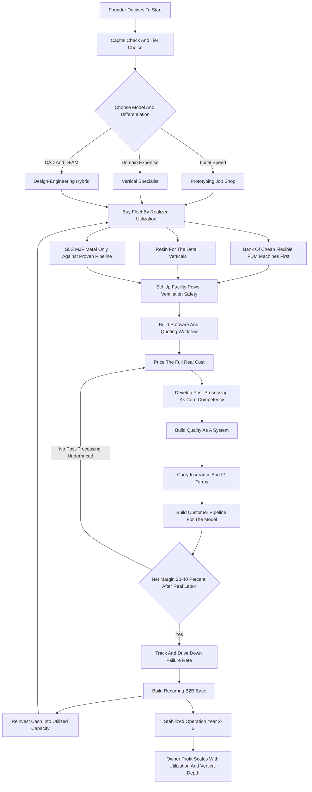

### Direct Answer

To start a 3D printing service business in 2027, you buy a fleet of additive manufacturing machines, sell their production hours as a service, and live or die on one number most beginners never calculate: realized machine-hour utilization. A lean FDM-and-resin shop launches for $8K-$25K from a garage; a serious SLS, MJF, or metal production shop runs $150K-$800K+. The model is real and growing but quietly brutal on margin: gross margins of 45-70% on machine time collapse to a 20-40% net margin once failed prints, post-processing labor, and file-prep time are honestly loaded in, and the winners compete on speed, locality, finishing craft, and vertical expertise rather than on being the cheapest cubic centimeter against Xometry, Protolabs, and the global commodity tide.

**TL;DR:** A 3D printing service owns additive machines and sells capacity, turnaround, and finishing skill. FDM machines from Bambu Lab and Prusa give cheap, fast-payback capacity; resin from Formlabs opens the dental and jewelry verticals; SLS, MJF, and metal unlock production but trap capital if bought before demand. A disciplined Year 1 generates $30K-$130K revenue and $10K-$55K owner profit, with the founder personally doing CAD review, slicing, print babysitting, sanding, and shipping. Year 3-5 a well-run focused shop reaches $180K-$900K revenue and $55K-$280K owner profit. The three things that kill these startups: competing on commodity price, underpricing post-processing and file-prep labor, and buying exotic machines before demand exists. Public-market reference operators include Xometry (NASDAQ: XMTR), Protolabs (NYSE: PRLB), 3D Systems (NYSE: DDD), Stratasys (NASDAQ: SSYS), Materialise (NASDAQ: MTLS), and Desktop Metal/Nano Dimension (NASDAQ: NNDM). Viable in 2027 only as a disciplined, utilization-obsessed, vertically-focused service shop.

## 1. What A 3D Printing Service Business Actually Is In 2027

### 1.1 The Core Financial Idea

A 3D printing service business owns additive manufacturing machines and sells the output -- and the expertise around the output -- as a service. **You are not selling printers and you are not, at the core, selling a product of your own design; you are selling capacity, turnaround, and finishing skill.** A customer arrives with a need: a product designer wants twenty iterations of an enclosure prototype, a dentist wants a batch of surgical guides and models, a jeweler wants investment-casting patterns, a machine shop wants a run of nylon fixtures, an engineer wants a short production run of brackets that would be uneconomical to injection-mold. They send you a file -- usually STEP or STL, sometimes a sketch you must turn into CAD -- and you quote it, print it, post-process it, inspect it, and ship it.

The entire business is **a single financial idea executed thousands of times**: you buy a machine once, and then you sell its production hours so many times over its life that the cumulative billing dwarfs the purchase price, the material, and the power. A $1,200 FDM printer that bills $12 a print-hour and runs even moderately utilized pays for itself in a couple of months and then earns for years. That is the engine. Everything else in this guide -- the machine mix, the software, the post-processing bench, the quoting system, the vertical focus, the pricing -- is the machinery that lets you run that engine at high utilization without drowning in failed prints, unbilled labor, and price-shopping customers.

### 1.2 Why 2027 Is Different

In 2027 the business is shaped by realities that did not fully exist a decade ago. **Customers can upload a file to Xometry or Protolabs or a dozen overseas shops and get an instant quote**, so pure commodity FDM printing is a race to the bottom. Desktop machines from Bambu Lab, Prusa, and Creality got dramatically more reliable and cheaper, flooding the low end with capacity. And the real money migrated toward verticals that need locality, speed, finishing craft, regulatory awareness, or genuine engineering help.

The 3D printing service business is **not a passive printer farm and it is not a tech novelty**. It is a manufacturing-services business -- part machine shop, part CAD studio, part logistics operation -- and the founders who succeed understand that the printer is the cheap part; the expertise, the finishing, the turnaround, and the customer relationship are the business. This guide is the closest sibling to the CNC machining service path (q1986) and the focused 3D-printed custom-parts product model (q9591), and the contrast with those is instructive throughout.

### 1.3 What You Are Really Buying When A Customer Hires You

A customer who could buy their own Bambu Lab and chooses you instead is buying one of four things: **speed** they cannot get from an overseas platform, **finishing quality** they cannot achieve themselves, **a process or material** they do not own a machine for, or **engineering judgment** that turns their problem into a producible design. A founder who cannot name which of those four they are selling is selling commodity cubic centimeters, and that is the business model that loses. The discipline is to write the answer down before the first machine is bought, because that one sentence determines the fleet, the facility, the pricing, the marketing channel, and the kind of customer the business will live or die on. A shop selling speed buys a deep FDM bank and a small unit close to its customers; a shop selling a process buys the SLS or resin machine the customer cannot justify owning; a shop selling finishing invests disproportionately in the post-processing bench; a shop selling engineering judgment invests in CAD seats and the founder's design skill. The most expensive mistake a founder makes is never answering the question and then building a generic fleet that is mediocre at all four.

## 2. The Machine Categories: What You Actually Buy And Why

### 2.1 FDM, Resin, And The Capability Ladder

The fleet is the business, and a founder must understand every additive process before spending a dollar. **FDM/FFF -- fused deposition modeling** -- extrudes molten thermoplastic (PLA, PETG, ABS, ASA, nylon, polycarbonate, carbon-fiber-filled blends) layer by layer. Machines run from a $250 Creality Ender to a $1,200-$1,500 Bambu Lab X1C or P1S, a $1,100 Prusa MK4S, a $2,000-$3,500 Voron build, up to industrial Markforged, Stratasys (NASDAQ: SSYS) F-series, and UltiMaker S-series machines at $5K-$80K+. FDM is the cheap, fast, forgiving workhorse: prototypes, jigs and fixtures, tooling, large robust parts.

**Resin -- SLA, MSLA/LCD, DLP** -- cures liquid photopolymer with light, producing far finer detail and smoother surfaces. Desktop MSLA machines (Anycubic Photon, Elegoo Saturn and Mars, Phrozen Sonic) run $200-$600; professional systems (Formlabs Form 4 and Form 4L, Asiga, Nexa3D) run $3.5K-$25K+. Resin is the detail-and-vertical category: dental models and surgical guides, jewelry casting patterns, miniatures, anatomical models.

### 2.2 Production-Tier Processes: SLS, MJF, And Metal

**SLS -- selective laser sintering** -- fuses nylon powder with a laser, producing strong, isotropic, support-free end-use parts. Benchtop and compact systems (Formlabs Fuse 1+, Sinterit, Sintratec) run $20K-$150K; industrial EOS and 3D Systems (NYSE: DDD) machines run far higher. **MJF -- HP Multi Jet Fusion** -- is a powder-bed process producing high-quality nylon parts at production speed; HP 4200/5200-class systems run $200K-$500K+. **Metal -- DMLS/SLM, binder jetting, metal FDM** -- laser-melts or binds metal powder for aerospace, medical implants, and demanding parts; desktop metal from Markforged and Desktop Metal (now part of Nano Dimension, NASDAQ: NNDM) starts around $100K-$200K, while true DMLS from EOS, Nikon SLM Solutions, 3D Systems, and Velo3D runs $300K-$1.5M+. **Material jetting / PolyJet** from Stratasys produces multi-material, multi-color parts for $50K-$300K+.

A founder should think of the fleet as a **capability ladder**: FDM is the cheap, broad base; resin opens the detail verticals; SLS and MJF unlock real production; metal and PolyJet are high-capital specialty bets. The Year 1 mistake is climbing the ladder before demand justifies the rung.

### 2.3 The Process Comparison Table

| Process | Typical all-in machine cost | What it makes best | Main drawback |
|---|---|---|---|
| FDM / FFF | $250-$3,500 desktop, $5K-$80K+ industrial | Prototypes, jigs, fixtures, large robust parts | Visible layer lines, modest detail |
| Resin SLA / MSLA / DLP | $200-$600 desktop, $3.5K-$25K+ pro | Dental, jewelry patterns, miniatures, fine detail | Messy chemistry, ventilation, consumable cost |
| SLS (nylon powder) | $20K-$150K benchtop/compact | Strong functional end-use nylon parts, low-volume runs | Batch process, powder handling, high capital |
| MJF (HP) | $200K-$500K+ | Consistent production-grade nylon parts at speed | Production-tier capital and facility needs |
| Metal DMLS / SLM / bound-metal | $100K-$1.5M+ | Aerospace, medical, demanding end-use metal parts | Inert gas, powder safety, heat treatment, facility |
| Material jetting / PolyJet | $50K-$300K+ | Multi-material, multi-color realistic prototypes | High machine and material cost |

## 3. The Three Business Models

### 3.1 Prototyping Job Shop

**The prototyping job shop model** carries a broad fleet -- FDM and resin, maybe SLS -- and serves anyone with a file: product designers, engineers, inventors, makers, local manufacturers, students. Its advantage is volume, diversification across customer types, fast cash from low-capital machines, and being the convenient local "send it and we'll print it" option. Its challenge is that it competes most directly with Xometry, Protolabs, JLCPCB, Craftcloud, and the global commodity tide, so **it must win on speed, locality, communication, and finishing rather than price.**

### 3.2 Vertical Specialist

**The vertical specialist model** goes deep on one industry's specific need -- dental, jewelry, medical, tabletop gaming, architectural models, or short-run end-use production for a particular sector. Its advantage is higher margins, defensible expertise, pricing power, and far less direct price competition because the customer is buying domain knowledge, not cubic centimeters. Its challenge is concentration risk and the need to genuinely learn the vertical's standards, materials, and regulatory environment.

### 3.3 Design-Engineering Hybrid

**The design-engineering hybrid model** sells CAD design, design-for-additive-manufacturing (DFAM) consulting, reverse engineering, and engineering iteration on top of the printers -- the customer is buying a partner who turns a napkin sketch or a broken part into a producible design. Its advantage is the highest margins and the stickiest relationships, because design judgment cannot be price-shopped the way a print can. Its challenge is that it requires real CAD and engineering skill and a more consultative sales motion. Many operators start as a job shop to build cash, then specialize. **The wrong move is trying to be all three at once in Year 1.**

### 3.4 Model Selection Table

| Model | Capital intensity | Margin profile | Direct price competition | Best fit founder |
|---|---|---|---|---|
| Prototyping job shop | Low ($8K-$25K) | Thin-to-medium | Severe (platforms + hobbyists) | Generalist, fast-cash, local-speed operator |
| Vertical specialist | Medium ($25K-$90K) | High | Low (domain knowledge sells) | Operator willing to learn one industry deeply |
| Design-engineering hybrid | Low-medium | Highest | Very low (judgment cannot be shopped) | CAD-literate, consultative engineer-founder |

## 4. The 2027 Market Reality

### 4.1 Demand Is Structurally Healthy

**Demand is structurally healthy and broadening.** Additive manufacturing moved decisively from "prototyping toy" to a real production and tooling method across dental, medical, aerospace, automotive, consumer products, jewelry, and industrial maintenance. Dentistry alone became a massive additive consumer -- models, guides, splints, and aligner-related forms print by the millions. Engineers default to printed jigs and fixtures instead of machining them. The structural demand under the business is real and growing through the late 2020s.

### 4.2 Competition Is Bifurcated And Global

**The competition is bifurcated and global.** At one end sit the instant-quote platforms and large service bureaus -- Xometry (NASDAQ: XMTR), Protolabs (NYSE: PRLB) and its Hubs operation, Fictiv, Craftcloud, Materialise (NASDAQ: MTLS), JLCPCB and the Chinese manufacturing platforms -- offering instant online quoting, vast capacity, and aggressive pricing. At the other end is a long tail of hobbyists with a printer offering cheap local jobs on Facebook and Etsy. The opportunity for a disciplined new entrant is **the underserved middle and the verticals**: faster and more communicative than the platforms for local work, more professional than the hobbyist tail, and genuinely expert in a vertical the generalists treat as a commodity.

### 4.3 What Changed By 2027

Desktop machines (Bambu Lab especially) got radically cheaper and more reliable, collapsing the FDM commodity floor; instant-quote software made price transparency brutal for generic work; SLS and resin got cheap enough that small shops can offer production-grade processes; materials expanded enormously; and AI-assisted CAD and slicing lowered the skill floor slightly while raising customer expectations. The net market reality: **demand is real and growing, the commodity end is a brutal price war you cannot win, and the winning 2027 entrant competes on locality, speed, finishing quality, vertical expertise, and design help.**

## 5. The Core Unit Economics: Realized Machine-Hour Utilization

### 5.1 The One Calculation Beginners Skip

This is the single most important section in the guide, because the entire business lives or dies on one calculation that beginners almost never run. **Every machine you own has a realized utilization number -- the percentage of available print-hours it actually spends producing billable parts** -- and that number, multiplied by the billable rate, against the machine cost plus its share of fixed overhead, tells you whether the machine is an asset or dead weight.

### 5.2 The Math, Concretely

A **Bambu Lab X1C** costs roughly $1,400 all-in with an enclosure and spares. It can physically run 24 hours a day, but a small shop realistically sees 8-16 productive hours a day after file prep, plate clearing, failures, and idle gaps. At a $12/print-hour billable rate and 10 productive hours a day, six days a week, fifty weeks a year, that is roughly 3,000 billed hours -- **$36,000 of machine-time revenue against a $1,400 machine.** Even at half that utilization it is an excellent asset.

Now the dangerous category: a **Formlabs Fuse 1+ SLS system**, all-in with the build chamber, sift station, and powder, runs $35K-$50K. It bills at $50-$150 per build-hour, which sounds enormous -- but SLS runs in batched builds, and if the shop only fills the build chamber twice a week because the job pipeline is thin, the machine sits at maybe 15-20% realized utilization. **At that utilization the depreciation and facility cost run regardless, and the capital is effectively trapped.**

### 5.3 The Discipline This Imposes

Before buying any machine, estimate its realistic realized utilization given the demand you can actually generate, and compare the annual billable output to the all-in cost plus overhead share. Cheap, flexible FDM and resin machines should dominate the early fleet. **Demand creates the justification for capability -- not the reverse.** A founder who buys by realized utilization builds a fleet that compounds; one who buys by spec-sheet ambition builds a room full of expensive, idle, depreciating machines.

The practical version of this discipline is a one-page calculation a founder runs for every machine before purchase: estimate the realistic billable hours per week given the actual job pipeline, multiply by the billable rate to get annual machine-time revenue, subtract the machine's annual depreciation share and its allocated overhead, and only then ask whether the remaining contribution justifies the capital and the floor space. A desktop FDM machine passes that test easily even at modest utilization because the capital is trivial. An SLS or metal machine passes only when the pipeline is genuinely deep, because the fixed cost is large whether the chamber runs or sits. The number that kills founders is not the headline billable rate -- it is the gap between physical capacity and realized utilization, and that gap is widest exactly on the expensive machines that founders are most tempted to buy first.

### 5.4 Why Utilization Beats The Spec Sheet

Trade shows and machine marketing sell on the spec sheet: build volume, layer resolution, speed, materials. None of those numbers earn a dollar. The only number that earns is billable hours actually sold, and that number is set by the customer pipeline, not the machine. A modest FDM printer running 60% utilized generates more profit than an exotic machine running 12% utilized, every time, because profit is a function of realized utilization against fixed cost -- not of capability. The founder who internalizes this buys the fleet the demand can fill and grows the fleet as the demand grows. The founder who does not buys the impressive machine and then spends a year trying to manufacture demand to justify it.

### 5.5 Utilization Reference Table

| Machine | All-in cost | Billable basis | Healthy utilization | Idle-capital danger |
|---|---|---|---|---|
| Desktop FDM (Bambu X1C class) | ~$1,400 | $8-$20/print-hour | 8-16 productive hrs/day | Low -- recovers capital fast |
| Pro resin (Formlabs Form 4) | $4K-$6K | per part / per build | several builds/week | Moderate -- needs steady detail pipeline |
| Benchtop SLS (Fuse 1+) | $35K-$50K all-in | $50-$150/build-hour | full chamber multiple times/week | High -- capital trapped at 15-20% |
| MJF / metal | $200K-$1.5M+ | per build / per part | continuous production pipeline | Severe -- six-figure asset cannot sit idle |

## 6. The Line-By-Line P&L

### 6.1 Anatomy Of A Single Job

Take a representative job: a product designer needs six FDM prototype enclosures in PETG, each a few hours of print time, plus light support removal and a quick dimensional check -- a quoted price of, say, $180. From that, the costs stack in an order beginners consistently underestimate. **Material** is genuinely cheap -- a kilogram of decent filament is $18-$30, and this job uses maybe $8 of it. **Machine time and electricity** are real but modest -- the depreciation share plus power for the print hours.

### 6.2 The Four Hidden Costs

**Failed prints** are the first hidden killer: a realistic 5-15% of prints fail or come out unusable, and every failure burns material, machine time, and operator attention with zero revenue. **Post-processing labor** is the largest hidden cost: support removal, sanding, IPA washing and UV curing for resin, bead blasting and dyeing for SLS, depowdering, heat treatment and machining for metal. **File prep and quoting labor** is the second-largest: reviewing CAD for printability, fixing or reorienting the model, slicing, generating supports, and the quoting itself, which can eat thirty minutes per inquiry that may never convert. **Software, maintenance, consumables, facility, insurance, and shipping** round out the overhead.

### 6.3 What The Margin Actually Is

Net the job out and a healthy 3D printing service runs a **45-70% gross margin on the headline machine time, but a realistic 20-40% net margin** once failed prints, post-processing, file prep, and quoting labor are honestly loaded in. The founders who fail at the P&L level almost always made the same two errors: they priced "the print" and gave away the finishing and file work, and they never tracked their failure rate.

### 6.4 Representative Job P&L Table

| Line item | This job (~$180 quote) | Share of revenue | Beginner error |
|---|---|---|---|
| Material (PETG, ~$8) | $8 | 4% | Usually counted correctly |
| Machine time + electricity | $14 | 8% | Often under-allocated depreciation |
| Failed-print allowance (10%) | $18 | 10% | Frequently ignored entirely |
| Post-processing labor | $45 | 25% | Given away free -- the big mistake |
| File-prep + quoting labor | $30 | 17% | Given away free -- second big mistake |
| Overhead share | $20 | 11% | Under-counted |
| Owner profit / net margin | $45 | 25% | Believed to be ~60% |

## 7. Machine Selection And The Initial Capex Plan

### 7.1 The Buying Principle

The principle is **buy cheap, flexible, fast-payback capacity first; buy expensive batch capacity only against proven demand.** A disciplined launch fleet for a prototyping job shop prioritizes a small bank of reliable **FDM machines** -- two to four Bambu Lab X1C/P1S, Prusa MK4S, or equivalent, because a bank of cheap printers gives parallel throughput, redundancy when one fails, and the ability to run a multi-part job overnight.

### 7.2 The Launch Fleet Sequence

After the FDM bank: one or two **resin MSLA machines** once you see resin demand; a proper **post-processing setup** -- wash-and-cure station, small bead blaster, sanding tools, fume extractor, hand tools; **slicing and CAD software**; and basic **inspection capability** -- calipers, gauges, maybe a scanner. A lean FDM-and-resin launch starts around **$8K-$20K** and runs from a garage. A fuller professional launch with a Formlabs ecosystem runs **$25K-$60K**. Adding SLS pushes it to **$120K-$200K**; MJF or metal to **$300K-$600K+**.

### 7.3 The Sequencing Rule

Every additional dollar should go to the capacity with the best realized-utilization-adjusted return until that capacity is deep enough to serve your typical job, and only then climb the ladder. **A bank of three proven $1,200 printers is almost always a better Year 1 bet than one $20K machine**, because the bank flexes, has redundancy, and recovers capital faster. Resist the trade-show temptation to do it in reverse order.

## 8. Facility, Power, Ventilation, And Workspace

### 8.1 Matching Space To Process

A 3D printing service can start in a spare room but cannot scale there safely. **FDM** is the most forgiving -- it needs stable temperature, modest power, and ventilation for materials like ABS and ASA, but a bank can live in a garage. **Resin** raises the bar: photopolymer resin and isopropyl alcohol require real ventilation, a dedicated washing and curing area, careful chemical handling, gloves and PPE, and a waste-disposal plan. **SLS and MJF** introduce fine powder handling -- nylon powder is a respiratory and combustibility concern. **Metal printing** is a different category entirely -- inert-gas supply, powder-explosion safety protocols, heat-treatment furnaces, three-phase power, and fire-code engagement.

### 8.2 Power, Climate, And Layout

A bank of FDM machines is fine on normal circuits, but resin curing, SLS, MJF, and metal machines draw real power and may need dedicated or three-phase service. **Climate control** affects print quality -- temperature and humidity swings cause warping and poor adhesion, and filament and powder must be stored dry. **Layout** is operational: separate the printing area from post-processing from the resin/chemical area from shipping, and give yourself bench space.

### 8.3 Facility Cost By Tier

| Tier | Space | Power | Ventilation / safety | Typical monthly cost |
|---|---|---|---|---|
| FDM-only lean | Garage / spare room | Standard circuits | Enclosure filtration | $0-$500 |
| FDM + resin pro | Small commercial unit | Standard + a few dedicated circuits | Real ventilation, chemical storage | $500-$2,000 |
| SLS / MJF | Dedicated room | Dedicated circuits | Powder management, dust control | $1,500-$4,000 |
| Metal | Engineered facility | Three-phase | Inert gas, explosion safety, furnaces | $4,000-$12,000+ |

## 9. Software: CAD, Slicing, Quoting, And Workflow

### 9.1 Slicing And CAD

In 2027 a 3D printing service runs on software at every stage. **Slicing software** -- the program that turns a 3D model into machine instructions -- is the daily tool: Bambu Studio, PrusaSlicer, Cura, Lychee and Chitubox for resin, and the proprietary software bundled with Formlabs (PreForm), HP, and the industrial machines. Slicing skill is a real craft -- orientation, supports, settings. **CAD software** is essential even for a pure job shop, because customers send broken, unprintable, or wrong-format files constantly: Fusion 360, SolidWorks, Onshape, Blender, and mesh-repair tools.

### 9.2 Quoting And Workflow

**Quoting and order management** is the commercial backbone -- the instant-quote platforms set the customer expectation, and a serious shop needs a way to quote consistently and quickly. **A website with file upload** is a baseline expectation. **Workflow and job tracking** keeps a multi-machine shop from dropping jobs. **AI-assisted tools** in 2027 help with mesh repair, generative design suggestions, and quoting estimation. The quoting workflow is itself a competitive weapon: customers compare a clean, fast, itemized quote against a slow vague one.

## 10. Pricing: How To Charge For Additive Manufacturing

### 10.1 The Cost-Plus Floor

**The cost-plus floor** is built from the real inputs: material consumed, machine time at a depreciation-plus-power-plus-overhead rate, post-processing labor at a real hourly rate, file-prep and quoting labor, a failure-rate allowance, and shipping -- then a margin on top. **The single most common pricing error is omitting post-processing and file-prep labor entirely and quoting only material plus machine time.**

### 10.2 Pricing Models And Levers

**Common pricing models** include per-cubic-centimeter or per-gram of material (simple, what the platforms use, but it ignores labor), per-machine-hour (better reflects the real constraint), per-part for repeat jobs, and project-based for design work. **Minimums and setup fees** are essential -- a $15 part can easily cost $40 in quoting and handling. **Rush pricing** is a real lever because speed is one of the few things a local shop sells that the overseas platforms cannot. **Volume pricing** reflects amortized setup. **Design and engineering work** is priced separately, at a professional rate.

### 10.3 Pricing Model Comparison Table

| Pricing model | What it captures | What it misses | Best use |
|---|---|---|---|
| Per-gram / per-cc | Material volume | All labor and detail | Matching platform quotes only |
| Per-machine-hour | The real time constraint | Post-processing labor | FDM job-shop baseline |
| Per-part (repeat) | Predictable repeat runs | Setup amortization unless added | Recurring B2B accounts |
| Project / hourly | Design and engineering judgment | Nothing -- the strongest model | Design-hybrid and DFAM work |
| Vertical value-based | What the part is worth to the buyer | Requires domain credibility | Dental guides, jewelry patterns |

## 11. Post-Processing: The Hidden Labor That Defines The Business

### 11.1 Why It Matters

Post-processing is the part of the business beginners ignore and successful operators obsess over, because it is simultaneously the largest hidden cost and the biggest opportunity to differentiate. **A raw print off any machine is almost never the deliverable**: it has supports to remove, layer lines to address, surfaces to smooth, and -- depending on process -- washing, curing, depowdering, blasting, dyeing, painting, gluing, threading, or heat-treating to do.

### 11.2 Process-By-Process Finishing

**FDM post-processing** ranges from quick support removal to sanding, gap-filling, priming, painting, and vapor smoothing for ABS. **Resin post-processing** is mandatory and chemical: every part is washed in IPA, supports removed, and UV-cured, then often sanded and painted. **SLS post-processing** involves depowdering, bead blasting, optional dyeing, and sometimes sealing. **Metal post-processing** is the most involved -- support and build-plate removal by machining or wire EDM, stress-relief and heat treatment, HIP, machining of critical features, and surface finishing. The strategic reality is twofold: **it is expensive skilled labor that must be priced**, and **it is the differentiation a local shop can actually sell.**

### 11.3 The Finishing-Labor Table

| Process | Typical finishing steps | Labor intensity | How to price it |
|---|---|---|---|
| FDM | Support removal, sanding, priming, painting | Low-medium | Per-part finishing line item |
| Resin | IPA wash, support removal, UV cure, sand, paint | Medium | Mandatory in every quote, never absorbed |
| SLS | Depowder, bead blast, dye, seal | Medium | Per-build finishing allocation |
| MJF | Depowder, blast, dye | Medium | Per-build finishing allocation |
| Metal | Build-plate removal, heat treat, HIP, machining | High | Quoted as a separate operation per part |

The founder who systematizes finishing -- documented steps, a dedicated bench, the right tools, and a real hourly rate attached to each step -- converts the largest hidden cost into a billed, differentiated capability. The founder who treats finishing as the annoying chore after the "real" work of printing donates their most valuable hours and loses to shops that charge for them.

## 12. Materials: The Expanding Menu And Its Margin Implications

### 12.1 The Material Landscape

**FDM materials** span cheap and easy (PLA, PETG) through engineering polymers (ABS, ASA, polycarbonate, nylon) to high-performance filled and exotic materials (carbon-fiber and glass-filled blends, PEEK, PEI/ULTEM). **Resin materials** range from standard and tough resins through engineering, high-temperature, flexible, castable (for jewelry and dental), biocompatible, and ceramic-filled resins. **SLS and MJF materials** are predominantly nylon (PA12, PA11, glass- and carbon-filled nylons, TPU). **Metal materials** -- titanium, stainless steels, aluminum alloys, tool steels, Inconel, cobalt-chrome -- serve aerospace, medical, and demanding industrial applications.

### 12.2 The Margin Implication

Cheap materials mean cheap, price-competitive jobs; engineering and specialty materials command real premiums and attract customers who cannot price-shop because few shops can run them well. Material also drives the **consumable cost** structure -- powder refresh ratios mean a meaningful fraction is effectively waste per build, and resin tanks, FEP films, nozzles, and build plates wear out. **Deliberately expand the material menu toward the engineering and vertical-specific materials that carry margin.**

## 13. The Customer Verticals: Where The Real Money Is

### 13.1 The Major Verticals

**Dental** is arguably the largest and best additive vertical for a service shop -- dental labs need models, surgical and implant guides, splints, night guards, and aligner-related thermoforming models, in volume, repeatedly. **Jewelry** needs castable resin patterns for lost-wax casting. **Medical** spans anatomical and surgical-planning models, custom orthotic and prosthetic aids, and medical-device prototyping. **Engineering and product development** -- jigs, fixtures, tooling, functional prototypes, short-run end-use parts -- is the bread-and-butter B2B vertical. **Aerospace, defense, and automotive** need prototypes, lightweight brackets, and increasingly qualified end-use parts. **Tabletop gaming, miniatures, and collectibles** are a real consumer-and-prosumer resin vertical. **Replacement and legacy parts** is a quietly durable niche.

### 13.2 Vertical Economics Table

| Vertical | Primary process | Margin profile | Repeat / recurring potential |
|---|---|---|---|
| Dental | Resin (biocompatible / model) | High | Very high -- labs reorder constantly |
| Jewelry casting patterns | Resin (castable) | High | High -- jewelers and casters reorder |
| Medical / anatomical models | Resin, PolyJet, FDM | High | Moderate -- project-driven, regulation-aware |
| Engineering jigs / fixtures | FDM, SLS | Medium | High -- local manufacturers reorder |
| Aerospace / defense / automotive | Metal, SLS | High but demanding | Moderate -- qualification-heavy |
| Tabletop gaming / miniatures | Resin | Low-medium per part | High volume, IP-sensitive |
| Replacement / legacy parts | FDM, SLS | Medium | Sporadic but durable niche |

## 14. Startup Cost Breakdown: The Honest All-In Number

### 14.1 The Line-Item Build-Up

The all-in startup cost breaks down as: **machines** -- $4,000-$15,000 for a lean FDM-and-resin bank, $20,000-$60,000 for a fuller professional fleet, $120,000-$200,000 if adding SLS, $300,000-$600,000+ for MJF or metal; **post-processing equipment** -- $1,000-$10,000 for a desktop shop; **software** -- $500-$3,000/year; **facility** -- nothing if home-based for FDM, or $500-$3,000/month for a commercial unit; **inspection and metrology** -- $200-$5,000+; **initial materials inventory** -- $500-$5,000; **insurance** -- $800-$4,000 to start; **business formation, licensing, legal, IP terms** -- $300-$2,000; **website and initial marketing** -- $500-$5,000; **working capital** -- $3,000-$20,000.

### 14.2 The Tier Totals

| Launch tier | Machines | All-in total | Where it runs |
|---|---|---|---|
| Lean home-based FDM + resin | $4K-$15K | ~$8,000-$25,000 | Garage or spare room |
| Professional desktop + Formlabs | $20K-$60K | ~$30,000-$90,000 | Small commercial unit |
| SLS-capable production shop | $120K-$200K | ~$150,000-$280,000 | Dedicated facility |
| MJF or metal production shop | $300K-$600K+ | ~$400,000-$800,000+ | Engineered facility |

The capital flexibility is genuinely a feature -- you can start small and real -- but it is also a trap, because the cheap entry point lures founders into believing demand will appear and then into buying the expensive machine too early. **Start at the tier your provable demand justifies.**

## 15. The Year-One Operating Reality

### 15.1 What Year One Actually Is

Year 1 is **skill-building, customer-finding, and process-debugging mode, not profit-extraction mode.** The first year is spent learning which jobs actually come in and pay well, discovering the real failure rate and post-processing time, building the quoting process, and finding the customers -- often one local engineering firm, one dental lab, a handful of designers -- who become repeat revenue.

### 15.2 The Year-One Numbers

A disciplined Year 1 service shop, launched lean, can realistically generate **$30,000-$130,000 in revenue against $10,000-$55,000 in owner profit** -- meaningful but earned through the founder personally doing CAD review, slicing, babysitting prints, sanding, quoting, and shipping. The work is part machine operator, part chemist, part CAD jockey, part customer-service rep, part shipping clerk. **The founders who succeed treat Year 1 as paid tuition in a real manufacturing-services business; the ones who fail expected a passive printer farm.**

## 16. The Five-Year Revenue Trajectory

### 16.1 The Year-By-Year Arc

**Year 1:** lean fleet, skill-building, finding the first repeat customers and the vertical. **Year 2:** clearer vertical or service focus, repeatable quoting process, a few anchor customers, Year-1 cash reinvested into more capacity. **Year 3:** a real business with a system -- defined verticals, possibly a finishing hire, a proper facility. **Year 4:** continued expansion, possible move into SLS/MJF or deeper into design-engineering. **Year 5:** a mature operation with the founder deciding whether to keep scaling, go deep into production, build out the design arm, or position for sale.

### 16.2 Five-Year Financial Table

| Year | Revenue | Owner profit | Operating reality |
|---|---|---|---|
| Year 1 | $30K-$130K | $10K-$55K | Founder doing everything hands-on |
| Year 2 | $80K-$280K | $30K-$120K | Failure rate drops, pricing tightens, repeat work compounds |
| Year 3 | $150K-$500K | $50K-$200K | First hire, proper facility, founder managing more |
| Year 4 | $300K-$700K | $90K-$260K | Capacity expansion, stronger recurring B2B accounts |
| Year 5 | $400K-$900K+ | $120K-$300K | Mature focused shop; exit options open |

These numbers assume disciplined utilization-based buying, honestly priced labor, a controlled failure rate, and a real vertical. A service shop scales with machine capacity, skilled finishing labor, and the customer pipeline -- **not magically.**

## 17. Five Named Operating Scenarios

### 17.1 The Disciplined Dental Specialist

**Priya** launches with $40K into a Formlabs resin ecosystem plus a small FDM bank, deliberately ignores the generalist job-shop market, and spends six months learning dental models, surgical guides, and biocompatible resins. She lands three local dental labs as recurring accounts, hits $150K revenue in Year 2 at strong margins because she is selling dental expertise and turnaround, and reaches $480K by Year 4 with a small team.

### 17.2 The Cautionary Tale

**Marcus** spends $160K -- most of it on an SLS machine -- on the belief that "production capability" will pull customers. The SLS sits at 14% utilization because he has no production pipeline, the depreciation and facility cost run regardless, his FDM bank is too thin to serve the prototyping jobs that actually come in, and he is cash-strapped by month nine.

### 17.3 The Local-Speed Prototyping Shop

**Devon** runs a bank of eight reliable FDM machines plus two resin printers from a small unit, competes explicitly on same-day and next-day turnaround for local product designers and engineering firms, prices rush work at a real premium, and builds a $260K Year-3 business on speed and communication rather than price.

### 17.4 The Design-Engineering Hybrid

**The Okafor shop** starts as a job shop, discovers that the customers who pay best arrive with a sketch or a broken part rather than a finished file, and pivots to selling CAD design, reverse engineering, and DFAM consulting with printing as the delivery mechanism. By Year 5 the design fees carry the best margins and revenue nears $700K.

### 17.5 The Price-War Casualty

**Tomas** buys cheap FDM machines, offers generic printing priced by the gram on Facebook and a bare website, competes head-on with Xometry and the hobbyist tail on price, never picks a vertical, and after eighteen months of working constantly for almost no profit, shuts down. These five span the realistic distribution.

## 18. Lead Generation: How A Service Shop Gets Customers

### 18.1 Channels By Model

**For the prototyping job shop**, the channels are local visibility: a website with file upload, local SEO, Google Business Profile, listings on print-network marketplaces, and direct outreach to local engineering firms, machine shops, and universities. **For the vertical specialist**, the channels are the vertical's own ecosystem -- dental labs and dental-industry events for a dental shop, jewelers and casters for a jewelry shop. **For the design-engineering hybrid**, the channels are referral and reputation among inventors, startups, and product companies.

### 18.2 Channels That Recur

**Repeat and referral customers** are the compounding core -- B2B repeat work is far more valuable than one-off consumer jobs. **Content marketing** showing real projects and finishes builds credibility. **The print-network marketplaces** can seed early volume but route price-competitive work, so they are a starting channel, not a destination. **A professional, fast quoting experience** is itself lead-gen because it converts the inquiries the other channels generate.

## 19. Quality, Inspection, And Consistency

### 19.1 Quality As A System

A 3D printing service that wants repeat B2B customers must treat quality as a system, not a hope. **Dimensional accuracy** is the first axis -- a shop must know its achievable tolerances per machine and material and check critical dimensions with calipers and gauges. **Surface finish** consistency must be repeatable. **Mechanical performance** matters enormously for functional parts. **Process control** -- consistent calibration, maintenance schedules, controlled material storage, documented print settings -- is what makes output repeatable.

### 19.2 The Moat Consistency Builds

**Inspection and documentation** build trust and catch problems before the customer does. **Failure analysis** is how the scrap rate comes down over time. For regulated verticals (medical, aerospace, certain dental work), quality expectations rise toward formal process documentation, material traceability, and sometimes certification. **Consistency is the moat a local service shop can actually build** -- the platforms are consistent in a generic way, but a focused shop that nails accuracy, finish, and reliability for its vertical earns the repeat B2B revenue.

## 20. Risk Management And Insurance

### 20.1 The Major Risks

**Product and professional liability risk** is the most serious and under-appreciated: when you print a functional part that fails, you can be exposed. **Intellectual property risk** is two-sided: customers may send files they do not own, and your own designs and a customer's confidential CAD must be protected. **Equipment risk** -- a thin fleet with no redundancy means a dead machine is a missed deadline. **Failure-rate and quality risk** eats margin and loses customers. **Chemical and safety risk** -- resin sensitization, powder handling, metal-powder combustibility -- is real.

### 20.2 Risk Mitigation Table

| Risk | Primary mitigation | Cost / effort |
|---|---|---|
| Product / professional liability | GL + product liability insurance, clear terms | $800-$4,000/yr |
| IP exposure (both sides) | NDAs, customer responsibility clauses | Legal setup $300-$2,000 |
| Equipment failure | Bank of machines, maintenance discipline | Built into fleet design |
| Failure rate eating margin | Tracking + priced scrap allowance | Process discipline |
| Chemical / powder safety | Ventilation, PPE, storage, waste handling | Facility cost |
| Customer concentration | Diversified base across accounts/verticals | Sales discipline |
| Commodity competition | Vertical focus, speed, finishing, design | The whole strategy |

The throughline: **every major risk has a known mitigation built from insurance, contracts, redundancy, facility discipline, and the differentiation strategy itself.**

## 21. Competitor Landscape: Who You Are Up Against

### 21.1 The Competitive Field

**The instant-quote platforms and large service bureaus** -- Xometry (NASDAQ: XMTR), Protolabs (NYSE: PRLB) and its Hubs operation, Fictiv, Craftcloud, Materialise (NASDAQ: MTLS), and the major Chinese platforms including JLCPCB -- own the commodity "upload a file, get a price" experience. **The consumer marketplaces** -- Etsy sellers and the long tail of hobbyists on Facebook and Reddit -- compete at the low end on price. **Regional and local service bureaus** are the most direct real competitors for local work. **Vertical-specific competitors** -- dental labs with in-house printing, jewelry-casting houses -- compete on domain depth. **In-house capacity** -- the customer who buys their own Bambu Lab -- is a structural pressure on the commodity end.

### 21.2 The Real Moat

The competitive moat in a 3D printing service is **not the machines** -- anyone with capital can buy a printer, and the customer can too. It is **the vertical expertise, the finishing craft, the turnaround speed, the design and engineering capability, the consistency, and the relationships**, all of which take years to build and are genuinely hard for a platform or a hobbyist to copy.

## 22. Financing, Taxes, And Business Structure

### 22.1 Financing The Launch And The Growth

**Bootstrapping the lean tier** is genuinely realistic -- an $8K-$25K FDM-and-resin launch can be self-funded, and this is the recommended path because it forces the discipline of proving demand before scaling. **Reinvested cash flow** funds most healthy growth. **Equipment financing and leasing** is the natural fit for expensive machines -- but this is exactly where the danger lives: financing an expensive machine before the pipeline exists turns a fixed payment into a millstone. **SBA loans** and **manufacturer financing programs** can fund a broader launch. **Finance against proven pipeline, bootstrap the learning curve, grow on reinvested cash.**

### 22.2 Entity, Depreciation, And Sales Tax

Most operators form an **LLC or S-corp** for liability protection -- given the product-liability exposure, the shield matters. **Depreciation is central to the tax picture** -- the machines are depreciable assets, and accelerated or first-year expensing materially shapes taxable income in heavy-capex years. **Sales tax** on the parts you sell applies in most jurisdictions and must be collected and remitted correctly. Separate business banking from day one, keep a bookkeeping system that tracks machines as assets and jobs as revenue, and use an accountant who understands equipment-heavy manufacturing-services businesses.

## 23. Scaling Past The First Year

### 23.1 The Prerequisites

The prerequisites for scaling: the existing fleet must be genuinely utilized (do not scale on top of idle machines), the quoting and production workflow must be documented well enough that a hire can run parts of it, the vertical or differentiation must be proven, and the cash flow must absorb the next capex without over-leveraging.

### 23.2 The Scaling Levers

**Deepen the proven capacity first** -- more of the FDM or resin machines already utilized. **Climb the machine ladder only against proven pipeline.** **Hire finishing and production labor** -- post-processing is the most delegable skilled work and the first hire usually handles it. **Systematize the workflow** -- documented print settings, job-tracking, quoting templates. **Build the recurring B2B base.** **Add design and engineering services** as a high-margin layer once skill supports it. The founders who scale well treated Year 1 as a demand-proving exercise, so growth was the repetition of a proven machine rather than expensive bets on idle capability.

## 24. Exit Strategies And The Long-Term Picture

### 24.1 The Exit Paths

A 3D printing service business can be exited several ways. **Sell the operating business** -- a shop with utilized machines, a proven vertical, recurring B2B accounts, documented workflow, and clean books is a saleable asset valued as a multiple of stabilized earnings. **Sell the assets** -- the machines have real resale value, and industrial systems hold value better than desktop ones. **Acquire or be acquired** -- a well-run vertical specialist can be an attractive acquisition for a larger bureau. **Transition to a key employee.** **Wind down** -- because the equipment retains value, an operator can sell the machines, fulfill the pipeline, and exit with the proceeds.

### 24.2 The Honest Long-Term Picture

A 3D printing service is a real, durable manufacturing-services business -- additive adoption is structurally growing -- but it is a business, not a passive holding. It demands ongoing capital for machine refresh, ongoing skill development as processes and materials evolve, and ongoing customer-facing work. A 2027 launch builds a tangible, equipment-backed, skill-backed small business with multiple genuine exit paths.

## 25. The 2027-2030 Outlook

### 25.1 The Clear Trends

**Additive adoption keeps broadening** across dental, medical, aerospace, automotive, and consumer products. **The commodity floor keeps dropping** -- desktop machines get cheaper and the platforms keep price pressure relentless on generic work. **In-house adoption grows** -- more customers print their own simple parts, removing easy commodity jobs. **Production additive expands** -- SLS, MJF, and metal increasingly compete with traditional manufacturing for low-to-mid-volume runs. **Materials keep expanding.** **AI assists CAD, slicing, quoting, and design** -- lowering the operational skill floor modestly while raising customer expectations.

### 25.2 The Net Outlook

A 3D printing service is **viable and durable through 2030 in its disciplined, utilization-obsessed, vertically-focused, finishing-and-design-differentiated form.** The version that thrives owns a vertical or a clear advantage, prices the full real cost, and climbs the machine ladder only against proven demand. The version that struggles is the generic, commodity-priced, capability-before-demand shop racing the global field to the bottom.

## 26. The Final Framework: Building It Right From Day One

### 26.1 The Twelve-Step Sequence

A founder who wants to succeed should execute in this order: **First, get honest about capital and tier.** **Second, choose your model and differentiation deliberately.** **Third, buy by realized utilization** -- a bank of cheap FDM first, resin second, SLS/MJF/metal only when the pipeline proves it. **Fourth, set up the facility honestly.** **Fifth, build the software and quoting workflow.** **Sixth, price the full real cost** -- never quote only "the print." **Seventh, develop post-processing as a core competency.** **Eighth, build quality as a system.** **Ninth, carry real insurance and IP terms.** **Tenth, build the customer pipeline for your model.** **Eleventh, track and drive down the failure rate.** **Twelfth, climb the machine ladder and hire only against proven demand.**

### 26.2 The Verdict

Do these twelve things in order and a 3D printing service business in 2027 is a legitimate path to a $180K-$900K equipment-and-skill-backed small business with $55K-$280K in owner profit. Skip the discipline -- especially on differentiation, demand-justified buying, and pricing the full labor -- and it is a fast way to fill a room with idle machines and work constantly in a price war for no profit. **The business is neither the passive printer-farm goldmine of the hype nor a dead end crushed by overseas capacity. It is a real, skilled, competitive manufacturing-services business.**

## 27. The Operating Journey Diagram

## 28. Counter-Case: Why Starting This In 2027 Might Be A Mistake

The case above describes a viable business, but a serious founder must stress-test it against the conditions that make this model a bad bet.

### 28.1 The Commodity End Is An Unwinnable Price War

Anyone can upload a file to Xometry, Protolabs, Craftcloud, JLCPCB, or a dozen overseas shops and get an instant, aggressive quote, and the hobbyist tail will print a part for material cost plus a few dollars. A founder who plans to "offer 3D printing" generically is volunteering to compete on price against players with vastly more capacity, lower overhead, or no profit expectation at all.

### 28.2 It Is Sold As Passive And It Is Anything But

The YouTube fantasy is a farm of printers quietly minting money. The reality is a 5-15% failure rate, hours of skilled post-processing per job, constant CAD repair of customer files, and a quoting grind where many inquiries never convert. The founder is personally doing all of it for years.

### 28.3 Post-Processing And File-Prep Labor Quietly Destroys The Margin

The largest real cost is not the machine or the material -- it is the skilled hands-on time of support removal, sanding, resin washing and curing, depowdering, blasting, finishing, plus CAD repair, slicing, and quoting. Beginners quote "the print" and give all of this away, running a 20% net margin while believing they run a 60% one.

### 28.4 Buying Capability Before Demand Strands Six-Figure Capital

The seductive move is to buy an SLS, MJF, or metal machine because "production capability" sounds like a business. But capability does not create demand -- demand justifies capability. A founder who buys the expensive machine first watches it sit at 10-20% utilization while depreciation and the financing payment run regardless.

### 28.5 The Failure Rate Is Real And Constant

A meaningful fraction of prints fail -- a warped first layer, a clog, a support collapse, a resin print that did not cure. Every failure burns material, machine time, and operator attention with zero revenue, and an operator who does not track and price the scrap rate is quietly losing the margin they think they have.

### 28.6 In-House Adoption Keeps Shrinking The Easy Market

As desktop machines get cheaper and easier, more customers simply buy their own Bambu Lab and stop outsourcing the simple jobs. The commodity work erodes structurally, leaving the service shop to compete only for the hard processes, hard materials, real finishing, and real engineering.

### 28.7 It Is A Skilled Technical Business, Not Plug-And-Play

Running it well requires genuine CAD literacy, slicing craft, materials knowledge across processes, finishing skill, and machine-maintenance ability. A founder without these, or unwilling to spend a year building them, will produce inconsistent parts, misquote jobs, and lose the repeat customers the business depends on.

### 28.8 Chemical, Powder Safety, And Product Liability Are Real Exposures

Photopolymer resin is a sensitizer, isopropyl alcohol is flammable, and nylon and metal powders are respiratory and combustibility concerns. Separately, when you sell a functional part that fails, you can be exposed -- and many beginners carry no product or professional liability coverage and accept customer files with no IP or responsibility terms, leaving a single bad part able to become a business-ending event.

### 28.9 Adjacent Paths May Fit Better

A founder drawn to the technology but not the price war, the finishing labor, and the quoting grind might be better suited to a focused 3D-printed product business (q9591), a CNC machining shop (q9592), or a job within an established additive operation. The service model specifically rewards the operator who wants a competitive, hands-on manufacturing-services business.

### 28.10 The Honest Verdict

Starting a 3D printing service business in 2027 is reasonable for a founder who starts at the tier their provable demand justifies, builds the CAD and finishing skill, has a real plan to not compete on commodity price, prices the full real cost, can do the hands-on customer-facing work for years, and carries real liability coverage. It is a poor choice for anyone who believes the passive printer-farm fantasy, plans to compete on generic price, or would buy the expensive machine before demand. The model is not a scam, but it is more competitive, more skilled, more hands-on, and more capital-trapping than its technological appeal suggests.

## 29. Key Numbers Reference

### 29.1 Cost And Economics Benchmarks

| Metric | Value |
|---|---|
| Lean FDM + resin launch | $8,000-$25,000 |
| Professional desktop + Formlabs launch | $30,000-$90,000 |
| SLS-capable shop | $150,000-$280,000 |
| MJF / metal production shop | $400,000-$800,000+ |
| Gross margin on machine time | 45-70% |
| Net margin after honest labor loading | 20-40% |
| Failed-print / scrap rate | 5-15% |
| Filament cost | $18-$30/kg standard |
| Resin cost | $40-$120/liter standard |
| Desktop FDM billed hours possible | ~3,000/year per utilized machine |

### 29.2 Five-Year Owner Profit Benchmarks

| Year | Revenue | Owner profit |
|---|---|---|
| Year 1 | $30K-$130K | $10K-$55K |
| Year 2 | $80K-$280K | $30K-$120K |
| Year 3 | $150K-$500K | $50K-$200K |
| Year 4 | $300K-$700K | $90K-$260K |
| Year 5 | $400K-$900K+ | $120K-$300K |

## 30. Related Pulse Library Entries

The closest sibling guide is the CNC machining service path (q1986) -- a subtractive-manufacturing job shop with parallel quoting, finishing, and capacity economics. The focused product alternative -- designing and selling your own printed parts rather than selling machine time -- is covered in the 3D-printed custom-parts business (q9591). The CNC machining shop guide (q9592) explores the larger-capital end of the same machine-based fabrication world. For founders weighing the own-product route, the Etsy shop business (q1953) covers selling finished goods direct to consumers, and the print-on-demand merch business (q9589) covers a zero-machine variant of custom production. Other equipment-and-finishing fabrication services with parallel hidden-labor pricing dynamics include the screen printing business (q1988), the sublimation printing business (q1991), and the woodworking shop business (q1994).

## 31. Sources

1. **Wohlers Report / Wohlers Associates (ASTM International) -- Additive Manufacturing Industry Data** -- The standard annual industry report on additive manufacturing market size, process adoption, and service-bureau trends. https://wohlersassociates.com
2. **ASTM International / ISO Additive Manufacturing Standards (52900 series)** -- Terminology and process standards defining FDM, SLS, SLA, MJF, DMLS, and binder-jet categories. https://www.astm.org
3. **Xometry (NASDAQ: XMTR) -- Public Filings and Instant-Quote Platform** -- Reference for the instant-quote service-bureau model, capacity, and pricing benchmarks. https://www.xometry.com
4. **Protolabs (NYSE: PRLB) and Hubs -- Service Bureau Operations** -- Reference for the large-bureau and network-platform competitive model. https://www.protolabs.com
5. **Formlabs -- Machine Specifications and Pricing (Form 4, Form 4L, Fuse 1+ SLS)** -- Professional resin and benchtop SLS machine specs, materials, and ecosystem pricing. https://formlabs.com
6. **Bambu Lab -- FDM Machine Specifications and Pricing (X1C, P1S, A1)** -- Desktop FDM machine specs and pricing references for the workhorse fleet. https://bambulab.com
7. **Prusa Research -- FDM Machine Specifications (MK4S, XL, Core ONE)** -- Reliability-focused FDM machine specs and pricing references. https://www.prusa3d.com
8. **Creality -- FDM and Resin Machine Lineup** -- Budget-tier FDM and resin machine pricing references. https://www.creality.com
9. **HP -- Multi Jet Fusion (MJF) 4200 and 5200 Series** -- Production-tier powder-bed machine specifications and capabilities. https://www.hp.com/us-en/printers/3d-printers.html
10. **EOS -- Industrial SLS and DMLS Metal Systems** -- Industrial polymer and metal additive system specifications. https://www.eos.info
11. **3D Systems (NYSE: DDD) -- SLA, SLS, and Metal Systems** -- Industrial additive machine and materials references. https://www.3dsystems.com
12. **Stratasys (NASDAQ: SSYS) -- FDM and PolyJet Systems** -- Industrial FDM and material-jetting machine and materials references. https://www.stratasys.com
13. **Materialise (NASDAQ: MTLS) -- Additive Software and Service Bureau** -- Reference for additive software and large-scale service-bureau operations. https://www.materialise.com
14. **Markforged -- Composite and Metal FDM Systems** -- Continuous-fiber and metal FDM machine references. https://markforged.com
15. **Nano Dimension / Desktop Metal (NASDAQ: NNDM) -- Bound-Metal and Electronics Additive** -- Lower-cost metal additive and electronics printing system references. https://www.nano-di.com
16. **Nikon SLM Solutions / Velo3D -- Metal DMLS/SLM Systems** -- High-end metal additive system references for aerospace and demanding applications.
17. **UltiMaker -- Professional FDM Systems** -- Professional desktop and benchtop FDM machine references. https://ultimaker.com
18. **Anycubic, Elegoo, and Phrozen -- Desktop MSLA Resin Machines** -- Budget-tier resin machine pricing and specification references.
19. **Sinterit and Sintratec -- Compact SLS Systems** -- Benchtop and compact SLS machine references for small-shop production capability.
20. **SprintRay -- Dental Additive Systems** -- Dental-vertical resin printing equipment and biocompatible-resin workflow references.
21. **Autodesk Fusion 360 -- CAD/CAM Software** -- CAD software reference for design, repair, and DFAM work. https://www.autodesk.com/products/fusion-360
22. **PrusaSlicer, Bambu Studio, and UltiMaker Cura -- Slicing Software** -- Free slicing software references for FDM workflow.
23. **Lychee Slicer and Chitubox -- Resin Slicing Software** -- Resin slicing and support-generation software references.
24. **Onshape and SolidWorks (Dassault Systemes) -- Professional CAD** -- Professional CAD software references for the design-engineering hybrid model.
25. **US Small Business Administration -- Business Structures, Equipment Financing, and Loans** -- Entity selection, SBA loan, and small-business financing reference. https://www.sba.gov
26. **IRS -- Depreciation, Section 179, and Bonus Depreciation Guidance** -- Tax treatment of additive manufacturing equipment as depreciable assets. https://www.irs.gov
27. **OSHA -- Photopolymer Resin, Powder, and Chemical Handling Guidance** -- Workplace safety reference for resin, nylon powder, and metal-powder handling. https://www.osha.gov
28. **NIOSH -- Additive Manufacturing Workplace Exposure Research** -- Research on ultrafine particle and chemical exposure in 3D printing operations. https://www.cdc.gov/niosh
29. **FDA -- Additive Manufacturing of Medical Devices Guidance** -- Regulatory reference for medical and dental additive applications. https://www.fda.gov
30. **America Makes -- National Additive Manufacturing Innovation Institute** -- US additive manufacturing industry development and technical resource. https://www.americamakes.us
31. **Additive Manufacturing Users Group (AMUG)** -- Practitioner community and conference for additive operators and service bureaus. https://www.amug.com
32. **All3DP and 3DPrint.com -- Industry Trade Coverage** -- Ongoing journalism on machine releases, materials, pricing, and service-bureau practices. https://all3dp.com
33. **Craftcloud and 3D Printing Network Marketplaces** -- Reference for the print-network distribution channel and its pricing dynamics.
34. **JLCPCB / Chinese Manufacturing Platforms -- Competitive Pricing Reference** -- Reference for overseas instant-quote manufacturing capacity and pricing pressure.
35. **Equipment Leasing and Finance Association (ELFA)** -- Reference for equipment financing and leasing structures for additive machines. https://www.elfaonline.org
36. **SCORE -- Small Business Mentoring and Planning Resources** -- Business planning and cash-flow guidance for equipment-based small businesses. https://www.score.org
