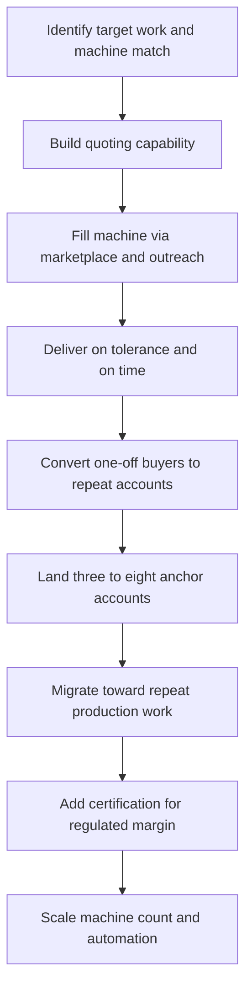

### Direct Answer

To start a CNC machining business in 2027, you buy computer-controlled cutting machines -- vertical mills, turning centers, and increasingly multi-axis machining centers -- write the toolpaths in CAM software, and sell precision custom metal and plastic parts to manufacturers, prototype shops, and aerospace, medical, and defense buyers who need parts made to a drawing. The model is real, durable, and demand-rich, but it is brutally capital-intensive, skill-gated, and quote-disciplined: the entire economics rest on **machine utilization** -- the share of available spindle hours actually cutting billable chips -- and the **fully-burdened shop rate** that hour must recover. Started right, with a used machine bought for $35K-$70K, a real tooling and metrology budget, and disciplined burdened-rate quoting, a one-machine shop is a quietly excellent industrial asset; started wrong, with a financed over-capable machine and blind quoting, it is an anchor that sinks the business.

**TL;DR:** A focused one-machine CNC startup invests **$60K-$220K** in machine, tooling, workholding, metrology, software, and shop deposit; runs at a **25-40% net margin** once the owner is paid; and in a disciplined Year 1 generates **$90K-$320K revenue** against **$25K-$95K owner profit** -- heavily dependent on landing three to eight repeat anchor accounts rather than chasing one-off internet quotes. By Year 3-5 a well-run multi-machine shop reaches **$500K-$2.4M revenue** with **$110K-$480K owner profit**. The three things that kill CNC startups: buying the wrong machine for the work, quoting blind, and under-capitalizing the tooling and metrology that the bare machine price never includes. It is viable in 2027 as a utilization-obsessed, quote-disciplined precision operation built on repeat industrial relationships -- and a poor fit for anyone who wants low capital, fast payback, or passive income.

## 1. What A CNC Machining Business Actually Is In 2027

A CNC machining business owns computer-controlled metal-cutting machines and sells the service of turning a customer's drawing or 3D model into a finished, dimensionally accurate physical part. You are not inventing a product and you are not selling your own catalog; you are a contract manufacturer that an engineer, a buyer, or another manufacturer calls when they need fifty aluminum brackets, one titanium prototype housing, or a recurring monthly run of stainless valve bodies machined to a print.

### 1.1 The Core Of The Work

**Subtractive manufacturing is the foundation.** You start with a solid block, bar, or plate of material -- 6061 and 7075 aluminum, 304 and 316 stainless, 4140 and 4340 steel, titanium, brass, Delrin, PEEK, Ultem -- and you remove material with rotating cutting tools until what remains is the part. **CNC means the machine's movements are program-driven** rather than hand-cranked, so the same part can be made again identically, and complex geometry no manual machinist could hold becomes repeatable. **The deliverable is precision and proof.** Customers pay for tolerances measured in thousandths or ten-thousandths of an inch and for the inspection documentation that proves the part meets the print -- not merely for a chunk of cut metal.

### 1.2 The Forces Shaping 2027

The business is shaped by forces that did not fully exist a decade ago. **Reshoring and supply-chain localization** have pulled real volume back to domestic shops. **Aerospace, defense, medical device, EV, robotics, and semiconductor-equipment demand** is structurally strong. **The skilled-machinist shortage is acute**, which both raises labor cost and creates opportunity for anyone who has the skill. **CAM software and probing** have compressed setup and programming time. **Digital manufacturing marketplaces** -- Xometry (XMTR), Protolabs (PRLB) and its Hubs network, Fictiv, and others -- have changed how some work is discovered and quoted, for better and worse.

### 1.3 What It Is Not

The CNC machining business is **not trendy and not passive.** It is a capital-equipment, skilled-labor, quote-discipline business. The founders who succeed understand that the machine is just iron until it is paired with a programmer who can quote accurately, a metrology process that proves the part is good, and a book of industrial customers who send drawings every month. Anyone seeking a low-capital, fast-payback, hands-off venture should compare this against lighter-asset models like a 3D printing service (q1985) before committing capital.

| Dimension | CNC Machining Reality | Common Misconception |
|---|---|---|
| Capital intensity | High; $60K-$220K+ all-in | "Just buy a machine and quote" |
| Skill gate | Machinist + programmer + estimator | "The software does it" |
| Payback speed | Slow; utilization ramps over Year 1 | "The machine prints money" |
| Revenue model | Repeat industrial accounts | "One-off marketplace quotes" |
| Master metric | Utilization x burdened rate | "Machine rate of $65/hr" |

## 2. Mills, Lathes, And Multi-Axis: The Machine Categories You Actually Buy

The machine is the business, and a founder must understand every category before financing a dollar, because the machine bought in Year 1 dictates what work the shop can quote for years.

### 2.1 Vertical Machining Centers

**Vertical machining centers (VMCs) are the most common starting machine.** A spindle moves in X, Y, and Z over a table holding the workpiece, cutting prismatic parts -- brackets, plates, housings, manifolds. The Haas VF-2 is the archetypal entry VMC; Brother Speedio machines are prized for fast cycle times on smaller parts; Hurco, Doosan, and Okuma sit in the mid-tier; DMG MORI and Makino anchor the high end. Haas itself is built by Haas Automation, a privately held firm, while Okuma trades publicly in Japan and Hexagon (HEXA B) supplies much of the surrounding software and metrology.

### 2.2 CNC Lathes And Turning Centers

**CNC lathes spin the workpiece against a stationary tool to make round parts** -- shafts, pins, bushings, fittings, valve bodies. The Haas ST series, Doosan Lynx, Okuma, and Mazak Quick Turn are common. A lathe with live tooling and a sub-spindle becomes a turn-mill that does far more in one setup, lifting both capability and the achievable rate.

### 2.3 Multi-Axis Machining Centers

**Multi-axis machines cut complex contoured geometry in fewer setups.** A 4-axis machine adds a rotary to a mill; a 5-axis machine tilts and rotates the tool or table to reach undercuts and contours that would otherwise need many setups. They command premium rates -- but only if the founder has the customers and the programming skill to feed them.

### 2.4 Swiss-Type And Benchtop Machines

**Swiss-type lathes make tiny high-precision turned parts in volume** -- medical, connector, and aerospace fasteners -- and are a distinct sub-business. **Desktop and benchtop CNC** -- Tormach, Penta (formerly Pocket NC), Syil -- are real machines at a fraction of the cost and footprint, viable for prototyping, plastics, small parts, and a true bootstrap entry, with the honest limitation that they are slower and less rigid than industrial iron.

### 2.5 The Year-One Machine Mistake

**The Year 1 error is buying aspirationally.** A 5-axis machine with no 5-axis work sits idle while its payment is due; a hobby-grade machine that cannot hold a tenth loses the precision work that pays best. Buy the machine that matches the work you can actually win, and add capability as the customer base pulls it.

| Machine Category | Entry Cost (Used / New) | What It Cuts | Honest Limitation |
|---|---|---|---|
| Benchtop CNC (Tormach, Penta, Syil) | $10K-$30K all-in | Prototypes, plastics, small parts | Slower, less rigid than industrial iron |
| Vertical machining center (Haas VF-2, Brother) | $35K-$70K / $80K-$130K+ | Brackets, plates, housings, manifolds | Prismatic work only without a rotary |
| CNC lathe / turning center (Haas ST, Doosan Lynx) | $30K-$80K / $70K-$150K+ | Shafts, pins, bushings, fittings | Round parts; live tooling adds milling |
| 4-axis / 5-axis machining center | $150K-$500K+ | Complex contours, undercuts, one-setup parts | Needs the customers and skill to feed it |
| Swiss-type lathe | $80K-$300K+ | Tiny high-precision turned parts in volume | Distinct sub-business; specific market |

## 3. The CAM And CAD Software Stack: Where Parts Are Really Made

A CNC machine cannot do anything until someone writes the program, and in 2027 that means a CAD/CAM software stack the founder must choose deliberately.

### 3.1 The CAD Layer

**The 3D model usually comes from the customer**, but the shop needs to open, repair, and sometimes design it. SolidWorks (Dassault Systemes, DSY), Autodesk (ADSK) Inventor and Fusion, Siemens (SIE) NX, PTC (PTC) Creo, and Onshape are the common formats a shop must handle without friction.

### 3.2 The CAM Layer

**CAM software turns a 3D model into toolpaths and machine code** -- it is the shop's core production tool. **Autodesk Fusion** bundles CAD and CAM affordably and has become a genuine entry standard; **Mastercam** (CNC Software, owned by Sandvik, SAND) is the long-standing job-shop workhorse with the deepest toolpath library; **Siemens NX CAM**, **CAMWorks**, **Esprit (Hexagon)**, **GibbsCAM (Sandvik)**, and **SolidCAM** serve more specialized and higher-end needs. The CAM choice is consequential because it directly drives programming speed -- and programming time is billable time the shop either recovers or eats.

### 3.3 Probing And Shop Management

**Probing and macro software on the machine itself** -- Renishaw (RSW), Blum -- automates part setup and in-process measurement, compressing the single most time-consuming non-cutting step. **Shop-management and ERP software** -- ProShop, JobBOSS, E2/Shoptech, and Paperless Parts for quoting -- runs scheduling, traceability, and the paperwork regulated customers demand.

### 3.4 The Honest Software Discipline

**The machine is maybe half the real capability.** The other half is a CAM seat the owner can drive fast, because a brilliant machine fed by slow programming and blind quoting is a money-loser. Budget for the software, the training time, and the post-processor configuration as seriously as for the iron.

| Software Layer | Common Tools | Role | Budget Note |
|---|---|---|---|
| CAD | SolidWorks, Fusion, Inventor, NX, Creo, Onshape | Open, repair, design models | Often customer-supplied |
| CAM | Fusion, Mastercam, Esprit, GibbsCAM, SolidCAM | Toolpaths and machine code | Drives programming speed |
| Probing / macros | Renishaw, Blum | Automated setup and inspection | Compresses non-cutting time |
| Quoting | Paperless Parts, CAM estimation | Standardized estimating | Protects margin |
| ERP / shop mgmt | ProShop, JobBOSS, E2/Shoptech | Scheduling, traceability | Required for regulated work |

## 4. The Three Business Models You Can Build

There are three distinct ways to build this business, and choosing deliberately is one of the most consequential early decisions.

### 4.1 The General Job Shop

**The general job shop takes whatever comes** -- prototypes, low-volume runs, repairs, one-offs -- across many industries and materials. Its advantage is diversification and a wide funnel; its challenge is constant setup churn, low repeatability, and competing on a broad front where every job is re-quoted from scratch. This is the most common starting point and the hardest to make consistently profitable, because setup-heavy variety is the enemy of utilization.

### 4.2 The Regulated Niche Shop

**The regulated niche shop goes deep on one demanding vertical** -- aerospace under AS9100, medical device under ISO 13485 and FDA 21 CFR 820, defense under ITAR registration and sometimes NADCAP-accredited processes. Its advantage is high margins, real pricing power, sticky multi-year relationships, and a moat built of certification competitors cannot quickly copy; its challenge is the cost and discipline of the quality system, slower sales cycles, and concentration risk.

### 4.3 The Production Contract Manufacturer

**The production contract manufacturer wins recurring medium-to-high-volume part numbers**, optimizes setups and fixtures for repeatability, and increasingly runs pallet pools, bar feeders, and lights-out unattended cycles. Its advantage is utilization, predictable revenue, and operating leverage; its challenge is the capital to automate and the customer-concentration risk of depending on a few large programs.

### 4.4 The Migration Path

Many successful shops **start as a general job shop to build cash and relationships, then deliberately migrate toward repeat production work and a regulated certification** as the customer base reveals where the durable margin is. The wrong move is staying a pure one-off job shop forever -- every job re-quoted, every setup new -- and never building the repeat work that makes a machining business actually compound.

| Model | Margin Profile | Capital Need | Primary Risk |
|---|---|---|---|
| General job shop | Variable, often thin | Lower entry | Setup churn, price competition |
| Regulated niche shop | High, defensible | Moderate-high (QMS cost) | Customer concentration |
| Production contract mfr | Strong via leverage | High (automation) | Program concentration |

## 5. The 2027 Market Reality: Demand, Competition, And What Changed

A founder needs an accurate read of the 2027 landscape, because CNC machining is neither the dying smokestack industry some imagine nor the easy gold rush others sell.

### 5.1 Demand Is Structurally Strong

**Reshoring and supply-chain localization have pulled real manufacturing volume back to domestic shops.** Aerospace and defense backlogs are deep at primes such as Boeing (BA), RTX (RTX), and Lockheed Martin (LMT); medical device, surgical robotics, and implant work is growing; EV, energy storage, and grid hardware need machined components; semiconductor-equipment makers consume enormous precision machining; and robotics hardware requires custom parts. The US National Institute of Standards and Technology and manufacturing trade groups consistently document that demand outstrips skilled-machinist supply.

### 5.2 The Competition Is Bifurcated And Aging

**A large share of US machine shops are small, owner-operated, and run by people approaching retirement**, which means both established competition and a real wave of acquirable shops and retiring-owner customers looking for a new supplier. At the top sit large, certified, well-automated contract manufacturers; in the middle and bottom is a long tail of small job shops of widely varying capability and professionalism.

### 5.3 What Changed By 2027

**Digital quoting marketplaces** -- Xometry, Protolabs, Fictiv -- reshaped how prototype and low-volume work is discovered, creating both a lead source and a margin-compressing price reference. **CAM, probing, and automation compressed the cost of precision.** **The machinist shortage made skill itself the scarce asset.** And **customers increasingly expect digital quoting, traceability, and a real quality system** even for modest work. The net market reality: demand is real and durable, the business is harder than its surface because of capital and skill, and the winning entrant competes on reliability and quote accuracy -- not on being the cheapest marketplace quote.

## 6. The Core Unit Economics: Utilization And The Burdened Shop Rate

This is the single most important section in the guide, because the entire business lives or dies on two numbers beginners almost never calculate correctly.

### 6.1 Machine Utilization

**Machine utilization is the percentage of available spindle hours the machine is actually cutting billable chips.** A machine is available perhaps 2,000+ hours a year on a single shift; if it is cutting billable work only 20% of that, you are recovering an $80K machine and a shop's worth of fixed cost against 400 billable hours, and the math does not close. A well-run one-person shop realistically runs **35-55% utilization**; a tuned production shop with fixtures and automation runs higher. Every hour the spindle is not cutting -- programming, setup, waiting for material, waiting for a quote answer, inspection, idle -- is an hour of fixed cost with no revenue against it.

### 6.2 The Fully-Burdened Shop Rate

**The fully-burdened shop rate is the hourly price you must charge to recover everything** -- not just the machine but the rent, the power, the tooling consumption, the software, the insurance, the metrology, the unbillable programming and setup and quoting time, and the owner's pay. Beginners quote a "machine rate" of $60-$75 because that is what they heard, then discover it never covered the programming hour, the setup hour, the inspection, the scrapped part, or their own wage. Build the rate from the actual annual cost stack divided by the realistically billable hours, and a 2027 small shop's honest burdened rate lands closer to **$85-$160 per hour** depending on machine class, region, and tolerance class -- with 5-axis and Swiss work higher.

### 6.3 The Discipline This Imposes

**Before quoting any job, estimate realistic cycle time, then add setup, programming, inspection, material handling, and a scrap allowance, and price the whole thing at the burdened rate** -- not the cutting time at a guessed machine rate. A founder who quotes by burdened rate and protects utilization builds a shop that compounds; a founder who quotes cutting time at a low machine rate builds a shop that is busy, exhausting, and quietly broke.

| Machine Class | 2027 Burdened Rate (per hour) | Realistic Utilization (one-person shop) | Note |
|---|---|---|---|
| 3-axis VMC | $85-$135 | 35-55% | The job-shop workhorse rate |
| CNC lathe / turning center | $80-$130 | 35-55% | Live tooling lifts the rate |
| 5-axis machining center | $120-$200+ | Lower early, needs the work | Premium only if the customers exist |
| Swiss-type precision turning | $90-$160+ | Higher in true volume work | Equipment-specific specialty |
| Quote-blind / no account base | Whatever the gut guesses | 10-20% danger zone | Busy and broke |

## 7. The Line-By-Line Job Economics And P&L

Beyond utilization, a founder must internalize the cost stack of a single job and of the business, because the gross margin and the hidden costs determine whether revenue becomes profit.

### 7.1 The Cost Stack Of A Single Job

Take a representative job: 60 machined 6061 aluminum brackets from plate, a tolerance-moderate part with a couple of setups. **The quote must stack every cost.** **Material** -- the plate or bar plus drop and a markup, because procurement, handling, and the offcut are real cost. **Programming time** -- writing and proving the toolpaths, amortized over the lot. **Setup time** -- workholding, tool setup, first-article -- which on a 60-piece run is a large fraction of total labor. **Cycle time** -- the actual spindle hours at the burdened rate. **Tooling consumption** -- carbide endmills, inserts, and drills wear and break and are a genuine per-job cost. **Inspection** -- in-process and final, including documentation. **Secondary operations** -- deburring, tapping, and outsourced finishing. **Scrap allowance** -- a realistic percentage, because the part you cut wrong is pure loss.

### 7.2 The Margin Math

**Net the job out and a healthy 2027 machine shop runs roughly a 30-50% gross margin before owner overhead**, settling to a **25-40% net margin** once the owner is properly paid and fixed overhead is covered -- with the spread driven almost entirely by quote accuracy, utilization, and scrap control.

### 7.3 The Heavy Fixed-Cost Base

At the business level the fixed-cost base is heavy and unforgiving: **machine payments, shop rent, three-phase power, software seats, insurance, and metrology run whether or not the spindle is turning** -- which is exactly why utilization is the master variable. The founders who fail at the P&L level almost always quoted cutting time instead of the full burdened job, ignored setup and programming as "not real work," under-reserved for tooling and scrap, and let the machine sit idle while fixed costs ran.

| Job Cost Element | Typical Share Of Quote | Beginner Error |
|---|---|---|
| Material + markup | 10-30% | Forgetting drop and handling |
| Programming (amortized) | 5-20% | Treating as free |
| Setup + first article | 10-30% on low volume | Underbilling on small lots |
| Cycle time at burdened rate | 20-50% | The only cost beginners count |
| Tooling consumption | 3-10% | No per-job reserve |
| Inspection + documentation | 3-15% | Skipped until rejected |
| Scrap allowance + margin | 10-25% | Quoting at zero scrap |

## 8. Tooling, Workholding, And The Hidden Half Of The Capital

The single most common under-capitalization error is treating the machine price as the entry cost -- it is roughly half.

### 8.1 Cutting Tools

**Carbide endmills, drills, taps, reamers, and inserts** -- plus the lathe and mill tool holders, collets, and boring bars to hold them -- are a real four-to-five-figure starting investment and an ongoing consumable cost forever, because tools wear and break.

### 8.2 Toolholding And Presetting

**CAT40, BT30, or HSK holders, ER collet systems, shrink-fit, and a presetter or disciplined touch-off process** are required to run the machine at all. A shop that under-buys holders cannot keep the spindle fed.

### 8.3 Workholding

**Precision vises (Kurt and equivalents), chucks and soft jaws for the lathe, fixture plates, clamps, and increasingly custom fixtures** hold the part rigidly and repeatably. A shop with poor workholding cannot hold tolerance or run efficiently.

### 8.4 Material, Air, And Infrastructure

**Raw material** -- a starting inventory of common aluminum, steel, and plastic stock plus a relationship with a metal supplier (Online Metals, Metal Supermarkets, regional service centers) and the cash to buy material before the customer pays. **An air compressor, coolant, swarf and chip management, and shop power** -- machining needs clean dry air, flood or mist coolant, a way to handle chips, and often a three-phase install or rotary phase converter. Totaled, the tooling-and-infrastructure stack frequently runs **$15K-$60K on top of the machine** for a serious one-machine shop -- which is exactly why the honest all-in entry is far above the iron's sticker price.

### 8.5 Why The Hidden Half Sinks Shops

**The under-capitalization failure is structural, not careless.** A founder browsing used-machine listings sees a clean number -- a VF-2 for $48K -- anchors on it, finances exactly that, and arrives at launch with iron and no way to feed it. The bare machine ships with no endmills, no vises, no holders, no calipers, and no material; every one of those is a separate purchase, and together they are not a rounding error but a full second budget. **The tell of an under-capitalized shop is visible within weeks:** the owner is buying tools job-by-job out of customer payments, cannot hold tolerance because the workholding is improvised, and turns away the precision work that pays best because the metrology to prove it does not exist. **The discipline is to budget the tooling, workholding, and metrology stack as a peer of the machine line -- never a remainder -- and to fund it before the machine arrives**, because a financed machine with an empty toolroom is the single most common shape of a failed CNC launch. The same trap catches founders entering a custom welding fabrication business (q9593), where the welder cost is similarly only the visible fraction of the real entry.

## 9. Metrology And Quality: Proving The Part Is Good

A machined part is worthless -- and a liability -- if you cannot prove it meets the print, so a founder must build metrology and quality as a core function, not an afterthought.

### 9.1 Basic Metrology

**Quality calipers and micrometers (Mitutoyo is the reference brand), height gauges, bore and pin gauges, thread gauges, indicators, gauge blocks, and a granite surface plate** are the daily tools that catch a wrong dimension before it becomes sixty scrapped parts.

### 9.2 Advanced Metrology

**A coordinate measuring machine (CMM)** -- bridge, gantry, or portable arm (Hexagon, Zeiss, FaroArm, Keyence) -- and optical and vision systems handle complex parts, tight tolerances, and the inspection documentation regulated customers demand.

### 9.3 First-Article Inspection

**First-article inspection (FAI)** -- the formal documented proof that the first part off a new program meets every dimension -- is a required deliverable for aerospace and many industrial customers (AS9102 format), and a shop that cannot produce a clean FAI cannot win that work.

### 9.4 The Quality System

**Gauge calibration and traceability, material certifications, nonconformance handling, and process documentation** separate a hobby shop from a supplier. The discipline: metrology is woven through machining -- in-process probing, first-article verification, final inspection -- and the cost of a CMM, gauges, and calibration is part of the burdened rate, not a surprise.

### 9.5 Inspection As Part Of The Product

**The founders who get metrology right treat the inspection report as part of the product they sell**, not as overhead. A regulated customer is not buying sixty brackets; it is buying sixty brackets plus the documented, traceable proof that each one meets the print -- and that proof is what justifies a higher price than the marketplace bid. **The founders who skip this ship bad parts**, eat returns and chargebacks, lose customers, and in regulated work expose themselves to genuine product-liability risk. A shop that detects a wrong dimension on the first article saves the cost of fifty-nine more scrapped parts; a shop that detects it only when the customer rejects the lot has lost the material, the machine time, the customer's trust, and often the account. **In-process probing is the highest-leverage metrology investment** for a one-person shop, because it both shortens setup and catches drift before it becomes scrap.

| Metrology Tier | Tools | Catches | When To Buy |
|---|---|---|---|
| Daily metrology | Calipers, mics, gauges, surface plate | Wrong dimension before scrap | At launch, non-negotiable |
| In-process | Renishaw / Blum probing | Setup error and tool drift | Early; shortens setup |
| Advanced | CMM, optical / vision systems | Complex tolerance, documentation | When regulated work justifies |
| Documentation | FAI reports, calibration records | Audit and customer requirements | When entering regulated verticals |

## 10. Certifications: ISO 9001, AS9100, ISO 13485, ITAR, And NADCAP

Certifications are the gates to the highest-margin work, and a founder should understand the ladder even if they do not climb it in Year 1.

### 10.1 The Certification Ladder

**ISO 9001** is the general quality-management-system standard -- the baseline many industrial customers expect. **AS9100** is the aerospace-specific QMS layered on ISO 9001; it is effectively required to be a direct supplier to aerospace and defense primes and is a genuine moat. **ISO 13485** is the medical-device QMS standard, the gate to implant and surgical-instrument work, paired with awareness of FDA 21 CFR 820. **ITAR registration** with the US State Department's DDTC is required to handle defense articles and technical data. **NADCAP** accredits specific special processes -- heat treating, certain finishing, nondestructive testing.

### 10.2 The Strategic Point

**Certification is the deliberate path from a price-competed general job shop to a margin-protected regulated supplier.** It costs real money and ongoing discipline, but it converts the business from one that re-quotes every job against the cheapest bidder into one with sticky, audited, hard-to-displace customer relationships. Most shops earn ISO 9001 first, then add the vertical-specific certification once a customer base justifies it.

| Certification | What It Gates | Difficulty And Cost | Strategic Value |
|---|---|---|---|
| ISO 9001 | General industrial QMS baseline | Moderate; the common first step | Foundation; many customers expect it |
| AS9100 | Direct aerospace and defense prime supply | High cost and ongoing audit discipline | A genuine moat competitors cannot copy |
| ISO 13485 | Medical device, implant, surgical work | High; paired with FDA 21 CFR 820 | Sticky, high-margin regulated demand |
| ITAR registration (DDTC) | Handling defense articles and data | Registration and data-control discipline | Non-negotiable for defense work |
| NADCAP | Special processes (heat treat, NDT) | Process-specific accreditation | Matters when the shop controls those processes |

## 11. The Initial Capex Plan: What To Buy First

With the utilization and tooling discipline established, a founder needs a concrete plan for what to buy first, because the initial capex is the largest single decision and the easiest to get wrong.

### 11.1 The Buying Principle

**Buy the machine that matches the work you can actually win, used before new, with the tooling and metrology budgeted alongside.** A disciplined one-machine launch usually starts with either a used VMC (a Haas VF-2 or VF-3, a Brother Speedio, a Doosan) if the target work is prismatic parts, or a used turning center if the work is round parts -- and the honest decision is driven by the drawings the founder can already see coming.

### 11.2 The Capex Math

For a serious one-machine shop: **machine $35K-$130K** depending on used-versus-new and class; **tooling, workholding, and toolholders $10K-$35K**; **metrology $3K-$25K**; **CAM and shop software seats and training $3K-$15K**; **shop deposit, three-phase power, compressor, and setup $5K-$25K**; **raw-material starting stock and working capital $5K-$25K**; **insurance, formation, and licensing $2K-$8K**. Totaled, a lean bootstrap launch can come in around **$60K-$110K**, and a serious new-machine launch runs **$150K-$300K+**.

### 11.3 The Sequencing Rule

**Prove utilization and quoting discipline on one well-chosen machine before adding the second.** A second machine that doubles the fixed cost but not the customer base is how a one-machine success becomes a two-machine cash crisis. Founders weighing a lower-capital adjacent entry sometimes start with a 3D printed custom parts operation (q9591) to build customer relationships before committing to the iron.

## 12. The Shop: Space, Power, And Physical Infrastructure

A CNC machining business needs real industrial space, and a founder must plan the physical plant as a core cost.

### 12.1 The Shop Space

**The shop needs square footage for the machines plus working clearance, material storage, a setup and tooling bench, a climate-stable metrology area, an office for quoting, and room to grow.** It needs a concrete floor that can take machine weight and be leveled, and doors and access to get a multi-ton machine in -- machine rigging and installation is itself a real cost.

### 12.2 Three-Phase Power

**Three-phase electrical power is often the single biggest infrastructure surprise.** Industrial CNC machines want three-phase power, and a shop without it faces either a utility install or a rotary or static phase converter -- a real cost and a real constraint on which spaces are viable.

### 12.3 Air, Climate, And Waste

**Compressed air** -- clean, dry, adequate volume -- is required for tool changers, workholding, and air blast. **Climate stability** matters for precision: a shop that swings thirty degrees between night and day will see parts measure differently. **Chip and coolant management, ventilation, and waste handling** -- swarf, used coolant, and oil are managed materials with disposal obligations. The infrastructure discipline: the building and its power and air exist whether or not the spindle is turning, which is exactly why the master metric is keeping that spindle cutting billable work.

## 13. Programming, Setup, And The Cycle: Where The Hours Actually Go

This is the operational heart of the business and the single largest hidden cost.

### 13.1 The Labor Arc Of Every Job

Every job has a labor arc that beginners systematically under-count: **quoting** -- reading the drawing, planning operations, estimating, pricing (unbillable unless you win the job); **programming** -- building the CAM model, writing and simulating toolpaths, posting the code; **setup** -- mounting workholding, loading and touching off tools, setting offsets, running the first article; **the cycle** -- the actual cutting; **inspection** -- in-process and final; and **secondary and finishing** -- deburring, tapping, managing outsourced processes. On a low-volume job, the cutting time can be the smallest of these.

### 13.2 Compressing The Non-Cutting Time

**The leverage comes from compressing non-cutting time.** A fast CAM operator, good post-processors, probing for automated setup, standardized workholding, and tool presetting all convert unbillable hours into capacity.

### 13.3 Repeat Work Is The Multiplier

**A part you have made before is already programmed, already fixtured, already proven**, so its setup and programming cost is near zero and its margin is far higher. This is the entire economic argument for migrating from one-offs toward repeat production. The operators who win treat programming and setup as the real, billable, optimizable work it is; the ones who fail treat it as friction before the "real" cutting and never charge for it.

### 13.4 Scheduling As A Constraint Puzzle

**Scheduling a one-machine shop is a constraint puzzle, and getting it wrong destroys utilization as surely as bad quoting does.** One machine can do only one thing at a time, so a shop juggling a rush prototype against a production run against a hot repair must sequence deliberately or it thrashes -- tearing down a setup half-finished, losing the offsets, and re-proving a program it had already proven. **The disciplined operator batches by setup**: parts that share workholding, tooling, or material run together so the expensive non-cutting time is amortized across the group rather than repeated per job. **Promised lead times must reflect the queue, not the cycle time** -- a two-hour part is not a two-hour delivery if there are three jobs ahead of it, and a shop that quotes delivery off raw cycle time will miss dates, lose trust, and lose the repeat account that trust was supposed to build. The same scheduling discipline separates the profitable woodworking shop business (q1994) from the perpetually-behind one.

| Hour Type | Billable? | Typical Share (low-volume job) | Leverage To Compress It |
|---|---|---|---|
| Quoting | Usually not | 5-15% | Quoting software, sweet-spot focus |
| Programming | Amortized into job | 10-25% | Fast CAM operator, post-processors |
| Setup / first article | Yes | 15-35% | Standard workholding, presetting |
| Cycle (cutting) | Yes | 20-50% | Optimized toolpaths, rigid setup |
| Inspection | Yes | 5-15% | In-process probing |
| Secondary / finishing | Yes | 5-15% | Reliable outsource partners |

## 14. Quoting And Estimating: The Skill That Makes Or Breaks The Shop

If utilization is the master metric, **quoting is the master skill**, because every job's profit is decided the moment the quote goes out.

### 14.1 The Disciplined Estimating Process

A founder must build a disciplined estimating process: **read the drawing fully** (every tolerance, finish, material spec, and note changes the cost), **plan the operations and setups**, **estimate cycle time honestly** (CAM simulation and experience, not optimism), **add realistic setup and programming time**, **add material with markup**, **add tooling consumption**, **add inspection and documentation time**, **add a scrap allowance**, **apply the burdened rate**, and **add margin**.

### 14.2 The Two Failure Modes

**The two failure modes are symmetrical and both fatal.** Quote too low and you win the job and lose money -- and the busier you get, the faster you go broke, the cruelest dynamic in the business. Quote too high and you win nothing and the machine sits idle burning fixed cost. The skill is calibrated, honest estimating that wins profitable work at a sustainable rate.

### 14.3 Tools And Sweet Spots

**2027 tools help:** quoting software (Paperless Parts and others) and CAM-integrated estimation speed and standardize the process, and the digital marketplaces provide a market-price reference -- though that reference is often a margin trap, not a target. **Quote the work you are good at:** a shop that quotes everything quotes badly; a shop that knows its sweet-spot materials, sizes, tolerances, and volumes quotes fast and accurately and wins the right jobs.

### 14.4 Calibrating The Quote Over Time

**A quote is a hypothesis, and the disciplined shop closes the loop.** After a job runs, the founder compares the quoted cycle time, setup time, programming time, and scrap rate against what actually happened, and feeds the difference back into the next estimate. A shop that never reconciles quote-to-actual quotes blind forever; a shop that reconciles every job builds, within a year, an estimating instinct that wins profitable work fast. **The early-stage estimating error runs in both directions and both are costly** -- the optimism that wins unprofitable jobs and the over-padding that wins nothing -- and only measured feedback narrows the band. **Track win rate alongside margin:** a 90% win rate usually means the shop is quoting too low and leaving money on every job, while a 10% win rate means the quotes are uncompetitive or aimed at the wrong work. A healthy job shop wins a calibrated fraction of what it bids at a margin that actually clears the burdened rate -- and that fraction is itself a number the founder should watch as closely as utilization.

## 15. Customer Acquisition: Where Machining Work Actually Comes From

A CNC machining business is a relationship-and-reputation business, and work comes from a few specific channels far more than from advertising.

### 15.1 Repeat Industrial Accounts

**Repeat industrial accounts are the foundation** -- a handful of manufacturers, OEMs, and product companies that send drawings every month are worth more than a hundred one-off quotes, because they are already programmed and the relationship is built. **Landing three to eight repeat anchor accounts is the real Year 1 goal.**

### 15.2 Local Manufacturers And Engineers

**Local manufacturers and OEMs** -- the industrial base within driving distance -- are reached through direct outreach, referrals, and showing up. **Engineers and product developers** -- the people who design the parts -- are a durable source because they specify the shop and carry the relationship between employers.

### 15.3 Marketplaces And Referrals

**Digital manufacturing marketplaces** -- Xometry, Protolabs/Hubs, Fictiv -- are a real lead source, especially early and for prototype work, but they compress margin and own the customer relationship, so they are best used as a capacity-filler and a starting funnel, not the foundation. **Referrals from other shops** -- shops refer work they cannot or do not want to do -- make a reliable shop part of that web. The discipline: treat business development as a core ongoing function aimed at converting one-off quotes into repeat accounts.

| Channel | Lead Quality | Margin Impact | Best Use |
|---|---|---|---|
| Repeat industrial accounts | Highest | Best (pre-programmed) | The foundation |
| Local manufacturers / OEMs | High | Strong, direct | Anchor-account building |
| Engineers / product developers | High, durable | Strong | Spec-driven loyalty |
| Tier-supplier to primes | High, sticky | Strong if certified | Regulated volume |
| Digital marketplaces | Variable | Compressed | Early funnel, capacity filler |
| Shop-to-shop referrals | Good | Strong | Overflow and niche fit |

## 16. The Customer Acquisition Funnel

The funnel makes the strategic sequence explicit: capability before volume, delivery reliability before scale, and repeat accounts before any second machine.

## 17. Startup Cost Breakdown: The Honest All-In Number

A founder needs a clear-eyed total of what it costs to launch, because CNC machining is capital-intensive and under-capitalization is a top killer.

### 17.1 The Line Items

**The machine** -- the largest line -- $10K-$30K for a benchtop bootstrap, $35K-$70K for a solid used industrial VMC or lathe, $80K-$130K+ for a new one, with rigging adding $1K-$8K. **Tooling and toolholders** $5K-$25K to start and an ongoing consumable forever. **Workholding** $3K-$15K. **Metrology** $3K-$15K at launch; a CMM is a later $15K-$80K+. **CAM and shop software** $3K-$15K. **Shop space** -- deposit, first months, power install or phase converter, compressor -- $5K-$25K. **Raw material and working capital** $5K-$30K. **Insurance** $2K-$8K. **Business formation, licensing, ITAR if applicable** $500-$3K. A **working-capital reserve** for the slow utilization ramp -- a meaningful $10K-$40K.

### 17.2 The All-In Totals

Totaled, a lean bootstrap launch can come in around **$60K-$110K**, and a serious new-machine launch runs **$180K-$350K+**. Equipment financing softens the machine line, but the founder still needs real cash for tooling, material, and the reserve, because the business has an immediate fixed-cost base and a delayed-payment customer base.

| Cost Category | Bootstrap Launch | Serious New-Machine Launch |
|---|---|---|
| Machine + rigging | $11K-$38K | $81K-$138K |
| Tooling + toolholders | $5K-$25K | $15K-$40K |
| Workholding | $3K-$10K | $8K-$20K |
| Metrology (launch) | $3K-$10K | $10K-$25K |
| CAM + shop software | $3K-$10K | $8K-$18K |
| Shop space + power setup | $5K-$15K | $15K-$35K |
| Material + working capital | $5K-$20K | $15K-$35K |
| Insurance + formation | $3K-$8K | $5K-$12K |
| Working-capital reserve | $10K-$25K | $25K-$50K |
| **All-in total** | **$60K-$110K** | **$180K-$350K+** |

## 18. The Year-One Operating Reality

A founder should walk into Year 1 with accurate expectations, because the gap between the marketed version and the real version of this business is where most quitting happens.

### 18.1 Utilization-Building Mode

**Year 1 is utilization-building and account-building mode, not profit-extraction mode.** The first year is spent learning what the machine can really do, getting fast on the CAM software, calibrating quoting until it actually wins profitable work, and -- the hard part -- landing the three to eight repeat accounts that turn a sputtering machine into a humming one.

### 18.2 The Honest Year-One Numbers

A disciplined Year 1 one-machine CNC startup, launched with a real tooling and metrology budget and a reserve, can realistically generate **$90K-$320K in revenue** against **$25K-$95K in owner profit** -- meaningful but earned through long hours of quoting, programming, setup, and machine-tending, with the owner doing every role. Utilization in the early months is low and painful and climbs only as the account base builds.

### 18.3 Where The Machine Choice Is Tested

**Year 1 is when the founder discovers whether the machine choice was right.** A 5-axis machine with no 5-axis customers, or a machine too small or imprecise for the available work, shows up as idle iron and turned-away quotes. The founders who succeed treat Year 1 as paid tuition in a real precision-manufacturing business; the ones who fail expected a machine that prints money.

### 18.4 The Daily Reality Of The Solo Operator

**The honest Year 1 picture is one person doing six jobs.** The founder is the programmer at the CAM seat in the morning, the setup person and operator at the machine through the day, the inspector at the surface plate, the quoter at the office desk in the evening, and the salesperson on the phone between cycles -- and the bookkeeper on the weekend. **This is not a complaint; it is the design of the business at launch**, and a founder who is not prepared to wear every hat will stall. The work is genuinely hands-on and skill-intensive, the hours are long, and the owner's effective hourly wage in the early months is poor because so many hours are unbillable quoting and chasing. **The reward arrives later** -- as utilization climbs and the first employee absorbs the machine-tending, the founder graduates into quoting, managing, and business development -- but Year 1 is paid in effort, and the founders who quit almost always quit because the marketed version promised a machine that runs while they sleep and the real version handed them a job that consumes every hour.

## 19. The Five-Year Revenue Trajectory

Mapping a realistic five-year arc helps a founder size the opportunity honestly.

### 19.1 Years One Through Three

**Year 1:** one machine, low-then-climbing utilization, account-building, $90K-$320K revenue, $25K-$95K owner profit, founder doing every role. **Year 2:** utilization stabilizes, the founder may add a first employee or a second complementary machine, repeat work starts to dominate; revenue climbs to roughly **$220K-$600K** with owner profit around **$55K-$170K**. **Year 3:** the shop is a real business with a system -- two or three machines, an employee or two, a quoting process, possibly ISO 9001 in progress; revenue lands around **$400K-$1.1M** with owner profit roughly **$90K-$300K**.

### 19.2 Years Four And Five

**Year 4:** continued machine and capability expansion, possible certification opening regulated work, early automation; revenue roughly **$600K-$1.6M**, owner profit **$120K-$400K**. **Year 5:** a mature shop -- $800K-$2.4M revenue, **$150K-$480K owner profit** for a well-run multi-machine operation -- with the founder deciding whether to keep scaling the job shop, go deep on a regulated niche, build a production contract-manufacturing operation, or position for sale.

### 19.3 What The Numbers Assume

These numbers assume disciplined burdened-rate quoting, climbing utilization, real scrap and tooling control, and a migration toward repeat work. They do not assume exponential growth, because a machine shop scales with machine count, skilled labor, and customer base, not magically.

| Year | Revenue Range | Owner Profit Range | Defining Activity |
|---|---|---|---|
| Year 1 | $90K-$320K | $25K-$95K | Account-building, utilization ramp |
| Year 2 | $220K-$600K | $55K-$170K | Second machine, repeat work grows |
| Year 3 | $400K-$1.1M | $90K-$300K | Systemized shop, ISO 9001 in progress |
| Year 4 | $600K-$1.6M | $120K-$400K | Certification, early automation |
| Year 5 | $800K-$2.4M | $150K-$480K | Mature shop; scale, niche, or sell |

## 20. Five Named Real-World Operating Scenarios

Concrete scenarios make the model tangible.

### 20.1 Marcus, The Disciplined Job Shop

**Marcus launches with $95K into a used Haas VF-2**, a real tooling and Kurt-vise and metrology budget, and a Fusion CAM seat. He quotes by a true burdened rate from day one, takes marketplace prototype work to fill the machine early but relentlessly converts those buyers into direct repeat accounts; he hits $240K revenue in Year 1, lands six repeat industrial accounts, adds a used lathe in Year 2, and reaches $780K by Year 3 because his utilization climbed and his quotes actually made money.

### 20.2 Priya, The Wrong-Machine Cautionary Tale

**Priya finances a new $115K 5-axis machine** because it impressed her at the trade show, but her local customer base wants prismatic 3-axis aluminum work. The 5-axis capability sits unused, the payment is due monthly, and she runs 15% utilization on an over-capable machine while quoting blind and underpricing to keep it moving -- cash-strapped by month nine.

### 20.3 Devon, The Aerospace Niche Shop

**Devon starts as a general shop for two years, earns ISO 9001, then commits to AS9100** and becomes a sub-supplier to a defense prime. Smaller customer count but high-margin, sticky, audited multi-year part numbers -- by Year 4 he runs $1.3M at strong margins because the certification is a moat.

### 20.4 The Okafor Brothers, Production Contract Manufacturer

**The Okafor brothers win a recurring medium-volume part family**, fixture and optimize it hard, add a pallet pool and bar-fed lathe, and run lights-out unattended cycles overnight. Year 5 revenue is near $2.1M with the automated production work carrying the best operating leverage.

### 20.5 Tanya, The Under-Capitalized Casualty

**Tanya finances the machine but skips the tooling, workholding, and metrology budget**, launches with hobby-grade calipers and three endmills, cannot hold tolerance or run efficiently, scraps parts she cannot detect until the customer rejects them, and folds in Year 1 -- the canonical illustration of treating the machine sticker as the entry cost.

## 21. Risk Management And Insurance

The CNC machining model carries specific risks, and the 2027 operator manages each deliberately rather than hoping.

### 21.1 Operating And Financial Risks

**Quoting risk** -- the underpriced job that loses money -- is mitigated by disciplined burdened-rate estimating and quoting within a known sweet spot. **Utilization risk** -- the idle machine burning fixed cost -- is mitigated by an account base deep enough to keep the spindle fed. **Scrap and quality risk** is mitigated by metrology woven through the process and a real quality system. **Capital and financing risk** -- over-leveraging on machines whose payments outrun utilization -- is mitigated by buying used and proving one machine before adding the next. **Customer-concentration risk** is mitigated by diversifying the repeat-account base.

### 21.2 Liability, Safety, And Insurance

**Liability risk** -- a machined part that fails in service, especially in aerospace, medical, or defense -- is real and mitigated by quality systems, traceability, appropriate certification, contract terms, and **product and general liability insurance**. **Property and equipment insurance** covers the machines, the shop, and the tooling; **commercial auto** covers delivery. **Safety risk** -- rotating tools, heavy material, sharp chips, coolant, and electrical and pneumatic systems -- is mitigated by training, guarding, procedures, and workers' coverage. **ITAR and compliance risk** is mitigated by registration and disciplined data controls.

| Risk | Primary Mitigation | Insurance / Tool |
|---|---|---|
| Quoting (underpriced job) | Burdened-rate estimating, sweet-spot focus | Quoting software |
| Utilization (idle machine) | Deep repeat-account base | Marketplace as filler |
| Scrap / quality | Metrology woven through process | CMM, FAI discipline |
| Capital / over-leverage | Buy used, prove one machine first | Working-capital reserve |
| Liability (part failure) | Quality system, traceability, certification | Product + general liability |
| Safety | Training, guarding, procedures | Workers' compensation |

## 22. Competitor Landscape: Who You Are Up Against

A founder should understand the competitive field clearly.

### 22.1 The Field

**The large certified contract manufacturers** -- well-capitalized shops with many machines, automation, AS9100 and ISO 13485, and full quality and engineering staff -- own the high-volume regulated programs; they can be slower, less flexible, and uninterested in low-volume and prototype work. **The long tail of small job shops** -- many owner-operated, of widely varying capability, a meaningful share run by owners near retirement -- is the direct competition and also a source of acquirable shops and overflow referral work. **The digital marketplaces** -- Xometry, Protolabs, Fictiv -- are simultaneously a competitor, a lead source, and a margin pressure. **Offshore machining** competes on price for non-time-sensitive, non-regulated, higher-volume work. **Adjacent processes** -- 3D printing, sheet metal, casting -- compete at the edges.

### 22.2 Where A New Entrant Wins

**You generally cannot out-capitalize the large contract manufacturer or out-cheap the offshore shop or the marketplace race**, so you win by being the most reliable, most quote-accurate, most responsive shop for a defined band of work and a defined set of repeat customers. The competitive moat in CNC machining is not the machine -- anyone with capital can buy a VF-2 -- it is the **quoting accuracy, the proven tolerance and delivery reliability, the certifications, the optimized repeat fixtures, and the sticky industrial relationships** that take years to build.

## 23. Financing, Taxes, And Business Structure

Because CNC machining is capital-intensive, a founder should understand the financing and tax structure that softens the launch.

### 23.1 Financing The Iron

**Equipment financing and leasing is the natural fit for the largest line** -- machine builders' captive finance arms and equipment lenders finance CNC equipment routinely. **Used machine purchases** are a major form of cheap capital. **SBA and small-business loans** can fund a broader launch. **Buying an existing shop with seller financing** can be the lowest-risk entry of all, because the machines, customers, certifications, and cash flow already exist. **Reinvested cash flow** funds most healthy growth past Year 1. The discipline: finance the earning iron, but never finance away the working capital.

### 23.2 Entity And Depreciation

**Most machine shops form an LLC or S-corp** for liability protection and tax flexibility; the entity holds the equipment leases, customer contracts, insurance, and certifications. **Depreciation is central to this business's tax picture** -- CNC machines, tooling, and metrology equipment are depreciable assets, and the schedules plus any accelerated or first-year expensing materially shape taxable income, especially in heavy-capex years.

### 23.3 Job Costing And Compliance

**Job costing and accrual accounting matter** because work-in-process, material inventory, and net-30-to-60 receivables make cash-basis accounting misleading; a real job-costing system tied to the quoting process is how a shop knows which jobs and customers actually make money. **Sales-tax treatment varies** -- manufacturing equipment is exempt in many states, and the taxability of the parts sold depends on jurisdiction and whether the customer is a reseller. **Payroll taxes** on machinists and operators become a real cost as the shop hires. The discipline: separate business banking from day one, a job-costing system that ties to the quotes, quarterly attention to sales and estimated taxes, and an accountant who understands equipment-heavy manufacturing.

### 23.4 The Cash-Flow Gap

**The structural cash-flow problem in CNC machining is the gap between an immediate cost base and a delayed-payment customer base.** The shop buys material, burns tooling, runs power, and pays the machine note this week; the industrial customer pays on net-30, net-60, and sometimes longer. **A profitable shop on paper can still run out of cash** if it grows faster than its receivables collect, because every new job consumes material and machine time today and returns money in two months. This is exactly why the working-capital reserve is not optional padding but a core launch line item, and why financing the machine while skipping the reserve is so dangerous: the lender does not bridge the gap, the customer does not pay early, and the shop with iron but no cash cannot buy the material for the next job. **Disciplined operators manage the gap with deposits on large or first-time orders, progress billing on long runs, tight collections, and a reserve sized to cover the receivables float** -- and they treat the day the reserve is exhausted, not the day the shop is unprofitable, as the real failure point.

## 24. Counter-Case: When A CNC Machining Business Is The Wrong Move

Honesty requires a section on who should not start this business and when the model fails outright.

### 24.1 Who Should Not Start

**Anyone seeking low capital, fast payback, or passive income should not start a CNC machining business.** It is one of the most capital-intensive small businesses available, with a delayed-payment customer base, a heavy fixed-cost stack, and a Year 1 utilization ramp that pays the owner poorly. A founder who wants a lighter-asset entry into custom-parts manufacturing should look hard at a 3D printing service business (q1985) or a 3D printed custom parts business (q9591) first, where the equipment cost and the skill gate are materially lower.

### 24.2 The Skill-Gate Failure

**A founder with no machinist skill, no programming ability, and no estimating instinct will fail regardless of capital.** The machine does not run itself; CAM software does not quote for you; and the cruelest failure mode -- winning underpriced work and going broke faster the busier you get -- is purely a skill failure. Hiring the skill is possible but expensive in a machinist shortage, and a non-technical owner who cannot evaluate a quote, a part, or a programmer is dangerously exposed.

### 24.3 When The Numbers Do Not Close

**The model fails when utilization stays structurally low.** A shop in a region with a thin industrial base, a founder who cannot do business development, or a machine mismatched to the available work will see the spindle idle while fixed costs run -- and no amount of effort overcomes 15% utilization on a financed machine. **It also fails on under-capitalization:** financing the machine while skipping tooling, workholding, metrology, and the reserve produces a shop that physically cannot make a profitable part. If a founder cannot fund the full all-in number plus a reserve, the honest answer is to wait, buy an existing shop instead, or choose a lighter model. The counter-case is not that CNC machining is a bad business -- it is an excellent one for the right operator -- but that it is unforgiving of the wrong operator, the wrong machine, and the wrong capitalization.

## 25. Bottom Line And Action Plan

A CNC machining business in 2027 is a real, durable, demand-rich precision-manufacturing operation -- and a brutally capital-intensive, skill-gated, quote-disciplined one. The founder who succeeds is utilization-obsessed, quotes every job at a true burdened rate, budgets the hidden half of the capital, builds metrology and quality as core functions, and relentlessly converts one-off quotes into repeat industrial accounts. The founder who fails buys the wrong machine, quotes blind, and under-capitalizes the tooling and reserve. Start with a used machine matched to work you can already see coming; fund the full all-in number plus a reserve; get relentlessly better at the quote; and treat Year 1 as paid tuition. Founders comparing adjacent manufacturing ventures should weigh this against a custom welding fabrication business (q9593), a CNC machining shop business (q9592), a woodworking shop business (q1994), and a vending machine business (q1937) to confirm CNC machining truly matches their capital, skill, and risk tolerance before financing a dollar.

## Sources

1. US National Institute of Standards and Technology (NIST) -- manufacturing extension and skilled-workforce data.
2. US Bureau of Labor Statistics -- machinists and tool-and-die makers occupational outlook.
3. Association for Manufacturing Technology (AMT) -- US machine tool order and consumption reports.
4. National Tooling and Machining Association (NTMA) -- precision manufacturing industry data.
5. Precision Machined Products Association (PMPA) -- shop economics and turning-industry benchmarks.
6. US Census Bureau -- manufacturing establishment and shipment statistics.
7. SAE International -- AS9100 aerospace quality management system standard.
8. SAE International -- AS9102 first-article inspection requirement.
9. International Organization for Standardization -- ISO 9001 quality management systems.
10. International Organization for Standardization -- ISO 13485 medical device QMS.
11. US Food and Drug Administration -- 21 CFR Part 820 Quality System Regulation.
12. US State Department Directorate of Defense Trade Controls (DDTC) -- ITAR registration.
13. Performance Review Institute -- NADCAP special-process accreditation overview.
14. Haas Automation -- VF series and ST series machine specifications and pricing guidance.
15. Brother -- Speedio machining center specifications.
16. DMG MORI -- machining center and automation product literature.
17. Mazak -- turning and multi-tasking machine documentation.
18. Okuma -- VMC and turning center specifications.
19. Autodesk -- Fusion CAD/CAM product documentation.
20. CNC Software / Sandvik -- Mastercam capability documentation.
21. Siemens Digital Industries Software -- NX CAM documentation.
22. Hexagon Manufacturing Intelligence -- Esprit CAM and metrology product literature.
23. Renishaw -- machine-tool probing and inspection product documentation.
24. Mitutoyo -- precision measuring instrument catalog and reference data.
25. Zeiss -- coordinate measuring machine product literature.
26. Kurt Workholding -- precision vise and workholding specifications.
27. Paperless Parts -- machine shop quoting and estimating platform documentation.
28. Xometry -- digital manufacturing marketplace public filings and platform data.
29. Protolabs -- digital manufacturing and Hubs network public filings.
30. Fictiv -- on-demand manufacturing platform overview.
31. US Small Business Administration -- equipment financing and SBA loan program guidance.
32. Online Metals and Metal Supermarkets -- raw material pricing references.
33. Modern Machine Shop -- job shop operations and shop-rate benchmarking articles.
34. Production Machining -- precision turning and Swiss machining industry coverage.
35. IBISWorld -- US machine shop and CNC industry market reports.
