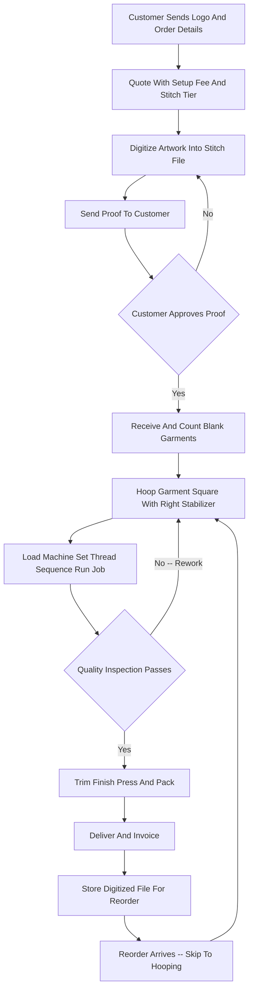

### Direct Answer

To start an embroidery business in 2027, you buy one or more commercial multi-needle embroidery machines, learn to digitize artwork into machine-readable stitch files, and decorate apparel and accessories -- caps, polos, jackets, beanies, bags, uniforms, and patches -- for businesses, schools, teams, and events, charging a per-logo decoration price plus a one-time setup fee while the same digitized design runs hundreds of times at near-zero marginal cost. The model is real, durable, and unusually capital-light for a manufacturing business, but it lives or dies on three numbers most beginners never run: **stitch count**, **machine utilization**, and **rework rate**. Net it out: viable in 2027 as a disciplined, stitch-count-literate, B2B-relationship-driven production shop -- and a poor fit for anyone who wants a hands-off business or treats a $300 hobby machine as a commercial tool.

**TL;DR**

- **What it is:** a skilled light-manufacturing business that converts a customer's logo into a stitch file once, then sews it repeatedly onto apparel for businesses, schools, and teams at a marginal cost of cents and minutes.
- **Startup cost:** roughly **$10K-$25K** for a lean prosumer-machine garage launch, **$20K-$45K** for a solid commercial single-head launch, **$50K-$120K+** for a multi-head production launch.
- **Economics:** a disciplined shop runs a **45-62% net margin** once setup fees and digitizing are priced correctly; Year 1 generates **$40K-$150K revenue** against **$25K-$80K owner profit**.
- **The three killers:** underpricing or waiving the setup/digitizing fee, buying a machine too small or too cheap, and ignoring stitch-count math by quoting flat per-piece prices.
- **Five-year arc:** a shop that adds capacity and an operator reaches **$150K-$500K revenue** with **$60K-$180K owner profit** by Year 3.
- **Fit test:** great for a founder who enjoys craft, machinery, and B2B relationships; wrong for anyone wanting a passive, push-button business.

## What An Embroidery Business Actually Is In 2027

### 1.1 The Core Engine

An embroidery business owns commercial sewing machinery that stitches thread designs -- logos, names, monograms, mascots, text -- onto apparel and fabric goods, and sells that decoration repeatedly to businesses, organizations, and individuals. **You are not selling blank shirts and you are not a screen printer.** You are the shop that takes a customer's logo, converts it into a machine-readable stitch file, hoops the garment, runs the job, and hands back caps, polos, jackets, bags, beanies, towels, patches, and uniforms with a clean, durable, raised thread mark on them.

The entire business is a single idea executed thousands of times: **you do the slow, skilled, one-time work of digitizing a design once, and then that file runs on the machine over and over** -- on this week's twenty-four polos, next month's reorder, and next year's new-hire batch -- at a marginal cost of thread, stabilizer, and machine time measured in cents and minutes. That is the engine. Everything else in this guide is the machinery that lets you run that engine profitably without scarring garments, missing deadlines, or giving away the skilled prep work for free.

### 1.2 What Changed By 2027

In 2027 the business is shaped by realities that did not all exist a decade ago. **Customers expect a digital proof and an emailed or online quote**, not a back-and-forth of faxed art. **The contract-decoration and broker ecosystem** means a small shop can run other people's orders without doing any sales. **On-demand and small-batch corporate ordering has grown**, which suits embroidery's low setup cost relative to screen printing. And the machinery itself has made a professional operation reachable on a small-business budget. The embroidery business is not passive and it is not trendy. **It is a skilled light-manufacturing business:** a machine, a thread wall, a digitizing screen, a stack of blanks, a hooping station, and a phone full of businesses that need their logo on things again and again. The closest decoration cousin is screen printing (q1988), and the natural adjacent crafts are custom apparel (q1992) and print-on-demand merch (q9589) -- but embroidery's durable, raised, premium thread mark is its own distinct product.

### 1.3 Embroidery Versus The Adjacent Decoration Methods

| Method | Best for | Setup cost per design | Per-piece floor | Durability |
|---|---|---|---|---|
| Embroidery | Caps, polos, jackets, logos, uniforms | Digitizing $25-$150 | Higher (machine time) | Highest -- raised thread |
| Screen printing | Large flat graphics, big runs of tees | Screens $15-$40 each | Lowest at volume | High but flat |
| DTG (direct-to-garment) | Full-color complex graphics, low runs | Near zero | Moderate | Moderate |
| Sublimation | All-over, polyester, hard goods | Near zero | Moderate | High on polyester |
| Heat transfer / vinyl | Names, numbers, small batches | Low | Moderate | Lower over wash cycles |

## The Machine: The Whole Decision

### 2.1 Why The Machine Is The Business

The machine is the business, and the single most consequential early decision a founder makes. **Get it wrong and every job afterward is slower, more error-prone, and less profitable.** The constraint that kills embroidery shops is throughput -- one head sews one garment at a time -- so the founder should buy the most machine the launch budget honestly allows. Buying too cheap -- a four-needle home machine, a no-name import with no parts support -- is the classic Year 1 error: the machine becomes the bottleneck, breaks at the worst time, and cannot hold quality on caps or thick goods.

### 2.2 The Machine Tiers

Embroidery machines split into clear tiers. **Prosumer multi-needle machines** -- the Brother PR-series (PR680W six-needle, PR1055X ten-needle) and the Ricoma EM-series -- run roughly $5,000-$15,000 and are the realistic entry point for most solo founders. **Commercial single-head machines** -- the Tajima TMEZ-SC1501, the Melco EMT16X, the Ricoma MT-series -- run roughly $9,000-$20,000 and are built for all-day duty cycles. **Industrial single- and multi-head machines** -- from Tajima, Barudan, ZSK, and SWF -- run from roughly $20,000 for an industrial single-head into $50,000-$200,000+ for two-, four-, six-, and eight-head configurations.

| Tier | Example machines | Heads / needles | Price range | Best for |
|---|---|---|---|---|
| Prosumer multi-needle | Brother PR680W, PR1055X; Ricoma EM-series | 1 head, 6-10 needles | $5,000-$15,000 | Solo founder entry; capped at one head |
| Commercial single-head | Tajima TMEZ-SC1501; Melco EMT16X; Ricoma MT-series | 1 head, 12-15 needles | $9,000-$20,000 | Serious shop; all-day duty cycle |
| Industrial single-head | Tajima, Barudan, ZSK, SWF | 1 head, 15 needles | $20,000-$30,000+ | High-speed production single |
| Industrial multi-head | Tajima, Barudan, ZSK, SWF | 2-8 heads | $50,000-$200,000+ | Production shop; one operator, many heads |

### 2.3 The Real Brands And Operators

The embroidery-machine market is dominated by a handful of real, named manufacturers a founder will quote against and buy from. **Brother Industries (Tokyo: 6448, OTC: BRTHY)** owns the prosumer multi-needle entry tier with the PR-series and the PE-Design software. **Tajima** and **Barudan** are the Japanese industrial standard for commercial single- and multi-head machines. **Melco** (US-based, EMT16X) and **Ricoma** (US-based) serve the commercial-and-prosumer middle. On the digitizing-software side, **Wilcom** sets the professional standard and owns the Hatch consumer tier. None of these are pure-play public stocks a founder buys shares in -- embroidery equipment is a private, dealer-distributed market -- so the founder's "investing" decision is which physical machine to put in the shop, not which ticker to buy.

### 2.4 New Versus Used

New versus used is a real lever. **A well-maintained used Tajima or Barudan from a closing shop is often the best value in the market** -- but used demands a knowledgeable buyer or an inspection. The machine is not where to save money; it is the asset the entire business runs on. A ten-needle prosumer machine is a fine start, but the founder must understand they are buying a single head, and that as orders grow the answer is a second machine or a multi-head, not heroics.

## Digitizing: The Skill That Separates A Business From A Hobby

### 3.1 What Digitizing Actually Is

Digitizing -- converting a piece of artwork into a stitch file the machine can read -- is the skilled core of the embroidery business. **A logo does not arrive ready to sew.** Someone must decide stitch types (satin, fill, run), underlay, push-and-pull compensation, stitch direction, density, sequencing, and trims, and produce a file that sews cleanly on the actual fabric without puckering, gapping, or thread breaks. The founder's relationship to digitizing defines the shop.

### 3.2 The Three Ways To Handle It

**Learn to digitize in-house** using software like Wilcom EmbroideryStudio (the professional standard, $4,000-$10,000+), Hatch Embroidery (Wilcom's subscription-priced consumer-to-prosumer tier), Pulse Tajima DG/ML, Embird, or the machine-bundled tools (Brother PE-Design); this is the highest-margin path because every setup fee becomes profit instead of a pass-through cost. **Outsource digitizing** to dedicated services that charge roughly $10-$40 per standard logo; this lets a founder launch without the learning curve, but it adds cost and a dependency. **Hybrid** -- outsource at first, learn in parallel, bring it in-house as volume justifies -- is what most disciplined founders actually do.

| Digitizing software | Tier | 2027 cost | Notes |
|---|---|---|---|
| Brother PE-Design | Machine-bundled | $0 included to low thousands | Fine to start; limited pro features |
| Embird | Modular | $150-$700 | Lower-cost modular toolset |
| Hatch Embroidery (Wilcom) | Prosumer subscription | $200-$1,500 / year | The most common prosumer path |
| Wilcom EmbroideryStudio | Professional | $4,000-$10,000+ | The professional standard |
| Pulse Tajima DG/ML | Professional | $4,000-$10,000+ | Tajima-aligned professional suite |
| Outsourced service | Per-logo | $10-$40 per design | No learning curve; ongoing dependency |

### 3.3 Why Digitizing Must Be Billed

The critical point a beginner misses: **digitizing is real labor that must be billed.** The setup or digitizing fee on a quote -- typically $25-$150 per design -- exists precisely to pay for this skilled, unbillable-feeling hour of work, and the founders who waive it to win the order are giving away the one thing that funds the front end of every job. Stitch-count literacy comes from digitizing too: once a founder understands that a design's stitch count divided by the machine's real stitches-per-minute is the actual production time, pricing stops being guesswork.

## Stitch Count: The Core Unit Economics

### 4.1 Stitch Count Is The True Unit Of Production

This is the most important section in the guide, because the entire business prices on a number most beginners never calculate. **Stitch count is the true unit of production.** Every design has a stitch count -- a simple left-chest logo might be 4,000-8,000 stitches, a detailed left chest 8,000-15,000, a full jacket back 30,000-60,000+, a dense cap front 5,000-12,000. A commercial machine sews at a real-world *effective* rate -- not the headline maximum, but the practical rate after color changes, trims, and frame moves -- of roughly 500-850 stitches per minute on caps and 600-1,000+ on flats. **Divide stitch count by effective speed and you get the honest production time:** a 10,000-stitch logo at 700 effective spm is about fourteen minutes of machine run time, plus hooping, loading, and trimming.

### 4.2 Why Pricing By The Piece Is Dangerous

A shop that charges "$8 per polo" makes money on a 6,000-stitch left chest and loses money on a 14,000-stitch left chest that takes more than twice as long. **The disciplined shop prices on a stitch-count tier:** a base price covers a logo up to, say, 8,000 stitches, with a per-thousand-stitch charge above that, plus the setup fee, plus the garment cost and handling.

| Design type | Stitch count | Effective spm | Run time | Realistic decoration charge |
|---|---|---|---|---|
| Simple left-chest logo | 4,000-8,000 | 600-1,000 (flat) | 5-12 min | $5-$12 |
| Detailed left-chest logo | 8,000-15,000 | 600-1,000 (flat) | 10-22 min | $10-$25 |
| Dense cap front | 5,000-12,000 | 500-850 (cap) | 8-20 min | $5-$15 |
| Full jacket back | 30,000-60,000+ | 600-1,000 (flat) | 35-90+ min | $20-$60+ |
| Left chest + full back combo | 38,000-70,000+ | mixed | 45-100+ min | $30-$80+ |

### 4.3 Utilization And Rework

The other half of unit economics is **utilization**: the machine has a fixed cost whether it runs or not, so the founder's job is to keep it sewing. A single-head running productively eight to ten hours a day on real jobs is a business; the same machine running two hours a day is an expensive hobby. And **rework** is the silent margin killer -- a misframed garment, a thread break that scars a polo, a wrong-thread-color run, a misread proof -- because every redo consumes machine time, a blank, and the deadline, with zero revenue against it. **Stitch count tells you what to charge, utilization tells you whether the machine earns its keep, and rework rate tells you how much of that you are quietly throwing away.**

## The Line-By-Line Job Economics And P&L

### 5.1 A Representative Job

Take a representative order: 48 polos, customer-supplied logo, an 8,500-stitch left chest. **The revenue stack:** decoration at, say, $7 per polo is $336, plus a one-time $50 setup/digitizing fee, plus -- if the shop supplies the garments -- 48 polos marked up over wholesale cost. **The cost stack, in the order beginners underestimate:**

- **Thread and stabilizer** -- genuinely cheap per piece, cents to a couple of dollars; this is the part that makes embroidery feel like free money and misleads beginners.
- **Machine run time** -- the real variable cost; at roughly twelve minutes a polo plus hooping and handling, that 48-piece run is several hours of loaded operator-and-machine time and the largest cost in the job.
- **Digitizing/setup labor** -- the front-loaded skilled hour the setup fee must cover.
- **Blank garment cost** -- if the shop supplies blanks, a real pass-through with a markup that must beat the customer buying their own.
- **Rework reserve** -- a realistic few percent of jobs need a redo.
- **Consumables and maintenance** -- needles, bobbins, machine oil, the periodic tech visit.
- **Fixed overhead** -- shop space, software subscription, insurance, the machine's depreciation or financing payment, marketing, admin.

### 5.2 The Shop-Level Margin

| P&L line | Share of a healthy job | Notes |
|---|---|---|
| Decoration + setup revenue | 100% | The full top line of the decoration ticket |
| Loaded machine + operator time | 25-35% | The single largest cost |
| Thread, stabilizer, consumables | 3-8% | Cheap per piece -- the misleading line |
| Rework reserve | 2-5% | Held low by the proof step and hooping standard |
| Fixed overhead allocation | 10-20% | Space, software, insurance, depreciation |
| Net margin | 45-62% | Driven by setup fee, stitch pricing, low rework |

Net it out and a disciplined embroidery shop runs a **45-62% net margin**, with the spread driven almost entirely by whether the setup fee is charged, whether pricing follows stitch count, and how low the rework rate is held. The founders who fail on the P&L almost always made the same errors: they saw the cheap thread and concluded the business was high-margin without accounting for machine-and-operator time, they waived the setup fee to land the job, and they quoted by the piece so the dense jobs quietly bled the margin the simple jobs earned.

## What You Decorate: The Product Categories

### 6.1 The High-Volume B2B Core

The product mix shapes the shop's pricing, equipment needs, and customer base. **Caps and hats** are the embroidery signature product -- structured and unstructured caps, beanies, visors, trucker hats, performance caps -- and they require a cap frame or cap driver and the skill to sew on a curved, seamed surface; caps are high-demand, high-margin, and the category that most distinguishes an embroidery shop from a screen printer. **Polos and woven shirts** are the corporate-uniform backbone -- the steady, repeat-order, B2B core of most embroidery shops. **Jackets and outerwear** carry the highest decoration tickets because they support large, dense backs and multiple logo placements. **Uniforms and workwear** -- restaurant, hotel, healthcare, automotive, trades -- are a recurring-demand goldmine because uniformed businesses reorder constantly as staff turn over.

### 6.2 The Higher-Touch And Niche Categories

**Bags and totes** decorate well and pair naturally with corporate and event orders. **Towels, blankets, and home goods** are a niche but real category, especially for golf, spa, and gift markets. **Patches and emblems** -- embroidered patches the shop makes, sells, or applies, including for first responders, scouts, and brands -- are a distinct sub-product. **Performance and technical apparel** requires care -- thin, stretchy, moisture-wicking fabrics need the right stabilizer, needle, and digitizing or they pucker. **Monogramming and personalization** -- names, initials, individual personalization on towels, robes, bags, baby goods -- is a higher-touch, often direct-to-consumer line some shops build a whole business around, with overlap into the Etsy and handmade-goods world (q1953).

| Product category | Demand profile | Margin | Equipment note |
|---|---|---|---|
| Caps and hats | High, year-round | High | Cap frame / cap driver required |
| Polos and woven shirts | Steady, B2B recurring | Moderate-high | Standard hoops |
| Jackets and outerwear | Seasonal, high ticket | Highest | Large hoops for backs |
| Uniforms and workwear | Recurring, reorder-driven | Moderate-high | Standard hoops |
| Bags and totes | Corporate and event | Moderate | Specialty / pocket frames |
| Patches and emblems | Niche, distinct product | High | Can run as a stocked product |
| Monogramming / personalization | Higher-touch, often DTC | High | Standard hoops; more handling |

## The Three Models

### 7.1 The Owner-Operator Shop

There are three distinct ways to build this business, and choosing deliberately matters. **The owner-operator shop model** -- one founder, one or two machines, serving local businesses, schools, teams, and individuals directly -- is the most common starting point: low overhead, the founder does sales, digitizing, and production, and the business is built on local relationships and repeat orders. Its advantage is control, low cost, and high margin per job; its limit is that throughput and the founder's hours cap revenue.

### 7.2 The Production / Contract-Decoration Shop

**The production and contract-decoration shop model** runs volume -- often multi-head machines -- and serves not just end customers but **brokers, promotional-products distributors, screen printers, and other decorators** who sell the job and contract out the embroidery. Its advantage is that sales are partly outsourced to the broker network and the machines stay full; its challenge is thinner per-job margins, dependence on broker relationships, and the capital for multi-head equipment.

### 7.3 The Branded Apparel Program

**The branded direct-to-business apparel program model** sells a managed program -- the shop handles design, sourcing, decoration, inventory, and sometimes fulfillment and online company stores -- to businesses that want their branded apparel handled, not just stitched. Its advantage is the deepest customer relationships, the highest tickets, and recurring revenue; its challenge is that it requires sales, design, sourcing, and fulfillment capabilities beyond the machine. **The wrong move is trying to be all three at once in Year 1:** the production ambition needs capital the owner-operator does not have, and the branded-program model needs a sales-and-design motion a one-person shop cannot run while also sewing.

| Model | Capital need | Sales burden | Margin per job | Path |
|---|---|---|---|---|
| Owner-operator shop | Low ($10K-$45K) | Founder does all sales | Highest | Most common start |
| Production / contract | High (multi-head) | Partly outsourced to brokers | Thinner | Volume-and-utilization play |
| Branded apparel program | Moderate-high | Heavy -- sales and design | High tickets, recurring | Upmarket evolution |

## The 2027 Market Reality

### 8.1 Demand Is Structurally Healthy

A founder needs an accurate read of the 2027 landscape. **Demand is structurally healthy and recurring.** Logos on apparel are not discretionary for businesses -- uniformed companies reorder as staff turn over, schools and teams reorder every season, corporations refresh swag and onboard new hires, and the promotional-products channel runs continuously. The demand is B2B, repeat, and relatively recession-resilient because branded apparel is an operating expense, not a luxury.

### 8.2 The Competition Is Bifurcated

At the top sit large decorators and the online giants -- **Cimpress (NASDAQ: CMPR)**, the parent of Vistaprint, along with Custom Ink, 4imprint (LON: FOUR), and national contract decorators -- with scale, automated ordering, and broad reach. At the bottom is a long tail of home-based one-machine operators and side hustlers. **The opportunity for a disciplined new entrant is the underserved local middle:** businesses that want a responsive local shop that answers the phone, handles a rush reorder, gets the proof right, and knows their account -- something the online giants do not do well and the casual side hustler does not do reliably.

### 8.3 What Changed By 2027

Customers expect digital proofs, emailed or online quotes, and fast turnaround; the broker and promotional-products ecosystem makes contract work easy to access; small-batch and on-demand corporate ordering grew, which favors embroidery's low per-design setup cost; prosumer multi-needle machines and capable subscription-priced software lowered the entry barrier, which both helps new founders and thickens the low-end competition; and design tools (including AI-assisted art cleanup) modestly speed the front end. **The winning 2027 entrant competes on responsiveness, quality, stitch-count-honest pricing, and B2B relationships rather than on being the cheapest logo in town.**

## Startup Cost Breakdown: The Honest All-In Number

### 9.1 The Line Items

A founder needs a clear-eyed total, because embroidery is unusually capital-light for a manufacturing business but still has a real launch number.

| Line item | Lean garage launch | Commercial single-head launch | Multi-head production launch |
|---|---|---|---|
| Embroidery machine | $5,000-$12,000 | $12,000-$20,000 | $50,000-$100,000+ |
| Digitizing software | $0-$1,500 | $1,500-$10,000 | $4,000-$10,000 |
| Hooping and framing gear | $300-$1,000 | $700-$2,000 | $2,000-$5,000 |
| Thread, bobbins, stabilizer | $400-$900 | $700-$1,500 | $1,500-$4,000 |
| Starter blank inventory | $500-$2,000 | $1,500-$3,000 | $3,000-$8,000 |
| Computer for software | $0-$1,000 | $500-$1,500 | $1,000-$2,500 |
| Formation, licensing, insurance | $500-$1,500 | $1,000-$2,500 | $2,000-$4,000 |
| Website, samples, marketing | $500-$2,000 | $1,000-$3,000 | $3,000-$6,000 |
| Space setup | $200-$1,500 | $1,000-$3,000 | $5,000-$15,000 |
| Working-capital cushion | $2,000-$5,000 | $4,000-$8,000 | $10,000-$25,000 |
| **Total** | **~$10,000-$25,000** | **~$20,000-$45,000** | **~$50,000-$120,000+** |

### 9.2 The Honest Point

Financing softens the machine line -- equipment financing is common and the machine is good collateral -- but the founder still needs real cash for thread, blanks, and the working-capital gap. **Embroidery has one of the lowest capital barriers in light manufacturing, which is genuinely attractive** -- but "low" is not "zero," and the founder who launches on a $300 home machine with no software and no setup fee has not started a business, they have bought a hobby. The capital intensity sits between a near-zero-capital print-on-demand merch operation (q9589) and a heavier custom-fabrication shop like welding (q9593) or 3D-printed parts (q9591).

## Inventory: Blanks, Thread, And Stabilizer

### 10.1 Blanks: Customer-Supplied Versus Shop-Supplied

A founder must decide how to handle blanks. **Customer-supplied** means the customer brings or ships the garments and the shop decorates only -- lower capital, no blank inventory risk, but the shop must handle the liability of decorating goods it did not source (a thread break that scars a customer's $90 jacket is a real problem) and earns only the decoration revenue. **Shop-supplied** means the shop buys blanks wholesale from distributors like **SanMar, S&S Activewear, alphabroder, or Augusta** and marks them up -- more capital and inventory risk, but a second margin stream and full control over garment quality. Most shops do both.

### 10.2 Thread And Stabilizer As A Managed Function

**Thread** is run as a managed wall -- polyester thread (Madeira Polyneon, Robison-Anton, Isacord, Glide) in the full common-color range, plus rayon for sheen and specialty threads (metallic, glow, variegated) for niche work -- and the discipline is keeping the common colors deep so a job is never held up waiting on a spool. **Stabilizer (backing)** -- cut-away for stretchy and knit goods, tear-away for stable wovens, plus topping for textured fabrics like fleece and piqué -- is the unglamorous consumable that, chosen wrong, causes the puckering and registration problems that generate rework.

| Inventory class | Examples | Reorder discipline |
|---|---|---|
| Blank garments | SanMar, S&S Activewear, alphabroder, Augusta | Stock common caps/polos/tees; order to job otherwise |
| Polyester thread | Madeira Polyneon, Isacord, Robison-Anton, Glide | Keep common colors deep; reorder-point the wall |
| Stabilizer / backing | Cut-away, tear-away, topping, wash-away | Never run out of cut-away and tear-away |
| Machine consumables | Needles, bobbins, machine oil | Reorder-pointed; spares always on hand |

The point: thread and stabilizer are cheap per piece, but a stockout of the right color or backing stops production. The founder who treats consumables as a real, reorder-pointed inventory keeps the machine running.

## Sales And Lead Generation: The B2B Relationship Engine

### 11.1 The Channels That Matter

Embroidery is a B2B relationship business, and the lead-generation engine is repeat business customers far more than walk-in retail. **Local businesses with uniforms** are the core target -- restaurants, hotels, salons, auto shops, contractors, medical and dental offices, retail stores, real estate and insurance offices -- because a uniformed business reorders continuously as staff turn over, making one good account a multi-year revenue stream. **Schools, sports teams, clubs, and youth organizations** are a seasonal but reliable channel. **Corporate accounts** order employee apparel, trade-show swag, client gifts, and new-hire kits. **Promotional-products distributors and brokers** sell the job and contract the embroidery out. **Other decorators** -- screen printers without an embroidery machine -- subcontract embroidery to a local shop.

| Channel | Recurrence | Sales effort | Revenue character |
|---|---|---|---|
| Uniformed local businesses | Very high -- staff turnover | Moderate, relationship-based | The defensible revenue floor |
| Schools / teams / clubs | Seasonal but reliable | Moderate -- one relationship spawns many | Spirit wear, booster orders |
| Corporate accounts | Recurring -- refreshes, new hires | Higher -- account management | High-ticket, proof-driven |
| Promo brokers / distributors | High -- fills machine time | Low -- broker does the selling | Thinner margin, high utilization |
| Other decorators (contract) | Variable | Low | Subcontract overflow |
| Events / weddings / reunions | Episodic | High per job | One-off direct demand |

### 11.2 Conversion Tools And The Discipline

The conversion tools are a clean website with a portfolio, branded samples the founder can show, a fast and professional quote-and-proof process, and a presence in local business networks; paid advertising plays a modest role. **The discipline: treat business development as a core ongoing function**, because an embroidery shop with a base of repeat uniform-and-team accounts has a steady, defensible revenue floor, while one relying on one-off retail orders competes constantly for the next job.

## Pricing Strategy: Setup Fees, Stitch Tiers, And Minimums

### 12.1 The Pricing Layers

Pricing in embroidery has several layers, and a founder must get each right because the margin is built into the quote. **The setup/digitizing fee** -- typically $25-$150 per new design -- pays for the skilled art-prep hour and is the single most given-away and most important fee in the business. **Stitch-count tier pricing** is the honest basis for the decoration charge. **Per-piece decoration pricing within a tier** is what the customer sees, but it must be derived from the stitch-count and time math, not pulled from a competitor's website. **Quantity tiers** -- price breaks at 12, 24, 48, 144 pieces -- reflect the real economy of a longer run amortizing the hooping setup. **Order minimums** protect against tiny jobs that cost more in setup and handling than they earn.

### 12.2 A Representative 2027 Price Sheet

| Item / fee | Typical 2027 price | Notes |
|---|---|---|
| Cap embroidered | $5-$15 | Cap frame required; high margin |
| Polo embroidered | $8-$25 | The B2B uniform core |
| Jacket / outerwear | $15-$60 | Supports large dense backs |
| Bag / tote | $8-$20 | Pairs with corporate orders |
| Beanie | $6-$15 | Seasonal demand |
| Setup / digitizing fee | $25-$150 per design | Pays for the art-prep hour; charge it |
| Per-1,000 stitches above base tier | a few cents-$1 | Makes dense jobs pay their machine time |
| Rush fee | +25-50% | Manages the queue |
| Second logo placement | +$3-$10 | Multi-location fee |
| Bulk discount (24+/48+) | 15-30% off | Longer runs amortize setup |

### 12.3 The Seasonal Layer

The seasonal layer matters too: back-to-school (mid-summer into fall), fourth-quarter corporate and holiday gifting, and spring sports create demand peaks that a shop can price firmly into and must staff and schedule around. **The founders who misprice almost always do the same three things** -- waive the setup fee, quote flat per-piece prices that ignore stitch count, and accept tiny no-minimum jobs.

## Equipment Beyond The Machine: The Full Shop Setup

### 13.1 The Job-Critical Supporting Gear

The machine is the centerpiece, but a functioning embroidery shop needs a full setup. **Hoops and frames** are job-critical -- a range of standard hoop sizes, **cap frames or a cap driver** specific to the machine for the high-value cap work, magnetic hoops (which speed hooping and reduce hoop burn on delicate goods), and specialty frames for items like bags and pockets. **A hooping station or hooping aids** -- jigs and guides that make hooping fast, square, and consistent -- directly affect throughput and quality, because crooked or loose hooping is a leading cause of rework.

### 13.2 The Rest Of The Shop

| Equipment | Purpose | Rough cost |
|---|---|---|
| Cap frames / cap driver | High-value curved cap work | $300-$1,200 |
| Standard + magnetic hoops | Flat goods; faster hooping | $200-$800 |
| Hooping station / jigs | Fast, square, consistent hooping | $150-$600 |
| Thread rack / wall | Visible, organized color range | $100-$400 |
| Heat press | Patches, names, heat-transfer cross-sell | $300-$2,000 |
| Scissors, trimmers, hot-knife | Trims and patch finishing | $100-$300 |
| Lighting + inspection area | Catching defects before delivery | $100-$500 |
| Storage, shelving, packaging | Blanks, finished orders, consumables | $200-$1,500 |

A founder who budgets only for the machine and discovers afterward that they need cap frames, a hooping station, a heat press, and a thread wall is under-capitalized. **The full shop setup is the machine plus a real list of supporting equipment, and skimping on the hooping and frame side shows up immediately as slower production and higher rework.**

## The Year-One Operating Reality

A founder should walk into Year 1 with accurate expectations. **Year 1 is skill-building and account-building mode, not profit-extraction mode.** The first year is spent climbing the genuine learning curves -- digitizing well, hooping fast and square, running caps and stretchy goods without puckering, dialing in thread and stabilizer choices, recovering from thread breaks and machine hiccups -- and building the base of repeat B2B accounts that turns the shop from one-off-order chasing into a business with a revenue floor.

A disciplined Year 1 solo embroidery shop, launched with a real commercial machine and the setup fee actually charged, can realistically generate **$40,000-$150,000 in revenue** against **$25,000-$80,000 in owner profit**. The work is genuinely hands-on: the founder is digitizing, hooping, running the machine, trimming, doing proofs, quoting, and delivering. Year 1 is also when the founder discovers whether the machine choice was right -- a too-slow or too-small machine shows up as a bottleneck and missed deadlines the moment volume builds. **The founders who succeed treat Year 1 as paid tuition in a skilled production business;** the ones who fail expected a passive logo-printing business, waived the setup fee to win every job, bought too little machine, and never built the repeat-account base.

## The Five-Year Revenue Trajectory

Mapping a realistic five-year arc helps a founder size the opportunity.

| Year | Setup | Revenue | Owner profit | What is happening |
|---|---|---|---|---|
| Year 1 | One commercial machine, founder does everything | $40K-$150K | $25K-$80K | Skill and account building; machine choice tested |
| Year 2 | Second machine considered, first part-time operator | $120K-$300K | $50K-$130K | Accounts compound; digitizing in-house and fast |
| Year 3 | Two+ machines or multi-head, operators, documented workflow | $200K-$500K | $70K-$180K | A real shop; founder selling more than sewing |
| Year 4 | Continued capacity, possible broker/branded work | $350K-$750K | $100K-$250K | Stronger seasonal staffing |
| Year 5 | Mature multi-machine operation | $450K-$1M+ | $130K-$300K | Decide: scale, contract, branded, or sell |

These numbers assume the setup fee is charged, pricing follows stitch count, rework is held low, and the throughput ceiling is broken with capacity rather than founder hours. **They do not assume exponential growth, because embroidery scales with machine heads and operator capacity, not magically.** A mature embroidery business is a real light-manufacturing small business with machines, a workflow, a crew, and a base of recurring accounts -- a genuinely good outcome, earned through years of skill and pricing discipline.

## Five Named Real-World Operating Scenarios

### 14.1 Marisol -- The Disciplined Owner-Operator

Marisol launches with $32K into a commercial single-head Tajima, Wilcom software she commits to learning, a full cap-frame setup, and a real thread wall; she charges the setup fee on every new design without apology, prices on stitch-count tiers, and spends Year 1 landing a dozen recurring uniform accounts -- two restaurants, an auto-repair chain, a dental group, a landscaping company. She hits $95K revenue in Year 1, adds a second machine and a part-time operator in Year 2, and reaches $310K by Year 3 because her machines run full on repeat orders and her pricing actually covers her time.

### 14.2 Bryce -- The Cautionary Tale

Bryce buys a $400 four-needle home machine and no real digitizing software, waives the setup fee on every job, and quotes flat per-piece prices off a competitor's site. The home machine bottlenecks and breaks under real load, the dense jacket-back jobs he quoted flat lose money, and he never built recurring accounts because he was always chasing the next one-off. He is out by month fourteen, having confused a hobby machine and hobby pricing for a business.

### 14.3 Devon -- The Contract Production Shop

Devon goes capital-heavy from the start with a used four-head Barudan, builds relationships with three promotional-products distributors and two local screen printers, and runs almost no end-customer sales -- the brokers fill his heads. Thinner per-job margins, but high utilization and almost no sales overhead, and by Year 3 he is running $480K in contract revenue with the machines rarely idle.

### 14.4 The Okafor Family -- Branded Apparel Program

The Okafors start owner-operator for two years building accounts and skill, then layer a managed-program offering on top -- design, sourcing, decoration, an online company store, and fulfillment for a set of corporate clients who want their branded apparel handled, not just stitched. Higher tickets, recurring revenue, and the deepest relationships, with Year 5 revenue near $900K.

### 14.5 Tanya -- The Underpricing Casualty

Tanya buys a solid commercial machine and is genuinely skilled, but never charges the setup fee, quotes by the piece ignoring stitch count, and accepts every tiny no-minimum job. She is busy constantly, the machine runs full, and she still cannot pay herself a real wage because the front-end art prep and the dense jobs are unbilled -- **the canonical illustration that good equipment and skill cannot outrun broken pricing.**

## Workflow And Production Management

### 15.1 The Job Arc

A founder must build a repeatable production workflow, because embroidery is a multi-step process where errors compound. The job arc: **intake** -- capture the customer's art, garment details, quantities, placement, due date, and approve a quote; **digitizing** -- convert the art to a stitch file, or send it out; **proof** -- show the customer a sew-out or digital preview and get sign-off before production; **garment prep** -- receive, count, and stage the blanks; **hooping** -- hoop each garment square and snug with the right stabilizer; **production** -- load the machine, set the thread sequence, run the job, monitor for thread breaks; **finishing** -- trim jump stitches and backing, inspect every piece; **packing and delivery** -- count out against the order, package, and deliver; **file management** -- store the digitized file and job details so the inevitable reorder is fast.

### 15.2 The Disciplines That Make It A System

The disciplines that make this a system rather than a scramble: **a proof-and-approval step that is never skipped**, because it is the cheapest possible place to catch an error; **stored, organized stitch files** so reorders take minutes; **a job-tracking method** so nothing is lost and due dates are visible; **a defined hooping standard** so quality does not depend on who hooped it; and **scheduling around the seasonal peaks** so back-to-school and Q4 do not become missed-deadline crises. The shops that run a documented workflow can take on more volume with fewer errors and bring on an operator who follows the system.

## Common Year-One Mistakes That Kill The Business

A founder can avoid most failure modes by knowing them in advance, because the mistakes here are remarkably consistent.

- **Underpricing or waiving the setup/digitizing fee** -- giving away the skilled art-prep hour is the single most common margin-destroying error.
- **Buying too little machine** -- a cheap home or four-needle machine bottlenecks production, breaks under load, and cannot hold quality on caps and thick goods.
- **Pricing by the piece and ignoring stitch count** -- charging flat prices that win on simple logos and quietly lose on dense ones.
- **Not learning to digitize** -- staying permanently dependent on outsourced digitizing, surrendering margin and quality control.
- **Skipping the proof-and-approval step** -- running unapproved jobs that come back as full-order rework.
- **Accepting tiny no-minimum jobs** -- taking orders that cost more in setup and handling than they earn.
- **Choosing the wrong stabilizer** -- causing the puckering and registration failures that generate rework.
- **Sloppy or inconsistent hooping** -- the leading hands-on cause of defects and redos.
- **Not building recurring B2B accounts** -- living on one-off retail orders and competing for every next job.
- **Under-capitalizing the supporting equipment** -- budgeting for the machine but not cap frames, hooping station, thread wall, and heat press.
- **No file management** -- failing to store digitized files so every reorder is a re-digitize.
- **Ignoring machine maintenance** -- skipping oiling, needle changes, and tech service until a breakdown hits in peak season.

Every one of these is avoidable; the founders who fail almost always made several, and the founders who succeed treated this list as a pre-launch checklist.

## Risk Management And Insurance

### 16.1 The Specific Risks

The embroidery model carries specific risks, and the 2027 operator manages each deliberately.

| Risk | What it looks like | Mitigation |
|---|---|---|
| Garment damage | Thread break scars a customer's jacket | Skilled operation, proof step, careful hooping, written goods policy |
| Equipment failure | Machine down in peak season stops revenue | Quality machine, routine maintenance, second machine as you grow |
| Customer-supplied goods liability | Owning the outcome on property you did not source | Written policy that customers accept the risk; test sew-outs |
| Rework and quality | Redos consume time, blanks, deadlines | Proof step, hooping standard, correct stabilizer |
| Deadline risk | Missed back-to-school or event date loses the account | Realistic scheduling, capacity planning, rush-fee pricing |
| Cash flow and seasonality | Demand peaks; blanks bought before payment | Working-capital cushion, deposits, clear payment terms |
| Concentration risk | Over-dependence on one account or broker | Diversified base of accounts |

### 16.2 Insurance

**General liability and equipment/property coverage are the baseline**, with consideration for coverage on customer goods in the shop's care, custody, and control -- this turns a bad incident into a claim rather than a loss. The throughline: every major risk in embroidery has a known mitigation built from skill, the proof step, maintenance, a written goods policy, scheduling discipline, and basic insurance.

## Financing, Taxes, And Business Structure

### 17.1 Financing The Machine

Because the machine is the dominant cost, a founder should understand the financing options. **Equipment financing** is the natural fit -- the embroidery machine is a tangible, collateral-quality asset, and dealers and lenders routinely finance new and sometimes used machines. **Used equipment** is itself a form of cheap capital. **SBA and small-business loans** can fund a broader launch including a multi-head machine and working capital. **Seller financing** can apply when buying an existing embroidery business -- sometimes the lowest-risk entry. **Reinvested cash flow** funds most healthy growth past Year 1. **The financing discipline:** finance the earning asset, but keep real cash for thread, stabilizer, a starter blank inventory, and the working-capital gap.

### 17.2 Taxes And Entity Structure

Most embroidery operators form an **LLC or S-corp** for liability protection and tax flexibility. **Depreciation is central to the tax picture** -- the embroidery machine and supporting equipment are depreciable assets, and the schedules and any available accelerated or first-year expensing materially shape taxable income, especially in a heavy-capex launch or expansion year. **Sales tax** applies to most embroidery transactions, and the founder must get collection and remittance right from day one and obtain a resale certificate to buy blanks wholesale. The discipline: separate business banking from day one, a bookkeeping system that tracks the machine as a depreciable asset and blanks and thread as cost of goods, and an accountant who understands equipment-heavy small manufacturing.

## Owner Lifestyle: What Running This Business Feels Like

In **Year 1**, running a solo shop, the founder is fully in the work -- taking the customer call, digitizing the art, sending the proof, receiving the blanks, hooping every garment, running the machine through thread breaks, trimming and inspecting, packing, delivering, invoicing. It is skilled, detailed, hands-on work, closer to running a small production line than to managing a passive asset. By **Year 2-3**, with a second machine and an operator following a documented workflow, the founder's role shifts toward selling, digitizing, quoting, managing the queue, and handling the accounts. By **Year 3-5**, with multiple machines and a small crew, the founder can run a real shop with a more managerial rhythm -- though embroidery never becomes fully hands-off.

The emotional texture: real satisfaction in a crisp sew-out, a clean cap, a happy repeat account, and a machine running full and right; and real stress in a thread break that scars a customer's jacket, a digitizing file that will not sew clean, and a machine down in peak season. **A founder who enjoys craft, machinery, problem-solving, and B2B relationships will find it genuinely rewarding;** a founder who wanted a quiet, hands-off, push-a-button logo business will be surprised by how much skill and attention it actually demands.

## Niche And Specialty Paths Worth Considering

Beyond the general B2B shop, a founder should understand the specialty paths, because a focused niche is the better business for some operators. **Cap and headwear specialty** serves teams, breweries, outdoor brands, and the broker channel with a high-margin focus. **Monogramming and personalization** is a higher-touch, often direct-to-consumer line, with overlap into the Etsy and handmade market (q1953). **Patches and emblems** is a distinct product business. **Greek/collegiate and team spirit wear** is a seasonal, relationship-driven niche. **Workwear and uniform programs** lean into embroidery's most recurring demand. **Contract digitizing** -- selling digitizing as a service to other decorators -- is a low-capital, skill-only niche. **Adding complementary decoration** -- screen printing (q1988), sublimation (q1991), heat transfer, vinyl decals (q1993), and promotional products -- turns the shop into a full-service decorator. **The mistake is not choosing a focus; it is being mediocre across everything.**

## Scaling Past The Single-Machine Ceiling

The jump from a proven one-machine owner-operator shop to a multi-machine production business is its own distinct challenge. **The prerequisites for scaling:** the Year-1 pricing must genuinely work (do not scale on top of broken pricing -- it just multiplies the loss), the digitizing-and-production workflow must be documented well enough that an operator can run it, and the cash flow must support the next machine and the space.

**The scaling levers:** break the throughput ceiling with capacity -- a second single-head, or a multi-head where one operator runs several heads sewing the same design at once; hire and train operators to the documented workflow so the founder moves from the machine to selling and managing; bring digitizing fully in-house and build a fast, organized stitch-file library; deepen the recurring-account base and add the broker/contract channel so the added capacity stays full; possibly move out of the garage into commercial space; and consider complementary decoration to become a full-service decorator. **The founders who scale well share one trait -- they treated Year 1 as a pricing-and-workflow proving exercise**, so growth was the repetition of a profitable, documented machine rather than a bigger version of a money-losing scramble.

## Exit Strategies And The Long-Term Picture

Embroidery businesses can be exited, and a founder should build with the eventual exit in mind. **Sell the operating business** -- an embroidery shop with quality machines, a deep library of digitized customer files, a base of recurring B2B accounts, a documented workflow, and clean books is a saleable asset; valuations typically run as a multiple of stabilized earnings. **Sell the assets** -- commercial embroidery machines hold real resale value, a genuine floor under the business that pure-service ventures lack. **Acquire and roll up** -- a mature operator can grow by buying smaller shops' equipment, file libraries, and accounts. **Transition to family or a key operator.** **Wind down gracefully** -- because the machines hold value and the file library and accounts can be sold, an operator can exit with real proceeds.

The honest long-term picture: **embroidery is a durable, real business** -- businesses will keep putting logos on apparel, the demand is recurring, the capital barrier is low, and a well-run shop produces real owner profit for years -- but it is a business, not a passive holding. A founder should think of a 2027 launch as building a tangible, equipment-backed light-manufacturing small business with multiple genuine exit paths.

## A Decision Framework: Should You Actually Start This In 2027

A founder deciding whether to commit should run a structured self-assessment.

| Test | The question | Pass condition |
|---|---|---|
| Capital | Do you have $20K-$45K for a commercial launch, $10K-$25K for a lean start, or financing plus consumables cash? | Real launch capital, not a few hundred dollars |
| Skill willingness | Will you genuinely learn digitizing, hooping, thread-and-stabilizer judgment, and maintenance? | Yes -- you accept the skill curve |
| Pricing discipline | Will you charge the setup fee, price on stitch tiers, and hold minimums under pushback? | Yes -- non-negotiable |
| B2B orientation | Will you do the ongoing work of landing and keeping recurring business accounts? | Yes -- you will sell |
| Hands-on temperament | Can you run a skilled, deadline-driven production process on the machine yourself in Year 1? | Yes -- not seeking passive |
| Local market fit | Is there enough B2B demand and an underserved responsive-local middle in your area? | Yes -- the middle is open |

If a founder answers yes across all six, an embroidery business in 2027 is a legitimate and achievable path to a **$150K-$500K+ small business with $60K-$180K+ in owner profit.** If they answer no on capital or pricing discipline, they should not start. If they answer no on skill willingness specifically, the business will never get past hobby quality.

## The 2027-2030 Outlook

A founder committing capital should have a view on where the business goes. **Demand stays structurally healthy** -- branded apparel is an operating expense for businesses, schools, and teams. **Small-batch and on-demand ordering keeps growing**, which structurally favors embroidery's low per-design setup cost relative to screen printing's higher minimums. **The machinery and software keep improving and getting more accessible** -- which both helps new founders and thickens the low-end competition. **Design and art-prep tooling keeps speeding the front end** -- AI-assisted art cleanup and better auto-digitizing as a starting point, though skilled digitizing judgment remains a real differentiator. **The broker and contract-decoration ecosystem stays strong.** **Full-service decoration consolidates** -- shops that add screen printing, DTG, heat transfer, and promotional products capture more of each account. **Consolidation continues at the regional level** -- well-run shops absorb the accounts that under-capitalized hobby operators cannot keep.

**The net outlook: embroidery is viable and durable through 2030 in its disciplined, stitch-count-literate, B2B-relationship-driven, quality-first form.** The version that thrives is a professional shop that charges the setup fee, prices on stitch count, runs a documented workflow, keeps the machines full with recurring accounts and contract work, and competes on responsiveness and quality.

## Counter-Case: Why Starting An Embroidery Business In 2027 Might Be A Mistake

The case above describes a viable business, but a serious founder must stress-test it against the conditions that make this model a bad bet.

### 18.1 The Structural Counters

- **The low capital barrier attracts a flood of undercutters.** The low end is crowded with home-based one-machine operators and side hustlers who will decorate a dozen shirts for nearly nothing. A new entrant who competes on price is in a race to the bottom that nobody wins.
- **It is a skilled trade, not a push-button business.** Digitizing, hooping, thread tension, stabilizer selection, running caps and stretchy technical fabrics without puckering -- these are real skills with real learning curves. A founder who will not invest months in genuinely learning the craft will produce hobby-quality work.
- **The setup fee is the margin, and customers fight it.** A founder who cannot hold the line on the setup fee -- under pressure, on every quote -- has given away the front-end margin of every job.
- **Pricing by the piece quietly bleeds the margin.** A shop that ignores stitch count makes money on the simple jobs and loses it on the dense ones, netting out to a business that feels busy and pays nothing.
- **The single head is a hard throughput ceiling.** One machine sews one garment at a time. Breaking the ceiling requires more capital, not more effort.

### 18.2 The Operational And Market Counters

- **Garment damage is owning someone else's property going wrong.** One bad incident on an expensive customer order can wipe out the profit of many good ones.
- **It is deadline-driven and seasonally compressed.** Back-to-school, Q4, and spring sports bunch demand into stressful windows where a missed date loses the account.
- **Machine downtime stops the entire business.** On a one-machine shop, a breakdown in peak season is a full stop, not a slowdown.
- **The online giants own the easy retail end.** Cimpress/Vistaprint, Custom Ink, and 4imprint own the simple one-off retail order; the only defensible ground is the responsive-local-B2B middle.
- **Customer-supplied art is often a mess.** The gap between "here's our logo" and "a file that sews clean" is wider than beginners assume.
- **Margins are real but the absolute numbers are modest at solo scale.** A disciplined solo shop nets $25K-$80K in Year 1 -- a real income, but not a fortune.
- **Adjacent decoration methods may fit better, or be necessary.** Screen printing serves large flat-print runs; DTG serves full-color graphics; customers increasingly want one decorator for everything.

### 18.3 The Honest Verdict

Starting an embroidery business in 2027 is a reasonable choice for a founder who has the capital for a real commercial launch, will genuinely learn the craft, will charge the setup fee and price on stitch count under pressure, understands the single-head ceiling, will build recurring B2B accounts, and can run a skilled, deadline-driven production process. **It is a poor choice for anyone who is under-skilled and unwilling to learn, anyone who cannot hold pricing discipline, anyone who wants a passive push-button business, and anyone who would compete on price at the crowded low end.** The model is not a scam, but it is more skilled, more throughput-constrained, and more pricing-sensitive than its low-capital-barrier surface suggests.

## The Final Framework: Building It Right From Day One

Pulling the entire playbook into a single operating framework, a founder should execute in this order:

1. **Get honest about capital and temperament** -- confirm the launch capital and the appetite for a skilled, hands-on production business.
2. **Buy the most machine the budget honestly allows** -- a real commercial single-head or capable prosumer multi-needle, never a hobby machine.
3. **Commit to digitizing** -- learn it in-house on real software, or outsource at first while learning.
4. **Build stitch-count-literate pricing** -- a setup fee on every new design, stitch-count tiers, quantity tiers, and order minimums.
5. **Set up the full shop** -- cap frames, hooping station, thread wall, stabilizer range, and supporting equipment.
6. **Build a repeatable workflow** -- intake, digitize, proof-and-approve (never skipped), prep, hoop, run, finish, inspect, pack, and store the file.
7. **Target recurring B2B accounts** -- uniformed businesses, schools, teams, corporate, and the broker channel.
8. **Hold rework low** -- through the proof step, consistent hooping, correct stabilizer, and machine maintenance.
9. **Carry basic insurance and a written customer-goods policy.**
10. **Set up the books and tax structure** -- LLC or S-corp, a resale certificate, COGS and depreciation tracking.
11. **Break the single-machine ceiling with capacity** -- a second machine or a multi-head and a trained operator, once pricing and workflow are proven.
12. **Keep the exit options open** -- quality equipment, a deep digitized-file library, recurring accounts, and clean books make the business sellable.

Do these twelve things in order and an embroidery business in 2027 is a legitimate path to a real, equipment-backed light-manufacturing small business. **The business is neither a passive logo-printing goldmine nor a saturated dead end.** It is a real, skilled, capital-light-but-not-capital-free production business, and in 2027 it rewards exactly one kind of founder: the disciplined, stitch-count-literate operator who treats it as the skilled manufacturing business it actually is.

## Related Pulse Library Entries

For founders comparing this against adjacent decoration and craft-manufacturing models, these sibling entries are the most relevant:

- The closest decoration cousin and the most natural complementary method to add (q1988).
- A direct sibling on the custom embroidery shop model (q9590).
- The near-zero-capital decorated-merch model that sits one tier below embroidery's capital intensity (q9589).
- A polyester-and-hard-goods decoration method that pairs with an embroidery shop (q1991).
- The broader custom apparel model embroidery feeds into (q1992).
- A low-capital decoration craft with overlapping customers (q1993).
- An equipment-based custom-decoration shop with comparable throughput economics (q9596).
- A custom-fabrication equipment business with similar capital and utilization thinking (q9591).
- The 3D-printing service model as an adjacent equipment-and-skill business (q1985).
- A craft-and-equipment manufacturing shop with shop-setup parallels (q1994).
- The handmade-and-personalization marketplace channel many monogramming shops use (q1953).

## Sources

1. **Brother USA -- Embroidery Machines** -- Manufacturer documentation and pricing references for the PR-series multi-needle machines (PR680W, PR1055X) and PE-Design software. https://www.brother-usa.com
2. **Tajima USA -- Commercial Embroidery Machines** -- Manufacturer references for the TMEZ-SC1501 single-head and Tajima multi-head commercial machines. https://www.tajimausa.com
3. **Melco -- EMT16X Commercial Embroidery Machine** -- Manufacturer documentation for the EMT16X single-head commercial machine. https://melcou.com
4. **Ricoma -- Commercial Embroidery Machines** -- Manufacturer references for the EM-series and MT-series single-head machines. https://www.ricoma.com
5. **ZSK Stickmaschinen -- Industrial Embroidery Machines** -- Manufacturer references for the Sprint and industrial multi-head machines. https://www.zsk.de
6. **Barudan -- Commercial And Industrial Embroidery Machines** -- Manufacturer references for single- and multi-head commercial machines. https://barudan.com
7. **Wilcom -- EmbroideryStudio Digitizing Software** -- The professional-standard digitizing software; product and pricing references. https://www.wilcom.com
8. **Hatch Embroidery (Wilcom) -- Digitizing Software** -- Subscription-priced consumer-to-prosumer digitizing software references. https://www.hatchembroidery.com
9. **Pulse Microsystems -- Tajima DG/ML Digitizing Software** -- Professional digitizing software references. https://www.pulsemicro.com
10. **Embird -- Embroidery Digitizing And Editing Software** -- Lower-cost modular digitizing software references. https://www.embird.net
11. **Madeira USA -- Embroidery Thread And Stabilizer** -- Polyneon polyester thread, rayon, specialty thread, and backing references. https://www.madeirausa.com
12. **Robison-Anton (American & Efird) -- Embroidery Thread** -- Polyester and rayon embroidery thread references. https://www.amann.com
13. **Isacord (Amann Group) -- Polyester Embroidery Thread** -- Polyester embroidery thread color and product references. https://www.amann.com
14. **SanMar -- Wholesale Blank Apparel Distributor** -- Wholesale blank apparel and headwear sourcing for shop-supplied garments. https://www.sanmar.com
15. **S&S Activewear -- Wholesale Blank Apparel Distributor** -- Wholesale blank apparel sourcing references. https://www.ssactivewear.com
16. **alphabroder -- Wholesale Apparel And Promotional Products Distributor** -- Wholesale blank and promotional sourcing references. https://www.alphabroder.com
17. **US Bureau of Labor Statistics -- Textile, Apparel, and Furnishings Workers / Sewing Machine Operators** -- Wage and occupational data context for embroidery-machine operator labor. https://www.bls.gov/ooh
18. **US Small Business Administration -- Business Structures and Financing** -- Reference for entity selection, SBA loans, and small-business equipment financing. https://www.sba.gov
19. **IRS -- Depreciation, Section 179, and Bonus Depreciation Guidance** -- Tax treatment of embroidery machines and equipment as depreciable assets. https://www.irs.gov
20. **IBISWorld -- Embroidery And Custom Apparel Decoration Industry Reports** -- Industry size, growth, and structure context for custom decoration. https://www.ibisworld.com
21. **NFIB -- Small Business Economic Trends** -- Small-business operating-condition and demand context. https://www.nfib.com
22. **Impressions Magazine -- Apparel Decoration Trade Publication** -- Industry journalism on embroidery, screen printing, and apparel decoration practices. https://impressionsmagazine.com
23. **Printwear / Apparelist -- Decoration Industry Trade Coverage** -- Trade coverage of embroidery equipment, pricing, and shop operations.
24. **PPAI (Promotional Products Association International)** -- Industry association context for the promotional-products and broker channel. https://www.ppai.org
25. **ASI (Advertising Specialty Institute)** -- Promotional-products distributor network and broker-channel context. https://www.asicentral.com
26. **PRINTING United Alliance (formerly SGIA)** -- Industry association resources for apparel decoration businesses. https://www.printing.org
27. **NNEP (National Network of Embroidery Professionals)** -- Industry group for embroidery business operators; pricing and operations context. https://www.nnep.com
28. **Equipment Leasing and Finance Association (ELFA)** -- Reference for equipment financing structures applicable to embroidery machines. https://www.elfaonline.org
29. **BizBuySell -- Business Valuation and Sale Listings (Embroidery And Apparel Decoration)** -- Reference for going-concern valuations and exit multiples in the decoration category. https://www.bizbuysell.com
30. **SCORE -- Small Business Mentoring and Planning Resources** -- Business planning, cash-flow, and pricing guidance for small manufacturing businesses. https://www.score.org
31. **Brother Industries Investor Relations** -- Corporate and product context for the parent of the PR-series prosumer machines. https://global.brother
32. **Cimpress / Vistaprint Investor Relations** -- Public-company context for the online mass-customization competitor. https://www.cimpress.com
33. **4imprint Group plc Investor Relations** -- Public-company context for the promotional-products online competitor. https://investors.4imprint.com
34. **Cap Frame And Hooping Equipment Manufacturer Documentation** -- Cap-frame, magnetic-hoop, and hooping-station product references.
35. **State and Local Sales Tax Authorities -- Decoration And Apparel Transaction Taxability** -- Reference for sales tax, resale certificates, and decoration-versus-supply taxability.
36. **Used Embroidery Equipment Marketplaces And Dealer Listings** -- Sourcing references for well-maintained used commercial machines from closing and upgrading shops.
