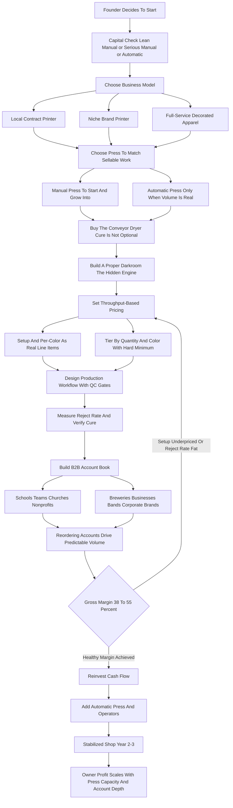

### Direct Answer

To start a screen printing business in 2027, you buy a press and a curing system, build a light-safe darkroom, and turn blank garments into decorated apparel for bulk orders — school spirit wear, team uniforms, band merch, brewery and corporate staff shirts, and apparel brands. The model is real and durable but margin-thin, labor-intensive, and brutally dependent on production efficiency: the economics rest on one number most beginners never calculate — prints per hour at an acceptable reject rate. A disciplined Year 1 startup invests roughly $8K–$60K, runs a 38–55% gross margin, and earns $20K–$70K in owner profit; a well-run shop reaches $250K–$900K in revenue and $70K–$260K in profit by Year 2–4 once an automatic press and a small crew are in place.

**TL;DR:** Screen printing in 2027 is a manufacturing business wearing a creative costume. Direct-to-garment and sublimation have permanently taken the low-volume, many-color end of the market, so screen printing's durable territory is the bulk order — 50, 100, 500, 5,000 identical pieces — where it remains dramatically cheaper per unit than any digital method. The three things that kill startups: **(a) underpricing setup and screen labor**, the largest hidden cost on short runs; **(b) buying the wrong press** — a manual press chokes on the volume that pays, an automatic press starves without volume to feed it; and **(c) ignoring reject rate and reorder discipline**. Viable as a throughput-obsessed, B2B-relationship-driven production shop — a poor fit for anyone who wants a clean creative job, fast payback, or a business without ink under their fingernails.

## 1. What A Screen Printing Business Actually Is In 2027

### 1.1 The Core Definition

A screen printing business takes blank garments — t-shirts, hoodies, sweatshirts, polos, tote bags, hats, and increasingly performance and fashion pieces — and decorates them with ink pushed through a fine mesh stencil, repeated identically across an entire order. **You are not a designer first and you are not a retailer; you are a production shop** that converts a customer's artwork and a pile of blanks into finished, wearable product.

The mechanics are old and unglamorous. **Artwork is separated into colors**, each color is burned onto a screen using a light-sensitive emulsion, the screens are loaded onto a press, **ink is flooded and pulled through the mesh** onto the garment one color at a time, and the printed garment runs through a heated dryer that cures the ink permanently. That is the engine. Everything else in this guide — press choice, darkroom, dryer, pricing, B2B sales — is the machinery that runs that engine fast, clean, and at a yield that makes money.

### 1.2 Why 2027 Is Different From A Decade Ago

The business in 2027 is shaped by realities that did not fully exist ten years ago. **Direct-to-garment (DTG) and dye-sublimation printing have eaten the low-volume, high-color end** of the market, so screen printing's durable territory has narrowed to the bulk order. Customers expect online quoting and fast turnaround, blank costs have been volatile, and labor scarcity makes press throughput the squeeze point.

Screen printing is not trendy and it is not passive. **It is a manufacturing business wearing a creative costume**: a press, a dryer, a darkroom, a reject rate, and a phone full of schools, teams, and companies that reorder every season. This is the same hard truth that governs adjacent decoration trades like embroidery (q1987) and sublimation printing (q1991) — the method varies, but the production-shop discipline does not.

### 1.3 What This Business Is Not

- **It is not a t-shirt design studio.** Design is a small slice; the business is a hot production floor running a repeated physical process.
- **It is not a retail brand.** You decorate other people's garments and artwork; building your own apparel label is a different business (q1992).
- **It is not passive income.** Revenue is earned one squeegee stroke at a time, on a deadline. Year 1 is paid tuition in a real manufacturing business.

| Common Misconception | The 2027 Reality |
|---|---|
| "It's a creative t-shirt business" | It is hot, repetitive production manufacturing |
| "I'll do small custom jobs for everyone" | DTG and sublimation own that niche now |
| "The press is the whole business" | The darkroom and reject rate quietly govern the margin |
| "Set a per-shirt price and you're done" | Setup and per-color labor must be priced separately or you lose money |
| "More colors, more money" | More colors means more screens, slower runs, thinner margin |

## 2. The Core Production Process

### 2.1 Art, Separations, And Films

A founder must understand the full production chain before buying equipment, because every cost and bottleneck lives somewhere in it. **Art and separations come first:** the customer's design is prepared for print, separated into individual colors, and output as films — one film per color. The precision of that separation determines how clean the print looks and how many screens the job needs.

### 2.2 Screen Preparation In The Darkroom

**Screen preparation is the darkroom work.** A screen — an aluminum frame stretched with fine polyester mesh — is coated with a light-sensitive emulsion, dried, then exposed under an exposure unit with the film on top so light hardens the emulsion everywhere except where the design blocks it. The unhardened emulsion washes out, leaving an open stencil.

### 2.3 Registration: Where Rejects Are Born

**Registration is the alignment step.** On a multi-color job every screen must line up perfectly so the colors stack correctly. Registration is where manual printing gets hard and where rejects are born — a misregistered run is misprinted product the shop pays for.

### 2.4 Printing The Run

**Printing is the press work.** The garment is loaded on a platen, each screen is flooded with ink, and the squeegee pulls the ink through the open mesh onto the shirt; the platen rotates and the next color goes down. Between colors a flash dryer may gel the ink so the next color sits clean.

### 2.5 Curing And Reclaiming

**Curing is the finish:** the printed garment runs through a conveyor dryer hot enough, long enough, to fully cure the ink — undercured ink washes out and cracks, overcured ink scorches the garment. **Reclaiming closes the loop:** after a job, screens are stripped of ink and emulsion and reclaimed for reuse, because screens are a reusable asset, not a consumable. A founder who understands this chain understands where the money goes — darkroom labor and screen cost up front, press labor and reject rate in the middle, dryer energy at the back.

| Process Stage | What Happens | Where The Cost Lives |
|---|---|---|
| Art and separations | Design split into per-color films | Prepress labor, software |
| Screen preparation | Coat, expose, washout the stencil | Darkroom labor, emulsion, screen cost |
| Registration | Align screens for color stacking | Press setup labor, reject risk |
| Printing | Flood and pull ink per color | Press operator labor, throughput |
| Curing | Conveyor dryer fully cures ink | Dryer gas/electric energy, cure-quality risk |
| Reclaiming | Strip and reuse screens | Reclaiming labor, chemicals |

## 3. The Defining Equipment Decision: Manual Vs Automatic Press

### 3.1 The Manual Press

The most consequential early decision is the press, and the choice between manual and automatic shapes the entire economics. **A manual press is human-powered** — the operator flips screens, pulls every squeegee stroke by hand, and rotates the platens. Entry models from **Riley Hopkins, Vastex, Antec, and Workhorse** start in the low thousands, and a serious 6-or-8-color manual runs $2,000–$8,000. It is the right entry point — low capital, simple, repairable — but **throughput-limited**, realistically 40–90 prints per hour on a simple job, and physically taxing.

### 3.2 The Automatic Press

**An automatic press is pneumatic and motorized** — it indexes the garments and pulls every stroke mechanically. Entry-level and used automatics from **M&R (Sportsman, Challenger, Gauntlet), ROQ, Anatol, MHM, and Workhorse Sabre** run from roughly $15,000 used up through $150,000+ for high-end new machines. An automatic press transforms the business: **400–900+ impressions per hour**, consistent registration, lower physical strain, and the ability to take the large orders that carry a shop — but it demands the volume to justify it, more skill, compressed air, and more capital.

### 3.3 The Trap That Works Both Directions

**The defining trap works both directions.** A founder who buys only a manual press caps the business at the volume one pair of arms can produce. A founder who buys an automatic press too early starves it — a $40,000 machine idle three days a week is dead capital. The disciplined path: **start manual, build the order book, and add the automatic press when the volume is genuinely there** — the same capacity-vs-demand judgment that governs equipment-heavy trades like CNC machining (q1986) and 3D printing services (q1985).

| Press Decision Factor | Manual Press | Automatic Press |
|---|---|---|
| Typical capital | $1,000–$8,000 (4–8 color) | $15,000–$150,000+ (used to high-end new) |
| Throughput, 1-color job | ~60–90 prints/hour | ~500–900+ impressions/hour |
| Throughput, 6-color job | ~20–35 prints/hour | ~300–600 impressions/hour |
| Registration consistency | Operator-dependent, harder | Mechanical, consistent |
| Physical strain | High (every stroke by hand) | Lower (loads garments) |
| Requirements | Floor space, screens, basic tools | Compressed air, more space, more skill |
| Right when | Starting out, building the order book | Volume is genuinely there to feed it |
| Failure mode | Caps business below the volume that pays | Starves and idles without volume |

## 4. The Full Equipment List And What It Costs

### 4.1 The Press And The Dryer

A founder must budget the complete equipment chain, because a press alone prints nothing. **The conveyor dryer is the second-largest line and non-negotiable** — it cures the ink, and a real shop needs a gas or electric conveyor dryer ($3,000–$25,000). A small startup can begin with a flash dryer as a spot cure, but that caps volume hard. **The flash dryer** gels ink between colors and doubles as a spot cure on the smallest setups ($300–$2,500).

### 4.2 The Darkroom And Screen Equipment

**The exposure unit** burns screens — from a simple LED unit ($300–$2,000) up to a vacuum unit for fine detail. **The washout booth and darkroom** — a light-safe room with a backlit washout sink, pressure washer, and ventilation — is where screens are coated and reclaimed. **Screens themselves** — aluminum frames with mesh in a range of counts — run $15–$50 each, and a working shop owns dozens to hundreds. **Squeegees, scoop coaters, and tools** are modest but necessary.

### 4.3 Inks, Heat Press, And The Rest

**Inks** — plastisol is the workhorse, water-based and discharge inks serve the soft-hand fashion end, plus specialty inks (metallic, puff, glow, high-density) — from brands like **Wilflex, Rutland, International Coatings, Union Ink, and FN-INK** run $25–$60 per gallon. **A heat press** ($300–$2,000) handles tags, names and numbers, and transfers. **Curing test gear** — a temp gun or donut probe — is cheap and essential.

Totaled, a bare-bones manual startup can be equipped for **$8,000–$20,000**; a serious manual shop with a real conveyor dryer runs **$20,000–$45,000**; and a used-automatic launch lands at **$45,000–$120,000+**. The discipline: buy the dryer right, match the press to the work you can sell, and resist over-equipping the darkroom too early.

| Equipment Piece | Cost Range | Notes |
|---|---|---|
| Manual press (4–8 color) | $1,000–$8,000 | Entry point; Riley Hopkins, Vastex, Antec, Workhorse |
| Automatic press (used to high-end) | $15,000–$150,000+ | M&R, ROQ, Anatol, MHM, Workhorse Sabre |
| Conveyor dryer (gas/electric) | $3,000–$25,000 | Non-negotiable for real cure quality |
| Flash dryer | $300–$2,500 | Gels ink between colors; spot cure on small setups |
| Exposure unit | $300–$2,000 | Burns screens; calibration matters |
| Washout booth / darkroom buildout | $1,000–$6,000 | Sink, light-safe room, ventilation, pressure washer |
| Screens (each) | $15–$50 | A working shop owns dozens to hundreds |
| Ink inventory (plastisol core + specialty) | $500–$3,000 | Wilflex, Rutland, International Coatings, Union, FN-INK |
| Heat press | $300–$2,000 | Tags, names/numbers, heat-transfer work |

## 5. The Three Business Models

### 5.1 The Local Contract Printer

There are three ways to build this business, and choosing deliberately is consequential. **The local contract printer model** serves the broad local B2B market — schools, teams, churches, small businesses, events, and other shops needing overflow capacity — at competitive per-piece pricing. Its advantage is volume and diversification across many small accounts; its challenge is competing on price and turnaround in a crowded field. **This is the most common starting model.**

### 5.2 The Niche Brand Printer

**The niche brand printer model** goes deep on one segment — fashion and streetwear labels, performance wear, the soft-hand water-based and discharge market, or a specialty-effects niche — and becomes the go-to printer for that need. Its advantage is higher margins, pricing power, and stickier accounts; its challenge is that it requires real print skill and a smaller, more demanding customer base.

### 5.3 The Full-Service Decorated Apparel Shop

**The full-service decorated apparel model** adds embroidery, direct-to-garment, heat transfer, promotional products, and sometimes fulfillment on top of screen printing — one shop for everything a customer puts a logo on. Its advantage is wallet share and the ability to route every job to the right method; its challenge is capital and skill spread across multiple technologies. Adding embroidery is a common second arm (q9590). Many operators start as a local contract printer, then go deep on a niche or broaden into full-service. **The wrong move is trying to be all three at once in Year 1 with one manual press.**

| Model | Customer Base | Advantage | Challenge |
|---|---|---|---|
| Local contract printer | Schools, teams, businesses, events | Volume, diversification, local reliability | Price and turnaround competition |
| Niche brand printer | Fashion, performance, specialty | High margin, pricing power, sticky | Needs real print skill, smaller base |
| Full-service decorated apparel | Corporate, schools wanting one shop | Wallet share, retention, job routing | Capital and skill across methods |

## 6. The 2027 Market Reality

### 6.1 Where DTG And Sublimation Took Over

A founder needs an accurate read of the 2027 landscape — the business is neither the dying craft some claim nor the wide-open goldmine others sell. **Screen printing's territory has narrowed but hardened.** Direct-to-garment printing has taken the low-volume, photographic, many-color end: for a 12-piece order with a complex full-color design, DTG is faster and cheaper because it has no screens to burn. Dye-sublimation has taken the all-over-print and polyester-performance niche (q1991).

### 6.2 Where Screen Printing Still Decisively Wins

**Screen printing still decisively wins the bulk order.** Past roughly 30–75 pieces — the crossover depends on color count — screen printing's per-unit cost drops far below DTG because the screen burn is a one-time setup amortized across the whole run, the ink is cheap, and the press is fast. For a 500-piece school order, a 1,000-piece event run, or a 5,000-piece brand drop, screen printing is the **only economically sane method**, and it produces a more durable, opaque print than DTG can.

### 6.3 What Changed By 2027

Customers expect instant online quotes, turnaround compressed, blank supply and pricing went through real volatility, and labor scarcity made press throughput the operational battleground. **The smart shops run a hybrid** — screen printing for volume, DTG and heat transfer for the small jobs — so they never turn a customer away. The print-on-demand model (q9589) is the digital-first cousin of this hybrid. The winning 2027 entrant competes on throughput, reliability, and B2B relationships, not on being the cheapest print.

| Method | Wins At | Loses At |
|---|---|---|
| Screen printing | Bulk orders past ~30–75 pieces, durable opaque prints, specialty inks | One-offs, photographic many-color small jobs |
| DTG | Low-volume, many-color, photographic designs | Bulk economics, opacity on dark garments |
| Dye-sublimation | All-over prints, polyester performance wear | Cotton garments, dark fabrics |
| Heat transfer / vinyl | Names, numbers, very small jobs | Large runs, soft hand-feel |

## 7. The Core Unit Economics: Prints Per Hour At An Acceptable Reject Rate

### 7.1 Why This Is The Whole Game

This is the most important section in the guide, because the entire business lives or dies on a calculation beginners almost never run. The blank shirt and the ink are cheap; the expensive, scarce input is the **labor-hour**, and the metric that governs profitability is **prints per hour at an acceptable reject rate** — good, sellable garments per hour after subtracting misprints.

### 7.2 The Throughput Math

A skilled operator on a **manual press** running a **one-color** job produces 60–90 prints per hour; on a **four-color** job, 30–45; on a complex **six-color** job, 20–35. An **automatic press** running that one-color job does 500–900+ per hour, and even a six-color job runs 300–600. The press choice is not a preference — it is a multiplier on every revenue hour.

### 7.3 The Reject Rate Drag

Now layer in the **reject rate** — the percentage of garments that come off the press misprinted, misregistered, off-contrast, or undercured. A tight shop holds rejects to **1–3%**; a sloppy shop runs **8–15%**, and every rejected garment is a blank you bought and press time you spent with zero revenue. The discipline: **before quoting, estimate the realistic prints-per-hour for that color count on your press, apply your honest reject rate, and price the labor accordingly.** A 500-piece one-color job on an automatic is a profitable run; a 72-piece six-color job on a manual press may lose money at the price a beginner quotes.

| Job Type | Manual Press | Automatic Press |
|---|---|---|
| 1-color simple | ~60–90 prints/hour | ~500–900+ impressions/hour |
| 4-color | ~30–45 prints/hour | ~400–700 impressions/hour |
| 6-color complex | ~20–35 prints/hour | ~300–600 impressions/hour |
| Tight shop reject rate | 1–3% | 1–3% |
| Sloppy shop reject rate | 8–15% | 8–15% |

## 8. The Line-By-Line P&L

### 8.1 A Representative Job

Beyond throughput, a founder must internalize the operating P&L of a single job. Take **100 shirts, 2-color front print:** a per-shirt price of $7–$11 plus setup — roughly $850–$1,200. Now the costs stack in an order beginners consistently underestimate.

### 8.2 Where The Money Goes

**Blanks** run $2.50–$8.00 each for a standard tee, more for premium blanks and a great deal more for hoodies; on 100 shirts that is $250–$800 of pure pass-through cost. **Screens and setup labor** is the largest hidden cost on short runs — burning, registering, and tearing down two screens plus press setup can be 30–90 minutes of skilled labor before a single good shirt is produced, **the same whether the run is 24 shirts or 24,000.** **Ink** is cheap per shirt unless specialty. **Production labor** is the operator's time across the run. **Reject cost** is the blanks-plus-time burned on misprints. **Dryer energy**, **reclaiming labor and chemicals**, and **shop overhead** — rent, utilities, insurance, software, depreciation — spread across all jobs.

### 8.3 The Margin Verdict

Net the job out and a healthy shop runs a **38–55% gross margin after blanks, ink, screens, and production labor**, with the spread driven by how well setup is priced, how tight the reject rate is, and how well the press is matched to the work. The economics reward volume and reorders: a one-time 24-piece job barely covers its own setup, while a school account reordering 600 pieces every season is a margin engine.

| P&L Line (100-Shirt, 2-Color Job) | Amount / Range | Notes |
|---|---|---|
| Revenue (per-shirt + setup) | ~$850–$1,200 | Per-shirt $7–$11 plus setup fees |
| Blanks | $250–$800 | Pure pass-through cost |
| Screens + setup labor | Largest hidden cost | Same at 24 or 24,000 pieces |
| Ink | Pennies per shirt | More if specialty inks |
| Production labor | Operator time across run | Driven by prints-per-hour |
| Reject cost | 1–15% drag | Blanks + time on misprints |
| Gross margin | 38–55% | After blanks, ink, screens, labor |

## 9. Pricing Architecture

### 9.1 The Setup Or Screen Fee

Pricing has a specific architecture, and the structure — not just the number — protects the margin. **The setup or screen fee is charged per color** and covers the burn, registration, and press setup before any shirt is printed — typically **$15–$40 per color**, sometimes waived on large runs or reorders where the artwork already exists. **Giving this away "to win the job" is the most common margin error in the industry.**

### 9.2 Per-Piece Pricing By Quantity And Color

**Per-piece pricing is tiered by quantity and color count:** the more pieces, the lower the per-piece price (setup amortizes); the more colors, the higher (more screens, slower run). A rough 2027 shape: a 1-color print on 100 standard tees lands at $4–$8 per shirt over the blank; a 4-color at $7–$14; a 6-color at $10–$18; and prices fall meaningfully at 250, 500, and 1,000 pieces. This setup-plus-tiered logic governs adjacent decoration trades like embroidery (q1987) and sublimation (q1991).

### 9.3 Minimums, Upcharges, And Reorders

**Minimums** — a minimum order of 12–48 pieces — protect against tiny jobs that cost more in setup than they earn. **Upcharges are real line items:** specialty inks, oversized prints, additional print locations, dark-garment underbase, premium blanks, names and numbers, and **rush turnaround (+25–50%)**. **Reorders are priced down** because the artwork and often the screens already exist. The rule: never let the per-piece price hide the setup cost, tier by quantity and color, charge for every upcharge, and treat the minimum as a hard floor.

| Pricing Line | 2027 Indicative Range | Logic |
|---|---|---|
| Setup / screen fee | $15–$40 per color | Covers burn, registration, press setup |
| 1-color print, 100 tees | $4–$8 per shirt (over blank) | Workhorse job; falls at 250/500/1,000 |
| 4-color print, 100 tees | $7–$14 per shirt | More screens, more strokes |
| 6-color print, 100 tees | $10–$18 per shirt | Highest screen and labor load |
| Hoodie, 4-color bulk | $18–$35 per unit | Premium blank drives the floor |
| Minimum order | 12–48 pieces typical | Hard floor against tiny jobs |
| Rush turnaround | +25–50% upcharge | Compresses scheduling |
| Reorder | Priced down | Artwork and screens already exist |

## 10. The Darkroom: The Hidden Engine

### 10.1 Coating And Exposure

The darkroom is where many beginners under-invest, and it quietly determines print quality, reject rate, and how fast the shop turns jobs. **Screen coating** — applying emulsion evenly at the right thickness for the mesh and the ink — is a learned skill, and inconsistent coating is a hidden source of rejects. **Exposure** — burning the screen for exactly the right time so the stencil is fully hardened but the fine detail still washes out — depends on a calibrated unit and tested times.

### 10.2 Mesh Discipline And Reclaiming

**Mesh count discipline** — coarser mesh for heavy plastisol and underbases, finer mesh for detail and water-based work — means a working shop stocks screens across a range of counts. **Reclaiming** — stripping ink, emulsion, and ghost haze so the screen comes back to a clean reusable state — is ongoing labor and chemical cost; a shop that reclaims well treats screens as durable assets that last years.

### 10.3 Organization And Ventilation

**Organization** — a racked, labeled, inventoried screen library, with recurring-customer artwork screens sometimes kept burned and ready — is what makes a reorder fast. **Ventilation and safety** — emulsion, reclaiming chemicals, and ink handling require real ventilation. The press gets the attention, but **the darkroom is the hidden engine**: a well-run screen room produces clean stencils that register fast and reject rarely, while a chaotic one produces a steady drip of bad screens that show up as misprints.

## 11. Sourcing Blanks: The Supply Chain Behind Every Job

### 11.1 The Wholesale Distributors

Blanks are the single largest pass-through cost and a frequent source of margin leak. **The wholesale distributors** — **S&S Activewear, SanMar, alphabroder, Carolina Made, and TSC Apparel** — are the backbone; they stock the major garment brands and ship fast, and a screen printer opens accounts with several to compare price and availability.

### 11.2 The Garment Brand Ladder

**The garment brands** — **Gildan, Bella+Canvas, Next Level, Comfort Colors, Hanes, Port & Company, and Independent Trading Co.** for fleece — span a quality and price ladder from inexpensive workhorse tees to premium fashion blanks, and the printer matches the blank to the customer and the job. A custom apparel brand builder (q1992) lives or dies on the same blank-selection judgment.

### 11.3 Volatility And Customer-Supplied Goods

**Availability and volatility** is a real operational issue — colors, sizes, and styles go out of stock, pricing has moved unpredictably, and a shop that promises a job before confirming availability is exposed. **Customer-supplied blanks** make the printer responsible for spoilage on garments it cannot easily replace — so the contract must address spoilage allowance. The discipline: maintain multiple distributor accounts, confirm availability and lock pricing before quoting firm, mark up passed-through blanks, and set a clear spoilage policy.

| Blank Type | 2027 Indicative Cost (Each) | Notes |
|---|---|---|
| Standard cotton tee | $2.50–$8.00 | Workhorse blank, passed through with markup |
| Premium / ringspun / fashion tee | $6–$14 | Bella+Canvas, Next Level tier |
| Polo | $8–$20 | Corporate and uniform work |
| Hoodie / fleece | $14–$35+ | Premium blank drives the higher floor |
| Performance / poly tee | $5–$15 | Requires dye-migration management |

## 12. The B2B Sales Engine

### 12.1 Where Orders Actually Come From

Screen printing is a B2B relationship business far more than a retail one. **Schools and youth sports are the bedrock** — spirit wear, team uniforms, club shirts, fundraiser tees; a single school district can generate recurring seasonal volume for years. **Local businesses** — breweries, restaurants, gyms, contractors — order staff uniforms and branded merch. **Bands and event organizers** order merch runs, **corporate accounts** order branded swag, **nonprofits and churches** order fundraiser bulk tees, and **apparel brands and resellers** are the niche-printer customer base.

### 12.2 The Relationship-And-Reliability Motion

The sales motion is **relationship and reliability driven**: a shop earns a school's booster club, a brewery's manager, a band's tour manager, or a corporate marketing contact, and then that account reorders. **Repeat and referral business compounds** — a satisfied account refers the next, and the artwork already on file makes the reorder fast and high-margin. This is the same recurring-account B2B engine that powers service businesses like bookkeeping (q1959).

### 12.3 Treating Business Development As Core

Paid advertising and an online quote form convert some demand, but the durable engine is a book of B2B accounts that come back every season. A shop with a thin account base competes on price for one-off jobs; one with a deep base has predictable, profitable volume.

| Customer Segment | Typical Order | Reorder Cadence |
|---|---|---|
| Schools and youth sports | Spirit wear, uniforms, fundraiser tees | Seasonal, predictable |
| Local businesses | Staff uniforms, branded merch | Recurring, irregular |
| Bands and event organizers | Merch runs, concert shirts | Project-based |
| Corporate accounts | Swag, employee apparel, conference shirts | Annual programs |
| Nonprofits and churches | Fundraiser bulk tees, event shirts | Event-driven |
| Apparel brands and resellers | Contract production runs | Drop-based, can be high volume |

## 13. Production Workflow And Shop Throughput

### 13.1 The Arc Of A Job

The operational heart of the business is the workflow that moves a job from order to shipped box: **order intake and quote**, **art and mockup approval** (the customer signs off on a digital proof — skipping this causes reprints), **blank ordering**, **screen burning**, **press setup**, **the production run** with QC pulls, **curing**, **finishing** (count, fold, bag, box), and **delivery or pickup**.

### 13.2 The Moving Bottleneck

**The bottleneck moves** — on a small shop it is often the single press or operator; on a busy shop it can be the darkroom, the dryer, or art approval. **Scheduling is a real puzzle** — jobs have deadlines, blanks have lead times, the press runs one job at a time, and a shop must sequence work so nothing misses its date.

### 13.3 QC At Every Stage

**QC happens at every stage** — the mockup, the test print, pulls during the run, and the cure check — because a misprint caught at the test print costs one shirt while a misprint caught by the customer costs the whole run plus the relationship. **Reorders should flow fast** — artwork on file, screens sometimes kept, a known blank. The shops that win treat production as a designed system with QC gates.

## 14. Curing, Quality, And The Wash Test

### 14.1 The Cure Temperature Gate

Cure quality is the non-negotiable quality gate of screen printing. **Plastisol ink must reach a full cure temperature** — commonly around 320°F at the ink film — held long enough through the conveyor dryer; water-based and discharge inks have their own requirements. **Undercured ink** looks fine leaving the shop but cracks and washes off the first few launderings — and the customer finds out, not the shop. **Overcured ink** scorches the garment and makes the print brittle.

### 14.2 Verifying Cure

**Verifying cure** is done with a temp gun, a donut probe, or a wash test — and a disciplined shop tests cure on every new ink, garment, and dryer setting rather than assuming. **The wash test** — laundering a sample and checking for cracking, fading, and adhesion — is the ground truth.

### 14.3 Quality Drives Retention

**Other quality gates:** registration, opacity (especially the underbase on dark garments), print placement, ink coverage, and the absence of misprints and lint. **Quality drives retention** — an account that gets a print that survives the season reorders; one that gets a cracked print after two washes does not. Cure quality and consistency are the product.

| Cure Factor | Specification / Risk | Verification |
|---|---|---|
| Plastisol cure temp | ~320°F at the ink film | Temp gun, donut probe |
| Water-based / discharge | Own cure requirements | Manufacturer data, wash test |
| Undercured ink | Cracks, fades, washes off at customer's home | Wash test before shipping |
| Overcured ink | Scorches garment, dulls color, brittle print | Visual + hand-feel check |
| Registration | Colors must stack aligned | Test print approval |
| Opacity on darks | Underbase must fully block | Visual inspection |

## 15. Startup Cost Breakdown: The Honest All-In Number

### 15.1 The Equipment Lines

A founder needs a clear-eyed total of what it costs to launch. **The press** — a 4-to-8-color manual ($1,000–$8,000) or a used/entry automatic ($15,000–$80,000+). **The conveyor dryer** — the non-negotiable cure system ($3,000–$25,000). **The exposure unit** ($300–$2,000). **The washout booth and darkroom buildout** ($1,000–$6,000). **Screens, squeegees, and tools** ($1,000–$4,000). **Initial ink inventory** ($500–$3,000). **A heat press** ($300–$2,000). **Racks, shelving, and a sample area** ($500–$3,000).

### 15.2 The Working Capital Lines

**Initial blank inventory or working capital for blanks** ($1,000–$8,000). **Software** — design/separation tools and a shop-management system ($300–$3,000). **Insurance** — general liability, property, and equipment coverage ($600–$3,000). **Business formation, licensing, and legal** ($300–$2,000). **Website, branding, and an online quote form** ($500–$4,000). And a **working capital reserve** to cover rent, utilities, and payroll before the order book stabilizes ($5,000–$25,000).

### 15.3 The Three Entry Points

Totaled, a bare-bones manual launch out of a garage comes in around **$8,000–$20,000**; a serious manual shop with a real conveyor dryer runs **$25,000–$55,000**; and a used-automatic launch lands at **$60,000–$150,000+**. Financing softens the press and dryer lines, but the founder still needs real cash for blanks and the reserve.

| Startup Line | Cost Range | Notes |
|---|---|---|
| Press (manual or used auto) | $1,000–$80,000+ | The defining equipment decision |
| Conveyor dryer | $3,000–$25,000 | Non-negotiable cure system |
| Exposure unit | $300–$2,000 | Calibration matters |
| Darkroom buildout | $1,000–$6,000 | Sink, light-safe room, ventilation |
| Screens, tools, ink | $2,000–$10,000 | Working starter set |
| Heat press, racks, shelving | $800–$5,000 | Tags, transfers, staging |
| Blank inventory / working capital | $1,000–$8,000 | Shop buys garments before payment |
| Software, insurance, legal, website | $1,700–$12,000 | Operational backbone |
| Working capital reserve | $5,000–$25,000 | Pre-stabilization runway |

## 16. The Year-One Operating Reality

### 16.1 Skill-Building, Not Profit-Extraction Mode

**Year 1 is skill-building and account-building mode, not profit-extraction mode.** The first year is spent learning to burn consistent screens, register multi-color jobs fast, dial in cure, drive the reject rate down, and landing the first handful of reordering B2B accounts that turn a shop from a hustle into a business.

### 16.2 The Honest Year-One Numbers

A disciplined Year 1 startup, launched with real equipment and a reserve, can realistically generate **$45,000–$190,000 in revenue** against **$20,000–$70,000 in owner profit** — meaningful but earned through long hours, and heavily dependent on whether a few anchor accounts came through. The founder in Year 1 is doing everything: the order, the art, the screens, the press, curing, counting, folding, boxing, delivering, and invoicing.

### 16.3 The Lesson Year One Teaches

The work is physical and hot, and the margin is thin enough that Year-1 mistakes show up immediately in the bank account. The founders who succeed treat Year 1 as paid tuition in a real manufacturing business; the ones who fail expected a clean creative business and were unprepared for the squeegee, the heat, and the B2B grind.

## 17. The Multi-Year Revenue Trajectory

### 17.1 Years One Through Three

**Year 1:** lean shop, usually a manual press, founder doing everything, $45K–$190K revenue, $20K–$70K owner profit. **Year 2:** the shop deepens — often the year the automatic press or first operator arrives; revenue climbs to roughly **$150K–$450K** with owner profit around **$45K–$140K**. **Year 3:** a real production business with a system — an automatic press running, two to four operators, possibly added embroidery or DTG; revenue around **$300K–$700K**, owner profit roughly **$80K–$220K**.

### 17.2 Years Four And Five

**Year 4–5:** continued capacity expansion — a second automatic, more operators, possibly a niche focus or full-service breadth; revenue roughly **$500K–$1.2M+**, owner profit **$130K–$350K**, with the founder deciding whether to keep scaling capacity, go deep on a niche, broaden into full-service, or position for sale.

### 17.3 Why It Scales The Way It Does

These numbers assume disciplined throughput-based pricing, a tight reject rate, the right press, and a real book of reordering accounts; **they do not assume exponential growth, because screen printing scales with press capacity, operator headcount, and account depth** — the same physical ceiling that governs a CNC machining shop (q9592) or a woodworking shop (q1994).

| Year | Revenue Range | Owner Profit | Operating Shape |
|---|---|---|---|
| Year 1 | $45,000–$190,000 | $20,000–$70,000 | Founder doing everything, usually manual press |
| Year 2 | $150,000–$450,000 | $45,000–$140,000 | Often automatic press / first operator year |
| Year 3 | $300,000–$700,000 | $80,000–$220,000 | Automatic running, 2–4 operators |
| Year 4–5 | $500,000–$1,200,000+ | $130,000–$350,000 | Multi-press, deeper crew, possible niche |

## 18. Five Named Operating Scenarios

### 18.1 Marcus — The Disciplined Local Contract Printer

**Marcus** launches with $32K into a 6-color manual press, a real conveyor dryer, and a proper darkroom, prices every screen and setup as a real line item, and spends Year 1 landing three school booster clubs and two breweries. He hits $140K revenue in Year 1, adds a used M&R automatic and his first operator in Year 2, and reaches $480K by Year 4 because his shop turns and his accounts reorder.

### 18.2 Bryce — The Cautionary Tale

**Bryce** spends $95K on a new automatic press and a full equipment suite before he has a single account, seduced by the impressions-per-hour spec sheet. The machine sits idle four days a week, the debt service grinds, and he is cash-strapped by month eight because **he bought capacity before he built demand.**

### 18.3 Priya — The Fashion-Brand Niche Printer

**Priya** goes niche from the start on soft-hand water-based and discharge printing for streetwear labels, builds deep technical skill most local shops lack, and serves brands across a wide region. Smaller customer base but high margins and sticky accounts — by Year 4 she is the regional go-to for premium soft-hand printing.

### 18.4 The Okafor Brothers — Full-Service Decorated Apparel

**The Okafor brothers** start as a contract screen printer for two years, then layer in embroidery, DTG, and promotional products so corporate and school accounts get one shop for everything. Wallet share and retention climb — Year 5 revenue near $1.1M.

### 18.5 Dana — The Reject-Rate Casualty

**Dana** lands good accounts and has real volume, but never measures her reject rate, runs it at a quiet 11–13% on multi-color work, undercures a brand's order that cracks in the wash, and prices setup soft. Despite $260K in revenue she clears almost nothing — a thin margin eaten alive by rejects, soft pricing, and a quality miss.

| Scenario | Outcome | Lesson |
|---|---|---|
| Marcus | $480K by Year 4, healthy margin | Discipline on pricing and account-building wins |
| Bryce | Cash-strapped by month 8 | Never buy capacity before demand |
| Priya | Regional niche authority | Deep skill beats broad mediocrity |
| Okafor brothers | $1.1M by Year 5 | Full-service breadth drives wallet share |
| Dana | $260K revenue, near-zero profit | Unmeasured rejects and soft pricing bleed margin |

## 19. Staffing And Building A Production Crew

### 19.1 The Core Roles

A founder can run the smallest shop solo, but the business does not scale past one person's arms without a crew. **The press operator is the core hire** — sets up, registers, runs the press, and holds the reject rate down. **The screen / darkroom tech** coats, burns, registers, and reclaims screens. **The art and prepress person** handles separations, films, and mockups. **The finishing and shipping role** counts, folds, bags, and boxes orders. **Sales and account management** lands and keeps the B2B accounts as the founder moves off the floor.

### 19.2 The Hiring Sequence

The hiring sequence typically: founder solo, then a first press operator, then a darkroom tech, then prepress and finishing, then dedicated sales. **Crew quality directly drives margin** — a skilled operator rejects less and runs faster, a good darkroom tech burns screens that register clean.

### 19.3 The Physical Reality Of The Crew

**The work is physical** — standing, repetitive squeegee or load motion, heat from the dryer, lifting boxes of blanks. Production labor is the largest operating expense after blanks, and the shops that build trained, well-treated crews out-produce the shops constantly fighting rejects and turnover.

## 20. Shop Space, Utilities, And Layout

### 20.1 The Space Requirements

The business needs real physical space designed around the workflow: a production area for the press and dryer, a separate light-safe darkroom, an art/prepress station, a blank-receiving and finished-goods staging area, and ink and screen storage. A garage can launch the smallest shop; a real shop graduates to a commercial or industrial unit.

### 20.2 Utilities As A Hard Constraint

**Utilities are a real cost and constraint:** the conveyor dryer is a significant gas or electrical load, an automatic press needs compressed air, the washout booth needs water and drainage with proper waste handling, and the darkroom needs ventilation — a founder must confirm the space can support the equipment before signing a lease.

### 20.3 Layout For Throughput

**Layout matters for throughput** — the flow from blank receiving, to darkroom, to press, to dryer, to finishing, to shipping should move in a logical line without backtracking, and a cramped shop quietly costs throughput on every job. **Ventilation and environmental compliance** — ink, emulsion, reclaiming chemicals, and dryer exhaust carry handling and sometimes permitting requirements. The shop space and its utilities are hard constraints, not afterthoughts.

## 21. Software, Art, And The Quoting Workflow

### 21.1 Design And Separation Software

In 2027 a screen printing shop runs on software. **Design and separation software** — vector and raster tools plus dedicated color-separation software — is where artwork becomes print-ready films; the quality of separations directly drives print quality and screen count. **RIP software** drives the film output.

### 21.2 Shop-Management Platforms

**Shop-management software** — purpose-built platforms for the decorated-apparel industry — handles quotes, order intake, job tracking, scheduling, and invoicing; the operational backbone a serious shop adopts past a handful of jobs.

### 21.3 The Online Quote-And-Proof Flow

**The online quote form and website** is the modern storefront — customers expect to request a quote and get a fast response. **Digital mockups and proof approval** is both a sales tool and a reprint-prevention gate. **Accounting and inventory** integration tracks the job-level profitability that tells the founder which work makes money. Adopt the shop-management platform early — a shop running off a paper calendar cannot see its own reject-and-setup margin leak.

## 22. Risk Management, Insurance, And Compliance

### 22.1 Production And Cure Risk

**Spoilage and reprint risk** is the everyday one — a misprinted or undercured run means eating blanks and labor and reprinting on a deadline; mitigated by QC gates, proof approval, and cure verification. **Customer-supplied goods risk** — the shop is liable for spoilage on garments it cannot easily replace; mitigated by a written spoilage allowance. **Cure-quality / wash-failure risk** — the worst kind, because it surfaces at the customer's home — is mitigated by cure verification and wash testing.

### 22.2 Supply, Equipment, And Liability Risk

**Blank supply risk** — stockouts and price volatility — is mitigated by multiple distributor accounts. **Equipment risk** — a down press or dryer halts production — is mitigated by maintenance and service relationships. **Liability and property** — general liability, commercial property, and equipment coverage protect against injury, fire (dryers and electrical loads are real considerations), and loss.

### 22.3 Compliance And Concentration Risk

**Environmental and safety compliance** — handling of inks, emulsions, reclaiming chemicals, wastewater, and worker safety — carries real regulatory obligations that vary by jurisdiction. **Intellectual property risk** — printing copyrighted artwork a customer does not have rights to — is mitigated by terms that put rights responsibility on the customer. **Concentration risk** — over-dependence on one big account — is mitigated by a diversified account book.

| Risk | Exposure | Mitigation |
|---|---|---|
| Spoilage / reprint | Eating blanks and labor on misprints | QC gates, proof approval, cure verification |
| Customer-supplied goods | Liable for garments not easily replaced | Written spoilage allowance, clear terms |
| Cure / wash failure | Defect surfaces at customer's home | Cure verification, wash testing |
| Blank supply | Stockouts and price volatility | Multiple distributor accounts |
| Equipment downtime | Down press or dryer halts production | Maintenance, service relationships |
| IP infringement | Printing unlicensed artwork | Rights-responsibility clause in terms |
| Account concentration | Over-dependence on one account | Diversified account book |

## 23. Financing, Taxes, And Business Structure

### 23.1 Financing The Launch

Because screen printing has a real equipment cost and buys blanks before it gets paid, a founder should understand the financing options. **Equipment financing** is the natural fit for the largest lines — presses and conveyor dryers are tangible assets lenders will finance over the earning life of the machine. **Used equipment from upgrading shops** is cheap capital, **SBA and small-business loans** fund a broader launch, and **reinvested cash flow** funds most healthy growth past Year 1. **Working capital** matters because the shop pays for blanks before invoicing the customer.

### 23.2 Entity And Depreciation

**Most screen printing shops form an LLC or S-corp** for liability protection and tax flexibility. **Depreciation is central** — presses, dryers, exposure units, and heat presses are depreciable assets, and the schedules and any available accelerated expensing materially shape taxable income in heavy-capex years; this is where a knowledgeable accountant earns the fee.

### 23.3 Sales Tax And Bookkeeping

**Sales tax** on decorated apparel applies in most jurisdictions and must be collected and remitted correctly, with resale-certificate handling for customers who are reselling. **Inventory accounting** — blanks and ink as inventory, work-in-process, and cost of goods sold — needs a real bookkeeping approach. **Job-level costing** — knowing the true cost of each job including setup and rejects — is both a tax-hygiene and a pricing tool. The discipline: separate business banking from day one and a bookkeeping system that tracks equipment as assets and jobs as costed revenue — the same backbone any small business must build or buy (q1959).

## 24. Niche Paths And Scaling Past The First Press

### 24.1 Specialty Paths Worth Considering

Beyond the general contract-printer model, a founder should understand the specialty paths. **Fashion and streetwear brand printing** serves apparel labels at higher margins. **Performance and athletic wear** requires dye-migration management. **Specialty inks and effects** — puff, high-density, metallic, foil, glow — command premiums. **School and team programs at scale**, **contract printing for other decorators**, and **eco and water-based positioning** are each viable focuses. The mistake is not choosing a niche; **it is being mediocre across everything.**

### 24.2 Scaling Past One Press

The jump from a one-press operation to a multi-press, multi-operator shop is its own challenge. The prerequisites: the Year-1 process must be genuinely dialed — a tight reject rate, verified cure, real pricing discipline — because **scaling a sloppy process just multiplies the leak**; the account book must be deep enough to feed added capacity; and the cash flow must absorb the next machine and hire. The levers: add the automatic press when manual throughput is the constraint, add operators in step with volume, and document setup and QC procedures.

### 24.3 Exit Strategies

Screen printing businesses can be exited. **Sell the operating business** — a shop with modern equipment, a deep book of reordering accounts, documented processes, and clean books is a saleable asset valued as a multiple of stabilized earnings. **Sell the assets** — presses and dryers hold real resale value, a genuine floor pure-service ventures lack. **Acquire and roll up**, **transition to family or a key employee**, or **wind down gracefully** are all viable. A 2027 launch builds an equipment-backed business with multiple genuine exit paths.

## 25. A Decision Framework: Should You Start This In 2027

### 25.1 The Six Self-Assessment Questions

A founder deciding whether to commit should run a structured self-assessment. **Capital:** do you have $8K–$20K for a bare-bones manual launch, $25K–$55K for a serious manual shop, or $60K–$150K+ for an automatic launch — plus working capital? **Physical temperament:** are you willing to run a hot, repetitive production shop? **Process discipline:** will you measure your reject rate, verify cure, and price every setup as a real line item? **B2B sales orientation:** will you do the relationship work of landing reordering accounts? **Press-choice judgment:** can you match the press to the work you can sell? **Market fit:** is there enough bulk decorated-apparel demand in your area?

### 25.2 The Verdict

If a founder answers yes across all six, a screen printing business in 2027 is a legitimate path to a $250K–$1.2M+ manufacturing small business with $70K–$350K in owner profit. If they answer no on capital or process discipline, they should not start yet. If they answer no on physical temperament, an adjacent decoration business — print-on-demand merch (q9589) or design — may fit better.

| Self-Assessment Dimension | Pass Condition | Fail Implication |
|---|---|---|
| Capital | Has entry-point capital plus working reserve | Choose lean entry honestly or wait |
| Physical temperament | Willing to run a hot production floor | Consider brokering or design instead |
| Process discipline | Will measure rejects and verify cure | Thin margin will bleed you out |
| B2B sales orientation | Will build reordering accounts | Will compete on price for one-offs |
| Press-choice judgment | Matches press to sellable work | Capital mistake takes a year to fix |
| Market fit | Real bulk demand or a credible niche | No durable account base |

## 26. Counter-Case: Why Starting A Screen Printing Business In 2027 Might Be A Mistake

The case above describes a viable business, but a serious founder must stress-test it against the conditions that make this model a bad bet.

**Counter 1 — The margin is genuinely thin and unforgiving.** Screen printing runs a 38–55% gross margin before shop overhead. Every mistake — an underpriced setup, a fat reject rate, a reprint — comes straight out of a narrow band.

**Counter 2 — DTG and sublimation permanently took the easy end.** In 2027, direct-to-garment owns the low-volume, many-color, photographic work, and sublimation owns the all-over and performance-poly niches (q1991). A shop that wants the variety of small custom work is fighting digital methods that are simply better at it.

**Counter 3 — Setup labor is the hidden cost beginners give away.** The per-color screen burn, registration, and press setup happen before a single sellable shirt exists, identical whether the run is 24 pieces or 24,000. A shop full of small jobs at give-away setup pricing stays busy and loses money at once.

**Counter 4 — The wrong press is a year-long capital mistake.** Buy only a manual press and the business is capped at what one pair of arms produces. Buy an automatic press too early and a $40,000+ machine sits idle most of the week with debt service grinding against it.

**Counter 5 — Reject rate quietly bleeds the business.** Every rejected garment is a blank bought and press time spent with zero revenue. A shop running an unmeasured 10–15% reject rate on multi-color work is hemorrhaging margin and often does not even know it.

**Counter 6 — Cure failure is a delayed, reputation-killing defect.** Undercured ink looks perfect leaving the shop and cracks at the customer's home weeks later. By then the invoice is paid, and the customer learns the shop's work does not last.

**Counter 7 — It is hot, physical, repetitive manufacturing work.** The dryer runs hot, the press work is repetitive, ink gets on everything. Anyone imagining a clean creative t-shirt-design business has misunderstood the model.

**Counter 8 — Blank supply is volatile and outside the shop's control.** Colors, sizes, and styles go out of stock, and pricing has moved unpredictably. A shop that quotes a firm price before confirming availability is exposed to a stockout or price jump it cannot pass on.

**Counter 9 — The competition is crowded and price-pressured.** Screen printing has a low conceptual barrier to entry, so most markets have many shops plus online bulk printers. A new entrant without a niche competes on price against established shops.

**Counter 10 — Working capital strain is structural.** The shop pays for blanks before it invoices the customer, so even a profitable, growing shop is constantly floating the gap. Growth makes this worse, not better.

**Counter 11 — Environmental and safety compliance is a real obligation.** Inks, emulsions, reclaiming chemicals, wastewater, and dryer exhaust carry handling and permitting requirements that vary by jurisdiction. Treating compliance as optional builds a regulatory problem.

**Counter 12 — Adjacent paths may fit better.** A founder drawn to custom apparel (q1992) but not to a hot production floor might be better suited to print-on-demand merch (q9589), brokering, or design.

**The honest verdict.** Starting a screen printing business in 2027 is a reasonable choice for a founder who has the capital for an honestly-chosen entry point, will price setup and per-color labor as real costs, will match the press to the work they can sell, can run a hot production shop, will measure rejects and verify cure, and will build a book of reordering B2B accounts. It is a poor choice for anyone under-capitalized, anyone who wants a clean creative job or a high-margin business, and anyone whose interest in apparel would be better served by brokering or design. The model is not a scam, but it is more margin-thin, more physical, and more discipline-dependent than its creative surface suggests.

## 27. The Operating Journey: From Equipment Plan To Stabilized Shop

## 28. Key Numbers At A Glance

### 28.1 Throughput And Cost Benchmarks

- **Manual press throughput:** ~60–90 prints/hour (1-color), ~20–35 (6-color)
- **Automatic press throughput:** ~500–900+ impressions/hour (1-color), ~300–600 (6-color)
- **Tight shop reject rate:** 1–3%; sloppy shop: 8–15%
- **Gross margin target:** 38–55% after blanks, ink, screens, production labor
- **DTG/screen crossover:** roughly 30–75 pieces; **plastisol cure:** ~320°F at the ink film

### 28.2 Capital And Revenue Benchmarks

- **Bare-bones manual launch:** ~$8,000–$20,000; **serious manual shop:** ~$25,000–$55,000
- **Launch with used automatic press:** ~$60,000–$150,000+; **working capital reserve:** $5,000–$25,000
- **Year 1:** $45K–$190K revenue, $20K–$70K owner profit
- **Year 2–4 mature shop:** $250K–$900K revenue, $70K–$260K owner profit

## 29. Sources

1. **PRINTING United Alliance (formerly SGIA)** — Trade association for the printing and decorated-apparel industry; market data and technical standards. https://printingunited.com
2. **Printwear & Promotion / Decorated Apparel Trade Press** — Journalism on screen printing equipment, technique, pricing, and shop operations.
3. **Impressions Magazine** — Trade publication covering screen printing, embroidery, and digital decoration shop practices.
4. **M&R Companies** — Manual and automatic press, dryer, and pre-press equipment specifications. https://www.mrprint.com
5. **ROQ** — Automatic screen printing press specifications and throughput references. https://roq.us
6. **Anatol Equipment Manufacturing** — Manual and automatic press and curing equipment references. https://www.anatol.com
7. **Riley Hopkins / Ryonet** — Entry and mid-level manual press, exposure, and supply references. https://www.screenprinting.com
8. **Vastex International** — Manual presses, conveyor dryers, flash dryers, and exposure units. https://www.vastex.com
9. **Workhorse Products** — Manual and automatic press and dryer references. https://www.workhorseproducts.com
10. **MHM Screen Printing Machines** — Automatic press specifications for higher-volume production.
11. **FN-INK / Ryonet** — Plastisol ink line, pricing, and cure-specification references. https://www.screenprinting.com
12. **Wilflex (Avient)** — Plastisol, specialty, and effect ink references and cure guidance.
13. **Rutland** — Plastisol and water-based screen printing ink references.
14. **International Coatings** — Plastisol, water-based, and specialty ink technical data.
15. **Union Ink** — Plastisol and water-based screen printing ink line references.
16. **S&S Activewear** — Wholesale blank garment catalog, pricing, and availability. https://www.ssactivewear.com
17. **SanMar** — Wholesale blank garment distributor catalog and pricing references. https://www.sanmar.com
18. **alphabroder** — Wholesale apparel and accessories distributor references. https://www.alphabroder.com
19. **Bella+Canvas** — Fashion and retail-fit blank garment specifications and pricing. https://www.bellacanvas.com
20. **Gildan** — Workhorse blank garment specifications and pricing references. https://www.gildan.com
21. **Next Level Apparel / Comfort Colors / Hanes** — Blank garment ladder references across price and quality tiers.
22. **US Bureau of Labor Statistics — Printing and Related Support Activities** — Industry employment and wage data. https://www.bls.gov
23. **US Small Business Administration** — Reference for entity selection, SBA loans, and small-business financing. https://www.sba.gov
24. **IRS — Depreciation, Section 179, and Bonus Depreciation Guidance** — Tax treatment of presses and equipment as depreciable assets. https://www.irs.gov
25. **IBISWorld — Screen Printing and Decorated Apparel Industry Reports** — Industry revenue, growth, and margin benchmarks.
26. **Equipment Leasing and Finance Association (ELFA)** — Equipment financing structures for presses and dryers. https://www.elfaonline.org
27. **Printavo — Shop-Management Software for Screen Printers** — Quoting, order tracking, and scheduling platform references. https://www.printavo.com
28. **InkSoft / YoPrint — Decorated-Apparel Shop Software** — Online quoting, customer stores, and shop-management platforms.
29. **National Federation of Independent Business (NFIB)** — Small-business operating conditions, cost, and hiring data. https://www.nfib.com
30. **Insureon — Small Business Insurance Resources** — General liability, property, and equipment coverage for decorating shops. https://www.insureon.com
31. **US Environmental Protection Agency** — Reference for ink, solvent, emulsion, and wastewater handling. https://www.epa.gov
32. **OSHA — Workplace Safety for Printing Operations** — Worker safety, ventilation, and chemical-handling standards. https://www.osha.gov
33. **BizBuySell — Business Valuation and Sale Listings** — Going-concern valuations and exit multiples in the category. https://www.bizbuysell.com
34. **SCORE — Small Business Mentoring and Planning Resources** — Business planning, cash-flow, and pricing guidance. https://www.score.org
35. **US Census Bureau — County Business Patterns** — Geographic data on printing-establishment density. https://www.census.gov
36. **Screen Printing Industry Forums and Practitioner Communities** — Practitioner discussion of prints-per-hour, reject rates, setup pricing, and press selection.

## 30. Related Pulse Library Entries

- **(q1987)** — How do you start an embroidery business in 2027? The closest decoration-trade sibling and common second arm of a full-service shop.
- **(q1991)** — How do you start a sublimation printing business in 2027? The digital method that took the all-over-print and performance-poly niche.
- **(q1992)** — How do you start a custom apparel business in 2027? The brand-building cousin a screen printer may serve or grow into.
- **(q9590)** — How do you start a custom embroidery shop business in 2027? A deeper look at the embroidery arm many print shops add for wallet share.
- **(q9589)** — How do you start a print-on-demand merch business in 2027? The digital-first, low-volume alternative for founders who do not want a production floor.
- **(q1985)** — How do you start a 3D printing service business in 2027? An equipment-intensive production business with the same capacity-vs-demand judgment.
- **(q1986)** — How do you start a CNC machining business in 2027? A throughput-driven shop with parallel press-utilization economics.
- **(q1994)** — How do you start a woodworking shop business in 2027? An equipment-and-crew small business that scales with capacity, not magic.
- **(q1959)** — How do you start a bookkeeping business in 2027? The job-level costing discipline every print shop must build or buy.
