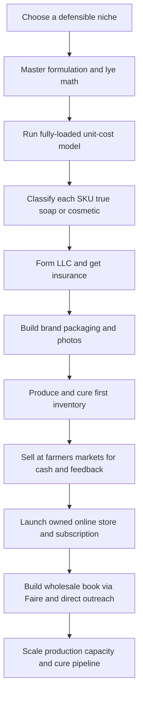

### Direct Answer

To start a soap making business in 2027, you formulate and produce handcrafted personal-care products -- bar soap, liquid soap, bath bombs, body butters, scrubs, and lotion bars -- and sell them through farmers markets, an online storefront, and wholesale accounts with boutiques and spas. The model is **real, low-barrier to enter, and genuinely viable -- but ruthlessly commoditized at the bottom and bottlenecked by production capacity, regulation, and channel economics in the middle.** Win by treating it as a regulated small-batch manufacturing business -- mastering fully-loaded unit cost, choosing a defensible niche, pricing so wholesale survives, and building a cure pipeline that can actually fill the orders you book.

**TL;DR**
- **It is a manufacturing business in a craft costume.** You convert commodity oils and lye into finished goods that sell for many multiples of material cost -- but only if you cost, price, and produce with discipline.
- **The category is saturated.** Tens of thousands of Etsy soap shops and a soapmaker at nearly every farmers market mean you compete on niche, brand, and formulation -- never on price.
- **The make-or-break number is fully-loaded cost per finished unit** -- materials plus packaging plus shrink plus allocated overhead plus honest labor -- not the ninety cents of oils and lye.
- **Regulation tightened.** True soap is exempt from FDA cosmetic rules, but bath bombs, lotions, and any moisturizing claim pull you under MoCRA cosmetic regulation -- registration, listing, INCI labeling.
- **Honest economics:** $2K-$15K to launch, 55-72% gross margin before labor, $8K-$60K Year 1 revenue, scaling to $80K-$400K and $30K-$150K owner profit by Year 3-5.
- **The three killers:** underpricing, ignoring cosmetic regulation, and under-modeling the four-to-six-week cure pipeline.

---

## 1. What A Soap Making Business Actually Is In 2027

### 1.1 The Core Definition

A soap making business **formulates, produces, packages, and sells personal-care products** made primarily through saponification -- the chemical reaction of fats and oils with an alkali (sodium hydroxide for bar soap, potassium hydroxide for liquid). Around that core sits an expanding shoulder of adjacent bath-and-body products: bath bombs, body butters, sugar and salt scrubs, lotion bars, beard products, shampoo bars, and gift sets. **You are a manufacturer first and a retailer second.** The romance of the business -- swirled colors, essential-oil blends, the rustic market table -- sits on top of a real production operation: buying oils, lye, and fragrance in bulk, running batches on a schedule, curing finished soap for four to six weeks, cutting and beveling and stamping bars, and wrapping and labeling every unit to a legal standard.

### 1.2 The Single Financial Idea

The entire business is **one financial idea executed thousands of times**: you convert cheap commodity inputs -- olive oil, coconut oil, palm or palm-free alternatives, lye, water, fragrance, colorant -- into a finished good that sells for many multiples of its material cost, and you do it at enough volume, and with enough margin discipline, that the labor of making it is genuinely paid. A bar that costs $1.10-$2.20 all-in to make and sells for $6-$9 retail is a healthy product. That same bar discounted to $4 at a crowded market table next to ten other soapmakers is a slow way to lose money.

### 1.3 What Makes 2027 Different

Three realities now shape the business that did not fully exist a decade ago. The handmade soap category is **saturated** -- Etsy alone hosts tens of thousands of soap and bath shops. Clean-beauty, sensitive-skin, vegan, palm-free, and fragrance-free demand is **real and growing**, which rewards formulation and positioning over generic "natural soap." And the regulatory environment **tightened**: the Modernization of Cosmetics Regulation Act of 2022 (MoCRA) brought facility registration, product listing, and adverse-event requirements to cosmetics. The soap business is not a craft hobby that happens to make money; it is a regulated small-batch manufacturing business wearing a craft costume.

| Dimension | Hobby Framing (Wrong) | Business Framing (Right) |
|---|---|---|
| Core activity | Relaxing afternoon craft | Scheduled batch manufacturing |
| Key number | Material cost of one bar | Fully-loaded cost per finished unit |
| Regulation | "It's just soap" | True soap vs. regulated cosmetic, classified per SKU |
| Differentiation | A nice scent | A defensible niche and brand |
| Capacity | Make more when you sell out | A cure pipeline planned weeks ahead |
| Margin that matters | Pre-labor gross margin | After-labor owner margin |

### 1.4 Who It Suits And Who It Does Not

The business rewards a founder who genuinely enjoys craft, production rhythm, brand-building, and direct selling, and who is willing to treat costing and regulation as core work. It punishes anyone who wants easy passive margins from a relaxing hobby, who treats "it's just soap" as a reason to skip the math, or who intends to compete on being the cheapest lavender bar at the market. Adjacent maker businesses share this profile -- see candle making (q1989) and the woodworking shop (q1994) for the same manufacturing-discipline lesson.

### 1.5 The Three Truths A Founder Must Internalize

Before any equipment is bought, three truths separate the founders who build a business from the ones who build an expensive hobby. **First, the soap itself is not the product -- the finished, packaged, legally compliant, consistently reproducible unit is the product**, and the gap between "I made a nice bar" and "I can make this exact bar two hundred times" is the gap between a craft and a company. **Second, the margin a founder sees is almost never the margin a founder earns**, because the pre-labor gross margin -- the seductive 55-72% number -- silently omits the single largest cost in the business, which is the founder's own time. **Third, demand is not the constraint; differentiation and capacity are.** A founder will not fail because nobody wants soap; a founder fails because their soap is indistinguishable from a thousand others, or because they booked orders the cure pipeline could not fill. Holding these three truths in mind reframes every later decision -- formulation, pricing, channel choice, and the launch budget -- as answers to the same question: how do I make a differentiated product, at a real margin, in volume I can actually deliver.

---

## 2. The Product Line: What You Actually Make

### 2.1 The Product Categories

The product line **is** the business, and each category carries its own economics, regulation, and production demands.

| Category | Material Cost | Cure / Lead Time | Regulatory Status | Role In The Line |
|---|---|---|---|---|
| Cold-process bar soap | Lowest | 4-6 weeks | True soap (if no claims) | Volume anchor |
| Hot-process bar soap | Low | Days | True soap (if no claims) | Speed when needed |
| Melt-and-pour soap | Low-moderate | Near zero | True soap (if no claims) | Beginner, hardest to defend |
| Liquid soap / body wash | Moderate | Moderate | True soap (if no claims) | Higher ticket |
| Bath bombs | Low | Fast, humidity-sensitive | Cosmetic | Ticket lift, breakage risk |
| Body butters / lotion bars | Higher | Moderate | Cosmetic | Margin defense, shelf-life care |
| Sugar / salt scrubs | Moderate | Fast | Cosmetic | Simple, profitable |
| Shampoo bars / beard products | Higher | Moderate | Often cosmetic | Niche anchor, high margin |
| Gift sets / favors | Bundle | Bundle | Per component | AOV lift, events market |

### 2.2 The Portfolio Logic

Think of the line as a **portfolio**: a bar-soap core that is cheap to make and carries volume, a mid-tier of liquid soap, scrubs, and bath bombs that lifts the ticket, and a specialty shoulder -- shampoo bars, beard products, niche formulations -- that defends margin and tells a brand story.

### 2.3 The SKU-Sprawl Trap

The Year 1 mistake is launching twelve categories at once. **Every added category multiplies the regulatory surface, the SKU count, the packaging spend, and the production complexity.** A thin, broad line made badly loses to a narrow, deep line made well. Start with three to six SKUs in one coherent niche, prove they sell, then expand deliberately.

### 2.4 The Cosmetic Line Inside Your Soap Line

The quiet danger in the product line is that **most makers do not stay pure-soap for long.** The moment bath bombs, lotions, scrubs, or body butters enter the line -- and they almost always do, because they lift the ticket -- a meaningful share of the catalog is regulated as cosmetics. A founder must know, SKU by SKU, which products are true soap and which are cosmetics, because that classification drives labeling, registration, and liability.

---

## 3. The Three Business Models

### 3.1 The Farmers Market Maker

This model sells direct to consumers at markets, fairs, and craft shows, with a modest online presence. Its advantage is **immediate cash, direct customer feedback, no wholesale discount, and low startup cost.** Its challenge is that it is physically grueling, weekend-bound, weather-exposed, geographically capped by how many markets one person can work, and brutally competitive at the table. It is the most common starting point and a genuinely good way to learn what sells -- but it has a hard ceiling.

### 3.2 The Online Brand

This model sells primarily through a Shopify store, Etsy, Faire, and Amazon Handmade, supported by Instagram, TikTok, and email. Its advantage is **reach beyond the local market, scalability, and a repeat DTC base with subscriptions.** Its challenge is that customer acquisition costs real money or real content effort, shipping is a cost and an operational burden, and the maker competes against tens of thousands of other online soap shops. The discipline here overlaps heavily with the DTC brand playbook (q1931) and single-product e-commerce (q9588).

### 3.3 The Wholesale / Private-Label Producer

This model sells in volume to boutiques, spas, gift shops, hotels, and other brands -- including unbranded white-label product. Its advantage is **large, repeating, predictable orders, far less marketing burden, and production efficiency.** Its challenge is the wholesale margin (roughly half of retail), the capacity demand, the formulation consistency a B2B buyer expects, and customer-concentration risk.

| Model | Margin Per Sale | Marketing Burden | Capacity Demand | Main Risk |
|---|---|---|---|---|
| Farmers Market Maker | Full retail, no platform cut | Low (foot traffic) | Moderate | Weekend-bound, geographically capped |
| Online Brand | Retail minus platform/shipping | High (content or ad spend) | Moderate to high | Saturated platforms, acquisition cost |
| Wholesale / Private-Label | ~Half of retail | Low (few accounts) | High (cure pipeline) | Customer concentration, thin margin |

### 3.4 The Right Sequence

Many successful operators **start as a market maker** to learn and build cash, **add the online brand** to escape the geographic ceiling, then **layer wholesale** once production capacity and consistency are real. The wrong move is launching straight into wholesale with no proven formulas and no cure pipeline, or staying a pure market maker forever and wondering why revenue is capped at what two hands can carry to a folding table.

---

## 4. The 2027 Market Reality

### 4.1 Demand Is Structurally Healthy

Demand is real and durable. The handmade and "clean" personal-care market continues to grow, driven by sensitive-skin and eczema concerns, distrust of synthetic-heavy mass products, the gift and favor market, the zero-waste movement that favors bar formats, and a cultural preference for small-batch, story-rich goods. **People buy soap constantly and forever; it is a true consumable with natural repeat demand.**

### 4.2 The Supply Side Is Saturated

This is the defining 2027 reality. The barrier to making soap is low, the craft is well-documented, the equipment is cheap, and the result is tens of thousands of sellers. **The category does not lack demand; it lacks differentiation.**

### 4.3 The Competition Is Tiered

| Tier | Who | How You Relate To Them |
|---|---|---|
| National brands | Dr. Bronner's, Lush, Bath & Body Works (NYSE: BBWI), L'Occitane | Do not compete head-on; out-niche them |
| Established handmade businesses | Real soap companies with wholesale books and niche authority | Genuine competition for boutique shelf space |
| Hobby long tail | Tens of thousands of Etsy shops, market side-hustlers | Out-professionalize on brand; never out-cheap |
| Supplier / melt-and-pour novelty | Suppliers selling finished goods | Low-end noise |

### 4.4 What Changed By 2027

MoCRA brought genuine cosmetic regulation to the lotion and bath-bomb side of the business. Consumers now expect a professional brand, real ingredient transparency, and often a sustainability story. Faire made wholesale discovery far easier. And short-form video of the making process became a genuine, low-cost customer-acquisition channel. **The net: demand is durable, the category is crowded, and the winning entrant competes on a defensible niche, real formulation quality, a professional brand, and smart channel choices.**

---

## 5. The Core Unit Economics

### 5.1 Why This Is The Most Important Section

The entire business lives or dies on a number beginners almost never calculate correctly: the **fully-loaded cost of one finished, packaged, sellable unit.** The seductive mistake is to price off material cost alone -- "the oils and lye in this bar cost me ninety cents, so $6 is a huge margin." That ignores everything that actually consumes money and time.

### 5.2 The Cost Stack Of One Bar

| Cost Layer (One Bar Of Cold-Process Soap) | Amount | Ignored By Beginners? |
|---|---|---|
| Raw materials (oils, lye, water, fragrance, colorant) | $0.55-$1.20 | No -- the only cost most beginners count |
| Packaging and label (wrap/band, printed label) | $0.20-$0.70 | Frequently |
| Shrink and failure (soda ash, bad cuts, failed batches, samples) | 5-15% of production | Almost always |
| Allocated overhead (insurance, licensing, space, software, fees) | $0.10-$0.40 | Almost always |
| **Fully-loaded cost before labor** | **$1.10-$2.20** | -- |
| Honest labor (mix, pour, cut, wrap, label, pack) | $1.40-$2.30 | Almost always -- the biggest miss |
| **Fully-loaded cost after labor** | **$2.50-$4.50** | -- |

### 5.3 Running The Number Against Channels

A bar that costs $0.90 in raw materials realistically costs **$1.10-$2.20 fully loaded before labor, and $2.50-$4.50 after honestly paying the maker.** Now run it against channels: at $6-$9 retail direct, the bar is healthy; at a $3.00-$3.75 wholesale price, it is still fine if production is efficient; discounted to $4 at a price-competing market table, after labor, it is barely breaking even.

### 5.4 The Pricing Discipline

Before pricing any product, **build the fully-loaded cost including shrink, packaging, allocated overhead, and a real labor rate -- then set retail at a multiple that survives the wholesale discount.** A defensible structure prices retail at roughly 4-6x the fully-loaded material-and-packaging cost. A founder who prices off raw material cost builds a business that feels profitable and runs out of money; a founder who prices off the fully-loaded number builds one that actually pays.

### 5.5 Costing Bath Bombs And Lotions Differently

The bar-soap cost stack is the easiest to model, but a founder who has added bath bombs, scrubs, or lotions to the line must cost each category on its own terms, because the loss profiles differ sharply. **Bath bombs carry a high breakage and humidity-failure rate** -- a bomb that crumbles in shipping or absorbs moisture and loses its fizz is a total loss, and a realistic shrink rate of 10-20% must be built into the cost, on top of fragile packaging that itself costs more than a soap wrap. **Lotions and body butters carry packaging cost that often exceeds the formula cost** -- a pump bottle, a jar, a tamper band, and a label can run $0.80-$2.00, and the preservative and stability testing add real expense. **Scrubs leak and weep oil**, demanding sturdier containers and tighter seals. The discipline is to never let the bar-soap math -- the most forgiving in the line -- set the founder's mental model for the whole catalog; each category needs its own fully-loaded sheet.

### 5.6 The Batch-Size Lever

Unit cost is not fixed -- it falls as batch size rises, because the fixed time of setting up, weighing, cleaning, and breaking down a batch is amortized across more bars. A founder who runs tiny twelve-bar batches pays a punishing per-unit labor cost; a founder who runs disciplined forty-eight or ninety-six-bar slab batches drops the labor-per-bar substantially. **Batch size is one of the few genuine cost levers a soap maker controls**, and scaling batch size -- constrained by mold inventory and cure space -- is often the single highest-return operational improvement available, more impactful than chasing a few cents off the oil bill.

---

## 6. The Operating P&L

### 6.1 The Major Cost Lines

| P&L Line | Typical % Of Revenue | Notes |
|---|---|---|
| Materials and packaging | 28-45% | Varies with channel mix and packaging premium |
| Sales channel costs | 5-20% | Booth fees, platform fees, shipping -- most underestimated |
| Labor | Largest hidden cost | The hours of making, wrapping, packing, selling |
| Overhead | Fixed base | Insurance, licensing, space, software, depreciation |
| Inventory carry and shrink | 5-15% drag | Cure pipeline ties up cash; shrink is continuous |

### 6.2 The Sales-Channel Cost Trap

Sales channel costs are the most underestimated line: a farmers market booth fee runs $20-$75 per market; Etsy charges listing, transaction, payment, and ad fees that stack; Shopify is a monthly fee plus processing; Amazon Handmade and Faire take meaningful cuts; and **shipping is a genuine cost that DTC founders routinely fail to fully charge for.**

### 6.3 The Two Gross Margins

A soap business runs a **55-72% gross margin before labor** -- a number that looks great and is the source of most of the category's false optimism -- but a far thinner **15-40% margin after honestly paying the maker's labor**, which is the number that actually matters.

### 6.4 Why Founders Fail At The P&L

The founders who fail almost always made the same errors: they treated the pre-labor gross margin as the real margin, they underpriced to move volume at crowded markets, they never fully charged for shipping, and they let SKU sprawl multiply their packaging and regulatory costs. The founders who succeed price off the fully-loaded cost, pay themselves on paper, charge shipping honestly, and keep the line tight.

---

## 7. Equipment, Workspace, And The Production Setup

### 7.1 Equipment At The Smallest Scale

At the learning-and-first-markets stage, the equipment is genuinely cheap: a stick blender, a digital scale accurate to the gram, stainless or heavy-plastic mixing containers, lye-safe pitchers, a thermometer, silicone or wood loaf molds, a cutter, safety gear, and storage racks for curing. This can be assembled for a few hundred dollars to roughly $1,500.

### 7.2 Equipment As Volume Grows

As volume grows, the constraints shift: bigger and slab molds, a multi-bar cutter, more mold inventory (molds are tied up while soap sets), far more curing rack space, bulk material storage, a labeling and wrapping station, and packaging inventory.

### 7.3 Workspace And Regulation Interact

Many states regulate where cosmetics and even soap can be produced -- some require a separate, dedicated, non-home kitchen or licensed commercial space; some allow home production of true soap but not of lotions and cosmetics. **Cottage-food-style laws generally do not cover soap and bath products the way they cover baked goods**, so a founder must verify their specific state and local rules rather than assume.

### 7.4 The Cure Pipeline Is The Hidden Capacity Constraint

Cold-process soap must cure four to six weeks before sale. The warehouse-of-curing-soap grows with the business, the founder must produce weeks ahead of demand, and a holiday rush or a big wholesale order requires production planning months in advance. **A founder who books demand without building the production pipeline behind it simply cannot deliver.**

| Production Stage | Physical Footprint | The Constraint It Creates |
|---|---|---|
| Mixing / pouring | Workbench, scale, blender | Cheap, rarely the bottleneck |
| Mold setting | Mold inventory | Molds tied up 1-3 days per batch |
| Curing | Rack space, weeks of inventory | The true capacity ceiling |
| Cutting / finishing | Cutter, beveling station | Labor-intensive at volume |
| Wrapping / labeling | Packaging station | Labor-intensive, easy to under-cost |

---

## 8. Regulation: FDA, MoCRA, CPSC, And Labeling

### 8.1 True Soap Versus Cosmetic

This is the section beginners most want to skip and most cannot afford to. **True soap** -- product whose cleaning action comes from the alkali salts of fatty acids, making no claims beyond cleaning -- is **not regulated by the FDA as a cosmetic**; it is regulated by the Consumer Product Safety Commission as a consumer product. **The moment you cross a line, you become a regulated cosmetic.**

### 8.2 What Pulls You Into Cosmetic Regulation

| Trigger | Result |
|---|---|
| Claim that soap moisturizes, soothes, is anti-aging | Regulated cosmetic |
| Selling bath bombs, lotions, scrubs, body butters | Regulated cosmetic regardless of claims |
| Therapeutic claim ("treats eczema," "heals") | Regulated as a drug -- a far heavier regime |
| Pure cleaning-only bar, no claims | True soap, CPSC consumer product |

### 8.3 What MoCRA Requires

As a cosmetic, the product is subject to FDA cosmetic regulation and, since 2022, MoCRA -- which introduced **facility registration** (cosmetic manufacturing facilities register with the FDA), **product listing** (cosmetic products listed with the FDA), **adverse-event reporting** and recordkeeping, **safety substantiation**, and labeling requirements including the **ingredient declaration** using INCI (International Nomenclature of Cosmetic Ingredients) names. There are small-business exemptions within MoCRA for facility registration and product listing below certain revenue thresholds -- but the safety, labeling, and adverse-event obligations still apply, and a founder must verify their own status rather than assume.

### 8.4 The Compliance Checklist

Classify every product (true soap versus cosmetic), label each correctly, register and list with the FDA where MoCRA requires it, **never make a drug claim**, verify state and local requirements, and carry product liability insurance. The founders who get this wrong are not usually shut down dramatically; they quietly accumulate exposure -- a mislabeled product, an unregistered facility, an uninsured liability claim -- until one event turns a small problem into a business-ending one.

### 8.5 Insurance Is Operationally Non-Optional

Product liability coverage is not legally a regulation, but it is operationally non-optional -- you are putting a product on people's skin. A single irritation, allergen, or poorly preserved lotion can generate a claim, and an uninsured claim can end the business.

### 8.6 The Labeling Details That Trip Up Beginners

Even founders who understand the soap-versus-cosmetic distinction routinely mislabel the specifics. **Net weight must be declared**, and for soap that means weight after cure -- a freshly poured bar that loses water during cure will not match a label printed off the wet weight. **The business name and address** must appear on the label as the responsible party. **For cosmetics, the ingredient declaration uses INCI names in descending order of predominance** -- "olive oil" becomes "Sodium Olivate" once saponified, and a founder who lists kitchen names instead of INCI names is non-compliant even with an honest ingredient list. **Warnings** -- for products with known irritant or allergen ingredients, or for bath products near drains -- may be required. The practical move is to treat labeling as a design constraint from the first SKU, not a last-minute task, because reprinting labels for a whole catalog is expensive and a mislabeled product on a shelf is live exposure.

### 8.7 Why "It's Just Soap" Is The Most Expensive Sentence

The phrase that ends more soap businesses than any single regulator is "it's just soap." It is the founder's permission slip to skip the classification, sell the lotion without registering, make the casual "great for eczema" claim, and put the product on skin uninsured. **None of these failures announce themselves.** The business runs fine for a year, two years -- and then a customer reaction, a competitor complaint, a buyer's compliance audit, or an adverse event turns a quietly accumulated exposure into a claim, a recall, or a shutdown. The discipline is to treat regulation as a fixed early-stage cost of doing business, paid in attention and a few hundred dollars, rather than a gamble whose downside is the whole company.

---

## 9. Formulation: Building Products That Defend Margin

### 9.1 The Fundamentals Are Table Stakes

Understanding saponification, running every recipe through a lye calculator, understanding how different oils contribute hardness, lather, conditioning, and shelf stability, controlling superfat, and curing properly are **table stakes**. A maker who has not mastered these produces inconsistent product and is one bad batch from a liability claim.

### 9.2 Formulation Is Positioning

Above table stakes, formulation is positioning. A goat-milk line, a fragrance-free sensitive-skin line, a charcoal-and-clay line, a palm-free sustainability line, a men's grooming line -- **each is a formulation choice that is also a market position**, and it is the thing that lets a maker escape price competition.

| Niche | Formulation Signature | Why It Defends Margin |
|---|---|---|
| Fragrance-free sensitive-skin | No fragrance, gentle oils, simple | Eczema and allergy buyers pay for trust |
| Goat milk | Milk-based, creamy lather | Distinct story, repeat-buy loyalty |
| Men's grooming | Beard, shampoo bars, masculine scent | Underserved, higher price tolerance |
| Palm-free sustainability | No palm oil, plastic-free packaging | Values-driven buyers, premium |
| Botanical / locally sourced | Local oils, botanicals, terroir story | Tourist and gift markets |

### 9.3 Consistency Is The Wholesale Gate

A boutique or spa buyer expects the bar they reorder to look, smell, and perform like the last one. **Achieving batch-to-batch consistency at volume is a real production skill and the thing that separates a business from a hobby.**

### 9.4 Sourcing And Shelf Life

Where the oils, fragrance, botanicals, and packaging come from affects both fully-loaded cost and brand narrative -- the palm-oil question (sustainable palm versus palm-free) is a 2027 positioning decision. Shelf life matters more as the line expands into lotions and butters: anhydrous products are forgiving, but **anything with water needs a real preservative**, and "all-natural, preservative-free lotion" is often a recall waiting to happen.

---

## 10. Branding, Packaging, And Standing Out

### 10.1 The Brand Answers "Why This Soap"

Because the category is saturated, the brand is frequently the difference between a sale and a pass. **The brand is the niche made visible** -- the name, the visual identity, the story, the photography, the voice. In 2027 a professional, coherent brand is a baseline expectation, not a luxury.

### 10.2 Packaging Does Double Duty

Packaging is a **legal labeling surface** (ingredient declarations, net weight, business identity, warnings) and a **marketing surface** (the thing that makes a bar look giftable, premium, and shelf-worthy). It is also a real cost line, and the founder must balance packaging that sells against packaging that eats the margin.

### 10.3 Photography Is Non-Negotiable Online

Soap is sold on appearance and described in words. **Amateurish photos lose to professional ones every time** on Etsy, Shopify, and Faire -- a lesson shared across every maker channel, including the Etsy shop playbook (q1953).

### 10.4 The Sustainability Story Is Itself Packaging

Plastic-free wraps, recyclable boxes, palm-free formulation, refill or zero-waste positioning -- for many 2027 buyers this is a real purchase driver. Consistency across surfaces -- the market table, the website, the wholesale line sheet, the Instagram grid, the product label -- is what makes a brand feel real.

---

## 11. The Founder Journey: From Idea To First Sale

### 11.1 Reading The Path

The path is deliberately sequential. **Niche and formulation come before anything financial** -- you cannot cost or price a product you have not designed. **Costing and SKU classification come before incorporation** -- they tell you whether the business works and what regulation applies. **Markets come before the online store** because they generate cash and feedback fastest. **Wholesale comes last** because it demands proven formulas and a cure pipeline.

### 11.2 The Common Detour

The most common detour is jumping from "I made a nice bar" straight to "I'll sell wholesale." That skips costing, classification, and the cure pipeline -- and produces a founder with booked orders they cannot fill at a price that does not pay.

---

## 12. Sales Channels

### 12.1 The Channel Menu

| Channel | Typical Cost / Cut | Owns The Customer? | Best Used For |
|---|---|---|---|
| Farmers markets / fairs | $20-$75 booth fee per market | Yes | Early cash, feedback, local brand |
| Etsy | Listing + transaction + payment + ad fees | No | Built-in handmade traffic, easy start |
| Shopify (owned store) | Monthly fee + payment processing | Yes | Brand control, repeat base, subscription |
| Amazon Handmade | Significant cut, price compression | No | Reach and Prime logistics |
| Faire | Commission on wholesale orders | Partly | Boutique discovery, wholesale book |
| Direct wholesale | ~Half of retail price | Yes (B2B) | Large, repeating, predictable orders |
| Subscription | Platform / processing fee | Yes | Recurring revenue from a consumable |

### 12.2 The Owned Store Versus The Marketplace

Etsy and Amazon Handmade offer built-in traffic but the maker does not own the customer relationship and competes on saturated, price-compressing platforms. A Shopify store is the **owned channel** -- the maker controls the brand, the data, the customer relationship, and the ability to run a subscription -- but it requires driving its own traffic.

### 12.3 Subscription: The Strongest Move

Soap is a consumable, and a monthly soap box through the owned store **converts natural repeat demand into recurring revenue.** It is one of the strongest moves a soap business can make. The mechanics overlap directly with the subscription box curation playbook (q9567).

### 12.4 Sequence, Do Not Pick

Most successful makers do not pick one channel; they **sequence** -- markets first for cash and feedback, an owned store to escape the geographic ceiling, wholesale and Faire for volume, and subscription to lock in recurring revenue -- while always knowing the true net margin of each channel after its fees, and never letting the lowest-margin channel quietly become the whole business.

### 12.5 Knowing The True Net Margin Of Each Channel

The phrase "always knowing the true net margin" is doing real work, because the headline price of a sale is never what the founder keeps. **A $7 bar sold at a farmers market** keeps nearly the full $7 against cost, minus the booth fee amortized across the day's units and the payment-processing fee -- the richest channel per unit, but capped by foot traffic. **The same bar sold on Etsy** loses listing, transaction, payment, and often advertising fees that can stack to 15-25% before shipping, and the maker does not keep the customer. **Sold on the owned Shopify store**, it loses only processing plus a share of the monthly fee and whatever content or ad spend drove the visit -- a better margin and the customer is retained. **Sold wholesale**, the founder keeps roughly half the retail price, which is fine if the fully-loaded cost is genuinely low, and disastrous if it is not. The discipline is to maintain a simple per-channel net-margin sheet and to make channel-mix decisions from it -- not from the headline price, and not from the gross margin alone.

### 12.6 The Lowest-Margin Channel Drift

A specific, common failure is allowing the lowest-margin channel to quietly become the whole business. Wholesale orders are large and predictable, so a founder leans into them; markets are exhausting, so the founder drops them; the owned store is neglected because wholesale is paying the bills. **Two years later the business is a low-margin contract producer with one or two accounts that own its fate** -- and the high-margin DTC base and subscription that could have carried real owner profit were never built. The channel mix must be managed deliberately, with the high-margin owned channels protected, not allowed to atrophy because the low-margin channel is the path of least resistance.

---

## 13. Pricing And The Wholesale Discount Math

### 13.1 The Two Layers Of Pricing

Pricing in soap has two interdependent layers -- the **retail price** and the **wholesale structure.** Retail must be anchored to the fully-loaded cost, not the material cost: a defensible approach prices retail at roughly 4-6x the fully-loaded material-and-packaging cost.

### 13.2 The Math That Works And The Math That Does Not

| Bar | Fully-Loaded Cost (Pre-Labor) | Retail | Wholesale (Half Retail) | Verdict |
|---|---|---|---|---|
| Disciplined bar | $1.50 | $7.00 | $3.50 | Healthy -- labor paid from the spread |
| Underpriced bar | $1.50 | $4.00 | $2.00 | Broken -- no version pays the maker |

A bar fully-loaded at $1.50, priced at $7 retail, wholesales at $3.50 and still carries a healthy margin. The same bar priced at $4 retail wholesales at $2 -- and there is no version of that math that pays the maker.

### 13.3 Why Underpricing Is So Destructive

Underpricing at retail does not just thin the retail margin -- **it makes wholesale impossible**, which caps the business at the channels one person can physically sell. The low retail anchor poisons every channel built on top of it.

### 13.4 Wholesale Terms Beyond Price

Minimum order quantities, case packs, line sheets, payment terms, and lead times that account for the cure pipeline must all be set deliberately so wholesale orders are profitable and operationally feasible. Bundles, sets, and subscriptions lift average order value and should be priced to do so. And **shipping must be priced into DTC honestly** -- a founder who absorbs shipping is quietly converting margin into a customer subsidy.

---

## 14. Startup Cost Breakdown

### 14.1 The Line-By-Line Budget

| Startup Line | Lean Home Launch | Serious Launch |
|---|---|---|
| Equipment (scale, blender, molds, cutter, racks, safety gear) | $300-$800 | $1,000-$2,000 |
| Initial materials inventory | $400-$1,000 | $1,200-$2,500 |
| Packaging inventory | $300-$700 | $1,000-$2,000 |
| Insurance (product liability, first payment) | $300-$500 | $600-$1,000 |
| Business formation and licensing | $100-$500 | $500-$1,500 |
| FDA facility registration / product listing | $0 (exempt) | $0-modest |
| Workspace (dedicated / commercial if required) | $0 (home) | $1,000-$3,000+ |
| Branding, photography, website | $200-$800 | $1,500-$3,000 |
| Market gear (canopy, table, displays, reader) | $200-$500 | $700-$1,200 |
| Initial marketing (samples, content, ads) | $100-$300 | $400-$800 |
| Working-capital buffer (cure pipeline, ramp gap) | $500-$1,200 | $1,500-$3,000 |
| **Total** | **~$2,000-$6,000** | **~$8,000-$15,000+** |

### 14.2 The Buffer Beginners Skip

The capital requirement is low enough that under-capitalization is rarely the thing that kills a soap business outright -- but it is low enough that founders **skip the unglamorous lines** (insurance, proper labeling, the working-capital buffer for the cure pipeline) and create exposure and cash crunches that a slightly larger, more honest budget would have prevented.

### 14.3 Why The Cure Pipeline Demands Working Capital

Cold-process soap ties up cash in product that cannot be sold for four to six weeks. A founder who launches with zero buffer produces a batch, waits a month and a half with no revenue, and discovers the cash gap the hard way.

---

## 15. The Year-One Operating Reality

### 15.1 Learning Mode, Not Profit Mode

Year 1 is **learning-and-building mode, not profit-extraction mode.** The first year is spent dialing in formulas until they are consistent, learning which scents and products actually sell locally, discovering the real fully-loaded cost of each product, building a brand and a photography library, getting licensing and insurance and labeling right, working markets, setting up the online store, and finding out where the operation is fragile.

### 15.2 The Honest Year-One Numbers

A disciplined Year 1 solo soap business, launched with real formulas and a tight line, can realistically generate **$8,000-$60,000 in revenue** -- a wide range driven by how many markets are worked, how fast the online channel is built, and whether any wholesale lands -- against **$3,000-$30,000 in owner profit** once labor is honestly accounted.

### 15.3 The Physical Texture

The work is genuinely physical and detail-heavy: weighing and mixing and pouring, managing a growing curing inventory, cutting and wrapping and labeling hundreds of units, photographing, listing, packing orders, and standing at a market table on weekends. Year 1 is also when the founder discovers whether the niche was right -- a generic line shows up as a slow market table and no wholesale interest, while a sharp niche shows up as repeat customers and the first boutique account.

---

## 16. The Five-Year Revenue Trajectory

### 16.1 The Year-By-Year Arc

| Year | Revenue | Owner Profit | What The Operation Looks Like |
|---|---|---|---|
| Year 1 | $8K-$60K | $3K-$30K | Lean launch, formula and brand building, markets plus new store |
| Year 2 | $30K-$120K | $12K-$55K | Consistent formulas, 2-5 wholesale accounts, subscription may launch |
| Year 3 | $60K-$220K | $22K-$90K | Defensible niche, real wholesale book, first part-time help |
| Year 4 | $100K-$320K | $35K-$120K | Wholesale expansion, possibly dedicated production space |
| Year 5 | $130K-$400K+ | $45K-$150K | Mature niche brand, real wholesale and subscription base |

### 16.2 What The Numbers Assume

These numbers assume disciplined fully-loaded costing, niche differentiation, honest pricing that survives the wholesale discount, regulatory compliance, and a deliberately sequenced channel mix. **They do not assume viral growth**, because a soap business scales with production capacity, channel reach, and brand strength, not magically.

### 16.3 The Year-Five Fork

By Year 5 the founder chooses among three paths: stay a lean maker-operator, scale into a production brand with employees and a real wholesale and private-label book, or go deep on a defensible niche. A mature soap business is a real small manufacturing-and-brand business -- a genuinely good outcome, but one earned through years of production discipline.

### 16.4 What Separates The Top Quartile From The Median

The five-year ranges above are wide because the outcomes genuinely diverge, and the divergence is not luck. The **top-quartile soap business** -- the one landing near the high end of each year's range -- almost always did four things the median business did not. It **chose a sharp niche and never diluted it**, which made the brand legible to buyers and gave wholesale accounts a reason to stock it. It **priced from the fully-loaded number from day one**, so every channel it added stayed profitable instead of capping the business. It **built the cure pipeline ahead of demand**, so it could say yes to a wholesale order or a holiday rush without shipping late. And it **treated the email list and subscription as the core asset**, converting a consumable's natural repeat demand into recurring revenue rather than re-acquiring every customer. The median business, by contrast, ran a broad generic line, priced reactively against the cheapest market table, produced batch-to-batch from current orders, and chased new market customers forever. Same craft, same category, same starting capital -- and a three-to-five-times difference in Year-5 revenue.

---

## 17. Five Named Operating Scenarios

### 17.1 Priya -- The Disciplined Niche Maker

Priya launches with $5K into a tight fragrance-free, sensitive-skin line -- three bar formulas, one liquid soap, one body butter -- builds a clean professional brand, prices retail at 5x fully-loaded cost so wholesale works, works two markets a weekend, and lands her first three boutiques by month nine. She hits $48K revenue in Year 1, adds a subscription and four wholesale accounts in Year 2, and reaches $180K by Year 3 because her niche is defensible and her pricing always paid her.

### 17.2 Brandon -- The Cautionary Tale

Brandon launches a broad twelve-SKU line of generic scented bars, melt-and-pour novelties, bath bombs, and lotions, prices everything cheap to "move product" at $4-$5 retail, never registers the cosmetic side under MoCRA, and never pays himself on paper. His pre-labor margin looks great, his wholesale inquiries go nowhere because $4 retail cannot wholesale, the bath bombs and lotions are a regulatory exposure he does not understand, and he burns out in eighteen months convinced "soap doesn't make money."

### 17.3 Marisol -- The Wholesale And Private-Label Producer

Marisol spends two years building consistent formulas and a cure pipeline, then leans hard into wholesale and white-label -- supplying boutiques, two spas, and a regional hotel group with both her brand and unbranded product. She accepts the half-of-retail margin in exchange for large, repeating, predictable orders, and by Year 4 runs $290K in revenue with most of it from a dozen steady accounts.

### 17.4 The Okafor Family -- The Content-Driven Online Brand

The Okafors build the business around short-form video of the soap-making process, grow an Instagram and TikTok following, sell primarily through their own Shopify store with a strong subscription, and use the audience as a near-free acquisition channel. Year 5 revenue lands near $340K with the subscription and DTC base carrying the best margins.

### 17.5 Dale -- The Capacity Casualty

Dale builds a genuinely good niche brand and lands a large wholesale order plus a holiday rush in the same quarter -- then discovers his cure pipeline physically cannot produce enough cured soap in time. He ships late, loses the wholesale account, and learns the hard way that **booked demand without a production pipeline behind it is not revenue.**

---

## 18. Lead Generation And Building A Customer Base

### 18.1 Markets As The Discovery Engine

Farmers markets and fairs are the early discovery engine -- they put the product in hands, generate immediate sales, build local brand recognition, and produce the email signups and repeat customers that compound.

### 18.2 Content As The 2027 Acquisition Channel

Short-form video of the making process is the 2027 acquisition channel. **Soap-making is visually compelling, the craft itself is the content, and makers who consistently show their process build audiences that convert at near-zero acquisition cost.**

### 18.3 The Email List And Subscription As Retention

Because soap runs out, a captured customer with an email address or a subscription is a repeating revenue stream. Building that list from day one -- at the market table, on the website, in every package -- is one of the highest-return activities in the business.

### 18.4 Wholesale, Reviews, And Event Channels

| Channel | Acquisition Cost | Repeat Potential | Best For |
|---|---|---|---|
| Farmers markets | Booth fee + time | Moderate | Discovery, feedback, signups |
| Short-form video | Time, near-zero cash | High | Audience-building, DTC funnel |
| Email / subscription | Near-zero (owned) | Highest | Retention, recurring revenue |
| Wholesale outreach / Faire | Line sheet + outreach time | Very high (reorders) | Predictable volume |
| Gift / wedding / corporate | Vendor relationships | Project-based | Large-ticket orders |

In a consumable category, **the second and tenth purchase from an existing customer are far cheaper than the first purchase from a new one.** Founders who only chase new customers at markets are running on a treadmill; the ones who build a retained base are building an asset.

---

## 19. Risk Management And Insurance

### 19.1 The Risk Map

| Risk | Primary Mitigation |
|---|---|
| Product liability (reaction, allergen, bad lotion) | Product liability insurance, sound formulation, accurate labeling |
| Regulatory (mislabeling, unregistered facility, drug claim) | Correct classification, MoCRA compliance, no drug claims |
| Production (failed batch, inconsistency, cure shortfall) | Formulation discipline, batch testing, cure-respecting planning |
| Channel concentration (one account or platform) | Diversified channel mix |
| Saturation / pricing (race to the bottom) | Niche differentiation, brand strength, pricing discipline |
| Cash and inventory (cure pipeline, shrink) | Working-capital buffer, fully-loaded costing |
| Seasonality (Q4 gift concentration) | Produce ahead of the rush, year-round subscription revenue |

### 19.2 The Central Risk

**Product liability is the central risk** -- you are putting a product on people's skin, and a reaction, an irritation, a mislabeled allergen, or a poorly preserved lotion can generate a claim. It is mitigated by product liability insurance, sound formulation, proper preservation of water-containing products, accurate allergen and ingredient labeling, and never overstating what a product does.

### 19.3 The Throughline

Every major risk in soap has a known mitigation built from insurance, correct regulatory classification, formulation and production discipline, and channel diversification. The operators who fail are usually the ones who skipped the insurance, misunderstood the regulation, or competed on price in a saturated market.

---

## 20. Competitor Landscape

### 20.1 The National Brands

Dr. Bronner's (a roughly $165M family-owned company), Lush (a billion-dollar-plus private brand), Bath & Body Works (NYSE: BBWI), L'Occitane, Mrs. Meyer's (owned by SC Johnson), and Method own distribution, brand recognition, and scale a startup cannot match. **You do not compete with them head-on**; you compete by being handmade, local, niche, and story-rich in a way scale brands structurally cannot be.

### 20.2 The Established Handmade Businesses

Real soap companies with wholesale books, strong brands, niche authority, and years of formulation refinement are the genuine competition for boutique shelf space. Out-competing them requires a sharper niche, a better brand, or a better-served channel -- not a lower price.

### 20.3 The Hobby Long Tail

Tens of thousands of Etsy soap shops, the three soapmakers at every farmers market, the part-timers selling generic scented bars compete on price at the bottom of the market. They are **easy to out-professionalize on brand, consistency, and niche, but impossible to out-cheap.**

### 20.4 The Real Moat

The competitive moat in soap is not the ability to make soap, which is common. It is the **niche authority, the brand, the formulation consistency, the wholesale relationships, and the retained customer base** -- all of which take years to build and are genuinely hard for a new entrant to copy. This is the same moat logic that protects the esthetician skincare studio (q2086) and any maker brand built on craft mastery.

---

## 21. Financing, Taxes, And Business Structure

### 21.1 Financing The Business

Because soap has a low barrier to entry, most founders self-fund. **Personal savings and bootstrapping** fund the great majority of soap startups -- the $2K-$15K range is small enough that most founders should not take on debt for it, and bootstrapping keeps the founder disciplined about unit economics. **Reinvested cash flow** funds most healthy growth past Year 1. Microloans and small-business grants -- including those aimed at women-owned, minority-owned, and craft businesses -- can fit a launch or early expansion. The financing discipline: bootstrap the launch, reinvest cash flow, keep a working-capital buffer for the cure pipeline, and only consider debt for a deliberate, capacity-expanding investment -- **never to paper over a business whose unit economics do not work, because no loan fixes underpricing.**

### 21.2 Entity And Liability

Most soap makers form an **LLC** for liability protection -- meaningful in a business that puts a product on skin -- with the option of an S-corp election as profit grows. The entity holds the insurance, the licenses, the contracts, and the wholesale accounts.

### 21.3 Sales Tax And COGS

| Tax / Accounting Area | What The Founder Must Do |
|---|---|
| Sales tax | Get a permit; handle multi-channel reality (marketplace facilitators vs. direct sales) |
| COGS and inventory | Bookkeeping that tracks inventory and COGS, not just cash in and out |
| Home-office / workspace | Deduct where a dedicated space is used |
| Equipment | Depreciable or, within limits, immediately expensible |
| Quarterly estimated taxes | Apply once the business is profitable |

Marketplace facilitator rules mean platforms like Etsy and Amazon may collect and remit on the maker's behalf, while direct and Shopify sales are the maker's responsibility.

### 21.4 The Bookkeeping Discipline

Separate business banking from day one, a bookkeeping system that tracks inventory and COGS, a sales-tax process that handles the multi-channel reality, and an accountant who understands small product-and-manufacturing businesses. Skipping this does not save money -- it turns a manageable compliance function into a year-end scramble.

---

## 22. Owner Lifestyle: What It Actually Feels Like

### 22.1 Year One Daily Life

In Year 1, running a solo operation, the founder is genuinely in every part of it -- formulating and testing, running batches, managing a growing curing inventory, cutting and beveling and wrapping and labeling hundreds of units, photographing product, listing and updating the online store, packing and shipping orders, handling licensing and labeling compliance, and standing at a market table on weekends in whatever weather shows up. **It is closer to running a small production line than to a relaxing craft.**

### 22.2 The Seasonal Rhythm

The rhythm is seasonal -- a real build toward the Q4 holiday-and-gift rush that requires producing months ahead because of the cure timeline, and quieter winter and late-summer stretches.

### 22.3 The Year Three-To-Five Shift

By Year 2-3, with proven formulas, a brand doing some of the selling, possibly part-time help, and a wholesale book producing larger orders, the founder's role shifts toward managing production, accounts, and growth. By Year 3-5, with a mature niche brand, the founder can run a larger operation with a more managerial rhythm -- though **soap never becomes passive**, because someone has to make the soap.

### 22.4 The Emotional Texture

There is real satisfaction in a beautiful consistent batch, a brand that resonates, a boutique that reorders, a market table that sells out, and a craft genuinely mastered -- and real grind in the repetitive wrapping and labeling, the saturation and price pressure, the regulation, and the thinness of the after-labor number in the early years.

---

## 23. Counter-Case: When NOT To Start A Soap Making Business

### 23.1 The Honest Argument Against

For all the genuine viability, there are clear conditions under which starting a soap making business in 2027 is the wrong move, and an honest guide names them.

### 23.2 The Disqualifying Conditions

| Condition | Why It Disqualifies |
|---|---|
| You want to compete on price | The most saturated handmade category there is; the bottom is a loss machine |
| You treat "it's just soap" as a reason to skip regulation | Cosmetic and labeling exposure accumulates quietly until it ends the business |
| You will not pay yourself on paper | You will never know if the business is actually profitable |
| You want passive income | Soap is physical batch production with a permanent cure pipeline |
| You have no niche | A generic line shows up as a slow market table and zero wholesale interest |
| You cannot tolerate seasonality | Q4-heavy demand and a cure timeline punish unplanned founders |

### 23.3 The Better-Fit Alternatives

If the appeal is a low-barrier maker business but soap's saturation is unattractive, candle making (q1989) is an adjacent craft with similar economics and somewhat less regulation. If the appeal is product margins without manufacturing, a single-product e-commerce model (q9588) or a DTC brand built on sourced product (q1931) avoids the cure pipeline entirely. If the appeal is recurring revenue, a subscription box (q9567) is built around retention from the start. And if the draw is craft mastery as a moat, a woodworking shop (q1994) trades commodity saturation for skill-gated, higher-ticket work.

### 23.4 When It Is The Right Move

Conversely, the soap making business is the right move for a founder who genuinely enjoys craft and production, will commit to one defensible niche, will do the fully-loaded costing and the regulatory classification, will price so wholesale survives, and will build the cure pipeline behind the demand they book. For that founder, in 2027, it is a real and rewarding small manufacturing-and-brand business.

---

## 24. Common Year-One Mistakes That Kill The Business

### 24.1 The Consistent Failure Modes

| Mistake | Consequence |
|---|---|
| Underpricing off material cost | Wholesale impossible, labor unpaid -- the single most common killer |
| Ignoring regulation / "it's just soap" | Quiet, accumulating cosmetic and labeling exposure |
| Skipping product liability insurance | One reaction becomes a business-ending event |
| SKU sprawl (a broad generic line) | Multiplied packaging, regulatory, and production cost; nothing differentiated |
| Not paying yourself on paper | The founder cannot tell if the business is profitable |
| Under-modeling production capacity | Booked demand becomes late shipments and lost accounts |
| Competing on price instead of niche | Another generic lavender bar in the most crowded category there is |
| Not charging honestly for shipping | Margin quietly subsidizes customers |
| Poor formulation discipline | Inconsistent batches lose wholesale; unpreserved lotions are recall risks |
| Neglecting email list and subscription | Treadmill of new customers, no retained asset |
| Sloppy bookkeeping and sales tax | Year-end scramble and sales-tax liability |

### 24.2 The Pre-Launch Checklist

Every one of these is avoidable. The founders who fail almost always made three or four of them; the founders who succeed treated this list as a **pre-launch checklist** -- classify products, price off fully-loaded cost, insure, keep the line tight, pay yourself on paper, build the cure pipeline, choose a niche, charge shipping honestly, formulate with discipline, build the email list, and keep clean books.

### 24.3 The Final Word

The soap making business in 2027 is viable as a disciplined, cost-aware, niche-focused, channel-smart operation -- and a poor fit for anyone who wants to compete on being the cheapest bar at the market, or who treats "it's just soap" as a reason to skip the regulation and the unit-cost math. Treat it as manufacturing, and it pays. Treat it as a hobby, and it does not.

---

## Sources

1. U.S. Food and Drug Administration -- "Soap" regulatory classification and the soap exemption.
2. U.S. Food and Drug Administration -- Modernization of Cosmetics Regulation Act of 2022 (MoCRA) overview.
3. U.S. Food and Drug Administration -- Cosmetic facility registration requirements under MoCRA.
4. U.S. Food and Drug Administration -- Cosmetic product listing requirements under MoCRA.
5. U.S. Food and Drug Administration -- Cosmetic labeling guide and ingredient declaration rules.
6. U.S. Food and Drug Administration -- "Is It a Cosmetic, a Drug, or Both?" classification guidance.
7. U.S. Consumer Product Safety Commission -- Consumer product regulation of true soap.
8. International Nomenclature of Cosmetic Ingredients (INCI) -- ingredient naming standard.
9. U.S. Small Business Administration -- Choosing a business structure (LLC, S-corp).
10. U.S. Small Business Administration -- Microloan and grant programs for small businesses.
11. Internal Revenue Service -- Cost of goods sold and inventory accounting for product businesses.
12. Internal Revenue Service -- Quarterly estimated taxes for self-employed and small business owners.
13. Internal Revenue Service -- Home-office deduction guidance.
14. Handcrafted Soap and Cosmetic Guild -- formulation, labeling, and regulatory resources.
15. Handcrafted Soap and Cosmetic Guild -- insurance and product liability guidance for soap makers.
16. Etsy -- seller fee schedule (listing, transaction, payment, advertising fees).
17. Etsy -- marketplace facilitator sales-tax collection policy.
18. Shopify -- subscription plan pricing and payment processing fees.
19. Amazon Handmade -- seller program terms and referral fees.
20. Faire -- wholesale marketplace commission structure and terms.
21. Saponification chemistry references -- sodium hydroxide vs. potassium hydroxide soap.
22. Lye calculator methodology -- superfat, oil properties, and recipe formulation.
23. Cosmetic preservation references -- water-containing product shelf life and recall risk.
24. Roundtable on Sustainable Palm Oil (RSPO) -- sustainable palm versus palm-free sourcing.
25. U.S. cottage food law overviews -- why soap and bath products fall outside cottage food coverage.
26. State cosmetic manufacturing and kitchen-licensing requirement summaries.
27. Dr. Bronner's -- company profile and revenue scale.
28. Lush -- private company brand and scale profile.
29. Bath & Body Works (NYSE: BBWI) -- public company filings and segment data.
30. L'Occitane -- company profile and personal-care market positioning.
31. SC Johnson -- Mrs. Meyer's brand ownership.
32. Handmade and clean-beauty market research -- category demand and saturation trends.
33. Farmers market vendor fee surveys -- booth cost ranges by region.
34. Small-batch manufacturing operations references -- production planning and cure-pipeline scheduling.
35. Product liability insurance guides for personal-care makers -- coverage scope and cost.
