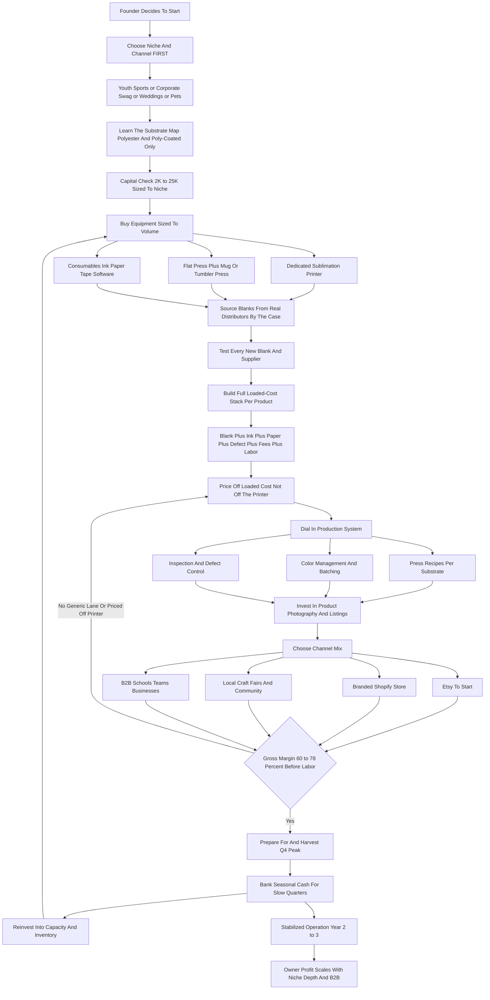

### Direct Answer

To start a sublimation printing business in 2027, you buy a dye-sublimation printer, sublimation ink and transfer paper, and a set of heat presses, then print full-color permanent designs onto polyester apparel and polymer-coated hard goods -- mugs, tumblers, coasters, ornaments, signs, and flags -- and sell them as personalized products through Etsy, Shopify, craft fairs, and business-to-business accounts with schools, sports teams, and local companies. The model is real, accessible, and genuinely low-barrier, but it is a crowded craft-commerce business where the printer is the easy part and the margin lives entirely in sourcing, niche, and pricing discipline. The entire economics rest on one number beginners rarely calculate -- the fully-loaded cost per finished piece -- because a tumbler that costs $9.40 all-in and sells for $28 is a real business while the same tumbler sold at $15 to match an Etsy competitor is not.

**TL;DR:** A focused 2027 sublimation startup invests **$2,000-$25,000** in a printer, presses, and opening blanks, runs at a **60-78% gross margin before labor**, and in a disciplined Year 1 generates **$12,000-$80,000 in revenue** against **$6,000-$45,000 in owner profit** -- almost always part-time and concentrated into the Q4 holiday window. By Year 2-3 a serious operator with multiple printers and real B2B accounts reaches **$80,000-$300,000 in revenue** with **$35,000-$140,000 in owner profit**. The three things that kill sublimation startups: competing on price in the saturated generic lane, under-costing the blank and defect rate and labor, and buying a printer before choosing a niche and a channel. Viable in 2027 as a focused, niche-led, cost-disciplined production business -- a poor fit for anyone expecting a saturated craft category to pay well just because the printing is easy.

## 1. What A Sublimation Printing Business Actually Is In 2027

### 1.1 The Core Process And The Product

A sublimation printing business turns blank products into permanent, full-color personalized goods using dye-sublimation -- a process where solid dye, printed onto special transfer paper, converts directly to gas under heat and pressure and bonds into the surface of a polyester fabric or a polymer-coated hard substrate. It is not screen printing, heat-transfer vinyl, or direct-to-garment. Sublimation is its own process with its own permanent, no-feel, no-crack result and its own hard constraint: it works only on polyester (or high-polyester blends) and on hard goods specially coated to receive it.

**The business is a single idea executed thousands of times.** Buy a blank cheaply, decorate it with a design someone will pay a personalization premium for, and sell the finished piece for a multiple of the blank-plus-consumables cost. A ceramic mug that costs $1.80 as a coated blank, plus roughly forty cents of ink, paper, and a press cycle, sells personalized for $12 to $18. A twenty-ounce stainless tumbler at $6 to $9 as a blank sells for $24 to $40. A polyester t-shirt blank at $4 to $9 sells decorated for $22 to $40. That spread -- blank cost to retail price -- is the entire engine.

### 1.2 What Makes 2027 Different

In 2027 the business is shaped by realities that did not fully exist a decade ago. **The equipment got dramatically cheaper and easier**, which both opened the door and flooded the market. **Personalization demand is structurally strong** because people pay real premiums for "my dog's face," "my team," "my kid's name." **Print-on-demand and overseas drop-shippers crush price on the generic end.** And **the operators who make real money** treated the printer as a commodity and built a defensible niche, a real channel, and a costed production line around it.

| Era marker | Pre-2018 sublimation | 2027 sublimation |
|---|---|---|
| Entry equipment cost | $3,000+ for capable setup | $500-$1,500 dedicated entry tier |
| Operator count | Modest, semi-specialist | Saturated at the generic end |
| Design barrier | Real graphic-design skill needed | AI-assisted tools lower it sharply |
| Channel default | Local and trade | Etsy, Shopify, Amazon Handmade |
| Competitive pressure | Mostly local makers | Print-on-demand and global drop-shippers |
| Where margin lives | The decoration skill | Niche, sourcing, and costing discipline |

## 2. Sublimation Versus The Other Decoration Methods

### 2.1 Where Sublimation Sits

A founder must understand exactly where sublimation sits among the decoration methods, because choosing it deliberately -- and knowing its hard limits -- prevents the most expensive early mistakes. **Sublimation** produces a permanent, full-color, photographic-quality image with zero hand-feel because the dye is in the material, not on top of it; it never cracks, peels, or fades. Its hard limits: it works only on polyester and poly-heavy fabrics and on specially-coated hard goods, it cannot print white, and it does not work on cotton or on uncoated metal, glass, or ceramic.

**The competing methods each own a different lane.** Heat-transfer vinyl cuts colored vinyl onto almost any fabric including cotton, but has a hand-feel and can crack. Direct-to-garment prints directly into cotton with full color but on far more expensive, slower printers. Direct-to-film prints onto a film and transfers it, works on cotton and dark fabrics, and is a fast-growing method. Screen printing is the volume champion for large identical runs but is setup-heavy and uneconomical for one-offs.

### 2.2 The Strategic Method Choice

**Sublimation owns the personalized-polyester-and-coated-hard-goods lane**, and it owns it well, but a founder must accept that lane's boundaries. Many serious shops eventually run sublimation plus one complementary method (commonly DTF or HTV) to cover the cotton gap; but a 2027 startup should begin by mastering sublimation's lane rather than being every decoration method at once on a thin budget.

| Method | Works on | Hand-feel | Color | Best for | Equipment cost |
|---|---|---|---|---|---|
| Sublimation | Polyester, poly-coated goods | None (dye in material) | Full photographic | Personalized hard goods, poly apparel | Low to moderate |
| Heat-transfer vinyl (HTV) | Almost any fabric incl. cotton | Surface layer | Limited (cut colors) | Names, numbers, simple shapes | Very low |
| Direct-to-garment (DTG) | Cotton and blends | Soft surface print | Full | Cotton apparel, dark garments | High |
| Direct-to-film (DTF) | Cotton, dark, most fabrics | Surface layer | Full | Versatile apparel decoration | Moderate |
| Screen printing | Most fabrics | Surface ink | Spot colors | Large identical runs | Moderate, setup-heavy |
| Laser / UV | Hard goods, engraving | N/A | Engrave / UV print | Hard-good personalization | Moderate to high |

## 3. The Equipment: Printer, Presses, And The Consumables Chain

### 3.1 The Sublimation Printer

The equipment is the part beginners obsess over and it is genuinely the easy part, but a founder still needs to understand the chain because the wrong machine at the wrong scale wastes capital. **The sublimation printer is the core.** The accessible entry tier is dedicated desktop printers -- the **Sawgrass** SG500 and SG1000, and the **Epson (NASDAQ ADR: SEKEY)** SureColor F170, F570, and F570 Pro -- purpose-built, reliable, and the standard recommendation for a serious startup. A wide-format step up -- Epson's F-series wide printers, the **Mutoh** ValueJet, and **Roland DG**'s VersaSTUDIO line -- handles larger items, flags, and higher volume. The cheapest entry point, converting a standard Epson EcoTank with third-party ink, works but trades reliability and support for the lower price.

### 3.2 The Heat Presses

**Heat presses are the second pillar and a founder needs more than one.** A flat clamshell or swing-away press (**Geo Knight**, **Hotronix** by **Stahls'**, and entry units from **Cricut** -- the consumer crafting brand whose machines define the hobby tier) handles apparel, mouse pads, coasters, and flat goods. A mug press handles ceramic drinkware. A tumbler press or convection oven setup handles the stainless tumbler category, one of the most profitable in the business. A cap press and specialty attachments come later.

### 3.3 The Consumables Chain And Software

**The consumables chain** is sublimation ink (genuine Sawgrass or Epson ink for dedicated machines; quality third-party ink for converted printers), transfer paper, heat-resistant tape, lint rollers and protective Teflon sheets, butcher paper, and packaging. **Design software** -- the Sawgrass-bundled software, **Adobe (NASDAQ: ADBE)** Illustrator and Photoshop, Affinity, **Canva**, or CorelDRAW -- and a color-managed workflow round it out. The discipline: buy the printer sized to the products and volume you plan to sell, buy at least the flat press and a mug or tumbler press to start, and treat consumables as a recurring cost in every product's costing.

| Equipment item | Entry tier | Mid tier | Scaled tier |
|---|---|---|---|
| Sublimation printer | $300-$600 (converted EcoTank) | $500-$3,000 (SG500/SG1000, F170/F570) | $3,000-$20,000+ (wide-format) |
| Flat heat press | $200-$500 | $500-$1,000 | $1,000-$1,500 |
| Mug press | $150-$250 | $250-$400 | Multiple units |
| Tumbler press / oven | $150-$350 | $350-$600 | Convection oven + presses |
| Design software | Free (Canva) | $0-$300/yr | Adobe CC stack |
| Color management | Basic ICC profile | Calibrated profiles | Full color-managed workflow |

## 4. The Substrate Reality: What You Can And Cannot Sublimate

### 4.1 The Hard Technical Wall

The single most important technical fact in this business -- and the one that humbles every beginner -- is that **sublimation only bonds to polyester and to polymer-coated surfaces**, and a founder must internalize the substrate map before sourcing a dollar of inventory. On the apparel side, 100% polyester takes sublimation beautifully and permanently; high-polyester blends take it with a vintage faded look some niches want; anything cotton-heavy washes out because the dye has no polyester to bond to. This is why sublimation apparel runs to performance wear, polyester tees, and sublimation-ready blanks from suppliers like Vapor Apparel.

### 4.2 The Color Constraint And The Sourcing Rule

On the hard-goods side, the item must carry a polymer coating engineered to receive sublimation -- a "sublimation blank" mug, tumbler, coaster, ornament, or aluminum sign is a normal object a manufacturer coated specifically for this process. **The color constraint compounds this:** sublimation cannot lay down white ink, so the substrate's color shows through anywhere the design is white or light, which is why blanks are overwhelmingly white or light. **The sourcing rule:** every blank is either explicitly sold as a sublimation blank or it is poly-coated/high-polyester and tested -- there is no improvising. The substrate map is the boundary of the entire product catalog.

| Material | Sublimates? | Result | Notes |
|---|---|---|---|
| 100% polyester fabric | Yes | Permanent, vivid, no hand-feel | Performance wear, polyester tees |
| 65%+ poly-cotton blend | Partial | Vintage / faded look | Some niches want this aesthetic |
| Cotton-heavy fabric | No | Washes out -- dye has nothing to bond to | Needs DTF or DTG instead |
| Poly-coated hard goods (mugs, tumblers, slate) | Yes | Permanent, photographic | Must be sold as a sublimation blank |
| Uncoated metal, glass, ceramic | No | Will not take the print | No improvising possible |
| Dark or colored substrate | Limited | No white ink; substrate color shows | Needs white base or another method |

## 5. The Three Business Models

### 5.1 Made-To-Order Retail

There are three distinct ways to build a sublimation business, and choosing deliberately is one of the most consequential early decisions. **The made-to-order retail model** sells finished personalized products directly to consumers, one or a few at a time, through Etsy, Shopify, Amazon Handmade, craft fairs, and local social selling. Its advantage is the highest per-unit margin, direct customer relationships, and a low starting scale; its challenge is that it is the most crowded lane and lives or dies on niche differentiation and customer service. This is where most founders start.

### 5.2 Niche Specialist

**The niche specialist model** goes deep on one customer type or category -- youth sports and cheer, corporate swag, weddings, pet products, memorial items, real estate closing gifts, or a hobby community -- and becomes the known go-to for that niche. Its advantage is pricing power, repeat and referral business, less head-to-head price competition, and often a B2B component; its challenge is that it requires genuinely understanding and reaching that niche.

### 5.3 Wholesale And Contract Printing

**The wholesale and contract printing model** prints for other sellers, businesses, and resellers rather than end consumers -- decorating blanks for print-on-demand shops, small brands, and Etsy sellers without equipment. Its advantage is volume, simpler operations, and predictable B2B relationships; its challenge is lower per-unit margin and dependence on fewer larger accounts. Many successful operators start made-to-order to learn the craft, layer in a niche as they discover what sells, and add contract printing later. The wrong move is launching with no model in mind.

| Model | Margin per unit | Operations burden | Marketing burden | Best starting fit |
|---|---|---|---|---|
| Made-to-order retail | Highest | Moderate (one-offs) | Heaviest | New founder learning the craft |
| Niche specialist | High | Moderate | Moderate (relationship-led) | Founder with community reach |
| Wholesale / contract | Lowest per unit | Simplest | Lightest | Operator with a tuned line |

## 6. The 2027 Market Reality: Demand, Saturation, And What Changed

### 6.1 Demand Is Real And Durable

A founder needs an accurate read of the 2027 landscape, because sublimation is neither the easy-money craft business the marketing implies nor a dead category. **Personalization demand is structurally strong and durable.** People consistently pay real premiums for products that carry their name, photo, pet, team, or event -- and that demand tracks gift-giving, milestones, and group identity, all of which are permanent. The personalized-gifts and custom-products category is large and growing.

### 6.2 Supply Is Saturated At The Generic End

**But the supply side is genuinely saturated at the generic end.** The equipment got cheap and easy, every craft influencer sold the dream, and the result is thousands of sellers offering near-identical plain mugs, basic tumblers, and generic tees -- and print-on-demand platforms and overseas drop-shippers compete on the same generic items at prices a domestic maker cannot match. **What this means strategically:** the generic lane is a race to the bottom; the money in 2027 is in differentiation -- a real niche, original designs, superior product mix, faster turnaround, local relationships, B2B accounts, and customer service that print-on-demand cannot offer.

### 6.3 What Changed By 2027

**The equipment is more reliable and accessible than ever** (good for entry, bad for saturation); customers expect professional product photography, fast shipping, and a polished storefront; the marketplaces -- Etsy especially -- got more crowded and more expensive in fees and advertising; and AI-assisted design tools lowered the design barrier, which again helps the founder and floods the market. The net: demand is real and durable, the craft is learnable, the equipment is accessible -- and precisely because all of that is true, the only defensible position is a focused, differentiated, cost-disciplined one.

## 7. The Core Unit Economics: Fully-Loaded Cost Per Finished Piece

### 7.1 What Belongs In The Cost Stack

This is the single most important section in the guide, because the entire business lives or dies on a calculation beginners almost never run completely. **Every finished product has a fully-loaded cost per piece**, and it is not just the blank and not just the ink. It is the blank, plus the ink used, plus the transfer paper, plus the tape and protective paper, plus an allocation for the **defect and reject rate** (ghosting, color shift, a cracked mug, a misaligned press -- a real 3-10% of pieces), plus packaging, plus the marketplace and payment fees if sold online, plus -- the line beginners ignore entirely -- the **labor minutes** to print, press, inspect, and pack.

### 7.2 The Math Concretely

**An 11-ounce ceramic mug:** blank $1.50-$2.50, ink and paper $0.30-$0.60, a few cents of tape, a defect allocation, packaging $0.40-$1.00, and a press cycle plus handling -- a fully-loaded cost commonly **$4-$7** against a $12-$18 retail price. **A 20-ounce stainless tumbler:** blank $6-$9, consumables $0.50-$1.00, a higher defect allocation, packaging $1-$2, and a longer press or oven cycle -- fully-loaded often **$9-$14** against $24-$40, which is why tumblers done well are one of the best categories. **A polyester t-shirt:** blank $4-$9 plus consumables, defect allocation, packaging, and labor -- fully-loaded often **$7-$14** against $22-$40.

### 7.3 The Discipline This Imposes

**Before listing any product, build the full cost stack and price to a target margin off the loaded cost, not off the blank.** "Pricing off the printer" -- treating ink as the only cost because the printer is paid for -- is the most common margin error in the business; it ignores the blank, the defect rate, and the labor. A founder who costs every piece fully builds a price list that actually generates profit; a founder who eyeballs it against Etsy competitors builds a busy hobby that loses money on every sale it is proud of.

| Product | Blank cost | Consumables + packaging | Loaded cost (with defect + labor) | Retail price | Gross margin before labor |
|---|---|---|---|---|---|
| 11oz ceramic mug | $1.50-$2.50 | $0.70-$1.60 | $4-$7 | $12-$18 | ~60-72% |
| 20oz stainless tumbler | $6-$9 | $1.50-$3.00 | $9-$14 | $24-$40 | ~58-70% |
| Polyester t-shirt | $4-$9 | $1.00-$2.50 | $7-$14 | $22-$40 | ~58-70% |
| Mouse pad | $1.50-$3.00 | $0.60-$1.50 | $4-$7 | $10-$30 | ~55-75% |
| Pet portrait tumbler (niche) | $6-$9 | $1.50-$3.00 | $9-$14 | $30-$60 | ~65-78% |

## 8. The Line-By-Line P&L

### 8.1 How The Costs Stack On A Sale

Beyond per-piece costing, a founder must internalize the operating P&L, because gross margin and the fixed-cost base determine whether revenue becomes profit. On a single sale the costs stack in an order beginners consistently under-weight. **The blank** is the largest variable cost and the one most exposed to sourcing skill -- buying by the case versus at retail is the gap between a 50% and a 70% gross margin. **Consumables** -- ink, paper, tape, protective sheets -- are a real per-piece cost. **Defect and reject** is a genuine cost at 3-10% and must be reserved for. **Packaging and shipping materials** are a per-order cost. **Marketplace and payment fees** take a real percentage off the top. **Labor** is the cost hobby-thinking ignores and business-thinking prices in.

### 8.2 Gross Margin And The Fixed-Cost Base

Net the sale out and a healthy sublimation operation runs a **60-78% gross margin before labor** on well-sourced products -- and far less on generic items sold into price competition. Against that margin sit the fixed and semi-fixed costs: equipment depreciation and eventual printer and press replacement, software subscriptions, the workspace, business insurance, marketing and advertising spend, and the recurring purchase of consumables and inventory.

### 8.3 Why The P&L Fails

The founders who fail at the P&L level almost always made the same errors: they sourced blanks at retail, they priced off the printer, they ignored fees and labor, and they treated a seasonally-spiked revenue line as if it were a steady one.

| P&L line | Typical share of a $30 sale | Notes |
|---|---|---|
| Blank cost | $5-$9 | Largest variable cost; sourcing-driven |
| Consumables (ink/paper/tape) | $0.50-$1.50 | Recurring, per-piece |
| Defect / reject reserve | $0.90-$3.00 | 3-10% of pieces |
| Packaging + shipping materials | $1-$3 | Per order |
| Marketplace + payment fees | $2-$5 | Etsy/Shopify, varies by channel |
| Labor (designed in) | $3-$8 | The hobby-vs-business line |
| Owner gross profit before fixed costs | ~$8-$15 | What funds rent, insurance, marketing |

## 9. Choosing And Reaching A Niche

### 9.1 What Makes A Good Niche

Because the generic lane is saturated, the niche choice is the most important strategic decision in the business, and a founder should make it before -- or alongside -- buying the printer. **A good sublimation niche has several traits:** a clear customer easy to identify and reach, a real personalization premium so price is not the only lever, repeat or referral potential, and ideally a B2B or group-order component.

### 9.2 The Proven Niches

**Youth sports, cheer, and dance** -- team apparel, spirit wear, personalized tumblers and bags -- is relationship-driven, repeats every season, and orders in volume. **Corporate and promotional swag** -- branded drinkware, employee gifts, event merchandise -- is B2B and orders in quantity. **Weddings and events** -- favors, bridal-party gifts, keepsakes -- carries high willingness to pay and a clear calendar. **Pet products** -- "my dog's face" on mugs and blankets -- has passionate buyers and strong gift demand. **Memorial and remembrance items** are a meaningful, less price-sensitive niche. **Real estate closing gifts**, **teacher and school appreciation**, **church and faith communities**, and **hobby and fandom communities** each work.

### 9.3 Reaching The Niche

**Reaching the niche is the other half:** youth sports through coaches and team-parent networks; corporate through business owners and office managers; weddings through planners and venue networks; pets through pet-community social media and local pet businesses. A founder who picks a niche, builds original designs for it, and reaches its customers through real channels has a defensible business; one who posts generic mugs on Etsy is competing with the entire internet on price. The niche is not a marketing afterthought -- it is the business model.

| Niche | Customer | Premium driver | B2B / volume? | Key channel |
|---|---|---|---|---|
| Youth sports / cheer | Coaches, team parents | Team identity, spirit | Yes -- team orders | League / coach networks |
| Corporate / promotional swag | Local businesses | Branding, employee gifts | Yes -- bulk orders | Local business outreach |
| Weddings and events | Couples, planners | Keepsake, milestone | Partial -- batch orders | Planner / venue networks |
| Pet products | Pet owners | Emotional, gift demand | No -- mostly retail | Pet-community social |
| Memorial / remembrance | Grieving families | Meaning, low price sensitivity | No -- retail | Word-of-mouth, niche search |
| Real estate closing gifts | Agents | Repeat client gifting | Yes -- agent accounts | Agent relationships |

## 10. Sourcing Blanks: The Hidden Margin Lever

### 10.1 Buy From Distributors, Not Retail

Sourcing is the quiet, unglamorous discipline that separates a profitable sublimation business from a busy one, because the blank is the largest variable cost and its price is largely a function of how well you source. **Buy from real distributors, not retail.** Sublimation blank distributors -- the established supply houses, drinkware and apparel wholesalers, and the suppliers decoration shops use -- sell by the case and pallet at prices far below the one-at-a-time retail price; the difference flows straight to gross margin.

### 10.2 The Sourcing Disciplines

**Buy to the products you have chosen**, deep enough to get case pricing but not so deep that capital sits in slow blanks. **Test every new blank and supplier** -- coating quality varies, and a bad batch produces ghosting and rejects that destroy margin. **Watch landed cost, not sticker price** -- shipping on heavy drinkware is real. **Build relationships with two or three reliable suppliers** so a stockout at one does not stop production. **Track blank cost as a live number** -- it moves, and a price list built on last year's cost quietly erodes.

### 10.3 Why Sourcing Decides The Business

The founder who sources well buys the same tumbler for $6 that the casual seller buys for $11, and that difference -- compounded across every sale -- is often the entire margin. Generic products cannot survive bad sourcing; even niche products are far more profitable with good sourcing. It is the least visible and one of the most decisive levers in the business.

| Sourcing approach | Example 20oz tumbler cost | Effect on a $32 retail tumbler | Verdict |
|---|---|---|---|
| Craft store / one-at-a-time retail | $11-$14 | Margin collapses after fees and labor | Unviable for a business |
| Online marketplace, small quantity | $9-$11 | Thin margin, no room for error | Hobby-tier only |
| Real distributor, by the case | $6-$8 | Healthy 60-70% gross margin | Baseline for a real business |
| Distributor, pallet / volume + tested | $5-$6.50 | Strongest margin, supports B2B pricing | The scaled operator's position |

## 11. The Production Workflow: Design To Finished Piece

### 11.1 The Arc Of Every Piece

A founder must understand the production workflow as a system, because once orders arrive the business is a small manufacturing operation and its efficiency determines both capacity and quality. The arc of every piece: **design** -- create or customize artwork color-managed for the blank; **print** -- output the design mirrored onto transfer paper; **prep the blank** -- lint-roll or wipe down, position the transfer, secure it with heat-resistant tape; **press** -- apply the correct time, temperature, and pressure for that substrate; **release and cool**; **inspect** -- check for ghosting, color, alignment, and coating defects; and **pack**.

### 11.2 The Recipe Discipline

**The recipe discipline is everything:** time, temperature, and pressure for each substrate, dialed in through testing and recorded, produces consistent results -- the most common quality failures all trace to an undisciplined recipe. **Batching is the efficiency lever:** grouping similar products and pressing in runs turns a slow one-at-a-time process into real throughput. **Color management** -- a calibrated, ICC-profiled workflow -- makes the printed color match the design.

### 11.3 Managing The Defect Rate

The defect rate is managed here: clean blanks, secured transfers, correct recipes, and careful handling keep rejects toward 3% rather than 10%. The printer makes the print, but the production system -- recipes, batching, color management, inspection -- makes the business. A founder who treats production as a documented process can fill the holiday rush; one who improvises every piece hits a capacity and quality wall when the orders are biggest.

| Workflow stage | Time per piece (typical) | Main quality risk | Control |
|---|---|---|---|
| Design / artwork prep | 2-20 min (reused after) | Wrong size, color shift | Color-managed templates |
| Print transfer | 1-4 min | Banding, mirror error | Calibrated printer, checklist |
| Prep blank | 1-3 min | Lint, misalignment | Lint roller, taping discipline |
| Press | 1-8 min | Ghosting, scorch, fade | Recorded recipe per substrate |
| Inspect | 0.5-1 min | Missed defect ships | Mandatory inspection step |
| Pack | 1-3 min | Damage in transit | Protective packaging standard |

## 12. Pricing And Seasonality: The Q4 Engine

### 12.1 Per-Product Pricing

Pricing in sublimation has two layers -- the per-product price built off the loaded cost, and the seasonal strategy. **Per-product pricing** starts from the fully-loaded cost and applies a target margin that covers gross profit, fixed costs, and the founder's labor; it is not set by glancing at the cheapest Etsy listing. Differentiated niche products can be priced for their value; generic products cannot be priced profitably at all. **Bundles, minimums, and tiered pricing** protect against tiny orders that cost more than they earn. **Custom-design fees** capture the design labor beginners give away.

### 12.2 The Seasonal Layer

**The seasonal layer is where the year is won or lost.** The fourth quarter -- the holiday gift season -- is the dominant revenue window for personalized products, and a sublimation operator can do an outsized share of annual sales in roughly October through December; secondary spikes come around spring graduations, sports seasons, Mother's and Father's Day, Valentine's Day, weddings, and back-to-school.

### 12.3 Harvesting The Peak

The disciplined operator builds inventory and capacity ahead of Q4, prices firmly in peak demand rather than discounting when the calendar is already driving sales, banks peak cash to fund the slower quarters, and uses the slow months for design, B2B outreach, and process improvement. The founders who misjudge seasonality treat a Q4-spiked revenue line as steady, spend the holiday cash, and cannot fund inventory for the next cycle.

| Period | Demand level | Operator action |
|---|---|---|
| Q1 (Jan-Mar) | Low / Valentine's spike | Design development, B2B outreach |
| Q2 (Apr-Jun) | Moderate / grad + Mother's/Father's Day | Sports seasons, graduation orders |
| Q3 (Jul-Sep) | Building / back-to-school | Build Q4 inventory and capacity |
| Q4 (Oct-Dec) | Peak / holiday | Harvest, price firmly, run the line hard |

## 13. Sales Channels: Etsy, Shopify, Amazon, Local, And B2B

### 13.1 The Marketplace Channels

A founder must choose channels deliberately, because each has different economics. **Etsy** is the default entry channel -- enormous built-in traffic of buyers looking for personalized and handmade goods -- but it is crowded, the fees stack up, and competing there on generic products is hopeless; Etsy works for differentiated niche products with strong photography and SEO. **Amazon Handmade** offers Amazon's traffic with its own fees and competitive pressure.

### 13.2 Owned And Local Channels

**A Shopify (or comparable) store** gives the operator a branded storefront, no marketplace fees beyond payment processing, and full control of the customer relationship -- but it must drive its own traffic, so it works best once a brand and audience exist. **Local channels** -- craft fairs, vendor markets, pop-ups, consignment, and community social selling -- are underrated: no marketplace fees, real local relationships, and direct niche selling.

### 13.3 The B2B Channel

**B2B and group orders** -- schools, sports teams, churches, local businesses, event planners -- are the highest-leverage channel for a serious operator: volume orders, repeat relationships, less per-unit marketing, and negotiated rather than shopped pricing. Most founders start on Etsy to learn and access traffic, but the durable businesses diversify -- adding a branded store, building local relationships, and especially developing B2B accounts.

| Channel | Fee burden | Traffic source | Best fit |
|---|---|---|---|
| Etsy | High (listing + transaction + ads) | Built-in marketplace | Differentiated niche retail |
| Amazon Handmade | Moderate-high | Built-in, very competitive | Some retail product lines |
| Shopify / branded store | Low (processing only) | Self-driven | Operators with an audience |
| Local (fairs, consignment) | None | Foot traffic, community | Relationship and niche building |
| B2B / group orders | None | Direct outreach | Scaled, serious operators |

## 14. Startup Cost Breakdown: The Honest All-In Number

### 14.1 The Components

A founder needs a clear-eyed total of what it costs to launch. The all-in cost breaks down as: **the printer** -- $300-$600 for a converted EcoTank, $500-$1,500 for an entry dedicated machine, $1,000-$3,000 for a larger desktop, $3,000-$20,000+ for wide-format; **heat presses** -- flat press $200-$1,500, mug press $150-$400, tumbler press or oven $150-$600; **opening blank inventory** -- $300-$3,000; **consumables** -- $200-$800; **design software** -- free to a few hundred a year; **formation, licensing, and seller permits** -- $50-$500; **photography and storefront** -- $0-$1,000; and **working capital** -- $500-$3,000.

### 14.2 The Three Launch Tiers

A lean part-time launch on a dedicated entry printer with a flat press and a mug or tumbler press comes in around **$2,000-$6,000**; a serious launch with a larger printer, multiple presses, and deeper inventory runs **$6,000-$15,000**; and a wide-format, multi-press, B2B-ready launch runs **$15,000-$25,000+**. The capital point cuts both ways: this is one of the genuinely lower-barrier product businesses, which is exactly why it is crowded -- so spend deliberately, buying machine and presses sized to the chosen niche and realistic volume.

| Cost item | Lean launch | Serious launch | B2B-ready launch |
|---|---|---|---|
| Sublimation printer | $500-$1,500 | $1,000-$3,000 | $3,000-$20,000+ |
| Heat presses (flat + mug/tumbler) | $500-$1,200 | $1,200-$2,500 | $2,500-$5,000 |
| Opening blank inventory | $300-$1,000 | $1,000-$3,000 | $3,000-$6,000 |
| Consumables | $200-$400 | $400-$800 | $800-$1,500 |
| Software, formation, permits | $50-$500 | $200-$700 | $500-$1,200 |
| Photography / storefront | $0-$500 | $300-$1,000 | $1,000-$2,500 |
| Working capital | $500-$1,500 | $1,500-$3,000 | $3,000-$6,000 |
| **Total** | **~$2,000-$6,000** | **~$6,000-$15,000** | **~$15,000-$25,000+** |

## 15. The Year-One Operating Reality

### 15.1 Learning-And-Positioning Mode

A founder should walk into Year 1 with accurate expectations. Year 1 is **learning-and-positioning mode, not profit-extraction mode.** The first months are spent learning the craft -- dialing in press recipes, getting color management right, driving the defect rate down, discovering which products sell and repeat -- and learning the business: how to source blanks well, cost a piece fully, and read a channel and a niche.

### 15.2 Realistic Year-One Numbers

A disciplined Year 1 sublimation business, run part-time (how nearly all of them start), can realistically generate **$12,000-$80,000 in revenue** against **$6,000-$45,000 in owner profit** -- meaningful supplemental income concentrated into Q4 and the secondary spikes. The wide range reflects the central truth: a founder in the generic lane on Etsy may make almost nothing after fees, while a founder with a real niche, good sourcing, B2B accounts, and disciplined costing can do genuinely well even in Year 1.

### 15.3 The First Q4 Is The Test

The first Q4 is the test -- a founder who built inventory and capacity ahead of it harvests it; one who scrambled into it leaves money on the table. The work is hands-on: the founder designs, prints, presses, inspects, packs, ships, and answers every customer message. The founders who succeed treat Year 1 as paid tuition in a real production-and-marketing business; the ones who fail expected the printer to be the business.

## 16. The Five-Year Revenue Trajectory

### 16.1 The Arc Year By Year

Mapping a realistic five-year arc helps a founder size the opportunity honestly. **Year 1:** part-time, learning the craft and finding the niche, $12K-$80K revenue, founder doing everything. **Year 2:** niche identified, sourcing dialed in, possibly a second printer, revenue roughly $40K-$150K as repeat business and B2B accounts land. **Year 3:** a real business -- multiple printers, a documented system, possibly a first helper -- revenue around $80K-$220K. **Year 4:** deeper B2B accounts, possibly a complementary method, revenue roughly $120K-$280K. **Year 5:** a mature operation at $150K-$350K revenue.

### 16.2 What The Numbers Assume

These numbers assume a real niche, disciplined sourcing and costing, a tuned production line, and a diversified channel mix with a B2B component; they do not assume the generic-Etsy path, which for most operators plateaus low. A mature sublimation business is a real small production business -- equipment, inventory, a process, and customer relationships -- a genuinely good focused-shop outcome earned through niche discipline and operational consistency, not handed over by the printer.

| Year | Revenue | Owner profit | Operating shape |
|---|---|---|---|
| Year 1 | $12K-$80K | $6K-$45K | Part-time, founder does everything |
| Year 2 | $40K-$150K | $20K-$80K | Niche found, sourcing dialed in |
| Year 3 | $80K-$220K | $35K-$110K | Multiple machines, first helper |
| Year 4 | $120K-$280K | $50K-$130K | Deeper B2B, complementary method |
| Year 5 | $150K-$350K | $60K-$160K | Mature focused-shop operation |

## 17. Five Named Real-World Operating Scenarios

### 17.1 The Disciplined Niche Specialist And The Cautionary Tale

**Scenario one -- Brianna, the disciplined niche specialist:** launches part-time with $4,500 -- a Sawgrass SG1000, a flat press, a tumbler press, and a focused inventory aimed at youth sports and cheer; she builds relationships with three local league organizers, prices team orders with quantity breaks, sources tumblers by the case, and does $58K in Year 1 -- by Year 3 she is at $190K with repeat team accounts and a part-time helper. **Scenario two -- Marcus, the cautionary tale:** spends $9,000 on a wide-format printer and three presses, buys a broad pile of generic mugs and tumblers, and lists them on Etsy at the cheapest competitors' prices; his machine runs occasionally, his listings drown, his fees eat the thin margin, and he is barely breaking even by year-end -- the canonical printer-before-niche failure.

### 17.2 The B2B Operator And The Made-To-Order Brand

**Scenario three -- Priya, the corporate-swag B2B operator:** goes B2B from the start, building relationships with local business owners for branded drinkware and employee gifts; smaller customer count but volume orders, repeat business, and negotiated pricing -- by Year 4 a roster of recurring corporate accounts doing $240K at strong margins. **Scenario four -- the Okafor household, made-to-order pet-products brand:** starts on Etsy and pet-community social with original "my pet's face" designs, builds a recognizable brand, graduates to Shopify to escape marketplace fees, and adds DTF for cotton apparel; Year 5 revenue near $300K with a real brand.

### 17.3 The Seasonality Casualty

**Scenario five -- Devon, the seasonality casualty:** builds a decent niche and has a strong $70K first Q4, but treats the holiday cash as steady income, spends it through the slow quarters, and cannot fund the inventory and maintenance needed for the next Q4 -- a solid business undone by disrespecting the seasonal cash pattern. These five span the realistic distribution: niche success, printer-before-niche failure, B2B operator, made-to-order brand upside, and seasonality wipeout.

## 18. Marketing, Photography, And Building A Brand

### 18.1 Photography Is The Storefront

Sublimation is a product business sold largely on images, and a founder must treat marketing -- especially product photography -- as a core function. **Product photography is the storefront.** Customers buying personalized goods online are buying from a picture; clean, well-lit, accurate photography is the single highest-leverage marketing investment, and poor photography sinks even good products. **Mockups and visualization** -- showing a customer's design on the product before they buy -- raise conversion.

### 18.2 SEO, Social, And Brand

**SEO and listing craft** on Etsy and Amazon -- accurate, searched-for titles, tags, and descriptions -- makes a listing findable in a crowded marketplace. **Social media** -- showing the product, the process, and customer results where the niche gathers -- builds an audience and supports the made-to-order and brand models. **A brand** -- a consistent name, look, voice, and product point of view tied to the niche -- lets an operator escape pure price competition.

### 18.3 Word-Of-Mouth And Paid Ads

**Reviews and word-of-mouth compound** -- a happy team parent or corporate buyer refers more business than any ad. **Local visibility** -- craft fairs, community events, business networking -- builds the relationships the niche and B2B models run on. **Paid advertising** plays a role but should be costed carefully against the thin margins of online selling. The printer makes the product, but photography, listings, social presence, brand, and relationships make the sales.

## 19. Risk Management, Insurance, And The Legal Basics

### 19.1 The Business Risks

The sublimation model carries specific risks, and the 2027 operator manages each deliberately. **Saturation and margin risk** is the central business risk, mitigated by niche focus, differentiation, disciplined sourcing and costing, and a B2B component. **Intellectual property risk is real and underestimated:** putting licensed characters, sports-team logos, or copyrighted images on products without rights is infringement, and marketplaces remove listings and suspend accounts for it -- build original designs and license properly when required.

### 19.2 Operational And Insurance Risks

**Product-quality and liability risk** is mitigated by quality control, clear descriptions, sound recipes, and reasonable policies. **Business insurance** -- general and product liability plus coverage for equipment and inventory -- is a modest line a serious operation should carry. **Equipment risk** -- a printer down in Q4 -- is mitigated by maintenance, genuine consumables, and eventually a backup machine. **Supplier risk** is mitigated by multiple tested suppliers, and **channel risk** by diversifying channels.

### 19.3 Legal And Tax Basics

**Legal and tax basics:** an LLC or sole-proprietorship structure chosen deliberately, a seller's permit and sales-tax registration where required, separate business banking, and clean bookkeeping. Every major risk in sublimation has a known mitigation built from focus, quality discipline, proper IP practice, modest insurance, and basic legal and financial hygiene.

| Risk | Likelihood | Severity | Mitigation |
|---|---|---|---|
| Generic-lane margin collapse | High | High | Niche focus, differentiation, B2B |
| IP infringement / account suspension | Moderate | Severe | Original or licensed designs only |
| Quality defect / returns | Moderate | Moderate | Recipes, inspection, QC |
| Printer down in Q4 | Moderate | High | Maintenance, backup machine |
| Supplier stockout / bad batch | Moderate | Moderate | Multiple tested suppliers |
| Single-marketplace dependence | High | High | Diversified channel mix |

## 20. Scaling Past The One-Person Shop

### 20.1 The Prerequisites For Scaling

The jump from a proven one-person operation to a multi-machine business is its own challenge. The prerequisites: the niche must be proven and repeating (do not scale a generic line), the production system must be documented well enough for a helper to run parts of it, the costing must be accurate, and cash flow plus a reserve must absorb the next equipment and inventory.

### 20.2 The Scaling Levers

**Add printer and press capacity** in step with real demand -- a second printer removes the bottleneck and adds Q4 redundancy. **Document the production system** so the work can be delegated. **Bring in help** -- a part-time production assistant first, freeing the founder for design, sourcing, marketing, and B2B development. **Deepen B2B accounts** -- the highest-leverage growth. **Add a complementary method** -- DTF or HTV to cover the cotton gap. **Build the branded store and channel mix** so growth is not hostage to one marketplace.

### 20.3 The Constraints And The Strategic Choice

The constraints on scaling: production capacity (solved by machines and helpers), the founder's attention (solved by documentation and delegation), working capital, and space. The strategic decision that arrives around a mature focused shop: stay a lean high-margin made-to-order operation, go deeper on the niche, build out contract and wholesale printing, or expand into a fuller custom-decoration shop. The founders who scale well proved the one-person business first, so growth was the repetition of a working system rather than a series of expensive experiments.

## 21. Taxes, Structure, And Bookkeeping

### 21.1 Entity And Sales Tax

A founder should set up the tax and legal structure deliberately. **Entity:** many sublimation businesses start as a sole proprietorship and move to an LLC for liability separation as revenue grows. **Sales tax** is central and commonly mishandled -- selling physical products almost always means registering for a seller's permit, collecting sales tax where required, and remitting it; marketplaces handle some of this in some jurisdictions, but the founder is responsible for understanding what applies.

### 21.2 COGS, Inventory, And Depreciation

**Cost of goods sold and inventory** must be tracked properly -- the loaded cost of blanks and consumables, opening and closing inventory, and the defect reality -- because COGS is what turns a revenue number into a real profit number. **Equipment as depreciable assets** -- the printer and presses are business assets, and depreciation shapes taxable income. **Home-studio expenses** -- the portion of a home used exclusively for the business -- are deductible when handled correctly.

### 21.3 Banking, Books, And Estimated Taxes

**Separate business banking from day one** and a real bookkeeping system that captures sales by channel, COGS, fees, expenses, and the seasonal cash pattern. **Quarterly estimated taxes** on the profit, because no employer is withholding. The business side is not optional overhead -- it tells the founder whether the niche and pricing actually work and keeps the operation compliant. Skipping it does not save money; it hides whether the business is real.

## 22. The Operating Journey: From Niche Choice To Stabilized Operation

## 23. Counter-Case: Why Starting A Sublimation Printing Business In 2027 Might Be A Mistake

### 23.1 The Saturation And Costing Counters

The case above describes a viable business, but a serious founder must stress-test it against the conditions that make this model a bad bet. There are real reasons to walk away.

**Counter 1 -- The market is genuinely saturated at the generic end.** The equipment got cheap, every craft channel sold the dream, and the result is thousands of sellers offering near-identical plain mugs, tumblers, and tees. A founder who enters with generic products and no niche is competing with the entire internet -- including print-on-demand platforms and overseas drop-shippers who price below a domestic maker's cost.

**Counter 2 -- The printer is the easy part, and beginners spend their attention on the wrong thing.** It is simple to buy a printer and make a print. It is hard to choose a defensible niche, source blanks well, cost a piece fully, photograph products professionally, build a channel, and develop B2B accounts.

**Counter 3 -- "Pricing off the printer" quietly guarantees losses.** The most common costing error is treating ink as the only cost -- ignoring the blank, the 3-10% defect rate, the fees, the packaging, and the labor. An operator who prices this way feels busy and proud of sales while losing money on each one.

### 23.2 The Constraint And Discipline Counters

**Counter 4 -- The substrate constraint is a hard, humbling wall.** Sublimation works only on polyester and poly-coated surfaces, only on white and light blanks, and cannot print white ink. A founder cannot sublimate a customer's cotton tee, cannot decorate an uncoated mug, and cannot do true dark-garment work.

**Counter 5 -- The margin lives in unglamorous sourcing discipline.** The blank is the largest variable cost, and the difference between case buying and retail buying is often the entire margin. A founder unwilling to do the boring work of finding distributors will make less than minimum wage on the labor.

**Counter 6 -- It is heavily seasonal and the cash pattern fools people.** A large share of annual revenue lands in Q4. A founder who treats the holiday cash as steady income, spends it through the slow first half, and cannot fund the next cycle has undone a real business with a cash-flow mistake.

### 23.3 The IP, Operations, And Ceiling Counters

**Counter 7 -- Intellectual property infringement is easy to commit and expensive.** Putting licensed characters, sports-team logos, or copyrighted images on products is infringement, and marketplaces remove listings and suspend accounts for it.

**Counter 8 -- It is a production-line and customer-service business, not a passive one.** Behind the satisfying craft is a small manufacturing operation plus the retail reality of listings, photography, marketing, and a steady stream of customer messages.

**Counter 9 -- Marketplace dependence is a structural fragility.** Most founders start and stay on Etsy, leaving the business hostage to one platform's algorithm, fee increases, and account decisions.

**Counter 10 -- The income ceiling for the undifferentiated operator is low.** Without a niche, a brand, good sourcing, and B2B accounts, the realistic outcome is a busy hobby that earns little after fees and labor.

**Counter 11 -- Quality consistency is harder than it looks.** Ghosting, color shift, scorching, and coating defects require dialed-in recipes for every substrate. A founder who improvises every piece runs a high defect rate exactly when volume is highest, in Q4.

**Counter 12 -- Adjacent choices may fit better.** A founder drawn to custom decoration but not to sublimation's constraints might be better served by DTF, a broader custom-decoration shop, or a non-product creative business entirely.

### 23.4 The Honest Verdict

Starting a sublimation printing business in 2027 is reasonable for a founder who chooses a real niche and channel before buying the printer, builds a full loaded-cost stack and prices off it, sources blanks like a core competency, accepts the substrate constraints, invests in marketing and a diversified channel mix with a B2B anchor, respects IP rules, and enters for meaningful focused-shop income earned through real work. It is a poor choice for anyone who wants to sell generic products, thinks the printer is the business, will price off the printer and source at retail, cannot stomach the Q4-spiked cash pattern, or expects a passive product business. The model is not a scam, but it is more crowded, cost-sensitive, seasonal, and marketing-and-sourcing-dependent than its easy-craft surface suggests.

## 24. A Decision Framework And The Final Playbook

### 24.1 The Self-Assessment

A founder deciding whether to commit should run a structured self-assessment. **Niche and channel clarity:** do you have -- or can you commit to finding before you scale -- a specific niche and a real channel to reach it? **Cost discipline:** will you build a full loaded-cost stack for every product and price off it? **Sourcing willingness:** will you do the unglamorous work of finding distributors, buying by the case, and testing suppliers? **Craft patience:** will you spend the early months dialing in press recipes, color management, and the defect rate? **Marketing willingness:** will you invest in product photography, listings, social presence, and relationships? **Seasonality tolerance:** can you run a business that earns a large share of its money in Q4 and reserve that cash? **Realistic expectations:** are you entering for income earned through real work, not passive machine income?

### 24.2 The Twelve-Step Playbook

A founder who wants to succeed should execute in this order. **First, choose the niche and channel before the printer.** **Second, learn the substrate map cold** -- polyester and poly-coated only, white and light blanks, no white ink. **Third, buy equipment sized to the niche and realistic volume.** **Fourth, build the full loaded-cost stack for every product** and price off it. **Fifth, source blanks like a core competency** -- real distributors, by the case, every new blank tested. **Sixth, dial in and document the production system** -- recipes, color management, batching, inspection. **Seventh, invest in product photography and listings.** **Eighth, choose a deliberate channel mix.** **Ninth, develop B2B and group accounts.** **Tenth, respect IP rules and set up the business side.** **Eleventh, prepare for and harvest Q4.** **Twelfth, scale only a proven niche.**

### 24.3 The Bottom Line

Do these twelve things in order and a sublimation printing business in 2027 is a legitimate path to a real $80K-$300K focused production business. Skip the discipline -- especially on the niche, the costing, and the sourcing -- and it is a fast way to own a capable printer and a busy, money-losing hobby. The business is neither easy money nor a dead category. It is a real, accessible, crowded craft-commerce business, and in 2027 it rewards exactly one kind of founder: the focused, cost-disciplined, niche-led operator who treats the printer as the easy part and builds the actual business around it.

## 25. Numbers Reference

### 25.1 Cost, Margin, And Trajectory Figures

**Fully-loaded cost per piece:** 11oz mug $4-$7; 20oz tumbler $9-$14; polyester t-shirt $7-$14. **Representative retail pricing 2027:** 11oz mug $12-$18; 20oz tumbler $24-$40; polyester tee $22-$40; cheer or sports spirit wear $40-$120; photo flag or banner $50-$300; mouse pad $10-$30; poly-coated tote $15-$60; pet portrait mug $20-$60; custom design fee $25-$100. **Gross margin and defect:** 60-78% before labor on well-sourced products; far lower on generic items; defect rate 3-10% of pieces. **Startup cost totals:** lean launch ~$2,000-$6,000; serious launch ~$6,000-$15,000; B2B-ready launch ~$15,000-$25,000+. **Five-year revenue trajectory:** Year 1 $12K-$80K / $6K-$45K profit; Year 2 $40K-$150K / $20K-$80K; Year 3 $80K-$220K / $35K-$110K; Year 4 $120K-$280K / $50K-$130K; Year 5 $150K-$350K / $60K-$160K.

### 25.2 Channel, Equipment, And Seasonality Reference

**Seasonality:** dominant revenue window Q4 (October-December); secondary spikes around graduations, sports seasons, Mother's and Father's Day, Valentine's Day, weddings, and back-to-school. **Channel economics:** Etsy has built-in traffic but stacking fees, viable only for differentiated niche products; Shopify carries no marketplace fees beyond processing but must drive its own traffic; local channels carry no fees; B2B is the highest-leverage channel for a serious operator. **Equipment reference 2027:** dedicated desktop printers -- Sawgrass SG500/SG1000, Epson SureColor F170/F570/F570 Pro; wide-format -- Epson F-series wide, Mutoh ValueJet, Roland VersaSTUDIO; heat presses -- Geo Knight, Stahls'/Hotronix; blank distributors -- Conde Systems, Pro World, JDS Industries, Johnson Plastics Plus, Vapor Apparel for apparel.

## 26. Related Pulse Library Entries

For founders researching adjacent decoration methods, channels, and the broader maker-business landscape, these sibling entries go deeper:

- Screen printing is the complementary volume-decoration method for large identical runs that sublimation cannot serve economically (q1988).
- Embroidery is an adjacent custom-decoration method and business model with overlapping customers and channels (q1987).
- A custom apparel business covers the broader apparel-decoration landscape including the cotton-and-dark-garment gap sublimation cannot reach (q1992).
- A vinyl decals business is an adjacent low-barrier decoration model that uses cut vinyl rather than dye-sublimation (q1993).
- An Etsy shop is the default sales channel for a sublimation startup and deserves a dedicated deep dive on fees, SEO, and listing craft (q1953).
- A print-on-demand merch business is the competing model at the generic product end and the make-versus-outsource decision a sublimation founder weighs (q9589).
- An e-commerce DTC brand covers the branded-store path a maturing sublimation operator builds toward beyond marketplace dependence (q1931).
- A 3D printing service business is an adjacent maker-and-personalization model with the same niche-and-costing discipline (q1985).
- A pet photography business serves the pet-products niche customer base that one of the strongest sublimation niches depends on (q2060).
- A bookkeeping business covers the COGS and inventory tracking every product business must build or buy to know whether it makes money (q1959).

## 27. Sources

1. **US Small Business Administration (SBA) -- Business Structures, Licensing, and Startup Guidance** -- Reference for entity selection, seller permits, and small-business launch planning. https://www.sba.gov
2. **IRS -- Schedule C, Cost of Goods Sold, Inventory, and Depreciation Guidance** -- Tax treatment of a product business, COGS tracking, inventory, and equipment as depreciable assets. https://www.irs.gov
3. **SCORE -- Small Business Mentoring and Planning Resources** -- Business planning, pricing, cash-flow, and seasonality guidance for small product businesses. https://www.score.org
4. **US Bureau of Labor Statistics -- Self-Employment and Small-Business Data** -- Context on self-employment and small-business income realities. https://www.bls.gov
5. **National Federation of Independent Business (NFIB) -- Small Business Operating and Tax Guidance** -- Small-business compliance, sales tax, and operating references. https://www.nfib.com
6. **Sawgrass Technologies -- Sublimation Printers, Ink, and Education** -- Manufacturer of dedicated sublimation printers (SG500, SG1000) and ink; printer and process documentation. https://www.sawgrassink.com
7. **Epson America -- SureColor F-Series Dye-Sublimation Printers** -- Manufacturer documentation for the F170, F570, F570 Pro, and wide-format F-series sublimation printers. https://epson.com/dye-sublimation-printer
8. **Roland DGA -- VersaSTUDIO and Wide-Format Printing** -- Manufacturer of wide-format and specialty printing equipment used in decoration shops. https://www.rolanddga.com
9. **Mutoh America -- ValueJet Wide-Format Printers** -- Wide-format printer documentation relevant to higher-volume sublimation. https://www.mutoh.com
10. **Stahls' / Hotronix -- Heat Presses and Decoration Equipment** -- Manufacturer of flat, mug, cap, and specialty heat presses and decoration supplies. https://www.stahls.com
11. **Geo Knight & Co. -- Heat Press Equipment** -- Manufacturer of flat and specialty heat presses for sublimation and transfer decoration. https://www.geoknight.com
12. **Conde Systems -- Sublimation Blanks, Equipment, and Supplies Distributor** -- Major sublimation-supply distributor; blanks, equipment, consumables, and process education. https://www.condesystems.com
13. **Pro World -- Heat Transfer and Sublimation Supplies** -- Distributor of blanks, presses, and decoration supplies. https://www.proworldinc.com
14. **JDS Industries -- Sublimation Blanks and Awards Supplies** -- Wholesale distributor of sublimation blanks and personalized-product supplies. https://www.jdsindustries.com
15. **Johnson Plastics Plus -- Sublimation and Engraving Supplies Distributor** -- Wholesale blanks, substrates, and equipment for decoration businesses. https://www.jpplus.com
16. **Vapor Apparel -- Sublimation-Ready Apparel Blanks** -- Manufacturer of polyester and performance apparel engineered for sublimation. https://www.vaporapparel.com
17. **SanMar / S&S Activewear / alphabroder -- Apparel Blank Wholesalers** -- Major wholesale apparel distributors carrying polyester and sublimation-suitable blanks.
18. **Etsy -- Seller Handbook, Fees, and Marketplace Policies** -- Reference for marketplace fees, listing practices, SEO, and seller policies. https://www.etsy.com/seller-handbook
19. **Shopify -- Ecommerce Platform Pricing and Seller Resources** -- Reference for branded-store economics, plans, and payment processing. https://www.shopify.com
20. **Amazon Handmade -- Seller Program and Fee Structure** -- Reference for the Amazon Handmade channel and its economics. https://www.amazon.com/handmade
21. **US Patent and Trademark Office (USPTO) -- Trademark and IP Basics** -- Reference for understanding licensed marks, trademark, and IP infringement risk on decorated products. https://www.uspto.gov
22. **US Copyright Office -- Copyright Basics for Designs and Images** -- Reference for copyright on artwork and images applied to products. https://www.copyright.gov
23. **Printavo / Decoration-Industry Operations Resources** -- Operations, pricing, and workflow references for the custom-decoration industry.
24. **Heat Press and Sublimation Trade Publications (Printwear / Impressions / GRAPHICS PRO)** -- Trade-press coverage of sublimation, DTF, and decoration-industry equipment and practices.
25. **State Departments of Revenue -- Sales Tax Registration and Remittance** -- Reference for seller's permits and sales-tax collection on physical product sales.
26. **Specialty Graphic Imaging Association (SGIA) / PRINTING United Alliance** -- Industry association covering digital decoration, sublimation, and printing technology.
27. **Sublimation Equipment Manufacturer Setup and Color-Management Documentation** -- ICC profiling, color-management, and press-recipe references from printer and ink makers.
28. **Drinkware and Hard-Goods Blank Manufacturer Documentation** -- Poly-coating, substrate, and press-recipe references for mugs, tumblers, and coated hard goods.
29. **DTF and DTG Equipment Documentation -- Complementary Decoration Methods** -- Reference for direct-to-film and direct-to-garment as complementary methods covering the cotton gap.
30. **Craft Fair and Vendor Market Organizer Resources** -- Reference for in-person selling channels, booth costs, and local-market selling.
31. **Small Business Insurance Resources -- General and Product Liability for Product Sellers** -- Coverage references for makers and sellers of physical goods.
32. **Print-On-Demand Platform Documentation (Printful / Printify and similar)** -- Context on the print-on-demand competitive landscape at the generic product end.
33. **Color Management and ICC Profile Resources -- Sublimation Workflow** -- Technical references for the calibrated color workflow sublimation quality depends on.
34. **Sublimation Operator Communities and Industry Forums** -- Practitioner discussion of recipes, sourcing, niche selection, pricing, and defect control.
35. **Personalized and Custom Products Market Reports** -- Industry data supporting the durable personalization-demand thesis.
