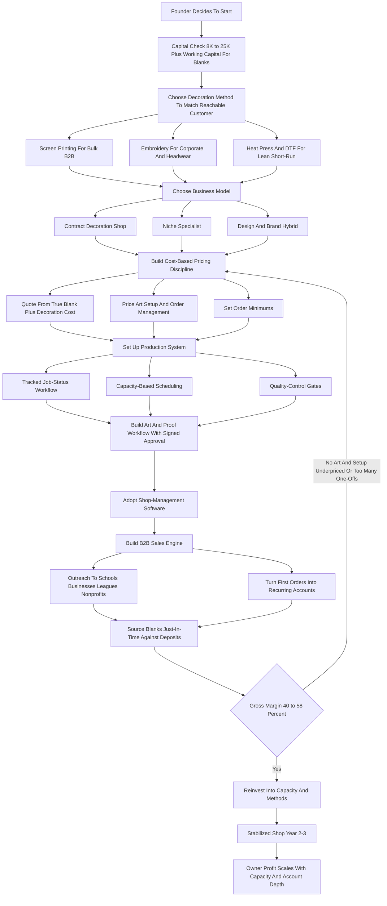

### Direct Answer

To start a custom apparel business in 2027, you buy blank garments, decorate them to a customer's design with a chosen method (screen printing, direct-to-garment, direct-to-film, embroidery, or heat-transfer vinyl), and sell the finished goods to schools, sports teams, businesses, nonprofits, and event organizers. It is a real, durable, modest-capital business — but a production-and-margin operation, not a passive online merch hobby, and brutally crowded at the undifferentiated low end. Win by anchoring on repeatable B2B accounts, pricing every quote from true decorated-unit cost, and matching your decoration method to the customer you can actually sell to.

**TL;DR:** A focused custom apparel startup invests **$8K-$60K** in equipment, blanks, software, and working capital, runs at a **40-58% gross margin** after blanks, consumables, and decoration labor, and in a disciplined Year 1 generates **$45K-$160K in revenue** against **$18K-$70K in owner profit**. By Year 3-5 a well-run shop reaches **$250K-$900K in revenue** with **$70K-$280K in owner profit**. The whole business rests on two numbers beginners blur together: **decorated-unit gross margin** (blank + ink + labor + machine time versus price) and **throughput** (profitable units your equipment and labor actually push out per week). Three things kill custom apparel startups: competing as an undifferentiated "we print shirts" shop on bare price, underpricing the invisible labor (art, setup, order management), and drowning in tiny one-off orders instead of compounding recurring B2B accounts. Viable in 2027 for the disciplined, margin-obsessed, B2B-anchored operator with a clear decoration specialty — a poor fit for anyone wanting a hands-off print-on-demand income.

## What A Custom Apparel Business Actually Is In 2027

### 1.1 The Core Industrial Idea

A custom apparel business buys blank garments and decorates them with a customer's design, then sells the finished goods. **You are not a clothing brand designing original garments from fabric, and you are not primarily a graphic designer — you are a decoration-and-production operation.** A customer comes to you with a logo or an idea and a quantity, and you turn blank shirts, hoodies, caps, and bags into branded, wearable product. The entire business is a single industrial idea executed thousands of times a year: you acquire a blank cheaply, add decoration that costs a known amount in materials, machine time, and labor, and sell the decorated unit for meaningfully more than the sum of those costs.

**The engine in numbers.** A blank tee that costs you $3.00, decorated for $2.00 in ink and labor, sold for $11.00, throws off a $6.00 gross margin. Multiply that across a 72-shirt school order and you have a job worth a few hundred dollars in margin that took a couple of hours of press time. Everything else in this guide — equipment choice, blank sourcing, art workflow, pricing, sales, hiring — is the machinery that lets you run that engine at volume, on deadline, without blowing the margin on rework, idle inventory, or underpriced labor.

### 1.2 Who Actually Buys Decorated Apparel

- **Schools and youth sports** — spirit wear, team uniforms, club tees, PTA and booster fundraisers — buy every season on a predictable calendar.
- **Businesses** — staff uniforms, trade-show apparel, onboarding swag, customer giveaways, company stores — buy steadily all year.
- **Nonprofits** — apparel fundraisers and event shirts on a recurring schedule.
- **Event organizers** — races, festivals, conferences, reunions, tournaments — order event tees by the hundreds.
- **Bands, creators, and small brands** — need merch lines and fulfillment.

**None of this demand is discretionary** in the way many purchases are, and much of it reorders predictably. That recurring, calendar-driven demand is what makes the business durable — and what separates the disciplined B2B shop from the speculative print-on-demand model covered in (q9589).

### 1.3 What Changed By 2027

| Shift | Effect On The Business |
|---|---|
| Print-on-demand normalization | Customers expect instant online quoting, proofs, order tracking |
| DTF printing maturity | Short-run full-color work viable without a screen room |
| Speculative merch wave | Flooded the lowest-margin one-off end; trained founders wrong |
| Rising blank and labor costs | Margin discipline and throughput became decisive |
| Shop-management software | A small shop can run like a much larger one |

## The Decoration Methods: What You Actually Choose Between

### 2.1 The Five Core Methods

The decoration method is the foundational technical decision — it determines equipment cost, throughput, per-unit economics, and which jobs you can profitably take.

- **Screen printing** pushes ink through a mesh stencil, one screen per color. Real setup cost and time per design, so it is uneconomic for tiny runs, but once screens are set the per-shirt cost and time are low and the ink is durable. It is the cheapest way to decorate large bulk orders and the backbone of school, team, event, and corporate work. Founders specializing here should study (q1988).
- **Direct-to-garment (DTG)** sprays water-based ink directly onto the garment from an inkjet-style printer. Near-zero setup, unlimited colors, photographic detail — but higher ink cost per shirt, slower throughput, and best on cotton and lighter garments.
- **Direct-to-film (DTF)** prints a design onto a film transfer and heat-presses it on. Full-color, works on blends and darks, low setup, cheaper equipment than DTG — it has become a default short-run method for new shops.
- **Embroidery** stitches the design in thread on a commercial multi-needle machine. The premium, durable, "corporate" look — essential for polos, caps, jackets, and bags, margin-rich, but the machines are a significant investment and digitizing is a skill. Founders specializing here should study (q1987) and (q9590).
- **Heat-transfer vinyl (HTV)** cuts colored vinyl on a cutter and heat-presses it on. The cheapest entry point, good for names and numbers and team rosters, but labor-intensive per piece and not a volume method. The vinyl-cutting craft overlaps with (q1993).

### 2.2 Method Comparison

| Decoration Method | Entry Equipment Cost | Best For | Setup Cost Per Job | Throughput | Margin Profile |
|---|---|---|---|---|---|
| Screen printing | $8K-$30K | Bulk B2B, schools, teams, events | High (screens, registration) | High once set up | Strong on volume |
| Direct-to-garment (DTG) | $15K-$40K+ | Short-run full-color cotton, one-offs | Near zero | Slow, one garment at a time | OK, high per-order overhead |
| Direct-to-film (DTF) | $3K-$12K | Short-run full-color, blends and darks | Low | Moderate | Decent, accessible entry |
| Embroidery | $8K-$25K | Polos, caps, jackets, corporate | Digitizing per design | Multi-head, minutes per piece | Premium, margin-rich |
| Heat-transfer vinyl (HTV) | $1K-$5K | Names, numbers, tiny quantities | Low | Labor-heavy per piece | Thin, not a volume method |

### 2.3 The Strategic Reality Of Method Choice

Most successful shops do not pick one method forever. **They start with one method matched to their capital and target customer, then add complementary methods from cash flow** — a shop that can screen print bulk, embroider corporate, and run DTF short-run can serve almost any order that walks in. The Year 1 mistake is buying a method that does not match the customer you can actually sell to: an expensive DTG printer with no plan to win the bulk B2B work that pays for it, or a heat-press-and-vinyl setup chasing 500-piece orders it cannot produce profitably. Sublimation, a sibling specialty covered in (q1991), dyes polyester directly and serves all-over performance wear — a separate launch decision worth its own analysis.

## The Three Business Models

### 3.1 The Contract Decoration Shop

The broad, order-driven core: **you decorate whatever blank apparel customers bring or order through you** — shirts, hoodies, caps, bags — across schools, teams, businesses, events, and nonprofits, competing on reliability, turnaround, and quality. Its advantage is volume, diversification across customer types, and being the dependable local source. Its challenge is that the low end is crowded and undifferentiated, so the shop must compete on service and B2B relationships rather than price. **This is the most common model and the most resilient**, because no single customer type can sink it.

### 3.2 The Niche Specialist

Goes deep on one high-value segment — corporate uniform programs, performance and team athletic wear, premium retail-quality fashion decoration, headwear, or creator merch fulfillment — and becomes the obvious expert for that need across a wider geography. **Its advantage is higher margins, less competition, deep expertise, pricing power, and stickier accounts.** Its challenge is concentration risk and a narrower addressable market.

### 3.3 The Design-And-Brand Hybrid

Sells creative direction, brand and merch strategy, and fulfillment on top of the decoration capability — the customer is buying a designed merch line or a managed company store, and the decoration is the medium. **Its advantage is the highest margins and the deepest relationships**, because design and program management cannot be price-shopped the way a bare print job can. Its challenge is that it requires genuine design and account-management talent — adjacent to the creative-services discipline of (q2134). Many operators start as a contract shop to build cash flow, then layer a niche or design arm on top. The wrong move is trying to be all three at once in Year 1 with limited capital and one person.

| Model | Margin Profile | Competition | Main Risk | Best For |
|---|---|---|---|---|
| Contract decoration shop | 40-55% | Crowded low end | Commoditization | Resilience, volume |
| Niche specialist | 50-65% | Thin in segment | Concentration | Margin, stickiness |
| Design-and-brand hybrid | 55-70% | Very thin | Talent dependence | Highest margin |

## The 2027 Market Reality

### 4.1 Demand Is Structurally Healthy And Recurring

A founder needs an accurate read of the landscape, because the business is neither the effortless online side hustle the print-on-demand marketing implies nor a dying trade. **Schools and youth sports decorate apparel every season. Businesses buy branded apparel for uniforms, trade shows, and giveaways. Nonprofits run apparel fundraisers. Events order tees by the hundreds. Bands and creators sell merch.** None of this is discretionary in the way many purchases are, and much of it reorders on a predictable calendar.

### 4.2 The Competition Is Bifurcated And Crowded

At the top sit large, well-capitalized players — **Custom Ink** and **Vistaprint** under **Cimpress N.V. (NASDAQ: CMPR)**, and **4imprint Group plc (LSE: FOUR)** — with national reach, scale pricing, and deep automation. At the bottom is an enormous long tail: print-on-demand platforms led by **Printful** and **Printify**, plus thousands of small local shops and side-hustlers with a heat press in a garage. The opportunity for a new disciplined entrant is **the underserved middle and the specialty edges** — being more reliable, faster, more consultative, and more relationship-driven than the long tail, and more responsive and local than the national giants.

### 4.3 What Changed By 2027

Print-on-demand normalized instant online quoting, proofs, and order tracking, so customers expect a professional digital experience. DTF printing lowered the technical and capital barrier for short-run full-color work. The speculative "make passive income selling your own designs" wave saturated the print-on-demand end and trained many would-be founders toward the hardest, lowest-margin version of the business — the trap detailed in the merch-business analysis (q9589). And blank apparel and labor costs rose, making margin discipline and throughput decisive. The net: demand is real and recurring, the business is harder and more crowded than the marketing suggests, and the winning entrant competes on B2B relationships, reliability, turnaround, and a clear specialty.

## The Core Unit Economics: Decorated-Unit Margin And Throughput

### 5.1 Decorated-Unit Margin

This is the most important section in the guide, because the entire business lives or dies on two numbers beginners blur together: the **gross margin on each decorated unit** and the **throughput**. Take the margin first, concretely.

A blank **Gildan Activewear (NYSE: GIL)** or **Bella+Canvas** tee costs **$2.50-$5.50** depending on brand and weight. Screen-printing it in one or two colors as part of a 72-piece order costs maybe **$1.50-$3.00** per shirt in ink, screen amortization, and press labor, and you sell it for **$9-$15** — a gross margin of roughly **45-60%**, with short per-shirt press time. The same blank decorated one-off on DTG costs **$3-$7** in ink and slower labor, and sells for **$22-$32** for a single full-color piece — the absolute dollar margin can be fine, but throughput is far lower and the art and customer-service overhead per order is much higher.

| Item | Blank Cost | Decoration Cost | Sell Price | Approx Gross Margin |
|---|---|---|---|---|
| Screen-printed tee, 1-2 color, 72+ pc | $2.50-$5.50 | $1.50-$3.00 | $9-$15 | 45-60% |
| DTG one-off full-color tee | $2.50-$5.50 | $3.00-$7.00 | $22-$32 | Solid dollar margin, low throughput |
| DTF-pressed hoodie | $12-$28 | $3.00-$7.00 | $35-$65 | 45-55% |
| Embroidered polo | $8-$18 | $3.00-$8.00 | $25-$55 | 50-60%, premium |
| Embroidered cap | $3-$9 | $2.00-$6.00 | $20-$40 | 55-65%, margin-rich |

### 5.2 Throughput Discipline

An automatic screen press can run hundreds of shirts an hour once set up; a manual press far fewer; a DTG machine prints one garment at a time over a minute or several; a six-head embroidery machine stitches six caps at once but each takes minutes. **Your real capacity is decoration-method throughput multiplied by the hours of skilled labor you actually have**, and that capacity, against your fixed costs, sets your revenue ceiling.

The discipline this imposes: **before quoting any job, know its true decorated-unit cost — blank, consumables, machine time, and labor — and know how much of your weekly capacity it consumes.** Bulk B2B screen and embroidery work has good margin and excellent throughput, which is why it is the backbone. Short-run DTF and DTG work has acceptable margin but consumes capacity and overhead fast, so it must be priced for that. The founder who quotes by gut builds a calendar full of jobs that feel busy but do not pay; the founder who quotes by decorated-unit cost and capacity consumed builds a shop that compounds.

### 5.3 The Line-By-Line Job P&L

Take a representative bulk job: 96 two-color screen-printed tees for a corporate 5K team, customer-facing price **$1,150**. The costs stack in an order beginners consistently underestimate.

| Cost Line | Amount / Note | Why It Matters |
|---|---|---|
| Blank apparel (96 @ ~$3.25) | ~$310 | Largest single hard cost |
| Ink, consumables, screens amortized | Modest per-job | Often the only cost beginners count |
| Screen setup and reclaim labor | Real labor | Unabsorbable by tiny jobs |
| Press labor | Time to run 96 shirts | Variable, scales with volume |
| Art and proof labor | ~1+ hour | Most commonly unpriced cost |
| Order management and customer service | Invisible labor sink | Quote, emails, sizes, invoice |
| Reprints and spoilage | 2-5% blended | Real ruined-shirt cost every job |
| Net gross margin | 40-58% | After blanks, consumables, decoration labor |

**The founders who fail at the P&L make the same two errors:** they price the visible costs (blank and ink) and give away the invisible ones (art, setup, order management, reprints), and they let the calendar fill with tiny low-throughput jobs that feel like progress but never cover fixed overhead.

## Equipment Selection And The Initial Capex Plan

### 6.1 The Buying Principle

The principle is **buy the method that matches the customer you can actually sell to first, then add complementary methods from cash flow.** Equipment is the largest startup decision and the easiest to mismatch to the customer.

### 6.2 Three Realistic Launch Paths

- **The lean heat-press and DTF launch** — a quality heat press, a DTF printer or a DTF transfer supplier relationship, a vinyl cutter, and blanks — starts around **$3K-$12K**, handles short-run full-color and name-and-number work, and is the lowest-risk entry. But it is a short-run method and cannot profitably chase large bulk orders.
- **The screen-printing launch** — a manual or entry automatic press, exposure unit, washout setup, dryer or conveyor, and screens — runs **$8K-$30K** and is the right base for a shop targeting school, team, event, and corporate bulk work.
- **The embroidery launch** — a commercial single- or multi-head machine (**Brother PR-series**, **Tajima**, **Melco**, **Ricoma**), digitizing software or an outsourced digitizing relationship, hoops, and thread — runs **$8K-$25K** for entry multi-head capacity.
- **A DTG launch** — **Brother GTX** or **Epson SureColor F-series** at the small end, **Kornit Digital (NASDAQ: KRNT)** at the industrial end — sits at **$15K-$40K+** and makes sense only when the customer base genuinely needs short-run full-color cotton work.

### 6.3 Beyond The Decoration Machine

Every launch also needs **blank inventory and working capital**, **software** (quoting and order management, design, accounting), **a space** (a garage at the smallest scale, a small commercial unit as it grows), and **basic finishing and shipping supplies**. Totaled, a focused launch lands in the **$8K-$60K** range. The sourcing discipline: buy commercial-grade equipment sized to the orders you intend to win, consider quality used equipment from shops upgrading or exiting, and resist buying a second or third method before the first is fully utilized and paying for itself.

| Decoration Method | Entry Capital Range | Customer It Serves |
|---|---|---|
| Heat press + DTF/vinyl lean | $3,000-$12,000 | Short-run, names/numbers, lean entry |
| Screen printing setup | $8,000-$30,000 | Bulk B2B, schools, teams, events |
| Embroidery setup | $8,000-$25,000 | Corporate, headwear, premium |
| DTG launch | $15,000-$40,000+ | Short-run full-color cotton |

## Blank Apparel Sourcing And Inventory Strategy

### 7.1 The Blank Brand Spectrum

The blank garment is the largest hard cost in most jobs. **Value brands** like **Gildan**, **Hanes**, **Jerzees**, and **Fruit of the Loom** anchor price-sensitive bulk work. **Mid and fashion brands** like **Bella+Canvas**, **Next Level**, **Comfort Colors**, **Champion**, **District**, and **Port & Company** serve customers wanting a softer, retail feel. **Premium and specialty brands** like **AS Colour**, **Independent Trading Co.**, and **Richardson** and **Flexfit** for headwear serve the high end. A shop quotes the right brand for the job — the booster club fundraiser and the craft brewery's retail-quality tee are not the same garment.

### 7.2 The Distributor Relationship

Sourcing runs through apparel distributors — wholesale suppliers like **S&S Activewear**, **SanMar**, **AlphaBroder**, and **TSC Apparel** that warehouse blanks across brands and ship fast. **A shop builds accounts with two or three so it is never stuck on a stockout.**

### 7.3 Just-In-Time Inventory

Inventory strategy is a balance. Carrying a stock of the most-ordered blanks speeds turnaround, but every blank on a shelf is cash that is not working and risks being the wrong size, color, or style. **The disciplined approach: stock a modest core of true high-velocity blanks, and order job-specific blanks per order against a confirmed quote and deposit, so the customer's commitment funds the inventory rather than the shop's cash sitting at risk.** This inventory-as-funded-cost discipline mirrors the lean-stock thinking of single-product e-commerce in (q9588).

## The Art And Proof Workflow

### 8.1 Where Jobs Quietly Lose Money

Art is where custom apparel jobs quietly lose money. Every job has an art arc: receive the customer's file, assess whether it is production-ready, clean it up or recreate it, prepare it for the specific decoration method (color separations for screen printing, digitizing for embroidery, file prep for DTG and DTF), send a proof, handle the revision round, and get a signed approval before production.

### 8.2 The Unpriced-Art-Time Problem

**The unpriced-art-time problem is universal among struggling shops.** Customers routinely send low-resolution logos, photos of a sketch, or files in the wrong format, and "just fixing it up" for free, across many quotes that may never close, is a steady margin leak. The discipline is to **price art as a real line item** — a setup or art fee that reflects the genuine labor, waived or credited only on orders large enough to absorb it, and an hourly or flat rate for true design and recreation work.

### 8.3 The Proof As Contract

The proof is also risk management: **a documented, customer-approved proof is what protects the shop when the customer later says the color, placement, or spelling is wrong.** In custom decoration, the approved proof is the contract for what gets made. Standardizing the workflow — a clear file-requirements sheet, a consistent proof template, a tracked approval step — turns art from a chaotic time sink into a controlled, billable stage. Founders building these repeatable procedures should study the SOP discipline behind any production business.

## Pricing And Quoting: Where Margin Is Won Or Lost

### 9.1 The Pricing Layers

- **The blank-plus-decoration build-up** — every quote starts from the true cost of the specific blank plus the true cost of decorating it, with a margin on top that also funds fixed overhead.
- **Quantity tiering** — bulk orders get lower per-unit pricing because setup is amortized and throughput is high; small orders must be priced richly.
- **Setup, art, and screen fees** — real, distinct line items, not costs to absorb.
- **Order minimums** — protect against tiny jobs that cost more in setup and admin than they earn.
- **Rush fees** — price the disruption of jumping the production queue.
- **Color and complexity factor** — more colors mean more screens and press passes; more stitches mean more machine time.

### 9.2 Refusing The Commodity Race

A 2027 shop that quotes only a bare per-shirt number against print-on-demand and a hundred local presses is in a race to the bottom. **A shop that quotes a professional, itemized, fast quote, consults on blank choice and decoration method, and stands behind quality and turnaround is selling something the commodity end cannot.** School and team work clusters around seasons, event work around event calendars, and corporate work is steadier — a shop balances the mix so it is not idle between school seasons.

| Pricing Lever | Purpose | Failure If Skipped |
|---|---|---|
| Blank-plus-decoration build-up | Cover true cost + overhead | Thin or negative real margin |
| Quantity tiering | Reflect setup amortization | Mispriced bulk or small orders |
| Setup/art/screen fees | Capture invisible labor | Margin leak on every job |
| Order minimums | Block setup-heavy tiny jobs | Calendar full of unprofitable work |
| Rush fees | Price queue disruption | Rush jobs blow up scheduling |

## The Sales Engine: Winning Repeatable B2B Accounts

### 10.1 Why B2B Relationships Are The Business

Custom apparel is a sales business as much as a production business. **The durable revenue comes from repeatable B2B accounts, not from a stream of one-off strangers.**

- **Schools and youth sports** — winning a school or league often means recurring orders for years; the relationship is with coaches, athletic directors, booster officers, and PTA leaders.
- **Businesses** — a corporate account that orders for onboarding and events all year is far more valuable than its first order suggests; the relationship is with HR, marketing, and office managers.
- **Nonprofits** — run apparel fundraisers and event shirts on a recurring calendar.
- **Event organizers** — order in volume on their event schedule.
- **Bands, creators, and small brands** — need merch and fulfillment.

### 10.2 Compounding Through Reorders

**Treat B2B relationship-building as a core ongoing function** — proactively reaching out to schools, businesses, leagues, and nonprofits rather than waiting for inbound, building a reputation for reliability, and turning every first order into a managed account that reorders. Repeat and referral business compounds: the satisfied corporate client, the school that had a smooth season, the race director who got shirts on time. A shop with a deep book of recurring accounts has a defensible, predictable business; a shop dependent on one-off inbound is always starting over — the treadmill that traps Etsy-style one-product sellers in (q1953).

## Production Workflow, Scheduling, And Deadlines

### 11.1 The Job Arc

Custom apparel is a deadline business — every job has a date it absolutely must ship. The job arc: quote and deposit, order or pull blanks, art and proof and approval, decoration setup (screens, digitizing, file prep), production run, finishing (folding, tagging, bagging, sorting by size), and delivery or shipment — every stage with a time cost, backing up from the customer's hard deadline.

### 11.2 Scheduling As The Operational Core

Orders arrive continuously, each consumes a known slice of equipment and labor capacity, and the shop must sequence them so every job ships on time. **School and event work especially clusters** — a back-to-school rush, a race-season crunch — and a small shop must know its true weekly capacity and either schedule within it, add temporary labor, or decline and reprice work that does not fit. The blank-arrival dependency is a common failure point: production cannot start until the right blanks are in hand.

### 11.3 Quality Gates

Quality control runs throughout: **checking registration and color on the first prints of a run, inspecting stitch quality, catching misprints early before a whole run is ruined, and inspecting the finished order before it ships.** A tracked job-status system — purpose-built shop-management software or a disciplined board — lets the shop know where every order stands and which deadline is at risk. The shops that get production wrong treat scheduling as memory and hope; the ones that get it right run production as a designed system with known capacity, tracked status, and quality gates.

## Shop Software And The Operational Backbone

### 12.1 Shop-Management Software

In 2027 a custom apparel shop runs on software. **Shop-management software** — purpose-built platforms for the decorated-apparel industry such as **Printavo**, **YoPrint**, **ShopVOX**, and **InkSoft** — is the central system: it generates quotes and invoices, tracks orders through every production stage, holds customer and job history, manages the production calendar and capacity, and consolidates reporting. This is the first serious paid tool a growing shop adopts.

### 12.2 Design Tools And Company Stores

Design software handles art prep, color separations, mockups, and digitizing. **Company stores** — hosted webstores where a school's families or a company's employees order directly — are a powerful tool for turning one B2B relationship into many self-service orders. Accounting and inventory tools track the real cost of goods and the job-level profitability that tells the founder which work actually pays.

| Software Layer | Function | When To Adopt |
|---|---|---|
| Shop-management platform | Quotes, orders, calendar, reporting | Past a handful of concurrent jobs |
| Design and digitizing | Art prep, separations, mockups | From day one |
| Company stores | Self-service B2B reorder streams | As B2B accounts mature |
| Accounting and inventory | Cost of goods, job profitability | From day one |

## Staffing And Building A Production Team

### 13.1 The Hiring Sequence

A founder can run the smallest shop solo, but the business does not scale past one person's hands without a team. **The first hires are production labor** — the people who run the press, the embroidery machine, the heat press, who catch and fold and box shirts, who reclaim screens and pretreat garments. **The art and digitizing role** is the next pressure point, freeing the founder from the art queue. **The sales and account-management role** is what actually drives growth. **Order and production management** becomes essential as concurrent jobs multiply.

### 13.2 The Cost Structure

Production labor is the largest operating expense after blanks — partly variable with volume, partly a fixed trained core. The art, sales, and management roles are fixed investments that unlock capacity and growth. **Seasonality shapes staffing** — the school and event rushes may warrant temporary or flex labor on top of a year-round core. Custom apparel scales by adding hands and skills to a proven production system, and the founders who deliberately add the art, sales, and management roles — rather than trying to be all of them forever — break past the one-person ceiling. That codify-and-scale-past-the-solo-ceiling pattern is the same one analyzed for service businesses in (q9502).

## Startup Cost Breakdown: The Honest All-In Number

### 14.1 The Line Items

Custom apparel is reachable on modest capital, but under-capitalization — especially on blanks and working capital — is a real killer.

| Startup Line | Range | Note |
|---|---|---|
| Decoration equipment | $3,000-$40,000+ | Largest and most variable line |
| Blank inventory + working capital | $2,000-$15,000 | Routinely under-funded |
| Shop space setup (if not a garage) | $0-$8,000 | First month, deposit, buildout |
| Shop-management + design software | A few hundred to low thousands | Setup plus first months |
| Insurance | $500-$3,000 | General liability, equipment, first payment |
| Business formation, licensing, legal | $300-$1,500 | Entity, permits, templates |
| Website + quoting setup | $500-$4,000 | Professional site with quote flow |
| Finishing, shipping, shop supplies | $500-$3,000 | Tables, racks, packaging, tools |
| Working capital / operating reserve | $3,000-$15,000 | Buffer for the cash gap |

### 14.2 The Two Launch Tiers

A **lean focused launch** can come in around **$8,000-$25,000**, and a **fuller launch** with a stronger equipment package and reserve runs **$30,000-$60,000+**. Financing softens the equipment line, but the founder still needs real cash for blanks and the operating reserve, because the business has a built-in cash gap: blanks must be bought and labor paid before the customer's payment clears. **The danger is not the equipment sticker — it is launching with no working capital to fund blanks and survive the first slow stretch.**

## The Year-One Operating Reality

### 15.1 Capability And Account Building

Year 1 is **capability-building and account-building mode, not profit-extraction mode.** The first year is spent learning the craft to a saleable quality level — registration, color, stitch quality, garment handling — discovering the true labor cost of art and setup and order management, building the first repeatable B2B accounts, and finding where the operation is fragile.

### 15.2 Realistic Year-One Numbers

A disciplined Year 1 custom apparel startup, launched with real equipment matched to a reachable customer base and a working-capital cushion, can realistically generate **$45,000-$160,000 in revenue** against **$18,000-$70,000 in owner profit** — meaningful, but earned through hands-on production work and active selling, not passive. The work is genuinely hands-on: the founder is on the press, prepping art, sending quotes, chasing blanks, and delivering orders. The founders who succeed treat Year 1 as paid tuition in a real production-and-sales business; the ones who fail expected a hands-off online merch income.

## The Five-Year Revenue Trajectory

### 16.1 The Year-By-Year Arc

| Year | Revenue | Owner Profit | Operating Reality |
|---|---|---|---|
| Year 1 | $45,000-$160,000 | $18,000-$70,000 | B2B-anchored, founder hands-on across production, art, sales |
| Year 2 | $120,000-$350,000 | $45,000-$140,000 | Added capacity, first part-time help, accounts reordering |
| Year 3 | $220,000-$550,000 | $65,000-$200,000 | Real system, small trained team, founder managing |
| Year 4 | $350,000-$750,000 | $90,000-$250,000 | Niche or design-program layering, company stores scaling |
| Year 5 | $450,000-$900,000+ | $120,000-$280,000 | Mature shop, founder choosing scale or specialty or sale |

### 16.2 What The Numbers Assume

These numbers assume disciplined cost-based pricing, a real B2B account base, controlled reprints and inventory, and method-and-customer fit. **They do not assume viral print-on-demand growth, because custom apparel scales with equipment capacity, skilled labor, and account depth, not magically.** A mature custom apparel business is a real small business with machines, a team, a book of recurring accounts, and job-level profitability discipline — a genuinely good outcome, earned through years of production and sales discipline.

## Five Named Real-World Operating Scenarios

### 17.1 Marisol, The Disciplined Contract Shop

Launches with $18K into an entry screen-printing setup plus a heat press for short-run work, deliberately targets schools and local businesses from day one, prices art and setup as real line items, and turns her first school order into a recurring spirit-wear account. Hits **$115K revenue in Year 1**, reinvests into an automatic press and an embroidery machine, and reaches **$420K by Year 3** with healthy margins because her calendar is full of repeatable bulk B2B work.

### 17.2 Devon, The Wrong-Equipment Cautionary Tale

Spends $30K on a capable DTG printer because the print-on-demand videos made one-off full-color work look like the future, but has no sales plan to win bulk orders. **The machine sits underutilized between scattered one-off jobs, the per-order overhead crushes his margin, and he is cash-strapped within a year** because the expensive equipment never got loaded with the throughput-friendly work that pays for it.

### 17.3 Priya, The Corporate Uniform Specialist

Goes niche from the start, building a deep embroidery and screen operation focused entirely on corporate uniform and apparel programs — staff shirts, polos, caps, jackets, branded outerwear — and becomes the go-to for managed company apparel across her region. Smaller addressable market but high margins, sticky recurring accounts, and pricing power, **reaching $380K by Year 4** at strong margins.

### 17.4 The Okafor Brothers, Design-And-Brand Hybrid

Start as a contract shop for two years to build the production engine, then layer a design-and-merch-program arm on top — selling creators, breweries, and small brands a designed merch line and managed fulfillment rather than bare print jobs — and lift average order value and margin substantially. **Year 5 revenue near $800K** with the design arm carrying the best margins.

### 17.5 Tyler, The One-Off Treadmill Casualty

Builds decent skills but never builds a sales motion, sets up a website and waits, and fills his calendar with a churn of tiny one-off orders from strangers found online — each a fresh art file, a fresh customer, a setup cost spread over a handful of pieces. **He is busy every week and exhausted, but the margin never compounds** because he never converted a single relationship into a recurring B2B account.

## Lead Generation And Marketing

### 18.1 The Channel Mix

- **Direct B2B outreach** is the highest-value channel — proactively contacting local schools, athletic leagues, businesses, nonprofits, and event organizers.
- **Referrals and reputation** compound — in a relationship business, reliability is the marketing.
- **The website and online quoting experience** is the modern storefront and credibility signal — a portfolio of real work and a fast professional quote flow.
- **Local visibility** — sponsoring or outfitting local teams and events, networking with the organizations that buy apparel.
- **Company and team stores** turn one B2B relationship into a self-service order stream.
- **Social media and portfolio content** — showing real finished work builds credibility, especially for design-oriented models, an approach shared with DTC apparel brands in (q1931).
- **Sample and spec work** for a target account can open a recurring relationship.

### 18.2 Where The Weight Goes

Paid advertising plays a modest, targeted role; the business is won through B2B outreach, referral compounding, local presence, and a professional quoting experience. **A shop with a thin account base competes on price against the entire crowded low end; one with a deep base has a steady, defensible flow of reorders.**

## Risk Management And Insurance

### 19.1 The Risk Register

| Risk | Mitigation |
|---|---|
| Reprint and spoilage (2-5% blended) | Quality-control gates, careful operators, first-print checks, price it in |
| Approval and rework disputes | Documented, signed proof — the contract for what gets made |
| Blank inventory aging and mis-sizing | Just-in-time job-funded buying, deliberately small core stock |
| Missed deadline losing a B2B account | Realistic capacity-based scheduling, tight blank-arrival tracking |
| Equipment down mid-rush | Maintenance discipline, supplier relationships, redundant capacity as you grow |
| Cash gap before customer payment | Deposits on orders, operating reserve |
| Customer concentration | Diversified account base across customer types |
| IP and liability exposure | General liability insurance, contract clause placing IP responsibility on customer |
| Commodity pricing pressure | Differentiation: specialty, reliability, consultation, B2B relationships |

### 19.2 The Throughline

Every major risk in custom apparel has a known mitigation built from quality systems, contracts and proofs, insurance, working capital, and account diversification. **The operators who fail are usually the ones who skipped the proof, under-funded the working capital, or never differentiated from the commodity crowd.**

## Competitor Landscape: Who You Are Up Against

### 20.1 The Field

**The national giants** — Custom Ink and Vistaprint under Cimpress (NASDAQ: CMPR), 4imprint Group plc (LSE: FOUR), and large industrial decorators — own the top of mind and the largest standardized orders, but can be less flexible, less consultative, and slower on the personal relationship. **The print-on-demand platforms** — Printful and Printify — let anyone start with zero equipment and serve the speculative one-off end; they shape customer expectations on instant quoting. **The long tail of small local shops and side-hustlers** competes on price and proximity at the low end and is easy to out-professionalize on reliability and decoration breadth. **Promotional-products distributors** overlap, often selling decorated apparel alongside pens and mugs.

### 20.2 The Real Moat

You generally cannot out-scale the national giants or out-cheap the garage side-hustler, so you win by being the most reliable, most consultative, most decoration-capable, most relationship-driven shop in the underserved middle. **The competitive moat in custom apparel is not the equipment — anyone with capital can buy a press — it is the B2B account relationships, the reputation for on-time correct delivery, the decoration breadth, the production system, and the clear specialty** that take years to build and are genuinely hard for a new entrant to copy.

## Financing, Taxes, And Business Structure

### 21.1 Financing The Launch

**Equipment financing** is the natural fit for the largest line — presses, DTG and DTF printers, embroidery machines, and dryers are tangible assets that lenders will finance, spreading the cost over the earning life of the machine. **Quality used equipment** from shops upgrading or exiting is cheap capital. **SBA and small-business loans** can fund a broader launch. **Customer deposits** are a structural financing tool that funds the blanks and labor for each job. **Reinvested cash flow** funds most healthy growth past Year 1. The discipline: finance the earning machines, fund the blanks and the reserve with real cash, and require deposits — over-financing a stack of equipment while launching with no working capital is how a financed launch fails.

### 21.2 Taxes And Structure

Most custom apparel operators form an **LLC or S-corp** for liability protection and tax flexibility. **Depreciation matters** — the presses, printers, and embroidery machines are depreciable assets, and accelerated or first-year expensing materially shapes taxable income in heavy-equipment years. **Sales tax** on decorated apparel applies in most jurisdictions, with attention to resale certificates — blanks bought for resale are typically purchased exempt, and the decorated product is taxed on sale. **Payroll taxes** on production, art, and sales staff are a real cost to budget. Separate business banking from day one, run a bookkeeping system that tracks equipment as assets and blanks as inventory, and engage an accountant who understands equipment-and-inventory small businesses — the same financial-discipline foundation taught for any small business in (q1959).

## Niche And Specialty Paths Worth Considering

### 22.1 The High-Value Niches

- **Corporate uniform and apparel programs** — managed staff apparel, company stores, recurring onboarding orders — high-margin and sticky.
- **Performance and team athletic wear** — jerseys, sublimated uniforms, team and league programs.
- **Premium and retail-quality fashion decoration** — soft high-end blanks for small brands and boutiques.
- **Headwear specialization** — caps, beanies, embroidery and patch work — a focused, margin-rich niche.
- **Creator, band, and small-brand merch fulfillment** — designing and producing managed merch lines.
- **Promotional and event apparel at volume** — event-calendar-driven volume.
- **Eco and sustainable apparel decoration** — organic and recycled blanks, water-based and discharge inks — a growing values-driven segment.

### 22.2 The Strategic Point

The general contract model is the most resilient and the most common starting point, but the specialty paths can deliver higher margins, stickier accounts, and less commodity price pressure. **The mistake is not choosing a niche; it is staying an undifferentiated "we print shirts" shop competing on price with everyone.**

## Scaling, Exit, And The 2027-2030 Outlook

### 23.1 Scaling Past The First Shop

The prerequisites for scaling: Year-1 work genuinely profitable at the job level, a documented production workflow, a real reordering B2B account base, and cash flow plus reserve to absorb the next equipment and the next slow stretch. The levers: **add decoration capacity and methods**, **add and train production labor in step with order volume**, **add the art and sales roles**, **fully use shop-management software**, and **deepen the B2B account base and add company stores.** The constraints are equipment capacity, founder attention, skilled labor, and space — each solved in turn. The founders who scale well treated Year 1 as a system-building exercise, so growth was the repetition of a proven machine rather than a series of expensive experiments — the same operating discipline behind adjacent equipment-backed shops in (q1985).

### 23.2 Exit Paths

| Exit Path | What It Looks Like |
|---|---|
| Sell the operating business | Multiple of stabilized earnings; driven by account durability, equipment condition, systems, owner-dependence |
| Sell the assets | Presses, printers, embroidery machines retain real resale value — a floor pure-service ventures lack |
| Acquire and roll up | Buy smaller competitors' equipment and accounts; position for acquisition by a regional decorator |
| Internal transition | Hand to a trained key employee or family member |
| Graceful wind-down | Sell the machines, let accounts lapse, exit with proceeds |

### 23.3 The 2027-2030 Outlook

**Demand stays structurally healthy and recurring** — schools, youth sports, businesses, nonprofits, and events keep needing decorated apparel on a predictable calendar. **DTF printing keeps lowering the short-run barrier**, helping new entrants but intensifying short-run competition. **Print-on-demand keeps absorbing the speculative end**, leaving the disciplined B2B-anchored shop as the more durable model. **Automation keeps professionalizing the small shop** through shop-management software, online quoting, and company stores. **AI and tooling assist on art, quoting, and operations.** **Sustainability rises as a niche with pricing power.** **Consolidation continues** as well-run shops absorb the accounts that under-capitalized side-hustlers vacate. The net: custom apparel is **viable and durable through 2030 in its disciplined, margin-obsessed, B2B-anchored, decoration-specialized form** — and a struggle in its undifferentiated, under-capitalized, no-sales-motion form.

## The Operating Journey: From Method Choice To Stabilized Shop

## Counter-Case: Why Starting A Custom Apparel Business In 2027 Might Be A Mistake

The case above describes a viable business, but a serious founder must stress-test it against the conditions that make this model a bad bet. There are real reasons to walk away.

### 24.1 The Low End Is Brutally Crowded And Commoditized

"We print shirts" is one of the most saturated small-business categories there is — print-on-demand platforms let anyone start with zero equipment, and every town has a dozen presses and garage side-hustlers. An undifferentiated shop competing on a bare per-shirt price is in a permanent race to the bottom, and many founders never escape it because they never built a specialty or a B2B relationship base.

### 24.2 The Print-On-Demand Dream Trains Founders Wrong

The marketing that draws people in — "start a passive merch brand, upload designs, collect income" — points at the speculative, one-off, lowest-margin end. A founder who internalizes that mental model buys for one-off full-color work, never builds a sales motion, and ends up on the one-off treadmill: busy, exhausted, and not compounding.

### 24.3 The Invisible Labor Quietly Destroys The Margin

Art prep, color separations, digitizing, mockups, proofs and revisions, quoting, size breakdowns, and order management are real hours, and they are the costs beginners give away for free across every quote — including the many that never close. An operator who prices only the visible blank-and-ink cost runs a thin real margin while believing the quoted margin is real.

### 24.4 Buying The Wrong Equipment Is An Expensive, Common Mistake

A capable DTG printer with no plan to win bulk work, or a heat-press setup chasing 500-piece orders it cannot produce profitably, is dead capital. The equipment must match the customer the founder can actually sell to — and the print-on-demand and YouTube influence pushes many founders toward the machine that looks exciting rather than the one their reachable market pays for.

### 24.5 It Is A Hands-On, Deadline-Bound Production Business

Every job has a hard ship date. The founder is on the press, prepping files, chasing blanks, folding and boxing, and delivering — while also selling. Anyone imagining a hands-off online store where designs sell themselves has misunderstood the model; it is a production shop with a calendar of deadlines, and missing them loses the B2B accounts that are the whole point.

### 24.6 Reprints, Spoilage, And Rework Are Constant And Corrosive

Misprints, mis-registration, ruined garments, embroidery errors, and post-production "that's the wrong color or spelling" disputes are a steady 2-5%+ drag, and worse for shops without quality gates and signed proofs. A wrong run is wasted blanks, wasted ink, wasted labor, and a deadline now at risk.

### 24.7 Working Capital And The Cash Gap Catch The Under-Funded

Blanks must be bought and labor paid before the customer's payment clears, and beginners chronically under-fund the blank-and-working-capital line while over-spending on equipment. A shop with a great machine and no cash to buy blanks for the order in hand is stuck.

### 24.8 Customer Concentration Cuts Both Ways

The recurring B2B accounts that make the business durable also create concentration risk — losing one big school district or corporate account can blow a hole in the year. Building a diversified account base takes time, and in the early years the shop is both under-diversified and competing on price.

### 24.9 Adjacent Paths May Fit Better

A founder drawn to the creative side — designing the graphics, building brands — might be better served by a graphic design or brand-strategy business with far less equipment and production burden. A founder drawn purely to the B2B-sales side might fit a promotional-products distributorship that outsources decoration. Custom apparel specifically rewards the production-and-sales operator; for the founder who loves only one half of that, the full decoration shop is the wrong expression of the interest.

### 24.10 The Honest Verdict

Starting a custom apparel business in 2027 is a reasonable choice for a founder who has $8K-$25K of genuine launch capital plus real working capital for blanks and a reserve, will choose a decoration method that matches the customer they can actually sell to, will price art and setup and order management as the real costs they are, can run a hands-on deadline-bound production business while also selling, will control reprints with quality gates and protect the shop with signed proofs and a contract, and will commit to the ongoing work of building a diversified recurring B2B account base and a clear specialty. It is a poor choice for anyone under-capitalized on working capital, anyone who wants a passive print-on-demand income, anyone who will not build a sales motion, and anyone whose real interest is purely the design or purely the selling. The model is not a scam, but it is more crowded, more hands-on, more labor-cost-laden, and more sales-dependent than its creative, passive-income surface suggests.

## The Final Framework: Building It Right From Day One

### 25.1 The Twelve-Step Build Order

1. **Get honest about capital and temperament** — confirm $8K-$25K for a lean disciplined launch with real working capital for blanks and a reserve, and confirm you want a hands-on production-and-deadline-and-sales business.
2. **Choose your decoration method to match the customer you can actually sell to** — screen printing for bulk B2B, embroidery for corporate and headwear, heat-press and DTF for lean short-run entry, DTG only with a real plan to feed it.
3. **Choose your model deliberately** — contract decoration shop for resilience, niche specialist for margin, or design-and-brand hybrid for the highest margins; do not try to be all three in Year 1.
4. **Build the cost-based pricing discipline** — every quote built from true blank-plus-decoration cost and capacity consumed, with art, setup, and order management as real line items.
5. **Set up the production system** — a tracked job-status workflow, realistic capacity-based scheduling, quality-control gates, and tight blank-arrival tracking.
6. **Build the art-and-proof workflow** — a file-requirements standard, a consistent proof template, a signed-approval step, and art priced or deliberately credited.
7. **Adopt shop-management software** so quotes, deadlines, and order status run as a system.
8. **Build the B2B sales engine** — proactive outreach, turning first orders into managed recurring accounts.
9. **Source blanks just-in-time against deposits** with strong distributor accounts and a small core stock.
10. **Carry real insurance** — general liability and equipment coverage — and use a contract placing IP responsibility on the customer.
11. **Hold the working-capital reserve** to cover the cash gap and the slow stretches.
12. **Keep the exit options open** — well-maintained equipment, a durable account base, clean books, and documented systems make the shop sellable.

### 25.2 The Bottom Line

Do these twelve things in this order and a custom apparel business in 2027 is a legitimate path to a **$250K-$900K equipment-backed small business with $70K-$280K in owner profit.** Skip the discipline — especially on method-and-customer fit, cost-based pricing, and the B2B sales motion — and it is a fast way to fill a shop with an underused machine and a calendar of one-off orders that never pay. The business is neither an effortless online side hustle nor a dying trade. **It is a real, equipment-backed, production-and-sales small business, and in 2027 it rewards exactly one kind of founder: the disciplined, margin-obsessed operator who treats it as the production-and-relationship business it actually is.**

## Sources

1. **PRINTING United Alliance / SGIA — Decorated Apparel Industry Data** — Trade association covering screen printing, DTG, and decorated-apparel industry benchmarks. https://www.printing.org
2. **Impressions Magazine — Decorated Apparel Trade Coverage** — Journalism on screen printing, embroidery, DTG, and DTF trends, equipment, and shop practices. https://impressionsmagazine.com
3. **Printwear / GRAPHICS PRO — Apparel Decoration Trade Publication** — Operations and equipment coverage for the apparel-decoration industry. https://graphics-pro.com
4. **Custom Ink — Market-Leading Online Custom Apparel Retailer (Cimpress)** — National online custom-apparel competitive benchmark. https://www.customink.com
5. **4imprint Group plc (LSE: FOUR) — Promotional Products and Apparel** — Public-company promotional-products and decorated-apparel competitor. https://www.4imprint.com
6. **Cimpress N.V. (NASDAQ: CMPR) / Vistaprint — Mass-Customization Apparel and Print** — Parent of Vistaprint and Custom Ink; mass-customization competitive context. https://www.cimpress.com
7. **Printful — Print-On-Demand and Fulfillment Platform** — Reference for the print-on-demand segment shaping customer expectations. https://www.printful.com
8. **Printify — Print-On-Demand Marketplace** — Print-on-demand platform reference for the speculative and one-off online end. https://printify.com
9. **S&S Activewear — Wholesale Blank Apparel Distributor** — Major wholesale blank-apparel distributor; sourcing and pricing reference. https://www.ssactivewear.com
10. **SanMar — Wholesale Imprintable Apparel Distributor** — Large wholesale blank-apparel and accessories distributor. https://www.sanmar.com
11. **AlphaBroder — Wholesale Apparel and Accessories Distributor** — National blank-apparel distributor; brand and pricing reference. https://www.alphabroder.com
12. **Gildan Activewear (NYSE: GIL) — Value Blank Apparel Manufacturer** — Core value-blank manufacturer; garment specs and pricing reference. https://www.gildan.com
13. **Bella+Canvas — Fashion Blank Apparel Manufacturer** — Fashion-blank manufacturer for softer retail-feel garments. https://www.bellacanvas.com
14. **Next Level Apparel / Comfort Colors / Champion — Mid and Fashion Blanks** — Reference brands for mid-tier and fashion blank apparel. https://www.nextlevelapparel.com
15. **AS Colour / Independent Trading Co. — Premium and Specialty Blanks** — Premium blank and fleece brands for the high end and niches. https://www.ascolour.com
16. **Brother USA — DTG Printers and Embroidery Machines (GTX, PR-Series)** — Equipment reference for direct-to-garment and multi-needle embroidery. https://www.brother-usa.com
17. **Epson — SureColor F-Series DTG and Dye-Sublimation Printers** — Direct-to-garment and sublimation equipment reference. https://epson.com
18. **Kornit Digital (NASDAQ: KRNT) — Industrial DTG and DTF Systems** — Industrial-scale digital decoration equipment reference. https://www.kornit.com
19. **Tajima / Melco / Ricoma — Commercial Embroidery Machines** — Commercial multi-head embroidery equipment references. https://www.tajima.com
20. **Ryonet / ScreenPrinting.com — Screen Printing Equipment and Supplies** — Screen-printing presses, exposure units, inks, and supplies reference. https://www.screenprinting.com
21. **M&R Companies — Screen Printing Press Manufacturer** — Manual and automatic screen-printing press equipment reference. https://www.mrprint.com
22. **Printavo — Shop Management Software for Decorated Apparel** — Quoting, order tracking, and production-calendar software reference. https://www.printavo.com
23. **YoPrint / ShopVOX / InkSoft — Apparel Shop Management Platforms** — Quoting, workflow, and online-store software references for decoration shops. https://www.yoprint.com
24. **US Small Business Administration — Business Structures and Equipment Financing** — Reference for entity selection, SBA loans, and small-business financing. https://www.sba.gov
25. **IRS — Depreciation, Section 179, and Bonus Depreciation Guidance** — Tax treatment of decoration equipment as depreciable business assets. https://www.irs.gov
26. **Equipment Leasing and Finance Association (ELFA) — Equipment Financing Reference** — Financing structures applicable to presses, printers, and embroidery machines. https://www.elfaonline.org
27. **State and Local Sales Tax and Resale Certificate Guidance** — Reference for resale certificates on blanks and sales tax on decorated apparel. https://www.taxadmin.org
28. **Promotional Products Association International (PPAI) — Industry Data** — Trade association data for the promotional-products and decorated-apparel market. https://www.ppai.org
29. **Advertising Specialty Institute (ASI) — Promotional Apparel Market Research** — Market research and distributor data for the promotional and decorated-apparel industry. https://www.asicentral.com
30. **NFIB — Small Business Economic and Operating Conditions** — Small-business labor cost, pricing, and operating-condition data. https://www.nfib.com
31. **US Bureau of Labor Statistics — Printing and Related Support Occupations** — Wage and employment data for screen printers, press operators, and related labor. https://www.bls.gov
32. **IBISWorld — Custom T-Shirt Printing and Screen Printing Industry Reports** — Industry revenue, margin, and competitive-structure reference. https://www.ibisworld.com
33. **Richardson / Flexfit / Yupoong — Headwear Blank Manufacturers** — Cap and headwear blank references for the headwear category. https://www.richardsoncap.com
34. **BizBuySell — Business Valuation and Sale Listings (Apparel Decoration / Screen Printing)** — Reference for going-concern valuations and exit multiples in the category. https://www.bizbuysell.com
35. **SCORE — Small Business Mentoring and Planning Resources** — Business planning, cash-flow, and pricing guidance for small production businesses. https://www.score.org

## Related Pulse Library Entries

- **Decoration-method siblings.** Founders choosing screen printing as their core method should study the dedicated screen-printing playbook (q1988), and those building an embroidery operation should read both the embroidery-business guide (q1987) and the custom embroidery shop deep dive (q9590).
- **Adjacent decoration and printing trades.** The sublimation-printing business (q1991) covers all-over polyester decoration, and the vinyl decals business (q1993) covers the cut-vinyl craft that overlaps with heat-transfer work.
- **The print-on-demand contrast.** The print-on-demand merch business (q9589) is the speculative model this guide repeatedly warns against — read it to understand the trap.
- **E-commerce and brand adjacencies.** Operators leaning toward the design-and-brand hybrid should study the brand identity studio business (q2134), the e-commerce DTC brand guide (q1931), the single-product e-commerce model (q9588), and the Etsy shop business (q1953).
- **Equipment-backed and scaling parallels.** The 3D printing service business (q1985) shares the equipment-and-throughput operating bones, the bookkeeping business (q1959) covers the financial discipline a shop must build, and the senior tech-training scaling guide (q9502) maps the codify-and-scale-past-the-solo-ceiling pattern.
