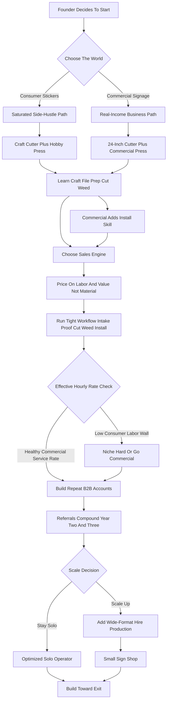

### Direct Answer

To start a vinyl decals business in 2027, you buy a vinyl cutter, a heat press, and rolls of adhesive and heat-transfer film, then convert material that costs pennies per square foot into stickers, signage, apparel graphics, wall art, and vehicle lettering that sell for **$5 to $2,500 per job**. The model is real, low-barrier, and genuinely profitable on materials -- but it is crowded at the bottom and won or lost on a single decision: whether you sell **cheap commodity stickers to consumers** (a race to the bottom against millions of Etsy sellers and Cricut hobbyists) or **applied signage and graphics to businesses** (vehicle lettering, storefront windows, wall murals, fleet decals) where the buyer is paying for a solved problem, not a sticker. Build the commercial or niche version with honest labor-based pricing and you have a legitimate path to a $70K-$250K business with a real owner income; default into the consumer-sticker corner and you have a labor-walled side hustle.

**TL;DR:** A focused solo startup invests **$1,500-$15,000** in a cutter, press, software, vinyl inventory, and a basic web presence, runs at a **65-85% material margin** (far lower once labor is priced honestly), and in a disciplined Year 1 generates **$15K-$70K in revenue** against **$8K-$40K in owner profit** -- thin if you chase consumer stickers, far healthier if you land recurring B2B sign work. By Year 2-3 a well-run operation reaches **$70K-$250K** with **$35K-$120K in owner profit**. The three things that kill vinyl decal startups: **(1)** competing on price in the saturated consumer sticker market, **(2)** underpricing the design, weeding, and installation labor by treating skilled hand-work as free because the vinyl is cheap, and **(3)** never graduating from a Cricut hobby to an actual business with a commercial cutter, a B2B pipeline, and repeat accounts. Net: viable in 2027 as a deliberate, B2B-leaning, install-capable graphics operation -- a poor fit for anyone who thinks "I have a Cricut" is a business plan.

## 1. What A Vinyl Decals Business Actually Is In 2027

A vinyl decals business takes thin, flexible, adhesive-backed film and converts it -- by cutting, layering, weeding, and applying -- into a finished graphic that goes onto a surface and stays there. Understanding the model means separating the seductive material math from the real cost structure.

### 1.1 The Core Definition

You are not, fundamentally, in the sticker business; you are in the business of putting a customer's words, logo, or image onto a thing they own, durably and cleanly. That surface might be a coffee mug, a laptop, a storefront window, a delivery van, a gym wall, a hard hat, a trade-show booth, a boat hull, a race car, a real-estate yard sign, or a t-shirt. **The honest definition of a vinyl decals business in 2027 is a graphics-application service that happens to use cheap material.** The founders who succeed understand that the skill, the equipment quality, the install ability, and the customer relationships are the business -- the vinyl is just what the work is cut from.

### 1.2 Why The Cheap Material Is The Trap

The raw material is astonishingly cheap. **A 12-inch by 50-foot roll of quality outdoor sign vinyl runs $40 to $120** and yields hundreds of square feet of cut graphics. That is why the business attracts a flood of entrants and why the material margin looks intoxicating on a spreadsheet. But the cheapness of the vinyl is also the trap: because anyone can buy a $300 Cricut and a roll of film, the consumer end of this market is one of the most saturated small-business categories in existence, and the per-unit profit, while real, is measured in single dollars against hours of design, cutting, weeding, and packing.

### 1.3 The Buyers Who Actually Pay A Living Wage

The version of this business that pays a living wage in 2027 sells to organizations. **A plumber who needs his three trucks lettered, a new restaurant that needs window graphics and a menu board, a CrossFit gym that wants its logo eight feet wide on the wall, a manufacturer that needs ten thousand warning labels, a realtor who needs fifty yard signs** -- those buyers are not price-shopping a $4 sticker. They are buying a solved problem, on a deadline, and they come back. The same install-and-graphics logic underpins the adjacent trades covered in the vinyl wrap shop entry (q9596) and the auto wrap shop entry (q2071).

### 1.4 The Skill Stack Behind The Service

A founder should see clearly what skills the business actually rewards, because the equipment list hides them. The stack runs in four layers. **Design and file prep** -- turning a customer's rough idea or low-resolution logo into a clean, weeding-friendly vector cut file. **Production craft** -- knowing blade depth and force for each film, running a test cut, and weeding cleanly and quickly. **Material judgment** -- choosing calendared versus cast, permanent versus removable, the right HTV for the right fabric. **Application and install** -- the physical act of putting a graphic on a real surface without bubbles, wrinkles, or a crooked line. A founder who is strong on the first two layers but weak on the last two can run a consumer-sticker shop; only a founder who genuinely owns all four can run the commercial business that pays. The cheap material misleads beginners into thinking the business is about owning a machine; it is about owning a craft.

## 2. The Two Worlds: Consumer Stickers Versus Commercial Signage

The single most consequential decision a founder makes -- more than equipment, more than software -- is which of the two worlds of this business they are entering, because they have almost nothing in common except the raw material.

### 2.1 The Consumer Sticker World

**The consumer sticker world** is die-cut stickers, decals, personalized drinkware, custom apparel, wedding and party favors, laptop and water-bottle decals, and craft-fair goods. The buyer is an individual, the order is small, the price is $3 to $40, and the sales channel is Etsy, Shopify, Amazon Handmade, Instagram, TikTok Shop, and in-person markets. **The competition is effectively infinite** -- millions of Cricut owners, established sticker shops with automated production, and overseas printers. The material margin is genuine (a sticker that costs $0.30 in material selling for $5), but the labor is the whole story: every order must be designed, cut, weeded, masked, packed, and shipped. The dynamics mirror the Etsy shop business entry (q1953) and the print-on-demand merch entry (q9589).

### 2.2 The Commercial Signage World

**The commercial signage world** is vehicle lettering and decals, storefront and window graphics, wall decals and murals, real-estate and yard signs, banners, trade-show and event graphics, fleet and equipment marking, safety labeling, and wholesale cut vinyl for other sign shops. The buyer is a business, the order is $100 to $2,500-plus, and the sales channel is local search, referrals, walk-ins, and B2B relationships. **The competition is real but finite and local** -- the established sign shops in your metro -- and crucially, the work is repeat: a business that gets its first truck lettered comes back for the second.

### 2.3 The Strategic Reality

The consumer world is easy to enter and hard to make a living in; the commercial world is slightly harder to enter (you need install skill and a more capable cutter) and far easier to build a real income in. **Most durable vinyl businesses are commercial-first, with consumer work as an optional, lower-priority add-on -- not the reverse.**

| Dimension | Consumer Sticker World | Commercial Signage World |
|---|---|---|
| Typical buyer | Individual consumer | Business / organization |
| Order value | $3-$40 | $100-$2,500+ |
| Sales channel | Etsy, Shopify, TikTok, craft fairs | Local search, referrals, B2B outreach |
| Competition | Effectively infinite | Finite and local |
| Repeat rate | Low, transactional | High, relationship-driven |
| Equipment floor | Craft cutter ($250-$450) | 24-inch cutter ($2,000-$2,500) |
| Effective hourly rate | Poor (~$10-$20/hr) | Strong (~$60-$100+/hr) |
| Sellable as a business | Closer to a job | Transferable small business |

## 3. The Equipment: Cutters, Presses, And The Hobby-To-Business Line

The equipment a founder buys is the clearest signal of which business they are actually building, and the line between a hobby and a business runs straight through the cutter.

### 3.1 Entry-Level Craft Cutters

**Entry-level craft cutters** -- the Cricut Maker 3, Cricut Explore 3, and Silhouette Cameo 5 -- cost roughly **$250 to $450**, cut vinyl up to about 12 to 13 inches wide off a roll, and are genuinely capable for stickers, apparel transfers, drinkware, and small decals. They are how most people start, and for a pure consumer-sticker side hustle they are sufficient. Their limits are real: cut width, durability under volume, software lock-in, and the fact that they are consumer appliances not built for all-day production. **Cricut, Inc. (NASDAQ: CRCT)** dominates this tier and reports on the order of ten million-plus registered users -- the scale of the consumer-end saturation.

### 3.2 Prosumer And Entry-Commercial Cutters

**Prosumer and entry-commercial cutters** -- the Silhouette Cameo 5 Pro (around 15 inches), USCutter and Vinyl Express machines, and the widely-recommended step-up, the **Roland CAMM-1 GS-24** (about 24 inches wide, roughly $2,000-$2,500) -- are where the business gets serious. **Roland DG Corporation** is the dominant brand here; a 24-inch servo-driven cutter handles full rolls, cuts cleanly all day, manages contour-cut registration for printed-then-cut graphics, and opens vehicle and large-format work. Graphtec America's FC and CE plotters are a respected alternative.

### 3.3 Wide-Format Print-And-Cut Systems

**Wide-format print-and-cut systems** -- Roland's TrueVIS series, the VersaSTUDIO BN2-20, the CAMM-1 GR-640, Graphtec plotters, and eco-solvent or latex printer-cutters from **HP Inc. (NYSE: HPQ)** and **Epson (TYO: 6724)** -- run from several thousand to $20,000-plus and let a shop produce full-color printed graphics (photographic wraps, multi-color signage, printed stickers at scale) rather than only solid-color cut vinyl. This is the same equipment class the 3D printed custom parts entry (q1985) describes for a different medium: capital-heavy machines that buy capability.

### 3.4 Heat Presses And Supporting Gear

**Heat presses** -- the Cricut EasyPress and AutoPress at the hobby end, and **Stahls' Hotronix** presses (the STX, the Fusion IQ, the MAXX) and Geo Knight at the commercial end -- are needed for any apparel and heat-transfer work; a clamshell commercial press runs $300-$1,500. Supporting gear: a laminator for protecting printed graphics, a weeding station and tools, application squeegees, a cutting mat and trimmer, and transfer tape in volume. **The hobby-to-business line:** if a founder is serious about commercial signage and vehicle work, the GS-24-class cutter is the real entry point, and trying to run a sign business off a 12-inch craft cutter is the single most common under-equipping mistake.

| Equipment tier | Representative machines | Cut width | Cost range | Business it builds |
|---|---|---|---|---|
| Entry craft cutter | Cricut Maker 3, Silhouette Cameo 5 | ~12-13 in | $250-$450 | Consumer side hustle |
| Prosumer cutter | Silhouette Cameo 5 Pro | ~15 in | $400-$550 | Stronger consumer / small decals |
| Entry-commercial cutter | Roland CAMM-1 GS-24 | ~24 in | $2,000-$2,500 | Real commercial sign shop |
| Wide-format print-and-cut | Roland TrueVIS, GR-640 | 24-64 in | $5,000-$25,000+ | Full-color print-and-cut shop |
| Hobby heat press | Cricut EasyPress / AutoPress | n/a | $100-$400 | Light apparel work |
| Commercial heat press | Stahls' Hotronix STX / Fusion / MAXX | n/a | $300-$1,500 | Production apparel |

## 4. The Vinyl Itself: Materials, Brands, And Why Type Matters

A founder must understand vinyl as a materials category, because using the wrong film for the application is how decals fail, customers get angry, and a reputation dies young.

### 4.1 Adhesive Sign And Craft Vinyl

**Adhesive vinyl** is the pressure-sensitive film that goes onto hard surfaces -- windows, walls, vehicles, signs, drinkware, laptops. It splits into **calendared vinyl** (thicker, less conformable, lower cost, rated for a few years outdoors -- the workhorse for flat signage and lettering; **Oracal 651** is the industry-standard calendared film) and **cast vinyl** (thinner, highly conformable, longest outdoor life, the only correct choice for vehicle wraps and curved surfaces; **Oracal 951, Avery Dennison wrap film, and 3M Commercial Graphics film**). It also splits by **permanent versus removable** adhesive.

### 4.2 Heat-Transfer Vinyl And Specialty Films

**Heat-transfer vinyl (HTV)**, also called iron-on, is the film that goes onto fabric with a heat press -- t-shirts, hoodies, bags, hats; **Siser EasyWeed** is the industry-standard HTV, with StarCraft, ThermoFlex, and specialty lines. **Specialty films** matter for differentiation and margin: reflective vinyl for safety work, etched-glass and frosted film for office privacy graphics, perforated window film for one-way vehicle and storefront graphics, chrome and metallic, and printable media. The HTV side overlaps directly with the custom apparel entry (q1992) and the embroidery entry (q1987).

### 4.3 Brands And The Match-The-Film Discipline

**Brands worth knowing:** Orafol (Oracal), Avery Dennison, and 3M dominate sign and wrap film; Siser, StarCraft, and ThermoFlex lead HTV; suppliers like USCutter and SignWarehouse are common B2B sources. The discipline this imposes: match the film to the job -- calendared 651 for a flat real-estate sign, cast 951 for a curved truck door, removable for a wall decal, reflective for a safety application. **A founder who puts cheap calendared vinyl on a curved vehicle panel will watch it lift and fail within a season**, and that one failed job costs more in reputation than the margin on twenty good ones.

| Vinyl type | Industry-standard product | Right use | Wrong use that fails |
|---|---|---|---|
| Calendared adhesive | Oracal 651 | Flat signs, lettering, windows, short-to-mid-term | Curved vehicle panels and deep recesses |
| Cast adhesive | Oracal 951, Avery, 3M wrap film | Vehicle wraps, curved surfaces, long-term outdoor | Cheap flat jobs where calendared is enough |
| Removable adhesive | Oracal 631 and removable lines | Wall decals, short-term promos, interior graphics | Outdoor vehicle and permanent signage |
| Heat-transfer (HTV) | Siser EasyWeed, StarCraft, ThermoFlex | Apparel, bags, hats, fabric goods | Hard surfaces (needs heat press and fabric) |
| Specialty film | Reflective, etched-glass, perforated, chrome | Safety marking, privacy glass, one-way graphics | Generic work where standard film is cheaper |

## 5. The Core Unit Economics: Material Margin Versus Labor Reality

This is the section that separates founders who build a real income from founders who work for free, because the vinyl decals business has a seductive, misleading number at its center.

### 5.1 The Material Margin Looks Intoxicating

The material margin is genuinely high. A roll of Oracal 651 at roughly $0.20-$0.50 per square foot, or a sheet of Siser EasyWeed at well under a dollar, converts into product that sells for many multiples of the material cost -- a die-cut sticker costing $0.30 selling for $5, a vehicle lettering job consuming $15 of vinyl billing $400, a wall decal using $8 of film selling for $250. **On materials alone, this looks like a 70-90% margin business.**

### 5.2 The Material Is Not The Cost -- The Labor Is

But the material is not the cost. Every single piece of work requires design or file setup, cutting, **weeding** (the slow, skilled, eye-straining hand-work of removing the negative vinyl from around the design -- the hidden time-sink of the entire industry), masking with transfer tape, and either packing-and-shipping or driving-and-installing. For a $5 sticker, that labor might be ten to twenty minutes of cumulative human time, which means the "70% margin" sticker is actually paying the maker something like **$10-$20 an hour** once labor is honestly counted -- before platform fees.

### 5.3 The Brutal And Clear Lesson

For a $400 vehicle job, the same labor stack -- but billed as a service -- might be three to five hours of skilled work, yielding a genuine **$60-$100-plus per hour**. **The unit economics lesson is clear:** the consumer-sticker business has a high material margin and a terrible effective hourly rate; the commercial-signage business has the same high material margin and a good effective hourly rate, because the price reflects the labor instead of hiding it. This is the same labor-pricing trap that the screen printing entry (q1988) and the sublimation printing entry (q1991) describe for their own crafts.

| Job | Sale price | Material cost | Labor (design + cut + weed + mask + fulfill) | Effective hourly rate |
|---|---|---|---|---|
| Single $5 die-cut sticker | $5 | ~$0.30 | 10-20 min cumulative | ~$10-$20/hr before platform fees |
| Batch of 50 stickers | $250 | ~$20 | 5-10 hours | Often below a regular-job wage after Etsy fees |
| Single-van door lettering | $450 | $15-$30 | 3-5 hours skilled, billed as a service | ~$60-$100+/hr |
| Storefront window graphics | $100-$1,000+ | Small | Priced by size and complexity as a service | Strong service-rate margin |

## 6. The Line-By-Line Job Economics And P&L

A founder needs to internalize the real cost stack of a representative job, because the gross margin and the hidden costs determine whether revenue becomes profit.

### 6.1 A Representative Commercial Job

Take lettering a single contractor's work van -- company name, phone, services, license number on both doors and the rear -- billing roughly **$450**. **Material:** cast or quality calendared vinyl, transfer tape, application fluid -- perhaps $15-$30. **Design and file setup:** taking the customer's logo (often low-resolution and needing redrawing), laying out door copy, proofing -- one to two hours. **Production:** cutting and weeding the lettering -- often the longest single block of hand-time, one to three hours. **Installation:** cleaning panels, measuring, positioning, applying, squeegeeing -- one to two hours on-site, plus drive time.

### 6.2 The Honest Gross Margin

Net the job out and a healthy commercial vinyl operation runs a **40-65% gross margin after all labor and overhead** -- nowhere near the 80%+ that material-margin math implies, but a genuinely strong service-business margin. The overhead allocation includes cutter and press depreciation, software subscriptions, the portion of shop rent, and vehicle and fuel for the install.

### 6.3 The Consumer P&L Comparison

A batch of fifty $5 die-cut stickers billing $250: material maybe $20, but design, cutting, weeding fifty individual designs, masking, packing fifty envelopes, printing fifty shipping labels, and managing fifty customer interactions can run five to ten hours. After Etsy fees (listing, transaction, payment, and ad costs that effectively run 10-20%+ of revenue) and shipping materials, **the effective hourly rate is often below what the same person could earn in a regular job.** The founders who fail at the P&L almost always priced off material cost and gave away the design, weeding, and install labor that is the entire cost structure.

| P&L line | Commercial van lettering ($450) | Consumer sticker batch ($250) |
|---|---|---|
| Revenue | $450 | $250 |
| Material | $15-$30 | ~$20 |
| Labor hours | 3-5 hours | 5-10 hours |
| Platform / channel fees | Low (referral, local search) | 10-20%+ of revenue |
| Fulfillment cost | Drive time, fuel | Envelopes, postage, labels |
| Gross margin after labor | 40-65% | Often a sub-wage effective rate |

## 7. The Three Models: Solo Maker, Local Sign Shop, And Niche Specialist

There are three distinct ways to build this business, and choosing deliberately shapes everything downstream.

### 7.1 The Solo Maker Model

**The solo maker model** is the Etsy-and-craft-fair operation: a craft cutter, a heat press, a consumer storefront, and a focus on stickers, apparel, drinkware, and personalized goods. Its advantage is the lowest possible barrier to entry. Its hard ceiling is the labor wall: a solo maker's income is capped by how many small orders one pair of hands can design, cut, weed, and ship. **This model works as a side income, a market test, or a stepping stone -- and works poorly as a sole full-time income unless it niches hard or automates.**

### 7.2 The Local Sign-And-Graphics Shop Model

**The local sign-and-graphics shop model** is the commercial business: a 24-inch or wide-format cutter, a commercial press, install capability, and a B2B focus on vehicle lettering, signage, window and wall graphics, banners, and yard signs. Its advantage is real revenue per job, repeat commercial accounts, finite local competition, and a clear path to a genuine full-time income and even employees. **This is the model that most reliably produces a living.**

### 7.3 The Niche Specialist Model

**The niche specialist model** goes deep on one high-value category: vehicle wraps, architectural and etched-glass film, boat and marine graphics, wholesale contour-cut decals for other sign shops, large-format wall murals, or a specific vertical. Its advantage is premium pricing, deep expertise, and less head-on competition. Many durable operators start as a solo maker to learn the craft, build into a local sign shop for the steady income, and then layer a niche specialty on top for margin. The wrong move is staying a solo consumer maker by default and wondering why it never becomes a living.

| Model | Entry capital | Income ceiling | Competition | Best for |
|---|---|---|---|---|
| Solo maker | $700-$2,200 | Low (labor-walled) | Infinite | Side income, market test |
| Local sign shop | $6,500-$20,000 | $70K-$250K+ | Finite, local | A real full-time income |
| Niche specialist | $5,000-$25,000+ | Premium, high | Limited head-on | Deep-expertise operators |

## 8. The 2027 Market Reality: Demand, Competition, And What Changed

A founder needs an accurate read of the 2027 landscape, because the business is neither the easy goldmine the tutorials imply nor a saturated dead end.

### 8.1 Demand Is Broad And Durable

Vehicle decals and fleet lettering, small-business signage, window and wall graphics, real-estate signage, event and trade-show graphics, apparel and team gear, and the steady consumer appetite for personalized stickers -- **these are not trends, they are permanent categories** tied to the basic fact that businesses must mark their vehicles, storefronts, and products. The post-2020 surge in small-business formation kept commercial-signage demand structurally healthy.

### 8.2 The Sharply Bifurcated Competition

This is the defining feature of the 2027 market. **The consumer end is saturated to an extreme degree:** the democratization of cutting via Cricut and Silhouette flooded Etsy and craft fairs with sticker and apparel sellers, and overseas and high-volume domestic print shops compete on price. **The commercial end is competitive but finite and local:** every metro has its established sign shops, but it is a knowable competitive set, the work is relationship-and-reliability-driven, and there is real room for a responsive, well-equipped new entrant.

### 8.3 What Changed By 2027

Cutting got radically more accessible, which saturated the consumer end; print-and-cut technology got cheaper and better, lowering the barrier to full-color work; design tooling -- including AI-assisted vectorization and background removal -- sped up file prep; and small-business buyers increasingly expect to find, quote, and order from a sign shop online. **The winning 2027 operator competes on equipment capability, install quality, turnaround, and B2B relationships rather than on being the cheapest sticker on Etsy.** The brand-building skills covered in the brand identity studio entry (q2134) and the digital marketing agency entry (q1932) are increasingly part of how a sign shop differentiates.

### 8.4 The AI Effect On The Craft

A founder should be precise about what AI did and did not change by 2027, because the noise around it obscures the reality. **What AI helped:** auto-vectorization and image-trace tools convert a customer's rough raster logo into editable paths far faster than a decade ago; background-removal and image-cleanup tools speed proofing; layout and mockup tools let a shop show a customer a realistic preview of lettering on their van before a single cut. These shave real minutes off file prep and lower the design-skill floor a little. **What AI did not touch:** the cutter still has to be loaded, the blade still has to be set, the vinyl still has to be weeded by hand, the transfer tape still has to be applied, and the graphic still has to be installed on a dusty panel in a parking lot. The physical 70-80% of the labor is untouched by software. The net effect is that AI modestly compressed the design step and slightly raised customer expectations for fast, polished proofs -- but it did nothing to the weeding bench or the install ladder, which is exactly why the labor wall in the consumer model did not move. A founder who hopes AI turns a sticker side hustle into a passive income stream has misread which part of the work is automatable.

## 9. Design Software, File-Prep, And Sales Channels

In 2027 a vinyl business runs on its design software, its file-prep discipline, and a sales channel that is downstream of the model choice.

### 9.1 The Design Software Stack

**Vector design software is the core**, because cutting follows lines, not pixels. **Adobe Illustrator** is the industry standard, on a subscription. **CorelDRAW** is the traditional sign-industry mainstay. **Affinity Designer** is a strong one-time-purchase alternative. **Inkscape** is the capable free, open-source editor -- genuinely usable for a startup. **Cutter-specific software** sits alongside: Cricut Design Space, Silhouette Studio, and professional cut software like VinylMaster, SignCut, FlexiSIGN, and Roland's VersaWorks RIP.

### 9.2 The File-Prep Workflow

Disciplined shops run: receive or create artwork; vectorize and clean it; lay out for the material and the cut, accounting for weeding-friendliness (avoiding tiny fragile elements, adding weeding boxes); set cut parameters for the specific vinyl and blade; do a test cut; then run production. **Every shortcut at the file stage shows up as wasted material, bad cuts, and frustrating weeds at the production stage.**

### 9.3 Consumer Sales Channels

For the consumer side: **Etsy** is the default marketplace -- enormous buyer traffic, but saturated and fee-heavy. **Shopify** gives an owned storefront with better margins but requires self-driven traffic. **Amazon Handmade, eBay, and TikTok Shop** are additional marketplaces. **Instagram and TikTok** are the discovery engine -- the business is as much content as product. **In-person craft fairs and markets** are a genuine and underrated channel.

### 9.4 Commercial Sales Channels

For the commercial side: a **Google Business Profile** and local search are the front door -- businesses searching "vehicle lettering near me" are high-intent buyers. **A professional website** with a portfolio of installed work converts those searches. **B2B outreach and relationships** with contractors, real-estate agents, property managers, fleet operators, restaurants, gyms, and event companies are the core engine. **Wholesale relationships with other sign shops** are a quiet B2B channel, and **repeat and referral business** is the largest channel for an established shop.

## 10. Pricing: How To Charge For Vinyl Work Without Working For Free

Pricing is where the vinyl business is most commonly broken, because the cheap material constantly tempts the founder to price low.

### 10.1 The Wrong Method

**The wrong method, which nearly everyone starts with, is cost-plus on material** -- "the vinyl cost me $2, I'll charge $8." This ignores the design, cutting, weeding, masking, and install labor that is the actual cost of the business, and it produces prices that cannot pay a living wage.

### 10.2 The Right Methods Layered Together

For consumer products, **price by product tier with labor and platform fees built in**, and protect the bottom with order minimums and bulk pricing. For commercial work, **price by the job as a service**, with the components made explicit even if presented as one number: a **design/setup fee**, the **production and material**, and the **installation** priced by complexity, surface, size, and site.

### 10.3 Representative 2027 Pricing

**Charge for design time** -- it is real, skilled work, and giving it away trains customers to expect free creative. **Charge for install time honestly** -- it is the part a competitor with only a craft cutter cannot do, and it is worth a premium, not a discount. A founder who prices off material will always feel busy and broke.

| Job type | Representative 2027 price | What the price is really for |
|---|---|---|
| Small die-cut sticker | $4-$8 | Material plus batched production labor and platform fees |
| Medium decal (8-12 in) | $10-$30 | Design setup plus cut, weed, mask |
| Custom apparel (HTV shirt) | $20-$40 | Garment, HTV, press time, design setup |
| Yard sign (each, with breaks) | $15-$50 | Substrate, print/cut, volume efficiency |
| Banner | $50-$300 | Material, print/cut, finishing |
| Vehicle door lettering | $150-$500 | Design, vectorizing, cut, weed, on-site install |
| Full vehicle lettering set | $300-$1,200 | Multi-panel design, production, multi-hour install |
| Storefront / window graphics | $100-$1,000+ | Design, production, on-site install by size and height |
| Wall decal or mural | $100-$2,500 | Design, large-format production, skilled wall install |
| Vehicle partial / full wrap | $2,000-$5,000+ | Design, cast film, advanced conforming install |
| Design / file-setup fee | $25-$150+ | Skilled creative and vectorizing labor |

## 11. Installation, Startup Costs, And The Year-One Reality

Installation is the single capability that most cleanly divides a vinyl hobby from a vinyl business, and the startup cost is the filter that determines which version a founder can afford.

### 11.1 Installation: The Skill That Separates Business From Hobby

Anyone can cut a decal; applying it cleanly to a real-world surface is a craft. **The fundamentals:** surface preparation (cleaning, degreasing, managing temperature and humidity), accurate measurement and positioning, the application technique itself -- **wet application** with a slip solution for large flat graphics, **dry application** for lettering, **hinge methods** for positioning large graphics -- bubble removal with squeegees, edge sealing, and post-heating. **Vehicle work has its own depth:** conforming cast film into recesses and over curves, the difference between simple lettering and a full wrap. Install capability lets a founder charge service rates instead of product rates -- and it is the part of the business the customer literally watches happen. The auto wrap shop entry (q2071) treats the advanced version of this install craft as its own business.

### 11.2 The Honest All-In Startup Number

**The lean consumer-maker launch** -- craft cutter ($250-$450), hobby press ($100-$300), starter vinyl ($150-$400), tools ($50-$150), software ($0-$300), an Etsy/Shopify presence ($50-$400), packaging ($50-$200) -- totals **roughly $700-$2,200**. **The commercial sign-shop launch** -- a 24-inch cutter ($2,000-$2,500), commercial press ($300-$1,000), vinyl inventory ($500-$1,500), software ($300-$700), a laminator if printing ($500-$3,000), website and branding ($500-$3,000), install tools ($200-$600), formation and insurance ($500-$2,000), and working capital ($1,000-$5,000) -- totals **roughly $6,500-$20,000**. The print-and-cut shop adds a wide-format printer-cutter, pushing the total to $15,000-$40,000+.

### 11.3 The Year-One Operating Reality

Year 1 is **skill-building and pipeline-building, not profit-extraction.** The first months are spent learning the equipment, the materials, the software, and -- for the commercial founder -- the install. A disciplined Year 1 realistically generates **$15,000-$70,000 in revenue** against **$8,000-$40,000 in owner profit**. The consumer founder discovers the labor wall; the commercial founder discovers that the second and third jobs from the same customer are where the business gets good.

| Startup model | Equipment | Inventory + software | Web + formation + working capital | All-in total |
|---|---|---|---|---|
| Lean consumer maker | $350-$750 | $200-$700 | $150-$750 | ~$700-$2,200 |
| Commercial sign shop | $2,300-$3,500 | $800-$2,200 | $2,000-$10,000 | ~$6,500-$20,000 |
| Print-and-cut shop | $7,000-$28,000 | $1,500-$4,000 | $3,000-$10,000 | ~$15,000-$40,000+ |

## 12. The Multi-Year Revenue Trajectory

Mapping a realistic multi-year arc helps a founder size the opportunity honestly.

### 12.1 Years One Through Three

**Year 1:** equipment and skill learning, model-finding, first accounts -- $15K-$70K revenue, $8K-$40K owner profit, founder doing everything. **Year 2:** the founder has a model, a portfolio, and -- if commercial -- a handful of repeat accounts and referral flow; equipment may step up -- revenue climbs to roughly **$40K-$150K** with owner profit around **$25K-$80K**. **Year 3:** a real business with a system -- a defined niche or a solid local commercial base, possibly a wide-format printer, possibly a first part-time helper -- revenue lands around **$70K-$250K** with owner profit roughly **$35K-$120K**.

### 12.2 Years Four And Five

For those who scale, a small sign-and-graphics shop with employees, a wide-format and contour-cut capability, and a B2B account base can run **$150K-$500K-plus** in revenue with owner profit of **$70K-$200K**. For those who stay solo, a highly optimized niche specialist or a well-run solo commercial operator can sustainably earn **$60K-$150K** as an owner-operator.

### 12.3 What The Numbers Assume

These numbers assume the founder priced labor honestly, leaned commercial or niched hard, built install capability, and developed repeat accounts. **They do not assume a consumer-sticker side hustle magically becomes a six-figure business**, because that path is capped by the labor wall and the competition.

| Year | Revenue range | Owner profit range | Operating state |
|---|---|---|---|
| Year 1 | $15K-$70K | $8K-$40K | Founder does everything; model becomes clear |
| Year 2 | $40K-$150K | $25K-$80K | Portfolio + repeat accounts; pricing discipline improves |
| Year 3 | $70K-$250K | $35K-$120K | A real system; possible first helper and wide-format |
| Years 4-5 (scaled) | $150K-$500K+ | $70K-$200K | Small shop, employees, B2B account base |
| Years 4-5 (solo) | $60K-$150K | $60K-$150K | Optimized niche or solo commercial operator |

## 13. Five Named Real-World Operating Scenarios

Concrete scenarios make the model tangible across the realistic distribution of outcomes.

### 13.1 Marisol -- The Disciplined Commercial Founder

Launches with about $9,000 into a Roland GS-24, a commercial press, real vinyl inventory, and a portfolio website; deliberately skips the Etsy grind and focuses on vehicle lettering and small-business signage, learns install properly, and lands a property-management company and two contractors as repeat accounts in Year 1; hits **$52,000 revenue in Year 1**, reinvests into a print-and-cut system, and reaches **$190,000 by Year 3** with a part-time helper -- because every commercial account came back and referred others.

### 13.2 Brandon -- The Cautionary Consumer Tale

Spends $1,400 on a Cricut and a hobby press, opens an Etsy shop selling generic die-cut stickers, and competes head-on with millions of identical shops; he sells real volume but after Etsy fees, ad costs, shipping, and the hours of design-cut-weed-pack-ship, his **effective hourly rate is under $14**, he never builds install skill or a B2B pipeline, and he quietly concludes after a year that "the vinyl business doesn't pay" -- when in fact the consumer-sticker corner of it doesn't.

### 13.3 Priya -- The Niche Specialist

Starts with a craft cutter doing apparel, discovers she is good at it, invests into a print-and-cut setup, and goes deep on one vertical -- custom team and event apparel and decals for local sports leagues, schools, and gyms -- becoming the known go-to for that specific need; by Year 4 she runs **$160,000 in revenue** at strong margins from a niche with limited head-on competition.

### 13.4 The Okafor Family Shop -- The Scaled Operation

Starts as a husband-and-wife solo commercial operation, builds steadily into a small storefront sign shop with a wide-format printer, two employees, and a full B2B account base across contractors, real estate, restaurants, and fleet customers; Year 5 revenue near **$420,000**, with the founders managing rather than weeding.

### 13.5 Dale -- The Under-Equipped Commercial Wannabe

Wants the commercial business and its income but tries to run it off a 12-inch craft cutter, turning away every vehicle and large-format job because he cannot physically cut the width; he competes only for small decals, never builds the capability the good jobs require, and stalls -- the canonical illustration of under-equipping for the model you actually want.

## 14. Niche Paths, Marketing, Operations, And Risk

A durable vinyl business is built on specialty choices, marketing discipline, tidy operations, and managed risk.

### 14.1 Niche And Specialty Paths Worth Considering

**Vehicle wraps** are the highest-ceiling specialty -- partial and full wraps command $2,000-$5,000-plus per vehicle with limited competition. **Architectural and etched-glass film** is a B2B specialty with good margins. **Custom apparel and team gear** is a high-repeat niche with seasonal surges. **Wholesale contour-cut decals** for other sign shops and manufacturers trades retail margin for volume. **Boat, marine, and powersports graphics** serve affluent customers; **wall murals**, **industrial and safety labeling**, and **real-estate and event signage** round out the menu. The mistake is not choosing a niche; it is defaulting into the most crowded consumer corner because it had the lowest entry cost.

### 14.2 Marketing And Building A Local Reputation

For the commercial founder, **local visibility and proof are everything**: a Google Business Profile with photos of installed work, a portfolio website, your own well-lettered vehicle as a billboard, B2B outreach, and compounding reviews and referrals. For the consumer maker, the marketing is **content and marketplace optimization** -- Instagram and TikTok process videos, Etsy SEO, and craft-fair presence. The commercial founder's marketing builds a compounding local asset; the consumer maker's is a continuous content treadmill subject to algorithms.

### 14.3 Operations And Avoiding Wasted Vinyl

The job workflow runs intake and quote, artwork and file prep with **customer proof sign-off before cutting**, material staging, cutting with tested settings, weeding, masking, quality check, and ship-or-install. **Material discipline** -- nesting cuts, tracking roll inventory, storing film cool and rolled, using offcuts -- runs a shop materially leaner. A spelling error caught on an emailed proof costs nothing; the same error cut, weeded, and installed on a customer's van is a full remake plus a furious customer.

### 14.4 Risk Management, Insurance, And Business Structure

The vinyl business carries specific risks. **Botched-job risk** is mitigated by proof approval, install skill, and correct material selection. **Property-damage and liability risk** -- applying graphics to a customer's vehicle, climbing to install a high storefront sign -- requires **general liability insurance** and, if installing on vehicles, garage-keepers or care-custody-and-control coverage. **Intellectual-property risk** is genuine and underappreciated: cutting brand logos, licensed characters, or sports-team marks without authorization is infringement, and the disciplined operator declines clearly infringing requests. Most operators form an **LLC**, collect and remit **sales tax** correctly, and run clean separate business banking from day one.

### 14.5 The Ongoing Cost Stack Beyond The Vinyl

A founder who budgeted only for the headline material will be repeatedly surprised, because the recurring cost stack is real. **Blades** are a true consumable -- they dull and must be replaced regularly, and a dull blade causes incomplete cuts and tearing that waste material. **Transfer and application tape** is consumed on essentially every job and is a larger line item than beginners expect. **Cutting strips, mats, and rollers** wear and need periodic replacement. **Print-and-cut shops** carry a heavier load: ink (eco-solvent or latex ink is a significant ongoing cost), printheads (expensive and wear-prone -- a single failure is a four-figure event), maintenance cartridges, and laminate film. **Software subscriptions** -- Illustrator, RIP software -- are a fixed monthly cost. **Vinyl inventory replenishment** is a working-capital commitment; a serious commercial shop holds meaningful stock across calendared, cast, HTV, and specialty films. And **equipment depreciation and eventual replacement** is a real reserve the P&L must carry, because cutters, presses, and especially print-and-cut systems do not last forever under production use. The operators who price their work to cover this full stack are not blindsided when a printhead fails or the inventory needs a $1,500 refill.

| Risk | Primary mitigation |
|---|---|
| Botched job / wrong material | Proof approval, install skill, match film to application |
| Property damage / liability | General liability + garage-keepers / care-custody coverage |
| IP infringement | Decline brand logos and licensed characters; work from owned art |
| Customer non-payment | Deposits on commercial work, payment up-front on consumer |
| Equipment failure | Maintenance reserve, financing, blade and consumable budget |
| Saturation / margin erosion | Lean commercial, niche hard, price on labor not material |

## 15. Common Year-One Mistakes That Kill The Business

A founder can avoid most failure modes simply by knowing them in advance, because the mistakes in this business are remarkably consistent.

### 15.1 Strategic And Pricing Mistakes

**Defaulting into the saturated consumer-sticker market** because it had the lowest entry cost is the single most common strategic error. **Pricing off material cost instead of labor** builds prices that cannot pay a wage. **Giving away design time** trains customers to expect free creative. **Giving away install time** throws away the commercial model's biggest advantage. **No B2B pipeline** -- relying entirely on a marketplace or walk-ins -- leaves the real engine unbuilt.

### 15.2 Equipment, Material, And Process Mistakes

**Under-equipping for the model you actually want** -- running a commercial sign business off a 12-inch craft cutter -- caps the work before you start. **Using the wrong vinyl** -- cheap calendared film on a curved vehicle panel -- produces failures that destroy reputation. **Skipping the proof** means eating expensive remakes. **Cutting copyrighted IP** is an infringement exposure many beginners do not even recognize. **Under-budgeting consumables and maintenance** -- blades, transfer tape, ink, printheads -- repeatedly surprises the founder. **No deposit on custom commercial work** leaves you stuck with a job a customer walks away from. **Treating it as a hobby that happens to take money** -- no separate banking, no real pricing, no sales effort -- is how it never becomes a business.

### 15.3 The Pre-Launch Checklist

Every one of these is avoidable; the founders who fail almost always made three or four of them, and the founders who succeed treated this list as a pre-launch checklist. The window cleaning and pressure washing trades documented elsewhere in this library show the same pattern: the operators who win treat the failure list as a checklist, not a surprise.

## 16. A Decision Framework: Should You Actually Start This In 2027

A founder deciding whether to commit should run a structured self-assessment, because this model fits a specific person and badly misfits others.

### 16.1 The Seven Self-Assessment Questions

**Model clarity:** are you clear-eyed that the consumer-sticker path is a saturated, labor-walled side hustle and the commercial-signage path is where a real income lives? **Capital:** for the commercial model, do you have $6,500-$20,000? **Craft and hands-on aptitude:** are you willing to learn file prep, clean cutting, the patience of weeding, and especially install as skills, not shortcuts? **Sales orientation:** are you willing to do B2B outreach, build a portfolio, and chase referrals? **Install willingness:** will you actually learn to install on vehicles, windows, and walls? **Pricing discipline:** will you price the design, the production, the install, and the value -- not the $2 of vinyl? **Local market fit:** is there enough small-business, vehicle, and signage demand in your area?

### 16.2 Reading The Answers

If a founder answers yes across all seven, a vinyl decals business in 2027 -- built on the commercial or niche model -- is a legitimate path to a $70K-$250K-plus business with a real owner income. If they answer no on model clarity or pricing discipline, they will likely build a frustrating consumer side hustle and conclude the industry does not pay.

### 16.3 The Final Operating Sequence

Execute in this order: choose the world deliberately; equip for the model you chose; learn the craft as craft; know your materials; price on labor and value; build the right sales engine; run a tight workflow; protect the business with an LLC, insurance, and IP discipline; budget the real ongoing costs; build repeat B2B accounts; decide consciously whether to scale; and build toward a real exit. The commercial model with accounts, equipment, reputation, and systems is a sellable business; the pure consumer model is closer to a job -- and that difference is the same fork the founder chose at the very start.

## 17. The Operating Journey Diagram

## 18. Counter-Case: Why Starting A Vinyl Decals Business In 2027 Might Be A Mistake

The case above describes a viable business, but a serious founder must stress-test it against the conditions that make this model a bad bet.

### 18.1 The Saturation And Margin Traps

**Counter 1 -- The easy-entry version is a saturation trap.** The thing that makes a vinyl decals business attractive -- you can start with a $300 Cricut -- is exactly what makes the consumer end nearly impossible to earn a living in. Cricut alone has on the order of ten million-plus users, Etsy is flooded with sticker shops, and overseas printers compete on price.

**Counter 2 -- The material margin is a misleading number.** "The vinyl costs pennies and sells for dollars" is true and irrelevant. The design, cutting, weeding, masking, and install labor is the cost. A founder who builds a business case on material margin will discover that a "70% margin" $5 sticker actually pays a sub-$15 effective hourly wage.

**Counter 3 -- Weeding is slow, skilled, unglamorous labor that never goes away.** Every cut decal must be weeded by hand -- eye-straining, repetitive, and time-consuming. It does not scale without hiring, and a founder who finds it tedious has found a core daily task of the business tedious.

### 18.2 The Capital, Skill, And Platform Traps

**Counter 4 -- The commercial model requires real capital and real skill, not a Cricut.** The version that pays a living wage needs a 24-inch-class cutter, eventually a wide-format system, and genuine install skill. That is $6,500-$20,000-plus and a real apprenticeship.

**Counter 5 -- Install is a craft, and a botched install is public.** A crooked logo, a bubbled panel, or film that lifts within a season is a visible, reputation-damaging failure -- and the customer watches the install happen.

**Counter 6 -- Using the wrong vinyl fails publicly and slowly.** Calendared film on a curved panel fails weeks or months later, in front of the customer, and the founder owns the remake. Material knowledge is not optional, and beginners routinely lack it.

**Counter 7 -- Marketplace fees and algorithms own the consumer maker.** The Etsy seller does not control their traffic, their fees, or the rules. Listing, transaction, payment, and ad costs commonly eat 10-20%+ of revenue, and an algorithm change can erase a margin overnight.

### 18.3 The IP, Exit, And Fit Traps

**Counter 8 -- IP exposure is real and widely ignored.** Customers constantly ask for brand logos, licensed characters, and sports-team marks. Cutting those without authorization is infringement, and many beginners do not even recognize the exposure.

**Counter 9 -- The consumer model is closer to a job than a sellable asset.** A consumer-sticker operation is largely the founder's hands, designs, and social presence. There is little to sell beyond inexpensive equipment.

**Counter 10 -- The ongoing costs are larger than the headline material.** Blades, transfer tape, mats, software subscriptions, and -- for print shops -- ink and printheads are a real recurring stack. A single printhead failure can be a four-figure event.

**Counter 11 -- The commercial pipeline is slow to build.** B2B sign work comes from a portfolio, relationships, referrals, and reputation -- none of which exist on day one. Many founders quit during the months-long build.

**Counter 12 -- Adjacent businesses may fit better.** A founder who loves design but not hands-on production might prefer the brand identity studio path (q2134); one who wants e-commerce might prefer print-on-demand without owning equipment (q9589); one drawn to the broader install trades might prefer the auto wrap shop or window tinting (q2140) routes.

**The honest verdict.** Starting a vinyl decals business in 2027 is a reasonable choice for a founder who chooses the commercial or niche model deliberately, has the capital and craft willingness, prices labor honestly, learns to install cleanly, builds a B2B pipeline patiently, and respects IP and material discipline. It is a poor choice for anyone who thinks a craft cutter is a business plan. The model is not a scam, but it is more skill-, sales-, and capital-dependent on the income-producing end than its cheap-material surface suggests.

## 19. Key Numbers Reference

### 19.1 Equipment And Material Costs

- Entry craft cutter (Cricut Maker 3, Silhouette Cameo 5): **$250-$450**
- Entry-commercial cutter (Roland CAMM-1 GS-24, ~24 in): **$2,000-$2,500**
- Wide-format print-and-cut system: **$5,000-$25,000+**
- Commercial heat press (Stahls' Hotronix): **$300-$1,500**
- Calendared sign vinyl (Oracal 651, 12in x 50ft roll): **$40-$120**, roughly $0.20-$0.50/sq ft
- Material margin on material alone: **65-85%+**; gross margin after honest labor: **40-65%** commercial

### 19.2 Startup And Trajectory

- Lean consumer-maker launch: **~$700-$2,200**
- Commercial sign-shop launch: **~$6,500-$20,000**
- Print-and-cut shop launch: **~$15,000-$40,000+**
- Year 1: **$15K-$70K** revenue, **$8K-$40K** owner profit
- Year 3: **$70K-$250K** revenue, **$35K-$120K** owner profit
- Years 4-5 scaled shop: **$150K-$500K+** revenue, **$70K-$200K** owner profit

### 19.3 Market Context

- Cricut (NASDAQ: CRCT): on the order of **10 million+** registered users -- the scale of consumer-end saturation
- Etsy effective seller fees: commonly **10-20%+** of revenue
- Demand categories (durable, not trends): vehicle/fleet lettering, small-business signage, window/wall graphics, real-estate signage, event/trade-show graphics, apparel, consumer personalized goods

## 20. Related Pulse Library Entries

The vinyl decals business sits inside a cluster of print, apparel, and install trades. The most directly relevant siblings:

- **(q1988)** -- How do you start a screen printing business in 2027? The closest apparel-decoration peer, sharing the labor-pricing and B2B-versus-consumer divide.
- **(q1991)** -- How do you start a sublimation printing business in 2027? An adjacent custom-printing craft with parallel equipment and margin economics.
- **(q1992)** -- How do you start a custom apparel business in 2027? The HTV side of the vinyl business as its own dedicated venture.
- **(q1987)** -- How do you start an embroidery business in 2027? A sibling personalization trade with overlapping team-and-event customers.
- **(q2071)** -- How do you start an auto wrap shop business in 2027? The advanced vehicle-install specialty a vinyl shop can grow into.
- **(q9596)** -- How do you start a vinyl wrap shop business in 2027? The closest install-craft cousin, sharing cast-film and conforming skills.
- **(q1985)** -- How do you start a 3D printing service business in 2027? A capital-equipment custom-fabrication parallel.
- **(q1953)** -- How do you start an Etsy shop business in 2027? The consumer-marketplace channel a sticker maker depends on.
- **(q9589)** -- How do you start a print-on-demand merch business in 2027? The asset-light alternative for the consumer-graphics interest.
- **(q1932)** -- How do you start a digital marketing agency in 2027? The marketing-and-positioning skill set a sign shop competes on.
- **(q2140)** -- How do you start a window tinting business in 2027? An adjacent film-application install trade.
- **(q2134)** -- How do you start a brand identity studio business in 2027? The design-forward path for a founder who prefers creative over production.

## 21. Sources

1. **Cricut, Inc. (NASDAQ: CRCT) -- Company and Product Information** -- Maker of the Cricut Maker 3 and Explore craft cutters and the EasyPress. https://cricut.com
2. **Silhouette America -- Cameo Cutter Product Documentation** -- Maker of the Silhouette Cameo 5 and Cameo 5 Pro cutters and Silhouette Studio software. https://www.silhouetteamerica.com
3. **Roland DG Corporation -- CAMM-1 GS-24 and TrueVIS / VersaSTUDIO Documentation** -- Commercial vinyl cutters and wide-format print-and-cut systems. https://www.rolanddga.com
4. **Graphtec America -- FC and CE Series Cutting Plotters** -- Commercial cutting plotter specifications and capabilities. https://www.graphtecamerica.com
5. **Brother International -- ScanNCut Cutting Machines** -- Consumer and prosumer cutting machine documentation. https://www.brother-usa.com
6. **USCutter -- Vinyl Cutters, Materials, and Supplies** -- Major US distributor of cutters, vinyl, heat presses, and sign-shop supplies. https://www.uscutter.com
7. **SignWarehouse -- Sign-Making Equipment and Materials** -- Distributor of cutters, vinyl, and sign-industry supplies and training. https://www.signwarehouse.com
8. **Orafol / Oracal -- Sign and Wrap Vinyl Specifications** -- Manufacturer of Oracal 651 calendared and 951 cast vinyl. https://www.orafol.com
9. **Avery Dennison Graphics Solutions -- Sign and Wrap Film Documentation** -- Manufacturer of cast and calendared sign and vehicle-wrap films. https://graphics.averydennison.com
10. **3M Commercial Graphics -- Vinyl and Wrap Film Documentation** -- Manufacturer of sign and vehicle-wrap films and application guidance. https://www.3m.com
11. **Siser North America -- EasyWeed Heat-Transfer Vinyl** -- Manufacturer of the industry-standard Siser EasyWeed HTV. https://www.siser.com
12. **Stahls' -- Hotronix Heat Presses and Heat-Transfer Materials** -- Manufacturer of commercial Hotronix heat presses (STX, Fusion IQ, MAXX). https://www.stahls.com
13. **Adobe Inc. (NASDAQ: ADBE) -- Illustrator Vector Design Software** -- Industry-standard vector design application for sign and graphics file prep. https://www.adobe.com
14. **CorelDRAW -- Graphics Suite for Sign and Print** -- Traditional sign-industry vector design and layout software. https://www.coreldraw.com
15. **Serif -- Affinity Designer Vector Software** -- One-time-purchase professional vector design alternative. https://affinity.serif.com
16. **Inkscape -- Free Open-Source Vector Editor** -- Free vector design software usable for cut-file preparation. https://inkscape.org
17. **Etsy, Inc. (NASDAQ: ETSY) -- Seller Marketplace and Fee Structure** -- Primary consumer marketplace for stickers and personalized goods. https://www.etsy.com
18. **Shopify Inc. (NYSE: SHOP) -- E-Commerce Platform** -- Owned-storefront e-commerce platform for direct-to-consumer sellers. https://www.shopify.com
19. **Amazon Handmade -- Artisan Marketplace** -- Amazon's marketplace category for handmade goods including decals and apparel. https://www.amazon.com/handmade
20. **HP Inc. (NYSE: HPQ) -- Latex Wide-Format Printing** -- Latex printer technology used in print-and-cut graphics production. https://www.hp.com
21. **Seiko Epson Corporation (TYO: 6724) -- SureColor Wide-Format Printers** -- Eco-solvent and resin wide-format printers for graphics production. https://epson.com
22. **US Bureau of Labor Statistics -- Sign, Printing, and Graphic Design Occupational Data** -- Wage and employment data for sign makers and graphic designers. https://www.bls.gov
23. **US Small Business Administration -- Business Structure and Financing Guidance** -- Reference for entity selection, licensing, and equipment financing. https://www.sba.gov
24. **Internal Revenue Service -- Equipment Depreciation and Section 179 Guidance** -- Tax treatment of cutters, presses, and printers as depreciable assets. https://www.irs.gov
25. **International Sign Association (ISA) -- Industry Data and Standards** -- Trade association for the sign, graphics, and visual-communications industry. https://www.signs.org
26. **PRINTING United Alliance (formerly SGIA) -- Wide-Format and Graphics Production** -- Industry association covering wide-format and print-and-cut graphics. https://www.printing.org
27. **Sign Builder Illustrated / Sign and Digital Graphics -- Trade Press** -- Industry journalism on sign-making equipment, materials, and shop operations.
28. **StarCraft and ThermoFlex (Specialty Materials) -- HTV Product Documentation** -- Specialty and competitor heat-transfer vinyl product references.
29. **SA International -- FlexiSIGN and Cut/RIP Software** -- Documentation for FlexiSIGN, design, and RIP software driving commercial cutters.
30. **US Patent and Trademark Office / US Copyright Office -- IP Basics** -- Reference for trademark and copyright considerations when reproducing logos. https://www.uspto.gov
31. **Insureon -- Small-Business Insurance Resources** -- General liability, commercial auto, and care-custody-and-control coverage for sign and install businesses. https://www.insureon.com
32. **Wrap Institute -- Vehicle Wrap Training Resources** -- Training references for the vehicle-wrap specialty and advanced install technique. https://www.wrapinstitute.com
33. **SCORE -- Small Business Mentoring and Planning Resources** -- Business planning, pricing, and cash-flow guidance for small businesses. https://www.score.org
34. **Avery Dennison and 3M Installer Certification Programs** -- Manufacturer-backed install training and certification for film application.
35. **Vinyl-Industry Operator Forums and Communities** -- Practitioner discussion of pricing, weeding, install technique, and the consumer-versus-commercial divide.
