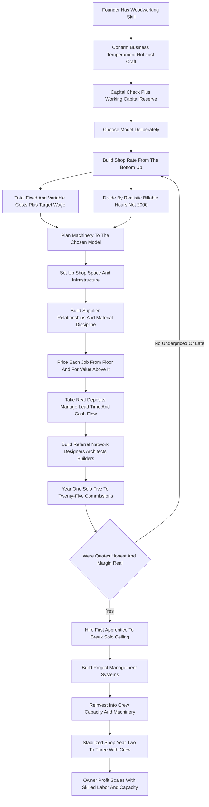

### Direct Answer

To start a woodworking shop business in 2027, you set up a space full of commercial-grade machinery -- a table saw, jointer, planer, bandsaw, dust collection, and increasingly a CNC router -- and you sell the output of that shop: custom furniture, kitchen and built-in cabinetry, architectural millwork, and commercial buildouts. The model is real and durable, but it is a small manufacturing business, not a paid hobby, and the entire economics rest on one number most beginners never calculate -- the **shop rate**, the fully-loaded hourly cost of running the shop, divided by the **billable hours** you can actually sell. Done with pricing discipline, honest lead times, and a referral network of designers, architects, and builders, it is a legitimate path to a $300K-$1.2M+ asset-backed small manufacturing business; done by feel, it is a fast way to be busy, booked, and broke.

**TL;DR:** A focused 2027 woodworking shop invests **$30K-$150K** in machinery, a shop deposit, and working capital, runs a **35-55% gross margin** after lumber, hardware, finish, and shop labor, and in a disciplined Year 1 generates **$50K-$200K in revenue** as a solo operator completing 5-25 commissions, against **$25K-$70K in owner profit**. By Year 2-3 a well-run shop with 1-3 employees reaches **$200K-$700K in revenue** with **$70K-$200K in owner profit**. Three things kill these shops: **underpricing** because the founder costed visible lumber but never their own time, the rent, or the machine wear; **underestimating lead time**, quoting a three-week table that takes nine; and **staying a solo bottleneck** where every dollar requires the founder's own hands. The business rewards one founder profile: the skilled maker who is also a disciplined, shop-rate-obsessed, lead-time-honest business operator.

## What A Woodworking Shop Business Actually Is In 2027

### 1.1 The Core Engine

A woodworking shop business owns or leases a space full of machinery and turns lumber, sheet goods, and hardware into finished wood products that clients pay for. The entire business is a single financial idea executed over and over: **you convert raw material plus machine-hours plus skilled labor into a finished object worth far more than the sum of those inputs**, on a schedule, at a price, with a margin. A dining table that consumes $400 of lumber, $200 of finish, and twenty-five hours of shop time, and sells for $4,500, is a healthy job -- but only if those hours were honestly counted, the shop rate honestly costed, and the unbillable hours of quoting, sourcing, and delivering absorbed into the price. That is the engine. Everything else in this guide lets you run it profitably and repeatedly without working for free.

### 1.2 You Are Running A Manufacturing Business

**You are not a hobbyist who sells the occasional piece, and you are not an artist who waits for inspiration.** You are running a small manufacturing operation that happens to work in wood. The founders who succeed understand that the woodworking is the medium; the business is a shop rate, a quoting discipline, a lead-time promise, a referral network, and a margin. The gifted maker who treats the business underneath as an inconvenient tax on the craft runs the most common failure profile in the industry.

### 1.3 What Is Different In 2027

The business is shaped by realities that did not fully exist a decade ago. **Clients discover and compare makers online** and expect a professional quote, contract, and visual portfolio. **The CNC router has moved from exotic luxury to near-standard productivity tool** in commercial cabinet and millwork shops. **Lumber and sheet-goods prices have been volatile** and must be quoted with that volatility in mind. **Skilled woodworking labor is genuinely hard to hire.** And the high end of the market -- custom furniture and cabinetry for higher-income households doing renovations -- is structurally healthy.

| Dimension | The Romantic Version | The 2027 Reality |
|---|---|---|
| What it is | A way to get paid for a hobby | A small manufacturing business with a shop rate |
| Time split | All day at the bench | Roughly half bench, half quoting/sourcing/admin |
| Pricing | "What feels fair per hour" | Built bottom-up from a real shop rate |
| Lead time | Bench time of the build | Queue + finishing + acclimation + buffer |
| Growth | Naturally happens with demand | Capped by skilled labor and the solo ceiling |
| Cash | Revenue equals profit | Deposit-to-final-payment gap must be funded |

## The Product Categories: What You Actually Build

### 2.1 The High-Ticket Core

**Kitchen and built-in cabinetry** is the volume-and-margin core of most successful shops -- kitchens, bathrooms, libraries, mudrooms, closets, window seats. A single kitchen is a $15K-$150K job, the work is repeatable in method even when custom in detail, and it pulls the whole shop's revenue. **Architectural millwork** -- mantels, wainscoting, paneling, crown molding, coffered ceilings, stair parts, casework -- is the connoisseur's profit center: it is specified by architects and designers, commands real money, is hard for the low end to do well, and is sticky because the relationships that generate it are professional and repeating.

### 2.2 Project Work And Commercial Buildouts

**Custom furniture** -- dining tables, coffee tables, desks, beds, dressers, benches -- is the category most beginners imagine. It is real, but it is project-based, design-intensive, and the per-hour economics depend heavily on how efficiently you build and how well you priced design and revision time. **Restaurant, retail, and office buildouts** -- bars, host stands, banquettes, retail fixtures, reception desks -- are large-ticket commercial jobs ($10K-$300K) that come through contractors and designers and can fill a calendar, though they carry tighter deadlines and contractor-payment dynamics.

### 2.3 The Small-Goods Trap

**Smaller maker goods** -- cutting boards, charcuterie and serving boards, bowls, signage -- are the category beginners over-index on because they are quick to make and easy to sell online. But the per-hour economics are usually thin and they rarely build a real business on their own; they are better understood as a marketing front or a shop-downtime filler, not the core. The Year-1 mistake is building a business out of $80 cutting boards and wondering why a full week produced a few hundred dollars of margin -- a trap that parallels the craft-goods economics in candle making (q1989).

| Product Category | Typical Ticket | Margin Character | Role In The Portfolio |
|---|---|---|---|
| Kitchen / built-in cabinetry | $15K-$150K | Repeatable, strong | Revenue core |
| Architectural millwork | $5K-$100K+ | High, less price-shopped | Profit center |
| Custom furniture | $800-$15K | Variable on estimation | Portfolio and brand builder |
| Commercial buildouts | $10K-$300K | Tighter, deadline-driven | Calendar filler |
| Restoration / antique repair | $60-$150/hr | High per hour, specialized | Niche-within-the-business |
| Small maker goods | $50-$400 | Thin per hour | Marketing front, not a business |

## The Four Models: Choosing Your Path Deliberately

### 3.1 Solo Studio Maker And Custom Cabinet Shop

**The solo studio maker model** is one skilled person, a modest shop, and a calendar of custom furniture and small cabinetry commissions, sold on craftsmanship, design, and a personal brand. Its advantage is low overhead, full creative control, and no payroll; its hard ceiling is that every dollar requires the founder's hands, so a sick week is a zero-revenue week. **The custom cabinet and millwork shop model** is a founder plus a small crew of 2-6, a real shop with serious machinery, serving kitchens, built-ins, and millwork through a builder-and-designer referral network. Its advantage is real revenue, repeatable work, and a business that runs partly on systems; its challenge is payroll, project management, and the cash-flow swings of large jobs. This is the most common path to a genuinely profitable woodworking business.

### 3.2 Semi-Production And Niche Specialist

**The semi-production model** designs a repeatable product line -- a range of tables, casegoods, or a signature product -- and builds it in small batches with jigs, fixtures, and increasingly CNC, selling through wholesale, online, and design-trade channels. The design work amortizes across many units; the challenge is real upfront design and tooling investment plus a sales channel that moves volume. **The niche specialist model** goes deep on one high-value category -- architectural millwork, stair building, high-end commission furniture, restoration -- and becomes the regional go-to. Its advantage is pricing power and less price-shopping; its challenge is a smaller market and concentration risk.

### 3.3 The Drift Mistake

Many founders start as a solo studio maker to build skill, portfolio, and relationships, then deliberately graduate to a cabinet shop or a niche specialty. **The wrong move is drifting** -- being a little bit of all four, mediocre at each, with a machinery set and shop that fit none of them well. Choosing deliberately is one of the most consequential early decisions because each model implies a different machinery set, shop size, hiring path, and sales motion.

| Model | Overhead / Capital | Revenue Ceiling | Core Challenge |
|---|---|---|---|
| Solo studio maker | Lowest -- modest shop, no payroll | Capped at one pair of hands | No leverage; a sick week is zero revenue |
| Custom cabinet and millwork shop | Moderate-high -- real machinery, crew of 2-6 | $300K-$1.2M+ -- common path to real revenue | Payroll, project management, cash-flow swings |
| Semi-production line | High upfront -- design, jigs, CNC, tooling | Scales with channel volume | Needs tooling investment plus a volume channel |
| Niche specialist | Varies by category | High margin, smaller market | Concentration risk; smaller demand |

## The 2027 Market Reality: Demand And Competition

### 4.1 Demand Is Structurally Healthy At The Custom End

The business is neither the artisan goldmine some social media suggests nor a dying trade undercut by mass production. **Demand is structurally healthy at the custom end.** Higher-income households continue to renovate, and renovation drives custom cabinetry, built-ins, and furniture; the interior-design industry remains a strong specifier; and mass-produced furniture's quality reputation leaves room for "actually well-made" at the top. The renovation-driven demand stream overlaps with the home staging trade (q9623) and the small-builder segment in tiny home builder (q9645) and container home builder (q9646).

### 4.2 The Competition Is Bifurcated

At the volume end sit large cabinet manufacturers and import furniture that compete on price and lead time -- a custom shop should not try to beat them there. At the custom end sit a long tail of solo makers of widely varying professionalism, plus established regional cabinet and millwork shops with crews and reputations. **The opportunity for a disciplined new entrant is to be more professional, more reliable, and more design-fluent than the inconsistent long tail** without needing the scale of the established shop. A specialist-narrowing alternative -- resurfacing existing kitchens rather than full custom builds -- is its own viable adjacent model, covered in cabinet refacing (q9628).

### 4.3 What Changed By 2027

Clients find and vet makers online and expect a real portfolio, a professional quote, and a digital contract. The CNC router has become close to standard in commercial cabinet and millwork shops, raising the productivity baseline a hand-tool-only shop competes against -- the same automation shift reshaping adjacent fabrication trades in CNC machining shop (q9592). Lumber prices have seen real volatility, making escalation clauses necessary; skilled labor is scarce, making hiring strategic; and software for design, quoting, and shop management lets a small shop run like a professional operation.

## The Core Unit Economics: Shop Rate And Billable Hours

### 5.1 What Shop Rate Actually Is

This is the most important section in the guide, because the entire business lives or dies on one calculation beginners almost never run before they leave their job. Your **shop rate** is the fully-loaded hourly cost of running your shop. **It is not "what I want to earn per hour."** It is the sum of everything the shop costs to exist -- rent, utilities, insurance, machine depreciation, consumables, software, dust-collection running cost, the unbillable hours of quoting and sourcing and bookkeeping, and your own target wage -- divided by the hours you can actually bill.

### 5.2 The Billable-Hour Trap

Here is the trap: **a solo maker works perhaps 2,000-2,200 hours a year, but only a fraction of those are billable hours building paid work.** The rest go to quoting, client meetings, sourcing, shop maintenance, photography, bookkeeping, deliveries, and rework. A realistic solo billable figure is often **1,000-1,400 hours a year, not 2,000**. So if your true annual cost to run the shop and pay a modest wage is $90,000, and you bill 1,200 hours, your shop rate is **$75/hour just to break even** -- and you must price above that, not at it.

### 5.3 The Two Fatal Errors

Beginners make two errors here. First, **they pick an hourly number that sounds reasonable** ("$50/hour, I'd be thrilled") without building it up from real costs. Second, **they assume every working hour is billable**, dividing their cost target by 2,000 instead of 1,200 and underpricing by nearly half. The discipline: total all fixed and variable shop costs plus your target wage, divide by a realistic billable-hour count, and treat the result as your floor. A founder who knows their shop rate prices to live; a founder who guesses prices to slowly go broke while feeling busy and booked.

| Shop Rate Input | Lean Solo Studio (Annual) | Notes |
|---|---|---|
| Owner target wage | $50,000-$65,000 | A modest, real wage -- not the profit |
| Shop rent and utilities | $9,000-$24,000 | Industrial-zoned space, power-heavy |
| Insurance (GL, property, equipment) | $1,800-$4,500 | A fixed cost whether or not a job is on the bench |
| Machine depreciation and maintenance | $4,000-$10,000 | The machinery wears with use |
| Consumables (blades, bits, abrasives) | $2,000-$6,000 | Real, recurring, easy to forget |
| Software and subscriptions | $600-$2,500 | Design, quoting, cut optimization |
| Bookkeeping, fees, misc overhead | $2,000-$6,000 | The unglamorous fixed line |
| **Total annual cost (illustrative)** | **~$90,000** | Divided by ~1,200 billable hours |
| **Break-even shop rate** | **~$75/hour** | Price ABOVE this, never at it |

## The Line-By-Line Job P&L

### 6.1 The Cost Stack Beginners Mis-Sequence

Beyond the shop rate, a founder must internalize the P&L of a single job. Take a custom dining table quoted at $4,500. **Lumber and sheet goods** -- the visible material, $300-$700 for a table, quoted with price volatility and waste factored in because rough lumber yields less usable board than its footage suggests. **Hardware** -- slides, hinges, fasteners -- small on a table, significant on cabinetry. **Finish** -- stain, sealer, topcoat, abrasives, plus the real labor hours finishing consumes, which beginners chronically under-count. **Shop labor** -- the honest build hours, costed at the shop rate, not a wished-for wage; the largest cost on most jobs.

### 6.2 The Costs Beginners Give Away Free

**Machine and consumable cost** -- the blade, bit, and abrasive wear allocated through the shop rate. **Delivery and installation** -- time, vehicle, sometimes a helper, chronically given away free. **Design and revision time** -- the quoting, the drawings, the client back-and-forth; real hours that must be priced in. **Rework and waste** -- the board that tore out, the panel that came back wrong; a real percentage of every shop's hours.

### 6.3 The Margin That Results

Net the job out and a healthy custom shop runs a **35-55% gross margin after materials, finish, and shop labor**, with the spread driven almost entirely by how honestly the build hours and shop rate were estimated. The founders who fail at the P&L level almost always made the same errors: **they costed the lumber they could see and forgot the finish hours, the design hours, the delivery, the rework, and the shop rate behind their own time** -- so they ran a 15% real margin while believing they ran a 45% one, and never understood why a busy year produced no money.

| Job P&L Line ($4,500 Dining Table) | Representative Amount | Frequently Mis-Handled? |
|---|---|---|
| Lumber and sheet goods | $300-$700 | Sometimes -- waste/yield underestimated |
| Hardware and fasteners | $40-$150 | Rarely on furniture |
| Finishing materials | $80-$200 | Often -- abrasives forgotten |
| Finishing labor | A quarter+ of total job hours | Almost always under-counted |
| Build labor at shop rate | The largest single line | Often -- "wished-for wage" used |
| Delivery and install | $100-$400 of real cost | Almost always given away free |
| Design and revision hours | Real hours | Almost always absorbed unpriced |
| Rework and waste allowance | 5-15% of hours | Almost always omitted |

## Machinery And Equipment: The Capital Plan

### 7.1 The Core Machines

The principle is **buy the machines your chosen model actually needs, commercial grade for the ones you use constantly, and resist outfitting a dream shop before the work justifies it.** The core machines almost any shop needs: a **table saw** -- the heart of the shop, often a SawStop with its blade-brake technology ($3,000-$8,000 for an industrial cabinet model); a **jointer** to flatten stock; a **planer** to dimension it; a **bandsaw** for resawing and curves; a **miter saw**; a **drill press**; a **router table** and routers; a **dust collection system**, which is not optional; **clamps**, always more clamps; a **finishing setup**; and a deep set of hand, measuring, and layout tools.

### 7.2 Cabinet-Shop And CNC Additions

For cabinet and millwork shops, add **panel-processing capacity** -- a sliding table saw or panel saw -- and a **CNC router**, which in 2027 has become close to standard because it does nesting, joinery, and repeatable parts faster and more consistently than hand methods. Entry CNC routers run roughly $15,000-$40,000 and industrial machines well beyond. The economics of CNC-driven small-batch fabrication are explored in CNC machining (q1986). **Edgebanders**, **wide-belt sanders**, and **shapers** follow as a shop scales into cabinet production.

### 7.3 The Capex Math And Sequencing Rule

A lean solo studio launch can start around **$30,000-$60,000** by buying core machines, choosing carefully between new and well-maintained used. A fuller custom-cabinet-shop launch with panel processing, a CNC router, finishing equipment, and crew-sized dust collection runs **$80,000-$150,000+**. **Sourcing discipline matters:** buy commercial-grade for the machines that run all day, consider quality used machinery from retiring woodworkers, and finance the large machines as the productive assets they are. The sequencing rule: buy what the next six months of actual work requires, prove the work, then reinvest into capacity.

| Machine | Lean Solo Studio | Cabinet / Millwork Shop |
|---|---|---|
| Table saw (cabinet / SawStop) | $3,000-$8,000 | $4,000-$9,000 |
| Jointer + planer | $2,500-$6,000 | $5,000-$12,000 |
| Bandsaw | $1,200-$4,000 | $3,000-$8,000 |
| Dust collection | $1,500-$5,000 | $6,000-$20,000 (ducted) |
| Panel processing (sliding/panel saw) | Optional | $8,000-$40,000 |
| CNC router | Often skipped | $15,000-$40,000+ |
| Finishing / spray setup | $2,000-$5,000 | $5,000-$15,000 |
| **Machinery subtotal** | **$30,000-$60,000** | **$80,000-$150,000+** |

## Shop Space, Layout, And Infrastructure

### 8.1 Square Footage And Critical Infrastructure

The woodworking business cannot run from a corner of the garage past the smallest scale. **The shop** needs square footage for the machinery with safe clearance, infeed and outfeed room for long stock and large panels, an assembly area, a dedicated ventilated finishing area, lumber storage that keeps stock flat, and room for finished pieces awaiting delivery. A solo studio might run in 800-1,500 square feet; a custom cabinet shop with a crew commonly needs 2,000-5,000+ square feet. **Critical infrastructure:** adequate electrical service (many machines need 240-volt circuits); **dust collection** ducted to the machines; **air compression** for pneumatic tools and spray finishing; **heating and climate** consideration, because wood moves with humidity; **lighting** that reveals grain, defects, and finish quality; and **loading access** -- a grade-level door or dock.

### 8.2 Layout Is Operational, Not Cosmetic

**Material should flow logically** from lumber storage to rough milling to dimensioning to joinery to assembly to finishing to staging, and a shop laid out against that flow wastes hours every day in material handling. **Location** balances rent against drive time and against zoning -- woodworking is an industrial use with noise, dust, and fumes. The infrastructure discipline: the shop, its power, dust collection, and layout are fixed costs that exist whether or not a job is on the bench -- which is why the shop rate must capture them and the calendar must keep them busy.

## Lumber, Materials, And Supplier Relationships

### 9.1 Buying Material Well

Material is the visible cost of every job and a real operational discipline. **Hardwood lumber** -- maple, oak, walnut, cherry, ash, poplar -- is bought from hardwood dealers, and a founder must learn to buy it well: board-foot pricing, grades, rough versus surfaced stock, and the real usable yield after defects and milling waste. **Sheet goods** -- plywood, MDF, melamine, veneer-core panels -- are the backbone of cabinetry; quality varies enormously and a cabinet shop's reputation rides partly on good substrate. **Hardware** comes from cabinet hardware distributors, and the quality choice is both a cost and a reputation decision.

### 9.2 Price Volatility And Relationship Value

**Price volatility is a real 2027 condition:** lumber prices have moved meaningfully, and a shop must quote with that in mind -- escalation language in contracts, quotes with a validity window, or buying material at quote time. **Supplier relationships matter operationally:** a dealer who will pull good boards, hold stock, extend terms, and get material fast is a genuine competitive asset. **Waste and yield discipline** directly affects margin.

## Pricing Your Work: Beyond The Shop Rate

### 10.1 The Cost-Plus Floor And Value Layer

Pricing has layers beyond the shop rate. **The cost-plus floor** is the shop rate applied: material plus finish plus honest build hours at a rate above shop rate plus design and overhead markup. That is the floor, not the answer. **Value-based pricing** sits on top: a custom piece for a specific client, or architect-specified millwork, is worth more than a cost-plus calculation because it is not a commodity -- and a maker with a real portfolio and reputation can and should price for that value.

### 10.2 Fixed-Price Risk And Deposits

**Project pricing versus hourly** -- most custom work is quoted as a fixed project price, which means the founder carries the estimation risk; a fixed price on an under-estimated job is a loss the founder eats. Some work -- restoration, evolving designs -- is better billed hourly. **Deposits and payment schedules** are cash-flow survival: a substantial deposit before work begins (commonly 40-50%), progress payments on larger jobs, and final payment at delivery.

### 10.3 Quoting Discipline And Change Orders

**Quoting discipline** -- detailed written quotes with clear scope, revision limits, lead time, and material assumptions -- protects both margin and the relationship. **Change orders** -- a written, priced process -- is how a shop avoids doing scope creep for free, one of the most common margin leaks. **Minimums** protect against tiny jobs that cost more in quoting and setup than they earn. The pricing discipline: build from the shop-rate floor, price for value above it, quote fixed projects only with honest hours, take real deposits, and never let scope grow without a priced change order.

| Pricing Layer | What It Covers | Failure Mode If Skipped |
|---|---|---|
| Cost-plus floor | Material + finish + hours at shop rate + overhead | Pricing below the cost of existing |
| Value premium | Custom, non-commodity, portfolio-backed | Leaving real money on the table |
| Fixed-project quote | Carries estimation risk on the founder | A loss eaten on every under-estimate |
| Deposit (40-50%) | Funds material and early labor | Funding client work out of pocket |
| Change-order process | Prices added scope | Scope creep done for free |
| Job minimum | Covers quoting and setup overhead | Tiny jobs that lose money |

## The Referral Network: Designers, Architects, Builders

### 11.1 The Relationship-Driven Lead Engine

Woodworking is a relationship business, and the lead-generation engine is professional referral relationships far more than advertising. **Interior designers** specify custom furniture, cabinetry, and built-ins for client after client, and a strong designer relationship delivers a stream of well-specified, higher-budget jobs. **Architects** specify architectural millwork and casework, delivering the high-end, design-intensive, less-price-shopped work. **Builders and general contractors** drive cabinetry and millwork volume through renovations; a builder who trusts your shop becomes a repeating channel.

### 11.2 The Referral Web And The Portfolio

**Other trades and vendors** -- kitchen designers, flooring installers, painters, stagers -- form a referral web of people who work in the same homes. Adjacent home-trade operators such as painting (q1984) and handyman (q2051) businesses are both referral partners and occasional competitors for simple work. **Repeat and referral clients** -- the homeowner who did the kitchen and comes back for the library -- compound over years and become the most profitable, lowest-acquisition-cost work a shop has. **The portfolio is the conversion tool** -- professional photography, a clean website, and a presence on the platforms designers use.

## Lead Time, Project Management, And The Cash-Flow Trap

### 12.1 Lead Time Is A Promise Beginners Break

This is the operational discipline that separates shops that survive from shops that implode while busy. **Lead time is a promise, and beginners break it constantly.** A maker quotes a table "in about three weeks" because the build is three weeks of bench time -- forgetting the four other jobs ahead of it, that finishing adds a week, that the lumber needs to acclimate, that a revision will land, and that something will go wrong. The job that was "three weeks" delivers in nine, the client is angry, the deposit was already spent, and the next three jobs slipped too. The discipline is to **quote realistic lead times that account for the actual queue, finishing, acclimation, revisions, and a buffer**.

### 12.2 Project Management As Core Skill

**Project management is the unglamorous core skill** -- knowing what is on every bench, what material is arriving, what is in finish, what is waiting on a client decision, what is promised when, and what the cash position is against the deposit-and-payment schedule. Mastering this is the difference between a full calendar and an empty bank account.

### 12.3 The Cash-Flow Trap

**The cash-flow trap** is specific and lethal: deposits arrive before a job is built and final payments after, so a growing shop is constantly spending this job's deposit on that job's material, and a single slow-paying client or a job that slips can leave a busy, profitable-on-paper shop unable to make payroll or rent. The mitigations: substantial deposits, progress payments, final payment at or before delivery, a working-capital reserve, conservative lead times, and a real schedule. In a custom shop, project management and cash-flow discipline are the load-bearing structure under the craft.

## Finishing: The Phase That Makes Or Breaks The Job

### 13.1 Finishing Is Slow, Skilled, And Under-Priced

Finishing deserves its own section because it is the phase beginners most under-respect, under-price, and get wrong -- a beautifully built piece with a poor finish is a failed job. **Finishing is slow, fussy, skilled, and time-consuming** -- sanding through grits, staining evenly, sealing, building topcoat layers, sanding between coats, rubbing out. Beginners chronically forget that **finishing can be a quarter or more of the total job time**. **Finish quality is visible and judged** -- clients run their hands over the surface and see it in raking light.

### 13.2 Finishing Setup And Choice

**Finishing requires its own setup** -- a clean, well-lit, ventilated, temperature-controlled area kept away from machining dust, plus spray equipment. **Finish choice is a real decision** -- oils, water-based finishes, lacquers, and conversion varnishes differ in durability, look, and cost. **Finishing is also a bottleneck** -- coats need cure time, and a shop that does not schedule around finishing creates collisions. Treat finishing as a major, costed, scheduled phase, never the rushed afterthought at the end of a job.

## CNC, Technology, And The Modern Shop

### 14.1 The CNC Router

A founder in 2027 must have a clear view on technology. **The CNC router** has moved from exotic to near-standard in commercial cabinet and millwork shops: it nests parts efficiently from sheet goods, cuts joinery accurately and repeatably, produces identical parts for runs, and dramatically raises throughput and consistency for the right work. It is not a replacement for skill or for hand-built furniture's value, and a solo studio furniture maker may not need one -- but a cabinet or millwork shop competing in 2027 without seriously evaluating CNC is competing against shops that have it.

### 14.2 The Software Stack

**Design and drawing software** -- CAD and cabinet-specific tools -- let a shop produce professional drawings, communicate with designers and architects, and feed the CNC. **Cut-optimization software** reduces sheet-goods waste and directly improves margin. **Shop management and quoting software** tracks jobs, materials, schedules, and the quote-to-invoice flow. The bookkeeping and job-costing layer underneath is covered in depth in bookkeeping (q1959). The discipline: technology is a productivity and professionalism tool to be adopted where it earns its place, not a hobbyist's gadget collection.

## Staffing And Building A Shop Crew

### 15.1 The Skilled-Labor Scarcity

A founder can run a solo studio nearly alone, but the business does not grow past one pair of hands without a crew. **The skilled-labor scarcity is real** -- experienced cabinetmakers, finishers, and woodworkers are hard to hire in 2027, the trade pipeline is thin, and this is a strategic constraint a founder must plan around.

### 15.2 The Hiring Sequence

The hiring sequence typically starts with an **apprentice or shop helper** -- someone who can do material handling, rough work, sanding, and finishing under direction, freeing the founder for skilled work; this single hire is often the difference between a capped solo income and a growing business. From there a shop adds **skilled cabinetmakers**, eventually a **shop lead or foreman**, a **finisher** if volume justifies a specialist, and **project management or office help** as the load grows.

### 15.3 Training And Retention As Strategy

**Crew quality directly drives margin and reputation** -- skilled, careful crew build faster with less rework. **Training and developing people** is part of the model precisely because skilled labor is scarce -- many successful shops grow their own talent from apprentices because they cannot reliably hire it ready-made. **Compensation, culture, and retention matter** -- a shop that trains a woodworker and then loses them has lost a real investment. The founder's job shifts as the crew grows: from primary builder to the person who keeps the shop fed with work, the quotes accurate, and the crew retained.

## Startup Cost Breakdown: The Honest All-In Number

### 16.1 The Line-By-Line Launch Total

Under-capitalization and machinery overspend are both top killers, so a founder needs a clear-eyed total. The all-in cost breaks down across machinery, shop space and buildout, hand tools and jigs, finishing setup, initial lumber inventory, software, insurance, business formation, website and portfolio photography, a delivery vehicle, and -- critically -- a working-capital reserve.

### 16.2 Why The Working-Capital Reserve Is Non-Negotiable

The **working-capital reserve** is the buffer that covers rent, any payroll, and material before client cash flows reliably, and absorbs the deposit-to-final-payment cash gap; it should be a meaningful $10,000-$40,000. Financing softens the machinery line, but the founder still needs genuine cash for the reserve, because no lender covers the deposit-to-payment gap and the ramp before the referral network produces steady work.

| Line Item | Lean Solo Studio | Fuller Custom Cabinet Shop |
|---|---|---|
| Machinery and equipment | $30,000-$60,000 | $80,000-$150,000+ |
| Shop space (deposit, buildout, electrical, ducting) | $3,000-$12,000 | $10,000-$25,000+ |
| Hand tools, measuring/layout tools, clamps, jigs | $3,000-$8,000 | $6,000-$12,000 |
| Finishing setup | $2,000-$5,000 | $5,000-$10,000 |
| Initial lumber and material inventory | $3,000-$8,000 | $8,000-$15,000 |
| Software (design, quoting, cut optimization) | Hundreds to low thousands | Low thousands |
| Insurance (GL, property, equipment, first payment) | $1,500-$3,500 | $3,500-$6,000 |
| Business formation, licensing, legal, contracts | $500-$2,500 | $500-$2,500 |
| Website, portfolio photography, marketing | $1,500-$4,000 | $4,000-$6,000 |
| Working-capital reserve | $10,000-$25,000 | $25,000-$40,000+ |
| **Total** | **~$30,000-$70,000** | **~$120,000-$250,000+** |

## The Year-One Operating Reality

### 17.1 Year One Is Calibration, Not Profit Extraction

A founder should walk into Year 1 with accurate expectations. Year 1 is **skill-proving, portfolio-building, relationship-building, and pricing-calibration mode -- not profit-extraction mode.** The first year is spent learning what jobs actually take in hours versus what you quoted, discovering the real shop rate by living the costs, building the first designer and builder relationships, building a portfolio of professionally photographed pieces, and finding where the operation is fragile -- the job that ran triple the quote, the slow-paying client, the finish that failed.

### 17.2 The Realistic Year-One Numbers

A disciplined Year 1 solo shop, launched with a real machinery set and a working-capital reserve, can realistically generate **$50,000-$200,000 in revenue** completing perhaps 5-25 commissions, against **$25,000-$70,000 in owner profit** once the shop rate is honestly costed -- meaningful but earned through long hours and a steep learning curve. The first year is also when the founder discovers whether the pricing was right -- **chronic under-quoting shows up as a busy, exhausting year that produced little money**, the single most common Year-1 outcome for makers who never built a shop rate. The founders who succeed treat Year 1 as paid tuition in a manufacturing business.

## The Five-Year Revenue Trajectory

### 18.1 The Year-By-Year Arc

Mapping a realistic five-year arc helps a founder size the opportunity honestly. **Year 1:** solo, skill- and portfolio-building, $50K-$200K revenue, $25K-$70K owner profit, the central lesson is the real shop rate. **Year 2:** the founder applies Year-1 pricing lessons, the first relationships start generating repeat work, often a first apprentice comes on; revenue climbs to roughly **$150K-$400K** with owner profit around **$50K-$130K**. **Year 3:** the operation is a real business -- a small crew of 2-4, a chosen model, project-management systems; revenue lands around **$300K-$700K** with owner profit roughly **$80K-$200K**.

### 18.2 Maturity And The Constraint On Growth

**Year 4:** continued crew and capacity growth, possible CNC investment, possible niche specialization; revenue roughly **$450K-$900K**, owner profit **$110K-$250K**. **Year 5:** a mature small shop -- $600K-$1.2M+ revenue for a well-run operation, **$130K-$300K+ owner profit**. These numbers assume a disciplined shop rate, honest hour estimation, real deposits, conservative lead times, and steady referral-network building; **they do not assume exponential growth, because a woodworking shop scales with skilled labor, machine capacity, and shop space** -- and skilled labor is the genuine constraint.

| Year | Revenue | Owner Profit | Stage |
|---|---|---|---|
| Year 1 | $50,000-$200,000 | $25,000-$70,000 | Solo, 5-25 commissions, pricing calibrated |
| Year 2 | $150,000-$400,000 | $50,000-$130,000 | First apprentice, pricing tightened |
| Year 3 | $300,000-$700,000 | $80,000-$200,000 | Crew of 2-4, chosen model, systems |
| Year 4 | $450,000-$900,000 | $110,000-$250,000 | Capacity growth, possible CNC / niche |
| Year 5 | $600,000-$1,200,000+ | $130,000-$300,000+ | Mature shop, founder mostly running |

## Five Named Real-World Operating Scenarios

### 19.1 The Disciplined Builder And The Cautionary Tale

**Scenario one -- Marcus, the disciplined cabinet-shop builder:** launches solo with $55K into a careful machinery set, spends Year 1 building a portfolio and three solid designer and builder relationships, and -- critically -- builds a real shop rate and re-prices after discovering his first quotes were 30% low; hires an apprentice in Year 2, commits to the cabinet and millwork model, and reaches $480K revenue by Year 3 with a crew of three. **Scenario two -- Dana, the cautionary tale:** a gifted maker who launches to "finally get paid to do what I love," prices by feel, never builds a shop rate, and quotes every lead time as bench time; she is booked and exhausted for eighteen months, delivers everything late, and quits believing the business "doesn't make money" -- when her work was excellent and her pricing was the entire problem.

### 19.2 The Specialist, The Scale-Up, And The Deliberate Solo

**Scenario three -- Priya, the millwork specialist:** goes niche from early on, building deep architectural millwork capability and a tight relationship with three architecture firms; smaller market but high-margin, drawing-driven work, and by Year 4 she is the regional go-to for high-end millwork. **Scenario four -- the Okafor brothers, semi-production:** start with custom work for two years, then design a repeatable line of casegoods, invest in a CNC router and jigs, and sell through design-trade and online channels; the design work amortizes across runs and Year 5 revenue passes $900K. **Scenario five -- Reuben, the deliberate solo studio maker:** stays a one-person studio furniture maker, prices for value off a disciplined shop rate, builds a strong personal brand and a waitlist, and runs a profitable $160K-revenue / $90K-profit operation for years -- smaller by choice, sustainable because the pricing is right.

## Insurance, Risk, And Safety

### 20.1 Safety And Fire Risk

The woodworking shop model carries specific risks. **Safety risk is real and personal** -- the table saw, jointer, and shaper are genuinely dangerous tools; this is mitigated by safety-conscious equipment choices (the SawStop blade-brake technology being a common example), guards and safe practices, training, and never working impaired or exhausted. An injured solo founder is a zero-revenue shop. **Fire risk** is structural -- wood dust, finishing products, and rags create real fire and explosion risk -- mitigated by good dust collection, proper storage and disposal of finishing materials, and fire safety equipment.

### 20.2 Liability, Property, And Cash-Flow Risk

**Liability risk** -- a piece that fails, a built-in that injures someone -- is mitigated by quality work and **general liability insurance**. **Property and equipment insurance** covers the shop and machinery against fire, theft, and damage. **Commercial auto** covers a delivery vehicle. **Health insurance and disability coverage** matter intensely for a solo founder whose income depends on their own hands. **Cash-flow and client risk** is mitigated by deposits, progress payments, clear contracts, and a reserve. **Workers' compensation** becomes necessary as the shop hires.

## Competitor Landscape: Who You Are Up Against

### 21.1 The Bifurcated Field

**Large cabinet manufacturers and semi-custom lines** compete on price and lead time at the volume end; a custom shop instead competes on genuine customization, quality, and design fluency. **Import and mass-produced furniture** competes on price for the consumer who wants a table cheaply; the custom maker competes for the client who specifically wants custom. **Established regional cabinet and millwork shops** -- crews, machinery, decades of relationships, a reputation -- are the most direct competitors for serious work and hard to displace head-on.

### 21.2 The Real Moat

**The long tail of solo makers** varies enormously in professionalism, and the disciplined new entrant out-competes the inconsistent ones on reliability, communication, professional quoting, lead-time honesty, and finish quality. **Handyman and general carpentry operations** sometimes take simple cabinetry; the dedicated shop competes on quality and complexity they cannot match. **The competitive moat is not the machinery** -- anyone with capital can buy a table saw -- it is the portfolio, the designer and architect and builder relationships, the reputation, the skilled crew, and the operational discipline that take years to build.

## Financing The Business

### 22.1 Equipment Financing And Used Machinery

Because a woodworking shop is moderately capital-intensive, a founder should understand the financing options. **Equipment financing** is the natural fit for the largest line -- machinery is tangible, productive, long-lived collateral that lenders will finance, matching the payment to the earning life of the machine. **Used machinery as cheap capital** -- buying quality machines from retiring woodworkers and closing shops at a fraction of new cost -- is one of the most effective ways to build capacity affordably.

### 22.2 SBA Loans, Reinvestment, And The Danger Moves

**SBA and small-business loans** can fund a broader launch including buildout and working capital. **Personal savings and a deliberately lean start** is how many shops begin, keeping debt low. **Reinvested cash flow** funds most healthy growth past Year 1. **Seller financing** applies when buying an existing shop outright. The discipline: it is reasonable to finance machinery because it earns from the day it is installed, but the founder must still hold real cash for the working-capital reserve. **The dangerous moves are over-financing a dream shop the early work cannot justify, and skipping the reserve.** Finance the machines proven work will keep running; never finance away the cushion.

## Taxes And Business Structure

### 23.1 Entity And Depreciation

A founder should set up the tax and legal structure deliberately. **Entity:** most woodworking shops form an LLC or S-corp for liability protection and tax flexibility; the entity holds the lease, the contracts, the insurance, and signs with clients. **Depreciation is central to this business's tax picture** -- the machinery is a significant depreciable asset base, and the depreciation schedules and any available first-year expensing materially shape taxable income in heavy-capex years; this is where a knowledgeable accountant earns their fee.

### 23.2 Sales Tax, Payroll, And Bookkeeping

**Sales tax** on furniture and goods, and the tax treatment of installed cabinetry and millwork (treated as a real-property improvement in some jurisdictions), must be handled correctly from day one. **Inventory and work-in-progress accounting** matters in a shop carrying lumber and partly-built jobs across a year-end. **Payroll taxes** on crew are a real cost to budget. The discipline: separate business banking from day one, a bookkeeping system that tracks machinery as assets and jobs as revenue, and an accountant who understands equipment-heavy project-based small manufacturers.

## Owner Lifestyle: What Running This Business Actually Feels Like

### 24.1 The Year-One Texture

A founder should know what daily life is like before committing. In **Year 1**, running solo, the founder is doing everything -- at the bench building, but also quoting, meeting designers, sourcing lumber, photographing work, doing the books, and delivering. The woodworking is perhaps half the time; the rest is the business. It is physical work -- lifting lumber, standing all day, noise and dust even with good collection -- and mentally absorbing because the estimating, the cash flow, and the lead-time juggling never stop.

### 24.2 The Role Shift And The Emotional Reality

By **Year 2-3**, with a small crew, the founder's role shifts -- still building, but increasingly running the floor, the quoting, the relationships, and the cash. By **Year 3-5**, with a real crew and systems, the founder can run a larger shop with a more managerial rhythm, though a custom shop never becomes fully hands-off. **The emotional texture:** genuine satisfaction in a finished piece and a growing portfolio; real stress in the underbid job and the lead time that slipped. A founder who loves both the craft and the business will find it rewarding; one who loves only the craft and resents the quoting and management will be frustrated.

## Common Year-One Mistakes That Kill The Business

### 25.1 The Pricing And Estimation Mistakes

A founder can avoid most failure modes by knowing them in advance. **Underpricing because the shop rate was never built** -- costing the visible lumber but never the founder's time, the rent, the machine wear, the finish hours, or the delivery -- is the single most common business-killing error. **Assuming every working hour is billable** -- dividing the cost target by 2,000 instead of 1,000-1,400 -- bakes a near-50% underprice into every quote. **Underestimating build hours and quoting fixed prices on them** -- the optimistic estimate becomes a loss the founder eats. **Quoting lead time as bench time** delivers everything late.

### 25.2 The Operational And Strategic Mistakes

**Spending the deposit on other jobs** -- the cash-flow trap -- leaves a profitable-on-paper shop unable to make payroll. **Under-respecting and under-pricing finishing.** **Overspending on machinery** the early work cannot justify. **Building a business out of small goods** -- a week of $80 cutting boards is a few hundred dollars of margin. **Neglecting the referral network.** **No deposits or weak contracts.** **Ignoring safety.** **Staying a solo bottleneck by default.** Every one of these is avoidable; the founders who fail almost always made three or four of them -- and underpricing is on nearly every failure list.

| Mistake | Why It Kills | The Fix |
|---|---|---|
| No shop rate built | Pricing below the cost of existing | Bottom-up shop rate as the floor |
| Every hour assumed billable | ~50% underprice baked in | Divide by 1,000-1,400, not 2,000 |
| Lead time = bench time | Chronic late delivery, angry clients | Quote queue + finishing + buffer |
| Deposit spent on other jobs | Cannot make rent or payroll | Reserve + progress payments |
| Machinery overspend | Payments on idle machines | Buy to the next 6 months of work |
| Small goods as the business | A week of work, hundreds in margin | Treat as marketing front, not core |
| Solo bottleneck by default | Revenue permanently capped | Hire the first apprentice |

## A Decision Framework: Should You Start This In 2027

### 26.1 The Seven Self-Assessment Questions

A founder should run a structured self-assessment. **Skill:** do you have genuine woodworking skill across the categories your model requires -- the ability to build sellable work efficiently? **Business temperament:** are you willing to quote, cost, build a shop rate, manage cash flow, and run a manufacturing business? **Capital:** do you have $30,000-$70,000 for a lean solo launch with a reserve, scaling to $120,000-$250,000+ for a full cabinet shop? **Pricing discipline:** will you build your shop rate from real costs and re-price when Year 1 reveals you were low? **Lead-time and cash-flow discipline:** will you quote realistic lead times, take real deposits, and manage a real schedule? **Network orientation:** will you do the slow work of building designer, architect, and builder relationships? **Physical reality:** can you do physical, machinery-driven work for years?

### 26.2 The Verdict The Framework Produces

If a founder answers yes across all seven, a woodworking shop business in 2027 is a legitimate path to a $300K-$1.2M+ small manufacturing business with $130K-$300K+ in owner profit. **If they answer no on business temperament or pricing discipline specifically, they should not start a shop** -- the craft is real but the business will fail. If they answer no on skill, they should build the skill first. The framework converts a love of woodworking into an honest decision about the manufacturing business underneath it.

## Niche And Specialty Paths Worth Considering

### 27.1 The High-Value Specialties

Beyond the general models, a founder should understand the specialty paths. **Architectural millwork** is architect-specified, high-margin, drawing-driven, and less price-shopped. **Stair building** is a demanding niche with real engineering and code content. **High-end commission furniture** -- studio furniture sold on the maker's name through galleries and design-trade channels -- is a smaller market but high-value. **Kitchen cabinetry specialization** -- being the shop that does kitchens excellently -- is a large, durable market.

### 27.2 The Adjacent And Material Specialties

**Restoration and antique repair** uses different skills and is often higher-margin per hour. **Restaurant and retail buildouts** focus on the commercial calendar. **Musical instruments, boatbuilding, and other craft specialties** are deep niches. **Semi-production product lines** amortize design across units. **Outdoor furniture, timber framing, or live-edge specialization** can each anchor a brand. The strategic point: the general custom cabinet shop is the most common path to real revenue, but specialty paths can deliver higher margins and deeper relationships. The mistake is not choosing a niche; it is being undifferentiated and mediocre across everything.

## Scaling Past The Solo Ceiling

### 28.1 The Prerequisites For Scaling

The jump from a proven solo studio to a multi-person shop is the defining growth challenge. The solo ceiling is hard and real: every dollar of revenue requires the founder's hands. **The prerequisites for scaling:** the pricing must be genuinely right (do not scale an underpriced business -- you only multiply the loss), the founder must be willing to shift from primary builder toward shop-runner, and the cash flow plus reserve must absorb payroll and the deposit-to-payment gap.

### 28.2 The Scaling Levers

**Hire the first apprentice or helper** to take material handling, rough work, sanding, and finishing -- usually the first real leverage. **Add skilled woodworkers** as the calendar justifies, accepting that skilled labor often must be grown. **Build project-management systems** so jobs, materials, schedules, and cash are tracked rather than carried in the founder's head. **Invest in capacity** -- a CNC router, panel processing, more space -- as proven work justifies it. **Deepen the referral network** so the calendar stays fed. **Shift the founder's role** from the bench to quoting, relationships, and crew development. The founders who scale well fixed the pricing first, then treated the apprentice hire and the systems as the real product of Year 2.

## Exit Strategies And The Long-Term Picture

### 29.1 The Four Exit Paths

Woodworking shops can be exited. **Sell the operating business** -- a shop with a skilled crew, established relationships, a portfolio, a well-maintained machinery base, and clean books is a saleable asset; valuations run as a multiple of stabilized earnings, driven by how owner-dependent the operation is. **Sell the assets** -- even absent a going-concern sale, the machinery has real resale value, giving the business an asset floor pure-service businesses lack. **Transition to a key employee or family** -- viable when a trained successor exists. **Wind down gracefully** -- finish the queue, sell the equipment, exit with the proceeds.

### 29.2 The Honest Long-Term Picture

A woodworking shop is a durable, real business -- people will keep wanting custom, well-made wood, the machinery holds value, and a well-run shop produces real owner profit for years -- but it is a manufacturing business, not a passive holding; it demands ongoing capital for machinery, skilled-labor development, and pricing and cash-flow discipline. A founder should treat a 2027 launch as building a tangible, asset-backed small manufacturing business, and build from day one toward the version that is transferable rather than the version that is only the founder's own two hands.

## The 2027-2030 Outlook: Where This Model Is Heading

### 30.1 The Demand And Technology Trends

**Demand for genuine custom work stays healthy at the top** -- renovation spending, the interior-design industry, and the durable appetite for personalized interiors support the custom and high-end segments. **The CNC router keeps moving toward standard** in commercial cabinet and millwork shops, while solo studio furniture makers continue to differentiate on hand-built craft. **Software keeps professionalizing the small shop.**

### 30.2 The Labor And Material Conditions

**Skilled labor stays scarce** -- the thin trade pipeline does not resolve quickly, which keeps hiring strategic and makes shops that grow their own talent structurally advantaged. **Material price volatility persists** -- lumber pricing requires escalation clauses as normal practice. **Sustainability and provenance narratives modestly help.** The net outlook: the woodworking shop is **viable and durable through 2030 in its disciplined, shop-rate-honest, lead-time-realistic, referral-network-driven form.**

## The Final Framework: Building It Right From Day One

### 31.1 The Twelve-Step Execution Order

A founder who wants to succeed should execute in this order. **First, confirm the skill and the business temperament.** **Second, choose your model deliberately.** **Third, build your shop rate from the bottom up** and treat it as your pricing floor. **Fourth, plan the machinery to the model** -- commercial grade for daily machines, no dream-shop overspend. **Fifth, set up the shop space and infrastructure** -- power, ducted dust collection, a separate finishing area, logical layout. **Sixth, build supplier relationships and a material discipline.**

### 31.2 The Remaining Steps And The Verdict

**Seventh, price every job from the floor and for value above it.** **Eighth, take real deposits and manage cash flow and lead time.** **Ninth, respect finishing as a major costed phase.** **Tenth, build the referral network relentlessly.** **Eleventh, adopt technology where it earns its place.** **Twelfth, hire to break the solo ceiling and build toward a transferable business.** Do these twelve things in this order and a woodworking shop business in 2027 is a legitimate path to a $300K-$1.2M+ asset-backed small manufacturing business. Skip the discipline -- especially on the shop rate, the honest hour estimation, the lead time, and the cash flow -- and it is a fast way to be busy, booked, exhausted, and broke.

## The Operating Journey: From Skill And Capital To Stabilized Shop

## Counter-Case: Why Starting This Might Be A Mistake

### 32.1 The Pricing And Cash-Flow Counters

The case above describes a viable business, but a serious founder must stress-test it. **Counter 1 -- It is a manufacturing business, not a paid hobby.** The woodworking is maybe half the founder's time; a founder who loves the craft and resents the business runs the most common failure profile in the industry. **Counter 2 -- Underpricing is nearly universal and quietly lethal** -- the most common outcome for a new shop is a busy, exhausting year that produced almost no money. **Counter 3 -- The billable-hour math is brutal** -- dividing the cost target by 2,000 instead of 1,000-1,400 bakes a near-50% underprice into every quote. **Counter 4 -- Lead time is a promise beginners cannot keep.** **Counter 5 -- The cash-flow trap catches profitable-on-paper shops** -- one slow-paying client can leave a busy shop unable to make rent.

### 32.2 The Structural And Personal Counters

**Counter 6 -- The solo ceiling is real and hard** -- income is capped at one pair of hands, and breaking it means payroll and management. **Counter 7 -- Skilled labor is genuinely scarce** -- the trade pipeline is thin, and a founder often must train their own talent over years. **Counter 8 -- It is capital-intensive and machinery tempts overspend** -- carrying payments on a CNC the early work cannot keep busy. **Counter 9 -- Material price volatility eats fixed-price quotes** unless escalation clauses are used. **Counter 10 -- It is physical, dusty, loud, and genuinely dangerous.** **Counter 11 -- Small goods are a trap disguised as a business.** **Counter 12 -- Adjacent paths may fit better** -- a founder who loves wood but not the business of a shop might be better suited to being a skilled employee at an established shop, a finish carpenter, or a teacher of the craft.

### 32.3 The Honest Verdict

Starting a woodworking shop business in 2027 is a reasonable choice for a founder who has genuine, sellable skill, genuinely wants to run a manufacturing business, will build a real shop rate from real costs, will estimate build hours honestly, will quote realistic lead times and manage deposits and cash flow, has $30K-$70K for a lean launch with a reserve, and will build the referral network over years. **It is a poor choice for anyone who wants to get paid for a hobby, anyone who cannot or will not quote and cost a job, anyone who under-capitalizes the reserve or over-capitalizes the machinery, and anyone whose real love is the craft alone.** The model is not a scam, but it is a real manufacturing business -- and in 2027 the gap between the disciplined version that works and the underpriced, lead-time-blind version that fails is wide.

## Numbers And Benchmarks

### 33.1 Representative 2027 Pricing

| Product / Service | Typical 2027 Price | Notes |
|---|---|---|
| Hourly labor / shop billing rate | $50-$200/hour | Varies by region, model, skill |
| Custom dining table | $1,500-$15,000 | Species, size, design drive the range |
| Coffee table / smaller furniture | $800-$4,000 | Project-based |
| Built-in bookshelf or cabinetry wall | $5,000-$50,000 | Repeatable in method, custom in detail |
| Kitchen cabinetry | $15,000-$150,000 | The volume-and-margin core |
| Architectural millwork project | $5,000-$100,000+ | Architect/designer specified |
| Restaurant / retail / office buildout | $10,000-$300,000 | Commercial, tighter deadlines |
| Restoration / antique repair | $60-$150/hour | Usually billed hourly, specialized |
| Cutting board | $50-$200 | Thin per-hour economics |
| Charcuterie / serving board | $80-$400 | Marketing front, not a core business |
| Wedding / event signage | $200-$2,500 | Small goods category |

### 33.2 Core Metrics And Benchmarks

| Metric | Benchmark | Notes |
|---|---|---|
| Solo total annual working hours | ~2,000-2,200 | The full working year |
| Realistic solo billable shop hours | ~1,000-1,400/year | The rest is admin, sourcing, rework |
| Example break-even shop rate | ~$75/hour | $90K cost / 1,200 billable hours |
| Gross margin (after materials, finish, labor) | 35-55% | Driven by honest estimation |
| Typical deposit before work begins | 40-50% | Plus progress payments on large jobs |
| Solo studio shop space | ~800-1,500 sq ft | Modest, single operator |
| Custom cabinet shop space | ~2,000-5,000+ sq ft | Crew, panel processing, finishing area |
| Year 1 solo commissions completed | ~5-25 | Depending on job size and mix |
| Entry CNC router | ~$15,000-$40,000 | Industrial machines well beyond |

## Sources

1. **US Bureau of Labor Statistics -- Woodworkers and Cabinetmakers** -- Employment, wage, and outlook data. https://www.bls.gov/ooh/production/woodworkers.htm
2. **US Small Business Administration -- Structures, Licensing, Financing** -- Entity selection, SBA loans, equipment financing. https://www.sba.gov
3. **IRS -- Depreciation, Section 179, and Bonus Depreciation** -- Tax treatment of machinery as depreciable assets. https://www.irs.gov/businesses/small-businesses-self-employed/depreciation
4. **IBISWorld -- Wood Furniture and Cabinet Manufacturing Reports** -- Industry size, revenue, and margin data. https://www.ibisworld.com
5. **NFIB -- Small Business Economic Trends** -- Hiring, cost, and outlook data for small manufacturers. https://www.nfib.com
6. **Cabinet Makers Association** -- Benchmarks and operating practices for custom and small-shop cabinetmakers. https://www.cabinetmakers.org
7. **Architectural Woodwork Institute (AWI)** -- Standards for architectural millwork and casework. https://www.awinet.org
8. **Woodworking Machinery Industry Association (WMIA)** -- Industry context on woodworking machinery. https://www.wmia.org
9. **SawStop (a Festool / TTS company)** -- Industrial cabinet saw and blade-brake safety technology. https://www.sawstop.com
10. **Festool USA** -- Professional tool specifications and pricing references. https://www.festoolusa.com
11. **Powermatic** -- Cabinet saw, jointer, planer, and bandsaw specifications. https://www.powermatic.com
12. **Laguna Tools** -- Bandsaw, table saw, and CNC machinery specifications and pricing. https://lagunatools.com
13. **ShopBot Tools** -- CNC router specifications and pricing for small and mid-size shops. https://www.shopbottools.com
14. **Biesse / Thermwood** -- Industrial CNC router references for larger cabinet and millwork shops. https://www.biesse.com
15. **Grizzly Industrial** -- Value machinery pricing for jointers, planers, and dust collection. https://www.grizzly.com
16. **Oneida Air Systems** -- Dust collection system specifications and the health and safety case. https://www.oneida-air.com
17. **Hardwood Distributors Association** -- Hardwood lumber grading, board-foot pricing, and yield references. https://www.hardwooddistributors.org
18. **National Hardwood Lumber Association (NHLA)** -- Lumber grading rules and hardwood market references. https://www.nhla.com
19. **Random Lengths** -- Lumber and panel price-volatility data for quoting. https://www.randomlengths.com
20. **Blum** -- Drawer slide, hinge, and cabinet hardware specifications and quality references. https://www.blum.com
21. **Woodweb** -- Practitioner discussion of shop rate, pricing, estimating, and shop management. https://www.woodweb.com
22. **Fine Woodworking** -- Technique and small-shop business journalism. https://www.finewoodworking.com
23. **FDMC / Woodworking Network** -- Trade journalism on cabinet and furniture manufacturing. https://www.woodworkingnetwork.com
24. **Houzz Pro** -- Lead generation, project management, and the designer-referral channel. https://www.houzz.com/pro
25. **Wayfair Professional** -- Trade sales channel reference for furniture makers. https://www.wayfair.com/professional
26. **1stDibs (NASDAQ: DIBS)** -- High-end and studio furniture sales-channel reference. https://www.1stdibs.com
27. **Chairish** -- Curated furniture sales-channel reference. https://www.chairish.com
28. **Etsy (NASDAQ: ETSY)** -- Small maker-goods sales-channel reference. https://www.etsy.com
29. **American Society of Interior Designers (ASID)** -- The interior-design industry as a specifier of custom woodwork. https://www.asid.org
30. **American Institute of Architects (AIA)** -- Architects as specifiers of architectural millwork. https://www.aia.org
31. **OSHA -- Woodworking Industry Safety Standards** -- Machine safety, dust, and shop-safety references. https://www.osha.gov/woodworking
32. **Insureon** -- General liability, property, equipment, and commercial auto coverage. https://www.insureon.com
33. **Equipment Leasing and Finance Association (ELFA)** -- Equipment financing structures for woodworking machinery. https://www.elfaonline.org
34. **SCORE** -- Business planning, cash-flow, and pricing guidance for small businesses. https://www.score.org
35. **BizBuySell** -- Going-concern valuations and exit multiples in the woodworking-shop category. https://www.bizbuysell.com

## Related Pulse Library Entries

- **Cabinet refacing business** (q9628) -- The lower-capital adjacent model that resurfaces existing kitchens rather than building full custom cabinetry.
- **CNC machining shop business** (q9592) -- The parallel fabrication trade reshaped by the same automation shift toward CNC-standard production.
- **CNC machining business** (q1986) -- CNC-driven small-batch fabrication economics that increasingly apply inside a cabinet and millwork shop.
- **Tiny home builder business** (q9645) -- A renovation-and-construction adjacency and a potential channel for built-in and casework demand.
- **Container home builder business** (q9646) -- A small-builder adjacency in the same renovation-driven demand stream.
- **Home staging business** (q9623) -- The renovation-and-furnishing trade that both refers custom-furniture work and competes for the same client moment.
- **Handyman business** (q2051) -- A skills-and-tools trade adjacency; a referral channel and a sometime competitor for simple cabinetry.
- **Painting business** (q1984) -- A home-finishing trade in the same renovation referral web alongside cabinet and millwork work.
- **Candle making business** (q1989) -- The craft-goods economics that show why thin per-hour small goods rarely build a real business alone.
- **Bookkeeping business** (q1959) -- The job-costing, depreciation, and cash-flow tracking discipline every equipment-heavy shop must run or buy.
