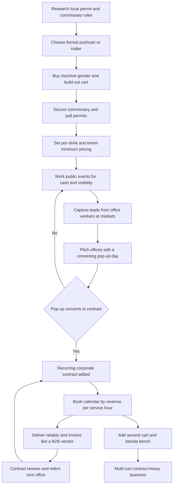

### Direct Answer

To start a coffee cart business in 2027, you buy or build a compact mobile espresso setup — a pushcart, trike, or small towable trailer carrying a commercial espresso machine, a grinder, and a water system — and you take it to where people already gather: corporate offices, weddings, farmers markets, breweries, festivals, and film sets. A lean pushcart launch runs **$25K-$45K all-in**; a fuller trailer build with a strong machine and tow vehicle runs **$55K-$95K+**. The business earns a seductive **60-75% gross margin on the coffee itself** but a far thinner **12-30% net margin** once labor, the commissary, fuel, permits, and event no-shows are paid — and the single number that decides whether you net $18K or $70K in Year 1 is **revenue per service hour**, fully loaded with the unpaid drive, prep, and teardown time every shift quietly carries.

> **TLDR**
> - **The model:** a mobile espresso operation deployed in 2-6 hour service windows; format choices are pushcart ($3K-$15K), trike ($5K-$12K), trailer ($15K-$60K), or van ($40K-$120K+).
> - **The core metric:** revenue per *service hour*, net of unpaid drive/prep/teardown. A four-hour market is a seven-to-eight-hour day; book by the loaded number, not by what feels busy.
> - **The profit engine:** recurring corporate office contracts — no booth fee, known headcount, year-round, priced to cover labor. Public events are cash flow and lead-gen, not the business.
> - **Economics:** $25K-$45K lean / $55K-$95K+ full launch; 60-75% gross margin, 12-30% net margin; Year 1 $50K-$200K revenue and $18K-$70K owner profit; Year 3 $250K-$700K revenue and $70K-$210K profit.
> - **The three killers:** chasing only public events, underpricing the event minimum and the labor inside it, and skipping the commissary-and-permit reality.
> - **Counter-case:** wrong for anyone wanting a passive asset, a fast path to a cafe, or a business without early mornings, a tow vehicle, a commissary, and a calendar of cold B2B outreach.

This entry treats a coffee cart the way a RevOps operator treats a sales territory: a fixed unit of capacity, a non-billable-time tax, a pricing decision, and a customer-mix choice that decides the margin. The espresso is the easy part; the business is a tow vehicle, a commissary, a permit binder, a booking calendar, and a phone full of office managers who rebook. If you are weighing this against an adjacent mobile or food-service model, the same capacity-and-mix framework applies — compare (q9602), (q1930), (q2001), (q1980), and (q1929) before committing a cart and a year.

## 1. What A Coffee Cart Business Actually Is In 2027

A coffee cart business owns a compact, mobile coffee-service setup and brings it to where customers already gather, instead of waiting for customers to walk into a fixed cafe. The physical format varies, but the economic shape is constant: a portable station with a commercial espresso machine, a grinder, milk, cups, and a barista, deployed in service windows of two to six hours at offices, weddings, markets, festivals, breweries, film sets, gyms, hospitals, and campuses.

### 1.1 The One Financial Idea Underneath It

You take a setup that cost tens of thousands once, and you generate enough drink revenue per *staffed* hour — net of the unpaid drive, prep, and teardown hours — that the cart pays for itself and then funds a real income. Everything in this entry is downstream of that sentence. A cart that grosses $700 in a four-hour market but eats four unpaid hours is a fundamentally different business from a $1,000 office contract that pays for a three-hour pour ten minutes from the commissary. Same revenue band, opposite economics.

### 1.2 Why 2027 Specifically Reshaped The Model

Three structural shifts define the 2027 landscape. **First, hybrid work made the office coffee perk a real budget line.** After years of return-to-office friction, employers actively spend on on-site perks to make the commute worth it, and a barista cart on a Tuesday and Thursday is a visible, affordable, popular one — which turned the recurring office contract from a novelty into the model's profit engine. **Second, specialty-coffee expectations rose**, so a cart pulling mediocre shots competes badly against one with real beans and a trained barista. **Third, mobile-vendor permitting and commissary rules standardized and tightened**, making the regulatory layer a genuine planning constraint and recurring cost rather than an afterthought. Cashless payment, online booking, and social media also made it far easier for a one-person operator to look professional and get found.

### 1.3 What It Is Not

It is not a cafe, and in most cases you are not roasting your own beans. It is not passive, and it is not a shortcut. A coffee cart is a mobile service-and-logistics business wearing a hospitality costume. The founders who succeed understand that the espresso is the easy part — the hard part is the tow vehicle, the commissary dishes, the permit binder, the booking calendar, and the cold outreach to office managers and event planners.

It is also worth being precise about what "small" means here. The cart's footprint is small, but the *operating surface* is not: a one-cart operator who runs a mixed book is simultaneously a barista, a logistics planner, a fleet manager, a compliance officer, a salesperson, and a bookkeeper. The romance of the model — a charming cart, a steaming machine, a line of happy customers — is real, but it is roughly fifteen percent of the actual job. The other eighty-five percent is the unglamorous infrastructure that makes those fifteen minutes of pouring possible. A founder who internalizes that ratio before launch makes better format, pricing, and staffing decisions than one who discovers it in month four. For the adjacent fixed-location version of this trade, see (q1930); for the event-only variant, see (q9602).

## 2. The Cart Formats: What You Actually Buy And Why

The format you choose is the first irreversible decision, because it sets your capital, your mobility, your menu ceiling, and the venues you can serve.

### 2.1 The Format Ladder

| Format | Typical capital | Tow vehicle? | Best fit | Volume ceiling |
|---|---|---|---|---|
| Pushcart / wheeled kiosk | $3,000-$15,000 | No | Indoor offices, lobbies, convention halls | Low-moderate |
| Converted trike / coffee bike | $5,000-$12,000 | No | Weddings, brand activations, aesthetics | Lowest |
| Towable trailer (5x8 to 7x14) | $15,000-$60,000 | Yes | High-volume markets, festivals, mixed book | High |
| Coffee van / truck | $40,000-$120,000+ | Self-propelled | Presence, fast setup, scaling operators | Highest |
| Cart-in-someone's-space | $5,000-$20,000 | No | Co-working, hotel, gym revenue-share | Moderate |

### 2.2 Matching Format To Customer

The strategic rule is simple: **match the format to the customer who will actually pay the bills, not to the romance.** Pushcarts and trikes serve indoor corporate and weddings well. Trailers are the workhorse of a serious mixed book — they carry inventory, serve high volume, weather the elements, and become a recognizable rolling storefront. Vans are typically a Year-2-or-3 upgrade for operators scaling presence, not a launch vehicle. The cart-in-someone's-space hybrid blurs into a micro-cafe and is governed more by the host arrangement than by mobility.

### 2.3 The Year-One Format Mistake

The classic error is buying the romantic format — the vintage trike, the gleaming van — before confirming it can physically serve the venues that pay. A beautiful trike that cannot handle a 300-guest festival, or a van too tall for the office parking garage, is a capital mistake disguised as a brand decision. Confirm the venue list first, then buy the format that serves it. The same "buy capacity to fit demand, not aesthetics" discipline governs the food-truck decision in (q1929) and the ice-cream-truck decision in (q1982).

## 3. The Three Business Models: Events, Contracts, And The Hybrid

There are three distinct ways to build this business, and choosing deliberately is one of the most consequential early decisions.

### 3.1 The Public-Events Model

This model lives on farmers markets, festivals, fairs, sporting events, and busy public corners — selling drink-by-drink to the general public. Its advantage is immediate cash, visibility, and a zero-length sales cycle. Its challenge is brutal: weather dependence, market saturation, booth fees, low margins once unpaid hours are counted, and revenue that swings wildly with foot traffic and the calendar.

### 3.2 The Corporate-And-Private-Contract Model

This model sells *booked* service — a recurring weekly office "coffee perk," a wedding, a corporate retreat, a product launch, a film-set catering gig — for a flat fee or a sponsored arrangement where the host pays and drinks are free to guests. Its advantage is predictable revenue, far better margins (no booth fee, known headcount, a flat fee that prices in the labor), and relationships that renew. Its challenge is a real B2B sales cycle and the need to look professional and insured.

### 3.3 The Hybrid Operator Model

The most common durable shape runs a base of recurring corporate and private contracts for reliable margin, and fills open dates with public events for cash flow and visibility — using the markets partly as marketing that generates contract leads. Its advantage is resilience and a smoothed calendar; its challenge is juggling two booking motions.

| Model | Revenue predictability | Margin | Sales effort | Weather exposure |
|---|---|---|---|---|
| Public events | Low | Thin (12-20% net) | None | Severe |
| Corporate / private contracts | High | Strong (20-35% net) | High (B2B cycle) | Low |
| Hybrid | Moderate-high | Blended (18-30%) | Moderate | Moderate |

The strategic error is staying a pure public-events operator forever, mistaking a busy market calendar for a profitable business when the unpaid hours and booth fees have quietly eaten the margin. Many successful operators start at public events because the cash is immediate, then deliberately convert that visibility into the recurring contracts that actually pay.

## 4. The Core Unit Economics: Revenue Per Service Hour

This is the single most important section in the entry, because the entire business lives or dies on one calculation beginners almost never run.

### 4.1 The Hidden Hours

A coffee cart shift is not just the hours the cart is pouring. Every shift carries unpaid time: driving to the commissary, prepping milk and supplies, loading, towing to the venue, setting up, then — after the service window — tearing down, towing back, unloading, cleaning the machine and cart, and dumping and refilling water. A four-hour farmers market can easily carry three to four additional unpaid hours, turning a "four-hour shift" into a seven-or-eight-hour day.

### 4.2 The Two Models, Run Side By Side

| Gig type | Gross | Fees | Service hrs | Unpaid hrs | Net per real hour |
|---|---|---|---|---|---|
| Slow rainy market | $150 | -$60 booth | 4 | 4 | ~$11/hr (before labor split) |
| Average market | $600 | -$80 booth | 4 | 3.5 | ~$60/hr |
| Recurring office contract | $900 flat | $0 | 3 | 1 | ~$210/hr |
| Four-hour wedding | $1,800 flat | $0 | 4 | 4 | ~$200/hr (two staff) |

The food cost is roughly the same 8-15% across all of them. The difference is structural: the contract pays a flat fee with no booth fee, a short drive, and a known crowd, while the market pays per-drink against a long unpaid day.

### 4.3 The Booking Discipline

Before booking any gig, **estimate the fully loaded revenue per real hour — gross, minus fees and food cost, divided by service hours plus drive plus prep plus teardown — and compare gigs honestly.** Recurring corporate contracts almost always win this comparison, which is why the model's profit engine is B2B, not the market. Public events earn their place as cash flow, visibility, and lead generation — not as the core. A founder who books by revenue per service hour builds a profitable calendar; one who books by what feels busy builds an exhausting one that grosses well and nets little. The same non-billable-time tax governs the mobile-detailer capacity math in (q1147) and the food-truck day in (q1129).

### 4.4 Why The Metric Is Invisible Without Measurement

The reason beginners never run this number is that the unpaid hours are *invisible without a stopwatch*. An operator who never times the full cycle — from leaving the commissary to returning the clean cart — genuinely believes the day was "a four-hour market" when in fact it was an eight-hour day with four hours of pouring. Memory anchors on the service window because that is the part the customer sees and the part that feels like work-with-a-purpose; the drive and the dish-washing fade from recollection even though they consumed half the day. The fix is not motivation — it is measurement. An operator who logs ten complete gig cycles (date, gig type, gross, fees, service minutes, drive minutes, prep minutes, teardown minutes) for one month produces a more honest forecast than any amount of optimism. RevOps teams call this the difference between a committed number and a best-case number, and the cart operator needs the committed number to size a trailer payment against.

There is a second illusion stacked on the first: the **recall bias of a good day**. An operator remembers the sunny Saturday market that grossed $900 and forgets the three rained-out Saturdays that grossed $200 each while costing the full day. The business plan gets built on the peak, and reality delivers the average. The honest forecast is the median of a logged month, not the memory of the best shift. A founder who carries that discipline into the booking calendar will quietly stop accepting the gigs that *feel* productive but lose money once the unpaid hours are counted — and that single behavior change is worth more to Year-1 profit than any marketing tactic.

## 5. The Line-By-Line P&L

Beyond revenue per hour, a founder must internalize the operating P&L, because the gross margin is famously seductive and the net margin is where the truth lives.

### 5.1 The Gross Margin Is Real — But It Is Not The Business

A $6 latte carries a food cost of roughly $0.50-$1.10 — espresso beans, milk, a cup, a lid, a sleeve — a genuine **60-75% gross margin on the coffee itself**, and that number holds up. But the gross margin is not the take-home. From it, costs stack in an order beginners consistently underestimate.

### 5.2 The Cost Stack

| Cost line | Typical scale | Notes |
|---|---|---|
| Labor (barista + second staff) | Largest line once owner stops pouring | Includes unpaid drive/prep/teardown hours |
| Commissary rent | $300-$1,200+/month | Legally required base; recurring |
| Booth / event fees | $40-$150+ per public event | Eats gross directly |
| Vehicle (fuel, maintenance, insurance, depreciation) | Allocated per gig | Tow vehicle + trailer |
| Permits & licenses | $300-$2,000+/year | Often renewed annually, per-jurisdiction |
| Insurance | $1,000-$4,000+/year | GL, product, commercial auto |
| Supplies, processing fees, marketing, repairs, spoilage | Variable | Rounds out the stack |

### 5.3 The Net Margin And Seasonality

Net it all down and a coffee cart business runs a **net margin of roughly 12-30%** — a wide range driven almost entirely by the mix between high-margin recurring contracts and lower-margin public events, and by how disciplined the operator is on pricing the event minimum. Seasonality compounds it: outdoor public events concentrate in the warm months, while corporate contracts run year-round — another structural argument for a contract-heavy book. The founders who fail at the P&L level almost always made the same error: they saw the 70% gross margin, assumed it was the take-home, and never built the contract-heavy calendar that turns a great gross margin into a real net one. The vending-machine model in (q1937) shows the same gross-vs-net trap from a different angle.

### 5.4 A Worked Monthly P&L

Concrete numbers make the margin compression tangible. Consider a disciplined Year-1 operator running a single pushcart with a mixed book — four recurring office mornings a week and roughly six public events a month — generating $11,000 in monthly revenue:

| Line | Monthly amount | % of revenue |
|---|---|---|
| Revenue (contracts + events + per-drink + tips) | $11,000 | 100% |
| Food cost (beans, milk, cups, lids) | -$1,400 | 13% |
| Labor (one part-time second barista + loaded event hours) | -$3,100 | 28% |
| Commissary rent | -$650 | 6% |
| Booth and event fees | -$520 | 5% |
| Vehicle (fuel, maintenance, insurance allocation) | -$700 | 6% |
| Permits, licenses, insurance (monthly allocation) | -$420 | 4% |
| Payment processing, marketing, repairs, spoilage | -$560 | 5% |
| **Owner profit (pre-tax)** | **$3,650** | **33%** |

Two things stand out. First, the owner's *own* labor is not a line item here — if it were costed at market barista rates, the "profit" would compress further, which is exactly why the owner-operator's take-home in Year 1 feels thinner than the percentage suggests. Second, the single largest controllable lever is the contract-versus-event mix: shift two of those six monthly events into recurring office mornings and the booth-fee line shrinks, the unpaid-hour load drops, and the same revenue converts to materially more profit. The P&L is not destiny — it is a dial, and the contract mix is the knob.

## 6. The Equipment: Machine, Grinder, And Build-Out

The equipment is the production capacity of the business, and a founder must understand it before spending, because the espresso machine and grinder set both the quality ceiling and a large share of the capital.

### 6.1 The Espresso Machine

The machine is the heart of the cart. Real, widely used references in the specialty space include **La Marzocco** (the Linea Mini and Linea PB are common cart and small-cafe choices), **Slayer**, **Synesso**, **Nuova Simonelli** (the Appia and Musica lines), **Rocket Espresso**, **Profitec**, and **Lelit** (the Bianca is a popular prosumer choice). Realistic costs run from roughly $2,500 for a capable prosumer single-group up to $20,000-$25,000 for a high-end two-group commercial machine. The dominant publicly traded supplier ecosystem behind the consumables and retail side includes roaster-and-cafe operators such as **Starbucks (SBUX)** and **Dutch Bros (BROS)** — useful as market-demand signals even though a cart competes on mobility and event experience rather than retail footprint.

### 6.2 Power, Water, And The Grinder

| Component | The constraint | Planning move |
|---|---|---|
| Electrical | Venues rarely guarantee adequate amperage | Weigh single-group vs two-group, generators, battery systems |
| Water | No venue guarantees plumbing | Fresh + grey tanks, pump, sometimes a heater |
| Grinder | Caps the quality the machine can deliver | Budget $800-$3,000; never economize here |

A quality commercial grinder is what makes the expensive machine worth owning. Saving money on the grinder permanently caps the quality the machine can produce.

### 6.3 The Build-Out

The build-out — the cart or trailer fitted with the machine, grinder, refrigeration, counter space, code-required sinks, water system, payment hardware, and branding — is the other large capital line, ranging from a few thousand for a basic pushcart to $40,000-$60,000 for a finished custom trailer. The sourcing discipline: buy commercial-grade gear built to run shift after shift, strongly consider the healthy used-equipment market for both machine and trailer, and confirm the machine's power and water needs match the target venues *before* buying. The Year-1 mistake is buying more machine than the cart's power system or the target venues can support.

### 6.4 New, Used, Or Self-Built

The build decision has three honest paths, each with a different risk profile. **Buying a finished cart or trailer new** is the fastest and lowest-risk route — the equipment is warrantied, the build is code-compliant out of the gate, and the operator can launch in weeks — but it is the most expensive, and a new operator pays a premium for capacity they have not yet proven they can fill. **Buying used** — from cafes upgrading, cart operators exiting, or trailer-build shops with trade-ins — is how most disciplined launches keep the capital line lean; a quality used La Marzocco or Nuova Simonelli machine at a fraction of new cost, paired with a used trailer that already passed an inspection somewhere, is a genuinely smart entry, provided the buyer has the machine inspected by a repair tech first. **Self-building** the cart — fitting a bare trailer with the machine, plumbing, electrical, and counter — saves the most cash but demands real skill, eats months of the founder's time, and risks a build that fails the health inspection if the sinks, surfaces, and water system are not done to code. The general rule: buy the machine and grinder used where the quality holds and a tech has verified them, consider a used trailer if the inspection history is clean, and self-build only if the founder genuinely has the trade skills — because a cart that cannot pass inspection is not a saving, it is a stalled launch.

## 7. Permits, Commissary, And The Regulatory Reality

This is the section beginners most want to skip and most cannot afford to, because the regulatory layer is a hard legal requirement and a recurring cost, not a formality.

### 7.1 The Stacked Requirements

A coffee cart is a mobile food business, and in nearly every US jurisdiction that means several stacked requirements:

- **Mobile food vendor permit and health permit** — issued by the local or county health department; the cart itself typically must pass a health inspection covering sinks, water systems, food storage, and surfaces, and the permit renews periodically.
- **Business license and entity registration** — baseline.
- **Sales tax registration and collection** — applies to drink sales in most jurisdictions.
- **Food handler / food manager certifications** — typically required for whoever runs the cart.
- **Fire and propane permits** — may apply if the cart uses propane.
- **Per-event and per-jurisdiction temporary permits** — a real operational drag for any cart that crosses city or county lines.

### 7.2 The Commissary Requirement

The commissary is the requirement that surprises people. Most health departments require a mobile vendor to operate out of a **licensed commercial kitchen or commissary** — a base where the cart fills potable water, dumps grey water, stores inventory, preps, and cleans — and they require documentation of that arrangement. A commissary can be a shared commercial-kitchen rental, an arrangement with an existing restaurant or cafe, or a dedicated space, and it is a **recurring monthly cost the P&L must carry from day one**, typically a few hundred to over a thousand dollars per month.

| Requirement | Issuer | Frequency | Rough cost |
|---|---|---|---|
| Mobile food vendor / health permit | County health department | Annual + inspection | $100-$1,000+ |
| Commissary agreement | Licensed kitchen | Monthly | $300-$1,200+/mo |
| Business license | City / county | Annual | $50-$400 |
| Food handler certification | State-approved provider | Every 2-3 years | $10-$50/person |
| Per-event temporary permit | Event jurisdiction | Per event | $25-$200 |

### 7.3 The Discipline

Research the specific local and county requirements *before buying anything*, build the commissary cost into the model from day one, budget for annual renewals and per-event permits, and treat the permit binder as a core operating system. The founders who get this wrong either launch unpermitted and get shut down, or build a cart they cannot legally base anywhere — both avoidable with a phone call to the health department before the first dollar is spent. The same regulatory homework governs the cottage food bakery in (q2003) and the pop-up restaurant model.

### 7.4 The Pre-Launch Regulatory Sequence

The order in which a founder tackles the regulatory layer matters, because doing it out of sequence is how operators build carts they cannot use. The correct sequence is: **first**, call the county health department and confirm exactly what a mobile coffee operation requires — the permit type, the commissary requirement, the sink and water-system specifications, and any per-event rules; **second**, secure a written commissary agreement, because the health department will ask for it and because the cart's plumbing must be designed around how the commissary's water and waste systems work; **third**, design or buy the cart to the specifications the inspector gave — the right number of sinks, the correct water tankage, the surfaces and food-storage layout; **fourth**, schedule the cart's health inspection and obtain the mobile vendor permit; **fifth**, register the entity, the business license, the sales-tax account, and the food handler certifications; and **sixth**, line up the insurance, because event clients will demand proof of it before they book. A founder who runs this sequence in order spends nothing on a cart until they know it can be permitted. A founder who buys the romantic trailer first and calls the health department last is the operator who discovers, after $50,000 is spent, that the build needs a second sink, a different water system, or a commissary that no longer has space — the most expensive lesson in this entire entry, and the most completely avoidable.

## 8. Sourcing The Coffee: Beans, Milk, And The Supply Relationship

The product is coffee, and in 2027 bean quality and barista skill visibly separate carts, so a founder must build the supply side deliberately.

### 8.1 The Bean Relationship

Most cart operators do not roast — they buy from a specialty roaster, and the choice is strategic. A wholesale relationship with a respected regional or national roaster provides consistent quality, training support, and often co-marketing, and the roaster's reputation can become part of the cart's pitch. Real roasters operating at wholesale scale that cart operators reference and partner with include **Counter Culture Coffee**, **Stumptown** (owned by Peet's, itself part of **JDE Peet's**), **Intelligentsia** (JAB Holding), **Onyx Coffee Lab**, **Blue Bottle** (owned by **Nestle**, ticker **NESN**), **Joe Coffee**, and strong regional roasters in every metro.

### 8.2 Milk, Cups, And The Rest

| Supply line | 2027 expectation | Cost / experience note |
|---|---|---|
| Dairy + alternatives | Whole, 2%, plus a serious oat option (Oatly, Chobani common) | A meaningful share of customers expect a good non-dairy option |
| Cups, lids, sleeves | Growing demand for compostable / recyclable | Ongoing supply cost; corporate clients push hardest |
| Syrups, sauces, seasonal flavors | Menu range and margin | Adds upcharge revenue |
| Pastries / food | Optional add-on | Crosses into extra permitting and spoilage risk |

### 8.3 The Discipline

Lock a reliable roaster relationship that supports quality and training, build a supply chain that does not run out mid-week, price the alternative-milk and compostable-cup costs into the menu, and treat the roaster as a partner whose reputation and training are part of what the cart sells — not just a commodity vendor. Many cart operators deliberately stay coffee-focused or partner with a local bakery rather than carry food themselves.

## 9. The Menu And Pricing Architecture

Pricing a coffee cart has two layers — the per-drink retail price and the event minimum — and a founder must get both right because they govern the two revenue models.

### 9.1 Per-Drink Pricing

| Drink category | 2027 price band |
|---|---|
| Espresso / Americano | $3-$5 |
| 12oz latte / cappuccino | $4-$7 |
| Specialty / seasonal (mocha, flavored, specials) | $5-$9 |
| Cold brew / iced specialty | $5-$8 |
| Add-ons (extra shot, alt milk, syrup) | $0.50-$1.50 each |

The menu should be deliberately tight — a cart serving a long menu slowly serves fewer customers per hour than one serving a focused menu fast, and speed of service is itself a revenue lever at a busy market. Tips are a real and meaningful part of barista and owner-operator income at public events, often adding 15-25% on top of drink revenue.

### 9.2 The Event Minimum And Flat Fee

The event minimum is the pricing layer beginners chronically underprice. A booked event is not "the drinks people order" — it is a fully loaded service that must cover the staff (often two people), the unpaid drive, prep, and teardown hours, the equipment and vehicle cost, the risk, and a real margin.

| Booking type | 2027 pricing |
|---|---|
| Small event minimum / flat fee | $300-$1,200 for a short window |
| Four-hour wedding package | $800-$2,500+ by headcount, drinks, staffing |
| Recurring corporate office contract | $1,000-$5,000 per month |

### 9.3 Sponsored / Host-Pays Pricing

The sponsored model — where the company or wedding host pays a flat fee and drinks are free to guests — is the cleanest model for the operator because revenue is known and not dependent on per-drink ordering. The discipline: price per-drink to the local specialty market, keep the menu fast, and above all price the event minimum as a fully loaded service with the labor and unpaid hours built in, because the underpriced event is the single most common margin leak in the business.

## 10. The Corporate Contract: The Profit Engine

The recurring corporate contract deserves its own section because it is, in 2027, the single best revenue line in the model and the thing that separates a profitable cart business from an exhausting one.

### 10.1 What It Is And Why It Wins

A company hires the cart to provide on-site coffee service on a recurring schedule — a weekly "coffee morning," a multiple-times-per-week perk, a lobby presence on certain days — and pays a flat monthly or per-visit fee, with drinks typically free to employees. It is the profit engine because there is no booth fee, the headcount and timing are known, the location is fixed and the drive is consistent, the revenue is predictable and recurring, the food cost is the same low 8-15%, and the flat fee can be priced to fully cover the labor and unpaid hours — so the loaded revenue per real hour is dramatically better than a public market. It also smooths the calendar across the year, since offices run in winter when outdoor markets do not.

### 10.2 Why 2027 Favors It

In the hybrid-work era, employers actively spend on in-office perks to make the commute worthwhile, and a barista cart on a Tuesday and Thursday is a visible, popular, relatively affordable perk — the demand is structural, not a fad. This is the same return-to-office spending pattern visible in corporate catering, covered in (q9600).

### 10.3 How Operators Land It

- **Direct B2B outreach** to office managers, HR and people teams, and workplace-experience managers.
- **The converting pop-up** — a paid or sample day at an office that turns into a recurring contract once the company sees how popular it is.
- **Referral** from one office to another.
- **Targeting** co-working spaces, tech companies, hospitals, and campuses.

What it requires is professionalism, reliability, insurance, a clean look, consistent quality, and the ability to invoice and operate like a B2B vendor — exactly the things casual public-events operators never build, which is why the lane stays open.

### 10.4 Pricing And Structuring The Contract

The corporate contract is priced as a fully loaded service block, not as a per-drink estimate. The operator works backward from the loaded cost of the visit — staff hours including drive and prep, the consumables for the expected headcount, the vehicle allocation, and a target margin — and prices the flat fee above that floor with a real cushion. A weekly three-hour office morning serving 60-90 drinks is commonly priced in the **$700-$1,100 per visit** band; a multi-times-weekly arrangement is bundled into a monthly fee in the **$2,500-$5,000** range. The contract itself should specify the cadence, the service window, the headcount band, who pays (host-pays is cleanest), the cancellation and weather terms, the term length (a three-to-six-month initial term with auto-renewal is common), and a clear menu scope so an office cannot quietly expand the order without a re-price. A founder who treats the corporate contract as a real B2B agreement — with terms, a renewal date, and an invoicing rhythm — captures the predictability that makes the whole model work; one who treats it as a casual handshake invites the scope creep and payment friction that erode the margin the contract was supposed to protect.

## 11. Booking, Payments, And The Technology Stack

In 2027 a coffee cart runs on a small technology stack, and a founder should set it up early because it is what makes a one-person operation look and function like a real business.

### 11.1 The Stack

| Layer | Tool reference | Why it matters |
|---|---|---|
| Cashless payment | Tap-to-pay reader + POS app (Square common) | A slow checkout costs drinks per hour at a busy market |
| Web presence + booking | Simple site, services page, quote form, calendar | Event clients expect to check availability and book cleanly |
| Social media | Instagram and similar | A well-photographed cart at real events is the marketing |
| Invoicing & bookkeeping | B2B invoicing software | Contracts and deposits need real invoices and clean books |
| CRM / pipeline | Light CRM or disciplined spreadsheet | Tracks office-manager relationships and contract renewals |
| Inventory / prep tracking | Basic system | Keeps the cart from running out of oat milk mid-shift |

### 11.2 The Discipline

Adopt fast cashless payment from day one, build a clean professional web presence and an easy booking flow, use social media as the visual marketing it naturally is, and run the B2B side — invoicing, deposits, contract tracking — like an actual business. The operators who run a tight, professional digital operation win the corporate contracts; the ones running off a cash box and a personal phone number stay stuck at the saturated public-events margin.

## 12. Staffing And Building A Bench Of Baristas

A founder can run a single cart nearly solo, but the business does not scale — and cannot reliably serve events — without a bench of baristas.

### 12.1 The Barista Is The Core Role

Barista quality directly drives revenue and reputation: a skilled, fast, friendly barista pulls better shots, serves more drinks per hour, upsells naturally, and represents the brand at someone's wedding or office. A weak one slows the line, wastes product, and generates the bad review that costs the next booking. Events frequently need two people — one on the machine, one taking orders and handling payment and milk — so even a small operation that does weddings needs at least one reliable second staffer.

### 12.2 The Gig-Shaped Challenge

The work is early-morning and gig-shaped: shifts start before dawn for office mornings, cluster on weekends for events and markets, and vary week to week. Operators build a small bench of part-time, on-call, and cross-trained baristas rather than relying on one person. Training and consistency are the operational backbone — documented drink recipes, setup and teardown checklists, commissary procedures, and customer-service standards turn a bench of individuals into a consistent brand.

### 12.3 What A Trained Barista Is Actually Worth

It is tempting to treat the barista as a commodity hire — a pair of hands at minimum-plus wages — but the revenue math says otherwise. A skilled barista at a busy market serves more drinks per hour than a slow one, and at $5-$8 per drink that throughput difference compounds across a four-hour window into real money. A friendly, fast barista also drives the tip pool, upsells the extra shot and the alternative milk without being asked, and — most importantly — *is the brand* at someone's wedding or in someone's office lobby. The corporate contract renews because the same recognizable, reliable barista shows up every Tuesday and the office likes them; it does not renew because the coffee was technically adequate. A weak barista does the opposite: a slow line at a market costs drinks per hour, wasted milk and shots erode the food-cost line, and a single bad interaction at a wedding becomes the review that costs the next three bookings. The practical implication is that barista hiring and training is not an overhead chore — it is a revenue investment, and the operators who pay slightly above market for genuinely good people, train them well, and keep them, out-earn the operators who churn through cheap, untrained hands.

### 12.4 The Hiring Sequence

| Stage | Hire | Purpose |
|---|---|---|
| Year 1 | Reliable second barista | Cover events needing two staff |
| Year 1-2 | Enough bench for two carts same day | Never miss a booking |
| Year 2-3 | Lead barista / operations coordinator | Manage scheduling, commissary, quality |
| Year 3+ | B2B sales / account manager | Grow and renew the contract book |

A coffee cart business scales by cloning a reliable, well-trained barista-and-cart unit. Operators who build a real trained bench can run multiple carts and never miss a booking; those who never develop anyone past themselves are permanently capped at one cart and one calendar.

## 13. Startup Cost Breakdown: The Honest All-In Number

A founder needs a clear-eyed total of what it costs to launch, because under-capitalization — launching with no reserve and a too-cheap setup — is a top killer.

### 13.1 The Line Items

| Line item | Range |
|---|---|
| Cart or trailer | $3,000-$15,000 pushcart / $15,000-$60,000 trailer |
| Espresso machine | $2,500-$25,000 (most launches $4,000-$12,000) |
| Grinder | $800-$3,000 |
| Water system, refrigeration, power | $1,000-$6,000 |
| Tow vehicle (if not owned) | $5,000-$40,000+ |
| Commissary setup + first months | $500-$3,000 |
| Permits & licenses | $300-$2,000+ |
| Insurance (first payment) | $1,000-$4,000 |
| Opening inventory | $500-$2,500 |
| POS, website, branding | $1,000-$5,000 |
| Smallwares & tools | $300-$1,500 |
| Working-capital reserve | $3,000-$15,000 |

### 13.2 The Two Realistic Totals

A lean pushcart-based launch can come in around **$25,000-$45,000**, and a fuller trailer-based launch with a strong machine and a tow vehicle runs **$55,000-$95,000+**.

### 13.3 The Capital Filter

Financing softens the equipment and trailer lines — equipment financing and the healthy used market are both common — but the founder still needs real cash for the reserve and the permits, because the business has a built-in ramp before recurring contracts replace the slow early weeks. The capital requirement is a real filter: lower than opening a cafe, but not nothing. Treating it as a near-free side hustle — a too-cheap machine and zero reserve — is how operators end up with a cart that pulls bad shots and no cushion to survive the ramp.

## 14. The Year-One Operating Reality And Multi-Year Trajectory

A founder should walk into Year 1 with accurate expectations, because the gap between the marketed "easy mobile coffee business" and the real version is where most quitting happens.

### 14.1 Year One Is Route-Finding, Not Profit-Extraction

The first year is spent discovering which markets and events actually pay after booth fees and unpaid hours, learning the true loaded labor cost of an event, dialing in the menu and service speed, building the commissary and permit routine into muscle memory, and — most importantly — starting the slow B2B work of converting visibility into recurring corporate contracts. The work is genuinely hands-on: the founder is the barista, the driver, the commissary dishwasher, the salesperson cold-emailing office managers, and the bookkeeper.

### 14.2 The Multi-Year Arc

| Year | Setup | Revenue | Owner profit | Founder's role |
|---|---|---|---|---|
| Year 1 | One cart, owner-operated, route-finding | $50K-$200K | $18K-$70K | Doing everything |
| Year 2 | Second cart, barista bench, contract base grows | $150K-$450K | $45K-$140K | Running more than one unit |
| Year 3 | 2-3 carts, trained bench, systemized commissary | $250K-$700K | $70K-$210K | Managing and selling more than pouring |
| Year 4-5 | Cart + contract expansion, management layer | $400K-$1M+ | $110K-$300K | Strategic fork |

### 14.3 The Survival Test

The first slow stretch is the test: a founder who built a reserve and started the contract outreach early rides it out and emerges into a Year 2 with a recurring base; one who spent every dollar and only worked markets faces a thin, weather-exposed off-season. These numbers assume disciplined revenue-per-hour booking, properly priced event minimums, a deliberate push into recurring contracts, and a real reserve — they do not assume a viral overnight jump, because a coffee cart business scales with carts, trained baristas, and contracts, not magically.

### 14.4 The First-90-Days Operating Playbook

Within Year 1, the first ninety days deserve their own discipline, because the habits set in the first quarter compound for years. **Days 1-30 — measure and price honestly.** Before chasing volume, run the regulatory sequence to completion, log the first complete gig cycles end-to-end, and compute the real non-billable-time tax. Most operators discover it is larger than they assumed. Use the month to set tier-specific pricing built on the loaded margin from Section 5, not the seductive gross-margin number. **Days 31-60 — install the levers.** Stand up the route discipline (cluster gigs by geography and proximity to the commissary), standardize the cart layout so setup becomes a drilled routine, and adopt the cashless payment, booking, and invoicing stack. Begin the B2B outreach in earnest — a handful of office pitches and at least one converting pop-up. **Days 61-90 — build the recurring base.** Convert the pop-ups and the warm leads into the first two or three recurring office contracts, and put the renewal dates on the calendar. The target for the first quarter is not a profit number — it is a *system*: a measured time tax, a priced calendar, a working tech stack, and the first recurring contracts that signal the model is taking hold.

| Phase | Primary focus | Target |
|---|---|---|
| Days 1-30 | Regulatory sequence + measure the time tax | Permitted cart, real loaded-cost numbers |
| Days 31-60 | Route discipline, cart standardization, B2B outreach | First pop-ups booked |
| Days 61-90 | Convert pop-ups to recurring contracts | 2-3 office contracts signed |
| Ongoing | Book by revenue per service hour | Contract mix rising every quarter |

## 15. Lead Generation, Risk, And The Competitive Field

### 15.1 How A Coffee Cart Actually Gets Booked

Lead generation is two distinct motions, and the profitable one is deliberate B2B outreach. For the corporate-and-private lane, leads come from **direct outreach** to office managers and event planners, **the converting pop-up** day, and **referral** within the B2B world that compounds — a happy office refers another, a wedding planner who had a great experience recommends the cart for the next ten weddings, a venue adds the cart to its preferred-vendor list. For the public-events lane, leads come from market and festival organizers — applying for booth space and building relationships for the good spots and dates — and that visibility doubles as marketing that feeds the B2B lane. Paid advertising plays a modest role; this business is won through B2B outreach, the converting pop-up, the referral web, and visible professionalism. A founder should treat business development — pitching offices, building planner relationships, following up on contract renewals — as a core weekly function.

### 15.2 Risk Management And Insurance

| Risk | Primary mitigation |
|---|---|
| Weather (public events) | Contract-heavy calendar; weather clauses and deposits; indoor corporate work |
| Equipment failure (machine down) | Commercial-grade gear, preventive maintenance, repair-tech relationship, spare parts, backup machine |
| Liability / product (burn, slip, food safety) | GL + product liability insurance, food handler certification, sanitation discipline |
| Commercial auto (towing exposure) | Commercial auto coverage, safe-towing discipline |
| Regulatory (operating out of compliance) | Permit and commissary homework, current permit binder |
| Seasonality / concentration | Diversified contract mix across multiple clients and event types |
| Cash-flow ramp | Working-capital reserve |
| Staffing no-show | Trained bench and cross-coverage |
| Supply (run out of beans/oat milk) | Reliable roaster relationships, inventory discipline |

Insurance is also a sales requirement — venues and corporate clients typically require proof of coverage before booking.

### 15.3 The Competitive Field

A 2027 entrant competes against **established local carts** that hold the good market spots and festival relationships but often never built a corporate book; **casual seasonal operators** who compete on price and are easy to out-professionalize; **fixed cafes** that cannot follow the customer to an office or wedding; **office coffee service companies and bean-to-cup vendors** that compete for the corporate dollar with a machine-in-the-breakroom product rather than a barista experience; and **national chains** with catering arms. The competitive moat is not the cart — anyone with capital can buy a trailer and a machine — it is the **recurring B2B contracts, the planner and venue relationships, the reputation for reliability, the trained barista bench, and the professional operation**, all of which take time to build and are genuinely hard for a casual entrant to copy.

## 16. The Process Flow: From Inquiry To Rebooked Contract

The diagram below maps the full operating loop a disciplined operator runs — from format choice through the contract renewal that compounds.

The loop's engine is the cycle from J back to J: a contract that is delivered well, renews, and refers the next office. Public events (F) feed leads (G) into the pipeline but are never the destination. The operator who runs this loop builds a calendar that fills itself; the one who stops at F runs the busy-but-broke version.

## 17. Counter-Case: When A Coffee Cart Is The Wrong Business

An honest entry names the people and situations for whom a coffee cart is a poor fit, and the failure modes that recur.

### 17.1 The Wrong-Person Profile

This business badly misfits anyone who wants a **passive asset** — it is an early-morning, physical, weekend-heavy operation, not a holding. It misfits anyone who wants a **fast path to a cafe** — the cart is a multi-year proving ground, not a shortcut. It misfits anyone unwilling to do **B2B sales** — without the outreach, the operator stays in the saturated, low-margin public-events lane forever. And it misfits anyone unwilling to do the **regulatory homework** — the commissary and permit reality is non-negotiable and ends the unprepared operator's season.

### 17.2 The Five Named Operating Scenarios

| Operator | Approach | Outcome |
|---|---|---|
| Priya, the disciplined contract builder | $38K into a pushcart and a La Marzocco Linea Mini; works markets to be *seen*, converts office workers into three weekly contracts by month eight | $145K Year 1 revenue; $420K by Year 3 on a contract-heavy book |
| Brandon, the cautionary tale | $70K custom trailer and two-group machine; works only public events because markets require no sales calls | Busy every weekend, grosses $130K, but thin net, dead winter — busy and broke |
| Mei, the wedding-and-event specialist | Niches into high-end weddings; trike for aesthetics, trailer for capacity; $1,500-$2,800 loaded packages | Region's go-to event cart, $310K Year 3 at strong margins |
| The Okafor family, multi-cart corporate operator | Treats corporate as the whole business; systematizes commissary and training; clones the unit | Five carts, 20+ recurring contracts, $900K revenue by Year 5 |
| Dontae, the permit-and-reserve casualty | Builds a great cart but skips the homework — launches before securing a commissary, gets flagged, kept no reserve | A fixable business killed by skipping the regulatory and reserve basics |

### 17.3 The Recurring Year-One Mistakes

The mistakes in this business are remarkably consistent: **chasing only public events** (the busy-but-broke trap); **underpricing the event minimum and the labor inside it**; **skipping or underbudgeting the commissary and permit reality**; **buying the wrong machine** — one the venues cannot power, or saving on the grinder; **no working-capital reserve**; **skipping insurance** (also a sales mistake, since clients require proof); **a menu too long and service too slow**; **no backup for the espresso machine**; **ignoring the unpaid hours**; **neglecting B2B follow-up**; and **weak bookkeeping and ignored multi-jurisdiction sales tax**. Every one is avoidable — the founders who fail almost always made three or four of them, and the founders who succeed treated this list as a pre-launch checklist. The same "name the failure modes and avoid them" discipline applies to the bakery model in (q1940) and the catering model in (q1980).

## 18. The Decision Framework And 2027-2030 Outlook

### 18.1 Should You Actually Start This In 2027

Run a structured self-assessment across six dimensions:

| Dimension | The honest question |
|---|---|
| Capital | Do you have $25K-$45K lean (or $55K-$95K full) plus a real reserve, or financing plus cash for reserve and permits? |
| Physical / schedule temperament | Are you willing to run an early-morning, weekend-heavy, physical mobile operation — often solo in Year 1? |
| Sales orientation | Will you do the ongoing B2B outreach — pitching offices, running pop-ups, chasing renewals? |
| Coffee / hospitality standards | Will you invest in quality beans, a real grinder, barista training, and consistency? |
| Operational / regulatory discipline | Will you do the permit and commissary homework first, price the event minimum fully loaded, book by revenue per service hour, and keep a reserve? |
| Local market fit | Is there enough corporate, event, and public-event demand in your radius, and is the corporate lane underserved? |

If a founder answers yes across all six, a coffee cart business in 2027 is a legitimate, achievable path to a $200K-$700K small business with $55K-$210K in owner profit. If they answer no on capital or regulatory discipline, they should not start yet. If they answer no on sales orientation specifically, they will likely build the busy-but-broke public-events version.

### 18.2 Specialty Paths Worth Considering

Beyond the general hybrid model, focused niches can be the better business: the **corporate-contract specialist** (highest-margin, cleanest to scale); the **wedding-and-private-event specialist** (best per-event pricing, planner relationships); the **film-and-production-catering specialist** (reliable, professional rates in production-heavy metros); the **brewery-and-winery-partnership operator** (steady semi-recurring lane); the **brand-activation cart** (premium rates, rewards a photogenic format); and the **campus, hospital, and institutional operator** (contract predictability plus high foot traffic). The mistake is not choosing a focus — it is staying a generic public-events cart, mediocre and saturated across everything.

### 18.3 The 2027-2030 Outlook

Several trends are reasonably clear. **Demand stays structurally healthy** — specialty-coffee consumption and the event economy are durable, and the corporate-perk tailwind looks structural as hybrid work settles into a permanent pattern. **The corporate-and-private lane keeps favoring the professional operator** — the operators who can sell, invoice, insure, and reliably deliver capture the growth. **Coffee quality keeps separating carts.** **The public-events lane stays crowded and weather-exposed** — useful for cash flow and visibility, not as a standalone business. **Payment, booking, and back-office tooling keep professionalizing the small operator.** **Sustainability expectations rise modestly** — compostable cups and alternative milks become more of a baseline, especially for corporate clients. **Equipment financing and a healthy used market keep the entry accessible**, which keeps new entrants coming — exactly why professionalism and the contract book remain the real moat. The net outlook: the coffee cart business is **viable and durable through 2030 in its disciplined, contract-focused, quality-driven, professionally-run form.**

## 19. Bottom Line

Starting a coffee cart business in 2027 is a real, achievable path — but it is a mobile service-and-logistics business, not a passive coffee asset. A lean pushcart launch runs **$25K-$45K all-in**; a fuller trailer build runs **$55K-$95K+**. The coffee itself earns a strong **60-75% gross margin**, but the honest net margin is **12-30%** once labor, the commissary, fuel, permits, insurance, and event no-shows are paid. A disciplined Year 1 generates **$50K-$200K in revenue** and **$18K-$70K in owner profit**; a well-run Year 3 reaches **$250K-$700K revenue** and **$70K-$210K profit** on a multi-cart, contract-heavy book.

If there is one number to carry out of this entry, it is **revenue per service hour** — fully loaded with the unpaid drive, prep, and teardown time. A four-hour market is a seven-or-eight-hour day; the operator who books by the loaded number builds a profitable calendar, and the one who books by what feels busy builds an exhausting one that grosses well and nets little. The profit engine is the recurring corporate contract: no booth fee, known headcount, year-round, priced to cover the labor. Public events are cash flow and lead generation — never the core.

The founders who succeed treat the cart as a system to be cloned: they do the permit and commissary homework first, buy commercial-grade equipment matched to their venues, price the event minimum as a fully loaded service, build a recurring B2B contract base, train a barista bench, and run the back office like a real business. The ones who stall treat it as "show up and pour coffee" — they chase only markets, underprice events, skip the regulatory reality, and then wonder why a busy calendar never becomes a profitable one. If you are weighing this against an adjacent mobile or food-service model, run the same capacity-and-mix framework across (q9602), (q1930), (q2001), (q1980), (q1929), (q9600), (q1982), and (q2003) before you commit a cart and a year to any of them.

---

**Sources & citations:** (1) U.S. Bureau of Labor Statistics food-service and personal-care occupation wage data; (2) U.S. Small Business Administration small-business survival-rate data; (3) SBA microloan and equipment-financing program guidance; (4) National Coffee Association U.S. consumption and specialty-coffee trend reports; (5) Specialty Coffee Association industry and barista-skill standards; (6) Starbucks (SBUX) investor disclosures on specialty-coffee demand; (7) Dutch Bros (BROS) operating-metric disclosures as a drive-thru demand signal; (8) JDE Peet's roaster-segment and wholesale disclosures; (9) Nestle (NESN) Blue Bottle and coffee-segment reporting; (10) La Marzocco commercial machine specifications and dealer pricing; (11) Nuova Simonelli Appia and Musica machine documentation; (12) Slayer and Synesso commercial espresso machine specifications; (13) Rocket Espresso, Profitec, and Lelit prosumer machine pricing guides; (14) Counter Culture Coffee wholesale partnership and training materials; (15) Stumptown and Intelligentsia wholesale program documentation; (16) Onyx Coffee Lab wholesale and roaster-partnership references; (17) Oatly and Chobani foodservice alternative-milk product data; (18) county and municipal health-department mobile food vendor permit requirements; (19) state commissary and commercial-kitchen regulations for mobile food units; (20) ServSafe and state food handler / food manager certification standards; (21) National Restaurant Association mobile and event food-service guidance; (22) Square published payment-processing rates and POS usage data; (23) Stripe published processing-rate schedules; (24) Visa (V) and Mastercard (MA) interchange schedules; (25) Jobber service-business benchmark reports; (26) Honeybook and Dubsado event-vendor booking-platform data; (27) The Knot and WeddingWire event-vendor marketplace data; (28) IBISWorld mobile-food-vendor and coffee-and-snack-shop industry reports; (29) commercial-kitchen and shared-commissary rental rate surveys; (30) U.S. Census Bureau food-services-and-drinking-places revenue data; (31) commercial auto and general-liability insurance carrier underwriting guidance for mobile food businesses; (32) Honda and Champion portable-generator specifications for off-grid cart power; (33) compostable cup and packaging supplier cost data; (34) regional farmers-market and festival booth-fee surveys; (35) coffee-cart and mobile-vendor operator income threads and trade-forum benchmarks; (36) consumer price index data for coffee, dairy, and foodservice supplies.
