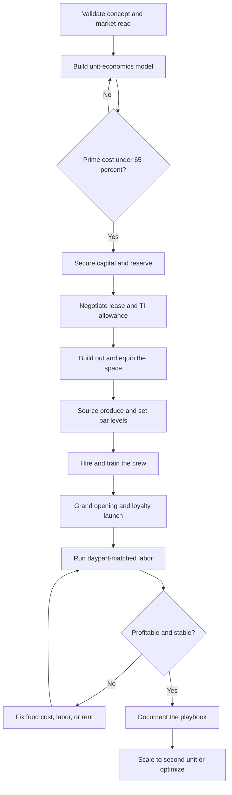

### Direct Answer

Starting a juice bar business in 2027 means opening a small-footprint quick-service food operation -- a cart, kiosk, grab-and-go counter, or full inline store -- that converts perishable produce and functional ingredients into cold-pressed juice, blended smoothies, acai and pitaya bowls, wellness shots, and the fast-growing category of functional beverages built on adaptogens, mushrooms, protein, collagen, and electrolytes. The model is real and durable but margin-thin and operationally unforgiving: it lives or dies on **prime cost** -- combined cost of goods plus labor as a percentage of sales -- which must be held under roughly 60-65% or the location bleeds on every transaction. Win in 2027 by treating produce yield, daypart labor, and lease economics as the actual business and the wellness aesthetic as marketing -- not the other way around.

**TL;DR:** A juice bar is a thin-margin retail food operation, not a passive wellness brand. A single location costs **$90K-$420K to build out and open**, runs a **12-22% net margin** when disciplined, and generates **$180K-$650K in Year 1 revenue** at 120-400 transactions a day. The three things that kill startups: signing the wrong lease (rent too high for the foot traffic), losing control of food cost and spoilage, and staffing flat against a spiky daypart curve. The 2027 wildcard is real -- GLP-1 weight-loss drugs (Ozempic, Wegovy, Mounjaro, Zepbound) measurably softened demand for calorie-dense smoothies and bowls while functional, low-sugar, protein-forward beverages grew -- so the winning 2027 menu skews functional, not sugar-bomb. Viable for a disciplined, prime-cost-obsessed, location-first operator; a poor fit for anyone who thinks "healthy" sells itself or wants a business without a 5 a.m. prep shift.

## 1. What A Juice Bar Business Actually Is In 2027

### 1.1 The Core Definition

A juice bar is a small-footprint quick-service food business whose entire product line is built around fresh produce and functional ingredients: cold-pressed and centrifugal juices, blended fruit-and-vegetable smoothies, acai and pitaya bowls, wellness shots, nut milks, and an expanding category of functional beverages -- adaptogen lattes, protein shakes, collagen drinks, electrolyte blends, and mushroom-based tonics. **You are running a retail operation that converts perishable raw material into a high-velocity, made-to-order consumable.** The business is far closer to running a coffee shop than to running a wellness brand, and the romantic version -- you love health, you make beautiful drinks, customers who care about their bodies find you -- is only the surface.

**The actual business underneath is a relentless exercise in three disciplines.** First, buying produce well and wasting almost none of it. Second, converting that produce into product with a labor model that matches a spiky daypart curve. Third, occupying a location whose rent the daily transaction count can actually carry. A founder who masters those three runs a profitable shop; one who masters none of them runs a beautiful one that loses money.

The distinction matters because the juice bar is the food business most likely to be entered for the wrong reason. Restaurants attract operators who love cooking; bakeries attract bakers; coffee shops attract people who genuinely love coffee. The juice bar disproportionately attracts the person who recently changed their own diet, felt great, and concluded that the experience is a business plan. It is not. The personal wellness journey is a customer insight, not an operating model, and the gap between "I love green juice" and "I can hold a 30% food cost across 250 transactions a day" is the entire distance a founder must travel. Treating that gap as real -- rather than assuming passion closes it -- is the single most important mental shift a 2027 entrant makes.

### 1.2 What Changed By 2027

The 2027 juice bar is shaped by realities that did not fully exist a decade ago. **Customers order ahead** through apps and expect a mobile pickup lane. **Delivery platforms** -- DoorDash, Uber Eats, Grubhub -- are both a revenue channel and a margin tax, with commissions of 15-30% that can turn a profitable drink into a break-even one. **The functional-beverage category exploded**, so a shop selling only sweet smoothies competes on a narrowing field. And **the GLP-1 medications** that spread rapidly through 2024-2026 measurably changed what sells: appetite suppression and a cultural shift toward protein and away from sugar softened demand for the 600-calorie smoothie while lifting low-sugar, high-protein, functional options.

| Era marker | Pre-2018 juice bar | 2027 juice bar |
|---|---|---|
| **Core product** | Sweet fruit smoothies | Functional, protein-forward, low-sugar |
| **Ordering** | Walk-in counter only | Mobile order-ahead baseline |
| **Delivery** | Rare | DoorDash / Uber Eats standard channel |
| **Demand driver** | "Healthy = fruit" | "Healthy = function + protein" |
| **Customer literacy** | Low label awareness | High; reads sugar and macros |
| **Competition** | Other juice bars | Coffee shops, grocery, packaged aisle |

### 1.3 The One Kind Of Founder It Rewards

The 2027 juice bar is not a lifestyle statement that happens to make money. It is a thin-margin retail food operation that rewards exactly one kind of founder: **the one who treats produce yield, prime cost, daypart labor, and lease economics as the actual business**, and the wellness aesthetic as the marketing. A founder who reverses that -- who chases the aesthetic and treats the spreadsheet as an afterthought -- is the one who signs the wrong lease, lets produce spoil, and quits within eighteen months.

## 2. The Menu Architecture: What You Actually Sell

### 2.1 The Product Categories And Their Cost Structure

The menu is the business, and a founder must understand every category's cost structure before designing it, because the mix you build determines your food cost for years.

| Category | Price band (16oz) | Food cost % | Role |
|---|---|---|---|
| **Cold-pressed juice** | $7-$14 | 28-40% | Flagship, carries brand |
| **Centrifugal / fresh juice** | $6-$11 | 26-36% | Faster service, lower equipment cost |
| **Blended smoothies** | $8-$15 | 25-35% | Volume workhorse, margin anchor |
| **Acai / pitaya bowls** | $11-$18 | 25-38% | High-ticket, photogenic |
| **Wellness shots** | $4-$8 | 18-30% | Impulse add-on, ticket lifter |
| **Functional beverages** | $7-$16 | 24-34% | Fastest-growing 2027 category |
| **Nut milks / add-ons** | $1-$5 | 10-25% | Pure margin lifters |

### 2.2 Why Each Category Earns Its Place

**Cold-pressed juice** is the hardest category to run profitably. A hydraulic or masticating press extracts juice from large volumes of raw produce; it takes **roughly two to three pounds of produce per 16oz bottle**, the food cost runs 28-40% of menu price, and the pulp is waste. It commands the highest price and carries the brand, but it is yield-sensitive and labor-heavy. **Blended smoothies** are the volume workhorse and the margin anchor: frozen fruit, a liquid base, add-ins, blended to order; food cost is more controllable because frozen inventory does not spoil. **Acai and pitaya bowls** are a high-ticket, Instagram-friendly category but labor-intensive to assemble, with topping cost that creeps. **Wellness shots** -- ginger, turmeric, wheatgrass, immunity blends -- are tiny, fast, high-margin impulse add-ons that lift average ticket with almost no incremental labor. **Functional beverages** -- adaptogen lattes, protein shakes, collagen drinks, electrolyte blends, mushroom tonics -- are the fastest-growing 2027 category, appealing directly to the GLP-1-era customer who wants protein and function over sugar.

### 2.3 The Menu As A Portfolio

A founder should think of the menu as a portfolio rather than a list of favorite drinks. **High-margin fast movers** (smoothies, shots, add-ons) carry the labor model. **A flagship** (cold-pressed) carries the brand. **High-ticket specialty** (bowls, functional beverages) lifts the average check. **Revenue-smoothers** (cleanses, subscriptions, B2B catering) soften the daypart and seasonal swings. The rookie mistake is a menu so broad -- forty-plus SKUs -- that prep, par levels, and waste all spiral. The disciplined 2027 menu is focused, functional-forward, and engineered.

## 3. The Three Formats: Cart, Inline Store, And Franchise

### 3.1 The Format Comparison

There are three fundamentally different ways to enter this business, and the choice drives everything from capital to risk.

| Dimension | Cart / kiosk | Inline store | Franchise |
|---|---|---|---|
| **Build-out cost** | $90K-$180K | $180K-$420K+ | $200K-$600K+ |
| **Rent burden** | Low (host traffic) | High (largest fixed cost) | High |
| **Daily transactions needed** | 80-200 | 150-400 | 150-400 |
| **Menu breadth** | Constrained | Full | System-defined |
| **Concept risk** | Low | High | Lowest |
| **Margin ceiling** | Moderate | High | Compressed by royalty |
| **Independence** | Full | Full | Runs someone's playbook |

### 3.2 The Cart, Kiosk, Or Grab-And-Go Counter

This is the lowest-capital entry: a small footprint inside a gym, office building, grocery store, college, or as a standalone mall kiosk, often with a limited menu and minimal seating. **Build-out runs $90K-$180K, the rent is lower, the labor model is leaner, and the risk of a catastrophic lease is smaller** -- but the ceiling is also lower, the menu is constrained by equipment and space, and the location is often dependent on a host's foot traffic. This is the disciplined way to test a market and a concept before committing to a full store.

### 3.3 The Inline Or Freestanding Store

This is the full version: a dedicated storefront with seating, a complete menu, a full equipment package, and a real lease. **Build-out runs $180K-$420K-plus** depending on market and condition; the rent is the largest fixed cost, and the operation needs 150-400 daily transactions to carry it. The revenue ceiling, the brand presence, and the ability to run the full functional menu are all higher.

### 3.4 The Franchise Route

Buying into an established system -- Tropical Smoothie Cafe, Smoothie King, Robeks, Clean Juice, Nekter, or Jamba -- trades independence and a franchise fee plus ongoing royalties (typically **5-7% of revenue plus a marketing fee**) for a proven menu, supply chain, brand recognition, training, and a build-out playbook. Total franchise investment commonly runs $200K-$600K-plus. The franchise reduces concept risk and shortens the learning curve, but the royalties permanently compress the margin. Many disciplined founders start with a cart or kiosk to learn the operation, then graduate to an inline store -- a path that parallels the one taken by coffee-cart operators (q2000) before they commit to a full coffee shop (q1930).

## 4. The 2027 Market Reality

### 4.1 The GLP-1 Effect Is Real And Must Be Designed Around

The rapid spread of weight-loss and appetite-suppression medications -- Ozempic and Wegovy from **Novo Nordisk (NVO)**, and Mounjaro and Zepbound from **Eli Lilly (LLY)** -- through 2024-2026 measurably softened demand for calorie-dense, sugar-forward products. The 500-700 calorie smoothie and the sugar-heavy bowl lost some of their core customer, who now eats less and prioritizes protein. **This is not the end of the category -- it is a forced repositioning.** The 2027 winners shifted their menu mix toward low-sugar, high-protein, functional, and savory-adjacent options, leaned into the GLP-1 customer who needs concentrated nutrition in smaller volumes, and stopped treating "healthy" as synonymous with "fruit sugar."

### 4.2 Functional Beverages Are The Growth Engine

Adaptogens, mushrooms, protein, collagen, electrolytes, nootropics -- the functional category grew rapidly because it serves the exact 2027 customer: someone who wants a beverage to *do something* (energy, recovery, focus, hydration, beauty) rather than just taste sweet. A 2027 juice bar without a real functional menu is competing on the shrinking half of the market.

### 4.3 The Competitive Field

| Tier | Players | What they bring |
|---|---|---|
| **National franchise** | Tropical Smoothie Cafe, Smoothie King, Jamba (Inspire Brands), Robeks, Nekter, Clean Juice | Brand, scale, supply chain |
| **Premium cold-pressed** | Pressed Juicery, Joe and the Juice | Refined product, wellness brand |
| **Category-adjacent** | Starbucks (SBUX), Dutch Bros (BROS), grocery juice bars | Convenience, footprint |
| **Packaged aisle** | PepsiCo (PEP), Coca-Cola (KO) functional brands | Always-available substitute |
| **Local independents** | Every market | Locality, differentiation |

The competition is layered, and the category-adjacent threat is often underestimated: **Starbucks (SBUX)** and **Dutch Bros (BROS)** adding functional drinks, grocery stores with in-house juice bars, and the entire packaged functional-beverage aisle stocked by **PepsiCo (PEP)** and **Coca-Cola (KO)** all let a customer get an adaptogen or protein drink without ever visiting a juice bar.

### 4.4 The Net Market Read

Demand is real and durable for a repositioned, functional-forward concept. The business is harder than it looks because of food cost and lease economics. The winning 2027 entrant competes on a differentiated functional menu, a disciplined operation, and a location that matches its rent to its traffic -- not on being one more sweet-smoothie shop.

It is worth being precise about what the 2027 market is and is not. It is *not* a fad in collapse -- the wellness-beverage category is structurally larger and more mainstream than it was a decade ago, and the GLP-1 shift, far from killing it, expanded the addressable customer by creating demand for concentrated, protein-forward, low-sugar nutrition. But it is also *not* the recession-proof goldmine that franchise marketing implies. The truth sits between: durable demand for the right concept, brutal economics for the wrong one. A founder who enters expecting the goldmine is unprepared for the food-cost grind; a founder who enters believing the fad narrative talks themselves out of a genuinely viable business. The accurate read is the one that treats 2027 demand as real, repositioned, and worth competing for -- and competes for it with operational discipline rather than wellness optimism.

## 5. The Core Unit Economics: Prime Cost And Produce Yield

### 5.1 Prime Cost Is The Master Gauge

This is the most important section in the guide, because the entire business lives or dies on two numbers beginners almost never run before signing a lease. The first is **prime cost** -- the sum of cost of goods sold and total labor, expressed as a percentage of sales.

| Prime cost band | Verdict |
|---|---|
| **55-60%** | Excellent; strong owner profit |
| **60-65%** | Healthy; sustainable |
| **65-70%** | Fragile; little room for error |
| **70%+** | Structurally unprofitable |

A healthy juice bar holds prime cost at roughly **58-65% of sales**, which leaves enough for rent, utilities, insurance, marketing, and owner profit. If prime cost runs 70%+, the location is structurally unprofitable no matter how busy it looks.

### 5.2 The Cost-Of-Goods Half

**Cost of goods is dominated by produce, and produce is expensive, perishable, and yield-variable.** Cold-pressed juice runs 28-40% food cost because of the brutal produce-to-juice conversion ratio -- roughly two to three pounds of raw produce per 16oz bottle, with the pulp as waste. Smoothies run a more controllable 25-35% because frozen fruit does not spoil. The blended menu food cost target is **28-33%**.

**Spoilage is the silent killer inside food cost.** Produce ordered and not used is pure loss, and a juice bar without tight par levels, a first-in-first-out system, prep-to-forecast discipline, and a waste log will quietly run 5-12% of produce straight into the compost. The reason spoilage is so dangerous is that it never appears as a line item -- it hides inside the food-cost percentage, so a founder sees a 38% food cost and assumes the menu is priced wrong when the real problem is that eight pounds of kale wilted in the walk-in over the weekend. The only defense is measurement: a physical waste log, weighed and dated, that converts an invisible leak into a visible number a founder can attack. Operators who weigh their waste for one month are almost always shocked, and almost always cut it in half within the next month simply because they finally saw it.

### 5.3 The Labor Half

**Labor is the other half of prime cost, and the juice bar's daypart curve makes it hard.** Demand spikes in the morning rush and the lunch window and collapses in the mid-afternoon, so the staffing model must flex with the curve. A common rookie error is a flat schedule that over-staffs the dead 2-4 p.m. window and under-staffs the 7-9 a.m. and 12-1 p.m. peaks. Labor target is roughly **25-32% of sales**.

### 5.4 The Pre-Lease Discipline

Before signing any lease, build the unit-economics model -- a realistic daily transaction count, an average ticket, a 28-33% food cost, a 25-32% labor cost, and the actual rent -- and confirm prime cost lands under 65% with rent under 12%. A founder who runs these numbers builds a location that compounds. This is the same numerical rigor a coffee-shop founder applies to break-even cup counts (q1131).

## 6. The Line-By-Line P&L

### 6.1 A Representative $400K Single Location

| P&L line | % of revenue | Dollars |
|---|---|---|
| Revenue | 100% | $400,000 |
| Cost of goods | 30% | $120,000 |
| Labor | 28% | $112,000 |
| **Prime cost** | **58%** | **$232,000** |
| Rent and occupancy | 10% | $40,000 |
| Utilities | 4% | $16,000 |
| Delivery commissions (net) | 5% | $20,000 |
| Marketing | 3% | $12,000 |
| Software and payments | 4% | $16,000 |
| Repairs and maintenance | 2% | $8,000 |
| Insurance, licenses, admin | 3% | $12,000 |
| **Net owner profit** | **~11-15%** | **$44K-$60K** |

### 6.2 Where The Money Goes

**Cost of goods** at 30% covers produce, frozen fruit, functional ingredients, cups, lids, straws, bags, and packaging -- itself a real and rising line. **Labor** at 28% flexes with the daypart and the season. **Rent and occupancy** at 10% is the single largest fixed cost, plus common-area maintenance and property-tax pass-throughs. **Delivery platform commissions** are a margin tax that must be modeled honestly: if 20% of revenue comes through DoorDash and Uber Eats at a 25% commission, that is 5% of total revenue gone. **Software and payments** -- POS, online ordering, loyalty, processing fees -- run 3-5%.

### 6.3 The Net Margin Spread

Net it all out and a disciplined independent juice bar runs a **12-22% net margin**; a franchise runs lower, often 8-15%, because the royalty comes off the top. The spread between a 20% net and a break-even location is driven almost entirely by three things: whether the lease was signed at a rent the traffic can carry, whether food cost and spoilage are controlled, and whether labor flexes with the daypart.

The instructive way to read the P&L is as a chain of percentages that each must hold, because the failure of any single one cascades. If food cost slips from 30% to 36%, prime cost crosses 64% and the net margin halves. If rent was signed at 15% instead of 10%, five points come straight out of the bottom line and a 17% net becomes a 12% net before anything else goes wrong. If delivery grows to 35% of revenue and the menu was never marked up for it, the commission tax doubles and quietly erases the marketing budget. None of these is dramatic on its own -- each looks like a small slippage -- but the P&L has no slack, and two or three small slippages together convert a healthy shop into a break-even one. The discipline is to watch every line as a percentage every month, because the business does not fail on one big mistake; it fails on the accumulation of unwatched small ones.

## 7. Location And Lease: The Single Largest Decision

### 7.1 The Location Math Is Traffic-First

The lease is the most consequential decision a juice bar founder makes, because rent is the largest fixed cost, it is locked in for years, and it cannot be renegotiated after the traffic disappoints. A juice bar needs a steady flow of the right people at the right times: the morning commuter, the pre- and post-workout customer, the lunch crowd, the wellness-oriented professional.

| Demand generator | Why it works | Watch-out |
|---|---|---|
| **Gyms and fitness studios** | Pre/post-workout traffic | Host controls hours |
| **Office concentrations** | Morning and lunch rush | Weekend collapse |
| **Colleges / universities** | High volume, young | Summer dead season |
| **Medical / hospital campuses** | Steady all-day flow | Higher rent |
| **Affluent residential** | Repeat regulars | Slower midday |
| **Transit nodes** | Commuter velocity | Grab-and-go only |

### 7.2 The Rent Must Fit The Model

Occupancy cost should land at roughly **8-12% of projected revenue**; above 15% the location is structurally fragile. The founder must build the transaction-count model before signing -- realistic daily transactions, average ticket, annual revenue -- and confirm the rent fits, rather than signing the lease and hoping the traffic materializes.

### 7.3 Lease Terms Matter As Much As Rent

The length, the renewal options, the escalation clauses, the **tenant-improvement allowance** the landlord contributes to build-out, the personal guarantee, the use and exclusivity clauses, the common-area charges -- all of it shapes the real cost and the real risk. A founder should negotiate the tenant-improvement allowance hard, because landlord contribution to build-out directly reduces the capital at risk. **Visibility, access, and parking** convert traffic into transactions -- a location with great traffic but no visibility, hard parking, or awkward access underperforms its count.

Two clauses deserve special attention because they are routinely under-negotiated. The first is the **personal guarantee**: most first-location landlords demand one, and it makes the founder personally liable for years of rent if the business fails. A founder should negotiate to cap it -- a "good guy" clause or a burn-down that reduces the guarantee as the lease ages -- because an uncapped personal guarantee turns a closed shop into years of personal debt. The second is the **escalation clause**: a rent that fits in Year 1 at 3% annual escalation will, by Year 5, consume a meaningfully larger slice of revenue if sales did not keep pace, so the founder must model the rent at its Year-5 level, not its Year-1 level. The lease is not one decision made once; it is a financial obligation that compounds, and the founder who reads it as such builds on solid ground while the one who skims it signs a contract they do not understand.

## 8. Build-Out And Equipment: The Capital Plan

### 8.1 The Equipment Package

| Equipment | Approximate cost | Notes |
|---|---|---|
| **Commercial cold-press juicer** | $4K-$22K+ | Goodnature commercial tier |
| **High-performance blenders (3-5)** | $1.5K-$5K | Vitamix, Blendtec commercial |
| **Refrigeration (reach-in, under-counter)** | $6K-$20K | Walk-in adds cost |
| **Freezers** | $3K-$8K | Frozen fruit, acai |
| **Produce prep stations** | $3K-$9K | Sinks, tables, washer |
| **POS and online ordering** | $2K-$6K | Plus monthly fees |
| **Smallwares** | $3K-$8K | Containers, scales, knives |

### 8.2 Build-Out And Construction

Build-out -- plumbing for the prep sinks and the press, electrical for the refrigeration and blender load, the service counter, flooring, finishes, signage, seating, and the menu boards -- is the other large bucket, and it varies enormously with the condition of the space. **A former food-service space with existing plumbing and a hood is far cheaper than a raw shell.** Permits, licenses, and professional fees -- health department, building permits, the food-service license, a design fee -- are real and must be budgeted.

### 8.3 The Capital Totals And The Reserve

| Format | All-in capital | Recommended reserve |
|---|---|---|
| **Cart / kiosk** | $90K-$180K | 3-4 months fixed costs |
| **Inline store** | $180K-$420K+ | 4-6 months fixed costs |
| **Franchise** | $200K-$600K+ | Per franchisor guidance |

The sequencing discipline: negotiate the tenant-improvement allowance to offset build-out, buy production equipment to commercial-grade durability, do not over-build seating at the expense of the working reserve, and hold a genuine **operating reserve** that funds the slow ramp. Under-capitalization is a top killer.

## 9. Produce Sourcing And Supply Chain

### 9.1 The Sourcing Channels

| Channel | Strength | Weakness |
|---|---|---|
| **Broadline foodservice distributors** | Consistency, terms, delivery | Less freshness story |
| **Local farms / farmers markets** | Freshness, marketing angle | Inconsistent, more labor |
| **Restaurant-supply / wholesale clubs** | Gap-filling, price | No delivery |
| **Frozen fruit suppliers** | No spoilage, stable cost | Quality varies |
| **Functional-ingredient suppliers** | Enables 2027 menu | Specialized, pricier |

### 9.2 The Disciplines That Control The Produce Line

**Buying to a forecast** rather than a habit, so orders track expected demand. **Tight par levels** that keep just enough fresh produce on hand. **First-in-first-out rotation** so older produce is used first. **Yield tracking** so the founder knows the real produce-to-juice ratio and can spot a slipping supplier or a wasteful prep cook. **A waste log** that makes spoilage visible instead of invisible.

### 9.3 Seasonality, Volatility, And Vendor Relationships

Produce prices swing with weather, season, and supply shocks, and a founder needs **menu flexibility** (seasonal specials, the ability to sub ingredients) and **pricing discipline** to absorb it. Vendor relationships -- reliable delivery, consistent quality, fair pricing, and a backup supplier so a single vendor's failure does not close the juice line -- are an operational asset built over time. A juice bar's food cost is not a fixed fact; it is the output of sourcing decisions, par-level discipline, yield management, and waste control.

## 10. Daypart Demand And The Labor Model

### 10.1 The Daypart Curve

| Daypart | Demand level | Staffing |
|---|---|---|
| **Open / 7-9 a.m.** | Peak (commuters, post-workout) | Heavy |
| **Mid-morning / 9-11 a.m.** | Moderate | Standard |
| **Lunch / 12-1 p.m.** | Peak | Heavy |
| **Afternoon / 2-4 p.m.** | Trough | Skeleton crew |
| **Post-work / 5-6 p.m.** | Small bump | Standard |
| **Weekend** | Later, flatter | Adjusted |

### 10.2 The Labor Model Must Match The Curve

The rookie error is a comfortable flat schedule -- the same three people from open to close -- which over-pays the empty afternoon and under-serves the peak, costing both margin and the rush-hour customers who will not wait in a long line. **The labor model must flex:** heavier staffing on the peaks, a lean skeleton crew through the trough, and a schedule built from an honest read of the location's own transaction-by-hour data once it exists.

### 10.3 The Roles And Prep Labor

The roles are hourly team members who prep, build drinks, and run the counter; a shift lead or assistant manager who opens or closes and runs the floor; and the owner-operator who, in Year 1, is typically working the business. **Prep labor is its own consideration** -- the early-morning produce washing, cutting, juicing, and par-stocking that happens before the doors open is real labor that must be in the model. A common error is to budget only the customer-facing hours and forget that a single inline store may need one to two hours of prep labor before opening and a comparable closing-and-cleaning block after, and that the cold-press cycle itself -- washing, feeding, bottling, labeling -- is slow and labor-dense. Founders who model labor only against open hours discover their real labor cost is three to five points higher than projected.

Training drives speed and consistency: a juice bar's service is a timed performance, and a well-trained crew builds drinks faster, wastes less, and upsells the add-ons that lift the ticket. The difference between a crew that builds a smoothie in ninety seconds and one that takes three minutes is the difference between clearing the morning rush and losing the back half of the line to the door. Training is therefore not an HR nicety; it is a direct lever on both labor cost and revenue capture, and the operators who treat it as core operations rather than onboarding paperwork run measurably tighter shifts.

## 11. Menu Engineering And Pricing Strategy

### 11.1 Per-Item Pricing Anchored To Food Cost

Each menu item should be priced so its food cost lands in the target band -- roughly 28-33% blended -- which means a $10 smoothie carries about $3 of ingredients. A cold-pressed juice priced at $9 with 35% food cost is working harder than one priced at $9 with 45%.

### 11.2 The Levers That Lift The Ticket

| Lever | Mechanism | Margin effect |
|---|---|---|
| **Add-ons** (protein, MCT, collagen) | Suggestive sell every order | Nearly pure margin |
| **Bundles / combos** | Juice + bowl, smoothie + shot | Lifts average check |
| **Cleanses** | Multi-day packages ($50-$350) | Pre-sells inventory |
| **Subscriptions** | Recurring boxes | Smooths cash flow |
| **Delivery markup** | Platform menu priced up | Absorbs commission |

### 11.3 SKU Restraint And Price Increases

**The menu must not be too broad** -- every additional SKU adds prep complexity, more produce to par-stock and potentially waste, and slower service. **Price increases must be managed** -- produce inflation is real, and a founder who never raises prices watches food cost climb until the margin is gone. A juice bar's average ticket and food-cost percentage are engineered outcomes, not given facts.

## 12. Marketing, Loyalty, And Customer Acquisition

### 12.1 The Retention Engine

A juice bar lives on repeat local customers, and the marketing model must build a base of regulars rather than chase one-time traffic. **The grand opening** seeds the initial customer base and the early reviews that drive discovery. **Local digital presence** is baseline: a Google Business Profile that converts "juice bar near me" searches, an active social presence, and review-platform management. **The loyalty program** is the single most important retention tool -- a points or rewards program that turns an occasional customer into a twice-a-week regular.

### 12.2 The B2B And Partnership Channels

**Corporate and B2B catering** is a high-value channel -- office wellness programs, corporate catering orders, gym partnerships, and bulk subscription deals smooth the revenue curve and lift average order size well above the walk-in ticket. **Partnerships with demand generators** -- the gym next door, the yoga studio, the office building, the medical campus -- convert adjacent foot traffic into customers. The same partnership logic drives a catering business (q1980) and a fitness studio's ancillary revenue (q1933).

### 12.3 The Product Is Marketing

A beautiful bowl or a vivid juice is photographed and shared by the customer, and a category this visual should make that easy. Sampling and community presence -- farmers markets, local events, fitness expos -- build awareness in the wellness community. Delivery platforms are an acquisition channel as well as a margin cost; they expose the shop to customers who then convert to direct, higher-margin orders.

The strategic point is that paid acquisition plays only a modest role in a juice bar's marketing model. The economics do not support buying a $6 customer for an $11 ticket when that customer may never return; the model works when the customer comes back twice a week for a year. So the marketing spend concentrates where retention is manufactured: a loyalty program that captures the regular, a B2B catering channel that smooths revenue, partnerships with the gyms and offices that surround the shop, and a product photogenic enough that customers do the awareness work for free. The operator who builds that retention engine has a defensible transaction base; the one who relies on walk-by traffic and paid ads alone is exposed to every new competitor and every slow season, because they never converted a stranger into a regular.

## 13. Seasonality And Revenue Smoothing

### 13.1 The Seasonal Curve

| Period | Demand | Note |
|---|---|---|
| **January** | Strong | Wellness-resolution surge |
| **Late winter** | Soft | Post-resolution slump |
| **Spring / summer** | Peak | Smoothie and cold-beverage demand |
| **Fall** | Moderate | Tapering |
| **Holidays** | Variable | Location-dependent |

### 13.2 The Revenue-Smoothing Tools

**Functional and warm beverages** -- adaptogen lattes, warm tonics, protein drinks -- extend demand into the colder months. **Cleanses and subscriptions** pre-sell inventory and create recurring revenue independent of daily walk-in weather. **Corporate B2B catering** runs on the business calendar, not the weather. **Seasonal menu rotation** keeps the offering fresh.

### 13.3 The Cash Discipline

A founder treats the strong season as the period that must partly fund the slow one, holding a reserve rather than spending every peak-season dollar. A juice bar that sells only frozen smoothies to walk-in traffic is maximally exposed to the seasonal swing; one that runs a functional menu, a cleanse-and-subscription layer, a B2B catering channel, and a disciplined reserve has smoothed the curve into something the fixed costs can carry year-round.

The cash trap is specific and predictable: a founder has a strong June, sees money in the account, and treats it as profit -- buys equipment, takes a distribution, expands the menu -- and then arrives at February with the same fixed costs and half the revenue. The discipline is to run a thirteen-week rolling cash forecast that looks ahead through the next slow stretch, so that peak-season cash is consciously earmarked against the trough rather than felt as surplus. A founder who manages cash on a thirteen-week horizon survives the first February; one who manages it on a bank-balance basis is perpetually surprised by a slow season that arrives on the same calendar every single year.

## 14. Food Safety, Compliance, And Licensing

### 14.1 Licensing And Permits

| Requirement | Purpose |
|---|---|
| **Business license** | Legal operation |
| **Food-service / retail-food permit** | Health department authorization |
| **Food-handler / manager certification** | Staff qualification |
| **Sales-tax registration** | Tax remittance |
| **Building / signage permits** | Build-out compliance |
| **Cold-pressed labeling compliance** | FDA / local for bottled juice |

### 14.2 Food Safety Is Operational

Proper produce washing, safe handling and storage temperatures, refrigeration discipline, cross-contamination control, allergen awareness (nut milks, common allergens in add-ins), and clean equipment. **Cold-pressed juice has specific considerations** -- unpasteurized fresh juice carries food-safety rules around handling, labeling, shelf life, and in some cases warning requirements, and a founder selling bottled cold-pressed juice for off-premise consumption must understand the relevant FDA and local rules.

### 14.3 Inspections And Insurance

Health inspections are ongoing, and a poor inspection is both a compliance problem and a public reputation problem in an era of published scores. **Insurance** -- general liability, product liability, property, workers' compensation -- protects against the real risks of a food operation. A founder treats food safety and compliance as a built-in operating system -- certified staff, documented procedures, temperature logs, clean-equipment routines -- not as a box checked once at opening.

## 15. Technology: POS, Online Ordering, And Operations

### 15.1 The Core Stack

| Layer | Function |
|---|---|
| **POS** | Transactions, menu, modifiers, sales data |
| **Online / mobile ordering** | Order-ahead, pickup lane |
| **Delivery integration** | DoorDash, Uber Eats, Grubhub |
| **Loyalty / CRM** | Repeat-base capture, marketing |
| **Inventory / food-cost software** | Usage tracking, theoretical vs actual |
| **Labor scheduling** | Curve-matched scheduling |

### 15.2 Why The Stack Is The Instrument Panel

The data the stack produces is the operating advantage: transaction-by-hour data drives the labor schedule, item-level sales data drives menu engineering, food-cost data drives purchasing, and loyalty data drives marketing. **The discipline: adopt an integrated stack early** -- POS, online ordering, loyalty, inventory, and scheduling that talk to each other -- rather than bolting on disconnected tools later.

### 15.3 The Cost Of Flying Blind

The operators who run a tight digital operation see their numbers clearly and adjust fast; the ones running off a basic register and a memory are flying blind on the exact metrics -- prime cost, daypart, food cost, item margin -- that determine whether the location survives.

## 16. Staffing, Hiring, And Building A Team

### 16.1 The Year-1 Reality And Core Hires

The owner-operator is in the business -- doing prep, covering shifts, building drinks, managing the schedule. The core hires are the hourly team members who prep produce, build drinks, run the counter, and handle the rush, and a **shift lead or assistant manager** who can open and close without the owner present.

### 16.2 Hire For The Work, Not The Vibe

Hiring for a quick-service food role prioritizes reliability, speed, a genuine customer-service disposition, and the willingness to do the unglamorous prep and cleaning work. The wellness-brand romance attracts applicants who want the aesthetic but not the 5 a.m. produce-washing reality, and a founder must **hire for the work, not the vibe.**

### 16.3 Training And Retention

A trained crew builds drinks faster, portions consistently (which controls food cost), wastes less, and upsells the add-ons. **Retention matters** because turnover in food service is high and expensive -- every departure costs recruiting time, retraining hours, and a stretch of slower, less consistent service while the replacement ramps. The operators who keep their best people pay a fair wage, build a predictable schedule, and treat the crew as the asset they are; the ones who treat hourly staff as interchangeable spend the savings, and more, on perpetual churn.

As the operation grows, the hiring sequence adds a store manager who runs the location so the owner can step back, and eventually a multi-unit layer. The single most important hire in the trajectory is that first store manager: until that person exists, the founder is the operation's single point of failure -- the business cannot run a day without them, cannot scale, and cannot be sold. The store manager is the hire that converts a job the founder owns into a business the founder owns, and a founder should hire and train that person before, not after, the second location is signed.

## 17. The Year-One Operating Reality

### 17.1 Build Mode, Not Profit Mode

Year 1 is operation-building and customer-base-building mode, not profit-extraction mode. **A new juice bar does not open to a line; it builds a customer base over months** as the neighborhood discovers it, the loyalty program accumulates regulars, the reviews build, and the B2B relationships form.

### 17.2 The Founder Is In The Business

The founder is genuinely in the business: the 5 a.m. produce prep, the morning rush, the schedule, the vendor calls, the health inspection, the broken blender, the slow Tuesday afternoon. A disciplined Year-1 single location, opened with a real reserve, can realistically generate **$180,000-$650,000 in revenue** depending on format and market.

### 17.3 The First Slow Season Is The Test

A founder who built a reserve and a revenue-smoothing menu carries it; one who spent every peak-season dollar struggles. Year 1 is also when the founder discovers whether the lease was right -- a location that cannot generate the modeled transaction count shows up immediately as a rent line the revenue cannot carry.

## 18. The Five-Year Revenue Trajectory

### 18.1 The Year-By-Year Arc

| Year | Configuration | Revenue | Owner profit |
|---|---|---|---|
| **Year 1** | Single unit, slow ramp | $180K-$650K | Modest to thin |
| **Year 2** | Single unit matured | $300K-$700K | $40K-$120K |
| **Year 3** | 2-3 units | $600K-$1.4M | $90K-$240K |
| **Year 4-5** | 2-5 units or franchise | $1.2M-$3M+ | Function of unit count |

### 18.2 What The Trajectory Assumes

These numbers assume the disciplined version throughout -- leases that fit, food cost controlled, labor flexed to the curve, a functional-forward menu, a revenue-smoothing layer, and a real reserve. **They do not assume hockey-stick growth, because a juice bar scales one location at a time**, each one a real build-out and a real lease and a real ramp.

### 18.3 A Real Business, Not An Annuity

A mature juice bar business is a genuine small retail operation -- a good outcome, earned through years of operational discipline, not a passive wellness annuity. The path forks at Year 4-5: a tight profitable independent, a larger local chain, or multiple franchise units within a system.

## 19. Five Named Real-World Operating Scenarios

### 19.1 Priya -- The Disciplined Kiosk-To-Store Operator

Priya opens a $150K kiosk inside a large gym, runs a tight focused menu, learns her real food cost and daypart curve for eighteen months, builds a loyalty base and a couple of corporate catering accounts, then uses what she learned to open a well-located $280K inline store with a lease she modeled carefully. By Year 3 she runs two profitable units at a **19% net margin** because she learned the operation before she scaled it.

### 19.2 Marcus -- The Too-Much-Rent Cautionary Tale

Marcus signs a beautiful, high-visibility inline lease in a trendy district at a rent that would require 350 transactions a day, opens to a slow ramp that tops out at 180, and the rent line -- which he never stress-tested -- eats the business. He is cash-strapped within a year and closes: **the classic too-much-rent failure.**

### 19.3 Dani -- The Functional-Forward Repositioner

Dani reads the GLP-1 shift correctly, builds a menu heavy on protein drinks, adaptogen beverages, low-sugar functional options, and savory-adjacent food attach. Her average ticket and her cold-month revenue both run above the smoothie-only competition, and her single location does **$560K at a strong margin.**

### 19.4 The Okafor Family -- The B2B-And-Subscription Smoothers

The Okafors build a single location but pour energy into corporate wellness catering, office-building partnerships, and a cleanse-and-subscription program, smoothing the seasonal and daypart curves with recurring revenue. Their revenue is steadier than any walk-in-only shop and funds a calm expansion to a second unit.

### 19.5 Trevor -- The Food-Cost Casualty

Trevor opens with a sprawling forty-item menu, no par-level discipline, no waste log, and a flat staffing schedule. His produce spoilage runs into double digits, his food cost sits at 41%, his labor drifts to 34%, his prime cost is 75%, and despite a respectable transaction count the location never makes money -- **the canonical prime-cost wipeout.** The painful part of Trevor's story is that his shop is busy: the line is real, the reviews are good, the neighborhood loves the concept. He concludes that he simply needs more volume, runs a discount promotion to drive traffic, and accelerates the loss, because every additional transaction at a 75% prime cost loses money faster. Trevor's lesson is the hardest one in the business: a busy juice bar with broken unit economics does not grow its way to profit; it grows its way to a bigger loss, and the only fix is to attack prime cost directly -- prune the menu, install par levels and a waste log, and re-cut the schedule -- before chasing one more customer.

## 20. Risk Management And Failure Modes

### 20.1 The Risk-And-Mitigation Map

| Risk | Mitigation |
|---|---|
| **Lease / location** | Model traffic conservatively; occupancy under 12% |
| **Food cost / spoilage** | Forecast buying, par levels, FIFO, waste log |
| **Labor cost** | Schedule flexed to the daypart curve |
| **Produce price volatility** | Menu flexibility, backup suppliers, price increases |
| **GLP-1 demand shift** | Functional, low-sugar, protein-inclusive menu |
| **Delivery margin** | Mark up platform pricing to absorb commission |
| **Seasonality** | Warm beverages, subscriptions, B2B, reserve |
| **Equipment failure** | Commercial-grade gear, service relationship, backup |
| **Under-capitalization** | Open with a genuine operating reserve |

### 20.2 The Throughline

Every major risk in the juice bar business has a known mitigation built from modeling, operational discipline, menu strategy, and reserve. **The operators who fail are usually the ones who signed too much rent, never measured their food cost, staffed flat, ignored the GLP-1 shift, or opened with no cushion** -- every one of which was visible in advance.

### 20.3 The Competitive Moat

You generally cannot out-scale the franchise chains or out-brand the premium players, so you win by being the most differentiated, most operationally disciplined, most community-connected operator in your specific location. The moat is not the product itself -- anyone can buy a blender and a press -- it is the location, the loyal repeat base, the differentiated functional menu, the B2B relationships, and the prime-cost discipline.

## 21. Financing, Taxes, And Business Structure

### 21.1 Financing The Launch

| Source | Best for |
|---|---|
| **Owner equity / savings** | Core capital, lender-expected skin in game |
| **SBA 7(a) and 504 loans** | Build-out, equipment, working capital |
| **Equipment financing / leasing** | Press, blenders, refrigeration |
| **Tenant-improvement allowance** | Landlord-funded build-out offset |
| **Conventional loans / lines of credit** | Working-capital gaps |
| **Reinvested cash flow** | Expansion past the first profitable unit |

It is reasonable to finance the equipment and use the tenant-improvement allowance, because they spread cost against earning assets, but **the founder must still hold real cash for the operating reserve**, because no lender funds a slow ramp.

### 21.2 Entity And Tax Structure

Most juice bar operators form an **LLC or an S-corp** for liability protection and tax flexibility -- the entity holds the lease, the vendor accounts, the licenses, and the insurance. **Sales tax** on prepared food and beverages applies in most jurisdictions and the rules vary. **Depreciation** of the equipment and the build-out materially shapes taxable income in the heavy-capex opening year.

### 21.3 The Bookkeeping Discipline

Separate business banking from day one, a bookkeeping system that tracks food cost and labor as the prime-cost drivers they are, monthly attention to the P&L, quarterly attention to sales tax and estimated taxes, and an accountant who understands food-service businesses. Skipping this converts a manageable compliance function into a year-end crisis.

The reason bookkeeping is operational rather than administrative in this business is that prime cost is a *monthly* number a founder must see in time to act on. A juice bar that closes its books once a year learns in March that the prior year's food cost was 39% -- far too late to do anything about a problem that was visible every week. A juice bar that closes its books monthly catches a slipping food cost in the month it slips, traces it to a vendor price increase or a spoilage spike or a portioning drift, and fixes it before it compounds. The accountant's value is not the tax return; it is the monthly P&L delivered fast enough to be a steering instrument. Sales tax compounds the same way -- a small remittance error repeated for twelve months becomes a real liability -- which is why quarterly attention to it is non-negotiable.

## 22. Niche Paths And Scaling Past The First Location

### 22.1 The Specialty Paths

The **functional-beverage specialist** serves the GLP-1-era customer directly. The **cold-pressed and cleanse brand** is product-and-brand-driven, often with a wholesale and grocery angle. The **grab-and-go and B2B model** trades retail-destination experience for lower rent and a smoother revenue curve. The **juice-bar-plus-food model** lifts the average ticket. The **mobile or event model** is a lower-fixed-cost entry. The **gym or studio partnership model** shares the host's traffic. The mistake is not choosing an angle; it is being one more undifferentiated sweet-smoothie shop.

### 22.2 The Prerequisites For Scaling

The first location must be **genuinely profitable and stable** -- not just busy. The operation must be **documented into a playbook** -- the menu, recipes, portioning, prep procedures, par levels, labor model, vendor relationships. And there must be a **management layer** so the founder's attention is free for the second unit. Scaling on top of a unit that does not actually make money just multiplies the loss -- the same lesson that governs multi-unit retail growth generally (vq_dmmg01).

### 22.3 The Scaling Levers

Open the second unit in a similar trade area so the playbook transfers, build the manager bench, leverage purchasing scale, centralize what should be centralized (purchasing, marketing, back office) while keeping the daily operation local, and fund expansion from reinvested cash flow rather than over-leveraging.

## 23. Exit Strategies And The Long-Term Picture

### 23.1 The Exit Paths

| Exit path | Buyer / mechanism |
|---|---|
| **Sell the operating business** | Multiple of stabilized earnings |
| **Sell a multi-unit operation** | Regional operator, PE platform |
| **Franchise the concept** | Shift from operating to licensing |
| **Sell as a franchise unit** | Approved buyer within system |
| **Sell the assets** | Equipment and leasehold value |
| **Transition to partner / key employee** | Internal succession |

### 23.2 What Drives Valuation

Valuations run as a multiple of stabilized earnings, with the multiple driven by profitability, lease quality, how systematized and owner-independent the operation is, and the strength of the brand and the repeat base. **A small profitable chain is worth more than the sum of its units** because it demonstrates a repeatable system.

### 23.3 The Honest Long-Term Picture

A juice bar is a real, durable food-retail business -- the wellness and functional-beverage demand is structurally healthy for a repositioned concept -- but it is a business, not a passive holding. A founder should think of a 2027 launch as building a tangible operating small business with multiple genuine exit paths, which makes it a more exit-flexible venture than many small businesses, provided the operation was built profitable, documented, and owner-independent enough to hand off.

## 24. Counter-Case: When A Juice Bar Is The Wrong Move In 2027

### 24.1 The Honest Argument Against Starting

Not every aspiring food-business owner should open a juice bar, and the honest counter-case deserves its own section. **The capital is real and largely sunk.** A $90K-$420K build-out is concentrated in leasehold improvements and equipment whose resale value is a fraction of cost; if the concept fails, most of that capital does not come back. **The margin is thin and the labor is unglamorous.** A 12-22% net margin leaves little cushion for a mistake, and the 5 a.m. prep shift, the perishable inventory, and the daypart rush are permanent features, not Year-1 hazing.

### 24.2 Who Should Choose A Different Model

| If the founder... | A better fit might be... |
|---|---|
| Wants lower fixed cost and mobility | A food truck (q1929) or coffee cart (q2000) |
| Prefers prep-driven, less retail-facing work | A meal prep service (q1981) |
| Wants production without a storefront | A ghost kitchen (q2002) |
| Loves baking over beverage prep | A bakery business (q1940) |
| Wants event-driven, not daily-rush, revenue | A catering business (q1980) |
| Is drawn to fermentation and wholesale | A kombucha business (q2005) |

### 24.3 When The Counter-Case Does Not Apply

The counter-case dissolves for one specific founder: the one with the capital and the reserve, the willingness to run a 5 a.m.-prep food operation, the discipline to build the unit-economics model before signing a lease, and an accurate read of the 2027 functional-and-GLP-1 market. For that founder, a juice bar is a legitimate path to a $300K-$1.4M-plus small retail business. **The counter-case is not "never do this" -- it is "do not do this casually, under-capitalized, or as a substitute for a passive wellness brand."**

There is also a timing dimension to the counter-case. A founder who has the temperament but not yet the capital should not stretch -- borrowing to the limit to open an under-reserved inline store is the fastest route into the failure modes this guide describes. The disciplined move for that founder is to start with a cart or kiosk, learn the operation on a smaller capital base, build the reserve from real cash flow, and graduate to the inline store with both the experience and the cushion. The juice bar rewards patience: the operators who win are rarely the ones who moved fastest, and almost always the ones who entered at the format their capital and their reserve could genuinely carry.

## 25. The Juice Bar Workflow

## 26. Decision Framework: Should You Start This In 2027

### 26.1 The Six-Gate Self-Assessment

| Gate | Pass condition |
|---|---|
| **Capital** | $90K-$420K plus a genuine operating reserve |
| **Numbers discipline** | Will build the prime-cost model before signing |
| **Operational temperament** | Willing to run a 5 a.m.-prep QSR operation |
| **Market read** | Has internalized the GLP-1 and functional shift |
| **Location access** | A real location at a rent the traffic can carry |
| **Cost-control discipline** | Will run par levels, waste log, curve-matched labor |

### 26.2 Reading The Result

If a founder answers yes across all six gates, a juice bar in 2027 is a legitimate and achievable path to a $300K-$1.4M-plus small retail business with a real owner profit. **If they answer no on capital or numbers discipline, they should not start.** If they answer no on operational temperament specifically, an adjacent, less hands-on food or wellness business may fit better.

### 26.3 The Framework's Purpose

The framework's purpose is to convert an attraction to the wellness aesthetic of the business into an honest, structured decision about the thin-margin food-retail operation underneath. The founders who succeed treat the failure-mode list -- wrong lease, lost food cost, flat staffing, too-broad menu, ignored GLP-1 shift, under-capitalization -- as a pre-launch checklist, and the ones who fail almost always made three or four of those mistakes at once.

## 27. The 2027-2030 Outlook

### 27.1 Where The Model Is Heading

The functional-beverage category will keep growing, the GLP-1 customer will keep prioritizing protein and lower sugar, and mobile ordering and delivery will remain baseline. **The successful 2027-2030 juice bar leans further into function and further away from sugar**, treats delivery as one managed channel, and builds a defensible local moat through loyalty and B2B relationships. The casualties will keep being the same: too much rent, uncontrolled food cost, flat labor, and no reserve.

### 27.2 Related Reading

For founders weighing adjacent models, the most relevant siblings are the food truck (q1929), the coffee shop (q1930), the fitness studio (q1933), the bakery (q1940), the catering business (q1980), and the kombucha business (q2005). Each shares the juice bar's core tension -- thin margins, perishable inventory, and a location or channel decision that drives everything.

## 28. Sources

1. US Small Business Administration -- SBA 7(a) and 504 loan program guidance.
2. US Food and Drug Administration -- Juice HACCP and unpasteurized juice labeling rules.
3. National Restaurant Association -- Restaurant industry operations and prime-cost benchmarks.
4. US Bureau of Labor Statistics -- Food-service wage and employment data.
5. US Bureau of Labor Statistics -- Consumer Price Index, fresh produce components.
6. IBISWorld -- Juice and Smoothie Bars in the US industry report.
7. Technomic -- Beverage and functional-drink category tracking.
8. Mintel -- Functional beverage and wellness consumer trend reports.
9. Novo Nordisk -- Investor disclosures on Ozempic and Wegovy (NVO).
10. Eli Lilly -- Investor disclosures on Mounjaro and Zepbound (LLY).
11. Morgan Stanley Research -- GLP-1 impact on food and beverage demand.
12. JPMorgan Research -- Consumer spending and GLP-1 dietary-shift analysis.
13. Tropical Smoothie Cafe -- Franchise Disclosure Document.
14. Smoothie King -- Franchise Disclosure Document.
15. Clean Juice -- Franchise Disclosure Document.
16. Nekter Juice Bar -- Franchise Disclosure Document.
17. Robeks -- Franchise Disclosure Document.
18. Jamba (Inspire Brands) -- Franchise system overview.
19. International Franchise Association -- Franchise economic outlook.
20. DoorDash -- Merchant commission and pricing structure documentation.
21. Uber Eats -- Restaurant partner fee and commission documentation.
22. Goodnature -- Commercial cold-press equipment specifications.
23. Vitamix Commercial -- Commercial blender specifications.
24. ServSafe / National Restaurant Association -- Food-handler and manager certification.
25. US FDA Food Code -- Retail food establishment requirements.
26. Internal Revenue Service -- Section 179 expensing and depreciation guidance.
27. SCORE -- Small business mentoring and food-service startup resources.
28. Restaurant Business Magazine -- Quick-service and beverage operations coverage.
29. Nation's Restaurant News -- Smoothie and juice chain unit-count reporting.
30. QSR Magazine -- Quick-service operations and daypart analysis.
31. Specialty Food Association -- Functional ingredient and wellness category trends.
32. Starbucks -- Investor disclosures on functional and cold-beverage expansion (SBUX).
33. Dutch Bros -- Investor disclosures on beverage menu strategy (BROS).
34. PepsiCo and Coca-Cola -- Investor disclosures on functional-beverage portfolios (PEP, KO).
35. US Census Bureau -- Retail food and beverage establishment data.
