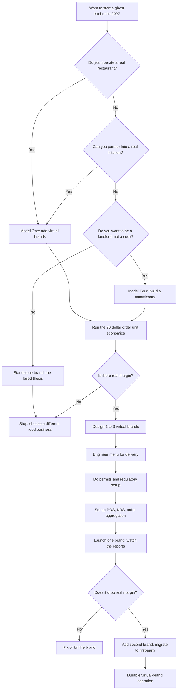

### Direct Answer

To start a ghost kitchen business in 2027, you run one or more delivery-only food brands out of a commercial kitchen with no dining room, no servers, and no walk-in trade -- every order arrives through DoorDash, Uber Eats, Grubhub, or your own first-party channel, and a driver carries it out. The model is real but profoundly humbled: the 2020-2022 boom collapsed, and what survives is narrow -- either an existing restaurant adding one to three virtual brands off its already-paid-for line, or a commissary operator renting build-out stations like a landlord. Treat the ghost kitchen as a low-fixed-cost margin add-on to a real food operation, never as a standalone tech or real-estate play, because the standalone delivery-only brand is the exact thesis the industry already, expensively, proved false.

**TL;DR:** A ghost kitchen is a cost structure, not a business. The viable 2027 configurations are **(1)** an existing restaurant bolting virtual brands onto its line at near-zero marginal fixed cost, and **(2)** a commissary landlord renting stations for $1,500-$5,000 each per month. A disciplined single-brand operator does **$100K-$400K** in Year-1 revenue at a **5-15% net margin** after the 25-30% delivery commission; a multi-brand or commissary operator can reach **$400K-$1.5M+** by Year 2 on structurally thin margin. The three killers are launching a standalone virtual brand cold, underestimating the 25-30% marketplace tax that also owns the customer, and treating "ghost kitchen" as real estate instead of food people actively choose. Build model one or model two, run the unit economics before anything else, engineer food that survives transit, and migrate customers to first-party ordering relentlessly.

## What A Ghost Kitchen Business Actually Is In 2027

### 1.1 The Core Definition

A ghost kitchen -- also called a dark kitchen, cloud kitchen, virtual kitchen, or delivery-only kitchen -- is a food production operation with no dining room, no counter, no servers, and no walk-in trade. It exists to make food that leaves the building in a delivery bag. The customer never sees the kitchen, never meets a staff member, and in most cases does not know where the food was cooked; they tapped a brand name inside an app, paid, and a driver showed up.

**The defining economic fact** of 2027 is that the ghost kitchen is not a destination and not a brand by default -- it is a cost structure, a way to make food cheaply by stripping out the most expensive parts of a restaurant: the real estate footprint, the front-of-house labor, the ambiance. And that is exactly the trap. A founder who eliminates the dining room has also eliminated the walk-in discovery, the regulars, and the face-to-face relationship that used to generate demand for free.

### 1.2 The Physical Forms It Takes

The "business" can take several physical shapes, each with a different cost structure:

| Physical form | What it is | Typical startup cost | Risk profile |
|---|---|---|---|
| **Existing restaurant line** | Virtual brands run off a kitchen you already operate | $3K-$20K | Lowest -- fixed costs already absorbed |
| **Commissary station** | A built-out station rented inside a shared facility | $30K-$120K | Moderate -- you carry station rent |
| **Converted second-gen space** | A closed restaurant's kitchen run delivery-only | $80K-$350K | High -- full rent, no discovery |
| **Ground-up build** | A warehouse built out into kitchen pods | $100K-$600K+ | Highest -- standalone fixed cost |
| **Multi-station commissary** | A facility you build to rent to other brands | $250K-$2M+ | Real-estate-scale, occupancy-dependent |

The single most important framing for 2027: a ghost kitchen is a tool for making food without a dining room, and whether it is a viable *business* depends entirely on whether you already have demand and fixed costs to absorb, or whether you are starting cold and hoping the apps conjure customers from nothing. They will not. Founders comparing this to other mobile and low-overhead food models should also study the food truck path (q9669) and the hyperlocal delivery model (q9570).

### 1.3 What Sets It Apart From Every Other Food Model

| Attribute | Ghost kitchen | Dine-in restaurant | Food truck |
|---|---|---|---|
| **Organic discovery** | None | Sign, location, walk-in | Location, crowds, events |
| **Customer relationship** | Owned by the app | Owned by operator | Owned by operator |
| **Front-of-house labor** | Zero | Heavy | Light |
| **Primary sales channel** | Delivery marketplace | Walk-in + delivery | On-site |
| **Channel commission** | 25-30% | 0% walk-in | Near-zero |
| **Real-estate footprint** | Minimal | Large | Vehicle only |

The ghost kitchen trades the restaurant's biggest costs for the restaurant's biggest free assets. That trade is only rational when the fixed costs are already sunk elsewhere.

## Why The 2020-2022 Ghost Kitchen Boom Collapsed

### 2.1 The Three Forces That Inflated The Bubble

A founder cannot understand the 2027 opportunity without understanding the wreckage it is built on, because nearly every assumption of the boom turned out to be wrong. Between 2020 and 2022, three forces converged:

- **The pandemic surge.** Delivery order volume hit historic highs as dining rooms closed, and operators assumed the new baseline was permanent.
- **Free capital.** Interest rates near zero meant venture and real-estate money was effectively free, and it chased the "future of food" narrative aggressively.
- **The arbitrage story.** A thesis took hold that ghost kitchens were a "real estate arbitrage" -- cheap industrial space converted into food factories -- and that the brand could be manufactured on top.

### 2.2 The Named Casualties

Billions flowed in, and the named wreckage is the single most instructive document a 2027 founder can read:

| Operator / Backer | The boom-era bet | The 2023-2025 outcome |
|---|---|---|
| **CloudKitchens** (Travis Kalanick) | Reported $15B valuation; industrial property across dozens of metros | Rolling layoffs; quietly shuttered underperforming facilities |
| **Reef Technology** (SoftBank-backed) | Over $1B raised to put kitchens in parking lots | Laid off thousands; pivoted away from kitchens entirely |
| **Kitchen United** (Kroger, Google Ventures) | Kitchen pods inside grocery stores | Closed most locations; effectively wound down |
| **Wonder** (Marc Lore) | Hundreds of millions for food-cooking vans | Abandoned vans; bought Blue Apron and Grubhub; pivoted to brick-and-mortar food halls |
| **Wendy's** (NASDAQ: WEN) | Announced 700-unit Reef ghost-kitchen plan | Quietly canceled the expansion |

### 2.3 Why The Premise Was False

Then the conditions reversed all at once. Delivery volume normalized downward as dining rooms reopened. Interest rates rose, and free capital became expensive and scarce. And the operating reality finally asserted itself: **the unit economics never worked.** The boom did not collapse because of one mistake. It collapsed because the entire premise -- that you could manufacture a food brand with no physical presence, no organic discovery, and a 30% tax on every sale, and still make money -- was false. The 2027 founder's first job is to internalize that and build only the version of the model the wreckage proved can survive.

## The Two Models That Actually Work In 2027

### 3.1 Model One -- The Existing-Restaurant Virtual Brand

After the shakeout, only two configurations have durable economics, and a founder must choose between them deliberately because they are different businesses.

**Model one is the existing-restaurant virtual brand.** Here the founder already operates a real restaurant with a dining room, walk-in trade, an established kitchen, equipment, and staff already on payroll during open hours. The "ghost kitchen" is simply one to three additional delivery-only brands run off that same line: a pizzeria adds a wings brand and a salad brand; a Mexican restaurant adds a burrito-bowl brand and a breakfast-taco brand. The food uses overlapping ingredients and the same equipment, the labor is already paid, and the rent is already covered by the core restaurant. The virtual brands generate **incremental delivery revenue at near-zero marginal fixed cost** -- and because the fixed costs are already absorbed, even a thin contribution margin drops to the bottom line. This is the model that survived, and it is the model most 2027 ghost kitchen "startups" should actually be.

### 3.2 Model Two -- The Commissary Or Shared-Kitchen Landlord

**Model two is the commissary or shared-kitchen landlord.** Here the founder is not betting on the food at all. They build out or lease a facility with multiple kitchen stations, equip them, handle the permitting, hood systems, and cold storage, and rent the stations to food brands monthly (often $1,500-$5,000 per station). The revenue is **rent, not food margin**; the business is real estate and operations, not culinary. It is steadier than betting on a single brand, but it is capital-intensive up front and depends entirely on keeping the stations leased -- and the boom-era overbuild means many markets already have excess commissary supply.

### 3.3 The Model That Does Not Work

**The model that does not work** is the third one, the one the boom was built on: a standalone, delivery-only virtual brand launched cold, with no existing restaurant to absorb fixed costs and no real consumer brand to drive organic demand.

| | Model 1: Restaurant + virtual brands | Model 2: Commissary landlord | Model 3: Standalone brand (FAILED) |
|---|---|---|---|
| **Revenue source** | Incremental food margin | Station rent | Food margin only |
| **Fixed costs** | Already absorbed | Built and leased to others | Carried alone |
| **Organic discovery** | Inherited from core restaurant | N/A (landlord) | None |
| **Marketplace exposure** | Buffered | Indirect | Total |
| **Realistic outcome** | Durable margin add-on | Steady, thin, capital-heavy | Slow commission-bled loss |
| **Verdict** | Viable | Viable | Avoid |

A founder drawn to "starting a ghost kitchen business" almost always pictures that third model, and the single most valuable thing this guide can do is redirect them to model one or model two.

## The Unit Economics: Where Every Dollar Of A Delivery Order Goes

### 4.1 Walking A $30 Order Down The P&L

This is the section that matters most, because the failure of the boom was an arithmetic failure, and a founder who does not run the arithmetic will repeat it. Take a representative $30 delivery order and walk it down:

| Cost line | % of order | Dollars on a $30 order | Notes |
|---|---|---|---|
| **Marketplace commission** | 25-30% | $7.50-$9.00 | Higher tiers buy more visibility, take more |
| **Food cost** | 28-35% | $8.40-$10.50 | Real food, no beverage-program markup recovery |
| **Labor** | 20-25% | $6.00-$7.50 | Cooks, prep, packaging staff |
| **Packaging** | 3-7% | $0.75-$2.00 | Containers must survive a 20-minute car ride |
| **Kitchen rent + utilities** | 5-13% | $1.50-$4.00 | Allocated per order |
| **Marketplace promotions** | 3-10% | $0.90-$3.00 | Discounts and sponsored placement to be visible |
| **Total (standalone)** | **89-105%** | **$25.05-$36.00** | At best breakeven, frequently negative |

On a standalone operation, the commission plus food plus labor plus packaging plus rent plus promotion can consume **95-105%** of the order. That is why the boom collapsed -- the standalone math is, at best, breakeven and frequently negative.

### 4.2 The Same Order Through Model One

Now run the same $30 order through model one, the existing-restaurant virtual brand. The rent is already paid by the core restaurant, the labor is already on the clock, the equipment is already owned. The only true *marginal* costs are food, packaging, marketplace commission, and promotion:

| Cost line | Standalone (model 3) | Model one (marginal) |
|---|---|---|
| Marketplace commission | $7.50-$9.00 | $7.50-$9.00 |
| Food cost | $8.40-$10.50 | $8.40-$10.50 |
| Labor | $6.00-$7.50 | ~$0-$2.00 (incremental hours only) |
| Packaging | $0.75-$2.00 | $0.75-$2.00 |
| Rent + utilities | $1.50-$4.00 | ~$0 (already covered) |
| Promotions | $0.90-$3.00 | $0.90-$3.00 |
| **Contribution per order** | **-$0.05 to $5.40** | **$6.35 to $11.45** |

Suddenly the same order that loses money standalone contributes real margin, because the fixed costs were already sunk.

### 4.3 The Blended Net Margin Reality

The blended net margin for a disciplined ghost kitchen operation lands at **5-15%** -- and that is the *good* outcome, achieved only by absorbing fixed costs elsewhere, controlling food cost obsessively, negotiating commission tiers, and driving as many orders as possible to first-party channels that skip the 30% tax. Compare that to a healthy quick-service restaurant at 10-20% or a cottage food bakery (q2003) running far leaner overhead. The ghost kitchen is not a high-margin business; it is a thin-margin one that only works when discipline is total.

## The Delivery Marketplace Problem: Commission, Ownership, And The Data

### 5.1 The Marketplace Is Three Things At Once

A founder must understand that in the standalone and even the virtual-brand model, **the delivery marketplace is not a sales channel -- it is a landlord, a tax collector, and a competitor all at once.** DoorDash (NASDAQ: DASH), Uber Eats (part of Uber, NYSE: UBER), and Grubhub (now owned by Wonder) are the three that matter in the United States, and DoorDash is dominant with well over half of US food-delivery share.

| US delivery marketplace | Parent / status | Rough commission range | Strategic note |
|---|---|---|---|
| **DoorDash** | NASDAQ: DASH | 15-30% by tier | Dominant; >50% US share |
| **Uber Eats** | Uber (NYSE: UBER) | 15-30% by tier | Strong #2; bundles with rides |
| **Grubhub** | Owned by Wonder | 15-30% by tier | Distant #3; declining share |

### 5.2 The Four Things That Happen When A Customer Orders

When a customer orders through one of these apps, several things happen that are bad for the kitchen:

1. **The commission.** 15-30% depending on plan tier, with the lower rates buying almost no visibility and the higher rates required to actually appear in front of customers.
2. **The marketplace owns the customer.** The app has the customer's name, address, order history, and payment method; the kitchen has an anonymized ticket. It cannot email that customer, run a loyalty program for them, or win them back when they drift -- the relationship belongs to DoorDash.
3. **The marketplace owns the reviews and the search ranking.** The kitchen's visibility is an algorithm it does not control and can be downranked at any time.
4. **The marketplace is increasingly a competitor.** The apps promote their own private-label and partnered brands.

### 5.3 The First-Party Escape Route

The strategic response a 2027 operator must build from day one: treat the marketplaces as **paid customer acquisition, not the business**, and relentlessly push repeat customers to first-party ordering -- your own website and app, where you keep the full ticket, own the data, and can market directly.

| Channel | Effective commission | Customer data | Marketing reach |
|---|---|---|---|
| **Marketplace (app)** | 25-30% | App owns it | None direct |
| **First-party web/app** | 0-8% (payment + delivery fee) | You own it | Email, SMS, loyalty |

Insert-card promotions, QR codes on the packaging, a first-party discount that beats the app -- every order that migrates from the 30%-commission marketplace to the near-zero-commission first-party channel is the single highest-leverage move in the entire P&L. The operators who survived the shakeout understood that the marketplace giveth demand and taketh away the margin, and built a deliberate escape route. The same first-party discipline drives the niche meal-prep delivery model (q9599).

## The Virtual Brand: Designing A Delivery-Only Concept Customers Choose

### 6.1 What A Virtual Brand Is

If a founder is running model one, the design of the virtual brands is the core creative and commercial decision. A virtual brand is a delivery-only menu and identity that exists only inside the apps. It has a name, a logo, food photography, and a menu -- but no physical sign and no address a customer would recognize.

### 6.2 The Five Design Disciplines

- **The food must use ingredients and equipment the core kitchen already has.** The entire economic point is incremental revenue at low marginal cost. A pizzeria's virtual wings brand works because the fryer and the chicken are already there; a virtual sushi brand does not.
- **The concept must fill a real search gap.** Customers search the apps for "wings," "salads," "burrito bowls," "wraps," "breakfast." The virtual brand should target a category the core restaurant's main brand does not already rank for, so it captures incremental orders rather than cannibalizing.
- **The food must genuinely be good and travel well.** The boom's worst sin was launching cynical, low-effort virtual brands -- the same mediocre food under five names -- which customers caught onto, reviewed badly, and abandoned.
- **The brand needs real photography and a coherent identity.** In a marketplace, the photo is the storefront.
- **One to three virtual brands is the disciplined ceiling** for a single kitchen line.

### 6.3 Strong Versus Cynical Virtual Brands

| Trait | Strong virtual brand | Cynical virtual brand (avoid) |
|---|---|---|
| **Menu source** | Real recipes engineered for delivery | Dine-in menu repackaged |
| **Ingredient overlap with core line** | High -- shares prep | Forced or none |
| **Search-gap fit** | Targets uncovered category | Duplicates existing listing |
| **Photography** | Professional, accurate | Stock or misleading |
| **Customer outcome** | Repeat orders, strong ratings | Bad reviews, churn |

Founders who do this well treat each virtual brand as a real product with a real reason to exist; those who fail treat it as an SEO trick and get found out.

## Choosing And Setting Up The Physical Kitchen

### 7.1 The Four Kitchen Paths

The physical kitchen decision shapes the entire cost structure, and a founder has roughly four paths:

| Path | Description | Cost range | Best for |
|---|---|---|---|
| **Existing restaurant line** | Add virtual brands to a kitchen you run | $3K-$20K marginal | Model one -- most viable 2027 starts |
| **Commissary station** | Rent a built-out station in a shared facility | $1,500-$5,000/mo + setup | Speed-to-launch; model two |
| **Convert second-gen space** | Re-fit a closed restaurant kitchen | $20K-$150K | Operators wanting their own space |
| **Ground-up build** | Build kitchen pods from scratch | $100K-$500K+ | Almost never right for a 2027 startup |

### 7.2 Why The Commissary Station Is A Double-Edged Sword

Operators like CloudKitchens, plus a long tail of independent commissaries, rent built-out kitchen stations. The advantage is speed -- the hood, the permits, the cold storage, the build-out already exist -- and lower up-front capital. The disadvantage is that you are paying rent on a fixed cost with none of the demand-generating benefits of a real restaurant, which is precisely the standalone trap. Renting a commissary station for a standalone brand is the configuration that failed most often.

### 7.3 The Kitchen Setup Checklist

Whichever path, the kitchen needs:

- **Commercial-grade equipment** matched precisely to the menu -- no equipment you will not use.
- **Adequate cold and dry storage** sized to a few days of inventory.
- **A dedicated packaging and staging area** -- delivery kitchens live or die on the handoff to the driver.
- **A workable layout** for the expected order volume and the number of brands sharing the line.
- **Health-department permitting** -- which for a shared commissary means understanding exactly which permits cover you and which you must hold yourself.

## Licensing, Permits, And The Regulatory Reality

### 8.1 The Core Requirements

A founder must treat the regulatory layer as a real project, because a ghost kitchen is still a food business and the rules were not written with delivery-only models in mind.

| Requirement | What it covers | Notes |
|---|---|---|
| **Business entity** | LLC or corporation | Liability protection, tax flexibility |
| **Business license** | Right to operate in the jurisdiction | Local, sometimes county + city |
| **EIN** | Federal tax ID | Required for payroll and banking |
| **Health-department food permit** | Plan review + facility inspection | Adherence to FDA Food Code as adopted |
| **Certified food protection manager** | On-staff food-safety certification | One per facility minimum |
| **Food-handler cards** | Line-staff certification | Per employee |
| **Fire / hood-suppression sign-off** | Cooking-equipment safety | Often a separate fire-marshal inspection |

### 8.2 The Two 2027-Specific Friction Points

- **The virtual brand naming question.** Many jurisdictions and the delivery platforms themselves now require that a virtual brand's listing disclose the actual operating entity or physical kitchen, after a wave of consumer-protection concern about "phantom" brands. A founder must list virtual brands honestly and in compliance with platform rules.
- **The shared-commissary permitting question.** When you rent a station in a shared kitchen, you must know precisely whether the facility's permit covers your operation or whether you need your own permit tied to that address. Getting this wrong means operating illegally without realizing it.

The disciplined path: engage the local health department early, do the plan review properly, understand the commissary's permit structure in writing, comply fully with platform virtual-brand disclosure rules, and budget a few thousand dollars and several weeks for the whole regulatory setup before a single order can be taken.

## The Menu: Engineering Food That Survives Delivery

### 9.1 The Constraint A Dine-In Menu Never Faces

The menu of a ghost kitchen is engineered around a constraint a dine-in restaurant never faces: the food has to taste right after sitting in a container, in a bag, in a car, for fifteen to thirty minutes. A founder who designs a delivery menu like a dine-in menu will get bad reviews and never understand why.

### 9.2 Foods That Hold Versus Foods That Die

| Travels well (favor) | Dies in transit (avoid) |
|---|---|
| Braised dishes and stews | Delicate fish |
| Rice and grain bowls | Anything that wilts (light greens) |
| Wraps and burritos | Crisp-then-soggy textures |
| Pizza | Fries (turn to mush) |
| Robustly fried items (vented) | Plated dishes built on temperature contrast |

### 9.3 The Six Menu-Engineering Principles

- **Package for survival** -- vented containers for fried food so steam escapes, separate containers for components that should not touch, sauces on the side, sturdy boxes that do not collapse.
- **Engineer for margin and prep speed** -- a tight menu with overlapping ingredients across items and across virtual brands keeps food cost down and speeds the line.
- **Price for the channel** -- delivery menu prices are often set 15-25% above the dine-in equivalent to absorb the 25-30% commission and still leave margin.
- **Photograph everything well** -- the photo is the entire storefront in the app.
- **Build in upsells and combos** -- raising the average ticket is one of the few margin levers a ghost kitchen controls.
- **Keep the menu tight** -- a sprawling menu of one-off ingredients destroys both food cost and line speed.

### 9.4 The Average-Ticket Math

The single arithmetic lever a ghost kitchen most directly controls is the average order value, because the 25-30% commission and the per-order packaging cost are roughly fixed regardless of ticket size, while a larger ticket spreads them across more revenue:

| Ticket size | Commission (28%) | Packaging | Combined fixed-ish cost | As % of ticket |
|---|---|---|---|---|
| **$18 single item** | $5.04 | $1.25 | $6.29 | 35% |
| **$30 item + side + drink** | $8.40 | $1.50 | $9.90 | 33% |
| **$48 family combo** | $13.44 | $2.25 | $15.69 | 33% |
| **$72 group order** | $20.16 | $3.00 | $23.16 | 32% |

The percentage barely moves, but the *dollars of contribution* after food and labor rise sharply with ticket size, which is why combos, family bundles, and group-order targeting matter far more in a delivery P&L than in a dine-in one. A founder who designs the menu so the natural order is a $30-$45 bundle rather than an $18 single item changes the economics of every shift. This is also why dayparts that skew toward group orders -- dinner over solo lunch -- often carry the operation, and why a virtual brand built for shareable formats can outperform one built around single servings even at identical food cost.

## Marketing And Demand: The Hardest Problem In The Model

### 10.1 The Problem That Killed The Standalone Model

This is the problem a founder must have an honest answer to before starting: **a ghost kitchen has no walk-by traffic, no sign, no dining room full of people to signal "this place is good" -- it has no organic discovery whatsoever.** Every customer must be acquired.

### 10.2 The Acquisition Channels Ranked

| Channel | Cost | Speed | Durability |
|---|---|---|---|
| **Marketplace visibility / sponsored** | High (commission + ad spend) | Fast | Rented -- never owned |
| **First-party digital marketing** | Moderate, falling over time | Slow to build | Owned and compounding |
| **Attached-restaurant reputation** | Free (model one only) | Immediate | Owned |
| **App reviews and ratings** | Time + operational quality | Slow first 100 | Compounding asset |
| **First-party loyalty / repeat** | Low marginal | Builds over time | The only improving channel |

- **The delivery marketplaces themselves** are the primary acquisition channel -- you pay for visibility through commission tiers and sponsored placements, and you compete for the algorithm's favor with photography, ratings, response time, and promotions. This works but it is expensive and rented.
- **Attached-restaurant reputation** -- if the ghost kitchen is attached to a real restaurant, the existing customer base, signage, and reputation become a discovery channel the standalone brand simply does not have. This is a core reason model one works and model three does not.
- **Reviews and ratings** inside the apps are the compounding asset -- getting the first hundred is the hardest stretch.

### 10.3 The Brutal Honest Framing

In model one, marketing is "add a virtual brand and let the existing operation and the apps generate incremental orders" -- manageable. In the standalone model, marketing is "build a food brand from absolute zero, with no physical presence, while paying 30% commission on every test order" -- which is why it almost never worked. Operators wanting genuinely owned demand should study the corporate-catering model (q9600), which builds repeat B2B relationships the apps cannot intermediate.

## The Startup Cost Breakdown: The Honest All-In Number

### 11.1 Costs By Model

A founder needs a clear-eyed total, and the number varies enormously by model:

| Model | Line items | Realistic all-in |
|---|---|---|
| **Model 1 -- restaurant adds virtual brands** | Recipe dev, packaging inventory, brand identity + photography, app onboarding | **$3,000-$20,000** |
| **Model 2 -- commissary station, single brand** | First/last + deposit, equipment, inventory, permits, branding, POS/tablets, marketing, working capital | **$30,000-$120,000** |
| **Model 3 -- convert or build standalone** | All of model 2 plus conversion or ground-up build | **$80,000-$600,000+** |
| **Model 4 -- build a commissary to rent** | Multi-station build-out, hoods, permits, cold storage at scale | **$250,000-$2M+** |

### 11.2 The Model-Two Line-Item Detail

For the most common true "startup" path -- renting a commissary station for one brand:

| Line item | Low | High |
|---|---|---|
| First + last month + deposit | $5,000 | $15,000 |
| Equipment (if not included) | $5,000 | $40,000 |
| Initial inventory + packaging | $2,000 | $6,000 |
| Permits and licensing | $1,000 | $5,000 |
| Brand identity + photography | $2,000 | $8,000 |
| POS / tablet setup for apps | $500 | $2,000 |
| Initial marketing | $2,000 | $10,000 |
| Working-capital cushion | $10,000 | $30,000 |
| **Total** | **$27,500** | **$116,000** |

### 11.3 The Pattern

The cost scales with how much fixed infrastructure the founder takes on, and the viable models (one and two) are the lower-cost ones precisely because they take on less standalone fixed cost. Under-capitalization kills ghost kitchens the same way it kills restaurants -- but the specific 2027 mistake is taking on standalone fixed cost the marketplace commission will never let you cover.

## The Year-One Operating Reality

### 12.1 Year One Is For Proving, Not Scaling

A founder should walk into Year 1 with accurate expectations. Year 1 is **proving the unit economics on a small base, not scaling.** For model one: launch one virtual brand, watch the delivery reports obsessively, see whether the incremental orders genuinely drop margin or just add chaos to the line, refine the menu and packaging based on reviews, and only add a second brand once the first is proven.

### 12.2 Realistic Year-One Numbers

| Model | Year-1 revenue | Year-1 owner contribution | Failure rate |
|---|---|---|---|
| **Model 1 -- virtual brands on a restaurant** | $50K-$250K incremental | $10K-$50K (fixed costs already covered) | Low |
| **Model 2 -- single brand from a commissary** | $100K-$400K | $5K-$50K take-home; many do not break even | Meaningful share close |
| **Model 4 -- commissary landlord** | Lease-up year; minimal | Negative until occupancy builds | Occupancy risk |

### 12.3 The Consistent Year-One Discoveries

The Year-1 discoveries are remarkably consistent across operators:

- The commission is heavier than it looked on paper.
- The promotion spend required to be visible is higher than expected.
- Food cost creeps if the menu is not tightly engineered.
- The packaging line is a real operational bottleneck.
- The marketplace can change the rules or the ranking with no notice.

The founders who survive Year 1 treat it as an economics-proving exercise on the smallest viable footprint; those who fail scale a broken unit economic and lose money faster.

## The Multi-Year Trajectory

### 13.1 The Arc By Model

Mapping a realistic arc helps a founder size the opportunity honestly, and the arc differs sharply by model:

| Model | Year 1 | Year 2 | Year 3+ |
|---|---|---|---|
| **Model 1** | 1-2 brands, $50K-$250K incremental | 2-3 proven brands, $150K-$500K with real margin | Stable book lifting parent revenue 15-40% |
| **Model 2** | One brand, $100K-$400K, thin margin | $400K-$1.5M+ if it works | Small multi-brand op, margin stays thin 5-15% |
| **Model 4** | Build + partial lease-up | Steady rent scaling with occupancy | Real-estate-paced income, oversupply risk |

### 13.2 The Honest Summary

None of these is the hockey-stick the boom promised:

- **Model one** is a solid margin add-on to an existing food business -- the genuinely good, durable outcome.
- **Model two** is a thin-margin grind that can reach real revenue but rarely real wealth.
- **Model four** is a capital-heavy real estate play.

The founder who wants a venture-scale outcome from a standalone ghost kitchen is chasing the exact thesis that already failed.

### 13.3 The Compounding Levers Over Time

What separates a model-one operation that drifts sideways from one that compounds is whether the founder works the three slow levers deliberately across years two and three:

| Lever | Year 1 baseline | Year 3 disciplined target | Mechanism |
|---|---|---|---|
| **First-party order share** | 5-10% of orders | 25-40% of orders | Insert cards, QR codes, first-party-only discounts, loyalty |
| **Average ticket** | $22-$28 | $30-$38 | Combos, family bundles, upsell prompts, group-order push |
| **Repeat-customer rate** | Low, app-mediated | Meaningful, first-party-tracked | Owned email and SMS, loyalty rewards, consistency |

Each lever is small per order, but they multiply: a brand that moves a quarter of its orders to first-party, lifts its ticket 30%, and builds genuine repeat behavior can roughly double its contribution margin without adding a single new customer to the marketplace. The operators who reach a durable Year-3 outcome are not the ones who chased more app volume; they are the ones who quietly worked these three levers every month while their fixed costs stayed covered by the core restaurant. A founder who treats Year 1 as the whole game, rather than the start of a three-year compounding exercise, leaves most of the available margin on the table.

## Five Named Real-World Operating Scenarios

### 14.1 The Scenario Table

Concrete scenarios make the model tangible:

| Operator | Configuration | Investment | Outcome |
|---|---|---|---|
| **Marisol** | 60-seat Italian restaurant + 2 virtual brands (wings, baked pasta) | $14,000 | $180K incremental Year-1 revenue, strong margin |
| **Brandon** | Standalone "artisan burger" brand from a $3,500/mo commissary | $70,000 burned | Closed after 8 months, losing money monthly |
| **Priya** | 8-station commissary in an industrial bay | Raised capital | 14-month lease-up, steady real-estate-thin rent |
| **The Nguyen family** | Vietnamese restaurant + 3 virtual brands over 2 years | Incremental | By Year 3, virtual brands add ~35% on top of dine-in |
| **Devon** | Converted closed restaurant into a 3-brand delivery-only facility | $130,000 | Year of negative margin, sold equipment at a loss |

### 14.2 What The Scenarios Teach

**Marisol** is the textbook model-one success: she uses the fryer and ovens she already runs, and her rent and most of her labor were already paid. **Brandon** is the standalone trap that defined the collapse -- DoorDash took 30%, promotions were mandatory to appear, food cost crept to 38%, and after rent he lost money every month. **Priya** runs rent and occupancy, not food, and is not exposed to any single brand's success. **The Nguyen family** is a disciplined model-one scale-up. **Devon** is the converted-standalone version of the same failed thesis: full rent, no dining room generating discovery, never escaping marketplace dependency. These five span the realistic distribution -- model-one success, standalone-commissary failure, commissary-landlord steadiness, model-one scale-up, and converted-standalone failure.

## Technology And The Operating Stack

### 15.1 The Stack Layers

A 2027 ghost kitchen runs on a specific technology stack, and a founder should set it up deliberately:

| Layer | What it does | Why it matters |
|---|---|---|
| **Order aggregation** | Consolidates DoorDash, Uber Eats, Grubhub into one screen | Past month one, a multi-brand line drowns in tablets |
| **POS** | Toast, Square, and others; ideally integrated with aggregation | Single source of truth for sales |
| **Kitchen display system (KDS)** | Routes tickets to the line, manages multi-brand timing | Prevents cross-brand ticket chaos |
| **First-party ordering** | Own website / app with online ordering | The long-term escape from commission |
| **Inventory + food-cost software** | Tracks ingredient usage and cost | A few points of creep is the whole margin |
| **Marketplace dashboards** | DoorDash merchant portal, Uber Eats Manager | Menus, photos, promotions, the truth-telling reports |

### 15.2 The Operating Discipline

The discipline: aggregate the orders so the line is not chaos, instrument the food cost because the margin is thin, build the first-party channel as the long-term escape from commission, and use the marketplace reports honestly to confirm or kill the unit economics rather than hoping. Delivery handoff -- a clear staging area, labeled bags, accurate timing so food is not sitting -- is operational rather than software, but it determines review scores. The dispatch and timing discipline echoes what a courier-style delivery operation must master.

## Staffing A Ghost Kitchen

### 16.1 Staffing By Model

The staffing model differs sharply by configuration:

| Model | Staffing approach | Key roles |
|---|---|---|
| **Model 1** | Existing restaurant staff run virtual-brand tickets alongside core tickets | Incremental peak hours + a packaging/expo person during rushes |
| **Model 2** | Staff from scratch, scaled to order volume | Small line crew, prep staff, packaging/expo |
| **Model 4** | Facilities and operations, not culinary | Facility manager, maintenance, administration |

### 16.2 The Delivery-Only Staffing Challenges

Across all models, delivery-only work has specific staffing challenges:

- **The packaging and handoff role** is real labor that dine-in operators underweight.
- **Timing across multiple brands** sharing a line requires a competent expediter.
- **Uneven demand** -- delivery clusters hard at lunch and dinner and dies between -- makes scheduling a real puzzle.

There is no front-of-house, which removes the server labor a restaurant carries, but the savings are smaller than the boom narrative claimed because the kitchen and packaging labor are still fully there. Founders who staff well match labor tightly to the delivery demand curve and treat packaging as a real role; those who fail either overstaff a thin-margin operation or understaff the handoff and watch reviews collapse.

### 16.3 The Demand-Curve Scheduling Problem

Delivery demand is not a smooth line; it is two sharp spikes a day with long dead zones between, and a thin-margin operation cannot afford to staff the dead zones as if they were peaks:

| Daypart | Typical share of orders | Staffing implication |
|---|---|---|
| **Breakfast (7-10 am)** | 5-15% (brand-dependent) | Light crew, only if a breakfast brand exists |
| **Lunch rush (11 am-2 pm)** | 30-40% | Full line + dedicated expo |
| **Afternoon lull (2-5 pm)** | 5-10% | Skeleton crew, prep work |
| **Dinner rush (5-9 pm)** | 35-45% | Full line + dedicated expo, peak staffing |
| **Late night (9 pm+)** | 5-15% | Light crew, only in late-night markets |

The scheduling discipline is to staff the two rushes fully -- because that is when reviews are won or lost -- and to compress or repurpose the labor in between toward prep, inventory, and cleaning rather than idle line coverage. In model one, this is easier because the core restaurant's existing schedule already absorbs much of the curve. In model two, getting this wrong is a direct hit to a 5-15% margin: overstaff the lulls and the margin evaporates; understaff the rushes and the ratings collapse. A founder should build the labor schedule directly off the marketplace's own hourly order reports rather than guessing.

## The Damage A Bad Review Does: Quality And Operations

### 17.1 Why Consistency Is Existential

In a dine-in restaurant a bad night can be partly recovered by a gracious manager and a comped dessert. In a ghost kitchen the customer is anonymous, the interaction is a bag handed to a stranger, and the only feedback loop is a public star rating inside an algorithm that controls your visibility. This makes operational consistency existential.

### 17.2 The Delivery Failure Modes

| Failure mode | Root cause | Fix |
|---|---|---|
| **Cold or soggy food** | Wrong packaging or food sat waiting for a driver | Vented containers, accurate timing |
| **Wrong or missing items** | Multi-brand line confused tickets | KDS + disciplined expediter |
| **Food does not match the photo** | Cynical brand or sloppy plating | Accurate photography, plating standards |
| **Long wait times** | Understaffed or poorly timed line | Staff to the demand curve |

### 17.3 The Downranking Spiral

Each failure compounds: a slipping rating gets you downranked, the downrank cuts order volume, the lower volume makes fixed costs harder to cover, and the operation spirals. Because there is no dining room and no walk-in goodwill, **the rating is the entire reputation**, and protecting it is the core operational discipline that keeps the marketplace algorithm from quietly killing the business.

## Risk Management: What Can Sink A Ghost Kitchen

### 18.1 The Risk Register

The model carries specific risks a 2027 founder must manage rather than hope away:

| Risk | Description | Mitigation |
|---|---|---|
| **Marketplace dependency** | Apps own customer, data, reviews, ranking; can change rules anytime | Build the first-party channel; never be 100% app-dependent |
| **Commission-margin** | The 25-30% take stacked on food, labor, rent breaks standalone math | Model-one structure; tight food cost; first-party migration |
| **Concentration** | Over-dependence on one brand, one app, one daypart | A small portfolio of brands and channels |
| **Quality and review** | A slipping rating triggers the downranking spiral | Operational discipline on packaging, timing, accuracy |
| **Regulatory** | Unclear commissary permitting, virtual-brand disclosure rules | Do the regulatory setup properly and in writing |
| **Capital / fixed-cost** | Standalone rent the commission will never cover | Choose model one or two; do not over-build |
| **Demand** | Standalone brand with no organic discovery | Bluntly: do not run the standalone model |
| **Food-cost inflation** | In a 5-15% margin business, a few points is the whole profit | Tight menu engineering, supplier management |

### 18.2 The Common Root

The throughline: every major ghost kitchen risk traces back to the same root -- **the marketplace takes a large, fixed cut and owns the relationship** -- and every effective mitigation is some version of absorbing fixed costs elsewhere and building a path off the marketplace.

## Taxes And Business Structure

### 19.1 Entity And Tax Setup

A founder should set up the tax and legal structure deliberately:

| Element | Approach | Notes |
|---|---|---|
| **Entity** | LLC or S-corp | Existing restaurant adding brands runs them under the existing entity or a related one |
| **Virtual brand names** | Registered as DBAs (fictitious business names) | Under the operating entity |
| **Sales tax** | Collected and remitted on prepared food | Marketplace-facilitator laws may make the platform responsible |
| **Payroll taxes** | On kitchen and packaging staff | A real budgeted cost |
| **Equipment** | Depreciable; first-year expensing may apply | Materially affects taxable income in build-out years |
| **Deductible expenses** | Rent, commissions, packaging, food, utilities, software, insurance | Commissions are a major line |

### 19.2 The Marketplace-Facilitator Nuance

A nuance specific to this model: in many jurisdictions, marketplace-facilitator laws make the platform responsible for collecting and remitting sales tax on orders placed through them, while first-party orders remain the operator's responsibility. Getting this division right matters. The discipline: separate business banking, a bookkeeping system that tracks each app and each brand as its own revenue stream, careful handling of the marketplace-facilitator sales-tax split, and an accountant who understands food service.

## How Ghost Kitchens Compare To Opening A Real Restaurant

### 20.1 The Comparison

A founder weighing this model should compare it honestly to the obvious alternative -- opening a small dine-in or fast-casual restaurant:

| Dimension | Ghost kitchen | Small dine-in restaurant |
|---|---|---|
| **Up-front cost (viable models)** | $3K-$120K | $150K-$750K+ |
| **Front-of-house labor** | Zero | Heavy |
| **Organic discovery** | None -- pay 25-30% to be found | Free from sign, location, walk-in |
| **Customer relationship** | Owned by the app | Owned by the operator -- regulars |
| **Premium to charge for** | Food only | Atmosphere, service, occasion |
| **Channel diversity** | Marketplace-dominated | Walk-in, delivery, events, catering |

### 20.2 The Honest Synthesis

A ghost kitchen trades the restaurant's biggest costs (real estate footprint, front-of-house) for the restaurant's biggest free assets (organic discovery, customer ownership, premium experience). That trade is only worth making when the fixed costs are already absorbed by a real operation -- which is exactly why model one works and the standalone model does not. The ghost kitchen is not a cheaper restaurant; it is a different and narrower thing -- a delivery-revenue add-on -- and a founder who wants the durable economics of a real food brand may be better served opening the small real restaurant, or studying the catering model (q1980).

## Counter-Case: When A Ghost Kitchen Is The Wrong Move

### 21.1 The Honest Case Against Starting One

This guide has argued the ghost kitchen is viable in a narrow form. Intellectual honesty requires the opposite case -- the situations where a founder should walk away entirely:

- **You have no existing restaurant and no path into one.** If you cannot get into model one, you are choosing a standalone structure whose math is, at best, breakeven. The industry burned billions proving this. A founder with no kitchen and a delivery-brand dream should treat that as a signal to pick a different business, not to push harder.
- **You want a venture-scale or wealth-creating outcome.** The ghost kitchen does not produce hockey-sticks. Model one is a modest margin add-on; model two is a thin-margin grind. A founder optimizing for scale is in the wrong model.
- **You are drawn to the "tech / real-estate arbitrage" framing.** That framing is the exact boom-era misconception that lost the most money. If the appeal is the arbitrage rather than the food, that is a red flag, not a thesis.
- **Your local market is already commissary-oversupplied.** The boom overbuilt shared-kitchen capacity in many metros. If your market has soft station rents and vacant pods, the landlord model (model four) is risky and the renter has no moat.
- **You cannot run a tight, consistent kitchen.** The star rating is the entire reputation. A founder who cannot guarantee operational consistency will be downranked into invisibility.

### 21.2 Better-Fit Alternatives

| If your situation is... | A better-fit model might be... |
|---|---|
| You want owned demand and walk-in discovery | A small dine-in restaurant or a pop-up restaurant (q9603) |
| You want low overhead and mobility | A food truck (q1929) or pizza truck (q2004) |
| You want a home-based, low-capital start | A cottage food bakery (q2003) |
| You want B2B repeat revenue, not app dependence | Corporate catering (q9600) or general catering (q1980) |
| You want a delivery business without making food | Hyperlocal food delivery logistics (q9570) |

### 21.3 The Synthesis Of The Counter-Case

The ghost kitchen is not a scam, but it is far narrower, far more humbled, and far more dependent on absorbing fixed costs elsewhere than its boom-era reputation suggested. If a founder cannot honestly place themselves in model one or model two, the disciplined answer is that this is the wrong business -- and one of the alternatives above is very likely the right one.

## A Decision Framework: Should You Actually Start This In 2027

### 22.1 The Self-Assessment Questions

A founder deciding whether to commit should run a structured self-assessment, because this model fits a narrow profile:

| Question | "Yes" implication | "No" implication |
|---|---|---|
| Do you already operate a real restaurant? | Strong model-one candidate | Be very careful -- find a partner or reconsider |
| Are you launching a standalone brand from zero? | This is the configuration that failed at scale | Good -- you are likely in model one or two |
| Do you have the capital for the right model? | Proceed | Do not over-leverage to force it |
| Do you accept the marketplace reality? | You can build inside the constraint | You will be blindsided by the 30% tax |
| Can you engineer food for delivery? | The rating will hold | Reviews will sink you |
| Is this a food business to you, not a tech play? | Correct mindset | The boom-era misconception |

### 22.2 The Verdict

If a founder answers yes to operating an existing restaurant, has the model-one capital, accepts the marketplace constraint, and treats it as a food business, adding virtual brands in 2027 is a legitimate and achievable margin add-on. If a founder is starting cold with the standalone delivery-only dream, the honest framework answer is: that specific business already failed at scale, and you should either restructure into model one or two, or choose a different path. Founders sizing daily revenue against a known mobile-food benchmark can compare with food-truck lunch economics (q1129).

## The 2027-2030 Outlook: Where This Model Is Heading

### 23.1 The Clear Trends

A founder committing capital should have a view on where the model goes next:

| Trend | Direction | Implication for the founder |
|---|---|---|
| **Standalone ghost kitchen** | Not coming back | No serious capital funds it; the thesis is disproven |
| **Virtual brand as restaurant add-on** | Durable and normalizing | The stable, sensible practice -- build this |
| **Delivery marketplace commissions** | Still 25-30%, extractive | First-party imperative only grows |
| **Commissary supply** | Oversupplied in many markets | Soft rents for renters; risky for landlords |
| **AI and automation** | Improving operations modestly | Order aggregation, forecasting, menu optimization |
| **First-party ordering tech** | Cheaper and better | The escape route is more accessible to small operators |

### 23.2 The Honest 2027-2030 Outlook

The ghost kitchen as a venture-scale, standalone, real-estate-arbitrage business is dead and not returning. The ghost kitchen as a disciplined, low-fixed-cost virtual-brand add-on to a real restaurant is alive, sensible, and durable. The commissary-landlord model survives as a capital-heavy real estate play in markets not already oversupplied. A 2027 founder who builds the durable version -- virtual brands off a real kitchen, tight food engineering, deliberate first-party migration -- is building something real. A founder chasing the boom-era version is chasing a thesis the industry has already, expensively, proven false.

## The Final Framework: Building It Right From Day One

### 24.1 The Twelve-Step Execution Order

Pulling the entire playbook into a single operating framework, a founder who wants to start a ghost kitchen business in 2027 and actually succeed should execute in this order:

| Step | Action | Why it matters |
|---|---|---|
| **1** | Get honest about which model you are in | Model one or two, never standalone |
| **2** | Run the unit economics before anything else | The boom failed because of arithmetic |
| **3** | Choose the cheapest viable kitchen path | Do not over-build standalone fixed cost |
| **4** | Design virtual brands that genuinely deserve to exist | Real food, real photography, real search-gap |
| **5** | Engineer the menu for delivery | Food that survives transit, packaging that protects |
| **6** | Do the regulatory setup properly | Permits, health department, virtual-brand disclosure |
| **7** | Set up the operating stack | Order aggregation, POS, KDS, food-cost software |
| **8** | Treat marketplaces as paid acquisition, not the business | Build the first-party escape from day one |
| **9** | Protect the rating obsessively | The star rating is the entire reputation |
| **10** | Prove the economics on the smallest base before scaling | One brand, watch the reports, then add |
| **11** | Manage food cost and labor tightly | In a 5-15% margin business they are the whole profit |
| **12** | Keep the model honest | A delivery-revenue add-on, not a tech empire |

### 24.2 The Closing Synthesis

Do these twelve things in this order and a ghost kitchen business in 2027 is a legitimate, if modest, addition to a real food operation. Skip the discipline -- especially the honest unit economics and the model-one structure -- and it becomes the exact commission-bled standalone failure that defined the collapse. The model is not a scam, but it is far narrower, far more humbled, and far more dependent on absorbing fixed costs elsewhere than its boom-era reputation suggested. In 2027 it rewards exactly one kind of founder: the disciplined food operator who treats virtual brands as an incremental-margin add-on to a kitchen that already has demand and fixed costs covered. Everyone else should read the counter-case again, and choose a food-business model whose economics they can actually win.

## The Launch Decision Flow

## Sources

1. DoorDash, Inc. (NASDAQ: DASH) -- investor relations and merchant commission tier disclosures, 2026.
2. Uber Technologies, Inc. (NYSE: UBER) -- Uber Eats segment reporting and merchant fee structure, 2026.
3. Grubhub / Wonder Group -- merchant partner agreements and commission documentation, 2026.
4. CloudKitchens -- reported $15B valuation and facility footprint coverage, business press, 2021-2025.
5. Reef Technology -- SoftBank funding rounds and subsequent layoffs and strategic pivot reporting, 2023-2025.
6. Kitchen United -- Kroger and Google Ventures backing and wind-down coverage, 2023-2025.
7. Wonder Group -- Marc Lore van-model abandonment, Blue Apron and Grubhub acquisitions, food-hall pivot, 2023-2026.
8. The Wendy's Company (NASDAQ: WEN) -- 700-unit Reef ghost-kitchen plan announcement and cancellation, 2021-2024.
9. US Food and Drug Administration -- FDA Food Code, current adopted edition.
10. National Restaurant Association -- restaurant industry operating-cost benchmarks, 2026.
11. Technomic / restaurant-industry delivery-volume and channel-mix analyses, 2024-2026.
12. US Small Business Administration -- food-service business licensing and entity-formation guidance.
13. Internal Revenue Service -- business entity selection, depreciation, and Section 179 expensing guidance.
14. State and local marketplace-facilitator sales-tax statutes, 2024-2026.
15. Local health department plan-review and food-facility permitting requirements, representative US jurisdictions.
16. Toast, Inc. (NYSE: TOST) -- restaurant POS and ghost-kitchen integration documentation, 2026.
17. Block, Inc. / Square (NYSE: XYZ) -- Square for Restaurants product and pricing documentation, 2026.
18. Order-aggregation platform documentation (multi-marketplace consolidation tools), 2026.
19. Restaurant Business Online -- virtual brand and ghost kitchen trend reporting, 2023-2026.
20. Nation's Restaurant News -- ghost kitchen shakeout and virtual-brand normalization coverage, 2023-2026.
21. Restaurant Dive -- delivery-commission and marketplace-dependency analysis, 2024-2026.
22. Food-cost and menu-engineering operating standards, restaurant management literature, 2026.
23. Delivery packaging supplier specifications -- vented and tamper-evident container standards, 2026.
24. Consumer-protection guidance on virtual-brand disclosure and "phantom" restaurant listings, 2024-2026.
25. Commercial commissary kitchen lease and station-rental market data, US metros, 2024-2026.
26. Fire-marshal and hood-suppression compliance codes for commercial cooking facilities.
27. Certified Food Protection Manager certification program standards (ANSI-accredited providers).
28. Restaurant industry net-margin benchmark studies, 2024-2026.
29. Delivery-marketplace algorithm and merchant-ranking analyses, industry press, 2025-2026.
30. First-party online ordering platform pricing and adoption data, 2026.
31. Bureau of Labor Statistics -- food-preparation and service occupational wage data, 2026.
32. Pulse RevOps internal operator interviews and ghost-kitchen unit-economics modeling, 2026-2027.
33. Pulse RevOps virtual-brand portfolio case studies and delivery P&L reconstructions, 2026-2027.
34. Pulse RevOps commissary-landlord occupancy and lease-up trajectory analysis, 2026-2027.
