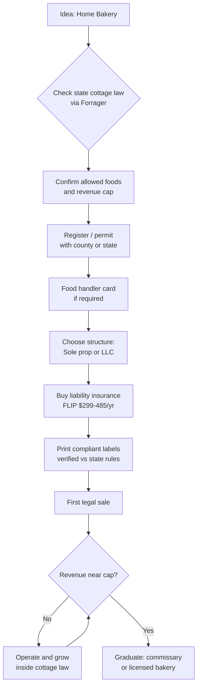

### Direct Answer

Starting a cottage food bakery in 2027 means launching a home-kitchen baked-goods operation under your state's cottage food law — a legal carve-out that lets you sell non-perishable items (cookies, breads, cakes, pies) directly to consumers without a commercial kitchen or full food-service license. Realistic startup cost is **$400-$2,500** for a hobby-to-side-income launch and **$8K-$25K** for a serious farmers-market route; mature operators net **$25K-$95K/yr part-time** and **$65K-$185K/yr full-time** at a 40-60% net margin. The defining constraint is the law itself: nearly every state caps annual cottage revenue ($25K-$78K is typical, a handful are unlimited), bans interstate and (often) wholesale sales, and forces you into a $15K-$120K commercial build-out the moment you outgrow the exemption.

> **TL;DR**
> - **Capital:** $400-$2,500 lean (home oven + registration + packaging + insurance + first market fees); $8K-$25K for a display-fixture farmers-market route with a transit vehicle.
> - **Revenue caps are the whole game:** Texas, Ohio, Wyoming, and post-reform Illinois are now unlimited; California, Florida, Washington, Colorado, and most others cap at $10K-$78K/yr, which sets your real income ceiling before you must graduate to a licensed bakery.
> - **Margins:** Cookies/cupcakes $3-$8 each at 60-75% gross; specialty cakes $35-$185; wedding cakes $385-$1,500. Net runs 40-60% because labor is your own and overhead is a kitchen you already pay for.
> - **Hardest part:** Scaling. Cottage law means home prep only — no wholesale to grocers, no interstate shipping in most states, and a hard revenue ceiling. Outgrowing it costs $15K-$120K for a commercial kitchen or $250-$1,200/mo for commissary rental.
> - **Fastest path to cash:** Pick a high-margin niche (custom cookies, wedding cake, allergen-free), sell direct via Instagram DM and one anchor farmers market, and reinvest every dollar into branding and a second sales channel before buying equipment.

Cottage food bakeries are one of the lowest-barrier real businesses you can start in the United States, but "low barrier" and "scalable" are not the same thing. This guide walks the full operating model — law, capital, equipment, pricing, sales channels, production reality, growth, and the failure modes that sink most operators — with current 2026-2027 numbers throughout. Read it as a business plan, not an inspiration post: the operators who build durable income are the ones who treat the home kitchen as a real company from day one.

## 1. Foundations: The Law That Defines Your Business

A cottage food bakery is not lightly regulated — it is *specifically* regulated. The cottage food exemption is a deliberate legal construct, and every decision you make sits inside its boundaries. Understand the law first; everything else is downstream of it. New bakers who skip this section and start selling almost always discover, weeks later, that they have been operating outside the exemption — selling a prohibited product, exceeding a cap, or shipping across a state line they were never allowed to cross.

### 1.1 What "Cottage Food" Legally Means

Cottage food laws are state statutes that permit individuals to produce certain low-risk foods in an unlicensed home kitchen and sell them to the public. They exist in all 50 states, but no two are identical. The federal layer is small: the FDA's Food Safety Modernization Act (FSMA) governs interstate commerce and does not regulate purely intrastate cottage sales, which is precisely why nearly every state law bans you from shipping or selling across state lines. The dominant national reference is Forrager (forrager.com), the state-by-state cottage law database founded by David Crabill, and it should be your first stop before you bake a single item for sale.

The legal definition turns on three pillars: **allowed foods** (non-perishable, shelf-stable), **revenue caps** (a dollar ceiling on annual cottage sales), and **sales channels** (who you may legally sell to). Get any one wrong and you are operating an illegal food business — a real risk, since most enforcement is complaint-driven and a single disgruntled customer or competitor can trigger an inspection. Cottage food is best understood as a *trust-based, low-risk-food* exemption: the state agrees not to inspect your kitchen in exchange for you staying inside narrow product, revenue, and channel limits. The moment you step outside those limits, the exemption evaporates and you are an unlicensed food establishment.

A second nuance trips up new operators: cottage food laws are *individual* permissions, not transferable business assets. The exemption attaches to you, the person baking, and to the registered home kitchen. You generally cannot have an employee bake at their own home, you cannot run two cottage operations to double a cap, and you cannot sell the "cottage license" with the business. This individuality is what makes cottage baking an owner-income model rather than a company you build to sell — a theme that runs through section 5.

### 1.2 The State Revenue Cap Landscape

Your state's revenue cap is the single most important number in your business plan, because it sets your income ceiling as a cottage operator. The map splits roughly into three bands: unlimited states, high-cap states, and low-cap states.

| State | Cottage law | Annual revenue cap | Notable rule |
|---|---|---|---|
| Texas | HB 970 / HB 1926 | Unlimited | Direct + in-state online + delivery; food handler card required |
| California | AB 1616 Homemade Food Act | $75,000 (Class A) | County registration; Class B permits indirect/wholesale sales |
| Florida | Statute 500.80 | $250,000 | One of the highest caps in the US; online + shipping in-state |
| Illinois | Home Kitchen Operation | Unlimited (2022 reform) | County health dept registration; allergen labeling required |
| Colorado | Cottage Foods Act | $10,000 per product type | Mandatory food safety course |
| Michigan | Cottage Food Law | $25,000 | No license; label must show home address |
| Ohio | Cottage Food Operation | Unlimited | No registration for true cottage foods |
| Pennsylvania | Limited Food Establishment | Unlimited | Annual registration + kitchen inspection |
| Washington | Cottage Food Permit | $35,000 | Permit + kitchen inspection required |
| New York | General Business Law / Home Processor | No hard dollar cap (exemption-based) | Home Processor exemption with product limits |
| Wyoming | Food Freedom Act | Unlimited | Broadest US law — even some perishables allowed |
| Arizona | Cottage Food Program | Unlimited | Registration + food handler training |

The pattern matters more than any single row. States like Texas, Ohio, Wyoming, Arizona, and post-reform Illinois are *unlimited* — you can build a real full-time income inside the cottage exemption with no statutory ceiling. High-cap states (Florida at $250K, California at $75K) give you years of runway before the cap becomes relevant. Low-cap states (Colorado at $10K per product, Michigan at $25K, Washington at $35K) force a strategic decision early: either stay deliberately small as a side income, or plan from day one to graduate to a licensed bakery once revenue approaches the cap.

Operators who ignore the cap and simply "stop reporting" sales are committing tax fraud and food-law violations simultaneously — a failure mode covered in section 7. The honest move in a low-cap state is to decide upfront which business you are building: a capped side income that never needs to graduate, or a stepping-stone operation where the cottage phase is a 12-36 month proving ground before a commissary or storefront. Both are legitimate; pretending the cap does not exist is not.

### 1.3 Allowed Foods, Prohibited Products, and Labeling

Cottage food laws permit **non-perishable, shelf-stable** items and prohibit anything requiring refrigeration for safety. The reliable green list across most states: breads, rolls, cookies, biscotti, brownies, bars, layer cakes with non-perishable frosting, fruit pies, scones, muffins, granola, dry baking mixes, hard candy, chocolate confections, and many jams and jellies tested to safe pH and water-activity levels. Some states extend the list to dehydrated items, popcorn, roasted coffee, and dry herb blends.

The prohibited list is where new bakers get burned. Cream cheese frosting, custard and cream pies, cheesecake, anything with fresh dairy or eggs in the *filling*, refrigerated buttercreams in many states, pumpkin pie (a perishable custard), and all meat products are almost universally banned. The mistake is intuitive: these feel like ordinary bakery items, so a new operator adds them to the menu without checking. Wedding cakes are allowed in most states *only* if the frosting is shelf-stable — a critical detail for the wedding niche in section 3.3, because a wedding cake covered in cream-cheese frosting is a prohibited product no matter how good it tastes.

Labeling is mandatory and non-negotiable. Every state requires a label with: the product name, your name and home address (or registration number), a full ingredient list in descending order by weight, allergen declarations covering the FDA's nine major allergens (milk, eggs, fish, shellfish, tree nuts, peanuts, wheat, soybeans, and sesame, the ninth added by the FASTER Act), net weight, and the cottage food disclaimer — typically "Made in a home kitchen not subject to state inspection" or your state's exact mandated wording. Missing, incomplete, or incorrectly worded labels are the single most commonly cited cottage food violation, and they are also the easiest to prevent. Print a compliant template once, verify it against your state's published guidance, and apply it to every item.

### 1.4 Business Structure, Insurance, and Permits

Most cottage bakers start as a **sole proprietorship** — zero formation cost, simplest taxes, income reported on IRS Schedule C — and that is the correct default for a side income. The sole proprietorship's weakness is that it offers no liability shield: a claim against the business is a claim against your personal assets. Form an **LLC** ($50-$500 depending on state, plus possible annual fees ranging from $0 to several hundred dollars) once you cross roughly $20K-$30K in revenue, take on wedding or event work where a single liability claim could be large, or simply want the separation for peace of mind. An LLC does not exempt you from cottage law; it only changes how the business is owned and taxed, and it does not replace insurance.

Insurance is the line item new bakers most often skip and most regret. The standard cottage food product + general liability policy from the Food Liability Insurance Program (FLIP, fliprogram.com) runs **$299-$485/yr** for $1M per-occurrence / $2M aggregate coverage; other carriers and small-business insurers offer comparable policies, sometimes bundled with a business owner's policy. Many farmers markets and effectively all wedding venues now *require* proof of insurance — often naming the venue or market as an additional insured — before you can sell or deliver. Treat insurance as a non-optional cost of doing business, not an upgrade. The $300-$500 annual premium is trivial against the cost of a single uninsured allergic-reaction or foodborne-illness claim.

Permits vary widely by state. Some states (Ohio's true cottage foods) require nothing at all. Others demand county registration (California, Illinois), a kitchen inspection (Washington, Pennsylvania), a food handler card or a food safety course (Texas, Colorado, Arizona), or a one-time fee. Budget $0-$150 and one to four weeks for the full permitting cycle, and do not sell before it clears. Selling for a few weeks while "the paperwork is in process" is exactly the kind of shortcut that turns a complaint into a citation.

### 1.5 Choosing a Niche Before You Choose a Menu

The most consequential decision a new cottage baker makes is not which oven to buy — it is which *niche* to own. A cottage bakery that tries to be everything to everyone competes with the grocery store on price and loses; a cottage bakery that owns a specific, defensible niche competes on craft and wins. The niche determines pricing power, marketing channel, capital needs, and the realistic income ceiling.

| Niche | Margin profile | Capital intensity | Best-fit operator |
|---|---|---|---|
| Custom decorated cookies | Very high (60-70%) | Low | Detail-oriented; strong Instagram presence |
| Wedding and event cakes | High ticket (50-62%) | Low-medium | Comfortable with contracts and delivery |
| Sourdough and artisan bread | Moderate (45-55%) | Low | High-volume, subscription-friendly |
| Allergen-free / gluten-free | Premium pricing | Medium (separate-prep) | Serves an underserved, loyal market |
| Cultural / heritage baking | High differentiation | Low | Authentic recipes with no local competition |
| Seasonal pies and holiday boxes | Spiky but lucrative | Low | Operators who want concentrated work windows |

Three principles guide the choice. First, **margin beats volume** for a one-person operation — a baker who can produce $90 of custom cookies in an hour will always out-earn one selling $9 cookie dozens, so niches with decoration or skill premiums win. Second, **pick a niche the grocery store cannot copy**: hyper-custom, hyper-local, or culturally specific baking has no mass-market substitute, while plain bread and basic cupcakes do. Third, **match the niche to your temperament** — wedding work suits operators who like deadlines and client management; sourdough subscriptions suit operators who like a predictable weekly rhythm; allergen-free baking (q9604) suits operators willing to run rigorous separate-prep protocols. The single most common strategic error is choosing a niche based on what is easy to bake rather than what is profitable and defensible to sell.

### 1.6 Taxes, Recordkeeping, and the Hobby-Loss Trap

A cottage bakery is a taxable business from its first sale, even at hobby scale. Income is reported on IRS Schedule C for a sole proprietor; legitimate business expenses — ingredients, packaging, market fees, insurance, equipment depreciation, mileage, a portion of home utilities — are deductible against it. Operators who keep no records pay more tax than they owe and have no idea whether the business is actually profitable. The minimum viable system is a dedicated bank account or card for the business, a simple spreadsheet or bookkeeping app logging every sale and expense, and a folder of receipts.

Two tax realities catch new bakers. The first is self-employment tax — roughly 15.3% on net profit, on top of income tax — which a hobby-mindset operator never budgets for and is then surprised by in April; set aside 25-30% of net profit as you go. The second is the IRS hobby-loss principle: a venture run without a genuine profit motive can have its deductions limited. A bakery that tracks costs, prices to profit, markets consistently, and keeps real books is unambiguously a business; one that loses money year after year with no pricing discipline risks being treated as a hobby. The fix is the same discipline that makes the business succeed operationally — costed pricing and real records — so good bookkeeping is not bureaucracy, it is the same habit that keeps the business solvent.

## 2. Build-Out and Capital: What It Actually Costs

The romance of cottage baking is that you start with the kitchen you already have. The reality is that "free" home equipment is rarely production-grade, and the difference between $400 and $25,000 in startup cost is entirely about which sales channels you intend to serve. Capital is not a single number — it is a function of format.

### 2.1 The Home Kitchen Equipment Stack

You can launch with a standard home oven, but you cannot scale on one. A residential oven holds two half-sheet pans, runs uneven, and recovers heat slowly after the door opens — fine for a $300/week side income, a hard ceiling for a $2,000/week operation. The smart capital sequence is: launch with what you own, prove demand, then upgrade the bottleneck (almost always the oven or the mixer) with revenue rather than savings.

| Equipment | Lean (DIY) | Serious | Notes |
|---|---|---|---|
| Stand mixer | $250 (used KitchenAid) | $700 (KitchenAid Pro 7-qt) | The single most-used tool; buy capacity |
| Sheet pans + cooling racks | $80 | $250 | Half-sheet aluminum, buy in bulk |
| Oven (home) | $0 (existing) | $1,200 (double wall oven) | Convection recovers heat faster |
| Refrigeration | $0 (existing) | $600 (dedicated fridge) | Ingredient + decorated-cake storage |
| Decorating tools | $120 | $450 | Turntable, tips, airbrush, scraper, mats |
| Scales + thermometers | $40 | $120 | Gram scale is mandatory for consistency |
| Storage + dough containers | $50 | $180 | Airtight bulk-ingredient bins |
| Packaging supplies (initial) | $150 | $500 | Boxes, cellophane, ribbon, labels |
| **Subtotal** | **$740** | **$4,000** | Before vehicle and market fixtures |

The honest advice: buy used for everything mechanical, buy new for anything that touches food directly, and resist the urge to buy a commercial oven while still under cottage law. Most states *require* you to bake in a residential kitchen, so a commercial deck oven you cannot legally use is dead capital until you graduate. The two upgrades that genuinely pay back early are a second oven or a convection range (it doubles batch throughput) and a larger-capacity stand mixer (it removes the most common production bottleneck for cookie and cake operators).

It is worth being precise about why oven capacity is the throughput governor. A standard residential oven holds two half-sheet pans and loses significant heat each time the door opens, then takes several minutes to recover — so a baker running ten sheet pans of cookies for a market day spends as much time *waiting on the oven* as actively working. A double wall oven or a second range roughly halves that bottleneck, and for a market-focused operator it is often the first revenue-funded upgrade that visibly raises weekly income rather than just convenience. The mixer is the second governor: a 4.5-5-quart home mixer caps a single batch of dough or buttercream, forcing repeated small batches, while a 7-quart Pro-grade mixer lets the baker prep a full day's work in one or two runs. Spend on these two before anything cosmetic, and let the rest of the kitchen stay genuinely "home" until graduation makes a commercial build-out both legal and worthwhile. Every dollar of equipment that does not raise throughput or quality is a dollar that would have been better spent on packaging, photography, or a second sales channel.

### 2.2 Build-Out Cost by Format

| Format | Capital range | What it buys |
|---|---|---|
| Hobby / side income | $400-$1,200 | Existing kitchen + registration + packaging + insurance |
| Custom-cake / wedding studio | $2,500-$9,000 | Decorating equipment + dedicated fridge + portfolio build + website |
| Serious farmers-market route | $8,000-$25,000 | Display tent and fixtures + transit vehicle + bulk equipment + branding |
| Pre-graduation (commissary phase) | $6,000-$15,000 | Commissary deposits + transport + scaled equipment |

Notice the cheapest serious path is the **custom-cake studio**: it needs no vehicle, no market fixtures, and almost no standing inventory — orders are made-to-order and prepaid. The capital goes into decorating skill, a dedicated fridge, a small website, and a photographed portfolio. That is why wedding and custom work, covered in section 3, is consistently the highest-margin cottage niche and the lowest-capital path to a real income. The farmers-market route is more capital-intensive precisely because a market presence is a mobile storefront: tent, tables, display fixtures, signage, a transport vehicle, and enough inventory to fill a table all cost money before the first sale.

### 2.3 Ingredient Sourcing and Cost Discipline

Ingredients are 18-32% of revenue for a disciplined cottage baker. The leak is buying retail. Costco and Sam's Club bulk flour, sugar, butter, and eggs cut ingredient cost 25-40% versus grocery-shelf prices; restaurant-supply channels (Restaurant Depot, WebstaurantStore) go further once volume justifies a membership or a minimum order. Specialty inputs — couverture chocolate, vanilla, gel colors, fondant — are where margins quietly erode, because they are expensive and easy to over-buy.

The discipline that separates profitable from unprofitable operators is **recipe costing**. Track cost-per-unit on a spreadsheet from day one: weigh every ingredient, price it per gram, and total the food cost of each finished product. Operators who price by "feel" instead of by costed recipe are the ones who discover at tax time that they effectively worked for $4/hr. A simple working rule: a recipe's food cost should be no more than 25-35% of its selling price. If a dozen cookies costs $4.50 in ingredients, they should sell for $14-$18, not $9. Costing also makes you a sharper buyer — once you know that butter is 40% of a shortbread's food cost, a bulk butter deal becomes an obvious win rather than a vague "saving."

### 2.4 Packaging, Branding, and Order Software

Packaging is both a compliance requirement (it carries the mandatory label) and a marketing asset. Lean operators print labels at home and use kraft boxes ($0.40-$1.10 each); serious operators invest $300-$800 in custom-printed boxes, tissue, and stickers, because on Instagram the packaging *is* the product photo and a branded box turns a customer into a walking advertisement. Packaging should run 4-9% of revenue — past that, you are over-investing in unboxing relative to your price point.

For order management, the lean stack is free and works well below roughly 15-20 custom orders a month: Instagram DM for inquiries, a Google Form for custom-cake order intake, Venmo/Zelle/Square for payment, and a Google Calendar for production scheduling. Paid tools earn their place once DM threads start producing *dropped* orders — a missed date, a forgotten flavor, a deposit not collected. At that point Square (a flat $0 monthly plus 2.6-2.9% per card transaction) or a bakery-specific platform such as BakeSmart or Cake Boss ($15-$40/mo) pays for itself by preventing a single blown wedding order. Square's transaction fee is the real recurring cost; budget 2.7% of card revenue as a hard line item, the same way a food-truck or coffee-cart operator (q9602) does.

### 2.5 A Worked Launch Budget

Abstract ranges are useful for planning; a concrete worked example is useful for committing. Below is a realistic line-item launch budget for a custom-cookie-and-cake cottage operator entering the market in a moderate-cost state, building toward a serious part-time income rather than a hobby.

| Line item | Cost | Notes |
|---|---|---|
| State registration / permit | $75 | County health department filing |
| Food handler / safety course | $25 | Required in many states |
| LLC formation | $150 | Optional; sole prop is $0 |
| Liability insurance (annual) | $385 | FLIP $1M/$2M policy |
| Used commercial-grade stand mixer | $400 | The core production tool |
| Sheet pans, racks, decorating tools | $350 | Bought new where food-contact |
| Gram scale, thermometers, small wares | $120 | Consistency depends on weighing |
| Dedicated ingredient fridge (used) | $250 | Frees the household fridge |
| Initial bulk ingredient stock | $300 | Flour, sugar, butter, chocolate, color |
| Branded packaging (first run) | $400 | Boxes, stickers, tissue, labels |
| Website / domain (first year) | $120 | Simple one-page portfolio + order form |
| Photography props and backdrop | $90 | Drives Instagram conversion |
| Farmers-market season fee + first stalls | $250 | Membership plus four market days |
| Display tent, table, signage | $400 | Mobile-storefront fixtures |
| **Total launch capital** | **$3,815** | A realistic serious-part-time entry |

This budget sits deliberately between the bare $400 hobby launch and the $25,000 full market route. It buys a registered, insured, properly equipped operation with one anchor sales channel, a branded online presence, and enough working ingredient stock to fill early orders — without a vehicle purchase or a commercial oven the operator cannot yet legally use. The discipline here is sequencing: every line item directly enables a first sale or a first marketing impression. Items that do *not* — a second oven, a logo'd vehicle wrap, a high-end camera — are deferred until revenue, not savings, can fund them.

## 3. Operations: Product, Pricing, and the Farmers Market

A cottage food bakery lives or dies on two operational skills: pricing correctly and selling consistently. Most closures are not "the cake was bad" — they are "the math never worked" or "no one knew the bakery existed." Both are fixable, and both are unglamorous.

### 3.1 Product Portfolio and Pricing

| Product | Typical price (2027) | Gross margin | Notes |
|---|---|---|---|
| Cookies (each / dozen) | $3-$5 / $24-$45 | 65-75% | High-margin, fast, the market staple |
| Cupcakes (each / dozen) | $3.50-$6 / $36-$60 | 60-70% | Decoration drives the price |
| Brownies / bars | $3-$5 | 65-72% | Lowest labor per dollar earned |
| Layer cake (6-8") | $35-$95 | 55-65% | Pricing varies widely by decoration |
| Specialty / sculpted cake | $95-$185 | 50-60% | Skill premium; portfolio-dependent |
| Wedding cake | $385-$1,500 | 50-62% | Per-serving $4.50-$12; tasting + consult |
| Bread loaf | $7-$12 | 45-55% | Lower margin; a volume play |
| Fruit pie | $18-$32 | 55-65% | Strong seasonal demand spikes |
| Custom decorated cookie set | $36-$72/dozen | 60-70% | Royal-icing detail commands a premium |
| Granola / dry mix | $8-$16/unit | 55-68% | Long shelf life; ships and stocks well |

The pricing mistake that kills cottage bakeries is undercharging because "it's just a home business." A correctly priced product covers food cost (25-35%), packaging, market or platform fees, *and* pays the baker a real hourly wage for production and decorating time. If a sculpted cake takes six hours and sells for $90, the baker earns roughly $9-$11/hr after costs — below minimum wage in much of the United States. Price the labor in, or the business is a slow-motion loss disguised as a hobby. The fix is to set a target labor rate (start at $25-$45/hr of skilled decorating time), cost the recipe, add packaging and fees, and let that arithmetic — not a competitor's Facebook price or a customer's discomfort — set the number. This is the same discipline that separates profitable from unprofitable operators in adjacent home-food businesses like the charcuterie board model (q2006) and the catering model (q1980): the product is fine; the math is the business.

A second portfolio lesson: range the menu by margin and effort. Cookies and bars are fast, high-margin, low-skill, and perfect for markets and impulse sales. Custom cakes are slow, high-skill, and high-margin per order. A healthy cottage bakery uses the fast products to build a customer base and fill slow weeks, and the custom products to capture the real profit. A menu that is *all* sculpted cakes has no floor; a menu that is all cookies has no ceiling.

### 3.2 Sales Channels: Markets, Instagram, and Custom Orders

Cottage law restricts you to roughly four channels: farmers markets and similar in-person events; direct sales (Instagram DM, word-of-mouth, your own website where state law allows); pickup and delivery of custom orders; and, in permissive states only, limited in-state online sales. Wholesale to grocers and cafes is generally prohibited under cottage law — that capability is one of the main reasons operators eventually graduate.

The **farmers market** is the classic anchor channel. Stall fees run $20-$75 per market day, plus a possible seasonal membership and an insurance requirement. A solid market booth grosses $300-$900 a day for an established cottage baker, with the wide range driven by foot traffic, season, weather, and product mix. The booth's real value is not just same-day sales but customer acquisition: every market visitor who tastes a cookie is a future custom-order lead and a potential Instagram follower. Treat the booth as a storefront and a marketing channel at the same time — collect follows, hand out cards, and capture custom-order inquiries on the spot.

**Instagram and DM** is where modern cottage bakeries actually scale. A consistent feed of well-photographed product turns followers into custom-cake inquiries. The conversion path is reliable: market sample or referral → Instagram follow → DM inquiry → quote → prepaid order. Operators who treat Instagram as a catalog (clean, current, on-brand) rather than a personal diary, and who respond to DMs within hours rather than days, win the high-margin custom work. The same organic, visual playbook drives demand for adjacent home-craft businesses like soap making (q1990) and Etsy shops (q1953).

**Custom orders** — birthday cakes, decorated cookie sets, themed desserts, dessert tables — are the profit center. They are prepaid (no cash-flow gap), made-to-order (zero inventory waste), and command the highest per-hour margin once decorating skill is real. The strategic goal of the market and Instagram channels is, ultimately, to feed the custom-order pipeline.

A useful way to think about the channel mix is as a funnel with distinct jobs. The farmers market is the top of the funnel: it produces volume of *trial* — strangers tasting your product and following you — at a modest direct margin. Instagram is the middle: it nurtures those followers with consistent proof of quality until they have a reason to buy. The custom-order pipeline is the bottom: it captures the real profit from buyers who arrived warm. A cottage bakery that runs only the market never builds the high-margin custom business; one that runs only Instagram with no in-person trial channel grows slowly because strangers rarely send a first DM to a bakery they have never tasted. The healthy operator runs all three deliberately, and measures each not just by its own revenue but by how well it feeds the next stage. Channel concentration — depending on any single one — is failure mode 8 for a reason.

### 3.3 The Wedding and Custom Cake Workflow

Wedding cakes are the highest-revenue single product a cottage baker can legally sell — but only where state law allows shelf-stable frostings, and only with a disciplined workflow. The pipeline runs: inquiry → tasting and consultation (charged $25-$75, credited toward the booking) → quote and written contract → a 25-50% non-refundable deposit → design finalization → production week → delivery and on-site setup. Every step exists to manage risk.

The non-negotiables are a written contract, a deposit that covers your ingredient and time risk if the client cancels, and liability insurance the venue can verify. A wedding cake gone wrong is the single largest reputational and financial risk in cottage baking: one viral negative review can end a small personal-brand operation, and one uninsured incident at a venue can be financially catastrophic. Charge for the consultation (it filters tire-kickers and pays for the tasting ingredients), lock the non-refundable deposit, never accept a wedding booking without a signed contract, and confirm the frosting you plan to use is a legal shelf-stable product under your state's cottage law before you quote it.

Wedding work also concentrates revenue: a single Saturday delivery can equal a month of market sales. That makes wedding bakers vulnerable to seasonality and to overbooking — accepting three weddings on one weekend when one baker can realistically execute one or two well. Discipline in *how many* you accept is as important as discipline in *how* you price.

### 3.4 Production Scheduling and the Labor Reality

The hidden ceiling in cottage baking is *you*. A home oven and one pair of hands cap weekly output, and no amount of marketing changes that. A realistic full-time cottage baker produces 25-45 hours of actual baking and decorating per week, plus 10-15 hours of sourcing, packaging, photography, DM management, bookkeeping, and admin — the invisible work that new operators consistently underestimate.

The math: at $65-$95 of *productive* decorating value per hour and a 35-45-hour productive week, gross revenue lands around $2,000-$3,800/week, which is exactly why mature full-time operators top out around $65K-$185K and why the revenue cap in capped states is often a non-issue — you physically cannot bake past it alone. Production scheduling becomes the core operational skill: batching same-temperature bakes, prepping doughs ahead, blocking decorating into uninterrupted sessions, and protecting the calendar from over-acceptance. Operators who run their week reactively (baking whatever order shouted loudest) burn out; operators who run a planned production calendar sustain.

Scaling output past the one-baker ceiling means one of three moves: hire help (legally complex under cottage law, since most states require *all* production in the registered home kitchen by the registered operator); raise prices to ration demand to what you can deliver well; or graduate out of cottage law entirely. Those three options frame section 5.

### 3.5 A Realistic Production Week

The clearest way to understand a cottage bakery's true workload is to walk a representative full-time week for an operator running both a Saturday market booth and a custom-order pipeline. The pattern below shows why "I bake all day" undercounts the job by roughly a third.

| Day | Primary activity | Hours | Nature of work |
|---|---|---|---|
| Sunday | Order intake, quoting, recipe planning, sourcing list | 4-6 | Admin, marketing, planning |
| Monday | Bulk shopping run, ingredient prep, dough batching | 6-8 | Sourcing and prep |
| Tuesday | Custom cake and cookie baking, crumb-coating | 7-9 | Core production |
| Wednesday | Decorating day — detailed custom work | 8-10 | Skilled, high-value labor |
| Thursday | Remaining custom orders, packaging, delivery | 7-9 | Production and fulfillment |
| Friday | Market-stock baking, packaging, photography, content | 8-10 | Production plus marketing |
| Saturday | Farmers market — setup, selling, teardown | 8-10 | Sales and customer acquisition |

Two lessons fall out of this calendar. First, of roughly 50-60 working hours, only about 35-45 are *baking and decorating* — the rest is sourcing, packaging, delivery, photography, content, market logistics, and admin. An operator who prices as if the whole job is the fun decorating part will systematically underprice. Second, the week is front-loaded with planning and back-loaded with selling, which means a missed Sunday planning block or a skipped Friday photography session degrades the entire week downstream. A planned production calendar is not optional polish; it is the mechanism that keeps a one-person operation from collapsing into reactive chaos. Operators who protect the calendar — capping custom orders at what the Tuesday-through-Thursday production window can realistically hold — sustain for years; operators who say yes to everything burn out within one or two peak seasons.

## 4. Marketing and Adjacent Revenue

### 4.1 Instagram, TikTok, and Word-of-Mouth

For a cottage bakery, marketing is almost entirely organic and visual. There are three engines, in descending order of return on effort.

**Word-of-mouth** is the highest-converting and cheapest channel — a referred custom-cake customer arrives pre-sold, having already seen a friend's birthday cake in person. Every order should ship with a branded card and a gentle request to tag the bakery. A referral flywheel, once spinning, can carry a custom-cake operator with almost no other marketing.

**Instagram** is the portfolio and discovery engine. Post finished work, behind-the-scenes process, and genuine customer reactions on a consistent cadence; use local hashtags and location tags so nearby buyers actually find you; keep the grid clean and current so a new visitor immediately understands what you sell and at what quality. Instagram is where a stranger decides whether to send the DM.

**TikTok** rewards process and personality — a satisfying cake-decorating or cookie-flooding clip can reach far beyond your local market. The catch is conversion: viral reach is worthless to a cottage baker who can only legally sell in-state, so TikTok pays off best when paired with a clear, local "order here" path and when the creator is comfortable being on camera.

Paid advertising rarely pays back for a sub-$100K cottage bakery; the marketing budget is almost always better spent on packaging and professional-grade product photography than on ad spend. The same organic-first, photography-driven playbook governs nearly every visual home-craft business, from soap making (q1990) to an Etsy shop (q1953).

### 4.2 Adjacent Revenue and Subscription Models

Mature cottage bakers diversify beyond single-item sales to smooth out a famously lumpy revenue stream.

| Adjacent stream | Typical revenue | Notes |
|---|---|---|
| Baking classes / workshops | $35-$95 per seat | High margin; uses the kitchen you already have |
| Cookie / treat subscription box | $25-$55/mo per subscriber | Predictable recurring revenue |
| Corporate / office standing orders | $150-$600 per order | Repeat B2B; overlaps the corporate catering model (q9600) |
| Holiday pre-order campaigns | $1,000-$6,000 per season | Thanksgiving and December spikes |
| Dry mixes / shelf-stable retail line | $8-$16 per unit | Extends shelf life and reaches new channels |
| DIY cookie-decorating kits | $18-$40 per kit | Ships well; strong gift-market demand |
| Dessert tables / event styling | $200-$900 per event | Higher ticket; bundles multiple products |

Subscriptions and holiday pre-orders matter most because they convert an order-by-order business into something with predictable, plannable cash flow — the same structural upgrade a niche meal-prep or event-coffee-cart operator (q9602) chases. Corporate standing orders are similarly valuable: a single office that orders weekly is worth more, and costs less to serve, than a dozen one-off retail buyers. The strategic goal of diversification is not just more revenue but *steadier* revenue, so the January-February trough does not threaten the business.

### 4.3 The First 90 Days: A Launch Playbook

The gap between a registered cottage bakery and a cottage bakery that is actually earning is execution in the first three months. The playbook below is a realistic sequence, not a fantasy timeline.

**Days 1-14 — Compliance and foundation.** Confirm your state law on Forrager, file the registration or permit, complete any required food handler course, buy the FLIP insurance policy, and design and proof a compliant label template against the state's exact wording. Open a separate bank account or card for the business. Do not sell anything until the permit clears — premature sales are an unforced legal error.

**Days 15-30 — Menu, pricing, and proof.** Cost every recipe to the gram, set prices that pay food cost, packaging, fees, and a real labor rate, and finalize a tight launch menu of five to eight items rather than thirty. Bake test batches, photograph the finished products properly, and build a one-page website with an order form. Soft-launch to friends and family at full price — never at a discount, since discounted "test" sales anchor your network to a price you cannot sustain.

**Days 31-60 — First channels.** Apply to one anchor farmers market and work the first stalls; treat each market day as both a sales event and a follower-acquisition event. Start posting to Instagram on a fixed cadence — finished work, process, customer reactions — with local tags. Begin actively requesting that every customer follow and tag the bakery. The goal of this window is a base of perhaps 30-60 customers and a market booth that consistently grosses at least its stall fee several times over.

**Days 61-90 — Custom pipeline and rhythm.** By now, market and Instagram visibility should be producing custom-order DMs. Convert them with fast responses, clear quotes, written terms, and collected deposits. Establish the weekly production rhythm from section 3.5 so the operation is planned rather than reactive. Review the numbers honestly: are you covering costs, paying yourself a real rate, and on a trajectory toward the section 6.1 income band you targeted? If the answer is no, the fix is almost always pricing or marketing cadence — not the baking.

The operators who survive the first 90 days are the ones who treated compliance as step one, refused to discount, launched a focused menu, and committed to a marketing cadence they could sustain. The ones who stall treat the launch as a vibe rather than a sequence.

## 5. Growth and Exit: Beyond the Cottage Exemption

### 5.1 Scaling Beyond Cottage: Commissary and Licensed Bakery

Eventually a successful cottage baker hits one of three walls: the state revenue cap, the physical output ceiling of a single home kitchen, or a wholesale opportunity (grocers, cafes, corporate accounts) that cottage law forbids. Crossing any of them means leaving the cottage exemption — a genuine business transition, not just a bigger version of the same thing.

| Path | Cost | What it unlocks |
|---|---|---|
| Commissary / shared commercial kitchen rental | $250-$1,200/mo | Licensed status, legal wholesale, more output, no build-out |
| Licensed home bakery upgrade (where allowed) | $2,000-$15,000 | Inspection-grade home kitchen; limited and state-specific |
| Storefront / commercial bakery build-out | $15,000-$120,000+ | Retail, wholesale, employees, unlimited revenue |
| Co-packer / contract manufacturing | Per-unit pricing | Shelf-stable retail products produced at scale |

The smartest graduation path for most operators is the **commissary kitchen**. For a monthly rent rather than a six-figure build-out, it grants licensed status — which means legal wholesale, no revenue cap, and the ability to hire help — and it lets you test scaled demand before committing to a lease. A full storefront is a fundamentally different business: payroll, rent, retail hours, foot-traffic risk, and a margin profile closer to a ghost kitchen (q2002) or a small food-truck operation (q9669) than to the home bakery you started. The discipline is to graduate *deliberately* — when revenue, demand, and a specific unlocked opportunity (a wholesale account, a cap you are about to hit) justify it — rather than emotionally, because a storefront feels like "making it."

### 5.2 Exit and Owner Continuation

Most cottage bakeries are not sold — they are personal-brand businesses where the baker *is* the asset. The realistic exit options are: wind the business down and sell the equipment for whatever the used market bears; sell the brand, recipes, customer list, and Instagram following as a package (typically a modest 1-2x annual profit, because the goodwill is personal and walks out the door with the founder); or convert to a licensed bakery that *can* be sold as a real operating business at roughly 2-3.5x seller's discretionary earnings. The honest framing is that a cottage bakery is excellent at generating owner income and poor at building transferable equity. Plan the financial outcome accordingly: if the goal is a sellable asset, graduation to a licensed, less owner-dependent operation is the path; if the goal is durable income from work you enjoy, the cottage model itself is the destination, not a way station.

## 6. Reference Numbers and Benchmarks

### 6.1 Per-Format Mature Revenue and Net Income

| Format | Annual revenue | Net margin | Owner net income |
|---|---|---|---|
| Hobby / side income | $3,000-$15,000 | 50-65% | $1,800-$9,500 |
| Part-time cottage | $18,000-$45,000 | 45-58% | $9,000-$26,000 |
| Serious part-time (market + custom) | $35,000-$70,000 | 42-55% | $16,000-$38,000 |
| Full-time cottage operator | $90,000-$320,000 | 40-52% | $42,000-$160,000 |
| Post-graduation licensed bakery | $180,000-$650,000 | 8-18% | $30,000-$110,000 |

The counterintuitive row is the last one: graduating to a licensed bakery often *lowers* net margin, because rent, payroll, and utilities replace the free home overhead and free owner labor that made the cottage model so profitable in percentage terms. A licensed bakery doing $400K in revenue can take home less than a full-time cottage operator doing $160K. The reason to graduate is capacity and transferable value — the ability to serve wholesale, hire staff, and build something sellable — not a better margin.

### 6.2 Equipment, Build-Out, and Insurance Reference

| Item | Lean | Serious |
|---|---|---|
| Total launch capital | $400-$1,200 | $8,000-$25,000 |
| Stand mixer | $250 used | $700 commercial-grade |
| Oven upgrade (within cottage law) | $0 | $1,200 double wall oven |
| Liability insurance (annual) | $299 | $485 |
| LLC formation (one-time) | $50 | $500 |
| Initial packaging spend | $150 | $800 |
| Commissary rent (post-graduation) | $250/mo | $1,200/mo |
| Storefront build-out (graduation) | $15,000 | $120,000+ |

### 6.3 Famous Cottage and Boutique Bakery Reference Points

The cottage-to-empire story is real but rare, and it is worth knowing the ceiling so you can plan against realistic numbers rather than fantasy ones. **Milk Bar**, founded by pastry chef Christina Tosi, grew from a single New York City bakery into a national multi-channel brand, illustrating the upper bound of what a craft-baking concept can become. On the consumer-packaged side, publicly traded companies define the industrial end of the category: **Mondelez International (MDLZ)**, the global snacking giant, owns mainstream baked-goods and cookie brands; **Flowers Foods (FLO)** produces Nature's Own and Dave's Killer Bread; and **Grupo Bimbo** is the largest baking company in the world. The cookie category specifically has shown that genuine scale is possible — **Crumbl Cookies** went from one Utah shop to thousands of franchised locations on a rotating weekly menu. Even franchising platforms matter as reference points: **Restaurant Brands International (QSR)** and similar operators show how baked-goods and coffee concepts scale through franchising once they leave the single-kitchen model entirely.

For the overwhelming majority of cottage bakers, though, the relevant reference is not Bimbo or Crumbl. It is the local custom-cake artist who built a $120K full-time income inside their state's cottage law and chose never to leave it. Aspiration toward Milk Bar is fine as motivation; the business plan should be built on the realistic full-time numbers in section 6.1.

### 6.4 Operational Benchmarks

| Benchmark | Healthy range |
|---|---|
| Food cost as % of revenue | 25-35% |
| Packaging cost as % of revenue | 4-9% |
| Market stall fee as % of market-day revenue | 6-15% |
| Card processing (Square) | 2.6-2.9% of card revenue |
| Custom-order deposit | 25-50%, non-refundable |
| Gross margin (cookies / cupcakes) | 60-75% |
| Net margin (full-time cottage) | 40-52% |
| Wedding cake per-serving price | $4.50-$12 |
| Productive baking hours per full-time week | 35-45 |
| Target skilled-decorating labor rate | $25-$45/hr |

### 6.5 Three Financial Scenarios

Ranges describe the category; scenarios describe a decision. Below are three honest five-year arcs for the same starting operator, diverging only on strategy.

| Year | Side-income path | Serious part-time path | Graduation path |
|---|---|---|---|
| Year 1 | $6,000 revenue | $14,000 revenue | $16,000 revenue |
| Year 2 | $11,000 | $34,000 | $40,000 |
| Year 3 | $13,000 | $58,000 | $72,000 (cap pressure) |
| Year 4 | $14,000 | $66,000 | Commissary move; $130,000 |
| Year 5 | $14,000 (stable) | $70,000 (plateau) | $240,000 licensed |

The **side-income path** is a deliberate choice to keep the bakery small — weekend markets, a handful of custom orders, no growth ambition — and it produces a stable $7K-$9K of net owner income indefinitely with almost no stress. The **serious part-time path** pushes into a real custom pipeline and a strong market presence, plateauing near $70K revenue and $30K-$38K net because one baker and one home oven physically cannot do more. The **graduation path** runs the cottage phase as a 24-36 month proving ground, hits the capacity ceiling deliberately, moves to a commissary for licensed status and legal wholesale, and reaches a different order of magnitude — at a *lower* net margin but with a business that can hire staff and ultimately be sold.

None of the three is the "right" answer; the error is drifting between them without choosing. An operator who wants the side-income outcome should not over-capitalize for growth that will never come; an operator who wants the graduation outcome should be building the brand, recordkeeping, and wholesale relationships from year one. The financial outcome is set far more by the strategic choice than by baking skill.

## 7. Counter-Case: Why Cottage Bakeries Fail

The cottage food model has a low failure *cost* — you rarely lose your house — but a high failure *rate* as a real income source. Most operators never get past hobby income, and the reasons are predictable enough to design around.

**Failure mode 1 — Underpricing.** The most common killer. Pricing by "what feels fair for a home business" instead of by costed recipe means the baker quietly funds the customer's discount out of their own unpaid labor. The business does not lose money on paper; the *baker* does, hour by hour, until they conclude the business "doesn't make money" when in fact the pricing was the only thing broken.

**Failure mode 2 — Ignoring the revenue cap.** In capped states, operators who blow past the cap either commit a violation or are forced into an unplanned, expensive graduation at the worst possible time. The cap must be in the business plan from day one, with a deliberate decision to either stay under it or build toward graduation.

**Failure mode 3 — Operating without insurance.** One liability claim — an allergic reaction, a foodborne-illness complaint, an injury at a market booth — without a FLIP-style policy can be financially catastrophic for a sole proprietor whose personal assets are exposed. The $300-$500 annual premium is the cheapest risk reduction in the business.

**Failure mode 4 — Labeling violations.** Cottage food enforcement is complaint-driven, and a wrong, incomplete, or incorrectly worded label is the easiest violation to cite. It is also the easiest to prevent — a one-time template against the state's published rules — which makes it an avoidable, self-inflicted failure.

**Failure mode 5 — The labor ceiling, unacknowledged.** The baker assumes they can simply "do more" and never confronts that one person plus one home oven is a hard physical cap. Revenue plateaus, the operator grinds harder against the ceiling, and burnout follows.

**Failure mode 6 — Treating it as a hobby that happens to take money.** No tracked costs, no recipe costing, no pricing discipline, no marketing cadence, no production calendar — the business runs on enthusiasm until enthusiasm runs out. The cottage model is forgiving of small mistakes and unforgiving of an absence of basic business hygiene.

**Failure mode 7 — Wedding-cake reputational blowup.** Accepting wedding work without contracts, deposits, or insurance, then having one cake fail publicly. In a personal-brand business with a small local market, one viral negative review can end the operation outright.

**Failure mode 8 — Channel concentration.** Depending entirely on a single farmers market. When the market's season ends, the weather turns bad for a month, the market relocates, or a competing baker joins, revenue drops to zero with no fallback channel.

**Failure mode 9 — Seasonality blindness.** Holiday pre-orders inflate Q4 revenue; January and February are dead. Operators who do not consciously save from the peak to fund the trough run out of cash in winter and conclude, wrongly, that the business failed.

**Failure mode 10 — Selling prohibited products.** Cream-cheese frosting, cheesecake, custard and cream pies, pumpkin pie — items that feel like ordinary bakery fare but are banned under most cottage laws. Selling them is an unintentional violation that a single complaint exposes.

**Failure mode 11 — Graduation procrastination.** A successful baker who genuinely needs to move to a commissary or licensed kitchen but keeps delaying the transition caps their own income and, in capped states, risks operating outside the law while "deciding."

**Failure mode 12 — Burnout from invisible hours.** Sourcing, packaging, photography, DM management, bookkeeping, market setup and teardown — the unpaid work around the baking is often 30-40% of total hours. Operators who only count the "fun" decorating time wildly underestimate the real workload, price as if the invisible hours are free, and quit exhausted.

The throughline across all twelve: cottage baking is a genuinely viable small business, but it rewards operators who treat it as a *business* — costed pricing, tracked numbers, real insurance, compliant labels, diversified channels, and a clear-eyed plan for the revenue cap and the labor ceiling — and quietly punishes those who treat it as a hobby with a Venmo handle.

## 8. Bottom Line

A cottage food bakery in 2027 is one of the most accessible real businesses in the United States: $400-$2,500 launches a legitimate, income-producing operation from the kitchen you already own, and a disciplined full-time operator can net $65K-$185K without ever renting commercial space or hiring an employee. The model rewards the same fundamentals everywhere — costed pricing, real liability insurance, multiple sales channels, consistent Instagram-driven marketing, and a niche with genuine margin, whether that is custom cookies, wedding cake, or allergen-free baking.

But the cottage exemption that makes entry cheap is also the ceiling. Revenue caps, the home-prep requirement, the prohibition on wholesale and interstate sales, and the hard physical limit of one baker and one oven mean the model is built for owner income, not for building a sellable company. Know your state's cap before you start, plan the graduation path before you need it, and price every product as if your time is worth real money — because it is. Operators who do those three things build a durable side or full-time income; operators who skip them join the large majority that never escapes hobby revenue.

For adjacent and complementary models that share the same home-food economics, see how the numbers play out in a charcuterie board business (q2006), a catering business (q1980), a corporate catering business (q9600), a specialty allergen-free bakery (q9604), an Etsy shop (q1953), a soap making business (q1990), an event coffee cart business (q9602), a food truck business (q9669), and a ghost kitchen business (q2002).

## Sources & References

1. Forrager — dominant US cottage food law database, state-by-state summaries, founded by David Crabill. forrager.com
2. FDA Food Safety Modernization Act (FSMA) — federal food safety framework governing interstate commerce; the cottage food intrastate exemption. fda.gov
3. FLIP — Food Liability Insurance Program, leading cottage food insurance carrier, $1M/$2M product + general liability coverage. fliprogram.com
4. Texas Cottage Food Law, HB 970 / HB 1926 — Texas Department of State Health Services cottage food provisions.
5. California Homemade Food Act, AB 1616 — California Department of Public Health cottage food program, Class A and Class B permits.
6. Florida Statute 500.80 — Florida Department of Agriculture cottage food operations, $250,000 cap.
7. Illinois Home Kitchen Operation Law — 2022 reform removing the cottage revenue cap.
8. Colorado Cottage Foods Act — $10,000 per-product-type cap and mandatory food safety course.
9. Michigan Cottage Food Law — $25,000 cap, labeling and home-address requirements.
10. Ohio Cottage Food Operation rules — Ohio Department of Agriculture, no-registration true cottage foods.
11. Pennsylvania Limited Food Establishment — annual registration and kitchen inspection requirements.
12. Washington State Cottage Food Permit — $35,000 cap and kitchen inspection requirement.
13. Wyoming Food Freedom Act — broadest US cottage / food-freedom statute.
14. New York Home Processor exemption — General Business Law cottage-style food provisions.
15. Arizona Cottage Food Program — registration and food handler training requirements.
16. FDA major food allergen labeling guidance — the nine major allergens, including sesame added by the FASTER Act.
17. US Small Business Administration — sole proprietorship versus LLC formation guidance.
18. IRS Schedule C — self-employment income reporting for home-based food businesses.
19. Costco / Sam's Club bulk ingredient pricing references, 2026.
20. Restaurant Depot / WebstaurantStore — restaurant-supply pricing for scaled cottage operators.
21. Square — payment processing fee schedule, 2.6-2.9% per card transaction.
22. KitchenAid — commercial and Pro stand mixer pricing references, 2026.
23. National farmers market association data — stall fee ranges and vendor revenue benchmarks.
24. Milk Bar / Christina Tosi — cottage-to-national-brand case reference.
25. Mondelez International (MDLZ) — investor materials, snack and baked-goods brand portfolio.
26. Crumbl Cookies — franchise disclosure documents and unit-growth reporting.
27. Flowers Foods (FLO) — investor relations, Nature's Own and Dave's Killer Bread brands.
28. Grupo Bimbo — annual report, largest global baking company scale reference.
29. Restaurant Brands International (QSR) — franchised baked-goods and coffee concept scale reference.
30. BakeSmart / Cake Boss — bakery order-management software pricing.
31. The Wedding Report — wedding cake pricing and per-serving benchmark data.
32. BizBuySell — small food-business sale multiples and seller's discretionary earnings benchmarks.
33. State commissary / shared commercial kitchen rental rate surveys, 2026.
34. US Bureau of Labor Statistics — bakers occupational employment and wage data.
35. IBISWorld — US specialty bakery and home-based food business industry overviews, 2026.
36. ServSafe / state food handler certification program requirements.
