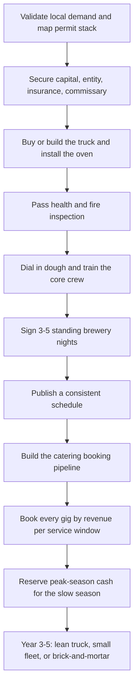

### Direct Answer

To start a pizza truck business in 2027, you build or buy a self-contained mobile kitchen around a real pizza oven, secure a licensed commissary kitchen and the full mobile-food permit stack, and then sell pizza two ways at once: **walk-up service** at breweries, festivals, farmers markets, and weekday-lunch spots, and **booked private catering** for weddings, corporate events, and parties. The model is real and genuinely good, but it is a restaurant on wheels, not a passive cart, and the economics rest on one number beginners almost never calculate: **revenue per service window** -- how much you actually sell in the staffed three-to-five-hour block a truck is open, against the fixed cost of being open at all. A disciplined operator invests **$60K-$220K** to launch, runs a **65-78% gross margin on food** but a **12-25% net margin** after labor, commissary, truck, fuel, insurance, and permits, generates **$120K-$320K** in Year 1 revenue, and scales toward **$350K-$900K** with **$70K-$220K** owner profit by Year 3-5.

**TL;DR:** A pizza truck is a logistics-and-throughput restaurant in a fun mobile costume. The food margin (75-85% on the pie) is not the net margin (12-25% all-in). Winners build a repeating **brewery spine** plus a **deposit-funded catering layer** and treat festivals as opportunistic upside; losers chase festival spectacle, underprice catering, forget the commissary line, and under-capitalize the reserve. Budget $60K-$110K for a lean used-truck launch, master the dough, respect the seasonal reserve, and book every gig by realistic revenue-per-window -- not by what sounds fun. This guide walks the model, the unit economics, the build, the permits, the channels, the staffing, the five-year arc, the counter-case, and a go/no-go decision framework.

## 1. What A Pizza Truck Business Actually Is In 2027

### 1.1 The core definition

A pizza truck business is a fully equipped mobile kitchen that produces and sells pizza at locations the customer comes to, or that the customer hires you to come to. It is **not a concession cart**, it is **not a catering company that happens to own a vehicle**, and it is emphatically **not a passive food brand**. It is a working restaurant compressed into a truck -- with all of a restaurant's food cost, labor cost, health regulation, and nightly grind, minus the dining room and minus a fixed address.

The core of the business is the oven. Everything else -- the dough process, the prep, the route, the booking calendar, the crew -- exists to feed a hot oven and move pizzas out of it as fast as quality allows. The same structural reality applies to its sibling models: a coffee cart (q2000) and an ice cream truck (q1982) also live or die on throughput through a fixed service window.

### 1.2 The two revenue engines

You make money two distinct ways, and the best operators run both:

- **Walk-up service** -- you park at a brewery, a farmers market, a festival, an office park, or a busy corner and sell to whoever shows up. Volume and brand-building, but weather- and crowd-exposed.
- **Booked catering** -- a client (a wedding, a corporate office, a birthday, a school) pays a **minimum** plus a **per-guest rate** to have you show up and feed their event. Predictable, deposit-funded, higher-margin.

### 1.3 What changed by 2027

| Shift | What it means for a new operator |
|---|---|
| **Brewery-as-food-venue** became structural | Breweries and taprooms without kitchens are a repeating, calendar-locked revenue channel |
| **Mobile oven technology matured** | A genuinely excellent pizza on a truck is now achievable, not a compromise |
| **Corporate catering rebounded** | Offices reassembled and need a reason to gather -- year-round catering demand |
| **Discovery moved to social and brewery calendars** | A published, consistent schedule is a real operating asset |
| **Labor got expensive and scarce** | Crew efficiency and throughput became the operational battleground |

The pizza truck business is not trendy-passive and it is not easy. It is dough, a hot oven, a commissary, a route, a booking calendar, and a phone full of brewery and corporate relationships. This positions it differently from a fixed food truck of any cuisine (q9669) and from a ghost kitchen (q2002), which trades the truck for a delivery-only fixed kitchen.

### 1.4 The mobile-restaurant mindset

The single biggest mental adjustment a founder makes is recognizing that the truck is the *factory*, not the *product*. The product is the pizza and the experience around it; the truck is a constraint-laden production environment that happens to also be the storefront. Every operational decision -- the oven, the line layout, the refrigeration capacity, the crew size -- is really a question about how many quality pizzas can be produced per hour inside a vehicle that also has to drive, park, plug in, and pass inspection. Founders who internalize this think like restaurant operators: they obsess over ticket times, line bottlenecks, prep par levels, and waste percentages. Founders who do not internalize it think like brand owners -- they obsess over the wrap, the logo, and the festival lineup -- and they are consistently surprised when a beautiful truck loses money on a busy night because the line could not move pizzas fast enough to cover the cost of being open.

## 2. Why Pizza Specifically Is The Right Mobile Food Bet

### 2.1 The structural advantages of pizza

Among all mobile food cuisines, pizza occupies an unusually strong position, and a founder should understand why before committing:

- **Low food cost, high perceived value.** A pizza's raw ingredients -- flour, water, salt, yeast, tomato, cheese, a few toppings -- cost **$2.50-$4.00** for a personal-to-shareable pie that sells for **$14-$26**, a food-cost percentage at the favorable end of the entire food industry.
- **Fast at the point of sale.** A properly run oven turns out a pizza in a handful of minutes; a high-output oven plus a disciplined line pushes real volume through a short window.
- **Scales cleanly to catering.** A wedding or corporate lunch is just many pizzas in sequence, and the per-guest economics stay excellent because food cost stays low.
- **Universally appealing and low-friction.** Pizza needs no explaining, feeds kids and adults and dietary ranges (gluten-free crust, vegan cheese), and is the default crowd food -- exactly why breweries and events want it.
- **The dough is the moat.** Great pizza is a craft -- the ferment, the oven management, the build -- and that craft is both the barrier against trivial copying and the discipline a founder must master.

### 2.2 The honest counterpoint

Pizza's prep is real (dough is made a day or more ahead, the ferment must be managed, the mise must be ready), the oven is the single most expensive and failure-prone piece of equipment, and a bad pizza is obvious in a way a mediocre taco might not be. But weighed against other mobile cuisines, pizza's combination of low food cost, fast service, clean catering scaling, universal appeal, and a craft moat makes it one of the strongest mobile food bets in 2027 -- which is also why the space has real competition.

## 3. The Three Models: Walk-Up, Catering-First, And Brewery-Anchored

### 3.1 Comparing the three build paths

| Model | Spine of the business | Advantage | Challenge |
|---|---|---|---|
| **Walk-up route** | Published rotation of breweries, markets, corners | Volume, brand visibility, compounding following | Weather- and crowd-exposed; a slow night still costs a full night of labor |
| **Catering-first** | Booked private events with minimums and deposits | Predictable revenue, higher margin, deposit-funded, no crowd guessing | A sales-and-relationship business needing a booking pipeline; events cluster on weekends |
| **Brewery-anchored** | Standing partnerships with kitchen-less taprooms | Repeating, relationship-locked revenue, built-in audience, no venue cost | Dependence on a handful of partners and their foot traffic |

### 3.2 The winning blend

In practice the strongest 2027 operators run all three: **brewery partnerships as the repeating spine** of the week, **catering as the higher-margin** weekend and weekday-lunch layer, and **walk-up festivals and markets as the visibility-and-volume opportunistic top**. The wrong move is building the whole business on festivals -- the spectacle channel -- because festivals are expensive to enter, brutally weather- and crowd-dependent, and the opposite of repeating revenue. This blended logic mirrors what disciplined catering operators (q1980) and food truck founders (q1929) discover independently: repeating, booked revenue beats spectacle every time.

## 4. The 2027 Market Reality: Demand And Competition

### 4.1 Demand is structurally healthy and multi-channel

The US food truck industry is a multi-billion-dollar category, and pizza is consistently among the highest-margin and most-requested mobile cuisines. The demand drivers are durable: breweries and taprooms structurally need onsite food and increasingly do not run their own kitchens; corporate catering came back as offices reassembled; weddings and private events normalized; festivals and farmers markets are a permanent fixture of local life.

### 4.2 The competition is real and bifurcated

| Competitor type | What they bring | The opening for a new entrant |
|---|---|---|
| **Long-tail food trucks** (every cuisine) | Compete for the same brewery slots and festival spots | Be more reliable and more consistent than the churn |
| **Established local pizza trucks** | Locked-in brewery relationships, a following | Out-execute on the dough; find under-served venues |
| **Brick-and-mortar pizzerias that cater** | Brand, fixed kitchen | Beat them on the mobile experience and the show |

The opportunity for a disciplined new entrant is to be more reliable, more consistent, and better at the dough than the long tail, and to lock in the repeating brewery and corporate relationships that one-off festival operators never bother to build. The net market reality: demand is real and multi-channel, the business is harder than the highlight reel because of the build cost, the regulation, and the labor, and the winning 2027 entrant competes on consistency, dough quality, and locked-in relationships rather than on novelty.

## 5. The Core Unit Economics: Revenue Per Service Window

### 5.1 Why this is the single most important calculation

A pizza truck is open for a **service window** -- a defined block of hours at a location -- and during that window it incurs the full cost of being open: a staffed crew, fuel to get there, the commissary and truck cost amortized, the food prepped whether or not it sells. The question that determines profitability is **how much revenue you actually generate per service window against that fixed cost of being open.**

### 5.2 The math, concretely

A brewery night runs roughly four to five hours of service. The crew is two to four people for that window plus prep, drive, and breakdown. Here is the cost of simply opening:

| Cost-of-opening line | Per service window |
|---|---|
| Fully loaded labor (crew + prep + drive + breakdown) | $200-$500 |
| Fuel, amortized truck + commissary, supplies, waste | $80-$200 |
| **Total cost to open before a single pizza covers it** | **$280-$700** |

Now the revenue side. Each pizza carries a **75-85% gross margin on food** -- a $2.50-$4.00 food cost on a $14-$26 pizza:

| Pizzas sold in the window | Revenue at $18 avg | Gross margin (~78%) | Verdict after cost of opening |
|---|---|---|---|
| 40 pizzas | $720 | ~$560 | Thin or negative night |
| 65 pizzas | $1,170 | ~$910 | Marginal -- covers a mid-cost window |
| 90 pizzas | $1,620 | ~$1,265 | A genuinely good night |
| 130 pizzas (festival pace) | $2,340 | ~$1,825 | Strong -- if the fee was worth it |

### 5.3 The discipline this imposes

The same truck, the same crew, the same cost of opening -- the difference between a loss and a strong profit is **throughput and traffic**. This is why channel mix matters: a brewery with a real crowd and its own marketing fills the window; a poorly chosen corner does not. It is why a published, consistent schedule matters. It is why catering -- a booked event with a guaranteed minimum and a known guest count -- is so valuable: it removes the throughput guess. Before committing to any location or gig, **estimate the realistic revenue per service window and compare it to the full cost of opening.** The same lunch-vs-event revenue gap is examined directly in q1129.

### 5.4 The break-even pizza count

A founder should be able to state, for every kind of window, the **break-even pizza count** -- the number of pizzas that must sell before the night turns a profit. The arithmetic is simple and worth doing on a card kept in the truck. Take the cost of opening, divide by the gross margin per pizza, and that is the break-even count; everything above it is profit, everything below it is loss.

| Window type | Cost to open | Gross margin/pizza | Break-even count | Comfortable target |
|---|---|---|---|---|
| Quiet weeknight brewery | $300 | $14 | ~22 pizzas | 45-60 |
| Strong weekend brewery | $450 | $14 | ~33 pizzas | 80-110 |
| Farmers market lunch | $350 | $14 | ~25 pizzas | 50-75 |
| Festival day (with fee) | $900 | $14 | ~65 pizzas | 130-200 |
| Booked catering event | (covered by minimum) | n/a | 0 -- pre-paid | per contract |

The point of the table is not the exact numbers, which vary by market, but the *habit*: a founder who knows the break-even count walks away from a festival whose fee implies a 65-pizza break-even when the realistic crowd supports 50, and says yes to a quiet brewery whose 22-pizza break-even is easily cleared. Catering is the standout row because the minimum and deposit move the break-even to zero before the truck ever leaves the commissary -- which is the structural reason catering stabilizes the whole business.

## 6. The Line-By-Line Operating P&L

### 6.1 The cost stack

Beyond revenue per window, a founder must internalize the operating P&L, because the gap between an 80% food margin and a 15% net margin is where the business is won or lost:

| Cost line | % of revenue / nature | Note |
|---|---|---|
| **Food cost** | 28-35% | Cheese is the largest and most price-volatile ingredient |
| **Labor** | 25-32% | Crew is paid for the whole window, busy or slow |
| **Commissary rent** | Fixed $500-$2,500+/mo | Owed every month regardless of events served |
| **Truck (loan/lease + maintenance)** | Fixed-plus-variable | Repairs on a vehicle that houses a kitchen are real |
| **Fuel** | Variable | Truck plus often a generator |
| **Insurance** | Fixed | Commercial auto, GL, product liability, workers' comp |
| **Permits & licenses** | Recurring | Mobile vendor, health, fire, per-event fees |
| **POS / software / processing** | ~2-5% | Square, Toast, booking tools, card fees |
| **Equipment repair & replacement** | Capital drip | The oven especially -- not a one-time cost |

### 6.2 The margin reality

| Metric | Disciplined operator | Undisciplined operator |
|---|---|---|
| Gross margin on food | 65-78% | 60-70% (waste, over-comping) |
| Net margin all-in | 12-25% | 0% to negative |
| Largest controllable lever | Throughput per window | (unmanaged) |

Net it out and a disciplined pizza truck runs a **65-78% gross margin on food** but a **12-25% net margin** after everything, with the spread driven almost entirely by throughput per window, how honestly catering and walk-up are priced, and how tightly labor and waste are controlled. Seasonality compounds the P&L: most markets have a warm-season peak and a thin cold stretch, and the disciplined operator treats peak revenue as the reserve that funds the slow months' fixed costs -- commissary rent, truck payment, insurance -- that do not stop in January.

### 6.3 A worked monthly P&L

To make the abstraction concrete, here is a representative peak-season month for a disciplined single-truck operator running a brewery-plus-catering blend:

| Line | Amount | % of revenue |
|---|---|---|
| Revenue (12 brewery nights + 6 catering jobs + 4 markets) | $34,000 | 100% |
| Food cost | ($10,500) | 31% |
| Labor (line, prep, driver) | ($9,800) | 29% |
| Commissary rent | ($1,500) | 4% |
| Truck payment + maintenance | ($1,900) | 6% |
| Fuel | ($900) | 3% |
| Insurance | ($800) | 2% |
| Permits, POS, software, processing | ($1,400) | 4% |
| Marketing and admin | ($700) | 2% |
| **Owner profit** | **$6,500** | **19%** |

The same operator in a deep-winter month might gross only $9,000 -- and the fixed lines (commissary, truck, insurance) do not shrink, which is exactly why the warm-season $6,500 months must partly fund the cold-season shortfall. A founder who reads only the peak month and not the trough builds a budget that collapses in February.

## 7. The Pizza Oven Decision

### 7.1 Wood-fired vs gas deck vs high-output mobile

The oven is the single most consequential equipment decision in the business -- and usually the largest chunk of the build budget.

| Oven type | Strength | Trade-off | Best fit |
|---|---|---|---|
| **Wood-fired dome** (Forno Bravo-style refractory builds) | Highest perceived value, char and flavor, a real brand story | Heavy, requires fire-management skill, wood is a recurring cost and storage issue | Catering-first, premium positioning |
| **Gas deck / gas-fired dome** | Consistent controllable heat, fast ramp-up, no fire-tending, reliable throughput | Slightly less romantic story than live wood fire | Throughput-and-consistency sweet spot |
| **High-output mobile units** (Marra Forni, Gozney mobile/commercial, Ooni Pro-scale) | Engineered for mobile throughput and space constraints | Less of a custom brand story | Walk-up-heavy, festival-heavy operations |

### 7.2 The decision factors

The decision turns on **throughput needs** (a catering-heavy or festival operation needs raw output; a boutique brewery night can run a slower premium oven), **truck weight and space** (wood-fired domes are heavy and bulky), **fuel logistics** (wood sourcing and storage versus a gas hookup), **the brand story** (wood-fired commands a real premium in catering), and **the founder's skill** (fire management is a learnable but real craft). Many operators land on a gas-fired dome or a high-output gas unit as the sweet spot, while wood-fired specialists lean into the premium story. The mistake is buying the oven for the Instagram photo rather than for the throughput, weight, fuel, and skill realities of the actual operation.

## 8. The Truck Build-Out: What You Are Actually Buying

### 8.1 What the build money buys

A pizza truck build includes:

- **The vehicle** -- a step van, box truck, or trailer, new or used, sized to the oven and the line.
- **The oven installation** -- structurally mounted, ventilated, and fire-safe; the most specialized part of the build.
- **The commercial kitchen fit-out** -- prep counters, refrigeration (reach-in or under-counter for dough and toppings -- the cold chain is non-negotiable), a three-compartment sink plus a handwash sink as code requires, dough storage, and a build station.
- **Ventilation and fire suppression** -- a code-compliant hood, exhaust, and suppression system; a real cost and a hard inspection requirement.
- **Power** -- a generator or robust electrical system to run refrigeration, lights, and POS.
- **Water** -- fresh and gray water tanks sized to code.
- **Propane or fuel systems** for the oven, properly installed and inspected.
- **The service window, signage, and exterior** that make the truck a brand.

### 8.2 The three build paths and cost ranges

| Build path | Cost range | Trade-off |
|---|---|---|
| **Buy a turnkey used pizza truck** | $60K-$120K | Fastest entry; you inherit someone else's layout and equipment condition |
| **Basic used trailer / DIY-with-fabricator build** | $30K-$70K | Cheapest in cash; most demanding in time, real inspection-fail risk |
| **Commission a custom build** | $120K-$220K+ | Specced to your operation; most expensive and slowest |

The discipline: the build must pass health and fire inspection, the oven and the cold chain are non-negotiable, and a founder is usually better served by a sound used truck plus a reserve than by a stretched custom build with no cash left -- because the build that bankrupts the working capital is the build that cannot survive its first slow month or its first oven repair.

### 8.3 Truck versus trailer

A decision that shapes the whole operation is **truck versus trailer**. A self-propelled truck or step van drives itself and is faster to set up at each stop, but the kitchen and the engine share one vehicle -- an engine failure idles the kitchen, and repairs are more expensive because the build complicates mechanical access. A towable trailer separates the two: the tow vehicle and the kitchen are independent, so a truck breakdown does not necessarily kill a service, and the trailer build is often cheaper per square foot. The trade-off is towing skill, parking and maneuvering difficulty, and the need for a capable tow vehicle.

| Factor | Self-propelled truck | Towable trailer |
|---|---|---|
| Setup speed at each stop | Faster | Slower (unhitch, level) |
| Mechanical risk | Engine failure idles the kitchen | Tow vehicle is replaceable separately |
| Build cost per usable square foot | Higher | Often lower |
| Maneuvering and parking | Easier | Harder -- towing skill required |
| Best fit | Tight urban routes, frequent stops | Catering-heavy, fixed-spot operators |

There is no universally right answer; a tight-route walk-up operator often favors a truck, while a catering-first operator who parks once and serves for hours often favors a trailer with a larger, cheaper kitchen.

### 8.4 The cold chain is non-negotiable

Of every part of the build, the **cold chain** is the one a founder must never compromise. Dough, cheese, and toppings must be held at safe temperature from the commissary, through transport, through the entire service window -- and a health inspector will check it. That means correctly sized refrigeration, enough of it, with the capacity to recover temperature when the door opens repeatedly on a hot festival day. Under-spec refrigeration is a classic build mistake: it passes a quiet inspection but fails on the busiest, hottest day of the year, exactly when a temperature excursion is both most likely and most dangerous. Build the cold chain for the worst-case day, not the average one.

## 9. The Commissary Kitchen: The Cost Beginners Forget

### 9.1 Why the commissary is non-optional

Almost every US jurisdiction requires a mobile food business to operate out of a licensed commercial commissary kitchen. A founder who does not plan for this is planning to fail inspection. The commissary is where you do the work a truck cannot legally or practically do:

- **Dough production and fermentation** -- made and proofed a day or more ahead, in volume.
- **Prep** -- sauce, cheese, toppings, mise.
- **Cold and dry storage** of ingredients.
- **Truck cleaning and gray-water disposal.**
- **Dishwashing and equipment storage.**

### 9.2 Arrangements and cost

| Commissary type | Typical cost | Note |
|---|---|---|
| Dedicated shared food-truck commissary | $800-$2,500+/mo | Built for trucks; best access and parking |
| Rented block of time in a restaurant/church kitchen | $500-$1,500/mo | Cheaper; schedule-constrained |
| Self-built commissary | Capital + ongoing | Only justified at scale |

The cost is real and **fixed -- $500-$2,500+ a month** -- owed every month regardless of how many events the truck serves, which is exactly why it belongs in the P&L from day one and why the seasonal reserve must cover it through the slow months. Secure the commissary before the truck is even finished, choose it for access and workability rather than only price, and understand that the commissary plus the truck together are the two-part physical plant of the business.

## 10. Permits, Licensing, And Health Regulation

### 10.1 The permit stack

The mobile food business is one of the more heavily regulated small businesses a founder can start. The stack is non-optional and jurisdiction-specific:

| Permit / license | Issued by | Focus |
|---|---|---|
| Business license + entity registration | State / city | Legal formation |
| Mobile food vendor / mobile food facility permit | City or county | Core operating permit |
| Health department permit + inspection | Health dept | Truck and commissary; cold chain, sinks, food handling |
| Fire department inspection + permit | Fire marshal | Oven, propane system, hood, suppression |
| Food handler + food manager certifications | Accredited program | Owner and crew |
| Commissary documentation | Health dept | Proof of licensed base of operations |
| Commercial vehicle registration | DMV | The truck itself |
| Per-location / per-event / per-jurisdiction permits | Varies | Specific zones, events, days |

### 10.2 The realities a founder must absorb

The rules vary significantly between cities and counties, so research must be local and specific. The inspection process takes time and the build must be done right to pass. The FDA Food Code sets the framework that states and localities adapt. And the permits **recur** -- they are an ongoing cost and renewal calendar, not a one-time launch task. Map the full local permit stack before building the truck, budget both the fees and the timeline, build the truck to pass health and fire inspection the first time, and treat compliance as a permanent operating function.

## 11. Catering: The Higher-Margin Engine

### 11.1 What a catering job is

Catering is where a pizza truck business earns its best and most predictable money. A catering job is a booked private event -- a wedding, a corporate lunch or party, a birthday, a graduation, a school function -- where the client pays a **minimum** (commonly several hundred to a few thousand dollars) plus typically a **per-guest rate** (often $15-$35 a head), usually with a deposit in advance.

### 11.2 Sample catering package structure

| Package | Per-guest | Minimum | Includes |
|---|---|---|---|
| Casual / corporate lunch | $15-$20 | $600-$900 | 2 pizza styles, basic service window |
| Standard event | $20-$28 | $1,200-$2,000 | 3-4 styles, salad add-on, on-site oven show |
| Premium wedding | $28-$35+ | $2,500-$5,000+ | Wood-fired show, custom menu, extended service, staff |

### 11.3 Why catering is the higher-margin engine

The revenue is **known before the event** -- no throughput guessing, no weather risk to the sale itself. The **per-guest economics are excellent** because pizza's food cost stays low while the per-head price holds. The **deposit funds the operation** and the minimum guarantees the window is worth opening. And **wood-fired or premium positioning commands a real premium** where the experience and the show are part of what the client buys. The operators who reach the strong end of the five-year trajectory almost all got there by making catering a core channel, not an afterthought -- a lesson shared with dedicated catering businesses (q1980).

## 12. Brewery, Taproom, And Venue Partnerships

### 12.1 The structural logic

The single most valuable repeating relationship in a 2027 pizza truck business is the brewery or taproom partnership. The structural logic: a great many breweries, taprooms, wineries, cideries, and distilleries pour drinks but run no kitchen, and they need food onsite to keep customers there longer and to meet the expectations -- and sometimes regulations -- around serving alcohol. So they actively want a reliable food truck on a standing schedule.

### 12.2 What a brewery partnership delivers

| Brewery partnership benefit | Why it compounds |
|---|---|
| **Repeating, calendar-locked revenue slot** | The same brewery every Tuesday, week after week |
| **Built-in audience** | The brewery's own marketing pulls the crowd |
| **No venue cost** | The brewery wants you there |
| **A relationship that compounds** | The brewery's regulars become the truck's regulars |

### 12.3 The math behind a brewery night

A founder evaluating a brewery slot should run the same revenue-per-window math as any other gig, but with the brewery's specifics. A taproom that draws 120-200 people on a Friday night and has no other food option can comfortably support 80-110 pizza sales in a four-hour window -- a $1,500-$2,000 night against a $400-$450 cost of opening, a genuinely strong result that *repeats every week*. A sleepy Tuesday at the same brewery might support only 35-50 pizzas, which is marginal but still worth holding if it anchors the relationship and the Friday slot. The strategic read: a brewery partnership is valued as a *portfolio* of nights across the week, not gig by gig, and the strong nights carry the weak ones while the relationship compounds.

### 12.4 The discipline for building them

Be relentlessly reliable -- a brewery's customers are promised food; a no-show or a late truck breaks the relationship. Be consistent -- same quality, same schedule. Be good to the brewery's staff and customers, and treat the partnership as a two-way relationship rather than a free parking spot. A pizza truck with a spine of three to five standing brewery nights a week has a predictable revenue base that the festival-chasing operator never builds -- and that base is what makes the catering layer and the occasional festival opportunistic upside rather than survival.

## 13. Walk-Up Locations: Festivals, Markets, And The Lunch Route

### 13.1 The walk-up channel options

| Walk-up channel | Strength | Risk |
|---|---|---|
| **Festivals / large events** | Huge single-day volume | Substantial vendor fees, heavy competition, weather exposure |
| **Farmers / community markets** | Repeating low-intensity slot, built-in crowd | Modest ceiling on volume |
| **Office-park / business-district lunch** | Reliable repeating midday revenue | Permit and zoning rules can be strict |
| **Busy corners / high-traffic spots** | Opportunistic volume | Street-vending rules strict in many cities |
| **Recurring semi-public spots** (campuses, sports complexes) | Predictable, low-cost | Negotiated access |

### 13.2 The discipline across all of them

A **published, consistent schedule** so a following can form and plan around the truck. **Honest evaluation** of each location's realistic revenue per window against the cost of opening. And a **mix** that does not over-rely on the weather-and-crowd-dependent spectacle of festivals. The walk-up channel builds the brand and the following, and the following feeds the catering inquiries -- but a founder who builds the whole business on hoped-for festival crowds builds a business on the least predictable revenue there is. This same lunch-route-versus-event-day arithmetic is the explicit subject of q1129.

## 14. Startup Cost Breakdown: The Honest All-In Number

### 14.1 The line-by-line launch budget

| Startup line | Cost range | Note |
|---|---|---|
| Truck and build-out | $30,000-$220,000 | The largest line by far |
| Oven (if not in a turnkey truck) | $5,000-$40,000+ | Wood-fired vs gas vs high-output mobile |
| Additional kitchen equipment | $3,000-$15,000 | Refrigeration, prep, sinks, smallwares, POS hardware |
| Commissary (first month + deposit) | $1,000-$6,000 | Recurring thereafter |
| Permits and licenses | $500-$5,000+ | Heavily jurisdiction-dependent |
| Insurance (first payments) | $2,000-$8,000 | Commercial auto, GL, product, workers' comp |
| Initial inventory | $1,500-$5,000 | Flour, cheese, tomato, toppings, packaging |
| Branding, website, signage | $2,000-$8,000 | Truck wrap, logo, booking site |
| POS and software setup | $300-$2,000 | Square, Toast, booking tools |
| Business formation and legal | $300-$2,000 | Entity, catering contract templates |
| **Working capital / off-season reserve** | **$10,000-$40,000** | The buffer that covers slow months and major repairs |

### 14.2 The two realistic launch totals

| Launch profile | All-in total | Description |
|---|---|---|
| **Lean launch** | $60,000-$110,000 | Sound used truck, gas oven, real reserve |
| **Full launch** | $140,000-$280,000+ | New custom build, premium oven, deeper reserve |

Financing softens the truck and equipment lines -- equipment financing, used-truck purchases from exiting operators, and SBA loans are all common -- but the founder still needs real cash for the reserve, because mobile food has a built-in seasonal cash gap and a built-in major-repair risk. The capital requirement is the single biggest filter on who should start: it is not a low-capital business, and treating it as one is how operators end up unable to cover the commissary rent through a slow February.

## 15. The Five-Year Revenue Trajectory

### 15.1 The year-one operating reality

Year 1 is **route-building, recipe-dialing, and relationship-building mode, not profit-extraction mode.** The first year is spent learning which locations actually produce revenue per window, dialing in the dough and oven for mobile service, building the brewery and catering relationships that generate repeating work, and discovering where the operation is fragile. A disciplined Year 1 startup, launched with a sound truck and a real reserve, realistically generates **$120,000-$320,000 in revenue** against **$25,000-$75,000 in owner profit** -- meaningful but earned through hot, late, physical work, and back-loaded into peak season.

### 15.2 The full five-year arc

| Year | Revenue | Owner profit | What the business looks like |
|---|---|---|---|
| **Year 1** | $120K-$320K | $25K-$75K | Lean single truck; route, recipe, and relationship building; first slow season is the survival test |
| **Year 2** | $200K-$480K | $45K-$130K | Route stabilizes; brewery spine reliable; catering pipeline producing; trained crew |
| **Year 3** | $300K-$650K | $65K-$180K | A real system: locked brewery calendar, steady catering book, second truck under consideration |
| **Year 4** | $400K-$800K | $80K-$210K | Second truck, deeper catering, possibly first brick-and-mortar move |
| **Year 5** | $450K-$900K | $90K-$220K | Mature operation; founder chooses lean single truck, small fleet, or brick-and-mortar conversion |

### 15.3 What the numbers assume

These numbers assume disciplined revenue-per-window booking, honestly priced catering and walk-up, controlled food and labor cost, and a respected seasonal reserve. They do not assume viral growth, because a pizza truck scales with service windows, crew capacity, and truck count -- not magically. A mature pizza truck business is a real small restaurant business with a truck, a commissary, a crew, and a brand: a genuinely good outcome, but earned through years of throughput discipline.

## 16. Five Named Real-World Operating Scenarios

### 16.1 The disciplined and the cautionary

- **Marco, the brewery-anchored operator** -- launches with $95K into a sound used pizza truck with a gas-fired dome oven, spends Year 1 locking four standing brewery nights a week and dialing in a dough he is genuinely proud of, prices catering as a real per-guest business, and builds a published schedule. Hits $260K in Year 1, reinvests into a catering-focused build-out and a second crew, and reaches $580K by Year 3 because his brewery spine is reliable and his catering book is full.
- **Bryce, the cautionary tale** -- spends $190K on a stunning custom wood-fired truck built for the Instagram photo, then builds his calendar around festivals because they feel like the business. The festival fees and weather days eat him alive, he never builds a brewery spine or catering pipeline, the wood-fired oven is heavy and slow for the volume he chases, and he is cash-strapped by the first slow season.

### 16.2 The catering-first, the fleet, and the wipeout

- **Priya, the catering-first operator** -- treats walk-up as secondary from day one and builds the business on wedding and corporate catering, leaning into a premium wood-fired story that commands a real per-guest premium. Her revenue is deposit-funded and predictable; by Year 4 she is the regional go-to for wedding pizza catering at $520K revenue with healthy margins and very little weather risk.
- **The Okafor family, the multi-truck operators** -- run a disciplined single truck for two years, prove the brewery-plus-catering model, then add a second and third truck on the same playbook. By Year 5 they run a small fleet near $850K revenue with a lead manager on each truck.
- **Dani, the seasonality casualty** -- builds a solid truck and grosses $230K in the warm season, but spends the peak cash on a second truck and lifestyle, enters the slow season with no reserve, cannot cover the commissary rent and two truck payments through the thin months, and is forced to sell the second truck at a loss in February.

These five span the realistic distribution: disciplined success, spectacle-chasing failure, profitable catering-first, multi-truck scale-up, and seasonality wipeout.

## 17. Staffing And Building A Truck Crew

### 17.1 The staffing model

A founder can run the smallest operation nearly solo for a short while, but the business does not work at real volume without a crew:

| Role | When it appears | Note |
|---|---|---|
| **Line crew (2-4 people)** | From day one at volume | Build pizzas, run the oven, handle window and POS, breakdown |
| **Prep labor** | From day one | Dough, sauce, toppings, loading -- often the owner's early on |
| **Driver** | From day one | Appropriate licensing for the truck class |
| **Lead / shift manager** | Year 2 | Runs nights the owner is not on |
| **Catering coordinator** | Year 2-3 | As bookings grow |
| **Second truck's crew** | Year 3-4 | Replicates the playbook |

### 17.2 Why crew quality drives the margin

The work is physical, hot, late, weekend-heavy, and seasonal, which makes mobile food staffing a genuine challenge: the operation needs a reliable core and a flex pool for the busy season and big catering jobs. **Crew quality directly drives the margin and the brand** -- a fast, coordinated crew pushes more pizzas through the window (more revenue per window) and represents the truck at the customer's event; a slow or sloppy crew bottlenecks the oven, runs long, and generates complaints. Labor runs 25-32% of revenue and is the business's largest cost after food. Pizza truck is a throughput-and-people business as much as a food business.

### 17.3 The line setup as a throughput system

A pizza truck line is a small assembly line, and a founder should design it deliberately. The classic mobile pizza line has four stations -- **stretch and sauce**, **build and top**, **oven**, and **cut, box, and window** -- arranged so a pizza moves in one direction without crossing paths. On a busy night the oven is almost always the bottleneck: it has a fixed bake time and a fixed number of pizzas it holds, so the build stations must pace to the oven rather than racing ahead and stacking unbaked pies. Smart operators measure their line in **pizzas per hour at quality** and treat that number as a hard capacity ceiling when they accept catering guest counts or evaluate festival crowds.

| Station | Job | Common failure |
|---|---|---|
| Stretch and sauce | Open dough, sauce the base | Slow stretching starves the whole line |
| Build and top | Cheese and toppings | Over-portioning toppings inflates food cost |
| Oven | Bake, turn, pull | The bottleneck -- never let it sit empty or overload |
| Cut, box, window | Finish, box, hand off, take payment | A slow window backs up the oven pull |

The operational discipline: train every crew member to run every station, cross-train so a no-show does not collapse the night, and run timed practice services until the line hits its target pizzas-per-hour reliably.

### 17.4 Pay, retention, and the seasonal puzzle

Mobile food labor is hard to recruit and harder to retain because the hours are late, the work is hot, and the season is finite. The operators who staff well tend to do three things: they pay at or above the local line-cook rate so the truck is a competitive employer, they treat the core crew well enough that they return season over season, and they build a flex pool -- students, part-timers, off-season hospitality workers -- they can call for big catering jobs and festivals. The hidden cost of cheap, churning labor is not just the wages saved; it is the slower line, the training drag, the inconsistent pizza, and the bad customer impression at a catering event. A founder budgets labor honestly at 25-32% of revenue and treats a stable crew as a margin asset, not a cost to minimize.

## 18. Lead Generation And Building The Following

### 18.1 The two demand engines

| Engine | What drives it | Operating discipline |
|---|---|---|
| **Walk-up** | A published, consistent schedule + a following | Keep the schedule current, keep social presence active, build brewery partnerships |
| **Catering** | Relationships and inquiries | Cultivate wedding venues, planners, corporate bookers; make the inquiry-to-contract flow professional |

### 18.2 How the engines feed each other

The walk-up route builds the brand and the following; the following and the visibility generate catering inquiries; and the catering jobs put the truck in front of new audiences. Social media is the discovery and reminder layer -- customers find trucks and check where they will be through their feeds, so a current, well-run social presence showing the schedule and the pizza is a real operating asset, not a vanity project. Paid advertising plays a modest role; the pizza truck business is won through a consistent schedule, a real following, locked-in venue partnerships, and a reputation -- for the dough and for reliability -- that compounds.

## 19. Risk Management And Insurance

### 19.1 The risk-and-mitigation map

| Risk | Mitigation |
|---|---|
| **Equipment failure** (oven, generator, refrigeration, truck) | Maintenance discipline, repair relationships, a reserve that absorbs a major repair |
| **Food safety / health compliance** | Rigorous food-safety practice, certified staff, a sound build, treating the health permit as permanent |
| **Fire** (oven + propane in a vehicle) | Code-compliant hood and suppression, fire inspection, propane discipline, trained crew |
| **Liability** (foodborne illness, event injury, vehicle incident) | General liability, product liability, commercial auto insurance, operating discipline |
| **Weather and crowd** | The brewery spine, the catering layer, honest revenue-per-window evaluation |
| **Seasonality** (slow-season cash gap) | The disciplined reserve, year-round corporate catering |
| **Food-cost volatility** (cheese price swings) | Menu pricing with margin headroom, watching the food-cost number monthly |
| **Labor** (no-shows, hard-to-fill line, injury) | A trained core, a flex pool, workers' comp |
| **Permit / regulatory** (failed inspection, lost permit) | Compliance discipline, a current renewal calendar |

### 19.2 The throughline

Every major risk in pizza truck has a known mitigation built from insurance, maintenance, compliance, and the channel discipline that reduces revenue volatility. The operators who fail are usually the ones who carried thin insurance, deferred maintenance, ignored the cold chain, or built on the weather-exposed channels alone.

## 20. Taxes And Business Structure

### 20.1 The structure setup

- **Entity** -- most operators form an LLC or S-corp for liability protection and tax flexibility; the entity holds the truck title, the commissary lease, the permits, the insurance, and signs the catering contracts.
- **The truck and equipment are depreciable assets** -- the truck, oven, refrigeration, and build-out are capital assets, and the depreciation schedules (and any available accelerated or first-year expensing) materially shape taxable income, especially in the heavy-capex launch year.
- **Sales tax** on food sales applies and varies; a truck that crosses jurisdictions may face different rates and rules in different places.
- **Payroll taxes** on the crew, including seasonal flex labor, are a real cost to budget, not discover.

### 20.2 The discipline

Separate business banking from day one, a bookkeeping system that tracks the truck and equipment as assets and the jobs and walk-up as revenue, quarterly attention to sales tax and estimated taxes across jurisdictions, and an accountant who understands equipment-heavy, seasonal, multi-jurisdiction food businesses. **Catering deposits** raise revenue-recognition timing questions worth getting right. Skipping this does not save money -- it converts a manageable compliance function into a year-end scramble and a missed depreciation opportunity that costs real cash.

## 21. The Counter-Case: When A Pizza Truck Is The Wrong Move

### 21.1 Who should not start this business

Honesty requires a direct counter-case, because a pizza truck genuinely misfits some founders:

- **You want a low-capital business.** This is not one. A lean launch is $60K-$110K and a full one runs past $200K. If you cannot fund the build *and* a real off-season reserve, do not start -- a stretched build with no reserve is the canonical failure mode.
- **You want light, passive, or desk-only work.** A pizza truck is a hot, late, weekend-heavy mobile restaurant. In Year 1 the founder is on the line and in the commissary at dawn. If you want a food *brand* without a truck, a commissary, and late nights, a ghost kitchen (q2002) or a cottage operation is a closer fit.
- **You will not master the dough.** A pizza truck that does not make genuinely good pizza has no moat and no repeat business. If you will not learn the craft, you need a pizza partner before anything else.
- **Your local market is thin.** No breweries without kitchens, a weak event and wedding calendar, and little lunch traffic in your service radius means the revenue-per-window math never works.
- **You cannot tolerate seasonality.** The built-in warm-season peak and cold-season trough is structural. A founder who needs steady monthly cash and will not build a reserve gets wiped out in February.

### 21.2 Honest alternatives and failure odds

| If this is true of you... | Consider instead |
|---|---|
| Low capital, want food income | Coffee cart (q2000) -- lower build cost, simpler |
| Want booked, predictable revenue only | A pure catering business (q1980) -- no truck |
| Want delivery-scale food without a truck | A ghost kitchen (q2002) |
| Want a simpler mobile food entry | A general food truck concept (q9669) or ice cream truck (q1982) |

The blunt reality: a meaningful share of mobile food businesses do not survive their first two years, and the survivors are disproportionately the ones who were honestly capitalized, built repeating revenue, and respected the reserve. If you answer "no" on capital or financial discipline, the right move is not to start -- it is to pick a lower-stakes path or wait until the capital and the temperament are real.

## 22. Common Year-One Mistakes That Kill The Business

### 22.1 The consistent failure modes

| Mistake | Why it kills the business |
|---|---|
| **Treating the food margin as the net margin** | An 80% gross is not a 15% net; spending against the gross goes broke |
| **Underpricing catering and walk-up** | Rates that do not cover the true cost of the window turn busy days unprofitable |
| **Chasing festivals instead of repeating revenue** | The spectacle calendar never produces reliable revenue per window |
| **Forgetting the commissary cost** | A fixed monthly line owed regardless of revenue blows up the P&L |
| **Buying the oven and truck for the photo** | A heavy showpiece slow for the real volume; a stretched build with no reserve |
| **Under-capitalizing** | Nothing absorbs a slow stretch, a major repair, or a thin winter |
| **Underestimating the permit stack** | Delays the launch; risks a truck that cannot legally operate |
| **Neglecting the dough** | Loses the one thing that makes customers come back |
| **Saying yes to every gig** | Low-revenue-per-window locations and colliding bookings burn the crew |
| **Spending the peak cash** | The seasonality wipeout -- no reserve for the slow months |

### 22.2 The lesson

Every one of these is avoidable. The founders who fail almost always made three or four of them; the founders who succeed treated this list as a pre-launch checklist.

## 23. A Decision Framework: Should You Actually Start This In 2027

### 23.1 The six-gate self-assessment

| Gate | The question | Pass condition |
|---|---|---|
| **Capital** | Do you have $60K-$110K for a lean launch plus a real reserve? | Yes, or financing plus reserve cash |
| **The craft** | Will you master the dough, ferment, and oven -- or partner with someone who will? | Yes |
| **Temperament** | Will you run a hot, late, weekend-heavy mobile restaurant, on the line in Year 1? | Yes |
| **Channel discipline** | Will you build brewery and catering revenue instead of chasing festivals? | Yes |
| **Financial discipline** | Will you price against the true window cost, watch food/labor cost monthly, respect the reserve? | Yes |
| **Local fit** | Is there real demand in your radius, and have you mapped the permit stack? | Yes |

### 23.2 The verdict

If a founder answers yes across all six gates, a pizza truck business in 2027 is a legitimate and achievable path to a **$350K-$900K small business with $70K-$220K in owner profit**, with a real option to convert into a brick-and-mortar pizzeria. If they answer no on capital or financial discipline, they should not start. If they answer no on the craft specifically, they need a pizza partner before anything else. The framework's purpose is to convert an attraction to the fun, mobile surface of the business into an honest, structured decision about the mobile restaurant underneath.

## 24. Niche And Positioning Paths Worth Considering

### 24.1 Differentiation options

| Positioning path | Who it serves | Note |
|---|---|---|
| **Premium wood-fired wedding caterer** | High-end events, planners | Commands the strongest per-guest premium |
| **Neapolitan / authentic specialist** | Food-forward markets, festivals | Dough craft is the whole brand |
| **Detroit / Sicilian pan-style** | Differentiation in a Neapolitan-heavy metro | Pan style holds well for catering volume |
| **Brewery-circuit workhorse** | Taprooms, repeat crowds | Throughput and consistency over spectacle |
| **Corporate-lunch specialist** | Office parks, weekday midday | Year-round, weather-resilient revenue |
| **Dietary-inclusive operator** | Gluten-free, vegan demand | Broadens the addressable crowd at every stop |

### 24.2 The strategic point

Positioning is not decoration -- it shapes the oven choice, the build, the calendar, and the pricing. A wood-fired wedding caterer and a brewery-circuit workhorse are running genuinely different businesses with different equipment and different sales motions. Pick the positioning deliberately, build the truck and the calendar to fit it, and let it compound. The strongest operators are not generic pizza trucks; they are the recognizable best at a specific thing.

## 25. The First 12 Months: A Sequenced Launch Plan

### 25.1 The launch sequence

| Phase | Months | Focus |
|---|---|---|
| **Research and validation** | 1-2 | Map the local permit stack, scout breweries and venues, validate demand, build the budget |
| **Capital and entity** | 2-3 | Secure financing, form the entity, line up insurance, lock the commissary |
| **Build and equip** | 3-6 | Buy or commission the truck, install the oven, fit the kitchen, pass health and fire inspection |
| **Recipe and soft launch** | 5-7 | Dial in the dough and oven, train the core crew, run friends-and-family and soft-launch gigs |
| **Channel build** | 6-9 | Sign 3-5 standing brewery nights, publish the schedule, build the catering booking flow |
| **Scale the calendar** | 9-12 | Add catering bookings, evaluate festivals on revenue-per-window, build the reserve |

### 25.2 The first-year mindset

Treat Year 1 as paid tuition in a real mobile restaurant: refine the route, the pricing, the recipe, and the crew. The first slow stretch is the test -- a founder who built the reserve covers the commissary rent and the truck payment and emerges ready for a stronger Year 2; one who spent the summer cash scrambles. Do not expect an easy fun food brand; expect a hot, late, physical, deeply rewarding restaurant on wheels.

## 26. Key Takeaways

- A pizza truck is a **restaurant on wheels** -- a logistics-and-throughput business, not a passive cart or a food brand.
- The **food margin (75-85%) is not the net margin (12-25%)**; the gap is labor, commissary, truck, fuel, insurance, and permits.
- **Revenue per service window** is the single calculation that determines profitability -- book every gig against it.
- Win with a **brewery spine** plus a **deposit-funded catering layer**; treat festivals as opportunistic upside, never the foundation.
- Budget **$60K-$110K for a lean launch** including a real **$10K-$40K off-season reserve** -- under-capitalization is a top killer.
- Master the dough, respect the permit stack and the commissary line, watch food and labor cost monthly, and the five-year path to **$350K-$900K revenue** with **$70K-$220K owner profit** is genuinely achievable.

## Sources

1. IBISWorld -- Food Trucks Industry Report (US), market size and growth.
2. US FDA -- FDA Food Code, framework for state and local food regulation.
3. US Small Business Administration -- Food truck and small-restaurant financing guidance.
4. National Restaurant Association -- Mobile food and catering industry data.
5. IRS -- Publication 946, How to Depreciate Property (vehicles and equipment).
6. IRS -- Section 179 expensing and bonus depreciation guidance.
7. Square -- Food truck POS, payments, and reporting resources.
8. Toast -- Restaurant and mobile-food POS and operations resources.
9. Forno Bravo -- Commercial and mobile pizza oven specifications.
10. Marra Forni -- Commercial and high-output pizza oven product data.
11. Gozney -- Mobile and commercial pizza oven product line.
12. Ooni -- Pro-scale and commercial pizza oven specifications.
13. ServSafe -- Food handler and food manager certification programs.
14. National Environmental Health Association -- Mobile food unit guidance.
15. US Bureau of Labor Statistics -- Food service wages and labor cost data.
16. US Department of Agriculture -- Dairy and cheese commodity price data.
17. Restaurant Business Magazine -- Mobile food and catering trend coverage.
18. Nation's Restaurant News -- Food truck and pizza segment reporting.
19. Brewers Association -- Taproom operations and food-pairing industry data.
20. Modern Restaurant Management -- Mobile food operations best practices.
21. SCORE -- Mentorship and startup guidance for food businesses.
22. US Chamber of Commerce -- Small business licensing and permit overviews.
23. Insureon -- Food truck and mobile-food insurance coverage guidance.
24. The Balance -- Small business financial planning and break-even analysis.
25. Foodtruckr -- Operations, commissary, and route-building resources.
26. Restaurant Owner -- Catering pricing and event package benchmarks.
27. Local health department mobile food vendor permit guidelines (jurisdiction-specific).
28. National Fire Protection Association -- NFPA 96 commercial cooking ventilation standards.
29. US DMV -- Commercial vehicle registration and licensing requirements.
30. Catersource -- Event catering operations and pricing industry resources.
31. Pizza Today -- Pizza operations, dough, and oven craft resources.
32. Entrepreneur -- Mobile food business startup cost and planning guides.
33. Harvard Business Review -- Unit economics and pricing discipline frameworks.
34. WeddingWire / The Knot -- Wedding catering demand and per-guest pricing benchmarks.

## Related Pulse Entries

- How do you start a food truck business in 2027? (q9669)
- How do you start a food truck business in 2027? (q1929)
- How do you start a catering business in 2027? (q1980)
- How do you start an ice cream truck business in 2027? (q1982)
- How do you start a coffee cart business in 2027? (q2000)
- How do you start a ghost kitchen business in 2027? (q2002)
- What's the realistic gross daily revenue for a food truck at a regular lunch spot, and how does it compare to event days? (q1129)

## Process Diagram

