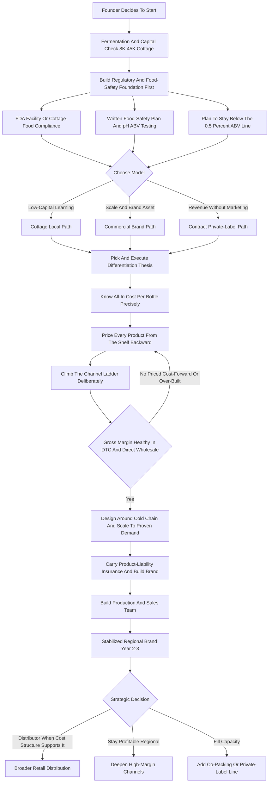

### Direct Answer

To start a kombucha business in 2027 you ferment sweetened tea with a SCOBY, package the result as bottles, cans, or kegs, and sell it through farmers markets and DTC, cafe and taproom draft, independent and natural-foods retail, and eventually distributor-fed grocery. The model is real, legal, and proven, but the easy-growth window has closed: the US category exploded above 30% annual growth in the late 2010s, then flattened to low-single-digit growth by the mid-2020s as shelf space tightened and incumbents consolidated. Success in 2027 depends on one number above all -- the all-in cost per bottle landed on a shelf, priced from the retail price backward through a 25-40% channel margin stack -- and on treating the venture as a food-manufacturing business with a fermentation core, a refrigeration problem, a regulatory file, and a brand.

**TL;DR:** A kombucha business ferments sweetened tea with a SCOBY, bottles or kegs it, and sells it as packaged retail, cafe draft, DTC, and private-label production. The category is mature, not exploding: GT's Living Foods (~$600M+), Health-Ade, Brew Dr, and Humm dominate the mainstream while a long tail of local producers fights for the rest. The governing number is cost per bottle landed on a shelf -- a 16oz bottle costing $1.10-$1.90 all-in, wholesaling at $2.20-$3.50, retailing at $3.99-$6.99 is viable; a $2.40 bottle that surrenders 35% to the channel is a money-loser dressed as a brand. A cottage launch invests **$8K-$45K** and grosses **$25K-$120K in Year 1**; a commercial scale-up invests **$60K-$250K+** and can reach **$150K-$600K by Year 2-3** at a 40-58% gross margin before distribution that compresses hard once a distributor takes its cut. Three failure modes kill startups: inconsistent fermentation and weak food safety; underpricing the channel stack; and scaling capacity ahead of real demand. Viable as a disciplined, food-safety-obsessed, channel-literate operation built on a differentiated product -- a poor fit for anyone expecting the 2010s growth curve.

## 1. What A Kombucha Business Actually Is In 2027

### 1.1 The Physical Process Versus The Business

A kombucha business is a fermented-beverage producer. You brew tea strong, dissolve sugar into it, cool it, and add a SCOBY (the symbiotic culture of bacteria and yeast) plus mature kombucha from a prior batch as starter liquid. Over roughly seven to fourteen days the culture consumes most of the sugar and produces acids, trace carbonation, a small amount of alcohol, and the characteristic tart, lightly effervescent drink. You then flavor it -- a second fermentation with fruit, juice, herbs, or spices is where most of the carbonation and the brand personality come from -- package it into bottles, cans, or kegs, keep it cold, and sell it before it ages out. That is the entire physical process, and it is genuinely simple at kitchen-counter scale, which is exactly why the category got crowded.

**The business, as opposed to the hobby, is everything around that process.** It is doing it consistently batch after batch, under a food-safety regime a regulator will accept, at a cost per bottle that survives the channel margin stack, cold from your facility to the consumer's hand, and with enough brand and distribution that the bottles move before they expire. A founder who can make one great batch has a hobby; a founder who can make the same good batch five hundred times has a business.

### 1.2 What 2027 Specifically Changed

A kombucha business in 2027 is shaped by realities that did not exist when the category was young. **The explosive-growth era is over** and the category is mature and competitive. **Shelf space in grocery and natural-foods retail is contested and expensive.** **The big players have consolidated the mainstream low-end.** **Consumers are more sophisticated** and increasingly want low-sugar, functional, or genuinely distinctive products rather than "a kombucha." And **the regulatory environment is well understood and actively enforced** -- particularly the 0.5% ABV line that separates a non-alcoholic beverage from one needing federal alcohol licensing. A kombucha business in 2027 is not a trend you ride; it is a food-manufacturing business, and the founders who succeed treat it as exactly that.

| Dimension | The 2010s Version | The 2027 Reality |
|---|---|---|
| Category growth | 30%+ annual, rising tide | Low-single-digit, mature and stable |
| Shelf access | Open, retailers seeking kombucha | Contested, slotting fees real |
| Competitive top | Fragmented, room to rise | Consolidated -- GT's, Health-Ade dominate |
| Consumer ask | "It's kombucha" sufficed | Wants low-sugar, functional, or distinctive |
| Regulatory clarity | TTB line ambiguous | 0.5% ABV line well-defined and enforced |
| Winning posture | Ride the wave | Take considered share with discipline |

## 2. The Legal And Regulatory Map

### 2.1 The 0.5% ABV Line And The TTB

Before a founder buys a single bottle, they must understand the regulatory structure, because kombucha sits on a legal fault line that has ended businesses that ignored it. **The central fact:** kombucha naturally produces alcohol as a byproduct of fermentation, and US federal law treats any beverage at or above **0.5% alcohol by volume** as an alcoholic beverage regulated by the **Alcohol and Tobacco Tax and Trade Bureau (TTB)**. Below 0.5% ABV, kombucha is a food. At or above it, the producer needs a TTB permit, owes federal excise tax, faces alcohol labeling rules, and in most states needs state alcohol licensing and must sell through the three-tier alcohol distribution system.

**The trap is that kombucha keeps fermenting.** A bottle that left the facility at 0.4% ABV can drift above 0.5% on a warm shelf, which is how compliant producers get caught by testing. The 2027 discipline: most commercial brands deliberately engineer and test their product to stay reliably below 0.5%, using cold-crashing, filtration, flash-pasteurization, controlled second fermentation, and regular ABV testing of finished product.

### 2.2 The Hard Kombucha Alternative

Some brands deliberately go the other way and make a **hard kombucha** at 4.5-7% ABV as an intentional alcoholic product with full TTB and state licensing. This is a legitimate but distinctly different business -- adult-beverage pricing, a less crowded shelf, but a heavier regulatory burden and the three-tier alcohol distribution system. A founder choosing this path is choosing a different industry, not a variation on the non-alcoholic one.

### 2.3 FDA, Food Safety, And Cottage Food Law

Beyond the alcohol question, a non-alcoholic kombucha producer must register the facility with the **FDA as a food facility**, operate under FDA food-safety regulation including a written food-safety plan under the Food Safety Modernization Act framework, comply with state and local **health department** requirements, hold the appropriate **business license** and entity registration, and meet **food labeling** requirements -- ingredients, allergens, nutrition facts, net contents. Many founders begin under a state **cottage food law**, but those laws frequently exclude fermented or pH-ambiguous products or restrict where they can be sold, so a founder must check their specific state's rules. The brands that thrive built the food-safety and ABV-control system first and the brand second.

| Requirement | Applies To | Authority | What It Means |
|---|---|---|---|
| Stay below 0.5% ABV | All non-alcoholic kombucha | TTB | Engineer and test product; no alcohol permit needed below the line |
| TTB permit + excise tax | Kombucha at/above 0.5% ABV, hard kombucha | TTB | Federal alcohol licensing, excise tax, alcohol labeling, three-tier distribution |
| FDA food facility registration | All producers (non-alcoholic) | FDA | Register the production facility before operating |
| Written food-safety plan | Commercial producers | FDA (FSMA) | Hazard analysis and preventive controls, documented |
| Health-department licensing | Commercial facility | State/local health dept | Facility inspection and approval |
| Cottage food license | Small home-scale producers | State | Often excludes or restricts fermented products -- verify by state |
| Food labeling compliance | All packaged product | FDA | Ingredients, allergens, nutrition facts, net contents |

## 3. The Three Models You Can Build

### 3.1 The Cottage/Local Model

There are three distinct ways to build a kombucha business in 2027, and choosing deliberately shapes the capital, the risk, and the ceiling. **The cottage/local model** starts small -- a state cottage-food or small-processor license, a home or shared kitchen, hand-bottling, and sales through farmers markets, a few local cafes, a small DTC subscription, and maybe a co-op. Its advantage is low capital, fast learning, direct customer contact, and cheap flavor-and-demand testing; its ceiling is the capacity of a small operation and the limits of a local market. This is where most founders should start.

### 3.2 The Commercial Brand Model

**The commercial brand model** invests in a licensed commercial production facility (owned or shared), a bottling/canning or kegging line, cold storage, and a real distribution push into grocery, natural-foods retail, and the cafe draft channel across a region or multiple states. Its advantage is scale, shelf presence, and the potential for a real brand asset; its challenge is heavy capital, the brutal channel margin stack, slotting fees, refrigerated logistics, and competing for contested shelf space against entrenched players. The wrong move is launching straight into this model with full capital before proving the product and the demand at cottage scale.

### 3.3 The Contract/Private-Label Model

**The contract/private-label model** uses production capacity -- your own or a co-packer's -- to make kombucha for other brands, retailers' private labels, cafes wanting a house kombucha, or businesses adding a beverage line. Its advantage is revenue without the marketing burden, capacity utilization, and steadier volume; its challenge is thin margins, dependence on clients, and being a manufacturer rather than a brand owner. Many durable kombucha businesses blend these: a local brand that also co-packs to fill its facility, or a producer that runs its own brand and a private-label line in parallel.

| Model | Capital | Risk | Ceiling | Best Fit |
|---|---|---|---|---|
| Cottage/local | $8K-$45K | Low | Local market, small-operation capacity | Most founders, Year 1 learning |
| Commercial brand | $60K-$250K+ | High | Regional or multi-state brand | Proven product, real capital |
| Contract/private-label | Varies; capacity-driven | Moderate (client concentration) | Manufacturing volume, thin margin | Operators wanting revenue without marketing |

## 4. The 2027 Market Reality

### 4.1 A Mature Category, Not A Growth Story

A founder needs an unsentimental read of the 2027 landscape. **The explosive-growth era is over.** Through the mid-to-late 2010s the US category grew above 30% a year as it moved from health-food curiosity to mainstream functional beverage; by the early-to-mid 2020s that growth flattened to low-single-digit percentages as the category matured, shelf space filled, and the easy converts had converted. The market is real and sizable -- industry estimates put it in the low billions of dollars annually -- but it is no longer a rising tide that lifts every boat.

### 4.2 Who Owns The Category

The category is consolidated at the top and crowded at the bottom. **GT's Living Foods**, the brand that created the modern US category under founder GT Dave, is the dominant player at an estimated $600M+ in revenue; **Health-Ade** is a major number-two; **Brew Dr Kombucha** (out of Townshend's Tea), **Humm Kombucha**, and others hold meaningful share; big beverage has been involved through **KeVita** under PepsiCo (PEP); functional-beverage consolidation has run through firms such as **Suja** under Paine Schwartz Partners; and **Trader Joe's** and others carry private-label kombucha. Below the established brands sits a long tail of small producers. The honest picture: you cannot out-distribute GT's or out-spend PepsiCo (PEP) on the mainstream shelf.

### 4.3 What Consumers Want Now

By 2027 consumers are more sophisticated and want a reason to choose a specific kombucha -- genuinely low sugar, a functional ingredient story (prebiotics, adaptogens, botanicals, and where legal CBD), a distinctive flavor identity, or a strong local brand -- because "it's kombucha" is no longer a differentiator. Hard kombucha emerged as an adjacent category, and prebiotic sodas and other gut-health drinks compete for the same shelf and consumer. Kombucha in 2027 is a legitimate, profitable category for a disciplined producer with a differentiated product, and a poor bet for a founder expecting to ride a wave that has already crested.

## 5. The Core Unit Economics

### 5.1 Cost Per Bottle: The Stack

This is the single most important section in the guide, because the entire business lives or dies on one calculation most beginners run backward. The instinct is to add up ingredient costs, add a markup, and call that the price. The discipline is the opposite: **start from the retail shelf price and work backward through the channel margin stack to find out what the bottle is allowed to cost.**

Walk the math on a 16oz bottle. The **all-in production cost** stacks up from tea and sugar (cheap, often well under $0.20); SCOBY and culture maintenance; flavoring ingredients for the second ferment ($0.10-$0.50+); the **bottle or can** ($0.25-$0.60); the **cap** ($0.03-$0.10); the **label** ($0.05-$0.20); and allocated labor, utilities, facility, cleaning, testing, and spoilage. All-in, a realistic 16oz bottle lands around **$1.10-$1.90** for a small-to-mid producer, with glass bottles and premium ingredients pushing the high end.

| Cost Line (16oz bottle) | Low | High |
|---|---|---|
| Tea and sugar | $0.04 | $0.20 |
| SCOBY / culture maintenance allocation | $0.02 | $0.10 |
| Flavoring ingredients (second ferment) | $0.10 | $0.50 |
| Bottle or can | $0.25 | $0.60 |
| Cap or lid | $0.03 | $0.10 |
| Label | $0.05 | $0.20 |
| Allocated labor, utilities, facility, testing, spoilage | $0.55 | $1.20 |
| **All-in production cost** | **$1.10** | **$1.90** |

### 5.2 The Channel Margin Stack

Now the channel. **Direct to consumer** at a farmers market or by subscription keeps most of the retail price -- $4-$8 a bottle -- and is where cottage-scale margins are healthiest. **Wholesale direct to a cafe or small retailer** might wholesale a 12-bottle case at $35-$55 (roughly $2.90-$4.60 a bottle) retailing at $4.99-$7.99. **Through a distributor into grocery**, the distributor and retailer together commonly take **25-40% or more of the retail price**, plus the retailer may charge **slotting fees** plus promotional and demo costs. The brutal arithmetic: a bottle retailing at $4.99 might net the producer only $2.20-$3.00, and if it cost $1.70 all-in, the gross margin in that channel is far thinner than the DTC math suggested.

| Channel | What The Producer Nets (16oz) | Margin Quality | Tradeoff |
|---|---|---|---|
| DTC / farmers market | $4.00-$8.00 retail, keep most | Highest | Limited reach, founder's time, no scale |
| Direct wholesale to cafe/retailer | ~$2.90-$4.60/bottle | Healthy | Account-by-account selling and delivery |
| Cafe / restaurant draft (keg) | $25-$45/gallon | Healthy, low packaging cost | Needs draft accounts and keg logistics |
| Independent / natural-foods retail | ~$2.50-$3.80/bottle | Moderate | Shelf competition, may still need a distributor |
| Distributor into chain grocery | ~$2.20-$3.00 on a $4.99 retail | Thinnest (20-35%) | Slotting fees, promos, volume demands |

### 5.3 Pricing From The Shelf Backward

The discipline this imposes: **know your all-in cost per bottle precisely, know what each channel actually pays you net, and price every product from the shelf backward.** Recognize that DTC and direct wholesale are where small producers make money while distributor-grocery is a volume-and-visibility play that only works at scale and with a tight cost structure. A founder who prices cost-forward -- ingredients plus markup -- and then enters grocery discovers, too late, that the channel keeps more of the price than the markup ever allowed for. A founder who prices shelf-backward knows before launch whether a given product can survive a given channel, and configures the product (glass versus can, premium versus standard ingredients) to fit the channels it must serve.

## 6. The Line-By-Line P&L

### 6.1 Gross Margin And Its Compression

Beyond per-bottle cost, a founder must internalize the full operating P&L, because gross margin and fixed-cost structure determine whether revenue becomes profit. **Cost of goods** is ingredients, packaging, and direct production labor and utilities. A healthy small-to-mid producer runs a **gross margin of roughly 40-58% before distribution costs** on the blended book, compressing into the **20-35% range** on volume that goes through a distributor into grocery. The founders who fail at the P&L level made two errors: they treated the DTC margin as the whole-business margin, and they underestimated the cost and loss rate of keeping a perishable product cold.

### 6.2 Fixed And Operating Costs

**Production labor** beyond the founder is a real cost as volume grows. **Facility cost** -- rent, utilities (fermentation and especially refrigeration are energy-hungry), water and sewer -- is a fixed monthly cost. **Cold storage and refrigerated logistics** is a cost beginners badly underestimate: cold storage at the facility, refrigerated transport, and spoilage of short-dated product that must be pulled is a real loss line. **Quality and compliance** -- ABV and food-safety testing, the food-safety plan, product-liability insurance -- is ongoing. **Marketing** -- branding, packaging design, market fees, sampling, trade shows -- is necessary spend. **Equipment depreciation** -- fermentation vessels, the line, refrigeration, the delivery vehicle -- is an ongoing capital reality.

| P&L Line | Nature | Notes |
|---|---|---|
| Cost of goods (ingredients, packaging, direct labor) | Variable | 42-60% of revenue blended; the per-bottle stack |
| Distribution costs (distributor margin, slotting, promos) | Channel-variable | Largest channel-specific cost; turns healthy gross to thin net |
| Facility (rent, utilities, water/sewer) | Fixed | Refrigeration and fermentation are energy-hungry |
| Cold storage and refrigerated logistics | Semi-fixed | Routinely underestimated by beginners |
| Production and delivery labor | Scales with volume | First cap on a solo founder |
| Quality, compliance, insurance | Mostly fixed | Small but non-negotiable |
| Marketing and sampling | Discretionary | Sampling converts skeptics in a polarizing-taste category |
| Equipment depreciation | Non-cash | Tanks, line, refrigeration, delivery vehicle |

### 6.3 Seasonality And The P&L Verdict

The seasonality is milder than some businesses but real -- kombucha sells better in warm-weather months. The structural truth is this: a kombucha producer can run a genuinely healthy margin in DTC and direct-wholesale channels, and a much thinner one through distribution, so the P&L is won by managing the channel mix deliberately rather than chasing grocery shelf space for its own sake.

## 7. Equipment And Facility

### 7.1 Cottage-Scale Equipment

A founder needs a concrete picture of the physical plant, because equipment and facility decisions are where capital gets committed and where over-buying ahead of demand kills startups. **At cottage/local scale**, the equipment is modest: large brewing vessels or food-grade fermentation containers, a heat source for brewing tea, temperature control for the fermentation space, bottles or jars, a capper, basic flavoring and straining tools, pH strips or a meter, labels and a way to apply them, and refrigeration for finished product. A serious cottage launch can be equipped for a few thousand dollars, often in a home kitchen (where the cottage food law allows) or a rented shared commercial kitchen by the hour.

### 7.2 Commercial-Scale Plant

**At commercial scale**, the plant grows substantially: larger stainless fermentation tanks, a controlled fermentation room, a **bottling, canning, or kegging line** (semi-automatic at first), cold storage capacity, possibly flash-pasteurization or filtration equipment, an inspected commercial facility meeting health-department and FDA requirements, cleaning and sanitation systems, lab capability, and a **refrigerated delivery vehicle** or cold-chain arrangement. A lean commercial setup using a shared facility and semi-automatic equipment might run $60K-$120K, while a fuller owned-facility build with a canning line and significant cold storage runs $150K-$250K+.

### 7.3 The Sequencing Discipline And Co-Packers

**The single most important equipment discipline is sequencing:** buy fermentation and packaging capacity to match demand you can actually prove, not demand you hope for. A canning line running at 15% of capacity is a fixed-cost anchor; a producer who steps up to semi-automatic equipment in response to real orders is scaling correctly. Many founders bridge the gap by using a **co-packer** -- a contract beverage manufacturer -- to produce at volume without owning the full line, trading margin for capital efficiency and flexibility. The facility-and-equipment rule: start lean, use shared and contract capacity to defer capital, and only buy the line when the orders to fill it genuinely exist.

## 8. Fermentation Consistency And Food Safety

### 8.1 Consistency Is The Brand

This is the operational heart of the business and the thing that separates a brand from a liability. **Consistency is the brand.** A retailer or a cafe that puts your kombucha on their shelf or tap is trusting that this week's batch tastes like last week's, has the same carbonation, the same tartness, the same ABV, and the same safety profile. Consistency comes from controlling the variables: the tea and sugar quantities, the brew strength, the fermentation temperature and time, the health and management of the SCOBY and starter liquid, the second-fermentation flavoring and timing, and the packaging conditions.

### 8.2 The Risks

**The food-safety system is non-negotiable.** Kombucha's acidity makes it relatively safe when done correctly -- the low pH inhibits dangerous pathogens -- but "done correctly" is the load-bearing phrase. The risks: mold contamination of a culture; over-fermentation pushing ABV above the 0.5% legal line or making the product unpalatably sour; under-acidification leaving a batch in an unsafe pH range; contamination from poor sanitation; and inconsistent carbonation causing under- or over-pressurized bottles, where over-carbonated glass can fail.

| Risk | What Goes Wrong | The Control |
|---|---|---|
| Mold contamination | Culture grows mold; batch unsafe | Rigorous sanitation; discard any moldy SCOBY |
| Over-fermentation | ABV crosses 0.5%; product too sour | Controlled time/temp; ABV testing; cold-crash |
| Under-acidification | Batch stays in unsafe pH range | pH test every batch before packaging |
| Sanitation failure | Cross-contamination | Documented cleaning of all surfaces/equipment |
| Carbonation failure | Bottles under/over-pressurized | Controlled second ferment; format selection |
| Warm-shelf drift | Finished product ferments further | Cold chain end to end; filtration/pasteurization |

### 8.3 The Controls

The controls: rigorous sanitation of all equipment and surfaces; **pH testing of every batch**; **ABV testing** of finished product to stay below 0.5%; careful SCOBY management and the discipline to discard any culture showing mold; controlled, monitored fermentation temperature and time; a written **food-safety plan** the FDA framework will accept; batch records and traceability so a problem batch can be pulled; and proper cold storage. The founders who treat fermentation as art and skip the testing and records end up with a moldy batch on a shelf, an ABV violation, or a retailer relationship destroyed by inconsistency. The ones who treat it as controlled food manufacturing -- art in the flavor, rigor in the process -- build something durable.

## 9. Product Differentiation

### 9.1 Why "It's Kombucha" Stopped Working

In the mature 2027 category, a founder must have a real answer to "why this kombucha and not the established brand next to it," because "it's kombucha" stopped being a reason years ago. An undifferentiated kombucha competing on shelf against GT's and Health-Ade on price and visibility is competing on the dimensions where the incumbents are strongest.

### 9.2 The Differentiation Levers

**Sugar level.** Many consumers came to kombucha for a lower-sugar alternative to soda; a genuinely low-sugar product, accurately labeled, is a real position. **Functional ingredients.** Prebiotics, added probiotics, adaptogens, botanicals, or -- where legally permitted -- CBD give a specific benefit story, inside strict labeling rules. **Flavor identity.** A distinctive, well-executed flavor lineup builds a brand consumers seek out. **Format.** Cans versus glass, draft/keg, single-serve versus multi-serve -- format choices open or close channels. **Local and origin story.** A tight local brand is a genuine moat a national brand cannot replicate locally. **Clean label and certifications.** Organic, non-GMO, raw/unpasteurized, low-sugar verification signal to a specific shopper. **Hard kombucha.** Going deliberately alcoholic is a different (alcohol-licensed) business, but a legitimate differentiation path.

| Differentiation Lever | The Consumer It Wins | The Discipline It Demands |
|---|---|---|
| Ultra-low-sugar | Soda-replacers, health-motivated | Accurate labeling, fermentation control |
| Functional ingredients | Benefit-seekers, premium buyers | Strict health-claim compliance |
| Flavor identity | Variety-seekers, brand loyalists | Consistent execution across the lineup |
| Hyper-local brand | Community-minded shoppers | Relentless local presence |
| Draft/keg format | Cafe and taproom consumers | Keg logistics and account selling |
| Hard kombucha | Adult-beverage, alcohol-alternative | Full TTB and state alcohol licensing |

### 9.3 Picking And Executing A Thesis

The strategic point: a 2027 kombucha brand needs to pick a differentiation thesis and execute it clearly -- low-sugar, functional, flavor-led, local, or format-led. The mistake is not choosing a path; it is launching an undifferentiated kombucha into a mature category and hoping. For a parallel on building a distinctive consumer brand and DTC channel from scratch, the e-commerce DTC playbook is closely instructive (q1931).

## 10. Startup Cost Breakdown

### 10.1 Cottage/Local Scale

A founder needs a clear-eyed total of what it costs to launch, because under-capitalization is a top killer. **At cottage/local scale**, the all-in breaks down roughly as: brewing and fermentation vessels and equipment ($800-$3,000); bottles, caps, and initial packaging ($500-$2,500); a capper and basic tools ($200-$1,500); refrigeration for finished product ($500-$3,000); labels, label design, and initial branding ($500-$3,000); cottage food or small-processor licensing, business formation, and permits ($200-$1,500); insurance including product liability first payment ($500-$2,000); initial ingredients ($300-$1,500); farmers market fees and initial marketing ($300-$2,000); and a working capital buffer ($1,000-$5,000). Totaled, a cottage launch realistically runs **$8,000-$45,000**.

| Cottage Launch Line | Low | High |
|---|---|---|
| Brewing and fermentation vessels and equipment | $800 | $3,000 |
| Bottles, caps, initial packaging | $500 | $2,500 |
| Capper and basic tools | $200 | $1,500 |
| Refrigeration for finished product | $500 | $3,000 |
| Labels, design, initial branding | $500 | $3,000 |
| Licensing, formation, permits | $200 | $1,500 |
| Insurance including product liability (first payment) | $500 | $2,000 |
| Initial ingredients | $300 | $1,500 |
| Farmers market fees and initial marketing | $300 | $2,000 |
| Working capital buffer | $1,000 | $5,000 |
| **Total cottage launch** | **$8,000** | **$45,000** |

### 10.2 Commercial Scale

**At commercial scale**, the lines grow substantially: a licensed commercial facility ($10,000-$60,000+); fermentation tanks and room ($10,000-$50,000); a semi-automatic bottling/canning/kegging line ($15,000-$80,000+); cold storage ($5,000-$30,000); a refrigerated delivery vehicle ($10,000-$45,000); testing and lab capability ($2,000-$10,000); FDA registration, food-safety plan, licensing, and legal ($2,000-$10,000); insurance ($2,000-$8,000); branding and initial marketing ($5,000-$30,000); initial inventory ($3,000-$15,000); and a working capital and slotting reserve ($15,000-$50,000+). Totaled, a commercial launch runs **$60,000-$250,000+**.

### 10.3 The Co-Packer Middle Path

The **co-packer path** sits in between -- a founder can build a brand and go to commercial volume using a contract manufacturer for a fraction of the facility-and-line capital, spending instead on branding, packaging, inventory, and distribution. The capital discipline: kombucha is not free to start, the refrigeration and compliance lines are routinely underestimated, and the most dangerous move is a commercial-scale facility build before cottage-scale sales have proven the product and the demand.

## 11. Building Distribution: The Channel Ladder

### 11.1 The Bottom Rungs

Distribution in kombucha is a ladder, and a founder should climb it deliberately rather than jump to the top rung. **Farmers markets and direct events** are the bottom rung and a genuinely good one -- the healthiest margins, direct feedback that sharpens the product, brand visibility, and cash flow with no distributor and no slotting. **DTC and subscription** similarly preserves margin and builds a loyal base, though shipping a refrigerated product is a real constraint.

### 11.2 The Middle And Top Rungs

**Local cafes, restaurants, and taprooms** are the next rung -- selling wholesale by the case or, powerfully, on **draft from a keg**, which is lower-packaging-cost, builds local visibility, and creates a recurring account. Direct wholesale to **independent grocers, co-ops, and natural-foods stores** is the rung where a producer becomes a packaged brand on a shelf. **Distributor relationships** are the top rung -- a distributor gets the product into many stores at once, including chain grocery, but takes a substantial margin, and chain placement often means slotting fees and promotional commitments.

| Channel Ladder Rung | Typical Stage | Capital / Effort | Why You Climb It |
|---|---|---|---|
| Farmers markets and events | Cottage, Year 1 | Low; founder's weekend time | Best margin, direct feedback, cash flow |
| DTC and local subscription | Cottage, Year 1-2 | Low; cold-pack shipping constraint | Loyal base, preserved margin |
| Cafes, restaurants, taprooms (draft) | Year 1-2 | Keg logistics, account selling | Recurring accounts, low packaging cost |
| Independent grocers and co-ops | Year 2-3 | Direct wholesale, merchandising | Becomes a packaged brand on a shelf |
| Beverage distributor into grocery | Year 3+ | Slotting fees, promos, volume | Broad reach -- only when cost structure supports it |

### 11.3 The Draft Channel And The Recurring Mistake

**The draft/keg channel deserves special emphasis** -- it is capital-light on packaging, builds local brand presence in cafes and taprooms, and is a channel the big national brands serve less aggressively. The distribution mistake that recurs: a founder rushes to a distributor for the prestige of grocery shelf placement, surrenders the margin, cannot fund slotting, and discovers the volume does not cover the thin per-bottle net -- when a deliberate climb up the channel ladder would have built a profitable business at the lower, higher-margin rungs first. The juice-bar and coffee-cart models face the same direct-channel-first economics (q2001) (q2000).

## 12. The Refrigeration And Shelf-Life Problem

### 12.1 A Live, Perishable Product

A founder must treat cold chain and shelf life as a core operating constraint. **Kombucha is a live, perishable, refrigerated product.** Unpasteurized kombucha continues to slowly ferment, so it must stay cold from packaging until the consumer drinks it -- cold storage at the facility, refrigerated transport, cold shelf space at the store. Warm exposure accelerates fermentation, can push ABV over the legal line, builds carbonation pressure, and degrades flavor.

### 12.2 Shelf Life, Geography, And Loss

**Shelf life is limited** -- typically weeks to a few months refrigerated -- so a producer cannot build large finished-goods inventory as a buffer; production must track sales closely. **The geographic constraint is real:** the cold-chain requirement and short shelf life make distant distribution expensive and risky, which is part of why local and regional brands have a defensible position. **The loss line is real:** short-dated product pulled from shelves, batches that do not sell, returns -- a producer must budget a spoilage percentage and minimize it through demand-matched production and good rotation. The discipline of running a perishable, short-shelf-life product is shared with other food businesses (q2003).

### 12.3 The Pasteurization Tradeoff

**Pasteurization and filtration** can extend shelf life and stabilize ABV, at the cost of the "raw/live" positioning some consumers value -- a real product and brand decision. Design the business around the cold chain from day one: size production to demand, build or arrange adequate cold storage and transport, choose channels and geography the cold chain can serve, and treat spoilage as a managed cost line, not a surprise.

## 13. The Operating Journey: Recipe To Stabilized Brand

## 14. Five Named Operating Scenarios

### 14.1 Priya, The Disciplined Local Brand

Priya launches at cottage scale with $14K, sells at three farmers markets and builds a small DTC subscription, obsesses over fermentation consistency and a distinctive flavor lineup, adds local cafe draft accounts in Year 1, grosses about $70K at healthy DTC-and-wholesale margins, reinvests into a shared commercial kitchen and semi-automatic bottling, and reaches roughly $260K by Year 3 as a respected regional brand -- profitable because she climbed the channel ladder and never surrendered margin she did not have to.

### 14.2 Marcus, The Over-Build Cautionary Tale

Marcus raises $180K and goes straight to a commercial facility build with a canning line, betting on grocery distribution; the line runs at a fraction of capacity, a distributor takes 30%+ of the price, slotting fees drain the reserve, and a warm-shelf ABV scare costs him a chain account -- he is cash-strapped by month fourteen with a facility he cannot fill.

### 14.3 Lena, The Functional Specialist

Lena differentiates hard on low-sugar plus a prebiotic and adaptogen story, prices at a premium the position supports, sells through natural-foods retail and DTC, stays disciplined on health-claim labeling, and builds a defensible niche brand at roughly $400K by Year 4 because the differentiation gives her pricing power.

### 14.4 The Okafor Family, Co-Packer-Leveraged Brand

The Okafors skip the facility build entirely, contract production to a co-packer, and spend their capital on branding, packaging, and distribution; they trade per-bottle margin for capital efficiency, scale faster than a facility build would allow, and reach multi-state retail by Year 3 -- a legitimate path, dependent on the co-packer relationship and a tight cost structure.

### 14.5 Dev, The Hard-Kombucha Pivot

Dev starts as a non-alcoholic producer, sees the margin pressure, gets full TTB and state alcohol licensing, and reformulates a hard kombucha line at 5-6% ABV sold through the alcohol three-tier system into bars and bottle shops -- a different and more heavily regulated business, but one with adult-beverage pricing and a less crowded shelf. The licensing and three-tier reality here mirrors craft brewing and distilling (q1941) (q9606).

| Scenario | Capital In | Path | Outcome |
|---|---|---|---|
| Priya -- disciplined local | $14K | Channel-ladder climb | ~$260K by Year 3, profitable |
| Marcus -- over-build | $180K | Straight to facility/canning line | Cash-strapped by month 14 |
| Lena -- functional specialist | Moderate | Low-sugar + functional niche | ~$400K by Year 4, strong margins |
| Okafor family -- co-packer | Branding capital | Contract manufacturing | Multi-state retail by Year 3 |
| Dev -- hard kombucha pivot | Re-licensed | TTB-licensed 5-6% ABV | Adult-beverage pricing, less crowded shelf |

## 15. Marketing And Brand In A Crowded Category

### 15.1 Packaging Is The First Marketing

In the mature 2027 category, brand is not decoration -- it is the mechanism by which a bottle gets chosen over the established competitor beside it. **Packaging is the first marketing.** On a contested shelf, the bottle design, label clarity, and immediate communication of the differentiation thesis do the work in the two seconds a shopper spends.

### 15.2 Local Presence And Sampling

**The local presence is the foundation for a local brand** -- farmers markets, cafe taps, co-op shelves, and events build community familiarity a national brand cannot buy locally. **Sampling and demos** matter more in beverage than in many categories -- kombucha has a polarizing taste, and getting it into mouths converts skeptics and builds the repeat purchase that sustains the business. **Social and content** builds the narrative and the DTC channel inside the labeling rules. **Trade shows and the natural-foods circuit** are how a brand gets in front of buyers and distributors.

### 15.3 The Repeat Customer Is The Asset

**The repeat customer is the real asset** -- kombucha is a habit-and-routine product, so a brand's economics depend on conversion to repeat purchase far more than on one-time trial. A 2027 kombucha brand competes on a clear differentiation thesis communicated relentlessly through packaging, local presence, sampling, and the founder's story -- not on out-spending incumbents, which is impossible.

## 16. Staffing And Operations As You Grow

### 16.1 The Hiring Sequence

A founder can run a cottage kombucha operation nearly solo, but the business does not scale without people. **At cottage scale**, the founder does everything -- brewing, flavoring, bottling, labeling, cleaning, testing, selling, deliveries, the books, and the regulatory file. **The first hires** are usually **production help**, because production labor is the first thing that caps a solo founder. **Sales and delivery** help comes next as wholesale accounts multiply. As volume grows, a **production manager** to own consistency and food safety, a **quality and compliance** function for batch testing and the regulatory relationship, and eventually **operations and administrative** roles.

### 16.2 How Co-Packing Changes The Math

**Co-packing changes the staffing math** -- a brand using a contract manufacturer needs far fewer production staff and more sales, marketing, and account-management people. The strategic point: kombucha is a food-manufacturing-and-distribution business, and it is staffed like one -- the founders who scale build a real production team with genuine ownership of consistency and food safety, rather than trying to personally hand-bottle their way to volume.

## 17. The Year-One Operating Reality

### 17.1 Product-Proving, Not Profit-Extraction

A founder should walk into Year 1 with accurate expectations. Year 1 is **product-proving and demand-learning mode, not profit-extraction mode.** The first year is spent achieving genuine fermentation consistency -- harder than the hobby suggested -- building and documenting the food-safety system, learning which flavors actually sell in the local market, discovering the real all-in cost per bottle, climbing the first rungs of the channel ladder, and finding out where the operation is fragile.

### 17.2 The Honest Year-One Numbers

A disciplined cottage-scale Year 1 realistically generates **$25,000-$120,000 in revenue** at thin owner profit, because the founder is reinvesting and volume is small; a commercial-scale launch can show more revenue but often less profit, because facility and equipment fixed costs are absorbed before distribution has ramped. The founders who succeed treat Year 1 as paid tuition in fermentation consistency, food safety, channel economics, and local demand. The ones who fail expected the 2010s growth curve and were unprepared for the rigor, the regulatory and refrigeration burden, and the bite of the channel margin stack.

## 18. The Three-To-Five-Year Revenue Trajectory

### 18.1 The Year-By-Year Arc

Mapping a realistic multi-year arc helps a founder size the opportunity honestly. **Year 1:** cottage or early-commercial scale, product-proving, $25K-$120K revenue, thin owner profit. **Year 2:** the operation steps up -- a shared or owned commercial kitchen, semi-automatic bottling, the first production hire, deeper cafe and retail accounts; revenue climbs to roughly **$120K-$350K** with owner profit still modest. **Year 3:** a real packaged-beverage business -- a licensed facility or a solid co-packer relationship, a small team, regional retail and draft presence; revenue lands around **$250K-$600K** with owner profit becoming meaningful. **Year 4-5:** continued expansion -- broader regional or multi-state distribution, possible format expansion, a deeper team; revenue for a well-run operation can reach the **mid-six figures to low-seven figures**.

| Year | Stage | Revenue Range | Owner Profit | Founder Role |
|---|---|---|---|---|
| Year 1 | Cottage / early-commercial, product-proving | $25K-$120K | Thin | Doing everything |
| Year 2 | Shared/owned kitchen, first hire | $120K-$350K | Modest, reinvesting | Producing and selling |
| Year 3 | Real packaged-beverage business, small team | $250K-$600K | Meaningful if disciplined | Managing the system |
| Year 4-5 | Regional/multi-state, format expansion | Mid-six to low-seven figures | Depends on channel mix | Managerial; strategic choices |

### 18.2 What The Numbers Assume

These numbers assume disciplined fermentation consistency, a real differentiation thesis, channel-ladder discipline, and a cost structure built from the shelf backward. They do not assume the explosive category growth of the 2010s -- a 2027 kombucha business grows by taking considered share with a differentiated product and a tight operation, not by riding a wave.

## 19. Risk Management And Insurance

### 19.1 The Major Risks And Their Mitigations

The kombucha model carries specific risks, and the 2027 operator manages each deliberately. **Food-safety and contamination risk** is mitigated by rigorous sanitation, pH testing every batch, careful SCOBY management, a written food-safety plan, and batch records. **ABV-compliance risk** is mitigated by engineering below 0.5%, testing finished product, and controlling the cold chain. **Product-liability risk** -- an ingestible product can make someone ill, or a bottle can fail under pressure -- is mitigated by **product liability insurance** (essential, non-optional). **Spoilage and cold-chain risk** is mitigated by demand-matched production and a budgeted spoilage line. **Channel-concentration risk** is mitigated by a diversified channel mix. **Regulatory risk** is mitigated by getting the file right from day one. **Capital risk** -- over-building ahead of demand -- is mitigated by the co-packer and shared-facility paths.

| Risk | Mitigation |
|---|---|
| Food-safety / contamination | Sanitation, pH testing every batch, food-safety plan, batch records |
| ABV compliance (0.5% line) | Engineer below the line, test finished product, control cold chain |
| Product liability | Product-liability insurance (non-optional), carbonation control |
| Spoilage / cold-chain | Demand-matched production, budgeted spoilage line, rotation |
| Channel concentration | Diversified mix -- DTC, draft, direct wholesale, retail |
| Regulatory | Correct FDA/health/TTB file from day one, maintained |
| Capital over-build | Co-packer and shared-facility paths; scale to proven orders |

### 19.2 The Throughline

The throughline: every major risk in kombucha has a known mitigation built from food-safety rigor, ABV control, insurance, channel diversification, and capital discipline -- and the operators who fail are usually the ones who treated fermentation casually, skipped the testing, under-insured an ingestible product, or built capacity on hope.

## 20. Competitor Landscape: Who You Are Up Against

### 20.1 The Incumbents

**The category leaders** -- GT's Living Foods at an estimated $600M+ in revenue and Health-Ade as a major number-two -- have national distribution, brand recognition, and scale economics a startup cannot match head-on. **The established national and large-regional brands** -- Brew Dr Kombucha, Humm Kombucha, and others -- hold meaningful share. **Big beverage** -- through KeVita under PepsiCo (PEP) -- brings distribution muscle and capital. **The long tail of small local and regional producers** is the cohort a new entrant most directly competes with. **Adjacent functional beverages** -- prebiotic sodas, other gut-health drinks -- compete for the same shelf and consumer.

### 20.2 Where A New Entrant Actually Wins

You cannot out-distribute GT's, out-spend big beverage, or win contested chain-grocery shelf space on price and visibility against the incumbents. You win by being something the incumbents are not -- unmistakably the low-sugar one, the functional one, the distinctive-flavor one, the local one, or the draft-channel one -- and by climbing the higher-margin channel ladder where the incumbents' scale advantage is weakest. The competitive moat in kombucha is not the recipe -- anyone can ferment tea -- it is the **consistent product, the food-safety and ABV-control system, the differentiation thesis, the local brand and relationships, and the disciplined channel-and-cost structure**, all of which take years to build.

## 21. Financing The Business

### 21.1 Self-Funding And Reinvested Cash Flow

Because kombucha spans a wide capital range, a founder should match the financing to the scale and the path. **Self-funding at cottage scale** is the most common and often wisest start -- the $8K-$45K cottage launch is within reach of personal savings, and bootstrapping forces the channel-ladder discipline that makes the business healthy. **Reinvested cash flow** funds most healthy growth from cottage to small-commercial scale.

### 21.2 Equipment Finance, SBA, And The Co-Packer Path

**Equipment financing** fits the commercial-scale lines -- fermentation tanks, the line, refrigeration, the delivery vehicle are tangible assets a lender will finance. **SBA and small-business loans** can fund a broader commercial launch including facility build-out and working capital. **The co-packer path is itself a financing strategy** -- a contract manufacturer converts a large fixed capital requirement into a variable per-unit cost. **Local and food-focused funding** -- regional small-business programs, food-and-beverage incubators, crowdfunding (which doubles as marketing), and angel investment -- can fund a brand-building launch. The financing discipline: start with self-funding and reinvested cash flow at cottage scale; use equipment financing, SBA lending, or the co-packer path to step up; and be cautious about raising capital that assumes a growth rate the 2027 category no longer delivers.

## 22. Taxes And Business Structure

### 22.1 Entity And Classification

Most kombucha producers form an LLC or S-corp for liability protection -- important for an ingestible product -- and tax flexibility; the entity holds the facility lease, the licenses, the insurance, the co-packer and distributor agreements, and the wholesale accounts. **The food-and-beverage manufacturing classification** brings specific licensing, registration, and inspection obligations -- FDA registration, state and local health, and the TTB question near the alcohol line.

### 22.2 Depreciation, COGS, And Sales Tax

**Equipment depreciation** -- fermentation tanks, the line, refrigeration, the delivery vehicle -- is central to the tax picture in capex-heavy years, and accelerated or first-year expensing can materially shape taxable income. **Cost of goods accounting** -- tracking ingredient, packaging, and production cost accurately -- is essential both for tax and for the per-bottle economics the business depends on. **Sales tax** treatment of beverages varies by jurisdiction and channel. **Payroll taxes** on production, sales, and delivery staff are a real budgeted cost. The discipline: separate business banking from day one, a bookkeeping system that tracks COGS precisely, and an accountant who understands food-and-beverage manufacturing.

## 23. Owner Lifestyle: What Running This Feels Like

### 23.1 The Daily Texture

In **Year 1**, running a cottage operation, the founder is fully hands-on -- brewing batches, managing fermentation, doing the second ferment and flavoring, bottling and labeling, the relentless cleaning and sanitation, testing pH and ABV, keeping batch records, loading the cold storage, at the farmers market on Saturday, doing cafe deliveries on the cold chain. It is physical, detail-intensive, and rhythmic -- fermentation runs on its own clock. By **Year 2-3**, with production help, the founder's role shifts toward managing the production system and the food-safety program, building accounts, and watching the channel-mix economics. By **Year 3-5**, with a real team, the founder can run a larger operation with a more managerial rhythm -- but kombucha never becomes passive.

### 23.2 The Emotional Reality

There is real satisfaction in a perfectly consistent batch, a great new flavor that sells, a cafe tap that reorders, a brand that locals seek out; and real stress in a batch that goes wrong, an ABV scare, a cold-storage failure, a slow market season, and the grind of the channel margin stack. A founder who genuinely enjoys fermentation, food craft, the rhythm of production, and direct selling will find it rewarding; a founder who wanted a hands-off beverage brand will be surprised by the rigor and the regulation.

## 24. Niche And Specialty Paths

### 24.1 The Specialty Options

Beyond the general model, several focused niches can be the better business for some operators. **The functional-ingredient specialist** serves a benefit-seeking consumer at premium pricing. **The ultra-low-sugar brand** directly addresses the original reason many consumers came to kombucha. **The hyper-local craft brand** builds a moat a national brand cannot replicate locally. **The draft-and-taproom specialist** is capital-light on packaging and plays in a channel the big brands serve less aggressively. **The hard-kombucha producer** is a separate, more regulated business with adult-beverage pricing. **The co-packer and private-label manufacturer** is a manufacturing business with steadier volume and thinner margins. **The kombucha-adjacent fermenter** extends into water kefir, jun, or fermented sodas.

### 24.2 Why The Niche Can Win

The strategic point: the general local-brand model is the most common starting point, but the specialty paths can deliver better margins, a more defensible position, or a capital structure that fits the founder -- and many mature operators run a differentiated brand with a co-packing or draft arm layered on.

## 25. Counter-Case: When NOT To Start A Kombucha Business

### 25.1 The Honest Disqualifiers

Most of this guide explains how to build the business well; intellectual honesty requires the opposite case. **Do not start a kombucha business in 2027 if you expect the 2010s growth curve.** The category is mature; a plan that assumes 30% annual category tailwind is built on a curve that has already crested, and a founder counting on the wave will be disappointed by the reality of grinding for considered share. **Do not start if you are unwilling to become a disciplined fermenter.** The product is a biological process -- if you will not pH-test every batch, control variables, keep records, and discard a questionable culture, you will eventually put a moldy or non-compliant batch on a shelf, and that ends retail relationships and invites regulatory trouble.

### 25.2 The Structural Mismatches

**Do not start if you cannot tolerate the regulatory and refrigeration burden.** The FDA file, the health-department inspections, the labeling rules, the TTB 0.5% line, and the permanent cold-chain dependency are not phases that pass -- they are structural features of the business forever. **Do not start if you want a hands-off beverage brand.** Kombucha is a food-manufacturing-and-distribution business; it demands physical, rhythmic, daily work. **Do not start with no differentiation thesis.** An undifferentiated kombucha launched against GT's and Health-Ade competes exactly where the incumbents are strongest and loses. **Do not start under-capitalized.** A launch with no working-capital buffer and no slotting reserve has no cushion for the slow season or the channel costs. **Do not start by building a commercial facility first.** A canning line and a 20-barrel setup bought before the sales exist is a fixed-cost anchor that drowns the business. If several of these describe you, the right move is to start smaller, defer with a co-packer, or not start at all -- which is a better outcome than a moldy batch, an ABV violation, and a facility you cannot fill.

| Disqualifier | Why It Is Fatal |
|---|---|
| Expecting 2010s category growth | Plan built on a crested curve; no tailwind exists |
| Unwilling to be a disciplined fermenter | Biological process; casual handling ends in moldy/non-compliant batches |
| Cannot tolerate regulation and cold chain | Permanent structural features, not phases |
| Wants a hands-off brand | It is daily, physical food manufacturing |
| No differentiation thesis | Competes where incumbents are strongest |
| Under-capitalized | No cushion for slow season or channel costs |
| Builds the facility first | Fixed-cost anchor before demand exists |

## 26. Common Year-One Mistakes That Kill The Business

### 26.1 The Recurring Failure Modes

A founder can avoid most failure modes simply by knowing them in advance. **Inconsistent fermentation** -- treating it as art and skipping the controls -- is the most common product-level killer. **Weak food safety** -- skipping pH testing, sloppy sanitation, no written plan -- invites contamination or a regulatory problem. **Pricing cost-forward instead of shelf-backward** -- not understanding the 25-40%+ channel margin stack -- turns a healthy-looking gross margin into a money-losing channel. **Over-building capacity ahead of demand** creates a fixed-cost anchor. **Underestimating refrigeration and shelf life** lets the loss line eat the margin. **No differentiation** competes where the incumbents are strongest. **Rushing to a distributor** surrenders margin the business needs.

### 26.2 The Rest Of The Checklist

**Thin or missing product-liability insurance** turns one bad event into a business-ending loss. **Ignoring the regulatory file** creates a compliance crisis. **Under-capitalization** leaves no cushion. **Treating Year 1 as a profit year** expects extraction before the product and channel mix are proven. Every one of these is avoidable; the founders who fail almost always made three or four of them, and the founders who succeed treated this list as a pre-launch checklist.

## 27. A Decision Framework: Should You Actually Start This

### 27.1 The Six Self-Assessment Questions

A founder deciding whether to commit should run a structured self-assessment. **Fermentation competence and willingness:** are you willing to become a genuinely consistent, food-safety-disciplined fermenter? **Capital:** do you have $8K-$45K for a disciplined cottage launch, or financing plus a co-packer relationship for a commercial launch, with a working-capital buffer? **Channel literacy:** are you willing to learn and respect the channel margin stack, price from the shelf backward, and climb the channel ladder deliberately? **Regulatory tolerance:** can you handle the FDA, health-department, labeling, and TTB-line compliance burden permanently? **Differentiation:** do you have a real, executable differentiation thesis? **Realistic growth expectations:** do you understand that the category is mature and you are taking considered share, not riding a wave?

### 27.2 Reading The Answers

If a founder answers yes across all six, a kombucha business in 2027 is a legitimate and achievable path to a real food-and-beverage small business. If they answer no on fermentation competence or regulatory tolerance, they should not start. If they answer no on capital, they should start smaller at cottage scale. The framework's purpose is to convert an enthusiasm for kombucha into an honest, structured decision about the food-manufacturing-and-distribution business underneath.

## 28. Scaling, Exit, And The 2027-2030 Outlook

### 28.1 Scaling Past The First Stage

The jump from a proven cottage operation to a real commercial brand is its own challenge. The prerequisites: the product must be genuinely consistent and the food-safety system documented; the differentiation thesis must be proven; the per-bottle cost structure must survive the channels you intend to grow into; and cash flow plus financing must support the step-up without over-building. The levers: step up capacity in proven increments; deepen the higher-margin channels first; add the production and sales team; expand geography only as far as the cold chain can serve; and layer a co-packing or private-label line to fill facility capacity. The founders who scale well proved the product, the differentiation, and the cost structure at small scale first.

### 28.2 Exit Strategies

Kombucha businesses can be exited, and a founder should build with the eventual exit in mind. **Sell the operating business** -- a brand with a consistent product, a documented food-safety system, established distribution, and clean books is a saleable asset. **Strategic acquisition** is real -- larger beverage companies have acquired kombucha brands, and the consolidation that built today's landscape is itself an exit channel. **Sell the assets** -- the facility, the fermentation and packaging equipment, and the cold storage have resale value, a floor a pure-services business lacks. **Transition to family or a key employee** is viable with a trained successor. **Wind down gracefully** by selling equipment and inventory.

### 28.3 The 2027-2030 Outlook

The category stays mature, not exploding. Differentiation pressure intensifies as the undifferentiated middle gets squeezed. Functional and low-sugar positioning strengthens. Hard kombucha remains a distinct adjacent opportunity. Competition from prebiotic sodas keeps rising. Local and regional brands keep a defensible position thanks to the cold chain. Consolidation continues -- both a competitive pressure and an exit channel. The net outlook: kombucha is **viable and durable through 2030 in its disciplined, food-safety-obsessed, differentiated, channel-literate, regionally-anchored form** -- and a struggle for the undifferentiated, cost-forward-priced, distributor-rushing, capacity-over-built operation expecting a wave that has crested.

## 29. The Final Framework: Building It Right From Day One

### 29.1 The Twelve-Step Order Of Operations

Pulling the playbook into a single operating framework, a founder who wants to succeed should execute in this order. **First**, get honest about fermentation competence and capital. **Second**, build the regulatory and food-safety foundation first -- FDA registration or cottage-food compliance, the written plan, the pH and ABV testing regime, and a plan to stay reliably below 0.5% ABV. **Third**, choose your model deliberately. **Fourth**, pick and execute a differentiation thesis. **Fifth**, know your all-in cost per bottle precisely and price from the retail shelf backward. **Sixth**, climb the channel ladder deliberately. **Seventh**, design the business around the cold chain. **Eighth**, scale capacity only to proven demand. **Ninth**, carry real product-liability insurance. **Tenth**, build the brand through packaging, local presence, and sampling. **Eleventh**, build a real production and sales team. **Twelfth**, keep the exit options open.

### 29.2 The Verdict

Do these twelve things in order and a kombucha business in 2027 is a legitimate path to a real food-and-beverage small business. Skip the discipline -- especially on fermentation consistency, food safety, shelf-backward pricing, and capacity sequencing -- and it is a fast way to a moldy batch, an ABV violation, a money-losing grocery shelf, and a facility you cannot fill. The business is neither the explosive growth story of the 2010s nor a dead category. It is a mature, regulated, refrigeration-dependent food-and-beverage business, and in 2027 it rewards exactly one kind of founder: the disciplined, food-safety-obsessed, channel-literate operator who treats it as the food-manufacturing business it actually is.

## 30. Related Entries

For founders researching adjacent food-and-beverage and brand-building models, these sibling guides apply directly:

- **The fermentation and beverage-manufacturing sibling** -- the closest adjacent model, sharing fermentation, licensing, and packaging dynamics (q1941).
- **The craft distillery model** -- the parallel for the hard-kombucha path, with full TTB licensing and three-tier alcohol distribution (q9606).
- **The juice bar model** -- a perishable-beverage business with comparable freshness and direct-channel economics (q2001).
- **The cottage food bakery model** -- the cottage-food-law, short-shelf-life, food-safety parallels for a home-scale start (q2003).
- **The e-commerce DTC brand model** -- the playbook for building a differentiated consumer brand and a DTC channel from scratch (q1931).
- **The coffee cart model** -- a low-capital, local, direct-sales beverage operation with adjacent channel economics (q2000).
- **The nano brewery model** -- a small-scale fermented-beverage producer with comparable capacity-sequencing discipline (q9605).

## Sources

1. **GT's Living Foods -- Category-Leading Kombucha Brand** -- The dominant US kombucha brand, founded by GT Dave, that effectively created the modern category; reference for category scale and leadership. https://www.gtslivingfoods.com
2. **Health-Ade Kombucha -- Major National Kombucha Brand** -- A leading number-two national kombucha brand; reference for the competitive landscape. https://www.health-ade.com
3. **Brew Dr Kombucha -- National Kombucha Brand (Townshend's)** -- Established national kombucha brand; competitive-landscape reference. https://brewdrkombucha.com
4. **Humm Kombucha -- National Kombucha Brand** -- Established national and regional kombucha brand. https://www.hummkombucha.com
5. **KeVita (PepsiCo) -- Big-Beverage Fermented Drink Brand** -- PepsiCo-owned fermented and probiotic beverage brand; reference for big-beverage involvement in the category. https://www.kevita.com
6. **Alcohol and Tobacco Tax and Trade Bureau (TTB) -- Kombucha and the 0.5% ABV Line** -- Federal regulator; the authority on the 0.5% ABV threshold, alcohol permitting, and excise tax for kombucha. https://www.ttb.gov
7. **TTB -- Kombucha Guidance and FAQs** -- Federal guidance specifically addressing kombucha, ABV testing, and when a producer needs an alcohol permit. https://www.ttb.gov/kombucha
8. **FDA -- Food Facility Registration** -- Federal requirement for registering a food production facility; foundational compliance for a kombucha producer. https://www.fda.gov/food/online-registration-food-facilities
9. **FDA -- Food Safety Modernization Act (FSMA) Resources** -- The federal food-safety framework, including the written food-safety plan requirements relevant to beverage producers. https://www.fda.gov/food/food-safety-modernization-act-fsma
10. **Kombucha Brewers International (KBI) -- Industry Trade Association** -- The kombucha-industry trade group; resource for standards, the ABV question, and category data. https://kombuchabrewers.org
11. **US Small Business Administration (SBA) -- Business Structures and Financing** -- Reference for entity selection, SBA loans, and small-business financing. https://www.sba.gov
12. **US Small Business Administration -- Licenses and Permits** -- Reference for the federal, state, and local licensing a food producer needs. https://www.sba.gov/business-guide/launch-your-business/apply-licenses-permits
13. **IRS -- Depreciation, Section 179, and Bonus Depreciation Guidance** -- Tax treatment of fermentation, packaging, and refrigeration equipment as depreciable assets. https://www.irs.gov
14. **State Cottage Food Law References -- Fermented Product Restrictions** -- State-by-state cottage food laws, which frequently restrict or exclude fermented and pH-ambiguous products.
15. **State and Local Health Department -- Food Production Facility Requirements** -- State and local health-department licensing and inspection requirements for a commercial kombucha facility.
16. **FDA -- Food Labeling Guide** -- Federal requirements for ingredient lists, allergen labeling, nutrition facts, and net contents on a beverage. https://www.fda.gov/food/food-labeling-nutrition
17. **Suja Organic (Paine Schwartz Partners) -- Functional Beverage and Kombucha** -- Functional-beverage company under private-equity ownership; reference for the functional-beverage and consolidation landscape. https://www.sujaorganic.com
18. **Trader Joe's -- Private-Label Kombucha** -- Major retailer carrying private-label kombucha; reference for the private-label channel. https://www.traderjoes.com
19. **Specialty Food Association -- Natural and Specialty Foods Industry** -- Industry group and trade-show organizer relevant to natural-foods retail and distribution. https://www.specialtyfood.com
20. **Beverage Industry and Functional-Beverage Trade Coverage** -- Ongoing journalism on kombucha category growth, maturation, and competitive dynamics.
21. **Co-Packer and Contract Beverage Manufacturer Directories** -- References for contract beverage manufacturing as a capital-efficient production path.
22. **Glass and Aluminum Beverage Packaging Suppliers** -- Bottle, can, cap, and label pricing references for the per-bottle cost stack.
23. **Beverage Distributor and DSD (Direct Store Delivery) References** -- Reference for distributor margin structures, slotting fees, and the channel margin stack.
24. **Refrigerated Logistics and Cold-Chain Provider References** -- Reference for cold storage and refrigerated transport requirements and costs.
25. **Product Liability Insurance for Food and Beverage Producers** -- Coverage references for the essential product-liability protection an ingestible fermented product requires.
26. **Equipment Leasing and Finance Association (ELFA)** -- Reference for equipment financing structures applicable to fermentation and packaging lines. https://www.elfaonline.org
27. **SCORE -- Small Business Mentoring and Planning Resources** -- Business planning, cash-flow, and food-business guidance for small producers. https://www.score.org
28. **BizBuySell -- Business Valuation and Sale Listings (Food and Beverage)** -- Reference for going-concern valuations and exit multiples in the food-and-beverage category. https://www.bizbuysell.com
29. **Fermentation and Brewing Equipment Suppliers** -- Fermentation vessel, tank, and packaging-line pricing references for the equipment and facility budget.
30. **Farmers Market Association and Local Market References** -- Reference for the farmers market channel, fees, and direct-sales economics.
31. **State Sales Tax Authorities -- Beverage and Wholesale Taxability** -- Reference for sales-tax treatment of beverages across DTC, wholesale, and retail channels.
32. **US Department of Labor -- Payroll and Employment Guidance** -- Reference for production, sales, and delivery staffing and payroll-tax obligations. https://www.dol.gov
33. **Hard Kombucha and Alcoholic-Beverage Regulatory References** -- TTB and state references for the hard-kombucha path at 4.5-7% ABV.
34. **Natural Products Expo and Trade-Show References** -- The natural-products industry circuit where beverage brands meet buyers and distributors.
35. **Functional-Beverage and Gut-Health Category Market Reports** -- Industry data supporting the mature-category, low-single-digit-growth thesis for US kombucha.
