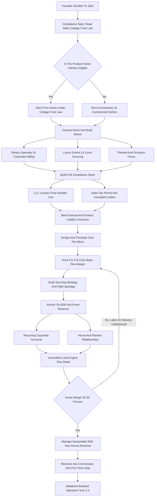

### Direct Answer

To start a charcuterie board business in 2027, you build a small, branded food operation that assembles cheese, cured meats, fruit, nuts, crackers, dips, and accompaniments into visually striking boards, boxes, cones, and grazing tables, then sells them for gifting, parties, weddings, and corporate events. The model is real and reachable but no longer the easy money it looked like in 2021-2023 — most metros are now saturated with generic "cheese plate in a box" sellers competing on price, and the operators who win pick a niche, build a real brand, anchor on recurring corporate and event revenue, and price for labor and design rather than just marking up the ingredients. Treat it as a compliance-sensitive, hands-on, seasonal food business and it is a legitimate path to a $120K-$300K branded operation by Year 3; treat it as a passive aesthetic side hustle and it stagnates as one more anonymous price-taker in an oversupplied feed.

**TL;DR:** A solo founder operating under a state cottage food law (or renting a commissary) invests roughly **$2,000-$12,000** to launch, runs a **35-55% gross margin after ingredients**, and in a realistic Year 1 does **$15K-$70K in revenue** off 60-250 orders against **$8K-$45K in owner profit** — almost all part-time and lumpy around the November-December holiday peak. By Year 2-3, a focused operator who escaped the commodity trap reaches **$80K-$300K revenue** and **$35K-$140K owner profit** by moving into a commercial kitchen, hiring part-time assemblers, and anchoring on recurring corporate accounts and booked event work. The three things that kill charcuterie startups: competing as an undifferentiated commodity, ignoring or misreading food-safety and cottage food law, and underpricing the labor and design time. Net: viable in 2027 as a branded, niche-focused, B2B-anchored food business — and a poor fit for anyone who wants quick passive income selling generic boxes into an oversupplied Instagram market.

## 1. What A Charcuterie Board Business Actually Is In 2027

### 1.1 The core model: curator and assembler, not restaurant

A charcuterie board business buys cheese, cured and cooked meats, fresh and dried fruit, nuts, olives, crackers, breads, jams, honey, spreads, chocolate, and edible garnish, and **assembles them into arranged, visually composed boards, boxes, cones, cups, and grazing tables** that customers buy for gifting, hosting, celebrating, and corporate events. **You are not inventing food and you are not a restaurant** — you are a curator and an assembler. The value you sell is selection, arrangement, presentation, convenience, and brand, layered on top of ingredients a customer could in theory buy themselves. That distinction matters because it defines both the opportunity (low capital, low food-science complexity) and the threat (low barrier to entry, easy to copy, easy to commoditize).

### 1.2 Why the category exploded — and why the easy phase is over

The category exploded between roughly 2020 and 2024 because three things collided: people were hosting and gifting more, "grazing" and charcuterie became an aesthetic trend, and **TikTok and Instagram made an artfully built board into shareable content that marketed itself**. That wave pulled tens of thousands of home cooks, caterers, and side-hustlers into the business. By 2027 the easy phase is over. The trend did not collapse — charcuterie is now a normalized, durable part of how Americans entertain and gift — but the category matured into a crowded, competitive market where **a generic board is a commodity and the cheapest local seller sets the floor**.

### 1.3 The four realities that did not exist when the trend started

A 2027 founder operates inside conditions early entrants never faced. **The feed is saturated**, so organic discovery is harder and a real brand matters. **Customers expect a professional experience** — online ordering, clean packaging, reliable delivery — not a DM and a Venmo request. **Food-safety regulators have caught up** to the category, and cottage food law boundaries around cured meat and refrigerated product are actively enforced in many states. **Ingredient costs rose meaningfully** — cheese, meat, and nuts — compressing margins for operators who never raised prices. The charcuterie board business is not a passive aesthetic side hustle in 2027; it is a real, low-but-not-zero-capital food business that rewards a branded operation with a niche, a compliance posture, a costed menu, and a deliberate plan to escape the commodity trap.

| Dimension | 2021-2023 Reality | 2027 Reality |
|---|---|---|
| Discovery | Organic social reach abundant | Saturated feed, brand and SEO needed |
| Competition | Few local sellers | Dozens to hundreds per metro |
| Customer expectation | DM and Venmo acceptable | Website, online ordering, invoicing |
| Regulatory posture | Loosely enforced | Active cottage food and food-safety enforcement |
| Ingredient cost | Lower, stable | Elevated cheese/meat/nut costs |
| Margin profile | Generous for almost anyone | 35-55%, gated by discipline |

## 2. Why The Category Is Both Real And Dangerously Crowded

### 2.1 The demand is real and durable

A founder needs an honest read of the 2027 landscape, because the marketed version and the real version of this opportunity diverge sharply. **The demand is real and durable.** Charcuterie and grazing have become a default entertaining and gifting format — weddings, baby showers, birthdays, holidays, game days, corporate functions, client gifts, real estate closing gifts, sympathy gifts. People who would once have ordered a fruit basket or a bottle of wine now order a board. That demand is not a fad that vanished; it normalized into the culture.

### 2.2 But supply exploded faster than demand

**The supply exploded faster than the demand.** The same low barrier to entry that makes this an accessible business — you can start from a home kitchen with a few hundred dollars of ingredients — means that in any given metro there are now dozens to hundreds of charcuterie sellers, ranging from serious branded operations down to a long tail of home cooks posting boards on Instagram. The result is a **saturated, commoditized market** in most populated areas: when a customer searches "charcuterie board near me," they get a wall of similar-looking offerings, and the undifferentiated sellers compete on price, which crushes margin.

### 2.3 The social-media engine now cuts both ways

**The trend's social-media engine cuts both ways.** TikTok and Instagram built the category and can still build a brand, but the feed is now crowded with charcuterie content, so a beautiful board is no longer automatically a discovery event — it is table stakes. The strategic reality for a 2027 entrant: the demand will support a good business, but **only for operators who refuse to be generic**. The winners pick a niche, build a real brand, anchor on repeat and B2B revenue, and price for the labor and design they provide. The losers enter as one more "boards in a box" seller in a feed full of them and discover that the cheapest competitor sets their ceiling. The escape-the-commodity dynamic here mirrors the branding discipline any e-commerce product business needs (q1953).

| Market Force | Effect On A New Entrant | Strategic Response |
|---|---|---|
| Durable normalized demand | Real customer base exists | Build a findable, branded business |
| Oversupply of generic sellers | Price competition at the low end | Pick a niche; never sell generic |
| Saturated social feed | Discovery is harder | Local SEO + brand + referrals |
| Rising ingredient costs | Margin compression | Disciplined sourcing + honest pricing |
| B2B buyers want professionalism | Hobby sellers locked out of best work | Insurance, invoicing, commissary |

## 3. The Compliance Gate: Cottage Food Law, Licensing, And Insurance

### 3.1 The cottage food law question — the single most important compliance issue

This is the most important regulatory issue in the playbook, because charcuterie sits in a genuinely tricky spot in US food law. **Cottage food laws** are state laws that let individuals make and sell certain foods from a home kitchen without a licensed commercial facility — but they were written for **shelf-stable, low-risk foods**, and they vary enormously by state. The problem for charcuterie is that the typical board is **not shelf-stable**: it contains cheese and cured or cooked meat, it must be refrigerated, and it is a "time/temperature control for safety" food. In many states, **refrigerated foods, cut cheese, and meat products are explicitly excluded from cottage food allowances**, which means a board built around them cannot legally be sold under cottage food rules at all — the operator needs a licensed commercial kitchen or a rented commissary.

The practical path: **before buying a single ingredient, a founder must read their specific state's cottage food law** — and check city and county rules on top of it. Resources like Forrager publish state-by-state cottage food summaries, and every state's Department of Agriculture or health department publishes the actual rules. If the boards a founder wants to sell are excluded, the options are: rebuild the menu around what is allowed, rent time in a commissary, or partner with a licensed facility. The same cottage food calculus governs an adjacent home-food business — a cottage food bakery (q2003) faces an almost identical home-kitchen-versus-commissary decision.

### 3.2 The federal layer: FDA and USDA

**The federal layer matters too.** The FDA governs food safety broadly, and the USDA regulates meat — an operator buying commercially produced, already-inspected cured meats and reselling them on a board is in a different position than one curing meat themselves, which is a regulated activity most charcuterie businesses correctly avoid. The discipline: treat the cottage food question as the **first gate, not an afterthought**. Operating outside the law is not a paperwork risk — it voids insurance, exposes the founder personally, and ends the business if a customer gets sick.

### 3.3 Licensing, permits, and food-handler certification

Beyond the cottage food question, a founder must assemble the full compliance stack. **Business formation** comes first — most operators form an LLC, register the business name, and get an EIN. **Local business license** — the city or county permit to operate. **Food handler / food safety certification** — most jurisdictions require the preparer to hold a food handler card, and many operators earn a **food manager certification** such as ServSafe, both a competence credential and a trust signal. **Cottage food permit or registration** — many states require registration, specific training, and sometimes a kitchen inspection. **Sales tax permit** — prepared food is taxable in most jurisdictions. **Labeling requirements** — cottage food sales typically require ingredient lists, allergen statements, a "made in a home kitchen" disclosure, and the operator's name and address.

| Compliance Item | Typical Cost | When Required |
|---|---|---|
| LLC formation | $50-$500 | Before first order |
| Local business license | $25-$400 | Before first order |
| Cottage food registration | $0-$200 | If operating under cottage food law |
| Food handler card | $10-$30 | Almost always |
| ServSafe manager certification | $100-$200 | Often for food businesses |
| Sales tax permit | $0-$100 | Prepared food is taxable |
| General + product liability insurance | $300-$1,000/yr to start | Before first order; B2B requires it |

### 3.4 Insurance and liability for a food business

The charcuterie model carries specific risks, and a 2027 operator manages them with real insurance, not hope. **General liability insurance** covers broad operating risks — a customer injured at an event, property damage. **Product liability insurance** is the critical coverage — it covers claims arising from the food itself, the foodborne-illness or allergen-reaction exposure that is the defining risk of selling things people eat. **No charcuterie business should operate without it.** Corporate clients, wedding venues, and planners routinely require proof of liability insurance before they will work with a vendor — being uninsured does not just leave the founder exposed, it **locks them out of the highest-value B2B and event work**. Coverage for a small operation is genuinely affordable — a few hundred dollars to start — and is one of the highest-value dollars a founder spends. Operating outside cottage food law can void that coverage, which is one more reason compliance is foundational.

## 4. The Product Line And Pricing The Menu

### 4.1 The product ladder: boxes through grazing tables

The charcuterie business is not one product — it is a product line spanning price points and occasions, and a founder should design the menu as a deliberate ladder. **Individual boxes and cups** — single-serve or two-person portions, the gift-friendly volume product. **Small and medium boards** — the 2-6 and 6-12 person boards that serve households and small gatherings; the core retail offering. **Large party boards** — 12-25 person boards; higher ticket, more labor. **Grazing tables** — the showpiece, a full table built out with boards, bowls, cascading fruit, and garnish for 20-100+ guests at weddings and corporate events; the highest-ticket, highest-margin, highest-labor product. **Themed and seasonal boards** — holiday, Valentine's, game-day, baby shower; the differentiation engine. **Dessert and breakfast boards** — chocolate, pastry, brunch components; menu extension into new occasions. **Corporate and bulk** — individually boxed servings for offices, recurring monthly office boards, branded client gifts.

The Year 1 mistake is offering **only generic mid-size boards** — the same thing every competitor offers — with no entry product to build volume, no showpiece to lift the average ticket, and no theme or niche to be found for. A founder should think of the menu as a deliberate ladder: a high-volume entry product (boxes) that wins price-shoppers and gift-buyers, a core mid-tier (boards) that does the bulk of the retail revenue, a high-ticket showpiece (grazing tables) that lifts the average order value, a differentiation layer (themed and dietary) that creates pricing power, and a recurring B2B layer (corporate accounts) that smooths seasonality. Each rung serves a different customer and a different margin profile, and a menu missing rungs leaves money and resilience on the table.

| Menu Rung | Role | Margin Profile |
|---|---|---|
| Individual boxes / cups | Volume entry, gift-friendly, price-shopper capture | Thin if underpriced — cost carefully |
| Small & medium boards | Core retail revenue | Solid mid-band 35-50% |
| Large party boards | Higher ticket, more labor | Good if labor is priced |
| Grazing tables | Showpiece, lifts average order value | Highest at 55-65% |
| Themed & dietary specialty | Differentiation and pricing power | Premium-priced |
| Corporate accounts | Recurring revenue, seasonality smoother | Predictable, efficient |

### 4.2 The 2027 price architecture

Pricing is where charcuterie operators most often undervalue themselves, because the ingredients are visible and the labor and design are not. A founder must price for the **full cost stack** — ingredients, packaging, labor, overhead, delivery — plus margin. Here is a representative 2027 price architecture.

| Product | Typical 2027 Price | Serves | Notes |
|---|---|---|---|
| Individual box / cup | $18-$45 | 1-2 | Volume entry product, gift-friendly |
| Small board | $45-$90 | 2-4 | Core retail |
| Medium board | $85-$160 | 6-10 | Core retail, common gift size |
| Large party board | $150-$350 | 12-20 | Events, higher labor |
| Grazing table | $400-$2,500+ | 20-100+ | Showpiece, ~$12-$30 per guest |
| Wedding grazing spread | $1,200-$5,000+ | 50-200+ | Premium event work |
| Corporate monthly account | $300-$2,500/mo | office | Recurring revenue anchor |
| Themed / dietary specialty | +20-50% premium | varies | Differentiation pricing power |
| Delivery fee | $15-$75 | — | Priced by distance, not absorbed |
| Grazing table setup fee | $75-$300 | — | On-site styling labor |

### 4.3 The pricing discipline

The pricing discipline rests on a few rules. **Cost the ingredients per board precisely** — weigh and price the actual cheese, meat, fruit, nuts, crackers, and garnish that go into each menu item, because guessing is how operators discover their "profitable" board barely covers food. **Add packaging as a real line** — the box, the board, the wrap, the insert, the label all cost money. **Price the labor explicitly** — an artfully built medium board can take 45-90 minutes including shopping, prep, assembly, and cleanup, and a grazing table is hours of skilled work. **Charge for delivery and setup separately** — folding free delivery into the board price destroys margin. **Price themed and dietary specialties at a premium** — they are harder to source and build, and customers pay for them. The target after ingredients is a **35-55% gross margin**. The cost-stack-plus-margin discipline here is the same one a corporate catering operation lives by (q9600).

## 5. The Unit Economics Of A Single Board

### 5.1 The cost stack of one representative board

A founder must internalize the economics of one board before scaling. Take a representative medium board priced at $120. **Ingredients** — cheeses, cured meats, fruit, nuts, crackers, jam, honey, garnish — run roughly $35-$55 depending on how premium the selection is. **Packaging** — the board or box, wrap, label, insert, ribbon — runs $5-$15. **Labor** — 60-90 minutes of shopping, prep, assembly, and cleanup is a genuine cost even when "unpaid" in a solo operation, and it becomes explicit the moment an assistant is hired. **Allocated overhead** — commissary rent or home-kitchen utilities, insurance, software, marketing, spoilage on unsold ingredients — spreads across every board. **Delivery** — fuel and time, ideally charged separately.

| Line Item | Medium Board ($120) | $1,500 Grazing Table |
|---|---|---|
| Ingredients | $35-$55 | $400-$500 |
| Packaging / serving surface | $5-$15 | $60-$100 |
| Labor (time) | 60-90 min | 3-5 hours |
| Gross margin after ingredients + packaging | 35-55% | 55-65% |
| Delivery / setup | Charged separately | Setup fee covers on-site time |
| Absolute profit per engagement | Modest | Far higher than a dozen boxes |

### 5.2 The dangerous unit and the good unit

The **dangerous unit is the underpriced commodity box**: a founder selling a $25 box that costs $14 in ingredients and $4 in packaging has $7 left to cover labor, overhead, delivery, and profit — and an hour of assembly time eats all of it. The **good unit is the grazing table and the corporate account**: a $1,500 grazing table built from $450 in ingredients and $80 in packaging, even with four hours of skilled labor and a setup fee that covers on-site time, returns far more absolute profit per engagement than a dozen commodity boxes. The discipline: **know the per-unit cost and margin of every menu item, push the mix toward the high-margin products, and never sell a unit that does not cover its full cost stack plus margin.**

### 5.3 Spoilage — the quiet margin leak

Spoilage is the margin leak unique to a perishable-ingredient business — ingredients bought and not used before they turn are pure loss. Batch planning, order-driven purchasing, and menu design around versatile ingredients matter. This is the same perishable-inventory discipline that defines a meal prep service (q1981). An operator with sloppy spoilage discipline can lose a meaningful chunk of margin straight to the trash.

## 6. Sourcing, Production Location, And Packaging

### 6.1 Ingredient sourcing and supplier strategy

Ingredients are the largest variable cost and a real lever on margin, so a founder must build a deliberate sourcing strategy. **Warehouse clubs** — Costco (NASDAQ: COST) and Sam's Club (a division of Walmart, NYSE: WMT) — are the backbone for many operators: bulk cheese, nuts, crackers, and some meats well below retail grocery, with the tradeoff of larger pack sizes. **Restaurant supply and wholesale** — Restaurant Depot, US Foods (NYSE: USFD), Sysco (NYSE: SYY), and Gordon Food Service — offer foodservice pricing and pack sizes once the operator has the volume and credentials; this is the margin upgrade that comes with scale. **Specialty distributors** — regional specialty-food wholesalers and cheesemongers supply the differentiated, higher-end product that justifies premium pricing. **Grocery and specialty retail** — Whole Foods (owned by Amazon, NASDAQ: AMZN), Trader Joe's, and Kroger (NYSE: KR) banners fill gaps and supply fresh fruit and garnish. **Local makers** — local cheesemakers, bakeries, jam and honey producers — supply a local-sourcing story that is itself a marketing asset.

| Source | Best For | Tradeoff |
|---|---|---|
| Costco / Sam's Club | Bulk cheese, nuts, crackers | Large pack sizes; spoilage risk if low volume |
| Restaurant Depot / Sysco / US Foods | Foodservice pricing at scale | Requires volume and business credentials |
| Specialty distributors / cheesemongers | Differentiated premium product | Higher unit cost |
| Whole Foods / Trader Joe's / Kroger | Fresh fruit, garnish, gap-fill | Retail pricing compresses margin |
| Local cheesemakers / farms / bakeries | Local-sourcing brand story | Smaller scale, variable availability |

The sourcing discipline has three parts. **Match pack size to volume** — buying bulk only pays if the operator uses it before it spoils. **Graduate to wholesale as volume grows** — the move from retail grocery to restaurant supply is one of the biggest single margin improvements available. **Design the menu around sourcing reality** — versatile ingredients that appear across multiple boards reduce spoilage and simplify purchasing.

### 6.2 The home kitchen versus commercial kitchen decision

Where a founder produces is a foundational decision with legal, cost, and scaling consequences. **The home kitchen path** — operating under a state cottage food law — is the lowest-cost start: no rent, no commute, immediate availability. But it is gated by whether the state's cottage food law actually allows the product (often it does not for refrigerated meat-and-cheese boards), it usually carries sales caps, and it has a hard ceiling — a home kitchen cannot scale to serve large event volume or recurring corporate accounts. **The commercial kitchen / commissary path** — renting time in a licensed shared kitchen, a commissary, a church or community kitchen, or a restaurant's off-hours — costs money but removes the legal ambiguity, lifts the sales ceiling, and provides commercial-grade refrigeration. **The hybrid reality** for many operators is to start under cottage food law with a compliant product line to build cash, then move into a commissary as volume justifies the rent.

### 6.3 Packaging, boards, and presentation materials

Presentation is the product in this business, so packaging is part of what the customer pays for. **The serving surface** — wooden boards, slate, bamboo, disposable kraft trays, or boxes — ranges from inexpensive disposables to keepable wooden boards that become part of the gift and the price. **Boxes and containers** — kraft boxes, clear-lid containers, window boxes — for individual servings; they must protect the arrangement in transit. **Wrapping and finishing** — cellophane or compostable wrap, ribbon, twine, a branded label, a printed insert with ingredients and allergens and care instructions. **Cold-chain materials** — ice packs and insulated liners for longer deliveries, because the product is perishable. **Branding elements** — the label, the insert, the sticker, the card — are cheap per unit and disproportionately important because they drive reorders. The packaging discipline: cost it precisely per product, never skip the cold-chain materials on a perishable product, and treat branded finishing as marketing spend that pays for itself.

## 7. Building A Brand That Escapes The Commodity Trap

### 7.1 The commodity trap defined

This is the strategic heart of a 2027 charcuterie business. The commodity trap is simple: **if a customer cannot tell your board apart from the twenty other boards in their search results, the only variable left is price**, and the cheapest operator — often an under-costed home cook who does not know their real margin — sets the ceiling for everyone. Escaping it requires deliberate differentiation, not better food.

### 7.2 The six levers of differentiation

A founder escapes the commodity trap with deliberate brand work. **A clear niche** — not "charcuterie boards" but a specific identity: the dietary-specialty operator, the local-sourcing operator, the luxury-and-design operator, the corporate-gifting operator. **A visual identity** — a consistent style, color story, signature arrangement, and photography aesthetic. **A real name and presence** — a business name, a logo, a website with online ordering, professional photography. **A signature product** — a board or table that is distinctly yours and that customers ask for by name. **A story** — why this operator, what they stand for, the local makers they work with. **Consistency** — a brand is a promise kept repeatedly: same quality, same aesthetic, same experience every order. A founder should decide their niche and brand **before their first order**, because retrofitting a brand onto an established commodity operation is far harder than building it in from the start.

### 7.3 The specific niche paths

| Niche | Why It Works | Pricing Power |
|---|---|---|
| Dietary specialty (keto, vegan, gluten-free, kosher, halal) | Customer is actively searching; generic board cannot serve them | High — the alternative is nothing |
| Themed / occasion (holidays, showers, game day, sympathy) | Aligns product with the moment people buy for | Moderate-high |
| Luxury / design (premium grazing tables, weddings) | Competes on quality and aesthetics, not price | High |
| Local / artisanal sourcing | Sourcing story is the marketing | Moderate |
| Corporate gifting | B2B-only strategy; recurring and bulk | High — companies value reliability |
| Dessert / breakfast extension | Opens new occasions and dayparts | Moderate |

A dietary-specialty operator, in particular, runs the same "serve the customer a generic provider cannot" logic as a specialty allergen-free bakery (q9604). A niche is not a limitation — it is a position. A founder who is "a charcuterie business" is one of hundreds; a founder who is "the keto charcuterie specialist" or "the luxury wedding grazing table designer" is findable, referable, and priced for their specialty.

## 8. The Corporate And B2B Opportunity: The Recurring Revenue Anchor

### 8.1 The retail problem and the B2B solution

The single most important strategic move for a 2027 charcuterie business that wants to be more than a seasonal side hustle is to **anchor on corporate and B2B revenue**, because it solves the two structural weaknesses of the retail model: seasonality and one-off transactions. **The retail problem:** selling individual boards to consumers is lumpy (concentrated around the holidays), one-off (every order is a fresh acquisition), and price-competitive. **The B2B solution:** corporate clients buy differently — larger orders, planned in advance, less price-sensitive, often recurring.

### 8.2 The B2B verticals

**Office and workplace accounts** — HR and office managers order boards for team events, celebrations, and increasingly as a recurring monthly or biweekly perk; a recurring office account is predictable revenue that does not have to be re-sold. **Conferences and corporate events** — catering individually boxed servings or grazing tables for business functions. **Client and employee gifting** — companies sending branded charcuterie gifts to clients, prospects, and staff, especially at the holidays but increasingly year-round. **Real estate, financial, and professional services** — agents and firms sending closing gifts and client gifts are a steady, referral-rich vertical. **Venue and planner relationships** — wedding and event venues and planners who recommend a preferred charcuterie vendor deliver a stream of booked event work; building the venue side directly parallels the relationship economics of a wedding venue business (q1968).

| B2B Channel | Revenue Pattern | Why It Beats Retail |
|---|---|---|
| Recurring office accounts | Monthly / biweekly, predictable | Non-seasonal, no re-acquisition |
| Conference & event catering | Planned, higher ticket | Larger orders, scheduled |
| Corporate client/employee gifting | Bulk, holiday-heavy + year-round | High volume per order |
| Real estate / professional gifting | Steady, referral-rich | Recurring relationship |
| Venue & planner referrals | Booked event stream | Durable repeating source |

### 8.3 The B2B requirements

The B2B advantages are structural, but they come with requirements: a professional presentation (a real business, insurance, the ability to invoice, reliability), often a licensed commercial kitchen, and a sales motion that is **relationship-and-outreach-driven** rather than waiting for Instagram orders. The strategic verdict: a 2027 charcuterie business built purely on retail boxes is a seasonal side hustle competing on price; one anchored on recurring corporate accounts and booked event work, with retail as a complement, is a real business with predictable revenue.

## 9. Lead Generation And The Competitive Landscape

### 9.1 How charcuterie customers are found in 2027

The channel mix shifted as the category matured. **Instagram and TikTok** built the category and still matter — a strong visual feed is table stakes and still generates discovery and reorders — but the feed is now saturated, so social works best as a brand and trust builder rather than a cold-acquisition firehose. **Local SEO and Google** — a Google Business Profile, a website that ranks for "charcuterie board [city]" and the occasion-and-niche searches, and reviews — captures the high-intent customers actively searching to buy. **The website with online ordering** — a real ordering experience, not a DM flow — both converts demand and signals a real business. **Referrals and word of mouth** — a charcuterie board is a gift, so every order is seen by people who are themselves potential customers. **Venue and planner relationships** — getting on a recommended-vendor list is a durable source of booked event work. **B2B outreach** — proactive relationship-building with office managers, HR teams, and event planners. **Local markets and pop-ups** — farmers markets and holiday markets build local visibility. **Email and SMS lists** — capturing past customers for holiday remarketing is high-ROI because reorders are cheap relative to new acquisition.

### 9.2 The competitor landscape

A founder should understand the competitive field clearly, because it is layered.

| Competitor Tier | Who They Are | How To Compete |
|---|---|---|
| National DTC mail-order | Boarderie and similar shippable-board brands | They cannot do local fresh delivery or events |
| Franchise operators | Graze Craze (United Franchise Group) and similar storefronts | Out-personalize on niche and design |
| Established caterers | Caterers who added grazing tables | Differentiate on charcuterie-specialist brand |
| Serious independent operators | Local branded charcuterie businesses | Your direct peers — niche harder, serve B2B better |
| Home-based long tail | Cottage-food Instagram sellers | Out-professionalize on reliability and B2B |
| Grocery / retail | Costco, Trader Joe's, Whole Foods pre-made boards | They set a commodity floor; do not match it |

The strategic reality: you cannot out-scale the DTC brands, out-cheap the home-based long tail, or beat the grocery store on price — so **you win in the space they cannot serve well**: local fresh delivery, custom event and grazing-table work, recurring corporate accounts, and a specific niche. The competitive moat in charcuterie is not the product, which anyone can assemble; it is the brand, the niche position, the B2B relationships, the reliability, and the professional operation.

## 10. Startup Costs, Financing, And Seasonality

### 10.1 The honest all-in startup number

Charcuterie is genuinely low-capital relative to most food businesses — the risk is not the startup cost, it is the saturated market.

| Cost Category | Lean Home-Based | Fuller Commissary Launch |
|---|---|---|
| Business formation, licensing, permits | $100-$400 | $400-$800 |
| Food handler / manager certification | $15-$100 | $100-$200 |
| Initial ingredient inventory | $300-$700 | $700-$1,500 |
| Packaging and presentation materials | $300-$800 | $800-$2,000 |
| Equipment (knives, boards, prep, storage) | $200-$800 | $800-$2,500 |
| Commercial kitchen / commissary | $0 | $500-$1,500+ |
| Website and branding | $200-$800 | $800-$2,500 |
| Insurance (first payment) | $300-$500 | $500-$1,000 |
| Initial marketing | $100-$400 | $400-$1,000 |
| Working capital buffer | $500-$1,500 | $1,500-$3,000 |
| **Total** | **~$2,000-$5,000** | **~$6,000-$15,000+** |

The capital requirement is genuinely modest — which is precisely why the market is saturated. The honest framing: the low startup cost is not the opportunity, it is the reason the opportunity is crowded; the real "investment" that determines success is the strategic work of niche, brand, B2B development, and disciplined pricing.

### 10.2 Financing and bootstrapping

Because charcuterie is low-capital, financing is a smaller issue than in most businesses. **Bootstrapping** is the norm and entirely realistic — a lean home-based launch costs $2,000-$5,000, an amount most founders can self-fund, and the business can generate cash from the first orders. **Reinvested cash flow** funds most healthy growth — the move into a commissary, the first part-time help, better equipment. **Small business credit and microloans** — a small business credit card or an SBA microloan — can bridge the launch for a founder without cash on hand. **A franchise route** is a different capital profile entirely, requiring a franchise fee and buildout capital. The financing discipline: hold a small working-capital buffer for the gap before revenue, and resist scaling faster than cash flow supports.

### 10.3 Seasonality and building year-round revenue

Seasonality is a defining structural feature. **The peak is the November-December holiday stretch** — holiday parties, corporate gifting, hostess gifts — and it can be genuinely overwhelming for a solo operator. **Secondary peaks** cluster around Valentine's Day, Mother's Day, graduation season, and the spring-summer wedding and shower season. **The troughs** are typically the post-holiday January-February stretch and parts of mid-summer.

| Season | Demand Level | Smoothing Strategy |
|---|---|---|
| November-December | Peak — large share of annual retail | Pre-arrange help and sourcing |
| Valentine's / Mother's Day | Secondary peak | Themed occasion products |
| Spring-summer | Wedding & shower season | Event and grazing-table work |
| January-February | Trough | Recurring corporate accounts carry it |
| Mid-summer | Trough | Subscription / board-of-the-month |

The disciplined operator smooths the calendar: **anchor on recurring corporate accounts** (a monthly office board generates revenue in February exactly as in December), **pursue event and wedding work** (spread across spring, summer, and fall), **build occasion products for every season**, and **develop a subscription or board-of-the-month**. Pure retail charcuterie is inherently seasonal and lumpy; a founder who deliberately layers in recurring and event revenue has converted a feast-or-famine trend business into a year-round operation.

## 11. The Operating Reality And Three-Year Trajectory

### 11.1 The year-one operating reality

A founder should walk into Year 1 with accurate expectations. Year 1 is **brand-building, menu-calibration, and relationship-seeding mode, not profit-extraction mode.** The first year is spent learning which menu items actually sell and at what real margin, discovering the true labor cost of an artful build, calibrating sourcing and fighting spoilage, building the website and visual brand, getting the compliance stack right, and starting the slow work of B2B and venue relationships. A realistic Year 1, run part-time by a solo founder, generates **$15,000-$70,000 in revenue** off roughly 60-250 orders, heavily concentrated around the holiday peak, against **$8,000-$45,000 in owner profit**. The work is genuinely hands-on: shopping, prepping, building under time pressure, delivering, managing perishable inventory, and doing it on the customer's schedule — weekends, holidays, and event dates.

### 11.2 The three-year revenue trajectory

| Year | Revenue | Owner Profit | Operating Posture |
|---|---|---|---|
| Year 1 | $15K-$70K | $8K-$45K | Part-time solo, home or shared commissary, calibration |
| Year 2 | $60K-$180K | $25K-$90K | Niche + B2B paying off, possible commissary move, first part-time help |
| Year 3 | $120K-$300K | $45K-$140K | Recognized niche brand, recurring corporate book, part-time staff, event work |

These numbers assume the founder escaped the commodity trap — chose a niche, built a brand, anchored on B2B and event revenue, and priced with discipline. The operator who stayed a generic-box seller in a saturated feed sees a flatter trajectory, often plateauing as a small seasonal side income because price competition caps the margin and the retail-only model caps the predictability.

### 11.3 Owner lifestyle: what it actually feels like

The lived reality differs from the aesthetic Instagram version. In Year 1, the founder does everything: sourcing, prepping, building under time pressure, packaging, delivering, photographing, posting, answering inquiries, doing the books, and managing perishable inventory — on the customer's calendar. The work is creative and can be genuinely satisfying, but it is also physical-adjacent, time-pressured, and seasonally brutal. By Year 2-3, with part-time assembly help and a commissary, the founder's role shifts toward selling, managing relationships, and designing — though a food business is never fully hands-off. The emotional texture: real creative satisfaction and the pride of a brand, against the stress of perishable inventory, the holiday crush, the saturated market, the compliance weight, and income lumpiness. A founder who enjoys food, design, and customer delight will find it rewarding; a founder who imagined a passive side hustle will be surprised.

## 12. Scaling, Operations, And The Build-It-Right Framework

### 12.1 Scaling: staffing, kitchen, and systems

The jump from a solo part-time operation to a real business with staff and a commercial kitchen is its own challenge. **The first constraint is the founder's own hands and hours** — the holiday peak exposes the ceiling hard, so the first scaling move is usually **part-time assembly help** trained to build to the brand's standard. **The second constraint is the kitchen** — a home kitchen caps both legal capacity and physical throughput, so scaling means moving into or expanding commissary time. **The third constraint is systems** — documented recipes and build standards (so any assembler produces a consistent board), a clean ordering system, a production and delivery schedule, and financial tracking that reveals per-product margins. **The fourth lever is the product mix** — scaling profitably means pushing toward recurring corporate accounts and grazing tables and away from the labor-intensive low-margin commodity box. **The fifth lever is a potential shippable product line** — a shelf-stable-engineered board that can ship beyond the local radius opens a national gifting market, though it is a genuinely different food-science challenge.

### 12.2 Food safety, spoilage, and operational discipline

A founder must build food safety and perishable-inventory discipline as a core operating function. **Food safety practices** — proper refrigeration and cold-chain maintenance, cross-contamination prevention, clean prep surfaces, hand hygiene, time-and-temperature control — are the difference between a safe business and a liability event. **The cold chain** is the specific vulnerability: a board must stay cold from prep through delivery through the customer's handling. **Spoilage management** is the margin-side discipline — purchase against actual orders, design the menu around versatile ingredients, plan batches, rotate stock. **Allergen management** — charcuterie boards are dense with common allergens (dairy, nuts, gluten), so clear labeling and careful handling are both a safety and a legal requirement. **Recordkeeping** — sourcing records and prep logs support both safety and the ability to respond if an issue arises. The operators who get this wrong either cut corners on the cold chain and handling — and eventually have a sickness incident that ends the business — or ignore spoilage and quietly bleed margin to the trash; the ones who get it right treat food safety as non-negotiable and spoilage control as a core profit lever, not a chore. A practical discipline is to keep a simple board-build log: what went into each order, when it was assembled, when it was delivered, and the cold-chain handling used — a few minutes of recordkeeping per order that converts a vague liability exposure into a documented, defensible operation.

### 12.3 Taxes and business structure

A founder should set up the tax and legal structure deliberately. **Entity** — most operators form an LLC; some elect S-corp treatment as profit grows. **Sales tax** is central and easy to get wrong — prepared food is taxable in most jurisdictions, and the rules can differ for retail versus catering versus delivery. **Deductible expenses** — ingredients, packaging, commissary rent, equipment, insurance, software, website, marketing, mileage, certification fees — are legitimate deductions a clean bookkeeping system captures. **Cost of goods sold** — the ingredient and packaging cost — is tracked as COGS and is central to understanding the real margin. **Self-employment tax** applies to owner profit, and quarterly estimated payments are usually required. **Payroll and contractor rules** apply once the operator hires help. Separate business banking from day one, track COGS precisely, and get an accountant who understands small food businesses.

### 12.4 The build-it-right framework

Pulling the playbook into a single operating sequence — execute in this order: **(1)** settle the compliance question by reading your state's cottage food law; **(2)** choose a niche and build a brand; **(3)** build the full compliance stack — LLC, license, food handler and manager certification, registration, sales tax permit, compliant labels; **(4)** carry general and product liability insurance bound before the first order; **(5)** design and precisely cost the menu as a ladder from boxes to grazing tables; **(6)** price for the full cost stack plus margin; **(7)** build the sourcing strategy and design the menu to fight spoilage; **(8)** anchor on B2B and event revenue; **(9)** build a diversified lead engine — local SEO, social, referrals, B2B outreach; **(10)** run food safety and spoilage as core operations; **(11)** plan for seasonality with year-round occasion products and recurring accounts; **(12)** scale deliberately with part-time help, a commissary, documented build standards, and a high-margin product mix.

### 12.5 The operating journey diagram

## 13. Five Named Real-World Operating Scenarios

Concrete scenarios make the model tangible.

**Scenario one — Priya, the corporate-gifting specialist.** Priya launches from a rented commissary with $9K, deliberately ignores the retail-box price war, and spends Year 1 on direct outreach to office managers, HR teams, and real estate offices. By Year 2 she has eight recurring monthly office accounts and a holiday client-gifting program, runs $150K in revenue with a predictable monthly base, and barely touches the saturated Instagram retail market.

**Scenario two — the cautionary tale, Brandon.** Brandon starts from his home kitchen with $1,500, offers generic medium boards, and competes for orders on Instagram by being a few dollars cheaper than the next seller. He is busy every December and dead every February, never costed his boards precisely so his real margin is thin, never built a niche or a B2B book, and after eighteen months is still a break-even seasonal side hustle wondering why "everyone says charcuterie is a great business."

**Scenario three — Maria, the dietary-niche operator.** Maria builds her entire brand around being the keto and gluten-free charcuterie specialist in her metro, ranks for those specific searches, becomes the referral every time a planner has a low-carb client, prices at a real premium because her customers have no generic alternative, and grows to $190K by Year 3 with strong margins.

**Scenario four — the Tran family, luxury wedding grazing tables.** The Trans focus exclusively on high-end grazing tables for weddings and upscale events, build relationships with a handful of premium venues and planners, do fewer but far larger jobs ($1,500-$5,000 each), invest in design skill and presentation, and reach $240K by Year 3 on event work alone with the best margins in the local market.

**Scenario five — Devon, the compliance casualty.** Devon builds a real following and good product but never checked that his state's cottage food law excludes the refrigerated meat-and-cheese boards he sells. He operates technically illegally for a year, a corporate client asks for proof of a licensed kitchen he does not have, and a health department complaint forces him to shut down and rebuild from scratch in a commissary — the canonical illustration of treating compliance as an afterthought.

These five span the realistic distribution: B2B success, commodity-trap stagnation, profitable dietary niche, premium event specialization, and compliance failure.

## 14. Counter-Case: Why Starting A Charcuterie Board Business In 2027 Might Be A Mistake

The case above describes a viable business, but a serious founder must stress-test it against the conditions that make this model a bad bet. There are real reasons to walk away.

**Counter 1 — The market is genuinely saturated.** The same low barrier to entry that makes charcuterie accessible means every populated metro now has dozens to hundreds of sellers. A new generic entrant is not entering an open market — they are entering a crowded feed where the cheapest seller sets the price. "Low startup cost" and "saturated market" are the same fact viewed from two sides.

**Counter 2 — The commodity trap is the default outcome, not the exception.** Escaping it requires deliberate niche and brand work that most entrants do not do. The marketed version of this business — "just make pretty boards and post them" — is precisely the path into the commodity trap. A founder not genuinely committed to differentiation is statistically likely to end up as one more anonymous price-taker.

**Counter 3 — The cottage food law often does not cover the product.** Many founders assume a home kitchen is fine, but in a large number of states, refrigerated meat-and-cheese boards are explicitly excluded from cottage food allowances. The home-based start many founders count on is either illegal or requires a commissary they did not budget for — and operating illegally voids insurance and exposes the founder personally.

**Counter 4 — The margins are thinner than they look.** "Cheap ingredients marked up" sounds like a great margin, but cheese, cured meat, and nuts are not cheap, ingredient costs rose, packaging is real, spoilage is constant, and the labor of an artful build is hours beginners do not price. An operator who does not cost precisely often discovers their "profitable" board barely clears break-even.

**Counter 5 — It is a real food business with real liability.** This is not a craft side hustle — it is selling perishable food that people eat, with foodborne-illness and allergen-reaction exposure. That means mandatory food safety discipline, certification, compliant labeling, a cold chain, and product liability insurance. A founder who wanted a low-stakes creative hobby has instead taken on the compliance weight and liability tail of a food business.

**Counter 6 — The revenue is lumpy and seasonal.** A retail-box business earns a large share of its money in a brutal November-December crush and can be near-dead in February. Without the deliberate work of building recurring corporate accounts and event work, the founder has a feast-or-famine seasonal side income — and building that B2B base is proactive sales work many founders are not inclined to do.

**Counter 7 — The labor does not scale gracefully.** Every board is hand-built, and an artful build takes real time. Unlike a product business, there is no easy leverage — more revenue means more hours of skilled assembly, the founder's or paid staff's. The business scales by adding labor and a commissary, not by magic, and labor-intensity caps profitability without careful product-mix management.

**Counter 8 — Social media no longer reliably delivers customers.** The Instagram-and-TikTok engine that built the category is now saturated with charcuterie content. A beautiful board is no longer automatically a discovery event — it is table stakes. Founders counting on the social-media firehose that worked in 2021 are entering a fundamentally harder acquisition environment.

**Counter 9 — National DTC brands and franchises own real territory.** Boarderie and similar DTC brands have national marketing and shippable-gifting logistics; Graze Craze and franchise concepts bring brand and capital to local markets; grocery stores sell a commodity floor. An independent operator is squeezed between well-funded national gifting players above and a price-cutting home-based long tail below.

**Counter 10 — It rewards a specific operator and punishes others.** This business genuinely rewards the founder who will do niche and brand work, proactive B2B outreach, precise costing, and compliance diligence. The founder who wanted a passive, low-effort, purely creative aesthetic side hustle — how the business is often marketed — is exactly the founder most likely to end up stuck. Wanting the aesthetic surface is not the same as wanting the business.

**The honest verdict.** Starting a charcuterie board business in 2027 is a reasonable choice for a founder who will pick a real niche and build an actual brand, read their state's cottage food law precisely and build the full compliance and insurance stack, cost the menu precisely and price for the full cost stack plus margin, do the proactive B2B and relationship work to anchor on recurring and event revenue, handle a hands-on seasonal perishable-inventory food business, and has room in their specific market for another branded operator in a niche. It is a poor choice for anyone who wants a passive aesthetic side hustle, anyone unwilling to differentiate, anyone who treats compliance and liability casually, and anyone entering as one more generic seller in a saturated feed. The model is not a scam, but it is more crowded, more compliance-sensitive, more labor-bound, and more seasonal than its trendy surface suggests.

## 15. Decision Framework And Related Pulse Entries

### 15.1 The self-assessment

A founder deciding whether to commit should run a structured self-assessment. **Differentiation willingness** — are you willing to pick a real niche and build an actual brand? This is the single most important question. **Compliance diligence** — will you read your state's cottage food law, get the certifications, secure the licenses, and carry product liability insurance? **B2B and relationship orientation** — will you do proactive outreach to office managers, planners, and venues? **Pricing discipline** — will you cost your menu precisely and price for labor, packaging, overhead, and margin? **Tolerance for hands-on, seasonal work** — can you handle the holiday crush, weekend and event-date work, and income lumpiness? **Local market read** — is there room in your market for another branded operator in a specific niche? If a founder answers yes across all six, a charcuterie board business in 2027 is a legitimate path to a real $120K-$300K small business by Year 3. If they answer no on differentiation or compliance specifically, they should not start as currently planned.

### 15.2 The decision matrix diagram

The three strategic postures lead to three very different outcomes — the framework's purpose is to convert an attraction to the trendy surface of charcuterie into an honest decision about the branded, compliant, B2B-anchored food business underneath.

| Posture | Outcome | Trajectory |
|---|---|---|
| Generic boards, no niche, compete on price | Commodity seller — cheapest seller sets ceiling | Plateaus as seasonal side hustle |
| Specific niche and real brand | Findable, pricing power, repeat customers | Real branded business |
| Built for corporate and events | Recurring, predictable, larger orders | Year-round food business |

### 15.3 Related Pulse library entries

For founders researching adjacent and supporting businesses, these Pulse entries connect directly to the charcuterie playbook:

- The closest cottage-food cousin, with an almost identical home-kitchen-versus-commissary and labeling decision, is the cottage food bakery playbook (q2003).
- The nearest full food-business cousin — commercial kitchen, food safety, and event-catering operating model — is the catering business guide (q1980).
- The B2B-anchored revenue strategy that defines a successful charcuterie operation is detailed in the corporate catering business entry (q9600).
- The dietary-niche "serve the customer a generic provider cannot" strategy is the same one explored in the specialty allergen-free bakery guide (q9604).
- The branding, niche, and online-storefront discipline a charcuterie business needs is covered in the Etsy shop business entry (q1953).
- The venue and planner relationships that drive grazing-table bookings are the subject of the wedding venue business guide (q1968).
- The event-vendor adjacency whose referral web overlaps directly with charcuterie event work is the party rental business entry (q1965).
- The low-capital food-and-beverage business with shared permitting and event-vending dynamics is the coffee cart business guide (q2000).
- The food-business adjacency with overlapping licensing, insurance, and client-relationship model is the personal chef business entry (q9598).
- The perishable-inventory, food-safety, and commissary dynamics charcuterie shares are also central to the meal prep service business guide (q1981).

## Sources

1. **FDA — Food Safety and Home-Based Business Guidance** — Federal food-safety framework and resources for home-based and small food producers. https://www.fda.gov
2. **USDA — Meat and Poultry Regulation** — Federal regulation of meat products, relevant to the cured-meat components of charcuterie boards. https://www.usda.gov
3. **Forrager — Cottage Food Laws By State** — State-by-state summaries of cottage food laws, sales caps, and allowed and excluded foods. https://forrager.com
4. **State Departments of Agriculture and Health — Cottage Food and Food Establishment Rules** — Authoritative source for each state's specific cottage food allowances and licensing.
5. **ServSafe (National Restaurant Association) — Food Handler and Manager Certification** — Food safety certification widely required for food businesses. https://www.servsafe.com
6. **US Small Business Administration — Business Structures, Licensing, and Financing** — Reference for entity selection, licensing, microloans, and small-business financing. https://www.sba.gov
7. **IRS — Self-Employment Tax, Cost of Goods Sold, and Small Business Deductions** — Tax treatment of a small food business including COGS and deductible expenses. https://www.irs.gov
8. **Boarderie — Direct-to-Consumer Mail-Order Charcuterie** — National DTC charcuterie brand; reference for the shippable-gifting competitive segment. https://www.boarderie.com
9. **Graze Craze (United Franchise Group) — Charcuterie Franchise** — Franchised charcuterie storefront and catering concept. https://www.grazecraze.com
10. **United Franchise Group — Franchise Brand Portfolio** — Parent company of Graze Craze and other franchise concepts. https://www.unitedfranchisegroup.com
11. **Costco Wholesale (NASDAQ: COST) — Warehouse Club Sourcing** — Bulk ingredient sourcing reference for cheese, meats, nuts, and crackers. https://www.costco.com
12. **Restaurant Depot — Foodservice Wholesale Supplier** — Wholesale foodservice sourcing reference for scaled operators. https://www.restaurantdepot.com
13. **Sam's Club (Walmart, NYSE: WMT) — Warehouse Club Sourcing** — Bulk ingredient sourcing alternative. https://www.samsclub.com
14. **US Foods (NYSE: USFD) — Foodservice Distribution** — National foodservice distributor reference for wholesale sourcing at scale. https://www.usfoods.com
15. **Sysco (NYSE: SYY) — Foodservice Distribution** — National foodservice distributor reference. https://www.sysco.com
16. **Gordon Food Service — Foodservice Distribution** — Regional foodservice distributor reference. https://www.gfs.com
17. **Whole Foods Market (Amazon, NASDAQ: AMZN) — Specialty Grocery Sourcing** — Specialty and fresh-ingredient sourcing reference. https://www.wholefoodsmarket.com
18. **Trader Joe's — Specialty Grocery Sourcing** — Specialty and value ingredient sourcing reference. https://www.traderjoes.com
19. **The Kroger Co. (NYSE: KR) — Grocery Sourcing** — National grocery banner reference for fresh and specialty ingredients. https://www.kroger.com
20. **Insureon — Small Business and Food Business Insurance** — General liability and product liability coverage reference for food businesses. https://www.insureon.com
21. **Next Insurance / Thimble — Small Food Business Liability Coverage** — Small-business and event-based liability insurance references for food vendors.
22. **National Restaurant Association — Food Safety and Operating Standards** — Industry food-safety and operating-standard reference. https://restaurant.org
23. **SCORE — Small Business Mentoring and Planning Resources** — Business planning, pricing, and cash-flow guidance for small food businesses. https://www.score.org
24. **The Knot / WeddingWire — Wedding Vendor and Catering Market Data** — Wedding-market demand context for grazing tables and event work. https://www.theknot.com
25. **Local Health Departments — Temporary Food Vendor and Event Permitting** — Reference for permits required to sell at markets, pop-ups, and events.
26. **Square (Block, NYSE: XYZ) / Shopify (NYSE: SHOP) — E-Commerce and Online Ordering Platforms** — Online ordering and payment platform references for a charcuterie storefront. https://squareup.com
27. **Google Business Profile — Local Search and Discovery** — Local SEO and discovery reference for a location-based food business. https://www.google.com/business
28. **IBISWorld — Catering and Specialty Food Industry Reports** — Industry-level data on catering and specialty food market size and trends. https://www.ibisworld.com
29. **NFIB — Small Business Operating and Regulatory Resources** — Small-business operating, regulatory, and advocacy reference. https://www.nfib.com
30. **State Cottage Food Training Programs** — State-administered food-safety training often required to operate under a cottage food law.
31. **Commercial Kitchen and Commissary Networks (e.g., The Kitchen Door, local shared kitchens)** — Reference for finding licensed shared commercial kitchen space.
32. **US Bureau of Labor Statistics — Food Preparation and Self-Employment Data** — Labor and wage context for costing assembly time. https://www.bls.gov
33. **National Association for the Specialty Food Trade — Specialty Food Industry Trends** — Industry-level data on specialty food and gifting market growth. https://www.specialtyfood.com
