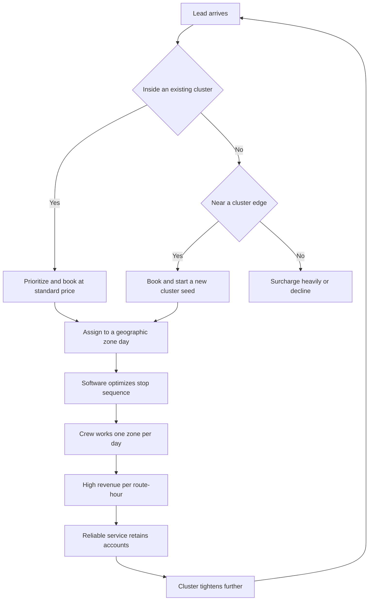

### Direct Answer

To start a lawn care business in 2027, you buy commercial mowing and maintenance equipment -- a zero-turn mower, a trailer, a truck, trimmers, blowers, and hand tools -- and sell **recurring grounds maintenance** to residential and commercial properties: weekly or biweekly mowing, edging, trimming, and blowing, plus higher-margin add-ons like fertilization, weed control, aeration, leaf removal, mulch, and (in northern markets) snow removal. The model is real, durable, and unusually accessible, but its economics live or die on one number most beginners never calculate: **revenue per route-hour** -- how much money the crew generates for every hour the truck is rolling and labor is on the clock. Done with density discipline, cost-up pricing, and an applicator license, a solo founder launches for **$8K-$70K**, runs a **35-55% net margin**, and builds a saleable, multi-crew operation within five years.

**TL;DR:** Lawn care in 2027 is a route-and-labor logistics business wearing a simple costume. You launch for **$8K-$20K** with used equipment or **$25K-$70K** with new commercial gear and a financed truck; a disciplined Year 1 solo-plus-helper operation builds **50-150 recurring accounts**, generates **$60K-$180K revenue** and **$30K-$90K owner earnings**, all concentrated in a March-November season. By Year 3-5 a well-run operation runs **2-4 crews** at **$300K-$900K revenue** with **$90K-$280K owner profit**. The three things that kill lawn care startups: **(a)** a scattered low-density route that destroys revenue per hour; **(b)** underpricing against unlicensed low-ballers; and **(c)** failing the off-season with no snow service and no reserve. Viable in 2027 for a density-obsessed, retention-first operator -- a poor fit for anyone who wants indoor, year-round-steady, no-truck, no-labor work.

## 1. What A Lawn Care Business Actually Is In 2027

### 1.1 The Core Definition

A lawn care business sells recurring grounds maintenance: it shows up at a property on a schedule -- usually weekly or biweekly in the growing season -- and mows the turf, edges the walks and driveway, trims around obstacles, blows the clippings off hard surfaces, and leaves. You are not selling a product, and you are not, at the core, a landscaper designing gardens; you are the company that keeps a lawn cut, clean, and presentable, over and over, for as long as the customer keeps paying.

**The entire business is a single financial idea executed thousands of times a season.** You arrive, you perform a fast, repeatable, roughly 15-to-45-minute job, you collect a recurring fee, and you drive to the next one -- and the closer that next one is, the more money you make. A quarter-acre residential lawn that takes a two-person crew twenty minutes and bills forty-five dollars is a good job; a string of eight of them on the same street is a great business; the same eight scattered across a county is a truck that earns a fraction of its potential because the day is spent driving, not mowing.

### 1.2 The Engine Beneath The Costume

That is the engine. Everything else in this guide -- equipment, pricing, routing, hiring, add-on services, the off-season -- is the machinery that lets you run that engine at density and at a real margin. **Lawn care is not glamorous and it is not passive.** It is a route-and-labor logistics business, and the founders who succeed understand that the mowing is the easy part; the business is the truck, the route map, the crew, the retention rate, and a spreadsheet of revenue per hour.

| Element | What It Means | Why It Decides Profit |
|---|---|---|
| The route map | The geographic clustering of accounts | Determines drive time, the silent profit killer |
| The crew | The labor that performs the work | The customer's entire experience; drives churn |
| Retention rate | Share of accounts kept year over year | A subscription business; churn is a tax on everything |
| Service mix | Mowing vs. chemical vs. seasonal | Determines blended margin and seasonality |
| Revenue per route-hour | Revenue divided by total clock hours | The master metric the whole business optimizes |

### 1.3 What Is Different About 2027

In 2027 the business is shaped by realities that did not fully exist a decade ago. Customers find and compare crews online and expect texted quotes, digital invoices, and card or auto-pay billing. Commercial property managers want one insured, professional vendor rather than a patchwork of cash operators. Labor is more expensive and harder to find, which makes crew productivity and route density the squeeze point. Battery and robotic mowing technology is real but still a supplement, not a replacement, for commercial gas equipment. And the customer base is durable because grass keeps growing and time-strapped homeowners keep outsourcing. The franchised national brands -- **TruGreen**, **Weed Man**, **Lawn Doctor**, and the lawn-segment of **The ServiceMaster** family -- have professionalized customer expectations; the equipment suppliers behind every route are public companies including **Toro (TTC)**, **Deere (DE)**, and **Honda (HMC)** on the engine side.

## 2. The Service Categories: What You Actually Sell

### 2.1 The Recurring Maintenance Core

The service menu is the business, and a founder must understand every category before pricing a single job, because the mix you sell determines your margin and your seasonality. **Recurring mowing and maintenance** is the boring, beautiful core -- the weekly or biweekly cut, edge, trim, and blow that generates predictable, recurring revenue and anchors every customer relationship. It is competitive and not high-margin per visit, but it is the foundation: it is the recurring base that everything else attaches to, and the route density that makes the whole operation work.

### 2.2 The High-Margin Chemical Tier

**Fertilization and weed control** -- the "lawn treatment" category -- is where the real margin lives: applying fertilizer, pre-emergent and post-emergent herbicides, and turf treatments on a seasonal program. It commands strong pricing relative to time and material cost, it is what the national brands such as **TruGreen** (a unit of the public **TruGreen / ServiceMaster** lineage) are built on, and in most states it requires a pesticide applicator license -- which is exactly why it is more profitable. The license is a barrier the low-ballers cannot cross.

### 2.3 The Seasonal Surge Services

**Aeration and overseeding** -- pulling cores and dropping seed, usually spring and fall -- is a high-ticket seasonal service that turns a maintenance customer into a several-hundred-dollar invoice twice a year. **Leaf removal and fall cleanup** is the autumn revenue surge: labor-intensive, but it bridges the gap between the mowing season and winter. **Spring cleanup** -- the March bed-edging, debris-clearing, first-cut package -- is the mirror-image surge that opens the season.

### 2.4 The Landscaping-Adjacent Add-Ons

**Mulch installation, bed maintenance, and seasonal color** are landscaping-adjacent add-ons that lift the average customer's annual spend. **Shrub and hedge trimming** is a recurring or seasonal add-on that pairs naturally with mowing. **Snow removal and ice management** -- in northern markets -- is the category that solves the off-season problem entirely: the same trucks, the same crews, the same customers, plowing and salting through the months the grass is dormant. **Irrigation, sod, hardscape, and full landscape design** are the deeper-end services some operators grow into and many deliberately leave to dedicated landscape companies (q9678).

| Service Category | Margin Profile | Seasonality | License Needed |
|---|---|---|---|
| Recurring mowing | Thin, competitive | March-November | No |
| Fertilization / weed control | High | Seasonal program | Yes -- applicator |
| Aeration / overseeding | High ticket | Spring / fall | No |
| Leaf removal / fall cleanup | Moderate, labor-heavy | Autumn surge | No |
| Spring cleanup | Moderate | March surge | No |
| Mulch / bed maintenance | Moderate | Spring-summer | No |
| Snow removal | Moderate-high | December-February | No (some permits) |

### 2.5 Reading The Menu As A Structure

A founder should think of the menu as a structure: recurring mowing is the dense, reliable base that makes routing work; chemical applications are the high-margin profit center that rewards getting licensed; seasonal services are the surges that lift annual revenue; and snow is the off-season answer in cold climates. **The Year 1 mistake is selling only the low-margin mowing** and never building toward the licensed, higher-margin services that actually produce profit.

## 3. The Three Models For Building The Business

### 3.1 The Solo Owner-Operator Model

There are three distinct ways to build this business, and choosing deliberately is one of the most consequential early decisions. **The solo owner-operator model** is one person, or an owner plus one helper, running a single truck and a tight route of residential and small commercial accounts. Its advantage is the lowest possible startup cost, the fastest path to cash, full control of quality, and a genuinely good owner income on a dense route without the headache of managing crews; its challenge is a hard ceiling -- there are only so many lawns one truck can cut in a week -- and total dependence on the owner's own labor. Many excellent lawn care businesses stay here permanently and do very well.

### 3.2 The Multi-Crew Maintenance Company Model

**The multi-crew maintenance company model** scales beyond the owner's own hands -- multiple trucks, multiple crews, a foreman structure, and a route base large enough to support residential routes, commercial contracts, and a sales-and-admin layer. Its advantage is real scale, an owner who eventually manages rather than mows, and a business with genuine enterprise value; its challenge is the management problem -- hiring, training, retaining, and supervising crews in a tight labor market, and the margin compression that comes with payroll, overhead, and the inevitable quality-control drift. This is the model that resembles a small **handyman service** (q9614) operation that grew into a fleet.

### 3.3 The Chemical-Application Specialist Model

**The chemical-application specialist model** goes deep on the licensed, high-margin work -- fertilization, weed control, and turf treatment programs -- and either skips mowing entirely or treats it as a minor add-on. Its advantage is the best margins in the industry, lighter equipment needs (a spray truck instead of a fleet of mowers and trailers), and a defensible licensing barrier; its challenge is that it requires the applicator license, real agronomic knowledge, and a different sales and route structure.

| Model | Startup Cost | Margin | Ceiling | Best Fit |
|---|---|---|---|---|
| Solo owner-operator | $8K-$25K | 35-50% | One truck of capacity | Cash-fast, control-focused founder |
| Multi-crew maintenance | $40K-$150K+ | 25-40% | Crew + market capacity | Builder who wants enterprise value |
| Chemical-application specialist | $20K-$60K | 45-60% | Tech + territory capacity | Founder who gets licensed early |

Many operators start solo with mowing to build cash flow and a customer base, get licensed and layer in chemical applications for margin, and then decide whether to scale into a multi-crew company. **The wrong move is trying to be a large multi-crew company in Year 1** with no proven route and no systems -- the crews outrun the density, and the overhead eats a margin that was never established.

## 4. The 2027 Market Reality

### 4.1 Why Demand Is Structurally Healthy

A founder needs an accurate read of the 2027 landscape, because lawn care is neither the effortless cash machine the social-media operators portray nor a saturated dead end. **Demand is structurally healthy.** The United States has roughly 85-90 million residential lawns and millions of commercial, institutional, and HOA-managed properties, and the share of homeowners who outsource maintenance keeps rising as households get busier, the population ages, and dual-income norms hold. Grass grows whether the economy is good or bad, which makes recurring maintenance one of the more recession-resilient home services -- customers may cut add-ons in a downturn, but the lawn still needs mowing.

### 4.2 The Bifurcated Competition

**The competition is bifurcated, and that is the opportunity.** At the top sit large, well-capitalized national and regional players -- **TruGreen** on the chemical-application side, **BrightView (BV)** and **Yellowstone Landscape** on the large commercial side -- and a layer of established multi-crew local companies. At the bottom is an enormous long tail of unlicensed, uninsured, cash-only operators with a mower in a pickup bed, competing purely on price. The opening for a disciplined new entrant is the underserved professional middle: licensed, insured, reliable, digitally organized, and priced for profit rather than survival.

| Market Tier | Who Occupies It | Competes On | Entry Barrier |
|---|---|---|---|
| National / regional | TruGreen, BrightView, Yellowstone | Scale, contracts, brand | Capital, infrastructure |
| Established local multi-crew | Mature local companies | Reputation, crews, density | Years of route-building |
| Professional middle (the opening) | Licensed, insured new entrants | Reliability, professionalism | Modest -- license + insurance |
| Long tail | Cash-only mower-in-a-truck | Price alone | None |

### 4.3 What Changed By 2027

Customers expect online booking or texted quotes, digital invoices, automated billing, and a professional presence. Software made it dramatically easier for a small operator to run dense routing, scheduling, CRM, and invoicing than it was a decade ago. Battery-electric and robotic mowing matured into a real supplement, especially for small residential and noise-sensitive properties, though commercial-scale gas equipment remains the workhorse. Labor cost and scarcity made crew productivity and route density the central operational battleground. And private-equity roll-ups got aggressive in the maintenance and chemical-application space -- which means a clean, dense, well-documented route is now a genuinely saleable asset, the way a tight **pressure washing** route (q9585) or a built-out **gutter cleaning** book (q1977) has become.

## 5. The Core Unit Economics: Revenue Per Route-Hour

### 5.1 Productive Time Versus Unproductive Time

This is the single most important section in the guide, because the entire business lives or dies on a calculation beginners almost never run. Every hour a crew is on the clock falls into one of two buckets: **productive time** -- actually mowing, edging, trimming, applying -- and **unproductive time** -- driving between jobs, loading and unloading, fueling, and waiting. The metric that matters is **revenue per route-hour**: total revenue for a day or a route divided by the total clock hours it takes, including the drive time.

### 5.2 The Density Math, Concretely

Consider the math concretely. A two-person crew that mows a clustered residential route -- eight lawns averaging $50 each, four minutes of drive between them, twenty-five minutes of work each -- finishes in roughly four hours and bills $400, a revenue-per-hour around $100. The same crew on a scattered route -- the same eight lawns at the same price, but twenty-five minutes of drive between each -- spends nearly seven hours to bill the same $400, a revenue-per-hour near $57.

| Route Type | Lawns | Price Each | Drive Between | Total Hours | Revenue | Rev / Hour |
|---|---|---|---|---|---|---|
| Dense / clustered | 8 | $50 | 4 min | ~4.0 | $400 | ~$100 |
| Scattered | 8 | $50 | 25 min | ~7.0 | $400 | ~$57 |
| Dense chemical route | 28 treatments | $65 | tight | ~8.0 | $1,820 | ~$228 |

Same accounts, same prices, same equipment, same labor cost per hour -- and the dense route is roughly **75% more productive** and, after the largely fixed labor and truck cost, far more than 75% more profitable.

### 5.3 The Discipline It Imposes

The discipline this imposes is absolute: **every routing, pricing, and sales decision should be evaluated by its effect on revenue per route-hour.** Sell into neighborhoods where you already have customers, not wherever a lead comes from. Cluster the schedule so a crew works a zone, not a county. Price the jobs that are far from your density higher, or decline them. Get licensed so you can sell the high-revenue-per-hour chemical work. Build retention so you are not constantly re-selling churned accounts. A founder who builds by revenue per route-hour compounds a tight, profitable operation; a founder who simply counts accounts builds a busy truck that drives all day and brings home very little.

## 6. The Line-By-Line P&L

### 6.1 Where The Costs Stack

Beyond density, a founder must internalize the operating P&L, because the margin and the hidden costs determine whether revenue becomes profit. **Labor** is the largest controllable cost -- the helper's wages plus payroll taxes, workers' compensation, and the owner's own labor that must be valued even if it is not yet a paycheck. **Equipment** carries a real ongoing cost beyond the purchase: commercial mowers, trimmers, and blowers wear hard under daily commercial use. **Fuel** for the truck and the equipment scales directly with route density. **The truck and trailer** carry insurance, maintenance, and depreciation. **Insurance** -- general liability and commercial auto -- is a real fixed cost. **Materials** -- fertilizer, herbicide, seed, mulch -- are a direct cost on the add-on and chemical work. **Software, marketing, licensing, and admin** round out the overhead.

### 6.2 A Representative Solo-Plus-Helper P&L

| Line Item | Share Of Revenue | Notes |
|---|---|---|
| Labor (helper + valued owner labor) | 30-45% | Drive time silently doubles it on a scattered route |
| Equipment reserve + repairs | 6-12% | Blades, belts, tires, eventual replacement |
| Fuel (truck + equipment) | 4-9% | Scales inversely with density |
| Truck + trailer (insurance, depreciation) | 6-12% | Allocated across every route |
| Insurance (GL + commercial auto) | 3-6% | Non-negotiable for commercial work |
| Materials | 4-10% | Direct cost on chemical / add-on work |
| Software, marketing, licensing, admin | 4-8% | Overhead |
| **Net owner margin** | **35-55%** | Once the route is dense |

### 6.3 Why Seasonality Dominates The Annual P&L

At the business level, **seasonality dominates the annual P&L** in any climate with a real winter: revenue concentrates in roughly March through November, with surges at the spring and fall shoulders. The founders who fail at the P&L level almost always made the same errors: they priced against the unlicensed low-baller instead of pricing for equipment replacement and a real margin, they built a route too scattered to be productive, and they spent the summer cash with no plan for January.

## 7. Pricing The Work

### 7.1 Price From The Cost Up, Not The Competitor Down

Pricing is where most new lawn care operators quietly doom themselves, because the instinct is to price against the cheapest competitor -- and the cheapest competitor is almost always unlicensed, uninsured, not reserving for equipment replacement, and not valuing their own labor. **A founder must price from the cost up, not the competitor down.** The components of an honest mowing price: the **labor** to do the job, the **drive time** to get there, the **equipment cost** of running commercial mowers, the **fuel and truck cost** allocated to the job, the **overhead** contribution, and a **profit margin** on top -- profit is a line item, not a leftover.

### 7.2 Representative 2027 Residential Pricing

| Lawn Size | Weekly Mow Range | Per-Visit Minimum | Notes |
|---|---|---|---|
| Quarter-acre | $40-$80 | $40-$60 | Wide regional variation |
| Half-acre | $60-$120 | $50-$60 | Density affects the bid |
| Full acre | $100-$250 | n/a | Equipment-dependent |
| Aeration / overseeding | $150-$450 per visit | n/a | High-ticket, twice a year |
| Fertilization program | $300-$900 per season | n/a | Prices on license + value |

### 7.3 Minimums, Recurring Bias, And Annual Contracts

**Minimums are essential:** a per-visit minimum protects against tiny jobs that cost more in drive and setup time than they earn, and a route-density rule protects revenue per hour. **Recurring beats one-time:** price to favor the recurring weekly or biweekly customer over the one-off cut. **Chemical applications and seasonal services price on value and license**, not on a race to the bottom. **Annual contracts** -- billing the season's mowing in equal monthly installments -- smooth cash flow and improve retention. The pricing discipline in one line: never let the unlicensed, uninsured low-baller set your price, because matching their price means inheriting a cost structure that does not include the things that make you a real, durable business.

## 8. Equipment And The Capex Plan

### 8.1 The Buy-Commercial Principle

With the economics established, a founder needs a concrete plan for what to buy. The principle is **buy commercial-grade for the tools that run every day, and be willing to buy used.** The core kit for a residential mowing operation: a **commercial zero-turn mower** -- the productivity workhorse from established brands such as **Toro (TTC)**, Scag, Exmark, Hustler, Bad Boy, Ferris, and Gravely -- a **commercial walk-behind** for gated yards, a **commercial string trimmer, edger, and backpack blower** (Stihl, Echo, Husqvarna), a **trailer**, and a **truck** capable of towing the loaded trailer.

### 8.2 The Capex Math

| Equipment Line | Lean / Used | New / Financed |
|---|---|---|
| Commercial zero-turn mower | $2,000-$5,000 | $6,000-$12,000 |
| Walk-behind mower | $800-$2,000 | $2,500-$5,000 |
| Trimmer, edger, blower (commercial) | $500-$1,200 | $1,200-$2,500 |
| Trailer (open utility) | $1,000-$3,000 | $3,000-$6,000 |
| Truck (half-ton or larger) | $8,000-$18,000 | $35,000-$55,000 |
| Hand tools, safety, spare parts | $300-$800 | $800-$1,500 |
| **Equipment subtotal** | **~$12,600-$30,000** | **~$48,500-$82,500** |

### 8.3 The Sequencing Rule

For the chemical-application path, the equipment shifts: a **spray truck or skid sprayer rig** and a spreader instead of the mower fleet, plus the materials inventory. The sequencing rule: buy the commercial-grade equipment that runs every day to last, finance the truck if it preserves cash for the route-building season, and resist the temptation to buy a fleet's worth of equipment before there is a route to justify it. **Buy what the current route needs, buy it to commercial standard, and let the route's growth -- not the equipment dealer's showroom -- drive the next purchase.**

## 9. Routing And Density: The Operational Heart

### 9.1 Density Is The Entire Game

This is the operational engine, and a founder who does not master it will have a full account list and an empty bank account. **Density is the entire game.** A lawn care route is profitable in direct proportion to how tightly the accounts cluster, because every minute of drive time is a minute of labor and fuel cost producing zero revenue.

### 9.2 The Five Density Disciplines

**Sell where you already are.** When a lead comes in, the most valuable thing about it is often its address relative to existing customers. **Route the week by geography, not by customer preference where possible** -- group accounts into zones, work a zone per day. **Use the software to optimize** -- modern field-service platforms route the day and surface the drive-time cost of a scattered schedule. **Defend density when you grow** -- disciplined growth deepens existing neighborhoods before spreading. **Density also drives retention economics** -- a tight cluster is easier to service reliably, which keeps customers, which keeps the cluster tight, a compounding loop.

### 9.3 The Profit Spread From Density Alone

The contrast is stark and worth repeating: two operators with the same fifty accounts at the same prices can have profit that differs by more than half, entirely because one built dense and one built scattered. The operators who win treat the route map as the most important document in the business -- more important than the account count.

## 10. Licensing, Insurance, And Legal Setup

### 10.1 Business Formation

The cliche that "anyone can do this" is technically true and practically dangerous. **Business formation:** most lawn care operators form an LLC for liability protection and tax flexibility, register the business, and obtain the local business license the jurisdiction requires.

### 10.2 The Pesticide Applicator License

**The pesticide applicator license** is the critical credential for anyone doing fertilization, weed control, or any chemical turf treatment -- nearly every state requires it, it involves training and an exam, and it is both a legal necessity and a competitive moat. It is the barrier that separates the profitable chemical work from the commodity mowing.

### 10.3 Insurance As A Sales Requirement

**Insurance is non-negotiable for a real business:** general liability coverage is the baseline, commercial auto covers the truck and trailer, and workers' compensation becomes mandatory the moment there is an employee. Insurance is not just risk management -- it is a sales requirement, because virtually every commercial property manager, HOA, and institutional client requires a certificate of insurance before signing.

| Legal / Compliance Item | When Required | Why It Matters |
|---|---|---|
| LLC / entity formation | Before first job | Liability protection, tax flexibility |
| Local business license | Before first job | Legal operation |
| Pesticide applicator license | Before any chemical work | Legal necessity + competitive moat |
| General liability insurance | Before first job | Baseline risk + sales requirement |
| Commercial auto insurance | Before towing the trailer | Covers truck + trailer |
| Workers' compensation | First employee | Mandatory; protects the crew |
| Written service agreements | Residential + commercial | Defines scope, payment, cancellation |

**The discipline:** treat licensing and insurance not as a cost to minimize but as the foundation that makes the business legitimate, commercially viable, and durable -- the same foundation a credible **commercial cleaning** operator (q9610) builds before chasing facility contracts.

## 11. Customer Acquisition

### 11.1 The Density-Friendly Channels

A founder must understand how lawn care accounts are actually won in 2027. **Door-to-door and yard-sign saturation in target neighborhoods** remains genuinely effective and density-aligned: working the streets where you already have customers, leaving door hangers, and putting a branded yard sign on every lawn you service turns existing accounts into a marketing engine for their own neighbors. **Online presence and local search** is the modern baseline: a Google Business Profile with reviews, a simple professional website, and local-search visibility. **Referrals and retention** are the highest-quality channel.

### 11.2 The Filtered Channels

**Google Local Services Ads and targeted digital advertising** can produce leads, but they must be filtered through the density rule. **Lead-generation platforms and marketplaces** deliver volume but at a cost and often with scattered, lower-loyalty customers, useful for early fill-in but not a foundation.

| Channel | Lead Quality | Density Fit | Cost | Role |
|---|---|---|---|---|
| Neighborhood saturation / yard signs | High | Excellent | Low | Foundation |
| Google Business Profile / local search | High | Good | Low | Foundation |
| Referrals | Highest | Excellent | Near-zero | Foundation |
| Local Services Ads / paid digital | Moderate | Variable | Moderate | Filtered fill-in |
| Marketplaces / lead-gen platforms | Lower | Poor | High per lead | Early fill-in only |
| Commercial direct outreach | High value | Anchors a zone | Time-intensive | Scale engine |

### 11.3 The Commercial Motion

**Commercial acquisition is a different motion entirely:** HOAs, property management companies, retail centers, office parks, and institutional properties are won through direct outreach, relationships, formal bidding, and the credentials the long-tail operators cannot produce -- and one commercial contract can anchor a route the way a dozen residential accounts would.

## 12. Customer Retention

### 12.1 Churn Is The Silent Tax

Retention is the least-discussed and most decisive number in lawn care. Recurring maintenance is, by design, a subscription business -- which means **churn is the silent tax** on everything. An operator who retains 90% of accounts year over year keeps a compounding, deepening route; an operator who retains 60% spends every spring re-selling a third of the business just to stand still.

### 12.2 The Five Retention Drivers

**Show up on schedule** -- reliability is the single biggest retention factor. **Do consistent quality work** -- clean edges, no missed strips, clippings blown off the hard surfaces, gates closed. **Communicate** -- a text when the schedule shifts for weather, a heads-up before a price change. **Handle problems fast** -- the occasional missed spot, addressed immediately and graciously, often retains a customer better than flawless service did. **Bill professionally** -- clean digital invoices and easy auto-pay remove the friction that quietly pushes customers to leave.

| Retention Rate | What It Means | Annual Re-Sell Burden |
|---|---|---|
| 90%+ | Compounding, deepening route | Minimal -- growth is net |
| 75-85% | Slow drift, manageable | Modest sales effort |
| 60-70% | Sales treadmill | Re-sell a third every spring |
| Below 60% | Business cannot compound | Acquisition cost eats margin |

### 12.3 Why Retention Decides Enterprise Value

Retention is what makes the business **saleable** -- a buyer or a roll-up is buying the recurring revenue and its stickiness, and a high-retention route is worth materially more than a high-churn one. The discipline: treat every existing account as the most valuable thing in the business.

## 13. Hiring And Building Crews

### 13.1 The Crew Is The Product

A founder can run a solo or owner-plus-one operation indefinitely, but scaling past the owner's own labor means building crews. **The crew is the product** -- the people who mow, edge, trim, and blow are the customer's entire experience of the company, and crew quality directly drives both retention and margin.

### 13.2 The Hiring Sequence

**The hiring sequence** typically runs: the owner solo, then the first helper, then a second crew with a working foreman, then an office or operations person as scheduling and invoicing volume grows, then a dedicated salesperson for commercial accounts.

| Stage | Headcount | Trigger To Advance |
|---|---|---|
| Solo owner-operator | 1 | Route fills the owner's week |
| Owner + helper | 2 | More demand than two hands can serve |
| Second crew + foreman | 4-6 | One crew at capacity, density supports a second |
| Operations / office hire | 6-8 | Scheduling + invoicing volume overwhelms owner |
| Commercial salesperson | 8+ | Commercial pipeline justifies a dedicated seller |

### 13.3 Staffing The Seasonal Reality

Lawn care labor is hard to find and harder to keep in the 2027 market. The operators who staff well **pay competitively**, **train with real systems**, **build a foreman layer**, and **address the seasonality** with a year-round core plus seasonal hires and -- in snow markets -- off-season work that keeps good people loyal through the winter.

## 14. The Software Stack

### 14.1 The Field-Service Platform Is The Central System

In 2027 a lawn care operation runs on software. **Field-service management software** -- purpose-built platforms such as **Jobber**, **Yardbook**, **Service Autopilot**, and **Aspire** for larger companies -- is the central system: it holds the customer list, schedules and routes the work, tracks which crew did which job, generates invoices, processes payments, and consolidates the reporting.

### 14.2 The Features That Decide Profitability

| Software Function | What It Does | Profit Impact |
|---|---|---|
| Routing / scheduling | Sequences stops by geography | Directly drives revenue per route-hour |
| Invoicing / payments | Digital invoices, card, auto-pay | Removes collection leakage, aids retention |
| CRM / communication | Appointment texts, weather alerts | Powers the reliability-communication loop |
| Estimating / proposals | Fast templated quotes | Wins jobs against the slow operator |
| Reporting | Revenue per route, job costing, retention | Surfaces the numbers this guide is built on |

### 14.3 The Discipline

Adopt the field-service platform early, use the routing features as a hard operational tool rather than a suggestion, put every customer on digital recurring billing, and treat the software as the system that lets a small crew run a dense, reliable, professionally billed route business.

## 15. The Seasonality Problem And The Off-Season Answer

### 15.1 Why Seasonality Separates Survivors From Casualties

Seasonality is the structural reality that separates the operators who last from the ones who flame out after one good summer. In any climate with a real winter, lawn care revenue concentrates in roughly March through November and then largely stops -- while truck payments, insurance, software subscriptions, and the owner's own living costs do not stop.

### 15.2 The Real Off-Season Answers

**Snow removal and ice management** is the best answer where the climate provides it -- the same trucks, the same crews, often the same customers, converting a dead season into a second revenue season. **Fall and winter services** -- leaf removal, gutter cleaning, holiday lighting, winter pruning, storm cleanup -- extend the season at both shoulders. **A deliberate cash reserve** is the non-negotiable baseline for operators without a snow market. **Off-season is also the build season** -- the months to service equipment, plan routes, run the spring marketing push, and handle licensing work.

| Off-Season Answer | Climate Fit | Revenue Effect | Difficulty |
|---|---|---|---|
| Snow removal / ice management | Northern only | Second full season | Moderate -- same assets |
| Leaf removal / gutter cleaning | Most climates | Shoulder extension | Low |
| Holiday lighting installation | Most climates | November-December bump | Low-moderate |
| Deliberate cash reserve | All climates | Carries fixed costs | Discipline only |
| Annual installment billing | All climates | Smooths the cash curve | Low |

### 15.3 The Casualty Pattern

The operators who fail on seasonality almost always made the same mistake: they treated the growing-season cash as income to spend rather than annual revenue to manage, hit December with no snow work and no reserve, and could not cover the fixed costs the dormant months still demanded.

## 16. Startup Cost Breakdown: The Honest All-In Number

### 16.1 The Line-By-Line All-In Total

| Startup Line | Lean (Used) | Full (New / Financed) |
|---|---|---|
| Core mowing equipment | $3,000-$8,000 | $8,000-$20,000 |
| Trailer | $1,000-$3,000 | $3,000-$6,000 |
| Truck | $8,000-$18,000 | $35,000-$55,000 |
| Insurance (first payment) | $800-$2,000 | $2,000-$3,000 |
| Formation, licensing, applicator license | $300-$800 | $800-$1,500 |
| Field-service software (setup) | $100-$300 | $300-$600 |
| Initial marketing | $500-$1,500 | $1,500-$3,000 |
| Safety gear, gas cans, spare parts | $300-$800 | $800-$1,500 |
| Working-capital / off-season reserve | $3,000-$8,000 | $8,000-$15,000 |
| **Total** | **~$8,000-$20,000** | **~$25,000-$70,000** |

### 16.2 What Financing Can And Cannot Soften

Financing softens the truck and the major-equipment lines, which is reasonable because they are productive assets that earn from the first week. But the founder still needs real cash for the **reserve**, because the route takes a season to build to density and the first winter arrives whether or not the business is ready.

### 16.3 The Honest Framing

Lawn care has one of the lowest startup costs of any real business -- which is exactly why it is crowded at the bottom -- but launching with worn homeowner equipment, no insurance, no license, and no reserve is not a lean startup, it is the under-capitalized version that joins the long tail and stalls.

## 17. The Year-One Operating Reality

### 17.1 Route-Building Mode, Not Profit-Extraction Mode

Year 1 is **route-building and system-building mode, not profit-extraction mode.** The first season is spent acquiring accounts one neighborhood at a time, learning the real time and cost of each job, building the routing and billing systems, and finding out where the operation is fragile.

### 17.2 The Realistic Year-One Numbers

A disciplined Year 1 solo or owner-plus-helper operation, launched with real equipment and a reserve, can realistically build to **50-150 recurring accounts** and generate **$60,000-$180,000 in revenue** against **$30,000-$90,000 in owner earnings** -- meaningful, but earned through long, hot, early-morning days concentrated in the March-November window.

### 17.3 The Strategic Moves That Compound

Year 1 is the year to make the strategic moves that compound: getting the applicator license, putting every customer on digital recurring billing, building the neighborhood clusters deliberately, and establishing the quality and reliability that drive retention. The founders who succeed treat Year 1 as paid tuition in a route-and-labor logistics business.

## 18. The Five-Year Revenue Trajectory

### 18.1 The Year-By-Year Arc

| Year | Revenue | Owner Profit | Crews | Founder Role |
|---|---|---|---|---|
| Year 1 | $60K-$180K | $30K-$90K | Solo / +helper | Fully hands-on, doing the route |
| Year 2 | $150K-$350K | $60K-$140K | 1-2 | Mowing + selling, license unlocks chemical |
| Year 3 | $300K-$550K | $90K-$190K | 2-3 | Managing and selling, foreman layer |
| Year 4 | $450K-$750K | $130K-$240K | 3-4 | Multi-crew, commercial + chemical depth |
| Year 5 | $500K-$900K+ | $150K-$280K | 3-4+ | Mature company, exit-optional |

### 18.2 What The Numbers Assume

These numbers assume disciplined density-based routing, cost-up pricing, the applicator license, real retention, and a solved off-season; they do not assume effortless exponential growth, because lawn care scales with route density, crew capacity, and truck capacity, not magically.

### 18.3 The Year-Five Fork

A mature operation reaches $500K-$900K+ revenue with $150K-$280K owner profit for a well-run multi-crew company, with the founder deciding whether to keep scaling, go deeper on high-margin chemical and commercial work, expand into landscaping (q9678), or position the business for sale to a private-equity roll-up that values the clean, dense, high-retention recurring route.

## 19. Five Named Real-World Operating Scenarios

### 19.1 Marcus, The Disciplined Density Builder

Launches solo with $14K into a sound used Scag zero-turn, used trimmer and blower, a used trailer, and an already-owned truck; refuses to take accounts outside his three target neighborhoods, saturates those streets with yard signs and door hangers, gets his applicator license by midsummer; ends Year 1 with 95 tightly clustered accounts at $110K revenue. By Year 3 he runs three crews and a chemical-application program at $480K revenue with healthy margins because every route he ever built was dense.

### 19.2 Derek, The Cautionary Tale

Spends $40K on a new truck and new equipment, then takes every account anywhere because he is counting accounts, not mapping routes; by midseason he has 130 accounts and a truck that drives all day, his fuel and labor costs eat the margin, and despite "more customers than Marcus" he brings home less than half as much and quits after a hard winter with no reserve.

### 19.3 Lena, The Chemical-Application Specialist

Skips the mowing crowd entirely, gets her pesticide applicator license first, buys a skid sprayer and a spreader instead of a mower fleet, and builds a dense fertilization-and-weed-control route; one licensed tech, one truck, 25-30 treatments a day at strong per-application pricing -- by Year 3 she has the best margins of anyone in this list at $360K revenue.

### 19.4 The Ortiz Brothers, The Multi-Crew Commercial Company

Start solo residential for two years to build cash and systems, then pivot hard toward commercial -- HOAs, retail centers, office parks -- win contracts on the strength of insurance, references, and reliability the long-tail cannot match, build a foreman structure and four crews, and by Year 5 run a $780K maintenance company anchored by commercial contracts.

### 19.5 Tre, The Seasonality Casualty

Builds a solid, reasonably dense 80-account route and grosses $130K in a good Year 1, but treats the summer cash as income, buys a second truck and a lifestyle upgrade, enters a no-snow-market December with no off-season service and no reserve, cannot cover the truck payments through the dormant months, and is forced to sell equipment at a loss in February.

| Scenario | Strategy | Year 3-5 Revenue | Lesson |
|---|---|---|---|
| Marcus | Density-obsessed solo to multi-crew | $480K | Density compounds |
| Derek | Account-counting, scattered | Quit | Scattered routes fail silently |
| Lena | Chemical-application specialist | $360K | Licensing unlocks margin |
| Ortiz brothers | Residential-to-commercial scale | $780K | Commercial anchors scale |
| Tre | Ignored the off-season | Forced sale | Respect seasonality |

## 20. Commercial Accounts: The Different Game

### 20.1 Why Commercial Is A Different Business

Commercial lawn maintenance is a fundamentally different business from residential. **Commercial properties** -- HOAs, apartment complexes, retail and shopping centers, office parks, medical and institutional campuses -- buy grounds maintenance on annual or multi-year contracts, and the contracts are substantial: a single HOA or office park can be worth what a dozen or more residential accounts are.

### 20.2 The Advantages And The Barriers

**The advantages are real:** larger contract values, longer commitment, predictable recurring revenue, route density in a single location, and genuine enterprise value. **The barriers are also real, and they are exactly the professional foundations the long-tail operator skipped:** commercial clients require certificates of insurance, references, proof of licensing, professional bidding, reliable uniformed crews, and a vendor that communicates like a real company.

### 20.3 The Sales Motion And The Concentration Risk

**The sales motion is different:** commercial work is won through direct outreach to property managers, relationship-building, and formal competitive bidding. **The risk is concentration:** losing one large commercial contract hurts far more than losing one residential account, so the disciplined operator balances commercial anchors with a residential base.

## 21. Add-On Services And The Margin Ladder

### 21.1 The Mow Is The Foothold, Not The Destination

The recurring mow is the foothold, not the destination, because the real margin in lawn care climbs a ladder of add-on services that attach to the maintenance base. The recurring mowing customer is the most valuable asset in the business because that customer is the one who says yes to everything else.

### 21.2 The Ladder, Rung By Rung

| Rung | Service | Margin | Attach Logic |
|---|---|---|---|
| Base | Recurring mowing | Thin | The foothold relationship |
| 1 | Seasonal cleanups (spring / fall / leaf) | Moderate | Easiest upsell, seasonal surge |
| 2 | Aeration / overseeding | High ticket | Twice-a-year invoice |
| 3 | Mulch / bed maintenance | Moderate | Material + labor, strong attach |
| 4 | Shrub / hedge trimming | Moderate | Recurring or seasonal add-on |
| 5 | Fertilization / weed control | High | Profit center, rewards the license |
| 6 | Snow removal | Moderate-high | Off-season revenue line |

### 21.3 The Strategic Logic Of The Ladder

Every add-on sold to an existing customer is acquired at near-zero marketing cost, performed on a customer who already trusts the operator, and routed efficiently. An operator who sells only the mow is leaving the entire margin ladder on the table; deeper services such as tree work (q9613) or hardscape are often deliberately left to specialists.

## 22. Risk Management And Common Failure Modes

### 22.1 The Operational Risks

**Density failure** -- the scattered route -- is the most common silent killer, mitigated only by treating density as a hard rule. **Pricing failure** -- bidding against the unlicensed low-baller -- is mitigated by cost-up pricing and real minimums. **Equipment failure** -- a down mower mid-season -- is mitigated by commercial-grade gear, scheduled maintenance, and a repair reserve.

### 22.2 The People And Liability Risks

**Labor risk** -- turnover, no-shows, injury -- is mitigated by fair pay, real training systems, and a foreman layer. **Liability risk** -- a thrown rock through a window, chemical misapplication -- is mitigated by general liability insurance, the applicator license, trained crews, and clear service agreements.

| Risk | Trigger | Mitigation |
|---|---|---|
| Density failure | Scattered route | Density as a hard rule in sales + routing |
| Pricing failure | Matching low-ballers | Cost-up pricing, minimums, walk away |
| Seasonality failure | No off-season plan | Snow service + deliberate reserve |
| Equipment failure | Down mower mid-route | Commercial gear, maintenance, repair reserve |
| Labor risk | Turnover, injury | Fair pay, training, foreman, workers' comp |
| Liability risk | Property damage, chemical | GL insurance, license, trained crews |
| Concentration risk | One big contract dominates | Balance commercial with residential base |
| Cash / collection risk | Slow payers, paper leakage | Digital recurring billing, auto-pay |

### 22.3 The Throughline

Every major risk in lawn care has a known mitigation built from density discipline, cost-up pricing, the off-season plan, commercial-grade equipment, fair and trained labor, real insurance and licensing, and digital billing -- and the operators who fail are almost always the ones who skipped one or more of those foundations and hoped volume would cover it.

## 23. Financing The Business And Managing The Money

### 23.1 What To Finance And What To Reserve

**Equipment financing** is the natural fit for the two largest lines -- the truck and the major mowing equipment are tangible, productive assets that lenders will finance and that earn from the first week. **Used equipment** is itself a form of cheap capital. **Reinvested cash flow** funds most healthy growth past Year 1.

### 23.2 Buying An Existing Route

**Buying an existing route** -- acquiring a retiring operator's customer base and equipment, sometimes with seller financing -- is a genuine and often underrated entry: it delivers density, recurring revenue, and cash flow on day one rather than after a season of building.

### 23.3 The Money-Management Discipline

**Separate business banking from day one**, **value the owner's own labor**, **reserve for equipment replacement**, **reserve for the off-season**, and **track the real numbers** -- revenue per route, job costing, retention. The financing principle in one line: it is reasonable to finance the productive assets that earn immediately, but it is never reasonable to skip the reserves.

## 24. Taxes And Business Structure

### 24.1 Entity And Depreciation

Most lawn care operators form an LLC or S-corp for liability protection and tax flexibility. **Depreciation matters** -- the truck, the trailer, and the commercial equipment are depreciable assets, and the depreciation schedules and any available first-year expensing materially shape taxable income, especially in the heavy-capex launch year.

### 24.2 Sales, Payroll, And Accounting Method

**Sales tax** on lawn services applies in some jurisdictions and not others -- the rules vary significantly by state. **Payroll taxes and workers' compensation** on the crew are real costs that must be budgeted into the labor number. **Seasonality and accounting method** -- cash versus accrual, and how installment-billed annual contracts are recognized -- affect how income lands across the season-and-dormant year.

| Tax / Structure Item | Consideration |
|---|---|
| Entity (LLC / S-corp) | Liability protection, tax flexibility |
| Depreciation / first-year expensing | Materially shapes taxable income in capex years |
| Sales tax on lawn services | Varies by state -- determine local treatment |
| Payroll taxes + workers' comp | Real labor cost, including seasonal hires |
| Accounting method (cash vs. accrual) | Affects income timing across the season |
| Deductible expenses | Equipment, fuel, insurance, software, materials |

### 24.3 The Discipline

Separate business banking from day one, a bookkeeping system that tracks equipment as assets and jobs as revenue, quarterly attention to estimated and sales taxes, and an accountant who understands equipment-heavy seasonal service businesses.

## 25. Owner Lifestyle: What Running This Business Actually Feels Like

### 25.1 The Physical Reality

A founder should know what the day actually feels like. Lawn care is physical, hot, early, and outdoors. The season is long days that start at dawn to beat the heat and the commercial properties' open hours. The body takes real wear over years, which is one reason operators move from the mower to management as they scale.

### 25.2 The Seasonal Rhythm

The rhythm is intense from March through November and then -- in cold climates -- either pivots to snow or slows dramatically. The off-season is genuine recovery time and build time, which many owner-operators come to value as a structural feature of the business rather than a flaw.

### 25.3 The Owner's Choice

The owner can deliberately choose the lifestyle: stay a lean owner-operator on a dense route for a strong solo income and direct control, or build the multi-crew company and trade hands-on mowing for management. Both are legitimate -- the failure mode is drifting between them without choosing.

## 26. Counter-Case: When Lawn Care Is The Wrong Business

### 26.1 The Honest Disqualifiers

This guide would be dishonest if it pretended lawn care fits everyone. **It is the wrong business for anyone who wants indoor work** -- the job is outdoors in heat, cold shoulders, rain, and sun, every season. **It is wrong for anyone who wants year-round-steady income without planning** -- the March-November concentration is structural, and the operator who cannot manage cash across a dormant winter will fail regardless of how good the summer was. **It is wrong for anyone who wants a business with no trucks, no early mornings, and no physical labor** -- even the chemical-application path involves a truck, a route, and outdoor work.

### 26.2 The Market And Margin Counter-Arguments

The bottom of the lawn care market is genuinely brutal. An operator who cannot or will not get licensed, get insured, build density, and price from cost up is competing directly against an unlimited supply of unlicensed low-ballers in a race that has no winner. **If a founder is not willing to be the professional, licensed, density-disciplined operator, the honest advice is not to enter** -- the commodity bottom is a treadmill, not a business. Some founders are better suited to a less seasonal, less weather-exposed service: a **residential pool service** route (q9611) carries its own seasonality but a different physical profile, while **commercial cleaning** (q9610) is indoor and year-round.

### 26.3 The Adjacent-Business Alternatives

A founder drawn to the route-and-recurring-revenue model but unsure about lawn specifically should weigh the adjacent options before committing. A **pressure washing business** (q9585) shares the route logic with less seasonality dependence; a **handyman service** (q9614) trades route density for skill breadth and indoor work; a **dumpster rental business** (q9632) is asset-heavy but far less labor-intensive per dollar; and **gutter cleaning** (q1977) is a lighter-equipment seasonal niche. The point of the counter-case is not to discourage -- lawn care is a genuinely good business for the right operator -- but to ensure the founder enters with eyes open, choosing it deliberately rather than defaulting into it because the equipment looked cheap.

### 26.4 When Lawn Care Is Exactly Right

For the founder who can be outdoors, who is comfortable with seasonality and willing to plan for it, who treats density and pricing as hard rules, and who is willing to get licensed -- lawn care in 2027 is one of the most accessible paths to a real, profitable, saleable small business. The model rewards discipline more than capital, and that is a fair trade for the right person.

## 27. The 90-Day Launch Plan

### 27.1 Days 1-30: Foundation

Form the LLC, open business banking, secure general liability and commercial auto insurance, register for the local business license, and begin the pesticide applicator license training. Buy the core used commercial equipment and the truck and trailer. Set up the field-service software and the Google Business Profile.

### 27.2 Days 31-60: First Accounts

Select two or three target neighborhoods and saturate them with door hangers and yard signs. Build cost-up pricing for the common lawn sizes. Land the first 15-30 recurring accounts, deliberately clustered. Establish the digital recurring billing on every account from the first invoice.

### 27.3 Days 61-90: Density And Systems

Deepen the existing neighborhoods rather than spreading. Complete the applicator license and begin offering the first chemical-application program. Refine the routing into geographic zone-days. Begin the first commercial outreach to nearby property managers, and bank the first off-season reserve deposit.

| Phase | Days | Primary Goal |
|---|---|---|
| Foundation | 1-30 | Legal, insured, equipped, software live |
| First accounts | 31-60 | 15-30 clustered recurring accounts |
| Density and systems | 61-90 | Deepen clusters, license, commercial outreach |

## 28. Key Metrics Dashboard

### 28.1 The Numbers To Track Weekly

| Metric | Healthy Target | Why It Matters |
|---|---|---|
| Revenue per route-hour | $90-$130+ (mowing) | The master profitability metric |
| Route density (avg drive between stops) | Under 6 minutes | Drive time is pure cost |
| Customer retention (annual) | 85%+ | Churn is the silent tax |
| Net owner margin | 35-55% | Determines if revenue becomes profit |
| Add-on attach rate | 30%+ of accounts | Climbs the margin ladder |
| Recurring vs. one-time mix | 90%+ recurring | The predictable subscription base |
| Off-season reserve | 3-5 months of fixed costs | Survives the dormant winter |

### 28.2 The Quarterly Review Questions

Each quarter the operator should ask: Is the route getting denser or more scattered? Is retention holding above target? Has the service mix shifted toward the higher-margin chemical and seasonal work? Is the off-season reserve on pace? Honest answers to these four questions predict the next year of the business better than the account count ever will.

## 29. Conclusion

Lawn care in 2027 is viable, durable, and unusually accessible -- a disciplined, density-obsessed, route-first operation built on customer retention and tight clustering. The founders who succeed treat the route map as the most important document in the business, price from the cost up, get the applicator license to unlock the margin ladder, and respect the off-season as a structural certainty rather than a surprise. The model rewards discipline over capital. For the right operator -- one comfortable outdoors, willing to plan, and committed to professionalism -- it is one of the best small-business on-ramps available, and a genuinely saleable asset by Year 5.

## 30. Sources

1. U.S. Bureau of Labor Statistics -- Occupational Outlook, Grounds Maintenance Workers, 2027.
2. U.S. Census Bureau -- American Housing Survey, residential property and lot data.
3. IBISWorld -- Landscaping Services in the US, industry report 2027.
4. National Association of Landscape Professionals (NALP) -- industry benchmarking data.
5. TruGreen / ServiceMaster -- public investor disclosures and franchise documentation.
6. BrightView Holdings (BV) -- annual report and investor presentations.
7. The Toro Company (TTC) -- annual report and commercial equipment segment data.
8. Deere & Company (DE) -- turf and utility equipment disclosures.
9. Honda Motor Co. (HMC) -- small-engine and power-equipment data.
10. U.S. Small Business Administration -- equipment financing and SBA loan program guidance.
11. Internal Revenue Service -- Publication 946, depreciation and Section 179 expensing.
12. U.S. Environmental Protection Agency -- pesticide applicator certification framework.
13. State departments of agriculture -- pesticide applicator licensing requirements (representative states).
14. National Pesticide Information Center -- applicator training and safety resources.
15. Lawn & Landscape magazine -- 2027 industry trends and operator surveys.
16. Total Landscape Care -- equipment, routing, and operations reporting.
17. Turf magazine -- commercial maintenance and chemical-application coverage.
18. Jobber -- field-service benchmark reports for home-service businesses.
19. Service Autopilot -- lawn care operations and routing data.
20. Yardbook -- small-operator software usage and pricing surveys.
21. Aspire Software (ServiceTitan) -- commercial landscape operations benchmarks.
22. Weed Man franchise disclosure documents -- chemical-application unit economics.
23. Lawn Doctor franchise disclosure documents -- territory and pricing data.
24. National Association of Insurance Commissioners -- commercial general liability guidance.
25. Insurance Information Institute -- commercial auto and workers' compensation overview.
26. SCORE -- small-business mentoring resources for service startups.
27. U.S. Department of Labor -- seasonal employment and labor standards guidance.
28. National Federation of Independent Business -- small-business labor market surveys 2027.
29. Equipment Dealers Association -- used commercial equipment pricing trends.
30. Outdoor Power Equipment Institute -- battery and robotic mowing adoption data.
31. Snow & Ice Management Association (SIMA) -- off-season snow services benchmarks.
32. Project Time & Cost / industry job-costing studies -- route-hour productivity analysis.
33. Harvard Joint Center for Housing Studies -- home-services outsourcing trends.
34. Private-equity and M&A advisory reports -- landscape maintenance roll-up activity 2026-2027.
35. Pulse RevOps internal research -- recurring-revenue service business benchmarks.

**Related Pulse RevOps entries:** see the companion lawn care guide (q9612), the landscaping company guide (q9678), the tree service guide (q9613), the residential pool service guide (q9611), the commercial cleaning guide (q9610), the handyman service guide (q9614), and the pressure washing guide (q9585).
