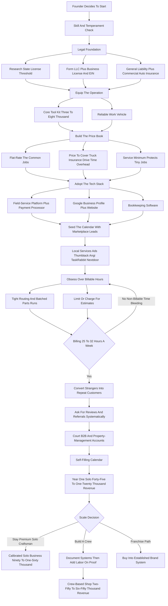

### Direct Answer

To start a handyman business in 2027, you turn a truck, a tool kit, and broad residential-repair competence into a service company that fixes the long tail of small jobs homeowners and property managers cannot or will not do themselves -- mounting TVs, patching drywall, swapping faucets and disposals, hanging doors, repairing decks and fences, and the endless punch list of a 145-million-unit housing stock aging faster than the skilled-trade workforce can keep up. The model is **real, durable, and unusually low-barrier**, but it is governed by one number beginners never track: **billable hours per week** -- the hours actually invoiced versus hours lost to driving, quoting, buying parts, and chasing payment. A solo operator who launches for **$8K-$30K**, runs at a **60-75% labor margin**, and bills 25-32 disciplined hours a week generates **$45K-$120K** in Year 1; one who bills 12-15 works full time for part-time money.

**TL;DR:** A handyman business sells skilled, insured, reliable labor for the small repair jobs too minor for specialized contractors and too involved for the average homeowner. It is structurally strong in 2027 because the housing stock is old, the trade workforce is shrinking, and the population is aging into needing help. The three things that kill it: **underpricing the job** (quoting a laborer's wage instead of a business's rate), **losing the day to non-billable time** (windshield time, unpaid estimates, parts runs), and **staying a pure stranger-lead business** (renting leads from Thumbtack and Angi forever instead of building repeat and property-management accounts). A disciplined Year 1 solo operator earns $30K-$85K take-home; a Year 2-4 crew-based shop reaches $200K-$650K revenue with $70K-$200K owner profit. Viable for a disciplined, billable-hour-obsessed, repeat-customer-driven operator -- a poor fit for anyone who wants to scale fast, avoid physical work, or run a business without a truck, a license check, and a calendar packed with small jobs.

## What A Handyman Business Actually Is In 2027

### 1.1 The Core Definition

A handyman business sells skilled labor to fix, install, maintain, and improve the small stuff in residential and light-commercial property -- the jobs too small for a specialized contractor to want and too involved for the average homeowner to do well. **You are not a plumber, an electrician, or a general contractor**, and in most states you cannot legally call yourself one or do work that requires their license. You are the capable generalist who handles the vast middle ground: mounting a television, patching drywall, replacing a faucet or disposal, hanging a door, fixing a fence, swapping a light fixture, assembling furniture, and the hundred other items that pile up on a homeowner's list.

### 1.2 The Hour-Into-Revenue Engine

The entire business is a single idea executed thousands of times: **you convert an hour of skilled, insured, reliable labor into $75-$150 of billed revenue**, and you do it efficiently enough that the revenue comfortably clears the truck, the tools, the insurance, the fuel, and your time. Everything else in this guide is the machinery that lets you run that engine at high utilization without getting buried in non-billable time, underpriced jobs, or one-off strangers who never call again.

### 1.3 What Makes The 2027 Version Different

In 2027 the business is shaped by realities that barely existed a decade ago. **Homeowners book, compare, and review online** and expect a digital quote and card-on-file payment. **The skilled-trade labor shortage is structural** and getting worse. **The housing stock is old and getting older. Software has made it genuinely easy** for a one-person operation to run a professional scheduling, invoicing, and customer-management system. The handyman business is not trendy and not passive -- it is a skilled-labor-and-logistics business, and the founders who succeed understand that the customer is buying reliability and a finished job while the business is a truck, a tool inventory, an insurance policy, a calendar, and a spreadsheet of billable hours. Adjacent service trades like painting (q1984) and gutter cleaning (q1977) share this exact operating shape.

| Business Dimension | Handyman Business In 2027 |
|---|---|
| What the customer buys | A finished, reliable repair and the trust that it is done right |
| What the business is | A truck, tools, insurance, a calendar, and a billable-hour spreadsheet |
| Core profit metric | Billable hours per week actually invoiced |
| Barrier to entry | Low capital, real skill barrier, light licensing in most states |
| Demand character | Structural and non-discretionary -- houses break regardless of the economy |
| Scaling unit | Trucks, trained labor, and recurring B2B accounts |

## Why The Handyman Model Is Structurally Strong In 2027

### 2.1 The Aging Housing Stock

The tailwinds are real and not a fad. The United States has roughly **145 million housing units**, and the median owner-occupied home is **over 40 years old** -- an aging stock that generates a permanent, non-discretionary stream of small repairs that only grows as houses get older. Older homes break in more places, more often, and the repairs are exactly the small-to-medium jobs that define the handyman trade.

### 2.2 The Shrinking Trade Workforce

The skilled-trade workforce is shrinking relative to demand. The Bureau of Labor Statistics and industry groups have documented that **tradespeople are retiring faster than they are being replaced**, and the workers who remain concentrate on the larger, higher-ticket jobs that pay best -- leaving the small-repair middle underserved. This is the same structural shortage that makes plumbing (q9688), electrical (q9689), and HVAC (q9667) businesses durable, and it cuts in the handyman's favor on the demand side.

### 2.3 The Demand Drivers That Compound

Several demand drivers layer on top of the aging stock and the shrinking workforce:

- **Time-poor, DIY-fatigued homeowners** who would rather pay than spend a weekend on a project.
- **An aging population of seniors** who physically cannot get on a ladder or under a sink, and whose adult children will pay for someone reliable.
- **New homeowners** working through inspection punch lists.
- **A large and growing rental and property-management sector** that needs a dependable repair partner for unit turns and maintenance tickets.
- **Insurance-restoration overflow** work that larger contractors do not want.
- **Realtors** who need pre-listing repairs done fast.

None of these is cyclical hype. The handyman business does not depend on a boom; it depends on houses breaking and people being unwilling or unable to fix them, which is a permanent condition.

| Structural Tailwind | Why It Favors The Handyman |
|---|---|
| 145M housing units, median 40+ years old | Permanent, growing stream of small repairs |
| Trade workforce retiring faster than replaced | Less competition for the underserved middle |
| Aging population, mobility-limited seniors | High-trust, high-loyalty premium demand |
| Growing rental / property-management sector | Recurring B2B maintenance and unit-turn volume |
| Time-poor homeowners, DIY fatigue | Willingness to pay rather than do it themselves |
| Rising professionalism bar | Punishes the informal "guy with a truck" |

## The Three Models: Solo Craftsman, Crew, And Franchise

### 3.1 The Solo Craftsman Model

**The solo craftsman model** is one skilled operator with a truck, a tool kit, and a calendar, doing every job personally and charging a premium for reliability and quality. Its advantage is the **highest margin per hour, the lowest overhead, total control over quality, and the fastest path to profitability**; its ceiling is the founder's own two hands -- revenue is capped by billable hours, and a sick week is a zero-revenue week. This is the most common starting point and a genuinely good permanent business for a craftsman who does not want to manage people.

### 3.2 The Crew-Based Shop Model

**The crew-based shop model** adds employees or subcontractors -- two, three, five capable handymen running their own trucks and calendars under one brand, one insurance umbrella, one scheduling system, and one set of standards. Its advantage is **breaking the single-pair-of-hands ceiling**, serving more customers, and building an asset that runs without the founder on every job; its challenge is that the founder becomes a manager, recruiter, and quality controller rather than a craftsman, and margins compress because employees must be paid, insured, and supervised.

### 3.3 The Franchise Model

**The franchise model** -- buying into an established brand like Mr. Handyman, Ace Handyman Services, or HandyPro -- trades a franchise fee and ongoing royalties for a recognized name, a proven operating system, marketing support, training, and a faster ramp. Its advantage is a **de-risked, systematized launch with brand trust built in**; its challenge is the cost of the fee and royalties, less independence, and the reality that you still have to do the physical work of building a local operation.

### 3.4 Choosing Deliberately, Not Drifting

Many operators start solo to learn the trade economics and build cash and reputation, then deliberately decide whether to stay solo, build a crew, or convert to a franchise. **The wrong move is drifting** -- staying accidentally solo when you wanted to scale, or hiring a crew before the solo economics and systems are proven.

| Model | Startup Cost | Margin | Founder Role | Ceiling | Best Fit |
|---|---|---|---|---|---|
| Solo craftsman | $8K-$30K | 60-75% | Technician + back office | Own billable hours | Craftsman who avoids managing people |
| Crew-based shop | $30K-$120K+ | 35-55% | Manager, recruiter, QC | Trucks + trained labor | Builder who wants an asset |
| Franchise unit | $60K-$200K+ | 30-50% (post-royalty) | Operator inside a system | Territory + royalty terms | Wants de-risked, faster ramp |

## Licensing, Legal Requirements, And The State-By-State Reality

### 4.1 The Dollar-Value Threshold

A founder must get the licensing question right before taking a single paid job. The core reality: **most states regulate handyman work by a dollar-value threshold** -- below a certain per-job or per-project value, you can do general repair work without a contractor's license; above it, you need one. The thresholds vary widely. Some states are permissive, with thresholds in the high hundreds to low thousands; others, like California, set a low threshold (work over $1,000 in combined labor and materials generally requires a contractor's license through the Contractors State License Board) and enforce it; a handful require a specific handyman or home-improvement registration regardless of job size.

### 4.2 The Trade-License Boundary

The universal rule that does not vary: **handymen cannot do work that requires a specialized trade license.** Significant electrical, plumbing, HVAC, or structural work belongs to licensed electricians, plumbers, and contractors, and crossing that line is both illegal and a liability catastrophe if something goes wrong. The disciplined operator builds a working relationship with a licensed electrician (q9689) and a licensed plumber (q9688) and refers the work that crosses the line rather than attempting it.

### 4.3 The Universal Legal Setup

Beyond the contractor question, every operator needs:

- **A business entity** -- most form an LLC for liability protection.
- **A business license or registration** with the city or county.
- **An EIN** from the IRS.
- **General liability insurance** -- a $1M policy is the practical standard; many customers and all property managers require proof.
- **Workers' compensation** -- mandatory the moment there is an employee.
- **Commercial auto insurance** -- because a personal policy may not cover a work-related accident.
- **A bond** -- required or expected in some markets.

### 4.4 The Non-Negotiable Discipline

Research your specific state and city rules before launch, stay scrupulously within the license threshold and the trade-license boundary, carry real insurance, and treat the legal setup as the foundation the whole business sits on -- because one uninsured accident or one unlicensed job gone wrong can end the business and follow the founder personally.

| Legal Item | Typical Cost | When Required |
|---|---|---|
| LLC formation | $50-$500 + state fee | Before first paid job |
| Business license / registration | $50-$400/year | Before first paid job |
| EIN | Free (IRS) | Before first paid job |
| General liability insurance ($1M) | $500-$2,000/year | Before first paid job |
| Commercial auto insurance | $1,200-$3,000/year | When a vehicle is used for work |
| Workers' compensation | Varies by payroll | With the first employee |
| Surety bond | $100-$500/year | Where state/market requires |

## The Core Unit Economics: Billable Hours Per Week

### 5.1 The Number Beginners Never Track

This is the single most important section in the guide, because the entire business lives or dies on one number: **billable hours per week** -- the hours actually invoiced to a paying customer, versus the hours the workday is full but no one is paying. A handyman's day is full of non-billable time: driving between jobs, hardware-store runs, walking unpaid estimates, buying and organizing parts, answering calls, sending invoices, and doing the books. **A full ten-hour workday can easily yield only five or six billed hours** if the routing is bad and the day is fragmented.

### 5.2 The Math That Decides Everything

Run the numbers concretely. A solo operator who bills **30 hours a week at $100/hour** for 48 working weeks grosses $144,000; the same operator billing only **15 hours a week** -- same long days, same effort, same exhaustion -- grosses $72,000, and after the truck, fuel, tools, insurance, and software, that is a thin living. The difference is not skill or hours worked; it is **billable-hour discipline.**

| Billable Hours / Week | Rate | Weeks | Gross Revenue | Profile |
|---|---|---|---|---|
| 12 | $85 | 48 | ~$48,960 | Severe non-billable bleed |
| 15 | $100 | 48 | ~$72,000 | Undisciplined operator |
| 22 | $100 | 48 | ~$105,600 | Improving routing |
| 28 | $110 | 48 | ~$147,840 | Disciplined operator |
| 32 | $125 | 48 | ~$192,000 | Tightly routed premium solo |

### 5.3 The Levers That Move The Number

The levers that turn 15 billable hours into 30 are concrete: **clustering jobs geographically** to cut windshield time, **batching parts runs**, **quoting efficiently or charging for estimates**, **using flat-rate pricing** so a fast worker is not penalized, **scheduling tightly** so there are no dead gaps, and **offloading bookkeeping and scheduling to software** so the workday is spent working.

### 5.4 What It Means For Every Other Decision

Pricing must cover the non-billable time, not just the billable hour; routing and scheduling are not administrative afterthoughts but the core profit lever; and the founder must track, every week, how many hours actually got billed against how many were worked. A handyman who treats billable hours as the central metric builds a business that pays well on reasonable hours; one who ignores it works himself ragged for a fraction of the revenue and never understands why.

## Pricing: Hourly Versus Flat-Rate, And How To Quote Like A Business

### 6.1 The Two Pricing Models

Pricing is where most handyman startups quietly destroy their own income. There are two pricing models, and mature operators use both deliberately. **Hourly pricing** -- charging $75-$150 per hour depending on market, skill, and job type -- is simple and transparent but has a hidden flaw: it penalizes speed and skill, because the faster and better you get, the less you earn per job, and it makes customers anxious about an open-ended meter. **Flat-rate pricing** -- quoting a fixed price for a defined job -- rewards efficiency, gives the customer certainty, and lets a skilled, fast operator earn an effective hourly rate well above the nominal one.

### 6.2 The 2027 Price Book

| Service | 2027 Price Range | Pricing Model |
|---|---|---|
| Hourly labor | $75-$150/hour | Hourly |
| Service-call minimum / trip charge | $75-$300 | Fixed |
| TV mounting | $150-$500 | Flat-rate |
| Ceiling fan install | $200-$500 | Flat-rate |
| Light fixture swap | $125-$350 | Flat-rate |
| Faucet replacement | $150-$400 | Flat-rate |
| Garbage disposal install | $200-$450 | Flat-rate |
| Dishwasher install | $250-$500 | Flat-rate |
| Drywall patch and texture | $150-$500 | Flat-rate |
| Interior door hanging | $300-$800 | Flat-rate |
| Deck board replacement | $30-$80/board | Per unit |
| Fence repair | $200-$1,500 | Flat-rate or hourly |
| Furniture assembly | $75-$250/item | Per unit |
| Caulking / weatherproofing | $150-$400 | Flat-rate |

### 6.3 The Discipline Beginners Miss

Underneath both models is the discipline beginners miss: **the price must cover far more than the labor hour.** It must absorb drive time, the parts run, the unpaid estimate, the truck and fuel, tool replacement, insurance, software, bookkeeping time, self-employment tax, and a real profit -- not just a wage. A handyman who quotes "$60 an hour, that seems fair" is quoting a laborer's wage and forgetting he is also the business; one who understands that a **$100-$150 effective rate** is what it takes is quoting like a businessperson.

### 6.4 Trip Charges And The Estimate Problem

Two more pricing tools matter. A **service-call minimum or trip charge** ($75-$300) ensures a tiny job is still worth the trip. And a clear **policy on estimates** -- many operators charge for detailed estimates or quote common jobs over the phone, because walking unpaid estimates is one of the largest non-billable time drains. The pricing rule for 2027: quote flat-rate where you can, price to cover the whole cost structure, protect against tiny jobs with a minimum, and never let the customer's anchor of "what a handyman should cost" drag the price below what the business needs to survive.

## The Tools, The Truck, And The Startup Capital

### 7.1 The Tool Kit

A founder needs an honest picture of what it costs to launch. **Tools** are the largest startup line and they accumulate over time: a competent launch kit -- a quality cordless drill and impact driver, a circular saw and a reciprocating saw, an oscillating multi-tool, a level, a stud finder, a good ladder, hand tools, a shop vacuum, drywall and painting tools, plumbing basics, and safety gear -- runs **$3,000-$8,000**, and a veteran's truck holds $15,000-$30,000 of tools accumulated over years. The discipline is to buy quality where it matters and add specialized tools as the jobs that need them appear.

### 7.2 The Vehicle

**The vehicle** is the other major piece: a reliable truck, van, or SUV with cargo capacity is non-negotiable. Many founders start with a vehicle they already own and upgrade to a dedicated work van or truck as cash flow allows; a used work vehicle runs anywhere from a few thousand to $30,000-plus depending on condition and choice.

### 7.3 The Rest Of The Startup Stack

The rest of the startup stack is modest: business formation and licensing, general liability insurance (first payment, often $500-$2,000 to start), commercial auto insurance, a starter inventory of common consumables and fasteners, a phone and a basic website, the field-service software subscription, branding and a vehicle decal, and a working-capital cushion.

| Startup Line Item | Lean Solo Launch | Fuller Launch |
|---|---|---|
| Core tool kit | $3,000-$5,000 | $6,000-$10,000 |
| Work vehicle | Already owned | $8,000-$30,000 |
| Business formation + licensing | $150-$600 | $300-$1,200 |
| General liability insurance (initial) | $500-$1,000 | $1,000-$2,000 |
| Commercial auto insurance (initial) | $400-$800 | $800-$1,500 |
| Consumables + fasteners inventory | $300-$700 | $700-$1,500 |
| Phone, website, branding, decal | $400-$1,000 | $1,000-$2,500 |
| Field-service software (setup) | $50-$200 | $200-$500 |
| Working-capital cushion | $2,500-$5,000 | $5,000-$10,000 |
| **Total** | **~$8,000-$15,000** | **~$20,000-$40,000+** |

### 7.4 The Capital Reality

The capital reality is the good news of this business: compared with a restaurant or an HVAC company (q9667), the barrier is low, which is exactly why so many people try it -- and why the operators who win are not the ones with the most capital but the ones with the pricing, the billable-hour discipline, and the customer base.

## The Field-Service Tech Stack For 2027

### 8.1 The Field-Service Management Platform

In 2027 a handyman business runs on software. The center of the stack is a **field-service management platform** -- Jobber, Housecall Pro, ServiceTitan for larger operations -- that holds the customer database, schedules and dispatches jobs, generates quotes, sends invoices, processes payments, and consolidates the calendar. This is the first paid subscription a serious operation cannot skip, because it turns a chaotic, fragmented workday into a routed, scheduled, invoiced system -- which directly drives the billable-hours number.

### 8.2 Payment Processing

**Payment processing** -- Square, Stripe, or the processor built into the field-service platform -- lets the customer pay by card on the spot, which radically improves cash flow versus mailing invoices. Card-on-file and instant payment are a 2027 customer expectation, not a nicety.

### 8.3 The Lead-Generation Layer

The lead-generation layer sits on top: a **Google Business Profile** (free and essential), **Google Local Services Ads** with the Google Guaranteed badge (pay-per-lead, high-intent), and the lead marketplaces -- **Thumbtack, Angi, TaskRabbit, and Nextdoor** -- which deliver volume but at a cost and with stranger customers.

### 8.4 The Back-Office Tools

A **simple professional website** converts the demand these channels generate and is itself a trust signal. **Bookkeeping software** -- QuickBooks or a comparable tool -- tracks income, expenses, mileage, and the data the accountant and the tax return need. **Review management** matters because local search and customer choice in 2027 are driven by ratings, and a systematic ask-for-the-review habit is a real growth lever.

| Stack Layer | Tools | Monthly Cost | Priority |
|---|---|---|---|
| Field-service platform | Jobber, Housecall Pro, ServiceTitan | $50-$300 | Day one |
| Payment processing | Square, Stripe, built-in | 2.6-3.0% per transaction | Day one |
| Google Business Profile | Google Business Profile | Free | Day one |
| Local Services Ads | Google LSA (Google Guaranteed) | Pay-per-lead | Early bridge |
| Lead marketplaces | Thumbtack, Angi, TaskRabbit, Nextdoor | Per-lead / per-job | Early bridge |
| Website | Simple professional site | $10-$50 | First month |
| Bookkeeping | QuickBooks or similar | $20-$90 | Day one |
| Review management | Built-in or standalone | $0-$50 | Ongoing |

## Lead Generation: From Stranger Marketplaces To A Self-Filling Calendar

### 9.1 The Early-Days Bridge

Lead generation is where the handyman business is won or lost over time, and a founder must understand the arc: **you start by buying stranger leads and you graduate to a calendar that fills itself.** In the early days, with no reputation and no customer base, the paid and marketplace channels are the bridge: **Google Local Services Ads** deliver high-intent local leads with the trust of the Google Guaranteed badge; **Thumbtack, Angi, TaskRabbit, and Nextdoor** deliver volume; a claimed and optimized **Google Business Profile** captures organic local search; and a basic website converts.

### 9.2 The Cost Of Living On Marketplaces

These channels work, but they are expensive per job, they deliver one-off strangers, and a business that lives on them forever is renting its customer flow at a permanent margin cost. The same trap catches window cleaning (q2107) and house cleaning (q2109) operators who never build owned demand.

### 9.3 The Three Engines Of A Self-Filling Calendar

The transition that defines a sustainable handyman business runs on three engines:

- **Repeat customers** -- a homeowner who has a good experience has a near-endless list of future small jobs. The operator who does great work, communicates well, shows up when promised, and asks "what else is on your list?" converts a one-time stranger into a multi-year account. **Fifty to one hundred genuinely loyal repeat customers is the backbone of a solo operation.**
- **Referrals and reviews** -- happy customers tell neighbors, and a systematic habit of asking for a Google review and a referral compounds. In a relationship-and-trust business, word of mouth is the highest-quality, lowest-cost lead there is.
- **B2B and property-management accounts** -- recurring volume that does not have to be re-won every time.

### 9.4 Scaffolding, Not The Building

The strategic point: paid stranger leads are a legitimate and necessary startup tool, but they are **scaffolding, not the building.** The operators who stay stuck are still buying every job from a marketplace in Year 3; the ones who build a real business used the early stranger jobs to seed a repeat-customer base, a referral engine, and a set of recurring accounts that make the marketplace optional.

| Lead Channel | Cost Profile | Customer Quality | Role |
|---|---|---|---|
| Google Local Services Ads | Pay-per-lead, moderate | High-intent stranger | Early bridge |
| Thumbtack / Angi | Per-lead or per-job fee | Price-shopping stranger | Early bridge |
| TaskRabbit / Nextdoor | Platform fee | Mixed stranger | Early bridge |
| Google Business Profile | Free | Organic local search | Permanent core |
| Repeat customers | Near-zero | Highest, loyal | Permanent core |
| Referrals | Near-zero | Highest, pre-trusted | Permanent core |
| B2B / property management | Relationship cost | Recurring, predictable | Permanent core |

## The B2B And Property-Management Wedge

### 10.1 Why B2B Is The Highest-Leverage Move

The single highest-leverage move available to a handyman business is landing recurring B2B and property-management accounts. The reason is structural: a residential customer generates a job now and maybe another in six months, each marketed for, quoted, and won individually. A **property-management company** manages dozens or hundreds of rental units, every one generating a steady stream of maintenance tickets and recurring unit-turn work -- and once you are the trusted repair partner, that volume comes to you without per-job marketing, often with net-terms billing.

### 10.2 The Other B2B Customers

The same logic applies to other B2B customers:

- **Real estate agents and brokerages** need fast, reliable pre-listing repairs and post-inspection punch-list work and will refer a dependable handyman to every seller.
- **Small commercial property owners and offices** need ongoing minor repairs -- the same recurring-contract logic that drives commercial cleaning (q9610).
- **Insurance restoration companies** have overflow small-repair work that does not fit their larger crews.
- **HOAs** need common-area maintenance.
- **Larger general contractors** subcontract punch-list and small-finish work.

### 10.3 The Different Sales Motion

Landing these accounts is a different sales motion than residential -- it is **relationship-driven business development**: identifying the property managers, realtors, and restoration firms in the service area, reaching out professionally, demonstrating reliability and proof of insurance, and proving yourself on a first job. It rewards exactly the traits the residential side rewards -- showing up, communicating, doing clean work, billing professionally -- but it pays them back in recurring volume rather than one-off jobs.

### 10.4 The Discipline

From the first months, while residential and marketplace leads pay the bills, **deliberately court two or three property-management or realtor relationships**, because a single good property-management account can stabilize a calendar that residential one-offs never will, and a handful of them can carry an entire crew-based operation.

| B2B Account Type | Volume Character | Billing | Sales Motion |
|---|---|---|---|
| Property management | High, recurring tickets + unit turns | Net-15 / net-30 | Relationship + proof of insurance |
| Real estate agents | Steady referral stream, tight timelines | Per-job or net terms | Reliability + speed |
| Small commercial / offices | Ongoing minor repairs | Recurring contract | Dependability |
| Insurance restoration | Overflow small-repair | Per-job, net terms | Capacity + reliability |
| HOAs | Common-area maintenance | Contract or per-job | Trust + insurance |
| General contractors | Punch-list / finish subcontracting | Per-job, net terms | Quality + availability |

## Hiring, Subcontractors, And Breaking The Solo Ceiling

### 11.1 The Solo Ceiling

A founder who wants to grow past the solo ceiling must eventually add labor. The solo operator's revenue is capped by his own billable hours -- there is a hard ceiling, and a sick week or a vacation is a zero-revenue week. Breaking that ceiling means **employees or subcontractors.**

### 11.2 Employees Versus Subcontractors

**Employees** -- W-2 handymen on the payroll -- give the founder control over quality, scheduling, and standards, and let the brand promise consistency; they also bring payroll, payroll taxes, workers' compensation, supervision, training, and the risk of paying for hours that are not billed. **Subcontractors** -- 1099 handymen who run their own businesses -- are more flexible and lower fixed cost, but the founder has less control over quality and scheduling, and the **worker-classification rules are strict**: a worker treated like an employee but paid as a contractor is a legal and tax liability, so the classification has to be genuinely correct.

### 11.3 The Hard Part: Finding Good Labor

The hard part of hiring in this trade is that **a good handyman is hard to find** -- the skilled-trade shortage that creates the business's demand also makes its labor scarce -- and a bad hire damages customers' homes and the brand's reputation. The operators who hire well are deliberate: they hire for reliability and customer manner as much as raw skill, document the standards so a new hire can be trained into them, pay well enough to keep good people, and grow the crew in step with proven demand rather than ahead of it.

### 11.4 The Sequencing That Works

The sequencing that works: prove the solo economics and build a repeat-and-B2B base first, document how the work and the systems run, then add the first employee or subcontractor against demand that already exists -- and only then keep adding. **Hiring before the demand and the systems are real just multiplies chaos** and converts a profitable solo business into an unprofitable small one.

| Labor Type | Control | Fixed Cost | Key Risk |
|---|---|---|---|
| W-2 employee | High | High (payroll, taxes, comp) | Paying for unbilled hours |
| 1099 subcontractor | Lower | Low, variable | Misclassification liability |
| Solo (no labor) | Total | None | Hard revenue ceiling |

## The Multi-Year Revenue Trajectory

### 12.1 Year 1 -- Base-Building Mode

Year 1 is **base-building mode, not peak-earning mode.** The first year is spent learning which jobs are actually profitable, discovering the real non-billable-time drain and fixing the routing and quoting that cause it, calibrating prices upward from the too-low numbers most beginners start with, building the Google Business Profile and the review base, working the expensive marketplace leads, and converting those first stranger jobs into the seed of a repeat-customer base. A disciplined Year 1 solo handyman generates **$45,000-$120,000 in revenue** with **$30,000-$85,000 in owner take-home**, the wide range explained almost entirely by billable-hour discipline and pricing.

### 12.2 Years 2 Through 5

**Year 2:** the repeat-customer base and reviews compound, the marketplace dependency eases, the first property-management or realtor account may land; a still-solo operator reaches roughly **$90K-$160K revenue** with **$60K-$110K take-home**, or an operator adding a first employee or subcontractor pushes revenue toward **$150K-$280K**. **Year 3:** a deliberate crew-based operation with 2-4 handymen, recurring B2B accounts carrying a meaningful share of the calendar, the founder shifting from full-time technician toward scheduling, sales, and quality control; revenue lands around **$250K-$500K** with owner profit roughly **$70K-$160K**. **Year 4-5:** a mature small shop -- 3-6 handymen, a stable base of property-management and realtor accounts, a self-filling residential calendar; revenue roughly **$400K-$650K+** with owner profit **$120K-$220K**.

| Year | Structure | Revenue | Owner Take-Home / Profit |
|---|---|---|---|
| Year 1 | Solo, base-building | $45K-$120K | $30K-$85K |
| Year 2 (solo) | Calibrated solo | $90K-$160K | $60K-$110K |
| Year 2 (first hire) | Solo + 1 | $150K-$280K | Depends on labor utilization |
| Year 3 | Crew of 2-4 | $250K-$500K | $70K-$160K |
| Year 4-5 | Crew of 3-6 | $400K-$650K+ | $120K-$220K |

### 12.3 What The Numbers Assume

These numbers assume disciplined pricing, real billable-hour and routing discipline, a deliberate move off pure marketplace dependency, and the patient build of a repeat-and-B2B base. They do not assume explosive growth, because a handyman business scales with **trucks, trained labor, and recurring accounts**, not magically. A mature handyman business is a real small business with vehicles, a crew, a customer base, and clean books -- a genuinely good outcome, earned through years of operational discipline.

## Five Named Real-World Operating Scenarios

### 13.1 Marcus -- The Disciplined Solo Craftsman

Launches with $14K, prices common jobs flat-rate from day one, clusters jobs by zip code to kill windshield time, works his Google Business Profile relentlessly, and asks every happy customer for a review and "what else is on your list?" He bills 30 hours a week, grosses $115K in Year 1, and by Year 3 has 120 loyal repeat customers and two property-management accounts, running a $150K solo business with no marketplace spend.

### 13.2 Derek -- The Cautionary Tale

A genuinely skilled tradesman who quotes "$55 an hour, cash is fine," walks every estimate unpaid, takes jobs across the whole metro with no routing, and never asks for a review. He works brutal ten-hour days, bills 14 of them, grosses $58K, and after the van and fuel and no insurance he is exhausted and broke. **Skill was never his problem -- the business was.**

### 13.3 Yvonne -- The Property-Management Specialist

Spends her first six months courting three property-management companies and builds a calendar that is 70% recurring B2B work. Smaller average ticket than premium residential, but a calendar that fills itself without marketing spend; by Year 3 the recurring volume supports her plus two employees at $320K revenue.

### 13.4 The Castillo Brothers -- The Crew-Based Shop

Start solo, prove the economics for a year, document their systems, then add a handyman every time demand is genuinely there. By Year 4 they run five branded vans and a $560K operation where the brothers manage and sell rather than turn every wrench.

### 13.5 Priya -- The Franchise Route

Buys into an established handyman franchise, trading independence and margin for a proven system, brand trust, training, and marketing support. She ramps faster than a from-scratch launch and by Year 3 runs a multi-van franchise unit.

| Scenario | Path | Year-3 Outcome | Lesson |
|---|---|---|---|
| Marcus | Disciplined solo | $150K solo, no marketplace spend | Discipline beats capital |
| Derek | Underpriced, no routing | $58K, exhausted, uninsured | Skill is not a business |
| Yvonne | B2B specialist | $320K, 70% recurring | The B2B wedge stabilizes |
| Castillos | Deliberate crew | $560K, 5 vans | Document, then scale on proof |
| Priya | Franchise | Multi-van franchise unit | De-risk by buying the system |

## Cash Flow, Payment Collection, And Getting Paid

### 14.1 Paid On Completion

A handyman business can be profitable on paper and still fail on cash flow. The good news in 2027 is that residential handyman work is largely **paid on completion** -- the customer pays by card on the spot through the field-service app, and the cash-flow cycle is short and clean. The discipline: take payment at the job, card-on-file or tap-to-pay, before leaving; do not drift into mailing invoices and waiting.

### 14.2 Deposits And Net Terms

**Deposits on larger jobs** -- a portion of the price up front to cover materials and secure the booking -- protect against the customer who cancels after parts are bought. **Net terms on B2B and property-management accounts** are the trade-off of that recurring volume: a property manager pays on net-15 or net-30, which means the operator is effectively financing that work for a few weeks, so the cash cushion has to be sized for it.

### 14.3 The Materials Question And The Cushion

The **parts-and-materials question** affects cash flow and margin: some operators mark up materials and bill them through, some have the customer buy them -- a clear, consistent policy beats improvising. **A working-capital cushion** is what carries the business through a slow stretch, a truck repair, or the gap while a big B2B invoice clears. **Bookkeeping discipline** -- separate business banking from day one, every expense and mile tracked, money set aside for tax -- keeps the cash picture honest.

| Cash-Flow Lever | Practice | Why It Matters |
|---|---|---|
| Payment at completion | Card-on-file / tap-to-pay before leaving | Short, clean cash cycle |
| Deposits on big jobs | Portion up front for materials | Protects against cancellation |
| B2B net terms | Net-15 / net-30, sized cushion | Recurring volume costs float |
| Materials policy | Consistent markup-or-customer-buys rule | Predictable margin |
| Working-capital cushion | $2,500-$10,000 reserve | Survives slow weeks and repairs |

## Taxes, Liability, And Doing The Job Right

### 15.1 The Tax And Entity Structure

Most handyman operators form an **LLC** for liability protection, and many elect **S-corp taxation** once profit is high enough that the payroll-tax savings outweigh the complexity. **Self-employment tax** is the line beginners forget: the operator pays both halves of Social Security and Medicare on net profit, set aside through **quarterly estimated payments. Vehicle deductions** are significant -- standard mileage rate or actual expenses, tracked rigorously. **Tools and equipment** are deductible, often immediately expensed, as are the home office, phone, software, insurance, and supplies.

### 15.2 The Liability Risks

A handyman works inside customers' homes with tools that can cause real damage. The risks are concrete: drilling into a pipe or a wire behind a wall, a TV mount that fails and takes the television down, a water leak from a faucet install that damages a floor, a ladder fall, a job done wrong the customer pays someone else to redo. Every one is both a financial exposure and a reputation event in a business that runs on trust and reviews.

### 15.3 The Mitigations That Stack

**General liability insurance** -- the $1M policy -- is the financial backstop. **Staying within competence and the trade-license line** is the single biggest preventive control. **Doing the job right** -- correct materials, checking for pipes and wires before cutting, testing the work, cleaning up -- prevents the claim. **Clear communication and written scope** prevents the dispute that turns into a bad review. **Knowing when to call it** separates the professional from the operator who creates an expensive mess.

| Liability Risk | Mitigation |
|---|---|
| Property damage / injury claim | $1M general liability insurance |
| Hitting a pipe or wire | Stud/wire scan before cutting; competence line |
| Failed TV mount or install | Correct method, test before leaving |
| Work beyond competence | Decline and refer to licensed trade |
| Scope dispute / chargeback | Written scope and clear up-front pricing |
| Vehicle accident on the job | Commercial auto insurance |

## The Competitor Landscape: Who You Are Up Against

### 16.1 The Franchise Brands

The handyman market is crowded but bifurcated, and the opportunity is in the middle. The franchise brands sit at the organized top: **Mr. Handyman**, part of Neighborly Brands, runs roughly 400-plus locations; **Ace Handyman Services**, owned by Ace Hardware, runs roughly 125-plus units; **HandyPro** runs roughly 80-plus units. These brands bring marketing, systems, and brand trust, and compete on professionalism rather than price.

### 16.2 The Lead-Marketplace Platforms

The lead-marketplace platforms are a competitor and a channel at once: **Thumbtack, Angi (NASDAQ: ANGI), TaskRabbit** (owned by IKEA), and **Handy** (acquired by Angi) aggregate demand and sell it to operators -- they commoditize the low end by making every job a price-comparison.

### 16.3 The Informal Market And The Moat

**The vast informal market** -- the long tail of unlicensed, uninsured side-hustlers, the "guy with a truck" -- competes hard on price at the bottom and is easy to out-professionalize on reliability, insurance, communication, and a real warranty. The strategic reality for a 2027 entrant: you generally cannot out-market the franchise or out-cheap the informal operator, so **you win in the underserved middle.** The moat is not tools or skill, which anyone can acquire; it is the **repeat-customer base, the property-management and realtor relationships, the review reputation, and the operating reliability** that take years to build.

| Competitor Tier | Examples | How To Compete |
|---|---|---|
| Franchise brands | Mr. Handyman, Ace Handyman Services, HandyPro | Personal relationship, flexibility, often better price |
| Lead marketplaces | Thumbtack, Angi (ANGI), TaskRabbit, Handy | Build owned demand to escape commoditization |
| Informal "guy with a truck" | Unlicensed side-hustlers | Out-professionalize: insurance, reliability, warranty |
| Specialized trades | Licensed plumbers, electricians | Stay in the small-job middle they do not want |

## The Operating Journey: From Tool Kit To Stabilized Operation

## Owner Lifestyle: What Running This Business Actually Feels Like

### 17.1 The Year-1 Texture

In Year 1, running solo, the founder is genuinely in the business -- on the ladder, under the sink, driving between jobs, at the hardware store, writing quotes in the driveway, sending invoices at night, and answering the phone all day. It is **physical work**, and the founder is also the entire back office. The texture is varied, which many in the trade genuinely love, and there is real satisfaction in a job done well.

### 17.2 How It Evolves

By Year 2-3, with a calibrated price book and a repeat base, the founder's days get less fragmented and more profitable. By Year 3-5, an operator who built a crew-based shop shifts toward scheduling, estimating, selling, and quality control -- still close to the work, but increasingly running the business rather than performing every job.

### 17.3 The Emotional Reality

The emotional texture: real satisfaction in fixing things, in a grateful repeat customer, in a calendar that fills itself; and real stress in the underpriced job discovered too late, the damage claim, the no-show customer, the truck that breaks on a full day. **The income is real and can become substantial, but it is earned through physical work and operating discipline, not extracted passively.**

## Common Year-One Mistakes That Kill The Business

### 18.1 The Pricing And Time Mistakes

A founder can avoid most failure modes by knowing them in advance. **Underpricing the job** -- quoting a laborer's wage instead of a businessperson's rate -- is the single most common income-destroying error. **Losing the day to non-billable time** -- bad routing, all-day windshield time, unpaid estimates -- turns a full workday into a half-paid one. **Saying yes to every tiny job with no minimum** takes jobs that cost more in drive time than they earn.

### 18.2 The Setup And Demand Mistakes

**Skipping insurance and the license check** -- working uninsured or over the state's contractor-license threshold -- is a bet-the-business gamble. **Living on marketplace leads forever** means renting the customer flow at a permanent margin cost. **Never building B2B accounts** leaves the calendar dependent on re-won one-off jobs. **Hiring before the demand and systems are proven** adds payroll to a business that has not earned it.

### 18.3 The Execution Mistakes

**Taking work beyond competence or the trade-license line** creates expensive messes and liability. **No deposit on big jobs, no payment at completion** starves a profitable business of cash. **No bookkeeping and no tax reserve** produces the year-end self-employment-tax surprise. **Poor communication** -- the missed call, the late arrival, the vague scope -- generates the bad review a trust-and-review business cannot afford.

| Mistake | Consequence | Fix |
|---|---|---|
| Underpricing the job | Full-time work, part-time money | Price the whole cost structure |
| Non-billable-time bleed | 15 billed hours instead of 30 | Tight routing, charge for estimates |
| No insurance / license check | Bet-the-business exposure | $1M GL, research state rules |
| Marketplace dependency forever | Permanent margin cost | Build repeat + B2B base |
| No B2B accounts | Calendar never stabilizes | Court property managers early |
| Work beyond competence | Damage, liability, bad reviews | Decline and refer |
| Mailed invoices, no deposits | Cash-starved profitable business | Pay-at-completion, deposits |
| Hiring before proof | Multiplied chaos, lost margin | Scale only on documented demand |

## Counter-Case: When NOT To Start A Handyman Business

### 19.1 The Honest Case Against

A disciplined guide must argue the other side. **Do not start this business if your repair skill is thin** -- the handyman business is competence-on-display in a customer's home, and starting with shallow skill means practicing on customers' property, which is slow, risky, and reputation-damaging. **Do not start it if you want a desk business or a passive one** -- this is ladders, crawl spaces, lifting, and your knees and back for years; the income is not extracted passively. **Do not start it if you will not do the business work** -- the operator who does the trade but skips pricing discipline, billable-hour tracking, routing, and bookkeeping gets worked ragged for thin money, and skill alone will not save him.

### 19.2 Where The Model Genuinely Struggles

**A low-density rural market** with too few homes in a reasonable drive radius makes the billable-hour math nearly impossible -- windshield time eats the day. **A market saturated with established, well-reviewed operators and aggressive franchises** raises the cost of earning the first reviews and the first repeat customers. **An operator with no working-capital cushion** is one truck repair or one slow week from a crisis. And **a founder who cannot say no** -- to the job beyond their license, to the tiny unprofitable job, to the customer who haggles below cost -- will struggle regardless of skill.

### 19.3 The Adjacent Alternatives

For some founders, an adjacent model is the better fit. A founder who loves a single trade should consider the deeper, higher-ticket path -- a painting business (q1984) or a painting contractor business (q9618), a plumbing business (q9688), or an electrical contractor business (q9689) -- which trades the broad-generalist flexibility for specialist pricing power. A founder who wants more recurring, schedulable, lower-skill-barrier work might prefer a cleaning model -- residential house cleaning (q2109) or commercial cleaning (q9610) -- or an exterior-services model like window cleaning (q2107) or gutter cleaning (q1977). And a founder who wants to stay in general repair but with a proven system should weigh the handyman service franchise path (q9614). The handyman business is excellent for the right person; the counter-case is not that it is bad but that it is specific.

| Do NOT Start If... | Better Alternative |
|---|---|
| Repair skill is genuinely thin | Build competence first, or apprentice |
| You want a desk or passive business | A non-trade service or software model |
| You will skip the business discipline | Reconsider -- skill alone fails here |
| Your market is too low-density | A denser market, or relocate the radius |
| You love one trade deeply | Painting (q1984), plumbing (q9688), electrical (q9689) |
| You want recurring lower-skill work | Cleaning (q2109), window cleaning (q2107) |

## A Decision Framework: Should You Actually Start This In 2027

### 20.1 The Six-Factor Self-Assessment

A founder deciding whether to commit should run a structured self-assessment, because this model fits a specific person:

- **Skill** -- do you have genuine, broad repair competence and the judgment to know what is beyond your competence or license?
- **Capital** -- do you have $8,000-$40,000 for tools, a reliable work vehicle, licensing, and insurance, plus a working-capital cushion?
- **Physical temperament** -- are you willing to do real physical work for years?
- **Business discipline** -- will you actually price to cover the whole cost structure, track billable hours, route jobs tightly, and keep books?
- **Customer orientation** -- will you communicate well, show up when promised, ask for reviews, and court B2B relationships?
- **Local market** -- is there enough housing density and underserved middle in your service radius?

### 20.2 Reading The Result

If a founder answers yes across all six, a handyman business in 2027 is a legitimate and achievable path to a **$200K-$650K small business with $70K-$200K in owner profit** -- or a genuinely good solo living. If they answer no on **business discipline** specifically, the trade skill alone will not save them. If they answer no on **skill**, the honest move is to build competence first. The framework's purpose is to convert "I'm handy and I want to be my own boss" into an honest, structured decision about the skilled-labor-and-logistics business underneath.

| Factor | Pass Condition | Fail Signal |
|---|---|---|
| Skill | Broad competence + judgment of limits | Practicing on customers' homes |
| Capital | $8K-$40K + cushion | No reserve for a slow week |
| Physical temperament | Willing years of physical work | Wants a desk business |
| Business discipline | Prices, tracks, routes, books | "Just do the work and hope" |
| Customer orientation | Communicates, asks, courts B2B | One-off transactional mindset |
| Local market | Dense, underserved middle | Too rural or fully saturated |

## Niche And Specialty Paths Worth Considering

### 21.1 The Specialty Options

Beyond the general-repair model, several specialty paths exist. **The property-management and unit-turn specialist** builds the whole operation around recurring B2B accounts. **The senior-focused handyman** specializes in aging-in-place and mobility work -- grab bars, ramps, railings, fall-prevention modifications -- often a higher-trust, premium-priced niche. **The realtor and pre-listing specialist** builds around real estate agents and fast punch-list work. **The smart-home and TV-mount installer** focuses on high-demand, high-margin technology jobs. **The drywall-and-paint specialist** goes deep on the most common interior repair -- a path that overlaps directly with a dedicated painting business (q1984). **The deck, fence, and exterior-repair specialist** focuses on the outdoor side.

### 21.2 The Strategic Point

The general model is the most flexible and the most common starting point, but a specialty can deliver more predictable volume, higher margins, or a clearer marketing message. Many operators run a general core with one specialty wedge layered on top. **The mistake is not choosing a niche; it is failing to differentiate at all** and being an undifferentiated "guy with a truck" in a market full of them.

## Scaling Past The Solo Operation

### 22.1 The Prerequisites For Scaling

The prerequisites for scaling: the **solo economics must be genuinely proven**, the pricing must be calibrated and the work systematized well enough that someone other than the founder can be trained into it, there must be repeat and recurring B2B demand that exceeds what one person can serve, and the cash flow plus a real cushion must absorb the payroll and the lag before a new hire is fully productive.

### 22.2 The Scaling Levers

**Document the systems first** -- how a job is quoted, scheduled, performed, billed, and followed up. **Add the first labor against demand that already exists. Lean hard on the B2B accounts**, because recurring volume reliably keeps multiple trucks busy. **Build the management layer**, and **add trucks and hires in step with proven demand**, never ahead of it.

### 22.3 The Constraints

The constraints: finding good skilled labor is the first and hardest; founder attention is the second; cash flow through the hiring lag and the B2B net terms is the third; and quality control across people the founder is not watching is the fourth. The founders who scale well treated the solo year as a **system-building and economics-proving exercise**, so growth was the repetition of a proven machine rather than expensive chaos.

## Exit Strategies And The Long-Term Picture

### 23.1 The Exit Options

A handyman business can be built with an eventual exit in mind. **Sell the operating business** -- a company with a stable base of repeat customers, recurring B2B accounts, trained employees, branded vehicles, documented systems, and clean books is a saleable asset, valued as a multiple of stabilized earnings. **Sell the assets and the customer list. Convert to or sell as a franchise unit. Transition to a key employee.** Or **wind down gracefully** -- a solo craftsman can retire, sell the truck and tools, and hand the customer list to a trusted peer.

### 23.2 The Honest Long-Term Picture

A handyman business is a durable, real business -- houses will keep aging and breaking, the trade shortage is structural, and a well-run operation produces real owner income for years -- but it is a business, not a passive holding. The operators who build the recurring accounts, the documented systems, and the clean books are the ones who get to **choose among the exit paths** rather than just stopping.

| Exit Path | What It Requires | Value Driver |
|---|---|---|
| Sell the going concern | Recurring revenue, systems, clean books | Low owner-dependence, B2B contracts |
| Sell assets + customer list | Vehicles, tools, relationships | Territory value to a buyer |
| Franchise resale | Built inside a franchise system | Defined resale path |
| Internal transition | A trusted lead handyman | Relationship + systems continuity |
| Graceful wind-down | Solo craftsman, no obligations | Asset resale + list handoff |

## The 2027-2030 Outlook And The Final Framework

### 24.1 Where The Model Is Heading

**Demand stays structurally strong** -- the housing stock keeps aging, the trade workforce keeps shrinking, the population keeps aging, the time-poor homeowner keeps choosing to pay rather than DIY. **The professionalism bar keeps rising** -- customers increasingly expect online booking, digital quotes, card payment, real insurance, and a review reputation, which favors the disciplined operator and punishes the informal "guy with a truck." **Software keeps leveling up the small operator** -- field-service platforms, payment processing, and AI-assisted scheduling and quoting let a one-person operation run like a much larger one. **AI assists the back office, not the wrench** -- quoting, scheduling, routing, and bookkeeping get more automated, but the physical work stays human. **Consolidation continues** as franchises and well-run crew-based shops absorb the share informal operators vacate.

### 24.2 The Twelve-Step Operating Framework

A founder who wants to start a handyman business in 2027 and actually succeed should execute in this order:

1. **Get honest about skill and temperament** -- broad repair competence, judgment of limits, willingness to do physical work.
2. **Set up the legal foundation** -- research state and city rules, form the LLC, get the license and EIN, put real GL and commercial auto insurance in place.
3. **Equip yourself sensibly** -- a quality core tool kit and a reliable work vehicle, for a lean $8K-$15K or fuller $20K-$40K launch.
4. **Price like a business, not a laborer** -- flat-rate the common jobs, build a price book that covers the truck, insurance, drive time, overhead, and real profit.
5. **Adopt the tech stack on day one** -- field-service platform, payment processor, Google Business Profile, bookkeeping software, simple website.
6. **Obsess over billable hours** -- route tightly, batch parts runs, limit or charge for estimates, track billed-versus-worked every week.
7. **Use the marketplaces as a bridge, not a home** -- seed the early calendar, but treat every stranger job as a repeat-relationship start.
8. **Build owned demand relentlessly** -- convert customers into repeat accounts, ask for reviews and referrals systematically.
9. **Court the B2B and property-management wedge** -- from the early months, build two or three recurring relationships.
10. **Do the job right and communicate** -- stay within competence and the license line, do clean work, test it, communicate clearly.
11. **Run the money** -- get paid at the job, take deposits on big work, keep a cushion for B2B net terms, keep clean books with a tax reserve.
12. **Scale only on proof** -- document the systems, prove the solo economics, then add labor and trucks in step with existing demand.

### 24.3 The Final Word

Do these twelve things in order and a handyman business in 2027 is a legitimate path to a **$200K-$650K small business** or a genuinely good solo living. Skip the discipline -- especially on pricing, billable hours, and building owned demand -- and it is a fast way to work brutal physical days for part-time money. The business is neither a get-rich-quick scheme nor a dying trade. It is a **real, low-barrier, structurally-strong, skilled-labor-and-logistics business**, and in 2027 it rewards exactly one kind of founder: the disciplined operator who treats it as the business it actually is, not just the trade it looks like. Founders comparing adjacent trades should review the handyman service franchise model (q9614), the roofing business (q1946), the landscaping business (q1939), the HVAC company (q9667), and the painting contractor path (q9618) to confirm the handyman model is the right fit before committing capital.

## Sources

1. **US Bureau of Labor Statistics -- Construction and Extraction Occupations** -- Wage, employment, and outlook data for the trades that underlie handyman work. https://www.bls.gov/ooh/construction-and-extraction/
2. **US Bureau of Labor Statistics -- General Maintenance and Repair Workers** -- Employment, pay, and projected demand for general repair workers. https://www.bls.gov/ooh/installation-maintenance-and-repair/general-maintenance-and-repair-workers.htm
3. **US Census Bureau -- American Community Survey, Housing Characteristics** -- Data on the roughly 145M US housing units and the age of the owner-occupied stock. https://www.census.gov/programs-surveys/acs
4. **US Census Bureau -- American Housing Survey** -- Detailed data on home repair, maintenance, and improvement activity. https://www.census.gov/programs-surveys/ahs.html
5. **US Small Business Administration -- Choose a Business Structure and Get Licenses** -- Reference for LLC formation, licensing, and small-business setup. https://www.sba.gov/business-guide
6. **US Small Business Administration -- Fund Your Business** -- Financing references for tool and vehicle purchase and working capital. https://www.sba.gov
7. **Internal Revenue Service -- Self-Employed Individuals Tax Center** -- Self-employment tax, quarterly estimated payments, and deductions. https://www.irs.gov/businesses/small-businesses-self-employed
8. **Internal Revenue Service -- Business Use of Car and Section 179 Guidance** -- Vehicle and tool/equipment deduction and expensing rules. https://www.irs.gov
9. **National Association of Home Builders (NAHB) -- Remodeling Industry Data** -- Industry data on the residential repair and remodeling market. https://www.nahb.org
10. **Joint Center for Housing Studies of Harvard University -- LIRA Remodeling Report** -- Authoritative data and forecasts on home improvement and repair spending. https://www.jchs.harvard.edu
11. **National Federation of Independent Business (NFIB) -- Small Business Economic Trends** -- Small-business conditions and the skilled-labor hiring difficulty trades face. https://www.nfib.com
12. **IBISWorld -- Handyman Services in the US Industry Report** -- Market size, segmentation, and competitive structure for the handyman services industry.
13. **Contractors State License Board (California) -- Licensing and the $1,000 Threshold** -- Example of a state's contractor-license threshold and handyman boundary rules. https://www.cslb.ca.gov
14. **State Contractor Licensing Boards (Various) -- Handyman Registration Rules** -- State-by-state contractor and handyman licensing thresholds and registration. https://www.contractors-license.org
15. **Mr. Handyman (Neighborly Brands) -- Franchise Disclosure and Operations** -- Roughly 400-plus-location handyman franchise; brand and competitive reference. https://www.mrhandyman.com
16. **Ace Handyman Services (Ace Hardware) -- Franchise Information** -- Roughly 125-plus-unit handyman franchise owned by Ace Hardware. https://www.acehandymanservices.com
17. **HandyPro -- Franchise Information** -- Roughly 80-plus-unit handyman and accessibility-modification franchise. https://www.handypro.com
18. **Angi (NASDAQ: ANGI) -- Investor Relations and Platform Data** -- Lead-marketplace platform; competitor and channel reference; owner of Handy. https://www.angi.com
19. **Thumbtack -- Pro Resources and Platform Data** -- Lead-marketplace platform for service professionals. https://www.thumbtack.com
20. **TaskRabbit (IKEA) -- Platform and Tasker Data** -- Task and handyman marketplace owned by IKEA since 2017. https://www.taskrabbit.com
21. **Handy (Angi) -- Platform Information** -- Home-services marketplace acquired by Angi in 2018. https://www.handy.com
22. **Google -- Local Services Ads and Google Guaranteed Program** -- Pay-per-lead local advertising channel and the Google Guaranteed badge. https://ads.google.com/local-services-ads/
23. **Google Business Profile -- Local Search and Listing Management** -- The free local-search listing central to handyman lead generation. https://www.google.com/business/
24. **Jobber -- Field Service Management Software** -- Scheduling, quoting, invoicing, and payment platform for home-service businesses. https://getjobber.com
25. **Housecall Pro -- Field Service Management Software** -- Scheduling, dispatch, invoicing, and payment platform for service trades. https://www.housecallpro.com
26. **ServiceTitan -- Field Service Management Platform** -- Operations platform for larger home-service and trade businesses. https://www.servicetitan.com
27. **Square -- Payments and Point-of-Sale for Service Businesses** -- Card processing and on-site payment for field-service work. https://squareup.com
28. **QuickBooks -- Small Business Accounting and Bookkeeping** -- Bookkeeping, expense and mileage tracking, and tax-prep data. https://quickbooks.intuit.com
29. **Insureon / Next Insurance -- General Liability and Commercial Auto** -- Small-business insurance references for GL, commercial auto, and workers' comp. https://www.insureon.com
30. **The Home Depot Pro and Pro Xtra** -- Pro purchasing, materials, and tool sourcing for trade operators. https://www.homedepot.com/c/Pro_Xtra
31. **Lowe's Pro -- Pro Purchasing and Materials** -- Pro materials and tool sourcing reference. https://www.lowes.com/l/Pro.html
32. **SCORE -- Small Business Mentoring, Pricing, and Planning Resources** -- Business planning, pricing, and cash-flow guidance for service founders. https://www.score.org
33. **National Association of Realtors (NAR) -- Housing and Home-Repair Data** -- Context on pre-listing repair demand and the realtor referral relationship. https://www.nar.realtor
34. **National Apartment Association (NAA) / IREM** -- Context on the property-management maintenance and unit-turn demand. https://www.naahq.org
35. **US Department of Labor -- Worker Classification Guidance** -- Reference for correctly classifying employees versus 1099 subcontractors. https://www.dol.gov
36. **Stripe -- Payments Infrastructure for Service Businesses** -- Card processing and online payment reference for field-service operators. https://stripe.com
