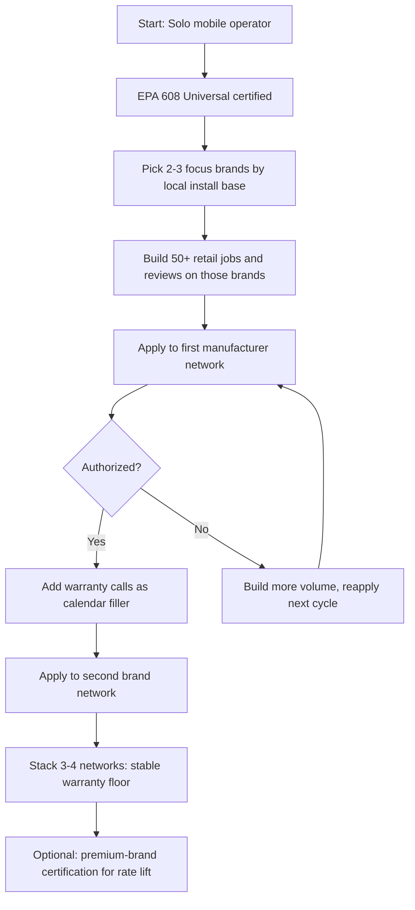

### Direct Answer

Starting an **appliance repair business in 2027** means launching a licensed, insured, mobile-or-shop-based skilled trade that diagnoses and repairs residential and light-commercial major appliances — refrigerators, washers, dryers, ovens, ranges, dishwashers, and water heaters — across the dominant manufacturer brands. Plan on **$5K-$22K startup as a solo mobile operator** out of a cargo van, **EPA 608 certification** for any sealed-system refrigerant work, and the single hardest gate of all: **manufacturer authorized service network access**. A mature solo tech nets **$80K-$220K/yr at 35-55% net margins**; a 2-tech operation runs **$185K-$485K revenue at 22-35% net**.

**TL;DR:** Appliance repair is one of the most defensible home-service trades in 2027 because demand is recession-resistant (a broken fridge is non-negotiable), the labor pool is shrinking faster than any other trade, and parts-plus-labor pricing produces fat per-call margins. The business has three viable formats — solo mobile, 2-tech, and multi-tech shop. The economics are excellent the moment you solve three problems: getting EPA 608 certified, getting on at least two manufacturer authorized networks, and building route density so windshield time does not eat your billable hours. PE consolidators (Neighborly's Mr. Appliance, Authority Brands) are rolling up established multi-tech operations at 4-6x EBITDA, which gives a clear exit. The biggest failure mode is not lack of demand — it is undercharging, ignoring diagnostic fees, and trying to be brand-agnostic instead of specializing.

---

## 1. The Appliance Repair Opportunity in 2027

### 1.1 Why This Trade Is Structurally Attractive

Appliance repair sits at the intersection of three favorable forces: **non-discretionary demand, a collapsing labor supply, and high-margin parts-plus-labor pricing**. Unlike a renovation or a landscaping upgrade, a dead refrigerator is an emergency a household will pay to fix within 24 hours. That makes appliance repair one of the most recession-durable home-service categories — the U.S. Bureau of Labor Statistics has projected home-appliance and power-tool repairer employment as roughly flat-to-declining in headcount even as the installed base of appliances grows, which is the textbook setup for pricing power. When supply of a service shrinks while the underlying demand pool expands, the price the market will bear rises — and the operators already in the field capture that lift.

The installed base is enormous. The U.S. Census Bureau's American Housing Survey counts well over 120 million occupied housing units, nearly all with a refrigerator and a cooking appliance, and the large majority with a clothes washer and dryer. The Association of Home Appliance Manufacturers (AHAM) reports tens of millions of major-appliance shipments annually. Every one of those units has a service life — refrigerators 10-15 years, washers and dryers 10-13 years, dishwashers 9-12 years, ranges and ovens 13-15 years — and a failure curve that guarantees a perpetual repair pipeline. The failures are not evenly distributed: appliances follow a classic bathtub curve, with a small cluster of early-life defects, a long stable middle, and a steepening climb of wear failures from roughly year seven onward. The huge cohort of appliances sold during the 2020-2022 home-improvement and housing boom is, by 2027, marching into that wear-failure window — a demographic tailwind for the repair trade that is baked into the data.

The labor side is where the moat is. The trade is aging out: the median appliance technician skews older than the broader workforce, and trade-school enrollment for appliance-specific programs is thin compared to HVAC or electrical. Appliance repair has also suffered from a perception problem — it lacks the cultural visibility of electrician or plumber as a "real trade," so fewer young people enter it. The result by 2027 is a structural technician shortage in most metros — which means a competent, professional, well-reviewed operator can run a months-deep backlog and raise prices without losing volume. A backlog is not a problem to be solved; it is pricing signal telling you to raise rates. This same dynamic drives the economics in adjacent trades; see how it plays out in garage door repair (q2138) and septic pumping (q2137).

The combination is rare. Most businesses face either thin margins or volatile demand; appliance repair in 2027 offers durable demand, a shrinking competitor pool, and structurally high gross margins on parts and skilled labor. Few trades let an owner-operator clear six figures from a single van with under $25K of capital at risk.

### 1.2 Market Size and the Three Demand Segments

Appliance repair demand splits into three segments, and your business model should be a deliberate choice about which two you serve:

| Demand segment | What it is | Margin profile | Volume reliability |
|----------------|-----------|----------------|-------------------|
| **Out-of-warranty retail** | Homeowner pays cash for a fridge/washer past its warranty | Highest ($/call) — you set the rate | Lumpy; depends on marketing |
| **Manufacturer warranty** | OEM pays you a fixed labor rate to fix in-warranty units | Lowest $/hr but steady volume | Very high; dispatched to you |
| **Extended-warranty / home-warranty** | Third-party plan (Assurant, AIG, American Home Shield) pays a contracted rate | Middle; capped labor, parts reimbursed | High but slow-pay |

The strategic insight is that **retail funds your margin, warranty funds your calendar**. A pure-retail operator has great per-call economics but spends heavily to generate leads. A pure-warranty operator has a full calendar but thin margins and slow OEM payment cycles. The durable model is a blend — warranty work fills the gaps between retail jobs and keeps a second technician utilized, while retail jobs deliver the cash margin.

There is also a fourth, easily overlooked segment: **light-commercial appliance service** — laundromats, small restaurants, offices, short-term-rental properties, and senior-living facilities. These customers run their appliances harder, need fast turnaround to avoid losing revenue, and value a reliable contracted vendor over the cheapest quote. A laundromat with twenty washers and twenty dryers is a recurring-service account that no amount of consumer marketing can replicate; the operator who builds two or three such relationships has a fixed-cost floor covered before the first homeowner calls. The economics of recurring commercial accounts echo the playbook behind a laundromat business itself (q2153).

### 1.3 Brand Landscape You Must Service

The U.S. major-appliance market is concentrated. **Whirlpool Corporation (NYSE: WHR)** owns Whirlpool, Maytag, KitchenAid, Amana, and JennAir — collectively the largest share of the installed base. **LG** and **Samsung** dominate the premium-mainstream tier and have grown fast, and both are notorious among technicians for proprietary parts and electronics-heavy designs. **GE Appliances**, now owned by China's Haier, holds a large legacy base after Haier acquired the unit from General Electric (NYSE: GE) in 2016. **Electrolux** (Frigidaire) rounds out mainstream, while the premium tier — **Sub-Zero, Wolf, Miele, Bosch (a Robert Bosch GmbH unit), Viking, Thermador, and Fisher & Paykel** — commands higher labor rates and tighter authorization.

Each brand carries a distinct service personality, and an experienced tech learns to read them:

| Brand group | Service reputation | Strategic note for a new operator |
|-------------|-------------------|-----------------------------------|
| **Whirlpool family (WHR)** | Largest base, well-documented, parts widely stocked | The easiest first specialization — volume is everywhere |
| **GE / Haier** | Large legacy base, mixed newer-model complexity | High call volume; good second brand |
| **LG** | Electronics-heavy, proprietary diagnostics | Lucrative but needs LG-specific tooling and training |
| **Samsung** | Fast-growing base, known for control-board failures | High demand, authorization is competitive |
| **Electrolux / Frigidaire** | Mainstream, moderate parts availability | Solid filler, rarely a specialization |
| **Premium (Sub-Zero, Wolf, Miele, Viking, Thermador)** | Expensive parts, demanding customers, top labor rates | The margin play — see Section 4.4 |

Your brand strategy is a core decision covered in Section 4. The short version: do not try to be all-brands-all-formats on day one. Specializing in two or three brands lets you stock the right parts, master the failure modes, qualify for authorized networks faster, and build a reputation as the local expert for those brands rather than a generalist who is mediocre at everything.

---

## 2. Business Models and Startup Economics

### 2.1 The Three Formats

There are three distinct ways to run an appliance repair business, and they are genuinely different businesses with different capital needs, risk profiles, and exits.

| Format | Startup capital | Year-1 revenue | Mature net margin | Exit path |
|--------|----------------|----------------|-------------------|-----------|
| **Solo mobile operator** | $5K-$22K | $95K-$185K | 35-55% | Lifestyle business / sell book of clients |
| **2-tech operation** | $35K-$95K | $185K-$485K | 22-35% | Sell to local competitor or roll-up |
| **Multi-tech shop** | $145K-$485K | $585K-$1.9M | 14-26% | PE roll-up at 4-6x EBITDA |

The solo mobile operator is the default starting point and the one this guide optimizes for. It has the lowest capital risk, the fastest path to profitability, and it teaches you the unit economics before you take on payroll. Most successful multi-tech shops began as a single van.

A few words on each format. The **solo mobile operator** is a true skilled-trade lifestyle business: one person, one van, no employees, total schedule control, and net margins that are the envy of nearly every other small business because there is no payroll drag and almost no fixed overhead. Its ceiling is the owner's own forty to fifty billable hours per week. The **2-tech operation** is the most operationally fragile of the three — it carries the costs of a small business (second van, payroll, workers' comp, a dispatcher's time) without yet having the scale to absorb them; many operators stall here, which is why Section 2.4 treats the transition with caution. The **multi-tech shop** is a genuine company: it usually has a physical location for parts storage and a small office, it carries three to eight or more technicians, it pursues volume warranty contracts and commercial accounts deliberately, and — crucially — it is the only format with a clean institutional exit. The format you choose is really a choice about how much business you want to build versus how much trade you want to practice.

A common and entirely valid path is to deliberately stop at solo or at two trucks. There is no rule that says you must scale. A solo operator netting $150K with full schedule control and no employees has built something many would-be empire-builders never reach. Scale only if the larger entity and its exit genuinely appeal to you.

### 2.2 Solo Mobile Operator: The Full Startup Budget

A realistic solo startup, assuming you already hold a relevant skill base or are completing certification in parallel:

| Line item | Low end | High end | Notes |
|-----------|---------|----------|-------|
| **Cargo van (used)** | $4,000 | $14,000 | Used Transit/ProMaster/Express; finance to preserve cash |
| **Van shelving + bins** | $400 | $1,800 | Adrian Steel / Weather Guard or DIY |
| **Hand + diagnostic tools** | $800 | $3,500 | Multimeter, manifold gauges, nut drivers, sealed-system kit |
| **EPA 608 Universal cert** | $35 | $185 | Exam fee; Section 6 covers this |
| **Initial parts inventory** | $500 | $2,500 | Fast-mover stock — see Section 5 |
| **LLC + business license** | $50 | $800 | State-dependent |
| **General liability insurance** | $400 | $1,200 | Annual; first installment |
| **Software / scheduling** | $0 | $250 | Housecall Pro, ServiceTitan, or free tier |
| **Website + Google Business** | $0 | $1,200 | DIY vs. agency build |
| **Branding / van wrap** | $0 | $2,000 | Magnets at minimum |
| **Marketing launch budget** | $300 | $1,500 | LSAs + first reviews push |
| **Working capital buffer** | $1,000 | $3,000 | First 60 days of expenses |
| **Total** | **$7,985** | **$32,635** | Practical band: $5K very lean to $22K comfortable |

The single largest variable is the van. Buying a $4,000 high-mileage cargo van and financing it keeps cash free for parts and marketing; the inventory and the marketing budget are what actually generate revenue, so do not starve them to buy a nicer vehicle. A van wrap looks professional but is purely cosmetic in the first ninety days — magnetic door signs at $40 a pair deliver most of the trust signal at one-fiftieth of the cost, and the wrap can wait until cash flow is proven.

A note on financing. Many first-time operators believe they should pay cash for everything to "stay out of debt." For the van and for large tool purchases this is usually backwards. A modest equipment loan or a van-finance note keeps your working-capital buffer intact — and it is the working-capital buffer, not the absence of debt, that keeps a new business alive through a slow first sixty days. The dangerous debt in this business is not an asset-backed van loan; it is high-interest credit-card balances run up because the operator under-capitalized the launch. Budget the buffer, finance the depreciating assets, and protect the cash.

The leanest credible launch — for a tech who already owns a usable vehicle and basic tools — can come in under $5,000: certification, an LLC, insurance, a starter parts kit, and a free scheduling tier. The figures in the table assume a from-scratch buyer of the van and tools. Either way, this is one of the lowest-capital skilled trades a person can enter; the comparison with the startup cost of a trade like a stump grinding business (q2146), which requires a five-figure piece of specialized equipment before the first job, is instructive.

### 2.3 Unit Economics of a Single Service Call

The math that makes this trade work:

| Component | Typical figure | Notes |
|-----------|---------------|-------|
| **Service-call / diagnostic fee** | $95-$185 | Often waived/applied if you do the repair |
| **Labor (billed)** | $125-$245/hr | Your standard non-warranty rate |
| **Average repair labor time** | 0.75-1.5 hrs | Excludes diagnostic |
| **Parts revenue** | Wholesale + 30-50% markup | Marcone/Reliable Parts wholesale |
| **Average ticket (retail repair)** | $185-$420 | Diagnostic + labor + parts |
| **Calls per day (solo, mature)** | 6-10 | Route density dependent |
| **Close rate (diagnostic → repair)** | 65-85% | Higher with transparent pricing |

A solo operator running 7 calls/day at a $260 average ticket, 5 days/week, 48 weeks/year, grosses roughly $437K on paper — but realistically a first-year solo runs lighter (4-6 calls/day, more no-shows, ramping reviews) and an experienced solo with a route-dense calendar lands in a $185K-$320K gross band. The mature steady state for a disciplined solo is the figure in Section 2.1: $95K-$185K gross in the early years, climbing into the $185K+ range with strong route density and pricing discipline, and converting to $80K-$220K of owner net at the 35-55% margins the trade allows.

Here is the same business viewed as a monthly profit-and-loss for a mature solo operator, which makes the margin structure concrete:

| Monthly P&L line | Conservative | Strong |
|------------------|-------------|--------|
| **Gross revenue** | $14,000 | $26,000 |
| Parts cost (COGS) | $3,200 | $6,500 |
| **Gross profit** | $10,800 | $19,500 |
| Fuel & van maintenance | $700 | $1,100 |
| Insurance (all lines) | $350 | $500 |
| Software & payment fees | $250 | $600 |
| Marketing | $600 | $1,400 |
| Phone, misc, tools | $300 | $500 |
| **Total operating expense** | $2,200 | $4,100 |
| **Owner net (pre-tax)** | **$8,600** | **$15,400** |
| Net margin | 61% | 59% |

The headline margin looks extraordinary because the owner's labor is the product and is not counted as an expense — that "net" is really compensation for full-time skilled work plus a return on the small capital base. It is still a genuinely excellent owner-operator income for the capital at risk.

### 2.4 The 2-Tech Inflection Point

Adding a second technician is the most dangerous transition in the business. Revenue can double, but a second van, a second insurance rider, payroll taxes, workers' compensation, and the loss of your own billable hours to dispatch and QC can crush margin if utilization is weak. The arithmetic is unforgiving: a second tech who is only 60% utilized may add more cost than gross profit while you, the owner, have stepped off the most valuable van in the fleet to manage them. The rule: **only add a tech when you are personally turning away 10+ qualified calls per week for at least eight consecutive weeks.** Until then, raise prices instead — a price increase converts excess demand directly into margin with zero added risk, while a premature hire converts it into payroll and stress.

When you do hire, hire the dispatcher-and-systems capability before or alongside the second tech, not after. The reason 2-tech operations stall is rarely the technician; it is that the owner is now simultaneously turning wrenches, dispatching, doing the books, and answering the phone — and doing all of them badly. Either the owner comes off the van to run the business, or a part-time office person is brought in. A 2-tech operation where the owner still bills forty hours a week is a trap; one where the owner manages, sells, and fills gaps is a real business.

---

## 3. Pricing Strategy and Revenue Mix

### 3.1 The Diagnostic Fee Is Non-Negotiable

The most common rookie mistake is offering "free estimates." Appliance diagnosis is skilled labor — it takes 20-45 minutes, consumes a route slot, and is the product you are actually selling. Charging a **$95-$185 diagnostic fee** does three things: it filters tire-kickers, it pays you for windshield time, and it anchors the customer to a paid relationship. The standard practice is to **apply the diagnostic fee toward the repair** if the customer proceeds — so a customer who books the repair pays it implicitly, and a customer who declines still pays you for your time.

Free estimates fail in a way that is invisible until it has bled a business dry. The operator who drives twenty minutes, diagnoses for half an hour, quotes a repair, and is told "let me think about it" has just donated nearly an hour of skilled labor and a route slot for zero dollars. Do that three times a day and a quarter of the workweek evaporates. Worse, free-estimate operators attract the worst customers — the ones price-shopping four companies — while the diagnostic fee gently selects for customers who have already decided to fix their appliance. The fee is not a barrier to business; it is a filter that improves the business. A confident, plainly stated diagnostic fee, presented as the professional norm it is, costs almost no real bookings and eliminates a mountain of wasted time.

There is one nuance worth scripting. When a customer asks "is the trip charge waived if I do the repair?" the answer is yes — and saying so on the phone removes the last objection. The customer hears "I only pay the diagnostic if I decide not to fix it," which feels entirely fair, and you have protected your time either way.

### 3.2 Labor Rate Benchmarks

| Work type | Rate band | Who sets it |
|-----------|-----------|-------------|
| **Retail / out-of-warranty labor** | $125-$245/hr | You |
| **Manufacturer warranty labor** | $65-$95/hr (flat-rate) | The OEM |
| **Home-warranty contracted labor** | $85-$135/job cap | The warranty company |
| **Premium-brand specialist labor** | $165-$295/hr | You + brand positioning |
| **After-hours / emergency** | 1.5-2x standard | You |

Notice the spread between OEM warranty rates and your retail rate. This is why warranty work is a **calendar-filler, not a margin-maker** — you take it to keep a tech utilized and to build OEM relationships, not to get rich on the labor line. An operator who confuses a full calendar with a profitable one can work sixty hours a week on warranty dispatches and still struggle to pay themselves; busyness and profitability are different things, and the labor rate is where the difference lives.

A note on raising rates. New operators chronically under-price out of fear, and then resent the business. The correct discipline is to **raise your retail labor rate until your booking calendar is roughly two weeks deep and holding** — that is the market telling you the price is right. If you can book a same-week appointment for every caller, you are too cheap. If you are four weeks out and losing jobs, you have headroom to hire or you are slightly too expensive. A two-week backlog at a healthy rate is the target equilibrium.

### 3.3 Parts Markup Discipline

Parts are sourced wholesale from distributors (Section 5) and resold at a **30-50% markup**. This is not gouging — it covers your sourcing time, your stocking cost, the inventory carrying cost, the risk of ordering a wrong part, and the warranty you carry on the part itself. When a customer compares your part price to an online retailer's, the honest answer is that they are not buying a part, they are buying a *working appliance with a warranty* — your markup is the price of correct diagnosis, the right part the first time, and recourse if it fails.

A **flat-rate book** is the most professional and most profitable way to price. Instead of quoting "labor plus parts" and exposing every line to negotiation, you quote a single all-in price per repair type — "$340 to replace that dryer's heating element, parts and labor, with a one-year warranty." Flat-rate pricing has three advantages: it removes haggling, it protects you when a job runs long (you priced the *job*, not the hour), and it rewards the speed you gain with experience — the tech who can do that element in forty minutes earns the same as the book assumed for ninety. Building your own flat-rate book from your job history is one of the highest-return administrative tasks in the business.

### 3.4 Target Revenue Mix

A healthy mature solo or 2-tech revenue mix:

| Channel | Target share | Why |
|---------|-------------|-----|
| **Retail out-of-warranty** | 55-70% | The margin engine |
| **Manufacturer warranty** | 15-30% | Calendar stability, brand credibility |
| **Home/extended warranty** | 5-15% | Fill, but watch slow-pay |
| **Commercial / property mgmt** | 5-15% | Recurring contracts, predictable |

Property-management and commercial accounts deserve special attention — a property manager with 200 rental units is a recurring-revenue annuity. They generate predictable volume, the jobs cluster geographically (improving route density), and the relationship insulates you from the marketing treadmill. The trade-off is net-30 or net-45 billing and slightly compressed rates, so a business should not be 100% commercial — but a 10-20% commercial base smooths the lumpiness of pure-retail demand. This recurring-account logic is the same one that underpins pool service (q2118) and pest control (q2139).

One more revenue lever: **the upsell that is not a sham.** When a tech is already inside a home fixing a dryer, a thirty-second offer to clean the dryer vent — a genuine fire-safety service — or to inspect the washer hoses for the bulging that precedes a flood is a real value-add that lifts the ticket honestly. The dryer-vent adjacency in particular is so natural that some appliance operators formalize it as a standing add-on; the standalone economics of that service are covered in dryer vent cleaning (q2113). The line to never cross is inventing problems — the long-run business is built on a reputation for honesty, and one customer who catches a fabricated upsell will tell two hundred others online.

---

## 4. Manufacturer Authorization: The Hardest Gate

### 4.1 Why Authorization Matters

Manufacturer **authorized service** status is the single hardest and most valuable thing to acquire in this business. An authorized service provider gets dispatched in-warranty work directly from the OEM, gains access to factory technical documentation and parts pricing, and — critically — earns a credibility signal that converts retail customers. A customer choosing between two repair companies will pick the "Samsung Authorized" one almost every time.

The value of authorization comes in four distinct forms, and it is worth being precise about them:

| Authorization benefit | What it actually delivers |
|-----------------------|---------------------------|
| **Dispatched warranty volume** | The OEM sends you in-warranty jobs — calendar fill with zero marketing cost |
| **Factory documentation & software** | Wiring diagrams, service bulletins, fault-code databases, diagnostic apps |
| **Preferential parts access** | OEM-direct parts pricing and faster availability for warranty jobs |
| **The trust badge** | "Authorized" on your profile lifts retail conversion measurably |

The fourth benefit is the most underrated. Even on out-of-warranty retail jobs that have nothing to do with the OEM, the "LG Authorized" or "Whirlpool Factory Certified" line on your Google Business Profile is a conversion multiplier — it tells a nervous homeowner that the manufacturer itself trusts you with their products. Authorization, in other words, pays for itself on retail work even if you never accepted a single warranty dispatch.

### 4.2 What Authorization Requires

The bar is real. To get on a network such as **LG Authorized Service, Samsung Direct Service, Whirlpool Factory Service, GE Authorized, or Sub-Zero & Wolf Certified**, you generally need:

| Requirement | Typical detail |
|-------------|----------------|
| **Factory training** | Brand-specific coursework, sometimes in-person |
| **OEM tools / software** | $2,000-$8,000 per brand for proprietary diagnostics |
| **Insurance minimums** | Higher GL limits than retail-only |
| **Background / facility check** | Some require a physical shop address |
| **Volume commitment** | Willingness to accept their dispatch flow |
| **Accept OEM labor rates** | The $65-$95/hr flat rate, non-negotiable |

### 4.3 The Authorization Sequencing Strategy

Do not chase all brands at once. The smart sequence:

The logic: prove yourself with retail volume on a brand first, then convert that demonstrated competence into authorization. Trying to get authorized before you have any track record is the most common application rejection. OEMs are protecting their brand and their warranty budget; they want servicers who already demonstrably know the products, carry proper insurance, and will not generate complaint calls. Walking in with fifty completed jobs and a 4.9-star review profile on their brand is a far stronger application than walking in empty-handed and asking for a chance.

A second sequencing reality: authorization is often **regional and quota-driven**. An OEM may already have enough authorized servicers in your ZIP cluster and simply not be accepting new ones, regardless of your qualifications — or, conversely, may be desperate for coverage in an underserved area and fast-track you. This is outside your control, so apply to several networks, accept the ones that say yes, and re-apply to the others on their next cycle. Treat authorization as a portfolio you build over two to three years, not a switch you flip at launch.

### 4.4 The Premium-Brand Play

The highest-margin authorization is the premium tier — **Sub-Zero, Wolf, Miele, Viking, Thermador**. These brands are installed in higher-income households, the labor rates run $165-$295/hr, parts are expensive (so markup dollars are larger), and the customer is far less price-sensitive — a household that spent $12,000 on a Sub-Zero refrigerator is not price-shopping a $600 repair across four companies. The trade-off is that premium certification is harder, the tooling is costlier, the install base is thinner, and the customer expectations are exacting — a premium-brand homeowner expects punctuality, shoe covers, a clean work area, and polished communication. You are selling a concierge service, not just a repair.

For an operator in an affluent metro, premium specialization is the single highest-leverage strategic move available. The math is straightforward: a premium-brand tech doing four jobs a day at a $480 average ticket out-earns a mainstream tech doing eight jobs a day at a $230 ticket, with half the driving and half the wear on body and van. The constraint is purely geographic — you need enough Sub-Zero and Wolf kitchens within a reasonable radius to fill the week. In a metro with the right density, building a business around the premium tier is the cleanest path to the top of the $80K-$220K solo net range and beyond.

---

## 5. Parts Sourcing, Inventory, and the Supply Chain

### 5.1 The Distributor Landscape

Parts flow through a wholesale distribution network. The major players:

| Distributor | Position |
|-------------|----------|
| **Marcone Servicers** | Largest U.S. appliance-parts distributor; broad OEM coverage |
| **Reliable Parts** | Major national distributor, strong West Coast / Canada |
| **Tribbles** | Regional distributor, Southeast strength |
| **AP Wagner** | Long-established parts house |
| **V&V Appliance Parts** | Regional, Midwest/Northeast |
| **OEM direct** | Brand-specific portals for authorized providers |

You will open a wholesale account (a business license and resale certificate are usually required) and likely use two or three distributors for coverage and price competition. Authorized providers also buy through OEM-direct portals at preferential pricing for warranty work. Distributors compete on price, on availability, and on next-day delivery to your shop or van — and the right mix is local. In one metro Marcone may have the deepest shelf and same-day will-call; in another, Reliable Parts or a regional house like Tribbles wins. Open accounts with at least two so a stockout at one does not force a second trip to the customer.

A practical sourcing discipline: always cross-reference the part number against the model's exploded diagram before ordering, and confirm the part has not been superseded by a revised number — manufacturers update components frequently, and ordering an obsolete number is a classic cause of a two-trip job. Most distributor portals and OEM parts sites flag supersessions; use them.

### 5.2 The Van Stock Strategy

Carrying the right parts on the van is the difference between a one-trip repair and a two-trip repair — and two-trip repairs destroy route density and customer satisfaction. The principle is the **80/20 of failure modes**: a small set of components cause most failures.

| Van-stock category | Examples | Why stock it |
|--------------------|----------|--------------|
| **Universal consumables** | Belts, capacitors, thermal fuses, water valves | Fit many models, fail constantly |
| **Common control boards** | Top 5-10 boards for your focus brands | High-value, high-frequency |
| **Seals and gaskets** | Door gaskets, tub seals | Predictable wear items |
| **Igniters and elements** | Oven igniters, dryer heating elements | Classic failure points |
| **Pumps and motors** | Drain pumps, washer motors | Frequent, model-specific |

The discipline is to track your own job history — after 100 jobs you will know exactly which 40 parts to keep on the van. First-trip-fix rate is the metric to optimize; an 80%+ first-trip-fix rate is a strong target. Every percentage point of first-trip-fix you gain converts directly into more completed jobs per week, higher customer satisfaction, and fewer review-damaging delays — it is arguably the single most important operational number in the business, and Section 8.3 returns to it.

There is a working-capital tension here worth naming. Van inventory ties up cash — a well-stocked van might carry $2,000-$5,000 of parts that are not yet revenue. The temptation for an under-capitalized operator is to carry too little and eat the two-trip penalty. The correct answer is to stock the demonstrably high-frequency parts heavily and let the long tail be order-as-needed; you are managing a Pareto curve, not trying to carry the entire catalog. As job volume grows, reinvest a slice of profit into deeper van stock — it is one of the highest-return uses of cash in the business because every avoided second trip is pure recovered margin.

A related habit: **triage on the phone before the visit.** Capturing the brand, model number, and a clear description of the symptom when the appointment is booked lets you predict the likely failed part and load it before you leave. A booking script that always asks "can you read me the model number off the sticker?" measurably lifts first-trip-fix without any added inventory at all.

### 5.3 The 2027 Parts Reality: Right-to-Repair

A genuine 2027 tailwind is the maturing **right-to-repair** legal landscape. Several U.S. states have enacted right-to-repair laws that compel manufacturers to make parts, tools, and documentation available to independent repairers. This is structurally good for independent appliance repair: it erodes the OEMs' ability to lock parts and diagnostics behind authorized-only walls, narrowing the gap between authorized and independent operators. Stay current on your state's specific statute — it directly affects your parts access and your competitive position against OEM service arms.

---

## 6. Licensing, EPA 608, and Compliance

### 6.1 EPA 608 Certification — Federally Mandatory

Any technician who opens a **sealed refrigerant system** — refrigerators, freezers, ice makers, wine coolers — must hold **EPA Section 608 certification** under the Clean Air Act, 40 CFR Part 82 Subpart F. This is not optional, not state-by-state, and not waivable. The certification tiers:

| 608 Type | Covers |
|----------|--------|
| **Type I** | Small appliances (≤5 lbs refrigerant) — most home appliances |
| **Type II** | High-pressure / appliances using HCFC refrigerant |
| **Type III** | Low-pressure appliances |
| **Universal** | All three types — get this one |

The exam runs **$35-$185** through EPA-approved certifying organizations (ESCO Institute, Mainstream Engineering, and others). Get **Universal** — the marginal cost over Type I is small, and it future-proofs you for any sealed-system work and for commercial refrigeration adjacency. The exam is open-book in many formats and the core-plus-Universal material is learnable in a focused weekend of study; there is no reason to settle for Type I only and then discover six months later that you cannot legally touch a sealed system. Note also that EPA 608 is a *technician* credential — every technician who opens a sealed system needs their own, so as you add staff you add certifications.

It is worth being blunt about why this matters legally. Knowingly venting refrigerant or having an uncertified person service a sealed system is a violation of the Clean Air Act, and the EPA can assess civil penalties per day per violation. This is not an obscure rule the industry ignores — distributors will ask for your certification number before selling you refrigerant, and OEMs require it for authorization. Get certified before you take a single sealed-system job.

### 6.2 State and Local Licensing

Appliance repair licensing is **not uniform** across the U.S. — and this is a frequent compliance trap. The picture:

| Jurisdiction type | Typical requirement |
|-------------------|---------------------|
| **States with appliance/electronics service licensing** | A state service-dealer or technician license, exam, bond |
| **States with no specific license** | Just a general business license + EPA 608 |
| **Municipal** | Local business license, possibly a home-occupation permit |
| **Refrigerant handling** | EPA 608 everywhere, plus state environmental rules |

Some states (California's Bureau of Electronic and Appliance Repair, Home Furnishings and Thermal Insulation is the classic example) require a registered service dealer. Others have nothing appliance-specific. **You must check your specific state and city before launch** — operating unlicensed where a license is required is an existential risk. The same patchwork problem affects locksmiths (q2136) and window tinting (q2140).

### 6.3 Insurance Stack

| Coverage | Why you need it | Typical annual cost |
|----------|-----------------|---------------------|
| **General liability** | You damage a customer's home/property | $400-$1,200 |
| **Commercial auto** | The van is a business vehicle | $1,200-$2,800 |
| **Tools & equipment / inland marine** | Theft from the van | $150-$500 |
| **Workers' comp** | Required once you have employees | Varies by payroll |
| **Bond** | Required by some states / for some accounts | $100-$400 |

Do not run on a personal auto policy — a personal policy will deny a claim the moment it learns the vehicle was in commercial use, leaving you personally exposed for an at-fault collision involving a work vehicle. This is one of the most common and most catastrophic uninsured-loss scenarios for new tradespeople.

General liability is equally non-negotiable. Appliance work happens inside customers' homes, often near water lines and gas connections. A mis-reconnected dishwasher supply line that floods a kitchen overnight, or a gas range left with a leaking fitting, is exactly the kind of six-figure claim GL exists to cover — and exactly the kind of incident that, uninsured, ends a business and threatens an owner's personal assets. The few hundred dollars a year for GL is not overhead; it is the price of being allowed to do the work at all. Many property managers and all OEM authorization programs will demand a certificate of insurance before they send you a single job.

### 6.4 Tax and Entity Structure

Form an **LLC** for liability separation and credibility. Most solo operators elect default pass-through taxation initially; as net income climbs past roughly $60K-$80K, an **S-corp election** can reduce self-employment tax by splitting income into salary and distribution — worth a conversation with a CPA. Sales tax on parts (and sometimes labor) varies by state and must be collected and remitted; your scheduling software should handle this.

---

## 7. Marketing and Customer Acquisition

### 7.1 The Local-Search Foundation

Appliance repair is a **high-intent, local, urgent-need** search category — which makes local search the dominant acquisition channel. The priority stack:

1. **Google Business Profile** — fully optimized, with service areas, photos, and a relentless review-generation habit. This is the highest-ROI asset you own.
2. **Google Local Services Ads (LSAs)** — the "Google Guaranteed" pay-per-lead units at the top of search. You pay per lead, not per click, and the Google Guaranteed badge converts.
3. **Local SEO website** — a fast, mobile-first site with brand and city pages.
4. **Reviews** — ask every satisfied customer, every time, on the spot. Volume and recency of reviews drive the map pack.

The review habit deserves emphasis because it is where most operators are lazy and where the compounding happens. A technician who finishes every job by saying "if I earned it, a quick Google review genuinely makes or breaks a small business like mine — it takes thirty seconds and I'd be grateful," and whose software then texts a direct review link an hour later, will accumulate reviews several times faster than one who hopes customers do it unprompted. Recency and volume of reviews are major inputs to the Google local map ranking; a steady drip of fresh five-star reviews is, in effect, free perpetual marketing.

### 7.2 Channel Economics

| Channel | Cost model | Typical CAC | Lead quality |
|---------|-----------|-------------|--------------|
| **Google Business Profile (organic)** | Free + effort | ~$0-$15 | Highest |
| **Local Services Ads** | Pay-per-lead | $15-$45/lead | High |
| **Google Search Ads (PPC)** | Pay-per-click | $25-$70/lead | High but pricier |
| **Manufacturer dispatch** | Free (you accept the rate) | $0 | Captive |
| **Property-manager outreach** | Time / relationship | Low amortized | Recurring |
| **Referral / word-of-mouth** | Free | ~$0 | Highest |
| **Thumbtack / Angi-type platforms** | Pay-per-lead/shared | $20-$60/lead | Variable, often shared |

The strategic principle: **lead-gen platforms and ads buy your launch; reviews and referrals run your steady state.** A mature operator with hundreds of reviews and a referral base spends a fraction of revenue on marketing because the Google map pack and word-of-mouth do the work. The same review-flywheel dynamic drives every successful home-service trade — see how it compounds in dryer vent cleaning (q2113) and estate sale companies (q2143).

The marketing-spend trajectory of a healthy appliance repair business is a downward slope. In the launch phase, an operator might spend 12-20% of revenue on Local Services Ads and search ads to manufacture the first wave of jobs and reviews. By year two or three, with a strong organic map presence and a referral base, that figure typically falls into the 4-8% range — the business is now being fed by assets (reviews, ranking, repeat customers) rather than rented attention. An operator still spending 15% of revenue on paid leads in year three has not built the organic flywheel and should diagnose why: usually it is a thin review profile or an under-optimized Google Business Profile. The goal is to make paid acquisition a supplement, not a dependency.

Be cautious with shared-lead platforms of the Angi/Thumbtack type. The lead is often sold to three or four competitors simultaneously, so you are paying to enter a price-driven race against operators who may be cutting corners. They can be useful early to fill a calendar, but a business built on shared leads is renting its customers permanently and competing on price forever. Treat them as a launch crutch to be weaned off.

### 7.3 The Property-Management Channel

The highest-leverage outbound effort is direct relationship-building with **property managers, landlords, and real-estate offices**. A single property-management company with hundreds of units generates predictable, recurring, route-dense work and tolerates a slightly lower price in exchange for reliability and net-30 billing. Building three or four such accounts can underwrite your fixed costs before a single retail call comes in.

### 7.4 Retention and Lifetime Value

A household has multiple appliances and will need you again. Capturing the customer's contact info, sending a service reminder, and being the "saved appliance guy in their phone" turns a one-time call into a multi-year relationship. A magnet on the fridge and a follow-up text after the job are cheap and effective.

The lifetime-value math is compelling and chronically underappreciated. A typical home has six to nine serviceable appliances. Over a ten-year relationship a household will plausibly need three to six repairs across those units — and will refer neighbors and family if the experience was good. If the average repair ticket is $280, a single satisfied customer is worth $850-$1,700 in direct repeat revenue alone, before referrals. Measured against a $25 acquisition cost on a Local Services Ad, the return on *retaining* a customer dwarfs the return on *finding* one. This is why the cheap, almost-free retention tactics — the fridge magnet, the follow-up text, a saved service history, a courteous reminder when an appliance reaches a typical failure age — are not afterthoughts. They are the highest-ROI marketing in the entire business. The operator who treats every job as the start of a decade-long relationship, rather than a transaction, builds a referral engine that eventually makes paid advertising nearly optional.

---

## 8. Operations, Scheduling, and Technology

### 8.1 Route Density Is the Hidden Profit Lever

The enemy of an appliance repair business is **windshield time** — unpaid hours driving between jobs. Two operators can charge identical rates and earn wildly different incomes purely because one clusters jobs geographically and the other zigzags across the metro. Route density is improved by:

- **Geographic service-area discipline** — say no to jobs outside your zone, or charge a travel premium.
- **Time-window batching** — group same-area calls into morning/afternoon blocks.
- **Booking software with map view** — so the dispatcher (or you) sees the route.

### 8.2 The Software Stack

| Tool category | Examples | What it does |
|---------------|----------|--------------|
| **Field-service management** | Housecall Pro, ServiceTitan, Jobber | Scheduling, dispatch, invoicing, payments |
| **Parts lookup** | Distributor portals, model-diagram apps | Find the right part fast |
| **Payments** | Integrated card processing, tap-to-pay | Collect on-site |
| **Reviews automation** | Built into FSM tools | Auto-ask after job completion |
| **Accounting** | QuickBooks, integrated | Books, sales tax, payroll |

A solo operator can start on a free or low-cost FSM tier and upgrade as call volume grows; the on-site payment and auto-review features pay for themselves quickly. ServiceTitan is the heavyweight platform built for multi-tech operations and is overkill — and over-priced — for a solo van; Housecall Pro and Jobber are sized for the solo-to-small-team range and are the sensible starting choices. The features that matter most early are mobile invoicing, integrated card payment so you collect on the spot rather than chasing checks, and automated review requests. Do not over-buy software before the call volume justifies it; do not under-invest either, because manual scheduling and paper invoices quietly cap how many jobs a day you can run.

One discipline pays for itself immediately: **collect payment before leaving the driveway.** A repaired appliance is a service that cannot be repossessed; an invoice mailed home has a real non-payment and slow-payment rate. Tap-to-pay on a phone and a card reader make on-site collection frictionless, and it should be a non-negotiable step in the job-completion routine.

### 8.3 The First-Trip-Fix Metric

The most important operational KPI is **first-trip-fix rate** — the percentage of jobs completed in a single visit. A two-trip repair doubles your windshield time, delays the customer, and erodes your review average. First-trip-fix is driven by van stock (Section 5.2), good pre-visit triage (asking the right questions on the phone to predict the part), and technician experience. Target 80%+.

### 8.4 The 2027 AI Diagnostic Tailwind

By 2027, AI-assisted diagnostics are a genuine operational edge. Model-specific diagnostic apps, error-code databases, and AI chat tools can shrink diagnosis time and improve part prediction before the tech even arrives — which directly lifts first-trip-fix rate and calls-per-day. Feeding a brand, model number, and symptom description into a capable AI tool can surface the two or three most probable failed components and the relevant service bulletins in seconds, work that once meant flipping through manuals. The operators who treat these tools as part of the standard kit will out-route the ones who do not.

This is worth framing correctly, though. AI does not replace the technician — diagnosis still requires hands on the appliance, meter readings, and judgment, and a wrong AI suggestion confidently followed is a two-trip job. What AI does is compress the *research* portion of diagnosis and improve pre-visit part prediction. The skilled-trade core of the work — the physical diagnosis, the repair, the customer relationship — remains stubbornly human and is precisely why the labor shortage cannot be automated away. AI makes a good appliance technician faster and more accurate; it does not make the technician unnecessary. That is, on balance, a tailwind: it raises the productivity of the operators who adopt it without eroding the moat around the trade.

---

## 9. Scaling, Hiring, and the PE Exit

### 9.1 The Technician Hiring Problem

Because the trade is labor-short, your binding constraint to scale is **finding and keeping technicians**, not finding customers. The realistic talent pipeline:

| Source | Pros | Cons |
|--------|------|------|
| **Experienced poached techs** | Productive day one | Expensive, may bring bad habits |
| **Trade-school graduates** | Trainable, fewer bad habits | Need ramp time |
| **Apprentice / grow-your-own** | Loyal, culture-fit, cheaper | 6-18 month ramp investment |
| **Adjacent-trade crossovers** | HVAC techs already have EPA 608 | Need appliance-specific training |

The most durable scaling model is **grow-your-own**: hire a coachable apprentice, ride along, and build them into a tech over a year. It is slower but produces loyal technicians who know your standards — and it is the only pipeline you fully control. The HVAC-crossover route is especially efficient because HVAC technicians already hold EPA 608 and understand sealed systems, refrigerant, and electrical diagnosis; the gap they need to close is appliance-specific mechanics and brand knowledge, which is a months-long ramp rather than a years-long one. Recruiting from adjacent trades — HVAC, general electrical, even handyman-grade fixers with strong mechanical aptitude — widens a painfully thin talent pool.

Retention matters as much as recruiting. In a labor-short trade, a trained technician who leaves takes route knowledge, customer relationships, and a year of your training investment with them — and may take them straight to a competitor. Competitive pay, a productivity-linked incentive, a well-stocked van that lets them succeed, and simply treating them as a professional rather than a cost center are what keep good techs. The operators who scale successfully treat technician retention as a core strategic function, not an HR afterthought.

### 9.2 Compensation Models

| Model | How it works | Best for |
|-------|--------------|----------|
| **Hourly + benefits** | Straight wage | Apprentices, predictability |
| **Flat-rate / piece-rate** | Pay per job or per billed hour | Productivity incentive |
| **Hourly + commission** | Base plus % of revenue | Balanced motivation |
| **Salary + bonus (managers)** | For a service manager / dispatcher | Multi-tech operations |

Flat-rate or commission components align the technician with utilization and first-trip-fix, but a pure piece-rate can incentivize cut corners — a hybrid is usually healthiest.

### 9.3 The Consolidation Landscape and Exit

Appliance repair is being actively consolidated. **Neighborly** — owner of the **Mr. Appliance** franchise brand (300+ locations) alongside Aire Serv, Glass Doctor, Molly Maid, and Mr. Rooter — is the dominant franchised player; Neighborly was acquired by KKR in 2021. **Authority Brands** is another multi-brand home-services platform rolling up territories. Legacy giants tell a cautionary tale: **Sears Appliance Repair** collapsed alongside Sears' 2018 bankruptcy, and **Best Buy's Geek Squad** services a warranty pipeline but is not a true independent-repair competitor.

For an independent builder, the exit math is straightforward: an established, well-run **multi-tech operation** with clean books, recurring property-management contracts, a strong review profile, and documented systems can sell to a regional consolidator or PE-backed platform at roughly **4-6x EBITDA**. The multiple is not automatic — it is earned by the things that make the business *transferable*: financials a buyer can trust, a customer base not dependent on the owner's personal relationships, technicians who will stay, documented processes, and clean licensing and authorization. An owner who is the business — every key relationship, every diagnosis, every decision running through one head — has built a high-paying job, not a sellable asset. The two or three years before an intended sale should be spent deliberately making the business run without the owner.

A solo operator's exit is thinner — typically selling the customer book, the van, and the brand to a local competitor for a modest multiple of cash flow — which is itself a reason to grow past solo if a real exit matters to you. This buy-and-build dynamic mirrors what is happening across the home-service trades; the same roll-up logic appears in the analysis of pest control (q2139) and mobile RV repair (q2145).

### 9.4 Franchise vs. Independent

A final structural choice: buy a **Mr. Appliance**-style franchise or build independent. The franchise gives you a brand, a playbook, training, and faster authorization leverage — at the cost of a franchise fee, ongoing royalties (commonly a mid-single-digit percentage of revenue), and reduced autonomy. Independent keeps every dollar of margin and total control but demands you build the systems yourself. For a first-time owner with capital but limited trade or business experience, a franchise de-risks the launch; for an experienced tech with business sense, independent captures far more long-run value.

---

## 10. Counter-Case: When Appliance Repair Is the Wrong Business

Every honest guide must argue the other side. Appliance repair is a strong business — but it is the **wrong** business for some people and some markets, and ignoring that is how money gets lost.

### 10.1 The "Replace, Don't Repair" Threat

The most serious structural risk is the **declining repairability of new appliances**. Many modern mainstream appliances — particularly entry-level units — are built with integrated electronics, proprietary parts, and price points so low that a $300-$450 repair on a $650 appliance does not make economic sense to the customer. As the installed base turns over to these units, the repairable-versus-replaceable line shifts, and the addressable market for repair contracts at the low end. Right-to-repair laws partly counteract this, but the trend is real. The defensive move is to **skew toward mid-range and premium appliances**, where repair economics clearly favor fixing over replacing, and toward washers/dryers/ranges that remain more repairable than cheap dishwashers and microwaves.

### 10.2 It Is Physically Demanding, Skilled Work

This is not a passive-income business and not a quick learn. Pulling a 300-pound refrigerator, working in tight kitchen spaces, lifting appliances, and diagnosing intermittent electrical faults is genuinely difficult, physical, skilled labor. If you do not enjoy hands-on diagnostic work — or are not willing to spend a year becoming genuinely good at it — you will struggle. Someone seeking a lower-physical-demand path should compare a route-based or asset-light model; the contrast with a business like solar panel cleaning (q2141) or a franchise-operator model is worth weighing honestly.

### 10.3 Warranty-Work Cash-Flow Trap

An operator who leans too heavily on manufacturer and home-warranty work can build an impressive-looking calendar that produces thin margins and slow cash flow. OEM and warranty companies pay flat, capped rates and often on 30-60 day cycles. A business that is 70% warranty work can be busy and broke at the same time. Warranty work is a supplement, not a foundation.

### 10.4 Authorization Dependency Risk

If your business becomes dependent on a single manufacturer's dispatch volume, that OEM holds enormous power — it can change labor rates, tighten terms, or de-authorize you, and a large slice of revenue evaporates overnight. Diversify across multiple brand networks and keep retail as the majority of revenue so no single OEM relationship is existential.

### 10.5 The Wrong-Market Problem

In a thin, rural, or low-density market, route density is impossible to build — windshield time eats the day and the economics never reach the figures in this guide. Appliance repair works best in a metro or suburban area with enough households per square mile to cluster jobs. If your market is genuinely sparse, a different trade — or a multi-county service area with travel-premium pricing — may be required. Honestly assessing your local density before buying a van is the most important pre-launch decision, and it is the same diligence that should precede entering any local trade, from a knife sharpening route (q2142) to a Christmas tree farm (q2144).

### 10.6 When It Is Still Clearly Right

Despite all of the above: for a hands-on person, in a metro with reasonable density, who gets EPA 608 certified, specializes in two or three brands, charges a real diagnostic fee, stocks the van intelligently, and builds a review flywheel — appliance repair in 2027 remains one of the most reliably profitable, recession-durable, low-capital trades available, with a genuine PE exit on the other side. The counter-cases are real, but they are all manageable with the strategy in Sections 1-9.

---

## Key Takeaways

- **Start solo and mobile.** $5K-$22K gets a competent operator on the road; prove the unit economics before taking on payroll.
- **Get EPA 608 Universal.** It is federally mandatory for sealed-system work and cheap relative to its value.
- **Charge the diagnostic fee.** "Free estimates" is the rookie mistake that quietly kills margin.
- **Authorization is the moat.** Specialize in 2-3 brands, build retail volume first, then convert it into authorized-network access.
- **Route density is the hidden profit lever.** Geographic discipline beats raw call volume.
- **Retail funds margin; warranty fills the calendar.** Never let warranty work exceed a minority of revenue.
- **Build toward a real exit.** A clean multi-tech operation sells at 4-6x EBITDA to PE-backed consolidators.

For adjacent home-service trade playbooks, compare the launch economics in locksmithing (q2136), septic tank pumping (q2137), garage door repair (q2138), pest control (q2139), window tinting (q2140), solar panel cleaning (q2141), knife sharpening (q2142), Christmas tree farming (q2144), mobile RV repair (q2145), dryer vent cleaning (q2113), and pool service (q2118).

---

### Sources & References

1. U.S. Bureau of Labor Statistics — Occupational Outlook Handbook, Home Appliance Repairers.
2. U.S. Bureau of Labor Statistics — Occupational Employment and Wage Statistics, appliance repairer wage data.
3. U.S. Census Bureau — American Housing Survey, occupied housing units and appliance presence.
4. U.S. Census Bureau — Current Population Survey, housing-unit estimates.
5. Association of Home Appliance Manufacturers (AHAM) — annual major-appliance shipment statistics.
6. U.S. Environmental Protection Agency — Section 608 Technician Certification, Clean Air Act.
7. U.S. Code of Federal Regulations — 40 CFR Part 82, Subpart F (refrigerant management).
8. U.S. Environmental Protection Agency — list of approved Section 608 certifying organizations.
9. ESCO Institute — EPA Section 608 certification exam information.
10. Mainstream Engineering — EPA 608 certification program details.
11. California Bureau of Electronic and Appliance Repair, Home Furnishings and Thermal Insulation — service-dealer registration.
12. U.S. Small Business Administration — guidance on LLC formation and business licensing.
13. Internal Revenue Service — S-corporation election (Form 2553) guidance.
14. Whirlpool Corporation — investor relations and brand portfolio (NYSE: WHR).
15. LG Electronics — authorized service provider program information.
16. Samsung Electronics — Samsung Direct Service and authorized service network.
17. GE Appliances (a Haier company) — authorized servicer program.
18. Electrolux / Frigidaire — service provider network information.
19. Sub-Zero Group, Inc. — Sub-Zero & Wolf factory-certified service program.
20. Miele — authorized service partner program.
21. Robert Bosch GmbH / Bosch Home Appliances — authorized service information.
22. Marcone Servicers — appliance parts distribution.
23. Reliable Parts — appliance parts distribution network.
24. AP Wagner — appliance parts distributor information.
25. Neighborly — Mr. Appliance franchise system and brand portfolio.
26. KKR — 2021 acquisition of Neighborly (announcement and deal terms).
27. Authority Brands — home-services platform and brand portfolio.
28. U.S. appliance-repair franchise disclosure documents (FDDs) — Mr. Appliance fee and royalty structure.
29. National Conference of State Legislatures — state right-to-repair legislation tracker.
30. Reuters / industry reporting — right-to-repair law enactment in U.S. states.
31. Sears Holdings — 2018 Chapter 11 bankruptcy filings and reporting.
32. Google — Local Services Ads and Google Guaranteed program documentation.
33. Google — Google Business Profile optimization guidance.
34. IBISWorld — Appliance Repair industry market research report.
35. Home-warranty industry reporting — Assurant, AIG, and American Home Warranty service-provider terms.
36. Field-service management vendor documentation — Housecall Pro, ServiceTitan, Jobber.
