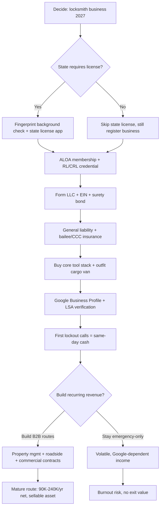

### Direct Answer

Starting a locksmith business in 2027 means launching a licensed mobile security trade that delivers emergency lockouts, rekeying, automotive transponder and proximity-fob programming, commercial master-key system design, and electronic access-control installation. A solo operator can begin for **$4K-$18K** — a key-cutting machine, a transponder programmer, a pick set, a used cargo van, a state license where required, a surety bond, and liability insurance — while a two-technician mobile shop costs **$35K-$95K**. A disciplined solo route nets **$90K-$240K per year at 50-65% net margin**, with the upper range driven by automotive and commercial work. The defining challenge of the trade in 2027 is not lock-picking skill or startup capital — both are unusually low barriers — it is winning Google visibility against organized "locksmith" scam listings that hijack the same search keywords legitimate operators depend on.

> **TL;DR** — Locksmithing is one of the few skilled trades you can enter for under $10K, credential in under a year, and run cash-flow-positive within the first quarter, because lockout calls are paid the same day in cash or card. Revenue stacks in three tiers: emergency residential and automotive lockouts (the gateway, $95-$550 per call); recurring commercial master-key and rekey contracts (the moat, $45K-$185K per year of stable, non-Google revenue); and electronic access-control installation (the high-ticket upsell, $1.5K-$15K per system). The durable competitive moats are ALOA credentials as trust signals, property-management contracts, and roadside-assistance partnerships — not lock-picking talent, which is teachable in months. The single biggest threat is Google Maps lead-generation fraud: organized, often international scam networks flood Local Services Ads and organic map results with fake "$15 locksmith" listings, then dispatch unlicensed contractors who charge $400-$1,200 for a $95 job, frequently by drilling out a lock that did not need drilling. A legitimate operator wins by ranking on verified Google Business Profile reviews, a "Google Guaranteed" badge that scammers cannot pass, ALOA membership, and a real physical address — and, most importantly, by building B2B routes and roadside partnerships that never touch Google search at all.

## PART 1 — FOUNDATIONS

### 1.1 Market size, demand structure, and who actually buys

The U.S. locksmith and security-systems services industry generated roughly **$3.0-$3.2 billion in 2026 revenue** across approximately 19,000-22,000 establishments, the overwhelming majority of which are sole proprietors or two-to-three-person mobile operations rather than multi-location companies (IBISWorld, *Locksmiths & Security Systems Services in the US*, 2026 update). The U.S. Bureau of Labor Statistics counts roughly **17,000-19,000 employed locksmiths and safe repairers** under SOC code 49-9094, with a median annual wage near $50,800 — a figure that materially understates owner-operator earnings, because it excludes the self-employed majority who keep the gross margin rather than draw a wage. The trade is not growing fast in headline terms; revenue grows in the low single digits per year. But it is **structurally fragmented and demographically aging**, and that combination is precisely the condition that rewards a disciplined new entrant: there is no dominant national brand, incumbents are retiring, and a professional operator can take share from tired competitors and from fraudulent listings alike.

Demand splits into three durable buyer segments, each with a distinct economics profile. **Residential** customers buy lockouts — the emotional, urgent, gateway purchase — plus rekeys after a move, a divorce, or a contractor handing back keys; deadbolt and smart-lock installation; broken-key extraction; and routine key duplication. Residential is the highest call volume and the most price-sensitive, and it is the segment most exposed to Google search fraud because the buyer is stressed, in a hurry, and shopping on a phone. **Automotive** customers buy transponder and proximity-fob programming, ignition repair, broken-key extraction, push-to-start reprogramming, and key duplication for vehicles whose dealers charge two to three times the mobile-locksmith price. Automotive is increasingly the highest-margin work in the trade because the technical barrier keeps generalists out. **Commercial** customers — property management firms, hotels, school districts, hospitals, municipalities, corporate facilities, and retail chains — buy master-key system design, scheduled rekeying, exit-device and panic-bar maintenance, rental-turnover rekeys, and access-control installation. Commercial is the smallest segment by call count but by far the largest by lifetime value, because a single property-management relationship recurs across hundreds of units and many years.

The strategic reading of this market is that **the money is not evenly distributed across the segments**. A new operator who treats all three equally — or who chases only the high-volume residential lockout — builds a fragile, marketing-dependent income. A new operator who uses residential lockouts to acquire customers cheaply, then deliberately migrates the business toward automotive margin and commercial recurring revenue, builds a sellable asset. The contract-stacking math that makes B2B routes worth more than raw call volume is the same dynamic that governs the trade-business economics in (q9620) and (q9621), and the demographic-tailwind argument — aging incumbents, fragmented ownership, no national consolidator — mirrors the opportunity thesis in (q2135).

Three structural forces shape the 2027 opportunity and deserve explicit attention:

- **The retirement wave.** The locksmith trade skews older than the U.S. workforce average, and a meaningful share of established sole proprietors are within a decade of retirement with no succession plan; their customers — particularly their commercial accounts — become available to a younger, professional operator who simply shows up consistently.
- **The technology bifurcation.** The trade is splitting into a slowly contracting mechanical-key business and a growing electronic-and-automotive business; this is a threat to generalists who do nothing and a clear opportunity for operators who invest in transponder programming, smart-lock integration, and access control.
- **The fraud-driven trust premium.** Because Google search is so polluted with scam listings, the market has, ironically, created an unusually large reward for visible legitimacy — customers burned once will pay a premium for an ALOA-credentialed, reviewed, physically-located operator, and a new entrant who builds genuine trust signals is exploiting a market failure the scammers themselves created.

The same "incumbent retirement plus technology shift plus trust premium" pattern is the underlying opportunity structure in (q2138) and (q2139).

### 1.2 Five business models — choose one before you buy a single tool

The single most expensive beginner mistake in this trade is buying tools before choosing a model. Each model has a different capital requirement, ramp speed, margin profile, and customer-acquisition motion, and they are not interchangeable.

| Model | Startup cost | Year-1 revenue | Net margin | Ramp speed | Best for |
|---|---|---|---|---|---|
| Solo mobile generalist | $4K-$18K | $65K-$140K | 50-65% | Fast (weeks) | First-time owner, fastest cash flow |
| Automotive-specialist mobile | $12K-$30K | $110K-$220K | 55-68% | Moderate | Tech-comfortable operator near dealers |
| Storefront + mobile hybrid | $45K-$120K | $160K-$340K | 35-48% | Moderate | Dense metro, retail key-cutting walk-ins |
| Commercial / institutional contractor | $35K-$95K | $140K-$300K | 40-55% | Slow (months) | B2B sales background |
| Access-control / security integrator | $60K-$160K | $200K-$450K | 38-52% | Slow, project-based | Low-voltage licensed operator |

The **solo mobile generalist** is the default and the recommended entry point for almost every new owner: it has the lowest capital requirement, the fastest break-even, and a natural on-ramp into the higher-margin automotive and commercial niches as skill compounds. Most successful multi-truck operators started here. The **automotive specialist** earns the highest margin per labor hour but demands continuous reinvestment in programming equipment and software subscriptions as vehicle security evolves model year over model year. The **storefront hybrid** trades margin for walk-in retail revenue and brand permanence — useful in dense metros where foot traffic generates key-cutting volume, but a heavier fixed-cost carry that depresses net margin. The **commercial contractor** and **access-control integrator** models earn the most stable revenue and the highest exit multiples, but they ramp slowest because B2B sales cycles run 60-180 days and institutional buyers require references, insurance certificates, and sometimes a low-voltage or alarm-contractor license before they will sign.

The correct sequencing for nearly every new entrant is to **start as a solo mobile generalist, prove the dispatch-and-pricing discipline, then layer automotive and commercial work on top** rather than starting in a slow-ramp model with no cash flow. The "start narrow, expand into recurring B2B" pattern is the same one that governs the trade-business playbooks in (q2138) and (q9622), and the warning against over-investing in fixed costs before revenue is proven echoes the storefront-versus-mobile analysis in (q2141).

One more model decision deserves a clear answer: **franchise versus independent.** Locksmith and key-services franchises exist, and they offer brand recognition, training, supplier relationships, and a marketing system in exchange for an initial franchise fee and ongoing royalties. For an operator with no trade background and no appetite for building marketing systems from scratch, a franchise can compress the learning curve. But the trade's low capital requirement and the strength of a well-run independent's local reputation mean most successful locksmith owners go independent: the royalty stream is a permanent drag on a margin that the operator could otherwise keep, and a disciplined independent who earns ALOA credentials and accumulates genuine reviews builds a brand asset that is fully their own and fully sellable. The franchise-versus-independent calculus here — pay for a system you could build, or build it and keep the margin — is the same trade-off weighed in (q2140) and (q2003).

### 1.3 Licensing, ALOA credentialing, bonding, and insurance

Locksmith licensing in the United States is **a patchwork, not a national standard**, and understanding your specific state's rules is the first regulatory step. Roughly **15 states plus several major municipalities** require a locksmith-specific license, registration, or low-voltage/security-contractor license; the remaining states impose no trade-specific licensing requirement at all, though every state still requires general business registration. States with active locksmith licensing regimes include **Texas** (Department of Public Safety, Private Security Bureau), **California** (Bureau of Security and Investigative Services, "Locksmith Company" license), **Illinois**, **New Jersey**, **North Carolina**, **Virginia**, **Tennessee**, **Oklahoma**, **Louisiana**, **Connecticut**, **Maryland**, **Nevada**, **Nebraska**, and **Alabama**, with additional city-level rules in jurisdictions such as New York City and Miami-Dade County. Where a license exists it almost always requires a **fingerprint-based criminal background check** — for the obvious reason that the trade grants licensed access to homes, vehicles, and commercial buildings. A serious criminal record can be disqualifying, and prospective owners should verify their state's rules before investing in tools.

A practical note on the hardware brands a locksmith installs and services every day: the lock industry behind the trade is dominated by a handful of large public manufacturers, and knowing them helps an operator stock, source, and advise customers. **Allegion plc (NYSE: ALLE)** owns Schlage, LCN, and Von Duprin and is the dominant U.S. commercial and residential lock brand a locksmith handles constantly. **ASSA ABLOY (STO: ASSA-B)**, the Swedish global leader, owns Yale, Medeco, SARGENT, Emtek, HID, and August, spanning everything from high-security cylinders to smart locks and access-control credentials. **Fortune Brands Innovations (NYSE: FBIN)** owns Master Lock and the Kwikset and Baldwin lines through its security segment. **dormakaba (SWX: DOKA)** is a major commercial access-control and door-hardware supplier. **Honeywell International (NASDAQ: HON)** is a significant player in commercial security and access control. And the company that defines the trade's hardest marketing problem is **Alphabet (NASDAQ: GOOGL)**, whose Google Search, Maps, and Local Services Ads are simultaneously the locksmith's primary customer-acquisition channel and the host of the scam-listing epidemic. An operator does not need to follow these stocks, but recognizing the corporate structure behind Schlage, Kwikset, Yale, and Medeco clarifies sourcing, warranty, and which manufacturer training programs are worth pursuing.

The most portable and most commercially recognized credential is **ALOA Security Professionals Association** certification. ALOA, founded in 1956 and counting roughly **7,500 members**, administers a tiered certification ladder: **Registered Locksmith (RL)**, **Certified Registered Locksmith (CRL)**, **Certified Professional Locksmith (CPL)**, and **Certified Master Locksmith (CML)**, the last earned by examination across many categories of locksmith knowledge. ALOA credentials are not legally required in unlicensed states, but they function as the de facto trust signal that commercial buyers, insurers, and informed residential customers look for, and they distinguish a legitimate operator from the fraudulent listings that dominate Google. Training paths into the credential include the **Associated Locksmiths of America** education program, manufacturer-specific courses (Schlage, Medeco, Mul-T-Lock), community-college locksmith programs, and structured apprenticeship under an established locksmith.

Two more pieces of paper are non-negotiable in every state, licensed or not. A **surety bond** — typically $10,000-$25,000 in coverage at a premium of $100-$400 per year — protects customers and is frequently required to register the business or bid commercial work. **General liability insurance** at $1M/$2M limits, costing roughly $600-$1,800 per year, is essential, and it must be paired with a **bailee or care-custody-and-control rider**, because a locksmith routinely takes temporary custody of customers' vehicles, keys, and access to their property. Workers' compensation becomes mandatory once you hire your first employee. The licensing-bonding-insurance sequencing here mirrors the regulated-trade entry checklist in (q2135) and (q2137), and the background-screening reality is consistent with the trust-sensitive trades covered in (q2139).

### 1.4 Legal entity, registration, and the first-90-days checklist

Beyond the trade-specific license, every locksmith business needs a conventional legal and tax foundation. The default recommended structure is a **single-member LLC**, which separates personal assets from business liability and is simple and inexpensive to form; an S-corporation election becomes worth considering once net income is high enough that the payroll-tax savings outweigh the added administrative cost, typically somewhere north of $80K-$100K in net profit. The business also needs an **EIN** from the IRS, a **business bank account and dedicated card** kept strictly separate from personal finances, a **sales-tax permit** in states that tax the parts and hardware a locksmith resells, and **local business licensing or a home-occupation permit** in the city or county of operation.

| First-90-days step | Why it matters | Typical cost |
|---|---|---|
| Form LLC + obtain EIN | Liability separation, tax identity | $50-$500 |
| State locksmith license (if required) | Legal to operate; background check | $50-$500 + fingerprinting |
| ALOA membership + RL credential | Trust signal, training access | $100-$400/yr |
| Surety bond | Required to register / bid commercial | $100-$400/yr premium |
| General liability + bailee insurance | Covers property/vehicle custody risk | $600-$1,800/yr |
| Business bank account + accounting software | Clean books for taxes and exit | $0-$40/mo |
| Google Business Profile + LSA verification | Visibility against scam listings | Free + per-lead |
| Sales-tax permit (parts resale states) | Compliance on hardware sales | Usually free |

The disciplined operator completes this checklist before — not after — taking the first paying call, because operating uninsured or unlicensed exposes personal assets and disqualifies the business from commercial accounts and roadside-assistance programs. The clean-foundation-first sequencing is the same first-90-days discipline laid out in (q2137) and (q9620).

## PART 2 — BUILD-OUT & CAPITAL

### 2.1 The core tool stack — what you actually need on day one

The single biggest capital mistake a new locksmith makes is buying a wall of specialty tools before the first paying call. Trade forums and YouTube create the impression that you need an exhaustive arsenal; you do not. The functional minimum for a solo mobile generalist is narrow, and everything beyond it should be financed by revenue, not by startup capital.

| Equipment | Purpose | Cost (new) | Day-one priority |
|---|---|---|---|
| Manual key-cutting (duplicating) machine | Duplicate standard residential/commercial keys | $350-$1,400 | Essential |
| Transponder / cloning programmer | Automotive key + fob programming | $1,200-$5,500 | Essential for auto work |
| Lock pick set + tension wrenches | Non-destructive entry | $80-$250 | Essential |
| Plug spinner + bypass / shim tools | Lockout speed and non-destructive entry | $60-$180 | Essential |
| Pinning kit + follower tools | Rekeying cylinders | $90-$300 | Essential |
| Key blank inventory (starter set) | Residential + automotive blanks | $400-$1,100 | Essential |
| Cordless drill + bits | Lock removal, smart-lock install | $120-$350 | Essential |
| Code / laser key-cutting machine | High-security + cut-by-code automotive | $3,500-$12,000 | Phase 2 |
| OEM diagnostic tablet | Dealer-level fob reprogramming | $1,000-$3,000 | Phase 2 |
| Safe-opening drill rig + borescope | Safe service and manipulation | $900-$3,500 | Phase 3 |

A disciplined day-one kit lands around **$3,500-$8,000 in tools** for a generalist who defers code-cutting, OEM-level automotive programming, and safe work to later phases. The automotive specialist front-loads the transponder programmer and a code machine, pushing tool spend to **$12K-$22K** — a justified investment because automotive jobs bill $185-$550 against 30-60 minutes of labor and are the niche least exposed to Google fraud. The phasing principle matters: buy the Phase 2 and Phase 3 tools out of operating cash flow once the relevant demand is proven, not out of the startup budget. Over-tooling at launch is dead capital, and the "buy capability as revenue justifies it" discipline is the same one that separates profitable from unprofitable operators in (q1147).

A note on buying used and on training as a capital item. Key machines, code machines, and many hand tools hold value well and can be bought used from retiring locksmiths or trade marketplaces at 40-60% of new cost — a legitimate way to compress the startup budget without compromising capability. The exception is automotive programming hardware, where buying current and keeping subscriptions active matters more than saving on the purchase. The other under-budgeted capital item is **training itself**. A new entrant with no trade background should treat formal training — an ALOA education course, a manufacturer course, a community-college locksmith program, or paid apprenticeship time — as a real line item of $500-$3,000, because competence acquired before the first paying call prevents the destroyed-lock, unhappy-customer, no-review outcomes that sink new operators. Skill is cheaper to buy up front than to learn on a customer's deadbolt.

### 2.2 The cargo van — your shop, your inventory, and your billboard

For a mobile locksmith the vehicle is the entire physical plant: it is the workshop, the inventory warehouse, the dispatch base, and — when wrapped — a recurring source of inbound leads. A **used cargo van** is the standard entry vehicle, with the Ford Transit, Ram ProMaster, and Chevrolet Express the most common platforms, available in serviceable condition in the **$6,000-$18,000** range. Many operators start with a vehicle they already own and upfit it gradually, which is a legitimate way to compress the startup budget.

The upfit is where the van becomes a working shop. Budget **$1,500-$5,000** for shelving systems, drawer units, a small workbench, a power supply or inverter, and — critically — **secure, lockable key and tool storage**, because a locksmith van full of keys, blanks, and programming equipment is itself a theft target. Then budget **$800-$2,500** for a vinyl wrap or, at minimum, professional magnetic signage. The wrap is not vanity: a clean, branded, parked van in a residential neighborhood is a genuine marketing asset that generates inbound calls at zero marginal cost, and it is one of the few channels entirely insulated from Google search fraud. A realistic all-in vehicle line item — purchase plus upfit plus wrap — is **$9,000-$25,000**, and it is typically the largest single component of a serious startup budget. The "vehicle as both production asset and rolling billboard" economics here are identical to the mobile-service models analyzed in (q1147) and (q2141).

### 2.3 Software, dispatch, and the payments stack

Locksmithing is fundamentally a dispatch business, and the software layer is where amateurs quietly lose money — to missed calls, to unbilled add-on work, and to an inability to measure which marketing channels actually produce paying jobs. Three software tiers exist, and an operator should move up them as volume grows rather than over-buying on day one.

| Tier | Tools | Monthly cost | When to adopt |
|---|---|---|---|
| Solo starter | Google Voice + Google Calendar + Square/Stripe + spreadsheet | $0-$60 | Months 1-6, single tech |
| Field-service platform | Housecall Pro, Jobber, ServiceM8 | $65-$280 | Once 2+ techs or 100+ jobs/mo |
| Full FSM + dispatch | ServiceTitan, Workiz (locksmith-focused) | $200-$600+ | Multi-truck, commercial routes |

**Workiz** deserves specific mention because it markets directly to the locksmith trade and includes lead-source tracking, which becomes essential the moment an operator spends on Local Services Ads and needs to know the true cost per acquired job rather than the cost per lead. The payments stack must support **on-site card-present transactions** — Square Terminal or Stripe Terminal — for residential and automotive jobs paid on completion, plus **digital invoicing with net-30 terms** for commercial accounts that will not pay a tech in the field. Two early add-ons pay for themselves quickly: a **24/7 answering service or AI receptionist** at roughly $1-$3 per handled call, because locksmith demand is emotional and urgent and a missed lockout call at 11 p.m. is a permanently lost customer; and **review-request automation**, because Google review volume is the single most important organic-ranking and trust factor in this fraud-saturated category.

The reason the software tier matters more than it appears is **lead-source attribution**. A locksmith without it cannot tell whether the $1,200 spent on Local Services Ads last month produced $4,000 of profitable jobs or $400, and so cannot decide whether to scale the channel, cut it, or shift the budget to commercial outreach. With proper attribution, every marketing dollar becomes a measurable experiment, and the operator can systematically reallocate spend toward the channels with the lowest cost per acquired job — which, in this trade, are almost always referral, repeat, and B2B rather than paid search. Field-service software also captures the **customer database**, which is itself an asset: a list of every past residential, automotive, and commercial customer is a reactivation channel (rekey reminders, smart-lock upgrade offers, annual commercial service prompts) and a real component of business value at sale. The operator who runs on a spreadsheet loses this; the operator on a proper platform compounds it. The "instrument the business so every channel is measurable" discipline is the same one emphasized in (q9620).

### 2.4 Inventory, parts sourcing, and supplier relationships

A locksmith van is also a rolling inventory store, and inventory discipline separates profitable operators from those whose cash is permanently tied up in dead stock. The starter inventory should cover the **highest-frequency jobs**: a working set of residential and commercial key blanks, the most common automotive transponder and remote-head blanks for the local vehicle mix, a stock of standard deadbolts and knob/lever locksets in common finishes, rekey pinning kits, basic high-security cylinders, and consumables. A new operator should resist stocking deeply for rare jobs — those parts can be sourced per-job with a small markup and a one-day wait.

Supplier relationships matter more than they first appear. The major locksmith wholesale distributors — including **Locksmith Ledger-listed national suppliers, IDN-Hardware (Intermountain Lock / IDN), Trans-Atlantic, and Stone & Berg-type regional houses**, plus manufacturer direct accounts with **Schlage (Allegion), Kwikset, Medeco, Mul-T-Lock, and SARGENT**, and automotive-key specialists for transponders and fobs — set the cost basis of every job. A locksmith who opens trade accounts, buys at volume tiers, and negotiates terms protects margin on every rekey and install. For automotive, OEM and quality-aftermarket fob sourcing is a continuous procurement task, and operators serious about the niche build relationships with multiple key suppliers to manage price and availability.

| Inventory category | Starter investment | Reorder logic |
|---|---|---|
| Residential / commercial key blanks | $250-$600 | Reorder fast-movers weekly |
| Automotive transponder / fob blanks | $400-$1,500 | Match local vehicle mix |
| Deadbolts + locksets (common finishes) | $300-$900 | Stock 2-3 of top sellers |
| Rekey pinning kits + springs | $90-$300 | Replenish as consumed |
| High-security cylinders | $200-$700 | Per-job order for rare keyways |
| Consumables (lubricant, bits, hardware) | $80-$250 | Continuous |

The inventory principle is **stock the common, order the rare** — and track it, because untracked van inventory is where margin quietly leaks. The supplier-relationship and parts-margin discipline here is the same one that governs profitability in (q9621) and (q2138).

> **TL;DR — capital reality check** — A genuinely lean solo locksmith launch is **$4K-$18K** all-in: roughly $4K-$8K in core tools, $3K-$9K for a van and upfit if you do not already own a usable vehicle, $1K-$2K for licensing, bond, and insurance, $500-$1.5K for software and marketing setup, and $1K-$3K for starter parts inventory. The **two-technician mobile operation** runs **$35K-$95K** because you add a second fully outfitted van, a second tool kit, an employee's wages and payroll burden during the ramp before the second truck pays for itself, deeper inventory, and a working-capital cushion. You do not need a storefront to be profitable, and most mature solo operators never open one — the storefront is a brand-and-walk-in decision, not a profitability requirement.

## PART 3 — OPERATIONS

### 3.1 Pricing architecture and service-category economics

Locksmith pricing follows a **service-call base plus per-job pricing** model, and getting the base right is the difference between a profitable route and a busy, unprofitable one. The service-call base recovers the cost of dispatching a truck to a location; the per-job pricing recovers the labor, parts, and skill of the actual work. An operator who quotes lockouts at "$25" to win the call against scam listings — and many beginners do — runs an unprofitable truck and trains the market to expect prices no legitimate operator can sustain.

| Service | Typical price | Labor time | Effective $/hr |
|---|---|---|---|
| Service-call base (first 30 min) | $85-$185 | 0.5 hr | $170-$370 |
| Residential lockout | $95-$295 | 0.3-0.7 hr | $200-$420 |
| Rekey (per cylinder) | $25-$85 | 0.2 hr | $130-$300 |
| Deadbolt supply + install | $185-$485 | 0.7-1.2 hr | $230-$400 |
| High-security cylinder install | $250-$650 | 1.0-1.5 hr | $250-$430 |
| Automotive transponder programming | $185-$550 | 0.5-1.0 hr | $300-$650 |
| Proximity / push-to-start fob program | $220-$650 | 0.7-1.2 hr | $280-$540 |
| Smart-lock supply + install | $295-$595 | 1.0-1.5 hr | $260-$420 |
| Safe opening / combination change | $150-$450 | 1.0-2.5 hr | $150-$300 |
| Commercial master-key system | $1,500-$15,000 | 8-60 hr | $180-$320 |

The strategic point embedded in this table is that **lockouts are the gateway, not the profit center**. They acquire customers at low cost and build the Google review volume a legitimate operator needs, but the durable margin lives in automotive programming, high-security and smart-lock installation, and commercial master-key systems. A new operator who only chases lockouts builds a fragile, weather-dependent, Google-dependent income; one who systematically converts lockout customers into rekey-and-upgrade jobs, and who lands recurring B2B routes, builds a real asset. Mature solo operators report **$90K-$240K per year in net income** at 50-65% margins, and the difference between the bottom and top of that range is almost entirely the automotive and commercial mix. The "loss-leader gateway service feeding a higher-margin upsell" structure is the same dynamic documented in (q2139) and (q2140), and the discipline of pricing to recover true cost-to-serve is the recurring lesson of (q9620).

### 3.2 The automotive transponder workflow — the highest-margin niche

Automotive key work is the single best margin-per-hour opportunity in the trade in 2027, and the reason is straightforward: it is technically intimidating enough to keep generalist competitors and unlicensed scammers out. The workflow is methodical. The technician identifies the vehicle's immobilizer system and the correct key or fob type; sources the transponder, remote-head key, or proximity fob, either OEM or quality aftermarket; **cuts the mechanical key blade by code** where applicable, using a code or laser machine; and then **programs the transponder or fob to the vehicle's immobilizer** using a diagnostic programmer or OEM-level tablet. Dealerships charge **$200-$650 and frequently more** for the same job, often require towing the vehicle to the dealer, and may take days; a mobile locksmith performs the work in the customer's driveway, same day, at 40-60% savings.

The structural catch is continuous reinvestment. Vehicle security advances every model year — rolling codes, encrypted immobilizers, phone-as-key systems — and programmers require subscription updates and periodic hardware upgrades. A serious automotive operator should budget **$600-$2,500 per year** simply to stay current on programming capability. The major aftermarket programming-tool ecosystems an operator will evaluate include the high-end diagnostic platforms used by professional automotive locksmiths, plus quality transponder-cloning devices for the lower-complexity jobs; the right kit depends on the local vehicle mix and the operator's appetite for the higher-end work. Operators committed to automotive should also pursue **NASTF (National Automotive Service Task Force) Vehicle Security Professional (VSP) registration**, which provides legitimate, audited access to OEM key codes and secure systems and is increasingly expected by insurers, motor clubs, and OEM lock-data programs. VSP registration is itself a trust credential that fraudulent operators cannot obtain.

Automotive is also the segment least exposed to Google Maps spam, because the work genuinely cannot be faked by an unlicensed contractor with a phone and a drill — and that insulation from the fraud problem is, by itself, a strong reason to prioritize the niche. The demand picture is durable: tens of millions of vehicles on U.S. roads use transponder and proximity-key systems, key fobs are routinely lost or fail, and dealership pricing and turnaround create a permanent gap a mobile locksmith fills profitably. The risk is the opposite of the residential business — not declining demand, but the discipline of continuous skills and equipment investment. An operator who treats automotive as a "set and forget" capability falls behind within two or three model years; one who reinvests methodically owns the highest-margin work in the trade. The reinvestment-to-stay-current dynamic here mirrors the technology-treadmill discussion in (q2140).

### 3.3 Commercial route building and B2B sales

Commercial work is where a locksmith business stops being a job and becomes a sellable asset. The buyers — **property management firms, hotels, school districts, hospitals, municipalities, retail chains, and corporate facilities** — purchase master-key system design, scheduled rekeying, exit-device and panic-bar maintenance and inspection, rental-turnover rekeys, and access-control installation and service. The economics are durable because the work recurs by its nature: a property manager with 400 units generates a rekey call on every tenant turnover, and a master-key system, once designed and installed, ties that customer to the locksmith for re-pinning, key control, and expansion for years.

The sales motion is unglamorous and effective. It is direct outreach to property managers and facilities directors — calls, in-person visits, and proposals — backed by certificates of insurance, ALOA credentials, and references. It runs on **net-30 commercial accounts**, professional invoicing, and, above all, reliable scheduled service: commercial buyers value predictability over price. A single mid-sized property-management relationship can generate **$45K-$185K per year** of stable, non-Google revenue, and a portfolio of three or four such relationships transforms the business's risk profile and its exit value. The discipline required — proactive B2B outreach, contract-quality service delivery, disciplined invoicing and collections — is the same recurring-revenue moat that distinguishes durable, sellable operators in (q9621) and (q9620), and the institutional-sales motion parallels the commercial-route building described in (q9622).

It is worth being concrete about the commercial buyer types, because each has a distinct entry point and a distinct sales cycle:

- **Property management firms** are the highest-value first target for a new operator — they own continuous rekey demand across rental turnovers, value a single reliable vendor, and one signed firm can carry an entire route.
- **Hotels and hospitality** need master-key system maintenance, guest-room lock service, and rapid response, and they sign annual maintenance arrangements that recur predictably.
- **School districts and universities** rekey and service on academic-calendar cycles and usually require formal vendor registration and competitive bids — slower to win, but extremely sticky once won.
- **Healthcare facilities** need access control, controlled-substance-room security, and panic-hardware compliance, and they pay a premium for credentialed, audit-ready reliability.
- **Corporate, industrial, and retail clients** need master-keying, access control, and multi-location consistency, and they reward vendors who can service a portfolio uniformly.

The practical commercial-sales sequence for a new operator is to land one or two property-management firms first — fastest to close and immediately recurring — then use those references to pursue the slower institutional accounts. A commercial pipeline built this way is the single most important determinant of whether the business becomes a sellable asset, and the staged-pipeline approach mirrors the B2B build-out described in (q2003).

### 3.4 Residential, smart-lock, and emergency-dispatch discipline

Residential is the highest-volume and most Google-dependent segment, and it requires genuine operational discipline to be profitable. **Emergency dispatch must be authentically 24/7** — the answering service or AI receptionist is a requirement, not a luxury — and **response-time promises must be honest**, because a homeowner locked out at midnight will not wait ninety minutes and will call the next listing. The operator who answers every call, quotes a clear price range over the phone, and arrives when promised converts a stressful situation into a five-star review and a future rekey customer.

The structural growth opportunity inside residential is the **smart-lock transition**. Homeowners increasingly want keypad, Wi-Fi, and app-controlled deadbolts and handlesets — products from **August, Schlage (Encode and Sense), Yale (Assure), Kwikset (Halo), and Ultraloq** — and most homeowners cannot install, integrate, or troubleshoot them confidently. A locksmith who positions deliberately as the **smart-lock installation and integration specialist** captures a $295-$595 install with a clean upsell path into whole-home rekeying, high-security cylinders, and light access control. This is also a margin-protective move, because as mechanical-key duplication slowly declines, smart-lock work is one of the growing residential categories.

The smart-lock opportunity is worth treating as a deliberate positioning choice rather than an incidental service. Homeowners researching smart locks are often anxious about door fit, deadbolt backset compatibility, Wi-Fi reliability, hub requirements, and integration with their existing home-automation platform — and a retailer or big-box installer cannot answer those questions with a locksmith's authority. An operator who builds a reputation as the local smart-lock expert, who can recommend the right product for a given door and use case, and who can both install the smart lock and rekey the rest of the home to match, converts a one-product sale into a whole-home security upgrade. This positioning also future-proofs the residential business against the slow erosion of mechanical-key work: the locksmith who owns the smart-lock conversation is growing into the part of the residential market that is expanding. The residential discipline — fast and honest dispatch, clear phone pricing, expert positioning, and systematic upsell from the gateway service — parallels the home-service execution model in (q2138) and the specialist-positioning argument in (q2140).

### 3.5 Hiring the second technician and the KPIs that matter

The transition from solo operator to a two-person shop is the most failure-prone moment in the trade, and it is a hiring-and-systems problem rather than a demand problem. Locksmith technicians are difficult to recruit because the trade is small and licensing states screen on criminal history; the realistic pipeline is apprenticing a trustworthy hire from an adjacent skilled trade, recruiting through ALOA networks, or hiring a junior tech and investing in their certification. A second technician should be brought on only when the owner's own schedule is consistently full, when there is documented overflow demand, and when the owner has working capital to cover the new hire's wage during the weeks before their truck runs a full schedule.

Compensation for a competent locksmith technician typically runs a base hourly wage plus performance incentive, and total cost to the business — wage, payroll taxes, insurance, and the second van and tool kit — must be modeled honestly before hiring. The owner's role also changes: they must become a dispatcher, trainer, and quality controller, which is uncomfortable for operators who define themselves as the best technician.

Running the business on numbers, not instinct, is what makes the second truck profitable. The KPIs that matter:

| KPI | Healthy target | Why it matters |
|---|---|---|
| Call answer rate | >95% | Missed urgent calls are lost forever |
| Average ticket | Rising quarter over quarter | Measures upsell discipline |
| Cost per acquired job (LSA / ads) | Below 12-18% of job revenue | Marketing profitability |
| Jobs per truck per day | 4-7 (mix-dependent) | Truck utilization |
| First-time-fix rate | >90% | Avoids unpaid return trips |
| Commercial / recurring revenue share | Trending toward 40-60% | De-risks income, raises exit value |
| Review velocity | Steady positive flow | Organic ranking and trust |

The operator who tracks these weekly catches an unprofitable marketing channel, a sliding average ticket, or an underutilized truck before it becomes a crisis. The metrics-driven management discipline here is the same one that distinguishes scalable trade businesses in (q9620) and (q9622).

> **TL;DR — operations** — Win on three operational fundamentals: (1) **answer every call**, because urgent demand is unforgiving and a missed call is a lost customer forever; (2) **price with a real service-call base** plus honest per-job pricing, so you never run an unprofitable truck and never train your market on prices no legitimate operator can sustain; and (3) **convert** every lockout and rekey customer toward higher-margin smart-lock, automotive, and commercial work. The operators who fail in this trade are almost never bad at picking locks — they are bad at dispatch reliability, at pricing discipline, at hiring, and at systematic follow-up and upsell.

## PART 4 — GROWTH & EXIT

### 4.1 Marketing — and the Google Maps spam reality

This is the hardest and most under-discussed part of the locksmith business, and a new operator who does not understand it will lose money on marketing for months. The locksmith category is **one of the most fraud-saturated verticals on Google Search and Google Maps**. For more than a decade, organized lead-generation operations — many of them international call centers — have flooded **Google Maps and Local Services Ads** with fake "locksmith" listings built on fabricated street addresses and call-forwarding numbers. These listings advertise an impossibly low price, often a "$15 service call," to win the click; they then dispatch an unlicensed, untrained subcontractor who arrives, claims the lock must be drilled, and charges the customer **$400-$1,200 for a job a legitimate, ALOA-credentialed locksmith would have completed non-destructively for $95-$150**. The Federal Trade Commission and consumer-protection agencies have issued repeated warnings about this exact bait-and-switch.

Google has run multiple enforcement waves and tightened both **Google Business Profile** verification — adding video verification, stricter address rules, and listing audits — and **Local Services Ads** provider vetting, which now includes background and license checks. But the problem persists because the scam networks adapt faster than the enforcement, registering new fake listings as old ones are removed. The practical consequence for a legitimate operator is unavoidable and must be designed around from day one: **you cannot win this market on price, and you cannot rely on organic map results alone.**

| Channel | Cost basis | Strength | Notes |
|---|---|---|---|
| Google Business Profile (organic) | Free | High once reviews accumulate | Requires real address + video verification |
| Local Services Ads (LSA) | Pay-per-lead $15-$45 | High intent, "Google Guaranteed" badge | Must pass background + license check scammers fail |
| Google Search Ads (PPC) | $4-$22 per click | Scalable | Expensive; competes with scam bidders |
| Branded, wrapped van + yard signs | $800-$2,500 one-time | Local trust, free recurring leads | Underrated, fraud-immune |
| Roadside-assistance partnerships | Revenue share | Steady automotive volume | AAA, insurers, motor clubs |
| Commercial direct outreach | Time only | Highest LTV, zero Google exposure | The real moat |
| Nextdoor / neighborhood referral | Low / free | Trust-based residential leads | Compounds with reputation |

The winning marketing strategy is **trust-based, not price-based**. It means earning the **"Google Guaranteed" LSA badge**, which requires passing the background and license check that the scam networks structurally cannot pass; accumulating genuine five-star reviews through disciplined post-job review requests; maintaining a verifiable physical address and consistent business name across every directory; prominently displaying ALOA membership and NASTF VSP registration; and — most importantly — **building B2B, roadside, and referral revenue that does not touch Google search at all**. An operator who derives a substantial share of revenue from commercial contracts and roadside partnerships is structurally insulated from the single biggest threat in the trade. The defensive-marketing logic against a fraud-saturated, platform-dependent channel echoes the platform-risk analysis in (q2141) and (q1145).

A few tactics deserve emphasis because they compound. **Review velocity** is the highest-leverage residential growth lever: every completed job should end with a polite, systematized review request, because in a category where customers have been burned by scams, a long, recent stream of genuine five-star reviews is the clearest signal of legitimacy and the strongest organic ranking factor. **Local citation consistency** — identical business name, address, and phone across Google, the trade directories, and the major review platforms — both helps ranking and makes the operator look stable next to fly-by-night listings. **Nextdoor and neighborhood referral** is disproportionately effective for residential locksmiths because the recommendation comes with a neighbor's trust attached and the customer-acquisition cost is essentially zero. **A branded, professional website** with clear pricing ranges, the physical address, the license number, and the credentials does real work: it converts a cautious customer who is actively trying to avoid the scam listings. And **partnerships with realtors, property managers, and auto dealers** generate warm referrals at no media cost. The unifying principle is that every dollar and hour spent on trust-based, off-Google, or referral marketing is a dollar spent on ground the scam networks cannot contest.

### 4.2 Adjacent services and recurring-revenue expansion

Once the core route is stable, three adjacencies expand revenue without expanding marketing spend proportionally — the hallmark of healthy growth. **Electronic access control and light commercial security** — keypad and card entry, electric strikes, magnetic locks, request-to-exit hardware, fob systems, and light commercial CCTV — turns a locksmith into a security integrator with **$1,500-$15,000 project tickets**; a low-voltage or alarm-contractor license may be required depending on the state, and obtaining it is itself a competitive moat. **Safe sales and service** — opening, manipulation, combination changes, delivery, and installation — is a comparatively low-competition niche with strong margins and a natural fit for an existing locksmith brand. **Key-control and managed-rekey programs** for commercial clients convert one-off jobs into subscription-like recurring revenue, with the customer paying for ongoing key management, restricted-keyway control, and scheduled re-pinning.

Access control deserves particular emphasis as the highest-ceiling adjacency. As commercial buildings move away from purely mechanical keying toward electronic credentials — keypad codes, prox cards, mobile credentials, and cloud-managed access platforms — the locksmith who has earned the relevant low-voltage or alarm-contractor license and built electronic competence becomes the natural vendor for design, installation, and ongoing service. Access-control projects carry $1,500-$15,000 tickets, and, more importantly, they create **recurring service and software-management revenue**: credential management, user provisioning, audit-trail support, and hardware maintenance. A locksmith business with an access-control division is no longer competing in the commodity lockout market — it is a small commercial-security integrator with project revenue, recurring service revenue, and a defensible technical moat. This is the single clearest path from a $150K solo trade to a $1M-plus regional business.

The expansion principle is to **layer recurring revenue onto an emergency-call base** so the business is not perpetually re-acquiring customers through a fraud-saturated channel. A locksmith who derives 40-60% of revenue from commercial contracts, access-control maintenance agreements, and managed key-control programs has a fundamentally more valuable and more stable enterprise than one living call-to-call on Google leads — and the difference is visible directly in the exit multiple. The recurring-revenue valuation premium here is the same one that drives the numbers in (q9622) and (q9620).

### 4.3 Roadside-assistance partnerships and seasonality management

Two practical levers stabilize a locksmith's revenue and deserve their own treatment. **Roadside-assistance partnerships** connect the locksmith to a steady stream of automotive lockout and key work that never touches Google search. Motor clubs and roadside-assistance networks — AAA and the major insurer and warranty-driven roadside programs — dispatch lockout calls to vetted local providers, and a locksmith on these panels receives consistent automotive volume at a negotiated rate. The per-call rate is lower than a direct retail lockout, but the volume is steady, the customer-acquisition cost is effectively zero, and the work is fraud-immune because the dispatch comes from the network rather than from a polluted search result. The trade-off is rate compression, so the disciplined operator treats roadside work as a baseload that fills schedule gaps and funds fixed costs, while reserving capacity for higher-margin direct retail and commercial jobs.

**Seasonality management** matters because locksmith demand is not flat across the year. Residential lockouts and automotive key work spike in extreme weather — keys break in deep cold, fobs fail, and people lock themselves out more often in winter and in summer heat — while commercial rekeying clusters around lease-turnover seasons and school-district summer breaks. An operator who understands the local seasonal pattern schedules proactive commercial work and equipment investment into the slow weeks and ensures full staffing and inventory ahead of the predictable peaks. The combination of a roadside baseload, a commercial recurring floor, and seasonally-aware scheduling converts the volatile emergency-call income that drives so many operators out of the trade into something far steadier. The "baseload-plus-recurring-plus-seasonal-planning" revenue-smoothing model here is the same one that stabilizes the trade businesses analyzed in (q2139) and (q2141).

### 4.4 Scale milestones and exit math

| Stage | Configuration | Annual revenue | Owner net | Time to reach |
|---|---|---|---|---|
| Solo ramp | 1 tech (owner), 1 van | $65K-$140K | $45K-$95K | Months 1-12 |
| Mature solo | 1 tech, optimized auto/commercial mix | $130K-$240K | $90K-$160K | Years 2-3 |
| Two-truck | Owner + 1 tech, part-time dispatcher | $240K-$420K | $110K-$190K | Years 2-4 |
| Multi-truck | 3-6 techs, office staff, B2B routes | $500K-$1.1M | $150K-$320K | Years 4-7 |
| Regional / integrator | 7+ techs, access-control division | $1.2M-$3M+ | $260K-$600K+ | Years 6-10 |

Scaling a locksmith business is a hiring-and-systems problem more than a demand problem. The transition from solo to two-truck is the hardest single step, because the owner must move from being the best technician to being a dispatcher, recruiter, and trainer, and because the second truck carries an employee's full wage and payroll burden before it generates a full schedule. Operators who skip dispatch software, who do not document pricing and procedures, and who try to keep doing the field work themselves while managing a team typically stall at two trucks.

Exit options are real but modest by technology-startup standards. Most solo and two-truck locksmith businesses sell as **owner-operator small businesses at roughly 2.0-3.5x SDE (seller's discretionary earnings)**, frequently to SBA-financed individual buyers. Multi-truck operations with documented commercial contracts, a trained and retained team, recurring access-control maintenance revenue, and clean financials command **3.5-5x EBITDA** and attract regional security-company buyers and field-service consolidators. The single biggest valuation lever is **revenue that is neither owner-dependent nor Google-dependent**: documented multi-year commercial contracts, recurring maintenance agreements, and a team that can run routes without the founder are exactly what a buyer pays a premium for. The "de-risk owner dependency and lock in contract revenue before exit" thesis is the same one developed in (q2003) and (q9621).

An owner planning toward an exit — even one several years away — should run the business backward from what a buyer wants. A buyer pays for **transferable, documented value**: clean books separated from personal spending, a recurring-revenue base of commercial contracts that survive the founder's departure, standard operating procedures and pricing that a new owner can follow, a trained workforce under retention agreements, and a brand and review portfolio that is not personally tied to the founder's name. The locksmith who, from year two, keeps disciplined financials, builds and documents commercial contracts, and systematizes operations is simultaneously running a better business today and compounding its eventual sale price. The locksmith who stays a one-person operation with all knowledge, relationships, and goodwill in their own head has a job, not an asset — when they stop, the value stops. The choice between building a job and building a sellable asset is made in the daily decisions of years one through three, not at the moment of sale.

## Counter-Case: When Starting a Locksmith Business in 2027 Is a Mistake

The honest case against this business is strong enough that some readers should not start it, and a credible answer has to make that case directly.

**The Google fraud problem may be unwinnable for you specifically.** If you launch in a major metropolitan market already saturated with established scam listings, and you lack the patience and capital to spend 12-18 months grinding out genuine reviews, LSA verification, and B2B relationships, you will burn marketing dollars with no return. The trade structurally rewards operators who build commercial and roadside revenue; if your only plan is "rank on Google for residential lockouts," the scam networks will out-list, out-bid, and out-last you, and you will quit before the trust signals compound.

**It is a trade with low headline growth and some structural erosion.** Industry revenue grows only in the low single digits. Smart locks, keyless entry, factory phone-as-key systems, and improving OEM vehicle security are slowly compressing parts of the traditional locksmith business — fewer mechanical-key duplications, fewer simple residential lockouts as more homes and cars go keyless. The automotive programming and access-control niches are genuinely growing, but the generalist residential-key business is flat to declining. An operator who does not deliberately migrate up the value chain is building on a slowly shrinking base.

**Income is genuinely volatile for emergency-only operators.** Lockout demand is unpredictable, weather- and season-sensitive, and concentrated in nights, weekends, and holidays. Without commercial contracts to provide a revenue floor, monthly income swings hard, and the lifestyle — perpetual 24/7 on-call status, midnight driveway calls in bad weather — burns out operators who underestimated it. The trade is not passive and it is not nine-to-five in year one.

**Background and trust barriers are real and appropriate.** Licensing states require fingerprint-based background checks, and a criminal record can be disqualifying. Insurers, commercial clients, roadside-assistance programs, and NASTF VSP registration all screen hard. This is correct — you are selling licensed access to people's homes and vehicles — but it is a genuine barrier that some prospective owners will not clear.

**Who should not start it:** anyone expecting passive income; anyone unwilling to do unglamorous B2B sales; anyone launching in a saturated metro without the patience and capital for 12-18 months of trust-based marketing; and anyone who needs predictable nine-to-five hours and steady weekly income in the first year. **Who should:** a hands-on, detail-oriented, customer-trusted operator who treats locksmithing as a skilled trade rather than a get-rich scheme, who commits early to the automotive and commercial niches, who builds recurring B2B and roadside revenue deliberately, and who understands from day one that the real competition is a marketing-and-trust fight, not a lock-picking contest. For a side-by-side comparison of trade businesses with similar capital profiles, ramp curves, and risk shapes, weigh this against (q2135), (q2137), (q2138), and (q2140).

## Sources

1. IBISWorld — *Locksmiths & Security Systems Services in the US*, industry market research report, 2026 update.
2. U.S. Bureau of Labor Statistics — *Occupational Employment and Wage Statistics*, SOC code 49-9094 (Locksmiths and Safe Repairers), 2025-2026 data.
3. U.S. Bureau of Labor Statistics — *Occupational Outlook Handbook*, security and locksmith-related trades.
4. ALOA Security Professionals Association — membership data, certification ladder (RL / CRL / CPL / CML), and organizational history (founded 1956).
5. NASTF — National Automotive Service Task Force, Vehicle Security Professional (VSP) registration program documentation.
6. Texas Department of Public Safety — Private Security Bureau, locksmith and security-services licensing requirements.
7. California Bureau of Security and Investigative Services — "Locksmith Company" license requirements and fee schedule.
8. Illinois Department of Financial and Professional Regulation — locksmith licensing statute and rules.
9. Google — Google Business Profile verification policy updates and Local Services Ads provider-vetting documentation.
10. U.S. Federal Trade Commission — consumer alerts on fraudulent locksmith advertising and bait-and-switch pricing.
11. U.S. Small Business Administration — SBA 7(a) loan program terms applicable to small skilled-trade businesses.
12. Workiz — locksmith-focused field-service management platform feature and pricing documentation.
13. Housecall Pro, Jobber, and ServiceTitan — published field-service software pricing tiers, 2026.
14. Schlage, Yale, August, Kwikset, and Ultraloq — smart-lock product specifications and professional installation documentation.
15. The National Locksmith and locksmith trade press — automotive transponder and key-programming technical references.
16. BizBuySell — small-business marketplace transaction data on locksmith and security-services business sale multiples (SDE-based).

## Numbers

| Metric | Value |
|---|---|
| U.S. locksmith industry revenue (2026) | $3.0B-$3.2B |
| U.S. locksmith establishments | 19,000-22,000 |
| Employed locksmiths / safe repairers (BLS 49-9094) | 17,000-19,000 |
| BLS median annual wage (employed locksmiths) | ~$50,800 |
| Industry annual revenue growth | Low single digits |
| States with locksmith-specific licensing | ~15 + municipalities |
| ALOA membership (approximate) | ~7,500 |
| Solo startup cost (lean) | $4,000-$18,000 |
| Two-tech mobile operation startup | $35,000-$95,000 |
| Core tool stack (generalist, day one) | $3,500-$8,000 |
| Automotive programmer + code machine | $4,700-$17,500 |
| Used cargo van | $6,000-$18,000 |
| Van upfit (shelving + secure storage) | $1,500-$5,000 |
| Vinyl wrap / signage | $800-$2,500 |
| All-in vehicle line item | $9,000-$25,000 |
| Surety bond coverage | $10,000-$25,000 |
| Surety bond premium (annual) | $100-$400 |
| General liability insurance (annual) | $600-$1,800 |
| Service-call base (first 30 minutes) | $85-$185 |
| Residential lockout | $95-$295 |
| Rekey per cylinder | $25-$85 |
| Deadbolt supply + install | $185-$485 |
| Automotive transponder programming | $185-$550 |
| Proximity / push-to-start fob program | $220-$650 |
| Smart-lock supply + install | $295-$595 |
| Safe opening / combination change | $150-$450 |
| Commercial master-key system | $1,500-$15,000 |
| Automotive programmer subscription (annual) | $600-$2,500 |
| Field-service software (monthly) | $0-$600+ |
| LSA cost per lead | $15-$45 |
| Google Search Ads cost per click | $4-$22 |
| Mature solo annual net income | $90,000-$240,000 |
| Typical net margin | 50-65% |
| Commercial contract recurring revenue | $45,000-$185,000/yr |
| Solo / two-truck sale multiple | 2.0-3.5x SDE |
| Multi-truck sale multiple | 3.5-5x EBITDA |
| Multi-truck operation revenue | $500K-$1.1M |
| Regional / integrator revenue | $1.2M-$3M+ |

## Related Pulse Library Entries

- (q2135) — How do you start an appliance repair business in 2027?
- (q2137) — How do you start a septic tank pumping business in 2027?
- (q2138) — How do you start a garage door repair business in 2027?
- (q2139) — How do you start a pest control business in 2027?
- (q2140) — How do you start a window tinting business in 2027?
- (q2141) — How do you start a solar panel cleaning business in 2027?
- (q9620) — How do you start a plumbing service business in 2027?
- (q9621) — How do you start an HVAC service business in 2027?
- (q9622) — How do you start an electrician service business in 2027?
