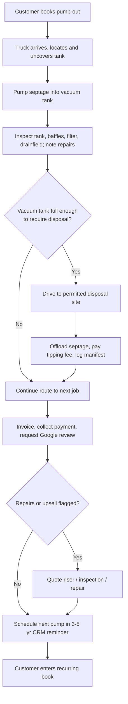

### Direct Answer

Starting a septic tank pumping business in 2027 takes **$95,000–$255,000** to launch a single-truck operation and can generate roughly **$55,000–$135,000** in net owner earnings in year one if you book 5–8 jobs a day at a $350–$525 average ticket. The business wins on three structural advantages: a non-discretionary service homeowners legally cannot skip, an aging septic-installed base of roughly 21 million U.S. households, and a fragmented competitor field where a disciplined operator with route density and online reviews can take share fast. The hard parts are the regulated waste-disposal chain, the six-figure capital cost of a vacuum truck, and the seasonality that makes winter cash flow a real risk.

**TLDR**
- **Capital:** $95K–$255K to start; the vacuum truck (used $45K–$95K, new $130K–$190K) is 60–75% of it.
- **Unit economics:** $350–$525 average residential ticket, 55–68% gross margin after disposal fees and fuel; commercial grease-trap and lift-station work runs higher.
- **The moat is route density and reviews, not price.** Pumpers within a tight radius cut windshield time and turn 4 jobs/day into 7.
- **Licensing is state- and county-specific:** septage-hauler permits, per-truck vacuum registration, and often an inspector or installer certification stacked on top.
- **Biggest risks:** disposal-site access loss, truck downtime, winter revenue troughs, and underpricing the dirtiest jobs.
- **Year 1 realistic target:** 1,000–1,600 jobs, $380K–$620K revenue, $55K–$110K owner earnings — then a second truck in year 2–3.
- **2027 context:** AI-assisted routing, home-services roll-up demand, and rising disposal costs all shape strategy.
- Pairs naturally with adjacent trades — see grease-trap, drain, and inspection cross-sell in Section 7.

---

## 1. The 2027 Opportunity: Why Septic Pumping Is a Quietly Excellent First Business

### 1.1 A non-discretionary service with a captive installed base

Roughly **one in five U.S. households** — about 21 million homes per EPA estimates — relies on an on-site septic system rather than municipal sewer. Every one of those tanks needs to be pumped on a **3-to-5-year cycle**, and a neglected tank does not quietly fail: it backs up into the house, surfaces sewage in the yard, or destroys a $15,000–$40,000 drainfield. That consequence structure is what makes this business durable. Homeowners defer landscaping, defer a kitchen remodel, defer a vacation — they do not defer a tank that is gurgling. The demand is **legally and physically non-discretionary**, which is the single most attractive trait a first-time business owner can buy into.

Contrast this with a discretionary trade. A home stager, a pool installer, or a landscape designer sells something a homeowner can simply choose not to buy when money is tight. A septic pumper sells the avoidance of raw sewage in a finished basement. When a recession hits, discretionary home spend contracts sharply; septic pumping demand barely moves, because the alternative to pumping is a health hazard and a four- or five-figure repair. The business is, in the truest sense, **recession-resistant** — not recession-proof, because consumers will stretch the pump interval from three years to five, but the underlying demand floor is high and stable.

### 1.2 An installed base that is aging and growing at the edges

The septic installed base is not static. Two forces are expanding it. First, **exurban and rural new construction** continues to add on-site systems wherever municipal sewer extension is uneconomic — and sewer extension is expensive enough that developers routinely choose septic for outlying subdivisions. Second, the **average system age in established septic counties is climbing**. Older systems need pumping more often, generate more inspection and repair work, and eventually need replacement components — risers, baffles, filters, distribution boxes — every one of which is a billable visit.

There is also a regulatory tailwind. Counties across the country are progressively tightening **mandatory inspection and pumping ordinances**, particularly at the point of property sale and in environmentally sensitive watersheds. Where a county adopts a point-of-sale septic inspection requirement, every home transaction in that county becomes a guaranteed inspection job. You are entering a market that does not need you to create demand — it needs you to be reachable, reliable, and reviewed when the demand surfaces on its own schedule.

It is worth being precise about the size of the underlying mechanic. If 21 million households each need a pump-out roughly every four years, that is on the order of **five million pump-out jobs per year** generated nationally with no marketing effort at all — pure biology and physics. A single-truck operator who captures even 1,300 of those jobs is taking a vanishingly small slice of a continuously refilling pool. The implication for a first-time owner is liberating: you do not need to win the market or out-think a sophisticated competitor. You need to be the findable, trustworthy operator in one tight geographic cluster, and the volume is simply there.

### 1.3 Fragmentation is the opening

The competitive field is overwhelmingly **owner-operators and two-to-five-truck family businesses**, many run by operators in their 50s and 60s with no succession plan, weak digital presence, and pricing they have not revisited in years. There is no dominant national brand in residential septic pumping the way there is in pest control, where **Rollins, Inc. (ROL)** owns Orkin and a portfolio of regional brands, or in HVAC, where the consolidation wave is well advanced. The wastewater trades remain genuinely fragmented.

That fragmentation is your opening. A new operator who **answers the phone live**, shows up in the booked window, sends a clean digital invoice, and asks for a Google review will out-compete a 30-year incumbent who does none of those things. The incumbent's advantages — relationships, a known truck, decades of local memory — are real but eroding, because the homeowner placing the order today found their pumper through a search result and a star rating, not through a recommendation from a neighbor twenty years ago. This is the same structural setup that makes adjacent trades attractive — see the fragmentation analysis in **pest control (q2139)** and **garage door repair (q2138)**, both of which share the "boring service, aging owners, no national brand" pattern.

### 1.4 The 2027 macro context

Three macro factors specifically shape the 2027 entry. **First, equipment cost inflation.** New commercial truck chassis prices have stepped up materially over the past several years, which widens the gap between the used-truck entry path ($45K–$95K) and the new-truck path ($130K–$190K+) and makes the used market the rational starting point for nearly every first-time operator. **Second, the home-services roll-up wave.** Private-equity-backed consolidators and publicly traded home-services platforms have moved aggressively into HVAC, plumbing, and pest control; the wastewater trades are next in line, which means a well-run, route-dense pumping business built today is being built into a real acquisition market. **Third, technology cost collapse.** AI-assisted dispatch, automated review collection, and customer-facing booking that used to require a paid dispatcher are now near-free — letting a single operator run a professional back office that out-executes aging competitors.

### 1.5 What it is not — set expectations honestly

Septic pumping is **not** a high-margin tech-flavored business and it is **not** passive. It is a literal-waste-hauling operation: you will be on call, the work is physically demanding and unpleasant, and your single most expensive asset is a truck that can break down. The upside is real and the cash flow is fast, but go in clear-eyed. If the physical reality is a dealbreaker, the cleaner-hands adjacent trades — **appliance repair (q2135)** or **locksmithing (q2136)** — deliver similar unit economics without the smell. Section 8 lays out the full adversarial case so you can self-select honestly before committing capital.

---

## 2. Capital Requirements: What It Actually Costs to Launch

### 2.1 The vacuum truck is the business

Everything else is rounding error next to the truck. A septic pump truck is a chassis (Class 5–7), a steel or aluminum vacuum tank of **1,500–4,000 gallons**, a vacuum pump (Masport, Jurop, and Battioni are the dominant pump brands), hose reels, and the plumbing to move septage safely. Your choices:

- **Used, 1,500–2,500 gal, 8–15 years old:** $45,000–$95,000. The right entry point for almost everyone.
- **Used, newer, 2,500–3,000 gal, 4–8 years old:** $95,000–$135,000. A middle path for better-capitalized buyers.
- **New, 2,500–3,600 gal:** $130,000–$190,000+ with current chassis pricing. Only justified once route volume is proven.
- **Tank size is a route-design decision:** a bigger tank means fewer disposal trips per day but a heavier, less nimble truck on rural driveways and a higher purchase price and fuel burn.

Buy the truck on a **pre-purchase inspection from a heavy-truck mechanic who has seen vacuum equipment before** — pump rebuilds run $4,000–$12,000, and tank corrosion can be a deal-killer you cannot see from the cab. Inspect the vacuum pump's vanes and oil system, the tank's interior for pitting and weld integrity, the valves and primary shutoff, the chassis frame and brakes, and the hydraulic system that lifts the tank for offloading. A truck that looks clean on the outside can have a $10,000 problem six inches inside the tank wall.

### 2.2 Truck condition tiers — what each price band actually buys

| Condition tier | Price band | What you get | Risk profile |
|---|---|---|---|
| Project / high-hour | $30K–$45K | Older chassis, pump near rebuild, possible tank corrosion | High — only for buyers who can do their own wrenching |
| Sound used (recommended entry) | $45K–$95K | 8–15 yr chassis, serviceable pump, no major corrosion | Moderate — the rational first-truck path |
| Late-model used | $95K–$135K | 4–8 yr chassis, recent pump service, clean tank | Lower — for better-capitalized buyers |
| New build | $130K–$190K+ | Spec'd to your route, full warranty | Lowest mechanical risk, highest capital risk |

### 2.3 Full startup cost stack — single-truck operation

| Line item | Low (used-truck path) | High (newer-truck path) |
|---|---|---|
| Vacuum truck | $48,000 | $155,000 |
| Truck inspection, repairs, decals, lettering | $3,000 | $8,000 |
| Hoses, fittings, spare pump parts, tools | $2,500 | $6,000 |
| Licensing, permits, septage-hauler registration | $1,200 | $5,500 |
| Commercial auto + general liability insurance (deposit) | $4,000 | $9,000 |
| LLC formation, legal, accounting setup | $800 | $2,500 |
| Locator equipment, cameras, probe rods | $1,500 | $7,000 |
| Branding, website, Google Business Profile, signage | $2,000 | $6,500 |
| Software (scheduling, dispatch, invoicing) setup | $400 | $1,500 |
| Initial marketing (LSAs, direct mail, vehicle wrap) | $3,000 | $9,000 |
| Working capital / cash reserve | $25,000 | $40,000 |
| **Total startup** | **$94,900** | **$255,500** |

Most disciplined first-time operators land near **$110,000–$150,000** by buying a sound used truck and keeping a real cash reserve. Underfunding the reserve is the most common fatal mistake — see Section 8.1.

### 2.4 The cash reserve is not optional

The single line above that first-time operators are most tempted to cut is the **working capital / cash reserve**. Do not cut it. The reserve exists to absorb three predictable shocks: a major truck repair ($4K–$12K and the truck is down for days while you have no revenue), a slow winter month with a loan payment still due, and the ordinary lag between doing a job and collecting payment. An operator who buys at the top of their truck budget and walks in with $3,000 in the bank is not running a business — they are running a countdown timer. A genuine reserve of **$25,000–$40,000** is what converts a manageable setback into a footnote instead of a closure.

### 2.5 Financing the truck

| Path | Typical terms | Best for |
|---|---|---|
| Equipment loan (bank or credit union) | 5–7 yr, 8–11% APR, 10–20% down | Operators with a credit score above 680 and some collateral |
| SBA 7(a) | 10 yr, prime + 2.75–4.5%, 10% down | Buyers acquiring an existing book of business |
| Equipment-finance specialist | 3–6 yr, 9–15% APR, lower doc burden | First-timers with thin credit history |
| Seller financing on a used truck | Negotiated, often 0–8% | Buying a retiring operator's truck and route together |
| Cash | — | Anyone who can — eliminates the largest fixed cost |

A retiring operator who will **seller-finance the truck and hand over the customer list** is the single best deal in this industry. It collapses both your capital problem and your demand problem at once — you inherit a proven route, a known phone number, an existing review base, and a payment plan tied to a seller who is motivated to see you succeed because their financing depends on it. The same acquisition logic that works in **junk removal (q9586)** and **gutter installation (q9616)** applies here, and in a trade with so many aging owners, these deals genuinely exist if you ask around.

### 2.6 Buy versus build versus acquire

| Path | Upfront capital | Speed to revenue | Risk |
|---|---|---|---|
| Build from scratch (new truck, new brand) | Highest | Slowest — months to fill a schedule | Demand risk: no customers on day one |
| Build from scratch (used truck, new brand) | Moderate | Slow-moderate | Demand risk, lower capital exposure |
| Acquire an existing route + truck | Moderate-high | Immediate — book is full on day one | Execution risk, due-diligence risk |

For a first-time owner, **acquiring a small existing pumping route is frequently the smartest path** when one is available. You pay for the customer list, but you eliminate the hardest and slowest part of the build — generating demand from zero — and you get a cash-flowing asset from week one. Do the due diligence: verify the customer list is real and recurring, confirm disposal access transfers, check the truck thoroughly, and understand why the seller is leaving.

---

## 3. Licensing, Permits, and the Regulated Waste Chain

### 3.1 This is a regulated environmental business — treat it like one

Septage is regulated waste. You are not just running a service truck; you are operating inside a permitted **collect-transport-dispose** chain, and every link is licensed. The exact requirements are **state- and often county-specific**, but the structure is consistent nationwide. Get this wrong and you do not just lose a job — you risk fines, permit revocation, and in serious cases the loss of your ability to operate at all. The good news is that the regulatory structure, once you understand it, is entirely navigable and is itself a barrier that keeps casual competitors out.

### 3.2 The standard permit stack

1. **Business entity and registration.** Form an LLC, get an EIN, register for state and local tax. Universal first step — identical to every trade in this library.
2. **Septage hauler / pumper permit.** Issued by the state environmental or health department. This is the core license that legally allows you to pump and transport septage. Expect an application fee, proof of disposal arrangements, and sometimes a written exam covering waste handling, spill response, and recordkeeping.
3. **Per-truck vacuum-truck permit.** Many states require each truck to be individually permitted and decaled as a registered septage-hauling vehicle, with annual renewal and a vehicle inspection.
4. **CDL determination.** Whether you need a Commercial Driver's License depends on the truck's Gross Vehicle Weight Rating. Many loaded 2,500-gallon vacuum trucks cross the 26,001-lb threshold — **confirm this before you buy the truck**, because it changes who can legally drive it and therefore who you can hire.
5. **Disposal-site access.** You must have a contracted, legal place to offload — a municipal wastewater treatment plant that accepts hauled septage, or a permitted land-application site. No disposal access means no business.
6. **DOT / USDOT number and compliance.** Commercial trucks over weight thresholds need a USDOT number, hours-of-service awareness, a vehicle maintenance file, and in many cases participation in a drug-and-alcohol testing program.
7. **Manifesting and recordkeeping.** Most jurisdictions require you to log every pump-out and every disposal trip — gallons collected, source, disposal site, date. This paper trail is part of the permit, not optional.
8. **Optional but valuable: inspector / installer certification.** Many states let licensed pumpers also perform septic inspections (a high-margin add-on tied to home sales) and minor repairs. Stacking these certifications materially widens your revenue — see Section 7.

### 3.3 Permit and licensing cost ranges

| Item | Typical annual / one-time cost | Notes |
|---|---|---|
| Septage hauler permit | $150–$1,200 | State-dependent; annual renewal |
| Per-truck vacuum permit | $75–$500 per truck | Annual |
| USDOT number | $0–$300 | Plus ongoing compliance time |
| Drug-and-alcohol testing program | $200–$600/yr | Required where CDL drivers are used |
| Disposal-site contract / tipping fees | $0.05–$0.18 per gallon | Largest recurring regulatory cost |
| Septic inspector certification | $200–$900 + course | Pays back fast on real-estate transactions |
| LLC + state registration | $50–$800 | One-time + annual report fee |

### 3.4 The disposal relationship is your real license

The permit on paper means nothing if you have nowhere legal to dump. **Before you spend a dollar on a truck, secure written confirmation that a treatment plant or permitted land-application site within reasonable driving distance will accept your septage.** Disposal access is the choke point that has killed more septic businesses than any competitor ever has.

Treatment plants periodically stop accepting hauled waste — because of capacity constraints, process upsets, or policy changes — and they raise tipping fees sharply or restrict the hours during which they accept septage. An operator dependent on a single site is exposed to a decision entirely outside their control. So identify a **primary and a backup disposal site from day one**, build the relationship with the plant operators (they are people, and a pumper who shows up clean, on time, and never causes a problem gets the benefit of the doubt when capacity tightens), and track tipping-fee trends so a rate increase is a budget update rather than a surprise. This is the discipline that separates a regulated trade from a casual one, the same way **chimney sweep (q1979)** depends on code-compliance knowledge rather than just labor.

### 3.5 Insurance — what waste hauling actually requires

A waste-hauling business with a heavy truck on rural roads is an underwriting category of its own. At minimum you need **commercial auto** liability (high limits — you are driving a heavy vehicle and an at-fault accident is a catastrophic exposure) and **general liability** (a hose failure or a spill on a customer's property is a real claim). Many operators also carry **pollution / environmental liability**, which standard general liability often excludes and which directly addresses the spill scenario inherent to this trade. As you add employees you add **workers' compensation**, which is non-negotiable and which carries a meaningful premium for physically demanding outdoor work. Get quotes from agents who specifically write waste-hauling and septic accounts — a generalist agent will either misprice you or place you with a carrier that drops you after the first claim.

### 3.6 The collect-transport-dispose workflow

---

## 4. Unit Economics: Where the Money Actually Comes From

### 4.1 The residential pump-out — your bread and butter

A standard residential septic pump-out is your volume product. The job: locate the tank, uncover the access lids, pump 1,000–1,500 gallons of septage, inspect the tank and components, and invoice. It is the repeatable, predictable core of the business and the foundation on which every higher-margin add-on is sold.

| Metric | Typical range |
|---|---|
| Average residential ticket | $300–$600 (commonly $350–$525) |
| Time on site | 45–90 minutes |
| Disposal cost per job | $40–$110 |
| Fuel + truck cost per job | $25–$55 |
| Jobs per truck per day | 4–8 (route-density dependent) |
| Gross margin per job | 55–68% |

The pricing levers that legitimately raise the ticket: **tank size** (a 1,500-gallon tank holds more septage and costs more to empty than a 1,000-gallon tank), **access difficulty** (lids buried under 18 inches of soil, long hose pulls from a truck that cannot reach the tank, no riser installed), **distance from your route** (a job 40 minutes from your cluster should price for the windshield time), and **condition** (a tank that has not been pumped in a decade has compacted solids and is a harder, dirtier, longer job). Price the dirty jobs honestly — underpricing the worst tanks is a silent margin killer that Section 8.5 returns to.

### 4.2 Why route density is the entire game

Here is the economic heart of the business. A pump-out itself takes 45–90 minutes. The variable that determines whether you do 4 jobs a day or 7 is **how far you drive between them and how often you have to break to a disposal site**. Two operators with identical trucks and identical pricing can have wildly different incomes purely because one has a tight, dense route and the other is scattered across the county.

Consider the arithmetic. At a $430 blended ticket, the difference between 4 and 7 jobs a day is roughly **$1,290 of additional daily revenue** — and the incremental cost of those three extra jobs is mostly disposal and fuel, because the truck, the insurance, the loan payment, and your time were already committed. Route density does not just add revenue; it adds **high-margin** revenue. Every marketing decision in Section 6 flows from this single fact: you are not buying leads, you are buying **clustered** leads.

### 4.3 Revenue mix — do not live on pump-outs alone

| Service line | Typical ticket | Margin profile | Demand pattern |
|---|---|---|---|
| Residential pump-out | $350–$525 | Solid, predictable | Steady, 3–5 yr cycle |
| Septic inspection (real-estate transaction) | $250–$650 | High — low cost, requires cert | Tied to home sales |
| Riser / access-port installation | $300–$700 | High — quick add-on | Upsell at pump-out |
| Baffle / filter repair or replacement | $200–$900 | High | Found during inspection |
| Grease-trap pumping (restaurants) | $175–$450 recurring | Excellent — contracted | Monthly/quarterly |
| Lift-station and commercial vault service | $400–$1,500+ | Excellent | Contracted |
| Emergency / after-hours backup | $450–$900 | Premium | Spiky, weather-driven |
| Drainfield diagnostics / jetting | $300–$1,200 | High | Repair-driven |

The operators who clear six figures fast are not the ones with the lowest pump-out price — they are the ones who **attach inspections, risers, and repairs** to the pump-out visit and who land **recurring commercial grease-trap contracts** that smooth the seasonal trough. Commercial recurring revenue is the closest this business comes to a subscription, and it is worth building deliberately. A portfolio of 30 restaurant grease-trap accounts on a contracted quarterly schedule is a predictable revenue floor that residential one-off pumping can never match.

### 4.4 The fully loaded P&L — line by line

It is worth understanding where every dollar goes. On a $430 residential pump-out:

| Cost component | Per-job amount | Share of ticket |
|---|---|---|
| Disposal / tipping fee | $40–$110 | ~17% |
| Fuel | $15–$35 | ~6% |
| Truck maintenance reserve (allocated) | $10–$20 | ~3% |
| Insurance (allocated) | $8–$12 | ~2% |
| Marketing (allocated) | $15–$30 | ~5% |
| Software, phone, admin (allocated) | $5–$10 | ~2% |
| Loan service (allocated, if financed) | $12–$18 | ~3% |
| **Gross margin to owner labor + profit** | **~$200–$260** | **~55–62%** |

The number that matters: after every real cost, a single pump-out leaves roughly **$200–$260** to cover the owner's labor and profit. Multiply by realistic daily volume and annual working days, and the year-one model in Section 4.5 falls out directly.

Two cautions on this math. First, the **allocated** costs above — maintenance reserve, insurance, loan service — are real even though you do not write a check for them on each job; an operator who mentally treats them as zero will be unpleasantly surprised when the annual insurance renewal and the quarterly maintenance bill arrive. Allocate them per-job so every ticket is priced honestly. Second, the per-job margin is an *average*; a clean, riser-equipped, route-adjacent tank is far above $260 of contribution, while a buried-lid, decade-neglected, 40-minute-out tank can fall below $150 once the extra hour and equipment wear are counted. This is exactly why Section 8.5 treats underpricing the hard jobs as a distinct failure mode — the average hides the jobs that quietly lose money.

### 4.5 Year-one financial model — single truck

| Line | Conservative | Realistic | Strong |
|---|---|---|---|
| Jobs completed (all lines) | 850 | 1,300 | 1,750 |
| Blended average ticket | $385 | $430 | $475 |
| Gross revenue | $327,250 | $559,000 | $831,250 |
| Disposal + fuel | $61,000 | $98,000 | $137,000 |
| Truck maintenance + repair | $14,000 | $19,000 | $26,000 |
| Insurance | $9,000 | $11,000 | $13,500 |
| Marketing | $14,000 | $24,000 | $34,000 |
| Software, phone, admin | $5,500 | $7,500 | $10,000 |
| Loan service (if financed) | $18,000 | $18,000 | $18,000 |
| Additional labor (technician) | $0 | $0 | $58,000 |
| **Owner earnings (pre-tax)** | **~$45,750** | **~$93,500** | **~$77,750 + asset growth** |

The realistic column assumes you are driving the truck yourself for much of the year and clearing roughly $93,500 pre-tax. The strong column assumes you have added a technician — owner earnings on paper look lower, but you are now running two pairs of hands, you are partially off the truck doing sales and inspections, and you are building toward a second truck and a sellable asset. That trade — visible cash now versus a bigger machine later — is the central scaling decision and Section 7 walks through it.

### 4.6 Seasonality and the cash-flow calendar

Pump-out demand is not flat across the year, and a realistic model accounts for it. In much of the country, **frozen ground in deep winter** makes tank access harder and suppresses voluntary pumping; the **holiday period** slows booking; and **spring through fall** is peak season, often with a surge after heavy rain overwhelms marginal systems. A first-time operator who treats the strong summer income as the monthly run-rate, and spends accordingly, will hit February with a truck payment due and a thin schedule. The discipline: **bank the peak-season surplus to cover the winter trough**, and use the slow months for truck maintenance, marketing prep, and selling next year's commercial contracts.

There is also a structural answer to seasonality, not just a budgeting one: **commercial recurring contracts are far less seasonal than residential pumping.** A restaurant's grease trap fills on a schedule driven by cooking volume, not by frozen ground; a property manager's lift station needs service year-round. An operator who deliberately builds a base of contracted commercial accounts is buying a winter revenue floor. The residential book provides the volume and the summer peak; the commercial book provides the stability. A mature single-truck operation aiming for resilience targets a revenue mix of roughly two-thirds residential and one-third contracted commercial — enough commercial work that February is uncomfortable rather than dangerous.

---

## 5. Equipment, Technology, and the Operational Stack

### 5.1 Beyond the truck — the kit that earns its keep

- **Tank locator and probe rods.** Finding the tank fast is pure margin — minutes you do not bill are minutes lost. On an older property with no riser and a tank the homeowner cannot point to, a locator wand and soil probes turn a 30-minute hunt into a 5-minute one.
- **Inspection camera.** A push camera turns a $400 pump-out into a $700 pump-plus-inspection and feeds your repair pipeline. It is also a sales tool: a homeowner who watches a video of a cracked baffle approves the repair on the spot.
- **Risers and lids in stock.** Carrying access risers on the truck lets you convert a "your lids are buried two feet down" complaint into a $400 add-on installed the same visit.
- **Spare pump parts and hoses.** A failed vacuum pump on a Tuesday with five booked jobs is a revenue emergency. Carry spare vanes, oil, gaskets, and at least one backup length of hose.
- **PPE and decontamination.** Non-negotiable. Septage carries pathogens; gloves, eye protection, boots, and a wash-down setup are part of the cost of doing this professionally and protecting both you and the customer's property.

### 5.2 The software stack — small but decisive

| Tool category | What it does | Why it matters |
|---|---|---|
| Field-service / dispatch software | Scheduling, routing, mobile invoicing | Turns 5 jobs/day into 7 by cutting windshield time |
| CRM with pump-cycle reminders | Auto-flags customers due in 3–5 yr | Converts one-time jobs into a recurring book |
| Google Business Profile | Local map presence + reviews | Your single highest-ROI marketing asset |
| Local Services Ads (Google) | Pay-per-lead, "Google Guaranteed" badge | Fast lead flow for a new operator with no reputation |
| Accounting (QuickBooks or similar) | Books, tax, P&L by service line | Tells you which jobs actually make money |
| Payment processing | Card / ACH on-site at job completion | Eliminates the collection lag and bad debt |
| Manifest / compliance log | Tracks gallons, sources, disposal trips | Keeps the regulatory paper trail clean |

### 5.3 The pump-cycle reminder is the quiet superpower

Every customer you pump today is a **scheduled, predictable job 3–5 years out** — *if* your CRM remembers them and you reach out first. A pumper with 1,500 customers in a disciplined reminder system has a self-refilling order book: the software flags who is due, you send a friendly "your tank is due for service" message, and a meaningful share rebook without you spending a cent on advertising. Over five years, a CRM-driven recurring book becomes the most valuable thing the business owns. It is the same compounding-customer-base advantage that makes **pest control (q2139)** and **gutter installation (q9616)** attractive recurring-service businesses, and it is what a future buyer is really paying for.

### 5.4 The 2027 technology context

AI-assisted dispatching and routing tools are now genuinely useful for a small fleet — they sequence jobs by geography and disposal-site proximity, cutting fuel and overtime without a human dispatcher. Customer-facing automation closes the professionalism gap with bigger competitors at near-zero cost: online booking links, automated SMS appointment-window confirmations, and automated review requests after every completed job. AI-assisted phone answering can now capture an after-hours lead that would otherwise go to voicemail and then to a competitor. None of this replaces the truck or the operator, but it lets one person run the back office of what used to take a dedicated dispatcher — and your aging, low-digital competitors are not adopting any of it. Adopt it early; it is cheap and it compounds.

A grounded way to think about the 2027 technology edge: it does not change *what* the business is — a truck still pumps a tank — but it changes *how many tanks one person can profitably reach.* Routing software shaves drive time, automated booking captures the lead at 9 p.m. on a Sunday, automated review requests build the map-pack reputation while you sleep, and a CRM reminder refills the order book without a salesperson. None of these are exotic or expensive in 2027; they are table stakes for any modern small service business. The competitive reality is simply that your aging incumbents are not using them, so for the next several years the modern operator gets a real, durable execution advantage essentially for free.

### 5.5 Equipment maintenance discipline

The truck is your only revenue engine, so its maintenance is not a cost center — it is uptime insurance. Run a **preventive maintenance schedule**: vacuum-pump oil changes on the manufacturer's interval, regular inspection of valves and the primary shutoff, chassis service, brake checks, and tank-interior inspection for corrosion. A pump that fails in service is days of lost revenue plus an emergency repair bill; the same pump serviced on schedule is a routine, planned cost. Budget a genuine maintenance reserve from the first dollar of revenue, and never run the truck on "it's probably fine."

---

## 6. Marketing and Customer Acquisition

### 6.1 The local-search foundation

Septic pumping is a **high-intent, local, urgent-when-needed** search category. When a homeowner needs a pumper, they search, they look at the map pack, they read reviews, and they call within the hour. They are not comparison-shopping for weeks; they want a trusted pumper *today*. Your entire marketing job is to **be the obvious, trusted choice at that moment of search.**

- **Google Business Profile**, fully completed, with service area, real job photos, accurate hours, and a steady drip of reviews, is the highest-ROI asset you own. It is free, and it is the first thing a searching homeowner sees.
- **Reviews are the currency.** Ask every satisfied customer, every time, with a one-tap link sent by SMS at job completion. A pumper with 80 reviews at 4.8 stars beats a 30-year incumbent with 11 reviews — every time, in every map pack.
- **Local Services Ads** give a brand-new operator the "Google Guaranteed" badge and pay-per-lead flow before organic reputation exists. They are the fastest way to fill a schedule in month one.

### 6.2 The acquisition channel mix

| Channel | Cost profile | Speed | Best for |
|---|---|---|---|
| Google Business Profile + reviews | Free / time | Builds over months | Long-term compounding |
| Local Services Ads | Pay-per-lead | Immediate | New operator, fast leads |
| Search ads (PPC) | Moderate cost-per-click | Immediate | Filling schedule gaps |
| Real-estate agent referrals | Relationship time | Medium | Inspection-job pipeline |
| Plumber / excavator referral network | Reciprocal | Medium | Repair and emergency jobs |
| Direct mail to known septic neighborhoods | $0.40–$0.80/piece | Slow but durable | Geographic route density |
| Vehicle wrap | One-time | Passive, continuous | Every job is a moving billboard |
| Local SEO content (website) | Time / modest cost | Slow, compounding | Owning informational searches |

### 6.3 Referral partnerships are underrated

**Real-estate agents** need septic inspections on every rural-property closing — become the inspector they trust and you get a steady, high-margin job feed that is largely insulated from price competition because the agent values reliability and a fast turnaround over a $50 discount. **Plumbers** routinely hit septic problems they cannot solve and need a pumper to refer the customer to; **excavators** install septic systems and need someone to maintain and inspect them afterward. Build a reciprocal referral network with adjacent trades and you acquire customers at near-zero marginal cost. This is the same partner-channel logic that powers **pressure washing (q9585)** and **drain/plumbing services (q9620)** — in a fragmented trade, the operator who is everyone's trusted referral wins quietly and durably.

### 6.4 Route density beats raw lead volume

The subtle point that ties this section to Section 4.2: **a lead five minutes from your last job is worth far more than a lead forty minutes away.** Concentrating marketing spend in tight geographic clusters — specific septic-heavy neighborhoods, specific zip codes, specific rural subdivisions — builds route density, and route density is the difference between 4 billable jobs a day and 7. Direct mail to a known septic neighborhood, a vehicle wrap that is seen by every household on a street while you work, and geo-targeted search ads all serve the same goal: not just *more* customers, but customers *clustered together*. Market for density, not just for volume — it is the single most important strategic instruction in this section.

### 6.5 Pricing as a marketing decision

Resist the instinct to win on price. In a fragmented market full of aging, under-priced incumbents, the temptation to advertise the lowest pump-out price is strong — and it is a trap, because it attracts the most price-sensitive, least loyal customers and erodes the margin that funds your truck replacement. Instead, price at a confident, fair market rate and **compete on responsiveness, professionalism, clean uniforms, an on-time window, a digital invoice, and a flood of five-star reviews.** The homeowner choosing a septic pumper is not buying a commodity; they are buying the confidence that a competent professional will solve an unpleasant problem without creating a new one. Sell that, and price stops being the conversation.

---

## 7. Scaling: From One Truck to a Real Asset

### 7.1 The growth ladder

1. **Months 0–6: Prove the single truck.** You drive it. Build the review base, lock in primary and backup disposal access, and get the booking, dispatch, and invoicing systems clean and habitual. Goal: a fully booked schedule and consistently positive cash flow.
2. **Months 6–18: Add the first technician.** Hire a driver/tech so you can be off the truck part-time, doing sales, estimates, and inspections. This is the hardest hire in the whole business because trust, reliability, and customer manner matter more than raw speed — a technician who damages a customer's lawn or argues over a price costs you reviews you cannot get back.
3. **Year 2: Add the second truck.** Only when route density and demand clearly support it. The second truck roughly doubles capacity but also doubles your disposal-trip count, maintenance exposure, and payroll — model it carefully before committing.
4. **Year 2–3: Layer in higher-margin lines.** Stack inspection certification, riser installs, repairs, and commercial grease-trap contracts. This is where margin per route-hour climbs and where the business stops being purely a volume game.
5. **Year 3+: Build the management layer.** A dispatcher/office manager and a lead technician turn the business into something that runs without you in the cab every day — which is precisely what makes it sellable.

### 7.2 The hiring challenge

The first hire is the inflection point and it is genuinely hard. You are looking for someone who will represent your brand on a customer's property, handle an unpleasant job professionally, drive a heavy and expensive truck safely, and not cut corners on disposal or paperwork when no one is watching. In a tight labor market for skilled trade workers, that person is not abundant and not cheap. Pay fairly, treat the role as a career rather than a churn position, train deliberately on both the technical work and the customer interaction, and accept that you may hire wrong once before you hire right. The businesses that scale are the ones that solve the people problem; the ones that stay one-truck-forever usually never did.

### 7.3 Adjacent revenue lines, ranked by ease of attach

| Add-on line | Attach difficulty | Margin | Notes |
|---|---|---|---|
| Riser / access-port installs | Very low | High | Sell at the pump-out visit |
| Septic inspections | Low (needs cert) | High | Real-estate-transaction driven |
| Baffle / filter repair | Low-medium | High | Found during inspection |
| Commercial grease-trap pumping | Medium | Excellent, recurring | Restaurants, contracted |
| Lift-station / vault service | Medium | Excellent | Commercial property managers |
| Drainfield diagnostics & jetting | Medium | High | Repair-pipeline driven |
| Portable-toilet rental | High (separate fleet) | Good, recurring | A real second business |
| New septic-system installation | High (separate license, excavation) | High but capital-heavy | A different business entirely |

### 7.4 The exit — and who is buying

A septic pumping business with **multiple trucks, a clean recurring customer book in a CRM, locked disposal access, documented systems, and a management layer** is a genuinely sellable asset. Home-services consolidation has reached the wastewater trades. The buyers fall into a few groups: **private-equity-backed roll-ups** assembling regional platforms, **strategic acquirers** in adjacent services who want a wastewater leg, and **publicly traded environmental-services companies** — operators in the orbit of names like **Waste Management (WM)**, **Republic Services (RSG)**, and **Clean Harbors (CLH)** have all participated in the broader consolidation of waste and environmental services, and that appetite filters down to regional buyers shopping for route-dense, recurring-revenue tuck-ins.

What a buyer pays for is not your truck — it is your **recurring book and your systems**. A documented business where the customer relationships live in a CRM rather than in the founder's head, where disposal access is contractually secure, and where a manager already runs day-to-day operations commands a real multiple of earnings. A business that *is* the founder — undocumented, dependent on one person's relationships and memory, with customer history in a paper ledger or worse — sells for little more than the liquidation value of the trucks.

The practical translation is that the highest-return work you can do in years two and three is often not selling one more job — it is writing down how the business runs. Document the pump-out procedure, the disposal protocol, the pricing rules, the upsell scripts; get every customer and every pump-cycle date into the CRM; formalize the disposal contracts; and train a manager to run the day. None of that work shows up in this month's revenue, but all of it shows up in the eventual sale price, and much of it also makes the business calmer and more reliable to run in the meantime. The work you do in years 1–3 to systematize, not just to sell jobs, is what determines whether you have built a job or an asset. The buy-side appetite for boring, recurring, essential-service businesses is the same dynamic explored in **the Outreach/Apollo consolidation analysis (q9588)** at a different scale and in a different industry — the principle that durable recurring revenue commands a premium is universal.

### 7.5 Multi-truck economics

The second truck is not simply "double the business." It introduces a step-change in complexity: you now need two disposal relationships' worth of capacity, two trucks' worth of maintenance, a real payroll, and dispatching that keeps both trucks dense rather than crisscrossing the same county. Done well, multi-truck operations capture genuine economies — shared overhead, a recognized local brand, the ability to take large commercial contracts a single truck cannot service, and pricing power as the obvious professional choice in the market. Done poorly, the second truck just doubles the chaos. Add it only when the first truck is consistently full, the systems are proven, and the cash reserve can absorb the new fixed costs.

---

## 8. Counter-Case: Reasons a Septic Pumping Business Fails or Disappoints

It would be dishonest to present this as a sure thing. Here is the adversarial case — the failure modes that are real and the operator profiles for whom this is the wrong business. Read this section before you spend any money.

### 8.1 The capital trap

The vacuum truck is a six-figure asset and it can fail. An operator who buys at the top of their budget, finances aggressively, keeps **no cash reserve**, and then faces a $9,000 pump rebuild in month four is in genuine danger — not because the business is bad, but because they were undercapitalized. The truck is simultaneously your only revenue engine and your largest liability: when it is down, revenue is zero and the loan payment still arrives. **If you cannot fund a real $25K–$40K reserve on top of the truck, do not start yet.** Save longer, or buy a cheaper truck, or acquire a route with seller financing — but do not start a capital-intensive business with no capital cushion. This is the most common fatal mistake in the trade, and it is entirely avoidable.

### 8.2 Disposal-access risk is existential

Your business depends on a third party — a treatment plant or land-application site — continuing to accept your septage at a workable price. That is outside your control. Plants stop accepting hauled waste, raise tipping fees sharply, or cut their accepting hours. An operator with a single disposal site and no backup is one policy change away from a crisis: a truck full of septage and nowhere legal to put it. This dependency has no equivalent in cleaner trades like **appliance repair (q2135)** — it is specific to waste hauling, it is structural, and you must respect it by securing redundant disposal access and maintaining genuine relationships with plant operators before you ever need them.

### 8.3 Seasonality and cash-flow whiplash

Pump-out demand is not flat. Frozen ground, holiday slowdowns, and weather make winter a revenue trough in much of the country. An operator who spends every dollar of a strong summer and walks into a slow February with a truck payment due will feel real pain. The business **requires cash-flow discipline across seasons** — banking the peak surplus to cover the trough, and resisting the very human temptation to treat July's income as the year-round run-rate. The spiky, weather-driven nature of the work is something to budget for, not hope around, and operators without financial discipline get caught by it predictably.

### 8.4 The work is genuinely hard and unpleasant

This is sewage. The hours are long, the calls come at inconvenient times, the physical demands are real, the conditions are unpleasant, and the public-image factor is what it is. Operators who romanticize "owning a business" and underestimate the daily reality burn out — and burnout in a single-operator business is a business-ending event. The honest test before you commit any capital: **spend a full day riding along with a working pumper.** Watch the worst job of the day. If the reality is a dealbreaker, that is valuable information, not failure — choose a different trade. **Garage door repair (q2138)** and **locksmithing (q2136)** offer comparable economics and similar fragmentation without the conditions.

### 8.5 Underpricing and the race to the bottom

In a fragmented market, the temptation is to win on price. It is a trap. Septage disposal costs, fuel, and truck maintenance are real and rising; an operator who prices to undercut a 30-year incumbent erodes the very margin that funds truck replacement and a cash reserve. The worst version of this is **underpricing the dirtiest, hardest jobs** — the decade-neglected tank, the buried-lid no-riser nightmare, the 40-minute-out rural property — because those are precisely the jobs that consume the most time and equipment wear. The winning move is to price confidently and **compete on responsiveness, professionalism, and reviews**. Pumpers who chase the lowest price end up with the dirtiest jobs at the thinnest margin and no money to grow.

### 8.6 Regulatory and liability exposure

This is a regulated environmental business, and the regulatory burden is real: permits to maintain and renew, manifests to keep, inspections to pass, weight and CDL rules to comply with, and the ever-present possibility of a spill. A spill on a customer's property, a paperwork failure on a manifest, an at-fault accident in a heavy truck — each is a real exposure that a cleaner trade simply does not carry. The mitigations exist (proper insurance including pollution coverage, disciplined recordkeeping, preventive maintenance, careful driving), but an operator who is careless about compliance is one bad day away from fines, a lawsuit, or a permit revocation.

### 8.7 Who should not start this business

- Anyone who cannot fund a genuine $25K–$40K cash reserve on top of the truck.
- Anyone who has not personally confirmed primary and backup disposal-site access in their target area.
- Anyone who wants a clean, predictable, 9-to-5 operation — this is on-call trade work.
- Anyone who is uncomfortable with the physical and sensory reality of waste hauling after riding along for a day.
- Anyone unwilling to do the unglamorous systematizing work that turns a route into an asset.

For those operators, a different entry point in this library will fit better. But for the operator who is **capitalized, disciplined, physically prepared, and clear-eyed about the work**, septic pumping in 2027 remains one of the more durable and cash-generative trades you can start — precisely because so many would-be competitors read this section and correctly walk away.

---

## 9. Your First 90 Days: A Concrete Action Plan

### 9.1 Days 1–30 — Foundation and feasibility

1. **Confirm disposal access first.** Call every treatment plant and land-application site in a 45-minute radius. Get written confirmation of acceptance, hours, and per-gallon tipping fees, and identify a primary and a backup. No access, no business — stop here if you cannot solve it.
2. **Map the regulatory stack.** Contact your state environmental/health department and county for the exact septage-hauler permit, per-truck permit, and vehicle requirements, the fees, and any written exams. Get the CDL weight-threshold question answered now.
3. **Form the LLC, get the EIN, set up business banking and accounting** so every later expense is clean and tracked from day one.
4. **Size the market.** Estimate septic-household density in your target zip codes using county records and EPA septic-system data, and identify the densest septic neighborhoods — these are where you will concentrate marketing.
5. **Ride along.** Spend a full day with a working pumper before committing capital. This is the cheapest, most valuable due diligence you can do.

### 9.2 Days 31–60 — Equipment and licensing

1. **Source the truck.** Inspect at least three used vacuum trucks with a heavy-truck mechanic who knows vacuum equipment. Confirm the GVWR and CDL requirement *before* committing, and check the pump, tank interior, valves, and chassis thoroughly.
2. **File for the septage-hauler and per-truck permits.** Build in lead time — these are not same-week approvals, and starting the schedule depends on them.
3. **Bind insurance** — commercial auto, general liability, and pollution/environmental coverage at minimum; add workers' comp when you hire.
4. **Buy the operational kit** — locator, probe rods, hoses, spare pump parts, PPE, inspection camera, and a starting stock of risers and lids.
5. **Set up the software** — field-service/dispatch, CRM with pump-cycle reminders, accounting, and on-site payment processing.

### 9.3 Days 61–90 — Launch and demand

1. **Stand up the digital presence.** Google Business Profile fully completed with photos and service area, a simple credible website, Local Services Ads live, and the booking/invoicing system configured and tested.
2. **Build the referral network.** Introduce yourself in person to local plumbers, excavators, and real-estate agents — these are your earliest, highest-quality, most price-insulated job feeds.
3. **Run the first jobs and ask for a Google review on every single one** with a one-tap SMS link. Your first 25 reviews are the foundation of every map-pack placement that follows.
4. **Load every customer into the CRM with a 3–5 year pump-cycle reminder.** From day one, you are not selling one-off jobs — you are building a recurring book that compounds into the business's most valuable asset.
5. **Track the numbers.** Cost per lead by channel, jobs per day, blended ticket, margin by service line, and cash position week by week. The first 90 days of data tell you which marketing channel to double down on, which service line to push, and whether your pricing is holding.

### 9.4 The metrics that tell you it is working

Beyond the launch checklist, a handful of running indicators tell you whether the business is healthy. **Jobs per truck per day** trending from 4 toward 7 means your route is densifying — the most important early signal. **Review count and average rating** climbing means your map-pack position is strengthening and future leads will get cheaper. **Repeat and referral share** rising means the CRM and the referral network are working and you are less dependent on paid leads. **Blended ticket** holding or rising means you are resisting the race to the bottom. And **weeks of cash reserve** staying above a comfortable floor means you can absorb the truck repair and the slow February without panic. Watch these five, act on them, and ignore vanity metrics — total revenue feels good but tells you nothing about whether the business is built to last.

A disciplined operator who completes this 90-day plan is positioned to clear **1,000–1,600 jobs and $55K–$110K in owner earnings in year one**, with a clear path to a second truck and a sellable asset by year three. The same launch discipline applies across the trade-services category — compare the startup sequencing in **junk removal (q9586)** and **dumpster rental (q9632)** for adjacent models that pair well with a septic route and share the route-density, recurring-revenue, and fragmented-competition pattern.

---

## 10. Key Takeaways

- **Septic pumping in 2027 is a durable, cash-generative first business** built on a non-discretionary service and a large, aging installed base of roughly 21 million U.S. septic households — demand it does not have to create.
- **Budget $95K–$255K to launch**, with the vacuum truck as 60–75% of it; most disciplined operators land near $110K–$150K with a sound used truck and a real $25K–$40K cash reserve. Undercapitalization is the most common fatal mistake.
- **The economics work at $350–$525 per residential pump-out** and 55–68% gross margin — but the operators who clear six figures fast attach inspections, risers, repairs, and recurring commercial grease-trap contracts on top of volume pumping.
- **Disposal access and capital reserves are the two existential risks.** Solve primary and backup disposal before buying a truck; never start undercapitalized.
- **The moat is route density, reviews, and a CRM-driven recurring book** — not price. Compete on responsiveness and professionalism against aging, low-digital incumbents, and market for clustered leads rather than scattered volume.
- **Systematize from day one** so that by year three you have built a sellable asset — a documented, route-dense, recurring-revenue business that the home-services consolidation wave is actively shopping for — rather than a job that ends when you stop driving the truck.
- **Self-select honestly.** The work is hard, regulated, and unpleasant; the operator who is capitalized, disciplined, and clear-eyed wins precisely because so many would-be competitors correctly walk away.

For adjacent trades with similar fragmentation and recurring-service economics, see **pest control (q2139)**, **garage door repair (q2138)**, **locksmithing (q2136)**, **appliance repair (q2135)**, **junk removal (q9586)**, **dumpster rental (q9632)**, **gutter installation (q9616)**, **chimney sweep (q1979)**, and **plumbing services (q9620)**.

---

*Sources and references: U.S. EPA, "Septic Systems Overview" and decentralized-wastewater program data; U.S. EPA, "How Your Septic System Works"; U.S. EPA, "Septic Tank Pumping" and homeowner maintenance guidance; U.S. EPA, "Types of Septic Systems"; U.S. Census Bureau, American Housing Survey, sewage-disposal-by-household data; National Environmental Services Center, on-site wastewater system statistics; National Onsite Wastewater Recycling Association (NOWRA) operator and certification guidance; U.S. Small Business Administration, equipment financing terms and SBA 7(a) loan structure; U.S. Department of Transportation, Federal Motor Carrier Safety Administration, USDOT-number registration and CDL weight-threshold rules; U.S. Bureau of Labor Statistics, Occupational Outlook and wage data for septic-tank servicers and sewer-pipe cleaners; IBISWorld, "Septic Tank & Portable Toilet Rental & Servicing in the US" industry profile; state environmental and health department septage-hauler permit frameworks (representative of the regulatory structure nationwide); county on-site wastewater program ordinance records; Pumper magazine and COLE Publishing, vacuum-truck equipment and operator coverage; Onsite Installer industry reporting; Masport, Jurop, and Battioni vacuum-pump manufacturer specifications and service intervals; QuickBooks small-business financial benchmarks; Google Business Profile and Google Local Services Ads official documentation; Water Environment Federation residuals and biosolids management guidance; regional septage-disposal tipping-fee schedules published by municipal wastewater utilities; home-services industry consolidation and private-equity roll-up market analysis; Rollins, Inc. (ROL) investor materials on pest-control consolidation as a fragmentation comparator; Waste Management (WM), Republic Services (RSG), and Clean Harbors (CLH) public filings on environmental-services consolidation; Service Roundtable and home-services operator benchmarking data; commercial grease-trap servicing contract benchmarks; real-estate-transaction point-of-sale septic-inspection requirement summaries; rural new-construction on-site-wastewater permitting trend reporting; equipment-finance lender rate disclosures; commercial auto, general liability, and pollution liability insurance underwriting guidance for waste-hauling fleets; field-service management software vendor benchmarks; EPA decentralized wastewater management partnership materials; state pumper-certification and septic-inspector licensing course outlines; FMCSA hours-of-service and vehicle-maintenance recordkeeping requirements.*
