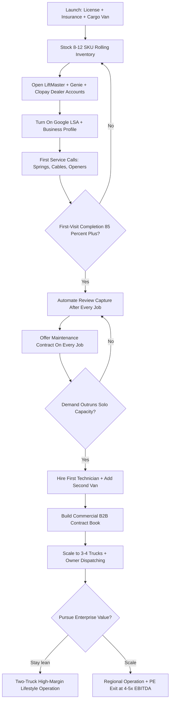

### Direct Answer

You start a **garage door repair business in 2027** by getting licensed and properly insured for a fall-and-crush trade, equipping a cargo van with a tight 8-12 SKU spring/cable/roller/opener inventory, opening dealer accounts with LiftMaster, Genie, and Clopay, and turning on **Google Local Services Ads** to capture "garage door won't open" emergency searches. Budget **$8K-$22K** to launch solo and expect a mature one-truck operator to net **$90K-$220K/yr**; the survival-defining discipline is **torsion spring safety** — springs store 150-300 lbs of energy, and one mishandled release causes the injury claim that ends a small operator.

> **TLDR**
> - **Capital:** $8K-$22K solo (cargo van, $1.5K spring inventory, cable/roller/opener stock, dealer accounts, insurance); $45K-$120K for a 2-3 truck operation with dispatch software and a showroom.
> - **Economics:** Service calls $185-$385, spring replacement $250-$725, opener install $400-$900, full door install $1,500-$4,500. Solo nets $90K-$220K/yr; a 3-truck operation reaches $400K-$900K/yr at 30-45% net margin.
> - **Hardest part:** Torsion spring liability. A single $50K-$500K injury claim ends an undercapitalized operator; carriers screen garage door techs aggressively for fall and crush exposure.
> - **Winning channel:** Google Local Services Ads plus review density. A broken door is a same-day emergency search — speed of response and a 4.9-star profile beat every other lever.
> - **Recurring revenue:** Annual maintenance contracts ($95-$285 residential, $385-$1,800 commercial) smooth otherwise lumpy emergency-only revenue and lift business valuation at exit.

## 🗺️ Table of Contents

1. Foundations — Market, Licensing, and Revenue Structure
2. Build-Out — Truck, Inventory, Dealer Accounts, and Software
3. Operations — Spring Safety, Customer Acquisition, and Pricing
4. Growth and Exit — Reputation Moat, Multi-Truck Scale, and Sale Math
5. Counter-Case — Why This Business Might Be a Mistake
6. The Decision Matrix and Operating Journey
7. Sources and Related Entries

## 📐 PART 1 — FOUNDATIONS

A garage door repair business in 2027 is a residential and light-commercial field service operation that fixes broken torsion and extension springs, snapped lift cables, worn rollers, off-track doors, damaged panels, and failing openers — and installs complete replacement doors — across a 30-60 mile route radius. Demand is non-discretionary and time-compressed: a stuck door traps a car or leaves a home unsecured, so the customer searches "garage door repair near me" and books whoever answers first with a credible price. That urgency is the entire strategic foundation of the business.

### 1.1 Market Size and Demand Drivers

The U.S. installed base exceeds **80 million residential garage doors**, and the Door & Access Systems Manufacturers Association (DASMA) reports the average door cycles 1,500+ times per year. Torsion springs are rated for roughly **10,000 cycles** — about 7 years of normal use — which means a predictable, perpetual replacement wave independent of the housing market or economic cycle. Unlike a kitchen remodel, a broken spring cannot be deferred; the door is simply inoperable.

Three structural tailwinds support the 2027 operator. First, the housing stock is aging: tens of millions of doors installed during the 2000s building boom are now reaching end-of-spring-life simultaneously. Second, opener technology has shifted toward Wi-Fi-connected smart units (LiftMaster myQ, Genie Aladdin Connect), creating an upgrade-and-troubleshoot revenue stream that did not exist a decade ago. Third, the fragmented competitive field — dominated locally by a mix of solo operators and two regional franchises — leaves room for a disciplined newcomer who answers the phone and shows up the same day.

The smart-opener shift is worth dwelling on because it changes the service mix in the operator's favor. A connected opener is a small computer attached to a heavy moving object, and it brings a new category of service calls: Wi-Fi pairing problems, app and firmware troubleshooting, smart-home integration, and the safety-sensor and force-setting adjustments that connected units make customers more aware of. These calls are higher-margin than mechanical repairs because they are diagnosis-and-configuration work with little material cost, and they create a reason for a customer to call a professional rather than ignore a minor annoyance. An operator comfortable with the LiftMaster and Genie connected ecosystems can position as the local specialist for smart-door problems — a niche the older generation of garage door technicians is often slow to occupy. The aging mechanical install base and the modern electronics layer together give the 2027 entrant two distinct, complementary demand streams rather than one.

The market is not a gold rush. It is a steady, defensible trade with low demand volatility, which is precisely what makes it attractive to an operator who values durability over explosive growth (see the contrast with seasonal models in q2140).

It helps to size the demand concretely. In a metropolitan area of one million people, the residential housing stock typically holds 350,000-450,000 garages, the large majority with one or two automatic doors. If each door averages a 7-year spring life, that single metro generates roughly 50,000-65,000 spring-failure events per year before counting opener failures, cable breaks, off-track incidents, panel damage, and discretionary upgrades. A solo operator completing six to nine jobs a day captures only 1,500-2,200 of those events annually — a fraction of one percent of the metro's natural demand. The implication is strategic and reassuring: a disciplined operator is never competing for scarce demand; the operator is competing for *visibility* at the moment of search. The constraint is lead capture and response speed, not the existence of customers. This is why nearly every chapter of this entry returns to the same two levers — answer the phone, show up today — rather than to demand generation.

Demand is also remarkably counter-cyclical. In a recession, homeowners defer the new kitchen and the bathroom remodel, but a car trapped behind a dead door is not a deferrable problem; the spring still has to be replaced. Garage door repair behaves like plumbing and HVAC service — a non-negotiable household function — rather than like home improvement. That recession resistance is one of the reasons private-equity consolidators have moved into the category: predictable, all-weather demand is exactly what a roll-up wants to underwrite. The 2027 entrant inherits that durability from day one.

### 1.2 Licensing and Insurance Reality

Licensing is jurisdiction-specific and frequently misunderstood. Some states regulate garage door work under a general contractor or specialty contractor license; others require no trade license at all but still mandate a business license and bond. **Verify with your state contractor licensing board before quoting a single job** — operating unlicensed where a license is required voids insurance claims and exposes you to stop-work orders.

Insurance is non-negotiable and the real gatekeeper:

| Coverage | Typical Annual Cost (solo) | Why It Matters |
|---|---|---|
| General liability ($1M/$2M) | $600-$1,800 | Property damage, third-party bodily injury |
| Commercial auto | $1,800-$3,600 | Cargo van, tools, on-route accidents |
| Workers' compensation | $4K-$9K per tech | Mandatory once you hire; fall/crush class code is expensive |
| Inland marine (tools/inventory) | $300-$700 | Theft from van, equipment loss |
| Umbrella policy ($1M+) | $500-$1,200 | Catastrophic spring-injury claims |

Carriers classify garage door technicians under elevated workers' comp class codes because of fall-from-ladder and spring-release crush exposure. Expect to provide a written safety protocol and proof of manufacturer training before a carrier will bind a competitive rate. Budget **$7K-$16K/yr** in total insurance for a solo operator and treat it as a fixed cost of legitimacy, not an optional expense (the same insurance-as-gatekeeper dynamic appears in q9620).

A few licensing nuances catch new operators off guard. First, the requirement frequently turns on dollar thresholds: many states allow small repairs unlicensed but require a specialty or general contractor license once a single job exceeds a stated value (commonly $500-$1,000), which means a spring-and-roller repair may be exempt while a full-door install is not. Second, commercial work often carries stricter requirements than residential — overhead roll-up doors at warehouses and storefronts may pull the job under a commercial contractor classification. Third, the surety bond that some jurisdictions require is not insurance; it protects the customer, not the operator, and a claim against the bond must be repaid by the business. Treat the licensing board's guidance as the single source of truth and document the verification in writing, because an insurance carrier will deny a claim retroactively if it discovers the work was performed outside the operator's license scope.

There is also a customer-facing dimension to all of this. The "Google Guaranteed" badge available through Local Services Ads requires a license-and-insurance check, and customers increasingly filter for it. Being fully licensed and insured is therefore not merely a legal posture; it is a marketing asset that appears as a trust signal at the exact moment a homeowner is choosing whom to call. The undercapitalized operator who skips insurance to save $10K in year one forfeits both the legal protection and the badge that drives leads — a false economy that compounds against them.

### 1.3 Service Mix and Revenue Structure

Revenue concentrates in four buckets, each with a distinct margin and frequency profile:

| Service | Price Range | Frequency | Gross Margin |
|---|---|---|---|
| Diagnostic / service call minimum | $85-$185 | Very high | 85-95% |
| Spring replacement (pair) | $375-$725 | High | 60-75% |
| Opener install / replacement | $400-$900 | Moderate | 45-60% |
| Roller / cable / track repair | $150-$350 | High | 65-80% |
| Full residential door install | $1,500-$4,500 | Low-moderate | 30-45% |
| Annual maintenance contract | $95-$285/yr | Recurring | 70-85% |

The strategic insight: **emergency repairs are the volume engine, but maintenance contracts are the valuation engine.** A pure break-fix operation produces lumpy, unpredictable revenue and a low sale multiple. An operator who converts 25-40% of repair customers into a $150/yr maintenance plan builds a recurring base that smooths cash flow, generates planned (non-emergency) work to fill slow days, and meaningfully raises the business's exit value. This recurring-revenue layering is the single highest-leverage structural decision in the first three years (and it mirrors the contract-revenue logic in q9629).

It is worth understanding *why* the service-call minimum carries an 85-95% gross margin. The diagnostic fee is almost pure labor and overhead recovery — there is little material cost in driving to a home and identifying a broken spring. The margin compresses as a job becomes more material-heavy: a full-door install at 30-45% gross is carrying the cost of the door itself, which can be $700-$2,500 in parts. The lesson for the operator's pricing is to never undervalue the diagnostic. Operators who "waive the service call if you hire us" train customers to expect free expertise and erode the highest-margin line in the business. The better play is a modest service-call minimum that is *credited* toward the repair if the customer proceeds — the customer feels fairly treated, the operator is paid for the trip if they decline, and the margin structure stays intact.

The commercial segment deserves separate attention. Light-commercial customers — storefronts, small warehouses, self-storage facilities, fire stations, car washes — run roll-up and sectional doors that cycle far more often than a residential door and fail more frequently as a result. Commercial roll-up service tickets are larger ($350-$2,000+) and, more importantly, commercial customers buy *scheduled maintenance* because a failed door at a business stops revenue. A property manager overseeing twenty storefronts is a single relationship that can produce dozens of recurring service events a year. Most solo operators ignore commercial work early because it requires heavier equipment and sometimes a second technician; the operators who build a commercial book deliberately, even slowly, end up with the most stable and most valuable business. Post-construction and facilities relationships compound this — the same B2B-relationship dynamic explored in q2117.

A realistic first-year solo profit-and-loss illustrates how these numbers come together for an operator who launches with discipline, captures leads steadily, and completes six to eight jobs a day:

| First-Year Line Item | Approximate Figure |
|---|---|
| Jobs completed (ramp-adjusted) | 900-1,300 |
| Average ticket (blended) | $280-$340 |
| Gross revenue | $260,000-$390,000 |
| Parts and materials (COGS) | $55,000-$95,000 |
| Insurance | $7,000-$16,000 |
| Vehicle, fuel, maintenance | $9,000-$16,000 |
| Marketing (LSA, profile, wrap) | $24,000-$48,000 |
| Software and processing fees | $6,000-$13,000 |
| Owner net (pre-tax) | $95,000-$200,000 |

The first year typically lands at the lower end of these ranges because the operator is ramping — building reviews, learning the local door population, and earning organic ranking that has not yet matured. By year two, with the marketing engine compounding and first-visit completion dialed in, a disciplined solo operator commonly reaches the upper half of the net-income range. The single largest controllable cost is marketing, and it falls as a percentage of revenue every year the organic and referral channels strengthen — which is why the channel-diversification discipline of Section 3.2 is also a margin strategy.

## 🧱 PART 2 — BUILD-OUT & CAPITAL

The build-out phase converts capital into a functioning service operation. The garage door trade rewards capital discipline: the temptation is to over-stock the van and over-invest in a showroom before demand justifies it. The right sequence is to spend on the things that *generate revenue* — the van, the inventory that completes first visits, the dealer accounts, and the marketing engine — before spending on the things that merely look like a business, such as a storefront, branded apparel beyond a few shirts, or a logo redesign.

A realistic startup budget for a solo launch makes the priorities concrete:

| Startup Line Item | Low Estimate | High Estimate |
|---|---|---|
| Used cargo van | $18,000 | $32,000 |
| Van shelving, racks, organization | $1,500 | $3,500 |
| Rolling inventory (8-12 SKU set) | $1,800 | $3,800 |
| Hand tools, winding bars, PPE, ladders | $1,200 | $2,500 |
| Insurance (first-year, prepaid portions) | $3,000 | $6,000 |
| Licensing, bond, business formation | $400 | $1,500 |
| Software stack (first 3 months) | $400 | $1,200 |
| Initial marketing (LSA deposit, profile, truck wrap) | $2,500 | $6,000 |
| Working-capital cushion | $3,000 | $8,000 |

The totals land in the $8K-$22K range cited in the Direct Answer when the van is acquired efficiently — bought used, or financed with a modest down payment so the cash stays available for inventory and marketing. The working-capital cushion is the line operators most often skip and most often regret: the business will have weeks-long gaps between landing a job and collecting on it, and an operator with no cushion makes bad short-term decisions to cover payroll and rent. Underfunding the cushion is one of the most common reasons an otherwise-viable garage door business fails in its first year.

### 2.1 Truck Setup and Rolling Inventory

The cargo van is the business. A used full-size cargo van (Ford Transit, RAM ProMaster, Chevy Express) at **$18K-$32K** is sufficient; a brand-new van is a vanity purchase that ties up capital better spent on marketing. Shelving, a ladder rack, and bin organization run **$1,500-$3,500**.

Inventory discipline is the operational core. The goal is an **8-12 SKU rolling inventory** that resolves 85%+ of service calls on the first visit without a return trip to the shop:

| Inventory Category | Stocking Logic | Approx. Investment |
|---|---|---|
| Torsion springs (2-4 common sizes) | Cover 80% of residential door weights | $400-$900 |
| Extension springs (legacy doors) | Older homes still common | $150-$350 |
| Lift cables, rollers, hinges | High-frequency wear parts | $300-$600 |
| Opener units (1-2 LiftMaster/Genie) | Same-day replacement capability | $500-$1,100 |
| Remotes, keypads, safety sensors | Quick-add upsell parts | $200-$450 |
| Winding bars, vise grips, PPE | Spring-work tooling | $250-$500 |

A second truck-back trip is the silent margin killer: it doubles drive time, delays the customer, and erodes the same-day promise that drives reviews. Operators who track **first-visit completion rate** as a core KPI — and stock the van accordingly — consistently out-earn those who chase a thinner SKU list.

The non-obvious nuance is *which* springs to stock. Torsion springs come in a matrix of wire diameter, inside diameter, and length, and the full matrix runs to hundreds of combinations — no van can carry them all. The practical solution is the **convert-to-standard approach**: rather than matching an exotic factory spring exactly, an experienced technician calculates the door weight (a 50-200 lb range for residential doors) and selects from a small set of high-cycle standard springs that produce equivalent lift. Carrying 25,000-cycle springs as the standard offering — instead of the builder-grade 10,000-cycle springs originally installed — lets the operator stock fewer SKUs, complete more jobs on the first visit, and offer the customer a genuine upgrade ("these last two-and-a-half times longer than what failed"). The longer-life spring costs only modestly more at wholesale but justifies a higher price and a better warranty, turning an inventory constraint into a margin and trust advantage.

Van organization is itself a productivity lever. A technician who hunts for a part on a disorganized shelf loses several minutes per job; across 1,500 annual jobs that is dozens of lost billable hours. Labeled bins, a fixed home for every SKU, and an end-of-day restock ritual keep first-visit completion high and protect the same-day promise. The operators who treat the van as a precision tool — not a storage closet on wheels — quietly out-produce competitors using the identical skill set.

### 2.2 Manufacturer Dealer Accounts and Supply Chain

Dealer accounts unlock wholesale pricing, warranty authority, and the credibility customers look for. Prioritize three relationships at launch:

- **LiftMaster / Chamberlain** — the dominant opener brand; a dealer account enables myQ-connected installs and warranty registration.
- **Genie** — the strong number-two opener brand, important for customer choice and competitive pricing.
- **Clopay** — the leading residential door manufacturer; a dealer relationship supplies replacement panels and full-door orders.

Secondary suppliers (Amarr, Wayne Dalton, C.H.I. Overhead Doors) can be added as door-install volume grows. For springs, cables, and hardware, a wholesale distributor account with a national supplier provides next-day parts and depth on uncommon sizes. **Never single-source springs** — supply disruptions in spring steel have caused multi-week backorders, and an operator with one supplier loses jobs while a diversified competitor does not.

Dealer accounts are not automatic. Manufacturers like LiftMaster and Clopay run tiered dealer programs that grade partners on volume, training completion, and customer-satisfaction scores. A new operator typically starts at the entry tier and earns better pricing, co-op marketing dollars, and dealer-locator placement as volume and certification accumulate. This is a feature, not a barrier: the dealer-locator placement on a manufacturer's "find an installer" page is a free, high-intent lead source that competitors without accounts cannot access. Completing the manufacturer's training curriculum early — even before volume justifies it — accelerates the climb and doubles as the technical education a new operator needs anyway.

There is also a warranty dimension. When an operator installs a manufacturer's opener or door under a proper dealer account, the manufacturer's warranty is registered to the customer and the operator is the authorized service party. That registration creates a future service relationship: when the warranted unit needs attention in three years, the call routes back to the installing dealer. Operators who install gray-market or non-dealer product save a few dollars at purchase and forfeit both the warranty-registration relationship and the dealer-locator lead flow — another false economy that favors the disciplined, properly-accounted operator over time.

### 2.3 Software, Dispatch, and Payment Stack

Field-service software is the difference between a hobby and a business. The modern stack:

| Function | Tool Options | Monthly Cost |
|---|---|---|
| Scheduling / dispatch / invoicing | Housecall Pro, Jobber, ServiceTitan | $50-$400 |
| Payment processing | Integrated card-on-site, financing | 2.6-3.5% per txn |
| Review automation | NiceJob, Podium, Birdeye | $80-$300 |
| Google Local Services Ads | Pay-per-lead | Variable |
| Call answering / overflow | Answering service or AI receptionist | $100-$400 |

For a solo operator, **Housecall Pro or Jobber** is the right tier — ServiceTitan's power and price only make sense at 4+ trucks. The non-obvious priority is the **call-answering layer**: a garage door customer who reaches voicemail calls the next result within 30 seconds. A missed call is a lost job, and at an average ticket of $300+, even a $300/mo answering service pays for itself on a single recovered lead per week.

Quantify the missed-call problem honestly. A solo operator is on a ladder with a power drill for most of the working day and physically cannot answer every call. If the operator misses just three calls a day and each represents a $300 average job at a 50% close rate, that is roughly $450/day in forfeited revenue — well over $100,000 a year leaking out of the business through the simple inability to pick up a phone. Against that number, a live answering service or an AI receptionist that books appointments directly into the dispatch calendar is one of the highest-return expenditures the business can make. The math is so lopsided that delaying this hire is one of the most common and most expensive mistakes solo operators make in year one.

Payment and financing complete the stack. On-site card payment is table stakes; the strategic addition is **consumer financing** for full-door installs and large repairs. A homeowner facing a surprise $3,500 door replacement may not have the cash on hand, and a "$95/month" framing converts a hesitation into a sale. Financing partners integrated into Housecall Pro and Jobber let the technician run an approval from the driveway in minutes. Operators who offer financing close materially more full-door work than those who present only a lump-sum number — the same install-financing dynamic that drives conversion in cabinet refacing (q9628).

## ⚙️ PART 3 — OPERATIONS

Operations is where the business is won or lost. The defining tension is between speed (the customer wants same-day) and safety (spring work is genuinely dangerous), and the disciplined operator refuses to trade one for the other. A second, quieter tension runs alongside it: the trade's reputation for dishonesty creates an opening for an honest operator to win — but only if every operational habit, from pricing to documentation to how a technician speaks to a homeowner, reinforces that honesty consistently. Operations is therefore not just about completing jobs; it is about completing them in a way that builds the reputation moat described in Part 4.

A useful frame for the operating model is the **job lifecycle**, which runs the same way every time: a call comes in and is answered live; the job is scheduled with route density in mind; the technician arrives in the promised window, diagnoses the failure, and explains it plainly; a transparent flat-rate price is quoted from the price book; the work is completed safely on the first visit; photos are taken pre- and post-work; payment is collected on-site; the maintenance plan is offered; and a review request goes out the same day. Every step in that lifecycle is a place where the business is either built or eroded. The operators who win treat the lifecycle as a repeatable, trainable system — not as a series of improvised decisions — which is exactly what makes the business teachable to a second technician and, eventually, sellable to a buyer.

### 3.1 Spring Safety and Technical Discipline

This is the most important section in this entry. A torsion spring under tension stores **150-300 lbs of mechanical energy**. When a spring releases uncontrolled — because a winding bar slipped, the wrong bar size was used, or the door was not blocked — the energy discharges instantly. DASMA and the International Door Association (IDA) cite uncontrolled spring releases as a leading cause of serious garage door technician injuries, including fractures, lacerations, eye injuries, and fatalities.

The non-negotiable spring-work protocol:

1. **Block the door** in the fully-open position before any spring work.
2. **Use correct-diameter winding bars** that fully seat in the winding cone — never substitute screwdrivers or rebar.
3. **Use two bars and tension incrementally**, keeping a bar always engaged.
4. **Position your body out of the bar's arc** — never directly above or in line with a loaded bar.
5. **Wear PPE** — safety glasses and gloves on every spring job, without exception.
6. **Apply the two-tech rule** for heavy commercial springs and oversized doors.
7. **Photograph the door pre- and post-work** for documentation and dispute protection.

The economic stakes are severe. A single serious injury claim — to a technician or a homeowner bystander — runs **$50K-$500K** and can void coverage if the carrier finds the operator lacked a documented safety protocol. Manufacturer training (LiftMaster, Genie) and IDA's Installer Professional certification track are inexpensive relative to this exposure and signal competence to both carriers and customers. Spring safety is not a compliance checkbox; it is the foundation the entire business stands on.

Beyond springs, three other technical hazards demand discipline. **Lift cables** carry the door's full weight and, when frayed or improperly seated, can snap and whip; a cable that fails while a technician's hand is near a drum can cause serious laceration or amputation. **Off-track doors** are unstable, heavy panels that can drop unpredictably during a repair — the door must be secured before any track work. **Opener installation** introduces electrical exposure, working at height on a ladder, and the pinch hazard of the door's moving sections; the photo-eye safety sensors must be tested and verified on every job because a homeowner relies on them to protect a child or pet from a closing door. A 2027 operator should treat every one of these as a checklist item, not a matter of judgment in the moment.

The right mental model is that **safety discipline is what makes the speed promise survivable.** The whole business rests on showing up fast and finishing today — but a rushed technician is exactly the technician who skips the winding-bar check or forgets to block the door. The disciplined operator builds the protocol into the job so deeply that it survives time pressure: PPE goes on before the toolbox comes out, the door gets blocked before the first bar goes in, and the photo documentation happens whether the customer is watching or not. Operators who internalize this never have to choose between fast and safe, because the protocol has been made automatic. The ones who treat safety as optional when they are behind schedule are the ones who eventually generate the claim that closes the business.

### 3.2 Customer Acquisition Channels

Garage door demand is **search-intent demand**: the customer has an acute problem and is actively looking right now. The channel mix reflects that.

| Channel | Role | Cost Profile | Notes |
|---|---|---|---|
| Google Local Services Ads (LSA) | Primary | $25-$75 per lead | "Google Guaranteed" badge; pay per lead |
| Google Business Profile + reviews | Foundational | Free (time) | Map-pack ranking drives organic calls |
| Google Search Ads | Supplementary | $8-$25 per click | Captures non-LSA query variants |
| Yelp | Moderate | $300-$1,000/mo | Strong in some metros, weak in others |
| NextDoor | Local trust | Free + ads | Neighborhood recommendations convert well |
| Manufacturer dealer locators | Passive | Free (with account) | LiftMaster/Clopay refer in nearby buyers |
| Commercial B2B (property managers) | Recurring | Relationship cost | Roll-up doors, scheduled maintenance |
| Truck wrap | Ambient | $2,500-$4,500 one-time | Drives recall in service area |

The strategic rule: **no single channel should exceed 35% of new-customer volume.** Operators who become dependent on LSA alone are exposed to Google's lead-pricing increases and algorithm shifts. The durable operators layer LSA with organic map-pack ranking, a commercial B2B book, and a referral program — diversification that the franchise competitors, locked into national ad contracts, cannot easily replicate (the channel-concentration risk is examined further in q2117).

Local Services Ads deserve a deeper look because they are usually the launch channel. LSA charges per lead rather than per click, and a lead is a phone call or message from a homeowner in the service area. The "Google Guaranteed" badge — earned through the license-and-insurance check described in Section 1.2 — places the operator above the conventional search ads and signals trust. The discipline LSA requires is **dispute management**: not every charged lead is a real job (wrong-number calls, out-of-area requests, spam), and Google allows operators to dispute and recover charges for invalid leads. An operator who reviews and disputes diligently keeps effective cost-per-lead 15-30% lower than one who ignores it. LSA also rewards responsiveness and review volume — answering quickly and maintaining a high rating improves ranking within the LSA unit itself, which is one more reason the call-answering layer pays for itself.

Organic search is the channel that compounds. A Google Business Profile, optimized with accurate categories, service-area definitions, photos, and a steady flow of reviews, earns map-pack placement that delivers calls at zero marginal cost. A modest website with transparent pricing pages and locally-focused content reinforces it. Organic ranking takes 6-18 months to mature, which is why new operators start on paid LSA and treat organic as the long game — but by year three the organic channel can carry 30-40% of volume for free, structurally lowering customer acquisition cost below what franchise competitors paying national agency fees can achieve. The referral program — a small thank-you credit for customers who send a neighbor — is the cheapest channel of all and tends to deliver the highest-trust, highest-close leads in the entire mix.

### 3.3 Pricing Strategy and the Transparent Flat-Rate Playbook

The garage door industry carries a deserved reputation for opaque, high-pressure pricing — a reputation a 2027 entrant can weaponize as a competitive advantage. **Transparent flat-rate pricing** is the play.

Publish a clear pricing page: service-call minimum, spring-replacement ranges, opener-install ranges, and common-repair pricing. Quote the all-in price before work begins, with no surprise add-ons. This approach does three things: it pre-qualifies price-sensitive callers (saving wasted truck rolls), it disarms the "scammy garage door guy" suspicion, and it generates the trust language — "honest," "no upsell," "told me the price upfront" — that fills five-star reviews.

| Pricing Approach | Customer Perception | Effect on Reviews | Margin Risk |
|---|---|---|---|
| Hidden / quote-on-arrival | Suspicious, defensive | Mixed, volatile | High dispute rate |
| High-pressure upsell | Resentful even when sold | Negative spikes | Chargebacks |
| Transparent flat-rate | Trusting, relaxed | Consistently positive | Low, predictable |

Flat-rate pricing also protects margin discipline: pricing the job, not the hour, rewards the efficient technician and removes the customer's incentive to scrutinize labor time. Pair it with **financing options** on full-door installs — a $3,500 door at $95/month closes far more often than a $3,500 lump sum.

A flat-rate price book is the practical tool that makes this work. The operator builds a menu — spring replacement, opener install, roller set, cable repair, tune-up — with pre-calculated prices that bundle parts, labor, and a fair margin. The technician quotes from the book, not from a mental estimate, which eliminates inconsistency between jobs and removes the temptation to "read the customer" and price by perceived wealth (a practice that, when it shows up in a review, is reputationally fatal). The book also accelerates the close: a confident, instant, written price reads as professionalism, while a technician who disappears to "work up some numbers" reads as someone inventing a figure.

The pricing structure should also build in **good-better-best tiers** where they genuinely exist. On springs, that is the standard-cycle versus high-cycle choice from Section 2.1. On openers, it is a belt-drive smart unit versus a basic chain-drive. On doors, it is insulation level and window options. Presenting two or three honest options — rather than a single take-it-or-leave-it number — lets the customer self-select, raises average ticket without pressure, and reframes the technician as an advisor rather than a salesperson. The customer who chooses the high-cycle spring did so themselves; that is a fundamentally different interaction than being upsold, and it produces a different review.

### 3.4 Service Delivery and First-Visit Close Rate

The on-site visit is the conversion event. Two metrics govern it: **first-visit completion rate** (resolving the issue without a return trip) and **first-visit close rate** (the customer approving the recommended work then and there).

First-visit completion is an inventory-and-training problem, addressed in Section 2.1. First-visit close rate is a trust-and-communication problem. The technician who explains the failure in plain language, shows the worn part, offers two clear options (repair vs. replace), and quotes a transparent price closes 60-80% of diagnostics into paid work. The technician who is vague, condescending, or pushy closes far less and seeds negative reviews.

This is also the natural moment to introduce the **maintenance contract**: a customer who just experienced a failure is receptive to a $150/yr plan that promises it will not happen again unannounced. Train every technician to make the maintenance-plan offer on every completed job — it is the lowest-cost recurring-revenue acquisition channel the business has.

The maintenance plan should be designed as a genuine value exchange, not a thinly-disguised fee. A well-built residential plan includes an annual or semi-annual tune-up — lubrication, hardware tightening, balance check, spring and cable inspection, sensor alignment, opener force and travel adjustment — plus priority scheduling and a discount on any repairs that arise. For the customer, it converts an unpredictable failure into a managed, scheduled relationship. For the operator, it does three valuable things at once: it fills the calendar with planned work on otherwise-slow days, it catches small problems (a fraying cable, a worn roller) before they become emergency calls, and it keeps the operator's name in front of the customer so the next emergency routes back to them rather than to a search result. The tune-up visit is also a natural, low-pressure context to spot and quote legitimate replacement work.

Route density is the quiet economic engine underneath all of this. A garage door operator's true cost per job is dominated by drive time, and a business whose jobs cluster geographically completes more billable work per day than one whose jobs are scattered across the metro. A maturing operator therefore manages the calendar with density in mind — grouping a neighborhood's jobs, using the maintenance book to fill gaps near already-scheduled emergency calls, and gently steering flexible appointments toward an efficient route. Two operators with identical skills and identical marketing can differ 20-30% in daily output purely on routing discipline.

## 📈 PART 4 — GROWTH & EXIT

Growth in the garage door trade is not about a viral moment; it is about compounding a reputation moat and adding trucks only when demand genuinely outruns capacity. The garage door business has no growth-hacking shortcut — it grows the way a tree grows, through years of consistent service captured in reviews, a maintenance book that compounds, and a referral network that widens. That slowness is a feature: a moat that takes five years to build is a moat a new competitor also needs five years to build, which is why an established operator with a deep review profile is genuinely hard to displace.

The growth question every operator eventually faces is not "how fast can I grow" but "what am I growing *toward*." A two-truck operation netting 40% margins and running on a settled routine is a legitimate, even enviable, endpoint. A regional multi-truck operation built for a 4-5x EBITDA exit is a different and equally legitimate endpoint. The two paths require different hiring, different systems, different owner roles, and different reinvestment of cash. The sections below trace both, but the recurring theme is that growth should be a series of deliberate capacity decisions — each triggered by demand the current configuration genuinely cannot serve — rather than an automatic reflex to get bigger because bigger sounds like success.

### 4.1 Marketing, Reviews, and the Reputation Moat

Reviews are the durable competitive asset. In a trust-deficit industry, a Google Business Profile with **500-2,000+ reviews at a 4.9-star average** is a moat a new competitor cannot quickly replicate — it represents years of consistent service captured in public.

The review engine: every completed job triggers an automated review request (via NiceJob, Podium, or Birdeye) at the optimal moment — same day, while the relief of a fixed door is fresh. A 20-30% review-capture rate, sustained, compounds into hundreds of reviews per year. Respond to every review, positive and negative; a measured response to a critical review often persuades future readers more than the complaint itself.

| Review Stage | Profile State | Competitive Effect |
|---|---|---|
| 0-50 reviews | New, unproven | Loses to established players |
| 50-200 reviews | Credible local option | Competes on price and speed |
| 200-500 reviews | Map-pack contender | Wins organic calls |
| 500-2,000+ reviews | Category-defining moat | Premium pricing, inbound dominance |

Reputation compounds slowly and cannot be bought — which is exactly why it is defensible. The operator who treats review-capture as a daily operational discipline, not an afterthought, owns the map pack in 3-5 years.

The mechanics of review capture matter. The request should go out the same day, while the relief of a working door is fresh, and it should be frictionless — a text message with a direct link, not an instruction to "search for us and leave a review." Asking in person at job completion, then following up with the automated link, lifts capture rates well above the passive baseline. Distribution across platforms is also strategic: Google reviews drive map-pack ranking and matter most, but a healthy presence on the manufacturer dealer profiles, Yelp, and Facebook hedges against any single platform's algorithm change. The operator should also actively respond to reviews — thanking positive reviewers by name and addressing critical ones calmly and specifically — because prospective customers read the *responses* as a signal of how the business handles problems.

Negative reviews are inevitable and survivable; what damages a business is the *pattern* a negative review can reveal. A handful of one-star reviews all citing surprise pricing tells every future reader the business upsells — which is why the transparent flat-rate discipline of Section 3.3 is itself a review-protection strategy. A handful citing missed appointments points at a dispatch problem. The disciplined operator reads negative reviews as free diagnostic data, fixes the underlying process, and watches the rating recover. The truck wrap, the uniform, the clean van, and the on-time arrival all feed the same loop: every visible signal of professionalism becomes review language, and review language becomes the moat.

### 4.2 Scale Milestones and Multi-Truck Operations

Scaling is a sequence of capacity decisions, each triggered by demand, not ambition:

| Stage | Configuration | Revenue Range | Net Margin |
|---|---|---|---|
| Solo operator | 1 van, owner-tech | $90K-$220K | 35-50% |
| Owner + 1 tech | 2 vans, owner still on tools | $250K-$450K | 30-42% |
| Small fleet | 3-4 vans, owner dispatching | $400K-$900K | 28-40% |
| Regional operation | 5+ vans, manager layer | $1M-$3M+ | 22-35% |

The hardest transition is **solo to first hire.** It requires the owner to trust a technician with spring-safety discipline and customer trust — the two things the business depends on. Hire deliberately: a careless or pushy technician damages the reputation moat faster than marketing can rebuild it. Many operators deliberately stay solo or two-truck because net margin is highest there and the management burden is lowest; scaling past four trucks is a choice to trade margin for enterprise value, not an automatic next step.

The first hire is best structured as a deliberate apprenticeship rather than a thrown-in-the-deep-end placement. A new technician should ride along, then handle simple jobs (roller swaps, sensor alignment, tune-ups) under observation, and only progress to independent spring work after demonstrating the protocol consistently. Compensation in the trade typically blends a base wage with a performance component tied to revenue, completed jobs, or customer-satisfaction scores — structured carefully so the incentive never pushes a technician toward the high-pressure upselling that the brand is built against. The hire must be a W-2 employee with workers' compensation coverage; the 1099 shortcut, discussed in the counter-case, is a buried legal liability that surfaces in an audit.

A frequently-missed scaling bottleneck is the **dispatch and back-office function**, not the field labor. As truck count grows, someone has to answer calls, schedule efficiently for route density, order parts, follow up on reviews, manage LSA disputes, and handle invoicing — and the owner cannot do that from a ladder. The second or third hire in many successful operations is an office coordinator rather than another technician, because an under-supported field crew sits idle waiting for work that was never properly scheduled. Operators who recognize that growth is constrained by coordination capacity, not wrench capacity, scale smoothly; those who keep adding trucks without back-office support create chaos and watch margins and reviews both decline.

### 4.3 PE Consolidation, Franchise, and Exit Math

The garage door services sector has drawn meaningful private-equity interest. The two national franchise brands — **Precision Garage Door Service** and **A1 Garage Door Service** — demonstrate that the model scales, and PE-backed regional roll-ups acquire established independents to consolidate fragmented metros.

Exit valuation math:

| Business Profile | Typical Multiple | Value Driver |
|---|---|---|
| Solo, break-fix only | 1-2x SDE | Owner-dependent, no recurring base |
| 2-3 trucks, some contracts | 2.5-3.5x SDE | Systems, partial recurring revenue |
| 4+ trucks, strong contract book | 3.5-5x EBITDA | Recurring revenue, manageable without owner |

The valuation lesson reframes every earlier decision: the maintenance-contract book, the documented safety protocols, the diversified channel mix, and the systematized dispatch are not just operating choices — they are the difference between selling at 1-2x SDE and 4-5x EBITDA. An owner can also pursue a franchise route (buying into Precision or A1) for a faster start with marketing muscle, at the cost of franchise fees and royalties; the independent path keeps full margin and full strategic control (the build-vs-buy trade-off parallels q9645).

The single biggest swing factor in valuation is **owner dependence.** A buyer — whether a PE-backed consolidator or an individual purchaser — is buying future cash flow, and cash flow that evaporates when the owner leaves is worth far less than cash flow that continues. A solo operator who is the sole technician, the sole estimator, the sole holder of customer relationships, and the sole keeper of "how things are done" has built a high-paying job, not a sellable asset. To convert the job into an asset, the owner must systematize: documented procedures, a trained crew that does not depend on the owner's presence, a dispatch function that runs without the owner, recurring revenue that is contractual rather than relationship-bound, and clean books a buyer can diligence. Each of these moves the multiple up.

For an owner with no intention of selling, the same systematization still pays off — it is what allows the business to run without consuming the owner's every waking hour, and it is the difference between owning a business and being owned by one. The strategic point is that the lean-versus-scale fork is not really about size; it is about whether the owner is building a high-margin lifestyle operation they personally run, or an independent enterprise that can be handed off. Both are legitimate. The mistake is reaching the exit moment having made neither choice deliberately, and discovering that the business is unsellable because it was never built to function without the founder on the ladder.

## 🛠️ The Operating Journey: From Solo Launch to Multi-Truck Regional Operation

The journey diagram makes the loops explicit. Inventory discipline (B) is revisited until first-visit completion clears 85%. Review capture and maintenance-plan offers (G, H) repeat on every job indefinitely. And the final fork (M) is a genuine strategic choice — there is no obligation to scale, and the highest-margin outcome is often the disciplined two-truck operation.

What the diagram does not show — but every operator lives — is the time axis. The launch-to-first-revenue stretch (A through E) typically runs four to eight weeks: forming the entity, binding insurance, acquiring and stocking the van, opening dealer accounts, and getting the LSA campaign approved. The first-visit-completion loop (E-F-B) is most active in months two through six, as the operator learns which springs and parts the local housing stock actually demands and refines the van inventory accordingly. Review capture and maintenance-plan offers (G, H) start immediately but compound slowly — the moat described in Part 4 is a three-to-five-year build. The capacity fork at I, and the strategic fork at M, are decisions of year two through year four. An operator who expects the whole journey to compress into a single busy season will be disappointed; the operator who understands the cadence — fast to first revenue, slow to a moat — paces the business correctly and does not over-hire or over-spend before the demand is real.

## 🧭 The Decision Matrix: Format Selection and Strategic Position

| Strategic Question | Lean / Lifestyle Path | Scale / Exit Path |
|---|---|---|
| Truck count target | 1-2 trucks | 4+ trucks |
| Owner role | On tools | Dispatch + management |
| Net margin priority | Maximize (35-50%) | Accept dilution for size |
| Recurring revenue | Nice-to-have | Essential for valuation |
| Hiring posture | Minimal, hand-picked | Systematic recruiting |
| Exit expectation | Small SDE multiple or no sale | 3.5-5x EBITDA |
| Primary risk | Owner burnout / key-person | Quality dilution at scale |

Most successful 2027 entrants begin on the lean path by necessity — there is no capital for a fleet — and the decision matrix is really a fork reached in year 3-4, once the reputation moat exists and demand consistently outruns capacity. Neither column is wrong; the error is drifting between them without choosing, which produces a mid-size operation with neither the lifestyle margin nor the enterprise value.

A few signals help an operator read which column genuinely fits. The lean path suits an owner who likes the craft of the work, wants to cap the management burden, values a high personal income over a large enterprise, and has no strong intention to sell. The scale path suits an owner who enjoys building systems and leading people more than turning a wrench, who is willing to accept lower per-job margin in exchange for a larger total and a sellable asset, and who has the temperament to manage hiring, training, and the quality-dilution risk that comes with a crew. Capital access matters too: the scale path consumes cash for vans, inventory, and payroll well ahead of the revenue they produce, so an operator without financing or retained earnings will be forced onto the lean path regardless of preference until the business funds its own expansion.

The honest framing is that both columns describe a *good* business. The garage door trade is forgiving enough that a disciplined operator can do well on either path. What it does not forgive is indecision — an operator who hires a third technician without building the back-office coordination to support a fleet, or who keeps reinvesting in growth while still personally doing every estimate, ends up with the costs of scale and the constraints of a solo shop at the same time. Choose a column, build the systems that column requires, and revisit the choice deliberately rather than drifting.

## ⚖️ Counter-Case: Why Starting a Garage Door Repair Business in 2027 Might Be a Mistake

Honesty requires stating the case against this business plainly.

**The spring liability is real and asymmetric.** Every other risk in this entry is a financial setback; a serious spring injury is a life-altering or fatal event. An operator who is careless, rushed, or untrained for even a few jobs is gambling with catastrophic odds. If you are not temperamentally suited to rigorous, repetitive safety discipline, this is the wrong trade.

**It is not passive.** A garage door business is a hands-on technical operation. The owner is on tools for years, on call for emergencies, and personally accountable for every spring wound. Anyone seeking a hands-off investment should look elsewhere.

**Franchise competition is formidable in major metros.** Precision and A1 spend heavily on marketing and own significant search real estate. A new independent in a saturated metro faces a steep, expensive climb to visibility.

**Channel dependence is a trap.** Operators who lean entirely on Google LSA are exposed to lead-price inflation and algorithm changes outside their control. Diversification is mandatory, and it takes years to build.

**Misclassification is a buried landmine.** Treating technicians as 1099 contractors to dodge workers' comp and payroll tax invites six-figure Department of Labor and state audit exposure. The class codes for this trade are expensive precisely because the work is dangerous — there is no legal shortcut.

**Customer-acquisition cost can outrun the math in saturated metros.** In a major city where Precision and A1 bid aggressively, the cost per lead on LSA and search ads can climb to a level where a single $300 repair barely covers acquisition, overhead, and parts. An operator who has not yet built the organic and referral channels — which take years — is fully exposed to that paid-lead inflation. The honest version of this risk is that the business is meaningfully easier to launch in a mid-size metro or a suburban ring than in a top-ten city, and an operator should choose the market with eyes open rather than assuming the biggest city is the best opportunity.

**The work is physically demanding and does not get easier with age.** This is a trade of ladders, overhead lifting, awkward positions, and cold-garage mornings. A solo operator's income is directly tied to their physical capacity to do the work, and that capacity declines over a career. The operators who treat this seriously plan early either to build a crew that does the heavy work, or to convert the business into a sellable asset before the body forces the issue. The owner who is still personally winding springs at sixty-five without a succession plan has built a fragile situation.

The honest verdict: this is **not a scam and not a get-rich-quick business.** It is a durable, defensible trade for a disciplined, hands-on operator who respects the spring liability, builds a reputation moat patiently, and diversifies channels deliberately. For that person, the 2027 economics are genuinely attractive. For anyone underestimating the danger, the competition, or the work, the gap between the version that succeeds and the version that fails is wide — and the failure mode can be physical, not just financial. Adjacent trades with different risk profiles — pest control (q2139), septic pumping (q2137), window tinting (q2140), cabinet refacing (q9628), and plumbing service (q9620) — are worth comparing before committing.

To put the counter-case in proportion: every objection above is manageable by a prepared operator. The spring liability is contained by a non-negotiable protocol and proper insurance. The non-passive nature of the work is simply the reality of any trade and is the right expectation, not a surprise. Franchise competition is real but is strongest in the largest metros and is beatable through honesty and review density that the franchises, with their high-volume call-center model, often cannot match on a personal level. Channel dependence is solved by the deliberate diversification of Section 3.2. Misclassification risk disappears the moment the operator commits to W-2 employment and proper workers' comp. And the physical-demand and succession concerns are addressed by planning early for a crew or a sale. The counter-case is not a verdict against the business; it is a checklist of the specific disciplines a successful operator must commit to. An entrant who reads this section as a list of solved problems — rather than a list of reasons to walk away — is approaching the trade with exactly the right mindset.

## 📚 Sources

1. Door & Access Systems Manufacturers Association (DASMA) — residential door cycle data and spring-rating standards.
2. International Door Association (IDA) — technician safety guidance and Installer Professional certification track.
3. U.S. Census Bureau — American Housing Survey, garage and carport prevalence in U.S. housing stock.
4. LiftMaster / Chamberlain Group — dealer program and myQ connected-opener documentation.
5. Genie Company — opener product line and dealer account structure.
6. Clopay — residential door manufacturer dealer program.
7. U.S. Department of Labor — worker classification guidance and misclassification enforcement.
8. Occupational Safety and Health Administration (OSHA) — fall-protection and ladder-safety standards relevant to door technicians.
9. Google Local Services Ads — "Google Guaranteed" program and pay-per-lead structure documentation.
10. Housecall Pro / Jobber — field-service management software for home-services trades.
11. Amarr — residential and commercial door manufacturer dealer network.
12. Wayne Dalton — overhead door manufacturer product and dealer documentation.
13. C.H.I. Overhead Doors — residential and commercial door manufacturer.
14. Genie Aladdin Connect — smart-opener connectivity documentation.
15. LiftMaster myQ — connected-opener platform documentation.
16. Internal Revenue Service — independent contractor vs. employee classification guidance.
17. National Association of Home Builders — U.S. housing stock and construction-era data.
18. Precision Garage Door Service — franchise model and national footprint reference.
19. A1 Garage Door Service — franchise and regional-operation reference.
20. Yelp for Business — local-services advertising and review-platform documentation.
21. NextDoor — neighborhood-recommendation advertising documentation.
22. Birdeye — review-management and reputation-automation platform.
23. Podium — customer-messaging and review-request platform.
24. NiceJob — automated review-capture platform for home-services trades.
25. ServiceTitan — enterprise field-service management platform for trades.
26. Spring steel supply and pricing references — wholesale distributor channel data.
27. Ford Transit / RAM ProMaster / Chevrolet Express — commercial cargo van platform specifications.
28. State contractor licensing boards — specialty and general contractor licensing requirements (jurisdiction-specific).
29. Workers' compensation class-code references for door-installation trades.
30. Home-services M&A and private-equity consolidation market reports.

## 🔢 Numbers

| Metric | Figure |
|---|---|
| Solo startup capital | $8,000-$22,000 |
| 2-3 truck startup capital | $45,000-$120,000 |
| Service-call minimum | $85-$185 |
| Spring replacement (pair) | $375-$725 |
| Opener install | $400-$900 |
| Full residential door install | $1,500-$4,500 |
| Annual maintenance contract | $95-$285 (residential) |
| Solo operator net income | $90,000-$220,000/yr |
| 3-truck operation revenue | $400,000-$900,000/yr |
| Mature net margin | 28-50% |
| Torsion spring stored energy | 150-300 lbs |
| Torsion spring rated cycles | ~10,000 (~7 years) |
| Solo annual insurance cost | $7,000-$16,000 |
| Serious injury claim cost | $50,000-$500,000 |
| Target review profile | 4.9 stars, 500-2,000+ reviews |
| Exit multiple (strong contract book) | 3.5-5x EBITDA |

## 🔗 Related Pulse Library Entries

- **(q9620)** — How do you start a plumbing service business in 2027? The closest trade analog: emergency-search demand, insurance-as-gatekeeper, and the same dispatch-and-review playbook.
- **(q2137)** — How do you start a septic tank pumping business in 2027? Another non-discretionary, route-based home service with recurring-contract upside.
- **(q2117)** — How do you start a post-construction cleanup business in 2027? Useful comparison on channel concentration and B2B relationship-driven demand.
- **(q2139)** — How do you start a pest control business in 2027? A recurring-contract home-services model with similar maintenance-plan economics.
- **(q2140)** — How do you start a window tinting business in 2027? Contrasts a more discretionary, seasonal home-services demand curve.
- **(q9628)** — How do you start a cabinet refacing business in 2027? A home-improvement trade with a financing-on-install dynamic that mirrors full-door sales.
- **(q9645)** — How do you start a tiny home builder business in 2027? Relevant for the build-vs-buy and franchise-vs-independent strategic fork.
