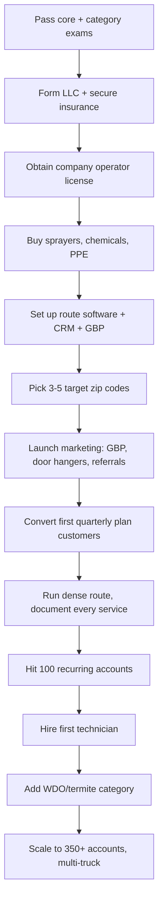

### Direct Answer

You start a pest control business in 2027 by earning a state pesticide **Certified Applicator** and **Commercial Operator** license, registering a licensed entity with general-liability and pollution coverage, then building a route of **quarterly recurring residential plans ($95-$185/quarter)** and **monthly commercial IPM contracts ($150-$2,500/month)**. A solo operator launches for **$5,000-$22,000**; the moat is recurring revenue, where 350-700 sticky accounts produce $30K-$110K of predictable monthly cash. The hardest part is not pests — it is licensing, EPA recordkeeping, and route density.

> **TL;DR**
> - **Capital:** $5K-$22K solo (truck, license, sprayer, PPE, insurance); $45K-$120K for a 2-3 tech route operation.
> - **Model:** Licensed-trade route business — quarterly residential plans, monthly mosquito subscriptions, annual termite warranties, commercial IPM contracts.
> - **Margins:** Recurring plan gross margin 70-85%; mature 350+ account operator grosses $400K-$1.2M/year at 30-45% net.
> - **Hardest part:** State Certified Applicator + Commercial Operator licensing, EPA restricted-use recordkeeping, and CEU renewals — label violations carry $5K-$50K fines.
> - **Moat:** Route density and recurring contracts. The win is renewal rate above 80% and stops-per-day above 12, not job count.
> - **Exit:** Rollins (NYSE: ROL) and Rentokil-Terminix (NYSE: RTO) pay 3-5x EBITDA / 1.5-2.5x recurring revenue for clean route books.

A **pest control business in 2027** is a **licensed-trade route-service operation** that delivers general pest treatment, wood-destroying-organism (WDO) termite control, mosquito and tick management, rodent control, bed bug remediation, wildlife removal, and commercial integrated pest management (IPM) to residential, commercial, HOA, property-management, and institutional customers. Revenue is anchored on the **quarterly residential plan** — the single most important product in the business — supplemented by monthly mosquito subscriptions, termite warranty renewals, one-time treatments, and commercial monthly IPM contracts. The recurring-revenue moat is what separates a financeable, sellable company from a truck and a sprayer.

This guide walks the full path: market structure, licensing, the economics of a route, capital, the launch playbook, customer acquisition, operations and software, scaling past the owner-operator ceiling, the financial model, risk, and exit. It is written for the operator who wants to build a real recurring-revenue service company, not a side hustle.

---

## 1. The Market and Why Pest Control Works as a Business

The US pest control market is large, fragmented, growing, and recession-resistant — a rare combination that makes it one of the most attractive licensed home-service trades to enter in 2027.

### 1.1 Market size and structure

The US structural pest control market is roughly **$14-$17 billion** in annual revenue and grows **3.5-5.5% per year**, faster than GDP. Growth is driven by warming climate expanding pest ranges northward, rising mosquito and tick pressure, bed bug resurgence in dense housing, and homeowners increasingly outsourcing maintenance they once did themselves. The National Pest Management Association (NPMA) counts roughly **20,000-30,000 pest control firms** in the US, and the long tail is dominated by small operators: more than **70% of firms run fewer than 10 employees**.

The market has a barbell shape. At one end sit two public consolidators — **Rollins (NYSE: ROL)**, parent of Orkin, Western Exterminator, HomeTeam Pest Defense, and more than 200 acquired regional brands, at roughly $3.4 billion in revenue, and **Rentokil-Terminix (NYSE: RTO)**, the global number-one after the 2022 Terminix merger, with roughly $5 billion in North American revenue. At the other end sit tens of thousands of independent operators. Mid-size regional players such as **Arrow Exterminators**, **Massey Services**, **Truly Nolen**, and franchise system **Mosquito Joe** (a Neighborly brand) fill the middle. Aptive Environmental and Aruza built large door-to-door sales engines in the 2010s and 2020s.

This structure matters for two reasons. First, the consolidators are **active acquirers** — Rollins alone closes 30-40 tuck-in acquisitions per year — so a well-built route book has a defined, liquid exit. Second, the consolidators are not nimble. They cannot beat a local owner-operator on response time, route familiarity, or relationship. A focused independent wins the local market on service quality and density.

### 1.2 Why the economics are durable

Pest control is **non-discretionary and recurring**. A homeowner with ants, roaches, or a termite warranty does not cancel during a recession the way they cancel a landscaper or a pool service — the consequence of canceling (infestation, structural damage) is too visible and too expensive. Rollins reported customer retention holding above 80% straight through the 2008-2009 recession and the 2020 shock. This is the same recurring-revenue logic that makes lawn care (q9612) and commercial cleaning (q9610) durable, but pest control has stronger pricing power because the service is regulated and the alternative is a visible failure.

### 1.3 Demand drivers through 2027

- **Climate range expansion.** Warmer winters push fire ants, mosquitoes, ticks, and termites into territory that never needed treatment, creating net-new demand in northern and mountain markets.
- **Bed bug persistence.** Bed bugs remain endemic in multifamily housing, hospitality, and senior living, supporting high-ticket ($1,000-$8,000) remediation work.
- **Mosquito-as-a-subscription.** The seasonal monthly mosquito plan, popularized by Mosquito Joe and Mosquito Squad, converts a one-time annoyance into a $65-$125/month April-through-October subscription — a structural margin upgrade.
- **Commercial compliance.** Food processing, restaurants, warehousing, and healthcare face audit regimes (AIB, third-party food safety) that legally require documented pest management, creating sticky multi-year contracts.
- **DIY fatigue.** Retail pesticide effectiveness is capped by regulation; homeowners increasingly conclude that professional service is worth the price.

### 1.4 Where a new operator realistically wins

A 2027 entrant should not try to be a generalist competing head-on with Orkin on brand. The winning wedge is **a defined geography plus a defined niche**: quarterly residential in a tight set of zip codes, or commercial IPM for restaurants, or mosquito-and-tick in an affluent suburb, or WDO termite inspections tied to real estate transactions. Density inside a small footprint beats coverage across a county. The operator who owns three zip codes with 400 accounts is more profitable, and more valuable, than the one with 400 accounts scattered across 15 zip codes.

The reason a niche wedge works against the consolidators is structural. Rollins and Rentokil-Terminix are optimized for national scale, brand-driven inbound lead flow, and standardized service protocols. They are not optimized for the unglamorous, relationship-heavy work of being the operator a property manager calls by name, the one who knows that the restaurant on Fifth Street has a recurring drain-fly problem in the back kitchen. The independent's advantage is **knowledge of the specific accounts and the specific geography**, and that advantage compounds with every quarter a route is serviced. A national brand cannot buy local route knowledge; it can only acquire the operator who already has it.

### 1.5 The five forces working in the operator's favor

Five structural forces make 2027 a genuinely good year to enter the trade, and an operator should weigh all five before committing capital:

- **Demand tailwind.** The market grows 3.5-5.5% annually, faster than GDP, driven by climate, housing density, and outsourcing — a rising tide.
- **Fragmentation.** Tens of thousands of small operators means there is always a local market position to take and always a retiring operator's route to buy.
- **Recession resistance.** Non-discretionary demand and 80%+ retention through downturns make cash flow unusually stable for a small business.
- **Regulatory moat.** Licensing keeps casual competitors out — the barrier that frustrates you at launch protects your margin forever after.
- **Liquid exit.** Active consolidators paying real multiples mean the recurring book you build is a genuine asset with a known buyer pool, not a business you must wind down at retirement.

The combination is rare. Most small businesses have one or two of these forces; pest control has all five. That is the analytical case for the trade, and it is why the rest of this guide focuses on execution rather than on whether the opportunity is real.

---

## 2. Licensing, Compliance, and Legal Structure

Licensing is the real barrier to entry in pest control. It is also the moat — it keeps the casual competitor out — so treat it as an asset to acquire deliberately, not a hurdle to resent.

### 2.1 The two-license structure

Almost every state separates pesticide licensing into two layers, and a new business needs both:

| License layer | What it covers | Who holds it |
|---|---|---|
| Certified / Commercial Applicator | The individual's authority to apply pesticides commercially, by category (general pest, WDO/termite, etc.) | A person — owner or a designated employee |
| Business / Commercial Operator license | The company's authority to operate as a pest control firm in the state | The legal entity |
| Service technician registration | Apprentice-level registration to apply under a certified applicator's supervision | Each field tech |

You cannot legally operate without both the **individual certification** and the **company license**, and most states require the certified applicator to be a principal of the business or a full-time employee. This is why the typical launch path is: the owner gets certified first.

### 2.2 Category certifications

Pesticide application is licensed by **category**, and pest control firms typically need:

- **General / structural pest (often Category 7 or 7A)** — ants, roaches, spiders, rodents, the core residential and commercial work.
- **WDO / termite (often 7B or a wood-destroying-organism category)** — termites, carpenter ants, wood-boring beetles, and the WDO inspection report tied to real estate sales.
- **Public health / vector (mosquito and tick)** — sometimes folded into general pest, sometimes separate, depending on state.
- **Fumigation** — a high-barrier specialty category most new operators skip initially.

The WDO/termite category deserves emphasis: termite work carries the highest tickets ($1,500-$12,000 per job) and the annual warranty renewal is pure recurring revenue, but the **WDO inspection report** (the "termite letter" required for many home sales) carries real liability — a missed infestation can produce a lawsuit. Add this category once the general-pest base is stable.

### 2.3 Getting certified

The path is consistent across states: study the EPA-aligned **core exam** plus each **category exam**, pass them at a state-administered testing center, and in many states show a minimum period of supervised experience or sponsorship. Cost is modest — exam fees typically $50-$150 each, prep materials $100-$400 — but the time investment is real. Budget 4-10 weeks of study. After certification, every license requires **continuing education units (CEUs)** for renewal, typically every 1-3 years; missing CEUs lapses the license and halts the business.

### 2.4 EPA recordkeeping and restricted-use products

The EPA, under FIFRA (the Federal Insecticide, Fungicide, and Rodenticide Act), governs pesticide use, and **the label is the law** — applying a product off-label is a federal violation. Two compliance obligations dominate day-to-day:

1. **Restricted-Use Pesticide (RUP) records.** RUP applications must be logged with product, EPA registration number, rate, target pest, location, applicator, and date, and records retained (commonly 2 years federally, longer in some states).
2. **Service documentation.** Every treatment generates a service ticket the customer signs; commercial accounts require a documented logbook for audits.

Label violations and recordkeeping failures carry **$5,000-$50,000 fines per incident**, and serious or repeat violations can suspend the company license. This is not a paperwork annoyance — it is an existential compliance area. Build the recordkeeping discipline into the route software from day one.

### 2.5 Insurance

Pest control insurance is heavier than a typical trade because pesticides create pollution exposure:

| Coverage | Why it matters | Typical annual cost (solo) |
|---|---|---|
| General liability | Property damage, bodily injury | $700-$1,800 |
| Pesticide / pollution liability | Misapplication, drift, contamination claims | $600-$1,500 |
| Commercial auto | Route trucks, chemical transport | $1,400-$3,200 per vehicle |
| Workers' compensation | Required once you hire | Varies by state and payroll |
| Termite / WDO E&O | Errors-and-omissions on inspection reports | $800-$2,500 if doing WDO |

Many states require **proof of pesticide/pollution coverage to issue the business license** — it is not optional. Expect $2,500-$6,000 in total first-year insurance for a solo operator.

### 2.6 Legal entity and bonding

Form an **LLC** (or S-corp once profit justifies the payroll-tax election) for liability separation — pesticide work is exactly the kind of activity that warrants the corporate shield. Some states or municipalities also require a **surety bond**. The legal-entity step mirrors any licensed trade (see HVAC, q9691, and plumbing, q9688), but the pollution exposure makes the insurance layer materially heavier.

A practical sequencing note: form the entity and open the business bank account **before** applying for the company operator license, because most states issue the license to a named legal entity and require an EIN. Trying to license a sole proprietorship and later converting to an LLC means re-applying — a costly delay in a process that already runs on government timelines.

### 2.7 The compliance calendar

Compliance in pest control is not a one-time setup; it is a recurring calendar that, if missed, halts the business. Build it into the operations software as recurring tasks:

| Compliance item | Frequency | Consequence of missing |
|---|---|---|
| Individual applicator CEUs | Every 1-3 years (state-specific) | License lapses; cannot legally treat |
| Company operator license renewal | Annual or biennial | Company cannot operate |
| Insurance certificate renewal | Annual | License often tied to active coverage |
| RUP application records retention | Ongoing (2+ years) | Fines on audit |
| Service ticket / commercial logbook upkeep | Per service | Failed food-safety audits, lost accounts |
| Vehicle / DOT compliance (multi-truck) | Ongoing | Fines, out-of-service orders |

The operator who treats this calendar as seriously as the route schedule never faces an existential compliance surprise. The operator who treats it as an afterthought eventually does. This is the same disciplined-operator trait that the regulated mobile-service businesses demand — see mobile drug testing (q2150) and ADAS windshield calibration (q2148), where standards adherence is the entire business.

### 2.8 Common licensing mistakes that delay launch

New operators repeatedly lose months to the same avoidable errors. Avoid them deliberately:

- **Scheduling the exam late.** Testing centers book out; register for the core and category exams the week you decide to start.
- **Underestimating supervised-experience rules.** Some states require documented hours under a certified applicator before they will certify you — this can be the single longest pole.
- **Applying for the company license without insurance bound.** Many states will not process the application without a pollution-liability certificate attached.
- **Skipping the WDO category, then losing real estate referral work.** If termite/WDO is in your plan, sequence the category exam early enough to be ready when the referral pipeline matures.

---

## 3. The Economics of a Pest Control Route

Understanding the unit economics is what separates operators who build wealth from operators who buy themselves a low-paid job. The business is a **route**, and the route is a math problem.

### 3.1 Service lines and pricing

| Service | Typical price | Margin profile | Revenue character |
|---|---|---|---|
| Quarterly residential plan | $95-$185 / quarter | 70-85% gross | Recurring — the core |
| Monthly mosquito plan | $65-$125 / month (Apr-Oct) | 65-80% gross | Seasonal recurring |
| One-time general treatment | $185-$650 | 60-75% gross | One-time |
| Termite treatment job | $1,500-$12,000 | 45-65% gross | High-ticket one-time |
| Annual termite warranty renewal | $250-$650 / year | 85-95% gross | Recurring — pure margin |
| Bed bug remediation | $1,000-$8,000 | 40-60% gross | High-ticket one-time |
| Commercial IPM contract | $150-$2,500 / month per site | 55-75% gross | Recurring — sticky |
| Wildlife / exclusion | $300-$2,500 | 45-65% gross | One-time + exclusion |

The strategic point: **the quarterly residential plan and the commercial IPM contract are the products that build enterprise value.** One-time treatments and termite jobs generate cash but do not compound. A buyer pays a multiple of recurring revenue, not one-time revenue.

### 3.2 The route density equation

Profitability is governed by **stops per day**. A technician's day is fixed at roughly 8 working hours. A residential quarterly treatment takes 20-35 minutes on-site. The variable that destroys or builds margin is **drive time between stops**.

| Route quality | Avg drive time between stops | Stops per 8-hr day | Daily revenue at $130/stop |
|---|---|---|---|
| Scattered (new operator) | 22 min | 8-9 | $1,100 |
| Developing | 14 min | 11-12 | $1,500 |
| Dense (mature) | 7 min | 15-17 | $2,000 |
| Saturated urban core | 4 min | 18-20 | $2,500 |

A dense route nearly doubles the revenue per technician per day at the same labor cost. This is why **geographic discipline beats geographic spread**. Selling a customer two zip codes away is often worth less than declining the job, because it pulls the route apart. The same density logic governs every route service — mobile car wash (q2074), residential house cleaning (q2109), dryer vent cleaning (q2113) — but pest control's recurring quarterly cadence makes density compound four times a year.

### 3.3 The recurring-revenue moat

A mature operator with **350-700 recurring accounts** generates **$30,000-$110,000 per month** of predictable recurring revenue before any one-time work. That recurring base does three things:

1. **Smooths seasonality.** Termite jobs and one-time treatments swing hard with weather and season; the quarterly plan does not.
2. **Makes the business financeable.** A bank or buyer underwrites recurring revenue. They discount one-time revenue heavily.
3. **Creates a sellable asset.** Recurring route books sell at **1.5-2.5x annual recurring revenue** or **3-5x EBITDA**; one-time revenue barely moves the price.

### 3.4 Retention is the hidden P&L line

The most important number in the business is **annual customer retention**. At 85% retention you replace 15% of accounts per year just to stay flat. At 70% retention you replace 30% — doubling your customer-acquisition cost burden. A point of retention is worth more than a point of price. Operators obsess over leads; the ones who win obsess over **why customers cancel** and fix it: missed appointments, callbacks for pests after treatment, surprise price increases, poor communication.

### 3.5 Customer acquisition cost and lifetime value

| Metric | New operator | Mature operator |
|---|---|---|
| Customer acquisition cost (CAC) | $120-$320 | $80-$180 |
| First-year revenue per residential account | $400-$700 | $450-$750 |
| Average account lifespan | 2.5-4 years | 4-7 years |
| Lifetime value (LTV) | $1,100-$2,400 | $2,200-$4,500 |
| LTV:CAC ratio | 6:1-10:1 | 12:1-25:1 |

The LTV:CAC ratio in pest control is excellent — far better than most service businesses — because the quarterly plan compounds and retention is structurally high. This is the financial reason the business is worth building.

### 3.6 Pricing strategy and the discount trap

The most common pricing error a new operator makes is **underpricing the quarterly plan to win the account**, then being unable to raise it without triggering cancellation. The plan price should reflect the full cost of four service visits, the materials, the drive time, the callbacks, and a margin that can absorb annual cost inflation. Pricing at the bottom of the $95-$185 range to undercut Orkin wins the customer who will leave for the next cheaper quote — exactly the customer who destroys retention.

A better strategy is to **anchor on value and service quality**, price in the middle-to-upper part of the range, and compete on responsiveness, communication, and the no-callback-charge guarantee rather than on price. The operator who builds a route of price-shoppers has built a route that churns; the operator who builds a route of customers who value service has built an asset. Annual price increases of 3-6% are normal and accepted when the service is good and the increase is communicated proactively — a small surprise increase, by contrast, is one of the top three cancellation triggers.

### 3.7 Commercial economics versus residential economics

Commercial and residential accounts behave differently and an operator should understand both:

| Dimension | Residential quarterly | Commercial IPM |
|---|---|---|
| Ticket size | $95-$185 / quarter | $150-$2,500 / month per site |
| Sales cycle | Hours to days | Weeks to months |
| Stickiness | Moderate-high | Very high (audit-driven) |
| Service complexity | Standardized | Documentation-heavy, audit-ready |
| Acquisition channel | Inbound, referral, door | Direct outreach, proposals |
| Route fit | Excellent for density | Anchors a route, fewer stops |

A balanced book mixes both: residential accounts build density and volume, while commercial accounts add high-value, sticky anchor revenue that a buyer particularly prizes at exit. An operator who builds only residential has a good business; one who layers in commercial IPM has a more valuable one.

---

## 4. Capital Required to Start

Pest control has one of the lowest capital barriers among licensed trades, because a solo operator can launch from a personal vehicle with a backpack or tank sprayer. The barrier is licensing time, not money.

### 4.1 Solo launch budget

| Item | Low | High |
|---|---|---|
| State exams + prep materials | $250 | $900 |
| Business / commercial operator license | $150 | $600 |
| LLC formation + registered agent | $100 | $500 |
| Insurance (GL + pollution + auto), first year | $2,500 | $6,000 |
| Tank sprayer + backpack sprayer + B&G sprayer | $400 | $1,800 |
| Granular spreader, dusters, bait guns, hand tools | $300 | $1,000 |
| Initial chemical inventory | $600 | $2,000 |
| PPE (respirator, gloves, suits, boots) | $250 | $700 |
| Truck graphics / vehicle wrap | $300 | $2,500 |
| Route + CRM software (annual) | $400 | $2,000 |
| Website, branding, Google Business Profile | $400 | $2,500 |
| Initial marketing budget | $500 | $3,000 |
| Working capital reserve | $1,000 | $4,000 |
| **Total (using an existing vehicle)** | **$5,000** | **$22,000** |

Most new operators use a vehicle they already own and add a tank in the bed; a dedicated truck is a phase-two purchase.

### 4.2 The 2-3 technician operation

Scaling to a small team adds route trucks, inventory depth, and a labor base:

| Item | Low | High |
|---|---|---|
| 1-2 additional route trucks (used) | $16,000 | $54,000 |
| Truck equipment buildout (per truck) | $2,500 | $8,000 |
| Expanded chemical + bait inventory | $4,000 | $12,000 |
| Technician hiring, training, certification | $3,000 | $9,000 |
| Office / shop lease + chemical storage | $0 | $14,000 |
| Expanded marketing + sales | $6,000 | $20,000 |
| Software seats + telematics | $2,000 | $6,000 |
| Working capital (payroll runway) | $12,000 | $25,000 |
| **Total** | **$45,000** | **$120,000** |

### 4.3 Funding paths

Most operators bootstrap the solo phase from savings — $5K-$22K is within reach without debt. Scaling capital comes from **retained earnings reinvested**, an **SBA microloan or 7(a) loan** (pest control's recurring revenue underwrites well), **equipment financing** for trucks, or **buying an existing route book** with seller financing. Buying a small retiring operator's route — 80-150 accounts — is often a faster, lower-risk entry than a cold start, because it begins with recurring revenue on day one.

### 4.4 Why pest control underwrites well for lenders

A lender or SBA underwriter looks at a pest control business and sees something they like: **predictable recurring cash flow with documented retention**. Unlike a one-time-revenue trade, a pest control operator can show a recurring-account roster, a renewal rate, and a monthly recurring revenue figure — the same metrics a software company shows. That makes the business financeable in a way that a pure project-based contractor is not. An operator who wants to grow via acquisition should build the recurring book deliberately and keep clean records of it, because that book is both the asset and the collateral.

### 4.5 The capital-efficiency advantage

Compared to other home-service trades, pest control's capital intensity is low. An HVAC contractor (q9691) needs a stocked van and high-cost equipment; a landscaping company (q9678) needs mowers, trailers, and trucks. A pest control operator needs a sprayer, chemicals, PPE, and software — the route, not the rolling stock, is the expensive asset, and the route is built with marketing and service rather than with capital equipment. This is why the trade is accessible to an operator with $5K-$22K and disciplined execution, and why the binding constraint on growth is almost never money — it is licensing time, route density, and the operator's willingness to cross the management ceiling.

---

## 5. The Launch Playbook — First 180 Days

The launch sequence is mostly serial: each step gates the next. Here is the realistic path.

### 5.1 Days 1-45: License and legal foundation

Study and pass the core exam plus general pest category. File the LLC, get an EIN, open a business bank account, and bind insurance — you need the pollution coverage in hand to apply for the company operator license. Submit the company license application. This phase is the longest pole because exam scheduling and license processing run on government timelines.

### 5.2 Days 46-75: Equipment and systems

Buy a tank sprayer, a backpack sprayer, and a B&G compressed-air sprayer; a granular spreader; bait stations; dusters; and PPE including a fitted respirator. Set up route management software, a CRM, and a Google Business Profile. Build a simple website with service pages and a booking form. Establish a chemical supplier account (Veseris, Univar, or a regional distributor).

### 5.3 Days 76-120: First customers

Pick **3-5 contiguous target zip codes** — affluent enough to value service, dense enough to build a route. Launch acquisition: optimize the Google Business Profile, run door hangers in the target zips, ask every customer for referrals, list on Angi and Thumbtack, and consider a small Local Services Ads (Google Guaranteed) budget. The goal of this phase is to convert one-time treatment leads into **quarterly recurring plans** — always pitch the plan, never just the one-time.

### 5.4 Days 121-180: Density and discipline

Run the route, treat density as the priority, and document every service for compliance. Track three numbers weekly: **new recurring accounts, retention/cancellations, and stops per day**. The target by day 180 is 60-120 recurring accounts and a route tight enough that the owner-operator is profitable. Once near 100 accounts, the path to a first technician hire becomes clear.

### 5.5 The cardinal rule of launch

**Sell the plan, not the visit.** Every operator faces the temptation to take the $250 one-time job and move on. The operator who builds wealth converts that same call into a $135/quarter recurring plan. The first business produces cash; the second produces an asset. Underwrite every customer interaction toward recurring revenue.

### 5.6 The first-90-days metrics dashboard

A launching operator should track a small set of numbers every single week — not monthly, weekly — because early course corrections are cheap and late ones are expensive:

| Metric | Why it matters | Healthy early trajectory |
|---|---|---|
| New recurring accounts (weekly) | The only number that builds the asset | 3-8 per week by week 8 |
| One-time-to-plan conversion rate | Measures sales discipline | 35-55% of one-time calls |
| Cancellations | Early churn signals a service problem | Near zero in first 90 days |
| Stops per day | Route density forming | Rising week over week |
| Callback rate | Service quality | Below 8% |
| Cost per lead by channel | Where to put marketing dollars | GBP and referral lowest |

If new recurring accounts stall, the problem is marketing or sales pitch. If cancellations appear early, the problem is service quality or a pricing surprise. If stops per day are not rising, the route is too scattered — tighten the geography. The dashboard turns a vague sense of "how's it going" into a specific, fixable diagnosis.

### 5.7 Branding and trust signals at launch

Pest control is a trust purchase — a homeowner is letting a stranger spray chemicals around their family and pets. Trust signals matter disproportionately at launch when there is no reputation yet: a clean truck wrap, a professional uniform, a real website with clear service pages, a complete Google Business Profile, visible licensing and insurance, and a few early reviews. The operator who looks established converts at a far higher rate than the one who looks like a person with a sprayer. None of these signals is expensive, but skipping them caps the conversion rate from the first day.

---

## 6. Customer Acquisition

Pest control demand is a mix of urgent ("I have roaches now") and preventive ("I want a plan"). A new operator needs channels for both, and a discipline for converting urgent calls into recurring plans.

### 6.1 Channel economics

| Channel | CAC range | Speed | Recurring-conversion fit | Notes |
|---|---|---|---|---|
| Google Business Profile (organic local) | $20-$80 | Medium | High | Highest ROI; reviews compound |
| Local Services Ads (Google Guaranteed) | $90-$280 | Fast | Medium | Pay-per-lead; urgent callers |
| Door hangers in target zips | $40-$140 | Medium | High | Builds density directly |
| Customer referrals | $0-$60 | Slow | Very high | Best retention and LTV |
| Angi / Thumbtack | $80-$260 | Fast | Low-medium | Price shoppers, weaker retention |
| Neighborhood apps (Nextdoor) | $30-$120 | Medium | High | Trust-driven, local |
| Real estate agent relationships (WDO) | $0-$50 | Slow | N/A | Termite inspection pipeline |
| Door-to-door sales | $150-$400 | Fast | Medium | Scales fast, capital-intensive |

### 6.2 The Google Business Profile is the foundation

For a local service business, the Google Business Profile is the single highest-ROI asset. Fully complete the profile, post regularly, add service-area zips, and — most important — **systematically request reviews after every service**. A profile with 150+ reviews at 4.8 stars outranks competitors and converts urgent searchers at a fraction of paid-lead cost. This is the same playbook that powers handyman (q9614) and landscaping (q9678) lead generation, but pest control's recurring model means each won customer is worth four service visits a year.

### 6.3 Door density marketing

Because the business is a route, marketing should be **geographic, not broad**. When you treat a house, hang door hangers on the 10 nearest homes — "We're already in your neighborhood." This builds the route tighter with every job and is the cheapest density-building tactic available.

### 6.4 The WDO / real estate pipeline

WDO termite inspections required for home sales are a recurring lead source: build relationships with 5-10 active real estate agents and become their go-to inspector. Each inspection is modest revenue but introduces you to a new homeowner — a warm lead for a quarterly plan.

### 6.5 Commercial acquisition is relationship sales

Commercial IPM contracts (restaurants, food processing, property management) are won through direct outreach, walk-ins, and proposals — not ads. They are slower to close but far stickier: a restaurant on a monthly IPM contract with documented compliance logs rarely switches. One property-management portfolio can add 10-40 accounts in a single relationship.

### 6.6 Retention marketing is acquisition

Because retention is the hidden P&L line (see 3.4), the cheapest "acquisition" is keeping the customer you have. Proactive appointment reminders, on-time arrival, free callbacks between scheduled services, and a no-surprise pricing policy retain accounts at 85%+ and turn customers into referral sources.

---

## 7. Operations, Software, and the Technician Day

A pest control business lives or dies on operational execution: routing, scheduling, documentation, and chemical management. The owner who systematizes these scales; the one who improvises stays a one-truck operator.

### 7.1 The route management software stack

Pest-specific platforms exist and are worth the cost: **PestPac** (a Workwave product, the industry standard), **FieldRoutes** (a ServiceTitan company), **Briostack**, **GorillaDesk**, and **PestRoutes**. The core capabilities a new operator needs:

- **Route optimization** — sequencing stops to minimize drive time (the density equation in software).
- **Recurring scheduling** — automatic quarterly/monthly cadence so plans never lapse.
- **Mobile service tickets** — technician documents the treatment, products used, and pests found, with customer signature.
- **Chemical and RUP tracking** — compliant logs for EPA recordkeeping.
- **Automated billing and dunning** — auto-charging cards on the quarterly cadence is what makes recurring revenue actually recurring.
- **Customer communication** — automated appointment reminders and follow-ups.

A solo operator can start with a lower-cost tool (GorillaDesk) and migrate to PestPac or FieldRoutes when route complexity demands it.

### 7.2 The technician day

| Time block | Activity |
|---|---|
| 7:00-7:30 | Truck check, chemical mix, route review |
| 7:30-12:30 | Morning route — 7-9 stops |
| 12:30-1:00 | Lunch, restock, customer callbacks |
| 1:00-5:00 | Afternoon route — 6-8 stops |
| 5:00-5:30 | Service ticket completion, RUP logging, route prep for tomorrow |

A productive technician completes **13-17 quarterly stops per day** on a dense route. Telematics (GPS) on each truck verifies route adherence and is standard once you run multiple vehicles.

### 7.3 Chemical management and IPM

Modern pest control is **Integrated Pest Management (IPM)** — a framework that prioritizes inspection, exclusion (sealing entry points), sanitation guidance, and targeted, lowest-risk product use over blanket spraying. IPM is not just a compliance buzzword; commercial accounts and institutional contracts (schools especially) often legally require an IPM approach. It also reduces chemical cost and callback rates. Maintain a chemical inventory of general-pest concentrates, baits, dusts, and rodenticides; store them in a compliant, ventilated, locked area; and rotate active ingredients to manage resistance.

### 7.4 Callbacks — the operational quality signal

A **callback** (the customer reporting pests after a treatment) is the cleanest quality metric. A callback rate above 8-10% signals a training, product, or process problem and predicts cancellations. Free, fast callback service is part of the plan and protects retention — but a high callback rate is a fire to put out, not a cost to absorb.

### 7.5 Seasonality management

Pest pressure is seasonal: spring and summer are peak (ants, mosquitoes, termites swarming), winter is slow in cold climates. The quarterly plan smooths revenue, but staffing must flex — many operators run leaner in winter, use seasonal techs in peak, and push winter rodent and commercial work to fill the trough. Solar panel cleaning (q2141) and soft wash roof cleaning (q2151) operators face the same seasonality problem; the pest control answer is the recurring plan plus winter-resilient service lines.

### 7.6 Inventory and supplier management

Chemical inventory is working capital tied up on a shelf, and it expires. The discipline is to **carry enough to never miss a treatment but not so much that products age out**. Build a relationship with a primary distributor — Veseris and Univar Solutions are the national majors, and most regions have a competitive independent distributor — and a secondary supplier for redundancy. Track usage rates per product so reorder points are data-driven, not guessed. Rotate active ingredients not only for resistance management but because a product line discontinued by the manufacturer can strand an operator mid-season. At scale, inventory carrying cost and shrinkage become a real P&L line; at launch, the main risk is simply running out of a key product on a route day.

### 7.7 Quality systems and the service standard

The difference between a route that retains at 85% and one that retains at 70% is almost always **consistency of service quality**, and consistency comes from a written standard, not from individual technician judgment. Document the treatment protocol for each common scenario — perimeter quarterly, ant interior, roach commercial kitchen, rodent exclusion — so every technician on every truck delivers the same service. Pair the written standard with periodic ride-alongs and a customer-feedback loop. A new operator should write the standard from their own service before the first hire, because it is far easier to document what one person does than to retrofit consistency onto a team that has each developed their own habits.

---

## 8. Scaling Past the Owner-Operator Ceiling

The owner-operator ceiling in pest control is real: one person can profitably run roughly **150-220 recurring accounts** before service quality degrades. Crossing that ceiling means hiring, and hiring is where most operators stall.

### 8.1 The first hire

The first hire is a **service technician**, made at roughly 100-150 accounts when the owner's route is full and growth has stalled. The new technician must be registered (the apprentice-level credential) and trained under the owner's certification. This hire converts the owner from full-time field labor to a player-coach who can train, sell, and manage while still running a partial route.

### 8.2 The hiring sequence

| Stage | Accounts | Key hire | Owner's role |
|---|---|---|---|
| Solo | 0-180 | None | Full-time field + admin |
| First tech | 150-350 | Service technician | Player-coach, training, sales |
| Small team | 350-700 | 2nd tech + part-time CSR | Sales, management, off the truck |
| Multi-truck | 700-1,500 | Office manager, sales rep, 3-5 techs | Full management |
| Regional | 1,500+ | Operations manager, branch leads | Owner runs the business |

### 8.3 Getting the owner off the truck

The strategic transition is moving the owner from **doing the work** to **building the system**. This requires three things: documented procedures (treatment protocols, callback handling, service standards), a technician pay model that rewards quality and retention (base plus commission on plan sales and renewal, with callback penalties), and software that gives the owner visibility without being on every truck.

### 8.4 The technician pay and retention problem

Technician turnover is the operational killer at scale. A trained, certified technician who knows the route is worth far more than a new hire — yet replacing them costs the training investment and risks customer loss when the familiar tech disappears. Pay competitively, build a clear path from technician to lead to manager, and tie compensation to retention so the technician's incentive aligns with the business's most important metric.

### 8.5 Adding service lines

Once the core quarterly route is stable, the highest-return additions are: **WDO/termite** (high tickets plus warranty recurring revenue), **mosquito subscriptions** (margin-rich seasonal recurring), and **commercial IPM** (sticky contracts). Each requires the appropriate category certification and some specialized equipment, and each should be added only when the base is solid — diversifying too early dilutes route density.

### 8.6 Acquiring routes

The fastest scale path past organic growth is **acquiring small route books** from retiring operators. A 100-200 account book bought at 1.5-2x recurring revenue, often with seller financing, instantly adds density and recurring cash. This is the same strategy Rollins uses 30-40 times a year — an independent can run a miniature version of it locally.

When evaluating a route to acquire, the operator should verify the **real** recurring revenue, not the claimed one: pull the account roster, check the actual renewal/payment history, identify how many accounts are truly on auto-billed plans versus lapsed, and assess geographic overlap with the existing route. A book that overlaps the buyer's existing zip codes is worth more than a scattered one because it deepens density. Seller financing aligns incentives — the seller has a stake in a clean handoff — and a transition period where the seller introduces the buyer to commercial accounts protects retention through the ownership change.

### 8.7 Building the management layer

The final scaling transition — from a multi-truck operation the owner manages directly to a regional company with a management layer — requires hiring people who manage other people: an operations manager, branch leads, a dedicated sales role, and office/CSR staff. This is a different skill from running a route, and many operators stall here because they hire technicians well but have never hired or developed managers. The operator who reaches this stage should expect to spend a year or more building the management layer, and should accept that the company's growth rate during that build will slow. The payoff is a business that runs, grows, and is worth a meaningful multiple without the owner in the field — the definition of a genuine asset.

### 8.8 The KPI scorecard for a scaled operation

At scale, the owner manages by numbers, not by being on the truck. The core scorecard:

| KPI | Healthy target | What it reveals |
|---|---|---|
| Annual customer retention | 82-90% | Service quality and pricing discipline |
| Stops per technician per day | 13-17 | Route density and scheduling efficiency |
| Callback rate | Below 8% | Treatment quality and training |
| Recurring revenue % of total | 55-70% | Enterprise value and stability |
| Technician turnover (annual) | Below 25% | Pay, culture, management quality |
| Net operating margin | 25-35% | Overall operational health |
| CAC payback period | Under 6 months | Marketing efficiency |

A scaled operation that holds these targets is both profitable and sellable. One that drifts on retention or callback rate is quietly destroying the asset even if the top line looks healthy.

---

## 9. The Financial Model

This section models a realistic operator at three stages so you can see where the money actually is.

### 9.1 Solo operator — Year 1

| Line | Amount |
|---|---|
| Recurring accounts (year-end) | 120 |
| Recurring revenue | $66,000 |
| One-time + termite revenue | $54,000 |
| **Total revenue** | **$120,000** |
| Chemicals + materials | ($14,000) |
| Vehicle + fuel | ($11,000) |
| Insurance + licensing | ($6,500) |
| Software + marketing | ($13,000) |
| **Owner's pre-tax earnings** | **~$75,500** |

Year 1 is a job that builds an asset — modest income, but 120 recurring accounts is the foundation.

### 9.2 Established operator — 2-3 technicians

| Line | Amount |
|---|---|
| Recurring accounts | 600 |
| Recurring revenue | $360,000 |
| One-time + termite + commercial | $290,000 |
| **Total revenue** | **$650,000** |
| Labor (techs + CSR) | ($210,000) |
| Chemicals + materials | ($72,000) |
| Vehicles + fuel + telematics | ($58,000) |
| Insurance + licensing | ($24,000) |
| Software + marketing | ($66,000) |
| Facility + admin | ($35,000) |
| **Net operating profit** | **~$185,000 (28%)** |

### 9.3 Multi-truck regional operator

| Line | Amount |
|---|---|
| Recurring accounts | 2,200 |
| **Total revenue** | **$2,400,000** |
| All operating costs | ($1,750,000) |
| **Net operating profit** | **~$650,000 (27%)** |
| Owner role | Management, not field |

### 9.4 What the numbers teach

Net margin lands in the **25-35%** band across stages — pest control does not get dramatically more profitable per dollar at scale, but the **absolute** profit and the **enterprise value** grow enormously. The owner's wealth is built two ways: the annual profit, and the **sale of the recurring route book**. A 600-account operation with $185K net operating profit could sell for **$550K-$925K** (3-5x EBITDA). That is the real return — and it is why the recurring plan, not the one-time job, is the product to obsess over.

### 9.5 Cash flow and the working-capital reality

Profit and cash are not the same thing, and a growing pest control business consumes cash even while it is profitable. Growth means hiring technicians who must be paid before their routes are full, buying trucks and equipment ahead of the revenue they generate, and spending on marketing whose accounts pay back over months. An operator scaling from one truck to three can be profitable on paper and still tight on cash. The discipline is to **hold a working-capital reserve sized to payroll runway** — the established-operator budget in section 4.2 carries $12K-$25K for exactly this reason — and to grow at a rate the cash flow can fund, or to finance growth deliberately rather than starving the business. The recurring base helps here too: auto-billed quarterly plans produce predictable inbound cash that smooths the payroll cycle.

### 9.6 Valuation drivers at exit

When the operator sells, the buyer's price is driven by a specific set of factors, and an owner who understands them can build value deliberately for years before a sale:

| Value driver | Raises the multiple | Lowers the multiple |
|---|---|---|
| Recurring revenue mix | High % recurring | Mostly one-time work |
| Customer retention | 85%+ documented | Below 75% or undocumented |
| Route density | Tight, contiguous geography | Scattered accounts |
| Owner dependence | Runs without owner | Owner is the business |
| Commercial anchor accounts | Sticky multi-year contracts | None |
| Clean compliance record | No violations, full records | Outstanding violations |
| Financial records quality | Clean, auditable books | Disorganized, cash-heavy |

The operator who builds with the exit in mind — recurring mix, retention, density, owner-independence, clean books — does not have to scramble to make the business sellable at the end. The business is already an asset, every year along the way.

---

## 10. Counter-Case: When You Should Not Start a Pest Control Business

Honest analysis requires the bear case. Pest control is a strong business, but it is wrong for some operators, and some markets are traps.

### 10.1 The licensing patience problem

The single most common reason new operators fail before they start is **underestimating the licensing timeline**. Core and category exams, supervised-experience requirements in some states, and government processing of the company license can take **3-6 months** before you can legally treat a single home. An entrepreneur who needs income in 60 days should not pick pest control — pick a faster-to-launch trade. The licensing barrier that protects you later blocks you first.

### 10.2 The owner-operator trap

If you launch and never cross the owner-operator ceiling (8.1), you have bought yourself a **$60K-$90K job with no exit**. A 150-account solo book is hard to sell for a meaningful multiple because the "asset" is the owner's labor. The business only becomes valuable when it runs without you — and many operators never make that transition, either because they cannot delegate or because the local market cannot support a second truck.

### 10.3 Saturated and over-consolidated markets

In some metros, Rollins and Rentokil-Terminix brands, plus several large regional players and aggressive door-to-door sales companies, have already saturated the market. CAC is elevated, price competition is fierce, and recurring-plan churn is high because customers are constantly being re-sold. Entering a saturated market as a generalist is a slow bleed. The counter to this is the niche wedge (1.4) — but if you cannot identify an underserved niche or geography, the market is telling you something.

### 10.4 Compliance risk for the careless operator

The $5,000-$50,000-per-incident fines and the liability of WDO inspection reports are not theoretical. An operator who is sloppy with the label, careless with recordkeeping, or cavalier about drift onto neighboring properties will eventually face a fine, a lawsuit, or a license suspension. If you are not temperamentally suited to disciplined documentation and rule-following, this regulated trade will punish you. Mobile drug testing (q2150) and ADAS windshield calibration (q2148) share this trait — they are licensed/standards-bound businesses where carelessness is existential.

### 10.5 The seasonality cash trap

In cold-winter markets, an operator over-weighted to one-time and mosquito work faces a brutal winter revenue trough. Operators who do not build the quarterly recurring base early, or who do not have winter-resilient lines (rodent, commercial), can run out of cash in their first winter. The counter is to prioritize recurring accounts from day one — but an operator who chases the big one-time termite jobs and neglects plan sales can be profitable in July and insolvent in January.

### 10.6 Physical and chemical realities

The work is physically demanding — crawl spaces, attics, heat, ladders — and involves daily handling of pesticides with the associated PPE discipline and exposure caution. It is outdoor, year-round, weather-exposed work. An operator who romanticizes "owning a business" without accounting for the physical nature of the field years will burn out before reaching the management transition.

### 10.7 When it is right

Pest control is the right business for an operator who: can absorb a 3-6 month licensing runway, is genuinely disciplined about compliance and documentation, has identified a specific geography or niche, intends from day one to build recurring revenue rather than chase one-time cash, and is committed to crossing the owner-operator ceiling into a real management role. For that operator, pest control offers a rare combination — low capital entry, recession resistance, excellent LTV:CAC, a defensible recurring moat, and a liquid exit to active consolidators. Few service businesses offer all five.

---

## 11. Frequently Asked Questions

**How much can a pest control business realistically make?** A solo operator nets $60K-$90K in year one, an established 2-3 technician operation produces $150K-$250K of net operating profit on roughly $650K revenue, and a multi-truck regional operator can clear $500K-$800K. The larger return is the sale of the recurring route book at 3-5x EBITDA.

**Do I need a degree?** No. You need state pesticide certification (core plus category exams) and a company operator license. The exams are studied, not schooled — most operators self-prepare in 4-10 weeks.

**Should I buy a franchise instead?** Franchises (Mosquito Joe, Mosquito Squad, Truly Nolen franchising) provide brand, training, and systems for a franchise fee plus 6-10% ongoing royalties. They lower the learning curve but cap margin and resale flexibility. An independent keeps full margin and full exit value but must build systems alone.

**Is buying an existing route a good idea?** Often yes. A retiring operator's 80-200 account book, bought at 1.5-2.5x recurring revenue with seller financing, starts you with recurring cash and route density on day one — usually lower-risk than a cold start.

**What is the hardest pest to build a business around?** Bed bugs and termites carry the highest tickets but also the highest liability and callback risk. The safest foundation is the **general-pest quarterly plan**; add termite/WDO and bed bug work once the base is stable.

**How long until the business replaces a full-time income?** A focused solo operator typically reaches a livable owner's income within the first year — the Year-1 model in section 9.1 shows roughly $75K pre-tax at 120 accounts. The path to a strong income with free time, rather than a strong income from personal labor, runs through the first technician hire and the management transition, and that usually takes two to four years of disciplined building.

**Do I need a physical office or shop?** Not at launch. A solo operator works from a vehicle and a home office, storing chemicals in a compliant, locked, ventilated space. A shop or office becomes necessary at the multi-truck stage when you need chemical storage at volume, a place for technicians to load out, and room for administrative staff. Delaying the facility expense until the route revenue justifies it preserves capital during the phase when capital is tightest.

**What is the single biggest predictor of success?** Route density combined with customer retention. An operator who builds a tight, contiguous route of customers who value service — and who measures and defends retention every month — will out-earn and out-value an operator who chases volume across a wide, scattered geography. Density and retention are the two numbers that compound; everything else is downstream of them.

**Is the door-to-door sales model worth copying?** Door-to-door built large companies like Aptive and Aruza, and it does scale account count fast. But it is capital-intensive, sales-rep-turnover-heavy, and tends to produce lower-retention accounts that were sold rather than sought. A new operator is usually better served by the lower-CAC, higher-retention channels — Google Business Profile, referrals, and geographic door hangers — and can consider a sales push only once the operations base is solid.

---

## 12. Conclusion

A pest control business in 2027 is one of the most attractive licensed home-service trades an operator can enter: low capital entry ($5K-$22K solo), recession-resistant non-discretionary demand, an excellent LTV:CAC ratio, a defensible recurring-revenue moat in the quarterly plan, and a liquid exit to active consolidators paying 3-5x EBITDA. The barrier is licensing time and operational discipline, not money.

The operator who succeeds does five things relentlessly: earns the licenses and respects the compliance regime, picks a tight geography and niche rather than spreading thin, sells the **recurring plan** instead of the one-time visit, builds **route density** as the core economic engine, and crosses the **owner-operator ceiling** into a real management role so the business becomes a sellable asset rather than a job. Do those five things and pest control compounds into a genuine recurring-revenue company.

Start small and disciplined. Pick a tight geography, earn the license, get the insurance, buy the sprayer, and convert your first one-time calls into quarterly plans. Track new accounts, cancellations, and stops per day every week. Hit 100 recurring accounts, make the first technician hire, add the WDO/termite category, and keep building density. The business does not require a brilliant insight or a large capital base — it requires consistent execution of a well-understood model, week after week, until the recurring book is large enough to be both a strong income and a sellable asset. The operators who treat that as a multi-year discipline, rather than a fast win, are the ones who end up selling a real company to a real buyer.

For related licensed-trade and route-business playbooks, see how to start an HVAC contracting business (q9691), a plumbing business (q9688), a landscaping company (q9678), a lawn care business (q9612), a handyman service business (q9614), a commercial cleaning business (q9610), a mobile mechanic business (q9594), a solar panel cleaning business (q2141), a soft wash roof cleaning business (q2151), a residential house cleaning business (q2109), a dryer vent cleaning business (q2113), a mobile car wash business (q2074), a mobile drug testing business (q2150), and a mobile ADAS windshield calibration business (q2148) — the recurring-revenue, route-density, licensing, and exit-to-consolidator patterns repeat across all of them, and an operator who understands one understands the family.

---

*Sources: National Pest Management Association (NPMA, npmapestworld.org); Rollins Inc investor filings (NYSE: ROL); Rentokil-Terminix investor relations (NYSE: RTO); EPA Office of Pesticide Programs and FIFRA pesticide regulations (epa.gov); EPA Restricted Use Pesticide recordkeeping requirements; state structural pest control regulatory boards and applicator licensing programs; PestWorld industry market data; Workwave PestPac and FieldRoutes (ServiceTitan) pest control software documentation; Briostack, GorillaDesk, and PestRoutes platform materials; US Bureau of Labor Statistics occupational data for pest control workers; Pest Control Technology (PCT) magazine industry surveys; QualityPro accreditation standards; AIB International and third-party food-safety audit standards for commercial IPM; SBA 7(a) and microloan program guidelines; Veseris and Univar Solutions pest control distribution catalogs; National Pesticide Information Center label and safety guidance; integrated pest management (IPM) frameworks from land-grant university extension programs; industry M&A multiple benchmarks for recurring-revenue route businesses; Mosquito Joe and Mosquito Squad franchise disclosure materials; Angi and Thumbtack home-services marketplace data; Google Business Profile and Local Services Ads documentation; commercial pesticide applicator category guidance (general pest 7A, WDO/termite 7B); state surety bonding requirements for pest control operators; pollution-liability and pesticide errors-and-omissions insurance underwriting guidelines; route-density and stops-per-day operational benchmarks from pest control trade publications; customer retention and churn data from public pest control company disclosures; Arrow Exterminators and Massey Services regional operator profiles; Aptive Environmental and Aruza door-to-door sales model analyses.*
