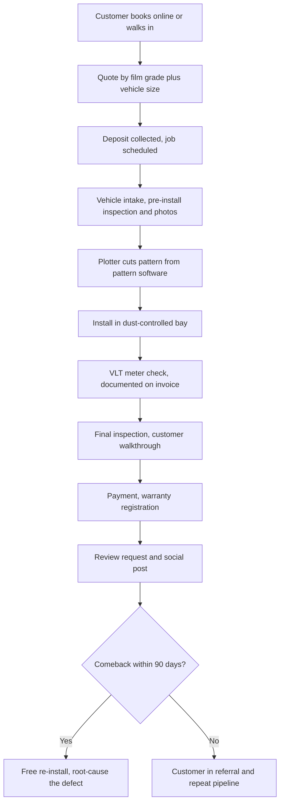

### Direct Answer

You start a window tinting business in 2027 by picking one of four operating formats (mobile-only van, single fixed bay, multi-bay retail shop with PPF crossover, or national franchise), securing dealer agreements with major film manufacturers, building a dust-controlled install environment, and mastering the one variable that breaks new shops faster than any other — state-specific Visible Light Transmission (VLT) law compliance. Plan on $8K-$28K to launch a lean mobile or single-bay operation and $45K-$120K for a multi-bay retail shop; mature single-shop operators net $120K-$340K solo and $400K-$900K with two to three bays. The hard part is never the film cost, the plotter, or the licensing — it is install quality discipline (bubbles, edges, dust, lifting film) and hitting the exact VLT limits your state writes into law, because a wrongly tinted vehicle generates inspection failures, traffic stops, comebacks, and refund liability.

> **TLDR**
> - **Window tinting is three businesses sharing one set of tools:** automotive tint ($175-$1,200/vehicle), residential film ($8-$22/sqft installed), and commercial flat-glass ($4-$18/sqft). Small shops run 60-75% automotive.
> - **Capital is low, skill is high.** $8K-$28K starts a mobile or single-bay shop; $45K-$120K builds a multi-bay retail location. The scarce input is an installer who can lay film clean.
> - **VLT law is the category's defining hazard.** Every state sets distinct windshield / front-side / rear-side / back-glass limits. Tint a car wrong and you own the comeback, the refund, and the one-star review.
> - **Margins are real but cost discipline matters.** Automotive installs run 65-78% gross; raw film stock has inflated 12-25% since 2022, so your dealer-agreement tier directly sets your margin.
> - **EVs are the structural tailwind.** Tesla (TSLA), Rivian (RIVN), and Ford (F) EV owners retrofit ceramic film for cabin-heat control at 35-55% attach rates in EV-heavy metros.
> - **PPF crossover is the margin upgrade.** Paint Protection Film installs run $1,500-$8,000/vehicle — 2x-4x the labor of tint but 3-5x the revenue.
> - **Counter-case:** in saturated metros with 40+ established shops, a price-war race to $99 full-car tint can trap you below break-even — geography and positioning decide viability more than effort.

---

## Part 1 — Foundations: Market, Film, and the Law

### 1.1 What a window tinting business actually is in 2027

A window tinting business installs polyester and polymer film onto vehicle glass, residential windows, and commercial flat glass to deliver UV rejection (typically 99%+), heat rejection (35-78% Total Solar Energy Rejected depending on film grade), glare and privacy control, and aesthetic darkening. It is a **specialty appearance-services operation**, and in 2027 it spans three service lines that share equipment but diverge sharply on customer acquisition, pricing, and labor intensity.

**Automotive tint** is the volume bread-and-butter: $175-$1,200 per vehicle, a 60-90 minute install for a full car, and the line that produces 60-75% of a typical small shop's revenue. It is a same-day, walk-in-friendly service with a fast cash cycle, and it is the line that builds a shop's review base and local reputation. **Residential window film** is high-ticket and low-frequency: $8-$22 per square foot installed (spectrally selective film reaches $14-$28/sqft), a one-to-three-day job on a typical 2,500-4,500 sqft home, contributing 12-25% of revenue. Residential work is sold on energy savings, glare reduction, fade protection, and privacy rather than aesthetics. **Commercial flat-glass** is contractor-relationship-driven: $4-$18 per square foot installed for solar-control or security film, jobs running one to four weeks on office buildings, hotels, schools, and hospitals, contributing 5-20% of small-shop revenue.

Increasingly, the fourth line — **Paint Protection Film (PPF) crossover** — is where ambitious shops capture margin. PPF installs run $1,500-$8,000 per vehicle, demanding two-to-four times the labor of a tint job but generating three-to-five times the revenue. The PPF playbook is detailed in section 3.3.

The reason these four lines belong under one roof is shared infrastructure. All four require a dust-controlled environment, a cutting plotter, pattern software, squeegee and heat-shaping skill, and an installer who can lay film without trapping contamination. What differs is the *go-to-market motion*: automotive tint is found through local search and reviews, residential film through home-service marketing and referrals, commercial flat-glass through contractor and facilities relationships, and PPF through the enthusiast and luxury-vehicle community. A new operator should start with the line that matches their market and skill, then add lines as the install team and reputation mature — not try to launch all four at once.

### 1.2 Market size and the 2027 demand reality

The total US window film market — automotive, residential, and commercial combined — is roughly **$1.4B-$1.8B in 2025-2026** per IBISWorld, the Freedonia Group, and International Window Film Association (IWFA) trade estimates. Automotive tint represents roughly 52-60% of installer-side revenue, residential film 18-25%, and commercial flat-glass 20-28%. The category is deeply fragmented: an estimated **18,000-26,000 window tint operators** in the US, heavily skewed toward single-shop and single-van operators, with fewer than 200 operators above the $1.5M annual revenue threshold that defines a true multi-bay retail business.

That fragmentation is the entrant's opportunity. Most metros of 500K+ population are served by only 4-12 small operators, and the leading operator in a typical market holds just 8-15% share. There is no dominant national consumer brand the way there is in oil changes or quick-lube — which means a disciplined new shop competes on quality, reviews, and relationships rather than against an entrenched giant. The flip side, covered in the counter-case, is that fragmentation also means low barriers for the *next* entrant, so a shop's moat has to be built from reputation and relationships, not protected by structure.

The honest 2027 demand picture is genuinely favorable on the automotive side, for several structural reasons:

- **EV adoption drives a heat-retrofit market.** Tesla (TSLA) Model Y and Model 3, Rivian (RIVN) R1S and R1T, Ford (F) F-150 Lightning and Mustang Mach-E, Hyundai Ioniq, Kia EV6, and Lucid (LCID) Air all carry large glass areas — panoramic roofs and expansive windshields — that load the cabin with solar heat and tax the battery through HVAC draw. Stock EV glass struggles with that thermal load, so ceramic film attach rates run 35-55% in EV-heavy markets.
- **The leased-vehicle return cycle feeds a wholesale pipeline.** Three-year leases on premium SUVs from BMW, Mercedes-Benz, Audi, and Lexus create a steady stream of tint work through used-car lots and dealer prep departments, often at $85-$185 per vehicle wholesale, 25-40 vehicles per dealer per month.
- **Social proof made tint a near-default upgrade.** Tesla-owner Facebook groups, TikTok before-and-after reels, and Instagram detail-shop creator content have turned aesthetic tint into a standard purchase for the 18-34 demographic.
- **UV-health awareness shifted older buyers.** Dermatology campaigns about driver-side UV exposure have repositioned tint as a health intervention for an older demographic, not just a styling choice.

Residential demand is buoyed by utility-rebate programs for solar-control film in California, Texas, Florida, and Arizona, plus sustained work-from-home glare-reduction demand. Commercial flat-glass demand has skewed security-film-heavy in K-12 schools, healthcare facilities, and federal buildings following active-shooter-response procurement cycles from 2018-2024, supported by federal and state safety-grant programs.

| Service line | Price range | Install time | Share of small-shop revenue | Gross margin |
|---|---|---|---|---|
| Automotive tint (full vehicle) | $175-$1,200 | 60-90 min | 60-75% | 65-78% |
| Residential window film | $8-$28/sqft | 1-3 days | 12-25% | 45-60% |
| Commercial flat-glass | $4-$18/sqft | 1-4 weeks | 5-20% | 35-55% |
| PPF crossover | $1,500-$8,000 | 4-12 hrs | 0-30% (rising) | 40-58% |

Useful named benchmarks for an operator sizing the competitive landscape: **Tint World** runs roughly 150 franchise locations and is the largest US window tint franchise; **Sun Stoppers** runs roughly 80 locations concentrated in the Southeast; regional names like **Solar Concepts**, **MetroTint**, and **NW Tinting** illustrate the strong-regional-operator profile. None of these is a national consumer monopoly — which is precisely why the category remains open to a well-run independent.

### 1.3 Film types, brands, and dealer agreements

Film grade is the single biggest driver of both price and margin, and the film catalog a shop carries determines its customer-acquisition wedge — whether it competes for the price shopper, the ceramic buyer, or the Tesla owner. The market sorts into four core tiers.

| Film type | Heat rejection (TSER) | Signal interference | Retail price (sedan) | Lifespan |
|---|---|---|---|---|
| Dyed (entry-level) | 35-45% | None | $135-$225 | 2-5 yrs before fade |
| Metallized / hybrid (mid-tier) | 45-55% | Yes — blocks cell / GPS | $185-$285 | 8-12 yrs |
| Carbon (mid-tier) | 45-55% | None | $225-$385 | 10-15 yrs |
| Ceramic / nano-ceramic (premium) | 55-78% | None | $325-$850 | 12-25+ yrs |

**Dyed film** absorbs light in a dye layer; it is cheap, fades over a few years, and carries no real heat-rejection claim — it is the price-shopper product. **Metallized film** uses a reflective metal layer that performs well thermally but interferes with GPS, cell, and radio signal, which makes it a poor fit for modern connected vehicles. **Carbon film** delivers a stable matte color and a long life with no signal interference. **Ceramic and nano-ceramic film** sit at the top — ceramic nanoparticles deliver the highest heat rejection (50-78% TSER on the best multi-layer SKUs), do not fade, and do not block signal. Ceramic is the EV-buyer product, and it carries the best margin.

The film-manufacturer ecosystem is dominated by a recognizable set of names a new operator must understand. **3M (MMM)** is the historical category leader; its Crystalline Series is the spectrally-selective benchmark widely marketed to Tesla and luxury-EV customers. **SunTek** and **LLumar** are both **Eastman Chemical (EMN)** brands and together represent the two largest US automotive tint brands by installer count, with a combined dealer footprint in the thousands of North American locations. **Solar Gard** is owned by Saint-Gobain and carries a strong commercial and security-film book. **Madico**, owned by Lintec, leads the security-film category for school procurement with its Aegis line. **Avery Dennison (AVY)** runs its NR Pro nano-ceramic line and owns the Hanita commercial-film business. On the PPF side, **XPEL (XPEL)** is the publicly traded pure-play and the dominant US brand, with **STEK** (Dynoshield) a fast-growing challenger. Value and architectural brands like **GeoShield**, **Solyx**, and **Garware** round out the field.

**Dealer-agreement mechanics** are where margin is won or lost. Virtually every major brand requires installer-certification training (a 2-5 day course, $500-$2,500 per installer), a minimum initial stock order ($3K-$15K depending on brand tier), an annual minimum purchase commitment to maintain dealer status ($8K-$45K typical), and marketing co-op participation. Dealer status tiers as **entry-level → Authorized Dealer → Elite/Pro Dealer**, with higher tiers unlocking better pricing, co-op marketing dollars, lifetime warranty registration, territory protection, and a listing on the manufacturer's dealer locator. The smart new operator carries **two to three brand lines simultaneously** — one premium (3M Crystalline or LLumar IRX), one volume-mid (SunTek CIR or LLumar CTX), and one entry-tier dyed line — to cover the full pricing waterfall without leaving margin on the table or turning away a budget customer. Industry credentialing also comes from the **IWFA** and adjacent bodies like **AIMCAL**; carrying IWFA-accredited installers is a credibility marker that matters for commercial bids.

### 1.4 State VLT laws and legal compliance

This is the section every new operator underweights and every failed operator wishes they had read twice. **Visible Light Transmission (VLT)** is the percentage of visible light a window allows through after film is applied — a 5% film blocks 95% of light, a 70% film blocks 30%. Every US state writes its own distinct VLT limits, separately, for the **windshield**, **front side windows**, **rear side windows**, and **back glass**. There is no national standard, and the state-to-state inconsistency is dramatic.

| State | Windshield | Front side | Rear side | Back glass | Medical exemption |
|---|---|---|---|---|---|
| California | Top 4 inches (AS-1) | 70% min | Any | Any | Yes — DMV REG 256 |
| Florida | Top 4 inches (AS-1) | 28% min | 15% min | 15% min | Yes — DHSMV |
| Texas | Top 4 inches (AS-1) | 25% min | Any | Any | Yes — DPS |
| New York | Top 6 inches | 70% min | 70% min | 70% min | Yes — NY DMV |
| Illinois | Top 6 inches | 35% min | 35% min | 35% min | Yes — IL SOS |
| Georgia | Top 6 inches | 32% min | 32% min | 32% min | Yes — GA DDS |

The compliance hazard is concrete and expensive. A vehicle tinted below the legal front-side limit will fail state safety inspection, draw traffic stops and fix-it tickets, and — critically for the business — generate a **comeback**: the shop must strip and re-tint the car at its own cost, refund or discount the customer, and absorb the reputational hit. A shop that does not keep a current, state-specific VLT reference at the point of sale, and that does not own a calibrated VLT meter to verify finished installs, will accumulate this liability quietly until reviews and chargebacks compound. Medical-exemption paperwork exists in many states for darker front tint, but the burden of verifying that documentation sits with the shop, not the customer.

The disciplined practice is a short checklist applied to every car: keep a printed and digital VLT chart for the home state and every neighboring state customers commute through; have the customer confirm in writing the darkness they want and acknowledge the legal limit; meter every finished vehicle with a calibrated VLT meter before handing back the keys; and document the reading on the invoice. The cost of this discipline is a few minutes per car. The cost of skipping it is the single most expensive recurring failure in the trade — and one that compounds, because a tint shop's reputation lives entirely in its public reviews.

### 1.5 Business structure, licensing, and insurance

Most window tint shops form as an LLC for liability separation between the business and the owner's personal assets. Beyond standard business registration, the licensing footprint is modest: a general business license, a sales-tax permit (film and installed services are taxable in most states), and — for fixed locations — local zoning and occupancy approval for an automotive-services use. A handful of states require an automotive-repair or motor-vehicle-service registration; this should be checked with the state's consumer-affairs or motor-vehicle agency before signing a lease.

Insurance is non-negotiable and should include several distinct coverages. **General liability** covers third-party injury and property damage. **Garage-keepers coverage** covers damage to a customer's vehicle while it is in the shop's care — this is the line new operators forget, and a single dropped heat gun, scratched panel, or trim-clip break can exceed a year of premiums. **Commercial property** protects a fixed shop's equipment and build-out; **commercial auto** covers a mobile van; and **workers' compensation** is required once the shop hires employees. For commercial flat-glass work, larger jobs may also require a surety bond. The total insurance package for a small fixed shop is a manageable monthly line item, and it is the difference between a survivable accident and a business-ending one. The capital and funding picture is laid out in section 4.4.

---

## Part 2 — Build-Out and Capital

### 2.1 The four operating formats and what each costs

The format decision drives everything downstream — capital need, customer-acquisition model, and the ceiling on revenue. It is the first and most consequential choice a new operator makes.

| Format | Startup capital | Revenue ceiling | Best for |
|---|---|---|---|
| Mobile-only van | $8K-$18K | $90K-$180K | Testing a market; low fixed cost |
| Single fixed bay | $18K-$45K | $180K-$340K | Owner-operator committed full-time |
| Multi-bay retail (+PPF) | $45K-$120K | $400K-$900K | Crew of 2-4, PPF crossover, dealer accounts |
| National franchise | $90K-$250K+ | $350K-$1.2M | Buyers who want a brand and a playbook |

The **mobile-only van** has the lowest barrier and lets an operator validate demand before signing a lease, but it caps quality — dust control in a customer's driveway is far harder than in a sealed bay, weather kills install days, and the format struggles to support PPF or commercial work. It is best understood as a market-test or a low-overhead bridge, not an end state. The **single fixed bay** is the natural owner-operator format: a one-bay shop with a controlled environment, a plotter, and an owner who tints. The **multi-bay retail shop** is where the real money sits — two to three bays, a crew of three to five, and the room to add PPF crossover and run dealer accounts. The **franchise** route trades a franchise fee and an ongoing royalty (a percentage of revenue) for brand recognition, a proven build-out specification, supplier relationships, and a marketing playbook.

A practical sequencing pattern many successful operators follow: start mobile or single-bay to prove the market and build the review base, then reinvest into a multi-bay location once the demand is demonstrated and an installer can be hired. Jumping straight to a multi-bay build-out without a proven local demand signal is the most capital-intensive way to learn the market is saturated. The franchise-versus-independent decision is examined in detail in section 4.2.

The format choice also dictates the lease decision. A mobile operator has no lease and effectively no rent — the trade is a low-overhead model that cannot deliver consistent clean-room quality. A fixed bay needs roughly 800-1,500 square feet with a roll-up door, adequate ceiling height for an SUV with a roof rack, and zoning that permits automotive use; a multi-bay shop wants 2,500-5,000 square feet with at least two pull-through bays plus a customer waiting area and a film-storage room kept at stable temperature. Lease cost varies enormously by metro, but a useful planning rule is that occupancy cost — rent, utilities, and property insurance — should run no more than 8-12% of revenue at maturity; a shop signing a lease that consumes 20% of projected revenue has built a structural margin problem into the business before the first car is tinted. Negotiate a lease term that matches the format ambition: a first-time single-bay operator is better served by a shorter term with renewal options than by a long lock-in on an unproven concept.

A subtle but important format consideration is the ceiling each one places on the *type* of customer a shop can serve. A mobile operator can credibly serve dyed and carbon tint to price-conscious customers and fleet accounts, but the EV owner spending $899 on a ceramic Model Y package wants to hand the keys over at a real shop with a clean waiting area and a portfolio on the wall — the trust signal of a physical location is part of what justifies the premium price. This is why a shop targeting the high-margin ceramic and PPF segments almost always needs a fixed location: the format is not just a cost decision, it is a positioning decision that determines which half of the market the shop can realistically win.

### 2.2 Equipment, tools, and clean-room build-out

The tooling list for a window tint shop is short and the unit costs are low — the expensive part is the *space* and its dust control, not the hand tools.

| Item | Cost range | Purpose |
|---|---|---|
| Cutting plotter (Graphtec FC9000, Roland GS-24, Summa S2D) | $1,800-$6,000 | Computer-cut film patterns |
| Heat guns / steamers | $150-$600 | Shrinking film to compound glass curves |
| Squeegees, blades, hard cards | $200-$500 | The installer's core hand tools |
| VLT meter (calibrated) | $80-$300 | Verifying legal compliance |
| Clean-room booth / bay sealing | $3,000-$25,000 | Dust and lint control |
| Lighting (high-CRI install lighting) | $500-$2,500 | Spotting bubbles and contamination |
| Slip-solution sprayers, lint-free supplies | $150-$400 | Consumables |
| Film inventory (opening stock) | $2,000-$8,000 | Dealer-agreement minimum buy |

The **clean-room build-out** is the line that separates a survivor from a failure, and it deserves more attention than any other capital item. Film install is a contamination-sensitive process: a single piece of lint, a hair, or a speck of dust trapped under the film produces a permanent visible defect, and a visible defect produces a comeback. The controllable variables are environmental — sealed bays that keep outside air and dust out, positive-pressure filtered air where budget allows, high-CRI lighting positioned so an installer can spot contamination before the film is locked down, controlled humidity, and a strict no-traffic rule that keeps people from walking through the install zone and stirring up dust. A shop that invests here will deliver clean work repeatedly; a shop that tints in an open garage with a roll-up door will spend years fighting bubbles, edges, and lifting film, and its review profile will reflect it.

The plotter and pattern software effectively replace the old skill of free-hand cutting film on the glass with a razor — a practice that risks scratching paint and rubber trim. The plotter cuts the exact film pattern from a digital database; the installer's job becomes shaping and applying it cleanly. This shifts the skill requirement but does not eliminate it: heat-shrinking film to a compound-curved back window is still a craft, and so is a flawless edge tuck.

When choosing a plotter, the relevant variables are cutting width, speed, and software compatibility. A desktop plotter like the Roland GS-24 handles roll widths sufficient for most automotive film and is the natural choice for a single-bay shop on a budget; a higher-throughput plotter like the Graphtec FC9000 or Summa S2D cuts faster and handles wider material, which matters once a multi-bay shop is running enough volume that plotter time becomes a bottleneck. The plotter is one of the few pieces of equipment worth financing rather than buying outright, because it is a discrete asset that secures its own loan and holds resale value. A common and avoidable mistake is buying a plotter that is not compatible with the pattern-software platform the shop intends to use — the two must be matched, and that should be confirmed before either purchase.

Beyond the core list, a fixed shop needs the mundane infrastructure of any service business: a customer waiting area that reinforces the quality positioning, secure overnight parking for vehicles left for PPF or multi-day jobs, climate control that keeps both installers and film stock in a stable range, and adequate electrical capacity for heat guns, lighting, and the plotter running simultaneously. None of this is expensive individually, but it should be budgeted, because a shop that runs out of build-out capital before the waiting area is finished projects exactly the wrong signal to the premium customer it needs.

### 2.3 Software, pattern systems, and POS

Modern tint shops do not cut film freehand from a roll for most jobs. **Pattern-software subscriptions** store pre-measured, computer-cut film patterns for tens of thousands of vehicle makes, models, and years. The software feeds the plotter, the plotter cuts the pattern, and the installer applies it. This cuts material waste, speeds the install meaningfully, and reduces the skill needed to achieve clean edges — which in turn shortens the apprentice ramp and lifts throughput. Pattern software typically runs $100-$400 per month.

On the front office, a tint shop needs scheduling and point-of-sale software, ideally one platform that handles online booking, deposit collection, customer-history records for warranty registration, and automated review requests. Online booking is not optional in 2027: the 18-34 demographic that drives aesthetic tint demand books on a phone screen, not a phone call, and a shop without online scheduling loses bookings to one that has it. POS and scheduling software runs another $50-$200 per month. The combined software stack is a small line item — well under $1,000 a month — that pays for itself in reduced film waste, higher booking conversion, and the steady review flow that drives the retail engine of section 4.1.

### 2.4 Installer training, hiring, and wage structure

The scarce, decisive input in this business is an installer who can lay film clean and fast. There is no shortcut around this. The apprentice ladder takes **6-18 months** to produce a journeyman-quality installer, and experienced film installers command **$25-$45 per hour and up** in 2025-2026 markets — a wage level consistent with Bureau of Labor Statistics data for adjacent skilled-trade occupations and rising with the broader skilled-labor scarcity.

| Role | Experience | Typical pay structure | 2026 annual range |
|---|---|---|---|
| Apprentice / trainee | 0-12 months | Hourly, $15-$20/hr | $31K-$42K |
| Journeyman installer | 1-3 years | Hourly + per-car bonus or commission | $52K-$80K |
| Lead / master installer | 3+ years | Commission or salary + commission | $75K-$120K |
| Owner-operator installer | Owner | Profit | $120K-$340K (see 4.1) |

Most shops pay journeyman and lead installers on a **commission or per-vehicle structure** — a flat dollar amount per car or a percentage of the ticket — because it aligns installer pay with throughput, rewards speed and quality, and protects the shop on slow days when a salaried installer would still draw full pay. A common structure pays a base hourly rate plus a per-vehicle bonus that scales with the film tier installed, which nudges the installer to up-sell ceramic without compromising on quality.

The retention problem is real and is the second most common way a promising shop stalls. A trained installer who leaves takes both raw capacity and tribal knowledge — the feel for which vehicles run difficult back glass, the local-customer relationships, the muscle memory that makes a clean install fast — and a competitor will gladly hire them. Shops that retain installers do it with above-market commission, a genuine ownership-path conversation for the best performers, climate-controlled bays that make the job physically tolerable in summer, and a steady job flow that lets a fast installer earn well rather than sitting idle. The owner who treats installer retention as an afterthought is, in effect, training talent for the competition.

Hiring an experienced installer outright is the fast path to capacity, but it is a seller's market — a genuinely skilled installer can choose where to work, so a shop competing for that talent must offer not just pay but a clean environment, modern tooling, and a steady pipeline. The alternative, growing an apprentice in-house, costs less per hour but consumes 6-18 months and a meaningful amount of the owner's or lead installer's time, and not every apprentice makes it to journeyman quality. The realistic plan for most shops is a blend: hire one experienced installer to carry capacity and quality from day one, and bring on an apprentice underneath them whose ramp is partly funded by the volume the experienced installer generates. The shop that tries to run entirely on apprentices will produce comebacks; the shop that tries to run entirely on expensive senior installers will struggle to make the labor math work on entry-tier dyed-film jobs.

There is also a quality-control dimension to staffing that the wage table does not capture. Every installer's work should be inspected before the customer sees the car — ideally by someone other than the person who did the install, because an installer's eye adapts to their own work. In a single-bay owner-operator shop the owner is both installer and inspector, which is workable but imperfect. In a multi-bay shop the lead installer should own final inspection, and the per-vehicle bonus structure should be designed so that a comeback traced to a specific installer carries a consequence — not a punitive one, but enough that quality and speed are weighted together rather than speed alone. A bonus structure that rewards only throughput will, predictably, produce a shop that is fast and full of comebacks.

---

## Part 3 — Operations

### 3.1 Service mix, pricing, and margin discipline

A window tint shop's profit comes from holding three things at once: a defensible price, a controlled material cost, and a fast clean install. Lose any one and the model breaks.

Pricing should be tiered by film grade and vehicle size, never quoted as a single number. A two-door coupe takes far less film and time than a three-row SUV; a Tesla Model Y with its panoramic glass roof takes more than either. A shop that advertises "$150 full car" with no tiering will lose money on every large vehicle, train customers to anchor on the floor price, and find it nearly impossible to up-sell ceramic afterward. The pricing menu should make the film-tier and vehicle-size variables explicit and visible.

| Vehicle / job | Dyed | Carbon | Ceramic |
|---|---|---|---|
| 2-door coupe | $129 | $279 | $399 |
| Standard sedan | $159 | $329 | $479 |
| SUV / crossover | $199 | $379 | $549 |
| 3-row SUV / truck | $229 | $429 | $649 |
| Tesla Model Y (incl. roof) | $279 | $549 | $899 |

**Material cost discipline** is the lever new operators most often ignore. Raw film stock has inflated **12-25% since 2022** per Avery Dennison and Eastman supplier letters, driven by polymer-input and energy costs. A shop's dealer-agreement tier directly sets its film cost, which directly sets its gross margin: an Authorized Dealer paying 20% more for the same film than an Elite Dealer surrenders real margin on every single job, all year. The disciplined operator computes film cost per vehicle by size class, prices each cell of the menu to a target gross margin (65-78% on automotive), and revisits pricing whenever supplier cost letters arrive — rather than holding a posted price for three years while film cost climbs quietly underneath it and the margin erodes.

A worked example shows why mix matters. Consider a single-bay shop averaging 8 vehicles a day, 22 working days a month. If the mix is 60% dyed, 30% carbon, 10% ceramic at the sedan prices above, the average ticket is roughly $235 and monthly revenue is about $41,000. Shift that mix to 30% dyed, 45% carbon, 25% ceramic — achievable with disciplined up-selling and an EV-heavy market — and the average ticket rises to roughly $340, lifting monthly revenue past $59,000 on the *same* vehicle count and the *same* bay. The shop did not work harder; it sold a better mix. That is the entire game in automotive tint margin discipline: throughput is finite, so the average ticket is the variable that decides profitability.

### 3.2 Vehicle-type playbook: sedans, SUVs, and EVs

Different vehicles are different jobs, and pricing and scheduling should reflect that reality rather than fight it. **Sedans and coupes** are the fast, predictable work — relatively flat side glass, modest film usage, and a clean 45-75 minute install for an experienced hand. They are the volume backbone and the easiest jobs to schedule tightly. **SUVs and crossovers** add film, add time, and add the complexity of larger curved back glass that demands more heat-shrinking skill. **Pickup trucks** vary widely by cab configuration and should be quoted by cab type.

**EVs are their own category and the growth story.** Tesla (TSLA), Rivian (RIVN), Lucid (LCID), and Ford (F) electric vehicles ship with large glass areas — panoramic roofs, expansive single-pane windshields — that load the cabin with solar heat and tax the battery through HVAC draw, which directly costs the owner driving range on a hot day. EV owners therefore retrofit **ceramic film specifically for heat rejection**, not merely for looks, and they are willing to pay the ceramic premium because cabin comfort and range are tangible, measurable benefits. A glass-roof tint on a Model Y or Model 3 is a distinct, separately priced add-on service ($150-$450 on its own) and a high-margin one because the roof panel is a single large piece of glass with no door-frame complexity.

Shops in EV-dense metros — California, Texas, Florida, Arizona, the Pacific Northwest — should build their marketing, their pricing menu, and their installer training around the EV ceramic retrofit, because attach rates of 35-55% turn EVs into the most profitable vehicle class on the schedule. A shop that positions itself as "the Tesla tint specialist" in an EV-heavy suburb, with a portfolio of clean Model Y installs and roof-tint pricing front and center, captures the highest-margin segment of the market and a customer who chose on quality rather than price.

### 3.3 PPF (Paint Protection Film) crossover

Paint Protection Film is a clear, often self-healing urethane film applied to a vehicle's painted surfaces to protect against rock chips, road debris, bug etching, and minor abrasion. It is the natural margin upgrade for a tint shop because it shares the core install discipline — a clean environment, pattern software, squeegee skill, and heat-shaping — while commanding **$1,500-$8,000 per vehicle**.

| PPF package | Coverage | Price band | Labor |
|---|---|---|---|
| Partial front | Bumper, partial hood, mirrors | $800-$1,800 | 3-5 hrs |
| Full front | Full hood, fenders, bumper, mirrors | $1,800-$3,500 | 6-9 hrs |
| Full vehicle | Every painted panel | $5,000-$8,000+ | 2-4 days |
| Track / specialty | Custom, often satin finish | $6,000-$12,000 | 3-5 days |

The crossover economics are compelling. PPF demands two-to-four times the labor of a tint job but generates three-to-five times the revenue, and the customer base overlaps heavily — the same EV owners, enthusiasts, and luxury-vehicle buyers who tint their cars are the buyers who protect the paint. A shop that has already earned a Tesla owner's trust on a ceramic tint job is well positioned to sell that owner a full-front PPF package. PPF revenue can lift a multi-bay shop's average ticket dramatically and is a major driver of the higher exit multiples discussed in section 4.3.

The catch is skill, and it is a real catch. PPF install is materially harder than tint: the film is thicker, less forgiving, and must be stretched and conformed to compound body curves without lifting, stretching marks, or visible seams. Bad PPF is glaringly obvious on a painted surface in a way that a small tint flaw on dark glass is not, and a botched PPF job is expensive and slow to redo. A shop should not bolt PPF onto the menu until it has an installer who can execute it cleanly, which typically means dedicated manufacturer training from a brand like XPEL (XPEL) or STEK and a deliberate practice period. Added correctly and at the right time, PPF can double a shop's average ticket; added prematurely to an underprepared install team, it generates the most expensive comebacks in the trade.

### 3.4 Commercial flat-glass operations

Commercial flat-glass — solar-control and security film on office buildings, hotels, schools, hospitals, and government facilities — is a relationship-and-bid business, not a walk-in business. Jobs run **$1,500-$25,000 each** at 35-55% gross margin, and they arrive through general contractors, facilities managers, glaziers, and architects rather than through Google searches and Instagram reels.

The work splits into two demand streams. **Solar-control film** cuts a building's cooling load and occupant glare, and is frequently tied to utility rebate programs and corporate energy-efficiency retrofits — a sale made on a measurable return on investment. **Security film** is anti-shatter and blast-mitigation film, driven by school and healthcare safety procurement and supported by federal and state safety-grant programs; this is a sale made on safety and code rather than economics. Decorative and privacy film — frosted, etched, and branded-logo architectural film — is a useful add-on revenue line for a shop already on a commercial site.

Commercial work has a different operational profile from automotive: slower payment cycles with progress billing, the need for liability coverage and sometimes bonding on larger jobs, the ability to work safely at height, and the discipline to perform on a general contractor's schedule rather than the shop's own. It is a strong diversifier for a shop that has built relationships in the local commercial-construction ecosystem, because it smooths the seasonality and economic cyclicality of automotive demand. It is not, however, a starting point — most shops add commercial only after the automotive base is stable, because the sales cycle is long, the bidding skill is genuinely different from retail quoting, and a new shop has neither the relationships nor the cash cushion to absorb a slow-paying first job.

Bidding commercial work is a discipline of its own. A commercial estimate has to account for square footage measured accurately from the field, the difficulty of access (ground-floor storefront glass versus a tenth-floor curtain wall), the cost of any required scaffolding or lift equipment, the labor hours at a realistic per-pane install rate, the film cost at the commercial-grade tier, and a contingency for the surprises that every old building hides. A shop that bids commercial work by simply extending its automotive per-square-foot logic will either price itself out of every job or, worse, win a job and lose money on it. The disciplined entry into commercial is to take small, accessible jobs first — a single-story office, a retail storefront — build a track record and a reference, and only then bid the larger, height-access, longer-cycle work. Residential film occupies a useful middle ground here: it is sold to homeowners rather than contractors, the jobs are smaller and the payment faster than commercial, and it lets a shop build flat-glass install skill and a portfolio before taking on true commercial bids.

---

## Part 4 — Growth, Scale, and Exit

### 4.1 Marketing, lead generation, and dealer partnerships

A window tint shop has two distinct customer-acquisition engines, and the strongest shops run both deliberately.

**The retail engine** is local-search and social-proof driven. A complete, photo-rich Google Business Profile with a steady flow of recent five-star reviews is the single highest-leverage marketing asset a shop owns — tint customers search "window tint near me," and they choose on review count, review recency, review rating, and before-and-after photos. A shop should request a review from every satisfied customer at pickup, ideally automated through the POS system. Instagram and TikTok reels of clean installs — especially on recognizable vehicles like Teslas and trucks — function simultaneously as portfolio, advertising, and proof of craft for the 18-34 demographic. The retail engine is slow to build, because review and follower counts compound over months, but it is durable and nearly free once established, and it is the moat in a fragmented category with no national brand.

**The wholesale engine** is the multiplier and the stabilizer. Dealer partnerships — standing agreements with new-car and used-car dealerships to tint their inventory or their sold vehicles — provide volume, predictable batch scheduling, and a pipeline that does not depend on consumer marketing at all. Wholesale tint is priced lower per car ($85-$185 typical) but arrives in batches of 25-40 vehicles a month per dealer and fills the slow weekday mornings when retail walk-in traffic is thin. A shop that lands two or three dealership accounts has a revenue floor underneath its retail business — a base of guaranteed throughput that covers fixed costs while the higher-margin retail and PPF work delivers the profit. Used-car lots in particular tint inventory to help it photograph and sell faster, and the leased-vehicle return cycle keeps that pipeline replenished.

| Channel | Cost | Speed to results | Durability |
|---|---|---|---|
| Google Business Profile + reviews | Low | Slow (months) | Very high |
| Instagram / TikTok install reels | Low (time) | Medium | High |
| Dealer / wholesale accounts | Low (sales effort) | Medium | Very high |
| Paid local search ads | Medium-high | Fast | Low (stops when paused) |
| Referral / loyalty program | Low | Slow | High |

Paid local search ads can bridge the gap while the organic review base builds, but they should be understood as a temporary accelerant, not a foundation — the moment the spend stops, the leads stop. The durable engines are reviews and dealer relationships, and a new shop should treat the first year as an investment in both.

### 4.2 Scale milestones and franchise vs. independent

Scaling a tint shop follows a recognizable ladder, and each rung has a distinct bottleneck. **Solo owner-operator** is one set of hands, one bay, $120K-$340K in owner earnings, and a hard ceiling set by how many cars one person can physically tint in a day — typically 4-12 depending on vehicle mix and film tier. **First hire** is the move that breaks that ceiling: adding a journeyman installer roughly doubles capacity, but it introduces the retention and quality-supervision challenge of section 2.4 and the payroll obligation that comes with it. **Multi-bay** — two to three bays and a crew of three to five — is where revenue reaches $400K-$900K, especially once PPF crossover is layered on; this is the rung where the owner shifts from primarily tinting cars to primarily running a shop. **Multi-location** is a genuinely different business: it requires systematizing training, quality control, scheduling, and inventory so that a second location performs to standard without the owner physically present, and an owner who has not built those systems will find the second shop drags down the first.

The **franchise-versus-independent** decision turns on what the operator values and what they bring. A franchise — Tint World and comparable brands — supplies a recognized name, a proven build-out specification, established supplier relationships and pricing, training systems, and a marketing playbook, in exchange for an upfront franchise fee and an ongoing royalty that is typically a percentage of revenue. An independent keeps every dollar of margin and controls every decision, but must build brand, supplier relationships, systems, and reputation from scratch.

The honest framing is a trade between variance and ceiling. A franchise *lowers the variance* of outcomes and accelerates the early ramp — the playbook and brand reduce the chance of an early stumble — but the royalty permanently caps the upside. An independent *raises the ceiling* on profit for an operator willing to do the systems and brand-building work themselves, at the cost of a riskier, slower start. A first-time owner with no trade background and capital to spare often benefits from the franchise scaffolding. An experienced installer who already knows the craft and the local market usually keeps more, and builds a more valuable asset, by going independent.

### 4.3 Exit math and the roll-up landscape

A window tint shop is a sellable asset, and planning the exit from year one improves the eventual price. Small owner-operator shops typically trade at **1.5-2.8x SDE** (Seller's Discretionary Earnings — owner profit plus owner salary plus legitimate add-backs) per BizBuySell listing data; larger multi-bay shops with a non-owner-dependent crew, durable dealer accounts, and PPF revenue trade higher, at **2.5-4.0x SDE**; and platform-grade targets — five or more locations, a strong commercial flat-glass book, established PPF crossover — can reach **4.5-6.5x EBITDA**.

| Shop profile | Annual SDE / EBITDA | Typical multiple | Indicative value |
|---|---|---|---|
| Solo owner-operator | $120K-$200K SDE | 1.5-2.8x | $180K-$560K |
| Single bay + 1 employee | $180K-$300K SDE | 2.0-3.5x | $360K-$1.05M |
| Multi-bay + PPF + dealer accounts | $300K-$600K EBITDA | 3.0-4.5x | $900K-$2.7M |
| Multi-location platform | $600K+ EBITDA | 4.5-6.5x | $2.7M+ |

The value drivers a buyer pays a premium for are consistent and worth engineering toward from the start: revenue that is *not* dependent on the owner personally tinting cars; signed or durably relationship-anchored dealer accounts; a trained crew that will stay through an ownership transition; an established PPF revenue line; owned or favorably leased real estate; and clean, reconciled books. A shop where the owner is the lead installer and the customer relationships live in the owner's head is worth far less per dollar of earnings than a shop that runs without the owner present.

The roll-up landscape is real but still early. Automotive appearance-services consolidators and PPF-focused platforms — XPEL (XPEL) being the most visible PPF-anchored public company — have begun acquiring well-run multi-bay shops, and franchise systems acquire and convert strong independents. A shop deliberately built to be operator-independent is positioned for both a strategic sale to a consolidator and a sale to a financial buyer, and it commands the top of its multiple range either way.

The practical implication is that exit planning is not a year-five activity — it is a set of operating choices made from year one. The owner who documents standard operating procedures, who keeps the customer database in the POS system rather than in their own phone, who builds dealer relationships at the business level rather than as personal friendships, and who trains a lead installer capable of running the floor is, with each of those choices, raising the eventual sale multiple. Conversely, the owner who is the shop — the only installer who can handle a difficult car, the only person the dealer accounts will deal with, the only one who knows the pricing logic — has built a job, not an asset, and a job does not sell for a multiple of anything. The same earnings, presented as an operator-independent business with clean books and documented systems, can be worth two to three times what they are worth presented as an owner-dependent one.

### 4.4 Capital stack and funding

The opening capital need ranges widely by format — $8K-$28K for a mobile or single-bay launch, $45K-$120K for a multi-bay retail build-out — and the funding sources should match the size of the need.

| Source | Best for | Notes |
|---|---|---|
| Owner savings / bootstrapping | Mobile, single-bay | Most common; keeps full ownership |
| SBA microloan / 7(a) | Single-bay to multi-bay | Requires a plan; often collateral |
| Equipment financing | Plotter, clean-room booth | The asset itself secures the loan |
| Business line of credit | Film inventory cycles | Smooths the cost of opening stock |
| Franchise financing programs | Franchise route | Some franchisors arrange lending |

A lean mobile or single-bay launch can be self-funded by most committed operators, which is why the format is so accessible. A multi-bay retail build-out usually combines owner equity with an SBA loan and equipment financing for the plotter and clean-room booth — the equipment financing is attractive because the asset secures the loan, keeping the rate down and preserving the owner's cash. The disciplined approach, regardless of format, is to keep three to six months of operating expenses as a cash cushion: film inventory, rent, insurance, and payroll do not wait for the schedule to fill, and the first months of any new shop are spent building the review base and the dealer relationships that produce steady revenue. The most common funding mistake is over-leveraging a first location and then running out of runway in month four, just as the organic demand engine is starting to turn over.

### 4.5 Workflow and the install cash cycle

The cash cycle in automotive tint is fast and favorable — a deposit at booking, the balance collected at pickup, the job completed the same day — which is one of the model's quiet structural strengths versus trades that carry 30-90 day receivables. A tint shop converts labor and film into cash within hours, not weeks, which keeps working-capital needs low and makes the business resilient through slow patches. Commercial flat-glass inverts this picture, with progress billing across a multi-week job and slower contractor payment terms, which is precisely why a shop with meaningful commercial exposure needs the cash cushion described in section 4.4. The workflow above also embeds the two disciplines that protect a shop's reputation: the VLT meter check at step G, and the root-cause analysis on any comeback at step L — a comeback that is fixed but not diagnosed will simply happen again.

---

## Counter-Case: When a Tint Shop Is the Wrong Move

Window tinting reads as an attractive low-capital business, and for the right operator in the right market it genuinely is. But the model has real failure modes, and an honest assessment names them rather than glossing over them.

**The saturated-metro price war.** In large metros that already support 40-plus established tint shops, a race to the bottom on price is the default competitive dynamic. New entrants with no review base and no dealer accounts often try to buy their way in with $79-$99 full-car tint — a price that, after film cost, installer labor, rent, overhead, and the inevitable comebacks, sits at or below break-even. A shop that opens into this dynamic with no differentiated position — no ceramic specialization, no PPF crossover, no wholesale-only model, no genuinely under-served suburb — can work hard for two full years and never clear an owner-acceptable income. In this category, geography and positioning decide viability more than effort does.

**The skill bottleneck is real and personal.** This is not a business an owner can run from a laptop or a spreadsheet. Either the owner is a capable installer, or the owner is entirely dependent on hiring and retaining one — and a skilled installer who quits can halt a single-bay shop's revenue overnight. An owner who cannot tint and cannot retain installers does not have a business; they have a recurring payroll crisis.

**VLT liability compounds quietly.** A shop that is loose on state VLT compliance does not feel the cost immediately. It surfaces months later, all at once — inspection failures, traffic-stop complaints, comeback installs, refunds, chargebacks, and one-star reviews — and reputational damage in a review-driven local business is slow, expensive, and sometimes impossible to fully repair.

**Demand has weather and economic cycles.** Automotive tint is partly discretionary and partly seasonal: spring and summer carry the calendar, winter is genuinely slow in cold climates, and a recession trims the discretionary-upgrade dollar quickly. A shop with no wholesale floor and no commercial line feels every dip in full.

| Risk | Who it hits hardest | Mitigation |
|---|---|---|
| Saturated-metro price war | New entrants in big metros | Differentiate: ceramic / PPF / wholesale niche |
| Installer dependency | Non-installer owners | Owner learns the craft; commission + ownership path |
| VLT compliance liability | Shops without metering discipline | State VLT chart at POS, meter every car |
| Seasonal / cyclical demand | Single-line automotive shops | Add wholesale dealer accounts plus commercial |
| Film cost inflation | Low-tier dealer agreements | Climb to Elite Dealer tier; reprice on cost letters |

The honest verdict: a window tinting business rewards an operator who either brings the install craft or commits fully to mastering it, who picks a market that is not already saturated or carves a defensible niche within one, who treats VLT compliance as a non-negotiable discipline rather than an afterthought, and who builds a wholesale or commercial floor under the retail walk-in business. Where those conditions are met, the low capital requirement, the fast same-day cash cycle, the 65-78% automotive gross margins, and the structural EV tailwind make window tinting one of the more attractive specialty-service businesses to start in 2027. Where those conditions are not met, effort alone will not save it — and recognizing that before signing a lease is the most valuable diligence an aspiring owner can do.

---

## Related Pulse Entries

For operators researching adjacent specialty-service and automotive businesses, these Pulse library entries cover the closest comparables and crossover opportunities:

- **Vinyl wrap shop** (q9596) — the closest adjacent automotive-appearance business, sharing film-install skill, plotter equipment, and customer base; a natural service-line addition for a tint shop.
- **Auto wrap shop** (q2071) — color-change and commercial-fleet wrapping, another film-and-plotter business that overlaps a tint shop's tooling and clean-environment discipline.
- **Auto repair shop** (q9682) — the broader automotive-services model, useful for understanding garage-keepers insurance, bay economics, and dealer relationships.
- **Mobile car detailing** (q9583) — a low-capital automotive-appearance business that pairs well as a cross-referral partner or an added service line.
- **Mobile car wash** (q2074) — another low-barrier automotive-services format, instructive on mobile-operation economics versus a fixed location.
- **Mobile mechanic** (q9594) — a mobile automotive-services model that illustrates the trade-offs of van-based operations covered in section 2.1.
- **HVAC service business** (q9621) — a skilled-trade service business with comparable installer-retention and apprentice-ladder dynamics.
- **Pest control business** (q2139) — a recurring-revenue specialty-service business useful for contrasting one-time-install economics with subscription models.

---

## Sources and Industry References

1. IBISWorld — "Auto Window Tinting in the US" industry report, market size and operator counts.
2. International Window Film Association (IWFA) — industry statistics and installer-accreditation standards.
3. The Freedonia Group — US window film market demand study.
4. Eastman Chemical Company (EMN) — LLumar and SunTek brand materials and dealer-program documentation.
5. 3M Company (MMM) — automotive and architectural window film product and dealer literature, Crystalline Series.
6. Saint-Gobain / Solar Gard — solar-control and security film technical specifications.
7. Avery Dennison (AVY) — NR Pro film line and supplier cost-update letters.
8. XPEL, Inc. (XPEL) — Paint Protection Film product range and installer-certification program.
9. STEK USA — Dynoshield PPF and DYNOmatte product documentation.
10. Madico, Inc. (Lintec) — automotive and architectural film catalog, Aegis security film.
11. US Bureau of Labor Statistics — occupational wage data for skilled automotive-services trades.
12. California Vehicle Code section 26708 — windshield and side-window tint VLT limits.
13. Florida Statutes sections 316.2953-2956 — sunscreening-material requirements.
14. Texas Transportation Code section 547.613 — restrictions on window tinting.
15. New York Vehicle and Traffic Law section 375 — light-transmittance requirements.
16. Illinois Vehicle Code 625 ILCS 5/12-503 — window-tinting limits.
17. AIMCAL — Association of International Metallizers, Coaters and Laminators, film-industry standards.
18. Tint World — franchise disclosure materials and location count; Entrepreneur Franchise 500 ranking.
19. US Small Business Administration — 7(a) and microloan program terms for service businesses.
20. Graphtec America — FC9000 cutting plotter specifications.
21. Roland DGA — GS-24 desktop plotter documentation.
22. Summa — S-Class plotter technical specifications.
23. Tesla, Inc. (TSLA) — Model Y and Model 3 glass-roof specifications relevant to ceramic-tint retrofit demand.
24. Rivian Automotive (RIVN) — R1S and R1T glass-area specifications.
25. Lucid Group (LCID) — Air glass-canopy design relevant to heat-retrofit demand.
26. Ford Motor Company (F) — F-150 Lightning and Mustang Mach-E EV lineup data.
27. National Glass Association — flat-glass and security-film commercial install standards.
28. US Department of Energy — solar-control window film energy-savings and rebate-program guidance.
29. Insurance Information Institute — garage-keepers and commercial auto coverage explanations.
30. SEMA (Specialty Equipment Market Association) — automotive-aftermarket and appearance-services market data.
31. International Franchise Association — franchise-versus-independent comparative data.
32. BizBuySell — small-business transaction data and SDE-multiple benchmarks for automotive-services businesses.
33. American Society for Testing and Materials (ASTM) — AS-1 windshield-line and glazing standards.
34. National Federation of Independent Business (NFIB) — small-business operating-cost and seasonality surveys.
35. American Academy of Dermatology — driver-side UV-exposure public-health guidance.
