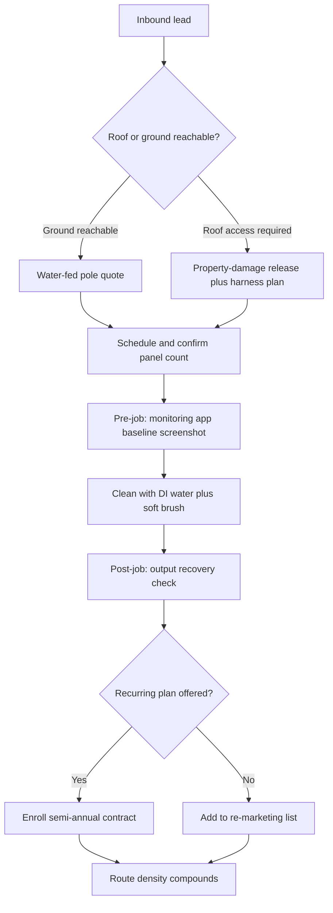

### Direct Answer

Starting a **solar panel cleaning business in 2027** means launching a specialty exterior-cleaning service that restores photovoltaic output by removing dust, pollen, bird droppings, agricultural overspray, salt residue, and soot from residential, commercial, and utility-scale arrays. A **solo operator can start for $4,000-$18,000** with a water-fed pole, deionized (DI) or reverse-osmosis (RO) filtration, a truck, ladders, and proper insurance, then net **$90,000-$220,000/year at 50-65% net margin** once route density and recurring commercial contracts are in place. The single hardest part is **working at height** — fall-from-height claims, OSHA exposure, and insurance rate spikes destroy more solar-cleaning businesses than any pricing mistake, and the business only compounds when recurring contracts and installer partnerships replace one-off residential acquisition.

> **TL;DR**
> - **Capital:** $4K-$18K solo (water-fed pole + DI/RO filtration + used truck + ladders + insurance); $35K-$95K for a 2-tech van operation with drones and truck-mounted RO/DI.
> - **Pricing:** Residential $0.20-$0.45/panel ($150-$650 per 20-30 panel array); commercial $0.10-$0.25/panel at 1,000+ panel scale; utility-scale $0.04-$0.12/panel; $150-$200 minimum job everywhere.
> - **Margins:** Mature solo nets $90K-$220K/yr at 50-65% net; the constraint is route density and recurring revenue, not raw demand.
> - **The killer:** Fall-from-height. Roof-access permission in writing, property-damage releases, fall-arrest harnesses, and real ladder training are non-negotiable, not optional.
> - **The moat:** Recurring semi-annual commercial and HOA contracts plus solar-installer referral partnerships — one-off residential jobs alone do not compound into a business.
> - **The disqualifier:** Wet, low-dust climates. Solar cleaning is brutally geography-dependent; validate your local soiling rate before buying a single piece of equipment.

---

## 1. Banner: The Business Model and Why 2027 Is the Window

### 1.1 What a Solar Panel Cleaning Business Actually Sells

A solar panel cleaning business is a **specialty exterior cleaning service** that restores photovoltaic (PV) panel output by removing **dust, pollen, bird droppings, agricultural overspray, salt residue, soot, and lichen** from residential rooftop arrays, commercial flat-roof and carport installations, and utility-scale solar farms. The mental model that separates operators who build a business from operators who build a struggling side hustle is this: **you do not sell clean glass — you sell recovered kilowatt-hours.**

A soiled panel loses **5-25% of its output** depending on geography, panel tilt, panel orientation, and time elapsed since the last meaningful rain, per soiling-loss research from NREL (National Renewable Energy Laboratory) and Sandia National Laboratories. That lost generation is not abstract. It is money the homeowner or commercial asset owner can see directly on a monitoring app — Enphase, SolarEdge, Tesla, and similar platforms graph daily production, and a soiled array shows up as a visibly depressed curve. The customer is not buying aesthetics. They are buying the difference between the production they were promised at install and the production they are actually getting.

This framing changes how the entire business is sold, priced, and defended. When you sell clean glass, you are competing on price against every other person with a $300 water-fed pole. When you sell **measurable kilowatt-hour recovery**, you are selling a quantified financial outcome, and you can charge for the outcome rather than the labor.

### 1.2 The Cleaning Method in Plain Terms

The service is delivered with **water-fed poles (WFP) carrying deionized (DI) or reverse-osmosis (RO) filtered water and soft-bristle brushes** for the overwhelming majority of jobs, and with **automated robotic cleaning systems** for utility-scale work where panel counts run into the tens or hundreds of thousands.

The reason for pure water is chemistry. Tap water carries dissolved minerals — total dissolved solids, or TDS — and when ordinary water dries on glass, those minerals are left behind as visible spots. DI and RO filtration strip the minerals out, so pure water dries spot-free with no squeegee, no detergent, and no rinse step. This is the technology that the window cleaning industry perfected over two decades, and it transferred to solar panels with almost no modification. A water-fed pole lets a technician reach a two-story rooftop array **from the ground**, which is the single most important fact about the entire business model: it removes roof access on most jobs, and roof access is what generates fall claims.

### 1.3 The Four Revenue Formats

Revenue arrives through four distinct channels, and a durable business runs at least two of them at once:

| Format | Typical customer | Pricing basis | Recurrence | Margin profile |
|---|---|---|---|---|
| **Residential homeowner** | 20-30 panel rooftop array | $0.20-$0.45/panel, $150 min job | Annual / semi-annual | High gross, low route density |
| **Commercial property** | Warehouse, HOA, retail rooftop | $0.10-$0.25/panel contract | Semi-annual contract | Mid gross, high route density |
| **Solar installer referral** | New-install customer base | Referral or white-label rate | Recurring pipeline | Low CAC, mid gross |
| **Utility-scale subcontract** | 50-500 MW solar farm | Per-MW or per-panel bid | Quarterly / annual | Low gross, very high volume |

Most operators start in **residential**, because the equipment cost is lowest and the sales cycle is a same-day decision — a homeowner sees the production dip, gets a quote, and books. The money compounds, however, when you layer **commercial recurring contracts** on top. A property manager with eight buildings is worth more than 200 one-off homeowners, because the route is geographically dense, the revenue is contracted in advance, and the customer cannot be poached on price after the first job. The fourth channel, utility-scale subcontracting, is a different business with different economics — robotic equipment, per-MW bidding, and thin per-panel margins offset by enormous volume — and it is best entered after the residential and commercial sides are stable.

### 1.4 Why 2027 Is a Genuine Opening, Not Hype

The timing is structural, not promotional. Four forces converged to create a real window:

- **Installed base hit critical mass.** The U.S. crossed roughly 5 million residential solar installations and continued adding utility-scale capacity through 2026, per Solar Energy Industries Association (SEIA) and Wood Mackenzie tracking. Every one of those arrays soils over time, and almost none of them were installed with a maintenance or cleaning plan attached.
- **Soiling research went mainstream.** NREL, Sandia National Laboratories, and the DOE (Department of Energy) published soiling-loss data showing 5-25% output degradation depending on geography. Monitoring app vendors began surfacing soiling and underperformance alerts directly to homeowners, turning a previously invisible loss into a visible problem.
- **The "rain cleans it" myth collapsed.** For years homeowners assumed rainfall would keep panels clean. The reality, well documented by NREL field studies, is that light rain often streaks panels and leaves mineral residue that can make soiling worse, not better. Once a homeowner watches their production app fail to recover after a rainstorm, the myth is dead.
- **Technology transfer was free.** Water-fed pole cleaning, perfected by the window cleaning industry, adapted to solar with essentially no R&D cost. The poles, the filtration, the brushes — the entire tooling stack already existed, was mature, and was cheap.

For the broader pattern of low-capital service businesses opening up in 2027, the trade-service economics in starting a pest control business (q2139) and starting a garage door repair business (q2138) follow the same shape: an aging or expanding installed base, a recurring-service need, and a low equipment barrier that rewards operational discipline over capital.

### 1.5 How Soiling Actually Works — The Physics You Are Selling Against

Understanding soiling at a technical level is not academic; it is the foundation of every sales conversation and every pricing decision. Soiling is the accumulation of any material on the panel surface that blocks or scatters incoming sunlight before it reaches the photovoltaic cells. The loss is not uniform — it depends on what is depositing, how it deposits, and whether moisture is involved.

| Soiling type | Typical source | Output impact | How fast it accumulates |
|---|---|---|---|
| Fine dust / particulate | Wind-borne soil, construction, traffic | 2-8% | Continuous, slow in dry climates |
| Pollen | Seasonal tree and grass bloom | 3-10% | Rapid during a 4-8 week window |
| Bird droppings | Roost and flight paths | Up to 100% on a single cell | Instant, point-source |
| Agricultural overspray | Nearby farming, dust storms | 8-20% | Episodic, region-specific |
| Salt residue | Coastal salt-laden air | 5-15% | Continuous in coastal zones |
| Soot / smoke ash | Wildfire events, industry | 10-25% | Episodic, sudden, severe |
| Lichen / biological growth | Persistent shade and moisture | 5-15% | Slow, hard to remove |

The bird-dropping line is the most important for sales. A single dropping that fully shades one cell can, because of how panels are wired into series strings with bypass diodes, knock out the output of a much larger section of the panel than the dropping itself covers. That disproportionate, easily-photographed loss is a powerful and honest reason for a homeowner to book a cleaning. The soot line is the seasonal-spike driver in wildfire-prone regions — a smoke event creates a sudden wave of demand from homeowners watching their production collapse, and an operator positioned for it captures a burst of jobs.

### 1.6 The Customer Psychology That Drives the Sale

The residential customer falls into one of three psychological buckets, and the sales approach differs for each:

- **The data-watcher.** This homeowner checks their production app, has already noticed the dip, and is half-sold before you arrive. The job here is to confirm their suspicion with a clear quote and a recurring plan. Low effort, high close rate.
- **The skeptic.** This homeowner believes rain cleans the panels and views cleaning as an unnecessary upsell. The job here is education — show them their own production data, explain the rain-streaking reality, and offer a single trial cleaning with a before/after comparison rather than pushing a contract immediately.
- **The asset protector.** Often a commercial owner or an HOA board, this customer thinks in terms of yield, payback, and warranty. The job here is a contract framed as routine yield protection, not a one-time clean.

Matching the pitch to the bucket is the difference between a 30% close rate and a 70% close rate on the same set of leads.

### 1.7 The Public Companies That Shape Your Operating Environment

A solar cleaning operator is a small private business, but it operates inside an ecosystem built by large public companies, and understanding who they are sharpens both sales and partnership strategy. The monitoring platforms that surface soiling loss to your future customers are run by public firms — Enphase Energy (NASDAQ: ENPH) builds the microinverter-and-monitoring systems on a large share of U.S. residential arrays, and SolarEdge Technologies (NASDAQ: SEDG) builds the optimizer-and-monitoring stack on much of the rest. When a homeowner shows you a production graph, they are almost certainly looking at an Enphase or SolarEdge app, and the dip they are pointing at is your sales lead.

On the installation side, the partnership channel runs through residential installers, and the largest is Sunrun (NASDAQ: RUN), the dominant U.S. residential solar installer and the kind of company whose local crews and customer base define a regional referral opportunity. Tesla (NASDAQ: TSLA), through its energy division, installs solar and Powerwall systems and runs its own monitoring app — another large installed base that soils and needs maintenance. First Solar (NASDAQ: FSLR) is the leading U.S. utility-scale panel manufacturer, and its modules dominate exactly the 50-500 MW solar farms that drive the utility-scale subcontracting opportunity. Equipment-adjacent, SDI Technologies and drone-maker DJI supply inspection hardware, and the broader exterior-services consolidators show that route-based home services attract serious capital.

The practical takeaway: your customers' production data lives on platforms built by Enphase (ENPH) and SolarEdge (SEDG), your best referral partners are installers like Sunrun (RUN) and Tesla (TSLA) energy, and your utility-scale upside tracks the deployment of panels from manufacturers like First Solar (FSLR). You are a small operator, but you are not operating in a vacuum — you are the maintenance layer on infrastructure these public companies built.

---

## 2. Banner: Startup Capital — What It Actually Costs

### 2.1 The Solo Bootstrap Build ($4,000-$18,000)

A realistic solo entry budget, equipment-first, with honest ranges:

| Line item | Budget end | Mid-range | Pro end |
|---|---|---|---|
| Water-fed pole (Tucker / Gardiner SLX / Unger nLite Connect) | $300 | $900 | $3,000 |
| DI or RO/DI portable filtration (Unger HydroPower / Pure Water Power) | $250 | $700 | $1,500 |
| Used pickup truck or cargo van | $2,000 | $6,000 | $14,000 |
| Extension + roof ladders and fall-arrest harness | $400 | $900 | $1,800 |
| Soft brushes, hoses, water tank, transfer pump | $250 | $700 | $1,600 |
| General liability + commercial auto insurance (annual) | $700 | $1,400 | $2,500 |
| LLC formation, local licenses, basic branding | $300 | $700 | $1,500 |
| Working capital (fuel, marketing, first 60 days runway) | $500 | $1,500 | $3,000 |
| **Total** | **$4,700** | **$12,800** | **$28,900** |

The honest, defensible range for a solo launch is **$4,000-$18,000** if you buy a used vehicle and start with pure DI filtration. DI is cheaper upfront than RO/DI, but it burns through resin faster in hard-water regions, so the operating cost trade-off depends on your local water quality. A truck-mounted RO/DI system at $5,000-$15,000 is a deliberate phase-two upgrade once volume justifies it — do not buy it on day one. The pro-end total above ($28,900) is what you get when you over-spec every line item, and it is a warning, not a target.

### 2.2 The Two-Tech Operation ($35,000-$95,000)

A funded launch with a second technician adds a second van, a second equipment kit, drone inspection capability, and payroll runway:

| Component | Cost range |
|---|---|
| Second cargo van plus vehicle wrap | $14,000-$32,000 |
| Truck-mounted RO/DI water system | $5,000-$15,000 |
| Second water-fed pole plus filtration kit | $1,500-$4,500 |
| Drone (DJI-class) with thermal payload for inspection | $1,500-$6,000 |
| Commercial-grade water tank, pump, hose reels | $2,000-$6,000 |
| Payroll runway (one technician, 90 days) | $9,000-$18,000 |
| Insurance uplift (two vehicles, employee workers' comp) | $2,000-$4,500 |
| Marketing, scheduling software, CRM tooling | $1,500-$4,000 |
| **Total** | **$36,500-$90,000** |

The two-tech path makes sense only when you already have **recurring commercial contracts or installer-referral pipeline** to feed the second technician a full route. Hiring before the route density exists adds fixed cost faster than it adds revenue, and that is the most common way a profitable solo operator turns into an unprofitable small company.

### 2.3 What Not to Overbuy — and Why

Capital discipline is where most new operators quietly fail before they ever take a fall. Three specific mistakes recur:

- **Buying a truck-mounted system before route density exists.** A $12,000 truck-mounted RO/DI rig is brilliant when you are cleaning 1,500 panels a day across a tight route, and a dead weight when you are doing three residential jobs across a 40-mile spread. Earn it.
- **Buying a 60-foot carbon-fiber pole.** Roughly 95% of residential arrays are reachable with a 22-30 foot pole operated from the ground. The ultra-long poles are heavy, expensive, harder to control, and used on a small minority of jobs. Rent or subcontract the rare tall job.
- **Underbuying insurance and the vehicle.** The two line items that actually kill the business — insurance and a reliable truck — are the two that founders most often cut to save cash. That is exactly backwards.

This pattern of over-specifying equipment before demand is proven mirrors the lesson in starting a stump grinding business (q2146), where founders routinely buy the largest grinder available before they have a single recurring account. Spend on **insurance and a reliable vehicle first, equipment second, and the prestige gear last or never.**

### 2.4 The Operating Cost Structure

Startup capital is one-time; operating cost recurs every day you work, and a new operator who only models startup cost is blindsided by month two. The ongoing costs that eat into the per-job margin:

| Operating cost | Basis | Monthly range (solo) | Notes |
|---|---|---|---|
| Fuel | Miles driven on the route | $250-$700 | Density directly reduces this |
| DI resin | Replaced as TDS rises | $40-$200 | Hard water burns resin faster |
| Brushes, hoses, consumables | Wear items | $30-$120 | Replace brushes before they degrade |
| Vehicle maintenance | Mileage and age | $100-$400 | Reliability is non-negotiable |
| Insurance (amortized) | Annual premium / 12 | $150-$400 | The line founders wrongly cut |
| Software / CRM / scheduling | Per-month subscription | $30-$150 | The recurring-plan calendar lives here |
| Marketing | Variable | $100-$600 | Falls as referrals compound |
| Phone, admin, misc. | Fixed | $50-$150 | Easy to underestimate |

The single most controllable operating cost is **fuel**, and it is controlled entirely by route density. An operator who clusters jobs spends a fraction of what a scattered operator spends on fuel, and that gap is real margin. The least controllable is insurance, and it is also the one a new operator must never economize on — the savings are trivial and the exposure is catastrophic.

### 2.5 Funding the Launch Without Going Into Bad Debt

Most solo solar cleaning businesses are self-funded out of savings, and that is the correct approach because the total at risk is small. The honest funding hierarchy, best to worst:

1. **Cash savings.** No interest, no personal guarantee, no pressure. If you have $5K-$10K available, this is the entire conversation.
2. **A modest amount of equipment financed by the seller or a 0% promotional card paid off fast.** Acceptable only if the payoff plan is real and short.
3. **An SBA microloan or a small business line of credit.** Appropriate for the funded two-tech launch, not for a solo bootstrap.
4. **High-interest debt to buy prestige equipment you do not yet need.** This is how the business fails before it starts. Avoid it entirely.

The low capital requirement is a gift — it means you can launch without taking on debt that turns a slow first quarter into an existential crisis. Do not squander that gift by borrowing to over-equip.

---

## 3. Banner: Pricing, Unit Economics, and Margin

### 3.1 The Per-Panel Pricing Grid

Pricing in this industry is per-panel with a job minimum, and the per-panel rate slides downward as scale goes up:

| Segment | Per-panel rate | Typical job | Job revenue | Notes |
|---|---|---|---|---|
| Residential rooftop | $0.20-$0.45 | 20-30 panels | $150-$650 | $150 minimum job applies |
| Residential ground-mount | $0.15-$0.30 | 24-40 panels | $150-$500 | Faster, far lower height risk |
| Commercial flat-roof | $0.12-$0.25 | 300-1,200 panels | $400-$2,500 | Contracted, semi-annual cadence |
| HOA / community solar | $0.10-$0.20 | 500-2,000 panels | $600-$3,500 | Recurring, route-dense, sticky |
| Utility-scale subcontract | $0.04-$0.12 | 10,000+ panels | Bid per MW | Volume, robotic-assisted |

The minimum job of **$150-$200** is the single most important pricing rule for a new operator. Without it, a 12-panel array priced at $0.30/panel returns $3.60, which does not cover the drive. The minimum job protects you against the small-array trap and trains customers to value your time.

### 3.2 Solo Operator Unit Economics

A realistic single-technician day on a residential-heavy mix, modeled honestly at two route-maturity stages:

| Metric | Conservative (year one) | Mature route (year two-plus) |
|---|---|---|
| Jobs per working day | 3 | 5-6 |
| Average ticket | $220 | $280 |
| Daily revenue | $660 | $1,540 |
| Working days per month | 18 | 21 |
| Monthly revenue | $11,880 | $32,340 |
| Direct costs (fuel, resin, supplies) | 12% | 10% |
| Fixed costs (insurance, vehicle, software) | $1,600/mo | $1,900/mo |
| **Monthly net** | **~$8,800** | **~$27,200** |
| **Annual net** | **~$95,000** | **~$215,000** |

The honest answer to "how much can you make" is therefore **$90,000-$220,000/year net for a mature solo operator at a 50-65% net margin** — but the gap between $95K and $215K is not luck and it is not pricing. It is **route density**. The conservative operator drives 40 minutes between jobs; the mature operator clusters six jobs in a tight radius and bills two extra hours of actual cleaning instead of windshield time.

This is the universal law of route-based service businesses, and it is worth studying it where it has been quantified elsewhere: the daily-throughput ceiling in how many cars per day a one-truck mobile detailer can realistically do (q1147) is the exact same constraint, and the per-asset revenue analysis in the realistic monthly revenue per vending machine (q1145) is the same density math applied to a placement business rather than a route. In every case, demand is rarely the binding limit — the binding limit is how many billable units you can physically service per daylight hour.

### 3.3 The CAC and Recurring Revenue Equation

Customer acquisition cost (CAC) varies enormously by channel, and the channel mix is what determines whether the business compounds:

| Channel | Cost per acquired customer | Lifetime value driver |
|---|---|---|
| Solar installer referral | $0-$30 | Recurring, pre-qualified, low effort |
| Door-hanger / neighborhood blitz | $40-$90 | One-off unless aggressively re-marketed |
| Google Local Services Ads | $35-$120 | Mid recurrence, intent-driven |
| Commercial property manager outreach | $150-$600 (sales time) | Highest LTV, multi-building, sticky |

Consider the math. A residential job sold for $250 with a $30 CAC and 10% direct cost yields roughly **$195 of contribution on the first job alone** — already profitable. But a homeowner enrolled in a semi-annual maintenance plan delivers roughly **$500/year for as long as they own the array**, against that same one-time $30 acquisition cost. The unit economics of a one-off job are fine. The unit economics of a recurring customer are excellent. The business model only compounds when **recurring contracts and installer partnerships replace one-off cold acquisition** as the primary growth engine.

### 3.4 Adjacent Revenue Layers

A mature operator does not leave the truck single-purpose. Three adjacent services attach naturally to a solar cleaning visit:

| Add-on service | Typical price | Why it attaches |
|---|---|---|
| Drone thermal inspection | $150-$500 | Same visit, finds hot-spot panel faults |
| Gutter cleaning | $90-$250 | Same ladder, same height skill set |
| Exterior window cleaning | $120-$350 | Same water-fed pole and pure water |

These layers do two things: they raise the average ticket without raising CAC, and they fill the calendar during low-soiling months. A homeowner who books a solar clean and a window clean together is a denser, more profitable stop than two separate jobs.

### 3.5 How to Quote a Job Without Underpricing

New operators lose money in two predictable ways: forgetting drive time and forgetting setup time. A job is not the 35 minutes of brushing — it is the drive there, the setup, the cleaning, the teardown, the drive to the next stop, and the administrative time to invoice and follow up. A useful quoting discipline:

| Cost component to recover in the quote | Why it is missed |
|---|---|
| Round-trip drive time | Looks "free" because no one bills for it |
| Equipment setup and teardown | Underestimated; 15-20 minutes per job |
| Resin and consumable cost for that job | Small per-job, real in aggregate |
| Insurance and fixed-cost allocation | Belongs in every job, not just the month |
| Profit margin above all costs | The whole point of being in business |

A panel count multiplied by a per-panel rate is the starting point, not the answer. Always apply the minimum job. Always quote the recurring-plan price alongside the one-off price so the customer sees the better value of committing. And never quote below the point where the job, after drive time and fixed-cost allocation, still clears a real profit — a "busy" calendar of unprofitable jobs is worse than an emptier calendar of profitable ones.

### 3.6 Reading the Real Margin

The 50-65% net margin headline is achievable but it is not automatic, and it is worth understanding what moves it:

- **What raises margin:** tight route density, a high share of recurring contracts, installer-referral leads that cost almost nothing to acquire, and adjacent-service attach that lifts the ticket without lifting CAC.
- **What erodes margin:** scattered jobs that turn the day into windshield time, a price war in a saturated residential market, callbacks from spotting or poor work, equipment failures that kill a routed day, and underpricing that fails to recover fixed cost.

Two operators in the same city with the same equipment can run a 35% margin and a 62% margin respectively, and the entire difference is operational discipline — routing, recurring revenue, and accurate quoting. The business does not protect a sloppy operator.

---

## 4. Banner: Equipment, Method, and the Job Workflow

### 4.1 Cleaning Method Selection

The method you choose drives your cost structure, your insurance rate, and your survival odds:

| Method | Best for | Cost | Risk | Output quality |
|---|---|---|---|---|
| Water-fed pole + DI water (ground) | ~90% of residential / light commercial | Low | Low — no roof access | Excellent, spot-free |
| Water-fed pole + RO/DI (truck-mounted) | High-volume dense routes | Mid-high | Low | Excellent, spot-free |
| Manual roof access + soft brush | Steep, complex, or unreachable arrays | Low | High — fall risk | Good |
| Robotic cleaning system | Utility-scale solar farms | Very high | Low | Good, dry or wet |

The dominant method, and the one a new solo operator should build the entire business around, is **water-fed pole with deionized water and a soft brush, operated from the ground**. It eliminates roof access on the large majority of jobs. Roof access is the entire risk story of this business, so a method that removes it is not merely convenient — it is the difference between an insurable, scalable operation and a liability time bomb.

### 4.2 The Equipment Stack in Detail

- **Poles.** Tucker, Gardiner SLX, Unger nLite Connect, IPC Eagle, and OmniFleet water-fed poles run $800-$3,000 across the quality range. A 22-30 foot pole reaches the vast majority of residential arrays from the ground. Carbon-fiber construction reduces fatigue on long days but adds cost.
- **Filtration.** Unger HydroPower, Tucker R/O DI, and Pure Water Power portable DI and RO/DI systems run $400-$1,500. Truck-mounted RO/DI systems for high-volume operations run $5,000-$15,000. The choice between pure DI and RO/DI depends on local water hardness: harder water makes RO/DI cheaper to run because it spares the resin.
- **Water quality target.** Pure DI water should read close to 0 ppm TDS (total dissolved solids). Anything much above roughly 10 ppm risks visible drying spots, which on a glass panel is a callback and a damaged reputation.
- **Brushes.** Soft natural or synthetic bristle brushes only. Never abrasive pads, scouring material, or stiff bristles — these can scratch the panel's anti-reflective coating and void the manufacturer warranty.
- **Drone.** A DJI-class drone with a thermal payload turns inspection into a $150-$500 add-on service and doubles as a sales tool — a thermal image showing a hot-spot fault is a vivid, hard-to-argue-with reason to book a service.
- **Vehicle.** A reliable used pickup or cargo van. Reliability matters more than newness; a breakdown on a routed day costs you the whole day's revenue.

### 4.3 The Job Workflow

The two non-obvious steps in that workflow are **F and H** — screenshotting the customer's production monitoring app before the job and again after. Showing a homeowner a measurable production bump on their own app is the single highest-converting tool for upselling a one-off job into a recurring plan. It converts an invisible service into a visible, quantified financial result, and quantified results are what people pay for twice.

### 4.4 Time and Throughput Per Job

| Job type | On-site time | Setup + teardown | Realistic jobs/day |
|---|---|---|---|
| Residential 20-30 panels | 30-50 min | 15-20 min | 5-7 |
| Commercial 300-800 panels | 2-4 hrs | 30-45 min | 1-2 |
| HOA / community 500-2,000 panels | 4-8 hrs | 45-60 min | 0.5-1 |

Throughput planning is where route density either pays off or evaporates. Cluster residential jobs by neighborhood and you hit the top of the range; scatter them across a county and you cannot.

### 4.5 Equipment Maintenance and Water Management

Equipment that fails on a routed day costs the entire day's revenue, so maintenance is not optional housekeeping — it is revenue protection. The recurring maintenance discipline:

| Item | Maintenance task | Cadence |
|---|---|---|
| DI resin | Check outlet TDS, replace resin when it climbs above target | Test daily, replace as needed |
| RO membrane | Flush and inspect, replace per manufacturer spec | Per manufacturer schedule |
| Water-fed pole | Inspect clamps and hose, clean brush jets | Weekly |
| Brush heads | Replace before bristles splay or harden | As wear shows |
| Pump and tank | Check seals, flush tank to prevent biofilm | Weekly to monthly |
| Hoses and reels | Inspect for kinks, leaks, UV cracking | Weekly |

Water management is the under-appreciated operational skill. Pure water is the consumable that makes the whole method work, and an operator who lets resin exhaust mid-job starts leaving spots — which means callbacks, refunds, and reputation damage. Carry enough filtered water capacity for a full route, monitor TDS continuously with an inline meter, and never start a job with marginal water quality to "save resin." The resin is cheap; the callback is not.

### 4.6 Weather, Timing, and the Working Day

Solar cleaning is an outdoor service constrained by weather and daylight, and an operator who plans around those constraints runs a tighter, safer day:

- **Avoid the hottest part of the day on dark glass.** Pure water on very hot panels can cause thermal stress, and it also dries too fast to work cleanly. Early morning and late afternoon are the better windows in hot climates.
- **Do not work in high wind.** Wind makes a long water-fed pole genuinely dangerous to control and makes any roof work unacceptable. Reschedule.
- **Do not clean during or right after pollen-heavy conditions if it will simply re-soil.** Time the job for lasting benefit, which is also a better recurring-plan story.
- **Plan the route around daylight.** Billable hours are daylight hours; the route should be built so the densest cluster is worked when light is best.

A disciplined operator who reads the weather and builds the day around it loses fewer hours, takes fewer risks, and delivers more consistent results than one who simply drives to whatever job is next on an unsorted list.

---

## 5. Banner: Safety, Legal, and Insurance

### 5.1 Working at Height Is the Real Business Risk

Fall-from-height is the **number-one financial killer** of solar cleaning businesses. Not pricing, not competition, not seasonality — falls. A single fall produces a workers' compensation claim, potential OSHA fines under fall-protection standards (29 CFR 1926 Subpart M), an insurance rate spike that compounds for years, lost working days, and possibly a permanent, career-ending injury. NIOSH (National Institute for Occupational Safety and Health) and Bureau of Labor Statistics data consistently rank falls from elevation among the leading causes of serious injury in service trades.

The defensive posture is layered, and every layer matters:

| Control | What it does | Cost |
|---|---|---|
| Ground-based water-fed pole method | Removes most roof access entirely | Built into the method |
| Fall-arrest harness plus rated anchor | Mandatory any time a technician is on a roof | $200-$600 |
| Documented ladder and roof-safety training | Reduces both incidents and insurance premiums | $0-$400 |
| Property-damage release form | Protects against tile and shingle damage claims | One-time legal review |
| Written roof-access permission | Protects against trespass and liability disputes | Per job, no cost |

The single most important safety decision is upstream of all of these: **build the business around the ground-based water-fed pole method so that roof access is the exception, not the routine.** A business that needs the roof every day is a business that will eventually have a fall.

### 5.2 Insurance and Entity Structure

| Coverage | Why it matters | Typical annual cost |
|---|---|---|
| General liability ($1M-$2M) | Covers property damage and third-party injury | $600-$1,800 |
| Commercial auto | Required — personal auto policies exclude business use | $1,200-$3,000 |
| Workers' compensation | Mandatory once you hire; covers technician falls | Varies by state and payroll |
| Inland marine / tools coverage | Covers $3K-$15K of stolen or damaged equipment | $150-$400 |

Form an **LLC before the first paid job.** The LLC separates personal assets — your house, your savings — from a fall claim or a property-damage lawsuit. The SBA (Small Business Administration) and IRS provide clear guidance on entity selection and the self-employment tax consequences; the cost of formation is $300-$1,500 depending on state and whether you use a service. The entity-and-insurance discipline here is identical to the risk posture required in starting a pest control business (q2139), where chemical-application liability plays the same role that height plays in solar cleaning: a low-probability, high-severity event that an LLC and proper coverage exist specifically to absorb.

### 5.3 Warranty and Panel Damage Liability

Panel manufacturers — SunPower/Maxeon, Q CELLS, Canadian Solar, and others — void their warranties if cleaning is done with **abrasive pads, high-pressure washing, harsh chemicals, or hot water applied to cold glass.** That last one matters: thermal shock from hot water hitting cold panels can crack the glass outright. Every technician, including the owner, must internalize the rule: **soft brush, ambient-temperature pure water, low pressure, and never walk on the panels themselves.**

Document the cleaning method in the customer service agreement. If a panel fails six months later for an unrelated manufacturing reason, a written record of a warranty-compliant cleaning method is your defense against being blamed for it. Operators who skip this paperwork are one ambiguous panel failure away from a dispute they cannot win.

### 5.4 Licensing and Local Compliance

Licensing requirements vary by state and municipality. Most jurisdictions treat solar cleaning as a general cleaning or exterior maintenance service requiring a business license rather than a specialized contractor license, but some states regulate any work touching an electrical generation system more tightly. Check the requirements before the first job — county building and electrical departments are the authority, and getting this wrong invites fines and uninsurable gaps.

### 5.5 The Property-Damage Risk Beyond Falls

Falls are the catastrophic risk, but the everyday risk that generates the most actual disputes is **property damage** — and an operator who only insures against falls is exposed on the more probable event. The common property-damage scenarios:

| Damage scenario | Cause | Prevention |
|---|---|---|
| Cracked roof tiles | Walking on brittle tile to reach an array | Use ground-based water-fed pole; never walk tile |
| Scratched panel coating | Abrasive brush or grit dragged across glass | Soft bristle only, rinse grit before brushing |
| Cracked panel glass | Hot water on cold glass, impact, pressure | Ambient water, low pressure, no panel walking |
| Water intrusion | Forcing water into junction boxes or seals | Controlled flow, never high-pressure at seams |
| Landscaping damage | Equipment, hoses, ladder feet | Path planning, drop cloths, care |

Every one of these is preventable with method discipline, and every one of them is why the **property-damage release form and a written scope of work** belong in the customer agreement. The release does not give you license to be careless — it documents the agreed method and protects you when a pre-existing problem (a tile that was already cracked, a panel already failing) is discovered after your visit.

### 5.6 Workers' Compensation and the Hiring Threshold

The moment you hire your first technician, the legal and insurance picture changes materially. Workers' compensation becomes mandatory in essentially every state, and for a business with height exposure the workers' comp rate is not trivial — it is priced on the real injury risk of the work. This is one more reason the **ground-based water-fed pole method** matters: a documented, roof-access-minimizing operation is a measurably lower-risk operation, and lower-risk operations earn lower workers' comp rates over time.

Before hiring, model the fully loaded cost of an employee — wage, payroll taxes, workers' comp, the second vehicle, the second equipment kit, and the insurance uplift — and confirm that recurring, contracted route density can cover all of it. Hiring is a fixed-cost commitment; it should be made against contracted revenue, not against optimism.

---

## 6. Banner: Customer Acquisition and Growth

### 6.1 The First 90 Days

| Week | Action | Goal |
|---|---|---|
| 1-2 | Form LLC, bind insurance, buy equipment, set up Google Business Profile | Be legally operational |
| 3-4 | Door-hang 3 solar-dense neighborhoods, post before/after content | Land the first 10 jobs |
| 5-8 | Pitch 2-3 local solar installers for a referral arrangement | Build a referral pipeline |
| 9-12 | Cold-call commercial property managers and HOAs | Close the first recurring contract |

Solar-dense neighborhoods are not a guess. Utility interconnection maps and county building-permit records show exactly where rooftop installs cluster, and most of that data is public. You are not prospecting blind — you are prospecting a known, mapped customer base.

### 6.2 The Acquisition Channel Stack

- **Solar installer partnerships — the highest-leverage channel.** Installers already hold the customer list, they want a credible answer when a customer asks about maintenance, and they have no desire to clean panels themselves. A referral arrangement, or a white-label deal where you clean under the installer's brand, turns their entire customer book into your pipeline at near-zero CAC.
- **Commercial property managers — the highest LTV.** A single property manager often controls many rooftops. One contract can equal months of residential work, it recurs on a contracted schedule, and once you are the incumbent, displacing you costs the manager hassle they will not bother with.
- **Google Local Services Ads and Business Profile.** This captures the high-intent homeowner — the one who watched their production app drop, asked why, learned about soiling, and searched "solar panel cleaning near me." That searcher is ready to book.
- **Before/after monitoring screenshots as content.** The production-recovery proof point is your best organic social content, your best referral trigger, and your best review-request moment. It is free marketing generated as a byproduct of doing the job well.

### 6.3 Scaling Past the Solo Ceiling

The solo operator caps out around $200,000-$220,000 in annual net, because there are only so many billable daylight hours and one person can only be in one place. Scaling past that ceiling means **hiring and routing**, and that is a genuinely different and harder business.

| Stage | Annual revenue | Structure | Binding constraint |
|---|---|---|---|
| Solo operator | $90K-$220K | Owner does everything | Daylight hours |
| 2-3 technicians | $250K-$550K | Owner sells and routes, techs clean | Recurring contract density |
| Crew-based company | $600K-$1.2M+ | Manager plus dispatch software | Hiring, retention, geography |

The wall between the solo stage and the crew stage is the same wall described in starting a garage door repair business (q2138) and starting a septic tank pumping business (q2137): the moment you hire, you take on fixed payroll cost that must be fed by a predictable, dense route. The unlock is **recurring commercial contracts** that let a hired technician run a full, profitable, predictable day without the owner present. Hire into proven recurring density, never into hope.

### 6.4 Software and Operations

Even a solo operator should run on real tooling from early on: a scheduling and CRM platform to manage the route and the recurring-plan calendar, simple invoicing, and a system for capturing reviews after every job. The recurring-plan calendar is the asset — it is the difference between waking up to a booked day and waking up to a cold-acquisition scramble.

### 6.5 Structuring the Recurring Contract

The recurring contract is the moat, so it is worth structuring it deliberately rather than treating it as a loose verbal "we'll be back in six months." A well-built recurring agreement specifies:

| Contract element | What to specify | Why it matters |
|---|---|---|
| Service cadence | Semi-annual, quarterly, or by trigger | Sets the predictable revenue rhythm |
| Scope | Panel count, array locations, access | Prevents scope creep and disputes |
| Price and escalation | Per-visit rate, annual adjustment terms | Protects margin against cost inflation |
| Term and renewal | Auto-renew with a notice window | Keeps the contract sticky by default |
| Cancellation terms | Clear, fair notice requirements | Reduces churn friction and disputes |
| Method and warranty compliance | The agreed cleaning method | The damage-liability defense |

For commercial and HOA customers, an **auto-renewing** agreement is the standard and the right default — it converts the relationship from something the customer must actively re-decide twice a year into something they must actively cancel, and inertia works in your favor. The semi-annual cadence is the most common because it matches the soiling cycle in most viable geographies: one cleaning before peak production season, one after the heaviest soiling period.

### 6.6 Building the Installer Partnership the Right Way

The solar installer partnership is the highest-leverage channel, but it is a relationship, not a transaction, and it has to be built with the installer's interest in mind:

- **Lead with the installer's problem.** Their customers ask about maintenance and warranty performance; you are the credible answer that makes the installer look good.
- **Make it effortless for them.** A simple referral handoff or a clean white-label arrangement — the installer should not have to manage anything.
- **Protect their brand.** If you clean under their name, every job must reflect well on them. One sloppy job ends the partnership.
- **Offer a structure that works for both sides.** A referral fee, a revenue share, or a white-label rate — whatever aligns incentives so the installer benefits from sending you work.
- **Report back.** Tell the installer when their referred customers are happy. Visible results keep the channel open and growing.

An operator with two or three solid installer partnerships has a referral pipeline that compounds with almost no marketing spend — that is structurally more durable than any amount of paid advertising.

---

## 7. Banner: Counter-Case — When NOT to Start This Business

The bull case for a 2027 solar cleaning business is real. An honest assessment also names the failure modes plainly, because the people who lose money in this business are usually the ones who never heard the downside.

### 7.1 The Geography Problem

Solar cleaning economics are **brutally geography-dependent**, and this is the disqualifier that sinks the most would-be operators. In regions with frequent, heavy rainfall and low ambient dust, panels stay clean enough on their own that homeowners see little measurable benefit from a paid cleaning. A service with no measurable benefit cannot be sold a second time, and a service that cannot be sold twice has no recurring revenue — which means no business.

The business works best in **arid, dusty, agricultural, or coastal regions**: the desert Southwest, the Central Valley and other farmland with airborne agricultural dust and overspray, and salt-air coastal zones where salt residue accumulates. It works poorly in consistently wet, low-dust climates. Before you spend a dollar on equipment, validate your local soiling rate — talk to local solar installers, check whether NREL-style soiling data exists for your region, and confirm that panels in your area actually get measurably dirty. If they do not, this is the wrong business in the wrong place.

### 7.2 Seasonality and Cash Flow

Demand concentrates around predictable triggers: **pollen season, post-wildfire smoke events, dust storms, and the pre-summer months when production peaks and homeowners most want full output.** Winter and rainy seasons can be lean. A solo operator who does not budget for uneven cash flow will hit a cash crunch in the slow months.

The two defenses are a cash reserve sized to cover the lean stretch and **adjacent services that fill the calendar** — gutter cleaning, exterior window cleaning, and general soft-wash work that share the same water-fed pole and the same skill set. This seasonality-smoothing logic is an extreme version of the demand-concentration problem in a highly seasonal business; the principle of layering counter-seasonal revenue is the same one that lets seasonal operators survive their off months.

### 7.3 Low Barrier to Entry Cuts Both Ways

The $4,000-$18,000 entry cost that makes this business attractive to you also makes it attractive to every other person who watched the same online video. In hot, high-solar markets, that low barrier produces a flood of new entrants, and **price competition compresses residential margins quickly.** A business defended only by being cheap is a business with no defense at all.

The defensible position is everything competitors skip because it is harder: **recurring commercial contracts that are contractually sticky, installer partnerships that lock up a referral channel, documented safety practices that keep insurance affordable, and real coverage that lets you take the jobs the uninsured operator legally cannot.** A founder who only chases one-off residential jobs on price has built a job for themselves, not a business — and a fragile, easily-undercut job at that.

### 7.4 The Physical and Operational Reality

This is a physical, route-driven, owner-operated service business for years before it is anything else. It is not passive income. It involves real exposure to height risk, real exposure to weather, and real daily physical labor — moving equipment, managing hoses, and concentrating on careful work near a roof edge.

### 7.5 The Honest Disqualifiers

Do not start this business if you: are uncomfortable working at or near height and unwilling to build the discipline around it; live in a wet, low-dust climate with few solar installations; cannot fund proper general liability and commercial auto insurance from day one; expect passive income rather than a hands-on owner-operated job; or are unwilling to do the unglamorous commercial sales and recurring-contract work that is the actual moat. If any of those describe you honestly, a different low-capital service business is a better fit — and that is a legitimate, money-saving conclusion, not a failure.

### 7.6 The Five Mistakes That Sink New Operators

Even in a viable geography with adequate capital, new operators fail in predictable ways. Naming the mistakes is the cheapest insurance against making them:

| Mistake | Consequence | The fix |
|---|---|---|
| Skipping or under-buying insurance | One claim ends the business | Bind full coverage before job one |
| Chasing only one-off residential jobs on price | No recurring revenue, no moat | Sell recurring plans and pursue commercial from month one |
| Over-buying equipment on debt | Fixed cost crisis in a slow quarter | Bootstrap with used gear, upgrade from cash |
| Ignoring route density | Margin eaten by windshield time | Cluster jobs; build the route deliberately |
| Walking on panels or roofs casually | Damage claims, fall risk, warranty voids | Ground-based method; method discipline always |

None of these mistakes are exotic. They are the ordinary, tempting shortcuts — save on insurance, take the easy one-off job, buy the impressive equipment, accept the scattered job, step onto the roof "just this once." The discipline to refuse all five is what separates the operator still in business in year three from the one who quit in month eight.

### 7.7 Honest Comparison to Adjacent Service Businesses

If the counter-case has given you pause, it is worth knowing that solar cleaning sits in a family of low-capital service businesses with similar economics and different risk profiles. A window tinting business (q2140) trades height risk for skill-intensive application work. A garage door repair business (q2138) trades weather and seasonality risk for a more technical, higher-ticket repair model. A mobile RV repair business (q2145) trades the soiling-demand question for a more diagnostic, parts-driven service. The decision is not "solar cleaning or nothing" — it is choosing the service business whose specific risk profile, geography fit, and physical demands match your situation honestly. Solar cleaning is an excellent choice in an arid, high-solar region for an operator comfortable with height discipline. It is a poor choice almost everywhere else, and recognizing that early saves real money.

---

## 8. Banner: 2027 Outlook and the Action Plan

### 8.1 Where the Market Is Heading

| Trend | Implication for a new operator |
|---|---|
| Continued residential install growth | An expanding installed base of soiling assets |
| Utility-scale farm maturation (50-500 MW) | Rising subcontract and robotic-cleaning demand |
| Monitoring apps surfacing soiling loss | Easier, data-backed residential sales conversations |
| Solar installer consolidation | The partnership channel concentrates into fewer, bigger relationships |
| Drone thermal inspection normalizing | A higher-margin add-on becomes a standard expectation |
| Commercial ESG and asset-yield focus | Property owners increasingly treat cleaning as yield protection |

### 8.2 Regional Economics — Where the Business Actually Works

Because solar cleaning is geography-dependent, the realistic opportunity is not uniform across the country. A region-by-region honest read:

| Region type | Soiling pressure | Demand quality | Verdict |
|---|---|---|---|
| Desert Southwest | High dust, low rain | Strong, year-round | Excellent — the core market |
| Agricultural valleys | Heavy overspray and dust | Strong, episodic spikes | Excellent |
| Coastal zones | Salt residue, continuous | Solid, steady | Good |
| Wildfire-prone West | Soot spikes plus baseline dust | Strong, with surge events | Good, but plan for surges |
| Humid Southeast | Pollen heavy, frequent rain | Mixed — pollen window only | Marginal — seasonal play |
| Wet Pacific Northwest | Low dust, very frequent rain | Weak | Poor — avoid |
| Cold rainy Northeast | Low dust, frequent rain and snow | Weak to mixed | Poor to marginal |

The lesson is blunt: the same business plan that nets $200K in Phoenix or California's Central Valley can fail to clear a living wage in a wet, low-dust climate. The first and most consequential decision a prospective operator makes is not equipment or pricing — it is whether the local geography produces panels that get measurably, sellably dirty. Get that right and the rest of the plan works. Get it wrong and no amount of operational excellence rescues it.

### 8.3 The 12-Month Plan

1. **Months 1-2 — Validate and set up.** Confirm your local soiling economics with installers and regional data. Form the LLC, bind general liability and commercial auto insurance, and buy a used truck, a 22-30 foot water-fed pole, and DI filtration. Stay inside the $4,000-$18,000 solo budget. Resist every upsell to bigger equipment.
2. **Months 3-5 — Build the residential base.** Run residential jobs, master the before/after monitoring-screenshot upsell, and build a strong Google Business Profile review base. Every job should generate a review request and, ideally, a recurring-plan offer.
3. **Months 6-8 — Build the moat.** Close two to three solar installer referral partnerships and land the first recurring commercial or HOA contract. This is the phase that converts a job into a business.
4. **Months 9-12 — Compound.** Build route density deliberately by clustering work geographically. Add drone thermal inspection as a margin layer. Decide on a second technician only when recurring contracts can demonstrably feed that technician a full, profitable route.

### 8.4 A Realistic Three-Year Trajectory

To set expectations honestly, here is what a disciplined operator in a viable geography can realistically expect across the first three years:

| Year | Focus | Revenue | Net | Key milestone |
|---|---|---|---|---|
| Year 1 | Launch, residential base, reviews | $60K-$110K | $35K-$70K | First 10 reviews, first installer partner |
| Year 2 | Recurring contracts, route density | $120K-$200K | $75K-$140K | First commercial contract, dense route |
| Year 3 | Mature solo or first hire | $180K-$320K | $110K-$215K | Decide: stay solo or scale to crew |

Year one is a building year — revenue is modest because the recurring book and the referral pipeline are still forming, and a new operator should not expect the headline numbers immediately. Year two is where the moat takes shape: recurring contracts convert the business from a series of cold-acquired one-off jobs into a predictable, compounding revenue base. By year three the operator faces the genuine fork — run a highly profitable mature solo operation at the top of the solo range, or take on the harder, lower-margin-per-dollar but higher-ceiling path of hiring and building a crew. Both are legitimate; neither is forced. The operator who reaches that fork with a real recurring book and clean financials has already won the hard part.

### 8.5 The Bottom Line

A solar panel cleaning business in 2027 is a **genuine low-capital opportunity in the right geography**: $4,000-$18,000 to start as a solo operator, a credible and well-documented path to $90,000-$220,000 in annual net at a 50-65% margin, and a real, defensible moat in recurring commercial contracts and installer partnerships.

It is also **not passive, not geography-agnostic, and not safe to run without insurance and disciplined height practices.** Treat working at height as the core business risk and build the entire operation around the ground-based water-fed pole method that minimizes it. Sell recovered kilowatt-hours rather than clean glass, because a quantified financial outcome can be sold twice and clean glass cannot. And build for recurring contracts and installer partnerships from the very first month — that single strategic choice is the difference between a durable, compounding business and a fragile, easily-undercut seasonal side hustle.

---

#### Sources and Citations

1. National Renewable Energy Laboratory (NREL) — photovoltaic soiling loss research and field studies.
2. Sandia National Laboratories — PV soiling and module performance studies.
3. U.S. Department of Energy (DOE) — Solar Energy Technologies Office data.
4. Solar Energy Industries Association (SEIA) — U.S. solar installation tracking and market data.
5. Wood Mackenzie — U.S. Solar Market Insight quarterly reports.
6. International Energy Agency (IEA) — global PV deployment statistics.
7. Lawrence Berkeley National Laboratory — Tracking the Sun residential solar dataset.
8. U.S. Energy Information Administration (EIA) — distributed and small-scale solar capacity data.
9. OSHA — fall protection standards for working at height (29 CFR 1926 Subpart M).
10. OSHA — ladder safety guidance for construction and service trades.
11. National Institute for Occupational Safety and Health (NIOSH) — fall-from-elevation injury data.
12. U.S. Bureau of Labor Statistics — workers' compensation and service-industry injury statistics.
13. U.S. Small Business Administration (SBA) — service business startup and entity-formation guidance.
14. Internal Revenue Service (IRS) — small business entity selection and self-employment tax rules.
15. Tucker USA — water-fed pole and RO/DI system specifications.
16. Gardiner Pole Systems — SLX water-fed pole product data.
17. Unger Global — nLite Connect pole and HydroPower DI filtration specifications.
18. Pure Water Power — portable DI/RO filtration system documentation.
19. IPC Eagle — water-fed pole and pure-water system specifications.
20. International Window Cleaning Association (IWCA) — water-fed pole method standards.
21. SunPower / Maxeon — panel warranty terms on approved cleaning methods.
22. Q CELLS — module cleaning and warranty guidance.
23. Canadian Solar — module operation and maintenance manual.
24. DJI Enterprise — thermal drone payload specifications for inspection.
25. National Association of Home Builders (NAHB) — residential solar adoption data.
26. Insurance Information Institute — general liability and commercial auto cost benchmarks.
27. EnergySage — residential solar marketplace and homeowner behavior data.
28. SolarReviews — consumer solar maintenance and satisfaction survey data.
29. PV Magazine — utility-scale robotic cleaning system industry coverage.
30. Greentech Media / Wood Mackenzie archives — solar operations and maintenance market analysis.
31. County interconnection and building-permit records — solar install density mapping.
32. U.S. Census Bureau — service-sector small business formation data.
33. Local utility net-metering interconnection datasets — installed-array geolocation.
34. Pulse RevOps internal benchmark library — adjacent home-service business unit economics.

**Related questions:** starting a window tinting business in 2027 (q2140), starting a pest control business in 2027 (q2139), starting a garage door repair business in 2027 (q2138), starting a septic tank pumping business in 2027 (q2137), starting a stump grinding business in 2027 (q2146), starting a mobile RV repair business in 2027 (q2145), how many cars per day a one-truck mobile detailer can realistically do (q1147), realistic monthly revenue per vending machine (q1145).
