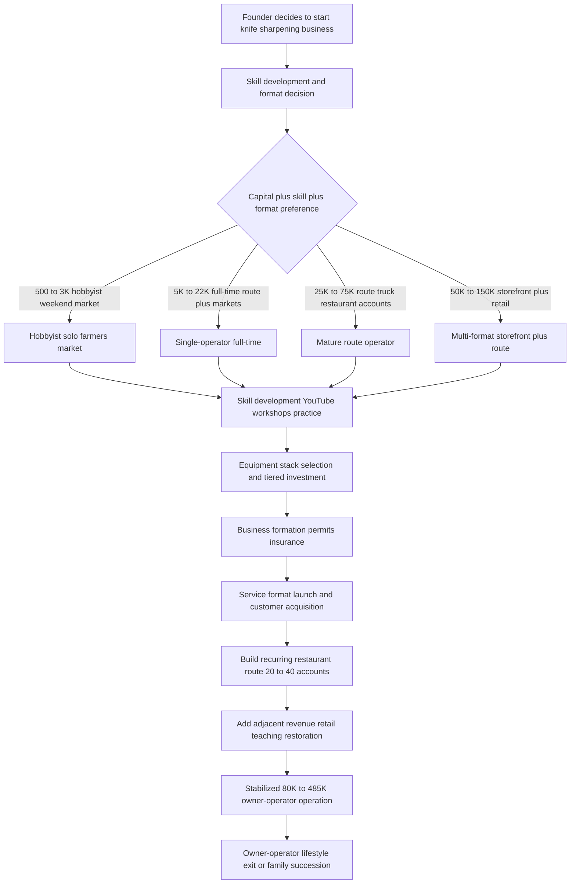

### Direct Answer

Starting a knife sharpening business in 2027 means building a craft service operation that restores edges to kitchen knives, chef tools, scissors, shears, axes, and outdoor blades using whetstones, guided systems, and motorized wet grinders. The honest split: a hobbyist with stones and a folding table earns $8K-$25K on weekends, while a disciplined route operator with 20-40 restaurant accounts reaches $80K-$220K at 60-80% net margin. The single decision that separates the two is whether you convert one-time home-knife customers into recurring restaurant routes, farmers market regulars, and mail-in subscriptions — because a sharpened home knife holds 6-12 months and the customer does not come back until then.

> ### TL;DR
> - **Capital:** $500-$3K hobbyist (stones, strops, folding table); $5K-$22K full-time single-operator (Tormek T-8 or Edge Pro Apex plus farmers market gear); $25K-$75K route truck or storefront with restaurant accounts.
> - **Margins:** $4-$15 per kitchen knife, $25-$95 high-end gyuto/santoku, $35-$150 hair shears; mature route operator does $80K-$220K/yr at 60-80% net solo.
> - **Recurring-revenue moat:** the restaurant route loop — 20-40 accounts on weekly/biweekly cycles generates $4K-$24K/month of recurring revenue that smooths transactional home-customer volatility.
> - **Hardest part:** sharpening is a one-time fix (6-12 months on home knives, 2-6 weeks on restaurant lines); escaping transactional one-offs requires route discipline and 2-5 years of freehand-stone skill.
> - **Regulation:** no sharpening-specific license in any US state; permits limited to a business license, farmers market vendor permit, sales tax registration in service-tax states, and knife-transport rules in CA, NY, and MA.

A knife sharpening business in 2027 is a **craft service operation** that sits at the intersection of kitchen-tool maintenance, restaurant operations support, farmers market vending, outdoor-equipment service, and the centuries-old bladesmithing apprenticeship craft. It restores edges using whetstones, guided sharpening systems, motorized wet grinders, and strops across mobile route, farmers market booth, mail-in service, drop-off storefront, hardware-store pop-up, and in-home formats. Revenue is per-blade service pricing plus monthly recurring restaurant accounts plus adjacent income from restoration, retail, and teaching. This guide walks the full operating journey — market structure, skill development, equipment, formats, pricing, route-building, marketing, scale milestones, and a candid counter-case — so a prospective operator can judge fit before committing capital and the 2-5 years of practice the trade demands.

## PART 1 — FOUNDATIONS

### 1.1 Market Size And Opportunity

The US installed base of knives is massive but unevenly served. There are roughly **131 million US households** (US Census Bureau ACS 2024) averaging **6-12 knives each**, producing an installed base of **800M-1.5B kitchen knives** in homes alone. Add the commercial fleet: approximately **750,000-900,000 US food-service establishments** (BLS QCEW) running 15-40 knives per kitchen for a commercial base of **11M-36M restaurant knives**. Add outdoor and hunting blades: the **US hunting license count is ~15M** (US Fish and Wildlife Service 2024), and tactical/EDC enthusiasts add an estimated 20-30M Americans, producing **40M-90M outdoor blades**.

The honest 2027 demand reality: **most US households sharpen knives essentially never**. They use them dull, replace them every 5-10 years, or rely on a pull-through home sharpener (Chef'sChoice, Presto EverSharp, Work Sharp E5) that produces inconsistent edges. Active professional sharpening operators in the US number an estimated **2,500-5,500 independent operators**, based on regional industry surveys and Sharpening Supplies retailer data.

| Operator segment | Share of population | Typical commitment | Revenue band |
|---|---|---|---|
| Farmers market / craft-fair vendors | Largest segment | Part-time / weekend | $8K-$45K |
| Restaurant-route mobile operators | Smaller, growing | Full-time | $80K-$220K |
| Drop-off storefront operators | Small, urban-concentrated | Full-time | $95K-$485K |
| Mail-in send-in operators | Small but growing | Full-time | $45K-$185K |
| In-home premium operators | Small | Full-time / part-time | $45K-$165K |

The category includes specialized regional operators such as **Bernal Cutlery (San Francisco)**, **Korin Japanese Trading (NYC)**, **Tosho Knife Arts (Toronto)**, **Town Cutler (San Francisco)**, **New West KnifeWorks (Jackson Hole)**, and **Sharpening Supplies** (the dominant gear retailer plus mail-in service), alongside in-store programs at **Williams Sonoma** and **Sur La Table** and rotating **Whole Foods** sharpening events. Premium-tier reference points include master bladesmith **Bob Kramer**, whose knives sell for $5K-$25K and whose sharpening workshops are sought-after; **Murray Carter** of Carter Cutlery, a renowned maker and teacher; custom bladesmith **Devin Thomas**; **Daniel O'Malley**, founder of Bernal Cutlery; and **Kelly Cupples**, master sharpener at Tosho Knife Arts.

Per-operator revenue economics at mature scale run from a **$8K-$25K weekend hobbyist** to a **$45K-$95K full-time single operator**, a **$80K-$220K mature route operator** with 20-40 restaurant accounts, a **$185K-$485K multi-operator regional or storefront-plus-route**, and a very rare **$485K-$985K multi-state operation** with several route trucks.

The category is **owner-operator-dominated with essentially zero private-equity consolidation**. The trade is so fragmented, so craft-oriented, so dependent on individual skill and relationship, and so unscalable beyond the productive output of skilled hands that it resists roll-up entirely. The structural opportunity in 2027: the post-COVID home-cooking surge left every American kitchen with dull knives nobody knows how to maintain; the craft-cocktail and farm-to-table restaurant movement created sustained premium demand for properly sharpened gyuto and chef knives; the YouTube sharpening-education ecosystem created a generation of customers who now know what a properly sharpened knife should feel like; and the farmers market vendor explosion created accessible market entry for new operators.

Demand also concentrates geographically and demographically in ways the prospective operator should map before choosing a base. Markets with the strongest sharpening demand share three traits: a dense restaurant scene (the recurring-revenue engine), an affluent home-cook population that owns premium Japanese knives worth maintaining, and an established farmers market culture that gives the operator a low-cost lead channel. Coastal metros — the San Francisco Bay Area, Seattle, Portland, New York, Boston, and the affluent suburbs of Chicago, Denver, Austin, and Nashville — concentrate all three. Rural and small-town markets support a viable part-time operation built on farmers markets, county fairs, hardware-store pop-ups, and seasonal hunting-knife work, but rarely carry enough restaurant density for a full-time route. The operator's first strategic decision is honest market assessment: count the independent restaurants within a 25-mile radius, count the active farmers markets, and estimate the affluent home-cook density — those three numbers determine whether the market supports a hobby, a full-time route, or a multi-operator regional business.

### 1.2 The Craft Lineage

The modern trade inherited a long lineage: medieval European guild sharpeners, Japanese sword polishers (togishi), early-20th-century street-corner scissor grinders with foot-pedal grindstones, mid-20th-century knife sharpening trucks that worked neighborhoods on Saturday mornings, and the 2010-2025 specialty boom driven by premium Japanese kitchen knives (Shun, Global, Miyabi, Mac, Tojiro), the Bob Kramer and Murray Carter influence elevating American interest in carbon-steel kitchen knives, and the YouTube sharpening-education channel growth. That lineage matters because it shapes both the customer expectation — a craft, not a commodity — and the skill bar, which is real mastery rather than a pull-through gadget.

### 1.3 Skill Development And Training Paths

Sharpening is fundamentally a **2-5 year apprenticeship to true mastery**. The foundational skills take 12-24 months of daily practice on hundreds of knives to internalize; the full range from competent kitchen-knife work to mastery of Japanese single-bevel knives, hair shears, and damascus restoration takes another 3-5 years. Four core skill components define a professional:

| Core skill | What it requires | Time to professional level |
|---|---|---|
| Angle control | Hold consistent 15-22 deg/side Western, 10-15 deg/side Japanese, 25-30 deg/side outdoor, 8-10 deg/side razors/shears | 6-12 months daily practice |
| Grit progression discipline | Know when to start at 220 / 1000 / 3000 / 6000 / 8000 grit; never skip more than a 2x grit ratio | 6-12 months |
| Edge inspection | Recognize burr formation, edge geometry, steel hardness implications, reprofile-vs-touch-up | 12-18 months |
| Blade-type recognition | Distinguish V-grind, convex, chisel/single-bevel, serrated, shears, axes by sharpening approach | 12-24 months |

**Angle control** is the single most consequential skill — Wusthof, Henckels, and Victorinox factory edges typically run 20 degrees; Shun runs ~16 degrees, Global ~15 degrees, Miyabi ~9.5-12 degrees. **Grit progression** rules: each grit must fully remove the previous grit's scratch pattern before moving on, and a finishing strop with leather and compound seals the edge. **Edge inspection** centers on the burr — felt with a fingernail run perpendicular across the edge; when a burr forms on the opposite side, that bevel has reached the centerline. High-HRC Japanese knives at HRC 60-65 sharpen faster but chip easier; softer Western steel at HRC 56-58 takes longer but holds through abuse.

Training paths for new operators:

1. **Self-taught via YouTube** — the modern primary pathway. Channels include **Burrfection** (Ryky Tran, ~700K subscribers, comprehensive kitchen-knife sharpening), **Cliff Stamp** (~70K subscribers, technical edge-geometry analysis), **Outdoors55** (~600K subscribers, outdoor-knife focus), **JapaneseKnifeImports** (Jon Broida, ~85K subscribers, Japanese-knife specific), **Knife Steel Nerds** (Larrin Thomas, ~50K subscribers, metallurgy), and **Knafs** (Ben Petersen, ~80K subscribers).
2. **In-person workshops** — **Murray Carter** Cutlery sharpening workshops at $350-$895 for 1-3 day intensives in Vernonia, Oregon; occasional **Bob Kramer** workshops at $1,500-$3,500 when offered; **Bernal Cutlery** sharpening classes at $85-$185; **Korin Japanese Trading** workshops in NYC at $125-$385; free **Tormek dealer training** of roughly 4-8 hours hands-on; and the **Texarkana College ABS School of Bladesmithing**, the most respected formal bladesmithing program in the US, at $1,500-$4,500 per multi-day course.
3. **Apprenticeship** — historically dominant, now rare; a new operator works alongside an established sharpener for 12-36 months, available only informally through relationships.
4. **Formal certifications** — the trade has essentially **zero formal certifications**. The **American Bladesmith Society** Apprentice, Journeyman, and Master Bladesmith ratings certify knife making, not sharpening. The **Murray Carter Certified Sharpener** intensive (~$2,500-$5,000) is the closest to a recognized sharpening credential.

Recommended new-operator path: 3-6 months of YouTube self-study plus 30-50 thrift-store practice knives, then 2-3 in-person workshops, then 6-12 months of paid sharpening at $4-$8/knife building skill through volume, then gradual investment in higher-tier equipment. The skill ceiling that distinguishes hobbyists from professionals — freehand stone work on Japanese single-bevel knives, hair-shear specialty work, damaged-edge restoration, straight-razor sharpening — takes 3-5 years and unlocks $45-$185 per-blade pricing hobbyists cannot access.

The single most important truth a prospective operator must absorb is that **the skill bar is real and there is no shortcut around it**. A guided system like the Edge Pro or Wicked Edge produces a clean edge with modest practice, and a beginner can offer competent basic kitchen-knife service within a few months — but the customers who pay premium rates own premium knives and can tell the difference between a competent edge and an exceptional one. The professional reputation that drives referrals and restaurant accounts is built on consistency across hundreds of widely varying knives: a beginner can sharpen one knife well on a good day, while a professional sharpens every knife well, every day, including the warped one, the chipped one, the one with a factory edge ground at the wrong angle, and the customer's irreplaceable inherited carbon-steel knife. That consistency is what 12-24 months of daily volume buys, and it cannot be compressed. A new operator should plan to do hundreds of low-stakes practice knives — thrift-store finds, family knives, knives sharpened free or at $4-$5 to build volume — before charging premium rates or pursuing restaurant accounts, because the cost of damaging an expensive customer knife before the skill is solid is both a financial liability and a reputational one in a small local market where word travels fast.

### 1.4 Business Structure And Insurance

Entity structure is straightforward but the insurance layer requires specific attention to customer-property liability — knives held in your custody — plus the rare but real edge-damage liability of harming an expensive customer knife. Most operators form an **LLC**, electing **S-corporation** taxation once net business income reaches **$60K-$95K**, the threshold where the election saves meaningful FICA tax on distributions. A **sole proprietorship** works for early-stage hobbyists under $25K annual revenue. **Multi-member LLCs** are rare because production is limited by individual hand-skill capacity. Virtually every vehicle financing, equipment lease, and commercial lease will require a **personal guarantee** from the founder.

The insurance stack specific to knife sharpening operations:

| Coverage | Why it matters here | Solo annual premium |
|---|---|---|
| Commercial General Liability ($1M/$2M) | Slip-and-fall at booth, customer site, storefront | $485-$1,485 |
| Inland Marine / Bailee (customer property) | CRITICAL — standard CGL excludes knives in your care, custody, control | $185-$685 ($5K-$25K limit) |
| Professional Liability / E&O ($500K-$1M) | Over-grinding a $1,500 Bob Kramer knife during reprofile | $285-$885 |
| Commercial Auto | Route vehicle transporting equipment and customer knives | $1,485-$3,485 |
| Equipment Floater | Portable Tormek / Edge Pro / Wicked Edge / belt grinder | $185-$685 ($5K-$25K) |
| Umbrella ($1M-$3M) | Layered above CGL / auto / E&O | $485-$1,485 |
| Cyber Liability | If processing cards via Square / Stripe / online booking | $285-$885 |

Operators handling high-end Japanese knives ($500-$5,000 retail) or vintage customs ($2,000-$25,000 retail) should carry **$25K-$100K bailee coverage at $385-$1,485 annually**. **Total Year 1 insurance load** is **$2,500-$7,500** for a typical solo operator and **$5,500-$15,500** for a multi-operator with route plus storefront.

Permits and licensing are light: the **knife sharpening service itself requires no special permit in any US state** — there is no sharpener license or edge-certification requirement. Operators do need a state business license or LLC registration ($50-$500 one-time), a local business license ($50-$485/year), sales tax registration in states that tax services (TX, WA, NM, HI, SD, WV explicitly tax knife sharpening; most others tax only retail sales of stones and supplies), a farmers market vendor permit ($30-$100/day per market), and a storefront business license with zoning compliance if operating retail. Certain jurisdictions restrict knife transport: **California Penal Code 17235** (switchblades) and **21510** (dirks and daggers) restrict carry but not sharpening services; **New York City Administrative Code 10-133** restricts knife carry in NYC including by service vehicles; **Massachusetts General Laws Chapter 269 Section 10** restricts certain types. Operators in NYC should consult local counsel before launching route work.

The bailee and professional-liability coverages deserve emphasis because they protect against the two scenarios most likely to actually cause a claim, and both are routinely overlooked by operators who think a craft service business carries no real risk. The first scenario is **loss or theft of customer property in custody** — an operator running mail-in service, drop-off, or route pickup is at any moment holding dozens of customer knives, some worth $500-$5,000 each, and standard commercial general liability explicitly excludes property in the operator's care, custody, and control. A van break-in, a lost mail-in package, a storefront burglary, or a fire destroys irreplaceable customer property and creates a liability that CGL will not touch; only inland marine or bailee coverage responds. The second scenario is **edge or blade damage during the work itself** — over-grinding the heel of an expensive knife during a reprofile, cracking a brittle high-HRC Japanese blade by overheating it on a belt grinder, snapping a thin tip, or removing so much metal that a treasured knife is materially devalued. These are professional-liability claims, and a single claim on a $1,500-$5,000 knife dwarfs a year of premium savings from skipping the coverage. The disciplined operator carries both, documents every knife's condition at intake with photos, and keeps customer property in a locked and ideally fireproof location when not actively being worked. The cost — a few hundred dollars a year for a solo operator — is trivial against the downside.

## PART 2 — BUILD-OUT AND CAPITAL

### 2.1 Sharpening Systems And Equipment Stack

Equipment selection is the foundational capital decision and the lever determining per-knife throughput, edge-quality ceiling, and pricing power. The dominant systems cluster into five categories:

| System category | Leading products | Price range | Best use |
|---|---|---|---|
| Motorized wet wheel | Tormek T-8, T-4, T-2 Pro | $550-$1,800 | Premium motorized, consistent, full jig ecosystem |
| Guided sharpening | Edge Pro Apex, Wicked Edge, KME, Lansky | $50-$2,395 | Locked precise angles, kitchen and high-end work |
| Ceramic-rod touch-up | Spyderco Sharpmaker | ~$80 | Quick touch-up, recommended for customer maintenance |
| Motorized belt grinder | Worksharp Ken Onion, Grizzly G1015, KMG-10 | $150-$2,985 | Fast reprofile, outdoor knives, high-volume work |
| Japanese waterstones | King, Naniwa, Shapton, Suehiro | $35-$385/stone | Foundational freehand skill platform |

The **Tormek T-8** (tormek.com) is the dominant premium motorized wet-wheel system at $700-$1,200, with a slow-speed water-cooled grindstone preventing heat damage, a comprehensive jig system (SVM-45 for kitchen knives, SVM-140 for long knives, SVA-170 for axes, plus dedicated scissor/shear jigs), and a 7-year warranty. The **Edge Pro Apex** (edgeproinc.com) is the dominant mid-tier guided system at $250-$600, using interchangeable diamond, ceramic, and silicon-carbide stones at fixed-angle guides. The **Wicked Edge Precision Sharpening System** (wickededgeusa.com) is the premium guided system at $900-$2,000, using a two-stone V-block that holds the knife stationary for extraordinary mirror-edge finishes. The **Spyderco Sharpmaker** at ~$80 is the dominant ceramic-rod touch-up system and the first system many operators recommend for customer in-home maintenance between professional visits.

Belt grinders excel at fast reprofile work but require significant skill to avoid overheating premium hardened steels — Japanese carbon steels at HRC 60-65 can lose temper if overheated. Japanese waterstones remain the foundational skill platform: a serious operator builds a stone progression of **220 grit (Atoma diamond plate or Naniwa Chosera 220) to 1000 (King or Naniwa Chosera) to 3000 (Naniwa Chosera) to 6000 (King or Shapton Glass) to 8000 (Shapton Glass or Suehiro Rika)** at a total stone cost of $485-$1,485. Waterstones dish out with use and must be re-flattened with an Atoma diamond plate every 5-15 uses. Leather strops at $25-$185 with green, white, and black stropping compounds handle the final edge-polishing step that distinguishes a competent operator from an exceptional one.

A recommended new-operator equipment progression: a **Year 1 starter kit at $500-$2,500** (Spyderco Sharpmaker $80 plus Edge Pro Apex 1 $250 plus King 1000 $65 plus King 6000 $85 plus Naniwa Chosera 3000 $185 plus Atoma diamond plate $95 plus strop set $85 plus containers $85, plus folding table and farmers market gear $385); a **Year 2 expansion at $2,500-$8,500** (add Tormek T-8 $1,000 plus Worksharp Ken Onion $285 plus expanded waterstones $485 plus Wicked Edge Gen 3 Pro Pack 1 $1,395); and a **Year 3 specialization at $8,500-$25,000** (add a KMG-10 belt grinder $2,485 plus shear sharpener $885 plus service van outfitting $5,500-$12,500).

The equipment decision is genuinely strategic, not just a shopping list. Three principles guide it. First, **buy the freehand stones before the machines** — the waterstone progression is cheap (under $700) but it is the only path to the freehand skill that unlocks premium Japanese-knife and restaurant-line work; an operator who buys a Tormek first and never learns stones permanently caps their pricing power. Second, **let volume justify each tier** — a Tormek T-8 makes sense once weekly knife volume exceeds roughly 60-80 knives because its throughput advantage pays back the $1,000 quickly, but bought too early it is idle capital. Third, **match the machine to the work** — a belt grinder is the right tool for fast reprofile of damaged outdoor knives and for shaping new bevels, but it is the wrong tool for a $1,500 premium gyuto where a single overheated pass can ruin the temper; the experienced operator keeps both guided systems and freehand stones in the kit and chooses per knife. Consumable resupply is a small but real ongoing cost: stones wear and need replacement every 1-3 years of heavy use, strop compounds run $8-$25 per bar and last months, and the Atoma flattening plate itself wears out after a few years — budget $300-$900/year in consumables for a full-time operator.

### 2.2 Service Format Selection And Vehicle Setup

Service format defines customer reach, capital intensity, daily route, and per-knife pricing capacity. The dominant formats:

| Format | Entry capital | Recurring revenue strength | Best fit |
|---|---|---|---|
| Mobile route truck | $25K-$75K | Highest (restaurant accounts) | Full-time relationship-builders |
| Farmers market booth | $485-$1,485 | Low, strong lead generation | Part-time, new operators |
| Drop-off storefront | $50K-$150K | Moderate, retail-adjacent | Retail-oriented, urban |
| Mail-in service | $1K-$5K | Moderate via subscription | Operations-oriented, logistics |
| Hardware-store pop-up | $485-$1,485 | Low, strong lead generation | Partnership-driven |
| In-home service | $1K-$3K | Moderate via recurring visits | High-end residential markets |

The **mobile route** is the dominant full-time format. The operator drives a service van or route truck — Ford Transit, Mercedes Sprinter, Ram ProMaster, GMC Savana, Chevrolet Express, or a converted box truck on an Isuzu NPR — to restaurant accounts, butcher shops, fishmongers, hunting outfitters, hardware stores, and hair salons on weekly-to-monthly cycles. The truck is outfitted with mounted Tormek or Wicked Edge stations powered by van shore-power or an onboard Honda EU2200 inverter generator ($1,485-$2,485), a waterstone rack and reservoir, a locked compartment for customer knives, a strop bench, and a branded wrap ($2,500-$6,500). Vehicle purchase runs $18K-$42K used (50K-120K miles) or $32K-$65K new, plus $5K-$15K outfitting. Route loops cover 80-180 miles per day across 6-15 restaurant accounts.

The **farmers market booth** is the dominant part-time and entry format — a folding table, pop-up tent, portable Edge Pro Apex or Tormek T-4 station, waterstone setup, signage, and a Square Terminal ($299). Vendor fees run $30-$100/day (major urban markets like the Ferry Building Marketplace in San Francisco or Union Square Greenmarket in NYC at $75-$185/day). Average revenue runs $300-$1,500/day. The **drop-off storefront** (200-800 sf, rent $1,500-$5,500/month, build-out $15K-$45K) is the highest-overhead format but supports adjacent retail at 30-50% markup. **Mail-in service** — Sharpening Supplies is the dominant US operator at $7-$22/knife flat-rate — is highly scalable but margin-thin because round-trip shipping consumes $5-$15 per package. **Hardware-store and outdoor-outfitter pop-ups** (Ace Hardware, True Value, REI, Cabela's, Bass Pro Shops) typically let the operator keep 70-90% of revenue, generating $385-$985 per pop-up day. **In-home service** charges a $45-$185 minimum visit fee plus $8-$25/knife, best for high-end residential markets. Most mature operators run a **hybrid multi-format** combination — route as the recurring-revenue anchor, farmers markets for lead generation, occasional pop-ups, and mail-in for distant customers.

The recommended format sequence for a new operator follows the skill and capital curve. Start with the **farmers market booth** because it has the lowest capital requirement (under $1,500), forgives less-than-mastery skill (customers are transactional and price-sensitive, so a competent edge satisfies them), and doubles as the cheapest lead-generation channel in the trade — every market day puts the operator in front of 25-75 new customers and visibly demonstrates the work. Layer in **hardware-store pop-ups** early too, for the same reasons. Once skill is solid and the operator wants full-time income, add the **mobile route** — this is the capital-intensive step (a $25K-$75K vehicle build) but it is also the only path to the recurring revenue that makes the business stable. The **storefront** is the highest-overhead and highest-risk format and should come last, only after a route and a retail concept justify the rent, and only in an urban market with the foot traffic to support a retail-plus-service hybrid. **Mail-in** is best added opportunistically once the operator has a reputation, because it captures distant customers at no marginal acquisition cost. The mistake to avoid is starting with the storefront — the fixed rent of $1,500-$5,500/month is a punishing burn rate for an operator still building skill and a customer base, and many storefront-first operations fail not because the sharpening was bad but because the overhead outran the ramp.

### 2.3 Software, Payments And Operations Stack

The technology stack is light but critical for scaling beyond solo-hobbyist scale. **Square** (squareup.com) is the dominant point-of-sale system — the Square Terminal at $299, Square Reader at $49, and Square Online Store for mail-in payment — at 2.6% + $0.10 per transaction. **Stripe** handles online booking and recurring subscription billing at 2.9% + $0.30. For booking, operators use **Acuity Scheduling** ($20-$50/month), **Calendly** ($10-$20/month), or **Square Appointments** ($29-$69/month). Customer and route tracking runs on a simple Google Sheet (customer name, address, phone, knife inventory, last-sharpened date, next-due date, route position) or, for more sophistication, **Notion** or **Airtable** ($10-$25/month); route operators tracking restaurant prospects use **Pipedrive** ($14-$49/month) or the HubSpot free tier. Mail-in operators use **Pirate Ship** (free plus USPS rates) or **ShipStation** ($9-$29/month). Accounting runs on **QuickBooks Online** ($20-$35/month), **Xero** ($15-$80/month), or **Wave** (free). Storefront operators with retail use **Square for Retail** ($89/month) or **Lightspeed Retail** ($69-$199/month). Marketing runs through Instagram and TikTok (free), **Later** ($15-$40/month) or **Hootsuite** ($49-$149/month) for scheduling, **Mailchimp** ($13-$350/month) for newsletters, and a Google Business Profile (free) for local SEO. **Total Year 1 tech stack** is $485-$2,485 annually for a solo operator and $2,485-$8,485 for a mature multi-operator. The discipline that separates successful operators from chaos: a single-source-of-truth customer database and a predictable, never-missed route schedule.

## PART 3 — OPERATIONS

### 3.1 Pricing, Service Mix And Per-Blade Economics

Pricing varies meaningfully by service format, blade type, geographic market, and customer segment. Standard 2026-2027 pricing tiers:

| Blade type | Price range | Notes |
|---|---|---|
| Basic kitchen (chef, paring, utility, bread) | $4-$15 | $4-$8 big-box pop-up; $8-$15 markets; $12-$22 premium urban |
| Chef knives (8-12 inch workhorses) | $15-$45 | Full sharpening, not just touch-up |
| High-end Japanese gyuto / santoku / petty | $25-$95 | Acute 10-15 deg work, grit progression to 6000-8000 |
| Japanese yanagiba / deba / usuba (single-bevel) | $45-$185 | Specialty work most operators cannot do |
| Hair shears and barber scissors | $35-$150 | Highest per-blade pricing in the trade |
| Axes, hatchets, machetes | $25-$75 | $45-$125 for full restoration of damaged axes |
| Garden tools (pruners, loppers) | $8-$35 | Pruners $8-$22; loppers and garden shears $15-$35 |
| Hunting / fixed-blade outdoor knives | $15-$45 | $45-$95 for premium hunters or restoration |
| Damascus restoration | $85-$385 | Edge restoration plus etch and patina work |

Restaurant route pricing runs **$8-$15 per knife** at monthly visits, billed as **$200-$600/account/month** for a typical 15-40-knife kitchen; some operators charge a flat-rate monthly subscription of $285-$485/month. A mobile premium of +$25-$75 per visit applies for in-home or on-site work. Adjacent service pricing: handle replacement $45-$285, profile correction $35-$185, full antique restoration $185-$885.

The per-blade cost economics are extraordinary. A standard kitchen knife sharpened on an Edge Pro Apex in 8-15 minutes consumes roughly **$0.25-$0.85 of stone wear, $0.05 strop compound, $0.10 water and miscellaneous, and $0.05 power** — at a $10 retail price, gross margin is **92-95%**. Knife sharpening is one of the highest-gross-margin service businesses available because consumable cost is so low. The binding constraint is **labor productivity**: a solo operator at $10/knife and 8-12 minutes per knife generates $50-$75/hour gross at full throughput, scaling to $85-$185/hour at premium Japanese-knife rates but never reaching the per-hour rates that compound through scale, because the work is fundamentally hand-skill limited.

Pricing strategy matters as much as the price list. Three pricing errors recur among new operators. The first is **undervaluing the skill** — operators anchored to the $3-$5 big-box hardware rate price their own work at $5-$8 and never escape minimum-wage economics; the correct anchor is the value of a properly sharpened knife to a customer who cooks daily, which supports $10-$15 for a standard kitchen knife and far more for premium and specialty work. The second is **flat-pricing everything** — charging the same rate for a $20 Victorinox paring knife and a $1,500 Bob Kramer chef knife leaves enormous money on the table and signals that the operator does not recognize what they are holding; tiered pricing by blade type, steel, and condition is essential. The third is **failing to price reprofiling separately** — a chipped or badly worn knife requiring a full reprofile from 220 grit takes 4-6x the time of a touch-up and must be priced as a distinct, higher service ($35-$95 depending on damage) with the customer informed and agreeing before work begins. The disciplined operator publishes a clear tiered price list, inspects and quotes every knife before work, and never apologizes for premium pricing on premium work — the customer who owns a $300 gyuto understands that maintaining it is not a $6 job.

### 3.2 Restaurant Route Building And B2B Sales

Restaurant route building is the single most consequential strategic decision for scaling from hobbyist to real business. A single mid-size restaurant runs 15-40 knives across the line — chef knives at the executive chef and sous chef stations, prep knives at the line stations, paring and boning knives at prep, a butcher knife and slicer at the meat station, and shears at garde manger. Restaurant knives dull aggressively under daily volume, typically needing sharpening every 2-6 weeks, generating $200-$600 per account per month. A mature route of 20-40 accounts generates **$4K-$24K/month of recurring revenue**.

The outreach playbook:

1. **Go direct to executive chefs and sous chefs** — the actual decision-makers, not the general manager or owner. Visit between lunch and dinner service (2:30-4:30pm) and request a five-minute conversation.
2. **Demonstrate skill with a sample knife** — offer to sharpen one of the chef's personal knives free as proof-of-skill, then propose a no-commitment trial visit.
3. **Build restaurant supply distributor relationships** — **Sysco** (sysco.com), **US Foods** (usfoods.com), and **Performance Food Group** (pfgc.com) have sales reps who visit every restaurant in their territory weekly; referral relationships generate inbound introductions.
4. **Use restaurant association presence** — the **National Restaurant Association** (restaurant.org) and state associations (California Restaurant Association, Texas Restaurant Association, New York State Restaurant Association) provide networking access to the chef community.
5. **Build culinary school relationships** — the **Culinary Institute of America**, **Johnson & Wales University**, and the **Institute of Culinary Education** are where new chefs train; instructor relationships generate downstream referrals.
6. **Prospect restaurant clusters door-to-door** — downtown corridors and food-hall areas with high restaurant density (NYC's East Village, Chicago's Logan Square, Austin's Rainey Street) are high-touch but high-conversion.
7. **Run a structured referral program** — every existing account is a referral source; $50-$150 per signed new restaurant account drives organic route expansion.

The restaurant sales cycle runs 2-8 weeks from first conversation to first visit for small independents, 2-4 months for restaurant groups requiring formal vendor approval, and 4-9 months for hotel restaurants or large chains needing corporate approval. Mature route operators run a 3-5 day weekly route serving 15-35 restaurants total at 1-2 hours per restaurant, with a drive radius of 25-60 miles. Route scheduling should be predictable — Monday downtown, Tuesday north side, Wednesday south side — so restaurants can plan around route days. Account quality discipline matters: decline restaurants that consistently delay payment beyond net-30, demand below-cost pricing, churn executive chefs every 6-12 months, or sit at extreme route distance.

There are two operating models for restaurant route work, and the operator should choose deliberately. The **on-site model** sets up a portable Tormek or guided station inside the restaurant — often in a back corner of the kitchen during the slow afternoon window — and sharpens the knives while present, returning them to the line the same visit. This model gives the chef immediate turnaround, builds visible trust, and lets the operator inspect every knife in context, but it consumes 1-2 hours per account and ties up the operator's day. The **swap model** brings a set of pre-sharpened loaner knives, leaves them on the line, and takes the dull set back to a shop or van to sharpen at leisure, returning the customer's own knives on the next visit. The swap model decouples sharpening from driving — the operator can batch-sharpen 40 restaurant knives in an efficient evening session at the shop rather than standing in a hot kitchen — and it dramatically increases route density because each restaurant stop becomes a 10-minute swap rather than a 90-minute sharpening session. The swap model requires inventory capital (a loaner fleet of competent restaurant-grade knives) and disciplined tracking so each restaurant always gets its own knives back, but mature high-density route operators almost universally adopt it. Beyond restaurants, the same B2B route logic extends to **butcher shops and meat markets** (heavy boning and breaking knives that dull fast), **fishmongers** (filet and sushi knives, often premium Japanese), **delis and grocery meat departments**, **hospital and institutional kitchens**, **hotels and resorts**, **casinos and cruise-line provisioning**, and **hair and barber shops** — each a recurring account with predictable cadence. A route operator who layers butcher shops and barber shops onto a restaurant route diversifies the recurring base and smooths the seasonality that pure restaurant work still carries.

### 3.3 Farmers Market Booth Operations

Farmers market booths are the dominant lead-generation channel and weekend-revenue engine for new and small operators. Vendor fees run $30-$100/day (regional small-town markets at $25-$45/day; major urban markets like the Ferry Building in San Francisco or the Union Square Greenmarket in NYC at $75-$285/day for specialty vendor stalls). Average revenue runs $300-$1,500/day — typically $385-$685/day for a regional market and $785-$1,285/day for a major urban market.

Booth setup runs $485-$1,485: a folding table (Lifetime 6-foot at $89 or a heavy-duty Cabela's table at $185), a pop-up tent (E-Z UP at $185-$385 or Caravan Canopy at $145-$285), a portable sharpening station, a waterstone setup, a strop bench, a vinyl banner ($85-$185), a Square Terminal ($299), a cash float ($75-$200), and marketing collateral. Market selection criteria favor high customer traffic (markets with 2,000+ weekly attendees), a food-engaged demographic, strong management, consistent rain-or-shine attendance, and acceptable competition.

The visible-skill demonstration at the booth is the dominant marketing tool — passersby watch the operator working stones and convert at significantly higher rates than for any other lead-generation channel. A typical customer brings 3-8 knives in a kitchen towel, the operator sharpens while they shop (45-90 minute turnaround), and **8-15% of one-time farmers market customers convert to recurring service** — in-home, mail-in, repeat market visits, or referral to restaurants where they work. That conversion is the strategic value above and beyond direct revenue. Farmers market revenue peaks June-October, with strong shoulder months in April-May and November and a winter shutdown December-March in cold regions. A market day runs 8-10 hours including setup and breakdown, producing $40-$185/hour effective.

The booth must be run with two distinct goals held at once: it is a revenue channel and it is the operator's storefront for lead capture, and the operator who treats it as only the former leaves most of its value unrealized. Concrete booth discipline: keep the sharpening station at the front of the booth where passersby can see the work, not tucked behind a table; talk while sharpening, explaining what a burr is and why grit progression matters, because the education builds trust and the trust converts; have a clear, visible price list so customers self-qualify before they reach the table; offer a fast paid touch-up tier (a single knife in five minutes for $8-$12) so a curious passerby becomes a paying customer on the spot; and capture contact information from every customer — a clipboard sign-up for "knife-care reminders" or a simple QR code to a booking page — so the 8-15% who would convert actually get the follow-up that converts them. The operator should also bring marketing collateral aimed at the highest-value outcome: a card explaining the restaurant route service, because a meaningful share of farmers market customers work in restaurants and can introduce the operator to a chef. A booth run this way turns a $385-$685 revenue day into a $385-$685 revenue day plus a steady feed of recurring customers and restaurant introductions — which is why disciplined operators keep working markets long after the route alone could support them.

### 3.4 Sharpening Process And Quality Discipline

The disciplined operator standardizes an eight-step workflow for consistency:

1. **Customer intake and inspection** — inspect each knife for chips, severe wear, broken tip, and handle damage; test current sharpness (paper-cutting, fingernail, hair-shaving for high-end); document the condition; communicate findings; confirm scope and pricing before work begins.
2. **Edge analysis and angle determination** — measure or estimate the current edge angle, determine the optimal angle for blade type and steel, and decide the grit progression (touch-up at 3000-6000 only; full sharpening from 1000; full reprofile from 220-400 if damaged).
3. **Sharpening execution** — on guided systems, lock the target angle and work through the grit progression with consistent strokes, alternating sides every 5 strokes; on a Tormek, use the appropriate jig and set the angle via the Anglemaster gauge; on freehand stones, maintain a consistent angle through every stroke (the hardest skill).
4. **Burr inspection and removal** — feel for burr formation along the edge; when a burr forms on the opposite side, that bevel has reached the centerline; remove the burr through alternating light passes before transitioning grits.
5. **Edge refinement through finishing grits** — progress 3000 to 6000 to 8000 with decreasing stroke pressure (heavy on coarse grits, light on fine grits), flushing stones to clear metal swarf.
6. **Stropping** — leather strop with the appropriate compound (green general, white premium Japanese, black outdoor) at 15-25 trailing-edge passes per side to polish the apex and remove micro-burr.
7. **Quality verification** — test against multiple criteria: paper-cutting (clean cut from base to tip with no tearing), tomato-skin test (cuts under blade weight alone), hair-shaving for high-end work, and a light-reflection test (a sharp apex reflects no light at a 45-degree viewing angle).
8. **Edge inspection and customer return** — wipe and dry the knife, wrap it in a protective sleeve, and return it with a brief explanation plus maintenance recommendations (honing-rod use, cutting-board material, expected duration before the next sharpening).

Time investment per knife at professional pace: 8-15 minutes for a standard kitchen touch-up, 15-25 minutes for a full kitchen sharpening, 25-45 minutes for a premium Japanese gyuto with careful burr management, 45-90 minutes for a damaged-edge reprofile, and 2-4 hours for a full damascus restoration with handle work.

### 3.5 Specialty Work: Shears, Scissors, And Single-Bevel Knives

The work that separates a competent kitchen-knife sharpener from a high-earning specialist is **specialty blade work**, and three categories carry the highest per-blade pricing in the trade. The first is **hair shears and barber scissors**, the single most lucrative niche at $35-$150 per pair. Hair shears are not knives — they are precision cutting instruments with a convex edge, a specific shear bevel, and a ride-line where the two blades meet, and they require dedicated equipment (a Wolff Industries, Hyde, or Razor Edge shear-sharpening setup at $485-$1,485) plus genuine specialty skill. The customers are professional barbers and hairstylists whose income depends on edge quality, who own shears worth $200-$1,500 a pair, and who will pay premium rates and return on a reliable cycle because a dull shear costs them money every day. An operator who builds a relationship with even a dozen salons and barber shops in a metro creates a recurring specialty income stream at the highest rates in the business. The second category is **Japanese single-bevel knives** — yanagiba, deba, and usuba sushi and Japanese-cuisine knives that are sharpened on only one side with a hollow-ground back (urasuki) and require a completely different technique from double-bevel Western and Japanese knives. Few operators can do this work competently, which is exactly why it commands $45-$185 per knife; sushi restaurants and high-end Japanese kitchens actively seek out the rare operator who can maintain their single-bevel knives correctly. The third is **knife restoration** — repairing chipped tips, correcting bent or warped blades, replacing or repairing handles, removing rust and pitting, re-etching damascus patterns, and restoring vintage and antique knives. Restoration is slow, skill-intensive work at $85-$885 per knife, and it positions the operator as a craftsman rather than a commodity service. The strategic point is that specialty work is the operator's escape from the price compression that crushes basic kitchen-knife sharpening: the big-box hardware service and the cheap mail-in competitors cannot touch hair shears, single-bevel knives, or restoration, so an operator who develops these skills owns a defensible premium niche.

## PART 4 — GROWTH, MARKETING AND EXIT

### 4.1 Marketing And Customer Acquisition

Marketing for knife sharpening is predominantly visual and craft-demonstration-driven because the work is fundamentally visible and the before-and-after results are dramatic. The marketing stack:

1. **Instagram** — the dominant platform. Before-and-after sharpening photos and ASMR-style sharpening videos generate strong engagement for accounts with 5K-50K follower bases.
2. **TikTok** — satisfying ASMR sharpening content and confident freehand skill-demonstration clips routinely go viral; the algorithm rewards consistent posting and craft authenticity.
3. **YouTube** — longer-form walkthroughs and restoration projects build authority and drive consultative inquiries; monetization becomes meaningful adjacent income above 20K subscribers.
4. **Local Facebook groups** — neighborhood Buy Nothing, cooking, hunting, and local-business groups produce the highest-conversion local leads.
5. **Google Business Profile and Maps** — optimize for "[city] knife sharpening" and "knife sharpener near me"; reviews drive significant lead volume.
6. **Google Ads** — $2.50-$8.50 CPC for high-intent keywords ($285-$985/month typical), though many operators skip paid ads entirely because organic plus farmers market lead generation suffices.
7. **B2B partnerships** — butchers, fishmongers, hunting outfitters, and hardware stores refer customers in exchange for periodic in-store sharpening days.
8. **Referral programs** — current customers earn $15-$45 service credit; signed restaurant accounts earn $50-$150 referral fees.
9. **Email newsletter** — quarterly maintenance tips and seasonal reminders (pre-holiday, pre-hunting, pre-grilling) via Mailchimp at $13-$135/month.
10. **Knife shows and craft-trade media** — the **BLADE Show** in Atlanta (the largest US knife show, June, ~14,000 attendees), regional shows, and titles like **Cook's Illustrated**, **Bon Appetit**, and **Knife Magazine** provide both reach and credibility.

A typical solo operator runs 2-5% of revenue on marketing — mostly farmers market vendor fees plus minimal paid digital — and a mature route-plus-storefront operator runs 3-7% ($5K-$25K annually). Conversion benchmarks: inquiry-to-customer 45-75% (high, because intent is high), customer-to-repeat 25-45% (limited by the one-time-fix nature), and customer-to-restaurant-referral 8-15%. The disciplined operator tracks lead source for every new customer and systematically follows up with farmers market customers within 30-60 days.

The deeper marketing insight is that knife sharpening is one of the rare service businesses where the **demonstration is the marketing**. A customer who watches an operator raise a burr, work a progression of stones, and finish on a strop, then tests the result by slicing paper or a tomato, has watched the entire value proposition unfold in real time — there is no abstraction, no invisible work, no trust gap. This is why the farmers market booth and the hardware-store pop-up convert at rates no digital channel matches: the work sells itself when seen. It is also why before-and-after content performs so well online — a chipped, dull edge beside a mirror-polished apex is a complete story in one image. The operator who internalizes this builds the entire marketing program around visible proof: sharpen in public, film the work, photograph every dramatic restoration, and let the result speak. The second insight is that **recurring revenue is built through reminders, not advertising**. Because a home knife dulls on a 6-12 month cycle, the customer genuinely forgets to come back — not from dissatisfaction but from the simple cadence of life. An operator with a customer database and a disciplined reminder system (a text or email at the 8-10 month mark: "your knives are probably due — here's where I'll be this month") reactivates dormant customers at near-zero cost and converts a transactional one-off into a quasi-recurring relationship. The operators who treat the customer database as the core asset of the business, not an afterthought, are the ones who escape the perpetual lead-acquisition treadmill.

### 4.2 Scale Milestones

| Stage | Years | Revenue | Founder net | Structure |
|---|---|---|---|---|
| Hobbyist solo | 1-2 | $8K-$25K | $5K-$18K | 1-2 weekend markets, no accounts, $500-$3K equipment |
| Single-operator full-time | 2-4 | $45K-$95K | $35K-$75K | 2-4 markets/week, 0-8 restaurant accounts, $5K-$22K equipment |
| Mature route operator | 3-7 | $80K-$220K | $55K-$165K | 20-40 accounts on weekly route, route truck, $15K-$50K equipment |
| Multi-operator regional | 5-10 (rare) | $185K-$485K | $85K-$285K | 2-4 sharpeners, multiple trucks or storefront-plus-route |
| Multi-state operator | 7-15 (very rare) | $485K-$985K | $185K-$485K | Regional network, multiple sharpeners, possible territory licensees |

Capital intensity is low compared with most service businesses — equipment runs $15K-$75K and vehicles are inexpensive — so the primary capital needs are working capital for route expansion, additional vehicles for multi-operator scale, and possible storefront build-out. Strategic case studies illustrate viable scale paths: **Bernal Cutlery** (San Francisco), founded 2009 by Daniel O'Malley, combines premium Japanese knife retail, in-store sharpening, classes, and corporate knife programs into a storefront-plus-retail-plus-service-plus-education model; **Korin Japanese Trading** (NYC) runs a similar model serving the NYC restaurant industry; **Tosho Knife Arts** (Toronto) is the Canadian counterpart; and **Sharpening Supplies** demonstrates the e-commerce-plus-service hybrid model with gear retail plus flat-rate mail-in. The trade resists roll-up and remains owner-operator because the work is fundamentally hand-skill limited.

The hard ceiling on scale deserves a clear statement, because it shapes every realistic growth plan. Knife sharpening does not scale the way a software business or even a franchised home-service business scales, because the unit of production is a pair of skilled hands and skill cannot be hired off the shelf. There is no pool of trained professional sharpeners to recruit — a multi-operator business must train its own sharpeners over the same 1-3 years the founder needed, which means hiring is slow, expensive, and risky (a trained sharpener can leave and start a competing one-person operation with almost no capital). This is the structural reason the trade tops out at owner-operator and small multi-operator scale: the only paths past a single pair of hands are (1) training employees or partners, which is genuinely difficult, (2) shifting the revenue mix toward retail of stones and supplies, which scales like any retail business but dilutes the craft margins, or (3) shifting toward education and digital products, which scale but require an entirely different skill set in content and audience-building. The honest framing for a prospective operator: this is an excellent business for someone who wants a high-margin, low-overhead, skill-rewarding owner-operated trade earning $55K-$285K with strong work-life flexibility — and a poor business for someone whose goal is to build a large enterprise and exit at an EBITDA multiple. The most successful operators embrace the owner-operator ceiling rather than fighting it, and build a deliberate, comfortable lifestyle business inside it.

### 4.3 Adjacent Revenue And Exit Math

Adjacent revenue streams meaningfully expand business economics beyond pure per-blade service:

| Adjacent stream | Annual revenue | Margin | Notes |
|---|---|---|---|
| Retail of stones, strops, supplies | $25K-$85K | 35-55% | King / Naniwa / Shapton at 30-50% markup |
| Teaching workshops and classes | $5K-$45K | 70-85% | $75-$225/student, 6-15 students per class |
| Mail-in sharpening at scale | $15K-$85K | Thinner | $7-$22/knife, shipping consumes margin |
| Knife restoration and repair | $5K-$45K | High | Handle replacement, tip repair, antique restoration |
| Corporate / institutional contracts | $5K-$45K per account | High | Hotel, casino, cruise line, college dining kitchens |
| Online education / digital products | $5K-$85K | High | Video courses, guides, patron-supported content |

Each adjacent stream rewards a different operator temperament. Retail of stones and supplies suits the operator who already runs a storefront or a high-traffic farmers market booth and is comfortable carrying inventory; the King, Naniwa, and Shapton lines at 30-50% markup turn an existing customer base into a second revenue line with minimal added effort, and selling a customer a Spyderco Sharpmaker for in-home touch-ups between professional visits is both a margin sale and a customer-retention tool. Teaching workshops suit the operator who enjoys instruction and has reached genuine mastery — a 2-4 hour class at $75-$225 per student is high-margin time, and students disproportionately become recurring sharpening customers because they learn enough to respect the craft and recognize that they will still want professional work on their best knives. Corporate and institutional contracts — hotel kitchens, casino food operations, cruise-line provisioning, hospital and college dining services — are the stickiest adjacent revenue because institutional buyers value reliability over price and rarely switch vendors; a single institutional account can anchor $5K-$45K of predictable annual revenue. Online education and digital products suit the operator who is willing to build a content audience; the YouTube sharpening ecosystem proves there is real demand, but it rewards consistency and personality, not just skill. The operator should not chase all six streams — the discipline is to pick the one or two that fit the operator's temperament and existing format, and build them deliberately.

Exit math is candid: the trade has essentially **zero formal M&A market** — no PE consolidation, no national platform acquirer. Mature operations sell via owner-operator transition — employee buyout, family succession, or operator-to-operator sale — at **1-2x SDE or 1.5-2.5x adjusted owner cash flow**. Typical sale prices run $50K-$185K for solo mature route operations, $185K-$485K for route-plus-storefront operations, and $485K-$1.2M for rare multi-state regional operations. Storefront sales are typically asset sales (equipment, inventory, customer list, lease assignment) rather than EBITDA-multiple transactions. The dominant exit is no exit at all: most owners continue operating as an owner-operator lifestyle business capturing $55K-$285K annual cash flow, frequently working into their 60s and 70s while gradually reducing route intensity and focusing on premium specialty work and teaching. The transferable value at sale is concentrated in the recurring restaurant route — a documented book of 25-40 restaurant accounts on stable cadence with clean payment history is the one asset a buyer will genuinely pay for, because it is the part of the business that produces income without the seller's hands. An operator planning an eventual sale should therefore document the route meticulously from the start: account contacts, knife inventories, pricing, visit cadence, and payment history in a clean, transferable system. A route that lives only in the founder's head is worth far less than the same route documented as a turnkey book of business.

### 4.4 The Operating Journey

### 4.5 Counter-Case And Risks

The "premium-craft, charge-what-you're-worth" surface narrative hides four structural risks that kill knife sharpening operations:

1. **The one-time-fix nature of home knives creates structural churn.** A sharpened home knife holds 6-12 months. Home customers come once, the knife is sharp again, and they do not return — leaving the operator under relentless lead-acquisition pressure. The only escape is systematically converting one-time customers into restaurant routes, farmers market regulars, or mail-in subscriptions. An operator who never builds recurring revenue stays a hobbyist permanently.
2. **Seasonal demand swings strain cash flow.** Demand peaks at the holiday gift-knife season (November-December) and fall hunting season (September-November), with a summer outdoor-knife peak (June-August) and quiet shoulder months January-March. Operators without recurring restaurant revenue face genuine cash-flow stress in the slow quarter.
3. **Competition compresses entry-tier pricing.** Cheap electric home sharpeners (Chef'sChoice at $50-$150 in every grocery store), big-box hardware sharpening services ($3-$5 per knife at Lowe's, Home Depot, and Ace Hardware on visiting-vendor schedules), and online send-in competitors (Sharpening Supplies, Knife Aid, and others at $7-$20/knife flat-rate with prepaid return shipping) all compress per-knife pricing at the entry tier. The defense is moving up-market into premium Japanese work, hair shears, and restaurant routes that the commodity competition cannot serve.
4. **The hobby trap.** Operators who fail to track per-knife cost economics, fail to build recurring restaurant accounts, fail to invest in higher-tier equipment that unlocks premium pricing, and fail to systematize lead generation end up earning hourly rates below minimum wage despite the perceived premium-craft positioning.

A fifth, quieter risk: the **skill-ceiling trap**. Learners who skip freehand-stone fundamentals and jump straight to guided systems develop limited skill ceilings and cannot serve the premium Japanese-knife or restaurant-line markets that require freehand competence on widely varying blade geometry. Guided systems are excellent tools, but a sharpener who cannot work freehand caps their own pricing power.

**Six-condition verdict.** A knife sharpening business in 2027 is viable for an operator who can answer yes to all six conditions: (1) you have or will build 2-5 years of genuine freehand-stone skill, not just guided-system competence; (2) you will systematically convert one-time customers into recurring routes rather than chase endless new leads; (3) you are a relationship-builder comfortable with restaurant kitchen culture and willing to drive 100-300 miles per week; (4) you can absorb seasonal cash-flow swings with a recurring-revenue base; (5) you will track per-knife cost economics and run it as a business, not a hobby; and (6) you accept that the work is hand-skill limited and will never compound through scale the way a true platform business does. It is a poor fit for anyone expecting passive income, anyone unwilling to invest the skill-building years, anyone uncomfortable with route-business reality, and anyone treating sharpening as a transactional one-time-fix rather than a recurring-revenue route loop. The model is not a scam — it is a legitimate craft trade with 92-95% gross margins — but it is more skill-intensive, more route-driven, and more transactional-volatility-exposed than its surface suggests. In 2027 the gap between the disciplined route operator with restaurant accounts and the hobbyist-with-stones who never scales is wide.

### Related Questions

For operators comparing service-trade and route-business models, these sibling guides cover the same recurring-revenue and route-discipline dynamics in adjacent trades: mobile and route economics in starting a garage door repair business (q2138) and a pest control business (q2139); the in-home service model in starting a window tinting business (q2140) and an appliance repair business (q2135); the route-truck and mobile-equipment build-out in starting a mobile RV repair business (q2145) and a mobile ADAS windshield calibration business (q2148); the local-craft and event-driven customer-acquisition model in starting an estate sale company business (q2143); and the cottage-craft and farmers-market overlap in starting a cottage food bakery business (q2003).

---

*Sources and references: US Census Bureau American Community Survey 2024 (household counts); US Bureau of Labor Statistics Quarterly Census of Employment and Wages (food-service establishment counts); US Fish and Wildlife Service 2024 (hunting license counts); American Bladesmith Society (americanbladesmith.com); Texarkana College ABS School of Bladesmithing; Knifemakers' Guild; BLADE Show (Atlanta); Tormek (tormek.com); Edge Pro (edgeproinc.com); Wicked Edge USA (wickededgeusa.com); Spyderco (spyderco.com); Worksharp Tools (worksharptools.com); King / Matsunaga Stones (kingstones.com); Shapton Stones (shaptonstones.com); Naniwa; Suehiro; Atoma; Bernal Cutlery (San Francisco); Korin Japanese Trading (NYC); Tosho Knife Arts (Toronto); Town Cutler (San Francisco); New West KnifeWorks (Jackson Hole); Sharpening Supplies (sharpeningsupplies.com); Carter Cutlery (Murray Carter); Bob Kramer workshops; Burrfection (Ryky Tran); Cliff Stamp; Outdoors55; JapaneseKnifeImports (Jon Broida); Knife Steel Nerds (Larrin Thomas); Knafs (Ben Petersen); National Restaurant Association (restaurant.org); California Restaurant Association; Texas Restaurant Association; New York State Restaurant Association; Culinary Institute of America; Johnson & Wales University; Institute of Culinary Education; Sysco (sysco.com); US Foods (usfoods.com); Performance Food Group (pfgc.com); Square (squareup.com); Stripe (stripe.com); Acuity Scheduling; QuickBooks Online; California Penal Code 17235 and 21510; New York City Administrative Code 10-133; Massachusetts General Laws Chapter 269 Section 10.*
