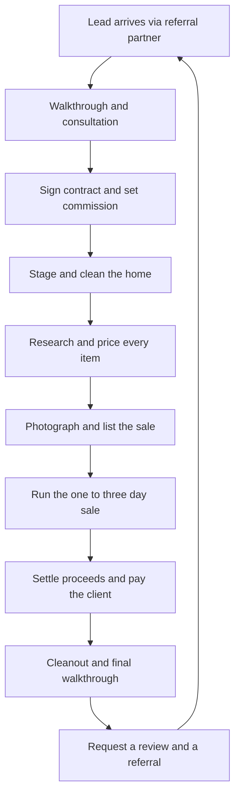

### Direct Answer

You start an estate sale company in 2027 by registering as an LLC with bonding and a care-custody-and-control rider on your general liability policy, then booking your first 3-5 sales through probate attorneys, senior-move managers, and realtor referrals rather than paid advertising. The model works because you charge a 30-40% commission on gross sale proceeds while carrying almost no inventory cost — the homeowner's possessions are your inventory, the homeowner's house is your venue, and your cost of goods sold is effectively zero. A solo operator running two sales a month at an average $18,000 gross clears roughly $110,000-$140,000 in year one; the binding constraint is never demand — that scales automatically with the aging population — but trust, throughput, and the speed at which you can stage, research, price, and clear a full house without burning out.

> **TLDR**
> - **Startup cost is low ($6,000-$15,000)** — the spend is bonding, insurance, a POS/inventory app, signage, tables, display cases, and a cargo van or trailer. You never buy stock.
> - **Revenue is commission-based:** 30-40% of gross sale proceeds, plus optional buyout, cleanout, and consignment-overflow fees. A typical full-house sale grosses $12,000-$30,000.
> - **Lead flow comes from referral partners** — probate and elder-law attorneys, senior-move managers, realtors, and trust officers — not from advertising. Build 8-12 active partners and you never cold-prospect again.
> - **The bottleneck is throughput:** staging, researching, and pricing a 2,500 sq ft home takes 40-70 labor-hours. Master this and you can run 3-4 sales a month.
> - **2027 tailwinds:** 11,000+ Americans turn 73 every day, "silver tsunami" downsizing is structural, and AI pricing tools (benchmarked against platforms like eBay (EBAY), Etsy (ETSY), and live-auction marketplaces) have roughly halved research time.
> - **Biggest risks:** liability for injury or theft on-site, mispricing high-value antiques, neighbor/HOA friction, shrinkage, and seasonal demand swings — all manageable with process and the right policy.
> - **The moat is reputation:** you transact with each client exactly once, so every sale is an audition for the referral partner watching.

---

## 1. Why The Estate Sale Business Works In 2027

### 1.1 The Demographic Engine Behind The Demand

The estate sale industry exists for one structural reason: households dissolve. They dissolve through death, through downsizing, through divorce, through relocation, and through the single most common trigger of all — the move from a long-held family home into assisted living or a smaller residence. Every one of those events produces a house full of furniture, kitchenware, tools, books, linens, collectibles, and decades of accumulated possessions that the family will not, cannot, and frequently does not want to keep. Someone has to convert all of it into cash, donations, and haul-away in a compressed window. That someone is an estate sale company.

In the United States the dominant force behind this is demographic and it is not subtle. Roughly 11,200 Americans turn 73 every single day through the end of the decade, and the youngest members of the baby boom generation will all be past 63 by 2027. The U.S. Census Bureau projects that adults aged 65 and older will outnumber children under 18 for the first time in national history within this exact window. This is not a trend that reverses; it is a once-in-a-century population bulge moving through the ages at which downsizing, estate settlement, and the transfer of household goods peak.

The National Association of Senior & Specialty Move Managers (NASMM) — a trade body that barely existed a generation ago — has grown to well over 1,000 member firms, and every one of those move managers is a working professional whose clients need exactly the service you sell. The probate pipeline is equally structural: roughly 2.8 million Americans die each year, and a substantial share of those estates pass through probate court, where the appointed executor or personal representative has a legal duty to convert the decedent's personal property to cash for distribution to heirs. That executor is rarely equipped to price a mid-century credenza, a coin collection, or a garage full of woodworking tools. That executor needs you, and a probate judge's calendar effectively sets your deadline.

Demand for this service is also remarkably insensitive to the economy. People do not stop dying, downsizing, divorcing, or relocating in a recession — and if anything, financial stress accelerates downsizing because families cash out assets sooner. This counter-cyclical quality is rare among small businesses and it is one reason estate sales pairs operationally with adjacent service businesses that ride the same demographic wave, such as junk removal (q9586) and move-out cleaning (q2114). The estate sale company sits at the profitable center of a household's dissolution; the cleaners, haulers, and movers orbit around it.

It is worth being precise about the five distinct triggers that produce an estate sale, because each one reaches you through a different referral channel and each one carries a different emotional tone. **Death** is the trigger most people associate with the term, and it arrives through probate attorneys and funeral directors; the client is an executor on a court timeline. **Downsizing into assisted living or a smaller home** is, in volume terms, the larger source — it arrives through senior-move managers and elder-law attorneys, and the client is often the senior themselves, alive and present, which changes the emotional register entirely. **Divorce** produces sales of jointly owned households and reaches you through family-law attorneys. **Relocation** — a corporate transfer, a move across the country, a move abroad — produces sales where the client simply cannot take the contents and reaches you through realtors and relocation services. **Foreclosure and financial distress** produce a smaller but steady stream. A mature operator deliberately cultivates referral partners across all five triggers so that no single channel drying up — a slow probate quarter, a quiet relocation season — leaves the calendar empty.

### 1.2 The Commission Model And Why Margins Hold

An estate sale company almost never owns the goods it sells. You are a contracted agent. You stage, research, price, market, staff, and run a one-to-three-day sale inside the client's home, and then you take a commission off the gross. This is a structurally different — and far more capital-efficient — business than a thrift store (q1957) or an antique-resale operation, both of which sink real cash into inventory and carry it on the books, sometimes for months, until it sells or is marked down to nothing.

Because you carry no inventory and your venue is free (it is the client's house), your cost of goods sold is effectively zero and your fixed overhead is minimal. Your costs are labor, marketing, insurance, software, fuel, and consumables. There is no rent on a retail floor, no warehouse, no dead stock tying up working capital. That structure is why a well-run sale converts a large fraction of gross revenue into operator margin, and why the business can be started on a credit card rather than a bank loan.

| Cost component | Inventory-owning model (thrift / antique resale) | Estate sale commission model |
|---|---|---|
| Cost of goods | 40-60% of revenue | 0% — the client owns the goods |
| Venue / rent | $1,500-$6,000 per month, fixed | $0 — the sale runs in the client's home |
| Inventory risk | High — unsold stock is dead capital | None — unsold goods remain the client's |
| Cash required to start | $30,000-$150,000 | $6,000-$15,000 |
| Revenue per engagement | Continuous, low-ticket transactions | $4,000-$12,000 net per multi-day sale |
| Primary scaling constraint | Floor space and inventory capital | Labor throughput per sale |
| Cash-flow profile | Daily trickle | Lumpy, per-sale lump sums |

The trade-off is honest: you give up the steady daily revenue of a storefront in exchange for capital efficiency and lumpy, project-based income. For a founder with limited cash and a tolerance for irregular pay, that trade is overwhelmingly favorable.

### 1.3 What 2027 Specifically Changes

Estate sales is an old business, but four things make 2027 a meaningfully better-than-average year to enter it.

First, **AI-assisted pricing and identification tools have matured into something genuinely useful.** An operator can photograph an unfamiliar item — a maker's mark on a piece of pottery, a signature on a print, a stamp on a piece of flatware — and get a comparables-based valuation against eBay (EBAY) sold listings, Etsy (ETSY) vintage-category data, and live-auction result databases in seconds. Historically, research and pricing was the single most time-expensive part of the job; an experienced appraiser's eye took years to build. The 2027 tools do not replace that eye for the rare and unusual, but they collapse the time spent on the 90% of items that are ordinary, and that compression directly raises how many sales an operator can run per month.

Second, **the cashless shift is complete.** Buyers expect to tap a phone, and point-of-sale tools from Square — a Block (XYZ) company — and Shopify (SHOP) point-of-sale handle estate-sale volume natively: multiple checkout lanes, item-level tracking, real-time totals, and instant reconciliation. The cash-handling and end-of-day counting headaches that plagued operators in the 2010s, along with the shrinkage that came with loose cash, are largely solved.

Third, **the listing and discovery layer has consolidated.** Serious estate-sale shoppers — resellers, dealers, collectors, and committed bargain hunters — now find sales through a small number of aggregator platforms and through operators' own email lists. This means a brand-new company with no reputation can still pull 150-400 shoppers to a well-photographed, well-categorized sale on its very first day, simply by listing in the right places. The discovery problem that once protected incumbents is largely gone.

Fourth, **the supply of clients is rising faster than the supply of competent operators.** The demographic wave is well documented, but estate-sale work is physical, detail-heavy, and emotionally demanding, so the pool of people willing and able to do it well is not expanding nearly as fast as demand. In most metro markets, a competent, bonded, professional operator who answers the phone and shows up on time has more lead flow available than they can personally service within their first year.

---

## 2. Legal Setup, Licensing, And Insurance

### 2.1 Choosing And Registering Your Entity

Form a limited liability company (LLC) before you run a single sale. This is not optional bureaucratic caution — it is a direct response to the genuine risk profile of the work. You are inviting members of the public into a private home, handling other people's valuables and cash, and signing contracts with executors who themselves carry a fiduciary duty to heirs. If a shopper falls on a staircase, if your crew shatters a china cabinet, or if an heir later disputes the price a Tiffany lamp sold for, the LLC is the wall between that liability and your personal house, car, and savings. A sole proprietorship offers no such wall.

The mechanics are straightforward and inexpensive. You do not need a Delaware or Wyoming entity — those structures offer no advantage for a local service business and add an out-of-state filing burden. Register in the state where you will actually operate.

| Step | Typical cost | Notes |
|---|---|---|
| LLC formation (state filing) | $50-$500 | Varies widely by state; pay only the state's own fee |
| Registered agent | $0-$150 per year | You can serve as your own agent in your home state |
| EIN from the IRS | $0 | Required for a business bank account; apply directly, never pay a third party |
| Operating agreement | $0-$400 | Use a template even as a single-member LLC; it reinforces the liability shield |
| Business bank account | $0 | Essential — client funds must never mix with operating funds |
| Accounting software | $0-$30 per month | Track every sale's gross, commission, fees, and client payout separately |

The business bank account is more than housekeeping. Because you collect gross proceeds that belong to the client and then remit their share, you are effectively holding funds in trust between the sale and the payout. A clean, separate account — and ideally a separate client-funds ledger within your accounting software — protects you in any dispute and is exactly the kind of operational discipline a trust officer or attorney will quietly check before referring you a second time.

### 2.2 Licensing And The Bonding Question

Licensing for estate sale companies is fragmented, local, and inconsistently enforced — which is precisely why it trips up new operators. There is no federal license for this work. The requirements that do exist live at the city and county level, and they typically include some combination of the following:

- **A general business license** from the city or county where you operate, renewed annually.
- **A "secondhand dealer" or "estate sale" permit** in some municipalities. This is the single most-missed requirement in the industry. It is frequently enforced reactively — a competitor or a disgruntled neighbor files a complaint, and only then does the city come knocking — which lulls new operators into thinking it does not apply to them until it suddenly does.
- **A garage-sale or temporary-sale permit per event** in some towns, because an estate sale is legally treated as a high-volume yard sale, sometimes with caps on the number of permitted sale days per address per year.
- **An auctioneer license** — but only if you conduct live competitive bidding. A fixed-price sale or a staged-markdown sale (full price day one, discounted later) does not require an auctioneer license in most states. If you intend to run live auctions, that is a separate licensing track in most jurisdictions and you should plan for it explicitly.
- **Sales tax registration**, because in most states the items you sell at an estate sale are taxable, and you — not the homeowner — are typically the merchant of record responsible for collecting and remitting it.

The single most reliable way to get this right is to call the city or county clerk directly and ask, in plain language, "I am starting an estate sale company; what permits do I need to run a sale at a residential address, and do you require a secondhand-dealer permit?" Five minutes on the phone beats a year of guessing.

**Bonding matters more than most new operators expect.** A surety bond — typically a $10,000-$25,000 bond costing somewhere between $100 and $400 a year for an operator with reasonable credit — is a guarantee to your clients that you will handle their funds and their property honestly. It is not insurance for you; it is a financial promise to them, backed by a surety company. The reason it matters operationally is that your highest-value referral partners — probate attorneys, elder-law attorneys, and bank trust officers — will ask whether you are "licensed, bonded, and insured" as a single reflexive phrase. Being able to answer "yes, here is my certificate" is a gating requirement for the lead sources that produce the largest, cleanest estates. An unbonded operator is quietly filtered out of that conversation.

### 2.3 The Insurance Stack You Cannot Skip

Insurance is the line item that new operators most consistently under-buy, and it is the one whose failure most reliably ends the business. The fatal mistake is buying a bare general liability policy and assuming it covers everything. It does not. You need a layered, deliberately constructed stack.

- **General liability ($1M per occurrence / $2M aggregate):** covers third-party bodily injury and third-party property damage. The classic claim is a shopper slipping on an icy driveway or tripping on a loose stair runner during your sale. This is non-negotiable and is the base layer.
- **A care, custody, and control rider (also called a property-in-care rider or a household-goods rider):** this is the most important and most overlooked coverage in the entire business. Standard general liability *explicitly excludes* damage to property that you are handling, holding, or controlling for someone else. The client's goods are, by definition, in your care, custody, and control during the sale. Without this rider, if your crew drops a client's antique mirror, the policy denies the claim and you pay out of pocket — and in a bad case, the payout exceeds the entire commission. If you remember one sentence from this section, remember this one: buy the care-custody-and-control rider.
- **Theft and dishonesty coverage:** often bundled with the surety bond, this covers loss of client cash or goods, including theft by your own employees. Estate sales handle valuables and, in the cashless era, somewhat less cash — but jewelry, coins, and small collectibles still walk.
- **Commercial auto insurance:** your personal auto policy will not cover a van or truck used to haul goods for a business, and a denied claim after an at-fault accident in your work van is a business-ending event.
- **Workers' compensation:** required in nearly every state the moment you hire your first W-2 employee. Estate sale work involves lifting heavy furniture and climbing into attics and basements — back injuries and falls are real — so this is both a legal requirement and genuine protection.
- **A small umbrella policy** is worth considering once you are running consistently, layering an extra $1M of catastrophic coverage above the others for a modest premium.

| Coverage | Annual cost (solo operator) | What it protects |
|---|---|---|
| General liability $1M / $2M | $500-$1,200 | Shopper injury; damage to the client's home itself |
| Care / custody / control rider | $200-$600 | Damage to the client's goods while in your care |
| Surety bond ($10K-$25K) | $100-$400 | Honest handling of client funds and property |
| Theft / dishonesty | $150-$400 | Loss of client cash or valuables, including employee theft |
| Commercial auto | $1,200-$2,400 | Business use of your van or trailer |
| Workers' compensation | Varies with payroll | Crew injury on the job |

A reasonable all-in insurance and bonding budget for a solo year-one operator is **$1,500-$3,500 annually**. Do not treat this as overhead to be trimmed. Treat it as the price of admission — the cost of being legally and financially allowed to do the work at all. An operator who skips the care-custody-and-control rider to save $400 a year is one dropped curio cabinet away from insolvency.

---

## 3. Startup Costs And The Year-One Budget

### 3.1 The Realistic Startup Range

Estate sales is one of the lowest-capital businesses in the entire home-services adjacency, and the reason is structural: you buy no inventory and you rent no space. Set it against a self-storage facility (q9663), which requires hundreds of thousands of dollars in land and construction, or even a residential cleaning operation (q2114), which still needs vehicles, equipment, and supplies — estate sales sits at the very bottom of the capital ladder. The largest single expense most new operators face is a vehicle, and many sidestep even that by using a van they already own or renting one per job.

| Category | Lean start | Comfortable start |
|---|---|---|
| LLC formation, permits, bonding | $300 | $900 |
| Insurance (first-year prepay) | $1,200 | $2,800 |
| POS / inventory / pricing software | $0 (free tiers) | $900 per year |
| Tables, shelving, display cases | $600 | $2,400 |
| Lockable jewelry / high-value case | $120 | $450 |
| Signage, A-frames, directional signs | $250 | $700 |
| Cargo van or trailer | $0 (use existing) | $4,000 (used trailer) |
| Tagging supplies, jewelry loupe, tools | $200 | $500 |
| Website and listing-platform fees | $150 | $600 |
| Marketing and launch | $300 | $1,000 |
| Working-capital buffer | $1,000 | $2,000 |
| **Total** | **~$4,420** | **~$16,750** |

Most operators land in the **$6,000-$15,000** range. The single biggest swing factor is the vehicle decision: if you already own a van, a pickup, or can rent one per-job during your first months, you immediately remove $4,000-$8,000 from the budget. The second-largest swing is how much display equipment you buy up front versus accumulate over your first few sales. There is no need to own forty folding tables before sale number one; buy what your first sale needs and reinvest the first commission into the next tier of equipment.

### 3.2 Monthly Operating Costs Once Running

Once the business is running, the cost base is genuinely light. The defining feature of the operating model is that the largest cost — crew labor — is variable and per-event, so it scales down to nearly nothing in a slow month and only rises when revenue rises alongside it.

| Recurring cost | Monthly range | Fixed or variable |
|---|---|---|
| Insurance and bond (amortized) | $130-$300 | Fixed |
| Software subscriptions (POS, listing, accounting) | $60-$200 | Fixed |
| Fuel and vehicle upkeep | $150-$400 | Semi-variable |
| Per-event crew labor (helpers at $15-$22/hr) | $400-$1,400 per sale | Variable |
| Marketing (email tools, occasional boosted posts) | $50-$200 | Semi-fixed |
| Phone, supplies, tagging consumables, misc. | $100-$250 | Semi-variable |
| Storage unit (optional, for buyout overflow) | $0-$200 | Optional |

Per-event labor is the largest variable cost and, importantly, the one you control most directly. A solo operator running a small condo sale spends almost nothing on crew. The same operator running a 4,000 sq ft estate with a packed garage and a finished basement may need a four-person team across a three-day sale. Because labor scales with the job, the business is hard to lose money on in a slow month — your downside is protected by the cost structure itself.

### 3.3 Pricing Your Service: The Commission Structure

The industry-standard commission is **30-40% of gross sale proceeds**, and exactly where you land within that band is a function of estate size, the condition and quality of the goods, your local market, and competitive pressure. The most common mistake new operators make is treating the commission as a single fixed number. It should flex with the economics of each individual estate.

- **35% is the safe default** for a clean, average single-family-home sale with a reasonable mix of furniture and household goods.
- **40-45% is justified** for small estates (under roughly $8,000 in expected gross), for sales requiring heavy cleanout or hauling, and for difficult logistics — a third-floor walk-up, a rural location, a hoarding situation. Your fixed labor cost per sale does not shrink just because the estate is small, so a small estate at a low commission rate can actually lose you money.
- **25-30% is competitive pricing** for a large, high-value estate ($40,000 or more in expected gross), where the absolute dollar take is large even at a reduced percentage and where you may be bidding against other companies for the engagement.
- **Add-on fees capture the work that commission alone underpays.** A flat **cleanout or broom-sweep fee** ($300-$1,500) covers hauling, donating, and disposing of everything that does not sell. A **trip or setup minimum** protects you on tiny estates. A **buyout option** — where you purchase the entire contents outright at a steep discount — serves families who value speed and certainty over maximum return, and it can be quietly profitable if you have a resale channel for the contents.

| Estate expected gross | Typical commission | Operator gross take | Add-on guidance |
|---|---|---|---|
| Under $8,000 | 40-45% | $3,200-$3,600 | Always charge a setup minimum |
| $8,000-$20,000 | 35-38% | $2,800-$7,600 | Add a cleanout fee on top |
| $20,000-$40,000 | 30-35% | $6,000-$14,000 | Optional cleanout fee; negotiate |
| $40,000+ | 25-30% | $10,000+ | Volume justifies the lower rate |

A disciplined operator quotes the commission *after* the walkthrough, not before, because only the walkthrough reveals the true economics. Quoting a flat 35% over the phone before you have seen the house is how operators end up working 60 hours on a $5,000 estate.

One further pricing decision deserves attention: how you handle the genuinely high-value anchor items. Most estates contain a small number of pieces — a piano, a coin collection, a piece of fine art, a vehicle, a quantity of sterling — that are worth more than all the household goods combined. Selling these at a fixed-price estate sale is often the wrong move, because a single dealer can buy them at a discount before the public ever sees them. The disciplined approach is to identify these anchors at the walkthrough and decide deliberately: sell them at the in-home sale only if the market is genuinely there, route them to a specialist auction house, take competing dealer bids in advance, or list them separately online. The commission contract should explicitly cover how anchor items are handled and priced, so the client is never surprised. Mishandling one anchor item can erase the entire profit of a sale and, worse, the relationship behind it.

---

## 4. The Operational Playbook: Running A Sale End To End

### 4.1 The Full Sale Lifecycle

The work of an estate sale is not improvised. It is a repeatable, eight-stage pipeline, and the operators who make money are the ones who treat it as a process with clean handoffs between stages rather than as a heroic scramble. The diagram below maps the full lifecycle from the moment a lead arrives to the moment that completed sale generates the next lead.

The loop closing back on itself is the entire point. A sale that ends with a delighted client and a satisfied referral partner is not the end of one job — it is the origin of the next two or three. An operator who runs the first seven stages flawlessly and then skips stage nine has thrown away the most valuable output of all the work that came before.

### 4.2 Step-By-Step Execution

**1. The walkthrough and consultation.** Before you sign anything, you walk the entire home with the client. You assess the volume and the quality of the goods, you identify the high-value items that will anchor the sale, and you flag the potential problems early: firearms (which carry their own transfer rules), hazardous materials, items with unclear ownership, and anything an heir might later claim should not have been sold. Critically, you give the client a *realistic, conservative* gross estimate. This is the moment that determines whether they ever refer you. An executor told to expect $25,000 who receives $14,000 feels cheated and refers no one; an executor told to expect $12,000 who receives $14,000 feels you over-delivered and becomes a referral source for years. Under-promise here, always.

**2. The contract.** A written contract is mandatory and protects every sale that follows. It must specify the commission rate, who pays for advertising and consumables, the precise sale dates, exactly how unsold items will be handled, and the payment timeline — the industry norm is that the client is paid in full within 7 to 14 days of the sale's close. It must also state clearly and unambiguously that you are acting as an *agent*, not as a buyer, and that there is no guaranteed minimum proceeds. Have an attorney review your template once; reuse it forever.

**3. Staging and cleaning the home.** You pull goods out of closets, attics, basements, and garages and bring them into the main living areas. You group like items with like — all the kitchenware on one set of tables, all the tools in the garage, all the linens together. You create a clean, well-lit, browsable retail environment, because a house that looks like a store sells like a store and a house that looks like a cluttered basement sells like one. This is also where a working relationship with a junk-removal partner (q9586) earns its keep: you will surface items with genuinely zero resale value that simply need to leave the premises before the sale.

**4. Research and pricing.** This is the most skill-intensive stage and historically the most time-expensive. Every single item that will be sold gets a price tag. The ordinary 90% — glassware, paperbacks, common kitchen tools — gets priced quickly from experience and from the AI comparables tools. The high-value categories — jewelry, coins, fine art, antiques, mid-century furniture, firearms, designer goods, sterling silver — get genuine research against sold comparables, and when the stakes are high enough you bring in or refer to a specialist appraiser. Mispricing here is the single largest financial risk in the business, addressed directly in Section 7.

**5. Photography and listing.** You photograph the best 30-60 items in good light and you list the sale on the major aggregator platforms and to your own email list, ideally 5 to 10 days out. Listing quality is not a vanity exercise — it is the direct driver of day-one foot traffic, and day-one traffic is when the best items sell at the best prices.

**6. Running the sale.** A typical sale runs Friday through Sunday. Day one is full price, day two is commonly 25% off, and day three is often 50% off — staged markdowns clear inventory progressively while protecting the value of the best pieces, which sell early to serious buyers. You staff the entry (counting heads, managing the early-bird line), the checkout, and the high-value room — jewelry, coins, small valuables — with separate, dedicated people, because that high-value room is where shrinkage happens.

**7. Settlement.** After the sale closes, you reconcile the POS totals, deduct your agreed commission and any add-on fees, and pay the client by check accompanied by a clear, itemized statement showing gross proceeds, your deductions, and their net. Transparency at this stage *is* your reputation. A client who can see exactly where every dollar went trusts you, and a trusting client refers you.

**8. Cleanout and the referral ask.** You arrange the removal of everything that did not sell — donation, consignment overflow, or haul-away — and you do a final walkthrough with the client so they can confirm the home is in the agreed condition. Then, while their gratitude is fresh and concrete, you ask directly for an online review and for a referral. Most operators do all the hard work and then are too shy to ask. Do not be. The ask is part of the job.

### 4.3 Throughput: The Real Constraint

Once you internalize that demand is effectively unlimited, the only question that matters for growth is how many labor-hours each sale consumes. The table below is the operational heart of the business.

| Home size | Staging hours | Pricing hours | Sale-day labor | Total labor-hours |
|---|---|---|---|---|
| Condo / one-bedroom | 8-14 | 6-12 | 18-24 | 32-50 |
| Two-to-three-bed single-family | 16-28 | 14-26 | 30-45 | 60-99 |
| Four-plus-bed / collector estate | 30-60 | 30-70 | 50-90 | 110-220 |

The number that governs your income: a **solo operator** can comfortably run about **2 sales a month**; with **one trained helper**, about **3**; with a **small crew plus a dedicated pricing specialist**, **4 to 5**. Your growth path is therefore not "find more customers" — that is the easy part — it is "compress the labor-hours per sale without dropping quality." Every hour you remove from staging and pricing is an hour you can spend on another sale, and at $5,000 net per average sale, those hours are extremely valuable. The operators who scale are relentless about checklists, repeatable staging patterns, and offloading pricing research to tools and trained specialists.

### 4.4 Sale-Day Logistics And Crowd Control

Sale day itself is a distinct operational discipline that new operators consistently underestimate. A well-listed sale in a metro market can draw a line of 30 to 80 people before the doors open, and how you manage that opening surge determines both your shrinkage rate and your client's experience.

The proven practices are concrete. Set a published opening time and hold to it; serious dealers arrive early and a chaotic, unfair entry damages your reputation with the exact buyers who spend the most. Many operators hand out numbered tickets to the early-bird line so that entry order is fair and visible. Cap the number of shoppers inside the home at once — a crowded house is both a theft risk and a genuine safety hazard on stairs — and use a one-in-one-out count once the cap is reached. Station a person at the door, a person at every checkout lane, and a dedicated monitor in the high-value room. Keep jewelry, coins, and small valuables in a locked case and bring items out for inspection on request rather than leaving them on an open table.

| Sale-day role | Primary responsibility | Why it matters |
|---|---|---|
| Door / entry | Count heads, manage the early-bird line, enforce the cap | Prevents overcrowding and unsafe conditions |
| Floor staff | Answer questions, reset displays, watch for tag-swapping | Sustains sales pace and deters shrinkage |
| High-value monitor | Supervise the locked jewelry and collectibles area | Protects the highest-margin items from theft |
| Checkout | Run the POS, bag items, capture shopper emails | Keeps the line moving and builds the buyer list |
| Float / runner | Carry sold furniture out, restock thinning tables | Keeps the house looking full and shoppable |

Pricing-day discipline carries into sale day through your markdown policy: communicate the schedule clearly (full price Friday, 25% off Saturday, 50% off Sunday) so dealers know when to commit. Hold firm on the best pieces early — the serious buyers who arrive first will pay full price for the genuinely good items, and discounting those on day one simply gives away margin that belonged to your client.

---

## 5. Getting Customers: The Referral-Partner Engine

### 5.1 Why You Should Not Advertise To Homeowners

The reflexive instinct of every new service business is to advertise to the end customer — buy search ads, run social campaigns, distribute flyers. For an estate sale company this instinct is wrong, and understanding why is the difference between an operator who chases work forever and one who has a waiting list by month nine.

The homeowner or executor who needs you is in a one-time, emotionally heavy, often time-pressured situation. They are not browsing casually, they are not comparison-shopping for sport, and they have no intention of becoming a repeat customer — once their parent's house is cleared, they are done with you forever. When that person finally goes looking for an estate sale company, they do not trust an advertisement. They ask a professional they already trust: the probate attorney handling the estate, the realtor preparing to list the house, the move manager coordinating the relocation. Your entire customer-acquisition strategy is therefore not "reach the homeowner" — it is "*be the company that the trusted professional recommends*."

This is the same referral-network logic that drives a handyman service (q9614) or a pool service (q2118), where word of mouth beats advertising. But estate sales depends on it even more completely, because the end customer transacts with you exactly once and so can never become a repeat buyer. Your repeat business is structurally impossible at the homeowner level — it can only exist at the referral-partner level. The partner is the customer who comes back.

### 5.2 The Eight Referral-Partner Categories

There are eight distinct categories of professional who routinely sit between a grieving or downsizing family and the estate sale they need. Your job in your first 90 days is to build relationships across them.

| Partner type | Why they refer you | How to reach and earn them |
|---|---|---|
| Probate / estate attorneys | Executors ask them directly "who clears the house?" | In-person visits with a one-page capability sheet |
| Elder-law attorneys | Their clients downsize for Medicaid and care planning | Lunch-and-learns and short CE-style presentations |
| Senior-move managers (NASMM) | They manage the move; you handle the contents sale | Join and attend the local NASMM chapter |
| Realtors (senior-focused / SRES) | A staged, emptied house lists and sells faster | Be reliable, fast, and easy to schedule around a closing |
| Trust officers / bank trust departments | They administer estates and need a vetted vendor | Complete their formal vendor-approval process |
| Hospice and assisted-living social workers | Families ask them for practical next-step resources | Drop off tasteful resource cards; never be pushy |
| Professional organizers / downsizing coaches | They declutter; you monetize the saleable surplus | Build a genuine two-way cross-referral relationship |
| Funeral home directors | Families ask them what comes after the service | Patient, respectful, low-key relationship-building |

The math of this engine is forgiving. Build just **8 to 12 active referral partners** and you will have more qualified lead flow than a solo operator can physically service. A single productive probate attorney can send you one to three estates a month. You do not need hundreds of relationships; you need a dozen good ones, nurtured with the consistent reliability that makes a professional comfortable attaching their own reputation to yours.

### 5.3 The Buyer Side: Building Your Shopper List

It is essential to recognize that you serve two entirely different customers. The **client** is the homeowner or executor who hires you and pays your commission. The **shoppers** are the resellers, antique dealers, collectors, interior decorators, and committed bargain hunters who actually buy the goods. Both matter, and your shopper email list is one of the most valuable assets you will ever build.

That list is an appreciating asset because the same shoppers return to sale after sale. You capture every shopper's email and phone number at checkout — the POS makes this frictionless — and you send a "next sale" announcement 5 to 7 days before each event. Within a year, a diligent operator can pull 100 to 250 known, motivated buyers to any sale before a single public platform listing even goes live. A strong buyer list does more than fill the room: it raises your sell-through rate, a higher sell-through rate raises your client's gross proceeds, a higher gross makes the client happier and your results more impressive, and impressive results make your referral partners more confident. The two customer bases reinforce each other. It compounds.

### 5.4 Online Listing And Discovery

Every sale gets listed on the major estate-sale aggregator platforms — these are where the serious, money-spending shoppers actively look — supplemented by local online marketplace groups and your own website. A strong listing has 30 or more well-lit photographs, a clear statement of when the exact address is released, and explicit category callouts so dealers know whether to come: "mid-century furniture, sterling silver flatware, vintage hand tools, costume and fine jewelry, vinyl records, fishing gear." Vague listings draw browsers; specific listings draw buyers. The discovery layer genuinely does the work — a well-listed, well-photographed sale in a metropolitan area routinely draws 200 to 500 shoppers across a weekend with zero spend on paid advertising. That is the practical proof of why you do not need to advertise to homeowners: the shoppers find the sale, the referral partners find you.

---

## 6. Financial Model: What You Actually Earn

### 6.1 A Realistic Year-One Projection

The projection below models a solo operator who spends the first quarter building referral relationships, runs a first sale in month two, and ramps to a steady two sales a month by month six. It assumes an average sale gross of $18,000, a blended commission of 36%, and an average of $500 in add-on and cleanout fees per sale. These are deliberately moderate, defensible assumptions for an average-cost-of-living metro market.

| Metric | Year 1 | Year 2 | Year 3 |
|---|---|---|---|
| Sales completed | 16 | 28 | 40 |
| Average gross per sale | $18,000 | $20,000 | $22,000 |
| Blended commission rate | 36% | 35% | 34% |
| Commission revenue | $103,680 | $196,000 | $299,200 |
| Add-on and cleanout fees | $8,000 | $16,800 | $26,000 |
| **Total revenue** | **$111,680** | **$212,800** | **$325,200** |
| Crew labor cost | ($14,000) | ($38,000) | ($68,000) |
| Insurance, bond, software | ($5,500) | ($7,500) | ($10,000) |
| Vehicle, fuel, supplies | ($7,000) | ($11,000) | ($16,000) |
| Marketing | ($2,500) | ($4,000) | ($6,000) |
| **Owner earnings (pre-tax)** | **~$82,680** | **~$152,300** | **~$225,200** |

Year one earnings are genuinely strong for a business started on under $15,000. The year-three figure reflects a deliberate transition — covered in Section 6.3 — from a solo operator who personally touches every sale to a crew-leveraged business with a dedicated pricing specialist, which is the only way the sale count rises to 40 without the owner working unsustainable hours.

### 6.2 Unit Economics Of A Single Sale

Annual projections obscure the per-sale economics that actually drive the business. The table below breaks down three representative sales — a small condo, an average home, and a large estate — so the real margin structure is visible.

| Line item | Small condo sale | Average home sale | Large estate sale |
|---|---|---|---|
| Gross sale proceeds | $7,000 | $18,000 | $42,000 |
| Commission rate | 42% | 36% | 30% |
| Commission revenue | $2,940 | $6,480 | $12,600 |
| Add-on / cleanout fee | $400 | $600 | $1,200 |
| Crew labor cost | ($350) | ($900) | ($3,200) |
| Supplies, fuel, listing | ($250) | ($450) | ($900) |
| **Net per sale** | **$2,740** | **$5,730** | **$9,700** |
| Approximate labor-hours | 40 | 80 | 165 |
| **Net per labor-hour** | **$69** | **$72** | **$59** |

The net-per-labor-hour line is the one to study. Notice that the small condo sale, despite its modest gross, actually delivers a competitive hourly return — *because* you charged a 42% commission and a setup minimum. Notice too that the large estate, despite its impressive $9,700 net, returns a slightly lower hourly rate, because crew labor scales steeply with size. This is the quantitative argument for charging higher commission rates on small estates: it is not greed, it is the only way to keep a small sale's hourly economics from collapsing.

### 6.3 The Path To $250K And Beyond

Scaling an estate sale company past roughly a quarter-million dollars in revenue requires one deliberate change in mindset: you must decouple owner time from sale count. A solo operator is hard-capped at roughly 24 sales a year, and no amount of effort breaks that ceiling. The growth levers, in descending order of impact:

1. **Hire and train a dedicated pricing specialist.** Pricing research is the largest, most time-expensive, and most easily delegated stage. A trained specialist using the AI comparables tools removes the single biggest bottleneck and means research no longer waits on the owner's calendar.
2. **Build a standing crew of three to five reliable part-timers** paid per sale. A consistent crew that knows your staging patterns sets up faster, runs the floor better, and lets you book overlapping sales.
3. **Add a buyout / quick-cash channel** for the meaningful share of families who genuinely cannot wait two weeks for a full sale — a probate executor under court deadline, an out-of-state heir, a fast home closing. A buyout converts a "no" into profitable revenue if you have a resale outlet.
4. **Create a consignment-overflow relationship** so that genuinely valuable items that did not sell at the in-home sale keep earning through an antique mall, an auction house, or an online channel rather than being given away in the cleanout.

Operators who execute all four of these levers routinely run a $300,000-$500,000 business. The ceiling above that level usually means one of two moves: opening a second geographic market with its own crew and referral network, or formalizing and licensing the playbook so others can run it under your brand. Both are real options, but both require that the core process first be documented well enough that it does not live only in the founder's head.

It is also worth being explicit about the metrics a scaling operator should track, because "run more sales" is too vague to manage against. The four numbers that matter most are: **sell-through rate** (the percentage of an estate's expected gross actually realized — a strong operator clears 70-90% of fair value), **labor-hours per $1,000 of gross** (the efficiency ratio that, when it falls, directly raises your hourly earnings), **referral-partner concentration** (what share of your leads comes from your single largest partner — above 40% is a dangerous dependency), and **repeat-partner rate** (the share of partners who have sent you a second estate, which is the truest measure of whether your work is actually referable). An operator who reviews these four numbers monthly will see problems — a slipping sell-through, an over-concentrated lead source — long before they show up in the bank balance.

---

## 7. Counter-Case: Why This Business Is Harder Than It Looks

### 7.1 The Honest Risks

The low startup cost and the abundant, recession-resistant demand make estate sales sound almost too easy. It is not easy, and an honest founder should weigh the following failure modes carefully before committing capital and a year of their life.

**The work is physically and emotionally demanding.** You will spend long days on your feet, lifting furniture, carrying boxes down basement stairs, and climbing into attics — and you will do all of it inside the homes of people who are frequently in active grief. Your clients are often executors processing the death of a parent, sorting through a lifetime of their family's belongings with you standing beside them. The job is part logistics, part retail, and part emotional labor, and that third part is the one new operators consistently underestimate. Burnout — not lack of demand — is the most common reason solo operators quit within their first two years.

**Mispricing is a genuine financial and reputational risk.** Price a $4,000 antique at $40 and the family will eventually find out, and so, far worse, will the family's attorney — and that attorney refers no one to you again. Price the whole estate too aggressively and nothing sells: the room is full, nobody is buying, the client is distressed, and you have invested 60 labor-hours for a near-zero commission. Pricing skill takes years to fully develop. The 2027 AI comparables tools narrow the gap considerably, but they do not close it for the rare, the regional, and the genuinely unusual items, which are exactly the items where the dollars are largest.

**Liability is real and constant.** You invite the general public into a private home and you handle other people's valuable property. Slip-and-fall claims, theft of goods, accidental damage to the home itself, and disputes with heirs over what was sold and for how much are all live, recurring risks. This is precisely why the layered insurance stack in Section 2.3 is non-negotiable, and why under-insuring — especially skipping the care-custody-and-control rider — is the single fastest way to convert one bad afternoon into a closed business.

**Demand is lumpy and seasonal.** Spring and fall are the peak seasons for estate sales; deep winter and the December holiday stretch are reliably slow. And because you are paid per sale rather than on a subscription or retainer, cash flow is inherently irregular. A new operator without a working-capital buffer can be genuinely caught short in the gap between two sales, even though the annual numbers look healthy.

**Theft and shrinkage are a permanent operational tax.** Shoppers palm jewelry, swap price tags between items, and walk off with small valuables. Without dedicated checkout control, a monitor stationed in the high-value room, and disciplined tagging practices, 2 to 5% of a sale's gross can simply evaporate — and every dollar of that loss comes straight out of your client's proceeds and, by extension, your reputation.

**Competition and reputation risk compound.** Because the business is referral-driven and you transact with each client only once, a single badly handled sale — a damaged heirloom, a sloppy settlement statement, an unhappy neighbor — can cost you an entire referral relationship and the dozen future sales it would have produced.

### 7.2 When You Should NOT Start This Business

Honesty requires naming the founder profiles for whom this is a poor fit. If several of the rows below describe you, a different business is the wiser choice.

| Situation | Why it is a poor fit |
|---|---|
| You want passive or fully remote income | This is hands-on, on-site, physically present work |
| You have no local professional network | Referral partners take three to six months to develop; you may starve first |
| You cannot float 6-12 weeks of personal expenses | Your first commission may be two months away |
| You are uncomfortable around grief and loss | You will be working inside mourning households constantly |
| You expect never to lift heavy items | Furniture and box moving is unavoidable in the early years |
| You dislike detailed, repetitive research | Pricing thousands of items is the core daily skill |
| You need predictable, even cash flow | Income arrives in lumps, per sale, with seasonal gaps |

### 7.3 Honest Mitigations

None of the risks above is disqualifying on its own — each one is manageable with deliberate process, and the operators who survive their first two years are simply the ones who took the mitigations seriously from day one.

Apprentice with an established estate sale company for several sales before you go solo; there is no faster education in pricing, staging, and crowd control. Carry the complete insurance and bonding stack — including the care-custody-and-control rider — from the very first sale, not from "once I can afford it." Build a working-capital buffer equal to at least three months of personal living expenses before you quit other income. Specialize early: if your local market has a strong appetite for antiques, mid-century modern, or a particular collector niche, lean into it, get genuinely expert in it, and partner out the categories outside your strength. And above all, treat the referral network as the actual product of the business. The operators who last are not the ones with the best vans or the most folding tables — they are the ones a probate attorney trusts enough to recommend, by name, without a moment's hesitation.

---

## 8. Your First 90 Days: An Action Plan

### 8.1 Days 1-30 — Foundation

The first month is entirely about building the legal, financial, and knowledge foundation. You will not run a sale yet, and that is correct.

- **Form the LLC**, obtain an EIN directly from the IRS, and open a dedicated business bank account separate from all personal funds.
- **Bind the full insurance stack** — general liability with an explicit care-custody-and-control rider — and secure a surety bond. Get the certificates in hand.
- **Research local permits properly.** Call the city or county clerk directly and ask, specifically, about general business licenses, secondhand-dealer permits, temporary-sale permits, and sales-tax registration. Write down what they tell you.
- **Apprentice and observe.** Attend 5 to 10 local estate sales as a shopper to study pricing, layout, and crowd flow. If at all possible, volunteer or work a weekend with an established company to see the full workflow from the inside.
- **Set up your tools:** a point-of-sale system, an inventory and tagging app, an AI pricing-comparables assistant, accounting software, and a simple, professional one-page website.

### 8.2 Days 31-60 — Network And Equip

The second month is about building the referral engine and acquiring the equipment your first sale will need — no more, no less.

- **Build the referral list.** Identify and personally visit 15 to 20 probate attorneys, elder-law attorneys, senior-move managers, and SRES-credentialed realtors in your market, each with a clean one-page capability sheet that states plainly that you are licensed, bonded, and insured.
- **Join the local NASMM chapter** or attend its events, and introduce yourself to professional organizers and downsizing coaches as cross-referral partners.
- **Acquire only the equipment your first sale requires:** folding tables, basic shelving, a lockable jewelry and high-value case, A-frame and directional signage, a jewelry loupe, and tagging supplies. Rent or borrow a van for the first jobs rather than buying one.
- **Finalize your contract template** with a one-time attorney review. This single document protects every sale you will ever run.

### 8.3 Days 61-90 — Launch

The third month is the launch. Your first sale will most likely come from your apprenticeship contact or from the first attorney relationship that bears fruit.

- **Book and run your first sale.** Price the engagement conservatively — both the commission you quote and the gross you estimate for the client.
- **Run it deliberately and visibly.** Over-staff it, over-document it, photograph everything, settle transparently, and treat the entire job as a reference case you will point future partners toward.
- **Capture every shopper's email and phone number** at checkout to seed the buyer list that will fill every future sale.
- **Settle cleanly and ask directly.** Pay the client within the contracted window with an itemized statement, and then explicitly ask for an online review and a referral.
- **Debrief honestly.** Log your actual labor-hours room by room, your sell-through rate, and every pricing miss. Convert all of it into a written checklist for sale number two.

The first sale is always the hardest and the least profitable. By sale five, your process is genuinely real and repeatable. By sale ten, you are referable — partners have seen your work and trust it. By month nine, the dynamic has flipped entirely and you are choosing which estates to take rather than hoping the phone rings. Estate sales rewards the operator who treats it as a relationship business wrapped around a logistics discipline — and in 2027, with the demographic wind blowing fully and durably at your back, there has rarely been a better moment to start one.

---

### Related Questions

- How do you start a junk removal business in 2027? (q9586)
- How do you start a move-out cleaning business in 2027? (q2114)
- How do you start a self-storage facility business in 2027? (q9663)
- How do you start a non-medical senior home care agency in 2027? (q9670)
- How do you start a handyman service business in 2027? (q9614)
- How do you start a pool service business in 2027? (q2118)
- How do you start a thrift store business in 2027? (q1957)

---

*Sources & citations: U.S. Census Bureau population projections (2024); U.S. Census Bureau "65 and Older Population" report; CDC National Center for Health Statistics annual mortality data; National Association of Senior & Specialty Move Managers (NASMM) membership statistics; Pew Research Center "Baby Boomers" demographic analysis; Bureau of Labor Statistics Occupational Outlook Handbook (moving, hauling, and liquidation services); SCORE small-business startup-cost benchmarks; U.S. Small Business Administration (SBA) guidance on LLC formation and licensing; Internal Revenue Service EIN application guidance; National Association of Realtors Seniors Real Estate Specialist (SRES) program data; Insurance Information Institute general-liability and bonding overviews; The Surety & Fidelity Association of America bond-cost guidance; American Society of Appraisers valuation standards; International Society of Appraisers personal-property guidance; eBay (EBAY) sold-listing comparables data; Etsy (ETSY) vintage-category marketplace data; Block (XYZ) and Square point-of-sale merchant resources; Shopify (SHOP) point-of-sale documentation; National Funeral Directors Association consumer-resource data; AARP downsizing and estate-settlement guides; EstateSales.net and EstateSale.com industry listing-platform usage data; American Bar Association probate-process overviews; National Association of Estate Sale Professionals practice standards; IBISWorld personal-services industry reports; Kiplinger and Investopedia personal-finance estate-liquidation explainers; Consumer Reports downsizing guidance; state secretary-of-state business-registration portals; National Federation of Independent Business (NFIB) small-business cost surveys; Insureon and NEXT Insurance small-business policy-cost data; Genworth Cost of Care demographic-aging context; Administration for Community Living aging-population statistics; National Council on Aging downsizing resources; Nolo legal guides on probate and estate administration.*
