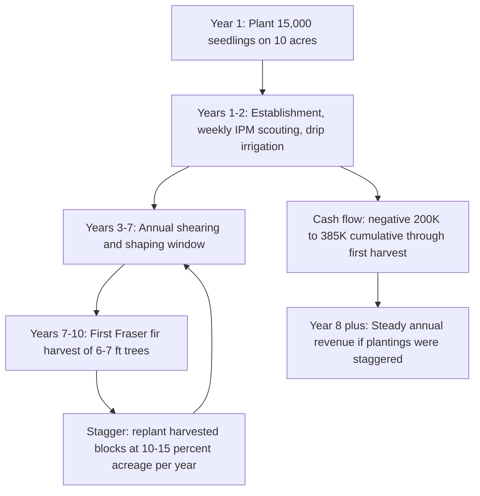

### Direct Answer

To start a Christmas tree farm business in 2027, secure 8-15+ acres of well-drained land in a region matched to your species (Fraser fir for cool-summer Appalachian high elevation, Douglas fir for the Pacific Northwest, Balsam fir for the Northeast and Great Lakes), plant 1,500-2,000 seedlings per acre at $0.40-$2.50 each, and budget $35K-$120K for the first 10 acres or $300K-$1.2M for a 50+ acre agritourism operation. The defining reality is a 7-10 year crop cycle: your year-one capital is locked up for a decade before the first tree sells, so you stagger plantings, fence out deer on day one, and build an agritourism revenue stack (pumpkin patch, hayrides, gift shop, wreaths) to escape commodity wholesale margins and bridge the 320 idle days between 42-day selling seasons.

> ### TL;DR
> - **Capital:** $35K-$120K for the first 10 acres (land lease/purchase + 15,000-20,000 seedlings + a compact tractor); $300K-$1.2M for a 50+ acre choose-and-cut operation with full agritourism.
> - **Crop cycle:** 7-10 years from Fraser fir transplant to a sellable 6-7 foot tree. Stagger annual plantings at ~10-15% of acreage so harvest age-classes overlap and income is continuous, not feast-or-famine.
> - **Margins:** Choose-and-cut retail $65-$185/tree at 30-55% net; wholesale to big-box $25-$55/tree at 8-22% net; agritourism and wreath revenue 45-70% net.
> - **Revenue scale:** 10-25 acres = $45K-$185K/season; 30-80 acres with agritourism = $250K-$1.2M; 200+ acres commercial wholesale = $1.5M-$8.5M.
> - **What kills farms:** Underestimating the decade-long capital tie-up, Phytophthora root rot and deer browse wiping a stand, wholesale buyer power crushing margins, and failing the cash-management test of 42 selling days against 320 cost-bearing days.
> - **The moat:** Real trees hold only 15-23% of the US market against artificial; the durable competitive advantage is the agritourism farm experience, not the tree itself.

A **Christmas tree farm business in 2027** is a long-cycle agricultural enterprise that plants, shears, and harvests conifer species — predominantly **Fraser fir, Balsam fir, Douglas fir, Scotch pine, Eastern white pine, Concolor fir, Nordmann fir, and Norway spruce** — across 8 to 200+ acres of well-drained land. It sells mature 5-12 foot trees through three channels: **choose-and-cut on-farm retail** (the highest-margin channel at $65-$185 per tree), **wholesale to retail lots and big-box stores** (Home Depot (HD), Lowe's (LOW), Walmart (WMT), Costco (COST), supermarkets at $25-$55 per tree), and **agritourism-bundled visits** that turn a tree purchase into a family day out — October pumpkin patches, tractor rides, gift shops selling $35-$95 wreaths, hot cocoa, kettle corn, and Santa photos. The business sits at the intersection of multi-year crop agriculture and a concentrated 6-week retail season from Black Friday weekend through December 23rd, where a single 30-acre operation can gross $50K-$200K per peak weekend, sit nearly idle February through September, and then live or die on whether local weather, the wholesale buyer negotiation, and a seasonal crew of 25-100 workers all align in the final 42 days of the year.

The category was structurally shaped by the **1955 founding of the National Christmas Tree Association (NCTA)**, the **1966 establishment of the Real Christmas Tree Board** under USDA promotion-order authority, the **1980s rise of choose-and-cut farms** as the agritourism gateway, the **2000s shift of premium positioning toward Appalachian Fraser fir** away from Scotch pine, and the **2015-2025 climate-zone migration pressure** on traditional growing regions. A 2027 entrant inherits an industry that is smaller and more consolidated than it was thirty years ago, but one in which the surviving operators have professionalized — converting from bare wholesale production to the agritourism-stacked choose-and-cut model that is the only durable answer to artificial-tree competition.

---

## PART 1 — FOUNDATIONS

### 1.1 Market Size, Demand Reality, and the Artificial-Tree Truth

The honest 2027 demand picture is structurally smaller than the holiday imagery suggests. Per the **National Christmas Tree Association (NCTA)** annual industry reports, **USDA NASS Census of Agriculture** Christmas tree statistics, **Real Christmas Tree Board** Nielsen consumer surveys, and **IBISWorld** Christmas Tree Farms industry reports, US households purchase approximately **24-32 million real Christmas trees annually**. Real trees represent roughly **15-23% market share** against artificial trees at **77-85%** — a near-complete reversal from the position real trees held thirty years ago. Total US real-tree retail spending is estimated at **$2.0-$2.8B annually**, with wholesale value at **$750M-$1.1B**.

Within real-tree volume, the channel split runs: choose-and-cut farm-direct at **25-35%**, retail lot sales at **30-40%**, and big-box / supermarket / chain-store sales at **30-40%**. The number of US Christmas tree farms has declined from roughly **15,500 farms in 2007 to approximately 9,500-11,500 farms in 2022-2024** per USDA NASS, as smaller operators aged out and consolidated — but average revenue per surviving farm has risen as operations professionalized with agritourism stacking and choose-and-cut conversion. The category did not collapse; it concentrated. The farms that survived the artificial-tree share loss are the ones that stopped competing on the tree as a commodity and started competing on the day-out experience.

The post-pandemic 2021-2025 shift toward outdoor family experiences pushed many established farms to **sell out of harvestable inventory by mid-December for 3-5 consecutive years**, with NCTA reporting wholesale tree shortages in 2021-2024 that drove wholesale price increases of **8-15% annually**. Those shortages had a long tail: the under-planting of the 2008-2012 recession years produced thin harvest age-classes a decade later, and the warm-year mortality on lower-elevation Fraser fir sites tightened supply further. The market is smaller but the surviving demand concentrates in higher-spend households willing to pay premium prices for the fresh-tree experience.

| Metric | 2027 estimate | Source |
|---|---|---|
| Real trees sold annually (US) | 24-32 million | NCTA / Real Christmas Tree Board |
| Real-tree market share vs artificial | 15-23% | Nielsen consumer surveys |
| Total real-tree retail spend | $2.0-$2.8B | IBISWorld |
| Real-tree wholesale value | $750M-$1.1B | USDA NASS |
| US Christmas tree farm count | 9,500-11,500 | USDA NASS Census of Agriculture |
| Choose-and-cut share of real-tree volume | 25-35% | NCTA channel data |
| Wholesale price inflation 2021-2024 | 8-15%/yr | NCTA shortage reports |

**Demand is local, not national.** Unlike most consumer products, a Christmas tree is rarely shipped to the buyer — the buyer drives to the farm or to a retail lot within 30-60 minutes of home. That means your addressable market is not "the US real-tree market" but the **households within an hour's drive of your gate**, and your competitive set is the three or four established farms in that radius plus the big-box lots. A new entrant must therefore do a true local trade-area analysis: count the competing choose-and-cut farms, estimate the household count and median income in the catchment, and judge whether the area is saturated by multi-generational operators or genuinely underserved.

**Geographic concentration cuts both ways.** Dense traditional markets — the western North Carolina Fraser fir corridor, the Oregon Willamette Valley Douglas fir region, the southeast Pennsylvania choose-and-cut belt, the Wisconsin and Michigan Balsam fir country — have established multi-generational operators competing on quality reputation and decades of customer loyalty. Breaking into one of those markets as a new farm is hard. Underserved markets — rural stretches of Texas, Oklahoma, Kansas, Tennessee, and Kentucky outside the Appalachian Fraser belt, the mountain West outside Oregon and Washington, and suburban-fringe regions where land prices have priced out new farms — offer real pricing power to the operator who can establish a species-suited stand on appropriate land. The honest assessment of which kind of market you are entering should happen before, not after, the land purchase.

**Why this matters for a new entrant:** you are not entering a growth category. You are entering a consolidating, premium-experience niche where the agritourism farm visit — not the tree as a commodity — is the durable competitive moat against the artificial alternative. The structural lesson is identical to the one that defines the modern agritourism playbook covered in (q9648) and treehouse-rental hospitality in (q9647): when the core product commoditizes, the experience around it becomes the business.

### 1.2 Species and Site Selection — the Foundational Economic Decision

Species-region matching is the single most consequential decision in this business, and it is made before a dollar of seedling spend. Plant the wrong species for your climate and you will grow stressed, slow, disease-prone trees for a decade — there is no mid-course correction on a crop with a 7-10 year cycle.

| Species | USDA zone | Crop cycle | Retail $/tree | Best region |
|---|---|---|---|---|
| Fraser fir | 4-6 | 7-10 yrs | $85-$185 | Appalachian high-elevation (NC, VA, WV, TN) |
| Balsam fir | 3-5 | 7-9 yrs | $65-$135 | Northeast, Great Lakes (ME, NY, VT, WI, MI) |
| Douglas fir | 4-6 | 6-9 yrs | $45-$135 | Pacific NW (OR, WA, N. CA) |
| Scotch pine | 3-7 | 5-7 yrs | $35-$85 | Midwest (IA, IL, IN, OH, MI) |
| Eastern white pine | 3-8 | 5-7 yrs | $35-$75 | Eastern US |
| Concolor fir | 4-7 | 8-10 yrs | $75-$135 | Northeast / upscale niche |
| Nordmann fir | 4-6 | 8-10 yrs | $85-$185 | Pacific NW (vs European imports) |
| Norway spruce | 2-7 | 6-8 yrs | $45-$95 | Cold-hardy regions |

**Fraser fir** is the premium market leader at $85-$185 per tree. Customers prize it for its soft, non-prickly needles, strong branches that hold heavy ornaments, excellent needle retention, and pleasant fragrance. But Fraser fir ONLY thrives in cool-summer, high-elevation Appalachian conditions — particularly **Ashe, Avery, Mitchell, Watauga, and Alleghany counties in North Carolina**, which produce roughly 85% of US Fraser fir. Planting Fraser fir in lowland warm-summer regions like Georgia, South Carolina, or much of Texas produces stressed trees that grow slowly and fall to Phytophthora. **Douglas fir** dominates the Pacific Northwest, with **Oregon as the #1 US Christmas tree state by volume** (~30-35% of national production); it ships nationally and anchors the wholesale market. **Balsam fir** dominates the Northeast and Great Lakes — Maine, New York, Vermont, Wisconsin, and Michigan — and is the traditional fragrant tree of those regions. **Scotch pine** retains a Midwest legacy market but has steadily lost share to Fraser since the 2000s as consumer preference shifted toward soft-needle firs.

For a new operator, the sober move is to grow what your land and climate actually support, not what commands the highest price. A correctly-grown Norway spruce on suitable land at $45-$95 per tree is a real business; a stressed Fraser fir on warm lowland clay at a nominal $85-$185 is a slow failure. Many farms also plant a **deliberate species mix** — a premium fir as the headline crop, a faster-cycling spruce or white pine to bring early cash flow forward, and a tabletop-size offering for apartment dwellers — both to spread agronomic risk and to give customers choice.

The site itself must clear four hard gates: **soil pH of 5.5-6.5**, **well-drained sandy loam** (Phytophthora thrives in waterlogged soil — drainage is the single most important physical property of the land), **gentle-to-moderate slope** for drainage and for the equipment access that shearing and harvest demand, and **water access for drip irrigation** as drought insurance during the establishment years. Before purchase, pull a soil test, walk the land after a heavy rain to see where water stands, and check the USDA Web Soil Survey for the mapped soil series and its drainage classification.

**Climate-zone migration is now a planning input, not a footnote.** The 2015-2025 warming trend has pushed traditional Fraser fir regions in southern Appalachia into hotter-summer stress patterns with elevated mortality on lower-elevation sites. A 2027 operator selects by elevation and county-level climate trend, not just by historical hardiness zone — and on a marginal site, leans toward the more heat-tolerant species rather than betting a decade of capital on the premium one.

**Shearing and form are part of the species decision.** The retail price a tree commands is set as much by its form as by its species — a dense, symmetrical, properly-tapered tree with a strong central leader sells at the top of the height band, while a thin, lopsided, or double-leadered tree sells at a discount or as a cull. Form is built by annual shearing in the year 3-7 window, and different species shear differently: firs hold their shape with relatively forgiving shearing windows, while pines must be sheared in a tight timing window when the new candle growth is at the right stage. A new operator should choose a species whose shearing demands match the labor they can realistically schedule, because a farm that shears late or skips a year grows a stand of discounted trees regardless of how good the soil is.

**The microclimate within a single parcel matters.** Even on suitable land, low spots collect cold air and frost and stay wet longer; ridgelines drain well but dry out faster and take wind. A careful grower maps the parcel's microclimates and matches blocks to species — putting the most drainage-sensitive firs on the best-drained ground and the hardier spruces on the marginal spots — rather than treating every acre as identical. This block-level matching is the difference between a farm that loses a predictable few percent each year and one that loses an unpredictable stand.

### 1.3 Land, Zoning, Insurance, and the Compliance Perimeter

The category sits inside a layered compliance perimeter that a disciplined operator maps before closing on land — because some of these items (zoning, water rights, quarantine status) can disqualify a parcel outright.

| Layer | Requirement | Notes |
|---|---|---|
| Federal — conservation | USDA NRCS EQIP cost-share | Irrigation, windbreak, pollinator habitat |
| Federal — crop insurance | USDA RMA WFRP + NAP | Covers catastrophic loss (drought, disease) |
| EPA / state — pesticides | Private applicator license | Restricted-use materials need commercial cert |
| State — nursery dealer | Nursery dealer license | Required if reselling seedlings; Phytophthora quarantine inspections |
| State — agritourism | Agritourism statute registration | TN, KY, OH, NC, PA, MI, WI, TX have limited-liability statutes |
| State — alcohol | ABC license | Needed for beer/wine at adult-night events |
| County — zoning | Agricultural use zoning | Rural land usually auto-qualifies; suburban fringe faces friction |
| State — sales tax | Ag input exemption | Seedlings, fertilizer, fuel, equipment |
| Insurance — workers comp | NCCI 0042 or state code | Typically $4.50-$12.50 per $100 of payroll |

**Land structure decisions** drive your capital math. A lease at $50-$200 per acre per year preserves cash but creates a decade-long tenure risk on a crop that takes a decade to mature — a non-renewal in year 6 is catastrophic, because you cannot move a six-year-old stand. If you lease, you need a written long-term agreement (ideally 15+ years or a lease tied to the crop cycle) with the standing crop explicitly named as your property. Purchase at $3,000-$15,000 per acre (wildly regional) ties up capital but secures the multi-year crop and the land appreciation. Many successful new operators **buy a partial stand of pre-planted trees from a retiring operator**, which compresses the revenue desert from 7 years to 2-3 years and is often the single best risk-reduction move available — you inherit harvestable age-classes, an established customer base, and existing infrastructure.

**Agritourism liability statutes** are essential once you host on-farm visits. Most agritourism-heavy states (Tennessee, Kentucky, Ohio, North Carolina, Pennsylvania, Michigan, Wisconsin, Texas) provide limited-liability protection for farms hosting visitors — but only if you meet posted-sign and waiver requirements; the statute does not protect you automatically. Carry a general liability policy of **$1M-$2M per occurrence** plus an equipment floater for tractors, ATVs, and harvesters; agritourism with hayrides and a café typically pushes premiums to **$3,500-$12,000 per year**, and a hayride wagon is itself an underwriting flag because wagon-related injuries are a known agritourism claim category.

**Zoning and water** deserve a specific pre-purchase check. Rural agricultural land almost always permits a tree farm by right, but suburban-fringe parcels increasingly face friction when residential development encroaches — and an agritourism operation with traffic, parking, signage, and weekend crowds can trigger a conditional-use review even where the farming itself is permitted. Water rights matter most in the West, where the right to draw irrigation water is a separate legal asset from the land. Confirm both before you sign.

The **entity and tax structure** is typically an LLC for liability separation, electing the agricultural sales-tax exemption for inputs (seedlings, fertilizer, fuel, equipment) through the state department of revenue. A grower should also understand that the IRS treats pre-productive crop costs differently from operating expenses, and that the long establishment period has specific capitalization rules — a farm accountant pays for itself here.

---

## PART 2 — BUILD-OUT AND CAPITAL

### 2.1 Seedling Sourcing and Planting

Seedlings come from specialty nurseries — regional state-grown plug or transplant stock — at **$0.40-$2.50 each** depending on species, age, and grade. A 2-3 year **transplant** (already root-pruned and graded, sold as a 2-2 or 3-2 in nursery shorthand) costs more than a raw **plug** or seedling but establishes faster, develops a denser root system, and survives drought better. For a new operator without irrigation fully dialed in, transplants are the lower-risk buy even at the higher price, because a 20-50% establishment-year mortality rate on cheap stock erases the savings several times over.

Source seedlings early — the best nurseries sell out their premium grades a year ahead — and order from a nursery in a comparable climate so the stock is acclimated. Buying plant material across state lines triggers **nursery dealer licensing and quarantine inspection** in many states (Phytophthora and other soil-borne pathogens are exactly what the quarantine system exists to stop), so confirm the inspection paperwork before the truck arrives.

Planting density runs **1,500-2,000 trees per acre** on roughly 5x5 to 6x6 foot spacing. Tighter spacing yields more trees per acre but tighter shearing-access aisles and worse airflow — a Phytophthora and spider-mite risk — so most modern operators choose the wider end of the range. For 10 acres, that is **15,000-20,000 seedlings** — roughly **$15K-$40K of seedling cost** plus **$20K-$35K of planting labor** if hired out. Planting is done in early spring while stock is dormant, by hand for small acreage or with a towable tree-planter machine for larger blocks; a two-person crew with a planter can set several thousand seedlings a day.

| Cost line (first 10 acres) | Low | High |
|---|---|---|
| Land lease (yr 1) or down payment | $5,000 | $30,000 |
| Seedlings (15,000-20,000) | $15,000 | $40,000 |
| Planting labor | $8,000 | $35,000 |
| Deer fencing (8-ft perimeter) | $6,000 | $18,000 |
| Compact tractor + implements | $18,000 | $45,000 |
| Drip irrigation system | $4,000 | $14,000 |
| Sprayer, hand tools, shearing kit | $3,000 | $9,000 |
| Licensing, insurance, contingency | $4,000 | $12,000 |
| **Total** | **$63,000** | **$203,000** |

**Stagger your plantings.** The single discipline that separates a sustainable farm from a feast-or-famine gamble is planting only **10-15% of total acreage each spring**. Plant everything in year one and you get one giant harvest in year eight, then a barren stand and no income while you replant and wait another decade. Stagger, and by roughly year nine you have an overlapping age-class structure that harvests a steady slice of acreage every single year, forever. Staggering also spreads your seedling and planting-labor cost across many years instead of concentrating it in one brutal cash outflow, and it hedges agronomic risk — a bad drought or disease year hits one age-class, not the whole farm.

### 2.2 Equipment and Infrastructure

The equipment stack scales with acreage, but a 10-40 acre operation needs a defined core. Buying used is the norm in this industry — Christmas tree equipment is durable, lightly used, and frequently sold at retirement auctions — and a new operator should expect to assemble most of the stack secondhand.

| Equipment | Purpose | Cost (used / new) |
|---|---|---|
| Compact tractor (John Deere 1023E / Kubota L2501) | Mowing, hauling, loader work | $14,000 / $28,000 |
| 5-ft bush hog / rotary mower | Between-row mowing | $1,200 / $3,500 |
| Tree planter (Whitfield towable) or auger | Planting | $800 / $4,500 |
| ATV / UTV with sprayer | IPM, hauling, customer transport | $4,000 / $14,000 |
| Tree baler (netting machine) | Wraps trees for transport | $600 / $8,500 |
| Cordless hedge trimmers (Stihl HLA series) | Shearing | $350 / $700 each |
| Manual shearing knives | Year 3-7 shaping | $40 / $90 each |
| Drip irrigation (Netafim / Toro / Hunter line) | Drought insurance | $400-$1,400 per acre |
| 8-ft polypropylene deer fence (Tenax / Premier1) | Perimeter | $1.50-$3.50 per linear ft |

The **compact tractor** is the workhorse — between-row mowing through the growing season is the single most frequent task, and a 25-35 horsepower compact with a loader handles mowing, hauling cut trees, moving baled inventory, and loader work for parking and infrastructure. The **tree baler** wraps a cut tree in netting for transport; it is the bottleneck at peak season, so a mid-scale farm often runs two. The **shearing kit** matters most in the **year 3-7 shaping window**, when annual shearing converts a wild conifer into the dense, conical, taper-to-the-leader form customers will pay $85-$185 for — an unsheared tree is a sapling, not a product.

**Deer fencing is non-negotiable.** White-tailed deer can destroy 30-60% of a young stand in a single winter on unfenced acreage across most of the eastern US, browsing the tender leaders and ruining tree form even where they do not kill outright. The 8-foot perimeter fence belongs in the **day-one capital plan**, not a "we'll see how it goes" line item. The cheapest version of this lesson is the fence; the most expensive version is a ruined three-year-old block.

Infrastructure beyond the field itself includes an all-weather **parking area** sized for peak weekends, a **sales/checkout building** or heated barn, **restrooms** (portable toilets at minimum, plumbed facilities for a serious agritourism operation), **signage** from the nearest highway, and a **point-of-sale system** that can handle a Saturday rush. Agritourism adds a gift shop, a concession area, and photo backdrops. None of this is optional once you commit to choose-and-cut: a customer who waits 90 minutes at a single portable toilet does not come back.

**Equipment maintenance is a year-round cost line that new operators routinely underestimate.** A compact tractor, an ATV, multiple balers, hedge trimmers, sprayers, and mowers all need fuel, oil, blades, belts, tires, and the occasional major repair. Cordless shearing equipment needs batteries that wear out. The baler needs a steady supply of netting at $0.35-$0.65 per tree. None of this generates revenue, all of it runs every year, and a farm that defers maintenance discovers a dead baler on the busiest Saturday of the season. Budget a realistic annual equipment-maintenance reserve from the first year.

**The cull and brush problem is real.** Every shearing pass and every harvest generates a large volume of trimmings, culls, and stumps. Trimmings feed the wreath operation and are an asset, but cull trees and old stumps must be cleared so the block can be replanted. A farm needs a plan — chipping, controlled burning where permitted, or hauling — for the material that does not become a product, because a field cluttered with old stumps and dead culls cannot be efficiently replanted or shown to customers.

### 2.3 Deer Fencing, Irrigation, and IPM Setup

Integrated Pest Management (IPM) discipline determines whether the 7-10 year crop survives to harvest. A Christmas tree is in the ground for the better part of a decade, exposed every season to a stack of pathogens, insects, and animals that can each erase years of growth. The major threats and their counters:

- **Phytophthora root rot** (*Phytophthora cinnamomi* and *P. drechsleri*) — the single most destructive Fraser fir pathogen, with stand mortality of 30-100% possible once established in wet years on poorly-drained sites. There is no reliable cure once a block is infected. **Counter:** well-drained site selection is the only true prevention; avoid replanting in known-infected blocks, do not move soil or equipment from infected ground to clean ground, and consider Phytophthora-resistant rootstock where the nursery offers it.
- **Balsam woolly adelgid** — a tiny invasive insect devastating to Fraser and Balsam fir in Appalachian states; heavy infestations deform and kill trees. **Counter:** weekly scouting during establishment and targeted insecticide on detection.
- **Spider mites** — flare in hot, dry conditions and during the shearing season, stippling and bronzing the needles. **Counter:** dormant-oil and miticide rotation, and avoiding the broad-spectrum insecticides that kill the predatory mites that keep them in check.
- **White pine weevil** — kills the terminal leader, ruining tree form. **Counter:** clip and destroy infested leaders, time protective sprays to the spring egg-laying window.
- **Deer browse** — see 2.2; the 8-foot perimeter fence is the answer, and it is cheaper than every alternative.
- **Drought** — kills 20-50% of newly-planted seedlings without irrigation backup in the vulnerable first two establishment years. **Counter:** drip irrigation as establishment insurance.

A 2027 IPM program is **scouting-driven, not calendar-driven**: weekly walk-throughs during the establishment years, threshold-based treatment that sprays only when a pest crosses an economic-damage threshold, and a **private pesticide applicator license** to apply herbicide and fungicide legally (restricted-use materials require commercial certification). Calendar spraying wastes money, breeds resistance, and kills beneficial insects; scouting-driven IPM is both cheaper and more effective. Ground-cover management — keeping a mowed grass strip between rows rather than bare ground — reduces erosion, supports beneficial insects, and is part of the IPM system, not separate from it. This same "prevention beats remediation" operating posture appears in the tree-service vegetation work covered in (q9613).

---

## PART 3 — OPERATIONS

### 3.1 The 7-10 Year Crop Cycle and Cash-Flow Reality

The crop cycle is the brutal truth of this business and the one thing every prospective grower must internalize before planting. A Fraser fir from a 2-3 year nursery transplant takes **7-10 additional field years** to reach a sellable 6-7 foot tree. Douglas fir runs 6-9 years; Scotch pine 5-7; Norway spruce 6-8. A taller premium tree takes longer still. There is no way to compress this — it is biology, not effort.

The cash math is unforgiving. A farm that plants 15,000 Fraser fir seedlings in year one carries roughly **$30K-$45K of seedling cost, $20K-$35K of planting labor, and $15K-$25K of annual fencing, fertilization, shearing, mowing, and IPM cost** through the establishment years — plus property tax, insurance, and equipment maintenance every single year regardless of revenue. **Cumulative negative cash flow through the year-7 first harvest can reach $200K-$385K** before the first revenue dollar lands. This is not a slow-start business; it is a no-start-for-most-of-a-decade business.

The disciplined operator survives this revenue desert one of four ways: (1) **off-farm income** — a household where one or both partners hold outside jobs that cover living expenses and the farm's annual carrying cost; (2) **diversified existing agricultural revenue** — the tree farm is added to an existing operation already producing cattle, hay, or vegetables, so the land and equipment are partly funded; (3) **a partial purchase of pre-planted acreage** from a retiring operator, which compresses the revenue desert and lets harvest income fund the establishment of new blocks; or (4) **substantial reserve capital** sized to survive the 6-7 year revenue desert plus a contingency for a drought or disease year. The operator who funds establishment with debt and an optimistic cash-flow model — assuming everything grows on schedule with no losses — can be forced to liquidate immature stands at salvage prices, the worst possible outcome because it converts a decade of patient work into pennies on the dollar.

A conservative pro forma for this business models slower growth than the brochures promise, builds in 10-20% loss rates on each age-class, and assumes the first harvest is smaller and lower-graded than hoped. If the farm still pencils under those assumptions, it is a real plan.

**Annual crop care is constant work even with no revenue.** During the establishment and build-out years, the farm demands a recurring calendar of labor regardless of whether a single tree is sold. Spring brings planting of the new staggered block and the first fertilizer application. Late spring and summer bring repeated between-row mowing — often every two to three weeks through the growing season — to control competing vegetation and keep the rows accessible. Summer is the core shearing season, the single most labor-intensive recurring task, where every tree in the year 3-7 window is hand-shaped. The whole growing season carries weekly IPM scouting and threshold-based treatment. Fall brings a second fertilizer application on some programs, fence inspection and repair, and equipment maintenance. A 10-acre establishment-phase farm can absorb several hundred labor-hours a year before it ever sells a tree, and the operator who has not budgeted that labor — in money if hired, in personal time if not — has underestimated the business.

**Fertilization and soil management** run on a multi-year program. Christmas trees are not heavy feeders, but a balanced fertility program — informed by periodic soil tests — keeps growth on schedule and color strong, and the right nitrogen timing influences the deep green that customers associate with a fresh tree. Over-fertilizing wastes money and can push soft, weak growth; under-fertilizing slows the crop and lengthens an already-long cycle. The disciplined operator tests soil every few years and adjusts rather than fertilizing by habit.

### 3.2 Pricing, Channel Mix, and Wholesale vs Choose-and-Cut

The three channels have radically different economics, and the channel decision is as consequential as the species decision.

| Channel | Price/tree | Net margin | Buyer power | Best for |
|---|---|---|---|---|
| Choose-and-cut retail | $65-$185 | 30-55% | None (you set price) | Farms under 100 acres |
| Wholesale to big-box | $25-$55 | 8-22% | High (HD, LOW, COST) | 200+ acre operations |
| Retail lot supply | $30-$70 | 18-35% | Moderate | Mid-scale farms |
| Cut-your-own + agritourism | $65-$185 + add-ons | 35-55% | None | The modern playbook |

The **profitable per-tree margin threshold** sits at roughly **$25-$45 net per choose-and-cut Fraser fir** after seedling cost amortized over an 8-year cycle ($1.50-$3.50), annual shearing labor ($3.50-$6.50 across the cycle), fertilization and IPM ($2.50-$5.50), property tax and irrigation ($1.50-$3.50), and harvest, baling, and customer-service labor at the point of sale ($8-$15). Pricing is set by tree height — most farms charge a flat per-foot rate or a tiered height-band price — with a premium for the best-formed trees and the most popular species.

**Wholesale buyer power is a margin trap for small farms.** The big-box channel — Home Depot (HD), Lowe's (LOW), Walmart (WMT), Costco (COST), and regional supermarket chains — moves enormous volume but exerts heavy pressure on price, packaging, delivery windows, quality specifications, and payment terms. A small grower selling into this channel is a price-taker, and wholesale margins compress to **8-22% net**. The operator who tries to grow into wholesale at under 50 acres typically discovers wholesale economics cannot fund the operation — the volume is not there to make thin margins add up. Wholesale works only at genuine scale (200+ acres with multi-year contracts) where operational efficiency offsets the thin per-tree margin.

The strategic answer for almost every new entrant is **choose-and-cut, which bypasses buyer power entirely** — you set the price, you keep the full retail margin, and you capture the customer relationship directly. The disciplined hybrid lets a mid-scale farm sell its best-formed trees at full choose-and-cut retail while moving excess or lower-graded production through wholesale or a retail lot, so nothing is wasted. But the strategic center of gravity for a profitable sub-100-acre farm is choose-and-cut retail, and everything in the operating plan should serve it.

**Pre-cut and pre-tagged sales are part of the channel mix.** Not every choose-and-cut customer wants to walk the field and run a saw — older customers, families with very young children, and late-season shoppers often prefer a pre-cut tree from a staged lot near the parking area. A farm should pre-cut a meaningful share of its best trees and offer them at the same retail price, both to serve those customers and to smooth labor demand off the busiest field hours. Some farms also run a pre-tagging program in the fall, letting customers reserve a specific tree to cut later, which locks in demand and builds anticipation for the visit.

**Grading discipline protects the brand.** A choose-and-cut farm that lets customers cut anything in the field — including thin, deformed, or undersized trees — trains its customers to expect a discount and erodes the premium. The disciplined operator grades the stand, flags or removes culls before opening weekend, and presents only sale-grade trees in the choose-and-cut blocks, sending the culls to wreath material or to a discounted clearance area. The price premium of a choose-and-cut Fraser fir is only defensible if the customer consistently finds a quality tree.

### 3.3 Agritourism Stack and Shoulder-Season Revenue

This is the structural escape from commodity economics, and it is why nearly every successful modern Christmas tree farm under 100 acres has converted to the agritourism-bundled model. A pure wholesale tree farm at 200+ acres operates on 10-20% net margin and competes purely on cost. A 30-60 acre choose-and-cut farm operates on 30-45% net. The same 30-60 acre farm with a full agritourism stack operates on **35-55% net margin at 2-4x the gross revenue per acre** — because the additional per-visitor revenue from wreaths, concessions, photos, and pumpkins often **exceeds the tree revenue itself**.

| Agritourism revenue line | Price | Margin | Season |
|---|---|---|---|
| Handmade wreaths | $35-$95 | 45-70% | Nov-Dec |
| Greenery garland | $15-$35/ft | 50-65% | Nov-Dec |
| Hayrides / tractor rides | $5-$15/person | 60-75% | Oct-Dec |
| Gift shop transaction | $15-$95 | 40-60% | Oct-Dec |
| Santa photos | $15-$45/package | 55-75% | Nov-Dec |
| School tours | $8-$15/child | 50-65% | Oct-Dec |
| Pumpkin patch | $4-$12/pumpkin | 45-65% | October |
| Kettle corn / cocoa concession | $6-$12/item | 55-70% | Oct-Dec |
| Saw rental | $5-$15 | 80%+ | Nov-Dec |

The economic logic is straightforward: a family that drives out to cut a tree has already committed the hardest thing to win — a visit. Once they are on the farm, every additional offering converts at a high rate, and most agritourism lines carry higher margins than the tree itself because they use cheap inputs and seasonal labor. **Wreaths** are the standout: they are made from greenery trimmed off your own trees and from culls, so the raw material cost is near zero and the margin is 45-70%. A wreath-making operation can be staffed by local crafters paid by the piece and run from November through the holidays.

**Shoulder-season revenue** extends the calendar past the 42-day tree window: spring U-pick strawberries, a summer sunflower or lavender field for photo tourism, an October pumpkin patch and corn maze, fall school tours. Each one converts otherwise-idle land and idle staff into cash, and — critically — keeps the farm in front of customers year-round, so the December tree visit is a return trip from a known brand, not a once-a-year cold start. A farm that families visit in June for sunflowers and in October for pumpkins has already built the relationship that fills its first December weekend. This is the same revenue-stacking and shoulder-season logic that defines the modern agritourism operation in (q9648), and it connects directly to the seasonality management of a landscaping company in (q9678) and the route economics of a lawn-care business in (q9612).

**The October pumpkin patch deserves its own attention** because it is the most common and most successful shoulder-season add-on for a Christmas tree farm. Pumpkins are a single-season crop planted in early summer and harvested in fall, so they fit the gap before the tree season, they draw the exact family demographic the farm wants, and the October visit pre-sells the December one. A pumpkin patch with hayrides, a corn maze, and concessions can itself generate a meaningful share of annual revenue and, run well, turns a one-season farm into a two-season destination. The capital is modest — seed, a wagon, a maze cut into field corn — and the agritourism liability statutes that protect the December operation cover October too.

**Events and adult-night programming** extend the model further. Some farms run wreath-making workshops, holiday markets featuring local vendors, photos-with-Santa weekends, and evening light displays; a few add adult-oriented events with beer or wine under an ABC license. Each event is a separate revenue stream and a separate marketing touch, and collectively they convert the farm from a place you visit once a year to cut a tree into a local destination with a year-round calendar. The constraint is operational capacity — every event needs staffing, parking, and management — so a new farm adds events one at a time as the operation matures, rather than launching a full calendar in year one.

### 3.4 Peak-Season Operations — the 6-Week Window

Christmas tree farms generate **80-95% of annual revenue in the 42-day window** between Black Friday weekend and December 23rd. Every decision in the operating year — what you plant, how you shear, how you staff — ultimately points at executing this window flawlessly, because a mistake here cannot be recovered until next December.

**Seasonal labor is one of the top three operational challenges.** Peak season requires **25-100 seasonal workers** for tree cutting, baling, netting, loading, parking direction, gift shop, concessions, photo lines, and customer service across six intense weeks. Labor sources include local high school and college students at $14-$22/hour, returning seasonal crews who work the same farm every year (the most valuable category — they know the operation and need little training), H-2A agricultural visa workers for larger operations doing summer shearing, and family labor. Finding 25-100 reliable workers for a 6-week peak in a tight 2027 rural labor market requires recruiting in **September, not November**, building a returning-crew roster year over year, and treating the seasonal team well enough that they come back.

The peak-weekend playbook is about throughput and experience under crowd pressure:

- **Pre-cut a buffer inventory** of premium, well-formed trees for customers who do not want to walk the field or who arrive late in the season — this also smooths demand off the busiest field hours.
- **Stage baling and netting stations near the parking exit** so the customer flow runs field-to-bale-to-car without backtracking.
- **Run timed-entry or active parking-lot capacity management** on the two or three biggest weekends; an overwhelmed farm with a full lot and a backed-up entrance road loses customers who simply drive away.
- **Protect the customer-experience choke points** — restrooms, hot-cocoa lines, photo backdrops, and checkout. A 90-minute checkout line is the fastest way to lose the repeat visit, and the repeat visit is the entire business model.
- **Plan for weather.** A rainy or icy peak weekend can move a large share of the season's revenue; have a wet-weather plan, covered areas, and the flexibility to push marketing toward the clear days.

A single 30-acre operation can gross $50K-$200K per peak weekend. Two or three of those weekends carry the year. Operational excellence in this window is not a nice-to-have — it is the difference between a profitable season and a lost one.

**Harvest logistics are their own discipline.** A cut tree must be moved from the field to the baler to the customer's vehicle, and on a busy Saturday that flow is a small logistics operation. Farms use tractor-drawn wagons, ATVs with trailers, or simple drag sleds to bring cut trees in from the rows, and they station crew at the baler to net and load. The cut tree is then shaken to remove loose needles and debris, baled, and tied to the vehicle or loaded into a truck bed. A drilled hole in the trunk base for a stand pin, a fresh-cut on the stump for water uptake, and clear care instructions are small touches that improve the customer's experience at home and protect the farm's reputation. For wholesale, harvest is a compressed operation in the days before the wholesale delivery window, with crews cutting, grading, baling, and palletizing trees for truck transport — and the wholesale buyer's quality and size specifications are enforced at this stage, so a grading error becomes a rejected load.

**Inventory and stand management across the season** means tracking which blocks have been harvested, steering customers toward the age-classes that should be sold this year, and protecting the next year's harvestable trees from being cut early. A farm with a clear map of its age-classes and a plan for which blocks open when can sell down its mature inventory in an orderly way; a farm without one lets customers cut whatever they find, depletes its best blocks unevenly, and discovers the following December that the harvestable inventory does not match the demand. The staggered-planting discipline only pays off if the harvest is managed with the same discipline.

**Closing the season and resetting** happens in the final week of December. The farm tallies the season, captures customer contact information from the season's sales, settles seasonal payroll, winterizes equipment, and begins planning the spring planting and the next year's marketing. The 320 quiet days that follow are not idle — they carry the crop-care calendar of section 3.1 — but the intense customer-facing operation goes dormant until the next Black Friday weekend.

---

## PART 4 — GROWTH AND EXIT

### 4.1 Marketing and Customer Acquisition

The choose-and-cut customer is acquired locally and retained for decades — many families visit the same farm for 20+ years, and the visit becomes a family tradition handed down across generations. That retention dynamic shapes the entire marketing approach: the goal is to win a household once and keep it, because lifetime value dwarfs acquisition cost.

The 2027 acquisition stack:

- **Google Business Profile and local SEO** — "Christmas tree farm near me" is one of the highest-intent November searches in retail; an optimized, claimed profile with current photos, accurate hours, species availability, and recent reviews is the single highest-ROI channel and costs nothing but attention.
- **Instagram and Facebook** — the farm visit is inherently photogenic, and user-generated content (families with their trees, hayrides, the gift shop, snow on the rows) gives the farm free organic reach. Run modest paid local-awareness ads in October and November only, geo-targeted to the trade area.
- **Email and SMS list** — capture contact info at checkout every season; a simple "we open this Friday" message to last year's customers reliably fills the opening weekend.
- **Earned local press** — regional TV and newspapers run a "where to cut your tree" feature every single year; being on that list is free, durable awareness, so build the relationship with local outlets.
- **School and group partnerships** — October school tours and group bookings seed the family return visit in December and generate shoulder-season revenue at the same time.

The marketing budget for a mid-scale farm runs **$3,000-$15,000 per season**, weighted heavily to October-November. The economics favor retention hard: a loyal choose-and-cut household spends **$120-$300 per visit** (tree plus wreath plus concessions plus photos plus a gift-shop purchase) and actively refers neighbors and extended family. The cheapest customer is the one who came last year, so the highest-leverage marketing investment is simply running a smooth, friendly, memorable visit. This local-intent, retention-led customer model parallels the playbooks for a lawn-care business in (q9612) and a landscaping business in (q1939).

### 4.2 Scale Milestones and 5-Year Trajectory

| Stage | Acreage | Season revenue | Net margin | Defining priority |
|---|---|---|---|---|
| Year 1-2: Establishment | 10-15 | $0 (or small from bought stand) | n/a | Plant, fence, irrigate, stagger |
| Year 3-5: Build-out | 15-30 | $20K-$120K | 20-35% | Shearing discipline, add agritourism |
| Year 6-8: First full harvest | 30-50 | $150K-$500K | 30-45% | Peak-season ops, labor pipeline |
| Year 9-12: Mature operation | 40-80 | $250K-$1.2M | 35-55% | Agritourism depth, brand, retention |
| Year 12+: Commercial scale | 100-200+ | $1.5M-$8.5M | 25-45% | Wholesale contracts or premium retail |

The **single-family small farm (10-25 acres)** typically reaches **$45K-$185K annual season revenue** — a meaningful supplement to off-farm income, often run by an owner-operator family. The **mid-scale choose-and-cut farm with agritourism (30-80 acres)** reaches **$250K-$1.2M** and is the sweet spot for an owner who wants the tree farm to be the primary household business. The **major commercial wholesale operation (200+ acres)** with established big-box contracts reaches **$1.5M-$8.5M** but operates on thinner margins and far heavier capital intensity.

The most reliable trajectory for a new entrant is **not the dash to wholesale scale** — it is the patient build of a 40-80 acre agritourism-stacked choose-and-cut farm with a deep customer-retention base and 35-55% margins. Growth is constrained by biology (you cannot harvest faster than the trees grow) and by capital (each new block is a 7-10 year investment), so the discipline is to expand acreage at the staggered planting rate and let the agritourism revenue stack — not raw tree volume — drive revenue per acre. A farm that adds a strong pumpkin patch, a polished gift shop, and a wreath operation can double its revenue per acre without planting a single additional tree.

### 4.3 Succession, Sale, and Generational Transfer

Christmas tree farms are classic multi-generational assets, and the exit reality differs sharply from a typical small business — the standing crop, not just the land, is the value.

- **The standing crop is the balance sheet.** A farm with a well-managed, overlapping age-class structure of mature and near-mature trees has years of harvestable revenue locked in the field. A buyer pays for that inventory, and a farm that staggered its plantings is worth substantially more than the same acreage with a single depleted age-class.
- **Generational transfer dominates.** Many farms pass within families. The planning challenge is the gift and estate-tax treatment of appreciated farmland and standing timber, and structuring the transfer — LLC membership transfer over time, a conservation easement that lowers the taxable value, an installment sale to the next generation — years ahead with an agricultural estate attorney. Starting that planning late is a common and costly mistake.
- **Sale to a new operator** values the farm as land value plus the discounted value of the standing crop plus the agritourism brand, the customer list, and the established infrastructure. A turnkey agritourism farm with a 20-year customer base, a recognized local brand, and a smooth operation commands a meaningful premium over raw acreage — the buyer is purchasing a working business, not a field.
- **The retiring operator who failed to stagger** has a depleted stand and effectively sells bare land for the second time — the clearest possible argument for the staggered-planting discipline introduced in section 2.1 and 3.1.

A buyer evaluating a farm should audit the age-class distribution block by block, the Phytophthora history of each block, the fence condition, the water rights, the equipment age, and the agritourism revenue mix before pricing. That is the same diligence rigor a buyer applies to any land-based or experience-anchored business such as the treehouse-rental operation in (q9647).

---

## Counter-Case — When NOT to Start a Christmas Tree Farm

The honest case against this business is strong, and a disciplined operator stress-tests it before planting a single seedling.

**You need near-term income.** This is the disqualifying reality for most aspiring entrants. The crop cycle is 7-10 years, and cumulative negative cash flow can reach **$200K-$385K** before the first revenue dollar. If you cannot fund a decade of carrying cost through off-farm income, diversified agriculture, the purchase of a pre-planted stand, or deep reserve capital, you should not start — full stop. The faster-return alternatives in agriculture turn crops in weeks rather than years: microgreens farming in (q2152), mushroom farming in (q9565), and indoor vertical farming in (q9564) all generate revenue within a single season. If your honest constraint is "I need this to pay me within two years," a Christmas tree farm is the wrong business.

**Your land fails the drainage or species test.** If your soil is poorly drained, Phytophthora root rot will eventually find a wet year and take the stand, and there is no cure once it is established. If your climate cannot support a premium species, you will grow $35-$65 budget trees on a cost structure built for $85-$185 Fraser fir. Land that fails the four site gates — pH, drainage, slope, water access — cannot be fixed by effort or capital, and a romantic attachment to a particular parcel is one of the most expensive mistakes in this business.

**The artificial-tree trend is structural.** Real trees hold 15-23% of the market and that share is not growing. You are competing for a structurally shrinking slice of holiday demand, and your only durable defense is the agritourism experience. If you cannot or will not build the pumpkin patch, the hayrides, the gift shop, the wreath operation, and the events, you are a commodity wholesale producer at 8-22% margins competing head-on against 200-acre operations with better cost structures. A grower who wants to "just grow trees" and skip the agritourism build is choosing the hardest version of the business.

**The cash-management test is real.** Forty-two selling days fund 320 cost-bearing days. Property tax, insurance, debt service, mowing, shearing, fertilization, and IPM all run year-round on a calendar where revenue arrives in a single concentrated burst. Operators without disciplined off-season cash management — savings carried over from December, shoulder-season agritourism income, or off-farm employment — are pushed toward premature wholesale liquidation or outright stand abandonment.

**Catastrophic-loss exposure is concentrated and uninsurable to whole.** A single drought year, a Phytophthora outbreak, a balsam woolly adelgid infestation, or a deer-fence breach can erase years of crop value at once. Crop insurance through USDA RMA's Whole Farm Revenue Protection and the Noninsured Crop Disaster Assistance Program softens the blow but does not make a grower whole, and the decade-long crop cycle means a bad year is not recovered the following season.

This business rewards patient capital, genuine agricultural fluency, and operational rigor sustained over a multi-decade horizon. It punishes anyone who needs speed, who underestimates the capital tie-up, who skips the agritourism stack, who buys land for sentiment rather than soil, or who fails to fence the deer out on day one. For the right operator — one with land that passes the site test, capital that survives the revenue desert, and the temperament for a slow, weather-exposed, deeply seasonal business — it is a durable, appreciating, multi-generational asset. For the wrong operator, it is a decade-long way to lose money.

---

## Bottom Line

A Christmas tree farm is viable in 2027 as a **multi-decade agricultural enterprise** built on patient capital, species-region discipline, IPM rigor, day-one deer fencing, drip irrigation, an agritourism revenue stack to escape commodity wholesale economics, and a 6-week peak-season playbook that turns 42 days of intense customer service into the 80-95% revenue concentration that funds the next year of crop care. Start with 8-15 acres matched precisely to your climate, stagger your plantings at 10-15% of acreage per year, buy a pre-planted stand if you can to compress the revenue desert, and build the agritourism experience that is the real moat against the artificial tree. It is a poor fit for anyone who needs near-term revenue, who underestimates the 7-10 year capital tie-up, who has not assessed land for drainage and species suitability, or who has not stress-tested the operation against a Phytophthora outbreak, a drought year, and the 2015-2025 climate trends. For the operator who clears those bars, the farm becomes both a working business and an appreciating, transferable, multi-generational asset.

**Related reading:** agritourism business model (q9648), treehouse rental business (q9647), tree service business (q9613), lawn care business (q9612), landscaping company (q9678), landscaping business (q1939), microgreens farming (q2152), mushroom farming (q9565), indoor vertical farming (q9564).

---

### Sources & Citations

1. National Christmas Tree Association (NCTA) — annual industry reports and consumer surveys.
2. USDA NASS Census of Agriculture — Christmas tree farm count and acreage statistics.
3. Real Christmas Tree Board — Nielsen real-vs-artificial consumer tracking surveys.
4. IBISWorld — Christmas Tree Farms in the US industry report.
5. USDA NRCS — Environmental Quality Incentives Program (EQIP) conservation cost-share.
6. USDA RMA — Whole Farm Revenue Protection (WFRP) crop insurance program.
7. USDA RMA — Noninsured Crop Disaster Assistance Program (NAP).
8. US EPA — pesticide applicator certification framework.
9. North Carolina State University Extension — Fraser fir production and Phytophthora management guides.
10. Penn State Extension — Christmas tree production economics and IPM.
11. Michigan State University Extension — Christmas tree pest management.
12. Cornell Cooperative Extension — Northeast Balsam fir production guidance.
13. Oregon State University Extension — Douglas fir Christmas tree production.
14. North Carolina Christmas Tree Association — Fraser fir regional production data.
15. Pacific Northwest Christmas Tree Association — Douglas fir wholesale market.
16. USDA Forest Service — Phytophthora root rot pathogen research.
17. NC Cooperative Extension — balsam woolly adelgid management.
18. USDA Web Soil Survey — soil drainage classification and series mapping.
19. National Council on Compensation Insurance (NCCI) — class code 0042 landscape/farm rates.
20. State departments of agriculture — nursery dealer licensing and quarantine inspection.
21. Tennessee, Kentucky, Ohio, North Carolina, and Pennsylvania agritourism limited-liability statutes.
22. USDA — H-2A temporary agricultural worker visa program guidance.
23. IRS — agricultural estate and gift tax treatment of farmland and standing timber.
24. National Agricultural Law Center — agritourism and farm liability statute summaries.
25. Home Depot (HD) and Lowe's (LOW) — published seasonal Christmas tree sourcing programs.
26. American Tree Farm System — sustainable forestry and farm management standards.
27. USDA Risk Management Agency — 2022-2024 Western drought crop-loss reporting.
28. University of Tennessee Extension — Christmas tree enterprise budgets.
29. Virginia Cooperative Extension — high-elevation Fraser fir site selection.
30. Wisconsin Christmas Tree Producers Association — Balsam fir Great Lakes market.
31. Real Christmas Tree Board — 2021-2024 wholesale shortage and pricing reports.
32. USDA Climate Hubs — Appalachian climate-zone migration projections.
33. US Census Bureau — rural land use and agricultural zoning data.
