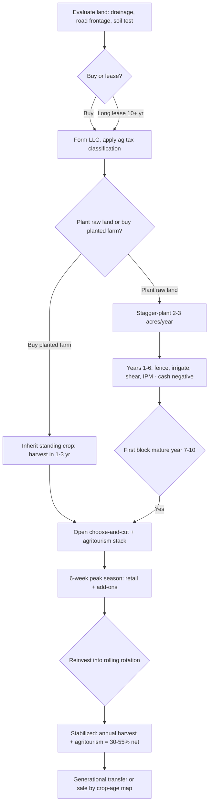

### Direct Answer

Starting a Christmas tree farm business in 2027 means buying or leasing 10 to 80+ acres of well-drained land, planting 1,500-2,000 conifer seedlings per acre, and then waiting 7-10 years before the first Fraser fir or Douglas fir is tall enough to sell. The realistic entry point is $35K-$120K for a 10-acre choose-and-cut starter operation or $300K-$1.2M for a 50+ acre farm with a full agritourism stack; a mature 30-acre farm grosses $250K-$1.2M across a brutal 6-week selling season at 30-55% net margins. The business is genuinely viable in 2027 because real-tree demand is structurally stable and supply is constrained by a decade-long planting gap — but it is the slowest-cash, most weather-exposed small business covered in the Pulse library, and your year-one capital is locked up for ten years before it returns a dollar.

> **TLDR**
> - **Capital:** $35K-$120K for a 10-acre choose-and-cut starter; $300K-$1.2M for 50+ acres with agritourism. Land is the largest line item — lease at $75-$300/acre/year to cut entry cost by 60-80%.
> - **Timeline:** 7-10 years from seedling to sellable tree (Fraser fir 8-10, Douglas fir 6-8). You will earn zero tree revenue for the first 6-7 years.
> - **Margins:** Choose-and-cut retail $65-$185/tree; wholesale $25-$55/tree. Mature net margin 30-55%; agritourism add-ons run 55-75% gross.
> - **Hardest part:** A decade of locked capital, a 6-week sell window, and existential weather/disease risk — deer browse, drought, and Phytophthora root rot can erase a full stand.
> - **2027 reality:** Real-tree demand is stable at ~25-30M units/year; a 2008-2012 planting collapse created a persistent supply shortage that supports pricing through at least 2030.
> - **Best path in:** Buy a partially-planted farm with 3-6 year-old stock already in the ground, or stagger-plant so your first harvest arrives in year 6, not year 10.

This is a long-cycle agricultural business. If you need income inside three years, it is the wrong business. If you have land, patience, off-farm income for the gap years, and the temperament to run a frantic six-week retail sprint, it is one of the most durable rural enterprises you can build. Compare the cash-flow profile against faster-yield land businesses like agritourism (q9648), microgreens farming (q2152), and indoor vertical farming (q9564) before committing.

## PART 1 — FOUNDATIONS

### 1.1 Market size and the 2027 demand picture

The US real Christmas tree market sells roughly 25-30 million farm-grown trees per year, generating $2.0-$2.5 billion in farm-gate and retail revenue depending on the season's weather and the calendar (a Thanksgiving that falls early lengthens the selling window). The National Christmas Tree Association (NCTA) and the Real Christmas Tree Board track this through annual Nielsen consumer surveys; the headline number has been remarkably stable for fifteen years. Real trees hold roughly a 75-80 million household reach when you include the "real plus artificial" segment, and the real-tree share of households that buy *any* tree sits in the 25-35% band.

The structural story that matters for a 2027 entrant is supply, not demand. During the 2008-2012 housing collapse, hundreds of growers exited the business or stopped replanting — seedlings are a cost with no return for a decade, and capital-starved farms simply skipped planting cycles. Because a Fraser fir takes 8-10 years to mature, that planting gap became a harvest gap starting around 2016-2018 and has kept wholesale and retail prices elevated ever since. Industry trade groups have openly described a multi-year tightness in premium Fraser fir supply. A grower planting in 2027 harvests into roughly 2035-2037 — and the planting decisions being made today by the broader industry remain conservative, which supports the price outlook for a patient new entrant.

The flip side: this is a discretionary, tradition-driven purchase. It does not grow. Real-tree unit volume is flat-to-slightly-declining on a per-capita basis, propped up by population growth and by younger "experience economy" households who treat the choose-and-cut visit as a family event rather than a tree transaction. That experiential shift is the single most important strategic fact for a new farm — it is why agritourism, not wholesale, is where the money is.

It is worth being precise about the competitive landscape a 2027 entrant joins. The US Census of Agriculture historically counts roughly 12,000-15,000 farms that sell cut Christmas trees, but the count is highly skewed: a few hundred large operations in North Carolina, Oregon, and the upper Midwest grow the bulk of the wholesale volume, while thousands of small choose-and-cut farms — typically 5-40 acres — serve their immediate local metro. A new entrant is not competing nationally; a choose-and-cut farm competes inside a roughly 30-45 minute drive radius for weekend family traffic. That local-market structure is favorable for a small grower with a good site and a strong experience: you do not have to beat the Oregon mega-farms on price, you only have to be the best Saturday outing within driving distance of your nearest 100,000+ households. The genuine threat is not the big wholesaler — it is the established local farm two towns over that already owns the tradition for those families. Displacing an incumbent's customer base is the hard part, which is why location, experience quality, and brand do more work than tree quality alone.

Two demand sub-trends shape the 2027 outlook further. First, the "real tree as experience" cohort skews younger and more affluent than the historical real-tree buyer, and that cohort spends materially more per visit on add-ons — cider, ornaments, wreaths, photos — than on the tree itself. Second, the artificial-tree segment continues to take household share for the convenience buyer, which means the real-tree farm's defensible position is explicitly the experience, not the commodity. A farm that sells only a tree is competing with a $90 box-store artificial that lasts ten years; a farm that sells a December tradition is in a different, more durable market. This is the strategic fork every section below returns to.

### 1.2 Species and site selection

Species selection is a 10-year bet you cannot easily unwind. The major commercial conifers and their trade-offs:

| Species | Years to harvest | Retail price band | Needle retention | Best regions | Notes |
|---|---|---|---|---|---|
| Fraser fir | 8-10 | $85-$185 | Excellent | NC mountains, high-elevation Appalachia | Premium price; demands cool, well-drained, acidic soil |
| Douglas fir | 6-8 | $65-$120 | Good | Pacific NW, Midwest | Fast cycle; soft needles; broad appeal |
| Balsam fir | 8-10 | $70-$130 | Good | Upper Midwest, Northeast | Strong fragrance; cold-hardy |
| Scotch pine | 6-8 | $45-$85 | Good once cut | Midwest, Plains | Declining demand; very forgiving to grow |
| White pine | 6-9 | $40-$80 | Fair | Eastern US | Low-allergen; weak branches limit ornament load |
| Concolor (white) fir | 9-11 | $90-$160 | Excellent | Mountain West, Northeast | Citrus scent; niche premium |
| Nordmann fir | 9-11 | $95-$175 | Excellent | Pacific NW, mild Northeast | European favorite; non-drop needles |
| Norway spruce | 7-9 | $45-$90 | Poor | Northeast, Midwest | Cheap to grow; needle drop hurts repeat sales |

Fraser fir is the revenue king and commands the highest choose-and-cut and wholesale prices, but it is also the fussiest — it wants well-drained, slightly acidic soil (pH 5.0-6.0), cool summers, and is highly susceptible to Phytophthora root rot in wet ground. Douglas fir is the pragmatic new-entrant choice in much of the country: a 6-8 year cycle versus Fraser's 8-10 pulls your first revenue forward by two-plus years, which materially changes the financing math.

The species decision is best made by stacking three filters in order. **Filter one is climate and soil fit** — there is no point planting Fraser fir in a hot, humid lowland just because it sells for more; it will not survive, and a stand that dies in year four is the most expensive mistake in this business. Match the species to what the NRCS Web Soil Survey and your county extension agent say will actually thrive on your specific ground. **Filter two is cycle length against your capital runway** — if you cannot comfortably fund eight to ten cash-negative years, the two-year-faster Douglas fir cycle is not a minor convenience, it is the difference between solvency and failure. **Filter three is market positioning** — within the species that pass filters one and two, choose the one that lets you charge a premium your local market will actually pay. Many successful farms plant a deliberate mix: a premium fir as the flagship product, plus a faster, more forgiving species (Douglas fir or even pine) as a "value tier" and a hedge against fir-specific disease. A two- or three-species farm spreads disease risk, widens the price ladder for customers, and staggers harvest timing — but it also multiplies the shearing-skill and pest-management knowledge you must hold. For a first-time grower, two species is a sensible ceiling; a monoculture of the wrong species is the real danger.

One frequently overlooked variable is needle retention and the "non-drop" trend. European-favorite species like Nordmann fir hold needles for weeks with minimal drop, and consumer preference has drifted toward low-mess trees. Poor-retention species like Norway spruce increasingly disappoint customers and depress repeat visits — a farm's reputation is built on the tree still looking good on December 24th. When in doubt, weight species selection toward retention; a customer who has a bad needle-drop experience does not come back, and in a business where customer lifetime value spans a decade of annual visits, that is an expensive lesson.

Site selection criteria, in priority order:

1. **Drainage above all.** Phytophthora root rot lives in wet soil and kills firs. Avoid bottomland, heavy clay, and any field with standing water after rain. A gentle 2-8% slope is ideal.
2. **Soil test before you buy.** A $20 county-extension soil test tells you pH, drainage class, and amendment needs. Fraser fir on the wrong soil is a guaranteed loss.
3. **Road frontage and access.** Choose-and-cut depends on customers finding and reaching you. Frontage on a paved road within 20-30 minutes of a metro of 100K+ is worth a price premium.
4. **Elevation and microclimate.** Late frosts damage new growth; cold-air-pooling hollows are risky. Higher ground that drains both water and cold air is preferred.
5. **Acreage runway.** Buy or lease more than you will plant in year one — you need room for staggered annual plantings so harvests arrive every year, not in one decade-out lump.

Cross-reference the broader land-business site logic in agritourism (q9648) and the tree-handling skill base in tree service (q9613).

### 1.3 Land, zoning, business structure and insurance

Land is the dominant capital decision. The lease-versus-buy split:

| Path | Up-front cost (10 acres) | Annual cost | Pros | Cons |
|---|---|---|---|---|
| Purchase | $30K-$150K+ (region-dependent) | Property tax, ~$300-$2K | Builds equity; full control; collateral | Locks capital for a decade-plus crop |
| Long lease (10+ yr) | $0-$5K (legal, deposit) | $75-$300/acre | Frees capital; lower entry risk | No equity; renewal/landlord risk |
| Family/inherited land | $0 | Property tax | Best-case entry | Often constrains location choice |

A long-term written lease of 10+ years is essential if you lease — your crop cycle is a decade, so a 1-3 year lease is unworkable. Get the right to harvest a planted crop explicitly written in.

**Business structure.** Form an LLC before you buy land or sign a lease. A farm is a liability magnet — customers walking your fields with saws, tractor-pulled wagon rides, parking, food service. The LLC plus proper insurance is the floor, not the ceiling. Many established farms add an S-corp election once net income justifies it.

**Zoning and agricultural classification.** Most farmland is zoned agricultural, which is favorable — but agritourism (retail sales, food, events, parking) can trip retail/commercial zoning rules. Confirm with the county that choose-and-cut retail, a gift shop, wagon rides, and a café are permitted uses or obtainable by a conditional-use permit *before* you build anything. Agricultural-use property tax classification (often called "current use" or "ag exemption") can cut your land tax bill by 50-90% — apply for it.

**Insurance stack:**

| Coverage | Typical annual cost | Why it matters |
|---|---|---|
| Farm liability / general liability | $800-$3,500 | Customers on-site with saws and wagons |
| Commercial property | $500-$2,500 | Barn, gift shop, equipment |
| Crop insurance (WFRP via USDA RMA) | Varies; subsidized | Whole-Farm Revenue Protection covers catastrophic loss |
| Workers' comp (if employees) | Rate × payroll | Required in most states with W-2 labor |
| Commercial auto | $1,200-$3,000 | Trucks, tractor on public road |
| Liquor liability (if serving) | $500-$2,000 | Only if you sell hot cider with alcohol or wine |

USDA's Risk Management Agency offers Whole-Farm Revenue Protection, and the Farm Service Agency runs beginning-farmer ownership and operating loans that are among the most useful financing tools for a new tree farm. The governance discipline here echoes the deal-desk and approval-authority thinking in q594 — you want documented processes before you have customers, not after an incident.

**Financing the gap years.** Because tree revenue does not arrive for the better part of a decade, financing structure is unusually important. The realistic capital stack for a new grower combines several sources. USDA FSA beginning-farmer loans — ownership loans for land and operating loans for inputs — are the cornerstone, with longer terms and lower rates than commercial agricultural debt and an explicit mandate to serve new operators. The Farm Credit System, a network of agricultural lending cooperatives, is the second pillar for farm real estate. A grower who already owns land or inherits it skips the largest line item entirely, which is why family land is the most common entry path. Many growers also self-fund the establishment years from off-farm wages — keeping a full-time job and farming evenings and weekends through the cash-negative decade is not a fallback, it is the median reality. Crucially, lenders evaluating a tree-farm loan want to see the staggered planting plan, a credible agritourism revenue line that arrives before the trees do, and a personal income source for the gap years; a loan application that simply says "I will have revenue in year nine" is hard to underwrite.

**Tax treatment** is worth understanding early. The IRS Farmer's Tax Guide (Publication 225) governs how Christmas tree operations capitalize and recover costs — the multi-year crop has specific rules about which establishment expenses are deductible currently versus capitalized into the crop and recovered at harvest. Christmas trees also have a notable feature: trees over a certain age sold as part of the business can, under specific conditions, receive capital-gains treatment rather than ordinary-income treatment, which materially affects the after-tax economics. This is genuinely worth a conversation with an accountant who understands farm taxation before you plant — the structure you choose in year zero affects your tax bill in year ten. Pair this with agricultural-use property tax classification, and the difference between a tax-naive and a tax-literate grower is real money over a crop cycle.

## PART 2 — BUILD-OUT AND CAPITAL

### 2.1 Seedling sourcing and the planting operation

You plant transplants (2-2 or 3-0 stock, meaning 2-4 year-old seedlings), not seeds. Sourcing:

- **Specialist conifer nurseries** in the Pacific Northwest, North Carolina, and the upper Midwest sell Fraser, Douglas, and Balsam transplants. Order 12-18 months ahead — premium Fraser transplant stock sells out.
- **Cost per transplant:** $0.40-$1.20 in bulk (1,000+). At 1,500-2,000 trees/acre, seedling stock for 10 acres runs $6,000-$24,000.
- **Plant density:** 1,500-2,000 trees/acre on roughly 5×5 to 6×6 foot spacing. Wider spacing eases shearing and harvest access; tighter spacing maximizes per-acre yield but raises labor.
- **Survival planning:** Budget 10-20% first-year mortality. Order extra and replant gaps ("beating up") in year two.

Planting happens in early spring while stock is dormant. A two-person crew with a tractor-mounted planter sets 3,000-6,000 trees per day; hand-planting with a planting bar runs 500-1,000 per person per day. For a 10-acre first planting (15,000-20,000 trees), budget a few intense days plus seasonal labor.

The decisive strategic move is the **staggered planting schedule**. Do not plant all 10 acres in year one. Plant 2-3 acres per year for several years so that, once the first block matures, a fresh block matures every following year — a perpetual rolling harvest instead of a single decade-out windfall followed by another decade of nothing.

The planting operation itself rewards preparation. Site prep in the season before planting — killing existing sod or weeds, sub-soiling compacted ground, and laying out rows — matters more than most new growers expect, because a transplant set into competitive grass or compacted soil starts its decade-long life already behind. Spacing is laid out with a marked row and a measuring chain or a GPS guidance system; consistent rows are not cosmetic, they determine whether a tractor and mower can pass between trees for the next ten years. Transplants arrive bare-root and dormant; they must be kept cool, moist, and shaded, and planted within days. Roots must go in straight and fully covered — a J-rooted or air-pocketed transplant is a slow death. After planting, the first irrigation and a check of soil firmness around each tree complete the operation.

The economics of staggered planting deserve a concrete illustration. A grower who plants all 10 acres in year one spends roughly $9,000-$20,000 on seedlings in a single year, then waits 8-10 years for a single enormous harvest, sells through it in two or three frantic seasons, and faces another near-decade gap while replants mature. A grower who plants 2 acres per year for five years spreads that seedling cost across five years, smooths the labor, and — critically — once block one matures, harvests a block every single year thereafter, producing the steady annual income that makes the business bankable and livable. The staggered approach also hedges weather and disease: a single catastrophic event hits one block, not the entire farm. There is no serious argument for planting everything at once unless you are intentionally building a one-time timber-style liquidation.

| Approach | Year-1 cash out | First harvest | Cash-flow shape |
|---|---|---|---|
| Plant all 10 acres at once | High (lump seedling cost) | Year 8-10 | One huge harvest, then a 7-year gap before replants mature |
| Stagger 2-3 acres/year | Lower per year | Year 8-10 for block 1 | Smooth annual harvest once block 1 matures |
| Buy a partially-planted farm | Highest (land + standing crop) | Year 1-3 | Near-immediate revenue; best for impatient capital |

### 2.2 Equipment and infrastructure

You can start lean and add as cash flow allows. The core list:

| Item | New cost | Used / lean option | Priority |
|---|---|---|---|
| Compact/utility tractor (25-45 hp) | $18K-$35K | $8K-$15K used | Essential |
| Tree planter (3-pt mount) | $1,500-$4,000 | Rent or hand-plant year 1 | Year 1-2 |
| Rotary/sickle mower | $1,200-$4,000 | $400-$1,200 used | Essential |
| Shearing knives + power trimmer | $300-$1,500 | $150-$400 | Year 3+ (shearing starts) |
| Backpack/boom sprayer | $250-$3,500 | $150-$800 | Year 1-2 |
| Tree baler (netting) | $1,500-$4,500 | Rent seasonally | Year 6+ (first harvest) |
| Tree shaker (loosens dead needles) | $1,500-$3,500 | Optional | Year 6+ |
| Wagon / trailer for customers | $2,000-$8,000 | $800-$3,000 | When choose-and-cut opens |
| Barn / retail shed / gift shop | $5K-$150K+ | Repurpose existing structure | Scales with agritourism |
| Point-of-sale + card reader | $300-$1,500 | Square/tablet | When retailing |

A realistic equipment budget for a lean 10-acre choose-and-cut starter is $15K-$40K if you buy used and rent the baler. A 50+ acre agritourism operation with a built gift shop, café, and customer wagons can run $150K-$400K+ in equipment and structures. Farm-equipment retailers like Tractor Supply Company (NASDAQ: TSCO) and Deere (NYSE: DE) dealer networks handle most implement needs; for used gear, regional farm auctions and equipment marketplaces undercut new-list pricing substantially.

The discipline that separates a well-capitalized farm from an over-capitalized one is **buying equipment to match the crop's age, not the farm's ambition**. In years 0-2 you need a tractor, a mower, a sprayer, and a way to plant — that is it. A tree baler, tree shaker, and customer wagons are useless until you have sellable trees in year 6 or later, so buying them in year one is dead capital sitting in a barn through the cash-negative decade. The most common new-grower financial mistake after over-planting is over-equipping: a $35,000 new tractor and a full implement set bought before a single tree is sold. A used 30-horsepower tractor and a borrowed or rented planter get the establishment years done; the harvest-and-retail equipment can be bought from the first season's revenue. Equipment also has resale value, so a grower who is genuinely uncertain about scale can buy used, run lean, and step up only when the crop justifies it — the downside risk on a used tractor is far smaller than the downside risk on a new one.

Infrastructure follows the same logic. A retail structure does not need to be a purpose-built gift shop in year one — a clean, weatherproof repurposed barn or a simple pole building handles the first few selling seasons. The café, the heated gift shop, the paved parking, and the event barn are reinvestments funded by proven demand, not speculative builds. The farm that builds a $150,000 visitor center before it has a customer base is betting a decade of capital on traffic it has not yet earned; the farm that opens with a tidy barn, a card reader, and a cider urn, then reinvests profits into structure, is following the demand instead of guessing at it.

### 2.3 Deer fencing, irrigation and IPM setup

Three site investments separate a farm that survives from one that fails:

**Deer fencing.** Deer browse new conifer growth and can destroy a young planting. Options: 8-foot woven-wire perimeter fence ($4-$9 per linear foot installed — $20K-$45K for a 40-acre perimeter), or repellent spray programs ($300-$1,500/year, ongoing labor). In high-deer-pressure areas fencing is non-negotiable; it is one of the largest hidden costs new growers underestimate.

**Irrigation.** Seedlings in their first 2-3 years are drought-vulnerable. A drip or micro-sprinkler system for the youngest blocks costs $1,500-$5,000 per acre installed; many growers irrigate only the newest 2-3 acres and let established trees rely on rainfall. USDA NRCS's EQIP cost-share program can offset irrigation and conservation infrastructure.

**Integrated Pest Management (IPM).** The threat list every grower must plan for:

| Threat | Damage | Management |
|---|---|---|
| Phytophthora root rot | Kills firs in wet soil; can erase a stand | Site drainage; resistant rootstock; avoid bottomland |
| Deer browse | Destroys new growth on young trees | 8-ft fencing or repellent program |
| Drought | Seedling die-off | Drip irrigation on young blocks |
| Balsam woolly adelgid | Deforms and kills firs | Scouting; targeted insecticide |
| Spruce spider mite | Needle discoloration, loss | Miticide; beneficial insects |
| Late spring frost | Kills new shoots | Site selection; avoid cold pockets |
| Weeds | Compete for water/nutrients | Mowing; targeted herbicide strips |

IPM is a scouting discipline — walk the fields, identify problems early, treat narrowly. Blanket spraying is expensive and ecologically poor. The mindset mirrors the "catch problems before contract" logic in q512 and the hygiene-discipline argument in q302: small, consistent monitoring beats one big reactive intervention.

Of the three site investments, **drainage and Phytophthora avoidance is the one you cannot fix after the fact**. Deer fencing can be added in year two; an irrigation line can be retrofitted; but a field with poor drainage will keep killing firs no matter how much money you throw at it, and the disease persists in the soil for years. This is why the soil test and the NRCS Web Soil Survey check in section 1.2 are not bureaucratic box-checking — they are the single highest-leverage hour you will spend before buying land. A grower who plants Fraser fir into heavy, wet clay has effectively pre-purchased a failed stand. If a site you otherwise love has marginal drainage, the answer is either a different species with more disease tolerance, raised planting beds and tile drainage to move water off the root zone, or a different site entirely.

Deer pressure deserves an honest budget line because it is the cost new growers most often discover too late. In suburban-fringe and woodland-edge locations — exactly the locations that are best for choose-and-cut traffic — deer density can be high enough that an unfenced young planting is simply destroyed. An 8-foot perimeter fence is a five-figure investment, but it is cheaper than replanting browsed blocks for years and watching survival rates collapse. Repellent spray programs work in lower-pressure areas and as a stopgap, but they are an ongoing labor and cost commitment with no end date. The honest framing: in a high-deer area, fencing is not optional infrastructure, it is part of the price of being in the business, and a land budget that omits it is incomplete.

The IPM calendar runs year-round but concentrates in spring and summer. Spring brings the watch for late frost damage on new growth and the first scouting for adelgid and mite activity; summer is the peak shearing season and the window for most foliar pest treatment; fall is for weed management and assessing the season's losses; winter is planning, ordering, and equipment maintenance. A simple field notebook or a farm-management app that logs what was scouted, what was found, and what was treated turns IPM from guesswork into a repeatable system — and gives a future buyer or successor a real record of the farm's pest history.

## PART 3 — OPERATIONS

### 3.1 The 7-10 year crop cycle

The crop cycle is the defining feature of this business. A year-by-year walkthrough for a Fraser fir block:

| Year | Activity | Cash flow |
|---|---|---|
| 0 | Site prep, plant transplants | Cash out: seedlings, labor, prep |
| 1-2 | Replace dead seedlings, mow, weed, irrigate young stock | Cash out only |
| 3-4 | Begin light shearing to shape; continued weed/pest control | Cash out only |
| 5-6 | Full annual shearing; trees reach 3-5 ft | Cash out only |
| 7-8 | Trees reach 5-7 ft; first sellable trees (Douglas earlier) | First revenue (partial) |
| 8-10 | Block hits prime 6-8 ft; main harvest | Peak revenue from this block |
| 10-12 | Harvest tail; stump removal; replant the block | Replanting cost; cycle restarts |

The two operationally critical practices:

- **Shearing.** Starting around year 3-4, each tree is sheared annually to create the dense, conical "Christmas tree" shape buyers expect. An unsheared conifer is a forestry tree, not a retail product. Shearing is skilled, seasonal (typically early-to-mid summer), labor-intensive work — a worker shears a few hundred to ~1,000 trees per day depending on size and species.
- **Stump culture / replanting.** After harvest you remove the stump or, with some species, manage a stump-culture sprout. Most growers pull stumps and replant transplants, restarting the 8-10 year clock on that ground.

The cycle is why staggered planting is mandatory and why off-farm income through the gap years is the most common financing reality for new growers.

It is worth dwelling on shearing because it is the operational task new growers most underestimate. Shearing is not occasional pruning — it is an annual, farm-wide, deadline-driven operation that, once the trees are large, can consume more total labor hours than planting and harvest combined. Each tree is shaped with a long shearing knife or a powered trimmer to produce the dense, symmetrical, slightly tapered cone the market expects, and the work must be done in a fairly narrow summer window when the new growth has hardened enough to cut cleanly. A skilled shearer is fast and consistent; an unskilled one leaves misshapen, gappy trees that sell at a discount or not at all. For a farm with several thousand sellable-age trees, shearing means hiring and training a seasonal crew every summer and managing them through hot, repetitive, physical work. Growers who romanticize the December retail scene and ignore the July shearing reality are surprised, every year, by how much the business is actually a summer labor operation with a winter sales event attached.

The crop cycle also forces a particular kind of patience that is psychologically harder than the spreadsheet suggests. For six or seven years a grower invests money and labor into fields that produce nothing sellable, with no customer feedback, no revenue signal, and only the slow visual progress of trees getting taller. Many businesses fail in their first three years from cash-flow shock; a tree farm's analogous danger zone is the long, quiet middle of the establishment decade, when the founder questions whether the original plan was sound and is tempted to cut corners on shearing or pest control to save money. Discipline through that quiet stretch — keeping the shearing crew funded, the IPM scouting consistent, the replanting on schedule — is what separates the farms that reach a profitable year-eight harvest from the ones that arrive there with a stand of misshapen, pest-damaged trees that will not command retail prices.

### 3.2 Pricing, channel mix, wholesale vs choose-and-cut

There are three revenue channels and they are not equal:

| Channel | Price per tree | Gross margin | Labor intensity | Notes |
|---|---|---|---|---|
| Choose-and-cut (on-farm retail) | $65-$185 | Highest | High in 6-week window | Customer cuts/selects; experiential |
| Pre-cut on-farm retail lot | $55-$140 | High | Moderate | You cut; customer picks from lot |
| Wholesale to retail lots / big-box | $25-$55 | Lowest | Low | Volume play; Home Depot, Lowe's, supermarkets, charity lots |

**Choose-and-cut is the strategy.** It captures the full retail margin, requires no middleman, and converts the visit into an experience that supports add-on spending. A tree that wholesales for $35 sells choose-and-cut for $110-$150 — the same tree, three to four times the revenue. The constraint is that choose-and-cut depends entirely on customers physically coming to your farm, which is a function of location, marketing, and the agritourism experience.

**Wholesale** is a volume relief valve, not a primary strategy for a small farm. It moves trees you cannot sell retail and smooths a large harvest, but the margin is thin and you compete with massive Pacific Northwest and North Carolina operations on price. The wholesale buyers a small grower would supply are the seasonal tree lots run by big-box and grocery chains — Home Depot (NYSE: HD), Lowe's (NYSE: LOW), Walmart (NYSE: WMT), and regional supermarket banners under parents like Kroger (NYSE: KR) all sell pre-cut trees through their stores or parking lots each December. These are demanding, price-driven buyers who want consistent grade, volume, and reliable on-time delivery; a small farm that lands a big-box contract becomes a price-taker on someone else's terms. Use wholesale to clear genuine surplus, not as your base case.

A practical pricing model: price by the foot with a species premium. For example, Fraser fir at $18-$24/foot retail (a 7-foot tree = $126-$168), Douglas fir at $12-$16/foot. Post prices visibly, keep them simple, and resist the temptation to negotiate — the discount-discipline argument in q529 and the deal-desk logic in q594 apply even to a $130 tree. A consistent posted price beats per-customer haggling.

There is a real strategic question about whether to do wholesale at all. The case for it: a large harvest year produces more trees than your local choose-and-cut traffic can absorb, and selling the surplus wholesale at $25-$55 is far better than leaving trees in the field to age out of the prime 6-8 foot window. Wholesale also provides early-season cash and a relationship with retail lots. The case against it: wholesale margins are thin, you are price-takers against industrial-scale Pacific Northwest and North Carolina growers, and the harvest, baling, and freight logistics for wholesale are a meaningfully different operation than greeting families at a choose-and-cut. The sensible posture for a small farm is to size the planting and the marketing so that choose-and-cut absorbs the great majority of the crop, and to treat wholesale as the relief valve for genuine surplus — not to plant for wholesale as a base case. A farm that finds itself dependent on wholesale revenue has usually mis-located (too far from traffic) or under-invested in the experience that drives retail demand.

Pricing psychology on a choose-and-cut farm runs counter to a lot of small-business instinct. The temptation, especially in a slow early season, is to discount to move trees. But the choose-and-cut customer is buying a tradition and an experience, not hunting for the cheapest conifer — discounting trains your best customers to expect a deal, erodes the premium that the experience justifies, and signals that the trees are a commodity. The stronger play is to hold posted prices, add value through the experience (free cider, a great photo spot, a friendly crew), and use end-of-season clearance only on genuinely surplus or oversized trees in the final days. Price the tree at what the experience is worth, and protect that number.

### 3.3 The agritourism stack and shoulder-season revenue

The agritourism stack is where a modern Christmas tree farm makes its real money and de-risks the single-channel weakness. The tree is the anchor; the experience is the margin.

| Add-on | Revenue model | Gross margin | Season |
|---|---|---|---|
| Hot cider / cocoa / snack stand | $4-$8/item | 60-75% | Tree season |
| Gift shop (ornaments, wreaths, décor) | Retail markup | 45-60% | Tree season |
| Wreaths and garland (made from trimmings) | $25-$75 each | 65-80% | Tree season |
| Wagon / hayrides | $5-$12/person or free draw | n/a (traffic driver) | Tree season |
| Photos with Santa / photo backdrops | $10-$30 or free | High | Tree season |
| Pumpkin patch / fall festival | Admission + per-item | 55-70% | Sept-Oct |
| U-pick (berries, flowers) on idle acreage | Per-pound / per-stem | 50-70% | Spring-summer |
| Event/wedding rental of barn or field | $1,500-$6,000/event | 60-80% | Year-round |
| Firewood, mulch, sawdust from culls | Per-bundle / per-yard | 40-60% | Year-round |

Wreaths deserve special attention: they are made from shearing trimmings and cull-tree branches that would otherwise be waste, they carry 65-80% gross margin, and they sell by mail and at farmers' markets, extending revenue beyond the on-farm 6 weeks. A pumpkin patch or fall festival on the same land turns October into a second selling season and gets families onto your property before tree season. The U-pick and event-rental ideas connect directly to the playbooks in agritourism (q9648) and wedding venue (q9672) — many tree farms evolve into year-round event destinations.

The strategic point about the agritourism stack is that it solves the two structural weaknesses of the core tree business simultaneously. The first weakness is the decade-long wait for tree revenue: a pumpkin patch, a U-pick flower or berry operation on otherwise-idle young-block acreage, or barn event rentals can produce real cash in years two through seven, while the trees are still growing. The second weakness is the six-week revenue concentration: wreath mail-order, farmers'-market sales, fall festivals, and year-round event rentals spread income across the calendar so the farm is not betting its entire year on a handful of December Saturdays. A farm that builds the experience stack is no longer a Christmas tree farm with a vulnerable single channel — it is a year-round agritourism destination that happens to anchor on a December tree harvest.

There is, however, a discipline cost to the agritourism stack. Each add-on is a real operation with its own labor, inventory, regulatory exposure, and customer-service demands. A café means food-service permits and health inspections. Wagon rides mean equipment safety and liability. A gift shop means buying, merchandising, and managing retail inventory. Event rentals mean contracts, scheduling, and a different customer than the family buying a tree. The right approach is sequential: prove the core choose-and-cut, then add the highest-margin, lowest-complexity items first (cider, wreaths from your own trimmings, a simple photo spot), and layer in the more operationally heavy add-ons (café, events, U-pick) only as the farm's management capacity grows. A farm that bolts on six add-ons in year one will do all of them poorly; a farm that adds one strong experience per year builds a stack that genuinely compounds.

### 3.4 Peak-season operations: the 6-week window

You earn essentially all of your tree revenue between the weekend after Thanksgiving and roughly December 20-23. That is a 4-6 week sprint that defines the operational year.

Peak-season operational priorities:

1. **Labor.** Choose-and-cut needs people to greet, help select, cut, shake, bale, haul, and run the till. Most farms run on seasonal labor — local students, retirees, returning crew. Hire and train before Thanksgiving.
2. **Traffic flow and parking.** A muddy field and a 200-car Saturday is a real operations problem. Plan parking, signage, and a one-way wagon route.
3. **Weekend concentration.** The first two weekends after Thanksgiving can be 50-60% of total sales. Staff and stock for the peak, not the average.
4. **Weather contingency.** Rain or snow on a peak Saturday is lost revenue you cannot recover. Build covered areas (gift shop, cider stand) so a bad-weather day still converts.
5. **Inventory discipline.** Selling out early leaves money on the table; ending with unsold trees is dead inventory. Track sell-through daily and use wholesale or discounting in the final days to clear.
6. **Cash and POS.** Card readers, cash floats, and a tablet POS. December weekend volume will overwhelm a notebook.

The six-week window also means your forecasting must account for a calendar that shifts year to year — an early Thanksgiving adds a selling weekend, a late one removes one. This is exactly the seasonal-pattern forecasting problem analyzed in q303: you cannot run a flat monthly model on a business that earns 90% of its income in 42 days.

The peak-season labor problem deserves a final, practical note. Choose-and-cut runs on a seasonal crew that must be recruited, scheduled, and trained in the few weeks before Thanksgiving — and the same talent pool is being chased by every retailer in the region for the holiday hiring surge. Successful farms solve this with a returning-crew strategy: students home for winter break, retirees who enjoy the seasonal social environment, and a core of past employees who come back year after year. A farm that has to fully re-recruit and re-train its entire crew every November is at a real disadvantage; building a list of reliable returners is a quiet competitive moat. Roles to staff include greeters and lot guides, tree cutters and haulers, the shake-and-bale station, wreath and gift-shop sales, the cider stand, parking direction, and the till. Cross-training matters because weekend volume is lumpy — the same worker may direct parking at 10 a.m. and run a card reader at 2 p.m. A short pre-season training session covering safety (saws, wagons, tractor traffic), the price structure, and the experience standards you expect pays for itself in a smoother, safer peak.

## PART 4 — GROWTH AND EXIT

### 4.1 Marketing and customer acquisition

Choose-and-cut is a local-traffic business, so marketing is local and visual:

- **Google Business Profile and local SEO.** "Christmas tree farm near me" is a high-intent seasonal search. Claim and optimize your profile, collect reviews, keep hours accurate.
- **Social media, especially visual platforms.** Families share the photogenic farm visit. Instagram and Facebook drive weekend traffic; a few strong photos of snowy fields and kids on wagons do real work.
- **The NCTA / state-association farm directories.** Listing on realchristmastrees.org and your state association's "find a farm" map captures searching customers.
- **Email and SMS list.** Capture contacts at the till; the same families return annually. A list of past customers is the cheapest, highest-converting marketing you own.
- **School and community partnerships.** Field trips, scout fundraisers, and church groups bring new families and recur.
- **Press and local media.** Local TV and papers run "where to cut your tree" features every November — get on the list.

The retention math is favorable: a Christmas tree farm visit is a family tradition, so customer lifetime value is high and repeat rate strong if the experience is good. The acquisition-versus-retention balance mirrors the renewal-cadence thinking in q504 — a farm that delights families in year one keeps them for a decade. Holiday-adjacent cross-promotion with a holiday lighting installation business (q2119) can also extend the brand into a second seasonal service.

It is worth quantifying why retention is the heart of the marketing strategy. A family that buys a tree at your farm and has a good time is not a one-time $130 transaction — they are a tradition that, if retained, returns every December for ten, fifteen, or twenty years, bringing $130-$200 of tree plus $30-$80 of add-ons annually, and recruiting other families through word of mouth. The lifetime value of one retained family can run into the low thousands of dollars. That math means the marketing budget is best spent first on making the existing visit so good that families return and refer, and only second on acquiring new visitors. Concretely: capture every customer's email or phone at the till, send one well-timed reminder the week after Thanksgiving each year, and treat the on-farm experience — clean restrooms, friendly crew, hot cider, a great photo backdrop, an easy cut — as the real marketing channel. The farm with the best experience in its drive radius wins the tradition, and the tradition is a multi-decade annuity.

A note on seasonality and brand: because the farm is publicly visible for only six weeks, the off-season is when brand-building quietly happens. A farm that sells wreaths by mail, appears at fall festivals and farmers' markets, hosts the occasional barn event, and keeps its social media alive through the year stays in customers' minds and arrives at Thanksgiving with momentum. A farm that goes completely dark from January to November has to re-earn attention every fall. The marketing calendar, like the IPM calendar, runs year-round even though the cash register only opens in December.

### 4.2 Scale milestones and the 5-year trajectory

Because of the crop cycle, a tree farm's first decade is mostly investment. A representative trajectory for a grower who buys raw land and plants:

| Phase | Years | Acres planted | Activity | Net cash |
|---|---|---|---|---|
| Establishment | 0-3 | 6-15 (staggered) | Plant, fence, irrigate, weed | Strongly negative |
| Cultivation | 3-7 | Add 2-3/yr | Shear, IPM, build agritourism plan | Negative; agritourism may start |
| First harvest | 7-10 | Mature block 1 | First tree sales; choose-and-cut opens | Turns positive |
| Stabilized | 10+ | Full rotation | Rolling annual harvest + agritourism | $80K-$400K+ net at 30-55% margin |

The faster paths to positive cash flow:

1. **Buy a partially-planted or operating farm.** Paying for standing crop and an established customer base compresses a decade of waiting into a 1-3 year ramp. It is the single biggest lever for impatient capital.
2. **Front-load agritourism.** A pumpkin patch, U-pick, or event venue can generate revenue years before your first tree is sellable, funding the gap.
3. **Buy trees to resell while you grow.** Some new farms buy wholesale pre-cut trees and sell them retail on their lot for the first several seasons, building the customer base and brand while their own crop matures.

A mature, well-run 30-acre choose-and-cut farm with a developed agritourism stack can net $150K-$400K+ in a strong season. The ceiling is set by land, weekend traffic capacity, and how much experience revenue you layer on — not by tree volume alone.

### 4.3 Succession, sale and generational transfer

Christmas tree farms are unusually well-suited to generational transfer and unusually hard to exit cleanly mid-cycle, both for the same reason: the crop is a decade long.

- **Generational transfer is the norm.** Many farms are multi-generational; the 10-year crop cycle naturally spans a working career and aligns with passing the operation to children. Family-business and estate-planning structures (LLC membership transfer, gifting interests over time) are standard.
- **Selling mid-cycle is awkward.** A buyer is purchasing standing inventory that won't pay out for years. Valuation must account for the age of each block — a farm with 6-8 year-old trees is worth far more than one with year-1 plantings. Get a crop inventory and age map before any sale negotiation.
- **Land value is the floor.** Even if the tree enterprise underperforms, the underlying agricultural (or, near metros, developable) land carries value. This is the structural safety net of a land-based business — the dirt is a real asset.
- **Conservation easements and ag preservation programs** can monetize development rights while keeping the farm operating, a useful estate-planning tool.

The "leadership as operator vs. founder" inflection in q9523 has a farm analog: at some point the founding grower shifts from doing the shearing to running the business and stewarding the transfer. Plan that transition deliberately.

## Mermaid Diagram — The Christmas Tree Farm Decision and Cash-Flow Flow

## Counter-Case: Why Starting a Christmas Tree Farm Business in 2027 Might Be a Mistake

Every section above makes the optimistic case. Here is the honest argument against.

**1. The capital lock-up is genuinely brutal.** No other small business in the Pulse library asks you to spend money for 7-10 years before earning a dollar of product revenue. You are financing a decade of land cost, labor, fencing, irrigation, seedlings, and pest control with zero offsetting income from trees. Most new growers survive only because they have substantial off-farm income. If you do not, this business will break you long before the first harvest. A microgreens operation (q2152) yields in weeks; this yields in a decade.

**2. The weather and disease risk is existential, not incremental.** A drought in the establishment years, a wet spring that triggers Phytophthora, a late frost, an adelgid infestation, or a deer breach can damage or destroy a stand that represents years of irreversible investment. You cannot insure your way fully out of this — crop insurance softens catastrophe but does not make you whole on a decade of lost time. A failed restaurant loses a lease; a failed tree block loses ten years.

**3. The selling window is unforgiving.** You earn 90%+ of tree revenue in roughly six weeks. A single rained-out peak Saturday is lost forever. If you mis-staff, mis-price, or the weather turns, you cannot make it up in January. The entire year's outcome hinges on a handful of December weekends — operationally far tighter than the year-round businesses in the library.

**4. It is labor-hard work, not passive land income.** Shearing is hot, repetitive, skilled summer labor. Planting, mowing, scouting, fencing, and the December retail sprint are physical. The romantic image of "owning a tree farm" collides with the reality of running a tractor in August heat and a cash register on a freezing Saturday.

**5. Demand is flat and the consumer is discretionary.** Real-tree volume is not growing. You are competing for a stable-to-shrinking pool of households against artificial trees, against established farms with brand and location advantages, and against big-box wholesale pricing. The supply shortage helps pricing today, but it also signals that the broader industry has found the economics unattractive enough to under-plant for fifteen years.

**Who should still do it:** people who already own suitable land, have off-farm income or other capital to fund the gap years, have a genuine multi-decade time horizon (often a family transfer in mind), are within driving distance of a metro for choose-and-cut traffic, and are temperamentally suited to patient, physical, seasonal work. **Who should not:** anyone who needs income within three years, anyone leasing short-term, anyone without a drainage-tested site, and anyone treating it as passive land investment. For faster-cash land businesses, compare agritourism (q9648), landscaping (q9678), tree service (q9613), and microgreens farming (q2152).

## The Operating Journey: From Site Selection to Stabilized Multi-Generational Operation

A consolidated narrative of the full arc. **Year 0** is land and structure: a drainage-tested site, an LLC, a 10+ year lease or a purchase, agricultural tax classification, and the insurance stack. **Years 0-3** are establishment — staggered planting of 2-3 acres annually, 8-foot deer fencing, drip irrigation on the youngest blocks, replanting of 10-20% mortality, and constant weed control, all funded by off-farm income or capital reserves with zero tree revenue. **Years 3-7** are cultivation: annual shearing begins and becomes the dominant summer labor task, IPM scouting catches Phytophthora and adelgid early, and the smart grower uses these years to build the agritourism plan and, ideally, launch a pumpkin patch, U-pick, or event-rental line that produces real cash before the first tree is sellable. **Years 7-10** bring the first harvest — choose-and-cut opens, the gift shop and cider stand come online, and the business finally turns cash-positive during a frantic six-week December sprint. **Year 10 and beyond** is the stabilized state: a rolling rotation where a fresh block matures every year, agritourism revenue carries the shoulder seasons, net margins settle in the 30-55% band, and the founder begins thinking about the generational transfer that the crop cycle so naturally invites. The grower who buys a partially-planted farm compresses this entire arc — paying more up front to skip most of the cash-negative decade. This journey rewards patience, punishes impatience, and is one of the most durable rural businesses in the library for those built to wait.

## The Decision Matrix: Species Selection and Channel Mix Strategy

A final synthesis. **On species:** if your soil drains well, your summers are cool, and you can wait 8-10 years, Fraser fir is the revenue king and the right premium bet. If you need faster cash or your site is marginal for fir, Douglas fir's 6-8 year cycle pulls your first revenue forward by two-plus years and broadens market appeal — for most new entrants outside the Appalachian high country, Douglas fir is the pragmatic default. Balsam fir suits the cold upper Midwest and Northeast; Concolor and Nordmann are niche premiums for patient growers; Scotch pine and Norway spruce are easy to grow but face declining demand and weaker repeat sales. **On channel:** choose-and-cut is the strategy, not an option — it captures three to four times the per-tree revenue of wholesale and converts the visit into an experience that drives high-margin add-on spending. Wholesale is a relief valve to clear surplus, never a base case for a small farm. **On the experience stack:** the modern winning Christmas tree farm is an agritourism destination where the tree anchors a day out — cider, wreaths, wagon rides, photos, a pumpkin patch, U-pick, and event rentals. That stack de-risks the single-channel weakness, extends revenue beyond the six-week tree window, and is where the genuine margin lives. **On entry strategy:** unless you have a decade of patient capital, buy a partially-planted farm or front-load agritourism so revenue arrives years before your own first harvest. The farm that succeeds in 2027 is patient on species, disciplined on choose-and-cut pricing, aggressive on the experience stack, and realistic that the first dollar of tree revenue is a decade away.

## Sources

1. **NCTA (National Christmas Tree Association)** — US Christmas tree industry trade association: industry data, member directory, choose-and-cut consumer marketing. https://www.realchristmastrees.org
2. **Real Christmas Tree Board** — USDA industry promotion order; conducts industry-wide consumer marketing and Nielsen consumer surveys. https://www.christmastreepromotionboard.org
3. **USDA NASS Census of Agriculture — Christmas Tree Production** — Federal census of US Christmas tree farm count, acreage, production volume, and revenue. https://www.nass.usda.gov/AgCensus
4. **USDA Risk Management Agency (RMA)** — Whole-Farm Revenue Protection and crop insurance for Christmas tree farms. https://www.rma.usda.gov
5. **USDA NRCS EQIP** — Environmental Quality Incentives Program cost-share for irrigation and conservation infrastructure. https://www.nrcs.usda.gov/programs-initiatives/eqip-environmental-quality-incentives
6. **USDA FSA Farm Loan Programs** — Beginning-farmer ownership, operating, and microloans. https://www.fsa.usda.gov/programs-and-services/farm-loan-programs
7. **North Carolina Christmas Tree Association (NCCTA)** — Trade association for the dominant US Fraser fir region. https://www.ncchristmastrees.com
8. **Pennsylvania Christmas Tree Growers Association** — State association for PA choose-and-cut and wholesale producers. https://www.christmastrees.org
9. **Pacific Northwest Christmas Tree Association / Oregon Dept. of Agriculture** — Douglas and Noble fir region resources. https://oda.direct
10. **Michigan Christmas Tree Association** — State association for Michigan Balsam fir and Scotch pine growers. https://www.mcta.org
11. **USDA NASS QuickStats** — Queryable agricultural statistics database for tree production by state. https://quickstats.nass.usda.gov
12. **NC State Extension — Christmas Tree Production** — Land-grant extension guidance on Fraser fir culture, shearing, and pest management. https://christmastrees.ces.ncsu.edu
13. **Penn State Extension — Christmas Tree Production** — Extension resources on species, IPM, and farm economics. https://extension.psu.edu
14. **Michigan State University Extension — Christmas Trees** — Extension guidance for Midwest growers. https://www.canr.msu.edu
15. **University of Tennessee / Cornell Cooperative Extension — Christmas Tree Budgets** — Enterprise budget templates and cost estimates for tree farms. https://extension.tennessee.edu
16. **USDA Forest Service — Phytophthora Root Rot resources** — Identification and management of root rot in conifers. https://www.fs.usda.gov
17. **SBA (US Small Business Administration)** — Business structure, lending, and planning guidance. https://www.sba.gov
18. **IRS — Farmer's Tax Guide (Publication 225)** — Federal tax treatment of farm income, expenses, and capitalized crop costs. https://www.irs.gov/publications/p225
19. **National Agricultural Law Center** — Legal resources on agritourism liability and farm leases. https://nationalaglawcenter.org
20. **USDA Agricultural Marketing Service** — Wholesale pricing and market data context. https://www.ams.usda.gov
21. **State agritourism statutes / agritourism liability acts** — State-level limited-liability protections for farms hosting visitors.
22. **County / state agricultural-use property tax programs** — "Current use" and ag-exemption classification reducing farmland property tax.
23. **National Christmas Tree Association consumer survey data** — Real vs. artificial purchase share and household reach. https://www.realchristmastrees.org
24. **USDA Beginning Farmer and Rancher resources** — Programs and lending aimed at new agricultural operators. https://newfarmers.usda.gov
25. **OSHA Agricultural Operations standards** — Worker-safety requirements for farm labor and equipment. https://www.osha.gov/agricultural-operations
26. **University extension nursery/transplant sourcing guides** — Conifer transplant stock specifications and ordering guidance. https://christmastrees.ces.ncsu.edu
27. **NRCS Web Soil Survey** — Free soil drainage and classification data by location. https://websoilsurvey.nrcs.usda.gov
28. **State forestry agency seedling and conservation programs** — State nursery seedling sales and planting assistance.
29. **Farm Credit System lenders** — Agricultural lending cooperatives serving farm real estate and operating loans. https://farmcredit.com
30. **National Sustainable Agriculture Information Service (ATTRA)** — Sustainable production and IPM guidance for specialty crops. https://attra.ncat.org
31. **USDA APHIS** — Plant pest and quarantine information relevant to interstate tree shipment. https://www.aphis.usda.gov
32. **Google Business Profile / local SEO documentation** — Seasonal local-search optimization for choose-and-cut farms. https://support.google.com/business

## Numbers

- US real Christmas tree market: ~25-30 million farm-grown trees sold per year; $2.0-$2.5 billion in farm-gate/retail revenue.
- Crop cycle: 8-10 years for Fraser fir, 6-8 years for Douglas fir, from transplant to sellable 6-8 ft tree.
- Planting density: 1,500-2,000 trees per acre on roughly 5×5 to 6×6 ft spacing.
- Seedling/transplant cost: $0.40-$1.20 each in bulk; $6,000-$24,000 in stock for a 10-acre planting.
- Choose-and-cut retail price: $65-$185 per tree; pre-cut lot $55-$140; wholesale $25-$55.
- Lean 10-acre choose-and-cut starter capital: $35,000-$120,000 all-in.
- 50+ acre agritourism operation capital: $300,000-$1,200,000.
- Land lease: $75-$300 per acre per year; minimum 10+ year term to span the crop cycle.
- Deer fencing: $4-$9 per linear foot installed; $20,000-$45,000 for a 40-acre perimeter.
- Drip irrigation: $1,500-$5,000 per acre installed for young blocks.
- First-year seedling mortality budget: 10-20%.
- Selling season: ~4-6 weeks, Thanksgiving weekend through roughly December 20-23.
- First two post-Thanksgiving weekends: often 50-60% of total tree sales.
- Mature 30-acre farm gross: $250,000-$1,200,000 in a 6-week season.
- Stabilized net margin: 30-55% after labor and equipment; agritourism add-ons 55-80% gross.
- Wreaths and garland: $25-$75 each at 65-80% gross margin from shearing trimmings.
- Farm liability insurance: $800-$3,500 per year; agricultural-use property tax classification can cut land tax 50-90%.

## Related Pulse Library Entries

- **How do you start an agritourism business in 2027?** (q9648) — the experience-economy model that a modern tree farm should adopt to de-risk the single-channel weakness.
- **How do you start a landscaping company in 2027?** (q9678) — adjacent land-based business with faster cash flow and overlapping equipment and labor.
- **How do you start a tree service business in 2027?** (q9613) — related tree-handling skill base and a complementary year-round revenue line.
- **How do you start a microgreens farming business in 2027?** (q2152) — the opposite cash-flow profile: weeks to yield versus a decade, a useful contrast for impatient capital.
- **How do you start a holiday lighting installation business in 2027?** (q2119) — a complementary seasonal holiday service that extends the brand into a second December revenue stream.
- **How do you start a wedding venue business in 2027?** (q9672) — many tree farms evolve into year-round event destinations; the venue playbook applies directly.
- **How do you start an indoor vertical farming business in 2027?** (q9564) — a contrasting controlled-environment agriculture model with no weather risk and a fast cycle.
