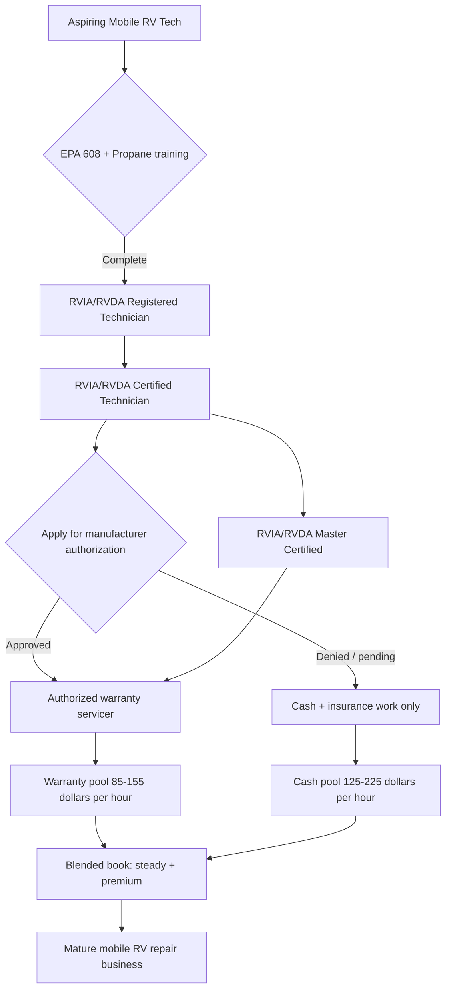

### Direct Answer

Starting a mobile RV repair business in 2027 means building a field-service operation that travels to recreational vehicles wherever they sit — campgrounds, RV parks, customer driveways, dealership lots, and rental-fleet yards — and the single decision that governs your income ceiling is whether you can earn manufacturer warranty access. Cash-pay diagnostic and repair work pays $125-$225 per billable hour, but it is lumpy and seasonal; manufacturer warranty work pays a lower $85-$155 per hour but is steady, year-round, and unlocked only by RVIA/RVDA technician certification plus brand-specific authorization that takes one to three years to assemble. A solo mobile tech who clears that gate nets $90K-$220K per year at 35-50% net margin on $185K-$450K of gross revenue; a two-technician operation reaches $300K-$700K gross at 28-42% net. The business is not hard to start — a van, $25K-$55K of tools and diagnostics, EPA 608 refrigerant certification, and a propane endorsement get you billable in 60-90 days — but it is hard to scale, because every dollar above a solo tech's personal capacity depends on hiring or training a second certified technician in a trade with a structural labor shortage.

> **TL;DR**
> - **Mobile RV repair is a field-service trade, not a shop.** Your "store" is a stocked van; your moat is certification, response time, and a campground/park referral network — not a location.
> - **Warranty access is the whole game.** RVIA/RVDA certification plus manufacturer authorization converts 30-50% of available work from unreachable to billable. Plan a 1-3 year path to it from day one.
> - **Pick one of four formats:** solo mobile-only, two-tech mobile with an office partner, mobile-plus-storefront hybrid, or franchise affiliation. Most operators should start solo and earn their way to two techs.
> - **Pricing is two-tier:** cash/insurance work at $125-$225/billable hour, warranty work at $85-$155/hour reimbursed by the manufacturer. Blend them deliberately; do not let warranty crowd out cash margin.
> - **Seasonality is real and survivable.** Demand swings 2-3x between peak camping season and winter. Build a counter-seasonal mix — winterization, storage prep, snowbird routes, fleet contracts — or your Q1 will bleed.
> - **The constraint is labor, not customers.** Demand for RV service exceeds supply almost everywhere. Growth past ~$250K gross requires you to become a recruiter and trainer, not just a wrench.

---

## Why Mobile RV Repair Is a Real Business in 2027

### 1. The Demand Picture Behind the Trade

The North American RV fleet is large, aging, and underserved by service capacity, and that gap is the entire commercial case for a mobile RV repair business. Roughly 11-12 million U.S. households own an RV, and the RV Industry Association (RVIA) has tracked years of shipments that added millions of units to the active fleet during the 2020-2022 ownership surge. Those coaches are now three to seven years old — exactly the age at which appliances fail, slide-outs misalign, roofs need resealing, and house batteries die. An RV is, functionally, a small house bolted to a chassis: it has a plumbing system, a 12V and 120V electrical system, an absorption refrigerator, a propane system, an HVAC system, and a structural envelope, and every one of those systems generates service demand on a predictable decay curve.

The supply side has not kept pace. Dealership service departments are notoriously backlogged — multi-week waits for a warranty appointment are routine, and a customer whose refrigerator quit at a campground 200 miles from the selling dealer has no practical way to use that warranty channel at all. That structural mismatch is what created the mobile RV technician category in the first place. The mobile tech is not competing with the dealer on price; the mobile tech is competing on the one thing the dealer cannot offer — coming to the RV, today or this week, wherever it is parked. The same on-site, response-time-driven economics define adjacent mobile trades (q9594) for mobile mechanics and (q2073) for windshield repair; RV repair simply applies the model to a more complex, higher-ticket machine.

A second demand driver is the rise of RV rental fleets and the professionalization of RV ownership. Peer-to-peer rental platforms and traditional rental fleets need fast turnaround between bookings — a fleet RV that is down is a fleet RV that is not earning. Fleet operators will sign recurring service relationships with a reliable mobile tech because downtime is a direct revenue loss for them. That converts a chunk of the addressable market from one-off retail jobs into contracted, route-able, predictable work, which is the single most valuable kind of revenue a field-service business can hold.

### 2. What "Mobile RV Repair" Actually Covers

It helps to be precise about the scope of work, because the breadth of an RV is what makes the trade lucrative and what makes certification matter. A mobile RV technician's job list, in rough order of frequency:

- **Appliance repair and replacement** — absorption refrigerators, water heaters, furnaces, rooftop air conditioners, microwaves, and cooktops. This is the bread-and-butter, and refrigerator and AC work specifically require EPA 608 refrigerant certification.
- **Electrical systems** — 12V house systems, converters and inverters, 120V shore-power systems, transfer switches, solar charge controllers, and increasingly lithium battery (LiFePO4) upgrades and diagnostics.
- **Plumbing and water systems** — fresh, gray, and black tank systems; pumps; water heaters; winterization; and leak diagnosis.
- **Propane (LP) systems** — regulators, lines, leak testing, and appliance gas connections. Propane work demands specific training and, in some states, a license endorsement.
- **Slide-out and leveling systems** — hydraulic and electric slide mechanisms, leveling jacks, and the controllers behind them. These are common, billable, and often misdiagnosed.
- **Roof and exterior** — resealing, sealant maintenance, delamination repair, and water-intrusion remediation. Water damage is the number-one killer of RV value, so this work is both frequent and emotionally urgent for owners.
- **Chassis-adjacent work** — brakes, bearings, suspension on towables; this is where the line blurs with general mechanical trades and where a custom-welding or fabrication skill (q9593) can add a premium service line.

No single technician is equally strong at all of this on day one. The realistic path is to start billable on the systems you already know — usually electrical and appliances — and add propane, refrigerant, and structural work as certifications and reps accumulate.

It is also worth understanding *which* of these job types pays best and which pays worst, because the mix you steer toward shapes the whole P&L. Appliance swaps and AC repairs are high-frequency and reliably billable, but they are also the most price-shopped, because the customer can roughly guess what a replacement refrigerator costs. Electrical diagnostics — especially the newer lithium-battery and inverter upgrades — carry a premium because the customer cannot easily price the work and because few competitors do it well. Water-intrusion and structural repair is emotionally urgent (the customer is watching their asset rot) and therefore the least price-sensitive category of all, but it demands real skill and the willingness to deliver bad news honestly. Slide-out and leveling work sits in the middle: common, billable, and frequently misdiagnosed by less-experienced techs, which means an operator who genuinely understands the hydraulics and controllers can charge confidently. A deliberate operator tilts the book toward diagnostics, electrical upgrades, and structural work, and treats commodity appliance swaps as relationship-building volume rather than the profit center.

### 3. The Three Customer Segments

A final piece of the demand picture: mobile RV repair does not serve one customer — it serves three, and they behave very differently.

- **The retail RV owner** is the largest segment by count. They book episodically, when something breaks or a season changes, they shop on price and availability, and they live in the campground/forum word-of-mouth network. They are the foundation of the business and the source of most referrals.
- **The fleet and rental operator** books on downtime economics, not emotion. A down unit is lost revenue, so they will pay for speed and sign recurring agreements. They are fewer in number but contractually valuable and route-able.
- **The dealer-overflow customer** is, functionally, the dealer's problem handed to you. The dealer's service department is backlogged; rather than lose the customer, the dealer refers the work — sometimes warranty, sometimes out-of-warranty — to a mobile tech they trust. This segment is the bridge into manufacturer warranty work.

Building the business means consciously cultivating all three rather than letting whichever segment called first define the company. The retail segment gives volume and reputation; the fleet segment gives ballast against seasonality; the dealer segment gives the on-ramp to the warranty pool.

### 4. The Honest Difficulty Assessment

A mobile RV repair business is easy to start and hard to scale, and confusing those two facts is the most common planning error. The startup is genuinely accessible: the capital requirement is a fraction of a brick-and-mortar shop, there is no lease, and a competent tradesperson can be generating invoices within a quarter. That low barrier is real.

The hard part arrives in three waves. **First, the certification ladder** — RVIA/RVDA registered and certified technician status, EPA 608, propane training, and then the slow accumulation of manufacturer-specific warranty authorizations — is a one-to-three-year project that cannot be rushed with money. **Second, seasonality** punishes anyone who does not plan for it: in most of the country, demand collapses in winter, and a business that only knows how to do peak-season repair work will starve from December to March. **Third, the scaling wall** is labor. Once a solo tech is fully booked, the only way up is a second technician, and qualified RV techs are scarce — the trade has an aging workforce and a thin training pipeline. Growth therefore turns into a recruiting and training problem, which is a different and harder discipline than turning wrenches. The rest of this answer is organized around clearing those three obstacles deliberately.

A useful way to hold the difficulty in mind is to separate the *trade* from the *business*. The trade — diagnosing and fixing RV systems — is learnable and, for someone with an adjacent background, not the hardest part. The business is the harder craft: routing a day so that travel time does not eat the margin, pricing so that a trip fee covers the windshield miles, holding enough working capital to survive a warranty-reimbursement lag, building park and dealer relationships that compound, and timing the hire of a second technician. Many capable RV technicians fail not because they cannot fix coaches but because they never built the business discipline around the wrench. Read the rest of this answer as a business plan that happens to be wrapped around a skilled trade — because that is what a successful mobile RV repair operation actually is.

---

## Choosing Your Operating Model

### 1. The Four Operator Formats

There is no single "mobile RV repair business." There are four distinct formats, each with a different capital profile, ceiling, and risk shape. Choosing deliberately — rather than drifting into whichever one your first ten jobs suggest — is the most important early decision.

| Format | Startup capital | Mature gross revenue | Net margin | Best for |
|---|---|---|---|---|
| **Solo mobile-only** | $35K-$75K | $185K-$450K | 35-50% | Experienced tech, fast cash flow, lowest risk |
| **Two-tech mobile** | $90K-$170K | $300K-$700K | 28-42% | Operator ready to manage + recruit |
| **Mobile + storefront hybrid** | $180K-$400K | $600K-$1.4M | 18-30% | Regional play, parts sales, indoor jobs |
| **Franchise affiliation** | $60K-$160K + fees | $200K-$500K | 25-38% | First-time owner wanting brand + systems |

- **Solo mobile-only** is the right default for almost everyone with hands-on RV experience. One certified technician, one stocked van, an office run from a laptop and a phone, and a spouse or part-time virtual assistant handling scheduling. Cash flow is fast, overhead is minimal, and the format is the cleanest path to earning the certifications that everything else depends on.
- **Two-tech mobile** is the natural next rung: a second van and technician, with the founder splitting time between billable work and running the office, dispatch, and sales. This is where revenue roughly doubles but net margin compresses, because you are now carrying a payroll, a second vehicle, and the overhead of actually managing people.
- **Mobile-plus-storefront hybrid** adds a small physical bay and a parts counter. The storefront enables jobs that cannot be done in a driveway — major slide-out rebuilds, indoor structural work in winter — and a retail parts line. It also adds rent, inventory, and the lowest net margin of the four. It is a regional-market play, not a starter format.
- **Franchise affiliation** trades a chunk of margin and an ongoing royalty for a recognized brand, a proven playbook, supplier relationships, and sometimes a head start on manufacturer authorizations. For a first-time business owner who is a strong technician but a weak operator, the systems can be worth the fee; for an experienced operator, the franchise mostly sells things you can build yourself.

### 2. Matching Format to Your Real Situation

The format should follow an honest read of three variables: your technical depth, your capital, and your appetite for managing people.

| If you are... | Lean toward... | Because... |
|---|---|---|
| A strong RV tech, limited capital, want income now | Solo mobile-only | Fastest to cash flow, lowest fixed cost, builds certs |
| A strong tech with some capital, want to build an asset | Two-tech mobile | Doubles capacity; founder becomes part-time operator |
| Capitalized, targeting a whole metro/region | Mobile + storefront hybrid | Storefront unlocks big jobs and a parts revenue line |
| A capable tech but an unproven operator | Franchise affiliation | Buys a playbook, brand, and supplier access |
| Transitioning from a dealership service role | Solo, then two-tech | You already hold certs; convert relationships fast |

The most common mistake is jumping straight to the hybrid because "a shop feels like a real business." A storefront triples your fixed costs and drops your margin into the high teens before you have proven you can keep two technicians fully booked. The disciplined sequence is: prove the unit economics solo, add a second tech only when you are turning away work, and consider a storefront only when route density and big-job demand both justify the rent. This is the same staged-scaling logic that disciplined operators apply across the mobile trades — see (q9594) on mobile mechanics and (q2070) on towing services, both of which reward proving the solo unit before adding fixed cost.

### 3. The Franchise Decision in Detail

Because franchising is the format most likely to be oversold, it deserves a closer look. A mobile RV repair franchise typically charges an initial franchise fee, an ongoing royalty (a percentage of gross), and sometimes a marketing-fund contribution. In exchange you get a brand, a defined territory, training, supplier discounts, software, and — the genuinely valuable part — potentially faster access to manufacturer authorization because the franchisor has existing relationships.

| Franchise pro | Franchise con |
|---|---|
| Recognized brand shortens the trust-building period | Royalty permanently reduces net margin |
| Established supplier and parts pricing | Territory and operating restrictions limit flexibility |
| Training and onboarding systems for new owners | Initial fee is capital that buys no equipment |
| Possible head start on manufacturer warranty access | You are tied to the franchisor's reputation, good or bad |
| Marketing co-op and lead generation | Exit/resale is governed by the franchise agreement |

The honest test: a franchise earns its fee if and only if it shortens your path to warranty authorization and you are genuinely weak at the operator side of the business. If you can assemble certifications and manufacturer relationships independently — and most technicians with dealership backgrounds can — the franchise is selling you systems you can build for the cost of your own time. Treat the warranty-access claim skeptically and in writing: ask exactly which manufacturer authorizations the franchise delivers and how fast.

Before signing any franchise agreement, demand the Franchise Disclosure Document and read the unit-economics and litigation sections closely, then call a sample of current and — critically — *former* franchisees. The questions that matter are concrete: How long did it actually take you to reach break-even? Which manufacturer authorizations did the franchisor genuinely help you obtain, and which did you have to get yourself? What is the all-in royalty and marketing-fund load as a percentage of gross? What does the territory protection actually guarantee? A franchise that performs well on those answers can be a sound choice for a first-time owner; a franchise that is evasive on them is selling a brand decal and little else. The decision should be made with numbers, not with the comfort of a logo.

### 4. The Path Between Formats

The four formats are not permanent identities — they are stages, and the healthiest businesses move between them deliberately. A typical successful trajectory: start solo mobile-only to prove the unit economics and earn certifications; once consistently turning away work, hire and add a second van to become a two-tech operation; if route density and big-job demand both justify it, eventually add a small storefront for the hybrid model. Each transition should be triggered by data — a sustained backlog, a measured big-job demand the driveway cannot serve — not by ambition or boredom. The franchise format is the exception: it is a starting-point choice, not a stage, because the franchise relationship is hard to unwind once entered. Decide the franchise question first and independently; decide the solo-to-two-tech-to-hybrid progression as the business earns each step.

---

## Licensing, Certification, and the Warranty Gate

### 1. The Certification Stack

Mobile RV repair sits at the intersection of several regulatory regimes, and getting the stack right is non-negotiable — both because some of this work is illegal without it and because the warranty gate that controls your income depends on it.

| Credential | Issuing body | What it unlocks | Typical time/cost |
|---|---|---|---|
| **EPA Section 608 certification** | EPA-approved testing org | Legal to handle refrigerant (RV fridge, rooftop AC) | Days; ~$25-$150 |
| **RVIA/RVDA Registered Technician** | RV Technical Institute | Entry credential; warranty-program eligibility starts here | Weeks-months |
| **RVIA/RVDA Certified Technician** | RV Technical Institute | Core professional credential; manufacturer-program prerequisite | Months-1 year |
| **RVIA/RVDA Master Certified Technician** | RV Technical Institute | Top tier; strongest warranty-access and rate position | 1-3 years total |
| **Propane (LP gas) training/endorsement** | State or NPGA-aligned programs | Legal to service propane systems and connections | Varies by state |
| **State contractor license (scope-dependent)** | State licensing board | Required where electrical/plumbing scope crosses thresholds | Varies widely |

A few points are worth emphasizing. **EPA 608 is federal and absolute** — touching refrigerant without it is a violation, and a large share of RV service touches refrigerant. Get it first; it is cheap and fast. **The RVIA/RVDA technician ladder is the spine of the trade** — the RV Technical Institute (RVTI) registered → certified → master sequence is what manufacturers, dealers, and many insurers recognize, and it is the credential that converts you from "a handyman who works on RVs" into "an RV technician." **Propane is jurisdiction-dependent** — some states require a specific license or endorsement to service LP systems; check your state's rules before you advertise the service.

### 2. The State-License Question

Whether you need a state contractor license depends on your state and on the scope of the work, and this is genuinely confusing because RV repair straddles trade boundaries. The general principle: light, RV-specific repair (appliances, sealing, slide-out adjustment) usually does not trigger a contractor license, but work that crosses into substantial electrical or plumbing scope can.

| State pattern | Practical implication |
|---|---|
| **Specialty/limited license states** (e.g., FL) | RV-specific work may fall under a specialty contractor category |
| **Trade-scope licensing** (e.g., CA C-36 plumbing, C-10 electrical) | Crossing into full-scope plumbing/electrical can require the trade license |
| **Permit-driven occupational licensing** (e.g., TX TDLR) | Specific systems are regulated by the state's licensing department |
| **Light-touch states** | Many states require only a business license + EPA 608 + propane endorsement |

The actionable rule: do not guess. Call your state's contractor licensing board and your state's RV or motor-vehicle dealer/service regulator, describe the exact scope you intend to offer, and get the answer in writing before you advertise. Misreading this is one of the few mistakes in the trade that can generate a stop-work order rather than just a lost job. The same "verify the local rule in writing" discipline applies to every regulated mobile trade — it is the first chapter of (q2136) on locksmithing and (q9620) on plumbing service.

### 3. The Warranty Gate — The Single Most Important Concept

Here is the concept that decides whether a mobile RV repair business earns $120K or $400K: **manufacturer warranty work is a gated revenue pool, and the gate is certification plus brand authorization.**

Roughly 30-50% of the total addressable RV service work in any market is warranty work — repairs the manufacturer pays for on coaches still inside their warranty period. A mobile tech who is not authorized simply cannot touch that pool; those customers are told "see an authorized service center," and the dealer backlog does the rest. A mobile tech who *is* authorized can intercept that demand at the campground, bill the manufacturer, and build a steady, year-round, recession-resistant revenue base.

The strategic implications follow directly from the diagram:

- **You can be profitable before you clear the gate.** Cash and insurance work at $125-$225/hour is real money, and many solo operators run a strong business on cash work alone. The gate is not a prerequisite for *starting* — it is a prerequisite for the *highest* revenue tier.
- **Authorization is per-manufacturer, not universal.** The big coach families — Thor Industries, Forest River, Winnebago, Grand Design, Jayco (a Thor brand), Keystone (a Thor brand), Heartland — run their own authorization processes. You assemble authorizations one brand at a time, prioritizing whichever brands dominate the fleet in your local campgrounds.
- **The gate takes time precisely because it is a moat.** A one-to-three-year path to master certification and multi-brand authorization is frustrating early and valuable later: it is exactly what stops the next person from undercutting you on warranty work. Treat the slow climb as the asset it is.

The disciplined plan: get EPA 608 and propane training immediately, enroll in the RVTI ladder on day one, run cash and insurance work to fund the climb, and apply for manufacturer authorizations the moment you hit the certification threshold each brand requires.

### 4. Insurance and Legal Setup

Beyond trade certification, the business needs a standard but non-optional protection layer:

- **General liability insurance** — covers property damage and bodily injury; required by most campgrounds and RV parks before they will let you work on their grounds.
- **Garage keepers / on-hook or care-custody-and-control coverage** — covers damage to a customer's RV while it is in your care. Essential, and frequently overlooked by new operators.
- **Commercial auto insurance** — your van is a commercial vehicle; personal auto policies will not cover it and will deny claims.
- **Workers' compensation** — required in nearly every state the moment you hire your first employee.
- **A formal business entity (LLC or S-corp)** — separates personal and business liability and is the baseline structure for the tax treatment most owner-operators want.
- **Tools-and-equipment / inland marine coverage** — covers the $25K-$55K of tools that live in a van that is, by definition, parked in unfamiliar places.

This is also where you decide on bookkeeping and tax structure. An LLC taxed as an S-corp is a common choice for owner-operators once profit is consistent, because it can reduce self-employment tax — but that is a conversation for a CPA, and it should happen before the business's first full tax year, not after.

One more legal discipline that new operators consistently underrate: a clear, written work-authorization and estimate process. Mobile RV repair often happens with the customer absent — the RV is in storage, the owner is at work, the coach is at a dealer lot. A documented estimate, an explicit authorization to proceed (including a not-to-exceed amount), and a clear written invoice protect the business from the single most common dispute in the trade: "I never agreed to that." Field-service software handles this well, generating an estimate the customer approves by text or signature before the wrench turns. It is unglamorous paperwork, and it is exactly what keeps a satisfied-customer business from accumulating chargebacks and bad reviews.

### 5. Warranty Authorization — The Application Mechanics

Because warranty authorization is the gate that governs income, it is worth being concrete about how a technician actually obtains it. Manufacturers do not advertise a single universal form. The general pattern: a manufacturer's service or warranty department maintains a network of authorized service providers, and admission to that network typically requires a baseline of RVIA/RVDA technician certification, proof of insurance, a business entity, and sometimes a minimum tooling or facility standard. Some manufacturers prefer to authorize established dealers and are slower to add independent mobile techs; others — recognizing the dealer-backlog problem — actively want mobile providers in their network to keep customers satisfied.

The practical playbook: identify the three or four coach brands that dominate the campgrounds in your service radius (a Thor Industries family brand, a Forest River brand, a Winnebago, a Grand Design — the exact mix is local), reach the warranty department of each, and ask precisely what their authorization process requires and how long it takes. Then climb the RVTI certification ladder to whatever threshold those specific manufacturers require, assemble the insurance and entity documentation, and apply. Expect the first authorization to be the hardest and slowest; each subsequent one is easier because you now have a track record. Authorization is cumulative, local-fleet-driven, and earned one relationship at a time — which is exactly why it functions as a durable competitive moat once assembled.

---

## Startup Costs and the Mobile Van Build

### 1. The Capital Stack

A realistic startup budget for the two most common formats — solo mobile-only and two-tech mobile — looks like this. These are 2027-dollar planning ranges, not quotes.

| Cost category | Solo mobile-only | Two-tech mobile | Notes |
|---|---|---|---|
| **Service vehicle (van/truck)** | $12K-$45K | $30K-$90K | Used cargo van to new; second vehicle for two-tech |
| **Van shelving, build-out, power** | $4K-$10K | $8K-$20K | Shelving, inverter, lighting, ladder rack |
| **Tools and diagnostics** | $8K-$22K | $16K-$40K | Hand tools, meters, refrigerant gear, leak detectors |
| **Initial parts/consumables inventory** | $3K-$8K | $6K-$16K | Sealants, fittings, common-failure parts |
| **Certifications and training** | $1.5K-$5K | $3K-$10K | EPA 608, RVTI ladder, propane training |
| **Licensing and entity setup** | $0.5K-$2.5K | $1K-$4K | LLC, business license, state-specific licensing |
| **Insurance (first-year)** | $3K-$8K | $7K-$18K | GL, commercial auto, garage keepers, WC if hiring |
| **Software, website, branding** | $1.5K-$4K | $3K-$8K | Field-service software, site, vehicle wrap |
| **Working capital reserve** | $8K-$20K | $20K-$50K | 3-4 months of expenses; survives the first slow stretch |
| **Total realistic range** | **$42K-$125K** | **$94K-$256K** | Used-vehicle, lean end vs. new-vehicle, fuller end |

The numbers in the table illustrate the format spread, and they widen the headline ranges given earlier because they fold in a healthy working-capital reserve. The most important line is the last one. A new operator who buys a van, tools, and inventory but skips the working-capital reserve is one slow month or one warranty-reimbursement delay away from a cash crisis. Warranty work in particular pays *after* you submit the claim — the reserve is what lets you survive the gap between doing the work and getting paid.

### 2. The Service Vehicle Decision

The van is the single largest line item and the most consequential equipment decision. Three sub-choices matter:

- **New vs. used.** A reliable used cargo van at 60K-90K miles can be a superb value and keeps capital free for tools and reserve. The risk is downtime: a van in the shop is a business that is closed. Many operators buy used to start, then move to new (or near-new) once cash flow proves out — the same capital discipline that drives the vehicle decision for any van-based mobile trade.
- **Van vs. truck-and-service-body.** A high-roof cargo van offers a weatherproof, lockable, organized workspace. A pickup with a service body offers more payload and easier access to a generator or compressor. For RV work — which is detailed, electronics-heavy, and often done in bad weather — the enclosed van usually wins.
- **Power and layout.** The build-out should include a serious inverter or onboard power, organized shelving so parts are findable, good lighting, secure tool storage, and a ladder rack (RV roof work is constant). A disorganized van directly costs billable hours: every minute hunting for a fitting is a minute not on the invoice.

### 3. The Tool and Diagnostic Kit

The tool list is broader than most trades because an RV contains so many systems. The essential categories:

| Tool category | Examples | Why it matters |
|---|---|---|
| **Electrical diagnostics** | Multimeter, clamp meter, circuit tester, battery analyzer | Electrical faults are the most common and most misdiagnosed |
| **Refrigerant tools** | Recovery machine, gauges, leak detector | Required (with EPA 608) for fridge and AC work |
| **Propane tools** | Manometer, leak-detection solution, regulators | LP testing is a frequent, billable, safety-critical job |
| **Plumbing/water** | Pumps, fittings, winterizing kit, inspection camera | Leak hunting and winterization drive seasonal revenue |
| **Sealing and roof** | Sealant guns, roofing tools, moisture meter | Water intrusion is the #1 RV value-killer |
| **General hand/power tools** | Standard mechanic's set, cordless tools, jacks | Baseline for slide-outs, leveling, and structural work |
| **Mobile diagnostics/software** | Brand-specific diagnostic tools, control-board testers | Modern RVs are increasingly software-managed |

Buy the diagnostic tools first and the convenience tools later. A technician who can *correctly diagnose* a fault and order the right part on the first visit is worth far more than one with a beautiful tool wall, because the costliest thing in mobile service is the wasted second trip.

---

## Pricing, Revenue, and Unit Economics

### 1. The Two-Tier Pricing Structure

Mobile RV repair pricing has two fundamentally different tiers, and a successful operator runs both deliberately rather than letting one swamp the other.

| Revenue tier | Typical rate | Who pays | Character |
|---|---|---|---|
| **Cash / out-of-warranty work** | $125-$225 / billable hour | The RV owner directly | Highest margin; lumpy; price-sensitive customers |
| **Insurance work** | $110-$190 / billable hour | Owner's insurer (storm, collision, water damage) | Good rate; paperwork-heavy; episodic |
| **Manufacturer warranty work** | $85-$155 / billable hour | The RV manufacturer | Lower rate; steady; reimbursed after claim |
| **Fleet / commercial contracts** | $100-$180 / billable hour | Rental fleets, dealers, parks | Predictable, route-able; volume discount expected |
| **Trip / service-call fee** | $75-$175 per visit | Whoever booked the job | Covers windshield time and fuel; protects margin |

The trip fee deserves special attention. A mobile business sells time, and travel time is unbillable unless you make it billable. A service-call or trip fee — charged on top of labor, or rolled into a minimum — is what keeps a 40-mile drive to a 30-minute job from being a money-loser. New operators routinely under-charge or skip the trip fee and then wonder why a "busy" week produced a thin paycheck.

### 2. Worked Unit Economics — Solo Operator

Consider a solo mobile RV tech in their second full year, past the startup ramp and holding partial warranty authorization. The model:

| Line item | Value | Notes |
|---|---|---|
| **Billable hours/week** | 25 | Of a ~45-hour week; rest is travel, admin, parts |
| **Working weeks/year** | 46 | Allows vacation + the deepest winter weeks |
| **Annual billable hours** | 1,150 | 25 x 46 |
| **Blended labor rate** | $140/hr | Mix of $125-$225 cash and $85-$155 warranty |
| **Labor revenue** | $161,000 | 1,150 x $140 |
| **Parts revenue (at markup)** | $70,000 | Parts marked up ~25-40% over cost |
| **Trip fees** | $24,000 | ~$60 effective per job across the year |
| **Total gross revenue** | **$255,000** | Squarely inside the $185K-$450K solo range |

Now the cost side:

| Expense | Annual | % of revenue |
|---|---|---|
| **Parts cost (COGS)** | $52,000 | 20% |
| **Vehicle (fuel, maintenance, depreciation)** | $22,000 | 9% |
| **Insurance** | $7,500 | 3% |
| **Tools, software, marketing** | $14,000 | 5% |
| **Certifications, licenses, dues** | $3,500 | 1% |
| **Admin / part-time scheduling help** | $16,000 | 6% |
| **Total operating expenses** | **$115,000** | **45%** |
| **Owner's net (pre-tax)** | **$140,000** | **55%** |

A second-year solo operator netting ~$140K on $255K gross sits at the strong end of the trade — and the lever that moved it there is billable-hour utilization, not rate. The difference between a tech who bills 18 hours a week and one who bills 28 is the difference between a struggling business and an excellent one, and almost all of that gap is routing, scheduling, and first-visit fix rate. This is the same utilization-driven economics that govern every dispatched mobile trade; (q2070) on towing and (q9594) on mobile mechanics both turn on the same number.

### 3. Worked Unit Economics — Two-Tech Operation

The two-tech model roughly doubles revenue but compresses margin, because the founder's time shifts from billable work toward management.

| Line item | Value | Notes |
|---|---|---|
| **Total gross revenue** | $520,000 | Two techs; founder ~50% billable |
| **Technician wages + payroll burden** | $135,000 | One employed tech, fully loaded |
| **Parts COGS** | $104,000 | 20% of revenue |
| **Two-vehicle costs** | $42,000 | Fuel, maintenance, depreciation |
| **Insurance (incl. workers' comp)** | $19,000 | WC is the new line vs. solo |
| **Office, software, admin, marketing** | $48,000 | Dispatcher/office partner, systems |
| **Certifications, licensing, dues** | $7,000 | Two techs on the RVTI ladder |
| **Total operating expenses** | **$355,000** | **68%** |
| **Owner's net (pre-tax)** | **$165,000** | **32%** |

The comparison is instructive: the two-tech operation grosses roughly double the solo model but the owner's net rises only modestly, because the second technician's wage and the new overhead consume most of the new revenue. The case for scaling to two techs is therefore not "double the income" — it is **building a transferable asset**: a business that runs without the founder on a wrench, that can be grown to three or four techs, and that has resale value. An operator who only wants maximum personal income may be better off staying solo; an operator building something to sell needs the second tech and must accept the margin compression that comes with it. This margin-versus-asset tradeoff is the same one analyzed in (q2065) for mobile mechanics and (q9613) for tree services.

### 4. Cash Flow and the Warranty-Reimbursement Lag

One unit-economics subtlety specific to RV repair: warranty work is paid in arrears. You do the repair, submit the claim to the manufacturer, and wait — sometimes weeks — for reimbursement. Cash work pays on completion; warranty work creates a receivable. The more a business leans into warranty work, the more working capital it must hold to bridge that lag. This is why the startup budget's working-capital reserve is not optional padding — it is the structural buffer that lets a warranty-heavy book of business survive its own payment timing.

There is also a claims-process discipline that protects warranty margin. Manufacturer warranty programs reimburse against documented labor times and approved parts; a claim filed sloppily — wrong labor code, missing photos, an unapproved part — gets kicked back, delaying payment further and sometimes shrinking it. The operators who make warranty work genuinely profitable treat claim filing as a skilled task: they learn each manufacturer's labor-time schedules, photograph the failure and the repair, file promptly, and track outstanding claims like the receivables they are. A two-tech operation will often have the office partner own this entirely, because a back-office that files clean claims fast is worth real money in both cash-flow timing and avoided write-offs.

### 5. The Utilization Lever

If there is one number to manage above all others, it is billable-hour utilization — the share of the working week that actually lands on an invoice. The solo model above assumed 25 billable hours of a 45-hour week; the rest went to travel, parts runs, estimates, claim filing, and admin. That 56% utilization is realistic but not fixed.

| Utilization scenario | Billable hrs/week | Annual labor revenue (at $140/hr) | Delta vs. base |
|---|---|---|---|
| **Struggling** | 18 | $115,920 | -$45,080 |
| **Base case** | 25 | $161,000 | — |
| **Well-routed** | 30 | $193,200 | +$32,200 |
| **Tightly run** | 34 | $218,960 | +$57,960 |

The table makes the point starkly: moving from a struggling 18 hours to a tightly run 34 hours roughly doubles labor revenue *at the same rate, in the same market, with the same skill*. The levers that move utilization are unglamorous and entirely within the operator's control — geographic routing so jobs cluster instead of scatter, scheduling that batches a service area on one day, a high first-visit fix rate so jobs do not require a costly return trip, and a stocked van so a parts shortage does not abort a job mid-repair. An operator obsessed with raising the hourly rate while ignoring utilization is optimizing the wrong variable; utilization is where the money is.

---

## Marketing, Customer Acquisition, and Seasonality

### 1. Where Mobile RV Repair Customers Come From

Customer acquisition in this trade is unusually relationship- and location-driven, which is good news: it means a disciplined operator can build a referral engine that compounds and reduces paid-marketing dependence over time.

| Channel | Cost | Speed | Durability |
|---|---|---|---|
| **Campground & RV-park relationships** | Low (time) | Medium | Very high — parks refer repeatedly |
| **Google Business Profile + local SEO** | Low-medium | Medium | High — compounds as reviews accumulate |
| **RV dealer overflow relationships** | Low (time) | Medium | High — dealers offload backlog |
| **Rental-fleet & commercial contracts** | Low (time) | Slow | Very high — recurring, route-able |
| **Online RV-owner communities & forums** | Low | Slow | Medium — builds reputation, not instant leads |
| **Paid search / local services ads** | Medium-high | Fast | Low — stops when spend stops |
| **Mobile-app & directory listings (RV LIFE, etc.)** | Low-medium | Medium | Medium — RV travelers search these |

The single highest-leverage move is the **campground and RV-park relationship**. A park manager whose guest has a broken refrigerator wants one trusted name to hand out — it makes the park look helpful and solves a guest problem. Becoming that name for ten parks in your service radius produces a steady, near-free referral stream. The same logic applies to **RV dealers**, whose service departments are backlogged: a dealer who trusts you will send overflow warranty and out-of-warranty work rather than make a customer wait six weeks. These two relationship channels, built patiently, eventually carry the business.

### 2. The Seasonality Problem and How to Beat It

Seasonality is the defining operational challenge of mobile RV repair, and ignoring it is the most expensive planning mistake in the trade. In most of the U.S., RV use peaks late spring through early fall and collapses in winter. Repair demand follows use: a business that only does peak-season break-fix work can see revenue swing 2-3x between July and January.

The fix is a deliberate counter-seasonal revenue mix:

| Season | Demand pattern | Counter-seasonal revenue strategy |
|---|---|---|
| **Spring (Mar-May)** | Ramp-up; de-winterization; pre-trip inspections | Sell de-winterization and pre-season inspection packages |
| **Summer (Jun-Aug)** | Peak break-fix; AC failures; travel emergencies | Maximize billable hours; consider premium emergency rates |
| **Fall (Sep-Nov)** | Slowing; winterization rush | Sell winterization; book storage-prep packages |
| **Winter (Dec-Feb)** | Trough; storage; snowbird migration | Storage-site inspections, fleet contracts, snowbird routes |

Four specific counter-seasonal levers turn a feast-or-famine calendar into a survivable one:

- **Winterization and de-winterization** are calendar-driven, near-universal services that bookend the off-season. A winterization package sold in October and a de-winterization package sold in March put revenue exactly where the trough would otherwise be.
- **Storage-facility relationships.** RVs in winter storage still need battery maintenance, leak checks, and pre-storage prep. A contract with a storage facility converts a dead season into a route.
- **Snowbird and warm-climate work.** Operators in Sun Belt states (Arizona, Florida, Texas, the Gulf Coast) actually see *winter* as a busy season as snowbird RVers arrive. Northern operators can partner, refer, or — at scale — run a seasonal route south.
- **Fleet and rental contracts.** Rental fleets and commercial RV operators need service year-round. Recurring fleet contracts are the single best ballast against retail seasonality because they are contractual, not weather-dependent.

An operator who builds two or three of these levers does not eliminate seasonality, but converts it from an existential threat into a manageable 1.3-1.5x swing.

### 3. Reputation, Reviews, and Pricing Power

Because RV owners are a tight, communicative community — forums, Facebook groups, campground word-of-mouth, rallies — reputation travels fast in both directions. A handful of glowing reviews from a campground community can fill a calendar; a pattern of no-shows or sloppy work can close a service radius. Three reputation disciplines compound:

- **Show up when you say you will.** In a trade built on stranded travelers, reliability is the entire brand. A clear arrival window, honored, beats any advertisement.
- **Diagnose honestly.** RV owners talk to each other constantly; a reputation for not over-selling repairs is worth more than any single inflated invoice.
- **Systematically request reviews.** A simple, consistent post-job request for a Google review builds the local-SEO asset that, over a year or two, makes paid advertising optional.

Reputation is also what gives a mobile RV tech pricing power. Once a technician is the trusted, fast, honest name in a region, customers stop shopping on price and start booking on availability — and that is precisely when the rate moves toward the top of the $125-$225 band.

### 4. Building the Referral Engine Deliberately

The campground, dealer, and fleet relationships that eventually carry the business do not appear by accident — they are built with a deliberate, repeatable outreach motion in the first twelve to eighteen months. The motion is straightforward and worth running as a disciplined cadence:

- **Map the territory first.** List every campground, RV park, storage facility, dealership, and rental operator within a realistic service radius. This is the universe of relationship targets, and it is finite — most service areas have a countable number.
- **Introduce yourself in person.** A campground manager or storage-yard operator is far more likely to refer a face they have met than a flyer. A short, professional in-person visit — business cards, a clear description of services, proof of insurance ready to hand over — opens the relationship.
- **Make the partner's life easier.** Offer the park a single trusted name to give stranded guests, offer the dealer reliable overflow capacity, offer the fleet a fast-response agreement. The pitch is never "send me work" — it is "I solve a problem you currently have."
- **Close the loop.** When a park or dealer sends a referral, the job must be done well and the referrer should know it went well. A reliably-handled referral is what converts a one-time hand-off into a standing relationship.

Run this cadence steadily — a few new relationship contacts every week — and within a year the business has a referral network that produces a continuous, near-free lead stream. That network is the real durable asset of a mobile RV repair business: it cannot be bought, it compounds with reputation, and it is what eventually makes paid advertising optional rather than essential.

---

## Counter-Case: When a Mobile RV Repair Business Is the Wrong Move

Everything above makes the case for the trade. Intellectual honesty requires the other side: there are real situations in which starting a mobile RV repair business is a mistake, and recognizing them early saves a year and a chunk of capital.

### 1. When You Lack the Technical Foundation

Mobile RV repair is a genuine skilled trade. It demands working competence across electrical, refrigeration, propane, plumbing, and structural systems, and it demands diagnostic judgment — the ability to find the actual fault rather than swap parts until something works. A person with no hands-on RV, automotive, electrical, or HVAC background is not "starting a business"; they are attempting to learn a multi-system trade and run a company simultaneously, and the failure rate of that combination is high. The honest path for someone without the foundation is to spend one to two years as a technician inside a dealership service department or alongside an established mobile operator first — earn the certifications and the reps on someone else's payroll — and *then* start the business. The trade rewards patience here and punishes the shortcut.

### 2. When Your Market Is Too Thin or Too Saturated

The trade depends on RV density. A service radius with few RVs, few campgrounds, and no rental fleets cannot support a full-time mobile tech no matter how skilled the operator. The opposite failure also exists: some Sun Belt and popular-camping regions are already well-served by established, certified, authorized operators with deep park relationships. Entering a saturated market as an uncertified newcomer means competing for the scraps of cash work the incumbents do not want. Before committing, count the RVs, the parks, the storage facilities, and the existing mobile operators in your radius — and be willing to conclude that the answer is "not here."

### 3. When You Need Stable Income Immediately

The certification ladder takes one to three years to climb, warranty work pays in arrears, and the first winter will be lean. A person who needs predictable, stable income starting next month — because of family obligations, debt, or no financial cushion — is taking on real risk by starting solo. For that person, a salaried technician role at a dealership or an established mobile operation provides the same trade, the same certifications, and a steady paycheck, with the option to go independent later from a position of financial strength. The mobile RV repair business is an excellent destination; it is a poor choice as an emergency income source.

### 4. When the Honest Answer Is a Different Trade

Sometimes the right conclusion is an adjacent business entirely. If your real strength is general mechanical work, a mobile mechanic business (q9594) or (q2065) may have a deeper, less seasonal customer base. If you love the recreational-vehicle world but not the wrench, an RV detailing or a windshield/glass service line carries less certification burden. If you have fabrication and welding skill, a custom welding business (q9593) avoids the warranty-gate dependency altogether. And if you are drawn to the field-service model itself rather than RVs specifically, the entire family of mobile trades — (q2070) towing, (q2073) windshield repair, (q2148) mobile ADAS calibration, (q2076) motorcycle repair, (q2067) mobile oil change — share the same van-based, route-driven economics with different gating constraints. The mobile RV repair business is the right answer only when the RV-specific demand, your RV-specific skill, and your tolerance for the warranty gate all line up.

---

## A 12-Month Launch Roadmap

For a technician with a real RV or adjacent trade background, here is a disciplined sequence from decision to a profitable solo operation.

| Phase | Months | Workstream | Milestone |
|---|---|---|---|
| **Foundation** | 1-2 | EPA 608, propane training, LLC, insurance, market count | Legally able to do refrigerant + propane work |
| **Equip** | 2-3 | Buy and build out van, assemble tool and diagnostic kit | Stocked, organized service vehicle on the road |
| **Launch** | 3-4 | Google Business Profile, website, first park relationships | First paying cash and insurance jobs invoiced |
| **Certify** | 1-12 | Enroll and progress through the RVTI registered/certified ladder | RVIA/RVDA Certified status reached |
| **Authorize** | 6-12 | Apply for manufacturer authorizations by local-fleet priority | First warranty authorization secured |
| **Stabilize** | 6-12 | Build counter-seasonal mix; sign first fleet/storage contract | Winter revenue floor established |
| **Decide** | 12 | Review utilization; choose: optimize solo or hire tech #2 | Clear, data-based growth decision |

Two phases run long on purpose. **Certification (months 1-12)** overlaps everything else because you start billable cash work immediately and climb the RVTI ladder in parallel — you do not wait to be certified to be in business. **Authorization (months 6-12)** begins the moment you cross each manufacturer's certification threshold, prioritized by which brands actually fill your local campgrounds. By month twelve the business should be cash-flow positive, holding at least one warranty authorization, carrying a counter-seasonal revenue floor, and giving the founder a real, data-based choice about whether to scale.

---

## Key Takeaways

- **Mobile RV repair is a low-barrier-to-start, high-barrier-to-scale field-service trade.** A van, $25K-$55K of tools, EPA 608, and propane training get you billable in 60-90 days; reaching the highest revenue tier takes one to three years.
- **The warranty gate decides your ceiling.** RVIA/RVDA certification plus manufacturer authorization unlocks 30-50% of the addressable work. Climb the RVTI ladder from day one and apply for brand authorizations as soon as you qualify.
- **Choose your format deliberately:** solo mobile-only (35-50% net), two-tech mobile (28-42% net), mobile-plus-storefront hybrid (18-30% net), or franchise. Most operators should prove the solo unit first.
- **Price in two tiers and protect travel time.** Cash/insurance work at $125-$225/hour, warranty work at $85-$155/hour, and a trip fee on every job so windshield time does not erode margin.
- **Beat seasonality on purpose.** Winterization, storage contracts, snowbird routes, and fleet agreements convert a 2-3x revenue swing into a manageable one.
- **The constraint is labor, not demand.** Growth past a solo tech's capacity is a recruiting and training problem in a trade with a structural technician shortage — plan to become a trainer, not just a wrench.
- **Know when not to do it.** Without the technical foundation, a dense-enough market, a financial cushion for the climb, or RV-specific passion, an adjacent mobile trade may be the better business.

---

## Related Questions

- **(q9594)** — **How do you start a mobile mechanic business in 2027?** The closest sibling trade — same van-based, route-driven, on-site economics, with a less severe certification gate and a deeper, less seasonal customer base.
- **(q2065)** — **How do you start a mobile mechanic business in 2027?** A second take on the mobile-mechanic model; the solo-versus-two-tech margin-and-asset tradeoff applies almost identically to RV repair.
- **(q2076)** — **How do you start a motorcycle repair business in 2027?** Another recreational-vehicle service trade with seasonal demand and an enthusiast customer community whose word-of-mouth drives acquisition.
- **(q2148)** — **How do you start a mobile ADAS windshield calibration business in 2027?** A mobile trade where, like RV warranty work, a specific certification gate separates the high-value work from the commodity tier.
- **(q2070)** — **How do you start a towing service business in 2027?** Shares the dispatched-field-service economics, the utilization-driven unit model, and the discipline of proving the solo unit before adding fixed cost.
- **(q9593)** — **How do you start a custom welding fabrication business in 2027?** A fabrication-skill business that can be a premium add-on service line for an RV repair operation — or an alternative trade with no warranty-gate dependency.
- **(q2067)** — **How do you start a mobile oil change business in 2027?** A simpler, lower-certification mobile trade — useful as a contrast that highlights how much of RV repair's value comes from the difficulty of its certification gate.

---

## Sources

1. RV Industry Association (RVIA) — annual RV shipment and ownership statistics and industry research.
2. RV Industry Association — RV Technical Institute (RVTI) technician certification program documentation.
3. RV Dealers Association (RVDA) — service-technician certification and dealership service-operations resources.
4. RV Technical Institute — registered, certified, and master certified technician curriculum and standards.
5. U.S. Environmental Protection Agency — Section 608 Technician Certification requirements for refrigerant handling.
6. U.S. Environmental Protection Agency — stationary refrigeration and air-conditioning compliance guidance.
7. National Propane Gas Association (NPGA) — propane handling training and safety standards.
8. U.S. Small Business Administration — guidance on business structure, licensing, and startup financing.
9. Internal Revenue Service — small business and self-employed tax structure guidance (LLC, S-corp election).
10. U.S. Bureau of Labor Statistics — Occupational Outlook for automotive and mobile-service technicians.
11. Go RVing / RV Industry Association — RV ownership demographics and consumer research.
12. Florida Department of Business and Professional Regulation — specialty contractor licensing categories.
13. California Contractors State License Board — C-36 plumbing and C-10 electrical license scopes.
14. Texas Department of Licensing and Regulation (TDLR) — occupational licensing for regulated trades.
15. Kampgrounds of America (KOA) — annual North American Camping and Outdoor Hospitality reports.
16. RV LIFE / RV travel-app industry data on RV traveler service search behavior.
17. RVIA — manufacturer warranty service network and authorized servicer program overviews.
18. Thor Industries (THO) — investor and brand materials covering RV manufacturing and warranty service.
19. Winnebago Industries (WGO) — investor relations and product/service network documentation.
20. Forest River — brand and dealer/service network public documentation.
21. Grand Design RV — owner support and authorized service resources.
22. Camping World Holdings (CWH) — RV retail and service-industry market context.
23. National RV Dealers Association — RV service-department backlog and capacity research.
24. Insurance Information Institute — commercial auto, general liability, and garage keepers coverage explainers.
25. National Association of Insurance Commissioners — workers' compensation requirements by state.
26. SCORE / SBA business mentoring resources — field-service and mobile-business startup guidance.
27. RVIA Standards / NFPA 1192 — standard for recreational vehicles (electrical, propane, plumbing systems).
28. NFPA 58 — Liquefied Petroleum Gas Code, governing propane system service and safety.
29. Recreation Vehicle Industry Association — economic impact and fleet-age studies.
30. U.S. Census Bureau — small-business and field-service industry statistics.
31. Mobile field-service software vendor benchmarks (ServiceTitan, Housecall Pro, Jobber) on technician utilization and scheduling.
32. National Federation of Independent Business (NFIB) — small-business operating cost and labor-availability surveys.
33. RVUSA / RV trader-platform market data on RV fleet size and regional distribution.
34. Outdoor Industry Association — outdoor recreation participation and RV-adjacent market research.
35. Trade press — RV PRO and RV News industry coverage of mobile RV service and technician-shortage reporting.
