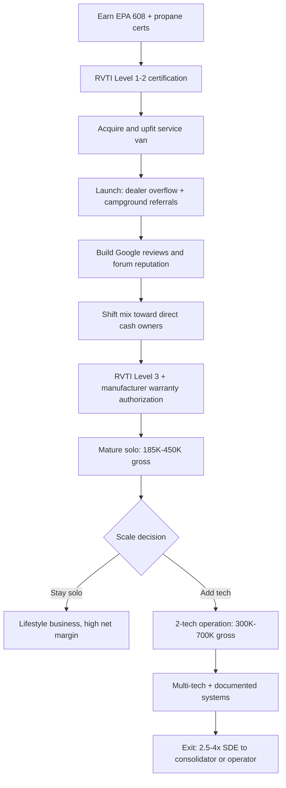

### Direct Answer

Starting a mobile RV repair business in 2027 means launching a field-service operation that travels to recreational vehicles at campgrounds, RV parks, customer driveways, dealership lots, and rental-fleet locations — and the single hardest gating factor is not the tools or the van but RVTI/RVIA technician certification and manufacturer-warranty access, which together control 30-50% of available billable work and take one to three years to fully earn. A mature solo mobile RV tech nets $90K-$220K per year at 35-50% net margin on $185K-$450K gross; a 2-tech operation reaches $300K-$700K gross at 28-42% net. Win by stacking certifications fast, locking campground and dealer service contracts early, and treating warranty access as the moat that retiring operators actually sell.

**TL;DR:** Mobile RV repair is a high-margin, low-overhead trade business gated by certification (RVTI Levels 1-3, EPA 608, propane handling) and manufacturer-warranty relationships, not by capital — startup runs $35K-$95K for a used cargo van, tools, and diagnostics. Demand is structurally supported by a growing installed base of ~11.2 million RV-owning households even as new-unit shipments fell from a ~600K 2021 peak to ~350K-400K in 2024-2025. The trade rewards operators who specialize (warranty-authorized work, mobile-only convenience premium, or campground-contract volume), price on a transparent service-call-plus-labor model at $125-$225/hr cash, and build the dealer and campground relationships that compound into a sellable book of business. The hardest part is the 2-4 year ramp to manufacturer-warranty authorization; the most common failure is underpricing windshield-time travel and seasonal cash-flow whiplash.

## 🗺️ Table of Contents

- **Part 1 — Foundations:** market size, certification ladder, legal structure
- **Part 2 — Van Build-Out & Capital:** vehicle selection, tools, software
- **Part 3 — Operations:** customer segments, pricing, warranty economics, seasonality
- **Part 4 — Growth & Exit:** marketing, the 2-tech transition, consolidation and exit math
- **Counter-Case:** why this business might be a mistake
- **Sources & Related Entries**

## 📐 PART 1 — FOUNDATIONS

### 1.1 Market Size & Opportunity

The mobile RV repair opportunity is best understood as a service-demand problem layered on top of a large, aging installed base rather than a new-unit-sales story. RV Industry Association (RVIA) shipment data shows wholesale shipments peaked near 600,000 units in 2021 during the pandemic travel boom, then corrected sharply to roughly 350,000-400,000 units annually across 2024-2025. A new operator reading only that headline would conclude the market is shrinking. That is the wrong read. The relevant denominator for a repair business is the **installed base**, not annual shipments, and the installed base is still expanding.

RVIA and RV market research estimate roughly **11.2 million U.S. households own an RV**, with another several million renting through platforms like RVshare and Outdoorsy each year. An RV is a rolling building — it contains a chassis, a 12V and 120V electrical system, a propane system, an absorption or compressor refrigerator, a roof membrane, slide-out mechanisms, water and waste plumbing, and HVAC. Every one of those systems degrades. The average RV generates **$800-$2,400 per year in maintenance and repair spend** once out of warranty, and units stay in service 12-20 years. A growing, aging fleet means repair demand rises even when showroom traffic falls.

The structural tailwind for the *mobile* segment specifically is service-center congestion. Dealership service departments are notoriously backlogged — owners routinely report 4-12 week waits to get an RV into a bay, and a unit dropped for a single warranty item often sits for a month. That delay is intolerable for an owner mid-trip or trying to make a reservation window. Mobile techs convert that pain into a convenience premium: the customer keeps the RV on-site, avoids towing a 35-foot coach, and pays for the tech's travel. The mobile model also carries dramatically lower fixed overhead than a storefront — no bay rent, no lift, no showroom — which is why solo mobile net margins (35-50%) run well above dealership service-department margins.

Geographic demand concentrates in three patterns. **Sunbelt snowbird corridors** (Florida, Arizona, Texas Gulf Coast, Southern California) see winter demand spikes as northern RVers migrate. **Destination camping regions** (Colorado, the Smoky Mountains, the Pacific Northwest, the Upper Midwest lakes) see summer spikes. **Year-round full-timer hubs** near long-term RV parks generate steadier baseline demand. A new operator should map RV parks, campgrounds, and rental-fleet depots within a 35-mile service radius before committing to a territory — that map *is* the addressable market. The installed-base logic in mobile ADAS windshield calibration (q2148), another mobile field-service trade, runs on exactly the same arithmetic.

The competitive set is thinner than in most trades. Within any given 35-mile radius an operator typically faces two to six independent mobile techs, one or two dealership mobile-service trucks, and the franchise networks. That fragmentation — combined with certification scarcity — is why a competent, well-certified operator can build a waitlist within 12-18 months.

It is worth naming the operating landscape so a new entrant can benchmark against real reference points rather than abstractions. National and regional reference operators include **Mobile RV Pros** and **TechRV** (network-affiliated mobile operations), **RV America Service** (a multi-market mobile network), and many strong single-operator and small-team independents that dominate local markets — **Highway 18 Mobile RV** in Florida and **Bear Mountain Mobile RV** in Colorado are representative of the well-reviewed regional independent that a new operator should study. Dispatch and membership networks shape demand flow: **Coach-Net** runs a national emergency RV dispatch network, and **Good Sam Roadside** operates a large membership-driven roadside program — both route breakdown calls to local techs. On the consolidation side, **Camping World Holdings (NYSE: CWH)** and **Lazydays Holdings (NASDAQ: LAZY)** are the publicly traded names rolling up RV dealerships and service centers, while **RV Retailer LLC** and other private roll-ups acquire dealer networks; private-equity firms active in adjacent outdoor-recreation and powersports spaces add further consolidation pressure. None of these directly displaces a competent local mobile tech — but knowing the named players lets an operator position deliberately rather than blindly.

The macro demand picture also rewards a closer look at *who* owns RVs. The buyer base has broadened well beyond the traditional retiree segment: younger families, remote workers who travel while working, and the full-timer community that treats an RV as a primary residence all generate repair demand, and the full-timer in particular is a high-value recurring customer because their home *is* the unit being serviced. Rental-marketplace growth through RVshare and Outdoorsy has also created a class of owner-investors who buy units specifically to rent — and those owners need fast, reliable repair turnaround to protect booking revenue. The practical implication for a new operator: the addressable market is not a single homogeneous "RV owner" but a layered set of segments, and the territory-mapping exercise should count campgrounds, RV parks, storage yards, rental depots, *and* the long-term and full-timer parks that anchor steady baseline demand.

### 1.2 Tech Certifications & Licensing

Certification is the moat, the bottleneck, and the single biggest determinant of which billable work an operator can legally and contractually access. There are four distinct layers, and they must be sequenced deliberately.

**Layer one — RVTI technician certification.** The RV Technical Institute (RVTI), the training arm RVIA built to professionalize the trade, runs a four-level curriculum: Level 1 (Registered Technician — basic systems), Level 2 (Certified Technician), Level 3 (Master Certified Technician), and specialized endorsements. Most warranty programs and dealer-subcontract relationships expect at least Level 2; the most lucrative manufacturer-authorized work expects Level 3. A motivated entrant with prior trade experience can reach Level 2 in 6-12 months of part-time study plus hands-on hours; Level 3 typically takes another 12-24 months. RVTI displaced the older RVIA/RVDA exam track, so older "RVIA Certified" credentials should be mapped to the current RVTI levels.

**Layer two — EPA Section 608 refrigerant certification.** Any work involving the sealed refrigerant systems in RV air conditioners or compressor-style refrigerators legally requires federal EPA Section 608 certification. This is a non-negotiable federal requirement under the Clean Air Act, inexpensive to obtain through a proctored exam, and should be earned in week one. Absorption refrigerators (the ammonia-cycle units common in RVs) are a gray area, but related diagnostic and replacement work is constant — skipping the AC refrigerant credential cuts off a reliable revenue line.

**Layer three — propane handling.** RV propane systems (cooktop, furnace, water heater, absorption fridge) require safe-handling competence and, in several states, a propane or LP-gas license or registration. State rules vary widely: some states regulate LP work under a dedicated fuel-gas board; others fold it into plumbing or mechanical licensing. An operator must check the specific state authority before touching gas lines.

**Layer four — state contractor licensing.** This is the most jurisdiction-dependent layer and the one new operators most often get wrong. Pure diagnostic, appliance, and 12V work is generally unregulated. But scope-dependent thresholds trigger licensing: 120V electrical above a certain scope, plumbing alterations, and structural work can require a state contractor license. California is the strictest example — a C-46 (solar), C-36 (plumbing), or C-10 (electrical) classification may apply depending on the job; Florida uses a Specialty Contractor framework; Texas regulates specific systems through TDLR. The safe operating posture: confirm with the state contractor board which RV systems fall inside licensed scope, and either earn the license or carefully stay within unlicensed scope.

The certification ladder below shows the recommended sequence and the work each layer unlocks.

| Certification layer | Time to earn | Cost range | Work it unlocks | Sequence priority |
|---|---|---|---|---|
| EPA 608 (refrigerant) | 1-2 weeks | $25-$150 | RV AC, compressor-fridge sealed-system work | Immediate (Week 1) |
| Propane handling / state LP | 2-8 weeks | $100-$600 | Furnace, water heater, cooktop, gas lines | Immediate (Month 1) |
| RVTI Level 1 (Registered) | 1-3 months | $400-$900 | Baseline diagnostic credibility, insurance | Month 1-3 |
| RVTI Level 2 (Certified) | 6-12 months | $1,200-$2,500 | Dealer subcontract, most warranty programs | Month 3-12 |
| RVTI Level 3 (Master) | 12-24 months | $2,000-$4,000 | Manufacturer-authorized warranty work | Year 2-3 |
| State contractor (scope-dependent) | 3-9 months | $300-$1,500 | 120V/plumbing/structural in-scope work | As territory requires |

The strategic insight: the EPA 608 and propane credentials are cheap, fast, and unlock immediate cash work, so they go first. RVTI Level 2 is the gate to dealer and warranty relationships, so it is the priority investment of year one. RVTI Level 3 plus manufacturer-specific training — Forest River, Thor Industries, Winnebago, Grand Design, Jayco, Keystone, and Heartland each run their own authorized-service onboarding — is the long game. It is what converts a cash-only mobile tech into a warranty-authorized operator, and warranty authorization is the relationship most retiring operators actually sell.

A point new entrants frequently miss: certification is not a one-time gate but an ongoing competency investment. RV systems evolve fast — lithium house batteries with battery-management systems, residential-style 120V refrigerators, multi-zone HVAC, advanced solar arrays, and increasingly software-controlled chassis and leveling systems are now common on mid-market coaches. A tech certified five years ago on absorption fridges and lead-acid batteries who has not kept current is, in practice, partially obsolete. The disciplined operator budgets time and money each year for continuing education, manufacturer update training, and new-system familiarization. This is also a competitive advantage: the operator who is genuinely fluent in lithium-and-solar conversions can charge premium rates for high-margin upgrade installations that a less-current competitor simply refers away.

There is also a credibility dimension to certification that pure self-study underrates. When an RV owner is choosing between two mobile techs, displayed RVTI certification, EPA 608 documentation, and manufacturer-authorized status are trust signals that win the job before the tech ever arrives. The same signals matter to dealerships deciding whom to subcontract and to campgrounds deciding whom to put on their preferred-tech list. Certification is simultaneously a legal permission, a competency floor, and a marketing asset — which is why under-investing in it is the most common strategic error in the trade.

A practical sequencing note on the franchise question: the franchise networks (Mobile RV Pros, TechRV, RV America Service) offer a faster on-ramp — brand, training support, lead flow, and sometimes warranty-relationship access — in exchange for franchise fees and ongoing royalties. For an entrant with no trade background and limited local network, a franchise can compress the 2-4 year ramp meaningfully. For an experienced tech who already has dealer or campground relationships, the franchise economics rarely justify the royalty drag. The decision is genuinely operator-specific and should be modeled against the realistic cost of building reputation and warranty access independently.

### 1.3 Business Structure & Insurance

The legal foundation is straightforward but consequential. Nearly every mobile RV repair operator should form a **single-member LLC** — it separates personal assets from the liability of working on customers' high-value rolling property, costs $50-$500 to file depending on the state, and allows pass-through taxation. As revenue scales past roughly $80K-$100K of net profit, an **S-corporation election** on top of the LLC becomes worth modeling: it lets the owner split income between a reasonable W-2 salary and distributions, reducing self-employment tax. The crossover point should be evaluated with an accountant, not guessed.

Insurance is where mobile RV repair differs from a low-stakes trade. Four coverages matter:

- **General liability** — covers third-party property damage and bodily injury; $1M/$2M is the standard floor, typically $600-$1,400/year for a solo operator.
- **Garagekeepers / care-custody-and-control coverage** — this is the critical one. The moment a tech works on a customer's $120K coach, that vehicle is in their care. A standard general-liability policy may exclude damage to property in the operator's custody; a garagekeepers or tools-and-care endorsement closes that gap.
- **Commercial auto** — the service van must be on a commercial policy, not a personal one. A claim on a personal policy while operating commercially can be denied.
- **Inland marine / tools coverage** — $15K-$40K of diagnostic equipment and tools in the van is a theft and total-loss exposure worth insuring.

A bundled program for a solo mobile RV operator typically runs **$2,400-$5,500 per year**. Underinsuring the care-custody-and-control exposure is the single most dangerous corner an operator can cut — one dropped slide-out or botched roof job can exceed $20K in damage.

Two more foundational items: a **resale or sales-tax permit** is required in most states because the operator sells parts — appliances, membranes, slide motors — alongside labor, and parts are taxable. And the business should adopt a **written warranty and limitation-of-liability policy** from day one: a clear, plain-language statement of what the operator warranties (typically 90 days on labor, parts per manufacturer) and what it disclaims. The compliance-first posture mirrors mobile drug testing (q2150), where regulatory structure is effectively the entire business model.

The table below summarizes the foundational legal and insurance setup and its realistic cost.

| Setup item | Typical cost | Why it matters | Timing |
|---|---|---|---|
| Single-member LLC formation | $50-$500 | Personal-asset protection | Before first job |
| S-corp election (later) | Accountant fee | SE-tax savings past ~$80K-$100K net | Year 2+ |
| General liability ($1M/$2M) | $600-$1,400/yr | Third-party damage/injury | Before first job |
| Garagekeepers / care-custody endorsement | Bundled | Damage to the customer's RV in your care | Before first job |
| Commercial auto | $1,400-$3,000/yr | Personal policy denies commercial claims | Before first job |
| Inland marine / tools coverage | $200-$600/yr | $15K-$40K of tools against theft/loss | Before first job |
| Resale / sales-tax permit | $0-$100 | Legal parts resale | Before first parts sale |

Cash-flow planning at the formation stage should also account for the gap between launch and first revenue. A realistic ramp assumes 60-90 days from "ready to work" to a steady calendar, and the operator should carry 4-6 months of personal living expenses plus the operating reserve. The most common first-year failure is not lack of demand — it is running out of personal runway before the calendar fills and the reviews compound. Treat the personal cash cushion as a non-negotiable line item in the startup budget, not an afterthought.

One more structural decision belongs at the foundation stage: the **service-radius and travel-fee policy**. An operator should define, in writing, a standard service radius (commonly 25-40 miles), the trip fee that applies inside it, and a per-mile or zone surcharge beyond it. Setting this policy early — and putting it on the website and in the booking flow — prevents the slow margin erosion that comes from saying yes to long-radius jobs without charging for the windshield time. It also makes the business legible to customers, which reduces disputes.

## 🚐 PART 2 — VAN BUILD-OUT & CAPITAL

### 2.1 Service Vehicle Selection & Upfit

The service vehicle is simultaneously the operator's office, warehouse, and brand — and it is the largest single capital line. There are three viable formats.

A **used cargo van** (Ford Transit, Ram ProMaster, Mercedes Sprinter, Chevrolet Express) is the default and the right answer for most new operators. A 3-5 year-old high-roof Transit or ProMaster with reasonable mileage runs $22,000-$38,000. High-roof matters: a tech who can stand up inside the van works faster and stays healthier. The ProMaster's wide, square cargo box maximizes shelving; the Sprinter offers the best fuel economy and resale but the highest service costs.

A **used service body / utility truck** trades interior workspace for external compartmented storage and a higher payload — useful for an operator carrying heavy slide motors, multiple appliances, and a generator. It runs $28,000-$50,000 used.

A **new van** ($45,000-$70,000 before upfit) is rarely the right first move; the capital is better deployed into certification and inventory. New vans make sense only once the business is established and the owner wants a depreciation-and-warranty trade-off.

The **upfit** — shelving, drawers, a workbench, electrical, lighting, and a partition — adds $4,000-$15,000. A professional shelving package from an upfitter is worth it; a roof ladder rack is mandatory because RV roof work is constant. Critical upfit elements: a deep-cycle auxiliary battery and inverter to run diagnostic and power tools without idling the engine, LED interior and exterior work lighting, a small parts-bin wall, a secure lockbox for high-value tools, and an exterior vehicle wrap or lettering with the phone number — the van is a moving billboard at every campground.

| Vehicle path | Acquisition cost | Upfit cost | Total ready-to-work | Best for |
|---|---|---|---|---|
| Used high-roof cargo van | $22K-$38K | $4K-$12K | $26K-$50K | Most new solo operators |
| Used service-body truck | $28K-$50K | $3K-$9K | $31K-$59K | Heavy-appliance / slide-motor focus |
| New cargo van | $45K-$70K | $6K-$15K | $51K-$85K | Established operator, warranty/tax play |

### 2.2 Tools, Diagnostics & Parts Inventory

Tooling for mobile RV repair spans general mechanical, electrical, plumbing, propane, and RV-specific diagnostics. A complete first-year tool and equipment package runs **$8,000-$22,000**, and it should be built in waves rather than all at once.

**Wave one — work-from-day-one essentials ($4,000-$8,000):** a full general hand-tool set, a cordless tool platform (drill, impact, recip saw), a digital multimeter and clamp meter, a manometer for propane pressure testing, refrigerant gauges and recovery equipment (paired with the EPA 608 credential), a propane leak detector, basic plumbing tools, a quality extension ladder rated for roof work, a fall-protection harness, and a portable generator or robust inverter to power tools at sites without shore power.

**Wave two — capability-expanding tools ($2,500-$8,000):** a thermal-imaging camera — invaluable for finding moisture intrusion and electrical hot spots, and moisture damage is the number-one RV killer — a slide-out alignment and motor toolkit, a more complete propane and HVAC service set, a battery and electrical-system tester for the increasingly common lithium house-battery and solar setups, and a tablet-based diagnostic platform.

**Wave three — specialization tools ($1,500-$6,000):** chosen based on the operator's chosen niche — solar and lithium installation tooling, advanced roof-membrane and structural-repair equipment, or chassis and suspension tools.

**Parts inventory** is a working-capital decision distinct from tools. Carrying $3,000-$10,000 of fast-moving parts — vent fans, water-heater elements and anode rods, common 12V components, sealants and roof products, fuses, breakers, light fixtures, plumbing fittings, and a small set of common appliance parts — lets the operator complete a meaningful share of jobs on the first visit. **First-visit completion rate** is the most important operational metric in the trade: a callback or parts-run return trip burns the operator's single scarcest resource (windshield time) with zero added revenue. Stocking the right $5,000 of inventory can lift first-visit completion from 55% to 80%+. The equipment-capitalization logic here echoes stump grinding (q2146), where the machine *is* the business.

The inventory question deserves more precision than "carry $5,000 of parts," because *which* parts matter as much as how much. The right stocking list is built from the operator's own job history — within six months an operator can see which parts they have driven back to fetch most often, and that callback log is the inventory shopping list. Until that data exists, a sensible starting stock prioritizes the highest-frequency, lowest-cost-of-stockout items: roof sealant and Dicor-type lap sealant (moisture intrusion is constant), water-heater anode rods and heating elements, vent-fan motors and lids, common 30A and 50A breakers and fuses, RV-specific light fixtures and bulbs, water-pump rebuild kits, slide-out lubricant and seals, and an assortment of plumbing fittings and PEX components. The supplier relationships matter too — an operator who has accounts with the major RV parts distributors and a same-day or next-day local supplier can keep inventory leaner while still hitting a high first-visit rate.

| Tool/equipment wave | Cost range | Key contents | When to buy |
|---|---|---|---|
| Wave 1 — day-one essentials | $4,000-$8,000 | Hand tools, cordless platform, multimeter, manometer, refrigerant gauges, ladder, harness, inverter/generator | Before launch |
| Wave 2 — capability expansion | $2,500-$8,000 | Thermal camera, slide-out kit, HVAC set, battery/electrical tester, diagnostic tablet | Months 3-9 |
| Wave 3 — specialization | $1,500-$6,000 | Solar/lithium install tooling, roof-structural equipment, chassis tools | Year 1-2 |
| Parts inventory (working capital) | $3,000-$10,000 | Sealants, anode rods, vent fans, breakers, fittings, common appliance parts | Build from callback log |

The discipline that ties tools and inventory together is treating both as investments measured against billable-hour recovery. A $1,000 thermal camera that finds moisture damage in five minutes instead of an hour pays for itself within a handful of jobs. A $300 part on the van that turns a two-visit job into a one-visit job recovers a full trip's worth of windshield time. The operator who frames tooling and inventory this way — as windshield-time recovery — buys the right things in the right order.

### 2.3 Operating Software & Dispatch Systems

A modern mobile RV repair business runs on a small software stack, and the days of a paper schedule and a shoebox of receipts are over. The core categories:

- **Field-service management (FSM):** scheduling, dispatch, customer records, job history, and mobile invoicing. Housecall Pro, Jobber, ServiceTitan, and RV-specialized platforms all serve this trade. For a solo or 2-tech operation, a $50-$200/month FSM platform is the right scale; ServiceTitan is overkill until multi-tech scale.
- **Payments:** mobile card acceptance and digital invoicing — most FSM platforms bundle this, or Square/Stripe terminals work standalone.
- **Accounting:** QuickBooks Online or Xero, $30-$90/month, ideally synced to the FSM platform so revenue and expenses reconcile automatically.
- **Routing and dispatch optimization:** because windshield time is the cost center, route-clustering tools (often built into FSM, or standalone like Route4Me) materially improve daily billable hours.
- **Customer communication:** automated appointment confirmations, on-the-way texts, and review requests. The review-request automation is strategically important — RV owners choose mobile techs almost entirely on Google reviews and RV-forum reputation.

Total software spend for a solo operator is **$120-$400 per month**. The single highest-leverage software decision is adopting an FSM platform from day one rather than month eighteen — retrofitting two years of paper records into software is painful, and the job-history database is itself a sellable asset at exit.

The job-history database deserves emphasis as more than an administrative convenience. Over years of operation, the FSM record accumulates a detailed map of every unit serviced, every recurring customer, every campground relationship, and every warranty job — and that map is exactly what a buyer pays for at exit. A disciplined operator who has captured customer contact information, service history, and review consent in software has built a transferable asset; an operator running on memory and a paper calendar has built a job that ends when they retire. The software discipline that feels like overhead in year one is, in retrospect, equity accumulation.

There is also a routing dimension worth a closer look. Because windshield time is the structural cost center of any mobile trade, the operator who clusters jobs geographically — booking the campground on the north side of town on Tuesday and the south side on Wednesday rather than crisscrossing the metro daily — recovers a meaningful share of each week as billable hours. Modern FSM and routing tools surface these clusters automatically, but the discipline is the operator's: holding a non-urgent job for two days to fit it into an efficient route is almost always the right call, and communicating that scheduling logic to customers is rarely a problem when the alternative is a higher trip fee. A tightly routed week can mean the difference between 22 and 30 billable hours — and on the same hourly rate, that gap is the difference between the bottom and the top of the solo income range.

## ⚙️ PART 3 — OPERATIONS

### 3.1 Customer Segments & Demand Mix

Mobile RV repair serves five distinct customer segments, each with a different acquisition path, price sensitivity, and margin profile. Understanding the mix is the foundation of both pricing and growth strategy.

**Individual RV owners — out-of-warranty (cash work).** The core segment. These owners pay cash or card, choose on convenience and reputation, and are the operator's highest-margin work at $125-$225/hr. They are reached through Google, RV forums, campground referrals, and word of mouth.

**Individual RV owners — in-warranty.** Owners of newer units want warranty repairs done without surrendering the RV to a backed-up dealership. The operator can serve them only if warranty-authorized by the relevant manufacturer; otherwise the work is referred. Warranty work pays a lower negotiated rate ($85-$155/hr) but comes with steadier volume and manufacturer-direct parts.

**RV rental-fleet operators.** Owners managing fleets on RVshare, Outdoorsy, or running a local rental yard need fast turnaround between bookings. This segment offers contract volume and route density — one stop services multiple units — but negotiates harder on rate.

**Campgrounds and RV parks.** Parks with long-term and seasonal guests value an on-call tech relationship; some retain a preferred mobile tech and refer all guest repairs. These referral relationships are pure leverage — the campground is a standing lead-generation channel.

**RV dealerships (overflow and mobile subcontract).** Backed-up dealer service departments subcontract overflow work or mobile-only jobs to independent techs. This is lower-margin but high-volume and steady, and it is often the on-ramp to manufacturer-warranty authorization.

| Segment | Typical rate | Margin | Volume stability | Acquisition path |
|---|---|---|---|---|
| Owner — cash / out-of-warranty | $125-$225/hr | Highest | Moderate, seasonal | Google, forums, referrals |
| Owner — in-warranty | $85-$155/hr | Moderate | Steady (if authorized) | Manufacturer programs |
| Rental-fleet operators | $95-$160/hr | Moderate | Contract-steady | Direct B2B outreach |
| Campgrounds / RV parks | Referral channel | Indirect | Seasonal | Relationship building |
| Dealer overflow subcontract | $80-$130/hr | Lower | High, steady | Dealer relationships |

The strategic move for a new operator is to **lead with dealer overflow and campground referrals to build volume and certification credibility**, then progressively shift the mix toward direct cash owners and warranty authorization as reputation compounds — exactly the trajectory a soft-wash or window-tinting operator follows when graduating from subcontract to direct work (q2151, q2140).

The demand mix should also be understood by *job type*, because the type of work a template operator gets called for shifts predictably with the season and with the unit's age. The recurring job categories — and their rough share of a mature solo operator's annual revenue — break down as follows.

| Job category | Share of revenue | Margin | Notes |
|---|---|---|---|
| Appliance repair/replacement (fridge, AC, furnace, water heater) | 30-40% | High | Highest-frequency cash work |
| Roof, seal, and moisture remediation | 15-25% | High | Moisture is the #1 RV failure mode |
| Electrical (12V, 120V, lithium, solar) | 15-20% | High | Growing fast as lithium/solar spread |
| Slide-out mechanism repair | 8-15% | Moderate | Higher liability, specialized tooling |
| Plumbing and water systems | 8-12% | Moderate | Often bundled with winterization |
| Winterization / de-winterization | 8-12% | Moderate | Seasonal, fills shoulder months |
| Inspections (pre-purchase, pre-trip) | 3-8% | High | Pure expertise, no parts, high hourly |

The strategic reading of this table is that the high-margin categories — appliance work, electrical, roof and moisture, and inspections — are also the categories most accessible to a well-certified solo operator without specialized heavy equipment. Slide-out work is the one category where the liability and tooling demands argue for caution until the operator is genuinely experienced. An operator deciding where to build depth should weight toward appliance and electrical fluency first, because that is where the volume and the margin concentrate.

### 3.2 Pricing & Service-Call Structure

Pricing in mobile RV repair has a structure the customer must understand before the tech arrives, because the largest source of disputes is surprise charges. The transparent, defensible model has three components.

**The service call / trip fee.** A flat fee — typically $95-$185 — covers dispatch, travel within the standard service radius, and the first 15-30 minutes of diagnosis. This fee compensates the operator for windshield time, which is the real cost of the mobile model. Some operators waive or credit the trip fee against the job if work is approved; that is a marketing choice, not an obligation.

**Labor.** Billed hourly at $125-$225 for cash work, $85-$155 for warranty work. The operator should bill in clearly stated increments and quote a not-to-exceed estimate before starting non-trivial work.

**Parts.** Marked up from cost — a 25-50% margin on parts is standard and defensible, covering procurement time, the working capital tied up in inventory, and the value of having the part on the van.

A mature solo operator who structures pricing this way and manages routing well realizes **$185K-$450K in annual gross revenue**, billing roughly 22-32 productive hours per 40-hour week — the gap is windshield time, estimates, and parts runs. Net margin lands at **35-50%**, producing **$90K-$220K in owner earnings**.

The two pricing mistakes that quietly destroy margin: **underpricing the trip fee** so that long-radius jobs lose money on travel, and **failing to bill diagnosis time** when a job turns out not to need a repair. A disciplined operator charges for the diagnostic visit regardless of outcome — the expertise is the product. The pricing discipline here mirrors the trip-fee economics in mobile ADAS calibration (q2148) and mobile drug testing (q2150): in any mobile trade, travel time is real cost and must be priced explicitly.

It helps to model a representative day, because the daily arithmetic is what turns hourly rates into annual income. A solo operator on a well-clustered route might run four jobs: a $145 trip fee plus 1.5 hours of labor on an AC repair; a $145 trip fee plus 1.0 hour on a vent-fan replacement at the same campground (the cluster discount is the operator keeping the second trip fee while sharing the drive); a $145 trip fee plus 2.5 hours on a slide-out adjustment with $180 of marked-up parts; and a $145 trip fee plus 1.0 hour on a furnace diagnosis. That day grosses roughly $1,400-$1,700 in labor and trip fees plus parts margin, on perhaps 6 billable hours and 2-3 hours of driving and admin. Multiply across roughly 220-240 working days, net of seasonality, and the $185K-$450K solo gross range becomes concrete rather than abstract.

The pricing model also has to handle the **estimate-and-approval** discipline that protects both parties. For any non-trivial job, the operator inspects, diagnoses, and presents a written not-to-exceed estimate before doing the repair work. The customer approves, the work proceeds, and surprises are surfaced immediately rather than at the invoice. This single practice — diagnose, quote, approve, repair — eliminates the large majority of payment disputes and is also a trust-builder that drives reviews and referrals. New operators who skip it to "save time" almost always lose more time later to disputed invoices and damaged reputation.

A final pricing nuance: rate discipline across segments. It is tempting to discount cash rates to win price-sensitive owners, but the operator's calendar is the binding constraint, not demand. Once a competent operator has a waitlist — which a well-reviewed tech reaches within 12-18 months — the correct response to excess demand is to *raise* rates toward the top of the band, not to take more low-margin work. The trip fee, the cash hourly rate, and the parts markup are all levers, and a mature operator revisits them annually rather than leaving year-one pricing frozen for a decade.

### 3.3 Warranty Work vs Cash Work Economics

The warranty-versus-cash decision is the central strategic tension of the business, and a new operator should understand both sides honestly rather than chase warranty authorization reflexively.

**Cash work** pays more per hour ($125-$225 vs $85-$155), settles immediately (no claim processing, no net-30 wait), gives the operator full control of scope and parts sourcing, and carries the highest margin. Its weakness is volume volatility — cash demand swings with season, weather, and the local economy.

**Warranty work** pays a lower negotiated hourly rate and involves claim paperwork, manufacturer parts-channel constraints, and payment lag. Its strengths are real: it provides steadier baseline volume, it comes with manufacturer-supplied parts (no inventory carrying cost on those jobs), and — most importantly — being a manufacturer-authorized mobile service provider is a **credential and a referral magnet**. Authorized status signals competence to cash customers and is frequently the relationship a retiring operator sells.

The mature operator does not choose one; they build a **portfolio** — typically 40-65% cash, 25-45% warranty, with the balance in dealer subcontract and fleet contracts. Warranty work functions as the floor that smooths seasonality; cash work is the upside.

The hard truth about warranty access: it is **slow and relationship-gated**. Manufacturer authorization for Forest River, Thor Industries (NYSE: THO), Winnebago Industries (NYSE: WGO), Grand Design, Jayco, Keystone, or Heartland programs typically requires RVTI Level 2 or 3, manufacturer-specific training, a demonstrated track record, and often a dealer or sponsor relationship. The realistic timeline from cold start to meaningful warranty authorization is **2-4 years**. A new operator should plan to live on cash work and dealer subcontract for the first 18-24 months and treat warranty authorization as a year-two-and-beyond project.

There is a subtler reason the warranty-vs-cash balance matters: it determines how exposed the business is to a recession. In a downturn, discretionary cash repairs get deferred — an owner limps through one more season on a marginal AC unit — but warranty work, fleet-contract work, and safety-critical repairs hold up far better. An operator who has built a 30-40% warranty-and-contract floor enters a recession with a meaningful base of non-discretionary revenue; an operator who is 100% cash-dependent rides the full swing of consumer confidence. Warranty authorization, then, is not only a margin and credibility decision — it is a resilience decision, and it is one more reason the multi-year investment to earn it is worth making.

Manufacturer parts-channel access is an underappreciated piece of the warranty equation. An authorized service provider orders parts directly through the manufacturer's channel, often at no inventory cost on warranty jobs and frequently faster than the general aftermarket. That access also bleeds into cash work — a tech who can source a genuine Dometic or Norcold component quickly because of an established manufacturer or distributor relationship completes more jobs on the first visit. The warranty relationship and the parts relationship compound each other.

The honest counterweight: warranty work is not free money. The administrative load of claim filing, photo documentation, labor-time approvals, and net-30-to-45 payment lag is real, and it scales with warranty volume. Some operators deliberately cap warranty work at a third of the mix precisely because beyond that point the paperwork starts to eat into billable field hours. The right warranty share is the one that smooths seasonality and adds resilience without turning the operator into a part-time claims processor.

| Dimension | Cash work | Warranty work |
|---|---|---|
| Hourly rate | $125-$225 | $85-$155 |
| Payment timing | Immediate | Net 15-45, claim-processed |
| Parts | Operator-sourced, marked up | Manufacturer-supplied |
| Volume stability | Volatile, seasonal | Steady baseline |
| Scope control | Full | Manufacturer-constrained |
| Strategic value | Highest margin | Credential + referral magnet |
| Access timeline | Day one | 2-4 years to authorization |

### 3.4 Seasonal Demand & Cash Flow Management

Seasonality is not a nuisance in mobile RV repair — it is a defining structural feature, and operators who do not plan for it fail not from lack of demand but from cash-flow whiplash.

The demand curve has a clear shape. **Spring (March-May)** is the annual peak — owners de-winterize, prep for the season, and discover everything that broke or degraded over the winter. **Summer (June-August)** is steady-high, dominated by on-trip breakdowns and AC failures. **Fall (September-October)** brings a winterization rush. **Winter (November-February)** is the trough in northern markets and the peak in Sunbelt snowbird corridors. In a northern territory, summer-quarter revenue can run 2-3x the winter-quarter figure.

Three management strategies smooth this:

**Build a cash reserve in the peak.** The operator should treat spring and summer as the season to bank a 3-6 month operating reserve, not as the season to upgrade the van. Discipline in the peak funds survival in the trough.

**Counter-cycle the service mix.** Winterization and de-winterization are themselves seasonal revenue lines that fill shoulder months. Indoor and storage-yard work, lithium and solar upgrade installations (a planning purchase owners make in the off-season), and pre-season inspection packages all shift work into otherwise slow weeks.

**Consider geographic or seasonal mobility.** Some operators relocate seasonally — working a northern destination market in summer and a Sunbelt snowbird market in winter — or build a referral partnership with an operator in the complementary region. The Christmas-tree-farm playbook of designing the entire business around one intense season (q2144) is the opposite extreme; mobile RV repair instead rewards smoothing the curve.

The financial discipline this requires — banking peak cash, reserving for the trough, and resisting the temptation to overextend on equipment during flush months — is the same discipline that separates surviving seasonal operators from failed ones across every weather-dependent trade.

The seasonal-revenue shape can be made concrete with a representative northern-market quarterly breakdown for a mature solo operator grossing roughly $280K for the year.

| Quarter | Revenue share | Demand drivers | Cash-flow posture |
|---|---|---|---|
| Q1 (Jan-Mar) | 12-18% | Winter trough, storage-yard work, early de-winterization | Draw on reserve; lean spending |
| Q2 (Apr-Jun) | 32-38% | De-winterization rush, season prep, peak | Bank reserve; resist van upgrades |
| Q3 (Jul-Sep) | 30-36% | On-trip breakdowns, AC failures, steady-high | Continue banking; hire/train if scaling |
| Q4 (Oct-Dec) | 14-20% | Winterization rush, then taper | Reserve built; plan next year |

A operator who internalizes this shape makes better decisions all year: the van upgrade, the second-tech hire, the tool purchases, and the marketing spend all get timed to the cash cycle rather than to impulse. The seasonal trap is real but entirely manageable with a forecast and a reserve — and the operators who fail to it almost always failed to forecast it, not to weather it.

There is also a strategic upside hidden in seasonality. The shoulder and trough months are the right time to do the work that does not generate same-day revenue but builds the business: chasing warranty authorization paperwork, refreshing the website and Google Business Profile, deepening campground relationships, training on new systems, and planning the next year. An operator who treats winter as dead time loses; an operator who treats it as the business-building season compounds.

## 📈 PART 4 — GROWTH & EXIT

### 4.1 Marketing & Lead Generation

Customer acquisition in mobile RV repair is reputation-driven and local, and the channels that work are different from those in a typical consumer trade because RV owners are an unusually networked, research-heavy customer base.

**Google Business Profile and local SEO** are foundational. RV owners with a problem search "mobile RV repair near me" or "RV tech [city]," and a complete, review-rich Google Business Profile is the single highest-return marketing asset. Reviews are decisive — RV owners read them carefully.

**RV-specific online communities** are disproportionately powerful. iRV2 forums, RV-brand owner Facebook groups, full-timer communities, and regional camping groups are where owners ask for tech recommendations by name. An operator who builds a genuine reputation in these communities — by being helpful, not by spamming — gets named referrals repeatedly.

**Campground and RV-park relationships** are a structural channel. A park that trusts an operator will refer every guest with a problem; building a roster of preferred-tech relationships across the parks in a territory creates a standing lead pipeline that costs nothing per lead.

**Dealer and rental-fleet B2B relationships** generate volume and, critically, the dealer relationship is often the path to warranty authorization.

**Roadside-assistance and membership networks** — Coach-Net and Good Sam Roadside operate national dispatch networks that route breakdown calls to local techs. Joining these networks provides a baseline of dispatched work, especially valuable for a new operator filling a calendar.

**The van itself** is a marketing channel — a professionally wrapped vehicle parked at a campground for a two-hour job is seen by dozens of owners.

The disciplined new operator front-loads the free and low-cost channels — Google Business Profile, forum reputation, campground relationships, dispatch-network enrollment — and adds paid search only once the organic foundation is built. The reputation-led playbook is treated in depth for service-business marketing (q2100) and the local-density acquisition model (q2000).

### 4.2 Scale Milestones & The 2-Tech Transition

A solo mobile RV repair operator hits a natural ceiling: there are only so many billable hours in a week, and revenue caps in the $185K-$450K range. Growth past that ceiling requires a deliberate decision to scale, and the most common first step is the **2-tech transition** — adding a second technician and, typically, an office/dispatch person (often the owner's spouse, then a hired dispatcher).

The transition is not a simple matter of hiring. It involves several real shifts:

The owner moves from being the **technician** to being the **operator** — quoting, dispatching, managing parts and warranty paperwork, and handling customer escalations — while the new hire absorbs field work. Many skilled techs struggle with this shift because the business they enjoyed was the hands-on work.

**Hiring is the bottleneck.** Certified RV techs are scarce. The realistic path is to hire a mechanically capable person — often from an adjacent trade — and invest in their RVTI certification, accepting a 6-18 month ramp. The operator should expect to fund certification as a retention tool.

**Systems must mature.** A 2-tech operation cannot run on the owner's memory. Documented procedures, a real FSM platform, inventory systems, and clear pricing become mandatory.

A 2-tech operation typically grosses **$300K-$700K** at a **28-42% net margin** — the margin compresses relative to a solo operator because of payroll, but absolute owner earnings rise and, importantly, the business becomes **less dependent on the owner**, which is the precondition for a sellable asset.

The compensation structure for the second technician is a decision that materially affects retention in a labor-short trade. The two common models: a salary or hourly wage with a performance bonus, or a flag-rate / revenue-share model where the tech earns a percentage of the billable labor they produce. The revenue-share model aligns incentives well and is popular with strong techs, but it requires enough lead flow that the tech is not idle. Whatever the structure, the operator should expect to invest in the new hire's RVTI certification and treat that funded credential as both a capability gain and a retention tool — a tech whose certification the company paid for has a real reason to stay. The realistic fully loaded cost of a second technician (wage, payroll taxes, insurance, a second van, tools, and certification investment) is significant, which is why the 2-tech transition compresses margin before it expands absolute earnings.

The franchise path reappears as a relevant option at this scale. An operator who finds the build-from-scratch reputation grind too slow may affiliate with **Mobile RV Pros**, **TechRV**, or **RV America Service** to accelerate lead flow and access shared training and warranty relationships. The trade-off — franchise fees and royalties against faster ramp and lower marketing burden — should be modeled honestly. For a strong independent with established relationships, the royalty drag usually loses; for an entrant short on local network and patience, the franchise can be the rational choice.

| Stage | Gross revenue | Net margin | Owner earnings | Owner's primary role |
|---|---|---|---|---|
| Year 1 — ramp | $60K-$160K | 20-35% | $20K-$55K | Technician + everything |
| Mature solo | $185K-$450K | 35-50% | $90K-$220K | Technician + operator |
| 2-tech operation | $300K-$700K | 28-42% | $110K-$260K | Operator + dispatcher |
| Multi-tech / hybrid | $700K-$1.6M | 22-35% | $180K-$450K | Owner / GM, hands-off field |

### 4.3 PE Consolidation & Exit Math

The RV-service industry is consolidating, and a new operator should build with an eye on what makes the business sellable — even if exit is fifteen years away.

The consolidation pressure is real. **Camping World Holdings (NYSE: CWH)** has expanded aggressively through RV dealership and service-center acquisition. **Lazydays Holdings (NASDAQ: LAZY)** runs a growing service network. RV Retailer LLC and other dealer roll-ups continue to acquire. While these players focus primarily on dealerships and fixed service centers rather than independent mobile techs, their expansion shapes the landscape — and a strong independent mobile operation with contracts and certified staff is an attractive bolt-on for a regional consolidator wanting mobile capability.

The exit math for an independent mobile RV repair business follows small-business norms. A solo, owner-dependent operation sells for a low multiple — roughly **1.5-2.5x seller's discretionary earnings (SDE)** — because the buyer is essentially buying a job. A de-risked, multi-tech operation with documented systems, recurring campground and fleet contracts, manufacturer-warranty authorization, and a clean job-history database commands **2.5-4x SDE or more**, because the buyer is acquiring a transferable asset.

The single most valuable thing a retiring operator sells is **relationships and authorization** — the 10-15-year-built network of RV dealerships, campground service contracts, fleet accounts, and manufacturer-warranty programs that a new entrant would need 2-4 years to rebuild from zero. The strategic implication for a brand-new operator is profound: every dealer relationship, every campground contract, every warranty authorization, and every documented job is not just current revenue — it is **equity being built into a future sale price**. The same logic governs estate-sale companies (q2143), where the relationship book and reputation are the entire transferable asset.

## Counter-Case: Why Starting A Mobile RV Repair Business In 2027 Might Be A Mistake

An honest assessment requires taking the strongest arguments *against* this business seriously. There are five.

**The certification ramp is brutally slow.** The path to manufacturer-warranty authorization — the access regime that controls 30-50% of billable work — realistically takes 2-4 years. An entrant with no trade background who underestimates this will spend two years on lower-margin cash and subcontract work, frustrated that the lucrative warranty tier stays locked. If the operator does not have the patience or the cash runway for a multi-year ramp, this is the wrong business.

**New-unit shipments have fallen sharply.** RVIA data shows shipments down from a ~600K 2021 peak to ~350K-400K in 2024-2025. The repair-business case rests on the *installed base* staying large and aging — which it does — but a sustained decline in the installed base, or a generational shift away from RV ownership, would erode the long-term demand floor. This is a real macro risk, not a hypothetical one.

**Seasonality can break undercapitalized operators.** In a northern market, winter revenue can fall to a third of summer revenue. An operator who does not bank a reserve in the peak, who carries debt service through the trough, or who cannot relocate seasonally faces a genuine cash-flow cliff. Many seasonal-trade failures are cash-flow failures, not demand failures.

**The work is physically hard and the liability is high.** RV repair means rooftop work, contorting into tight chassis spaces, lifting heavy appliances and slide motors, and working in heat and cold. The care-custody-and-control liability on a customer's $120K coach is severe. This is a demanding trade with real injury and claim exposure.

**Income is real but capped without scaling.** A mature solo operator earns a solid $90K-$220K — genuinely good for a trade — but hits a ceiling. Growing past it requires the 2-tech transition, which means hiring scarce certified labor, becoming a manager rather than a technician, and accepting margin compression. An operator who wants both high income and hands-on field work, and refuses to manage, will be disappointed.

A sixth, quieter risk deserves naming: **owner concentration and burnout**. A solo mobile RV tech *is* the business — every billable hour, every customer relationship, every diagnosis depends on one person. A injury, an illness, or simple exhaustion does not slow the business; it stops it. There is no bench, no backup tech, no revenue without the owner in the van. This is survivable with a cash reserve and disciplined scheduling, but it is a real structural fragility, and it is the strongest argument for eventually making the 2-tech transition even for an operator who is content with solo income — a second tech is not only a growth lever but an insurance policy against the owner being a single point of failure.

**The honest synthesis:** mobile RV repair in 2027 is a strong business *for the right operator* — someone with trade aptitude or willingness to certify, the patience and capital runway for a multi-year warranty ramp, the financial discipline to manage seasonality, and either contentment with a high-margin solo lifestyle business or genuine willingness to build and manage a team. It is a poor fit for someone seeking fast returns, passive income, or escape from physical work. The economics reward patience, certification, and relationship-building — and punish undercapitalization and impatience. The new operator who enters with eyes open — funding the multi-year certification ramp, banking peak-season cash against the trough, pricing windshield time honestly, and building the dealer and campground relationships that compound into exit equity — is entering one of the more durable and high-margin trades available in 2027. The business rewards exactly the operator who is willing to be patient and disciplined, and that is a narrower group than the demand picture alone would suggest.

## Sources

1. RV Industry Association (RVIA) — wholesale shipment data, 2021 peak and 2024-2025 figures.
2. RV Industry Association — RV-owning household estimates (~11.2 million U.S. households).
3. RV Technical Institute (RVTI) — technician certification curriculum, Levels 1-3.
4. RVDA (RV Dealers Association) — service-department backlog and dealer-network data.
5. U.S. Environmental Protection Agency — Section 608 refrigerant certification requirements.
6. U.S. EPA — Clean Air Act technician certification rules for refrigerant systems.
7. California Contractors State License Board — C-46, C-36, C-10 classification scopes.
8. Florida Department of Business and Professional Regulation — Specialty Contractor licensing framework.
9. Texas Department of Licensing and Regulation (TDLR) — regulated-systems licensing.
10. Forest River Inc. — authorized-service-provider program documentation.
11. Thor Industries (NYSE: THO) — manufacturer warranty-service network structure.
12. Winnebago Industries (NYSE: WGO) — authorized-dealer and service-program materials.
13. Grand Design RV — owner-warranty and service-authorization documentation.
14. Jayco / Keystone RV — manufacturer-warranty program materials.
15. Heartland RV — service-authorization program documentation.
16. Camping World Holdings (NYSE: CWH) — investor disclosures on service-center acquisition.
17. Lazydays Holdings (NASDAQ: LAZY) — investor materials on service-network expansion.
18. Coach-Net — national RV roadside-assistance and dispatch-network materials.
19. Good Sam Enterprises — roadside-assistance membership network documentation.
20. RVshare and Outdoorsy — RV-rental marketplace scale and fleet-operator data.
21. U.S. Small Business Administration — LLC and S-corporation formation guidance.
22. Insurance Information Institute — commercial-auto and garagekeepers coverage definitions.
23. National Association of Insurance Commissioners — inland-marine / tools-coverage framework.
24. QuickBooks / Intuit — small-business accounting practice guidance.
25. Housecall Pro / Jobber — field-service-management platform documentation.
26. ServiceTitan — multi-technician field-service operations data.
27. iRV2 and RV owner-community forums — technician-referral behavior patterns.
28. RVIA — RV de-winterization and seasonal-maintenance demand patterns.
29. BizBuySell — small-business SDE valuation multiples for service businesses.
30. International Franchise Association — mobile-service franchise structure data.
31. Bureau of Labor Statistics — recreational-vehicle service technician occupational data.
32. U.S. Department of Transportation — commercial-vehicle insurance and operation requirements.
33. State LP-gas and fuel-gas boards — propane-handling licensing variation by state.

## Numbers

- RVIA wholesale shipments: ~600K peak (2021) → ~350K-400K (2024-2025).
- RV-owning U.S. households: ~11.2 million.
- Out-of-warranty annual maintenance spend per RV: $800-$2,400.
- Typical RV service life: 12-20 years.
- Dealership service-department wait times: 4-12 weeks.
- Startup capital (van + tools + inventory): $35K-$95K.
- Used high-roof cargo van: $22K-$38K; upfit: $4K-$15K.
- First-year tool/equipment package: $8K-$22K.
- Parts inventory carry: $3K-$10K.
- Software stack (solo): $120-$400/month.
- Insurance bundle (solo): $2,400-$5,500/year.
- Cash labor rate: $125-$225/hr; warranty labor rate: $85-$155/hr.
- Service-call / trip fee: $95-$185.
- Parts markup: 25-50%.
- Mature solo gross: $185K-$450K; net margin 35-50%; owner earnings $90K-$220K.
- 2-tech operation gross: $300K-$700K; net margin 28-42%.
- First-visit completion rate target: 80%+ (from ~55% baseline).
- Warranty-authorization timeline: 2-4 years from cold start.
- Exit multiple: 1.5-2.5x SDE (solo) → 2.5-4x SDE (de-risked multi-tech).

## Related Pulse Library Entries

- **(q2148)** — How do you start a mobile ADAS windshield calibration business in 2027? — parallel mobile field-service trade with the same trip-fee and certification logic.
- **(q2150)** — How do you start a mobile drug testing business in 2027? — compliance-gated mobile service model.
- **(q2146)** — How do you start a stump grinding business in 2027? — equipment-capitalization and seasonal-demand parallels.
- **(q2151)** — How do you start a soft wash roof cleaning business in 2027? — subcontract-to-direct customer-mix evolution.
- **(q2140)** — How do you start a window tinting business in 2027? — convenience-premium mobile-service positioning.
- **(q2144)** — How do you start a Christmas tree farm business in 2027? — the seasonal-business-design counterpoint.
- **(q2143)** — How do you start an estate sale company business in 2027? — relationship-book-as-transferable-asset parallel.
- **(q2100)** — How do you start a business coach business in 2027? — reputation-led service-business marketing.
- **(q2000)** — How do you start a coffee cart business in 2027? — local-density customer-acquisition model.
