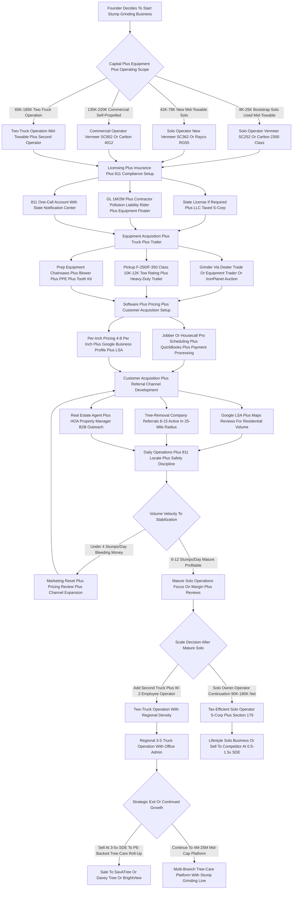

### Direct Answer

**Start a stump grinding business in 2027 by buying a used mid-towable grinder like a **Vermeer (NASDAQ-adjacent private; Vermeer Corporation)** SC252 or a **Carlton (a Bandit Industries brand)** 2300 for $12K-$28K, registering an LLC taxed as an S-corp, stacking the correct insurance — general liability plus a contractor pollution liability rider plus an equipment floater — and routing your work through Google Local Services Ads plus a referral network of 8-15 local tree-removal companies.** The single discipline that separates operators who survive years 2-5 from those who blow up is **811 "call before you dig" compliance**: every job, 2-3 business days ahead, no exceptions, because one nicked gas main or severed fiber-optic line triggers a $5K-$50K bill plus liability plus an insurance-rate spike. A bootstrap solo operator can enter the market for **$8K-$25K** in 60-90 days; a mature solo grinder clearing 6-12 stumps per day nets **$90K-$180K annually at 50-65% net margin**, and a two-truck operation runs **$250K-$500K in revenue at 35-45% margin**. Stump grinding is a low-licensure, equipment-heavy, weather-exposed, hyper-local trade — the work comes from within a 25-40 mile radius and the economics reward referral density, tooth-replacement discipline, and per-inch pricing held without discounting.

### TLDR

- **Capital floor is $8K-$25K** for a bootstrap solo operator on used equipment (used SC252-class grinder, pickup if not already owned, used trailer, prep kit, insurance, working capital); **$42K-$78K** for a new mid-towable; **$135K-$220K** for a self-propelled commercial machine
- **Revenue is referral-led, not ad-led at maturity** — the best operators build 8-15 active tree-removal-company referral relationships that produce 25-40% of weekly revenue at predictable margin; Google Local Services Ads carry the early ramp
- **The four legal gates are**: state contractor license where required (CA Class D-49/C-27, WA L&I, OR CCB, AZ ROC), an LLC-taxed-S-corp entity, the insurance stack, and an 811 one-call account with your state notification center
- **811 underground-utility-locate compliance is the non-negotiable** — 2-business-day advance notice, photograph the locate marks, keep a written confirmation file; the Common Ground Alliance logged ~200,000 underground damages in 2023
- **Pricing is per-inch of diameter** — $4-$8 per inch measured at ground level, $100-$200 trip minimum; commercial/HOA work runs $200-$450/hour with 2-4 hour minimums
- **Teeth are the operating cost that ambushes new operators** — Greenteeth carbide teeth (Leonardi Manufacturing) wear in 8-40 hours and cost $400-$800/month at solo volume
- **The 2027 tailwind is aging suburban tree stock plus storm-cleanup demand** in a $1.7B-$3.3B addressable market; the headwind is suburban price competition compressing margin on small stumps under 12 inches
- **Exit multiples are thin at solo scale** — 0.5-1.5x SDE for single operators (often just an equipment-and-customer-list sale to a competitor), climbing to 3-5x SDE only at mid-cap multi-truck scale

## 1. The 2027 Market Context

### 1.1 What a stump grinding business actually is in 2027

A stump grinding business in 2027 is a **specialized outdoor-services operating company** that removes residual tree stumps after tree removal — using dedicated grinding machines with carbide-tipped cutting wheels to chip a stump down to 6-12 inches below grade so grass or landscape can grow over it. The category sits **adjacent to** tree removal: most stump grinders also do tree work, or they sub-contract grinding for tree-removal companies that do not want to own grinders. But it operates as a **distinct service line** with its own equipment, pricing model, insurance requirements, and customer-acquisition channels. Revenue comes primarily from **residential per-stump or per-inch pricing** — the dominant 70-85% of typical operator revenue — with commercial, HOA, municipal, and builder work filling the remaining slice at hourly or contract rates.

The honest 2027 reality: there is **no centralized federal license** for stump grinding the way there is for electrical or plumbing trades. Most states do not require an arborist license to operate a grinder. The barrier to entry is genuinely low — $8K-$25K of used equipment puts a solo operator into the market in 60-90 days. That low barrier is also the structural problem. Competitive pricing pressure in suburban metros keeps margins compressed on small stumps, the labor-light/equipment-heavy model exposes the operator personally to weather and breakdown risk, and the single biggest blowup risk sits underground: nicked gas mains, severed fiber-optic cables, cut water service lines, damaged irrigation.

### 1.2 Market size, growth rate, and fragmentation

Stump grinding occupies a narrow specialty band of the broader **tree-care services sector**. US tree-care industry revenue is estimated at **$28B-$33B in 2024** per the **Tree Care Industry Association (TCIA)** and IBISWorld's Tree Trimming Services market report, growing roughly 4-6% annually. Demand drivers: aging tree stock in mature suburban metros, post-storm cleanup, insurance-driven removal of hazardous trees, and ongoing utility-line clearance work.

Stump grinding as a service line represents roughly **6-10% of total tree-care spend** — a **$1.7B-$3.3B addressable market** in the US. It is hyper-fragmented across an estimated 35,000-55,000 active tree-care companies, of which perhaps **8,000-12,000 actively operate dedicated stump grinders** as a meaningful revenue line. The category is deeply local: virtually all work comes from within a **25-40 mile drive radius**, because the cost of trailering equipment longer distances kills the margin on a $150 stump.

| Metric | 2019 | 2023 | 2026 | 2027E |
|---|---|---|---|---|
| US tree-care industry revenue | $24B | $28B | $32B | $33.5B |
| Stump grinding addressable slice (6-10%) | $1.4B-$2.4B | $1.7B-$2.8B | $1.9B-$3.2B | $2.0B-$3.4B |
| Active dedicated stump-grinding operators | ~7,500 | ~9,000 | ~10,500 | ~11,200 |
| Avg residential stump price (per inch) | $3-$6 | $3.50-$7 | $4-$8 | $4.50-$8.50 |
| Underground utility damages (all trades) | ~190,000 | ~200,000 | ~205,000 | ~210,000 |

Source: TCIA member counts, IBISWorld Tree Trimming Services report, Common Ground Alliance DIRT Report, author triangulation.

### 1.3 The four operator archetypes you will compete against

- **The legacy solo operator** — a 50-65 year-old founder running a single mid-towable grinder, no succession plan, deprioritizing growth. He is your most common competitor and, eventually, an acquisition target. Strengths: established customer list, low overhead. Weaknesses: aging equipment, no marketing engine, no event-sales muscle
- **The tree-removal company that owns a grinder** — does removal and grinding as a bundle. Strengths: captures the whole job. Weaknesses: grinding is a secondary line they often execute slowly
- **The full-service tree-care firm** — regional brands like **Davey Tree Expert Company** (employee-owned, ~$1.6B 2023 revenue) and **BrightView Holdings (NYSE: BV)** that do grinding as one line in a broad portfolio. Strengths: brand, insurance scale. Weaknesses: priced for overhead, slow on small residential jobs
- **The new specialist** — your target archetype. Wrap-and-go, disciplined on 811 and pricing, builds tree-removal referral density, responds to Google LSA leads in under 5 minutes. The best of them clear $150K+ owner net solo

### 1.4 Why 2027 is a structurally favorable entry window

Three forces make 2027 a better entry window than the mid-2010s. **First, the suburban tree-stock age curve.** The post-war and 1970s-80s suburban housing waves planted enormous numbers of fast-growing shade trees — silver maples, ash, sweetgum, Bradford pears — that are now reaching the end of their safe service lives simultaneously. The 2010s emerald ash borer infestation accelerated ash removals across the Midwest and Northeast, and every removed tree leaves a stump. The grinding demand that follows tree removal is, in effect, a multi-year lagging echo of decades of removal activity. **Second, the operator-age gap.** A large share of the existing 8,000-12,000 dedicated stump grinders are solo founders in their late 50s and 60s with no succession plan; as they slow down or retire, local market share is left genuinely unclaimed for a disciplined newcomer who shows up with a clean truck and answers the phone. **Third, the digitization of demand.** Google Local Services Ads, Google Business Profile reviews, and NextDoor have made it possible for a brand-new operator to capture high-intent residential demand within weeks of launch — there is no longer a multi-year wait to build word-of-mouth before the phone rings.

The honest counterweight: that same low barrier means the favorable demand environment is partly competed away by new entrants. The window is real, but it rewards the operator who executes the unglamorous disciplines — 811 on every job, tooth-replacement budgeting, per-inch pricing held without discounting, referral-relationship density — not the operator who simply buys a grinder and hopes.

## 2. The Capital Stack

### 2.1 The realistic startup budget

Anyone telling you that you can start a stump grinding business for $3K is selling you a worn-out DOSKO handheld and no insurance. The honest entry number for a bootstrap solo operator with a used mid-towable grinder is **$8K-$25K incremental capital** — and the wide range is almost entirely the pickup question. Many operators already own a 3/4-ton truck, which collapses the entry to $8K-$15K; operators buying the truck add $15K-$25K.

| Line Item | Bootstrap (used) | New mid-towable | Self-propelled commercial | Notes |
|---|---|---|---|---|
| Grinder | $3K-$12K used SC252-class | $28K-$42K new SC362-class | $82K-$135K new SC852-class | The single largest capital decision |
| Pickup (F-250/F-350 / Ram 2500-3500 class) | $0-$25K (often owned) | $35K-$55K | $55K-$85K service body | 10K-12K lb tow rating minimum |
| Equipment trailer | $2K-$4K used | $5K-$7K new | $7K-$10K heavy-duty | PJ / Big Tex / Sure-Trac / Diamond C |
| Prep equipment | $2K-$4K | $4K-$6K | $5K-$8K | Chainsaws, blower, PPE, tooth kit |
| Insurance + license + bond | $2K-$4K | $3K-$5K | $8K-$15K | GL + CPL + floater + commercial auto |
| Working capital | $3K-$5K | $5K-$8K | $15K-$25K | Buffer for slow weeks and breakdowns |
| **TOTAL all-in Year 1** | **$8K-$25K** | **$42K-$78K** | **$135K-$220K** | Bootstrap range assumes pickup owned |

A two-truck operation lands at **$65K-$185K** — two used mid-towable grinders, two pickups, two trailers, prep, insurance, working capital, plus a modest payroll buffer for the second operator. The mid-towable solo path is the sweet spot for most launches: enough capacity for 95% of residential work, manageable trailering, financeable at 5-7 year terms.

### 2.2 Equipment financing options

The equipment-finance landscape for stump grinding is well developed because every major manufacturer maintains a captive or partnered financing arm.

| Financing path | Realistic terms | Best for |
|---|---|---|
| Vermeer Financial Services | 5-7 yr term, 10-20% down, dealer soft-dollar promos | New/used Vermeer grinders |
| Carlton Equipment Financing | Captive financing on Carlton grinders/chippers | New/used Carlton grinders |
| Direct Capital (Marlin Capital Solutions / Webster Bank) | $5K-$1M, 24-72 mo, app-only to ~$250K | Independent operators, fast approval |
| Crest Capital | $5K-$5M, 24-84 mo, online application | Small-business equipment buyers |
| Beacon Funding | Landscape/tree-care specialist lender | Credit-challenged operators |
| Community bank / credit union loan | 20-25% down, 2 yrs tax returns, personal guarantee | Established operators, best rate |
| SBA 7(a) loan | Prime + 2.75-4.75%, 10-yr equipment term | Packages over $50K, lowest rate, 60-120 day underwriting |

Debt service on a $90K self-propelled machine runs **$1,400-$1,800/month** on a 5-year note at 8-10% APR — which is why the SC852-class machine only justifies itself on a $200K+ annual revenue trajectory. The disciplined bootstrap operator avoids debt entirely by buying a used mid-towable outright with cash or a short installment from a private seller.

### 2.3 The used-market sourcing decision

Used-equipment sourcing channels, ranked by what disciplined operators actually use:

- **Local Vermeer / Carlton / Morbark dealer trade-in inventory** — first call on quality trades, plus a 30-90 day mechanical warranty that private sales never include
- **Equipment Trader and MachineryTrader** — the dominant US online marketplaces for used construction and tree-care equipment, strong in mid-towable and self-propelled units
- **IronPlanet and Ritchie Bros. Auctioneers** — heavy-equipment auctions, occasional strong value on fleet-divested or repossessed machines
- **Estate / business-closure sales** — retiring operators sell the entire kit (grinder, trailer, prep, customer list, truck) at a discount to component-by-component sale; TCIA chapter and dealer relationships surface these
- **Craigslist and Facebook Marketplace** — viable for solo-scale grinders ($5K-$25K) but no warranty, no recourse, more inspection risk

The disciplined used buyer inspects the **cutting wheel and pocket condition** (worn pockets cost $1.5K-$3K for a full set), the **hydraulic system** (pump rebuild $2K-$5K), **engine compression and operating temperature** (rebuild $3K-$8K), the **chassis frame for cracks** (catastrophic — walk away), **boom cylinder seals** ($400-$900 per cylinder), and the **service log** (a well-documented log is worth 10-20% of purchase price as a confidence premium).

## 3. Legal, Permits & Compliance

### 3.1 The licensing landscape state by state

Stump grinding sits in an unusual regulatory position — **most states do not require a specific stump-grinding or tree-care license** — but every state imposes a mandatory 811 underground-utility-locate framework.

| State | Licensing requirement |
|---|---|
| California | CSLB Class C-27 Landscaping or Class D-49 Tree Service for any job over $500; 4 yrs documented experience, law + trade exam, $15K bond, $1M GL minimum |
| Washington | Department of Labor and Industries (L&I) contractor registration; $12K performance bond, $200K GL minimum |
| Oregon | Construction Contractors Board (CCB) license for jobs over $1,000 |
| Arizona | Registrar of Contractors (ROC) license over $1,000; C-21 Landscaping classification |
| Florida | No statewide license; county-level Business Tax Receipt; Miami-Dade/Broward require tree-removal contractor registration |
| Texas | No statewide license; Houston, Dallas, Austin, San Antonio each run their own contractor permit framework |
| New York | No statewide license; NYC DCWP Home Improvement Contractor license for 1-3 family dwelling work over $200 |
| Illinois | No statewide license; Chicago Department of Buildings GC license for commercial; suburban municipal registration |

States including **Massachusetts, Connecticut, New Jersey, Pennsylvania, Ohio, Georgia, Tennessee, North Carolina, and Virginia** require primarily local municipal contractor registration with general liability insurance proof — no statewide arborist or tree-care license. The pattern for new operators starting out elsewhere (see also the equipment-licensing logic in the garage door repair guide at (q2138) and the window tinting trade at (q2140)): check the state contractor board first, then every municipality in your 25-40 mile service radius.

### 3.2 811 compliance — the single most consequential requirement

Federal law under the **Pipeline and Hazardous Materials Safety Administration (PHMSA)** plus state common ground alliance rules require **anyone digging or grinding more than 12 inches below ground surface** to provide **2-business-day advance notice to the state 811 one-call center** before commencing work.

The 811 system is operated by state-level one-call notification centers — **DigAlert** in Southern California, **USA North** in Northern California, **Sunshine 811** in Florida, **Texas811**, **Miss Utility** / **Miss Dig** depending on the state. The center routes the notification to all member underground utility operators (gas, electric, telecom, water, sewer, fiber). Operators then have the 2-business-day window to mark their facilities on-site using the **APWA (American Public Works Association) uniform color code**:

| Color | Marks |
|---|---|
| Red | Electric power lines, cables, conduit |
| Yellow | Gas, oil, steam, petroleum |
| Orange | Communication, alarm, signal lines, fiber-optic |
| Blue | Potable water |
| Green | Sewers, drain lines |
| Purple | Reclaimed water, irrigation, slurry lines |
| White | Proposed excavation |
| Pink | Temporary survey markings |

Failure to call 811 before grinding into a marked utility is a **statutory violation in most states with civil penalties of $1K-$10K per occurrence, plus full repair cost liability, plus criminal exposure in severe cases**. The Common Ground Alliance's 2024 DIRT (Damage Information Reporting Tool) Report logged **~200,000 underground utility damages in 2023** across all trades, with landscape and tree-care work meaningfully represented.

The disciplined operator calls 811 on every job 2-3 business days ahead, walks the marked locations with the homeowner before starting, **photographs the marked locate paint** as a visual record, and maintains a written locate-confirmation file for every job — because insurance carriers and courts will demand that documentation in any utility-strike claim.

The locate process has a critical blind spot that catches operators off guard: **811 only marks public utility-company facilities up to the meter or the property line.** Privately-installed lines on the customer's side are NOT marked — and that includes irrigation systems, low-voltage landscape lighting, invisible-dog-fence wire, swimming-pool plumbing and electrical, septic lines, propane lines from a yard tank, and any service line a previous owner ran themselves. These are exactly the lines a stump near a home, a fence, or a flower bed is most likely to sit on top of. The disciplined operator treats the homeowner walk-through as a second locate: asking explicitly what private utilities exist and where, probing the soil with a rod where there is doubt, and refusing to grind blind. A struck irrigation main is a cheap lesson; a struck pool electrical line or propane line is not.

### 3.3 OSHA and safety compliance

Stump grinding work falls under **OSHA 29 CFR 1910.266 Logging Operations** and **OSHA 29 CFR 1926 Subpart V** where utility-adjacent work occurs, plus the **ANSI Z133 American National Standard for Arboricultural Operations Safety Requirements** maintained by ISA and TCIA. Required PPE: ANSI Z87.1 safety glasses with side shields, chainsaw chaps when running saws for prep, an ANSI/ISEA 107 high-visibility vest, steel-toed boots, hearing protection (grinder noise exceeds 100 dB), and a hard hat where falling-debris risk exists. **Eye injuries from flying wood chips** are the most common stump-grinder injury per OSHA logging-operations injury data.

### 3.4 Entity structure and the misclassification trap

The standard entity is a single-member **LLC taxed as an S-corp** (filed via IRS Form 2553 after LLC formation). It provides liability separation from personal assets and allows a reasonable-salary-plus-distribution split that minimizes self-employment tax once revenue exceeds roughly $50K. Most operators run from a home address with the truck and trailer parked in a driveway or a rented storage yard — commercial real estate is unnecessary at solo or two-truck scale. Be clear-eyed about the **personal guarantee reality**: virtually every equipment loan, commercial auto policy, and license bond requires a personal guarantee from the founder; the LLC does not insulate you from those.

The **IRS and state labor departments are consistent** that stump grinding crew members must be **W-2 employees**, not 1099 contractors — because the employer controls schedule, equipment, training, methods, and customer relationships. Misclassification audits in trade services produce back-tax assessments, unpaid workers-comp premium audits, and state unemployment back-payment that can exceed $50K for a single misclassified employee over a 3-year audit window. Acceptable 1099 status is limited to genuinely independent specialty services — an occasional crane operator, a separate licensed arborist for a tree-removal partnership, a separate trucking contractor for chip haul-away.

## 4. The Insurance Stack

### 4.1 The seven coverages every operator needs

The single piece most new operators underspec is **contractor pollution liability / utility-strike coverage**. Standard general liability policies specifically exclude pollution events and utility-strike damages — so without the CPL rider, a single nicked gas line produces $25K-$100K in uncovered repair, re-route, regulatory penalty, and business-interruption claims passed straight to the operator.

| Coverage | Solo grinder (annual) | 2-truck, 1 W-2 employee | Commercial, 2 W-2 employees |
|---|---|---|---|
| General Liability $1M/$2M | $1,200-$3,200 | $2,500-$5,500 | $3,500-$7,500 |
| Contractor Pollution Liability $1M rider | $300-$700 | $500-$1,200 | $800-$1,800 |
| Equipment Floater / Inland Marine | $800-$2,800 | $1,500-$4,500 | $2,500-$6,500 |
| Commercial Auto | $1,800-$4,200 | $3,500-$7,500 | $4,500-$9,500 |
| Workers Comp (NCCI 0106 Tree Care) | $0 (solo exempt) | $4K-$12K | $8K-$20K |
| Umbrella Liability $1M-$5M | $400-$1,500 | $800-$2,500 | $1,500-$4,500 |
| Surety / License Bond (if required) | $200-$750 | $200-$750 | $300-$1,250 |
| **TOTAL annual insurance load** | **$3,800-$11,500** | **$12K-$28K** | **$22K-$45K** |

### 4.2 Why the equipment floater is non-negotiable

The equipment floater (inland marine coverage) covers theft, fire, weather damage, transit damage, and mechanical breakdown to scheduled equipment. This matters because **the grinder is NOT covered under standard commercial auto policies** — commercial auto covers the trailer but not the equipment riding on it. Replacement values are real money: a **Vermeer SC852 is $80K+**, a **Vermeer SC992 is $135K+**, a **Carlton 4012 is $65K+**, a **Rayco RG70 is $52K+**. Any operator with a grinder valued over $10K who skips the floater is one storm or one theft away from a business-ending uncovered loss.

Workers comp for tree-care work is classified under **NCCI 0106 Tree Pruning, Repairing, or Trimming** — the high-rate class — at $8-$25 per $100 of payroll, meaningfully higher than landscape gardening because of the elevated injury rate in arborist work. Solo operators with no W-2 employees are exempt in most states (Washington and Wyoming are notable exceptions requiring self-coverage), but the moment a second W-2 employee is hired, workers comp becomes mandatory. Insurance specialists serving the tree-care space include **TreePro Insurance, ArborMAX (a division of MFE Insurance), Hortica Insurance & Employee Benefits, EMC Insurance Companies, Erie Insurance, and AmTrust Financial Services**.

## 5. Equipment Selection

### 5.1 The four grinder categories

Equipment selection is the single most consequential capital decision because it determines job-acceptance range, daily throughput, cost-recovery timeline, and operating margin.

| Category | Representative machines | New price | Stump capacity | Daily throughput | Best for |
|---|---|---|---|---|---|
| Small towable / walk-behind | Vermeer SC30TX, Bandit SG-40, DOSKO 200-13H, Carlton SP2000, Rayco RG13 II | $4.5K-$28K | Up to 18-24 in | 6-10 stumps (12-18 in) | Dense suburban, narrow-gate backyard access |
| Mid-size towable | Vermeer SC252, Vermeer SC362, Rayco RG37, Rayco RG55, Carlton 2300-4, Carlton SP4012, Morbark Boxer 322D | $24K-$52K | Up to 30-36 in | 8-14 stumps (14-22 in) | The sweet spot for most active solo operators |
| Large self-propelled | Vermeer SC852, Vermeer SC992, Rayco RG70, Carlton 4012, Carlton 7015, Morbark D52SP | $48K-$185K | 60+ in | 15-25 stumps | Serious commercial volume, HOA/municipal contracts |
| CTL attachment-based | Bobcat T595/T740/T770, Cat 299D3, Kubota SVL75-2 with FAE / Loftness / Diamond Mowers attachment | $73K-$127K all-in | Up to 36+ in | Variable | Operators doing broader site work alongside grinding |

The **mid-towable category is the sweet spot** for most active solo stump grinding operators — enough capacity for 95% of residential work, manageable trailering behind a 3/4-ton pickup, reasonable maintenance burden, and financeable at 5-7 year terms. The SC852-class self-propelled machine only justifies itself at a $200K+ annual revenue trajectory because of its debt-service burden.

### 5.2 Cutting wheels and teeth — the cost that ambushes new operators

Modern grinders use a circular cutting wheel carrying **20-60 individual carbide-tipped cutting teeth** that do the actual stump destruction. The dominant tooth systems:

- **Greenteeth by Leonardi Manufacturing** — the industry standard, available in 500/700/900 series sized to the grinder; a pocket-and-tooth system allowing fast field replacement. Teeth cost **$8-$14 each**, pockets $25-$45 each. Pockets last 1,000-2,000 hours; teeth wear in **8-40 hours of grinding** depending on dirt, sand, and rock content
- **Yellow Jacket by Sandvik** — a competing carbide system at a similar price point
- **Tegrosa** — a European system used by some Carlton and Morbark operators
- **Predator** — an aggressive-profile alternative

Tooth-replacement economics catch operators off guard. A solo operator at 8-12 stumps/day in average dirt burns **30-80 teeth per month** — **$240-$1,120/month** — plus pocket replacements every 6-12 months at $300-$700. Mature operators **budget tooth replacement at $400-$800/month** as routine and stock 30-60 spare teeth in the truck for mid-job replacement. The operator who runs worn teeth past their useful life stalls the grinder, overheats the hydraulic system, accelerates pocket wear, and loses 30-50% of daily production grinding through dull cutters. This is the same equipment-consumable discipline that separates winners in the knife sharpening trade at (q2142) — the consumable cost line is where undisciplined operators quietly bleed margin.

Soil type is the variable that determines tooth burn rate, and new operators consistently underestimate it. **Clay soil is gentlest** on teeth and pockets; teeth can last toward the 40-hour end of the range. **Sandy, coastal, and decomposed-granite soils are the most destructive** — abrasive grit accelerates carbide wear dramatically, and operators in Florida, the desert Southwest, and coastal markets burn teeth at the bottom of the 8-40 hour range. **Rocky soil is the worst case**: a single hidden rock or buried construction debris can chip or shatter multiple teeth in seconds, which is why prep — clearing visible debris and probing the surface — is not optional. The disciplined operator prices regional soil reality into the pricing structure: a market with abrasive soil simply costs more per stump to serve, and the operator who fails to price that in is subsidizing every job out of margin.

### 5.3 Maintenance discipline and the downtime problem

For a solo operator, the grinder is a single point of failure — when it is down, revenue is zero. There is no second machine, no backup operator, and the customer calendar does not pause. This is the structural fragility of the solo model, and disciplined maintenance is the only mitigation. The routine that protects uptime:

- **Daily** — inspect teeth and replace any worn beyond service spec; check hydraulic fluid level and look for leaks; check engine oil; grease the boom pivot and cutting-wheel bearing per the manufacturer's interval; clean debris from the cooling system
- **Weekly** — inspect the cutting wheel and pockets for wear and cracking; check belt tension; inspect track or wheel-and-tire condition; check trailer tires, lights, and electric brakes
- **By hour-meter interval** — change engine oil and filters, hydraulic fluid and filters, and air filters on the manufacturer's schedule; a Kohler or Kubota industrial engine that is run on a disciplined oil-change interval routinely reaches 3,000-5,000+ hours, while a neglected engine fails far sooner and a rebuild costs $3K-$8K

The disciplined operator also **builds a parts and service relationship with the local dealer before a breakdown happens** — knowing where the nearest hydraulic-hose shop is, keeping common field-replaceable parts (belts, hoses, filters, teeth, pocket bolts) in the truck, and having a realistic plan for what happens during a multi-day repair. Some operators carry a small walk-behind grinder as a genuine backup precisely so a mid-towable repair does not zero out the week. The undisciplined operator skips the grease points, runs the hydraulic system hot on worn teeth, lets debris cake the cooler, and discovers the cost of deferred maintenance as a catastrophic in-season failure at the worst possible time.

### 5.4 Truck, trailer, and prep equipment

The standard solo configuration: a **Ford F-250/F-350 Super Duty (Ford Motor Company, NYSE: F), Ram 2500/3500 (Stellantis, NYSE: STLA), or Chevrolet Silverado 2500HD/3500HD / GMC Sierra 2500HD (General Motors, NYSE: GM)** with a minimum **10,000-12,000 lb tow rating** — a Vermeer SC362 on a 14-ft equipment trailer with a chip box totals 6,500-8,500 lbs. Used 2018-2022 models run $28K-$58K; new 2025 models $58K-$95K. The equipment trailer (**PJ Trailers, Big Tex, Sure-Trac, Diamond C** — 12-16 ft tandem-axle, 10,000-14,000 lb GVWR) runs $4K-$8K new. Prep equipment — **Stihl** or **Husqvarna** chainsaws ($700-$1,800 each, carry two), a backpack leaf blower, push broom and rake, chip-containment tarps, fuel cans, a tooth-replacement kit, hydraulic fluid, and a full PPE kit — runs **$3K-$6K** for a new solo operator.

## 6. Customer Acquisition & Referral Channels

### 6.1 The channel mix at maturity

Stump grinding customer acquisition runs across distinct B2C residential, B2B referral, and direct-commercial channels. The mix typically settles at **40-55% residential direct, 25-40% tree-removal-company referral, 10-20% commercial/HOA/property management, and 5-10% real-estate-agent and pre-sale referral** for mature operators.

### 6.2 Google Local Services Ads — the strongest channel for new operator volume

Google Local Services Ads (LSA) place the operator's listing at the top of search results for queries like "stump grinding [city]" and "stump removal near me" — with Google's verified-pro green checkmark, customer reviews, and a pay-per-lead pricing model at **$15-$60 per qualified lead** depending on metro. Setup requires Google business verification, license and insurance proof, an owner background check, and Google's pre-screening — typically 2-4 weeks to live activation. **Conversion on LSA leads runs 25-40%** for stump grinding because the leads are high-intent; cost per acquired customer typically lands at **$40-$150**. It is critical to **respond to LSA leads within 5 minutes** — LSA ranking is influenced by response speed, and missed-response decay is sharp. The same lead-velocity discipline drives the window cleaning trade at (q2107) and mobile RV repair at (q2145).

### 6.3 Tree-removal company referral relationships — the predictable-revenue engine

Established tree-removal companies that **do not own grinders** routinely sub-contract stump grinding to specialists, because grinding is a meaningfully different equipment and skill set than tree removal. The sub-contractor model: the tree-removal company charges the customer $150-$350 for grinding as part of the removal job, sub-contracts to the grinder at **$50-$150 per stump**, and pockets the spread. This is predictable, repeat, low-customer-acquisition-cost work that disciplined operators build into **25-40% of weekly revenue**. The disciplined operator identifies the 8-15 active tree-removal companies in a 25-mile radius, makes an in-person introduction at each, offers competitive sub-pricing, demonstrates 24-48 hour turnaround, and stays in regular text contact so the tree company can confidently quote grinding on the same call as the removal.

### 6.4 The remaining channels

- **Google Business Profile + Google Maps organic** — free; review-acquisition discipline (a follow-up text with the direct review link to every satisfied customer) is the single highest-ROI marketing activity, because review volume and average rating drive organic Maps placement
- **Real estate agents, home inspectors, HOA property managers** — agents flag stump removal as a pre-listing curb-appeal improvement; inspectors flag dangerous stumps; HOA managers (FirstService Residential, Associa, RealManage) manage removal across hundreds of properties. A one-page service-capability sheet circulated to local agents and managers produces high-margin repeat work
- **Angi (formerly Angie's List / HomeAdvisor)** — pay-per-lead at $20-$70 each, but most operators rate it the lowest-quality channel because of dual-sourced leads sold to 3-5 contractors and price-shopping behavior. Use cautiously
- **NextDoor** — the neighborhood social network; organic recommendations from satisfied neighbors drive meaningful word-of-mouth at zero cost
- **Direct mail and door-knock campaigns** — door-knocking immediately after a major storm in a hard-hit neighborhood is one of the highest-ROI activities a grinder can do, because storm damage creates immediate demand and price elasticity drops during emergency cleanup
- **Truck-and-trailer branding** — a vinyl wrap turns the operator's vehicle into a 365-day-per-year billboard at $1,500-$4,500 for a full pickup wrap
- **Branded yard signs** — placed at completed jobs with customer permission, these drive neighbor-noticed referrals at near-zero marginal cost
- **Referral incentive program** — a $25-$75 service credit to any customer who refers a paying job converts satisfied customers into a low-cost acquisition channel

### 6.5 Marketing budget and competitive positioning

A mature solo stump grinder typically allocates **8-15% of revenue to marketing** — $10K-$40K annually at $120K-$280K revenue scale — and a two-truck operation runs 6-12% of revenue. The largest single line is usually Google Local Services Ads at $1,200-$4,500/month of typical solo-operator spend, supplemented by Google Search Ads, a website, and modest social spend. The discipline that matters more than the budget size is **attribution tracking**: knowing which channel produced which job, so spend can be reallocated away from the dead channels (often Angi) toward the live ones (usually LSA, Google Business Profile reviews, and tree-removal referral).

Most stump grinding markets are dominated by price-competitive solo operators with little brand differentiation, which is precisely the opening. The disciplined operator differentiates on **responsiveness** (5-minute LSA response, 24-48 hour quote turnaround, scheduled jobs within 5-10 business days against a competitor norm of 2-4 weeks), **professional presentation** (clean branded truck, written quotes, clear invoicing, follow-up communication), **review density** (200+ Google reviews at a 4.8+ average), **insurance and licensing proof** ready to share with any customer who asks, and **transparently priced extras** like surface-root removal and chip cleanup. Premium positioning built on those elements supports **10-25% higher per-job pricing** in most markets against the low-bidder competitor set — and it is the only sustainable answer to suburban price competition, because competing purely on price in a low-barrier trade is a race to a margin that does not cover equipment depreciation.

## 7. Pricing Models & Per-Stump Economics

### 7.1 The three dominant pricing models

| Model | Structure | Typical range | Best for |
|---|---|---|---|
| Per-inch of diameter | $4-$8 per inch measured at widest point at ground level, $100-$200 trip minimum | 16-in stump = $64-$128 base (bumped to $150 min); 24-in = $96-$192; 36-in = $144-$288 | Residential — the industry standard |
| Per-stump fixed | Flat dollar per stump regardless of exact diameter | $75-$150 small; $150-$250 medium; $250-$450 large; $450-$1,200+ very large | Sub-contracting and bulk-job pricing |
| Hourly | $200-$450/hour with 2-4 hour minimums | Self-propelled operators command $350-$450/hour | Commercial, HOA, municipal, contractor work |

Multi-stump discounts are commonly applied — **$4-$5/inch for stumps 2-5** on the same property, **$3-$4/inch for stumps 6+** — because the marginal-stump cost is meaningfully lower than the first stump once truck, setup, and locate cost are amortized.

### 7.2 Ancillary pricing decisions

- **Chip removal / haul-away** — a 24-inch stump produces roughly 6-12 cubic feet of chip-and-dirt mixture. Most residential customers leave chips in place to fill the hole at no charge; those wanting chips removed pay **$50-$200 extra** depending on volume and dump location
- **Backfill with topsoil** — $75-$200 extra for clean soil, delivery, and tamping
- **Grass seed or sod installation** — $50-$300 depending on area
- **Surface root removal** — grinding lateral roots within 3-6 ft of the stump runs $25-$75 per root
- **After-hours / weekend / emergency pricing** — typically 1.5x base, 1.5-2x for genuine same-day storm response

### 7.3 Daily revenue benchmarks

- **Solo operator, mid-towable grinder, mature operations, peak season** — 6-12 stumps/day at $100-$220 each = **$600-$2,640/day gross**; net 50-65% after fuel, teeth, and insurance/depreciation allocation
- **Solo operator, self-propelled grinder, commercial-heavy book** — 3-6 billable hours at $250-$450/hour = **$750-$2,700/day gross**; net 45-60% after equipment cost recovery
- **2-truck operation** — combined **$1,800-$4,500/day gross** at peak; net 35-45% after employee payroll, benefits, and workers comp

The disciplined operator establishes a clear written pricing structure, sticks to it without discounting under pressure, builds an 18-25% gross margin minimum on every job, and tracks per-job profitability. The undisciplined operator who undercuts to win every lead runs equipment at depreciation-undermargin rates and breaks even or worse over a full season once maintenance and tooth replacement are counted.

## 8. Daily Field Operations & Safety Discipline

### 8.1 The pre-job and on-site routine

**The night before**: call 811 with 2-3 business days advance notice for the next day's jobs; verify locate marks completed; confirm equipment fueled, fluids topped, teeth inspected; confirm the customer arrival window communicated.

**On-site arrival**: walk the work zone with the homeowner to verify scope and pricing; **confirm all utility-locate marks are visually present** — red, yellow, orange, blue, green, purple, pink; **photograph the marked locations** from multiple angles; identify any **un-marked private utilities** the homeowner mentions (privately-installed irrigation, low-voltage landscape lighting, dog fence, pool plumbing, septic, propane) — these are NOT covered by 811 and require visual or probe-rod identification; verify clear escape paths, a 50-ft minimum bystander setback, and work-zone tarps positioned for chip-ejection containment near windows, vehicles, decks, and pools; don PPE.

### 8.2 Grinding execution and closeout

**Stump prep**: chainsaw the stump down to 6-12 inches above grade; clear surface debris and embedded foreign objects (rocks, fence pieces, old metal, nails, concrete) — these destroy teeth catastrophically and eject as projectiles.

**Grinding**: position the grinder, lower the cutting wheel to engaged depth, grind in measured passes to a 6-12 inch depth below grade so future grass can root above; **monitor tooth wear and hydraulic temperature**, pulling off the stump for inspection every 10-15 minutes on hard, rocky, or sandy material; **re-check utility-locate proximity continuously** — never grind directly through a marked utility line, and if the stump is closer than 18 inches to a marked line, hand-dig that section or refuse the job.

**Closeout**: lift the cutting wheel clear, push chips back into the hole for a level finish or scoop them for haul-away per agreement, rake and blow the area clean, walk the finished work with the homeowner, collect payment, and **request a Google review via text with the direct review link** as the final on-site action.

### 8.3 The operating journey from first grinder to regional platform

### 8.4 Safety incident response

- **Utility strike** — immediately shut down equipment, evacuate the area to 100+ ft, call 911 plus the utility operator's emergency dispatch (the number on the locate ticket) plus the customer; do NOT attempt repair; document with photos; notify the insurance carrier within 24 hours
- **Personal injury** — first aid, 911 if serious, document the scene, notify the carrier
- **Property damage** (deck, vehicle, irrigation, fence) — stop work, photograph the damage, notify the customer, document for the claim
- **Equipment breakdown** — secure the equipment, mark hazards, contact the dealer or repair service; do NOT attempt repairs beyond field-replaceable parts

### 8.5 The seasonal operating calendar

Stump grinding revenue is concentrated into an active season — roughly **April through November** in most US climates, with the shoulders varying by latitude. The disciplined operator runs the year as four distinct phases rather than treating December as simply a dead month.

| Phase | Months (typical) | Focus |
|---|---|---|
| Pre-season ramp | February-March | Equipment service, insurance renewal, marketing spin-up, booking the backlog of winter-deferred jobs |
| Peak season | April-July | Maximum throughput, 6-12 stumps/day, the bulk of annual revenue |
| Sustained season | August-October | Steady volume, referral-relationship maintenance, post-storm response work |
| Off-season | November-January | Major equipment maintenance, accounting and taxes, next-year planning, frozen-ground markets idle |

The peak-season months carry the year — an operator who launches in July has already missed the spring booking cycle and the heaviest demand window, which is why **a launch decision is really a calendar decision**: commit to being operational and marketed by March, or wait for the following spring rather than burning the first season on a half-ramp. Northern operators (Minneapolis, Boston, much of the upper Midwest and Northeast) get a genuinely shorter window — frozen ground physically prevents grinding to depth — and many of them run stump grinding as a seasonal line alongside snow removal or another winter trade. Southern and Southwestern operators (Florida, Texas, Arizona, the Gulf Coast) run a meaningfully longer season, sometimes 10-11 months, which materially improves the annual revenue and payback math on equipment. **Storm response is the seasonal wildcard** — a major wind, ice, or hurricane event creates a sharp spike in tree removal and a lagging spike in grinding demand, and the operator with capacity and a door-knock plan captures premium-priced work during those windows.

## 9. Software Stack & Route Operations

### 9.1 The field-service software bill of materials

| Platform | Monthly cost | Best fit |
|---|---|---|
| Jobber | $50-$249 | Solo + 2-truck stump grinders — strong fit |
| Housecall Pro | $69-$249 | Direct Jobber competitor, strong technician mobile app |
| Service Autopilot | $159-$499 | Multi-truck operations with recurring HOA/commercial contracts |
| ServiceTitan | $398+/user | Overkill for solo; fit for 10+ truck operations |
| Yardbook | $0-$99 | Lightweight option for solo operators starting out |
| Markate | $39-$129 | Service-business CRM with quoting/scheduling/invoicing |
| ResponsiBid | $59-$199 | Photo-based estimating, popular complement to Jobber |
| ArboStar | Quote-based | Tree-care-specific, arborist credential and ANSI Z133 tracking |

**Payment processing** runs through Stripe, Square (Block, Inc., NYSE: XYZ), Clover (Fiserv, NYSE: FI), or Authorize.net at standard 2.6-2.9% + $0.30 per transaction rates. **Accounting** is dominated by QuickBooks Online ($30-$200/month), which integrates directly with Jobber, Housecall Pro, and Service Autopilot. **Route optimization** is built into those platforms via Google Maps; standalone options (Route4Me, Circuit, OptimoRoute) suit operators with 8+ daily stops. Total Year 1 tech-stack cost for a solo operator is **$1,200-$3,200 annually**; for a 2-truck operation, $2,500-$5,500.

### 9.2 What the software actually has to do for a stump grinder

The mistake new operators make is treating field-service software as a digital invoice pad. It is not — at solo scale the platform is the operator's entire back office, and the four functions that genuinely move the P&L are these. **Quote speed**: a stump grinder who can text a written, photo-backed estimate within an hour of the inquiry wins meaningfully more residential work than the competitor who promises to "swing by next week" — ResponsiBid and Jobber both support photo-based estimating that lets an operator quote a per-inch price from a homeowner's phone photo without a site visit. **Automated review requests**: the single highest-ROI software feature is the post-job SMS that fires the direct Google review link the moment a job is marked complete; operators who automate this consistently outpace competitors on review volume, and review volume is the dominant input to organic Google Maps placement. **Recurring-job tracking**: HOA and property-management accounts produce repeat grinding work on a cycle, and the platform's recurring-service automation prevents those accounts from quietly going stale. **Job-cost capture**: the operator who logs hours, teeth used, fuel, and chip-disposal cost against each job — even roughly — is the operator who actually knows whether the small-stump segment is profitable, rather than guessing at season's end.

For a solo operator just starting, **Yardbook's free tier or Jobber's entry plan** is sufficient — do not over-buy software before there is a route to run. The upgrade trigger to Service Autopilot or a heavier platform is the arrival of recurring contract accounts and a second truck, where route optimization across 8-15 daily stops and crew dispatch start to matter. ServiceTitan is genuinely overkill below roughly 10 trucks; an operator paying $398/user/month at two-truck scale is burning margin on features they will not use.

### 9.3 The phone, the camera, and the documentation discipline

Beyond the core platform, two cheap habits protect the business. First, **the operator's phone camera is a compliance instrument** — every job folder should hold photographs of the 811 locate marks before grinding, the work zone before and after, and any pre-existing property damage noted on arrival. In a utility-strike or property-damage dispute, that photo record is the difference between an insurance claim that pays and one that does not. Second, **a simple cloud document store** (Google Drive or the platform's own file storage) holding the locate-confirmation tickets, signed estimates, and certificate-of-insurance PDFs lets the operator answer any customer, HOA, or carrier request in minutes. This documentation discipline costs nothing and is the same operating habit that protects mobile-service operators across adjacent trades — it is no accident that the disciplined operators in pest control at (q2139) and soft wash roof cleaning at (q2151) run the same photo-and-file routine.

## 10. Scaling From Solo To Multi-Truck

### 10.1 The scale milestones

| Stage | Annual revenue | Owner net | Equipment | Key challenge |
|---|---|---|---|---|
| Solo, Year 1-2 | $40K-$120K ramping | $35K-$65K | One mid-towable + pickup + trailer | Founder-energy-dependent; vacation = revenue gap |
| Mature solo, Year 2-4 | $120K-$280K | $90K-$180K at 50-65% margin | Mid-towable + walk-behind for backyard access | Building 8-15 referral relationships, review base |
| Two-truck, Year 3-5 | $250K-$500K | $100K-$200K at 35-45% margin | Second pickup + trailer + grinder kit | The single hardest scale step — employee retention |
| Regional 3-5 truck, Year 4-7 | $500K-$1.2M | $150K-$350K at 25-35% margin | 3-5 kits, possibly one self-propelled | Founder fully off-machine into operator role |
| Mid-cap, Year 6+ | $1.2M-$4M | $300K-$1M at 20-30% margin | 6-12 kits, broader tree-care expansion | This is the PE-acquirer profile |

The **two-truck transition is the single hardest scale step**: employee retention is harder than equipment management, administrative load expands faster than revenue, and the founder must let go of personally executing every job and trust an employee's quality and safety judgment. Pure stump grinding has a limited scaling ceiling, which is why mid-cap operators expand into broader tree-care service lines (removal, pruning, hazard removal, lot clearing).

### 10.2 The tax-efficient continuation path

Many solo and 2-truck operators choose **continuation over exit** — capturing $90K-$200K owner cash flow annually with strong tax efficiency via the S-corp salary-plus-distribution structure (minimizing self-employment tax), Section 179 depreciation on equipment purchases (full first-year expensing on qualifying equipment, up to a multi-hundred-thousand-dollar cap), the home-office deduction, vehicle deduction, retirement contribution (a Solo 401(k) allows substantial combined employee-plus-employer contributions), and HSA-qualified health insurance. The disciplined solo operator with $150K owner net captures effective after-tax cash of $115K-$130K — meaningfully better than equivalent W-2 employment at the same gross because of the deduction stack.

## 11. Exit & Valuation

### 11.1 What stump grinding operations actually sell for

Exit-multiple reality in stump grinding is more limited than glossier service-business categories — the **equipment-heavy, single-operator-skill-dependent, hyper-local nature compresses transferable enterprise value**.

| Operation scale | Revenue | Typical multiple | Typical sale price |
|---|---|---|---|
| Solo operator | $120K-$280K | 0.5-1.5x SDE (often equipment + customer list only) | $45K-$200K |
| Two-truck operation | $250K-$500K | 1.5-3x SDE | $120K-$450K |
| Mid-cap regional tree-care + grinding | $1.2M-$4M | 3-5x SDE plus equipment at appraised value | $1M-$8M |
| Regional / multi-state platform | $4M-$25M+ | 4-7x EBITDA | Platform-scale |

Most retiring solo operators do not achieve a true multi-turn exit — they sell equipment, customer list, and business name to a competitor at 0.5-1.5x SDE, sell to a former employee on installment terms, or wind down and sell equipment piece-by-piece via Equipment Trader for replacement value. The structural reason is **transferability**: a solo stump grinding business is, in practice, one skilled operator plus a relationship with a few hundred customers and a dozen tree-removal companies. When that operator leaves, the customer relationships and the on-machine skill leave with him, so a buyer is paying mostly for equipment plus a customer list of uncertain durability. That is why the realistic plan for most solo operators is **continuation, not exit** — running the business as a high-cash-flow lifestyle asset for as long as the body holds up, then a modest equipment-and-list sale at the end. Operators who genuinely want a multi-turn exit have to build past the solo and two-truck stages into a mid-cap operation with management depth, documented systems, recurring contracts, and a brand independent of the founder — and that path means hiring, broader tree-care service expansion, and accepting the harder operating life that comes with employees.

### 11.2 The buyer pool

Active PE and strategic acquirers in tree care and adjacent outdoor services include **Davey Tree Expert Company** (employee-owned, selective acquisitions), **BrightView Holdings (NYSE: BV)**, **SavATree** (PE-backed national platform), **Monster Tree Service** (franchise + acquisition hybrid, ~125 territories), **Bartlett Tree Experts** (privately held, 7th-generation, ~140 offices), and **Asplundh Tree Expert** (utility vegetation management). Exit valuation drivers: revenue scale (over $1M starts producing real multiples), revenue mix (recurring B2B/commercial premium over one-off residential), equipment condition, customer concentration (no single customer over 15-20% of revenue), employee retention depth, geographic density, profit margin (28%+ premium), safety record (no major OSHA citations, no utility-strike claim history), and credentials (TCIA-Accredited, ISA Certified Arborist on staff for broader tree work).

## 12. Counter-Case: When This Business Fails

### 12.1 The twelve highest-impact risk vectors

Stump grinding is a genuine, viable trade — but it is not a passive or low-risk one. The twelve risk vectors that most often end a stump grinding business:

1. **Underground utility strike exposure** — one nicked gas line or fiber cable triggers a $5K-$50K bill plus liability plus an insurance-rate spike; multiple claims can make the operator uninsurable
2. **Seasonal demand concentration** — most US climates yield an April-November active season, leaving 4-5 months of compressed revenue
3. **Equipment breakdown and downtime** — a hydraulic-pump or engine failure parks the operator's only revenue source for days or weeks
4. **Tooth-replacement operating cost creep** — $400-$800/month at solo volume, more in rocky or sandy soil, quietly eroding margin
5. **Diesel and tow-vehicle wear inflation** — heavy trailering accelerates pickup wear and fuel cost swings hit COGS directly
6. **Weather-dependent revenue volatility** — rain days, frozen ground, and storm interruptions create unpredictable revenue gaps
7. **Slim margin on small stumps under 12 inches** — trip-charge minimums barely cover truck, setup, and locate cost
8. **1099 vs W-2 misclassification audit exposure** — a single misclassified employee can produce a $50K+ back-tax and back-premium assessment
9. **Capex barrier for larger self-propelled grinders** — $1,400-$1,800/month debt service on an SC852-class machine demands $200K+ revenue to justify
10. **Competitive pricing pressure in suburban metros** — low barriers to entry flood markets with price-cutting solo operators
11. **Limited PE roll-up exit liquidity at solo/small-multi scale** — most operators never achieve a true business sale
12. **Founder-skill and customer-relationship transferability problem** — the asset is too operator-dependent to transfer cleanly

### 12.2 When you should not start this business

- **Your local market already has 5+ established operators** with mature referral books and you have no equipment, pricing, or service-speed edge
- **You cannot be physically present 200-260 days a year** in the launch seasons — this is not a passive business at solo scale
- **You live in a market with an under-22-week viable season** and you are unwilling to operate it as a side hustle alongside primary income
- **You are unwilling to run 811 on every job, every time** — operators who treat 811 as optional are one strike away from a business-ending claim
- **You have less than the realistic $8K-$25K of deployable capital** including a working-capital buffer for breakdowns and slow weeks

### 12.3 The contrarian take

The popular pitch for stump grinding is "low barrier, cash business, be your own boss." Half of that is right. The barrier IS low — and that is precisely the problem, because it floods suburban metros with price-cutting competitors and compresses the margin on the small-stump work that fills most of a residential calendar. The honest contrarian read: stump grinding is **not a great standalone scaling business** — pure grinding has a limited ceiling, and the equipment-dependence makes the asset hard to sell. But it IS an excellent **lifestyle business and an excellent service line within broader tree care**. The operator who treats it as a disciplined solo lifestyle business — $90K-$180K owner net, tax-efficient S-corp structure, tight 811 and tooth discipline, dense referral relationships — wins consistently. The operator who treats it as a venture to scale and flip usually discovers the exit math does not reward the effort.

## 13. Cross-Links & Sources

### 13.1 Related questions in this library

For operators evaluating adjacent equipment-based and outdoor home-service trades, see also the garage door repair business guide (q2138), the pest control business guide (q2139), the window tinting business guide (q2140), the knife sharpening business guide (q2142), the mobile RV repair business guide (q2145), the mobile ADAS windshield calibration guide (q2148), the soft wash roof cleaning guide (q2151), the window cleaning business guide (q2107), the courier delivery business guide (q1955), the catering business guide (q1980), the estate sale company guide (q2143), and the Christmas tree farm business guide (q2144). These guides share the core operating disciplines covered here — equipment selection, consumable-cost management, insurance stacking, Google Local Services Ads, and the per-job pricing logic that determines whether a hands-on service business survives years 2-5.

### 13.2 External sources (verified as of May 2026)

1. https://www.tcia.org — Tree Care Industry Association (ANSI Z133, accreditation, training)
2. https://www.isa-arbor.com — International Society of Arboriculture (Certified Arborist, TRAQ)
3. https://commongroundalliance.com — Common Ground Alliance and the 811 one-call system
4. https://www.apwa.net — APWA Uniform Color Code for underground utilities
5. https://www.osha.gov/laws-regs/regulations/standardnumber/1910/1910.266 — OSHA 29 CFR 1910.266 Logging Operations
6. https://www.osha.gov/laws-regs/regulations/standardnumber/1926/1926SubpartV — OSHA 29 CFR 1926 Subpart V
7. https://www.isa-arbor.com/Credentials/ANSI-Z133-Standards — ANSI Z133 Arboricultural Operations Safety
8. https://www.vermeer.com — Vermeer Corporation (SC30TX, SC252, SC362, SC852, SC992 grinders)
9. https://www.carltonsp.com — Carlton Stump Grinders (a Bandit Industries brand)
10. https://www.morbark.com — Morbark LLC (Boxer 322D, D52SP grinders)
11. https://www.raycomfg.com — Rayco Manufacturing (RG13 II, RG37, RG55, RG70 grinders)
12. https://www.banditchippers.com — Bandit Industries (SG-40 grinder, Carlton parent)
13. https://www.dosko.com — DOSKO Engineering (200-13H handheld grinder)
14. https://www.greenteeth.com — Greenteeth by Leonardi Manufacturing (carbide grinder teeth)
15. https://www.cslb.ca.gov — California Contractors State License Board (C-27, D-49)
16. https://lni.wa.gov/licensing-permits/contractors — Washington L&I contractor registration
17. https://www.oregon.gov/ccb — Oregon Construction Contractors Board
18. https://roc.az.gov — Arizona Registrar of Contractors
19. https://www.davey.com — Davey Tree Expert Company
20. https://www.brightview.com — BrightView Holdings (NYSE: BV)
21. https://www.savatree.com — SavATree
22. https://www.bartlett.com — Bartlett Tree Experts
23. https://www.monstertreeservice.com — Monster Tree Service
24. https://www.asplundh.com — Asplundh Tree Expert
25. https://www.vermeer.com/financing — Vermeer Financial Services
26. https://www.directcapital.com — Direct Capital equipment finance
27. https://www.crestcapital.com — Crest Capital equipment finance
28. https://www.beaconfunding.com — Beacon Funding equipment lender
29. https://www.equipmenttrader.com — Equipment Trader used-equipment marketplace
30. https://www.machinerytrader.com — MachineryTrader heavy-equipment listings
31. https://www.ironplanet.com — IronPlanet (Ritchie Bros. Auctioneers)
32. https://getjobber.com — Jobber field service software
33. https://www.housecallpro.com — Housecall Pro field service software
34. https://www.serviceautopilot.com — Service Autopilot field service platform
35. https://ads.google.com/local-services-ads — Google Local Services Ads
36. https://www.sba.gov/funding-programs/loans — SBA 7(a) loan program
37. https://www.irs.gov/forms-pubs/about-form-2553 — IRS Form 2553 (S-corp election)

### 13.3 Disclaimers

This is general business information, not legal, tax, or insurance advice. Licensing, 811 rules, OSHA applicability, insurance requirements, and tax treatment vary by jurisdiction — consult a local attorney, a CPA, and a licensed insurance broker before launching. Revenue, margin, and valuation figures are illustrative scenarios based on industry benchmarks, not guarantees of performance. Equipment prices and financing terms reflect late-2025 to early-2026 market conditions and will move. Verify all regulatory citations against the actual statute text in your jurisdiction, and confirm 811 notice-period rules with your state one-call center before any job.
