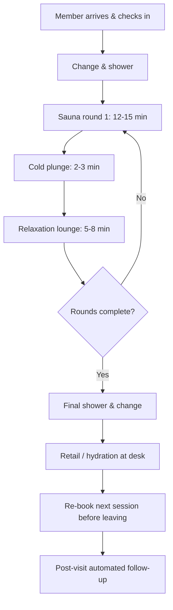

### Direct Answer

To start a sauna and cold plunge studio in 2027, you need roughly $180,000 to $520,000 in startup capital, a 1,200-2,800 sq ft retail or flex space, two to four commercial-grade sauna rooms paired with two to four cold plunge tanks, and a membership-first revenue model that targets $28,000-$55,000 in monthly recurring revenue by month 12. The business succeeds or fails on three numbers: cost per booked session (keep utility, water, and labor under $9), member churn (hold it below 6% monthly), and contrast-therapy throughput (sell the 60-minute hot-cold circuit, not the room). Treat it as a recovery-fitness studio with spa-grade hygiene, not a gym add-on.

> **TL;DR** — A sauna and cold plunge studio is a recovery-wellness retail business built on contrast therapy (hot sauna alternated with cold immersion). Plan on $180K-$520K to open, 9-16 months to cash-flow breakeven, and a 55-68% gross margin once memberships carry 65%+ of revenue. The competitive moat is not the equipment — anyone can buy a barrel sauna — it is booking density, water-and-heat operating discipline, and a community membership base that recurs. Win by engineering session throughput, sub-6% churn, and a recovery-stack partnership funnel with local gyms, run clubs, and physical therapists. The single most common failure mode is treating it as a passion project and ignoring the brutal per-session unit economics of heating rooms and chilling water.

This guide walks the entire path: market sizing, the four viable studio formats, real build-out costs, equipment selection, the membership economics that actually work, hiring, the RevOps and booking systems you must install before day one, marketing, legal and water-safety compliance, the 90-day launch runway, a five-year financial model, and a candid counter-case on when not to open one at all.

---

## 1. The 2027 Market: Why Contrast Therapy Went Mainstream

### 1.1 What you are actually selling

A sauna and cold plunge studio sells **contrast therapy** — the deliberate alternation of heat exposure (traditional Finnish sauna, infrared sauna, or both) with cold immersion (a chilled water plunge tank held at 38-50°F). The physiological pitch is recovery, circulation, sleep quality, and stress regulation; the commercial pitch is a 45-90 minute appointment that a member repeats two to four times a week. You are not selling a sauna. You are selling a **booked, repeatable recovery ritual** with a fixed time slot, the same way a boutique fitness studio sells a class, not a treadmill (q9665).

The customer does not buy heat. They buy a scheduled hour that makes the rest of their week feel manageable. That distinction governs every operating decision below — pricing, layout, staffing, and especially the booking software.

Internalize the framing early. If you think you are selling saunas, you will obsess over the most beautiful cedar cabin in the city and price by the room. If you understand you are selling a recurring ritual, you will obsess over the booking calendar, the re-booking rate, and the 90-day retention curve — and price by the month. The first operator builds a pretty room that loses money; the second builds a business.

There is also a behavioral truth worth stating: contrast therapy is mildly unpleasant in the moment. Cold immersion is genuinely uncomfortable for the first 30-45 seconds, every visit, even for veterans. Your product has a built-in adherence problem — members must overcome a small dose of discomfort each time. The studios that retain members wrap that discomfort in ritual, social accountability, and visible progress (a streak counter, a challenge, a community). A studio that just unlocks the door and lets people plunge alone watches its members quietly stop showing up. Retention is a design problem.

### 1.2 Demand drivers stacking in your favor

Several trends converged to move cold plunge from biohacker fringe to suburban strip mall:

- **Mainstream recovery culture.** Recovery has detached from elite athletics and become a general-wellness category. Andrew Huberman's podcast popularized deliberate cold exposure to a mass audience; Plunge, the consumer cold-tub brand, scaled from a garage operation to a reported nine-figure revenue run rate within four years, proving consumer willingness to pay.
- **The "third place" gap.** Post-pandemic, consumers re-sorted spending toward in-person experiences that are social but not alcohol-centric. A contrast studio is a sober social venue — it competes for the same dollar as a wine bar or a SoulCycle membership.
- **Wearable feedback loops.** Whoop, Oura (private, last valued near $5B), and Apple (AAPL) Watch give members a recovery score they want to move. A studio that helps a member improve their HRV or sleep score has a built-in retention hook.
- **Corporate wellness budgets.** Employers increasingly reimburse recovery memberships through wellness stipends, opening a B2B channel that did not exist at scale in 2021.

### 1.3 Market size and the competitive picture

The U.S. bathing-and-recovery category is fragmented. National players are emerging — Othership (cold plunge social bathhouses, well-funded out of Toronto and New York), Brrrn, and franchised concepts like Perspire Sauna Studio (infrared-led, 100+ units) — but no single brand owns more than low single-digit share. That fragmentation is the opportunity: a disciplined independent operator can win a metro before a franchisor saturates it.

| Segment | Typical footprint | Ticket / model | 2027 competitive intensity |
|---|---|---|---|
| Infrared sauna studios | 1,000-1,800 sq ft | $40-65 per session | High — Perspire and clones |
| Cold-plunge-first bathhouses | 2,500-6,000 sq ft | $35-55 drop-in | Medium, urban only |
| Contrast (sauna + plunge) studio | 1,400-2,800 sq ft | $99-219/mo membership | Low-medium — your lane |
| Gym/PT add-on plunge | 150-400 sq ft | Bundled, low yield | Low, but cannibalizes |
| Mobile / event sauna | Trailer-based | $250-600 per booking | Low, seasonal |

The **contrast studio** column is the recommended position. Infrared-only studios face commoditization; pure bathhouses need expensive urban real estate and large floorplates. The sauna-plus-plunge contrast format is differentiated enough to command a membership and small enough to open in a suburban flex space.

Read that table by asking "what is my durable advantage in this lane?" Infrared-only studios have essentially none — the equipment is a commodity and a franchisor with a marketing budget will out-spend you. Pure bathhouses have a real moat (atmosphere, scale, programming) but it costs $1.5M-$4M of urban build, out of reach for a first-time independent. The contrast studio sits in the gap: differentiated enough that a customer cannot get the same thing at a generic infrared chain, cheap enough to open with an SBA loan and a suburban lease — the one lane where a disciplined independent can build and defend a position.

### 1.4 Where this fits in the recovery-economy map

Your studio is one node in a broader local wellness graph. The same member who buys your contrast membership often holds a boutique fitness membership (q9665), uses a mobile IV therapy clinic for hydration after endurance events (q9662), and visits a med spa for aesthetic treatments (q9659). These are not competitors — they are referral partners. Build the studio knowing it lives inside that ecosystem, and your customer acquisition cost drops sharply (Section 9).

Think of the recovery economy as a layered stack: *training stress* (gyms, run clubs, fitness studios that create demand for recovery), *recovery delivery* (your contrast studio, IV therapy, massage, physical therapy), and *measurement* (the Whoop, Oura, and Apple (AAPL) Watch devices that quantify whether recovery is working). A smart operator builds referral bridges down to the training layer — your richest lead source — and content bridges up to the measurement layer — your richest retention hook.

### 1.5 A note on geography and seasonality

Where you open matters more than first-timers expect. Three geographic factors swing the model:

- **Climate and the "cold paradox."** Counterintuitively, cold plunge studios often perform *better* in warmer climates, where customers cannot easily replicate cold exposure at home and where outdoor cold immersion is unavailable. In a cold-winter northern city, your differentiation against "just jump in the lake" is weaker for part of the year.
- **Demographics and income.** A $179-219/month membership requires a catchment with sufficient discretionary-income households. Map median household income, the density of fitness studios (a proxy for wellness spend), and the presence of endurance-sport communities before signing a lease.
- **Energy cost.** Because utilities are a structural 11-13% of revenue, the local price of electricity directly moves your margin. A studio in a high-electricity-cost market needs either higher pricing or tighter operating discipline to hit the same NOI as one in a cheap-power market.

Run all three filters before you fall in love with a particular building. Seasonality is also real but manageable: most contrast studios see a January spike (resolution season), a steady spring, a summer dip (members travel, outdoor recreation competes), and a fall recovery. Build the summer dip into your cash-flow model rather than being surprised by it, and counter-program it with summer challenges and athlete-recovery partnerships.

---

## 2. Choosing Your Studio Format and Business Model

### 2.1 The four viable formats

**Format A — Membership Contrast Studio (recommended).** Two to four Finnish or infrared sauna rooms, two to four cold plunge tanks, a relaxation lounge, showers, and changing rooms. Revenue is membership-led. This is the default recommendation for a first-time operator: predictable MRR, manageable footprint, defensible differentiation.

**Format B — Communal Bathhouse.** Larger shared sauna and plunge pools, social programming (breathwork classes, sound baths, "socials"), drop-in and membership hybrid. Higher revenue ceiling, but needs 2,500+ sq ft, more capital, and dense urban foot traffic. Consider this only for a second location.

**Format C — Infrared Express.** Individual infrared cabins, no cold plunge or a single small plunge. Lower build cost, but you are now competing directly with Perspire's franchise machine and lack the contrast differentiation. Not recommended as a standalone first venture.

**Format D — Mobile / Event Sauna.** Trailer-mounted sauna and a portable plunge, booked for events, athletic teams, and corporate offsites. Low fixed cost, but seasonal, weather-dependent, and hard to scale into recurring revenue. A reasonable side experiment, a weak primary business — the same lean-but-capped tradeoff a window tinting operator faces choosing mobile over a shop (q2140).

### 2.2 Recommended model: membership-first with capped drop-ins

Build the model on **memberships as the recurring base and drop-ins as the acquisition funnel.** Drop-ins should be priced high enough that a regular user is economically pushed into a membership within two visits.

| Revenue line | Price (2027 metro avg) | Target share of revenue |
|---|---|---|
| Unlimited membership | $179-219 / mo | 35-45% |
| 8-visit/mo membership | $129-149 / mo | 20-28% |
| Single drop-in session | $39-55 | 12-18% |
| 10-session pack | $349-449 | 8-12% |
| Private buyout (group of 4-6) | $180-320 | 5-9% |
| Retail + ancillary | Varies | 4-7% |

Memberships should carry **at least 60-65% of total revenue by month 9.** A studio still living on drop-ins at month nine has not built a business — it has built a busy season that will end.

The pricing logic deserves a closer look. The drop-in price is deliberately set high — $39-55 for a single session — not because you expect to make most of your money there, but because it makes the membership look obviously rational. A customer who plans to visit even twice a week does the arithmetic instantly: eight to ten drop-ins a month at $45 each is $360-450, versus a $199 unlimited membership. The drop-in price is a *decoy that sells the membership.* If you price drop-ins too cheaply — say $25 — you remove the incentive to commit, and you train your best customers to stay on the worst (for you) revenue line. Anchor the drop-in high, then convert.

The same logic governs the intro offer. A first-time visitor should get a deliberately low-friction trial — a single session at $19-25, or a three-session intro pack at $49-69 — priced to remove all hesitation about walking in the door. Once they are inside, the experience and the re-book SOP do the selling. The intro offer is a customer-acquisition cost, not a revenue line; budget it as marketing.

One pricing mistake to avoid: do not launch with too many tiers. Three membership tiers plus a drop-in and a pack is plenty. Operators who launch with eight tiers, family add-ons, freeze options, and a dozen package permutations create decision paralysis at the point of sale and a billing-reconciliation nightmare for the front desk. Simple, confident pricing converts better.

### 2.3 The legal entity and structure

Form an **LLC taxed as an S-corp** once net income clears roughly $55,000-$70,000, so the owner-operator can split salary and distribution and reduce self-employment tax. If you intend to franchise or raise outside capital later, a C-corp or a holding-company structure may be cleaner — decide before you sign the lease. The entity, structure, and tax-classification questions here mirror the formation playbook every service-business founder works through (q2150).

### 2.4 Single location vs. multi-unit intent

Decide your endgame on day one because it changes the build. If you intend to be a one-location lifestyle business, optimize the first site for owner economics. If you intend to scale to three to eight units, standardize everything now — equipment models, floor plan, software, SOPs — so location two is a copy-paste, not a re-invention. The self-storage scaling logic of replicable, systemized units applies directly here (q9663).

The difference shows up in small decisions. A single-location operator buys whatever sauna cabin they like; a multi-unit operator commits to one make and model so training, spare parts, and maintenance contracts transfer across sites. A single-location operator can run the books in a spreadsheet; a multi-unit operator needs the RevOps stack (Section 7) configured as a multi-location instance from day one. Retrofitting standardization onto location three after improvising the first two is expensive and demoralizing. Decide, then build accordingly.

### 2.5 Franchise vs. independent — a path you should consider and reject deliberately

A first-time operator will inevitably weigh buying a franchise instead of building independently. Be deliberate about it. A recovery-studio franchise gives you a proven build template, a recognized brand, supplier relationships, and a marketing playbook — real value for an operator with capital but no operating experience. The cost is a franchise fee (commonly $35,000-$60,000), an ongoing royalty (typically 6-9% of revenue), a marketing-fund contribution (1-3%), and a permanent loss of control over format, pricing, and supplier choice. Over a five-year horizon, royalties on a $900,000-revenue studio total well over a quarter of a million dollars.

The recommendation here is to build independently *if* you will genuinely commit to the operating discipline in Sections 5 and 7 — because the contrast format is still young enough that an independent can build a real local brand before franchisors saturate the market. Buy a franchise only if you know yourself well enough to admit you will not build the systems alone. There is no shame in that choice; there is only shame in choosing a franchise by default and then resenting the royalty.

---

## 3. Startup Costs: The Real Numbers

### 3.1 Full build-out budget

The single biggest cost-estimate error first-timers make is underbudgeting **mechanical** — the plumbing, electrical, ventilation, and water-treatment work that contrast therapy demands. Cold plunge tanks need dedicated chillers, filtration, and floor drains; saunas need heavy electrical loads and exhaust. Budget mechanical at 22-32% of total build, not the 10% a generic retail fit-out assumes.

| Cost category | Low (lean, 2 rooms) | Mid (3 rooms) | High (4 rooms, premium) |
|---|---|---|---|
| Lease deposit + first/last | $9,000 | $16,000 | $28,000 |
| Build-out / general construction | $42,000 | $88,000 | $165,000 |
| Mechanical (plumbing, electrical, HVAC) | $34,000 | $66,000 | $118,000 |
| Sauna units (heaters/cabins) | $22,000 | $44,000 | $78,000 |
| Cold plunge tanks + chillers | $26,000 | $52,000 | $94,000 |
| Water treatment + filtration | $7,000 | $13,000 | $24,000 |
| Showers, lockers, FF&E | $14,000 | $26,000 | $48,000 |
| Booking software + POS + hardware | $3,500 | $6,500 | $11,000 |
| Branding, signage, website | $6,000 | $13,000 | $26,000 |
| Permits, licenses, legal | $4,500 | $9,000 | $17,000 |
| Pre-opening marketing | $7,000 | $16,000 | $32,000 |
| Working capital reserve (4-6 mo) | $25,000 | $55,000 | $95,000 |
| **Total** | **$180,000** | **$405,000** | **$520,000+** |

### 3.2 Why the working-capital reserve is non-negotiable

A contrast studio does not hit cash-flow breakeven on opening day. Memberships build over 6-14 months, and your fixed costs — lease, the owner's draw, base labor, and the relentless utility bill of heating rooms and chilling water — start the moment you sign. Operators who skip the four-to-six-month reserve get squeezed in month five, slash marketing exactly when they need it most, and stall membership growth. **The reserve is what funds the runway to breakeven. Treat it as part of the cost of opening, not optional.**

### 3.3 Funding the build

| Source | Typical use | Notes |
|---|---|---|
| SBA 7(a) loan | Build-out + equipment | Most common; 10-yr term, needs 10-15% injection |
| SBA 504 | If buying the building | Lower rate, real-estate-backed |
| Equipment financing | Saunas, chillers, tanks | Collateralized by the equipment itself |
| Owner equity | The 10-15% SBA injection | Plus reserve cushion |
| Friends-and-family / SAFE | Gap funding | Document it properly with counsel |
| Revenue-based financing | Post-opening growth | Expensive; only against proven MRR |

The SBA 7(a) plus equipment financing is the standard stack. Lenders will want a 12-month MRR ramp model and a clear answer on the unit economics in Section 5 — walk in with both.

A few funding realities. SBA 7(a) loans require a personal guarantee and a 10-15% equity injection — a $400,000 build needs $40,000-$60,000 of your own cash, *separate from* the working-capital reserve. Lenders treat recovery studios as a newer category and scrutinize projections harder than a franchise restaurant; the best way to de-risk the loan in their eyes is to walk in with founding-member presale numbers — even 40 pre-sold memberships is demand evidence no projection can match. Equipment financing for the saunas and chillers is often easier to secure than the build-out loan because the hardware is collateral. Get a soft commitment before signing the lease — a signed lease with no financing is a fast way to lose a deposit.

### 3.4 Lean vs. premium: the honest tradeoff

You can open a credible two-room studio for $180K. But the lean build constrains throughput — fewer rooms means fewer simultaneous bookings means a hard ceiling on revenue (Section 5.3). The mid-tier three-room build at roughly $405K is the sweet spot: enough capacity to reach $40K+ MRR, not so much capital that the breakeven horizon stretches past 16 months.

---

## 4. Equipment and Space: Engineering the Studio

### 4.1 The sauna decision: traditional vs. infrared

| Factor | Traditional Finnish | Infrared |
|---|---|---|
| Heat profile | 160-195°F ambient air | 110-140°F radiant |
| Heat-up time | 30-45 min | 10-20 min |
| Electrical load | High (peak draw) | Moderate |
| Member experience | Intense, social, "authentic" | Gentle, tolerable longer |
| Maintenance | Heater elements, rocks | Emitter panels |
| Best paired with | Cold plunge contrast | Solo relaxation |

For a contrast studio, **lead with traditional Finnish saunas** — the steep hot-to-cold gradient is the experience members pay for. Offer one infrared room as an accessibility option for members who cannot tolerate high heat. Reputable commercial sauna sourcing includes Finnleo, Saunum, and Almost Heaven for cabins; Harvia and Huum for heaters.

A sourcing note: do not buy consumer-grade sauna cabins for a commercial studio. A consumer barrel sauna is built for a homeowner using it three times a week; a commercial studio runs the same room 12-16 hours a day. Consumer heaters burn out, benches degrade, and consumer warranties exclude commercial use. The commercial unit costs more upfront but is cheaper per year of service life and will not strand you with a closed room at peak hours. The same logic applies to electrical: traditional sauna heaters draw heavy loads, and three or four plus chillers will push many older retail spaces past their panel capacity. Have an electrician assess the service before you sign the lease — an electrical-service upgrade is a five-figure surprise you want to know about in advance.

### 4.2 The cold plunge: the part operators underestimate

The cold plunge is mechanically the hardest piece of the studio. A commercial plunge must hold a stable temperature (38-50°F) under repeated all-day use, filter and sanitize continuously, and recover temperature fast between users. That requires a properly sized **chiller**, ozone or UV plus mineral sanitation, robust filtration, and a hard plumbing connection — not a consumer tub with a strap-on chiller.

Commercial-grade plunge sourcing includes Plunge (commercial line), Renu Therapy, and BlueCube. Budget for redundancy: a single failed chiller closes the cold side of your studio, and a contrast studio with no cold is not open.

Size the chiller for the *worst case*, not the average. On a busy Saturday with four plunge tanks in continuous use, warm bodies entering cold water repeatedly, and ambient summer heat, an undersized chiller cannot hold temperature — and a plunge that drifts from 42°F to 55°F by mid-afternoon stops being the product members paid for. Chiller capacity is measured in horsepower and BTU; specify it with the equipment vendor against your peak-occupancy assumption, not against a quiet Tuesday. Many experienced operators run one extra chiller beyond strict need so that a single failure degrades capacity rather than closing the cold side entirely.

Drainage is the other piece first-timers underestimate. Cold plunge tanks must be drained and refilled regularly, and a studio generates a constant stream of shower and splash water. The space needs adequate floor drains, and the build must slope wet-zone floors toward them. Retrofitting drainage into a slab that was poured flat is one of the most expensive surprises in a build-out — confirm the floor and drainage plan with your contractor and the plumber before construction begins, and verify the building's sewer connection can handle the volume.

A final equipment decision: water temperature strategy. Some studios run a single fixed-temperature plunge (45°F); others offer a graduated experience with a 50°F tank and a colder 38-40°F tank so members can progress. The graduated approach is a genuine retention and differentiation feature — an accessible entry point for newcomers, a goal for veterans — and worth the extra capacity in a three- or four-room build.

### 4.3 Space planning and the throughput math

| Zone | Share of floorplate | Notes |
|---|---|---|
| Sauna rooms | 18-26% | 2-4 rooms, 4-8 capacity each |
| Cold plunge area | 12-18% | 2-4 tanks, drainage critical |
| Relaxation lounge | 14-20% | The "rest" phase of contrast |
| Showers + changing | 16-22% | Spa-grade hygiene expectation |
| Lobby / retail / desk | 10-14% | First impression + retail sales |
| Mechanical / back-of-house | 12-18% | Chillers, water treatment, storage |

A 2,000-2,400 sq ft space supports a three-room studio comfortably. Below 1,200 sq ft you cannot run a credible contrast circuit; above 3,000 sq ft you are paying for a bathhouse you did not budget.

### 4.4 The contrast circuit and the diagram

The member journey is a fixed sequence. Engineering it well is what creates throughput — and throughput is the business.

The two highest-leverage steps are **I (re-book before leaving)** and **J (automated follow-up)**. A member who leaves without their next session booked is a churn risk; a member who re-books on the spot is a retained member. Build the front desk SOP and the booking software around forcing step I.

### 4.5 Capacity and the utilization ceiling

Each sauna room running a 60-90 minute contrast circuit serves roughly 5-8 members per hour at full utilization. A three-room studio open 14 hours a day has a theoretical ceiling near 280-330 member-sessions daily. Realistic sustained utilization is 45-60% of theoretical. **That utilization percentage — not square footage — is the number that caps your revenue.** Section 5.3 turns it into dollars.

Realistic utilization sits at 45-60% rather than 90% because of demand concentration. Members cluster into the pre-work window (6-9 AM), the lunch hour, and the post-work block (5-8 PM); mid-morning and mid-afternoon are structurally quiet. Two implications: your effective ceiling is set by how many people you can move through the *peak* windows, not the daily average — which is why the re-book SOP and a smart booking calendar matter — and the quiet hours are an opportunity, priced as off-peak and targeted at retirees, shift workers, and remote workers. Sell a defined 60- or 75-minute slot rather than open-ended sessions, or a few members will linger for two hours and strangle peak capacity.

---

## 5. Unit Economics: The Numbers That Decide Everything

### 5.1 Cost per session — the metric that kills careless operators

Every booked session consumes electricity (heating saunas, running chillers), water (plunge turnover, showers), towels and laundry, sanitation chemicals, and a slice of front-desk labor. Add it up:

| Per-session cost component | Typical range |
|---|---|
| Electricity (sauna heat + chiller) | $2.10 - $4.20 |
| Water + sewer | $0.60 - $1.40 |
| Towels + laundry | $0.80 - $1.60 |
| Sanitation chemicals | $0.40 - $0.90 |
| Allocated front-desk labor | $2.40 - $4.80 |
| **Total cost per session** | **$6.30 - $12.90** |

Target **under $9.00 per booked session.** Against a membership that yields roughly $11-16 of revenue per visit, that is a healthy contribution margin. Let cost per session drift toward $13 — through off-peak rooms running hot for no one, sloppy towel use, or overstaffing — and the membership math inverts. This per-unit-cost discipline is identical in spirit to the booking-and-cost rigor a soft wash roof cleaning operator runs on every job (q2151).

The most insidious cost leak is heating empty rooms. A traditional Finnish sauna takes 30-45 minutes to reach temperature, so operators are tempted to hold all rooms hot all day for instant availability. During the quiet mid-afternoon trough, that means burning electricity to heat rooms nobody is in. The fix is *demand-aware heating*: keep one room hot in the off-peak troughs and bring additional rooms up only as the booking calendar fills toward the peak windows. A modern booking platform that exposes the day's reservations lets the front desk or even an automation stage the heating to demand. This single discipline can shave $1.50-$3.00 off the blended cost per session — a swing that flows straight to NOI.

The other controllable leak is labor allocation. Front-desk labor is the largest single component of cost per session. Staff to the demand curve — heavier coverage in the peaks, lean in the troughs — and cross-train so one person can run the desk, retail, and a sanitation round during a quiet stretch. Towels compound too: a studio doing 200 sessions a day processes 400-600 towels — negotiate a commercial laundry contract and set firm par levels. None of these moves is dramatic alone; together they are the difference between an $8.20 and an $11.80 cost per session.

### 5.2 Membership economics: LTV, CAC, and churn

| Metric | Target | Why it matters |
|---|---|---|
| Average revenue per member / mo | $149 - $189 | Blended across tiers |
| Monthly member churn | < 6% | Above 8% and growth stalls |
| Member lifetime (months) | 14 - 22 | Inverse of churn |
| Lifetime value (LTV) | $2,100 - $3,800 | ARPU × lifetime |
| Customer acquisition cost (CAC) | $90 - $190 | Blended paid + organic |
| LTV:CAC ratio | > 6:1 | Below 4:1, reconsider marketing mix |

**Churn is the master variable.** Drop monthly churn from 8% to 5% and average member lifetime stretches from 12.5 months to 20 months — a 60% jump in LTV with zero new marketing spend. Every retention investment in Section 6 and Section 9 traces back to this single number.

Sit with the arithmetic. Monthly churn and member lifetime are reciprocals — lifetime in months is roughly 1 divided by the churn rate. At 8% churn the average member stays 12.5 months; at 6%, 16.7; at 5%, 20; at 4%, 25. The relationship is non-linear — each point eliminated is worth more than the last — so the marginal dollar spent on retention beats the marginal dollar on acquisition, yet most new operators do the opposite. Acquisition fills a leaky bucket; retention fixes the bucket.

The other quietly important number is the **trial-to-member conversion rate.** If only 25% of trial visitors convert to paying members, your effective CAC doubles versus a studio converting 45%. Conversion is driven by the in-studio experience, staff confidence at the point of sale, and the re-book SOP — a 20-point swing is worth a major marketing campaign, and it is free.

Finally, watch the **payment-failure rate.** A meaningful share of "churn" is not a decision to quit — it is an expired or declined card that nobody followed up on. A dunning sequence (automated retries plus a friendly "update your card" message) recovers a surprising number of these involuntary cancellations. Treat involuntary churn as a solvable systems problem, separate from the voluntary churn you fight with experience and community.

### 5.3 Revenue model: a three-room studio, month 12

| Revenue line | Members / units | Monthly revenue |
|---|---|---|
| Unlimited members (×140) | 140 | $25,060 |
| 8-visit members (×95) | 95 | $12,825 |
| Drop-ins (×210) | 210 | $9,450 |
| Session packs (×16) | 16 | $6,224 |
| Private buyouts (×22) | 22 | $5,170 |
| Retail + ancillary | — | $2,900 |
| **Total monthly revenue** | — | **$61,629** |

### 5.4 Operating cost stack, same month

| Cost line | Monthly | % of revenue |
|---|---|---|
| Lease + CAM | $9,400 | 15.3% |
| Labor (incl. owner draw) | $19,800 | 32.1% |
| Utilities (power + water) | $6,900 | 11.2% |
| Laundry + supplies + chemicals | $3,600 | 5.8% |
| Software + payment processing | $2,150 | 3.5% |
| Marketing | $4,400 | 7.1% |
| Insurance | $1,650 | 2.7% |
| Maintenance + repairs | $2,300 | 3.7% |
| **Total operating cost** | **$50,200** | **81.4%** |
| **Net operating income** | **$11,429** | **18.6%** |

A disciplined three-room studio nets 16-22% at maturity. A studio that lets churn run hot and cost-per-session drift will land at 4-9% — technically profitable, practically not worth the owner's effort or risk.

### 5.5 Breakeven timeline

| Month | Members | MRR | Cash position |
|---|---|---|---|
| 1 | 35 | $5,600 | Burning reserve |
| 3 | 88 | $14,100 | Burning reserve |
| 6 | 156 | $24,900 | Near operating breakeven |
| 9 | 214 | $34,200 | Operating breakeven |
| 12 | 268 | $42,800+ | Cash-flow positive |
| 18 | 320 | $51,000+ | Repaying reserve / SBA comfortably |

Plan for **9-16 months to cash-flow breakeven.** Anyone promising breakeven by month four has not modeled the membership ramp honestly.

The ramp follows a simple dynamic: members accumulate but also leave. Early on, gross adds vastly outnumber churned members because the base is small. As the base grows, the absolute number of monthly churned members grows with it, so net growth slows even at a steady churn *rate* — which is why the curve flattens around month 12-18 toward a steady-state count where gross adds roughly equal churn. Your steady-state size, and therefore mature revenue, is set by the ratio of acquisition rate to churn rate — the single most important relationship in the model.

The practical implication: do not panic in months four through seven when growth feels slow and the reserve is draining. That is the expected shape. Panic-cutting the marketing budget in month five — the most common first-timer mistake — starves the acquisition engine exactly when it is needed and pushes breakeven out by months. The reserve exists so you can hold your nerve. Trust the model; do not flinch.

---

## 6. Hiring and Operations

### 6.1 The opening team

| Role | Count at open | Pay model |
|---|---|---|
| Studio manager | 1 | Salary $52K-$68K |
| Front desk / experience guides | 3-5 | $16-$22/hr + retail commission |
| Maintenance / facilities tech | 1 (or contracted) | $24-$32/hr |
| Group session host (breathwork) | 1-2 part-time | Per-class stipend |
| Owner-operator | 1 | Draw, then S-corp salary |

You do not need licensed therapists for a self-guided contrast studio in most jurisdictions — but you do need staff trained in cold-water safety, emergency response, and the sanitation protocol. Front-desk staff are also your retail and re-booking engine; pay them partly on outcomes.

Hire the front desk for personality and reliability, not for wellness credentials. The job is part hospitality, part safety monitor, part salesperson, and part janitor — and the hospitality component is what members actually feel. A warm, attentive guide who remembers a member's name and asks how their last session went is a retention asset; a disengaged clerk staring at a phone is a churn liability. Because front-desk staff directly influence both conversion and retention, structure their pay so that outcomes matter: a base hourly wage plus a small commission on retail and on intro-to-membership conversions, plus a team bonus tied to the studio's monthly churn number. When the staff have a financial stake in the metrics that drive the business, the metrics improve without the owner micromanaging.

The maintenance/facilities role is the one first-timers under-resource. Chillers, heaters, filtration, and water chemistry are unforgiving, and a studio that treats maintenance as an afterthought will face cascading equipment failures. If the volume does not justify a full-time facilities tech at open, contract a reliable commercial HVAC/pool-equipment service on a scheduled preventive-maintenance plan — but never run with no maintenance coverage at all.

### 6.2 The operating cadence

- **Daily:** Water testing every shift (free chlorine/bromine, pH, temperature logged), chiller check, towel par levels, sauna heater inspection, sanitation rounds.
- **Weekly:** Deep-clean of all wet zones, filter backwash, water-chemistry trend review, membership and churn dashboard review.
- **Monthly:** Equipment preventive maintenance, P&L close, cohort-retention analysis, member NPS survey.

### 6.3 Standard operating procedures

Write SOPs before you open, not after the first incident. The non-negotiable set: cold-water entry and supervision, heat-related-illness response, water-chemistry testing and logging, chiller-failure protocol, opening and closing checklists, and the membership-cancellation save script. SOPs are also what makes a second location possible — the systemization discipline that lets a laundromat or self-storage operator run multiple sites with thin on-site management applies identically here (q2153, q9663).

### 6.4 The owner's real job

In year one the owner runs sales, marketing, and the financials, and steps onto the floor at peak hours. By year two, the owner's job narrows to three things: watching the churn dashboard, managing the manager, and deciding whether and when to open location two. An owner still working every front-desk shift in month 14 has built a job, not a business.

The transition from operator to owner hinges on one hire: the studio manager. This is the most important person you will employ, and the most common mistake is hiring them too late or paying too little to attract someone genuinely capable. A strong manager owns the schedule, the staff, the day-to-day member experience, and the routine maintenance cadence — which frees the owner to work *on* the business: the marketing engine, the partnership pipeline, the financials, and the expansion decision. Budget for a real manager salary from the start. The math works: a manager who reduces churn by a single point through better member experience pays for their own salary several times over.

The owner should also protect a weekly block of time that is purely strategic — reviewing the Monday dashboard (Section 7.3), reading the cohort-retention trends, auditing one part of the operation, and thinking about growth. The studios that plateau are usually run by owners who never escape the floor; the studios that scale are run by owners who treat their own time as the scarcest resource in the business.

---

## 7. The RevOps Backbone: Systems Before Day One

### 7.1 Why RevOps matters for a 2,000 sq ft studio

This is where most wellness-studio operators leave money on the table. They install a booking app, a card reader, and an Instagram account, then run the business on gut feel. A contrast studio is a recurring-revenue business, and recurring-revenue businesses live or die on **instrumentation**: knowing your cohort retention, your funnel conversion, your cost per session, and your CAC by channel — in real time, not at year-end with an accountant.

RevOps — revenue operations — is the discipline of treating the path from stranger to long-tenured member as a single instrumented system. That system has four stages: a lead is captured, converted to a trial, converted to a member, and retained. Each stage has a conversion rate and a cost. The operators who win can see all four stages on a dashboard and know, any given Monday, which stage is leaking; the operators who struggle have a vague sense that "things are slow." The studio is small; the recurring-revenue dynamics are not.

### 7.2 The core stack

| Layer | Purpose | Representative tools |
|---|---|---|
| Booking + membership | Scheduling, billing, check-in | Mindbody, Mariana Tek, Walla, Arketa |
| Payments | Recurring billing, drop-in POS | Integrated processor (Stripe/Square) |
| CRM | Lead capture, lifecycle automation | HubSpot, Keap, GoHighLevel |
| Analytics | Cohort, churn, funnel dashboards | Looker Studio, custom on the booking API |
| Communication | Automated SMS/email lifecycle | Twilio-based, or platform-native |
| Reviews + reputation | Local SEO, social proof | Birdeye, GatherUp |

### 7.3 The metrics dashboard you check every Monday

| Metric | Healthy | Warning | Critical |
|---|---|---|---|
| Monthly churn | < 6% | 6-8% | > 8% |
| Trial-to-member conversion | > 35% | 25-35% | < 25% |
| Cost per session | < $9 | $9-$12 | > $12 |
| Utilization (peak hours) | > 60% | 45-60% | < 45% |
| MRR growth | > 8% / mo | 3-8% | < 3% |
| LTV:CAC | > 6:1 | 4-6:1 | < 4:1 |
| Re-book-at-checkout rate | > 55% | 40-55% | < 40% |

### 7.4 Lifecycle automation that pays for itself

Build these automations before opening: a trial-day welcome and prep sequence, a "you haven't booked in 10 days" win-back nudge, a re-booking reminder if a member leaves without a next session, a cancellation-save flow that offers a pause instead of a cancel, and a milestone series celebrating a member's 25th and 50th session. A pause-before-cancel flow alone typically recovers 15-25% of would-be cancellations — directly attacking the churn number from Section 5.2. This lifecycle-and-funnel discipline is the same RevOps engine that drives retention for any membership business, from a fitness studio (q9665) to a med spa (q9659).

The single most valuable automation is the **early-warning churn signal.** Cold-plunge adherence is fragile; a member who would describe themselves as "loving the studio" can drift away simply by skipping a week and never rebuilding the habit. Engagement data predicts cancellation long before the cancellation arrives: a member whose weekly visit frequency drops, who has not booked a future session, or who has gone 8-10 days without a visit is at risk. Wire the booking platform's data into a simple rule — "flag any member whose visits this week fell below their 4-week average" — and route those members into a re-engagement flow and, ideally, a personal text from a staff member who knows them. Catching a wobbling member at day 9 is retention; noticing them at day 40 is a save attempt after the habit is already dead.

The dunning sequence for failed payments belongs in the automation set too. Configure the payment processor to retry declined cards on a schedule, and pair the retries with a friendly, low-pressure message asking the member to update their card. This is pure recovered revenue — the member never intended to leave — and it costs nothing once configured.

A word on tooling: resist over-building. A booking platform, a payment processor, a CRM, and a free analytics dashboard cover everything a single studio needs. The goal is not sophistication — it is a clear weekly view of the four-stage funnel and a handful of automations that run themselves.

---

## 8. Legal, Insurance, and Water-Safety Compliance

### 8.1 Licensing and the regulatory gray zone

Contrast studios occupy an awkward regulatory category. Depending on the jurisdiction, your cold plunge may be regulated as a **public pool or spa**, triggering health-department permits, water-quality testing requirements, and inspection. Saunas trigger building, electrical, and ventilation code. Resolve all of this with a local land-use attorney and the health department **before** you sign the lease — a space that cannot be permitted for public aquatic use is worthless to you.

The ambiguity varies widely by state and county. Some jurisdictions classify a commercial cold plunge as a public spa, applying the full CDC Model Aquatic Health Code — sanitation, circulation, testing logs, drain-entrapment safety, periodic inspection. Others have no category and regulators improvise. The only safe approach is to make the health department your first phone call, before the lease and the architect: ask directly how they classify a commercial cold plunge and what permits, equipment standards, and inspections apply, and get the answer in writing. The single most expensive mistake in this business is signing a lease for a space that cannot be permitted for what you intend to do.

| Compliance area | What it covers |
|---|---|
| Business license + entity registration | Standard formation |
| Public pool/spa permit | Often applies to commercial plunges |
| Health-department inspection | Water quality, sanitation |
| Building + electrical + ventilation permits | Sauna heat loads, exhaust |
| ADA accessibility | At least one accessible room/path |
| Signage permits | Local sign code |

### 8.2 Insurance

| Policy | Why you need it |
|---|---|
| General liability | Slips, falls — wet floors everywhere |
| Professional / participant liability | Cold-exposure and heat-related claims |
| Property + equipment breakdown | Covers chiller and heater failure |
| Workers' compensation | Required once you have employees |
| Business interruption | Covers a forced closure |

Equipment-breakdown coverage is worth emphasizing: a chiller failure is both a service outage and a capital expense, and the right policy covers both.

### 8.3 Waivers, screening, and the safety protocol

Every member signs a liability waiver and completes a health screening that flags cardiovascular conditions, pregnancy, and other contraindications — cold immersion and extreme heat are genuinely contraindicated for some people. Post clear signage on time limits, supervised cold entry, and the buddy-system recommendation. Train every staff member on recognizing cold shock and heat exhaustion. **This is not box-checking. A serious incident is an existential threat to the business, and your insurer will scrutinize whether your protocols were followed.**

The physiology is worth understanding because it informs the protocol. Sudden cold-water immersion triggers a "cold shock response" — an involuntary gasp reflex and a spike in heart rate and blood pressure — which is why members must enter the plunge under control, never jump or dive, and why anyone with a cardiovascular condition needs medical clearance. Extended high-heat sauna exposure carries the opposite risk: heat exhaustion, dehydration, and fainting, especially when a member overstays. The contrast itself — rapid swings between extreme heat and extreme cold — places real demand on the cardiovascular system. None of this makes the business unsafe; properly run, contrast therapy is well within the tolerance of healthy adults. But it does mean the safety protocol is the operational core of the business, not a compliance footnote. Concretely: enforce time limits with timers, never let a first-time plunger go unsupervised, keep the cold-entry signage unmissable, prohibit alcohol, train staff to spot a member in distress, and keep an emergency action plan and first-aid equipment current. Document that staff are trained and that protocols are followed — because if an incident ever occurs, that documentation is what stands between you and a catastrophic liability claim.

### 8.4 Water safety as a daily discipline

Treat water chemistry the way a restaurant treats food safety. Test every shift, log every reading, and never let a member into water that is out of spec. The continuous-sanitation and shift-logging discipline here resembles the compliance rigor of a mobile drug testing operation, where chain-of-custody and documentation are the entire credibility of the business (q2150).

---

## 9. Marketing and Customer Acquisition

### 9.1 The pre-launch runway

Start selling 60-90 days before you open. **Founding-member presales** — a discounted lifetime-locked rate for the first 75-150 members who sign up before opening — do three things: validate demand, generate opening cash, and create a built-in launch-day community. A studio that opens with 80 founding members already enrolled is in a fundamentally different position than one opening to an empty room.

The founding-member presale is the highest-leverage marketing move in the entire launch, and it deserves to be run deliberately. The offer should feel genuinely special: a meaningfully discounted rate (for example, $129/month locked for life against a $199 standard unlimited price), a hard cap on the number of spots, and a real deadline. The cap and deadline are not gimmicks — scarcity is what converts a curious follower into a committed buyer before the doors even open. Promote it through a simple landing page, local social media, and the partnership network from Section 9.3. Beyond the obvious benefits of cash and demand validation, founding members become the studio's first evangelists: they have a discount they want to justify and a sense of ownership in a place they helped launch. They fill the soft-launch week, they generate the first wave of reviews, and they bring friends. Run the presale hard, and run it early.

### 9.2 Channel mix and CAC by channel

| Channel | Role | Typical CAC | Notes |
|---|---|---|---|
| Founding-member presale | Launch base | $40-$90 | Highest ROI; do this |
| Instagram / TikTok organic | Awareness, content | $30-$70 | Contrast content performs |
| Local SEO + Google Business | High-intent capture | $50-$110 | "cold plunge near me" |
| Partnership referrals | Steady pipeline | $25-$80 | Section 9.3 |
| Paid social | Scale, fill capacity | $120-$240 | Use only once organic plateaus |
| Corporate wellness | B2B blocks | $90-$170 | Higher ticket, slower close |

### 9.3 The partnership funnel — your cheapest growth

A contrast studio's lowest-CAC channel is **partnerships with adjacent businesses whose customers already want recovery.** Build formal cross-referral relationships with:

- **Boutique fitness studios and CrossFit boxes** — their members need recovery; co-sell a bundle (q9665).
- **Physical therapists and chiropractors** — clinical referrals carry trust.
- **Run clubs and triathlon teams** — offer team rates and post-event recovery blocks.
- **Mobile IV therapy clinics** — natural recovery-stack adjacency; cross-promote (q9662).
- **Med spas** — overlapping wellness clientele; reciprocal referral (q9659).

These partners send pre-qualified, recovery-minded leads at a fraction of paid-social CAC.

Make the partnership concrete rather than a vague "we'll send each other customers." Build a defined mechanism: a co-branded intro offer the partner hands to their members, a tracked referral code, a reciprocal commission, and a recurring touchpoint. The endurance-sport channel deserves particular focus — run clubs, triathlon teams, and CrossFit boxes are dense concentrations of recovery-minded customers, reachable through a single coordinator, and post-event recovery blocks are a high-conversion entry point. A studio with ten active partnerships has a steady, low-cost lead pipeline that does not switch off when an ad budget runs dry.

### 9.4 Content and the trial offer

Content marketing for a contrast studio is easy: the experience is visually striking and the science is genuinely interesting. Publish short-form video of plunges, member transformation stories, HRV/sleep-score improvements, and "how cold should it be" explainers. The conversion mechanism is a **low-friction first session or three-session intro** priced to get a prospect in the door — then the in-studio experience and the re-book SOP from Section 4.4 do the selling. The intro-offer-to-membership funnel here is the same one a boutique fitness studio runs (q9665).

### 9.5 Retention as the cheapest growth of all

The cheapest member to acquire is the one you already have. Every Monday-dashboard intervention from Section 7.3, every lifecycle automation from Section 7.4, and the community programming below is a marketing investment — because reducing churn from 7% to 5% does more for revenue than any ad campaign. Run breathwork classes, member socials, challenges (a "30 plunges in 30 days" challenge), and a referral reward. A member who has friends at the studio does not churn.

---

## 10. The 90-Day Launch Plan

### 10.1 Days 1-30: Foundation

- Finalize the entity and S-corp election timing with an accountant.
- Confirm site permitting feasibility with the health department and a land-use attorney **before** signing the lease.
- Sign the lease; order long-lead equipment (saunas, chillers, plunge tanks).
- Select and contract the booking/membership platform; begin configuration.
- Lock branding, build the website, open the Google Business Profile.
- Open the founding-member presale.

### 10.2 Days 31-60: Build and systemize

- Manage the build-out; mechanical and water systems are the critical path.
- Install and fully configure the RevOps stack — booking, payments, CRM, dashboards, lifecycle automations.
- Write every SOP (Section 6.3) and the safety protocols (Section 8.3).
- Hire and begin training the studio manager and front-desk team.
- Push the founding-member presale hard; target 75+ pre-enrolled members.
- Sign the first wave of partnership cross-referral agreements (Section 9.3).

### 10.3 Days 61-90: Soft launch and open

- Commission all equipment; run water systems for 7-10 days before any member touches them.
- Health-department inspection and final permits.
- Soft-launch week: founding members only, stress-test the contrast circuit and the booking flow, fix bottlenecks.
- Train staff on the re-book-at-checkout SOP until it is automatic.
- Grand opening with a community event; activate paid channels only after organic and partnership demand is flowing.
- Begin the Monday-dashboard discipline from day one — instrument the business before bad habits form.

### 10.4 The founder's launch-week checklist

| Item | Confirmed before opening? |
|---|---|
| All permits and health inspection cleared | Required |
| Water systems run-in 7+ days | Required |
| Booking + payment flow end-to-end tested | Required |
| Staff trained on safety + re-book SOP | Required |
| 75+ founding members enrolled | Strongly advised |
| 4-6 month cash reserve in the bank | Required |
| Insurance policies active | Required |
| Lifecycle automations live | Required |

---

## 11. Five-Year Financial Outlook

### 11.1 The model

| Year | Members (avg) | Annual revenue | Net operating income | NOI margin |
|---|---|---|---|---|
| 1 | 165 | $410,000 | $18,000 | 4.4% |
| 2 | 290 | $735,000 | $118,000 | 16.1% |
| 3 | 355 | $905,000 | $172,000 | 19.0% |
| 4 | 390 | $1,010,000 | $202,000 | 20.0% |
| 5 | 415 | $1,090,000 | $229,000 | 21.0% |

Year one is intentionally thin — the membership ramp and the reserve burn define it. The business becomes genuinely attractive in years two and three as MRR compounds and the cost base stays roughly fixed.

### 11.2 Sensitivity: churn is the swing factor

| Scenario | Monthly churn | Year-3 revenue | Year-3 NOI |
|---|---|---|---|
| Bull | 4.0% | $1,040,000 | $228,000 |
| Base | 6.0% | $905,000 | $172,000 |
| Bear | 9.0% | $690,000 | $74,000 |

A three-point swing in churn moves year-three NOI by more than $150,000. No other variable in this business has that leverage. Build the entire operation — RevOps, retention automations, community — around protecting that number.

### 11.3 Exit and expansion paths

A single mature contrast studio with documented systems and clean financials sells for roughly 2.5-4× SDE (seller's discretionary earnings) to an owner-operator buyer. A small chain of three to five units with a brand and standardized operations attracts strategic or private-equity interest at a higher multiple. The expansion-versus-stay-single decision should be driven by the data: only open location two once location one is consistently above 20% NOI margin and the systems are genuinely copy-paste — the same disciplined replication test a window tinting or garage door operator applies before opening a second shop (q2140, q2138).

---

## 12. Counter-Case: When You Should Not Open a Sauna and Cold Plunge Studio

Honesty demands the other side of the argument. A gold-standard answer tells you when to walk away.

### 12.1 The case against

**The trend risk is real.** Cold plunge in 2027 is riding a wave that started around 2020-2021. Wellness fads compress — hot yoga, juice bars, and HIIT studios all had a hype peak followed by a shakeout. If you are opening because cold plunge is hot *right now*, you may be opening near the top. The operators who survive a category's maturation are the ones who built a genuine membership business with low churn, not the ones who rode the buzz.

**The unit economics are unforgiving.** This business heats rooms and chills water all day. Utilities are 11-13% of revenue — structurally higher than almost any other retail-service format. A bad lease, a soft local market, or sloppy operations turns a thin margin negative fast. The cost-per-session discipline in Section 5.1 is not optional commentary; it is survival.

**It is capital-intensive and slow to breakeven.** $180K-$520K in, and 9-16 months of reserve burn before cash-flow positive. If you cannot comfortably fund the reserve and survive a slow ramp, this is the wrong business for your capital position. A lower-capital, faster-payback service business — soft wash roof cleaning (q2151) or window tinting (q2140) — may fit your situation far better.

**Franchise competition is coming.** Infrared and contrast franchise concepts are scaling. A well-funded franchisor can saturate a metro and outspend an independent on marketing. You need a real local moat — community, brand, partnerships — not just a nice space.

### 12.2 Who should open one anyway

This business genuinely works for an operator who: has or can raise $300K+ comfortably with reserve; treats it as a systemized recurring-revenue business, not a passion project; will install and actually use the RevOps instrumentation from Section 7; obsesses over churn; and has the patience for a 12-18 month build to real profitability. For that operator, a contrast studio at 20%+ NOI with $1M+ revenue and an expansion path is a genuinely strong business.

### 12.3 Honest alternatives to consider first

| If your constraint is... | Consider instead |
|---|---|
| Limited capital | Soft wash roof cleaning (q2151), window tinting (q2140) |
| Want recurring revenue, less capital | Boutique fitness studio (q9665) |
| Want wellness, lower water/mechanical risk | Mobile IV therapy clinic (q9662) |
| Want a real-estate-backed, low-labor model | Self-storage facility (q9663) |
| Want a recession-resilient service | Laundromat (q2153) |

---

## 13. Bottom Line

A sauna and cold plunge studio in 2027 is a real, fundable business — but it is a **recovery-fitness recurring-revenue business that happens to involve saunas**, not a passion project that happens to make money. Win on three things: engineer session throughput so your capacity converts to revenue; hold cost per session under $9 with relentless operating discipline; and protect membership churn below 6% with RevOps instrumentation, lifecycle automation, and genuine community. Budget $180K-$520K, fund a four-to-six-month reserve, expect 9-16 months to cash-flow breakeven, and instrument the business from day one. Do those things, and a mature studio delivers 20%+ NOI margins, $1M+ in revenue, and a credible path to a multi-unit brand. Skip the discipline, and you have an expensive way to heat empty rooms.

---

**Sources and further reading:** Plunge company growth and revenue reporting (TechCrunch, Forbes, 2023-2025); Othership funding and expansion coverage (Bloomberg, BetaKit); Perspire Sauna Studio franchise disclosures and unit-count reporting (Franchise Times, Entrepreneur); Andrew Huberman / Huberman Lab episodes on deliberate cold exposure and heat exposure; Oura Ring and Whoop valuation and recovery-metric reporting (Reuters, CNBC, Bloomberg); Apple (AAPL) Watch health-feature coverage; SBA 7(a) and 504 loan program documentation (sba.gov); CDC Model Aquatic Health Code (water quality and public-pool standards); American Red Cross cold-water-safety and heat-illness guidance; International Sauna Association heat-exposure literature; ASTM and CPSC spa and pool equipment standards; National Federation of Independent Business (NFIB) small-business cost surveys; IBISWorld and Grand View Research wellness, spa, and fitness-industry market reports; Mindbody and Mariana Tek industry retention and churn benchmark reports; ACSM (American College of Sports Medicine) recovery-modality position statements; Finnish Sauna Society traditional-sauna practice references; equipment specifications from Finnleo, Harvia, Huum, Saunum, Renu Therapy, and BlueCube; Stripe and Square small-business payment-and-subscription benchmark data; HubSpot recurring-revenue and lifecycle-marketing benchmark reports; Journal of Physiology and peer-reviewed literature on cold-water immersion and cardiovascular response; U.S. Bureau of Labor Statistics wage data for fitness and personal-care occupations; local health-department public-spa permitting guidance (representative state and county codes); IHRSA / Health & Fitness Association membership-retention research; commercial-lease and CAM benchmark data from national brokerage market reports.
